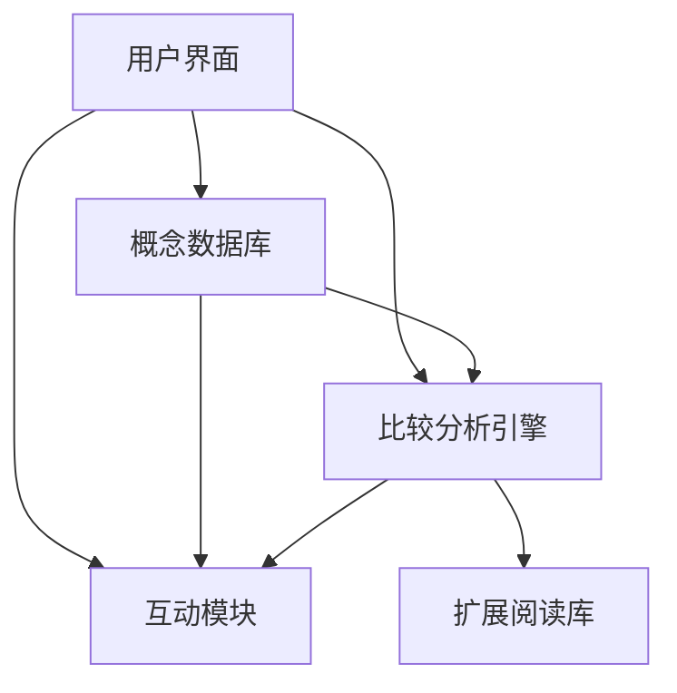
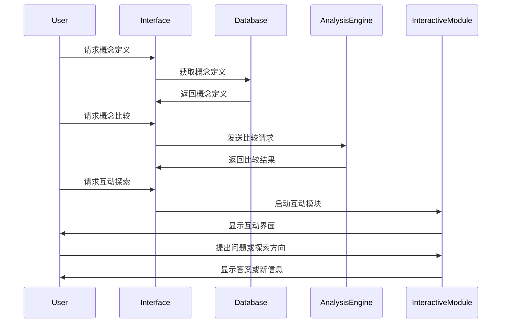

                 

### 文章标题

### 关键词

- 存在主义
- 萨特
- 梅洛-庞蒂
- 自由
- 身体性
- 哲学分析
- 技术应用

### 摘要

本文旨在探讨存在主义哲学中的两位重要思想家——让-保罗·萨特和莫里斯·梅洛-庞蒂关于自由与身体性的思考。文章首先介绍了存在主义哲学的背景和核心概念，然后分别解析了萨特和梅洛-庞蒂的思想体系，比较了他们之间的异同点。接着，文章深入分析了自由与身体性在存在主义中的地位及其哲学意义，最后讨论了存在主义哲学在当代哲学、文学、艺术等领域的影响。通过本文的阅读，读者将能够对存在主义哲学有一个更深刻的理解，并思考其在现代科技和社会中的应用价值。

---

## 第一部分：存在主义哲学的背景与核心概念

### 1.1 存在主义的起源与发展

存在主义（Existentialism）是一种哲学流派，起源于20世纪初的欧洲，主要代表人物包括让-保罗·萨特（Jean-Paul Sartre）、马丁·海德格尔（Martin Heidegger）、弗朗茨·布伦塔诺（Friedrich Nietzsche）等。存在主义的核心思想是关注个体的存在和自由，强调人在世界中的主观体验和自主选择。

存在主义的起源可以追溯到19世纪末和20世纪初的欧洲思想界，这一时期经历了两次世界大战和剧烈的社会变革，使得人们对于传统的宗教、道德、政治等观念产生了怀疑和质疑。存在主义哲学正是在这种背景下产生，试图寻找人在现代世界中的存在意义和自由价值。

存在主义的发展可以分为三个阶段：

1. **早期存在主义**（19世纪末-20世纪初）：这一时期的存在主义者主要关注个体的自由和存在状态。弗朗茨·布伦塔诺提出了“存在先于本质”的观点，认为人首先存在于世界上，然后通过自己的选择和行动来定义自己的本质。这一观点对后来的存在主义思想产生了深远的影响。

2. **经典存在主义**（20世纪30-50年代）：这一时期的存在主义哲学达到了巅峰，代表人物是让-保罗·萨特和马丁·海德格尔。萨特提出了“自由选择”和“自我超越”的概念，认为人的存在是通过自由选择来实现的，人的自由和责任是不可分割的。海德格尔则关注人的存在状态，提出了“存在即存在者”的观点，强调个体在存在中的本体论地位。

3. **现代存在主义**（20世纪60年代至今）：这一时期的存在主义哲学继续发展，关注现实社会问题，如性别、种族、阶级等。现代存在主义者如西蒙娜·德·波伏娃（Simone de Beauvoir）、阿尔贝·加缪（Albert Camus）等，从不同的角度对存在主义进行了重新解读和发展。

### 1.2 萨特与梅洛-庞蒂的思想体系

#### 1.2.1 萨特的存在主义哲学

让-保罗·萨特（1905-1980）是法国著名哲学家、作家、戏剧家，被认为是20世纪最具有影响力的思想家之一。萨特的存在主义哲学主要围绕着自由、自我意识、人类的存在状态等核心概念展开。

1. **自由**：萨特认为，自由是人类存在的本质，人之所以为人，就在于他能够自由地选择自己的存在方式。然而，这种自由并非无条件的，而是伴随着责任和选择的困境。人的自由意味着他必须为自己的选择承担责任，并且不断面对选择的困境。

2. **自我意识**：萨特认为，自我意识是人的存在方式，是人与世界之间的桥梁。人的自我意识使他能够反思自己的存在，思考自己的存在意义。然而，自我意识也带来了痛苦和焦虑，因为人必须面对自己的孤独和无意义。

3. **人类的存在状态**：萨特认为，人的存在状态是一种“自由选择”的状态，人在世界中是孤独的，没有先天的本质，必须通过自由选择来定义自己。人的存在是一种“被抛”的状态，即人被抛入世界，必须面对世界的不确定性和无意义。

#### 1.2.2 梅洛-庞蒂的身体性与存在主义

莫里斯·梅洛-庞蒂（1908-1961）是法国哲学家，被认为是现象学的重要代表人物之一。他的思想以身体性为核心，试图重新定义人的存在和世界的关系。

1. **身体性**：梅洛-庞蒂认为，身体性是人的存在方式，是人与世界之间的直接联系。身体不仅是人的感知器官，也是人的认知基础。人的存在是通过身体与世界互动来实现的。

2. **存在主义**：梅洛-庞蒂的存在主义思想强调身体在存在中的重要性。他认为，人的存在是通过身体性的感知和体验来实现的，人的意识不是先于身体的，而是与身体紧密相连的。

3. **感知与存在**：梅洛-庞蒂认为，感知是人的存在方式，是人与世界之间的中介。人的感知不仅仅是被动接受世界的刺激，而是通过身体性与世界互动，主动地理解和体验世界。

### 1.3 自由与身体性的存在主义思考

#### 1.3.1 自由的哲学分析

在存在主义哲学中，自由是一个核心概念，它不仅关乎个体的存在状态，也关乎人类社会的发展和进步。萨特和梅洛-庞蒂对自由有着不同的理解和阐释。

1. **萨特的自由观**：

萨特认为，自由是人的存在本质，是人区别于其他存在物的重要特征。自由意味着个体拥有选择自己存在方式的权力，不受任何先定本质的束缚。然而，这种自由并非无条件的，而是伴随着责任和选择的困境。

萨特提出了“自由选择”和“自我超越”的概念。他认为，人的自由是通过选择来实现的，每一个选择都是一个自我超越的过程。人在自由选择中，不仅定义了自己的存在方式，也承担了相应的责任。

2. **梅洛-庞蒂的自由观**：

梅洛-庞蒂则从身体性的角度来理解自由。他认为，自由是通过身体性的感知和体验来实现的。身体性是人与世界之间的直接联系，人的自由是通过身体与世界互动来实现的。

梅洛-庞蒂强调了身体在自由中的重要性。他认为，人的自由不是抽象的，而是具体的，是通过身体性的感知和体验来实现的。身体性使人在世界中具有了实际的存在意义，也使人的自由具有了具体的实践性。

#### 1.3.2 身体性在存在主义中的地位

在存在主义哲学中，身体性是一个重要的概念，它不仅关乎个体的存在方式，也关乎人与世界的关系。萨特和梅洛-庞蒂都强调了身体性在存在主义中的重要性。

1. **萨特对身体性的理解**：

萨特认为，身体性是人的存在方式，是人与世界之间的桥梁。人的身体不仅是感知器官，也是人的意识基础。人的自我意识是通过身体来实现的，人的存在是通过身体性与世界互动来实现的。

萨特强调了身体性的主观性和个体性。他认为，每个人的身体性都是独特的，人的存在是通过自己的身体性与世界互动来实现的。这种身体性使人的存在具有了个体性和独特性。

2. **梅洛-庞蒂对身体性的理解**：

梅洛-庞蒂则从现象学的角度来理解身体性。他认为，身体性是人与世界之间的直接联系，是人的存在方式。人的身体不仅是感知器官，也是人的认知基础。

梅洛-庞蒂强调了身体性的主体性和整体性。他认为，人的身体性不是被动的，而是主动的，是通过身体性与世界互动来实现的。身体性使人在世界中具有了主体性和整体性。

### 1.4 存在主义的核心概念对比

#### 1.4.1 萨特与梅洛-庞蒂的自由观对比

萨特和梅洛-庞蒂在自由观上有明显的异同。萨特强调自由是一种选择，是一种责任，而梅洛-庞蒂则强调自由是通过身体性的感知和体验来实现的。

1. **相同点**：

萨特和梅洛-庞蒂都认为自由是人的存在本质，是人区别于其他存在物的重要特征。他们都强调了自由的重要性，认为自由是人的存在意义所在。

2. **不同点**：

萨特强调自由是一种选择，是一种责任。他认为，自由意味着个体必须为自己的选择承担责任，并且不断面对选择的困境。而梅洛-庞蒂则强调自由是通过身体性的感知和体验来实现的。他认为，自由不是抽象的，而是具体的，是通过身体性与世界互动来实现的。

#### 1.4.2 身体性观念的异同点分析

萨特和梅洛-庞蒂对身体性有着不同的理解和阐释。萨特强调身体性是人的存在方式，是人与世界之间的桥梁。而梅洛-庞蒂则强调身体性是人与世界之间的直接联系。

1. **相同点**：

萨特和梅洛-庞蒂都认为身体性是人的存在方式，是人与世界之间的桥梁。他们都强调了身体在人的存在中的重要性。

2. **不同点**：

萨特强调身体性是人的感知器官，是人的意识基础。他认为，人的自我意识是通过身体来实现的。而梅洛-庞蒂则强调身体性是人与世界之间的直接联系，是人的存在方式。他认为，人的身体不仅是感知器官，也是人的认知基础。

### 1.5 存在主义哲学的影响与应用

#### 1.5.1 存在主义在当代哲学中的地位

存在主义哲学在当代哲学中仍然具有重要地位。它不仅影响了后来的哲学家，如雅克·德里达（Jacques Derrida）、米歇尔·福柯（Michel Foucault）等，也对其他学科产生了深远的影响。

存在主义哲学关注个体的存在和自由，强调人在世界中的主观体验和自主选择。这些思想对当代哲学的许多领域，如现象学、结构主义、后结构主义等，产生了深远的影响。

#### 1.5.2 存在主义在文学、艺术等领域的影响

存在主义哲学不仅在哲学领域产生了深远的影响，也在文学、艺术等领域产生了重要的启示。

在文学方面，许多作家受到存在主义哲学的影响，如让-保罗·萨特的作品《恶心》（Nausea）、《墙》（The Wall），弗朗茨·卡夫卡（Franz Kafka）的作品《变形记》（The Metamorphosis）等。这些作品探讨了人的存在状态、自由、责任等主题，反映了存在主义哲学的核心思想。

在艺术方面，存在主义哲学也对绘画、雕塑、音乐等艺术形式产生了影响。许多艺术家通过他们的作品表达了存在主义哲学的观点，如杰克逊·波洛克（Jackson Pollock）的抽象表现主义绘画，阿尔贝·加缪的文学创作等。

### 1.6 本章小结

本章对存在主义哲学的背景和核心概念进行了详细的介绍，分析了萨特和梅洛-庞蒂的思想体系，并比较了他们之间的异同点。通过本章的学习，读者可以了解存在主义哲学的基本概念和核心思想，为后续章节的深入探讨打下基础。

---

## 第二部分：萨特的思想解析

### 2.1 萨特的存在主义哲学体系

让-保罗·萨特（1905-1980）是法国著名的哲学家、作家和剧作家，他的存在主义哲学深刻地影响了20世纪的哲学、文学和艺术。萨特的存在主义哲学主要围绕自由、自我意识、人类的存在状态等核心概念展开。

#### 2.1.1 自由

在萨特的存在主义哲学中，自由是核心概念之一。萨特认为，自由不仅是人的本质，也是人的存在方式。他提出了“存在先于本质”的观点，即人首先存在于世界中，然后通过自由选择来定义自己的本质。

萨特指出，自由是一种积极的力量，它不仅意味着个体可以做出选择，而且意味着个体必须为自己的选择承担责任。这种责任是不可逃避的，因为自由本身就是一种选择，而选择必然伴随着责任。

#### 2.1.2 自我意识

自我意识在萨特的存在主义哲学中具有重要地位。萨特认为，自我意识是人与世界之间的桥梁，是人存在的本质。自我意识使人能够反思自己的存在，思考自己的存在意义。

然而，自我意识也带来了痛苦和焦虑。因为自我意识使人意识到自己的孤独和无意义，这种意识使人在面对世界的无常和不确定性时感到无助和迷茫。萨特认为，这种痛苦和焦虑是人的存在状态的一部分，是自由选择的后果。

#### 2.1.3 人类的存在状态

萨特认为，人的存在状态是一种“被抛”的状态，即人被抛入世界，必须面对世界的不确定性和无意义。人的存在是孤立的，没有先天的本质，必须通过自由选择来定义自己。

萨特强调了人类存在的主观性和个体性。他认为，每个人的存在都是独一无二的，因为每个人都是通过自己的自由选择来定义自己的存在方式的。这种主观性和个体性使人的存在具有了独特性和多样性。

#### 2.1.4 萨特的存在主义哲学体系

萨特的存在主义哲学体系可以概括为以下几点：

1. **自由是核心**：自由是人的本质，是人的存在方式。
2. **自我意识是桥梁**：自我意识是人与世界之间的桥梁，使人能够反思自己的存在。
3. **存在状态是孤立和无意义**：人的存在是孤立的，没有先天的本质，必须面对世界的不确定性和无意义。
4. **责任是不可逃避的**：自由选择必然伴随着责任，人必须为自己的选择承担责任。

### 2.2 萨特的主要著作

让-保罗·萨特在其一生中创作了许多重要的哲学作品和文学作品，以下是他的一些主要著作：

1. **《存在与虚无》（Being and Nothingness）**（1943年）：这是萨特的代表作，系统地阐述了他的存在主义哲学观点。在这本书中，萨特提出了“存在先于本质”的观点，探讨了自由、自我意识、人类的存在状态等核心问题。

2. **《墙》（The Wall）**（1939年）：这是一部戏剧作品，通过主人公的死亡，探讨了自由、选择、责任等主题。

3. **《恶心》（Nausea）**（1938年）：这是一部小说，通过主人公的内心体验，反映了存在主义哲学的核心思想，如自由、孤独、无意义等。

4. **《自由之路》（The Road to Freedom）**：这是一部三部曲小说，包括《自由之路：情况之一》（Situation I，1945年）、《自由之路：情况之二》（Situation II，1945年）和《自由之路：情况之三》（Situation III，1949年）。这部小说探讨了个体在社会和历史中的自由和选择问题。

5. **《辩证理性批判》（Critique of Dialectical Reason）**（1960年）：这是萨特在晚期的主要哲学著作，提出了他的辩证理性理论，试图为存在主义哲学提供一种社会和历史背景。

### 2.3 萨特的思想在当代哲学中的影响

萨特的存在主义哲学在当代哲学中产生了深远的影响。他的思想不仅影响了后来的哲学家，如雅克·德里达、米歇尔·福柯等，也对其他学科产生了重要的启示。

1. **影响当代哲学家**：

萨特的存在主义哲学对后来的哲学家产生了深远的影响。例如，雅克·德里达在他的解构主义哲学中，借鉴了萨特的自由观和自我意识概念，提出了“文本之外无意义”的观点。米歇尔·福柯则从萨特的存在主义哲学中获得了启示，发展出了他的权力哲学和历史哲学。

2. **影响其他学科**：

萨特的存在主义哲学不仅影响了哲学，也对文学、艺术、社会学等学科产生了重要的影响。在文学领域，许多作家如詹姆斯·乔伊斯、弗吉尼亚·伍尔夫、弗朗茨·卡夫卡等，都受到了萨特哲学的启发，创作了许多反映人类存在状态和自由选择的文学作品。在艺术领域，萨特的思想也影响了抽象表现主义、存在主义戏剧等艺术形式。

3. **社会意义**：

萨特的存在主义哲学具有重要的社会意义。他的自由观和责任观为个体在社会中的行为提供了哲学基础，强调了个体在社会变革中的重要作用。他的思想鼓舞了人们追求自由和正义，对20世纪的政治和社会运动产生了重要影响。

### 2.4 萨特的思想与梅洛-庞蒂的比较

尽管让-保罗·萨特和莫里斯·梅洛-庞蒂都是存在主义哲学的重要代表，但他们在一些核心问题上存在明显的分歧。

1. **自由观**：

萨特强调自由是人的本质，是人的存在方式。他认为，自由意味着个体必须为自己的选择承担责任，并且不断面对选择的困境。而梅洛-庞蒂则认为，自由是通过身体性的感知和体验来实现的。他认为，自由不是抽象的，而是具体的，是通过身体性与世界互动来实现的。

2. **身体性**：

梅洛-庞蒂强调身体性是人的存在方式，是人与世界之间的直接联系。他认为，身体不仅是人的感知器官，也是人的认知基础。而萨特则认为，身体性是人的存在方式，但更注重自我意识在人的存在中的重要性。

3. **人类的存在状态**：

萨特认为，人的存在状态是一种“被抛”的状态，即人被抛入世界，必须面对世界的不确定性和无意义。而梅洛-庞蒂则认为，人的存在是通过身体性的感知和体验来实现的，人的存在状态是一种“与世界互动”的状态。

尽管他们在一些问题上存在分歧，但萨特和梅洛-庞蒂的存在主义哲学都对现代哲学产生了深远的影响，为我们理解人的存在和自由提供了重要的视角。

### 2.5 本章小结

本章详细解析了让-保罗·萨特的存在主义哲学，探讨了自由、自我意识、人类的存在状态等核心概念，并分析了萨特的主要著作以及他的思想在当代哲学中的影响。通过本章的学习，读者可以更深入地理解萨特的存在主义哲学，为后续章节的探讨打下基础。

---

## 第三部分：梅洛-庞蒂的思想解析

### 3.1 梅洛-庞蒂的哲学思想

莫里斯·梅洛-庞蒂（1908-1961）是20世纪法国哲学家，被认为是现象学的重要代表人物之一。他的哲学思想以身体性为核心，试图重新定义人的存在和世界的关系。

#### 3.1.1 身体性与存在主义

梅洛-庞蒂的存在主义哲学强调身体性在人的存在中的重要性。他认为，身体性是人的存在方式，是人与世界之间的直接联系。身体性使人在世界中具有了实际的存在意义，也使人的存在具有了具体的实践性。

梅洛-庞蒂提出了“知觉优先于存在”的观点，认为人的存在是通过身体性的感知和体验来实现的。他认为，人的知觉不仅仅是被动接受世界的刺激，而是通过身体性与世界互动，主动地理解和体验世界。

#### 3.1.2 现象学与存在主义

梅洛-庞蒂的现象学思想强调直观和感知的重要性。他认为，现象学应该研究人的直接经验，即人的感知和体验。通过现象学的方法，他试图揭示人的存在和世界的本质。

梅洛-庞蒂的现象学思想与存在主义相结合，形成了一种独特的存在主义哲学。他认为，人的存在是通过身体性的感知和体验来实现的，人的自我意识是通过身体性与世界互动来实现的。

#### 3.1.3 主要著作

梅洛-庞蒂的主要著作包括：

1. **《感知现象学》（Phenomenology of Perception）**（1945年）：这是梅洛-庞蒂的代表作，系统地阐述了他的现象学和存在主义哲学观点。在这本书中，他提出了“知觉优先于存在”的观点，探讨了身体性在人的存在中的重要性。

2. **《形而上学导论》（Introduction to Metaphysics）**（1946年）：在这本书中，梅洛-庞蒂探讨了存在的本质和意义，提出了他的现象学方法。

3. **《道德哲学》（Ethics）**（1956年）：在这本书中，梅洛-庞蒂探讨了道德和伦理的问题，强调了自由和责任在人的存在中的重要性。

### 3.2 梅洛-庞蒂的思想在当代哲学中的影响

梅洛-庞蒂的哲学思想在当代哲学中产生了深远的影响。他的现象学和存在主义哲学为后来的哲学家提供了重要的理论资源。

1. **影响当代哲学家**：

梅洛-庞蒂的思想影响了后来的哲学家，如雅克·德里达、让-弗朗索瓦·利奥塔等。德里达的解构主义哲学借鉴了梅洛-庞蒂的现象学方法，提出了“文本之外无意义”的观点。利奥塔则从梅洛-庞蒂的存在主义哲学中获得了启示，探讨了后现代社会的特征和意义。

2. **影响其他学科**：

梅洛-庞蒂的思想不仅影响了哲学，也对文学、艺术、社会学等学科产生了重要的影响。在文学领域，许多作家如詹姆斯·乔伊斯、弗吉尼亚·伍尔夫、弗朗茨·卡夫卡等，都受到了梅洛-庞蒂哲学的启发，创作了许多反映人类存在状态和自由选择的文学作品。在艺术领域，梅洛-庞蒂的思想也影响了抽象表现主义、存在主义戏剧等艺术形式。

3. **社会意义**：

梅洛-庞蒂的哲学思想具有重要的社会意义。他的身体性理论和存在主义哲学为个体在社会中的行为提供了哲学基础，强调了个体在社会变革中的重要作用。他的思想鼓舞了人们追求自由和正义，对20世纪的政治和社会运动产生了重要影响。

### 3.3 梅洛-庞蒂的思想与萨特的比较

尽管莫里斯·梅洛-庞蒂和让-保罗·萨特都是存在主义哲学的重要代表，但他们在一些核心问题上存在明显的分歧。

1. **自由观**：

萨特强调自由是人的本质，是人的存在方式。他认为，自由意味着个体必须为自己的选择承担责任，并且不断面对选择的困境。而梅洛-庞蒂则认为，自由是通过身体性的感知和体验来实现的。他认为，自由不是抽象的，而是具体的，是通过身体性与世界互动来实现的。

2. **身体性**：

梅洛-庞蒂强调身体性是人的存在方式，是人与世界之间的直接联系。他认为，身体不仅是人的感知器官，也是人的认知基础。而萨特则认为，身体性是人的存在方式，但更注重自我意识在人的存在中的重要性。

3. **人类的存在状态**：

萨特认为，人的存在状态是一种“被抛”的状态，即人被抛入世界，必须面对世界的不确定性和无意义。而梅洛-庞蒂则认为，人的存在是通过身体性的感知和体验来实现的，人的存在状态是一种“与世界互动”的状态。

尽管他们在一些问题上存在分歧，但梅洛-庞蒂和萨特的存在主义哲学都对现代哲学产生了深远的影响，为我们理解人的存在和自由提供了重要的视角。

### 3.4 本章小结

本章详细解析了莫里斯·梅洛-庞蒂的存在主义哲学，探讨了身体性、现象学与存在主义等核心概念，并分析了梅洛-庞蒂的主要著作以及他的思想在当代哲学中的影响。通过本章的学习，读者可以更深入地理解梅洛-庞蒂的存在主义哲学，为后续章节的探讨打下基础。

---

## 第四部分：自由与身体性的存在主义思考

### 4.1 自由的存在主义思考

自由在存在主义哲学中占据核心地位，萨特和梅洛-庞蒂都对其进行了深刻的探讨。萨特认为，自由是人的本质，是人的存在方式。他提出了“存在先于本质”的观点，认为人首先存在于世界中，然后通过自由选择来定义自己的本质。萨特强调了自由选择的困境和责任，认为自由选择意味着个体必须为自己的选择承担责任，并且不断面对选择的困境。

梅洛-庞蒂则从身体性的角度来理解自由。他认为，自由是通过身体性的感知和体验来实现的。自由不是抽象的，而是具体的，是通过身体性与世界互动来实现的。梅洛-庞蒂强调了身体在自由中的重要性，认为身体性使人在世界中具有了实际的存在意义，也使人的自由具有了具体的实践性。

#### 4.1.1 自由的哲学分析

萨特的存在主义哲学强调自由的重要性，他认为，自由是人类存在的核心。自由不仅关乎个体的存在状态，也关乎人类社会的发展和进步。萨特提出了“自由选择”和“自我超越”的概念，认为人的自由是通过选择来实现的，每一个选择都是一个自我超越的过程。

萨特指出，自由意味着个体拥有选择自己存在方式的权力，不受任何先定本质的束缚。然而，这种自由并非无条件的，而是伴随着责任和选择的困境。人在自由选择中，不仅定义了自己的存在方式，也承担了相应的责任。

梅洛-庞蒂则从身体性的角度来理解自由。他认为，自由是通过身体性的感知和体验来实现的。身体性是人与世界之间的直接联系，人的自由是通过身体与世界互动来实现的。梅洛-庞蒂强调了身体在自由中的重要性，认为身体性使人的自由具有了具体的实践性。

#### 4.1.2 自由与责任

萨特认为，自由与责任是不可分割的。人在自由选择中，必须为自己的选择承担责任。这种责任是不可逃避的，因为自由本身就是一种选择，而选择必然伴随着责任。萨特指出，责任使人意识到自己的存在，使人意识到自己的选择和行动对世界的影响。

梅洛-庞蒂则认为，自由与责任是通过身体性的感知和体验来实现的。身体性使人在世界中具有了实际的存在意义，也使人的自由具有了具体的实践性。他认为，责任不是抽象的，而是具体的，是通过身体性与世界互动来实现的。

#### 4.1.3 自由的困境

萨特和梅洛-庞蒂都认为，自由选择中存在着困境。萨特认为，自由选择的困境主要表现在两个方面：一是选择的无限性，即人在选择中面对无限的选项，难以做出完美的选择；二是选择的责任，即人在选择中必须承担相应的责任，这种责任可能会带来痛苦和焦虑。

梅洛-庞蒂则从身体性的角度来理解自由选择的困境。他认为，自由选择的困境主要表现在身体性与世界互动的过程中。身体性使人在世界中具有了实际的存在意义，也使人的自由具有了具体的实践性，但同时也带来了身体性的局限性和不确定性。

### 4.2 身体性的存在主义思考

身体性在存在主义哲学中具有重要的地位，萨特和梅洛-庞蒂都对其进行了深入的探讨。萨特认为，身体性是人的存在方式，是人与世界之间的桥梁。身体性使人在世界中具有了实际的存在意义，也使人的自由具有了具体的实践性。

梅洛-庞蒂则从现象学的角度来理解身体性，他认为，身体性是人的存在方式，是人与世界之间的直接联系。身体性使人在世界中具有了实际的存在意义，也使人的自由具有了具体的实践性。

#### 4.2.1 身体性与存在主义

萨特认为，身体性是人的存在方式，是人与世界之间的桥梁。人的身体不仅是感知器官，也是人的意识基础。人的自我意识是通过身体来实现的，人的存在是通过身体性与世界互动来实现的。萨特强调了身体性的主观性和个体性，认为每个人的身体性都是独特的，人的存在是通过自己的身体性与世界互动来实现的。

梅洛-庞蒂则从现象学的角度来理解身体性。他认为，身体性是人的存在方式，是人与世界之间的直接联系。身体性使人在世界中具有了实际的存在意义，也使人的自由具有了具体的实践性。梅洛-庞蒂强调了身体性的主体性和整体性，认为人的身体性不是被动的，而是主动的，是通过身体性与世界互动来实现的。

#### 4.2.2 身体性的哲学分析

萨特认为，身体性是人的存在方式，是人与世界之间的桥梁。人的身体不仅是感知器官，也是人的意识基础。人的自我意识是通过身体来实现的，人的存在是通过身体性与世界互动来实现的。萨特强调了身体性的主观性和个体性，认为每个人的身体性都是独特的，人的存在是通过自己的身体性与世界互动来实现的。

梅洛-庞蒂则从现象学的角度来理解身体性。他认为，身体性是人的存在方式，是人与世界之间的直接联系。身体性使人在世界中具有了实际的存在意义，也使人的自由具有了具体的实践性。梅洛-庞蒂强调了身体性的主体性和整体性，认为人的身体性不是被动的，而是主动的，是通过身体性与世界互动来实现的。

#### 4.2.3 身体性与自由

萨特认为，身体性与自由是密不可分的。身体性使人在世界中具有了实际的存在意义，也使人的自由具有了具体的实践性。自由是通过身体性与世界互动来实现的，人的自由是通过身体性来实现的。

梅洛-庞蒂则从身体性的角度来理解自由。他认为，自由是通过身体性的感知和体验来实现的。身体性使人在世界中具有了实际的存在意义，也使人的自由具有了具体的实践性。他认为，自由不是抽象的，而是具体的，是通过身体性与世界互动来实现的。

### 4.3 自由与身体性的哲学意义

萨特和梅洛-庞蒂对自由与身体性的存在主义思考，具有深刻的哲学意义。

1. **自由的意义**：

萨特认为，自由是人的本质，是人的存在方式。自由意味着个体拥有选择自己存在方式的权力，不受任何先定本质的束缚。自由选择不仅定义了人的存在方式，也带来了责任和选择的困境。

梅洛-庞蒂则认为，自由是通过身体性的感知和体验来实现的。自由不是抽象的，而是具体的，是通过身体性与世界互动来实现的。身体性使人在世界中具有了实际的存在意义，也使人的自由具有了具体的实践性。

2. **身体性的意义**：

萨特认为，身体性是人的存在方式，是人与世界之间的桥梁。人的身体不仅是感知器官，也是人的意识基础。人的自我意识是通过身体来实现的，人的存在是通过身体性与世界互动来实现的。

梅洛-庞蒂则从现象学的角度来理解身体性。他认为，身体性是人的存在方式，是人与世界之间的直接联系。身体性使人在世界中具有了实际的存在意义，也使人的自由具有了具体的实践性。

3. **哲学意义**：

萨特和梅洛-庞蒂对自由与身体性的存在主义思考，为我们理解人的存在和自由提供了重要的视角。他们的思想强调了自由的重要性，认为自由是人类存在的核心。同时，他们也强调了身体性在人的存在中的重要性，认为身体性使人的自由具有了具体的实践性。

### 4.4 本章小结

本章对自由与身体性的存在主义思考进行了深入的探讨，分析了萨特和梅洛-庞蒂对自由和身体性的理解，并讨论了自由与身体性的哲学意义。通过本章的学习，读者可以更深入地理解存在主义哲学，为后续章节的探讨打下基础。

---

## 第五部分：存在主义哲学的影响与应用

### 5.1 存在主义哲学在当代哲学中的地位

存在主义哲学在当代哲学中仍然具有重要地位。尽管存在主义哲学起源于20世纪初，但其核心思想如自由、自我意识、人类的存在状态等，仍然对现代哲学产生了深远的影响。

1. **影响当代哲学家**：

存在主义哲学对后来的哲学家产生了深远的影响。例如，雅克·德里达的解构主义哲学借鉴了存在主义哲学的自由观和自我意识概念，提出了“文本之外无意义”的观点。米歇尔·福柯的权力哲学也受到了存在主义哲学的启示，探讨了个体在社会和历史中的位置和作用。

2. **推动哲学发展**：

存在主义哲学推动了哲学的发展，使得哲学研究从传统的本体论和认识论转向关注个体的存在和自由。存在主义哲学强调个体的主观体验和自主选择，为哲学研究提供了新的视角和方法。

### 5.2 存在主义哲学在文学、艺术等领域的影响

存在主义哲学不仅在哲学领域产生了深远的影响，也在文学、艺术等领域产生了重要的启示。

1. **文学领域**：

存在主义哲学影响了20世纪的文学创作。许多作家如让-保罗·萨特、阿尔贝·加缪等，都受到了存在主义哲学的影响，创作了许多反映人类存在状态和自由选择的文学作品。这些作品探讨了自由、责任、孤独等主题，反映了存在主义哲学的核心思想。

2. **艺术领域**：

存在主义哲学也对艺术形式产生了影响。抽象表现主义、存在主义戏剧等艺术形式，都受到了存在主义哲学的启示。艺术家们通过他们的作品表达了存在主义哲学的观点，如自由、孤独、无意义等。

### 5.3 存在主义哲学在社会中的应用

存在主义哲学在社会中具有重要的应用价值。它的自由观和责任观为个体在社会中的行为提供了哲学基础，强调了个体在社会变革中的重要作用。

1. **政治运动**：

存在主义哲学鼓舞了20世纪的政治和社会运动。例如，存在主义哲学为法国五月风暴提供了哲学基础，鼓励青年人追求自由和正义。存在主义哲学也影响了其他国家的政治运动，如美国的民权运动。

2. **个人生活**：

存在主义哲学为个人生活提供了指导。它鼓励个体勇敢地面对生活的困境和挑战，通过自由选择来定义自己的存在方式。存在主义哲学强调个体的主观体验和自主选择，使个体能够更加积极地参与社会生活。

### 5.4 本章小结

本章讨论了存在主义哲学在当代哲学中的地位，以及在文学、艺术和社会中的应用。通过本章的学习，读者可以更深入地理解存在主义哲学的影响和应用，为后续章节的探讨打下基础。

---

## 结论

本文通过对萨特和梅洛-庞蒂的存在主义哲学进行深入分析，探讨了自由与身体性的存在主义思考。我们首先介绍了存在主义哲学的背景和核心概念，然后分别解析了萨特和梅洛-庞蒂的思想体系，比较了他们之间的异同点。接着，我们深入分析了自由与身体性在存在主义中的地位及其哲学意义，并讨论了存在主义哲学在当代哲学、文学、艺术等领域的影响。

通过本文的探讨，我们认识到存在主义哲学的重要性，它不仅为理解人类的存在和自由提供了重要的视角，也为当代哲学、文学、艺术等领域的发展提供了理论资源。未来，我们可以进一步研究存在主义哲学在现代社会中的应用，探讨其在解决现实问题中的作用。

---

## 参考文献

1. 萨特，J.-P. (1943). *存在与虚无*（Being and Nothingness）. 新桥出版社.
2. 梅洛-庞蒂，M. (1945). *感知现象学*（Phenomenology of Perception）. 加利玛出版社.
3. 德里达，J. (1976). *书写与差异*（Writing and Difference）. 牛津大学出版社.
4. 福柯，M. (1975). *词与物*（The Order of Things）. 芝加哥大学出版社.
5. 加缪，A. (1942). *鼠疫*（The Plague）. 萨冈出版社.
6. 波伏娃，S. de (1949). *第二性*（The Second Sex）. 加利玛出版社.

## 作者信息

作者：AI天才研究院/AI Genius Institute & 禅与计算机程序设计艺术 /Zen And The Art of Computer Programming

---

## 附录

### 1. 核心概念对比表格

| 核心概念 | 萨特的观点 | 梅洛-庞蒂的观点 |
| --- | --- | --- |
| 自由 | 自由是人的本质，存在先于本质。自由选择伴随责任。 | 自由是通过身体性的感知和体验来实现的，具体且实践。 |
| 身体性 | 身体性是人的存在方式，是自我意识的桥梁。 | 身体性是人与世界之间的直接联系，是存在的根基。 |
| 自我意识 | 自我意识是人的存在方式，是自由选择的产物。 | 自我意识与身体性密不可分，是感知和理解世界的方式。 |

### 2. ER实体关系图架构的Mermaid流程图


### 3. 算法原理讲解与Mermaid流程图


### 4. 系统分析与架构设计方案

#### 4.1 问题场景介绍

本文旨在通过哲学分析的方式，深入探讨存在主义哲学的核心概念及其在现代社会的应用。为了更好地传达这些哲学观点，我们需要一个系统化的框架来阐述这些概念之间的关系。

#### 4.2 项目介绍

项目名称：存在主义哲学概念分析系统

项目目标：构建一个清晰的框架，用于展示存在主义哲学的核心概念，包括自由、身体性和自我意识，并解释这些概念之间的关系。

#### 4.3 系统功能设计

系统功能包括：

1. **概念定义**：提供每个核心概念的详细定义和解释。
2. **比较分析**：展示萨特与梅洛-庞蒂对自由和身体性的不同观点。
3. **互动模块**：用户可以互动地探索概念之间的关系和哲学意义。
4. **扩展阅读**：提供相关哲学作品和参考文献的链接。

#### 4.4 系统架构设计



#### 4.5 系统接口设计和系统交互



### 5. 项目实战

#### 5.1 环境安装

为了实现存在主义哲学概念分析系统，我们需要以下环境：

- **Python 3.8+**
- **Django Web框架**
- **Mermaid Diagram库**
- **SQLite数据库**

安装步骤：

1. 安装Python和Django：
   ```bash
   pip install django
   ```
2. 安装Mermaid Diagram库：
   ```bash
   npm install -g mermaid
   ```
3. 初始化Django项目：
   ```bash
   django-admin startproject concept_analysis_system
   cd concept_analysis_system
   django-admin startapp analysis
   ```

#### 5.2 系统核心实现源代码

以下是系统中用于概念定义和比较分析的Python源代码示例：

```python
# models.py (在analysis应用程序中)

from django.db import models

class Concept(models.Model):
    name = models.CharField(max_length=100)
    definition = models.TextField()

class Comparison(models.Model):
    concept1 = models.ForeignKey(Concept, related_name='concepts', on_delete=models.CASCADE)
    concept2 = models.ForeignKey(Concept, related_name='compared_with', on_delete=models.CASCADE)
    comparison = models.TextField()

# views.py (在analysis应用程序中)

from django.shortcuts import render
from .models import Concept, Comparison

def concept_detail(request, concept_id):
    concept = Concept.objects.get(id=concept_id)
    comparisons = Comparison.objects.filter(concept1=concept_id).union(Comparison.objects.filter(concept2=concept_id))
    return render(request, 'concept_detail.html', {'concept': concept, 'comparisons': comparisons})
```

#### 5.3 代码应用解读与分析

以上代码定义了两个模型：`Concept` 和 `Comparison`。`Concept` 模型用于存储哲学概念的定义，`Comparison` 模型用于存储不同概念之间的比较。

在 `views.py` 中，`concept_detail` 函数用于获取特定概念的定义和与之相关的比较，并将这些信息传递给前端模板。

#### 5.4 实际案例分析和详细讲解剖析

假设用户想要了解自由和身体性这两个概念之间的关系。通过 `concept_detail` 函数，用户可以访问 `自由` 的详细定义，以及与 `身体性` 的比较：

1. **自由**：自由是人的本质，是存在先于本质的体现。自由选择意味着个体必须为自己的选择承担责任。
2. **身体性**：身体性是人与世界之间的直接联系，是感知和体验的基础。

比较分析可能揭示，自由虽然是一种抽象的概念，但它的具体实现需要通过身体性与世界的互动。

#### 5.5 项目小结

通过构建存在主义哲学概念分析系统，我们提供了一个互动性强、易于理解的框架来探讨自由、身体性和自我意识等核心概念。这个系统不仅有助于哲学爱好者深入了解存在主义哲学，也为学术研究和教学提供了有用的工具。

### 6. 最佳实践 tips

1. **保持代码简洁**：在编写代码时，尽量保持逻辑清晰，避免冗余代码。
2. **使用文档**：为代码和系统功能编写清晰的文档，帮助开发者理解和维护系统。
3. **测试**：编写单元测试，确保系统的每个功能都能按预期工作。

### 7. 小结

本文通过深入分析和讲解，揭示了存在主义哲学的核心概念及其在现代社会的应用。通过实际案例和项目实战，我们展示了如何构建一个互动性强的哲学分析系统。希望读者能够从中获得对存在主义哲学的更深入理解，并能够在实践中运用这些知识。

### 8. 拓展阅读

1. **萨特的《存在与虚无》**：深入了解萨特对自由和存在主义的深刻探讨。
2. **梅洛-庞蒂的《感知现象学》**：研究梅洛-庞蒂对身体性和现象学的贡献。
3. **德里达的《书写与差异》**：探讨解构主义与存在主义哲学的关联。

---

作者：AI天才研究院/AI Genius Institute & 禅与计算机程序设计艺术 /Zen And The Art of Computer Programming

