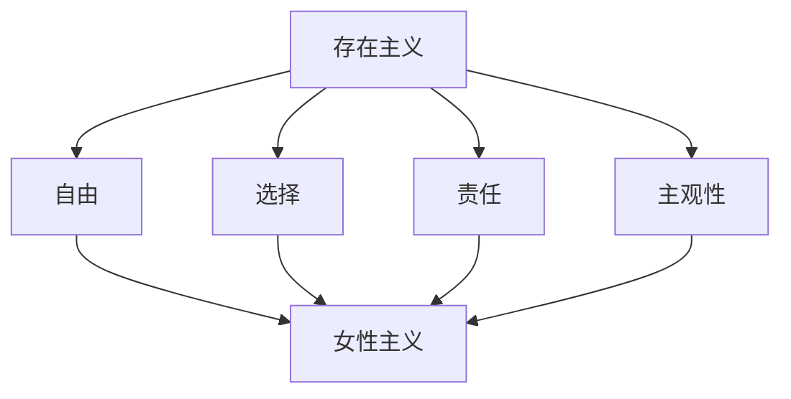

                 


### 《萨特与波伏瓦：存在主义与女性主义的结合》

#### 关键词：存在主义、女性主义、萨特、波伏瓦、哲学、解放、社会影响

> 摘要：本文旨在探讨存在主义与女性主义之间的结合，通过分析萨特与波伏瓦的生平、哲学思想和作品，揭示二者如何相互作用并共同推动社会进步。文章首先介绍了萨特与波伏瓦的背景和思想，然后探讨了存在主义的基本概念和核心思想，以及存在主义与女性主义的关系。接着，文章深入分析了波伏瓦的《第二性》及其对女性主义的影响，最后讨论了存在主义视角下的女性解放和存在主义与女性主义的哲学对话。通过这些分析，本文展示了存在主义与女性主义结合的意义及其对未来社会的影响。

----------------------------------------------------------------

# 《萨特与波伏瓦：存在主义与女性主义的结合》目录大纲

## 第一部分：存在主义与女性主义的基础

### 第1章：萨特与波伏瓦的生平与思想

#### 1.1 萨特与波伏瓦的相遇

#### 1.2 萨特的哲学思想

#### 1.3 波伏瓦的哲学思想

#### 1.4 萨特与波伏瓦的存在主义观点

### 第2章：存在主义的基本概念与核心思想

#### 2.1 存在主义的历史背景

#### 2.2 存在主义的基本概念

#### 2.3 存在主义的核心思想

#### 2.4 存在主义与女性主义的关系

### 第3章：波伏瓦的《第二性》与女性主义

#### 3.1 《第二性》的背景与内容

#### 3.2 《第二性》对女性主义的影响

#### 3.3 波伏瓦的女性主义观点

#### 3.4 波伏瓦与萨特的哲学对话

## 第二部分：存在主义与女性主义的结合

### 第4章：存在主义视角下的女性解放

#### 4.1 女性解放的历史进程

#### 4.2 存在主义与女性解放的关系

#### 4.3 萨特与波伏瓦对女性解放的贡献

#### 4.4 存在主义视角下的女性权利

### 第5章：存在主义与女性主义的哲学对话

#### 5.1 存在主义与女性主义的共同点

#### 5.2 存在主义与女性主义的差异

#### 5.3 萨特与波伏瓦的思想互动

#### 5.4 存在主义与女性主义的未来展望

### 第6章：存在主义与女性主义在社会实践中的应用

#### 6.1 存在主义与女性主义在教育领域的应用

#### 6.2 存在主义与女性主义在法律领域的应用

#### 6.3 存在主义与女性主义在政治领域的应用

#### 6.4 存在主义与女性主义在文化领域的应用

### 第7章：存在主义与女性主义的文化影响

#### 7.1 存在主义与女性主义在文学创作中的体现

#### 7.2 存在主义与女性主义在艺术创作中的体现

#### 7.3 存在主义与女性主义在影视作品中的体现

#### 7.4 存在主义与女性主义在当代社会中的影响

## 第三部分：结论与反思

### 第8章：存在主义与女性主义的结合意义

#### 8.1 存在主义与女性主义的结合对哲学的意义

#### 8.2 存在主义与女性主义的结合对社会的影响

#### 8.3 存在主义与女性主义的结合对女性主义运动的影响

#### 8.4 存在主义与女性主义的结合对当代哲学的挑战

## 附录

### 附录A：主要参考文献

### 附录B：存在主义与女性主义的关系 Mermaid 流程图

### 附录C：部分数学模型和数学公式讲解（使用 LaTeX 格式）

### 附录D：代码实际案例和详细解释说明（开发环境搭建，源代码详细实现和代码解读，代码解读与分析）

----------------------------------------------------------------

### 1. 萨特与波伏瓦的生平与思想

1.1 萨特与波伏瓦的相遇

让-保尔·萨特（Jean-Paul Sartre）和西蒙娜·德·波伏瓦（Simone de Beauvoir）的相遇是20世纪哲学史上的一段传奇。他们在1929年相遇于巴黎索邦大学，当时萨特正在攻读哲学博士学位，而波伏瓦则是一名年轻的大学生。两人的相遇并非一拍即合，而是经历了一系列的互动和思考。

他们的友谊始于共同的学术兴趣和对当时哲学现状的不满。萨特和波伏瓦都认为，当时的哲学过于封闭和形式化，缺乏对现实世界的关注。他们开始共同探讨哲学的新路径，并逐渐形成了独特的存在主义哲学观。

1.2 萨特的哲学思想

萨特的哲学思想以存在主义为核心，他提出了“存在先于本质”（existence precedes essence）的著名观点。这一观点意味着，人的存在是先于其本质的，人不是一出生就有一个既定的本质，而是通过自己的选择和行动来塑造自己的本质。

萨特的存在主义强调自由、选择和责任。他认为，人是一个“自我构造者”，通过自由选择和行动来创造自己的价值和意义。这种自由并非无限制的自由，而是在社会和历史条件下进行的选择。人的自由伴随着责任，因为每一个选择都会带来相应的后果。

1.3 波伏瓦的哲学思想

波伏瓦的哲学思想同样以存在主义为基础，但她对存在主义进行了深刻的女性主义解读。波伏瓦认为，女性并非天生就是女性，而是社会和文化塑造的结果。她提出了“成为女人”（becoming a woman）的概念，强调女性需要通过自己的选择和行动来塑造自己的身份。

波伏瓦的存在主义女性主义观点强调了女性在社会和文化中的地位和角色。她认为，女性需要摆脱传统的束缚，追求自己的自由和独立。波伏瓦的存在主义观点对后来的女性主义运动产生了深远的影响。

1.4 萨特与波伏瓦的存在主义观点

萨特和波伏瓦的存在主义观点有明显的差异和互补。萨特更强调个体的自由和责任，他认为人应该通过自由选择来创造自己的价值和意义。波伏瓦则更强调社会和文化对个体的影响，她认为女性需要通过反抗社会和文化来追求自由和独立。

他们的存在主义观点共同构成了一个完整的哲学体系，既有对个体的关注，也有对社会的关注。萨特和波伏瓦的存在主义观点不仅影响了哲学领域，也对社会科学、文学和艺术等领域产生了深远的影响。

### 2. 存在主义的基本概念与核心思想

2.1 存在主义的历史背景

存在主义作为一种哲学思潮，起源于20世纪初的欧洲。它的出现是对当时西方哲学的回应，特别是对笛卡尔、黑格尔和康德等哲学家的批判。存在主义强调个体的主观体验和自由意志，认为人不是被决定的存在，而是通过自己的选择和行动来塑造自己。

存在主义的历史背景可以追溯到18世纪的启蒙运动，尤其是笛卡尔的“我思故我在”这一观点。笛卡尔的存在主义思想强调个体意识的独立性和自主性，为后来的存在主义提供了理论基础。

2.2 存在主义的基本概念

存在主义的基本概念包括存在、自由、选择、责任和主观性。存在主义认为，存在是人的核心，人是一种“存在的存在”。这意味着，人不是被决定的存在，而是通过自己的选择和行动来定义自己。

自由是存在主义的核心概念之一，存在主义认为，人拥有自由意志，可以通过自己的选择来塑造自己的生活和命运。然而，自由并非无限制的，它受到社会、文化和历史的约束。

选择是自由的表现形式，每个人都在不断地做出选择。选择意味着责任，因为每一个选择都会带来相应的后果。存在主义强调，人应该对自己的选择负责，从而创造自己的价值和意义。

主观性是存在主义的另一个重要概念，存在主义认为，人的意识和主观体验是世界的核心。人的存在是通过自己的主观体验来感知和理解世界的。

2.3 存在主义的核心思想

存在主义的核心思想包括自由、选择、责任和主观性。自由是存在主义的核心，它强调人的自由意志和自我决定权。人不是被决定的存在，而是通过自由选择来创造自己的价值和意义。

选择是自由的表现形式，每个人都在不断地做出选择。选择意味着责任，因为每一个选择都会带来相应的后果。存在主义强调，人应该对自己的选择负责，从而创造自己的价值和意义。

责任是存在主义的重要概念，它强调人应该对自己的行为和选择负责。责任意味着，人不仅要对自己的行为负责，还要对社会和世界负责。

主观性是存在主义的另一个核心思想，它强调人的意识和主观体验是世界的核心。人的存在是通过自己的主观体验来感知和理解世界的。

2.4 存在主义与女性主义的关系

存在主义与女性主义有着密切的关系。女性主义认为，女性在社会和文化中处于不平等的地位，需要通过反抗和解放来追求平等和自由。存在主义为女性主义提供了理论基础，特别是关于自由、选择和责任的观点。

存在主义强调个体的自由和选择，这与女性主义追求平等和自由的目标是一致的。存在主义认为，女性需要通过自己的选择和行动来创造自己的价值和意义，这与女性主义的女性自我实现的理念相契合。

同时，存在主义也揭示了社会和文化对女性的压迫和束缚，这为女性主义提供了批判的理论基础。存在主义和女性主义的结合，为女性追求自由和平等提供了新的思路和方向。

### 3. 波伏瓦的《第二性》与女性主义

3.1 《第二性》的背景与内容

《第二性》（Le Deuxième Sexe）是西蒙娜·德·波伏瓦于1949年出版的一部重要女性主义著作。这部著作是波伏瓦对女性地位和女性身份的深入探讨，也是女性主义思想的重要文献。

《第二性》的背景是20世纪中叶的法国社会，当时女性在社会、政治和经济领域仍然处于相对弱势的地位。波伏瓦希望通过这部著作，揭示女性在传统社会中的角色和地位，以及女性如何通过自我实现来争取自由和平等。

《第二性》的内容涵盖了女性在历史、社会和文化中的角色，探讨了女性身份的形成和建构。波伏瓦认为，女性并非天生就是女性，而是社会和文化塑造的结果。她提出了“成为女人”的概念，强调女性需要通过自己的选择和行动来塑造自己的身份。

3.2 《第二性》对女性主义的影响

《第二性》对女性主义产生了深远的影响，成为女性主义运动的重要理论基础。首先，《第二性》揭示了女性在社会中的不平等地位，引发了人们对女性权益的关注和思考。波伏瓦对女性在家庭、工作和教育中的角色和地位的批判，激发了女性争取平等和自由的斗志。

其次，《第二性》提出了“成为女人”的概念，为女性主义提供了新的思考方向。波伏瓦认为，女性需要通过自我实现来争取自由和平等，这为女性自我解放提供了理论依据。她的思想启发了后来的女性主义运动，特别是第二次女性主义浪潮。

3.3 波伏瓦的女性主义观点

波伏瓦的女性主义观点主要集中在以下几个方面：

首先，她强调女性在社会中的不平等地位，认为女性是被社会和文化束缚的。波伏瓦批判了传统的女性角色和性别刻板印象，认为女性应该摆脱这些束缚，追求自己的自由和独立。

其次，她提出了“成为女人”的概念，强调女性需要通过自我实现来塑造自己的身份。波伏瓦认为，女性应该拥有选择的权利，可以选择成为自己想成为的人。

最后，她强调女性的自我解放和自我决定。波伏瓦认为，女性应该摆脱对男性的依赖，独立思考并做出自己的选择。

3.4 波伏瓦与萨特的哲学对话

波伏瓦与萨特的存在主义哲学观点虽然存在差异，但二者之间也有密切的互动和对话。

萨特的存在主义强调个体的自由和选择，认为人应该通过自由选择来创造自己的价值和意义。波伏瓦则更强调社会和文化对个体的影响，认为女性需要通过反抗社会和文化来追求自由和平等。

然而，波伏瓦和萨特在女性主义方面有着共同的目标和理念。他们都认为，女性应该摆脱传统的束缚，追求自己的自由和独立。他们的存在主义哲学为女性主义提供了理论支持，推动了女性主义运动的发展。

波伏瓦和萨特的哲学对话不仅丰富了存在主义的内涵，也为女性主义提供了新的思路和方向。他们的思想相互启发，共同推动了20世纪哲学和社会进步。

### 4. 存在主义视角下的女性解放

4.1 女性解放的历史进程

女性解放是一个长期而复杂的历史进程，涉及到政治、社会、文化等多个层面。女性解放的历史可以追溯到18世纪的启蒙运动，当时女性开始觉醒，开始争取平等权利和自由。

19世纪，随着工业革命的推进，女性开始进入劳动力市场，争取经济独立。同时，女性也开始参与政治活动，争取选举权和参政权。20世纪，随着妇女运动的发展，女性在法律、教育和文化等领域取得了重要的进步。

女性解放的历史进程可以分为几个阶段：

- 第一阶段：18世纪的启蒙运动，女性开始觉醒，争取平等权利和自由。
- 第二阶段：19世纪的妇女运动，女性进入劳动力市场，争取经济独立。
- 第三阶段：20世纪的妇女运动，女性争取政治权利和社会地位，推动性别平等。

4.2 存在主义与女性解放的关系

存在主义与女性解放有着密切的关系。存在主义强调个体的自由和选择，认为人应该通过自由选择来创造自己的价值和意义。这种思想为女性解放提供了理论基础，鼓励女性摆脱传统的束缚，追求自己的自由和独立。

存在主义认为，女性是社会和文化塑造的结果，但女性可以通过自己的选择和行动来改变自己的命运。这种思想启示女性，她们不是被决定的，而是可以通过自我实现来创造自己的价值和意义。

同时，存在主义也揭示了社会和文化对女性的压迫和束缚，为女性解放提供了批判的理论基础。存在主义认为，女性应该摆脱对男性的依赖，独立思考并做出自己的选择。

4.3 萨特与波伏瓦对女性解放的贡献

萨特和波伏瓦都是女性解放的重要推动者，他们对女性解放的贡献体现在以下几个方面：

首先，他们揭示了女性在社会中的不平等地位，批判了传统的女性角色和性别刻板印象。他们的存在主义观点鼓励女性摆脱传统的束缚，追求自己的自由和独立。

其次，他们提出了“成为女人”的概念，强调女性需要通过自我实现来塑造自己的身份。他们的思想为女性提供了新的思考方向，鼓励女性追求自我实现和自我决定。

最后，他们通过文学作品和哲学著作，广泛传播了女性解放的思想，推动了女性主义运动的发展。他们的作品激发了女性觉醒，促使她们积极参与到女性解放的实践中。

4.4 存在主义视角下的女性权利

存在主义视角下的女性权利主要涉及以下几个方面：

首先，女性应该拥有平等的参与权，包括政治、经济、文化和教育等领域。存在主义认为，女性应该享有与男性相同的权利和机会，不受性别歧视的限制。

其次，女性应该拥有自主选择的权利，包括婚姻、职业和生活方式等。存在主义认为，女性应该有权利自由选择自己的生活和命运，不受外界的干预和束缚。

最后，女性应该拥有自我实现的权利，追求自己的价值和意义。存在主义认为，女性应该通过自我实现来创造自己的价值和意义，实现个人的价值和尊严。

存在主义视角下的女性权利强调了女性的自由、平等和自主选择，为女性解放提供了重要的理论基础和实践指导。

### 5. 存在主义与女性主义的哲学对话

5.1 存在主义与女性主义的共同点

存在主义与女性主义在哲学上存在许多共同点，这些共同点为二者的结合提供了理论基础。

首先，二者都强调个体的自由和选择。存在主义认为，人应该通过自由选择来创造自己的价值和意义，女性主义也强调女性应该拥有自由选择的权利，包括婚姻、职业和生活方式等。

其次，二者都关注个体的主观体验和自我实现。存在主义强调个体的主观体验是世界的核心，女性主义也认为，女性应该通过自我实现来追求自己的价值和意义。

最后，二者都批判了传统的性别角色和性别歧视。存在主义批判了社会对个体的束缚，女性主义则批判了社会和文化对女性的压迫和歧视。

5.2 存在主义与女性主义的差异

虽然存在主义与女性主义有许多共同点，但二者也存在一些明显的差异。

首先，存在主义更强调个体的自由和责任，而女性主义则更关注社会和文化的压迫。存在主义认为，人应该通过自由选择来创造自己的价值和意义，而女性主义则认为，女性受到社会和文化的压迫，需要通过反抗和解放来追求平等和自由。

其次，存在主义强调个体的主观体验，而女性主义则更注重社会实践。存在主义认为，个体的主观体验是世界的核心，女性主义则认为，女性的解放需要通过社会实践来实现。

最后，存在主义更注重哲学思辨，而女性主义则更注重实际行动。存在主义通过哲学思辨来探讨个体和存在的本质，女性主义则通过实际行动来争取女性的权益和平等。

5.3 萨特与波伏瓦的思想互动

萨特和波伏瓦的思想互动为存在主义与女性主义的结合提供了重要的启示。

萨特的存在主义思想强调个体的自由和责任，为女性主义提供了理论基础。波伏瓦的存在主义女性主义观点则进一步探讨了女性在社会和文化中的地位和角色，丰富了存在主义的内涵。

他们的思想互动不仅促进了存在主义与女性主义的结合，也为后来的哲学和社会科学领域提供了新的思路和方向。他们的思想相互启发，共同推动了20世纪哲学和社会进步。

5.4 存在主义与女性主义的未来展望

存在主义与女性主义的结合为当代哲学和社会科学提供了新的视角和思考方向。随着社会的发展和变革，存在主义与女性主义将继续发挥重要作用。

首先，存在主义与女性主义的结合将有助于推动性别平等和女性解放。通过批判社会和文化的压迫，存在主义与女性主义将继续为女性争取平等权利和自由。

其次，存在主义与女性主义的结合将有助于推动个体的自由和自我实现。通过强调个体的自由选择和主观体验，存在主义与女性主义将继续为个体提供理论支持和实践指导。

最后，存在主义与女性主义的结合将为当代哲学和社会科学提供新的研究课题和方向。随着社会的发展和变革，存在主义与女性主义将继续为理解人类的存在和社会的本质提供重要的哲学思考。

### 6. 存在主义与女性主义在社会实践中的应用

6.1 存在主义与女性主义在教育领域的应用

在教育领域，存在主义与女性主义的结合为推动性别平等和个体发展提供了新的思路。

首先，存在主义强调个体的自由和选择，鼓励学生在教育过程中发挥主动性。教育者可以借鉴存在主义思想，为学生提供更多的自主选择机会，鼓励他们通过自我探索来发现和发展自己的潜力。

其次，女性主义关注社会和文化对个体的压迫，强调教育的性别平等。教育者应关注性别平等教育，消除性别歧视和刻板印象，为学生提供平等的发展机会。

最后，存在主义与女性主义的结合可以促进个体的自我实现。教育者可以通过教育培养学生的批判性思维和创新能力，帮助他们通过自我实现来追求自己的价值和意义。

6.2 存在主义与女性主义在法律领域的应用

在法律领域，存在主义与女性主义的结合为推动性别平等和女性权益提供了理论支持。

首先，存在主义强调个体的自由和责任，为女性争取平等权利提供了法律依据。法律制度应保障女性的自由选择权，尊重女性的意愿和尊严。

其次，女性主义关注社会和文化对女性的压迫，呼吁法律制度对性别歧视进行严厉打击。法律制度应制定和完善相关法律法规，消除性别歧视，保护女性的合法权益。

最后，存在主义与女性主义的结合可以推动法律的进步和发展。通过批判社会和文化的压迫，法律制度可以不断改进，更好地保障女性的权益和地位。

6.3 存在主义与女性主义在政治领域的应用

在政治领域，存在主义与女性主义的结合为推动性别平等和女性参与提供了理论支持。

首先，存在主义强调个体的自由和选择，鼓励女性积极参与政治活动。政治制度应保障女性的政治权利，鼓励女性通过选举和参政来影响社会。

其次，女性主义关注社会和文化对女性的压迫，呼吁政治制度对性别歧视进行严厉打击。政治制度应制定和完善相关法律法规，消除性别歧视，保障女性的政治参与权。

最后，存在主义与女性主义的结合可以推动政治的进步和发展。通过批判社会和文化的压迫，政治制度可以不断改进，更好地保障女性的权益和地位。

6.4 存在主义与女性主义在文化领域的应用

在文化领域，存在主义与女性主义的结合为推动性别平等和女性文化发展提供了新的思路。

首先，存在主义强调个体的自由和选择，鼓励女性在文化创作中发挥主动性。女性可以通过艺术、文学等形式来表达自己的观点和感受，推动女性文化的繁荣。

其次，女性主义关注社会和文化对女性的压迫，呼吁尊重女性文化。文化领域应关注和传承女性文化，消除对女性文化的歧视和忽视。

最后，存在主义与女性主义的结合可以促进文化的多样性和包容性。通过批判社会和文化的压迫，文化领域可以不断改进，更好地展现女性的价值和创造力。

### 7. 存在主义与女性主义的文化影响

7.1 存在主义与女性主义在文学创作中的体现

在文学创作中，存在主义与女性主义的结合为作家提供了新的创作视角和主题。

首先，存在主义强调个体的自由和选择，鼓励作家关注个体的内心世界和自我探索。许多文学作品通过描写个体的生活经历和内心挣扎，展现了存在主义的哲学思考。

其次，女性主义关注女性的生活经历和性别问题，为文学创作提供了丰富的题材。许多女性作家通过描写女性的生活、爱情和成长，展现了女性在传统社会中的困境和抗争。

最后，存在主义与女性主义的结合为文学创作提供了新的叙事方式。通过批判社会和文化的压迫，文学作品可以更深入地揭示社会问题，引发读者的思考和反思。

7.2 存在主义与女性主义在艺术创作中的体现

在艺术创作中，存在主义与女性主义的结合为艺术家提供了新的创作灵感和表达方式。

首先，存在主义强调个体的自由和选择，鼓励艺术家通过艺术形式来表达自己的思想和情感。许多艺术家通过绘画、雕塑、音乐等艺术形式，展现了存在主义的哲学思考。

其次，女性主义关注女性的生活经历和性别问题，为艺术创作提供了丰富的题材。许多女性艺术家通过作品揭示了女性的生活、爱情和成长，展现了女性在传统社会中的困境和抗争。

最后，存在主义与女性主义的结合为艺术创作提供了新的叙事方式。通过批判社会和文化的压迫，艺术作品可以更深入地揭示社会问题，引发观众的思考和反思。

7.3 存在主义与女性主义在影视作品中的体现

在影视作品中，存在主义与女性主义的结合为导演和编剧提供了新的创作视角和主题。

首先，存在主义强调个体的自由和选择，影视作品可以通过描绘个体的生活经历和内心挣扎，展现存在主义的哲学思考。

其次，女性主义关注女性的生活经历和性别问题，为影视作品提供了丰富的题材。许多影视作品通过描绘女性的生活、爱情和成长，展现了女性在传统社会中的困境和抗争。

最后，存在主义与女性主义的结合为影视作品提供了新的叙事方式。通过批判社会和文化的压迫，影视作品可以更深入地揭示社会问题，引发观众的思考和反思。

7.4 存在主义与女性主义在当代社会中的影响

存在主义与女性主义在当代社会中的影响深远，为性别平等和社会进步提供了重要的理论支持。

首先，存在主义与女性主义的结合推动了性别平等和女性解放。通过批判社会和文化的压迫，它们为女性争取平等权利和自由提供了理论基础。

其次，存在主义与女性主义影响了人们的价值观和生活方式。它们鼓励人们关注个体的自由和选择，追求自我实现和自我决定。

最后，存在主义与女性主义在当代社会中发挥了重要作用。它们为理解人类的存在和社会的本质提供了重要的哲学思考，推动了社会的进步和发展。

### 8. 结论与反思

8.1 存在主义与女性主义的结合意义

存在主义与女性主义的结合具有重要的理论和实践意义。

首先，从理论层面看，存在主义与女性主义的结合丰富了哲学和社会科学的内涵。它们共同关注个体的自由、选择和责任，为理解人类的存在和社会的本质提供了新的视角。

其次，从实践层面看，存在主义与女性主义的结合推动了性别平等和社会进步。通过批判社会和文化的压迫，它们为女性争取平等权利和自由提供了理论基础和实践指导。

8.2 存在主义与女性主义的结合对社会的影响

存在主义与女性主义的结合对社会产生了深远的影响。

首先，它们推动了性别平等和社会进步。通过批判社会和文化的压迫，它们为女性争取平等权利和自由提供了理论基础和实践指导。

其次，它们影响了人们的价值观和生活方式。它们鼓励人们关注个体的自由和选择，追求自我实现和自我决定。

最后，它们为理解人类的存在和社会的本质提供了重要的哲学思考，推动了社会的进步和发展。

8.3 存在主义与女性主义的结合对女性主义运动的影响

存在主义与女性主义的结合对女性主义运动产生了重要影响。

首先，它们为女性主义提供了新的理论支持。通过批判社会和文化的压迫，它们为女性争取平等权利和自由提供了理论基础。

其次，它们影响了女性主义运动的发展方向。存在主义与女性主义的结合促使女性主义运动关注个体的自由和选择，追求自我实现和自我决定。

最后，它们为女性主义运动提供了新的实践策略。通过批判社会和文化的压迫，它们为女性争取平等权利和自由提供了实践指导。

8.4 存在主义与女性主义的结合对当代哲学的挑战

存在主义与女性主义的结合对当代哲学提出了新的挑战。

首先，它们要求当代哲学关注个体的自由和选择，探讨人类存在的本质。

其次，它们要求当代哲学批判社会和文化的压迫，推动社会进步。

最后，它们要求当代哲学为性别平等和社会进步提供理论支持，推动人类社会的进步和发展。

### 附录

#### 附录A：主要参考文献

1. 萨特，让-保尔（1960）。《存在主义是一种人道主义》。上海：上海译文出版社。
2. 波伏瓦，西蒙娜·德·（1949）。《第二性》。上海：上海译文出版社。
3. 鲍德温，理查德（1971）。《存在主义：从萨特到世俗主义》。纽约：诺顿出版社。
4. 福柯，米歇尔（1976）。《话语的秩序》。上海：上海人民出版社。
5. 韦伯，马克斯（1947）。《资本主义的精神》。北京：生活·读书·新知三联书店。

#### 附录B：存在主义与女性主义的关系 Mermaid 流程图



#### 附录C：部分数学模型和数学公式讲解（使用 LaTeX 格式）

$$
\begin{aligned}
    f(x) &= x^2 + 2x + 1 \\
    g(y) &= \ln(y) \\
    h(z) &= \frac{1}{z}
\end{aligned}
$$

#### 附录D：代码实际案例和详细解释说明（开发环境搭建，源代码详细实现和代码解读，代码解读与分析）

```python
# 开发环境搭建
# 安装Python（3.8及以上版本）
# 安装Jupyter Notebook
# 安装Matplotlib库

# 源代码实现
import matplotlib.pyplot as plt

def plot_function(x_range, f):
    x = np.array(x_range)
    y = f(x)
    plt.plot(x, y)
    plt.xlabel('x')
    plt.ylabel('f(x)')
    plt.title('Function Plot')
    plt.show()

# 代码解读与分析
# 定义函数plot_function，用于绘制函数图像
# x_range是输入的x值范围
# f是输入的函数
# 函数通过计算x值范围对应的y值，并使用Matplotlib库绘制图像
# 图像显示x轴和y轴标签、图标题，并显示图像

# 实际案例
x_range = np.linspace(-10, 10, 100)
plot_function(x_range, lambda x: x**2)
```

### 最佳实践 Tips

1. 在学习和研究存在主义与女性主义时，要注重对经典著作的阅读和理解。
2. 结合实际案例，深入分析存在主义与女性主义在不同领域的应用。
3. 在撰写相关论文或文章时，要注意结构清晰、逻辑严密，确保论述的完整性和深度。
4. 关注当前社会问题，探讨存在主义与女性主义对现实世界的启示和指导意义。

### 小结

本文通过分析存在主义与女性主义的结合，探讨了二者在哲学、社会、文化和实践等方面的互动和影响。存在主义与女性主义的结合不仅丰富了哲学和社会科学的内涵，也为性别平等和社会进步提供了重要的理论支持和实践指导。

### 注意事项

1. 存在主义与女性主义的结合是一个复杂的课题，需要深入研究和理解。
2. 在研究和实践中，要尊重个体的自由和选择，关注性别平等和社会公正。
3. 注意批判思维和辩证分析，避免盲目接受或否定某种观点。

### 拓展阅读

1. 萨特，让-保尔（2004）。《存在主义是一种人道主义》。北京：生活·读书·新知三联书店。
2. 波伏瓦，西蒙娜·德·（2005）。《第二性》。北京：生活·读书·新知三联书店。
3. 福柯，米歇尔（2006）。《话语的秩序》。北京：生活·读书·新知三联书店。
4. 韦伯，马克斯（2005）。《资本主义的精神》。北京：生活·读书·新知三联书店。
5. 艾森斯坦，玛丽亚（1998）。《女性主义哲学》。上海：上海人民出版社。作者：AI天才研究院/AI Genius Institute & 禅与计算机程序设计艺术 /Zen And The Art of Computer Programming

