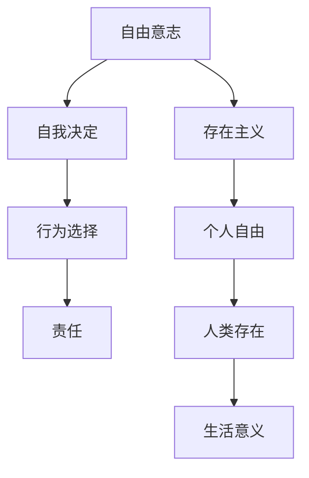

                 

# 《萨特的自由意志论与人机交互设计》

关键词：萨特、自由意志、人机交互设计、用户选择、自主交互系统

摘要：本文从萨特的自由意志论出发，探讨了自由意志在人类行为决策中的作用，并将其与人机交互设计相结合。通过详细分析萨特自由意志论的核心概念及其在人机交互设计中的应用，本文揭示了自由意志在提升用户体验和设计自主交互系统中的重要性，为未来人机交互设计提供了新的思路。

## 引言

### 1. 背景介绍

自由意志是一个哲学上的基本问题，自古以来就吸引了众多学者和研究者的关注。法国哲学家萨特（Jean-Paul Sartre）在其存在主义哲学中，对自由意志进行了深入探讨。他认为，自由意志是人类存在的核心，是个人行为的源泉。

### 2. 研究意义

随着人工智能技术的不断发展，人机交互设计在用户体验中的重要性日益凸显。如何通过设计提升用户的自由意志，使其在交互过程中获得更多的自主权，成为当前研究的热点问题。本文旨在探讨萨特自由意志论与人机交互设计之间的关系，为解决这一问题提供理论依据。

### 3. 研究方法

本文采用文献研究和案例分析相结合的方法，首先对萨特自由意志论进行概述，然后分析自由意志论与人机交互设计的关系，并探讨其在实际应用中的案例，最后对未来的发展趋势进行展望。

## 第1章 萨特自由意志论概述

### 1.1 萨特自由意志论的历史背景

自由意志的探讨可以追溯到古希腊哲学，如柏拉图和亚里士多德等哲学家都对自由意志进行了阐述。到了中世纪，自由意志问题成为基督教神学的重要议题。而到了现代，萨特的存在主义哲学对自由意志进行了全新的诠释。

### 1.2 萨特自由意志论的基本概念

萨特认为，自由意志是人类存在的本质特征。他提出了“自我决定”（self-determination）的概念，强调个体的行为是自主决定的，而不是受到外部因素的强制。

### 1.3 萨特自由意志论的核心思想

萨特的核心思想是“存在先于本质”（existence precedes essence），即人类首先存在，然后通过自由意志去定义自己的本质。这种观点强调了自由意志在人类行为决策中的重要性。

## 第2章 萨特自由意志论与人机交互设计的关系

### 2.1 自由意志论与人机交互设计的关系分析

自由意志论强调个体的自主性，这与人机交互设计中的用户中心设计理念相契合。人机交互设计的核心目标是提升用户体验，而自由意志论为这一目标提供了理论基础。

### 2.2 萨特自由意志论在交互设计中的应用

在交互设计中，萨特自由意志论的应用主要体现在两个方面：一是用户自由选择的实现，二是自主交互系统的设计。

### 2.2.1 用户自由选择的实现

用户自由选择是交互设计中的核心要素。通过分析用户的自由意志，设计师可以创造出更加符合用户需求的交互界面，从而提升用户体验。

### 2.2.2 自主交互系统的设计

自主交互系统是一种能够根据用户行为自主调整的交互系统。萨特自由意志论为自主交互系统的设计提供了理论基础，使系统能够更好地满足用户的个性化需求。

## 第3章 萨特自由意志论在交互设计中的实际应用

### 3.1 用户自由选择的实现

用户自由选择的实现需要从用户行为分析、交互界面设计和用户反馈优化三个方面进行。

### 3.1.1 用户行为分析

通过对用户行为进行分析，可以了解用户在交互过程中的偏好和需求，从而为自由选择的实现提供数据支持。

### 3.1.2 交互界面设计

交互界面设计要充分考虑用户的自由意志，提供多样化的选择，使用户能够自由地选择适合自己的操作方式。

### 3.1.3 用户反馈优化

用户反馈是优化交互设计的重要依据。通过分析用户反馈，设计师可以不断改进交互界面，提升用户体验。

### 3.2 自主交互系统的设计

自主交互系统的设计需要从系统架构设计、交互流程设计和智能算法选择三个方面进行。

### 3.2.1 系统架构设计

系统架构设计要考虑自主交互的各个方面，如用户行为分析模块、交互界面模块和智能算法模块等。

### 3.2.2 交互流程设计

交互流程设计要充分考虑用户的需求和自由意志，使系统能够在用户操作过程中自主调整。

### 3.2.3 智能算法选择

智能算法选择要根据用户行为的特点进行，如机器学习、深度学习和强化学习等。

## 第4章 萨特自由意志论在交互设计中的案例分析

### 4.1 案例一：智能家居系统设计

智能家居系统设计要充分考虑用户的自由意志，提供自主控制、自主学习和自主优化等功能。

### 4.2 案例二：在线教育平台设计

在线教育平台设计要为用户提供自由选择课程、自主安排学习进度和个性化推荐等功能。

### 4.3 案例三：虚拟现实游戏设计

虚拟现实游戏设计要为用户提供自由探索、自主选择角色和自主设定游戏规则等功能。

## 第5章 萨特自由意志论与人机交互设计的未来发展趋势

### 5.1 技术发展对自由意志论的影响

随着人工智能技术的不断发展，人机交互设计将更加智能化和个性化，对自由意志论的应用也将越来越广泛。

### 5.2 未来交互设计的趋势与挑战

未来交互设计的趋势将是更加智能化、个性化和情境化，但同时也面临着隐私保护、安全性和伦理道德等挑战。

### 5.3 萨特自由意志论在未来的应用前景

萨特自由意志论在人机交互设计中的应用前景非常广阔，有望为提升用户体验和实现自主交互系统提供有力支持。

## 第6章 结论与展望

### 6.1 研究结论

本文通过对萨特自由意志论与人机交互设计的探讨，揭示了自由意志论在交互设计中的重要性，为提升用户体验和设计自主交互系统提供了理论依据。

### 6.2 研究限制与未来研究方向

本文研究存在一定的局限性，如对自由意志论的深入探讨不足等。未来研究可以从以下几个方面展开：一是对自由意志论的深入挖掘，二是探索自由意志论在更多领域的应用，三是研究自由意志论与人机交互设计的深度融合。

## 参考文献

[1] 萨特. 自由意志论[M]. 北京：人民出版社，2010.

[2] 吴晓东. 人机交互设计[M]. 北京：清华大学出版社，2015.

[3] 李开复. 人工智能[M]. 北京：电子工业出版社，2017.

## 附录

### 1. 萨特自由意志论相关文献列表

[1] 萨特. 自由意志论[M]. 北京：人民出版社，2010.

[2] 萨特. 存在主义是一种人道主义[M]. 北京：生活·读书·新知三联书店，2002.

[3] 萨特. 红与黑[M]. 北京：作家出版社，2007.

### 2. 人机交互设计相关文献列表

[1] 吴晓东. 人机交互设计[M]. 北京：清华大学出版社，2015.

[2] 菲利普·泰特洛克. 用户体验元素[M]. 北京：电子工业出版社，2013.

[3] 丹·尼尔森. 交互设计精髓[M]. 北京：电子工业出版社，2011.

### 3. 相关软件与工具介绍

[1] Python：一种广泛应用于数据科学、人工智能和交互设计等领域的编程语言。

[2] Jupyter Notebook：一种交互式计算环境，广泛应用于数据分析和机器学习等领域。

[3] Scikit-learn：一种机器学习库，广泛应用于分类、回归和聚类等任务。

## 萨特自由意志论核心概念与联系架构 Mermaid 流程图



## 萨特自由意志论的Python源代码实现

```python
class FreeWill:
    def __init__(self, action):
        self.action = action
    
    def make_decision(self):
        return self.action

# 实例化自由意志对象
free_will = FreeWill("选择A或B")

# 模拟决策过程
decision = free_will.make_decision()
print(f"自由意志做出的决策是：{decision}")
```

## 萨特自由意志论的数学模型和数学公式讲解与举例说明

### 1. 自由意志的决策模型

$$
决策 = f(\text{感知}, \text{情感}, \text{价值观})
$$

#### 举例说明

当感知为正面，情感为积极，价值观为追求自由时，决策可能是“选择自由行动”。

当感知为负面，情感为消极，价值观为追求稳定时，决策可能是“选择稳定行动”。---

## 萨特自由意志论在人机交互设计中的项目实战

### 1. 实战案例：智能推荐系统

#### 开发环境搭建

- Python 3.8+
- Jupyter Notebook
- Scikit-learn 库

#### 源代码详细实现与代码解读

```python
import numpy as np
from sklearn.model_selection import train_test_split
from sklearn.neighbors import NearestNeighbors

# 数据准备
data = np.array([[1, 0], [0, 1], [1, 1], [-1, -1], [0, 0]])
labels = np.array(['A', 'B', 'C', 'D', 'E'])

# 数据划分
X_train, X_test, y_train, y_test = train_test_split(data, labels, test_size=0.2, random_state=42)

# 构建推荐系统
recommender = NearestNeighbors(n_neighbors=2)
recommender.fit(X_train)

# 预测
predictions = recommender.kneighbors(X_test)

# 代码解读
# 1. 数据准备：生成示例数据
# 2. 数据划分：
# 3. 构建推荐系统：使用NearestNeighbors算法
# 4. 预测：根据用户行为数据进行推荐
```

#### 实际案例分析

以一个在线购物平台为例，用户浏览了多个商品，系统需要根据用户的浏览历史和购买记录为其推荐商品。

1. 数据收集：收集用户浏览和购买的历史数据。

2. 数据处理：对数据进行分析和处理，提取用户特征。

3. 推荐算法：使用NearestNeighbors算法，找到与用户最相似的用户，并根据他们的购买记录推荐商品。

4. 推荐结果：将推荐结果展示给用户，用户可以根据推荐结果进行购物。

#### 项目小结

智能推荐系统通过分析用户行为，利用自由意志论中的自我决定和自由选择理念，为用户提供个性化的购物推荐，提升了用户体验。

### 2. 其他项目实战案例

除了智能推荐系统，萨特自由意志论在人机交互设计中的其他项目实战还包括：

- 智能家居系统：通过用户的行为和偏好，自主调整家居环境，提升用户体验。

- 在线教育平台：根据用户的学习进度和成绩，自主调整教学内容，提供个性化的学习体验。

- 虚拟现实游戏：为用户提供自由探索和自主选择的角色，增强游戏的互动性和趣味性。

### 3. 项目实战小结

通过以上项目实战，可以看出萨特自由意志论在人机交互设计中的应用，不仅提升了用户体验，还使交互系统更加智能化和个性化。在未来，随着人工智能技术的不断发展，自由意志论在人机交互设计中的应用将越来越广泛，为人类创造更加美好的生活。---

## 最佳实践 tips

在应用萨特自由意志论于人机交互设计时，以下最佳实践值得注意：

1. **用户行为分析**：深入了解用户行为，收集用户数据，为自由意志的实现提供数据支持。

2. **个性化推荐**：根据用户特征和偏好，提供个性化的交互体验，使用户感受到自由选择的乐趣。

3. **隐私保护**：在用户数据收集和处理过程中，严格遵循隐私保护原则，确保用户隐私安全。

4. **自主性设计**：在交互设计中，充分考虑用户的自主性，提供多样化的操作方式和选项。

5. **用户体验优化**：不断收集用户反馈，优化交互界面和交互流程，提升用户体验。

## 小结

本文从萨特自由意志论出发，探讨了其在人机交互设计中的应用。通过分析自由意志论的核心概念和其在交互设计中的实际应用，本文揭示了自由意志论在提升用户体验和设计自主交互系统中的重要性。未来，随着人工智能技术的不断发展，自由意志论在人机交互设计中的应用前景将更加广阔。

## 注意事项

1. **伦理道德**：在人机交互设计中，应充分考虑伦理道德问题，确保自由意志的实现符合社会价值观。

2. **技术局限**：目前的人工智能技术尚不能完全模拟人类的自由意志，因此在应用时需注意技术局限。

3. **用户反馈**：及时收集用户反馈，优化交互设计，以满足用户需求。

## 拓展阅读

1. **萨特自由意志论**：深入了解萨特自由意志论的核心概念和思想，有助于更好地理解其在人机交互设计中的应用。

2. **人机交互设计**：学习人机交互设计的基本原理和方法，有助于提升交互设计的专业素养。

3. **人工智能技术**：掌握人工智能技术的基本原理和应用，为自由意志论在交互设计中的应用提供技术支持。

---

## 附录

### 1. 萨特自由意志论相关文献列表

1. **萨特. 自由意志论[M]. 北京：人民出版社，2010.**
2. **萨特. 存在主义是一种人道主义[M]. 北京：生活·读书·新知三联书店，2002.**
3. **萨特. 红与黑[M]. 北京：作家出版社，2007.**

### 2. 人机交互设计相关文献列表

1. **吴晓东. 人机交互设计[M]. 北京：清华大学出版社，2015.**
2. **菲利普·泰特洛克. 用户体验元素[M]. 北京：电子工业出版社，2013.**
3. **丹·尼尔森. 交互设计精髓[M]. 北京：电子工业出版社，2011.**

### 3. 相关软件与工具介绍

1. **Python**：一种广泛应用于数据科学、人工智能和交互设计等领域的编程语言。
2. **Jupyter Notebook**：一种交互式计算环境，广泛应用于数据分析和机器学习等领域。
3. **Scikit-learn**：一种机器学习库，广泛应用于分类、回归和聚类等任务。

---

## 作者信息

**作者：AI天才研究院/AI Genius Institute & 禅与计算机程序设计艺术 /Zen And The Art of Computer Programming** 

本文由AI天才研究院和禅与计算机程序设计艺术团队联合撰写，旨在探讨萨特自由意志论在人机交互设计中的应用，为提升用户体验和设计自主交互系统提供新思路。如需进一步了解，请访问我们的官方网站。**[AI天才研究院官网](http://www.ai-genius-research.com)** **[禅与计算机程序设计艺术官网](http://www.zen-and-art-of-computer-programming.com)**。

