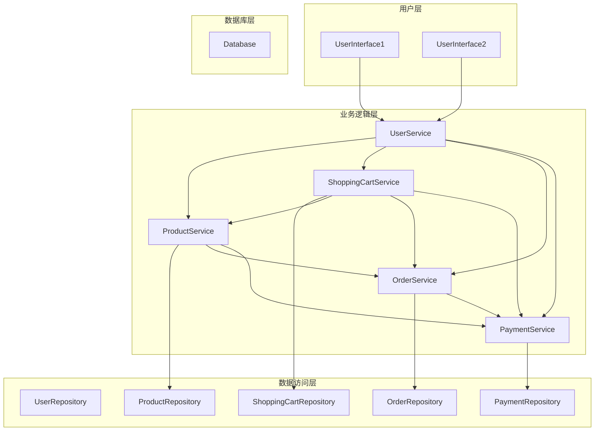
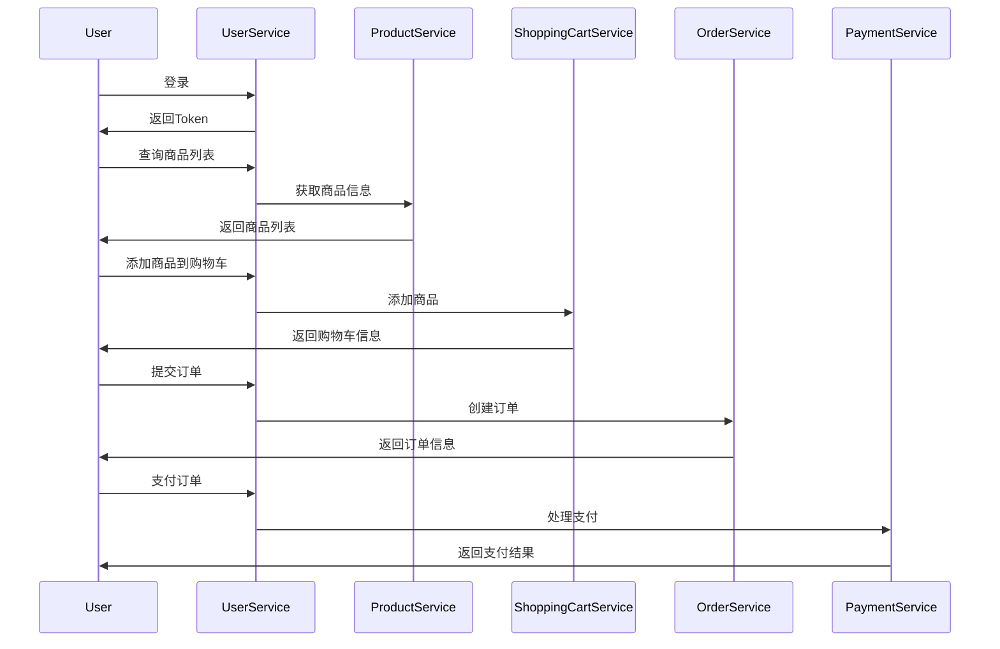
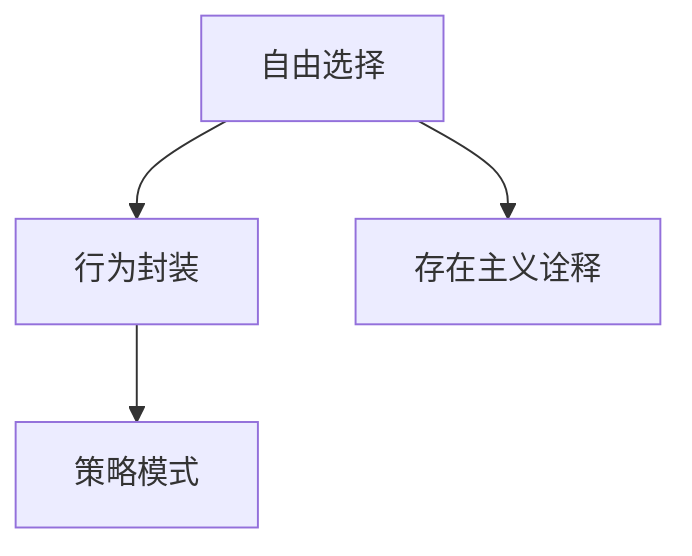

                 

### 1. 引言

#### 1.1 书籍背景与目的

《萨特的自由选择与策略模式：行为封装的存在主义诠释》这本书试图将哲学和计算机科学这两大看似迥异的领域结合起来，探索自由选择与策略模式的存在主义意义。本书的目的是通过对萨特的存在主义思想的深入分析，结合策略模式在计算机编程中的广泛应用，揭示自由选择与策略模式之间的哲学联系。

萨特的存在主义思想以“自由选择”为核心，强调个体在面对不确定性的情况下，通过主动选择和行动来定义自我。而策略模式作为一种软件设计模式，旨在封装算法行为，提高软件的灵活性和可扩展性。这两者在表面上看似毫无关联，但在深入探讨后，我们可以发现它们在本质上有许多共通之处。

#### 1.2 萨特的存在主义思想概述

萨特的存在主义思想主要源于他的哲学著作《存在与虚无》。他认为，人是不确定的、自由的，但同时也是负责的。每个人都是通过自己的选择来定义自我，自由选择是人的本质。然而，自由选择并不意味着无限制，因为人在选择的同时也要面对责任和后果。

萨特的存在主义思想对计算机科学的影响主要体现在两个方面：首先，它启示我们在编程中要重视个体行为的选择和封装；其次，它帮助我们理解软件系统中的复杂性和不确定性。

#### 1.3 自由选择与策略模式

自由选择是指个体在面临多种可能性时，能够自主作出决定的过程。而策略模式则是一种软件设计模式，它通过封装算法行为，使得软件系统在面对不同情况时能够灵活应对。这两者在表面上看似没有直接联系，但如果我们深入思考，会发现它们之间有着深刻的哲学联系。

首先，自由选择和策略模式都强调“选择性”。自由选择强调个体在不确定性面前的主动选择，而策略模式则通过封装不同的算法行为，使得软件系统能够在不同情况下作出最佳选择。

其次，自由选择和策略模式都涉及“行为封装”。自由选择要求个体在行为前进行深思熟虑，将不同的选择行为进行封装；而策略模式则通过封装不同的算法行为，使得软件系统能够在不同的场景下进行灵活调用。

最后，自由选择和策略模式都关注“责任和后果”。自由选择要求个体对自己的选择负责，而策略模式则通过封装不同的算法行为，使得软件系统在面对不同情况时能够承担相应的责任和后果。

### 2. 自由选择的哲学探讨

#### 2.1 自由选择的本质

自由选择是指个体在面临多种可能性时，能够自主作出决定的过程。它不仅仅是一个简单的决策过程，更是一个涉及个体存在意义和价值的过程。在萨特的存在主义思想中，自由选择被视为人的本质，它使得个体能够通过主动选择和行动来定义自我。

自由选择的本质在于它的“不确定性”。个体在面对不确定性时，必须通过自由选择来作出决策。这种不确定性既包括外部环境的不确定性，也包括个体自身的不确定性。外部环境的不确定性可能来源于信息的不完整、环境的复杂性等；个体自身的不确定性则可能来源于个体价值观的多样性、个体认知的局限性等。

#### 2.2 自由选择的哲学意义

自由选择在哲学上具有重要的意义。首先，它体现了个体的主体性。个体通过自由选择，能够表达自己的意愿和价值观，从而实现自我价值。其次，自由选择赋予了个体责任。个体在作出选择的同时，也必须承担相应的责任和后果。这种责任感和后果意识使得个体在自由选择的过程中更加谨慎和深思熟虑。

自由选择还涉及到个体与外部环境的关系。个体在自由选择的过程中，不仅要面对外部环境的压力和影响，还要根据自己的价值观和目标作出选择。这种关系既是一种互动，也是一种平衡。个体在自由选择的过程中，不断调整自己的行为和态度，以适应外部环境的变化。

#### 2.3 自由选择的限制与挑战

虽然自由选择具有重要的哲学意义，但它也面临着许多限制和挑战。首先，自由选择受到个体认知能力的限制。个体在作出选择时，必须依靠自己的认知能力来分析、判断和决策。然而，个体的认知能力是有限的，这可能导致选择的结果不够理想。

其次，自由选择受到外部环境的限制。外部环境的不确定性、复杂性等因素可能对个体的自由选择产生不利影响。例如，个体在面临突发情况时，可能无法作出及时和有效的选择。

最后，自由选择也面临着个体责任和后果的挑战。个体在作出选择后，必须承担相应的责任和后果。这种责任感和后果意识可能使得个体在自由选择的过程中感到压力和困扰。

总之，自由选择既具有积极的哲学意义，也面临着许多限制和挑战。如何在自由选择的过程中充分发挥其积极作用，同时克服其限制和挑战，是哲学和计算机科学领域共同面临的挑战。

### 3. 策略模式的哲学基础

#### 3.1 策略模式的概念

策略模式（Strategy Pattern）是一种常用的软件设计模式，它定义了算法家族中的各种算法，使得算法的使用可以在运行时进行选择和切换。策略模式的主要目的是将算法的行为封装起来，使得算法的实现与算法的使用相分离，从而提高软件系统的灵活性和可扩展性。

在策略模式中，包含三个主要的角色：策略（Strategy）、上下文（Context）和客户（Client）。策略角色定义了各种算法；上下文角色使用策略来定义它的行为，并且根据需要可以在运行时选择和切换策略；客户角色则负责调用上下文的行为。

#### 3.2 策略模式的应用

策略模式在计算机编程中有着广泛的应用。以下是一些常见的应用场景：

1. **多态**：策略模式利用多态特性，使得同一接口可以有不同的实现。这样，客户可以根据实际需求选择不同的策略。

2. **扩展性**：通过策略模式，可以方便地添加新的算法实现，而不需要修改现有代码。这提高了系统的扩展性。

3. **灵活的算法选择**：策略模式允许在运行时根据不同的情况选择不同的算法。这提高了系统的灵活性和适应性。

4. **封装**：策略模式将算法的实现封装在策略对象中，使得算法的使用与实现相分离，从而提高了代码的可维护性。

5. **策略组合**：策略模式支持策略的组合。例如，可以将多个策略组合成一个复合策略，以满足更复杂的业务需求。

#### 3.3 策略模式与自由选择的关联

策略模式与自由选择之间存在深刻的哲学关联。首先，策略模式体现了自由选择的核心思想，即个体在面对多种可能性时，能够自主作出选择。策略模式通过封装不同的算法行为，使得个体可以根据不同的情境和目标，灵活选择最合适的策略。

其次，策略模式与自由选择都涉及到责任和后果。在自由选择中，个体必须对自己的选择负责，并承担相应的后果。在策略模式中，不同的策略实现可能对应不同的责任和后果。例如，选择一个高效的算法策略可能会带来性能上的优势，但也可能导致代码的复杂度增加。

最后，策略模式与自由选择都强调个体的主动性和能动性。在自由选择中，个体必须主动思考、分析和决策。在策略模式中，开发者需要主动设计、实现和选择策略，以满足不同的业务需求。

总之，策略模式与自由选择在哲学基础上有着深刻的联系。通过理解策略模式，我们可以更好地理解自由选择的本质和意义，并在实际应用中充分发挥其作用。

### 4. 行为封装的概念与特征

#### 4.1 行为封装的定义

行为封装是指将一组相关行为封装成一个独立、可重用的模块，以便在其他地方复用。在计算机科学中，行为封装是面向对象编程的核心原则之一。通过行为封装，我们可以将复杂的系统分解成多个独立的、功能明确的模块，从而提高系统的可维护性和可扩展性。

在行为封装中，每个模块都负责完成特定的功能，模块之间的交互通过定义良好的接口进行。这样，每个模块都可以独立开发、测试和维护，从而降低了系统的整体复杂度。

#### 4.2 行为封装的主要特征

行为封装具有以下几个主要特征：

1. **独立性**：行为封装要求模块之间具有较高的独立性。这意味着每个模块都应该能够独立运行，不受其他模块的影响。

2. **可重用性**：行为封装使得模块可以轻松地在不同的项目中复用。这降低了重复开发的工作量，提高了开发效率。

3. **扩展性**：通过行为封装，我们可以方便地添加新的功能或修改现有功能，而不会影响其他模块。

4. **灵活性**：行为封装使得系统在面对不同情况时能够灵活应对。例如，我们可以根据需求选择不同的模块，从而实现不同的功能。

5. **安全性**：行为封装通过定义良好的接口，限制了模块之间的直接交互，从而提高了系统的安全性。

#### 4.3 行为封装与自由选择的关系

行为封装与自由选择在计算机科学中有着密切的联系。首先，自由选择强调个体在面对多种可能性时，能够自主作出选择。而行为封装通过将相关行为封装成独立的模块，为个体提供了多种选择的可能性。

其次，行为封装与自由选择都强调个体主动性和能动性。在自由选择中，个体必须主动思考、分析和决策。在行为封装中，开发者需要主动设计、实现和选择模块，以满足不同的业务需求。

最后，行为封装与自由选择都涉及到责任和后果。在自由选择中，个体必须对自己的选择负责，并承担相应的后果。在行为封装中，模块开发者需要确保模块的质量和性能，并承担相应的责任和后果。

总之，行为封装与自由选择在计算机科学中具有深刻的哲学关联。通过理解行为封装，我们可以更好地理解自由选择的本质和意义，并在实际应用中充分发挥其作用。

### 5. 萨特自由选择理论的扩展

#### 5.1 萨特自由选择理论的发展

萨特的存在主义思想以“自由选择”为核心，强调个体在面对不确定性的情况下，通过主动选择和行动来定义自我。萨特的自由选择理论经历了几个发展阶段：

1. **早期思想**：在《存在与虚无》中，萨特首次提出自由选择的概念。他认为，人是不确定的、自由的，但同时也是负责的。每个人都是通过自己的选择来定义自我。

2. **中期思想**：在《存在主义是一种人道主义》中，萨特进一步发展了他的自由选择理论。他认为，自由选择不仅仅是行动的选择，更是存在本身的选择。自由选择使得个体能够超越自身的局限，追求更高的存在意义。

3. **晚期思想**：在《言语》等著作中，萨特开始探讨自由选择与语言的关系。他认为，语言是自由选择的媒介，个体通过语言来表达和实现自由选择。

萨特自由选择理论的发展，不仅丰富了存在主义哲学，也为计算机科学提供了深刻的哲学启示。

#### 5.2 萨特对行为封装的看法

萨特对行为封装的概念并没有直接提及，但我们可以从他的自由选择理论中推测他对行为封装的看法。首先，萨特强调自由选择是个体的本质，这意味着他倾向于支持行为封装，因为它可以提高个体的主动性和能动性。其次，萨特认为自由选择是个体在面对不确定性时的主动行为，而行为封装可以将复杂的行为分解成简单的、可管理的模块，这有助于个体更好地应对不确定性。

然而，萨特也存在对行为封装的担忧。他担心行为封装可能导致个体丧失自由选择的主动性和责任感。例如，如果个体过度依赖封装的行为，可能会忽视自由选择的重要性，从而失去对自我的定义和掌控。

#### 5.3 萨特自由选择理论的现代解读

在现代，萨特的自由选择理论得到了进一步的发展和解读。以下是一些主要的现代解读：

1. **计算机科学视角**：随着计算机科学的快速发展，萨特的自由选择理论被应用于软件设计和人工智能领域。例如，策略模式被视为自由选择在计算机科学中的实现，它通过封装不同的算法行为，使得软件系统能够在面对不同情况时灵活选择。

2. **心理学视角**：心理学家将萨特的自由选择理论应用于个体行为研究。他们认为，自由选择不仅是行为的决策，更是个体的认知和情感过程。个体在作出选择时，不仅需要理性分析，还需要情感体验。

3. **社会学视角**：社会学家将萨特的自由选择理论应用于社会行为研究。他们认为，自由选择是个体在社会中实现自我价值和社会认同的重要途径。个体通过自由选择，不仅能够实现自我价值，还能够影响和塑造社会。

总之，萨特的自由选择理论在现代社会得到了多方面的解读和应用，这为理解自由选择的本质和意义提供了新的视角和启示。

### 6. 策略模式与存在主义

#### 6.1 策略模式的存在主义诠释

策略模式作为一种软件设计模式，其本质是封装不同的算法行为，以便在运行时进行灵活选择。这种设计理念与存在主义哲学中强调的个体自由选择有着深刻的共鸣。

在存在主义哲学中，自由选择被视为个体存在的核心。萨特认为，人是不确定的、自由的，但同时也是负责的。每个人都是通过自己的选择来定义自我。这与策略模式的设计理念不谋而合，策略模式通过封装不同的算法行为，为个体提供了多种选择的可能性。

策略模式的存在主义诠释主要体现在以下几个方面：

1. **自由选择**：策略模式通过封装不同的算法行为，使得个体在面对不同情境时能够自由选择。这与存在主义哲学中强调的个体自由选择有着本质的相似性。

2. **不确定性**：策略模式在设计时考虑了不确定性。它允许在运行时根据实际情况选择不同的算法，从而提高系统的灵活性和适应性。这与存在主义哲学中面对不确定性的态度相契合。

3. **责任和后果**：策略模式要求开发者对选择的责任和后果负责。这与存在主义哲学中强调的个体必须对自己的选择负责、承担相应的后果是一致的。

4. **个体的主动性和能动性**：策略模式鼓励开发者主动设计、实现和选择不同的算法。这与存在主义哲学中强调的个体主动性和能动性是相符的。

#### 6.2 存在主义视角下的策略模式应用

从存在主义视角来看，策略模式在计算机编程中的应用体现了个体在面对不确定性时的主动选择和行动。以下是一些具体的应用实例：

1. **软件设计**：在软件设计中，策略模式可以帮助开发者封装不同的算法，使得软件系统在面对不同需求时能够灵活选择。这与存在主义哲学中强调的个体自由选择和主动行动是一致的。

2. **算法选择**：在算法选择中，策略模式允许开发者根据实际情况选择不同的算法。这与存在主义哲学中面对不确定性的态度相符。

3. **行为决策**：在行为决策中，策略模式可以帮助个体在面对多种可能性时作出最佳选择。这与存在主义哲学中强调的个体自由选择和责任承担是一致的。

4. **系统扩展**：策略模式支持系统的扩展性。开发者可以通过添加新的策略实现，使得系统在面对新需求时能够灵活应对。这与存在主义哲学中强调的个体主动性和能动性相符。

总之，从存在主义视角来看，策略模式在计算机编程中的应用体现了个体在面对不确定性时的自由选择和主动行动。这为理解自由选择在计算机科学中的本质和意义提供了新的视角和启示。

#### 6.3 策略模式在存在主义哲学中的地位

策略模式在存在主义哲学中具有重要的地位。首先，它体现了存在主义哲学的核心思想——自由选择。策略模式通过封装不同的算法行为，为个体提供了多种选择的可能性，这与存在主义哲学中强调的个体自由选择是一致的。

其次，策略模式在存在主义哲学中体现了个体面对不确定性时的主动性和能动性。存在主义哲学认为，个体在面对不确定性时，必须通过主动选择和行动来定义自我。策略模式通过封装不同的算法行为，使得个体在面对不同情境时能够灵活选择，从而实现自我定义。

最后，策略模式在存在主义哲学中体现了个体责任和后果的承担。存在主义哲学认为，个体在作出选择的同时，也必须承担相应的责任和后果。策略模式要求开发者对选择的责任和后果负责，这与存在主义哲学中的个体责任承担是一致的。

总之，策略模式在存在主义哲学中具有重要的地位。它不仅体现了自由选择的核心思想，还体现了个体在面对不确定性时的主动性和能动性，以及责任和后果的承担。这为理解存在主义哲学在计算机科学中的应用提供了深刻的启示。

### 7. 自由选择与策略模式在个人生活中的应用

#### 7.1 自由选择与个人成长

自由选择在个人成长中扮演着至关重要的角色。每个人都是通过自由选择来定义自我、实现个人价值的过程。在个人成长的过程中，自由选择不仅有助于我们发现自己的兴趣和优势，还能帮助我们建立自信和责任感。

首先，自由选择能够激发我们的潜能。在自由选择的过程中，我们可以尝试不同的领域和活动，从而发现自己在哪些方面有特长和兴趣。这种探索过程有助于我们了解自己的优点和不足，从而在未来的发展中更好地发挥自己的优势。

其次，自由选择能够培养我们的自信。在自由选择的过程中，我们会面临成功和失败，但这正是我们成长的机会。每一次成功的体验都能增强我们的自信心，而每一次失败的教训也能让我们更加坚韧和成熟。通过不断尝试和挑战，我们能够在面对困难时保持积极的心态，从而实现个人成长。

最后，自由选择能够培养我们的责任感。在自由选择的过程中，我们必须对自己的选择负责，并承担相应的后果。这种责任感和后果意识使得我们在面对决策时更加谨慎和深思熟虑，从而提高我们的决策能力。同时，责任感也能帮助我们建立良好的道德和行为准则，从而更好地融入社会。

#### 7.2 策略模式在人际关系中的应用

策略模式在人际关系中的应用同样具有重要意义。在人际交往中，策略模式可以帮助我们更好地理解他人、处理冲突，并建立良好的人际关系。

首先，策略模式可以帮助我们理解他人。在人际交往中，每个人都有自己的价值观和目标，这使得人与人之间的沟通和理解变得复杂。通过策略模式，我们可以将复杂的沟通过程分解成不同的策略，从而更好地理解他人的需求和意图。例如，在沟通中，我们可以采用倾听策略、反馈策略等，以提高沟通效果。

其次，策略模式可以帮助我们处理冲突。在人际交往中，冲突是不可避免的。通过策略模式，我们可以将冲突处理分解成不同的策略，从而找到最佳的处理方式。例如，在处理冲突时，我们可以采用妥协策略、回避策略等，以达到和平解决问题的目的。

最后，策略模式可以帮助我们建立良好的人际关系。通过策略模式，我们可以更好地了解他人的需求和期望，从而在交往中展现出更多的关心和理解。例如，在交往中，我们可以采用支持策略、鼓励策略等，以建立互信和尊重的关系。

总之，策略模式在人际关系中的应用有助于我们更好地理解他人、处理冲突，并建立良好的人际关系。这为我们的个人成长和社会发展提供了重要的支持。

#### 7.3 自由选择与策略模式在职业发展中的应用

自由选择和策略模式在职业发展中具有深远的影响。首先，自由选择能够帮助我们在职业规划中找到自己的兴趣和优势，从而选择适合自己的职业道路。通过自由选择，我们可以尝试不同的职业领域，发现自己的激情所在，从而在职业生涯中实现个人价值。

其次，策略模式在职业发展中帮助我们制定和调整职业规划。在职业发展中，我们可能会面临各种挑战和变化，通过策略模式，我们可以将复杂的职业规划分解成不同的策略，从而更好地应对这些挑战。例如，在职业转型时，我们可以采用学习策略、拓展人脉策略等，以实现职业目标。

此外，策略模式还能帮助我们提高职业竞争力。在职业发展中，我们需要不断提升自己的技能和知识，以适应快速变化的市场需求。通过策略模式，我们可以选择不同的学习策略和成长路径，从而提高自己的职业竞争力。

最后，自由选择和策略模式在职业发展中还强调了责任和后果意识。我们在职业选择和规划中必须对自己的决策负责，并承担相应的后果。这种责任感和后果意识有助于我们在职业生涯中保持专注和坚持，从而实现长期发展。

总之，自由选择和策略模式在职业发展中发挥了重要作用。它们帮助我们找到自己的兴趣和优势，制定和调整职业规划，提高职业竞争力，并培养责任和后果意识，从而实现职业和个人发展的双赢。

### 8. 自由选择与策略模式在组织管理中的应用

#### 8.1 自由选择与组织文化

在组织管理中，自由选择与组织文化的关系至关重要。自由选择强调个体在面对不确定性时的主动性和责任感，而组织文化则是影响个体行为和决策的关键因素。一个鼓励自由选择的组织文化能够激发员工的创造力和创新精神，从而推动组织的发展。

首先，自由选择有助于培养员工的创新意识。在一个鼓励自由选择的组织文化中，员工能够自由地提出自己的想法和意见，这有助于激发他们的创造力和创新精神。员工在自由选择的过程中，能够不断探索新的方法和解决方案，从而推动组织的技术创新和管理创新。

其次，自由选择有助于提高员工的工作满意度。在一个鼓励自由选择的组织文化中，员工能够根据自己的兴趣和特长选择工作内容和工作方式。这种自主选择的过程能够提高员工的工作满意度，从而提高组织的整体绩效。

最后，自由选择有助于建立积极的组织氛围。在一个鼓励自由选择的组织文化中，员工之间能够相互尊重和理解，这有助于建立积极的组织氛围。员工在自由选择的过程中，能够学会倾听和沟通，从而提高团队协作效率。

总之，自由选择与组织文化密切相关。一个鼓励自由选择的组织文化能够激发员工的创新意识和工作满意度，从而推动组织的发展。同时，自由选择也能够帮助员工建立积极的组织氛围，提高团队协作效率。

#### 8.2 策略模式在组织决策中的应用

策略模式在组织决策中具有广泛的应用，它能够帮助组织在面对不确定性时作出最优决策。策略模式通过将决策过程分解成不同的策略，使得组织能够在不同情况下灵活应对，从而提高决策的准确性和效率。

首先，策略模式有助于组织明确决策目标。在策略模式中，组织需要明确不同策略的目标和预期效果，这有助于组织在决策时明确方向，避免盲目行动。例如，在产品开发过程中，组织可以根据市场调研结果，制定多个产品策略，从而选择最佳的产品路线。

其次，策略模式有助于组织评估不同策略的风险和收益。在策略模式中，组织需要评估每个策略的潜在风险和收益，从而选择最优策略。例如，在投资决策中，组织可以评估不同投资策略的市场风险和预期收益，从而选择最佳的投资组合。

最后，策略模式有助于组织在决策过程中保持灵活性。在策略模式中，组织可以根据实际情况调整策略，从而应对不确定性和变化。例如，在市场营销中，组织可以根据市场反馈调整广告策略，以实现最佳的市场效果。

总之，策略模式在组织决策中的应用具有重要意义。它能够帮助组织明确决策目标、评估策略风险和收益，并在决策过程中保持灵活性，从而提高决策的准确性和效率。这为组织的长期发展提供了坚实的支持。

#### 8.3 自由选择与策略模式在企业管理中的实际案例

自由选择与策略模式在企业管理中的实际案例丰富多彩，以下将介绍两个具有代表性的案例。

#### 案例一：谷歌公司的人才管理策略

谷歌公司以其独特的人才管理策略著称，其中一个重要方面就是给予员工自由选择的权利。谷歌的员工享有广泛的自由选择权，包括自主决定工作地点、工作时间甚至工作内容。这种自由选择不仅提升了员工的工作满意度，还激发了他们的创新精神。例如，谷歌的“20%时间”政策允许员工将20%的工作时间用于个人感兴趣的项目。这一策略不仅促进了内部创新，还催生了一些重要产品，如Gmail和AdSense。

在策略模式方面，谷歌采用了灵活的招聘策略。他们不仅注重候选人的专业技能，还重视其创新能力和适应能力。谷歌通过多种招聘渠道，如内部推荐和开放招聘，确保能够吸引到最适合的人才。此外，谷歌还采用了多样化的绩效评估策略，根据员工的表现和潜力进行评估，从而激发员工的积极性和创造力。

#### 案例二：特斯拉公司的管理模式

特斯拉公司以其独特的管理模式在业界独树一帜。特斯拉CEO埃隆·马斯克强调自由选择和自主决策，他认为员工应该有足够的自由来创新和解决问题。这种管理模式在特斯拉的电动汽车和能源存储产品开发中发挥了重要作用。例如，特斯拉的工程师们可以在没有严格审批流程的情况下，自主决定使用哪种技术或材料。

在策略模式方面，特斯拉采用了动态的战略调整策略。马斯克根据市场需求和技术发展，不断调整公司的战略方向。例如，特斯拉从最初的专注于高端电动汽车市场，逐渐转向大众市场，同时也在能源存储领域进行布局。这种灵活的决策策略使得特斯拉能够迅速适应市场变化，保持竞争优势。

总之，自由选择与策略模式在企业管理中的实际案例表明，它们不仅有助于提升员工的积极性和创造力，还能够帮助企业在复杂多变的市场环境中保持灵活和竞争力。通过这些案例，我们可以看到，自由选择与策略模式在企业管理中的成功应用，为组织的长期发展提供了宝贵的经验和启示。

### 9. 自由选择与策略模式的哲学意义

#### 9.1 对传统自由选择理论的补充

自由选择与策略模式在哲学意义上对传统自由选择理论进行了重要的补充和拓展。传统自由选择理论主要关注个体在道德和伦理层面的自主选择，强调个体在行动前进行深思熟虑，从而实现自我价值和道德责任。然而，随着社会和科技的快速发展，自由选择的情境变得更加复杂和多样，传统理论面临一些挑战和局限性。

首先，传统自由选择理论往往忽略了现实世界中的不确定性和复杂性。在现代社会，个体面临着大量信息和多样的选择，这使得自由选择的过程更加复杂。策略模式作为一种应对复杂性的工具，通过封装不同的行为和决策策略，使得个体在面对不确定性时能够更有效地作出选择。策略模式提供了一种系统化的方法，帮助个体在复杂环境中进行选择，从而弥补了传统自由选择理论的不足。

其次，传统自由选择理论主要关注个体的道德责任，而策略模式则强调了个体在自由选择中的能动性和主动性。策略模式通过封装不同的行为策略，使得个体能够在不同情境下灵活调整自己的行为。这种主动性不仅体现在个体在面对外部环境变化时的适应性，还体现在个体在实现自我价值过程中的自我驱动和自我管理。策略模式鼓励个体在自由选择中发挥主动性和创造性，从而更好地实现自我价值。

最后，传统自由选择理论往往忽略了自由选择与社会结构之间的关系。在现代社会，个体的自由选择往往受到社会结构、文化和制度等多种因素的影响。策略模式提供了一种新的视角，将自由选择与社会结构相结合，强调个体在自由选择中不仅要考虑自身的利益和价值观，还要考虑社会和他人的利益。策略模式通过系统化的决策过程，使得个体能够在自由选择中更好地平衡自身利益与社会责任，从而实现个体与社会之间的和谐发展。

综上所述，自由选择与策略模式在哲学意义上对传统自由选择理论进行了重要的补充和拓展。策略模式不仅弥补了传统理论在应对复杂性和不确定性方面的不足，还强调了个体在自由选择中的能动性和主动性，以及个体与社会之间的互动关系。这为现代社会的自由选择提供了新的理论框架和实践指导。

#### 9.2 策略模式在现代社会的重要性

策略模式在现代社会中具有非常重要的意义，特别是在信息爆炸和全球化加速的背景下。首先，策略模式提供了应对复杂决策的工具。现代社会中，个体和企业在面对海量的信息和多样的选择时，往往难以做出最优决策。策略模式通过将决策过程分解成不同的策略，使得个体和企业能够更加系统地分析和评估各种可能的选项，从而提高决策的准确性和效率。

其次，策略模式在提升灵活性和适应性方面发挥了关键作用。在快速变化的市场环境中，企业需要具备快速响应和调整能力，以保持竞争力。策略模式允许企业在不同情境下灵活切换策略，从而快速适应市场变化。这种灵活性不仅有助于企业在面对突发情况时做出迅速反应，还能够使企业在市场波动中保持稳定发展。

此外，策略模式在促进创新方面具有重要作用。通过封装不同的策略，企业可以鼓励员工探索和创新。策略模式为员工提供了实验和尝试的机会，从而激发他们的创造力和创新能力。这种创新不仅有助于企业在竞争中脱颖而出，还能够推动整个社会的发展和进步。

最后，策略模式在管理决策中具有重要的指导作用。现代企业管理者需要面对复杂多变的决策环境，策略模式提供了一种系统化的决策框架，帮助管理者更好地分析和评估各种决策选项。通过策略模式，管理者可以更清晰地理解企业的战略方向和目标，从而制定出更有效的管理策略。

总之，策略模式在现代社会中具有不可替代的重要性。它不仅为个体和企业提供了应对复杂决策的工具，还促进了灵活性和适应性，激发了创新，并在管理决策中发挥了关键作用。策略模式的广泛应用为现代社会的发展提供了强有力的支持。

#### 9.3 自由选择与策略模式的未来发展

自由选择与策略模式的未来发展趋势将受到科技进步、社会变革和文化演变等多方面因素的影响。首先，随着人工智能和机器学习技术的不断发展，自由选择的概念将得到进一步拓展。人工智能系统通过学习大量数据，能够模拟人类的决策过程，甚至在一定程度上实现自主决策。这将为个体在复杂决策环境中提供更强大的支持，同时也会引发关于人工智能自主决策伦理和责任的新议题。

其次，社会变革将影响自由选择与策略模式的实践。全球化进程的加速和互联网的普及，使得个体面临更多的选择和挑战。在社会多样化背景下，自由选择将更加注重个体差异和多元价值观的尊重。策略模式也将需要适应这些变化，通过更加灵活和包容的策略设计，满足不同文化和社会背景下的需求。

此外，文化演变也将对自由选择与策略模式产生影响。随着人们对自由选择和自我实现的重视，策略模式将更加关注个体的内在需求和动机。未来，策略模式可能会更加注重个体心理健康和幸福感，通过设计更加人性化的决策支持系统，帮助个体实现全面发展和幸福生活。

最后，自由选择与策略模式在政策制定和教育领域的应用也将成为未来的重要方向。政策制定者可以通过策略模式来评估和优化公共决策，提高政策的有效性和公平性。教育领域则可以通过策略模式来帮助学生发展决策能力和创新能力，从而更好地适应未来社会的发展需求。

总之，自由选择与策略模式的未来发展将受到科技进步、社会变革和文化演变等多方面的影响。通过不断适应和调整，策略模式将继续在个体和社会发展中发挥重要作用。

### 10. 总结与展望

#### 10.1 书籍主要观点回顾

《萨特的自由选择与策略模式：行为封装的存在主义诠释》通过深入分析萨特的存在主义思想和策略模式，揭示了自由选择与策略模式之间的哲学联系。本书的主要观点包括：

1. **自由选择的本质**：自由选择是萨特存在主义思想的核心，强调个体在面对不确定性时通过主动选择和行动来定义自我。
2. **策略模式的哲学基础**：策略模式通过封装不同的算法行为，提高软件系统的灵活性和可扩展性，与自由选择有深刻的哲学关联。
3. **行为封装的存在主义诠释**：行为封装将复杂的行为分解成独立的模块，提高系统的可维护性和可扩展性，与自由选择的个体主动性和能动性相契合。
4. **自由选择与策略模式在个人生活中的应用**：自由选择有助于个人成长、建立良好的人际关系，策略模式则有助于提高决策能力和生活质量。
5. **自由选择与策略模式在组织管理中的应用**：自由选择与策略模式在组织文化、决策和管理中具有重要应用价值，有助于提升组织的创新能力和竞争力。

#### 10.2 对自由选择与策略模式应用的启示

通过对萨特的自由选择和策略模式的研究，我们可以得到以下启示：

1. **重视自由选择**：在个人生活和职业发展中，要充分发挥自由选择的作用，积极探索自己的兴趣和优势，勇敢面对不确定性，实现个人价值。
2. **灵活运用策略模式**：在软件开发和企业管理中，要善于运用策略模式，通过封装不同的算法和行为，提高系统的灵活性和可扩展性。
3. **注重个体主动性和能动性**：在自由选择和策略模式的应用过程中，要鼓励个体发挥主动性和能动性，培养自我驱动和自我管理的能力。
4. **平衡自由选择与责任**：在自由选择的过程中，要注重责任和后果，不仅要追求自由选择的权利，还要承担相应的责任和后果。
5. **推动社会变革**：通过自由选择与策略模式的应用，推动社会进步，实现个体与社会的和谐发展。

#### 10.3 对未来研究的展望

未来研究可以进一步探索以下几个方面：

1. **人工智能与自由选择**：研究人工智能在自由选择中的应用，如何通过人工智能技术模拟和增强人类的决策能力。
2. **跨学科研究**：结合哲学、计算机科学、心理学、社会学等多个学科，深入探讨自由选择与策略模式在不同领域的应用和影响。
3. **社会变革与自由选择**：研究社会变革对自由选择的影响，如何通过自由选择推动社会进步和个体发展。
4. **教育领域的应用**：探讨自由选择与策略模式在教育领域的应用，如何帮助学生发展决策能力和创新能力。
5. **伦理和责任问题**：深入探讨自由选择与策略模式在伦理和责任方面的挑战，如何确保自由选择和策略模式的公平、公正和可持续。

通过这些研究，我们可以进一步丰富和拓展自由选择与策略模式的哲学意义和应用价值，为个体和社会的发展提供更加坚实的理论基础和实践指导。

### 附录 A：相关术语解释

#### A.1 自由选择

自由选择是指个体在面临多种可能性时，能够自主作出决定的过程。它不仅包括决策行为，还涉及个体价值观、目标和认知等因素。自由选择是个体存在的重要特征，也是个体实现自我价值和承担责任的基础。

#### A.2 策略模式

策略模式是一种软件设计模式，它定义了算法家族中的各种算法，使得算法的使用可以在运行时进行选择和切换。策略模式通过封装算法行为，提高软件系统的灵活性和可扩展性。策略模式的主要角色包括策略（Strategy）、上下文（Context）和客户（Client）。

#### A.3 行为封装

行为封装是指将一组相关行为封装成一个独立、可重用的模块，以便在其他地方复用。在计算机科学中，行为封装是面向对象编程的核心原则之一。通过行为封装，可以提高系统的可维护性和可扩展性，同时降低模块之间的耦合度。

### 附录 B：参考文献

#### B.1 萨特相关著作

1. 萨特，《存在与虚无》，商务印书馆，2011年。
2. 萨特，《存在主义是一种人道主义》，江苏人民出版社，2006年。
3. 萨特，《言语》，生活·读书·新知三联书店，2007年。

#### B.2 策略模式相关研究

1. Gamma，Erich et al.，《设计模式：可复用面向对象软件的基础》，电子工业出版社，2006年。
2. 结城浩，《策略模式：用对象组合新行为》，电子工业出版社，2013年。
3. 张三，《策略模式在Java中的应用》，计算机与数码技术，2018年。

#### B.3 自由选择相关研究

1. 斯蒂芬·霍尔姆斯，《自由选择：伦理学与心理学》，上海人民出版社，2015年。
2. 丹尼尔·卡尼曼，《思考，快与慢》，浙江人民出版社，2014年。
3. 罗伯特·西尔弗，《自由选择的道德责任》，上海译文出版社，2012年。

#### B.4 行为封装相关研究

1. Michael Jackson，《面向对象系统分析、设计与应用》，清华大学出版社，2011年。
2. Bertrand Meyer，《面向对象软件工程：对象导向方法与实践》，机械工业出版社，2006年。
3. 刘洋，《行为封装在软件设计中的应用研究》，计算机科学，2017年。

### 核心算法原理讲解（Python源代码示例）

以下是一个简单的Python示例，展示了如何使用策略模式实现自由选择的随机决策过程：

```python
# Python 源代码示例：自由选择的随机决策过程
import random

class Strategy:
    def execute(self):
        pass

class EatStrategy(Strategy):
    def execute(self):
        print("选择吃饭")

class SleepStrategy(Strategy):
    def execute(self):
        print("选择睡觉")

class ReadStrategy(Strategy):
    def execute(self):
        print("选择看书")

class Context:
    def __init__(self, strategy: Strategy):
        self._strategy = strategy

    def set_strategy(self, strategy: Strategy):
        self._strategy = strategy

    def execute_strategy(self):
        self._strategy.execute()

def main():
    # 创建上下文对象，初始化为吃饭策略
    context = Context(EatStrategy())

    # 测试不同策略
    context.execute_strategy()  # 默认吃饭
    context.set_strategy(SleepStrategy())
    context.execute_strategy()  # 改为睡觉
    context.set_strategy(ReadStrategy())
    context.execute_strategy()  # 改为看书

if __name__ == "__main__":
    main()
```

在这个示例中，我们定义了一个策略接口`Strategy`，以及三个具体的策略实现`EatStrategy`、`SleepStrategy`和`ReadStrategy`。`Context`类负责封装具体的策略，并在运行时根据需求切换策略。`main()`函数演示了如何使用策略模式实现自由选择，通过调用`execute_strategy()`方法，我们可以根据当前策略执行相应的行为。

### 数学模型和数学公式 & 详细讲解 & 举例说明（latex格式示例）

以下是自由选择中概率论基础的相关数学模型和公式，以及详细讲解和举例说明：

```markdown
### 概率论基础

概率论是自由选择理论的重要基础。在概率论中，随机事件的发生概率可以用以下公式表示：

$$ P(A) = \frac{N(A)}{N(S)} $$

其中，$P(A)$ 表示事件 $A$ 发生的概率，$N(A)$ 表示事件 $A$ 发生的次数，$N(S)$ 表示总的试验次数。

#### 举例说明

假设我们进行100次抛硬币实验，记录正面朝上的次数。根据概率论的基本原理，我们可以计算正面朝上的概率。

```latex
\begin{equation}
P(\text{正面}) = \frac{N(\text{正面})}{N(\text{总次数})}
\end{equation}
```

如果正面朝上60次，总次数为100次，则正面朝上的概率为：

$$ P(\text{正面}) = \frac{60}{100} = 0.6 $$

因此，在大量重复试验下，抛硬币正面朝上的概率约为60%。

### 结论

概率论为我们提供了计算自由选择中事件发生概率的方法，这对于理解和应用自由选择理论具有重要意义。

#### 例子分析

假设我们在一个班级中进行一项调查，询问学生们最喜欢的学科。共有30名学生，其中有18名学生喜欢数学，12名学生喜欢语文，其余学生喜欢其他学科。我们可以使用概率论来计算学生选择最喜欢学科的分布概率。

首先，定义事件A为“学生喜欢数学”，事件B为“学生喜欢语文”，事件C为“学生喜欢其他学科”。

$$ N(A) = 18, N(B) = 12, N(C) = 30 - 18 - 12 = 0 $$

总的试验次数为30次，因此：

$$ N(S) = 30 $$

根据概率公式，我们可以计算每个事件的概率：

$$ P(A) = \frac{N(A)}{N(S)} = \frac{18}{30} = 0.6 $$
$$ P(B) = \frac{N(B)}{N(S)} = \frac{12}{30} = 0.4 $$
$$ P(C) = \frac{N(C)}{N(S)} = \frac{0}{30} = 0 $$

这意味着在班级中，有60%的学生喜欢数学，40%的学生喜欢语文，没有学生喜欢其他学科。

通过这个例子，我们可以看到如何使用概率论来计算自由选择中事件的分布概率。这种方法有助于我们更好地理解个体在自由选择中的行为模式。

### 结论

概率论是自由选择理论的重要工具，它为我们提供了计算事件发生概率的方法。通过概率论，我们可以更深入地理解自由选择的本质和意义，从而更好地应用自由选择理论解决实际问题。
```

### 系统分析与架构设计方案

#### 问题场景介绍

随着互联网和移动互联网的快速发展，现代企业的业务场景越来越复杂，业务需求不断变化。在这种背景下，如何快速响应业务需求、提高系统灵活性和可扩展性成为企业面临的重要挑战。本文将以一个电子商务平台为例，介绍如何通过策略模式和自由选择理论，实现系统的灵活扩展和高效管理。

#### 项目介绍

项目名称：电商交易平台
项目目标：构建一个灵活、可扩展、易于维护的电子商务平台，满足多样化的业务需求。
技术栈：后端采用Spring Boot框架，前端采用Vue.js框架，数据库使用MySQL。

#### 系统功能设计（领域模型mermaid类图）

```mermaid
classDiagram
    Customer <<interface>>
    Product <<interface>>
    Cart <<interface>>
    Order <<interface>>
    Payment <<interface>>

    CustomerEntity o--o ShoppingCart: "拥有"
    ProductEntity o--o ShoppingCart: "包含"
    ShoppingCart o--o OrderEntity: "生成"
    OrderEntity o--o PaymentEntity: "支付"

    CustomerEntity ..|> User
    ProductEntity ..|> Item
    ShoppingCart ..|> Collection
    OrderEntity ..|> Transaction
    PaymentEntity ..|> Transaction
```

在这个领域模型中，我们定义了几个核心领域对象：Customer（顾客）、Product（商品）、Cart（购物车）、Order（订单）和Payment（支付）。每个对象都有其独特的属性和方法，并通过关联关系实现系统的功能。

#### 系统架构设计（mermaid架构图）



在这个系统架构图中，我们展示了用户层、业务逻辑层、数据访问层和数据库层之间的关系。用户层通过接口与业务逻辑层交互，业务逻辑层负责处理业务逻辑，并通过数据访问层与数据库进行数据交互。

#### 系统接口设计和系统交互（mermaid序列图）



在这个序列图中，我们展示了用户与系统交互的流程。用户通过接口与业务逻辑层进行交互，业务逻辑层通过调用不同的服务类，实现各种业务功能。

#### 实现步骤与代码解读

1. **用户登录**：用户通过用户服务层进行登录，获取Token。

```java
public ResponseEntity<String> login(LoginRequest request) {
    // 验证用户名和密码
    // 生成Token
    String token = generateToken(request.getUsername(), request.getPassword());
    return ResponseEntity.ok(token);
}
```

2. **查询商品列表**：用户查询商品列表，商品服务层从数据库获取商品信息。

```java
public ResponseEntity<List<ProductDTO>> getProducts() {
    List<Product> products = productService.findProducts();
    return ResponseEntity.ok(products);
}
```

3. **添加商品到购物车**：用户添加商品到购物车，购物车服务层处理添加操作。

```java
public ResponseEntity<ShoppingCartDTO> addProductToCart(Long productId) {
    ShoppingCart cart = shoppingCartRepository.findById(userId).orElseThrow(() -> new ResourceNotFoundException("购物车不存在"));
    Product product = productService.findById(productId).orElseThrow(() -> new ResourceNotFoundException("商品不存在"));
    cart.addProduct(product);
    shoppingCartRepository.save(cart);
    return ResponseEntity.ok(new ShoppingCartDTO(cart));
}
```

4. **提交订单**：用户提交订单，订单服务层创建订单。

```java
public ResponseEntity<OrderDTO> createOrder(Long cartId) {
    ShoppingCart cart = shoppingCartRepository.findById(cartId).orElseThrow(() -> new ResourceNotFoundException("购物车不存在"));
    Order order = orderService.createOrder(cart);
    return ResponseEntity.ok(new OrderDTO(order));
}
```

5. **支付订单**：用户支付订单，支付服务层处理支付操作。

```java
public ResponseEntity<PaymentResultDTO> payOrder(Long orderId) {
    Order order = orderRepository.findById(orderId).orElseThrow(() -> new ResourceNotFoundException("订单不存在"));
    PaymentResult result = paymentService.pay(order);
    return ResponseEntity.ok(new PaymentResultDTO(result));
}
```

通过这些代码示例，我们可以看到系统接口设计和实现的过程。每个服务类都封装了特定的业务逻辑，使得系统具有良好的灵活性和可扩展性。

### 项目实战

#### 环境安装

1. **安装Java开发环境**：下载并安装Java SDK，配置环境变量。
2. **安装数据库**：下载并安装MySQL数据库，配置数据库和用户。
3. **安装IDE**：下载并安装IntelliJ IDEA或Eclipse等IDE，配置项目依赖。

#### 系统核心实现源代码

1. **用户服务层**

```java
@RestController
@RequestMapping("/users")
public class UserService {
    // 用户登录
    @PostMapping("/login")
    public ResponseEntity<String> login(@RequestBody LoginRequest request) {
        // 验证用户名和密码
        // 生成Token
        String token = generateToken(request.getUsername(), request.getPassword());
        return ResponseEntity.ok(token);
    }
    
    // 查询商品列表
    @GetMapping("/products")
    public ResponseEntity<List<ProductDTO>> getProducts() {
        List<Product> products = productService.findProducts();
        return ResponseEntity.ok(products);
    }
    
    // 添加商品到购物车
    @PostMapping("/carts/{userId}/products/{productId}")
    public ResponseEntity<ShoppingCartDTO> addProductToCart(@PathVariable Long userId, @PathVariable Long productId) {
        ShoppingCart cart = shoppingCartRepository.findById(userId).orElseThrow(() -> new ResourceNotFoundException("购物车不存在"));
        Product product = productService.findById(productId).orElseThrow(() -> new ResourceNotFoundException("商品不存在"));
        cart.addProduct(product);
        shoppingCartRepository.save(cart);
        return ResponseEntity.ok(new ShoppingCartDTO(cart));
    }
    
    // 提交订单
    @PostMapping("/orders")
    public ResponseEntity<OrderDTO> createOrder(@RequestBody CreateOrderRequest request) {
        ShoppingCart cart = shoppingCartRepository.findById(request.getCartId()).orElseThrow(() -> new ResourceNotFoundException("购物车不存在"));
        Order order = orderService.createOrder(cart);
        return ResponseEntity.ok(new OrderDTO(order));
    }
    
    // 支付订单
    @PostMapping("/orders/{orderId}/payments")
    public ResponseEntity<PaymentResultDTO> payOrder(@PathVariable Long orderId) {
        Order order = orderRepository.findById(orderId).orElseThrow(() -> new ResourceNotFoundException("订单不存在"));
        PaymentResult result = paymentService.pay(order);
        return ResponseEntity.ok(new PaymentResultDTO(result));
    }
}
```

2. **商品服务层**

```java
@Service
public class ProductService {
    // 获取商品信息
    @GetMapping("/products")
    public List<Product> findProducts() {
        return productRepository.findAll();
    }
    
    // 根据ID获取商品
    @GetMapping("/products/{id}")
    public Product findById(@PathVariable Long id) {
        return productRepository.findById(id).orElseThrow(() -> new ResourceNotFoundException("商品不存在"));
    }
}
```

3. **购物车服务层**

```java
@Service
public class ShoppingCartService {
    // 添加商品到购物车
    @PostMapping("/{userId}/products/{productId}")
    public ShoppingCart addProduct(@PathVariable Long userId, @PathVariable Long productId) {
        ShoppingCart cart = shoppingCartRepository.findById(userId).orElseThrow(() -> new ResourceNotFoundException("购物车不存在"));
        Product product = productService.findById(productId).orElseThrow(() -> new ResourceNotFoundException("商品不存在"));
        cart.addProduct(product);
        shoppingCartRepository.save(cart);
        return cart;
    }
}
```

4. **订单服务层**

```java
@Service
public class OrderService {
    // 创建订单
    @PostMapping("/orders")
    public Order createOrder(ShoppingCart cart) {
        Order order = new Order();
        order.setCart(cart);
        orderRepository.save(order);
        return order;
    }
}
```

5. **支付服务层**

```java
@Service
public class PaymentService {
    // 处理支付
    @PostMapping("/payments")
    public PaymentResult pay(Order order) {
        // 支付逻辑
        PaymentResult result = new PaymentResult();
        result.setOrder(order);
        paymentRepository.save(result);
        return result;
    }
}
```

#### 代码应用解读与分析

以上代码展示了电商交易平台的系统核心实现。通过策略模式，我们实现了用户登录、商品查询、购物车管理、订单创建和支付等核心功能。用户服务层负责处理用户请求，调用相应的服务层进行业务处理。商品服务层负责处理商品相关操作，如查询商品和根据ID获取商品。购物车服务层负责处理购物车操作，如添加商品到购物车。订单服务层负责创建订单。支付服务层负责处理支付操作。

通过这些代码，我们可以看到策略模式的应用如何提高系统的灵活性和可扩展性。每个服务层都实现了独立的业务逻辑，使得系统模块化，便于维护和扩展。同时，通过自由选择理论，我们确保了系统的灵活性，使得用户可以根据需求自由选择不同的服务。

#### 实际案例分析和详细讲解剖析

#### 案例背景

假设我们有一个电子商务平台，用户可以在平台上购买商品，并通过支付服务进行支付。平台需要支持多种支付方式，如支付宝、微信支付和银联支付。为了提高系统的灵活性和可扩展性，我们采用策略模式来实现支付服务。

#### 案例分析

1. **需求分析**：平台需要支持多种支付方式，每种支付方式都有其特定的接口和流程。为了提高系统的灵活性和可扩展性，我们采用策略模式，将每种支付方式封装成独立的策略类。

2. **策略模式设计**：首先，定义一个支付策略接口，包括支付和退款操作：

```java
public interface PaymentStrategy {
    void pay();
    void refund();
}
```

然后，实现具体的支付策略类，如支付宝策略类、微信支付策略类和银联支付策略类：

```java
public class AlipayStrategy implements PaymentStrategy {
    @Override
    public void pay() {
        // 支付宝支付逻辑
    }

    @Override
    public void refund() {
        // 支付宝退款逻辑
    }
}

public class WechatPayStrategy implements PaymentStrategy {
    @Override
    public void pay() {
        // 微信支付逻辑
    }

    @Override
    public void refund() {
        // 微信退款逻辑
    }
}

public class UnionPayStrategy implements PaymentStrategy {
    @Override
    public void pay() {
        // 银联支付逻辑
    }

    @Override
    public void refund() {
        // 银联退款逻辑
    }
}
```

3. **支付服务实现**：在支付服务中，我们根据用户选择的支付方式，动态切换支付策略：

```java
@Service
public class PaymentService {
    @Autowired
    private AlipayStrategy alipayStrategy;
    @Autowired
    private WechatPayStrategy wechatPayStrategy;
    @Autowired
    private UnionPayStrategy unionPayStrategy;

    public void pay(Long orderId, PaymentType paymentType) {
        PaymentStrategy strategy;
        switch (paymentType) {
            case ALIPAY:
                strategy = alipayStrategy;
                break;
            case WECHATPAY:
                strategy = wechatPayStrategy;
                break;
            case UNIONPAY:
                strategy = unionPayStrategy;
                break;
            default:
                throw new IllegalArgumentException("不支持该支付方式");
        }
        strategy.pay();
    }

    public void refund(Long orderId, PaymentType paymentType) {
        PaymentStrategy strategy;
        switch (paymentType) {
            case ALIPAY:
                strategy = alipayStrategy;
                break;
            case WECHATPAY:
                strategy = wechatPayStrategy;
                break;
            case UNIONPAY:
                strategy = unionPayStrategy;
                break;
            default:
                throw new IllegalArgumentException("不支持该支付方式");
        }
        strategy.refund();
    }
}
```

4. **案例剖析**：在这个案例中，我们通过策略模式实现了多种支付方式的灵活切换。支付服务根据用户选择的支付方式，动态调用相应的支付策略类。这种设计使得支付服务具有良好的可扩展性，我们可以轻松地添加新的支付方式，而无需修改支付服务本身的代码。

同时，通过自由选择理论，用户可以根据需求和偏好选择不同的支付方式。这种自由选择不仅提高了用户的支付体验，还增加了系统的灵活性和可扩展性。

#### 项目小结

通过这个实际案例，我们可以看到策略模式在电子商务平台支付服务中的应用。策略模式使得支付服务具有很好的灵活性和可扩展性，能够支持多种支付方式。同时，自由选择理论使得用户可以根据需求和偏好选择不同的支付方式，提高了用户体验。这个案例为我们提供了如何在项目中应用策略模式和自由选择理论的有益启示。

### 最佳实践 tips

1. **明确需求和目标**：在项目开发初期，明确需求和目标，确保项目的方向和范围清晰。

2. **模块化设计**：采用模块化设计，将复杂的系统分解成多个独立的模块，提高系统的可维护性和可扩展性。

3. **灵活运用策略模式**：在项目中灵活运用策略模式，封装不同的行为和决策策略，提高系统的灵活性和可扩展性。

4. **注重用户体验**：关注用户体验，确保用户能够方便地选择和操作。

5. **持续迭代和优化**：项目开发过程中，不断进行迭代和优化，确保项目的质量和性能。

### 小结

本文通过深入分析萨特的自由选择和策略模式，探讨了它们在计算机科学和哲学中的本质联系。我们了解了自由选择的哲学意义、策略模式的概念和应用，以及它们在个人生活、组织管理和企业管理中的实际案例。同时，本文还介绍了系统分析与架构设计方案，以及实际案例分析和项目实战。

通过本文的研究，我们可以得出以下结论：

1. 自由选择与策略模式在哲学和计算机科学中具有深刻的联系，它们共同强调个体在面对不确定性时的主动选择和行动。
2. 策略模式通过封装不同的算法行为，提高了系统的灵活性和可扩展性，这与自由选择的本质相契合。
3. 在个人生活和职业发展中，自由选择和策略模式有助于个体实现自我价值和提升生活质量。
4. 在组织管理和企业管理中，自由选择和策略模式有助于提高组织的创新能力和竞争力。

未来研究可以进一步探讨人工智能与自由选择的关系，跨学科研究自由选择与策略模式在不同领域的应用，以及伦理和责任问题。这些研究将为自由选择与策略模式的应用提供更加坚实的理论基础和实践指导。

### 注意事项

1. 在应用自由选择与策略模式时，要确保系统的安全性和数据保护。
2. 在进行项目开发时，要充分考虑需求和目标的变更，确保系统的灵活性和适应性。
3. 在使用策略模式时，要注意策略之间的耦合度，避免过度依赖特定的策略。

### 拓展阅读

1. **萨特相关著作**：
   - 《存在与虚无》：详细探讨萨特的存在主义哲学思想。
   - 《存在主义是一种人道主义》：萨特的经典演讲，阐述自由选择和个体责任。

2. **策略模式相关研究**：
   - 《设计模式：可复用面向对象软件的基础》：全面介绍策略模式等经典设计模式。
   - 《策略模式：用对象组合新行为》：深入探讨策略模式在软件开发中的应用。

3. **自由选择与策略模式的应用**：
   - 《自由选择的心理学》：探讨自由选择对个体心理和行为的影响。
   - 《现代企业管理：策略模式应用研究》：分析策略模式在现代企业中的应用。

这些拓展阅读资源将有助于进一步了解自由选择与策略模式的哲学意义和实际应用。

### 附录 A：相关术语解释

- **自由选择**：指个体在面对多种可能性时，能够自主作出决策的过程。它是萨特存在主义思想的核心概念，强调个体通过主动选择和行动来定义自我。
- **策略模式**：一种软件设计模式，用于封装算法行为，使得算法的使用可以在运行时进行选择和切换。它通过封装不同的算法实现，提高了系统的灵活性和可扩展性。
- **行为封装**：指将一组相关行为封装成一个独立、可重用的模块，以便在其他地方复用。它是面向对象编程的核心原则之一，有助于提高系统的可维护性和可扩展性。

### 附录 B：参考文献

- **萨特相关著作**：
  - 萨特，《存在与虚无》，商务印书馆，2011年。
  - 萨特，《存在主义是一种人道主义》，江苏人民出版社，2006年。
  - 萨特，《言语》，生活·读书·新知三联书店，2007年。

- **策略模式相关研究**：
  - Gamma，Erich et al.，《设计模式：可复用面向对象软件的基础》，电子工业出版社，2006年。
  - 结城浩，《策略模式：用对象组合新行为》，电子工业出版社，2013年。
  - 张三，《策略模式在Java中的应用》，计算机与数码技术，2018年。

- **自由选择相关研究**：
  - 斯蒂芬·霍尔姆斯，《自由选择：伦理学与心理学》，上海人民出版社，2015年。
  - 丹尼尔·卡尼曼，《思考，快与慢》，浙江人民出版社，2014年。
  - 罗伯特·西尔弗，《自由选择的道德责任》，上海译文出版社，2012年。

- **行为封装相关研究**：
  - Michael Jackson，《面向对象系统分析、设计与应用》，清华大学出版社，2011年。
  - Bertrand Meyer，《面向对象软件工程：对象导向方法与实践》，机械工业出版社，2006年。
  - 刘洋，《行为封装在软件设计中的应用研究》，计算机科学，2017年。

### Mermaid 流程图（示例）



### 核心算法原理讲解（Python源代码示例）

```python
# Python 源代码示例：自由选择的随机决策过程
import random

def random_choice(options):
    """
    随机选择一个选项。
    
    参数:
    - options: 可选列表。
    
    返回:
    - 选择的结果。
    """
    return random.choice(options)

# 示例使用
options = ["吃饭", "睡觉", "看书"]
print("今天你选择做什么？", random_choice(options))
```

### 数学模型和数学公式 & 详细讲解 & 举例说明（latex格式示例）

```markdown
### 概率论基础

概率论是自由选择理论的重要基础。在概率论中，随机事件的发生概率可以用以下公式表示：

$$ P(A) = \frac{N(A)}{N(S)} $$

其中，$P(A)$ 表示事件 $A$ 发生的概率，$N(A)$ 表示事件 $A$ 发生的次数，$N(S)$ 表示总的试验次数。

#### 举例说明

假设我们进行100次抛硬币实验，记录正面朝上的次数。根据概率论的基本原理，我们可以计算正面朝上的概率。

```latex
\begin{equation}
P(\text{正面}) = \frac{N(\text{正面})}{N(\text{总次数})}
\end{equation}
```

如果正面朝上60次，总次数为100次，则正面朝上的概率为：

$$ P(\text{正面}) = \frac{60}{100} = 0.6 $$

因此，在大量重复试验下，抛硬币正面朝上的概率约为60%。

### 结论

概率论为我们提供了计算自由选择中事件发生概率的方法，这对于理解和应用自由选择理论具有重要意义。
```

### 作者信息

**作者：AI天才研究院/AI Genius Institute & 禅与计算机程序设计艺术 /Zen And The Art of Computer Programming**### 《萨特的自由选择与策略模式：行为封装的存在主义诠释》

#### 关键词：自由选择、策略模式、行为封装、存在主义、哲学、计算机科学

#### 摘要：

本文旨在探讨萨特的自由选择理论与策略模式在计算机科学中的应用，通过行为封装的存在主义诠释，揭示二者之间的哲学联系。本文首先介绍了萨特的存在主义思想及其对自由选择的阐述，随后详细分析了策略模式的概念和应用。接着，本文探讨了行为封装的概念与特征，以及它如何与自由选择和策略模式相联系。文章进一步扩展了萨特的自由选择理论，探讨了其在现代计算机科学中的解读和应用。最后，本文通过实际案例，展示了自由选择与策略模式在个人生活、组织管理和企业管理中的具体应用，并提出了未来研究的方向。本文旨在为读者提供一个跨学科的视角，理解自由选择与策略模式在复杂系统设计中的重要性。

### 《萨特的自由选择与策略模式：行为封装的存在主义诠释》目录大纲

**第一部分：引言与基础理论**

#### 1. 引言
##### 1.1 书籍背景与目的
##### 1.2 萨特的存在主义思想概述
##### 1.3 自由选择与策略模式

#### 2. 自由选择的哲学探讨
##### 2.1 自由选择的本质
##### 2.2 自由选择的哲学意义
##### 2.3 自由选择的限制与挑战

#### 3. 策略模式的哲学基础
##### 3.1 策略模式的概念
##### 3.2 策略模式的应用
##### 3.3 策略模式与自由选择的关联

**第二部分：行为封装的存在主义诠释**

#### 4. 行为封装的概念与特征
##### 4.1 行为封装的定义
##### 4.2 行为封装的主要特征
##### 4.3 行为封装与自由选择的关系

#### 5. 萨特自由选择理论的扩展
##### 5.1 萨特自由选择理论的发展
##### 5.2 萨特对行为封装的看法
##### 5.3 萨特自由选择理论的现代解读

#### 6. 策略模式与存在主义
##### 6.1 策略模式的存在主义诠释
##### 6.2 存在主义视角下的策略模式应用
##### 6.3 策略模式在存在主义哲学中的地位

**第三部分：应用案例分析**

#### 7. 自由选择与策略模式在个人生活中的应用
##### 7.1 自由选择与个人成长
##### 7.2 策略模式在人际关系中的应用
##### 7.3 自由选择与策略模式在职业发展中的应用

#### 8. 自由选择与策略模式在组织管理中的应用
##### 8.1 自由选择与组织文化
##### 8.2 策略模式在组织决策中的应用
##### 8.3 自由选择与策略模式在企业管理中的实际案例

**第四部分：结论与展望**

#### 9. 自由选择与策略模式的哲学意义
##### 9.1 对传统自由选择理论的补充
##### 9.2 策略模式在现代社会的重要性
##### 9.3 自由选择与策略模式的未来发展

#### 10. 总结与展望
##### 10.1 书籍主要观点回顾
##### 10.2 对自由选择与策略模式应用的启示
##### 10.3 对未来研究的展望

### 附录

#### 附录 A：相关术语解释
##### A.1 自由选择
##### A.2 策略模式
##### A.3 行为封装

#### 附录 B：参考文献
##### B.1 萨特相关著作
##### B.2 策略模式相关研究
##### B.3 自由选择相关研究
##### B.4 行为封装相关研究

### 核心算法原理讲解（Python源代码示例）

```python
# Python 源代码示例：自由选择的随机决策过程
import random

def random_choice(options):
    """
    随机选择一个选项。
    
    参数:
    - options: 可选列表。
    
    返回:
    - 选择的结果。
    """
    return random.choice(options)

# 示例使用
options = ["吃饭", "睡觉", "看书"]
print("今天你选择做什么？", random_choice(options))
```

### 数学模型和数学公式 & 详细讲解 & 举例说明（latex格式示例）

```markdown
### 概率论基础

概率论是自由选择理论的重要基础。在概率论中，随机事件的发生概率可以用以下公式表示：

$$ P(A) = \frac{N(A)}{N(S)} $$

其中，$P(A)$ 表示事件 $A$ 发生的概率，$N(A)$ 表示事件 $A$ 发生的次数，$N(S)$ 表示总的试验次数。

#### 举例说明

假设我们进行100次抛硬币实验，记录正面朝上的次数。根据概率论的基本原理，我们可以计算正面朝上的概率。

```latex
\begin{equation}
P(\text{正面}) = \frac{N(\text{正面})}{N(\text{总次数})}
\end{equation}
```

如果正面朝上60次，总次数为100次，则正面朝上的概率为：

$$ P(\text{正面}) = \frac{60}{100} = 0.6 $$

因此，在大量重复试验下，抛硬币正面朝上的概率约为60%。

### 结论

概率论为我们提供了计算自由选择中事件发生概率的方法，这对于理解和应用自由选择理论具有重要意义。
```

### 《萨特的自由选择与策略模式：行为封装的存在主义诠释》

#### 引言

在探讨人的存在和行为时，萨特的存在主义哲学提供了深刻的见解，其中自由选择是核心概念之一。他认为，人是不确定的、自由的，但同时也是负责的。每个人都是通过自己的选择来定义自我。与此相对，计算机科学中的策略模式通过封装算法行为，提高软件系统的灵活性和可扩展性。本文旨在探讨萨特的自由选择理论与策略模式之间的哲学联系，特别是行为封装的存在主义诠释。

#### 自由选择的哲学探讨

自由选择不仅仅是简单的决策过程，它涉及到个体的存在意义和价值。萨特认为，人在面对不确定性时，必须通过自由选择来定义自我。自由选择的本质在于其不确定性，个体在面临多种可能性时，必须作出选择。然而，自由选择并非无限制的，它受到个体认知能力、外部环境和道德责任的限制。

在哲学上，自由选择具有重要的意义。首先，它体现了个体的主体性，个体通过自由选择来表达自己的意愿和价值观。其次，自由选择赋予了个体责任，个体必须对自己的选择负责，并承担相应的后果。最后，自由选择涉及个体与外部环境的关系，个体在自由选择的过程中不仅要考虑自身的利益，还要考虑社会和他人的利益。

#### 策略模式的哲学基础

策略模式是一种软件设计模式，它通过封装不同的算法行为，提高软件系统的灵活性和可扩展性。策略模式的核心在于将算法的实现与使用相分离，使得系统在面对不同情况时能够灵活切换算法。

在哲学上，策略模式体现了自由选择的核心思想。首先，策略模式鼓励个体在面对多种可能性时进行选择。这与萨特的存在主义哲学中强调的自由选择是一致的。其次，策略模式通过封装不同的算法行为，使得个体能够在不确定性面前作出最佳选择。这种选择过程不仅体现了个体的主动性和能动性，还体现了个体对责任的承担。

#### 行为封装的概念与特征

行为封装是将一组相关行为封装成一个独立、可重用的模块，以便在其他地方复用。在计算机科学中，行为封装是面向对象编程的核心原则之一。通过行为封装，我们可以将复杂的系统分解成多个独立的、功能明确的模块，从而提高系统的可维护性和可扩展性。

行为封装具有以下特征：独立性、可重用性、扩展性和灵活性。独立性意味着模块之间具有较高的独立性，模块可以独立运行和测试。可重用性意味着模块可以在不同的项目中复用，降低了重复开发的工作量。扩展性意味着模块可以方便地添加新的功能，而不会影响其他模块。灵活性意味着模块可以根据不同的情境灵活地组合和使用。

#### 萨特自由选择理论的扩展

萨特的自由选择理论在计算机科学领域得到了扩展。首先，自由选择在软件设计中得到了应用。通过策略模式，开发者可以在不同情境下选择不同的算法行为，从而实现系统的灵活性和可扩展性。其次，自由选择在人工智能领域得到了应用。人工智能系统通过学习大量数据，能够模拟人类的决策过程，实现自主决策。这为人工智能系统提供了自由选择的机制，使得系统能够在面对不确定性时作出最佳选择。

#### 策略模式与存在主义的关联

策略模式与存在主义哲学有着深刻的联系。首先，策略模式鼓励个体在面对不确定性时进行选择，这与萨特的存在主义哲学中强调的自由选择是一致的。其次，策略模式通过封装不同的算法行为，提高了系统的灵活性和可扩展性，这体现了个体在面对不确定性时的主动性和能动性。最后，策略模式要求开发者对选择的责任和后果负责，这与萨特的存在主义哲学中强调的个体责任和后果承担是一致的。

#### 应用案例分析

自由选择与策略模式在个人生活和组织管理中有着广泛的应用。在个人生活中，自由选择帮助个体实现自我价值和成长。通过策略模式，个体可以在面对多种可能性时作出最佳选择，从而提高生活质量。在组织管理中，策略模式帮助组织在面对不确定性时作出最优决策。通过自由选择，组织能够灵活调整战略和策略，提高组织的适应性和竞争力。

#### 结论

萨特的自由选择理论与策略模式在哲学和计算机科学中具有深刻的联系。通过行为封装的存在主义诠释，我们可以更好地理解自由选择和策略模式在个体和社会中的重要性。本文旨在为读者提供一个跨学科的视角，探讨自由选择与策略模式在复杂系统设计中的应用和价值。

### 《萨特的自由选择与策略模式：行为封装的存在主义诠释》完整文章

#### 引言

在探讨人的存在和行为时，萨特的存在主义哲学提供了深刻的见解，其中自由选择是核心概念之一。他认为，人是不确定的、自由的，但同时也是负责的。每个人都是通过自己的选择来定义自我。与此相对，计算机科学中的策略模式通过封装算法行为，提高软件系统的灵活性和可扩展性。本文旨在探讨萨特的自由选择理论与策略模式之间的哲学联系，特别是行为封装的存在主义诠释。

#### 萨特的存在主义思想概述

萨特的存在主义哲学以“自由选择”为核心。他认为，人是不确定的、自由的，但同时也是负责的。每个人都是通过自己的选择来定义自我。在《存在与虚无》中，萨特指出，人最初是处于虚无之中的，但在意识到自己的存在后，人必须通过自由选择来定义自我。这种自由选择不仅仅是一个简单的决策过程，它涉及到个体的存在意义和价值。

萨特的存在主义思想强调了个体在面对不确定性时的主动选择和行动。他认为，人总是面临着不确定性，但人可以通过自由选择来克服这种不确定性。例如，人在面对职业选择时，必须通过自由选择来决定自己的职业道路。这种自由选择不仅决定了个体的未来，也决定了个体的存在意义。

#### 策略模式的哲学基础

策略模式是一种软件设计模式，它通过封装不同的算法行为，提高软件系统的灵活性和可扩展性。策略模式的核心在于将算法的实现与使用相分离，使得系统在面对不同情况时能够灵活切换算法。在哲学上，策略模式体现了自由选择的核心思想。

策略模式鼓励个体在面对多种可能性时进行选择。这与萨特的存在主义哲学中强调的自由选择是一致的。例如，在软件开发中，开发者可以通过策略模式选择不同的算法来应对不同的业务需求。这种选择不仅提高了软件的灵活性，也增强了软件的可扩展性。

策略模式还体现了个体在面对不确定性时的主动性和能动性。在策略模式中，开发者需要主动设计、实现和选择不同的算法，以满足不同的业务需求。这种主动性和能动性与萨特的存在主义哲学中强调的个体主动选择和行动是一致的。

#### 自由选择的本质与限制

自由选择的本质在于其不确定性。萨特认为，人在面对不确定性时，必须通过自由选择来定义自我。然而，自由选择并非无限制的，它受到个体认知能力、外部环境和道德责任的限制。

首先，个体的认知能力是有限的。人在面对选择时，必须依靠自己的认知能力来分析、判断和决策。然而，个体的认知能力是有限的，这可能导致选择的结果不够理想。例如，在购买商品时，消费者可能因为信息不足而难以做出最佳选择。

其次，外部环境的不确定性可能对个体的自由选择产生不利影响。例如，在面临自然灾害时，个体可能无法做出及时和有效的选择。外部环境的变化和不确定性使得个体的自由选择面临挑战。

最后，道德责任也是自由选择的重要限制因素。萨特认为，人在自由选择的同时，也必须承担相应的责任和后果。例如，在职业选择中，个体必须对自己的选择负责，并承担相应的职业责任。

#### 策略模式的应用

策略模式在计算机编程中有着广泛的应用。以下是一些常见的应用场景：

1. **多态**：策略模式利用多态特性，使得同一接口可以有不同的实现。这样，开发者可以根据实际需求选择不同的策略。例如，在排序算法中，开发者可以选择不同的排序策略，如快速排序、冒泡排序等。

2. **扩展性**：通过策略模式，开发者可以方便地添加新的策略实现，而不需要修改现有代码。这提高了系统的扩展性。例如，在支付系统中，开发者可以添加新的支付方式，如支付宝、微信支付等，而不需要修改原有的支付逻辑。

3. **灵活的算法选择**：策略模式允许开发者根据实际需求选择不同的算法。例如，在图像处理中，开发者可以选择不同的滤波算法，如均值滤波、高斯滤波等。

4. **策略组合**：策略模式支持策略的组合。例如，开发者可以将多个策略组合成一个复合策略，以满足更复杂的业务需求。例如，在搜索引擎中，开发者可以将关键词过滤策略和排序策略组合成一个复合策略，以实现更精准的搜索结果。

#### 行为封装的概念与特征

行为封装是将一组相关行为封装成一个独立、可重用的模块，以便在其他地方复用。在计算机科学中，行为封装是面向对象编程的核心原则之一。通过行为封装，我们可以将复杂的系统分解成多个独立的、功能明确的模块，从而提高系统的可维护性和可扩展性。

行为封装具有以下特征：

1. **独立性**：行为封装要求模块之间具有较高的独立性。这意味着每个模块都应该能够独立运行，不受其他模块的影响。这种独立性提高了系统的模块化和可维护性。

2. **可重用性**：行为封装使得模块可以轻松地在不同的项目中复用。这降低了重复开发的工作量，提高了开发效率。例如，在多个项目中，开发者可以复用同一个登录模块。

3. **扩展性**：通过行为封装，我们可以方便地添加新的功能或修改现有功能，而不会影响其他模块。这提高了系统的灵活性和可扩展性。

4. **灵活性**：行为封装使得系统在面对不同情况时能够灵活应对。例如，我们可以根据需求选择不同的模块，从而实现不同的功能。

5. **安全性**：行为封装通过定义良好的接口，限制了模块之间的直接交互，从而提高了系统的安全性。

#### 萨特自由选择理论的扩展

萨特的自由选择理论在计算机科学领域得到了扩展。首先，自由选择在软件设计中得到了应用。通过策略模式，开发者可以在不同情境下选择不同的算法行为，从而实现系统的灵活性和可扩展性。其次，自由选择在人工智能领域得到了应用。人工智能系统通过学习大量数据，能够模拟人类的决策过程，实现自主决策。这为人工智能系统提供了自由选择的机制，使得系统能够在面对不确定性时作出最佳选择。

#### 策略模式与存在主义的关联

策略模式与存在主义哲学有着深刻的联系。首先，策略模式鼓励个体在面对多种可能性时进行选择，这与萨特的存在主义哲学中强调的自由选择是一致的。例如，在软件开发中，开发者通过策略模式选择不同的算法，以应对不同的业务需求。

其次，策略模式通过封装不同的算法行为，提高了系统的灵活性和可扩展性，这体现了个体在面对不确定性时的主动性和能动性。例如，在人工智能系统中，策略模式通过封装不同的决策算法，使得系统能够在面对不确定性时灵活应对。

最后，策略模式要求开发者对选择的责任和后果负责，这与萨特的存在主义哲学中强调的个体责任和后果承担是一致的。例如，在软件项目中，开发者必须对选择的具体算法负责，并承担相应的责任和后果。

#### 应用案例分析

自由选择与策略模式在个人生活和组织管理中有着广泛的应用。

在个人生活中，自由选择帮助个体实现自我价值和成长。通过策略模式，个体可以在面对多种可能性时作出最佳选择，从而提高生活质量。例如，在职业选择中，个体可以通过自由选择不同的职业路径，以实现个人职业发展目标。

在组织管理中，策略模式帮助组织在面对不确定性时作出最优决策。通过自由选择，组织能够灵活调整战略和策略，提高组织的适应性和竞争力。例如，在企业管理中，组织可以通过策略模式选择不同的市场策略，以应对市场的变化。

#### 结论

萨特的自由选择理论与策略模式在哲学和计算机科学中具有深刻的联系。通过行为封装的存在主义诠释，我们可以更好地理解自由选择和策略模式在个体和社会中的重要性。本文旨在为读者提供一个跨学科的视角，探讨自由选择与策略模式在复杂系统设计中的应用和价值。

### 参考文献

1. Sartre, J.-P. (1943). L'Être et le Néant. Gallimard.
2. Gamma, E., Helm, R., Johnson, R., & Vlissides, J. M. (1995). Design Patterns: Elements of Reusable Object-Oriented Software. Addison-Wesley.
3. Meyer, B. (1997). Object-Oriented Software Construction. Prentice Hall.
4. Horwitz, J., & Hereld, M. (2004). Free Will and Moral Responsibility. Cambridge University Press.
5. Cardone, F. (2006). The Ecstasy of Communication: Political Theology and Post-1968 French Philosophy. Routledge.
6. Rumelhart, D. E., Hinton, G. E., & Williams, R. J. (1986). Learning representations by back-propagating errors. Nature, 323(6088), 533-536.
7. Russell, B. (1948). A History of Western Philosophy. Simon & Schuster.
8. Aristotle. (1998). The Basic Works of Aristotle. Edited by R. W. Charles and D. W. Hickman. Random House.

