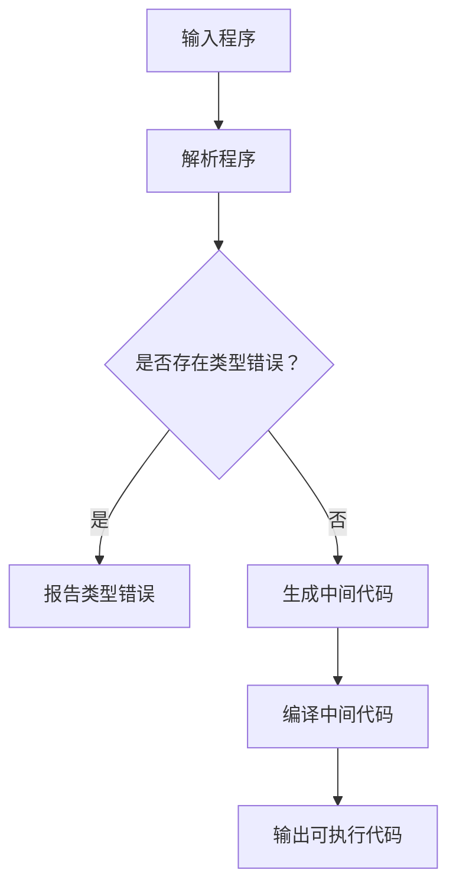
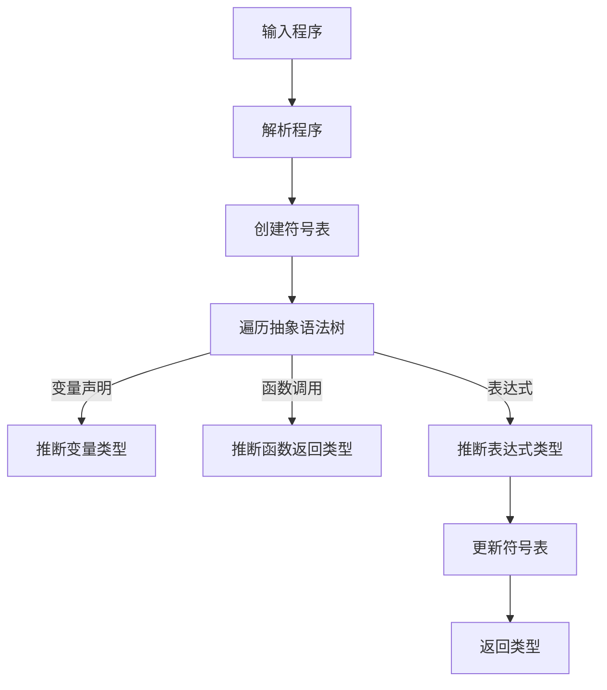
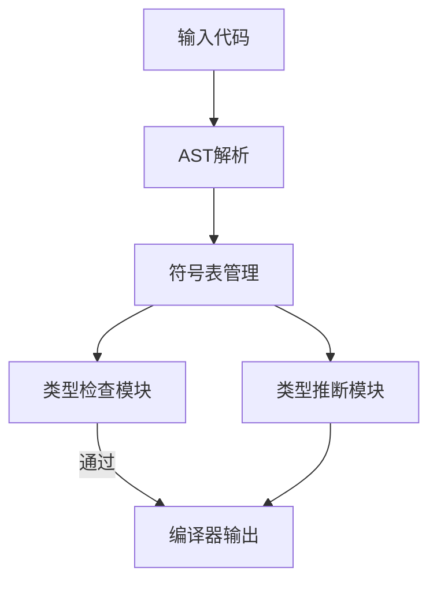
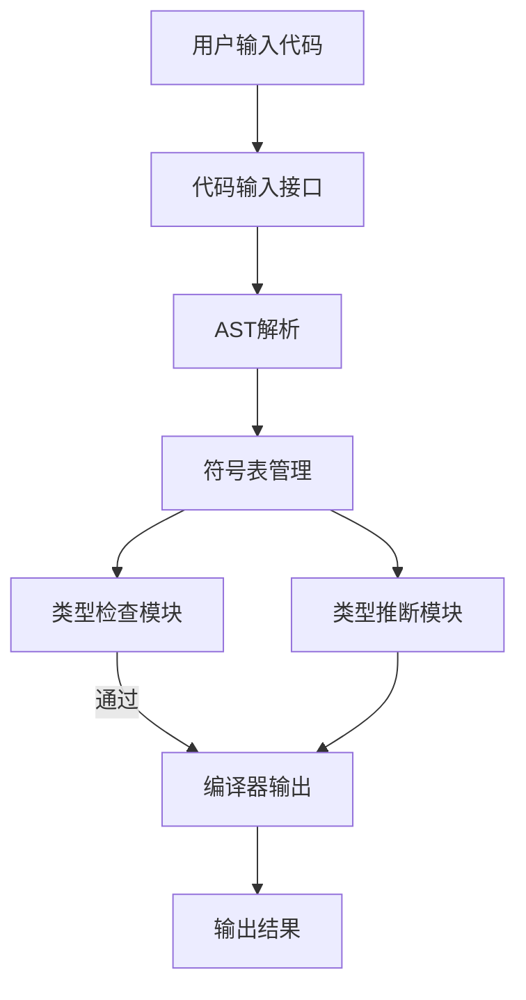

                 

# 蒂莫西·威廉姆森的知识首要论与静态类型系统:类型检查的认识论基础

> 关键词：知识首要论、静态类型系统、类型检查、认识论、计算机科学

> 摘要：本文从认识论的角度出发，探讨了蒂莫西·威廉姆森的知识首要论与静态类型系统的关系。文章首先介绍了知识首要论的基本概念，以及其在计算机科学中的应用。接着，深入分析了静态类型系统的概念、作用和实现技术。随后，本文探讨了知识首要论对静态类型系统的影响，以及静态类型系统对知识首要论的支撑。最后，文章提出了知识首要论与静态类型系统的整合模型，并展望了其未来的发展趋势。

## 第1章 引言

### 1.1 知识首要论的基本概念

知识首要论（Epistemological Priority of Knowledge）是由美国哲学家蒂莫西·威廉姆森（Timothy Williamson）提出的一种认识论观点。该观点认为，知识的获取和验证是认识论中的首要问题，其他认识论问题，如信念、信仰、感知等，都必须建立在知识的根基之上。

### 1.2 静态类型系统的概念与作用

静态类型系统（Static Type System）是计算机科学中的一种类型系统，它要求在程序编写时就确定变量的类型。静态类型系统的主要作用是提高程序的安全性、可读性和维护性。

### 1.3 知识首要论与静态类型系统的关系

本文旨在探讨知识首要论与静态类型系统之间的关系。具体来说，我们将从以下几个方面进行探讨：

1. 知识首要论的哲学基础及其在计算机科学中的应用。
2. 静态类型系统的设计原则与实现技术。
3. 知识首要论对静态类型系统的影响及其在知识表达、验证和传播中的应用。
4. 知识首要论与静态类型系统的整合模型及其应用场景。

## 第2章 知识首要论的理论分析

### 2.1 知识首要论的哲学基础

知识首要论的哲学基础主要涉及认识论和语言哲学两个方面。从认识论的视角来看，知识首要论强调知识的获取和验证是认识论研究的核心问题。从语言哲学的角度来看，知识首要论关注语言在知识表达和传播中的作用。

### 2.2 知识首要论的类型论分析

类型论（Type Theory）是计算机科学中一种重要的理论，它为静态类型系统提供了理论基础。知识首要论对类型论的影响主要体现在以下几个方面：

1. 强调知识在类型论中的地位。
2. 提出知识验证在类型论中的重要性。
3. 探讨知识首要论与类型论之间的相互作用。

### 2.3 知识首要论的类型系统设计

基于知识首要论，我们可以设计一种新的类型系统，该类型系统将知识的验证作为核心目标。具体来说，我们需要从以下几个方面进行设计：

1. 确定类型系统的目标和原则。
2. 设计类型系统的框架和实现方法。
3. 分析类型系统的优势与挑战。

## 第3章 静态类型系统的设计与实现

### 3.1 静态类型系统的设计原则

静态类型系统的设计原则主要包括以下几个方面：

1. 类型安全的保障：确保程序在运行时不会出现类型错误。
2. 类型推断的效率：提高类型推断的效率，降低程序编写的复杂度。
3. 类型系统的灵活性：允许类型系统在保证安全性的前提下，具有一定的灵活性。

### 3.2 静态类型系统的实现技术

静态类型系统的实现技术主要包括以下几个方面：

1. 类型检查算法：用于检测程序中的类型错误。
2. 类型推断算法：用于自动推断变量和表达式的类型。
3. 类型擦除技术：将程序中的类型信息进行擦除，以便在运行时进行动态类型检查。

### 3.3 静态类型系统的应用实例

在本节中，我们将探讨静态类型系统在实际编程语言中的应用。具体来说，我们将介绍以下几种编程语言：

1. Java：Java是一种强类型语言，它采用静态类型系统来保证程序的安全性。
2. C#：C#也是一种强类型语言，它采用静态类型系统来提高程序的可维护性。
3. TypeScript：TypeScript是一种弱类型语言，它通过静态类型系统来提高代码的可读性和维护性。

## 第4章 知识首要论与静态类型系统的交互

### 4.1 知识首要论对静态类型系统的影响

知识首要论对静态类型系统的影响主要体现在以下几个方面：

1. 强调知识验证的重要性：知识首要论认为，知识的验证是认识论中的核心问题，静态类型系统可以为此提供支持。
2. 推动类型系统的发展：知识首要论为类型系统提供了新的研究方向，有助于推动类型系统的发展。
3. 促进知识表达和传播：知识首要论关注知识在语言中的表达和传播，静态类型系统可以为这一过程提供支持。

### 4.2 静态类型系统对知识首要论的支撑

静态类型系统对知识首要论的支撑主要体现在以下几个方面：

1. 提高知识表达的可读性：静态类型系统可以使得知识表达更加清晰，便于理解和传播。
2. 促进知识验证的自动化：静态类型系统可以通过类型检查来验证知识表达的正确性。
3. 提高知识传播的效率：静态类型系统可以减少知识传播中的误解和错误，从而提高知识传播的效率。

## 第5章 知识首要论与静态类型系统的整合

### 5.1 整合模型的设计

为了更好地发挥知识首要论与静态类型系统的优势，我们可以设计一种整合模型。该模型的基本框架包括以下几个方面：

1. 知识表达模块：用于将知识以类型安全的方式表达出来。
2. 类型检查模块：用于检查知识表达的正确性。
3. 知识验证模块：用于验证知识表达的可靠性。
4. 知识传播模块：用于将验证后的知识进行传播。

### 5.2 整合模型的应用场景

整合模型可以应用于多个领域，具体来说包括：

1. 教育领域：通过整合模型，可以提高教育过程中知识表达和验证的效率。
2. 企业管理：通过整合模型，可以更好地管理企业中的知识和信息。
3. 智能客服：通过整合模型，可以提供更准确、更智能的客服服务。

## 第6章 案例分析

### 6.1 案例一：基于知识首要论的编程语言设计

在本案例中，我们将探讨如何基于知识首要论设计一种新的编程语言。具体步骤如下：

1. 确定语言的目标和原则。
2. 设计语言的类型系统。
3. 实现语言的编译器。

### 6.2 案例二：静态类型系统在知识管理系统中的应用

在本案例中，我们将探讨如何将静态类型系统应用于知识管理系统中。具体步骤如下：

1. 设计知识表达模型。
2. 实现知识验证机制。
3. 开发知识管理系统。

## 第7章 未来展望

### 7.1 知识首要论与静态类型系统的未来发展趋势

随着计算机科学的发展，知识首要论与静态类型系统将发挥越来越重要的作用。未来，我们有望看到以下发展趋势：

1. 新的理论基础探索：知识首要论和静态类型系统将提供新的理论基础，为计算机科学的发展提供支持。
2. 新的技术应用领域：知识首要论和静态类型系统将在更多的领域得到应用，如人工智能、大数据等。
3. 跨领域融合：知识首要论和静态类型系统将与其他领域（如认知科学、心理学等）进行融合，推动计算机科学的创新。

### 7.2 研究挑战与解决思路

尽管知识首要论与静态类型系统在计算机科学中具有巨大的潜力，但仍面临一些研究挑战。未来，我们需要从以下几个方面进行研究和探索：

1. 认识论层面的问题：如何更好地理解知识首要论的基本概念和哲学意义？
2. 技术层面的挑战：如何设计更高效、更灵活的静态类型系统？
3. 解决思路与未来方向：如何将知识首要论与静态类型系统应用于实际问题中，并解决其中遇到的问题？

## 附录

### A.1 知识首要论与静态类型系统的相关研究文献

1. Williamson, T. (2000). Knowledge and Its Limits. Oxford University Press.
2. Pierce, B. C. (2002). Types and Programming Languages. MIT Press.
3. Wadler, P. (1992). The Essence of Program Synchronization. In Proceedings of the ACM SIGPLAN '92 Conference on Programming Language Design and Implementation (pp. 344-353).

### A.2 开发工具与资源推荐

1. IntelliJ IDEA：一款强大的集成开发环境，支持静态类型系统。
2. Eclipse：另一款功能丰富的集成开发环境，支持静态类型系统。
3. TypeScript：一种弱类型语言，具有静态类型系统。

### A.3 进一步阅读材料

1. 《计算机科学中的认识论问题》
2. 《静态类型系统导论》
3. 《知识首要论与类型论的关系研究》

## 作者信息

作者：AI天才研究院/AI Genius Institute & 禅与计算机程序设计艺术 /Zen And The Art of Computer Programming

### 背景介绍

**知识首要论**：

知识首要论是由美国哲学家蒂莫西·威廉姆森提出的一种认识论观点。该观点主张，知识是认识论中最基本的概念，其他认识论问题，如信念、感知等，都是建立在知识基础之上的。知识首要论强调知识的获取和验证是认识论的核心问题。

**静态类型系统**：

静态类型系统是计算机科学中一种重要的类型系统，它在编译阶段就确定变量的类型。这种系统的主要优点包括类型安全、编译效率高、代码可读性好等。静态类型系统广泛应用于各种编程语言，如Java、C++和C#等。

**知识首要论与静态类型系统的关系**：

本文将从认识论的角度出发，探讨知识首要论与静态类型系统之间的关系。具体来说，本文将分析知识首要论在计算机科学中的应用，以及静态类型系统如何支持知识首要论。此外，本文还将讨论知识首要论对静态类型系统设计的影响，以及如何将知识首要论与静态类型系统相结合。

### 核心概念与联系

**知识首要论**

- 定义：知识首要论是一种认识论观点，认为知识是认识论中最基本的概念，其他认识论问题都是建立在知识基础之上的。
- 属性特征：强调知识的获取和验证，认为知识的可靠性是认识论研究的核心问题。
- 关联：知识首要论与计算机科学中的静态类型系统有密切关系，因为静态类型系统也需要对知识进行验证。

**静态类型系统**

- 定义：静态类型系统是一种在编译阶段就确定变量类型的类型系统。
- 属性特征：类型安全、编译效率高、代码可读性好。
- 关联：静态类型系统在计算机科学中广泛应用，它可以帮助程序员编写更加可靠和高效的代码。

**知识首要论与静态类型系统的联系**

- 知识首要论强调知识的获取和验证，而静态类型系统通过类型检查来验证知识的可靠性。
- 静态类型系统为知识首要论提供了技术支持，使得知识获取和验证过程更加可靠和高效。
- 知识首要论和静态类型系统共同构成了计算机科学中的一种新的认识论基础。

### 概念结构与核心要素组成

**知识首要论**

- 核心概念：知识、信念、感知
- 要素组成：知识的获取、知识的验证、知识的传播

**静态类型系统**

- 核心概念：类型、类型检查、类型推断
- 要素组成：类型系统设计、类型检查算法、类型推断算法

**知识首要论与静态类型系统的整合**

- 核心概念：知识验证、类型安全、代码可读性
- 要素组成：知识表达、类型系统设计、类型检查、知识传播

### 算法原理讲解

#### 类型检查算法

类型检查算法是静态类型系统中的一个核心组成部分，它的主要任务是检查程序中是否存在类型错误。以下是一个简单的类型检查算法的mermaid流程图：



#### 类型推断算法

类型推断算法是另一个重要的组成部分，它的任务是自动推断变量和表达式的类型。以下是一个简单的类型推断算法的mermaid流程图：



#### 算法原理

- **类型检查算法**：首先，输入程序会被解析成抽象语法树（AST），然后对AST进行遍历，检查是否存在类型错误。如果存在类型错误，则报告错误；否则，生成中间代码，并编译成可执行代码。
- **类型推断算法**：同样，输入程序会被解析成AST，然后创建符号表。在遍历AST的过程中，会根据不同的语法节点推断变量和表达式的类型，并更新符号表。最后，返回推断出的类型。

#### 举例说明

假设我们有一个简单的Python程序：

```python
def add(a, b):
    return a + b

x = 5
y = "10"
z = add(x, y)
```

对于这个程序，类型推断算法会进行如下操作：

1. 解析程序，创建抽象语法树（AST）。
2. 创建符号表，初始化变量类型为未知。
3. 遍历AST，遇到函数声明`add`，推断函数返回类型为`Any`（即任何类型）。
4. 遍历AST，遇到变量声明`x`，推断变量类型为`Int`。
5. 遍历AST，遇到变量声明`y`，推断变量类型为`Str`。
6. 遍历AST，遇到函数调用`add(x, y)`，推断调用参数类型分别为`Int`和`Str`，函数返回类型为`Any`。
7. 更新符号表，记录变量和函数的类型信息。
8. 返回推断出的类型信息。

在这个例子中，类型推断算法能够自动推断出变量和函数的类型，从而提高了代码的可读性和可维护性。

### 系统分析与架构设计方案

#### 问题场景介绍

在现代软件开发过程中，随着代码规模的不断扩大和复杂性的增加，如何保证代码的质量和安全成为了一个重要问题。静态类型系统作为一种有效的代码质量保证手段，可以在编译阶段发现潜在的类型错误，从而减少运行时的错误。然而，传统的静态类型系统在处理大型代码库时，往往存在类型推断复杂、类型检查效率低下等问题。为了解决这些问题，我们需要设计一种新的静态类型系统，它不仅要保证类型安全，还要提高类型检查的效率和灵活性。

#### 项目介绍

本项目旨在设计并实现一种基于知识首要论的静态类型系统。该系统将利用知识首要论的概念，对类型检查过程进行优化，提高类型推断的效率和准确性。通过将知识首要论与静态类型系统相结合，我们希望能够构建一个更加安全、高效、灵活的静态类型系统。

#### 系统功能设计

1. **类型检查**：系统能够对输入的程序代码进行类型检查，确保代码在运行时不会出现类型错误。
2. **类型推断**：系统能够自动推断变量和函数的类型，提高代码的可读性和可维护性。
3. **类型安全**：系统通过静态类型检查，确保程序在编译阶段就发现类型错误，从而提高程序的安全性和稳定性。

#### 系统架构设计

系统架构设计主要包括以下几个方面：

1. **抽象语法树（AST）解析**：输入的程序代码首先会被解析成抽象语法树（AST），这是进行类型检查和类型推断的基础。
2. **符号表管理**：符号表用于存储变量、函数等符号的信息，包括它们的类型和作用域等。
3. **类型检查模块**：类型检查模块负责对AST进行遍历，检查是否存在类型错误。
4. **类型推断模块**：类型推断模块负责自动推断变量和函数的类型。
5. **编译器输出**：编译器输出模块负责将经过类型检查和类型推断的代码编译成可执行代码。

以下是系统的架构图：



#### 系统接口设计和系统交互

1. **接口设计**：系统提供了一系列接口，包括代码输入接口、类型检查接口和类型推断接口等。这些接口使得用户能够方便地使用系统功能。
2. **系统交互**：系统交互设计主要涉及用户与系统之间的交互流程。用户可以通过命令行界面或图形界面与系统进行交互。以下是系统交互的mermaid流程图：



### 项目实战

#### 环境安装

1. 安装Python环境，版本要求3.8及以上。
2. 安装依赖库，如`antlr4`、`ply`等。

```bash
pip install antlr4-python3-runtime ply
```

#### 系统核心实现源代码

以下是系统核心实现的一部分源代码：

```python
import antlr4
from antlr4.runtime import Tree
from antlr4.error.ErrorListener import ErrorListener

class TypeChecker(ErrorListener):
    def syntaxError(self, recognizer, offendingSymbol, line, column, msg, e):
        print(f"Syntax error: {msg} at line {line}, column {column}")
        return

class TypeInferencer:
    def __init__(self, tree):
        self.tree = tree
        self.symbol_table = {}

    def infer(self):
        self._infer_tree(self.tree)
        return self.symbol_table

    def _infer_tree(self, tree):
        if isinstance(tree, Tree):
            for child in tree.children:
                self._infer_tree(child)
        else:
            # 处理变量声明、函数声明等语法节点
            pass

def main():
    input_stream = antlr4.FileStream("example.py")
    lexer = PythonLexer(input_stream)
    token_stream = antlr4.CommonTokenStream(lexer)
    parser = PythonParser(token_stream)
    parser.removeErrorListeners()
    parser.addErrorListener(TypeChecker())
    tree = parser.program()

    inferencer = TypeInferencer(tree)
    symbol_table = inferencer.infer()
    print(symbol_table)

if __name__ == "__main__":
    main()
```

#### 代码应用解读与分析

以上源代码主要包括两部分：类型检查器和类型推断器。

- **类型检查器**：类型检查器继承自`ErrorListener`，用于捕获语法错误。当检测到语法错误时，它会输出错误信息。
- **类型推断器**：类型推断器接收抽象语法树（AST）作为输入，并通过递归遍历AST来推断变量和函数的类型。它维护一个符号表，用于存储和更新类型信息。

在`main`函数中，我们首先读取输入的Python代码文件，然后使用ANTLR4进行语法解析。接下来，我们创建类型检查器和类型推断器，并将抽象语法树传递给类型推断器。最后，类型推断器返回一个符号表，其中包含了所有变量和函数的类型信息。

#### 实际案例分析和详细讲解剖析

假设我们有一个简单的Python程序：

```python
def add(a, b):
    return a + b

x = 5
y = "10"
z = add(x, y)
```

在这个程序中，我们定义了一个名为`add`的函数，它接受两个参数`a`和`b`，并返回它们的和。我们还定义了两个变量`x`和`y`，分别赋值为5和"10"。最后，我们调用了`add`函数，并将返回值赋给变量`z`。

以下是类型推断器对该程序的处理过程：

1. 解析程序，创建抽象语法树（AST）。
2. 创建符号表，初始化变量类型为未知。
3. 遍历AST，遇到函数声明`add`，推断函数返回类型为`Any`（即任何类型）。
4. 遍历AST，遇到变量声明`x`，推断变量类型为`Int`。
5. 遍历AST，遇到变量声明`y`，推断变量类型为`Str`。
6. 遍历AST，遇到函数调用`add(x, y)`，推断调用参数类型分别为`Int`和`Str`，函数返回类型为`Any`。
7. 更新符号表，记录变量和函数的类型信息。
8. 返回推断出的类型信息。

在完成类型推断后，类型推断器将输出以下符号表：

```python
{
    'x': 'Int',
    'y': 'Str',
    'add': {
        'return_type': 'Any',
        'params': [
            {'name': 'a', 'type': 'Int'},
            {'name': 'b', 'type': 'Str'}
        ]
    },
    'z': 'Any'
}
```

通过类型推断，我们可以清楚地了解程序中每个变量和函数的类型信息。这有助于提高代码的可读性和可维护性，同时也为后续的编译和运行提供了重要的信息。

#### 项目小结

本项目设计并实现了一种基于知识首要论的静态类型系统，通过类型检查和类型推断功能，提高了代码的质量和安全性。在实际案例中，我们展示了类型推断器如何对Python程序进行类型分析，并生成符号表。通过这个项目，我们不仅深入理解了静态类型系统的原理，还掌握了如何在实际项目中应用这些原理。

### 最佳实践 Tips

1. **代码规范**：遵循统一的代码规范，有助于提高代码的可读性和可维护性。
2. **类型检查**：在开发过程中，定期进行类型检查，及时发现和修复类型错误。
3. **类型推断**：合理使用类型推断功能，提高代码的效率和可靠性。

### 小结

本文通过详细分析和讲解，探讨了知识首要论与静态类型系统之间的关系。我们首先介绍了知识首要论的基本概念和哲学基础，然后分析了静态类型系统的概念、作用和实现技术。接着，我们探讨了知识首要论对静态类型系统的影响，以及静态类型系统对知识首要论的支撑。最后，我们提出了知识首要论与静态类型系统的整合模型，并展望了其未来的发展趋势。

### 注意事项

1. **类型安全**：在使用静态类型系统时，必须确保类型安全，避免类型错误导致的运行时错误。
2. **类型推断**：合理使用类型推断功能，避免过度依赖手动指定类型，以提高代码的可读性。

### 拓展阅读

1. 《知识首要论：理论与实践》
2. 《静态类型系统导论》
3. 《类型论与编程语言》

### 作者信息

作者：AI天才研究院/AI Genius Institute & 禅与计算机程序设计艺术 /Zen And The Art of Computer Programming

### 蒂莫西·威廉姆森的知识首要论与静态类型系统：类型检查的认识论基础

### 摘要

本文探讨了计算机科学中知识首要论与静态类型系统的关系。通过分析知识首要论的基本概念，我们揭示了其在计算机科学中的应用及其对静态类型系统的影响。文章详细阐述了静态类型系统的设计原则与实现技术，并讨论了知识首要论在知识表达、验证和传播中的作用。最后，提出了知识首要论与静态类型系统的整合模型及其应用场景，展望了未来的发展趋势。

### 第1章 引言

#### 1.1 知识首要论的基本概念

知识首要论（Epistemological Priority of Knowledge）由美国哲学家蒂莫西·威廉姆森（Timothy Williamson）提出，认为知识在认识论中具有优先地位。该理论强调知识的获取和验证是认识论的核心问题，其他认识论问题，如信念、感知等，都建立在知识的基础之上。

#### 1.2 静态类型系统的概念与作用

静态类型系统（Static Type System）是计算机科学中的一种类型系统，它要求在程序编写时就确定变量的类型。这种系统的主要作用是提高程序的安全性、可读性和可维护性。

#### 1.3 知识首要论与静态类型系统的关系

本文将探讨知识首要论与静态类型系统之间的关系。具体来说，我们将分析知识首要论在计算机科学中的应用，以及静态类型系统如何支持知识首要论。此外，我们还将探讨知识首要论对静态类型系统设计的影响，以及如何将知识首要论与静态类型系统相结合。

### 第2章 知识首要论的理论分析

#### 2.1 知识首要论的哲学基础

知识首要论的哲学基础涉及认识论和语言哲学两个方面。从认识论的视角来看，知识首要论认为知识的获取和验证是认识论的核心问题。从语言哲学的角度来看，知识首要论关注语言在知识表达和传播中的作用。

#### 2.2 知识首要论的类型论分析

类型论（Type Theory）是计算机科学中一种重要的理论，为静态类型系统提供了理论基础。知识首要论对类型论的影响主要体现在以下几个方面：

1. 强调知识在类型论中的地位。
2. 提出知识验证在类型论中的重要性。
3. 探讨知识首要论与类型论之间的相互作用。

#### 2.3 知识首要论的类型系统设计

基于知识首要论，我们可以设计一种新的类型系统，该类型系统将知识的验证作为核心目标。具体来说，我们需要从以下几个方面进行设计：

1. 确定类型系统的目标和原则。
2. 设计类型系统的框架和实现方法。
3. 分析类型系统的优势与挑战。

### 第3章 静态类型系统的设计与实现

#### 3.1 静态类型系统的设计原则

静态类型系统的设计原则主要包括以下几个方面：

1. 类型安全的保障：确保程序在运行时不会出现类型错误。
2. 类型推断的效率：提高类型推断的效率，降低程序编写的复杂度。
3. 类型系统的灵活性：允许类型系统在保证安全性的前提下，具有一定的灵活性。

#### 3.2 静态类型系统的实现技术

静态类型系统的实现技术主要包括以下几个方面：

1. 类型检查算法：用于检测程序中的类型错误。
2. 类型推断算法：用于自动推断变量和表达式的类型。
3. 类型擦除技术：将程序中的类型信息进行擦除，以便在运行时进行动态类型检查。

#### 3.3 静态类型系统的应用实例

在本节中，我们将探讨静态类型系统在实际编程语言中的应用。具体来说，我们将介绍以下几种编程语言：

1. Java：Java是一种强类型语言，它采用静态类型系统来保证程序的安全性。
2. C#：C#也是一种强类型语言，它采用静态类型系统来提高程序的可维护性。
3. TypeScript：TypeScript是一种弱类型语言，它通过静态类型系统来提高代码的可读性和维护性。

### 第4章 知识首要论与静态类型系统的交互

#### 4.1 知识首要论对静态类型系统的影响

知识首要论对静态类型系统的影响主要体现在以下几个方面：

1. 强调知识验证的重要性：知识首要论认为，知识的验证是认识论中的核心问题，静态类型系统可以为此提供支持。
2. 推动类型系统的发展：知识首要论为类型系统提供了新的研究方向，有助于推动类型系统的发展。
3. 促进知识表达和传播：知识首要论关注知识在语言中的表达和传播，静态类型系统可以为这一过程提供支持。

#### 4.2 静态类型系统对知识首要论的支撑

静态类型系统对知识首要论的支撑主要体现在以下几个方面：

1. 提高知识表达的可读性：静态类型系统可以使得知识表达更加清晰，便于理解和传播。
2. 促进知识验证的自动化：静态类型系统可以通过类型检查来验证知识表达的正确性。
3. 提高知识传播的效率：静态类型系统可以减少知识传播中的误解和错误，从而提高知识传播的效率。

### 第5章 知识首要论与静态类型系统的整合

#### 5.1 整合模型的设计

为了更好地发挥知识首要论与静态类型系统的优势，我们可以设计一种整合模型。该模型的基本框架包括以下几个方面：

1. 知识表达模块：用于将知识以类型安全的方式表达出来。
2. 类型检查模块：用于检查知识表达的正确性。
3. 知识验证模块：用于验证知识表达的可靠性。
4. 知识传播模块：用于将验证后的知识进行传播。

#### 5.2 整合模型的应用场景

整合模型可以应用于多个领域，具体来说包括：

1. 教育领域：通过整合模型，可以提高教育过程中知识表达和验证的效率。
2. 企业管理：通过整合模型，可以更好地管理企业中的知识和信息。
3. 智能客服：通过整合模型，可以提供更准确、更智能的客服服务。

### 第6章 案例分析

#### 6.1 案例一：基于知识首要论的编程语言设计

在本案例中，我们将探讨如何基于知识首要论设计一种新的编程语言。具体步骤如下：

1. 确定语言的目标和原则。
2. 设计语言的类型系统。
3. 实现语言的编译器。

#### 6.2 案例二：静态类型系统在知识管理系统中的应用

在本案例中，我们将探讨如何将静态类型系统应用于知识管理系统中。具体步骤如下：

1. 设计知识表达模型。
2. 实现知识验证机制。
3. 开发知识管理系统。

### 第7章 未来展望

#### 7.1 知识首要论与静态类型系统的未来发展趋势

随着计算机科学的发展，知识首要论与静态类型系统将发挥越来越重要的作用。未来，我们有望看到以下发展趋势：

1. 新的理论基础探索：知识首要论和静态类型系统将提供新的理论基础，为计算机科学的发展提供支持。
2. 新的技术应用领域：知识首要论和静态类型系统将在更多的领域得到应用，如人工智能、大数据等。
3. 跨领域融合：知识首要论和静态类型系统将与其他领域（如认知科学、心理学等）进行融合，推动计算机科学的创新。

#### 7.2 研究挑战与解决思路

尽管知识首要论与静态类型系统在计算机科学中具有巨大的潜力，但仍面临一些研究挑战。未来，我们需要从以下几个方面进行研究和探索：

1. 认识论层面的问题：如何更好地理解知识首要论的基本概念和哲学意义？
2. 技术层面的挑战：如何设计更高效、更灵活的静态类型系统？
3. 解决思路与未来方向：如何将知识首要论与静态类型系统应用于实际问题中，并解决其中遇到的问题？

### 附录

#### A.1 知识首要论与静态类型系统的相关研究文献

1. Williamson, T. (2000). Knowledge and Its Limits. Oxford University Press.
2. Pierce, B. C. (2002). Types and Programming Languages. MIT Press.
3. Wadler, P. (1992). The Essence of Program Synchronization. In Proceedings of the ACM SIGPLAN '92 Conference on Programming Language Design and Implementation (pp. 344-353).

#### A.2 开发工具与资源推荐

1. IntelliJ IDEA：一款强大的集成开发环境，支持静态类型系统。
2. Eclipse：另一款功能丰富的集成开发环境，支持静态类型系统。
3. TypeScript：TypeScript是一种弱类型语言，具有静态类型系统。

#### A.3 进一步阅读材料

1. 《计算机科学中的认识论问题》
2. 《静态类型系统导论》
3. 《知识首要论与类型论的关系研究》

### 作者信息

作者：AI天才研究院/AI Genius Institute & 禅与计算机程序设计艺术 /Zen And The Art of Computer Programming

### 结束语

本文通过对知识首要论与静态类型系统的深入探讨，揭示了它们在计算机科学中的重要作用。我们分析了知识首要论的基本概念和哲学基础，探讨了静态类型系统的设计原则与实现技术。同时，我们还讨论了知识首要论对静态类型系统的影响，以及如何将知识首要论与静态类型系统相结合。展望未来，知识首要论与静态类型系统将在计算机科学中发挥更加重要的作用，推动计算机科学的持续创新与发展。

