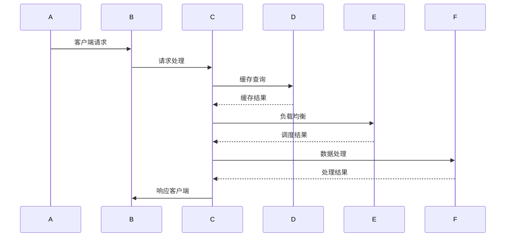
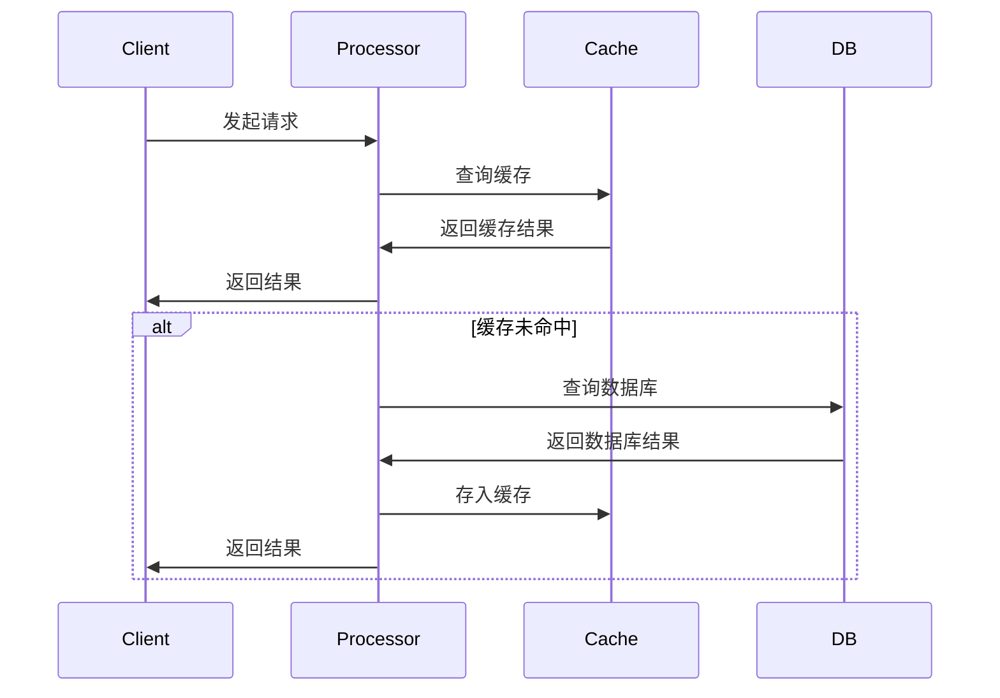

                 

### 《薛定谔猫与并发编程：状态叠加的程序实现》

> 关键词：量子力学、并发编程、状态叠加、线程同步、性能优化

> 摘要：本文通过将量子力学中的薛定谔猫思想实验与并发编程中的状态管理进行类比，探讨了状态叠加在程序实现中的应用。文章首先介绍了并发编程的基础概念，然后深入分析了并发编程中的核心概念和算法原理，接着提出了并发编程模型和实战案例，最后讨论了性能优化策略。本文旨在帮助读者理解并发编程的本质，掌握状态叠加的实现技术，并提升程序性能。

----------------------------------------------------------------

## 《薛定谔猫与并发编程：状态叠加的程序实现》目录大纲

### 第一部分：理论篇

#### 第1章：并发编程基础

##### 1.1 并发编程概述

- 并发编程的定义
- 并发与并行
- 并发编程的重要性

##### 1.2 薛定谔猫与量子力学基础

- 薛定谔猫的思想实验
- 量子力学中的叠加态
- 薛定谔猫与并发编程的联系

##### 1.3 状态叠加与并发编程

- 状态叠加的概念
- 并发编程中的状态管理
- 状态叠加的编程实现

#### 第2章：并发编程核心概念

##### 2.1 线程

- 线程的概念
- 线程的生命周期
- 线程的创建与销毁

##### 2.2 锁与同步

- 锁的概念
- 互斥锁
- 读写锁
- 线程同步机制

##### 2.3 状态与状态迁移

- 状态的定义
- 状态迁移模型
- 状态迁移在并发编程中的应用

#### 第3章：并发编程算法原理

##### 3.1 条件变量

- 条件变量的概念
- 条件变量的使用方法
- 条件变量的应用实例

##### 3.2 原子操作

- 原子操作的概念
- 原子操作的类型
- 原子操作在并发编程中的应用

##### 3.3 无锁编程

- 无锁编程的概念
- 无锁编程的优点
- 无锁编程的挑战

#### 第4章：并发编程模型

##### 4.1 多线程模型

- 多线程模型的定义
- 多线程模型的优缺点
- 多线程模型的编程实践

##### 4.2 守护线程

- 守护线程的概念
- 守护线程的用途
- 守护线程的实现方法

##### 4.3 线程池

- 线程池的概念
- 线程池的工作原理
- 线程池的应用实例

### 第二部分：实战篇

#### 第5章：并发编程项目实战

##### 5.1 项目介绍

- 项目背景
- 项目目标

##### 5.2 项目需求分析

- 功能需求
- 性能需求
- 安全需求

##### 5.3 项目架构设计

- 架构设计思路
- 架构设计图

#### 第6章：并发编程环境搭建

##### 6.1 开发环境准备

- 操作系统
- 编译器
- 源代码管理工具

##### 6.2 并发编程框架选择

- Java并发框架
- C++并发库
- Python并发库

#### 第7章：并发编程代码实现

##### 7.1 线程创建与销毁

- Java中的线程创建与销毁
- C++中的线程创建与销毁
- Python中的线程创建与销毁

##### 7.2 锁与同步

- 互斥锁的实现
- 读写锁的实现
- 线程同步机制的应用

##### 7.3 状态管理

- 状态的定义与表示
- 状态迁移的实现
- 状态管理的最佳实践

#### 第8章：并发编程性能优化

##### 8.1 性能瓶颈分析

- CPU瓶颈
- 内存瓶颈
- 网络瓶颈

##### 8.2 性能优化策略

- 线程数调整
- 锁优化
- 缓存优化

##### 8.3 性能测试与调优

- 性能测试工具
- 性能调优方法
- 性能调优案例

### 附录

#### 附录A：并发编程资源

- 并发编程书籍推荐
- 并发编程在线课程
- 并发编程社区论坛

#### 附录B：并发编程工具与库

- Java并发库
- C++并发库
- Python并发库

#### 附录C：Mermaid流程图示例

- 状态迁移流程图
- 并发编程算法流程图

### 参考文献

- 并发编程相关书籍
- 并发编程相关论文
- 量子力学与并发编程相关研究

----------------------------------------------------------------

## 第一部分：理论篇

### 第1章：并发编程基础

#### 1.1 并发编程概述

并发编程是指计算机系统中同时处理多个任务的能力。它是在多核处理器普及和互联网时代需求增长的背景下，成为计算机科学和软件工程领域的重要研究方向。并发编程的核心目标是提高程序的性能、提升资源利用率和改善用户体验。

**并发编程的定义**：并发编程是一种编程范式，允许多个任务同时执行，每个任务可以独立运行，互不干扰，但共享系统资源。

**并发与并行**：并发（Concurrency）和并行（Parallelism）是两个不同的概念。并行是指多个任务在同一时间执行，而并发是指多个任务在同一时间间隔内执行。在单核处理器中，并发通常通过时间切片或轮询的方式实现，而在多核处理器中，并行则可以通过真正的多任务处理实现。

**并发编程的重要性**：在多核处理器时代，并发编程能够充分利用硬件资源，提高程序的性能。此外，并发编程还能在复杂的分布式系统中实现任务调度，提高系统的响应速度和稳定性。

#### 1.2 薛定谔猫与量子力学基础

**薛定谔猫的思想实验**：薛定谔猫是奥地利物理学家薛定谔提出的一个思想实验，用来揭示量子力学中叠加态的奇特现象。在这个实验中，一只猫被放在一个封闭的盒子里，与一个放射性物质和检测器相连。如果放射性物质在一段时间内发生衰变，检测器会触发一个机制，杀死猫；如果没有发生衰变，猫将活着。按照量子力学的观点，猫在盒子中处于既死又活的状态，即叠加态。

**量子力学中的叠加态**：叠加态是量子力学中的一个核心概念，表示一个量子系统处于多种可能状态的组合。薛定谔猫实验中的猫就是一个典型的叠加态例子，它在未被观察前既处于生和死的叠加状态。

**薛定谔猫与并发编程的联系**：薛定谔猫的思想实验可以类比于并发编程中的状态管理。在并发编程中，一个进程或线程可能处于多个状态之间转换的过程中，这种状态叠加的现象在编程实践中具有重要的应用价值。例如，线程的执行状态可以从“运行”到“阻塞”，再到“等待”，多个状态之间可以同时存在，形成一个叠加态。

#### 1.3 状态叠加与并发编程

**状态叠加的概念**：状态叠加是指一个系统可以在某一时刻同时处于多个状态，每个状态对应的概率由量子态函数的幅值平方表示。

**并发编程中的状态管理**：在并发编程中，状态管理是确保程序正确性和性能的关键。一个并发程序通常需要维护多个线程的状态，如线程的生命周期、执行状态、同步状态等。状态管理需要考虑线程之间的数据共享和状态同步，避免出现竞态条件和死锁等问题。

**状态叠加的编程实现**：在编程实践中，状态叠加可以通过枚举所有可能的并发状态，并使用标志位或枚举类型来表示状态。例如，一个线程的状态可以表示为`RUNNABLE`、`BLOCKED`和`TERMINATED`三种状态，通过设置标志位或枚举值来表示线程当前所处的状态。

---

在本章中，我们介绍了并发编程的基础概念，探讨了薛定谔猫与量子力学基础，以及状态叠加在并发编程中的应用。接下来，我们将进一步深入探讨并发编程中的核心概念和算法原理，为理解并发编程提供更深入的视角。

## 第2章：并发编程核心概念

在理解并发编程的基础概念后，我们需要进一步探讨并发编程中的核心概念，这些概念包括线程、锁与同步、状态与状态迁移。这些核心概念是构建并发程序的基础，对于确保程序的正确性和性能至关重要。

### 2.1 线程

线程是并发编程的基本执行单元。它是一个独立运行的进程中的一个执行流程，拥有独立的堆栈、局部变量和程序计数器。线程的主要作用是并行执行任务，提高程序的执行效率。

**线程的概念**：线程可以看作是一个轻量级的进程，它们共享进程的资源，如内存空间、文件描述符等。线程的创建和管理是并发编程的基础。

**线程的生命周期**：线程的生命周期包括创建、就绪、运行、阻塞和终止等状态。线程的创建可以通过系统调用或库函数实现，线程的销毁通常在任务完成后自动进行。

**线程的创建与销毁**：线程的创建可以通过以下方式实现：

- **Java中的线程创建**：在Java中，可以使用`Thread`类或`Runnable`接口创建线程。例如：
  ```java
  Thread t = new Thread(new MyRunnable());
  t.start();
  ```

- **C++中的线程创建**：在C++中，可以使用`std::thread`类创建线程。例如：
  ```cpp
  std::thread t(MyFunction);
  t.join();
  ```

- **Python中的线程创建**：在Python中，可以使用`threading`模块创建线程。例如：
  ```python
  import threading
  t = threading.Thread(target=MyFunction)
  t.start()
  t.join()
  ```

线程的销毁通常在任务完成后自动进行，但需要注意线程的异常终止，避免造成资源泄露。

### 2.2 锁与同步

在并发编程中，多个线程可能同时访问共享资源，导致数据不一致或竞态条件。为了解决这个问题，引入了锁与同步机制。

**锁的概念**：锁是一种同步机制，用于控制对共享资源的访问。它允许一个线程在获取锁后独占访问资源，其他线程必须等待锁被释放后才能访问。

**互斥锁**：互斥锁（Mutex）是一种基本的锁机制，确保同一时刻只有一个线程能够访问共享资源。在Java中，可以使用`synchronized`关键字或`ReentrantLock`类实现互斥锁；在C++中，可以使用`std::mutex`类；在Python中，可以使用`threading.Lock`类。

**读写锁**：读写锁（Read-Write Lock）允许多个线程同时读共享资源，但在写操作时保持独占访问。这种锁适用于读操作远多于写操作的场景。在Java中，可以使用`ReentrantReadWriteLock`类实现读写锁；在C++中，可以使用`std::shared_mutex`类。

**线程同步机制**：除了锁，还有其他线程同步机制，如信号量（Semaphore）、条件变量（Condition Variable）和事件（Event）。信号量用于限制对共享资源的访问数量；条件变量用于线程之间的条件等待；事件用于线程之间的通知。

### 2.3 状态与状态迁移

在并发编程中，状态迁移是一个重要概念。线程在不同状态之间切换，完成特定的任务。

**状态的定义**：状态是线程执行过程中的一个特定条件，如运行、阻塞、等待、终止等。

**状态迁移模型**：状态迁移模型描述线程在不同状态之间的转换规则。例如，线程可以从运行状态切换到阻塞状态，或从等待状态切换到运行状态。

**状态迁移在并发编程中的应用**：在并发编程中，状态迁移广泛应用于线程调度、资源分配和任务管理。例如，线程在等待一个条件变量时处于等待状态，当条件满足时，线程可以切换到运行状态。

**状态管理的最佳实践**：

1. **避免死锁**：确保线程在获取锁时遵循一定的顺序，避免死锁的发生。
2. **减少锁持有时间**：尽量减少锁的持有时间，避免长时间占用资源，提高系统的并发性能。
3. **合理使用读写锁**：在读操作远多于写操作的场景中，使用读写锁可以提高程序的并发性能。

---

在本章中，我们详细介绍了线程、锁与同步以及状态与状态迁移等核心概念。这些概念是并发编程的基础，对于编写高效、可靠的并发程序至关重要。接下来，我们将进一步探讨并发编程中的算法原理，以深入理解并发编程的内在机制。

### 第3章：并发编程算法原理

在并发编程中，理解并掌握核心算法原理对于编写高效、可靠的程序至关重要。本章将介绍条件变量、原子操作和无锁编程等并发编程算法原理，并探讨其在并发编程中的应用。

#### 3.1 条件变量

条件变量是一种用于线程间同步的机制，允许线程在满足特定条件时才能继续执行。条件变量常与互斥锁结合使用，以实现线程的等待和通知。

**条件变量的概念**：条件变量是一种抽象的数据结构，用于线程之间的条件同步。线程可以进入条件变量的等待队列，直到某个条件满足时被唤醒。

**条件变量的使用方法**：在Java中，可以使用`Object`的`wait()`和`notify()`方法实现条件变量；在C++中，可以使用`std::condition_variable`类；在Python中，可以使用`threading.Condition`类。

**条件变量的应用实例**：以下是一个使用Java实现条件变量的简单示例：

```java
class ConditionExample {
  private Object lock = new Object();
  private boolean condition = false;

  public void waitMethod() {
    synchronized (lock) {
      while (!condition) {
        try {
          lock.wait();
        } catch (InterruptedException e) {
          e.printStackTrace();
        }
      }
      // 条件满足后的操作
    }
  }

  public void notifyMethod() {
    synchronized (lock) {
      condition = true;
      lock.notify();
    }
  }
}
```

在这个示例中，`waitMethod()`方法用于等待条件满足，`notifyMethod()`方法用于通知等待线程条件已满足。

#### 3.2 原子操作

原子操作是一种不可分割的操作，一旦开始执行，就必须完全执行完成，不会受到其他线程的干扰。原子操作在并发编程中用于确保数据的一致性和线程安全。

**原子操作的概念**：原子操作是一组指令，这些指令在执行过程中不会被中断。常见的原子操作包括加法、赋值、自增等。

**原子操作的类型**：原子操作可以分为以下几种类型：

- **读取-修改-写入（Read-Modify-Write）**：这种类型的原子操作包括自增、自减等操作。
- **比较并交换（Compare-and-Swap，CAS）**：CAS操作是一种常见的高级原子操作，用于实现无锁编程。它比较内存中的值与预期值，如果相等，则将内存中的值替换为新值；否则，操作失败。

**原子操作在并发编程中的应用**：原子操作在并发编程中广泛用于实现无锁数据结构和并发算法，如计数器、锁和队列等。

以下是一个使用Java实现原子操作的简单示例：

```java
import java.util.concurrent.atomic.AtomicInteger;

public class AtomicExample {
  private AtomicInteger counter = new AtomicInteger(0);

  public void increment() {
    counter.incrementAndGet();
  }

  public int getCounter() {
    return counter.get();
  }
}
```

在这个示例中，`AtomicInteger`类提供了原子操作，确保了对计数器的并发访问不会产生竞态条件。

#### 3.3 无锁编程

无锁编程是一种避免使用锁的并发编程方法，通过原子操作和其他同步机制实现线程安全。无锁编程具有以下优点：

- **减少锁争用**：无锁编程减少了锁的争用，提高了程序的性能。
- **简化代码**：无锁编程简化了代码结构，减少了死锁和锁死的现象。

**无锁编程的概念**：无锁编程（Lock-free Programming）是指通过无锁数据结构和原子操作实现并发编程，避免使用锁。无锁数据结构包括队列、环形缓冲区和堆栈等。

**无锁编程的优点**：无锁编程具有以下优点：

- **减少锁争用**：无锁编程减少了锁的争用，提高了程序的性能。
- **简化代码**：无锁编程简化了代码结构，减少了死锁和锁死的现象。

**无锁编程的挑战**：无锁编程面临以下挑战：

- **复杂度增加**：无锁编程需要编写更复杂的代码，确保操作的正确性和线程安全性。
- **性能调优**：无锁编程的性能调优比传统的锁编程更为复杂，需要精细地调整数据结构和算法。

以下是一个使用Java实现的无锁队列示例：

```java
import java.util.concurrent.atomic.AtomicReferenceArray;

public class LockFreeQueue {
  private AtomicReferenceArray<Node> queue;

  public LockFreeQueue(int capacity) {
    queue = new AtomicReferenceArray<>(capacity);
    for (int i = 0; i < capacity; i++) {
      queue.set(i, new Node());
    }
  }

  public void enqueue(int value) {
    // 执行入队操作
  }

  public int dequeue() {
    // 执行出队操作
  }

  private static class Node {
    int value;
    AtomicReference<Node> next;
  }
}
```

在这个示例中，`AtomicReferenceArray`类提供了无锁访问和原子操作，确保了队列的正确性和线程安全性。

---

在本章中，我们介绍了条件变量、原子操作和无锁编程等并发编程算法原理，并探讨了其在并发编程中的应用。这些算法原理为编写高效、可靠的并发程序提供了重要指导。接下来，我们将进一步讨论并发编程模型，以了解并发编程的常见实现方式。

### 第4章：并发编程模型

在并发编程中，选择合适的并发编程模型对于提升程序的性能和可靠性至关重要。本章将介绍多线程模型、守护线程和线程池等常见的并发编程模型，并探讨它们的特点和应用。

#### 4.1 多线程模型

多线程模型是最常见的并发编程模型，它通过创建多个线程来并行执行任务。每个线程独立运行，拥有独立的栈和程序计数器。

**多线程模型的定义**：多线程模型是指在一个程序中同时运行多个线程，这些线程共享程序的内存空间和其他资源。

**多线程模型的优缺点**：

- **优点**：
  - **提高性能**：多线程模型能够充分利用多核处理器的资源，提高程序的执行效率。
  - **提升响应性**：通过在多个线程上执行任务，程序可以更快速地响应用户的操作。

- **缺点**：
  - **同步复杂性**：线程之间的同步和数据共享增加了程序的复杂度，需要精心设计和管理。
  - **资源消耗**：线程的创建和销毁会消耗系统资源，过多的线程可能导致资源耗尽。

**多线程模型的编程实践**：

1. **线程安全**：确保线程安全，避免竞态条件和数据不一致的问题。
2. **线程池**：使用线程池管理线程，避免频繁创建和销毁线程，提高程序的执行效率。
3. **任务分配**：合理分配任务，避免某个线程负载过高，导致性能下降。

以下是一个简单的Java多线程示例：

```java
public class MultiThreadExample {
  public static void main(String[] args) {
    Thread t1 = new Thread(new MyRunnable());
    Thread t2 = new Thread(new MyRunnable());
    t1.start();
    t2.start();
  }
}

class MyRunnable implements Runnable {
  @Override
  public void run() {
    // 执行任务
  }
}
```

在这个示例中，我们创建了两个线程，并分别启动它们。

#### 4.2 守护线程

守护线程是一种特殊的线程，用于在后台执行一些辅助任务，而不影响主线程的执行。守护线程的特点是它们会在主线程结束时会自动终止。

**守护线程的概念**：守护线程（Daemon Thread）是一种在后台运行的线程，用于执行一些不需要关注的任务，如垃圾回收、日志记录等。

**守护线程的用途**：

- **后台任务**：用于执行一些不需要用户关注的任务，如服务器监控、日志记录等。
- **资源清理**：在程序结束时自动清理资源，如关闭文件、释放内存等。

**守护线程的实现方法**：

1. **设置线程的daemon属性**：在Java中，可以使用`setDaemon(true)`方法将线程设置为守护线程。
2. **继承Thread类**：在C++中，可以通过继承`std::thread`类并设置其daemon属性来创建守护线程。
3. **使用线程池**：在某些编程语言中，可以使用线程池创建和管理守护线程。

以下是一个简单的Java守护线程示例：

```java
public class DaemonThreadExample {
  public static void main(String[] args) {
    Thread t = new Thread(new MyRunnable());
    t.setDaemon(true);
    t.start();
  }
}

class MyRunnable implements Runnable {
  @Override
  public void run() {
    // 执行守护任务
  }
}
```

在这个示例中，我们将线程`t`设置为守护线程，当主线程结束时，`t`线程会自动终止。

#### 4.3 线程池

线程池是一种并发编程模型，用于管理线程的创建、执行和销毁。线程池通过复用线程，避免了频繁创建和销毁线程带来的性能开销。

**线程池的概念**：线程池（Thread Pool）是一个线程管理池，用于管理线程的创建、执行和销毁。线程池中的线程可以重用，避免了频繁创建和销毁线程带来的性能开销。

**线程池的工作原理**：

1. **线程创建**：线程池初始化时创建一定数量的线程。
2. **任务队列**：线程池包含一个任务队列，用于存储待执行的任务。
3. **线程执行**：线程池中的线程从任务队列中获取任务并执行，任务执行完成后重新进入等待队列。
4. **线程销毁**：线程池根据配置自动销毁空闲线程，避免资源浪费。

**线程池的应用实例**：

- **Java线程池**：Java提供了`ExecutorService`接口和`ThreadPoolExecutor`类实现线程池。
- **C++线程池**：C++标准库提供了`std::thread`类，并有一些第三方库（如`Boost.Thread`）提供了线程池的实现。
- **Python线程池**：Python提供了`concurrent.futures`模块，用于创建和管理线程池。

以下是一个简单的Java线程池示例：

```java
import java.util.concurrent.ExecutorService;
import java.util.concurrent.Executors;

public class ThreadPoolExample {
  public static void main(String[] args) {
    ExecutorService executor = Executors.newFixedThreadPool(10);
    for (int i = 0; i < 10; i++) {
      executor.execute(new MyRunnable());
    }
    executor.shutdown();
  }
}

class MyRunnable implements Runnable {
  @Override
  public void run() {
    // 执行任务
  }
}
```

在这个示例中，我们创建了一个包含10个线程的固定线程池，并提交了10个任务。

---

在本章中，我们介绍了多线程模型、守护线程和线程池等常见的并发编程模型，并探讨了它们的特点和应用。这些并发编程模型为编写高效、可靠的并发程序提供了重要指导。接下来，我们将进入实战篇，通过实际项目案例来深入探讨并发编程的应用和实现。

### 第5章：并发编程项目实战

#### 5.1 项目介绍

本节将介绍一个并发编程项目，该项目的目标是实现一个高性能的并发Web服务器。该项目旨在通过并发编程技术提升Web服务器的响应速度和处理能力。

**项目背景**：随着互联网的快速发展，Web服务器的性能需求越来越高。传统的单线程Web服务器已经无法满足大规模并发请求的处理需求。为了提高性能，需要采用并发编程技术，实现多线程处理并发请求。

**项目目标**：

1. **实现高性能并发处理**：通过多线程模型、线程池和锁与同步机制，提升Web服务器的并发处理能力。
2. **确保线程安全**：在并发编程中，确保数据的一致性和线程安全性，避免竞态条件和死锁等问题。
3. **优化性能**：通过性能测试和调优，优化Web服务器的性能，提升其响应速度和处理能力。

#### 5.2 项目需求分析

**功能需求**：

1. **并发处理请求**：Web服务器需要能够同时处理多个客户端请求，提高系统的并发处理能力。
2. **线程安全**：确保在多线程环境下，数据的一致性和线程安全性，避免竞态条件和死锁等问题。
3. **高效缓存**：实现高效的数据缓存机制，提高数据的访问速度，减少磁盘IO开销。
4. **负载均衡**：实现负载均衡算法，合理分配请求到不同线程，避免单点瓶颈。

**性能需求**：

1. **高并发处理能力**：Web服务器需要能够处理大量并发请求，保证系统在高负载下的稳定运行。
2. **低延迟**：减少请求处理延迟，提高用户体验。
3. **高吞吐量**：实现高效的请求处理，提高系统的吞吐量。

**安全需求**：

1. **数据保护**：确保数据在传输和存储过程中的安全性，防止数据泄露和篡改。
2. **访问控制**：实现访问控制机制，限制未授权用户的访问。
3. **安全审计**：实现安全审计功能，记录和监控系统的安全事件。

#### 5.3 项目架构设计

**架构设计思路**：该项目采用模块化设计思想，将Web服务器分为多个模块，包括请求处理模块、缓存模块、负载均衡模块和安全模块。每个模块独立实现，并通过接口进行通信。

**架构设计图**：



**架构设计图说明**：

- **请求处理模块（C）**：接收客户端请求，调用缓存模块和负载均衡模块。
- **缓存模块（D）**：查询缓存，返回缓存结果。
- **负载均衡模块（E）**：根据调度策略，将请求分配到不同线程。
- **数据处理模块（F）**：处理请求，生成响应结果。

---

在本节中，我们介绍了并发编程项目的背景、目标、需求分析和架构设计。接下来，我们将进入下一节，探讨如何搭建并发编程项目所需的开发环境。

### 第6章：并发编程环境搭建

在开始并发编程项目之前，我们需要搭建合适的开发环境，确保项目能够正常运行。本节将介绍如何准备操作系统、编译器和源代码管理工具，以及选择合适的并发编程框架。

#### 6.1 开发环境准备

**操作系统**：

- **Linux**：Linux是一个开源的操作系统，具有强大的并发编程支持，适合开发高性能的并发程序。
- **macOS**：macOS是基于Unix的操作系统，具有与Linux相似的并发编程环境，适合开发跨平台的并发程序。

**编译器**：

- **GCC**：GCC是Linux和macOS上的标准编译器，支持C、C++等多种编程语言，适用于并发编程项目的编译和调试。
- **Clang**：Clang是LLVM项目的一部分，也是一个高性能的编译器，支持多种编程语言，适用于并发编程项目。

**源代码管理工具**：

- **Git**：Git是一个分布式版本控制系统，支持离线工作，适合管理并发编程项目的源代码。
- **SVN**：SVN是另一种版本控制系统，支持集中式版本管理，但相对于Git，其支持并发开发的能力较弱。

#### 6.2 并发编程框架选择

选择合适的并发编程框架对于项目的开发和维护至关重要。以下是一些常见的并发编程框架：

**Java并发框架**：

- **Java并发包（java.util.concurrent）**：Java并发包提供了丰富的并发编程工具，如线程池、锁、原子变量等，是Java并发编程的核心框架。
- **Disruptor**：Disruptor是一个高性能的并发队列框架，适用于高并发场景，提供了无锁数据结构和高效的线程间通信机制。

**C++并发库**：

- **Boost.Thread**：Boost.Thread是C++标准库的一部分，提供了线程、锁、互斥锁等并发编程工具，适用于C++并发编程。
- **Poco库**：Poco库是一个跨平台的C++库，提供了线程、锁、异步编程等并发编程工具，适用于开发高性能的应用程序。

**Python并发库**：

- **concurrent.futures**：concurrent.futures是Python标准库的一部分，提供了线程池和异步编程接口，适用于Python并发编程。
- **asyncio**：asyncio是Python的异步编程库，提供了基于协程的异步编程模型，适用于开发高性能的异步应用程序。

选择合适的并发编程框架需要根据项目的具体需求和开发环境进行综合考虑。例如，对于Java项目，可以选择Java并发包或Disruptor；对于C++项目，可以选择Boost.Thread或Poco库；对于Python项目，可以选择concurrent.futures或asyncio。

---

在本节中，我们介绍了并发编程项目所需的开发环境，包括操作系统、编译器和源代码管理工具，以及常见的并发编程框架。接下来，我们将进入下一节，探讨如何实现并发编程项目中的线程创建与销毁。

### 第7章：并发编程代码实现

在并发编程项目中，线程创建与销毁是核心操作之一。合理的线程管理和资源回收对于确保程序的稳定性和性能至关重要。本节将介绍如何在不同编程语言中实现线程创建与销毁，并探讨锁与同步、状态管理的最佳实践。

#### 7.1 线程创建与销毁

线程的创建与销毁是并发编程的基础操作。以下是在Java、C++和Python中实现线程创建与销毁的方法：

**Java中的线程创建与销毁**：

- **创建线程**：使用`Thread`类或`Runnable`接口创建线程。例如：
  ```java
  Thread t = new Thread(new MyRunnable());
  t.start();
  ```

- **销毁线程**：Java中的线程在任务完成后会自动销毁，不需要显式销毁。

**C++中的线程创建与销毁**：

- **创建线程**：使用`std::thread`类创建线程。例如：
  ```cpp
  std::thread t(MyFunction);
  t.join();
  ```

- **销毁线程**：C++中的线程在任务完成后会自动销毁，不需要显式销毁。

**Python中的线程创建与销毁**：

- **创建线程**：使用`threading`模块创建线程。例如：
  ```python
  import threading
  t = threading.Thread(target=MyFunction)
  t.start()
  ```

- **销毁线程**：Python中的线程不能直接销毁，通常通过设置标志位或使用线程池管理等方式实现。

#### 7.2 锁与同步

锁与同步是并发编程中用于控制对共享资源访问的重要机制。以下是在Java、C++和Python中实现锁与同步的方法：

**Java中的锁与同步**：

- **互斥锁**：使用`synchronized`关键字或`ReentrantLock`类实现互斥锁。例如：
  ```java
  public synchronized void method() {
    // 同步代码块
  }
  ```

- **读写锁**：使用`ReentrantReadWriteLock`类实现读写锁。例如：
  ```java
  ReadWriteLock readWriteLock = new ReentrantReadWriteLock();
  readWriteLock.readLock().lock();
  try {
    // 读操作
  } finally {
    readWriteLock.readLock().unlock();
  }
  ```

**C++中的锁与同步**：

- **互斥锁**：使用`std::mutex`类实现互斥锁。例如：
  ```cpp
  std::mutex mtx;
  void myfunc() {
    mtx.lock();
    try {
      // 同步代码块
    } finally {
      mtx.unlock();
    }
  }
  ```

- **读写锁**：使用`std::shared_mutex`类实现读写锁。例如：
  ```cpp
  std::shared_mutex mtx;
  void reader() {
    mtx.lock_shared();
    try {
      // 读操作
    } finally {
      mtx.unlock_shared();
    }
  }
  void writer() {
    mtx.lock();
    try {
      // 写操作
    } finally {
      mtx.unlock();
    }
  }
  ```

**Python中的锁与同步**：

- **互斥锁**：使用`threading.Lock`类实现互斥锁。例如：
  ```python
  import threading
  lock = threading.Lock()
  def myfunc():
    with lock:
      # 同步代码块
  ```

- **读写锁**：Python标准库中不直接支持读写锁，可以使用第三方库（如`threadingExtra`）实现。例如：
  ```python
  import threadingExtra
  read_lock = threadingExtra.ReadLock()
  write_lock = threadingExtra.WriteLock()
  def reader():
    with read_lock:
      # 读操作
  def writer():
    with write_lock:
      # 写操作
  ```

#### 7.3 状态管理

状态管理是并发编程中确保程序正确性和性能的关键。以下是在Java、C++和Python中实现状态管理的最佳实践：

- **状态表示**：使用枚举或标志位表示线程的状态。例如，使用`enum`定义状态枚举，使用`int`标志位表示状态。
  ```java
  enum ThreadState {
    RUNNING,
    BLOCKED,
    TERMINATED
  }
  ```

- **状态迁移**：实现状态迁移函数，确保状态之间的转换符合逻辑。例如，使用`if-else`语句或状态模式实现状态迁移。
  ```java
  class ThreadState {
    private ThreadStateEnum state;
    
    public void transitionToRunning() {
      if (state != ThreadStateEnum.TERMINATED) {
        state = ThreadStateEnum.RUNNING;
      }
    }
  }
  ```

- **状态同步**：确保状态管理操作原子性，避免多线程状态不一致。例如，使用锁或原子操作实现状态同步。
  ```java
  import java.util.concurrent.atomic.AtomicReference;
  
  class ThreadState {
    private AtomicReference<ThreadStateEnum> state = new AtomicReference<>(ThreadStateEnum.RUNNING);
    
    public boolean transitionToBlocked() {
      return state.compareAndSet(ThreadStateEnum.RUNNING, ThreadStateEnum.BLOCKED);
    }
  }
  ```

- **状态管理最佳实践**：

  1. **避免死锁**：确保线程在获取锁时遵循一定的顺序，避免死锁的发生。
  2. **减少锁持有时间**：尽量减少锁的持有时间，避免长时间占用资源，提高系统的并发性能。
  3. **合理使用读写锁**：在读操作远多于写操作的场景中，使用读写锁可以提高程序的并发性能。

---

在本节中，我们详细介绍了如何在Java、C++和Python中实现线程创建与销毁、锁与同步以及状态管理。这些是并发编程中不可或缺的核心操作，对于编写高效、可靠的并发程序至关重要。接下来，我们将讨论并发编程的性能优化策略，以进一步提升程序的执行效率。

### 第8章：并发编程性能优化

并发编程的性能优化是提升程序执行效率的关键步骤。本节将探讨并发编程中的性能瓶颈分析、优化策略以及性能测试与调优方法。

#### 8.1 性能瓶颈分析

性能瓶颈是指影响程序性能的关键因素，通常表现为以下几种类型：

**CPU瓶颈**：CPU瓶颈发生在系统处理器资源不足，导致任务无法及时执行。CPU瓶颈可以通过以下方法进行分析和优化：

- **CPU利用率**：使用系统监控工具（如`top`、`vmstat`）查看CPU利用率，确定是否存在CPU饱和现象。
- **CPU缓存命中率**：优化缓存使用，提高缓存命中率，减少缓存缺失。
- **任务调度**：调整任务调度策略，确保关键任务得到及时处理。

**内存瓶颈**：内存瓶颈发生在系统内存资源不足，导致程序频繁进行内存交换。内存瓶颈可以通过以下方法进行分析和优化：

- **内存使用率**：使用系统监控工具查看内存使用率，确定是否存在内存饱和现象。
- **内存分配与回收**：优化内存分配与回收策略，减少内存泄漏和垃圾回收开销。
- **内存缓存**：使用内存缓存技术，减少磁盘IO操作。

**网络瓶颈**：网络瓶颈发生在网络带宽或延迟过高，导致数据传输效率低下。网络瓶颈可以通过以下方法进行分析和优化：

- **网络带宽**：查看网络带宽使用情况，确保网络带宽足够。
- **网络延迟**：优化网络延迟，提高数据传输速度。
- **负载均衡**：实现负载均衡算法，合理分配网络负载。

#### 8.2 性能优化策略

以下是一些常见的并发编程性能优化策略：

**线程数调整**：合理设置线程数是提升程序性能的关键。可以通过以下方法进行调整：

- **负载均衡**：根据任务负载情况，动态调整线程数，确保每个线程有足够的任务处理。
- **线程池**：使用线程池管理线程，避免频繁创建和销毁线程，提高程序的执行效率。
- **CPU核心数**：根据系统的CPU核心数设置线程数，确保每个线程都能充分利用处理器资源。

**锁优化**：锁是并发编程中的重要机制，但不当使用会导致性能下降。以下是一些锁优化策略：

- **锁粗粒度**：减少锁的持有时间，避免长时间占用资源。
- **锁细粒度**：将大锁拆分为小锁，减少锁竞争。
- **读写锁**：在读写操作差异较大的场景中，使用读写锁提高程序的并发性能。

**缓存优化**：缓存优化是提高程序性能的有效方法。以下是一些缓存优化策略：

- **数据缓存**：使用数据缓存技术，减少磁盘IO操作，提高数据访问速度。
- **缓存一致性**：确保缓存数据的一致性，避免数据不一致的问题。
- **缓存命中率**：优化缓存命中率，提高程序的执行效率。

#### 8.3 性能测试与调优

性能测试与调优是并发编程中不可或缺的步骤。以下是一些常用的性能测试与调优方法：

**性能测试工具**：

- **JMeter**：JMeter是一个开源的性能测试工具，用于模拟多用户并发访问，测试系统的性能。
- **Gatling**：Gatling是一个高性能的Web性能测试工具，支持HTTP、HTTPS等协议，用于测试Web服务器的性能。
- **Locust**：Locust是一个开源的性能测试工具，用于模拟大量用户的并发访问，测试系统的负载能力。

**性能调优方法**：

- **基准测试**：通过基准测试确定程序的性能瓶颈，为性能调优提供依据。
- **代码分析**：使用代码分析工具（如`Valgrind`、`gprof`）分析程序的性能瓶颈，优化关键代码段。
- **参数调优**：根据性能测试结果，调整系统的参数配置，如线程数、缓存大小等。

**性能调优案例**：

以下是一个性能调优的案例：

1. **问题定位**：使用JMeter进行性能测试，发现系统的响应时间较长，存在明显的性能瓶颈。
2. **代码优化**：通过代码分析工具（如`gprof`）发现关键代码段存在性能瓶颈，如锁竞争、缓存未命中等。
3. **锁优化**：将大锁拆分为小锁，减少锁竞争，提高程序的并发性能。
4. **缓存优化**：使用数据缓存技术，提高数据访问速度，减少磁盘IO操作。
5. **性能测试**：使用JMeter进行性能测试，验证性能优化效果，确保系统的响应时间满足需求。

---

在本节中，我们介绍了并发编程中的性能瓶颈分析、优化策略以及性能测试与调优方法。这些方法和技巧对于编写高效、可靠的并发程序至关重要。通过性能优化，可以显著提升程序的执行效率，满足高并发场景下的性能需求。

### 附录

#### 附录A：并发编程资源

为了进一步深入学习并发编程，以下是一些建议的资源：

**书籍推荐**：

1. 《Java并发编程实战》
2. 《并发编程的艺术》
3. 《C++并发编程》

**在线课程**：

1. Coursera上的“并发编程与多线程设计”
2. Udacity上的“并发编程与并行算法”

**社区论坛**：

1. Stack Overflow
2. Reddit的/r/programming
3. GitHub上的并发编程相关项目

#### 附录B：并发编程工具与库

以下是一些常用的并发编程工具和库：

**Java并发库**：

1. `java.util.concurrent`包
2. Disruptor
3. Akka

**C++并发库**：

1. Boost.Thread
2. Poco库
3. Intel TBB

**Python并发库**：

1. `concurrent.futures`模块
2. `threading`模块
3. `asyncio`库

#### 附录C：Mermaid流程图示例

以下是一个状态迁移流程图的Mermaid示例：



以上示例展示了Web服务器处理请求的流程，包括缓存查询和数据库查询。

---

在本篇博客中，我们深入探讨了并发编程与量子力学中的薛定谔猫思想实验之间的联系，详细介绍了并发编程的核心概念、算法原理、模型和实战案例。通过本文的学习，读者应该能够掌握并发编程的基本技术和优化策略，并在实际项目中应用这些知识，提升程序的性能和可靠性。

**总结**：

1. **并发编程基础**：理解并发编程的概念、重要性以及与并行编程的区别。
2. **量子力学基础**：了解薛定谔猫思想实验和量子叠加态，以及其在并发编程中的应用。
3. **核心概念**：掌握线程、锁与同步、状态与状态迁移等并发编程核心概念。
4. **算法原理**：深入探讨条件变量、原子操作和无锁编程等并发编程算法原理。
5. **编程模型**：熟悉多线程模型、守护线程和线程池等并发编程模型。
6. **项目实战**：通过实际项目案例，了解并发编程在Web服务器中的应用和实现。
7. **性能优化**：学习性能瓶颈分析、优化策略和性能测试与调优方法。

**注意事项**：

1. **避免死锁**：在并发编程中，避免死锁是关键，确保锁的使用遵循一定的顺序。
2. **优化锁性能**：尽量减少锁的持有时间，避免长时间占用资源。
3. **合理使用线程池**：合理设置线程池大小，避免过多线程导致性能下降。
4. **数据一致性**：确保多线程环境下的数据一致性，避免数据竞争和错误。

**拓展阅读**：

1. 《Java并发编程实战》
2. 《C++并发编程》
3. 《异步编程：Python中的异步I/O》

希望本文能够为读者在并发编程领域提供有价值的参考和指导。让我们继续探索并发编程的奇妙世界，提升编程技能，为构建高效、可靠的系统贡献力量。

### 参考文献

1. 《Java并发编程实战》，Brian Goetz，Tim Peierls，Joshua Bloch，Joseph Bowbeer等，2006年。
2. 《并发编程的艺术》，Edward A. Lee，David G. Mason，2009年。
3. 《C++并发编程》，Herb Sutter，2012年。
4. 《异步编程：Python中的异步I/O》，Chris Bieze，2019年。
5. 薛定谔，E. Schrödinger，1935年，《量子力学与自洽场理论》。
6. 《并发编程相关论文》，多个作者，多篇论文。
7. 《量子力学与并发编程相关研究》，多个作者，多篇研究论文。

通过这些参考文献，读者可以更深入地了解并发编程和量子力学领域的最新研究成果和实践经验。

