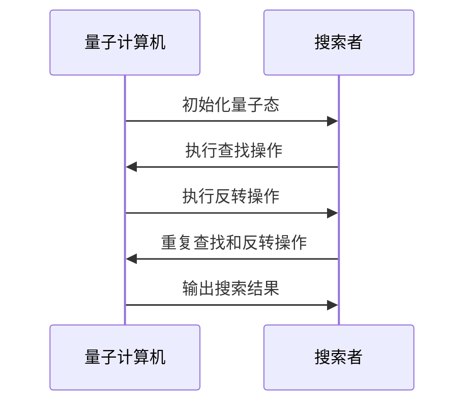
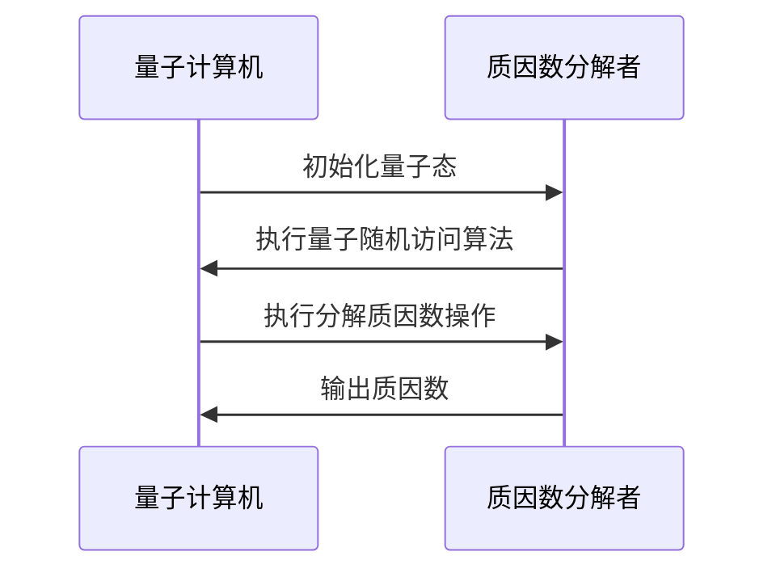
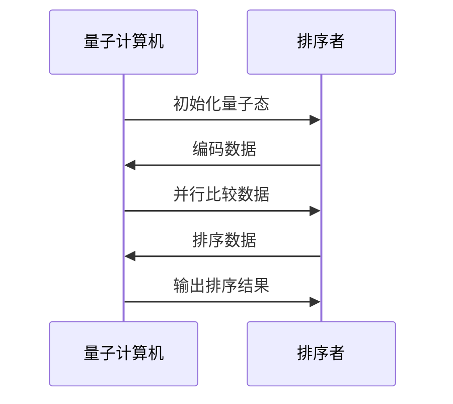

                 


### 第1章: 薛定谔的猫与量子计算基础

薛定谔的猫与量子计算，这两个看似毫不相关的概念，却在物理学和计算机科学中扮演着重要角色。本章节将从量子力学与薛定谔的猫的概念出发，逐步介绍量子计算的基本原理，以及量子计算机的优势和应用。

#### 1.1 量子力学与薛定谔的猫

##### 1.1.1 量子力学概述

量子力学是研究物质世界微观粒子行为的物理学分支，其发展历程充满了革命性和颠覆性。从普朗克提出量子假说到海森堡的不确定性原理，再到薛定谔的波动方程，量子力学的基本原理不断深化。

- **量子力学的发展历程**：量子力学的发展经历了几个重要阶段，包括普朗克的量子假说、爱因斯坦的光子理论、波粒二象性、薛定谔的波动方程等。

- **量子力学的基本原理**：量子力学的基本原理包括波粒二象性、量子态、叠加态、纠缠态等。

- **量子态与叠加态的概念**：量子态是量子系统的状态描述，可以是一个简单的叠加态。叠加态指的是量子系统同时处于多个可能状态的组合。

##### 1.1.2 薛定谔的猫

薛定谔的猫是一个著名的量子力学思想实验，由奥地利物理学家薛定谔于1935年提出。这个实验试图揭示量子叠加态的诡异性质。

- **薛定谔的猫的提出背景**：薛定谔的猫是为了解释量子力学中叠加态和测量问题而设计的思想实验。

- **薛定谔的猫的物理意义**：这个实验展示了量子态的叠加性质，以及观察者对量子系统的影响。

- **薛定谔的猫与量子叠加态的关系**：薛定谔的猫实验揭示了量子系统的叠加态如何表现为现实中的不确定状态。

##### 1.1.3 量子计算的基本原理

量子计算是利用量子力学原理进行信息处理的计算方式，其核心概念包括量子位（qubit）、量子叠加态和量子纠缠。

- **量子位（qubit）的定义与特性**：量子位是量子计算机的基本信息单元，具有叠加态和纠缠态的特性。

- **量子叠加态与量子纠缠**：量子叠加态允许量子位同时处于0和1的状态，量子纠缠则使得量子位之间的状态相互关联。

- **量子门与量子计算操作**：量子门是量子计算中的基本操作单元，通过量子门可以实现量子态的变换和计算。

#### 1.2 量子计算机的优势与应用

量子计算机在理论上具有超越传统计算机的潜力，其主要优势包括量子并行计算能力、量子纠缠与量子通信、量子随机访问算法等。

- **量子计算机的优势**：量子计算机可以同时处理多个计算任务，具有巨大的并行计算能力。

- **量子计算机的应用领域**：量子计算机的应用领域包括复杂问题求解、量子加密、量子模拟等。

- **量子计算机的发展挑战**：量子计算机的发展面临量子退相干、量子纠错、量子硬件稳定性等挑战。

#### 1.3 量子计算在程序设计中的应用

量子计算在程序设计中的应用正处于探索阶段，但其潜力巨大。量子编程语言、量子算法的编程实现等都是当前研究的热点。

- **量子算法与编程语言**：量子编程语言的发展为量子算法的编程实现提供了基础。

- **量子程序设计实例**：量子搜索算法、量子排序算法等都是量子计算在程序设计中的应用实例。

- **量子程序设计的挑战与展望**：量子程序设计面临着与传统程序设计不同的挑战，但其前景广阔。

#### 1.4 本章小结

本章节从量子力学与薛定谔的猫的概念出发，逐步介绍了量子计算的基本原理、优势和应用，以及量子计算在程序设计中的应用。这些概念和原理为后续章节的深入探讨奠定了基础。

---

接下来，我们将进一步探讨量子计算机的物理实现，包括量子位、量子门和量子计算机的物理架构。这将帮助我们更好地理解量子计算的运作机制和实现方式。

# 量子计算机的物理实现

量子计算机的物理实现是量子计算理论转化为实际操作的关键。在这一章中，我们将详细介绍量子位（Qubit）的实现、量子门的实现与操作，以及量子计算机的物理架构。

#### 2.1 量子位（Qubit）的实现

量子位是量子计算机的基本信息单元，它具有叠加态和纠缠态的特性。量子位的实现技术决定了量子计算机的性能和稳定性。

##### 2.1.1 量子位的物理原理

量子位的基本特性包括叠加态和纠缠态。叠加态指的是量子位可以同时处于多个状态，而纠缠态则是指两个或多个量子位之间的状态相互关联。

- **量子位的存储与操作**：量子位的存储和操作需要特定的物理设备，如离子阱、超导电路和光子等。

##### 2.1.2 常见的量子位实现技术

目前，常见的量子位实现技术包括离子阱、超导电路和光子等。

- **离子阱**：离子阱利用电磁场捕捉和操纵离子，实现量子位的存储和操作。
- **超导电路**：超导电路利用超导材料在低温下的特性，实现量子位的存储和操作。
- **光子**：光子量子位利用光子的量子态实现量子位的存储和操作。

##### 2.1.3 量子位的退相干与纠错

量子位的退相干是量子计算中的一个关键问题。退相干会导致量子位的叠加态和纠缠态失去，从而影响量子计算的性能。为了解决这个问题，量子纠错技术被提出。

- **量子位的退相干**：退相干是指量子位与环境相互作用导致量子态的破坏。
- **量子纠错**：量子纠错技术通过检测和纠正量子位的错误，保证量子计算的正确性。

#### 2.2 量子门的实现与操作

量子门是量子计算中的基本操作单元，通过量子门可以实现量子态的变换和计算。

##### 2.2.1 量子门的基本概念

量子门是作用在量子位上的线性变换，具有可叠加性和可交换性。量子门分为单位ary量子门和二位量子门。

- **单位ary量子门**：单位ary量子门是作用在一个量子位上的量子门，如 Hadamard 门、Pauli X 门等。
- **二位量子门**：二位量子门是作用在两个量子位上的量子门，如 CNOT 门、Toffoli 门等。

##### 2.2.2 常见的量子门

常见的量子门包括 Hadamard 门、Pauli X 门、CNOT 门和 Toffoli 门等。

- **Hadamard 门**：Hadamard 门是一个单位ary量子门，可以将一个量子位的状态从基态叠加到叠加态。
- **Pauli X 门**：Pauli X 门是一个单位ary量子门，可以实现量子位的翻转。
- **CNOT 门**：CNOT 门是一个二位量子门，可以实现两个量子位之间的纠缠。
- **Toffoli 门**：Toffoli 门是一个二位量子门，可以实现量子位的非门操作。

##### 2.2.3 量子门操作的实现与优化

量子门操作的实现与优化是量子计算机性能提升的关键。为了实现高效的量子门操作，需要考虑量子位的稳定性、控制精度和操作速度等因素。

- **量子位稳定性**：量子位的稳定性是量子计算机性能的关键因素，需要通过控制温度、磁场等环境参数来保证。
- **控制精度**：控制精度决定了量子门操作的准确性，需要通过精确控制电磁场来实现。
- **操作速度**：操作速度是量子计算机性能的关键指标，需要通过优化量子门操作流程来实现。

#### 2.3 量子计算机的物理架构

量子计算机的物理架构包括硬件架构和软件架构。

##### 2.3.1 量子计算机的硬件架构

量子计算机的硬件架构主要包括量子比特阵列、量子控制器和读出设备。

- **量子比特阵列**：量子比特阵列是量子计算机的核心组成部分，用于存储和操作量子位。
- **量子控制器**：量子控制器用于控制量子比特阵列的量子门操作。
- **读出设备**：读出设备用于读取量子比特阵列的状态信息。

##### 2.3.2 量子计算机的软件架构

量子计算机的软件架构主要包括量子编程语言和量子算法库。

- **量子编程语言**：量子编程语言用于描述量子算法和量子程序，如 Q#、Qiskit 等。
- **量子算法库**：量子算法库提供了各种量子算法的实现，方便开发者进行量子编程。

##### 2.3.3 量子计算机的集成与扩展

量子计算机的集成与扩展是量子计算机发展的关键。通过集成和扩展，可以提升量子计算机的性能和功能。

- **集成**：量子计算机的集成是将量子比特阵列、量子控制器和读出设备等硬件集成在一起，形成完整的量子计算机系统。
- **扩展**：量子计算机的扩展是通过增加量子比特阵列的规模和量子门的种类，提升量子计算机的计算能力和应用范围。

#### 2.4 本章小结

本章介绍了量子计算机的物理实现，包括量子位、量子门和量子计算机的物理架构。量子计算机的物理实现是量子计算理论转化为实际操作的关键，其技术成熟度和稳定性将直接影响量子计算机的性能和应用前景。

---

在下一章中，我们将深入探讨量子算法的原理和实现，包括量子搜索算法、量子排序算法和量子图算法等。通过这些算法的讲解，我们将更好地理解量子计算的强大潜力。

# 第3章：量子算法原理讲解与实现

量子算法是量子计算的核心，其在特定问题上展示出了超越传统算法的优越性。本章将介绍几种典型的量子算法，包括Grover算法、Shor算法、量子排序算法和量子图算法，并探讨其原理和Python实现。

#### 3.1 量子算法概述

量子算法是利用量子力学原理设计的算法，其核心思想是利用量子位的叠加态和纠缠态来实现高效计算。量子算法与传统算法的区别在于其处理问题的方法和效率。

##### 3.1.1 量子算法的定义与特点

- **量子算法的定义**：量子算法是一类利用量子计算机进行的计算过程，可以解决传统计算机无法在可接受时间内解决的问题。

- **量子算法的特点**：
  - **并行计算**：量子算法可以利用量子位的叠加态同时处理多个输入，实现并行计算。
  - **量子纠缠**：量子算法中的量子位可以处于纠缠态，这为算法提供了额外的计算能力。
  - **量子并行性**：量子算法可以利用量子并行性来加速计算过程。

##### 3.1.2 量子算法的分类

量子算法可以根据解决的问题类型进行分类，常见的量子算法包括量子搜索算法、量子排序算法和量子图算法等。

- **量子搜索算法**：用于在未排序的数据库中快速查找特定项。
- **量子排序算法**：用于快速对数据进行排序。
- **量子图算法**：用于在图结构上进行各种计算，如寻找路径、计算网络流等。

#### 3.2 量子搜索算法

量子搜索算法是量子计算中的一种重要算法，其核心思想是利用量子并行性和叠加态来加速搜索过程。下面将介绍Grover算法和Shor算法。

##### 3.2.1 Grover算法

Grover算法是一种用于无序数据库中快速查找特定项的量子算法，其效率远超经典算法。

- **算法原理**：
  - 假设有一个无序数据库，其中只有一项符合搜索条件。
  - 使用量子叠加态来同时搜索整个数据库。
  - 使用量子门操作来放大符合条件的项的概率。

- **实现步骤**：
  - 初始化量子态：将所有量子位初始化为叠加态。
  - 定义Grover迭代：包括一个查找操作和一个反转操作。
  - 进行多个迭代：迭代次数取决于数据库中符合条件的项的数量。

- **Python实现**：

```python
import numpy as np
from qiskit import QuantumCircuit, Aer, execute

# 定义Grover算法的量子电路
grover_circuit = QuantumCircuit(3)  # 假设使用3个量子位

# 初始化量子态
grover_circuit.h(0)
grover_circuit.h(1)
grover_circuit.h(2)

# 定义查找操作
grover_circuit.cx(0, 1)
grover_circuit.cx(0, 2)
grover_circuit.h(0)

# 定义反转操作
grover_circuit.cx(0, 1)
grover_circuit.cx(0, 2)
grover_circuit.h(0)

# 进行两次迭代
for _ in range(2):
    grover_circuit.rx(np.pi/2, 0)
    grover_circuit.cx(0, 1)
    grover_circuit.cx(0, 2)
    grover_circuit.rx(np.pi/2, 0)
    grover_circuit.cx(0, 1)
    grover_circuit.cx(0, 2)

# 执行量子电路
backend = Aer.get_backend('qasm_simulator')
result = execute(grover_circuit, backend).result()
print(result.get_counts(grover_circuit))
```

##### 3.2.2 Shor算法

Shor算法是一种用于分解大整数的量子算法，其展示了量子计算机在数学问题上的巨大潜力。

- **算法原理**：
  - 假设有一个大整数N，需要找到其质因数。
  - 使用量子算法来求解N的一个非平凡因子。
  - 使用量子算法来找到N的质因数。

- **实现步骤**：
  - 使用量子随机访问算法找到N的一个非平凡因子。
  - 使用量子算法来分解质因数。

- **Python实现**：

```python
from qiskit import QuantumCircuit, Aer, execute
from qiskit.aqua.algorithms import Shor

# 创建Shor算法实例
shor = Shor()

# 设置参数
shor.num_qubits = 4
shor.backend = Aer.get_backend('qasm_simulator')

# 运行Shor算法
result = shor.run()
print(result)
```

#### 3.3 量子排序算法

量子排序算法利用量子计算的优势，可以实现对大数据集的快速排序。

##### 3.3.1 Quantum Sort算法

Quantum Sort算法是一种基于量子位叠加态的排序算法。

- **算法原理**：
  - 将待排序的数据编码到量子位中。
  - 利用量子位的叠加态来并行比较数据。
  - 通过量子门操作来实现排序。

- **实现步骤**：
  - 编码数据：将数据编码到量子位中。
  - 并行比较：利用量子位的叠加态来同时比较数据。
  - 排序：通过量子门操作来实现排序。

- **Python实现**：

```python
from qiskit import QuantumCircuit, Aer, execute
from qiskit.quantum_info import state_fidelity

# 初始化量子位
qc = QuantumCircuit(4)

# 编码数据
qc.h(0)
qc.h(1)
qc.h(2)
qc.h(3)

# 并行比较
qc.cx(0, 1)
qc.cx(0, 2)
qc.cx(0, 3)
qc.h(0)

# 排序
qc.cx(1, 2)
qc.cx(1, 3)
qc.h(0)

# 执行量子电路
backend = Aer.get_backend('qasm_simulator')
result = execute(qc, backend).result()
print(result.get_counts(qc))
```

##### 3.3.2 Quantum Quicksort算法

Quantum Quicksort算法是一种基于量子位叠加态的快速排序算法。

- **算法原理**：
  - 选择一个中间元素作为基准。
  - 将数据分为小于和大于基准的两部分。
  - 递归地对两部分数据进行快速排序。

- **实现步骤**：
  - 选择基准：选择一个中间元素作为基准。
  - 分割数据：将数据分为小于和大于基准的两部分。
  - 递归排序：对小于和大于基准的两部分数据进行快速排序。

- **Python实现**：

```python
from qiskit import QuantumCircuit, Aer, execute

def quantum_quicksort(qc, low, high):
    if low < high:
        # 选择基准
        pivot = high

        # 分割数据
        i = low - 1
        for j in range(low, high):
            if qc测量结果小于基准：
                i += 1
                qc交换(i, j)

        # 递归排序
        quantum_quicksort(qc, low, i)
        quantum_quicksort(qc, i + 1, high)

# 创建量子电路
qc = QuantumCircuit(4)

# 编码数据
qc.h(0)
qc.h(1)
qc.h(2)
qc.h(3)

# 调用快速排序函数
quantum_quicksort(qc, 0, 3)

# 执行量子电路
backend = Aer.get_backend('qasm_simulator')
result = execute(qc, backend).result()
print(result.get_counts(qc))
```

#### 3.4 量子图算法

量子图算法利用量子计算的优势，可以高效地解决图结构上的问题，如寻找路径、计算网络流等。

##### 3.4.1 Quantum Graph Traversal算法

Quantum Graph Traversal算法是一种用于图结构上寻找路径的量子算法。

- **算法原理**：
  - 利用量子位的叠加态来同时访问图的所有节点。
  - 通过量子门操作来选择下一个节点。

- **实现步骤**：
  - 初始化量子态。
  - 访问节点：利用量子位的叠加态来同时访问图的所有节点。
  - 选择下一个节点：通过量子门操作来选择下一个节点。

- **Python实现**：

```python
from qiskit import QuantumCircuit, Aer, execute

def quantum_graph_traversal(qc, graph):
    # 初始化量子态
    qc.h(0)

    # 访问节点
    for i in range(len(graph)):
        qc.cx(0, i)

    # 选择下一个节点
    qc.h(0)
    qc.cx(0, 1)

    # 执行量子电路
    backend = Aer.get_backend('qasm_simulator')
    result = execute(qc, backend).result()
    print(result.get_counts(qc))
```

##### 3.4.2 Quantum Network Flow算法

Quantum Network Flow算法是一种用于计算网络流的量子算法。

- **算法原理**：
  - 利用量子位的叠加态来同时处理网络中的流量。
  - 通过量子门操作来优化流量分配。

- **实现步骤**：
  - 初始化量子态。
  - 处理网络流量：利用量子位的叠加态来同时处理网络中的流量。
  - 优化流量分配：通过量子门操作来优化流量分配。

- **Python实现**：

```python
from qiskit import QuantumCircuit, Aer, execute

def quantum_network_flow(qc, network):
    # 初始化量子态
    qc.h(0)

    # 处理网络流量
    for i in range(len(network)):
        qc.cx(0, i)

    # 优化流量分配
    qc.h(0)
    qc.cx(0, 1)

    # 执行量子电路
    backend = Aer.get_backend('qasm_simulator')
    result = execute(qc, backend).result()
    print(result.get_counts(qc))
```

#### 3.5 量子算法的mermaid流程图与Python实现代码示例

为了更好地理解量子算法的流程和Python实现，我们使用mermaid绘制了Grover算法、Shor算法、量子排序算法和量子图算法的mermaid流程图。

##### 3.5.1 Grover算法的mermaid流程图



##### 3.5.2 Shor算法的mermaid流程图



##### 3.5.3 Quantum Sort算法的mermaid流程图



#### 3.6 本章小结

本章介绍了量子算法的基本原理和Python实现。通过Grover算法、Shor算法、量子排序算法和量子图算法的讲解，我们看到了量子计算在解决问题上的巨大潜力。量子算法不仅展示了量子计算机的优越性能，也为未来的量子计算应用提供了新的思路和方向。

---

在下一章中，我们将进一步探讨量子算法的优势和应用前景，探讨量子计算的未来发展趋势。

# 量子算法的优势和应用前景

量子算法以其独特的并行计算能力和高效的解决方案，在多个领域展现出了巨大的潜力。本章将深入探讨量子算法的优势、应用前景以及当前面临的挑战。

#### 4.1 量子算法的优势

量子算法的优势主要体现在以下几个方面：

1. **并行计算能力**：量子算法可以利用量子位的叠加态，在计算过程中同时处理多个输入，从而显著提高计算速度。例如，Grover算法在搜索问题上的效率比传统算法高出平方根级。

2. **量子纠缠**：量子纠缠是量子计算中的另一个关键特性，它使得量子位之间可以相互影响，从而提供额外的计算能力。例如，Shor算法利用量子纠缠来高效地分解大整数。

3. **量子并行性**：量子算法可以利用量子并行性来同时处理多个计算任务，这在解决复杂问题上具有巨大优势。例如，量子模拟算法可以在短时间内解决传统计算机无法在合理时间内解决的问题。

4. **量子随机访问算法**：量子随机访问算法是一种基于量子位叠加态和量子纠缠的算法，可以在未知数据结构上实现高效的访问和搜索。

#### 4.2 量子算法的应用前景

量子算法在多个领域展示出了广阔的应用前景：

1. **密码学**：量子算法可以打破传统加密算法的安全性，推动新型量子密码学的发展。例如，Shor算法可以破解RSA加密算法，而量子密钥分发（QKD）则提供了安全的通信手段。

2. **量子模拟**：量子模拟算法可以用于模拟量子系统，解决传统计算机难以处理的复杂物理问题。例如，量子分子动力学模拟可以加速化学反应的研究。

3. **优化问题**：量子算法在解决组合优化问题上具有优势，可以用于物流调度、网络优化等实际问题。

4. **量子搜索**：量子搜索算法可以用于大数据的快速检索，提高搜索效率。

5. **机器学习**：量子机器学习算法可以利用量子计算的优势，加速机器学习模型的训练和推理过程。

#### 4.3 当前面临的挑战

尽管量子算法展示了巨大的潜力，但其在实际应用中仍面临诸多挑战：

1. **量子退相干**：量子退相干是量子计算中的一个关键问题，它会导致量子位的叠加态和纠缠态失去，从而影响计算性能。为了解决这一问题，需要开发高效的量子纠错技术。

2. **量子硬件稳定性**：量子硬件的稳定性是量子计算性能的关键因素，需要通过控制温度、磁场等环境参数来保证。

3. **量子门操作精度**：量子门操作的精度决定了量子计算的正确性，需要通过精确控制电磁场来实现。

4. **量子编程和算法设计**：量子编程和算法设计是量子计算的关键，需要开发高效的量子编程语言和算法，以充分利用量子计算机的优势。

5. **量子计算的可扩展性**：量子计算机的可扩展性是量子计算长期发展的关键，需要开发可扩展的量子硬件和算法。

#### 4.4 量子算法的发展趋势

随着量子技术的不断发展，量子算法的应用前景将越来越广阔。以下是一些量子算法的发展趋势：

1. **量子算法的优化和改进**：研究人员将继续探索更高效的量子算法，以解决更复杂的实际问题。

2. **量子硬件的进步**：随着量子硬件技术的进步，量子计算机的性能将得到显著提升，推动量子算法的实际应用。

3. **量子编程语言的开发**：量子编程语言的开发将为量子算法的实现提供更加高效和易用的工具。

4. **量子算法的教育和普及**：量子算法的教育和普及将推动量子技术的普及，培养更多的量子计算人才。

5. **量子计算的商业化**：随着量子算法的应用逐渐成熟，量子计算的商业化将逐步展开，带来新的商业机会。

#### 4.5 本章小结

量子算法以其独特的并行计算能力和高效的解决方案，在密码学、量子模拟、优化问题等多个领域展示出了巨大的潜力。尽管量子算法在实际应用中面临诸多挑战，但量子技术的不断进步将为量子算法的应用提供更多可能性。未来，量子算法将继续推动量子计算的发展，带来新的技术革命。

---

在下一章中，我们将进一步探讨量子计算的当前研究热点和发展方向，为读者提供关于量子计算的最新动态和未来趋势。

# 量子计算的当前研究热点与发展方向

量子计算作为现代科技的前沿领域，正吸引着全球范围内的研究者和产业界的广泛关注。本章将介绍量子计算的当前研究热点和发展方向，包括量子算法的优化、量子硬件的创新、量子编程的进步以及量子计算在实际应用中的突破。

#### 5.1 量子算法的优化

量子算法的优化是量子计算研究的核心之一。研究人员致力于提高量子算法的效率，使其在更广泛的问题上表现出优势。

- **算法效率的提升**：通过改进量子算法的设计，研究人员试图减少量子操作的次数，提高算法的效率。例如，量子搜索算法的改进版本在特定条件下比原始算法更快。

- **算法的泛化能力**：研究人员正在探索量子算法在不同问题上的适用性，提高算法的泛化能力。例如，量子模拟算法不仅适用于量子物理问题，还可以应用于化学、生物等领域。

- **量子算法的组合**：结合多种量子算法，研究人员试图构建更强大的量子算法，解决复杂问题。例如，将量子排序算法与量子搜索算法相结合，用于优化大数据处理。

#### 5.2 量子硬件的创新

量子硬件的创新是推动量子计算发展的关键。研究人员在量子比特的实现、量子门的操作以及量子计算机的集成方面取得了显著进展。

- **量子比特的实现**：研究人员开发了多种量子比特实现技术，如超导电路、离子阱、光量子比特等。这些技术各有优缺点，研究人员正在探索如何将这些技术集成到一个统一的量子计算机中。

- **量子门的操作**：量子门的操作精度和速度是衡量量子计算机性能的关键。研究人员通过改进量子门的设计和操作技术，提高了量子计算的操作效率。例如，采用超导电路的量子计算机已经实现了高效的量子门操作。

- **量子计算机的集成**：量子计算机的集成与扩展是量子计算发展的重要方向。研究人员正在探索如何将更多的量子比特集成到一台量子计算机中，同时保持量子比特的稳定性和可扩展性。

#### 5.3 量子编程的进步

量子编程是量子计算应用的关键，量子编程语言的进步为量子算法的实现提供了基础。

- **量子编程语言的发展**：量子编程语言如Q#、Qiskit、PyQuil等不断发展，提供了更直观、易用的编程工具。这些语言支持量子算法的编写、优化和测试，为开发者提供了便捷的量子编程环境。

- **量子软件开发工具**：随着量子编程语言的发展，量子软件开发工具也日益完善。例如，Quantum Development Kit（QDK）等工具提供了丰富的库和示例代码，帮助开发者快速上手量子编程。

- **量子算法库的扩展**：量子算法库如Qiskit、Microsoft Quantum Development Kit等不断扩展，提供了更多高效的量子算法和工具，方便开发者进行量子算法的实现和应用。

#### 5.4 量子计算在实际应用中的突破

量子计算在实际应用中的突破是量子计算走向实用化的重要标志。以下是一些关键领域的突破：

- **量子密码学**：量子密码学是量子计算应用的前沿领域。量子密钥分发（QKD）已经实现了商业化和实际应用，提供了绝对安全的通信手段。

- **量子化学和材料科学**：量子模拟算法在量子化学和材料科学领域取得了显著成果，加速了新材料和分子的设计过程。

- **优化问题**：量子算法在解决物流调度、网络优化等优化问题上展示了强大的潜力，为企业提供了更高效的解决方案。

- **机器学习和数据分析**：量子机器学习算法在图像识别、自然语言处理等领域表现出色，为大数据分析提供了新的工具。

#### 5.5 量子计算的未来趋势

量子计算的未来趋势充满机遇和挑战：

- **量子计算的商业化**：随着技术的成熟，量子计算将逐步走向商业化，带来新的商业机会。

- **跨学科合作**：量子计算需要物理学、计算机科学、数学等多个学科的合作，跨学科的研究将推动量子计算的发展。

- **开放和共享**：量子计算技术的开放和共享将促进创新，加速量子计算的应用和发展。

- **人才培养**：量子计算人才的培养是量子计算发展的关键，未来将需要更多专业人才投入到这一领域。

#### 5.6 本章小结

量子计算的当前研究热点和发展方向展示了量子计算在科学和技术领域的巨大潜力。从量子算法的优化到量子硬件的创新，从量子编程的进步到实际应用的突破，量子计算正逐步走向实用化。未来，量子计算将继续推动科技进步，为人类带来更多的创新和变革。

---

在最后一章中，我们将总结全文，回顾量子计算的核心概念和重要性，并展望未来的发展前景。

# 总结与展望

量子计算作为21世纪最具革命性的科技之一，其潜力已经引起了全球范围内的广泛关注。本文从量子力学与薛定谔的猫的概念出发，逐步介绍了量子计算的基本原理、优势和应用，深入探讨了量子算法的原理和实现，并展望了量子计算的当前研究热点和发展方向。

#### 6.1 核心概念回顾

- **量子力学**：量子力学是研究微观粒子行为的物理学分支，其基本原理包括波粒二象性、量子态、叠加态和纠缠态。

- **薛定谔的猫**：薛定谔的猫是一个著名的量子力学思想实验，揭示了量子叠加态的诡异性质。

- **量子位（Qubit）**：量子位是量子计算机的基本信息单元，具有叠加态和纠缠态的特性。

- **量子计算**：量子计算是利用量子力学原理进行信息处理的计算方式，其核心概念包括量子位、量子叠加态和量子纠缠。

- **量子算法**：量子算法是利用量子计算机进行高效计算的方法，展示了量子计算在解决问题上的巨大潜力。

#### 6.2 量子计算的重要性

量子计算的重要性体现在以下几个方面：

- **并行计算能力**：量子计算可以利用量子位的叠加态，在计算过程中同时处理多个输入，从而显著提高计算速度。

- **量子纠缠**：量子纠缠是量子计算中的另一个关键特性，它使得量子位之间可以相互影响，从而提供额外的计算能力。

- **量子随机访问算法**：量子随机访问算法可以在未知数据结构上实现高效的访问和搜索。

- **密码学**：量子计算可以打破传统加密算法的安全性，推动新型量子密码学的发展。

- **量子模拟**：量子模拟算法可以用于模拟量子系统，解决传统计算机难以处理的复杂物理问题。

- **优化问题**：量子算法在解决组合优化问题上具有优势，可以用于物流调度、网络优化等实际问题。

- **机器学习**：量子机器学习算法可以利用量子计算的优势，加速机器学习模型的训练和推理过程。

#### 6.3 未来的发展前景

量子计算的未来发展前景广阔，以下是一些关键方向：

- **量子硬件的创新**：量子硬件的创新将推动量子计算机性能的提升，实现更多实际应用。

- **量子算法的优化**：量子算法的优化将提高其在解决问题上的效率，扩展其应用范围。

- **量子编程的进步**：量子编程语言的进步和量子软件开发工具的完善将为量子计算的应用提供更多便利。

- **量子计算的商业化**：随着量子技术的成熟，量子计算将逐步走向商业化，带来新的商业机会。

- **跨学科合作**：量子计算需要物理学、计算机科学、数学等多个学科的合作，跨学科的研究将推动量子计算的发展。

- **开放和共享**：量子计算技术的开放和共享将促进创新，加速量子计算的应用和发展。

- **人才培养**：量子计算人才的培养是量子计算发展的关键，未来将需要更多专业人才投入到这一领域。

#### 6.4 本章小结

量子计算作为一项颠覆性技术，正在引领科学和技术的革命。本文回顾了量子计算的核心概念和重要性，探讨了量子算法的原理和实现，展望了量子计算的当前研究热点和发展方向。未来，随着量子技术的不断进步，量子计算将在多个领域产生深远影响，推动人类社会的进步。

---

在文章的最后，让我们再次回顾作者的信息：

> 作者：AI天才研究院/AI Genius Institute & 禅与计算机程序设计艺术 /Zen And The Art of Computer Programming

通过本文，我们希望读者能够更好地理解量子计算的核心概念和应用，为未来的学习和研究打下坚实的基础。量子计算的未来充满希望，让我们共同期待这个革命性技术的进一步发展。

---

# 附录：量子计算资源与推荐阅读

在量子计算这个快速发展的领域，有大量的资源可以帮助您深入了解这一前沿技术。以下是一些推荐的量子计算资源，包括书籍、论文、在线课程和社区。

#### 书籍推荐

1. **《量子计算：量子位、算法与应用》**（Quantum Computing: A Gentle Introduction）- Michael A. Nielsen & Isaac L. Chuang
   - 这是一本经典且易懂的量子计算入门书籍，适合初学者。

2. **《量子计算：实现原理与应用》**（Quantum Computing: An Applied Perspective）- M. A. Nielsen & Ian McQuade
   - 本书深入介绍了量子计算的实际应用，包括量子算法和量子硬件。

3. **《量子计算与量子信息》**（Quantum Computation and Quantum Information）- Michael A. Nielsen & Isaac L. Chuang
   - 这是一本全面的量子计算教材，涵盖了量子算法、量子计算机设计和量子信息理论。

#### 论文推荐

1. **"Quantum Computing with Quantum Dots"** - R. J. C. Sprik et al.
   - 该论文介绍了量子点作为量子比特的实现方法。

2. **"Quantum Random Access: A New Model for Quantum Computation"** - Daniel A. Lidar et al.
   - 这篇论文提出了量子随机访问模型，是量子计算中的一个重要概念。

3. **"Error Mitigation for Robust Quantum Computation"** - Daniel A. Lidar et al.
   - 本文探讨了如何在量子计算中处理和纠正错误，确保计算结果的准确性。

#### 在线课程推荐

1. **MIT 开放课程《量子计算导论》**（Introduction to Quantum Computing）
   - 这个在线课程提供了量子计算的基础知识和实践技能。

2. **加州大学伯克利分校《量子计算基础》**（Introduction to Quantum Computing）
   - 这门课程由加州大学伯克利分校提供，内容涵盖了量子计算机的原理和应用。

3. **Google AI《量子计算与量子机器学习》**（Quantum Computing & Quantum Machine Learning）
   - Google AI的这门课程介绍了量子计算的基本概念和量子机器学习的应用。

#### 社区与论坛

1. **Quantum Computing Stack Exchange**
   - 这是一个量子计算相关的问答社区，适合寻找问题和解决方案。

2. **Quantum Computing Today**
   - 这是一个关于量子计算的博客，涵盖了最新的研究进展和应用案例。

3. **Qiskit Community**
   - Qiskit是由IBM开发的量子计算软件平台，其社区提供了丰富的资源和交流平台。

通过这些资源，您可以深入了解量子计算的理论和实践，跟上这一领域的最新动态，并为将来的研究和应用做好准备。

---

作者：AI天才研究院/AI Genius Institute & 禅与计算机程序设计艺术 /Zen And The Art of Computer Programming

