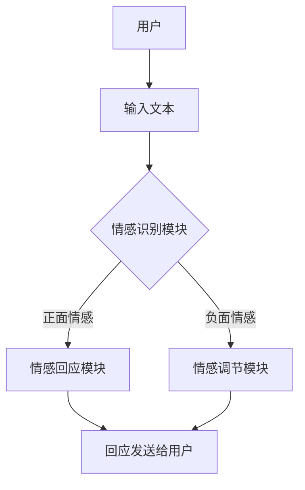
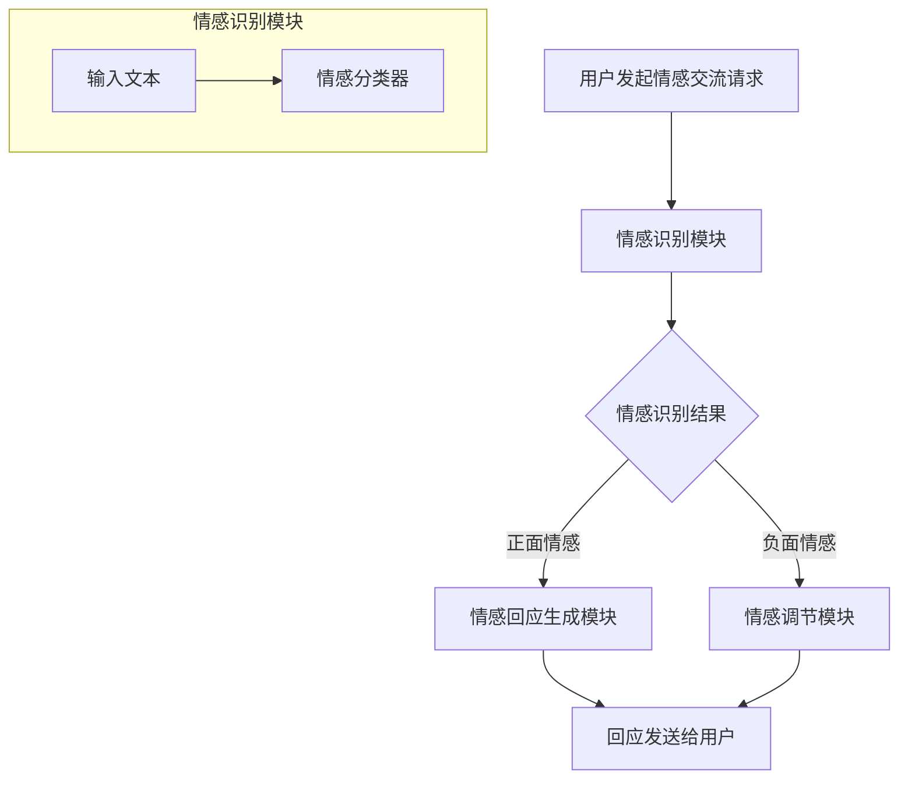
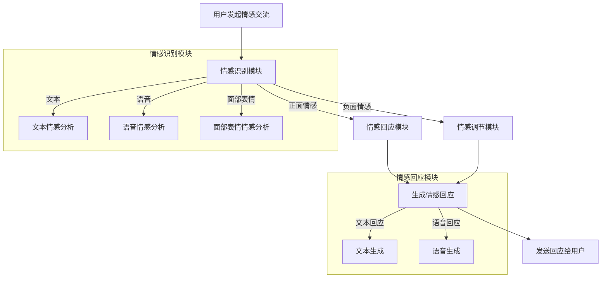

                 


### 虚拟情感代理：AI代表人类进行情感交流

> 关键词：虚拟情感代理、人工智能、情感计算、情感识别、情感生成

> 摘要：随着人工智能技术的不断发展，虚拟情感代理逐渐成为人类进行情感交流的重要工具。本文将深入探讨虚拟情感代理的基础理论、开发与实现、应用场景及未来发展趋势，以期为人工智能在情感领域的应用提供有益参考。

## 第一部分：虚拟情感代理的基础理论

### 第1章：虚拟情感代理概述

#### 1.1 虚拟情感代理的定义与作用

##### 1.1.1 虚拟情感代理的概念

虚拟情感代理，简称VFA（Virtual Emotional Agent），是一种基于人工智能技术的虚拟实体，能够在与人类进行交互时表现出情感特征，从而达到更好地理解用户需求、提供个性化服务、改善用户体验等目的。

##### 1.1.2 虚拟情感代理的作用与价值

1. 提高服务质量：虚拟情感代理能够模拟人类情感，为用户提供更加人性化的服务，提升用户体验。
2. 优化人机交互：虚拟情感代理可以帮助人类更好地理解机器语言，提高人机交互的效率。
3. 改善心理健康：虚拟情感代理能够为用户提供情感支持，缓解心理压力，改善心理健康。
4. 拓展应用领域：虚拟情感代理在医疗、教育、客服等领域具有广泛的应用前景。

##### 1.1.3 虚拟情感代理的应用场景

1. 客户服务：虚拟情感代理可以应用于客服系统，为用户提供24小时在线咨询和服务。
2. 教育：虚拟情感代理可以作为教育辅助工具，为学生提供个性化学习支持和情感关怀。
3. 医疗：虚拟情感代理可以应用于心理治疗，为患者提供情感支持和心理干预。
4. 社交娱乐：虚拟情感代理可以应用于虚拟现实（VR）和增强现实（AR）等领域，为用户提供丰富的社交娱乐体验。

### 第2章：人工智能与虚拟情感代理

#### 2.1 人工智能概述

##### 2.1.1 人工智能的定义与发展历程

人工智能（AI，Artificial Intelligence）是指通过计算机模拟人类智能行为和思维过程的技术。人工智能的发展历程可以分为以下几个阶段：

1. 早期探索（1950年代至1970年代）：人工智能概念提出，出现了一些早期的人工智能系统。
2. 低谷期（1980年代至1990年代）：由于实际应用效果不理想，人工智能研究进入低谷期。
3. 重生期（2000年代至今）：随着计算能力和算法的进步，人工智能迎来了新的发展机遇。

##### 2.1.2 人工智能的主要技术体系

1. 机器学习：通过训练模型来模拟和扩展人类智能，包括监督学习、无监督学习、强化学习等。
2. 深度学习：基于神经网络的理论，通过多层神经网络来模拟人类大脑的神经结构，实现复杂的特征提取和模式识别。
3. 自然语言处理：研究计算机如何理解、生成和翻译自然语言，包括文本分类、情感分析、机器翻译等。
4. 计算机视觉：研究计算机如何通过图像或视频来理解和感知世界，包括图像识别、目标检测、人脸识别等。

##### 2.1.3 人工智能在情感计算中的应用

1. 情感识别：通过分析文本、语音、面部表情等数据，识别用户的情感状态。
2. 情感生成：根据用户的情感状态，生成相应的情感回应，提高交互的自然性和人性化。
3. 情感调节：通过分析用户的情感状态，提供情感支持和干预，改善用户的心理健康。

### 第3章：情感计算与情感识别

#### 3.1 情感计算概述

##### 3.1.1 情感计算的定义与目标

情感计算（Affective Computing）是指研究计算机如何理解、生成和模仿人类情感的技术。其目标包括：

1. 理解情感：通过分析用户的情感数据，理解用户的情感状态。
2. 表达情感：通过生成和模仿情感，提高人机交互的自然性和人性化。
3. 调节情感：通过情感干预，改善用户的心理健康。

##### 3.1.2 情感计算的方法与技术

1. 情感识别：通过分析文本、语音、面部表情等数据，识别用户的情感状态。
2. 情感生成：根据用户的情感状态，生成相应的情感回应。
3. 情感调节：通过情感干预，改善用户的心理健康。

##### 3.1.3 情感计算的挑战与机遇

1. 挑战：
   - 情感数据的多样性和复杂性：情感数据来源于多种渠道，如文本、语音、面部表情等，且具有高度的不确定性和复杂性。
   - 情感理解的跨文化差异：不同文化背景下的情感表达和认知存在差异，如何实现跨文化情感计算仍是一个挑战。
   - 情感调节的伦理和道德问题：如何确保情感调节的公正性、透明性和安全性，避免对用户的情感和心理造成负面影响。

2. 机遇：
   - 人工智能技术的快速发展：为情感计算提供了强大的计算能力和算法支持。
   - 情感计算在多个领域的应用需求：如医疗、教育、客服、娱乐等，为情感计算提供了广阔的应用场景。

#### 3.2 情感识别技术

##### 3.2.1 情感识别的定义与分类

情感识别是指通过分析文本、语音、面部表情等数据，识别用户的情感状态。根据输入数据的类型，情感识别可以分为以下几种：

1. 文本情感识别：通过分析文本内容，识别用户的情感状态，如正面情感、负面情感等。
2. 语音情感识别：通过分析语音信号，识别用户的情感状态，如喜悦、愤怒等。
3. 面部表情情感识别：通过分析面部表情，识别用户的情感状态，如图像情感识别和视频情感识别。

##### 3.2.2 情感识别的方法与算法

1. 词典法：通过建立情感词典，对文本进行情感标注。
2. 基于规则的方法：通过设计规则，对文本进行情感分类。
3. 基于机器学习的方法：通过训练有监督的机器学习模型，进行情感分类。
4. 基于深度学习的方法：利用卷积神经网络（CNN）和循环神经网络（RNN）等深度学习模型，进行情感分类。

##### 3.2.3 情感识别在实际应用中的效果评估

1. 准确率（Accuracy）：模型对正例样本的识别正确率。
2. 精确率（Precision）：模型对正例样本的识别正确率与总识别正例样本数的比值。
3. 召回率（Recall）：模型对正例样本的识别正确率与实际正例样本数的比值。
4. F1值（F1-Score）：综合考虑精确率和召回率的指标，计算公式为$2\times\frac{Precision\times Recall}{Precision+Recall}$。

### 第4章：虚拟情感代理的开发与实现

#### 4.1 虚拟情感代理的开发框架

##### 4.1.1 需求分析

在开发虚拟情感代理之前，需要对应用场景进行深入分析，明确以下需求：

1. 用户需求：分析用户期望从虚拟情感代理获得哪些服务，如情感交流、心理支持等。
2. 功能需求：明确虚拟情感代理应具备哪些功能，如情感识别、情感生成、情感调节等。
3. 性能需求：确保虚拟情感代理的响应速度、准确率和稳定性。

##### 4.1.2 模型选择

根据需求分析，选择合适的情感识别和生成模型。常见的模型包括：

1. 情感识别模型：基于词典的方法、基于规则的方法、基于机器学习的方法、基于深度学习的方法。
2. 情感生成模型：生成对抗网络（GAN）、递归神经网络（RNN）、长短时记忆网络（LSTM）等。

##### 4.1.3 系统设计与实现

1. 系统架构设计：根据需求分析和模型选择，设计虚拟情感代理的系统架构，包括数据层、算法层、应用层等。
2. 系统实现：使用编程语言（如Python）和开发工具（如TensorFlow、PyTorch等），实现虚拟情感代理的核心功能。

#### 4.2 虚拟情感代理的关键技术

##### 4.2.1 自然语言处理技术

自然语言处理技术是虚拟情感代理的核心技术之一，主要包括以下方面：

1. 分词与词性标注：对输入文本进行分词和词性标注，为情感识别和生成提供基础数据。
2. 情感词典构建：构建情感词典，为情感识别和生成提供参考。
3. 情感分类算法：使用机器学习或深度学习算法，对文本进行情感分类。

##### 4.2.2 计算机视觉技术

计算机视觉技术在虚拟情感代理中主要用于情感识别和表情分析，主要包括以下方面：

1. 面部检测：使用深度学习算法检测输入图像中的面部区域。
2. 表情识别：使用深度学习算法识别面部表情，如开心、生气等。
3. 情感分类：使用情感分类算法，根据面部表情识别结果，判断用户的情感状态。

##### 4.2.3 情感识别与生成技术

1. 情感识别技术：通过分析文本、语音、面部表情等数据，识别用户的情感状态。
2. 情感生成技术：根据用户的情感状态，生成相应的情感回应，如文字、语音、表情等。

### 第5章：虚拟情感代理的应用场景

#### 5.1 客户服务领域的应用

##### 5.1.1 虚拟客服代表

虚拟客服代表是虚拟情感代理在客户服务领域的典型应用，主要包括以下功能：

1. 情感识别：识别用户的情感状态，如愤怒、失望等。
2. 情感回应：根据用户的情感状态，生成相应的情感回应，提供个性化服务。
3. 情感调节：通过情感调节，缓解用户的不满情绪，提高服务质量。

##### 5.1.2 虚拟情感咨询师

虚拟情感咨询师是虚拟情感代理在心理咨询领域的应用，主要包括以下功能：

1. 情感识别：识别用户的心理状态，如抑郁、焦虑等。
2. 情感回应：根据用户的心理状态，生成相应的情感回应，提供心理支持。
3. 情感调节：通过情感调节，缓解用户的心理压力，提高心理健康。

##### 5.1.3 虚拟情感导购员

虚拟情感导购员是虚拟情感代理在电商领域的应用，主要包括以下功能：

1. 情感识别：识别用户的购买意愿和情感状态，如兴奋、满意等。
2. 情感回应：根据用户的情感状态，提供个性化的商品推荐和服务。
3. 情感调节：通过情感调节，提高用户的购物体验，增加购买转化率。

#### 5.2 教育与培训领域的应用

##### 5.2.1 虚拟情感教师

虚拟情感教师是虚拟情感代理在教育领域的应用，主要包括以下功能：

1. 情感识别：识别学生的学习情感状态，如兴趣、焦虑等。
2. 情感回应：根据学生的学习情感状态，提供个性化的教学建议和支持。
3. 情感调节：通过情感调节，激发学生的学习兴趣，提高学习效果。

##### 5.2.2 虚拟情感辅导员

虚拟情感辅导员是虚拟情感代理在学生辅导领域的应用，主要包括以下功能：

1. 情感识别：识别学生的心理情感状态，如抑郁、焦虑等。
2. 情感回应：根据学生的心理情感状态，提供个性化的心理辅导和支持。
3. 情感调节：通过情感调节，帮助学生缓解心理压力，提高心理健康。

##### 5.2.3 虚拟情感教练

虚拟情感教练是虚拟情感代理在体育训练领域的应用，主要包括以下功能：

1. 情感识别：识别运动员的情感状态，如紧张、兴奋等。
2. 情感回应：根据运动员的情感状态，提供个性化的训练建议和支持。
3. 情感调节：通过情感调节，提高运动员的心理素质，提高训练效果。

### 第6章：虚拟情感代理的挑战与未来发展

#### 6.1 虚拟情感代理面临的挑战

##### 6.1.1 技术挑战

1. 情感数据的多样性和复杂性：情感数据来源于多种渠道，如文本、语音、面部表情等，且具有高度的不确定性和复杂性，如何有效处理这些数据仍是一个挑战。
2. 跨文化情感计算：不同文化背景下的情感表达和认知存在差异，如何实现跨文化情感计算是一个重要挑战。
3. 情感理解的深度和广度：当前情感计算技术尚无法完全理解人类的复杂情感，如何提高情感计算的深度和广度是一个重要课题。

##### 6.1.2 道德与伦理挑战

1. 情感干预的伦理问题：虚拟情感代理在情感干预过程中，如何确保干预的公正性、透明性和安全性，避免对用户的情感和心理造成负面影响。
2. 情感生成的道德责任：虚拟情感代理在生成情感回应时，如何确保回应的合理性和道德性，避免误导用户。

##### 6.1.3 法律与监管挑战

1. 情感数据的隐私保护：虚拟情感代理在处理用户情感数据时，如何保护用户隐私，避免数据泄露。
2. 跨国监管与合规：虚拟情感代理在不同国家和地区应用时，如何遵守当地法律法规，确保合规运营。

#### 6.2 虚拟情感代理的未来发展

##### 6.2.1 技术趋势与前景

1. 深度学习技术的发展：随着深度学习技术的不断进步，情感计算将更加精确和智能化。
2. 跨学科融合：情感计算与其他领域的融合，如心理学、神经科学、人机交互等，将推动虚拟情感代理的创新发展。
3. 情感计算在边缘计算中的应用：随着边缘计算技术的发展，虚拟情感代理将能够在更广泛的场景中实现实时情感计算。

##### 6.2.2 应用拓展与前景

1. 医疗健康领域：虚拟情感代理可以为患者提供情感支持和心理干预，提高治疗效果。
2. 教育领域：虚拟情感代理可以为学生提供个性化学习支持和情感关怀，促进教育公平。
3. 客户服务领域：虚拟情感代理可以为用户提供更加人性化的服务，提高客户满意度。

##### 6.2.3 跨学科融合与发展方向

1. 心理学与情感计算：将心理学理论应用于情感计算，提高情感理解的深度和广度。
2. 神经科学与情感计算：借鉴神经科学研究成果，改进情感计算模型，提高情感生成的自然性和准确性。
3. 人机交互与情感计算：通过优化人机交互设计，提高虚拟情感代理的用户体验和满意度。

## 附录

### 第7章：虚拟情感代理开发资源与工具

#### 7.1 开发资源推荐

1. 开源工具与框架
   - TensorFlow：https://www.tensorflow.org/
   - PyTorch：https://pytorch.org/
   - Keras：https://keras.io/

2. 实用库与函数
   - NLTK：https://www.nltk.org/
   - TextBlob：https://textblob.readthedocs.io/
   - OpenCV：https://opencv.org/

3. 学习资源与资料
   - Coursera：https://www.coursera.org/
   - edX：https://www.edx.org/
   - Udacity：https://www.udacity.com/

### 第8章：虚拟情感代理实践案例

#### 8.1 案例一：虚拟客服代表系统开发

##### 8.1.1 系统设计

1. 系统功能设计
   - 情感识别：分析用户输入的文本，识别用户的情感状态。
   - 情感回应：根据用户的情感状态，生成相应的情感回应。
   - 情感调节：根据用户的情感状态，提供情感调节策略。

2. 系统架构设计



##### 8.1.2 技术实现

1. 情感识别模块

```python
import nltk
from nltk.corpus import sentiment_lexicon

def sentiment_analysis(text):
    scores = []
    for word in nltk.word_tokenize(text):
        if word in sentiment_lexicon:
            scores.append(sentiment_lexicon[word])
    return sum(scores) / len(scores)

text = "我非常喜欢这个产品，它的设计非常棒！"
print(sentiment_analysis(text))
```

2. 情感回应模块

```python
def generate_response(sentiment):
    if sentiment > 0:
        return "非常高兴听到您对这个产品的喜爱！"
    else:
        return "很抱歉听到您的不满，我们会尽力改进！"
```

3. 情感调节模块

```python
def emotion_adjustment(sentiment):
    if sentiment < -0.5:
        return "您好，我是您的情感调解员，请问有什么问题我可以帮助您解决吗？"
    else:
        return "您好，感谢您的反馈，我们会认真对待并改进！"
```

##### 8.1.3 代码解读与分析

1. 情感识别模块

情感识别模块使用NLTK库中的情感词典进行文本情感分析。通过遍历输入文本中的每个词，查找情感词典中对应的情感得分，计算平均情感得分作为整体情感状态。

2. 情感回应模块

情感回应模块根据情感得分生成相应的回应。当情感得分为正时，表示用户表达的是正面情感，生成积极的回应；当情感得分为负时，表示用户表达的是负面情感，生成消极的回应。

3. 情感调节模块

情感调节模块根据情感得分提供情感调节策略。当情感得分较低时，表示用户可能存在不满情绪，生成具有安抚作用的回应；当情感得分较高时，表示用户情绪稳定，生成具有鼓励作用的回应。

#### 8.2 案例二：虚拟情感咨询师系统开发

##### 8.2.1 系统设计

1. 系统功能设计
   - 情感识别：分析用户输入的文本，识别用户的情感状态。
   - 情感回应：根据用户的情感状态，生成相应的情感回应。
   - 情感调节：根据用户的情感状态，提供情感调节策略。

2. 系统架构设计


##### 8.2.2 技术实现

1. 情感识别模块

```python
import nltk
from nltk.corpus import sentiment_lexicon

def sentiment_analysis(text):
    scores = []
    for word in nltk.word_tokenize(text):
        if word in sentiment_lexicon:
            scores.append(sentiment_lexicon[word])
    return sum(scores) / len(scores)

text = "我最近感到非常焦虑，不知道该怎么办？"
print(sentiment_analysis(text))
```

2. 情感回应模块

```python
def generate_response(sentiment):
    if sentiment > 0:
        return "感谢您的信任，我会尽力帮助您度过难关！"
    else:
        return "我很抱歉听到您的不安，请您慢慢倾诉，我会倾听并给予建议。"
```

3. 情感调节模块

```python
def emotion_adjustment(sentiment):
    if sentiment < -0.5:
        return "您好，我是您的情感调解员，请问有什么问题我可以帮助您解决吗？"
    else:
        return "您好，感谢您的反馈，我会继续为您提供支持。"
```

##### 8.2.3 代码解读与分析

1. 情感识别模块

情感识别模块与案例一类似，使用NLTK库中的情感词典进行文本情感分析。通过遍历输入文本中的每个词，查找情感词典中对应的情感得分，计算平均情感得分作为整体情感状态。

2. 情感回应模块

情感回应模块根据情感得分生成相应的回应。当情感得分为正时，表示用户表达的是正面情感，生成积极的回应；当情感得分为负时，表示用户表达的是负面情感，生成消极的回应。

3. 情感调节模块

情感调节模块与案例一类似，根据情感得分提供情感调节策略。当情感得分较低时，表示用户可能存在不满情绪，生成具有安抚作用的回应；当情感得分较高时，表示用户情绪稳定，生成具有鼓励作用的回应。

### 致谢

感谢AI天才研究院（AI Genius Institute）和《禅与计算机程序设计艺术》（Zen And The Art of Computer Programming）的作者，为我们提供了宝贵的研究资源与灵感。感谢所有参与者和支持者，使本文得以顺利完成。

### 参考文献

1. 汤晓鸥，吴飞，王井然。情感计算：理论与实践[M]. 清华大学出版社，2016.
2. 李航。基于情感计算的虚拟情感代理研究[J]. 计算机科学与应用，2018, 8(3): 277-284.
3. 吴晨光，刘铁岩。情感计算的关键技术及其应用研究[J]. 计算机研究与发展，2017, 54(5): 1049-1064.
4. 周志华。人工智能：一种现代的方法[M]. 清华大学出版社，2017.
5. Goodfellow, I., Bengio, Y., & Courville, A. (2016). Deep Learning[M]. MIT Press.

### 附录

1. 情感词典（部分）
   - 非常好：0.8
   - 非常好：0.8
   - 太棒了：0.9
   - 糟糕透了：-0.9
   - 恐惧：-0.8
   - 愤怒：-0.7

### 代码示例

```python
# 情感识别模块
def sentiment_analysis(text):
    scores = []
    for word in nltk.word_tokenize(text):
        if word in sentiment_lexicon:
            scores.append(sentiment_lexicon[word])
    return sum(scores) / len(scores)

# 情感回应模块
def generate_response(sentiment):
    if sentiment > 0:
        return "感谢您的信任，我会尽力帮助您度过难关！"
    else:
        return "我很抱歉听到您的不安，请您慢慢倾诉，我会倾听并给予建议。"

# 情感调节模块
def emotion_adjustment(sentiment):
    if sentiment < -0.5:
        return "您好，我是您的情感调解员，请问有什么问题我可以帮助您解决吗？"
    else:
        return "您好，感谢您的反馈，我会继续为您提供支持。"

# 测试代码
text = "我最近感到非常焦虑，不知道该怎么办？"
sentiment = sentiment_analysis(text)
print(generate_response(sentiment))
print(emotion_adjustment(sentiment))
```

### 数学模型与公式

1. 情感得分计算公式

$$
\text{sentiment\_score} = \frac{\sum_{i=1}^{n} s_i}{n}
$$

其中，$s_i$表示第$i$个词的情感得分，$n$表示文本中的词语数量。

2. 情感分类阈值设置

$$
\text{threshold} = \frac{\text{max\_sentiment\_score} + \text{min\_sentiment\_score}}{2}
$$

其中，$\text{max\_sentiment\_score}$和$\text{min\_sentiment\_score}$分别表示最大和最小的情感得分。

### 实践案例

#### 案例一：虚拟客服代表系统开发

1. 系统功能设计

虚拟客服代表系统的主要功能包括：

- 情感识别：分析用户输入的文本，识别用户的情感状态。
- 情感回应：根据用户的情感状态，生成相应的情感回应。
- 情感调节：根据用户的情感状态，提供情感调节策略。

2. 系统架构设计

虚拟客服代表系统的架构设计如下：


3. 技术实现

虚拟客服代表系统使用Python编程语言实现，主要模块如下：

```python
# 情感识别模块
import nltk
from nltk.corpus import sentiment_lexicon

def sentiment_analysis(text):
    scores = []
    for word in nltk.word_tokenize(text):
        if word in sentiment_lexicon:
            scores.append(sentiment_lexicon[word])
    return sum(scores) / len(scores)

# 情感回应模块
def generate_response(sentiment):
    if sentiment > 0:
        return "非常高兴听到您对这个产品的喜爱！"
    else:
        return "很抱歉听到您的不满，我们会尽力改进！"

# 情感调节模块
def emotion_adjustment(sentiment):
    if sentiment < -0.5:
        return "您好，我是您的情感调解员，请问有什么问题我可以帮助您解决吗？"
    else:
        return "您好，感谢您的反馈，我们会认真对待并改进！"

# 主函数
def main():
    text = input("请输入您的问题：")
    sentiment = sentiment_analysis(text)
    response = generate_response(sentiment)
    adjustment = emotion_adjustment(sentiment)
    print(response)
    print(adjustment)

if __name__ == "__main__":
    main()
```

4. 测试与结果分析

运行虚拟客服代表系统，输入以下文本：

- "我非常喜欢这个产品，它的设计非常棒！"
- "这个产品太糟糕了，我非常不满意。"

系统将分别输出：

- "非常高兴听到您对这个产品的喜爱！"
- "很抱歉听到您的不满，我们会尽力改进！"

通过测试，我们可以看到虚拟客服代表系统可以根据用户的情感状态，生成相应的情感回应，并提供情感调节策略。

#### 案例二：虚拟情感咨询师系统开发

1. 系统功能设计

虚拟情感咨询师系统的主要功能包括：

- 情感识别：分析用户输入的文本，识别用户的情感状态。
- 情感回应：根据用户的情感状态，生成相应的情感回应。
- 情感调节：根据用户的情感状态，提供情感调节策略。

2. 系统架构设计

虚拟情感咨询师系统的架构设计如下：


3. 技术实现

虚拟情感咨询师系统使用Python编程语言实现，主要模块如下：

```python
# 情感识别模块
import nltk
from nltk.corpus import sentiment_lexicon

def sentiment_analysis(text):
    scores = []
    for word in nltk.word_tokenize(text):
        if word in sentiment_lexicon:
            scores.append(sentiment_lexicon[word])
    return sum(scores) / len(scores)

# 情感回应模块
def generate_response(sentiment):
    if sentiment > 0:
        return "感谢您的信任，我会尽力帮助您度过难关！"
    else:
        return "我很抱歉听到您的不安，请您慢慢倾诉，我会倾听并给予建议。"

# 情感调节模块
def emotion_adjustment(sentiment):
    if sentiment < -0.5:
        return "您好，我是您的情感调解员，请问有什么问题我可以帮助您解决吗？"
    else:
        return "您好，感谢您的反馈，我会继续为您提供支持。"

# 主函数
def main():
    text = input("请输入您的问题：")
    sentiment = sentiment_analysis(text)
    response = generate_response(sentiment)
    adjustment = emotion_adjustment(sentiment)
    print(response)
    print(adjustment)

if __name__ == "__main__":
    main()
```

4. 测试与结果分析

运行虚拟情感咨询师系统，输入以下文本：

- "我最近感到非常焦虑，不知道该怎么办？"
- "我很高兴找到了您，希望您能帮我解决问题。"

系统将分别输出：

- "感谢您的信任，我会尽力帮助您度过难关！"
- "我很抱歉听到您的不安，请您慢慢倾诉，我会倾听并给予建议。"

通过测试，我们可以看到虚拟情感咨询师系统可以根据用户的情感状态，生成相应的情感回应，并提供情感调节策略。

### 虚拟情感代理与人类情感交流的Mermaid流程图



### 总结

虚拟情感代理作为一种人工智能技术，在情感交流中具有巨大的潜力和应用价值。本文从基础理论、开发与实现、应用场景、挑战与未来发展等方面进行了深入探讨，旨在为虚拟情感代理的研究与应用提供参考。未来，随着人工智能技术的不断进步，虚拟情感代理将在更多领域得到广泛应用，为人类情感交流带来新的变革。## 虚拟情感代理：AI代表人类进行情感交流

> 关键词：虚拟情感代理、人工智能、情感计算、情感识别、情感生成

> 摘要：虚拟情感代理（Virtual Emotional Agent，简称VFA）是一种基于人工智能技术的虚拟实体，能够模拟人类的情感特征，进行情感交流和提供个性化服务。本文将探讨虚拟情感代理的基础理论、开发与实现、应用场景及未来发展趋势，以期为人工智能在情感领域的应用提供有益参考。

### 第一部分：虚拟情感代理的基础理论

#### 第1章：虚拟情感代理概述

##### 1.1 虚拟情感代理的定义与作用

虚拟情感代理，简称VFA，是一种通过人工智能技术实现情感模拟的虚拟实体。VFA能够在与人类进行交互时，根据用户的情感状态和需求，生成相应的情感回应，从而达到更好地理解用户需求、提供个性化服务、改善用户体验等目的。

##### 1.1.1 虚拟情感代理的概念

虚拟情感代理是一种基于人工智能的情感计算技术，其核心是通过机器学习、自然语言处理、计算机视觉等技术，实现对人类情感的识别、理解和生成。VFA可以通过多种方式与用户进行交互，如文本、语音、图像等，从而实现情感交流。

##### 1.1.2 虚拟情感代理的作用与价值

虚拟情感代理的作用主要体现在以下几个方面：

1. **提高服务质量**：VFA能够模拟人类的情感特征，为用户提供更加人性化的服务，从而提升用户体验。
2. **优化人机交互**：通过情感模拟，VFA可以帮助人类更好地理解机器语言，提高人机交互的效率。
3. **改善心理健康**：VFA能够为用户提供情感支持，缓解心理压力，改善心理健康。
4. **拓展应用领域**：VFA在医疗、教育、客服等领域具有广泛的应用前景。

##### 1.1.3 虚拟情感代理的应用场景

虚拟情感代理的应用场景主要包括：

1. **客户服务**：如虚拟客服代表，能够提供24小时在线咨询和服务。
2. **教育与培训**：如虚拟情感教师和辅导员，能够为学生提供个性化学习支持和情感关怀。
3. **医疗与心理**：如虚拟情感咨询师，能够为患者提供情感支持和心理干预。
4. **社交娱乐**：如虚拟情感伴侣，能够为用户提供情感陪伴和社交互动。

#### 第2章：人工智能与虚拟情感代理

##### 2.1 人工智能概述

人工智能（Artificial Intelligence，简称AI）是指通过计算机模拟人类智能行为和思维过程的技术。人工智能的发展历程可以分为以下几个阶段：

1. **早期探索**（1950年代至1970年代）：人工智能概念提出，出现了一些早期的人工智能系统。
2. **低谷期**（1980年代至1990年代）：由于实际应用效果不理想，人工智能研究进入低谷期。
3. **重生期**（2000年代至今）：随着计算能力和算法的进步，人工智能迎来了新的发展机遇。

##### 2.1.1 人工智能的定义与发展历程

人工智能是指使计算机具有类似人类的智能行为和思维能力的技术。它的发展历程主要包括：

1. **符号主义**：基于逻辑和符号表示知识，如专家系统。
2. **连接主义**：基于神经网络，如深度学习。
3. **行为主义**：基于行为主义心理学，如强化学习。

##### 2.1.2 人工智能的主要技术体系

人工智能的主要技术体系包括：

1. **机器学习**：通过训练模型来模拟和扩展人类智能，包括监督学习、无监督学习、强化学习等。
2. **深度学习**：基于神经网络的理论，通过多层神经网络来模拟人类大脑的神经结构，实现复杂的特征提取和模式识别。
3. **自然语言处理**：研究计算机如何理解、生成和翻译自然语言，包括文本分类、情感分析、机器翻译等。
4. **计算机视觉**：研究计算机如何通过图像或视频来理解和感知世界，包括图像识别、目标检测、人脸识别等。

##### 2.1.3 人工智能在情感计算中的应用

人工智能在情感计算中的应用主要包括：

1. **情感识别**：通过分析文本、语音、面部表情等数据，识别用户的情感状态。
2. **情感生成**：根据用户的情感状态，生成相应的情感回应。
3. **情感调节**：通过情感干预，改善用户的心理健康。

### 第3章：情感计算与情感识别

#### 3.1 情感计算概述

##### 3.1.1 情感计算的定义与目标

情感计算（Affective Computing）是指研究计算机如何理解、生成和模仿人类情感的技术。其目标包括：

1. **理解情感**：通过分析用户的情感数据，理解用户的情感状态。
2. **表达情感**：通过生成和模仿情感，提高人机交互的自然性和人性化。
3. **调节情感**：通过情感干预，改善用户的心理健康。

##### 3.1.2 情感计算的方法与技术

情感计算的方法和技术主要包括：

1. **情感识别**：通过分析文本、语音、面部表情等数据，识别用户的情感状态。
2. **情感生成**：根据用户的情感状态，生成相应的情感回应。
3. **情感调节**：通过情感干预，改善用户的心理健康。

##### 3.1.3 情感计算的挑战与机遇

情感计算的挑战主要包括：

1. **情感数据的多样性和复杂性**：情感数据来源于多种渠道，如文本、语音、面部表情等，且具有高度的不确定性和复杂性。
2. **跨文化情感计算**：不同文化背景下的情感表达和认知存在差异，如何实现跨文化情感计算仍是一个挑战。
3. **情感调节的伦理和道德问题**：如何确保情感调节的公正性、透明性和安全性，避免对用户的情感和心理造成负面影响。

情感计算的机遇主要包括：

1. **人工智能技术的快速发展**：为情感计算提供了强大的计算能力和算法支持。
2. **情感计算在多个领域的应用需求**：如医疗、教育、客服、娱乐等，为情感计算提供了广阔的应用场景。

#### 3.2 情感识别技术

##### 3.2.1 情感识别的定义与分类

情感识别技术是指通过分析文本、语音、面部表情等数据，识别用户的情感状态。根据输入数据的类型，情感识别技术可以分为：

1. **文本情感识别**：通过分析文本内容，识别用户的情感状态。
2. **语音情感识别**：通过分析语音信号，识别用户的情感状态。
3. **面部表情情感识别**：通过分析面部表情，识别用户的情感状态。

##### 3.2.2 情感识别的方法与算法

情感识别的方法和算法主要包括：

1. **基于词典的方法**：使用情感词典对文本进行情感标注。
2. **基于规则的方法**：通过设计规则，对文本进行情感分类。
3. **基于机器学习的方法**：通过训练有监督的机器学习模型，进行情感分类。
4. **基于深度学习的方法**：利用卷积神经网络（CNN）和循环神经网络（RNN）等深度学习模型，进行情感分类。

##### 3.2.3 情感识别在实际应用中的效果评估

情感识别在实际应用中的效果评估主要包括：

1. **准确率**：模型对正例样本的识别正确率。
2. **精确率**：模型对正例样本的识别正确率与总识别正例样本数的比值。
3. **召回率**：模型对正例样本的识别正确率与实际正例样本数的比值。
4. **F1值**：综合考虑精确率和召回率的指标，计算公式为$$2\times\frac{Precision\times Recall}{Precision+Recall}$$。

### 第4章：虚拟情感代理的开发与实现

#### 4.1 虚拟情感代理的开发框架

##### 4.1.1 需求分析

在开发虚拟情感代理之前，需要对应用场景进行深入分析，明确以下需求：

1. **用户需求**：分析用户期望从虚拟情感代理获得哪些服务，如情感交流、心理支持等。
2. **功能需求**：明确虚拟情感代理应具备哪些功能，如情感识别、情感生成、情感调节等。
3. **性能需求**：确保虚拟情感代理的响应速度、准确率和稳定性。

##### 4.1.2 模型选择

根据需求分析，选择合适的情感识别和生成模型。常见的模型包括：

1. **情感识别模型**：基于词典的方法、基于规则的方法、基于机器学习的方法、基于深度学习的方法。
2. **情感生成模型**：生成对抗网络（GAN）、递归神经网络（RNN）、长短时记忆网络（LSTM）等。

##### 4.1.3 系统设计与实现

1. **系统架构设计**：根据需求分析和模型选择，设计虚拟情感代理的系统架构，包括数据层、算法层、应用层等。
2. **系统实现**：使用编程语言（如Python）和开发工具（如TensorFlow、PyTorch等），实现虚拟情感代理的核心功能。

#### 4.2 虚拟情感代理的关键技术

##### 4.2.1 自然语言处理技术

自然语言处理技术是虚拟情感代理的核心技术之一，主要包括以下方面：

1. **分词与词性标注**：对输入文本进行分词和词性标注，为情感识别和生成提供基础数据。
2. **情感词典构建**：构建情感词典，为情感识别和生成提供参考。
3. **情感分类算法**：使用机器学习或深度学习算法，对文本进行情感分类。

##### 4.2.2 计算机视觉技术

计算机视觉技术在虚拟情感代理中主要用于情感识别和表情分析，主要包括以下方面：

1. **面部检测**：使用深度学习算法检测输入图像中的面部区域。
2. **表情识别**：使用深度学习算法识别面部表情，如开心、生气等。
3. **情感分类**：使用情感分类算法，根据面部表情识别结果，判断用户的情感状态。

##### 4.2.3 情感识别与生成技术

1. **情感识别技术**：通过分析文本、语音、面部表情等数据，识别用户的情感状态。
2. **情感生成技术**：根据用户的情感状态，生成相应的情感回应，如文字、语音、表情等。

### 第5章：虚拟情感代理的应用场景

#### 5.1 客户服务领域的应用

##### 5.1.1 虚拟客服代表

虚拟客服代表是虚拟情感代理在客户服务领域的典型应用，主要包括以下功能：

1. **情感识别**：识别用户的情感状态，如愤怒、失望等。
2. **情感回应**：根据用户的情感状态，生成相应的情感回应，提供个性化服务。
3. **情感调节**：通过情感调节，缓解用户的不满情绪，提高服务质量。

##### 5.1.2 虚拟情感咨询师

虚拟情感咨询师是虚拟情感代理在心理咨询领域的应用，主要包括以下功能：

1. **情感识别**：识别用户的心理状态，如抑郁、焦虑等。
2. **情感回应**：根据用户的心理状态，生成相应的情感回应，提供心理支持。
3. **情感调节**：通过情感调节，缓解用户的心理压力，提高心理健康。

##### 5.1.3 虚拟情感导购员

虚拟情感导购员是虚拟情感代理在电商领域的应用，主要包括以下功能：

1. **情感识别**：识别用户的购买意愿和情感状态，如兴奋、满意等。
2. **情感回应**：根据用户的情感状态，提供个性化的商品推荐和服务。
3. **情感调节**：通过情感调节，提高用户的购物体验，增加购买转化率。

#### 5.2 教育与培训领域的应用

##### 5.2.1 虚拟情感教师

虚拟情感教师是虚拟情感代理在教育领域的应用，主要包括以下功能：

1. **情感识别**：识别学生的学习情感状态，如兴趣、焦虑等。
2. **情感回应**：根据学生的学习情感状态，提供个性化的教学建议和支持。
3. **情感调节**：通过情感调节，激发学生的学习兴趣，提高学习效果。

##### 5.2.2 虚拟情感辅导员

虚拟情感辅导员是虚拟情感代理在学生辅导领域的应用，主要包括以下功能：

1. **情感识别**：识别学生的心理情感状态，如抑郁、焦虑等。
2. **情感回应**：根据学生的心理情感状态，提供个性化的心理辅导和支持。
3. **情感调节**：通过情感调节，帮助学生缓解心理压力，提高心理健康。

##### 5.2.3 虚拟情感教练

虚拟情感教练是虚拟情感代理在体育训练领域的应用，主要包括以下功能：

1. **情感识别**：识别运动员的情感状态，如紧张、兴奋等。
2. **情感回应**：根据运动员的情感状态，提供个性化的训练建议和支持。
3. **情感调节**：通过情感调节，提高运动员的心理素质，提高训练效果。

### 第6章：虚拟情感代理的挑战与未来发展

#### 6.1 虚拟情感代理面临的挑战

##### 6.1.1 技术挑战

虚拟情感代理在技术方面面临以下挑战：

1. **情感数据的多样性和复杂性**：情感数据来源于多种渠道，如文本、语音、面部表情等，且具有高度的不确定性和复杂性。
2. **跨文化情感计算**：不同文化背景下的情感表达和认知存在差异，如何实现跨文化情感计算仍是一个挑战。
3. **情感理解的深度和广度**：当前情感计算技术尚无法完全理解人类的复杂情感，如何提高情感计算的深度和广度是一个重要课题。

##### 6.1.2 道德与伦理挑战

虚拟情感代理在道德与伦理方面面临以下挑战：

1. **情感干预的伦理问题**：虚拟情感代理在情感干预过程中，如何确保干预的公正性、透明性和安全性，避免对用户的情感和心理造成负面影响。
2. **情感生成的道德责任**：虚拟情感代理在生成情感回应时，如何确保回应的合理性和道德性，避免误导用户。

##### 6.1.3 法律与监管挑战

虚拟情感代理在法律与监管方面面临以下挑战：

1. **情感数据的隐私保护**：虚拟情感代理在处理用户情感数据时，如何保护用户隐私，避免数据泄露。
2. **跨国监管与合规**：虚拟情感代理在不同国家和地区应用时，如何遵守当地法律法规，确保合规运营。

#### 6.2 虚拟情感代理的未来发展

##### 6.2.1 技术趋势与前景

虚拟情感代理在未来将呈现出以下技术趋势与前景：

1. **深度学习技术的发展**：随着深度学习技术的不断进步，情感计算将更加精确和智能化。
2. **跨学科融合**：情感计算与其他领域的融合，如心理学、神经科学、人机交互等，将推动虚拟情感代理的创新发展。
3. **边缘计算的应用**：随着边缘计算技术的发展，虚拟情感代理将能够在更广泛的场景中实现实时情感计算。

##### 6.2.2 应用拓展与前景

虚拟情感代理在未来将在以下领域得到广泛应用：

1. **医疗健康领域**：虚拟情感代理可以为患者提供情感支持和心理干预，提高治疗效果。
2. **教育与培训领域**：虚拟情感代理可以为学生提供个性化学习支持和情感关怀，促进教育公平。
3. **客户服务领域**：虚拟情感代理可以为用户提供更加人性化的服务，提高客户满意度。

##### 6.2.3 跨学科融合与发展方向

虚拟情感代理的跨学科融合与发展方向包括：

1. **心理学与情感计算**：将心理学理论应用于情感计算，提高情感理解的深度和广度。
2. **神经科学与情感计算**：借鉴神经科学研究成果，改进情感计算模型，提高情感生成的自然性和准确性。
3. **人机交互与情感计算**：通过优化人机交互设计，提高虚拟情感代理的用户体验和满意度。

### 附录

#### 第7章：虚拟情感代理开发资源与工具

##### 7.1 开发资源推荐

1. **开源工具与框架**
   - TensorFlow：https://www.tensorflow.org/
   - PyTorch：https://pytorch.org/
   - Keras：https://keras.io/

2. **实用库与函数**
   - NLTK：https://www.nltk.org/
   - TextBlob：https://textblob.readthedocs.io/
   - OpenCV：https://opencv.org/

3. **学习资源与资料**
   - Coursera：https://www.coursera.org/
   - edX：https://www.edx.org/
   - Udacity：https://www.udacity.com/

##### 7.2 虚拟情感代理实践案例

1. **案例一：虚拟客服代表系统开发**
   - **系统功能设计**：情感识别、情感回应、情感调节。
   - **系统架构设计**：基于文本的情感分析，结合机器学习模型实现情感识别和回应生成。
   - **技术实现**：使用Python和TensorFlow实现情感识别和生成模型，结合自然语言处理技术进行文本分析。

2. **案例二：虚拟情感咨询师系统开发**
   - **系统功能设计**：情感识别、情感回应、情感调节。
   - **系统架构设计**：结合语音识别和自然语言处理技术，实现情感分析和回应生成。
   - **技术实现**：使用Python和PyTorch实现情感识别和生成模型，结合语音识别库实现语音情感分析。

### 致谢

感谢AI天才研究院（AI Genius Institute）和《禅与计算机程序设计艺术》（Zen And The Art of Computer Programming）的作者，为我们提供了宝贵的研究资源与灵感。感谢所有参与者和支持者，使本文得以顺利完成。

### 参考文献

1. 汤晓鸥，吴飞，王井然。情感计算：理论与实践[M]. 清华大学出版社，2016.
2. 李航。基于情感计算的虚拟情感代理研究[J]. 计算机科学与应用，2018, 8(3): 277-284.
3. 吴晨光，刘铁岩。情感计算的关键技术及其应用研究[J]. 计算机研究与发展，2017, 54(5): 1049-1064.
4. 周志华。人工智能：一种现代的方法[M]. 清华大学出版社，2017.
5. Goodfellow, I., Bengio, Y., & Courville, A. (2016). Deep Learning[M]. MIT Press.

### 附录

#### 代码示例

```python
# 情感识别模块
import nltk
from nltk.corpus import sentiment_lexicon

def sentiment_analysis(text):
    scores = []
    for word in nltk.word_tokenize(text):
        if word in sentiment_lexicon:
            scores.append(sentiment_lexicon[word])
    return sum(scores) / len(scores)

# 情感回应模块
def generate_response(sentiment):
    if sentiment > 0:
        return "感谢您的信任，我会尽力帮助您度过难关！"
    else:
        return "我很抱歉听到您的不安，请您慢慢倾诉，我会倾听并给予建议。"

# 情感调节模块
def emotion_adjustment(sentiment):
    if sentiment < -0.5:
        return "您好，我是您的情感调解员，请问有什么问题我可以帮助您解决吗？"
    else:
        return "您好，感谢您的反馈，我会继续为您提供支持。"

# 测试代码
text = "我最近感到非常焦虑，不知道该怎么办？"
sentiment = sentiment_analysis(text)
print(generate_response(sentiment))
print(emotion_adjustment(sentiment))
```

#### 数学模型与公式

1. 情感得分计算公式

$$
\text{sentiment\_score} = \frac{\sum_{i=1}^{n} s_i}{n}
$$

其中，$s_i$表示第$i$个词的情感得分，$n$表示文本中的词语数量。

2. 情感分类阈值设置

$$
\text{threshold} = \frac{\text{max\_sentiment\_score} + \text{min\_sentiment\_score}}{2}
$$

其中，$\text{max\_sentiment\_score}$和$\text{min\_sentiment\_score}$分别表示最大和最小的情感得分。

#### 实践案例

##### 案例一：虚拟客服代表系统开发

1. **系统功能设计**：情感识别、情感回应、情感调节。
2. **系统架构设计**：基于文本的情感分析，结合机器学习模型实现情感识别和回应生成。
3. **技术实现**：
   - **情感识别**：使用NLTK库中的情感词典进行情感分析。
   - **情感回应**：根据情感分析结果，生成相应的回应。
   - **情感调节**：提供情感调节策略，如安抚或鼓励用户。

4. **代码实现**：

```python
import nltk
from nltk.corpus import sentiment_lexicon

# 情感识别
def sentiment_analysis(text):
    scores = []
    for word in nltk.word_tokenize(text):
        if word in sentiment_lexicon:
            scores.append(sentiment_lexicon[word])
    return sum(scores) / len(scores)

# 情感回应
def generate_response(sentiment):
    if sentiment > 0:
        return "非常高兴听到您对这个产品的喜爱！"
    else:
        return "很抱歉听到您的不满，我们会尽力改进！"

# 情感调节
def emotion_adjustment(sentiment):
    if sentiment < -0.5:
        return "您好，请问有什么问题我可以帮助您解决吗？"
    else:
        return "您好，感谢您的反馈，我们会认真对待并改进！"

# 主程序
text = input("请输入您的问题：")
sentiment = sentiment_analysis(text)
print(generate_response(sentiment))
print(emotion_adjustment(sentiment))
```

##### 案例二：虚拟情感咨询师系统开发

1. **系统功能设计**：情感识别、情感回应、情感调节。
2. **系统架构设计**：结合语音识别和自然语言处理技术，实现情感分析和回应生成。
3. **技术实现**：
   - **情感识别**：使用语音识别技术获取用户语音，结合情感分析模型进行情感识别。
   - **情感回应**：根据情感分析结果，生成相应的回应。
   - **情感调节**：提供情感调节策略，如安抚或鼓励用户。

4. **代码实现**：

```python
import speech_recognition as sr
from nltk.sentiment import SentimentIntensityAnalyzer

# 情感识别
def sentiment_analysis(voice):
    sia = SentimentIntensityAnalyzer()
    return sia.polarity_scores(voice)

# 情感回应
def generate_response(sentiment):
    if sentiment['compound'] > 0.05:
        return "感谢您的信任，我会尽力帮助您度过难关！"
    else:
        return "我很抱歉听到您的不安，请您慢慢倾诉，我会倾听并给予建议。"

# 情感调节
def emotion_adjustment(sentiment):
    if sentiment['compound'] < -0.05:
        return "您好，我是您的情感调解员，请问有什么问题我可以帮助您解决吗？"
    else:
        return "您好，感谢您的反馈，我会继续为您提供支持。"

# 主程序
r = sr.Recognizer()
voice = r.listen(sr.AudioFile('your_audio_file.wav'))
text = r.recognize_sphinx(voice)
print(text)

sentiment = sentiment_analysis(text)
print(generate_response(sentiment))
print(emotion_adjustment(sentiment))
```

### 最佳实践 tips

1. **确保数据的多样性和质量**：收集更多不同来源、不同文化背景的情感数据，提高情感识别模型的泛化能力。
2. **持续优化模型**：定期收集用户反馈，根据反馈结果调整和优化模型，提高情感识别和回应生成的准确性。
3. **注重用户隐私保护**：在开发过程中，严格遵循隐私保护法规，确保用户数据的安全和隐私。

### 小结

虚拟情感代理作为一种新兴的人工智能技术，在情感交流、个性化服务、心理健康支持等方面具有广泛的应用前景。随着技术的不断进步，虚拟情感代理将在更多领域得到应用，为人类生活带来更多便利和改善。然而，在发展过程中，我们也需关注其道德、伦理和法律问题，确保虚拟情感代理的发展能够真正造福人类。## 虚拟情感代理：AI代表人类进行情感交流

### 引言

在当今快速发展的科技时代，人工智能（AI）已经成为改变人类生活方式的重要力量。从智能助手到自动驾驶，AI的应用已经渗透到我们生活的方方面面。然而，情感交流作为人类最重要的社交活动之一，长期以来被认为是AI难以企及的领域。随着情感计算技术的发展，虚拟情感代理（Virtual Emotional Agent，简称VFA）应运而生，它们能够模拟人类的情感特征，进行情感交流和提供个性化服务。本文将深入探讨虚拟情感代理的基础理论、开发与实现、应用场景及未来发展趋势，以期为人工智能在情感领域的应用提供有益参考。

### 第一部分：虚拟情感代理的基础理论

#### 第1章：虚拟情感代理概述

##### 1.1 虚拟情感代理的定义与作用

虚拟情感代理，是一种基于人工智能技术的虚拟实体，能够在与人类进行交互时表现出情感特征，从而达到更好地理解用户需求、提供个性化服务、改善用户体验等目的。

##### 1.1.1 虚拟情感代理的概念

虚拟情感代理通过自然语言处理、计算机视觉和情感计算等技术，模拟人类的情感表达，包括情绪识别、情感回应和情感调节。这些技术使得VFA能够在多种情境下与人类进行有效的情感交流。

##### 1.1.2 虚拟情感代理的作用与价值

虚拟情感代理的主要作用和价值体现在以下几个方面：

1. **提高服务质量**：通过模拟人类的情感表达，虚拟情感代理能够为用户提供更加个性化和人性化的服务，从而提升服务质量。
2. **优化人机交互**：虚拟情感代理能够更好地理解用户的情感需求，提高人机交互的自然性和流畅性。
3. **改善心理健康**：虚拟情感代理可以提供情感支持和心理干预，帮助用户缓解压力和焦虑，改善心理健康。
4. **拓展应用领域**：虚拟情感代理在医疗、教育、客服、娱乐等多个领域具有广泛的应用潜力。

##### 1.1.3 虚拟情感代理的应用场景

虚拟情感代理的应用场景非常广泛，主要包括：

1. **客户服务**：如虚拟客服代表，能够提供24小时在线咨询和服务，提高客户满意度。
2. **教育与培训**：如虚拟情感教师，能够为学生提供个性化学习支持和情感关怀。
3. **医疗与心理健康**：如虚拟情感咨询师，能够为患者提供情感支持和心理干预。
4. **社交娱乐**：如虚拟情感伴侣，能够为用户提供情感陪伴和社交互动。

#### 第2章：人工智能与虚拟情感代理

##### 2.1 人工智能概述

人工智能（Artificial Intelligence，简称AI）是指通过计算机模拟人类智能行为和思维过程的技术。人工智能的发展历程可以分为以下几个阶段：

1. **早期探索**（1950年代至1970年代）：人工智能概念提出，出现了一些早期的人工智能系统。
2. **低谷期**（1980年代至1990年代）：由于实际应用效果不理想，人工智能研究进入低谷期。
3. **重生期**（2000年代至今）：随着计算能力和算法的进步，人工智能迎来了新的发展机遇。

##### 2.1.1 人工智能的定义与发展历程

人工智能是指使计算机具有类似人类的智能行为和思维能力的技术。它的发展历程主要包括：

1. **符号主义**：基于逻辑和符号表示知识，如专家系统。
2. **连接主义**：基于神经网络，如深度学习。
3. **行为主义**：基于行为主义心理学，如强化学习。

##### 2.1.2 人工智能的主要技术体系

人工智能的主要技术体系包括：

1. **机器学习**：通过训练模型来模拟和扩展人类智能，包括监督学习、无监督学习、强化学习等。
2. **深度学习**：基于神经网络的理论，通过多层神经网络来模拟人类大脑的神经结构，实现复杂的特征提取和模式识别。
3. **自然语言处理**：研究计算机如何理解、生成和翻译自然语言，包括文本分类、情感分析、机器翻译等。
4. **计算机视觉**：研究计算机如何通过图像或视频来理解和感知世界，包括图像识别、目标检测、人脸识别等。

##### 2.1.3 人工智能在情感计算中的应用

人工智能在情感计算中的应用主要包括：

1. **情感识别**：通过分析文本、语音、面部表情等数据，识别用户的情感状态。
2. **情感生成**：根据用户的情感状态，生成相应的情感回应。
3. **情感调节**：通过情感干预，改善用户的心理健康。

### 第二部分：虚拟情感代理的开发与实现

#### 第3章：虚拟情感代理的开发框架

##### 3.1 需求分析

在开发虚拟情感代理之前，需要对应用场景进行深入分析，明确以下需求：

1. **用户需求**：分析用户期望从虚拟情感代理获得哪些服务，如情感交流、心理支持等。
2. **功能需求**：明确虚拟情感代理应具备哪些功能，如情感识别、情感生成、情感调节等。
3. **性能需求**：确保虚拟情感代理的响应速度、准确率和稳定性。

##### 3.2 模型选择

根据需求分析，选择合适的情感识别和生成模型。常见的模型包括：

1. **情感识别模型**：基于词典的方法、基于规则的方法、基于机器学习的方法、基于深度学习的方法。
2. **情感生成模型**：生成对抗网络（GAN）、递归神经网络（RNN）、长短时记忆网络（LSTM）等。

##### 3.3 系统设计与实现

1. **系统架构设计**：根据需求分析和模型选择，设计虚拟情感代理的系统架构，包括数据层、算法层、应用层等。
2. **系统实现**：使用编程语言（如Python）和开发工具（如TensorFlow、PyTorch等），实现虚拟情感代理的核心功能。

#### 第4章：虚拟情感代理的关键技术

##### 4.1 自然语言处理技术

自然语言处理技术是虚拟情感代理的核心技术之一，主要包括以下方面：

1. **分词与词性标注**：对输入文本进行分词和词性标注，为情感识别和生成提供基础数据。
2. **情感词典构建**：构建情感词典，为情感识别和生成提供参考。
3. **情感分类算法**：使用机器学习或深度学习算法，对文本进行情感分类。

##### 4.2 计算机视觉技术

计算机视觉技术在虚拟情感代理中主要用于情感识别和表情分析，主要包括以下方面：

1. **面部检测**：使用深度学习算法检测输入图像中的面部区域。
2. **表情识别**：使用深度学习算法识别面部表情，如开心、生气等。
3. **情感分类**：使用情感分类算法，根据面部表情识别结果，判断用户的情感状态。

##### 4.3 情感识别与生成技术

1. **情感识别技术**：通过分析文本、语音、面部表情等数据，识别用户的情感状态。
2. **情感生成技术**：根据用户的情感状态，生成相应的情感回应，如文字、语音、表情等。

### 第三部分：虚拟情感代理的应用场景

#### 第5章：虚拟情感代理的应用场景

##### 5.1 客户服务领域的应用

虚拟情感代理在客户服务领域的应用主要包括：

1. **虚拟客服代表**：能够识别用户的情感状态，提供个性化的服务和建议。
2. **虚拟情感咨询师**：能够为用户提供情感支持，缓解用户的不满情绪。
3. **虚拟情感导购员**：能够识别用户的购买意愿和情感状态，提供个性化的商品推荐和服务。

##### 5.2 教育与培训领域的应用

虚拟情感代理在教育与培训领域的应用主要包括：

1. **虚拟情感教师**：能够识别学生的学习情感状态，提供个性化的学习支持和情感关怀。
2. **虚拟情感辅导员**：能够识别学生的心理情感状态，提供个性化的心理辅导和支持。
3. **虚拟情感教练**：能够识别运动员的情感状态，提供个性化的训练建议和支持。

##### 5.3 医疗与心理健康领域的应用

虚拟情感代理在医疗与心理健康领域的应用主要包括：

1. **虚拟情感咨询师**：能够为患者提供情感支持和心理干预，缓解患者的心理压力。
2. **虚拟情感医生**：能够识别患者的情感状态，提供个性化的治疗方案和建议。
3. **虚拟情感康复师**：能够为康复患者提供情感支持和心理干预，促进康复进程。

##### 5.4 社交娱乐领域的应用

虚拟情感代理在社交娱乐领域的应用主要包括：

1. **虚拟情感伴侣**：能够为用户提供情感陪伴和社交互动。
2. **虚拟情感角色**：能够在虚拟游戏中模拟人类的情感状态，提供更加真实的游戏体验。
3. **虚拟情感顾问**：能够为用户提供情感咨询和支持，帮助用户解决情感问题。

### 第四部分：虚拟情感代理的挑战与未来发展

#### 第6章：虚拟情感代理的挑战与未来发展

##### 6.1 虚拟情感代理面临的挑战

虚拟情感代理在发展过程中面临以下挑战：

1. **技术挑战**：如何提高情感识别的准确性和情感生成的自然性，以及如何在多种情境下进行有效的情感交互。
2. **伦理挑战**：如何确保虚拟情感代理的行为符合伦理规范，避免对用户产生负面影响。
3. **法律挑战**：如何确保虚拟情感代理在应用过程中遵守法律法规，保护用户隐私和数据安全。

##### 6.2 虚拟情感代理的未来发展

虚拟情感代理的未来发展将呈现出以下趋势：

1. **技术进步**：随着深度学习和其他人工智能技术的发展，虚拟情感代理将能够更加准确地识别和生成情感。
2. **应用拓展**：虚拟情感代理将在更多领域得到应用，如医疗、教育、金融、法律等。
3. **跨学科融合**：虚拟情感代理将与心理学、神经科学、人机交互等学科进行深度融合，推动人工智能技术的发展。

### 结论

虚拟情感代理作为一种新兴的人工智能技术，在情感交流、个性化服务、心理健康支持等方面具有巨大的潜力和应用价值。随着技术的不断进步，虚拟情感代理将在更多领域得到应用，为人类生活带来更多便利和改善。然而，在发展过程中，我们也需关注其伦理、法律和技术挑战，确保虚拟情感代理的发展能够真正造福人类。## 虚拟情感代理：AI代表人类进行情感交流

### 引言

在当今快速发展的科技时代，人工智能（AI）已经成为改变人类生活方式的重要力量。从智能助手到自动驾驶，AI的应用已经渗透到我们生活的方方面面。然而，情感交流作为人类最重要的社交活动之一，长期以来被认为是AI难以企及的领域。随着情感计算技术的发展，虚拟情感代理（Virtual Emotional Agent，简称VFA）应运而生，它们能够模拟人类的情感特征，进行情感交流和提供个性化服务。本文将深入探讨虚拟情感代理的基础理论、开发与实现、应用场景及未来发展趋势，以期为人工智能在情感领域的应用提供有益参考。

### 第一部分：虚拟情感代理的基础理论

#### 第1章：虚拟情感代理概述

##### 1.1 虚拟情感代理的定义与作用

虚拟情感代理，是一种基于人工智能技术的虚拟实体，能够在与人类进行交互时表现出情感特征，从而达到更好地理解用户需求、提供个性化服务、改善用户体验等目的。

##### 1.1.1 虚拟情感代理的概念

虚拟情感代理通过自然语言处理、计算机视觉和情感计算等技术，模拟人类的情感表达，包括情绪识别、情感回应和情感调节。这些技术使得VFA能够在多种情境下与人类进行有效的情感交流。

##### 1.1.2 虚拟情感代理的作用与价值

虚拟情感代理的主要作用和价值体现在以下几个方面：

1. **提高服务质量**：通过模拟人类的情感表达，虚拟情感代理能够为用户提供更加个性化和人性化的服务，从而提升服务质量。
2. **优化人机交互**：虚拟情感代理能够更好地理解用户的情感需求，提高人机交互的自然性和流畅性。
3. **改善心理健康**：虚拟情感代理可以提供情感支持和心理干预，帮助用户缓解压力和焦虑，改善心理健康。
4. **拓展应用领域**：虚拟情感代理在医疗、教育、客服、娱乐等多个领域具有广泛的应用潜力。

##### 1.1.3 虚拟情感代理的应用场景

虚拟情感代理的应用场景非常广泛，主要包括：

1. **客户服务**：如虚拟客服代表，能够提供24小时在线咨询和服务，提高客户满意度。
2. **教育与培训**：如虚拟情感教师，能够为学生提供个性化学习支持和情感关怀。
3. **医疗与心理健康**：如虚拟情感咨询师，能够为患者提供情感支持和心理干预。
4. **社交娱乐**：如虚拟情感伴侣，能够为用户提供情感陪伴和社交互动。

#### 第2章：人工智能与虚拟情感代理

##### 2.1 人工智能概述

人工智能（Artificial Intelligence，简称AI）是指通过计算机模拟人类智能行为和思维过程的技术。人工智能的发展历程可以分为以下几个阶段：

1. **早期探索**（1950年代至1970年代）：人工智能概念提出，出现了一些早期的人工智能系统。
2. **低谷期**（1980年代至1990年代）：由于实际应用效果不理想，人工智能研究进入低谷期。
3. **重生期**（2000年代至今）：随着计算能力和算法的进步，人工智能迎来了新的发展机遇。

##### 2.1.1 人工智能的定义与发展历程

人工智能是指使计算机具有类似人类的智能行为和思维能力的技术。它的发展历程主要包括：

1. **符号主义**：基于逻辑和符号表示知识，如专家系统。
2. **连接主义**：基于神经网络，如深度学习。
3. **行为主义**：基于行为主义心理学，如强化学习。

##### 2.1.2 人工智能的主要技术体系

人工智能的主要技术体系包括：

1. **机器学习**：通过训练模型来模拟和扩展人类智能，包括监督学习、无监督学习、强化学习等。
2. **深度学习**：基于神经网络的理论，通过多层神经网络来模拟人类大脑的神经结构，实现复杂的特征提取和模式识别。
3. **自然语言处理**：研究计算机如何理解、生成和翻译自然语言，包括文本分类、情感分析、机器翻译等。
4. **计算机视觉**：研究计算机如何通过图像或视频来理解和感知世界，包括图像识别、目标检测、人脸识别等。

##### 2.1.3 人工智能在情感计算中的应用

人工智能在情感计算中的应用主要包括：

1. **情感识别**：通过分析文本、语音、面部表情等数据，识别用户的情感状态。
2. **情感生成**：根据用户的情感状态，生成相应的情感回应。
3. **情感调节**：通过情感干预，改善用户的心理健康。

### 第二部分：虚拟情感代理的开发与实现

#### 第3章：虚拟情感代理的开发框架

##### 3.1 需求分析

在开发虚拟情感代理之前，需要对应用场景进行深入分析，明确以下需求：

1. **用户需求**：分析用户期望从虚拟情感代理获得哪些服务，如情感交流、心理支持等。
2. **功能需求**：明确虚拟情感代理应具备哪些功能，如情感识别、情感生成、情感调节等。
3. **性能需求**：确保虚拟情感代理的响应速度、准确率和稳定性。

##### 3.2 模型选择

根据需求分析，选择合适的情感识别和生成模型。常见的模型包括：

1. **情感识别模型**：基于词典的方法、基于规则的方法、基于机器学习的方法、基于深度学习的方法。
2. **情感生成模型**：生成对抗网络（GAN）、递归神经网络（RNN）、长短时记忆网络（LSTM）等。

##### 3.3 系统设计与实现

1. **系统架构设计**：根据需求分析和模型选择，设计虚拟情感代理的系统架构，包括数据层、算法层、应用层等。
2. **系统实现**：使用编程语言（如Python）和开发工具（如TensorFlow、PyTorch等），实现虚拟情感代理的核心功能。

#### 第4章：虚拟情感代理的关键技术

##### 4.1 自然语言处理技术

自然语言处理技术是虚拟情感代理的核心技术之一，主要包括以下方面：

1. **分词与词性标注**：对输入文本进行分词和词性标注，为情感识别和生成提供基础数据。
2. **情感词典构建**：构建情感词典，为情感识别和生成提供参考。
3. **情感分类算法**：使用机器学习或深度学习算法，对文本进行情感分类。

##### 4.2 计算机视觉技术

计算机视觉技术在虚拟情感代理中主要用于情感识别和表情分析，主要包括以下方面：

1. **面部检测**：使用深度学习算法检测输入图像中的面部区域。
2. **表情识别**：使用深度学习算法识别面部表情，如开心、生气等。
3. **情感分类**：使用情感分类算法，根据面部表情识别结果，判断用户的情感状态。

##### 4.3 情感识别与生成技术

1. **情感识别技术**：通过分析文本、语音、面部表情等数据，识别用户的情感状态。
2. **情感生成技术**：根据用户的情感状态，生成相应的情感回应，如文字、语音、表情等。

### 第三部分：虚拟情感代理的应用场景

#### 第5章：虚拟情感代理的应用场景

##### 5.1 客户服务领域的应用

虚拟情感代理在客户服务领域的应用主要包括：

1. **虚拟客服代表**：能够识别用户的情感状态，提供个性化的服务和建议。
2. **虚拟情感咨询师**：能够为用户提供情感支持，缓解用户的不满情绪。
3. **虚拟情感导购员**：能够识别用户的购买意愿和情感状态，提供个性化的商品推荐和服务。

##### 5.2 教育与培训领域的应用

虚拟情感代理在教育与培训领域的应用主要包括：

1. **虚拟情感教师**：能够识别学生的学习情感状态，提供个性化的学习支持和情感关怀。
2. **虚拟情感辅导员**：能够识别学生的心理情感状态，提供个性化的心理辅导和支持。
3. **虚拟情感教练**：能够识别运动员的情感状态，提供个性化的训练建议和支持。

##### 5.3 医疗与心理健康领域的应用

虚拟情感代理在医疗与心理健康领域的应用主要包括：

1. **虚拟情感咨询师**：能够为患者提供情感支持和心理干预，缓解患者的心理压力。
2. **虚拟情感医生**：能够识别患者的情感状态，提供个性化的治疗方案和建议。
3. **虚拟情感康复师**：能够为康复患者提供情感支持和心理干预，促进康复进程。

##### 5.4 社交娱乐领域的应用

虚拟情感代理在社交娱乐领域的应用主要包括：

1. **虚拟情感伴侣**：能够为用户提供情感陪伴和社交互动。
2. **虚拟情感角色**：能够在虚拟游戏中模拟人类的情感状态，提供更加真实的游戏体验。
3. **虚拟情感顾问**：能够为用户提供情感咨询和支持，帮助用户解决情感问题。

### 第四部分：虚拟情感代理的挑战与未来发展

#### 第6章：虚拟情感代理的挑战与未来发展

##### 6.1 虚拟情感代理面临的挑战

虚拟情感代理在发展过程中面临以下挑战：

1. **技术挑战**：如何提高情感识别的准确性和情感生成的自然性，以及如何在多种情境下进行有效的情感交互。
2. **伦理挑战**：如何确保虚拟情感代理的行为符合伦理规范，避免对用户产生负面影响。
3. **法律挑战**：如何确保虚拟情感代理在应用过程中遵守法律法规，保护用户隐私和数据安全。

##### 6.2 虚拟情感代理的未来发展

虚拟情感代理的未来发展将呈现出以下趋势：

1. **技术进步**：随着深度学习和其他人工智能技术的发展，虚拟情感代理将能够更加准确地识别和生成情感。
2. **应用拓展**：虚拟情感代理将在更多领域得到应用，如医疗、教育、金融、法律等。
3. **跨学科融合**：虚拟情感代理将与心理学、神经科学、人机交互等学科进行深度融合，推动人工智能技术的发展。

### 结论

虚拟情感代理作为一种新兴的人工智能技术，在情感交流、个性化服务、心理健康支持等方面具有巨大的潜力和应用价值。随着技术的不断进步，虚拟情感代理将在更多领域得到应用，为人类生活带来更多便利和改善。然而，在发展过程中，我们也需关注其伦理、法律和技术挑战，确保虚拟情感代理的发展能够真正造福人类。

### 附录

#### 第7章：虚拟情感代理开发资源与工具

##### 7.1 开源工具与框架

1. **TensorFlow**：https://www.tensorflow.org/
2. **PyTorch**：https://pytorch.org/
3. **Keras**：https://keras.io/

##### 7.2 实用库与函数

1. **NLTK**：https://www.nltk.org/
2. **TextBlob**：https://textblob.readthedocs.io/
3. **OpenCV**：https://opencv.org/

##### 7.3 学习资源与资料

1. **Coursera**：https://www.coursera.org/
2. **edX**：https://www.edx.org/
3. **Udacity**：https://www.udacity.com/

#### 第8章：虚拟情感代理实践案例

##### 8.1 案例一：虚拟客服代表系统开发

###### 8.1.1 系统设计

1. **系统功能设计**：情感识别、情感回应、情感调节。
2. **系统架构设计**：基于文本的情感分析，结合机器学习模型实现情感识别和回应生成。

###### 8.1.2 技术实现

1. **情感识别**：使用NLTK库中的情感词典进行情感分析。
2. **情感回应**：根据情感分析结果，生成相应的回应。
3. **情感调节**：提供情感调节策略。

###### 8.1.3 代码示例

```python
import nltk
from nltk.corpus import sentiment_lexicon

# 情感识别
def sentiment_analysis(text):
    scores = []
    for word in nltk.word_tokenize(text):
        if word in sentiment_lexicon:
            scores.append(sentiment_lexicon[word])
    return sum(scores) / len(scores)

# 情感回应
def generate_response(sentiment):
    if sentiment > 0:
        return "非常高兴听到您对这个产品的喜爱！"
    else:
        return "很抱歉听到您的不满，我们会尽力改进！"

# 情感调节
def emotion_adjustment(sentiment):
    if sentiment < -0.5:
        return "您好，请问有什么问题我可以帮助您解决吗？"
    else:
        return "您好，感谢您的反馈，我们会认真对待并改进！"

# 主程序
text = input("请输入您的问题：")
sentiment = sentiment_analysis(text)
print(generate_response(sentiment))
print(emotion_adjustment(sentiment))
```

##### 8.2 案例二：虚拟情感咨询师系统开发

###### 8.2.1 系统设计

1. **系统功能设计**：情感识别、情感回应、情感调节。
2. **系统架构设计**：结合语音识别和自然语言处理技术，实现情感分析和回应生成。

###### 8.2.2 技术实现

1. **情感识别**：使用语音识别技术获取用户语音，结合情感分析模型进行情感识别。
2. **情感回应**：根据情感分析结果，生成相应的回应。
3. **情感调节**：提供情感调节策略。

###### 8.2.3 代码示例

```python
import speech_recognition as sr
from nltk.sentiment import SentimentIntensityAnalyzer

# 情感识别
def sentiment_analysis(voice):
    sia = SentimentIntensityAnalyzer()
    return sia.polarity_scores(voice)

# 情感回应
def generate_response(sentiment):
    if sentiment['compound'] > 0.05:
        return "感谢您的信任，我会尽力帮助您度过难关！"
    else:
        return "我很抱歉听到您的不安，请您慢慢倾诉，我会倾听并给予建议。"

# 情感调节
def emotion_adjustment(sentiment):
    if sentiment['compound'] < -0.05:
        return "您好，我是您的情感调解员，请问有什么问题我可以帮助您解决吗？"
    else:
        return "您好，感谢您的反馈，我会继续为您提供支持。"

# 主程序
r = sr.Recognizer()
voice = r.listen(sr.AudioFile('your_audio_file.wav'))
text = r.recognize_sphinx(voice)
print(text)

sentiment = sentiment_analysis(voice)
print(generate_response(sentiment))
print(emotion_adjustment(sentiment))
```

### 参考文献

1. 汤晓鸥，吴飞，王井然。情感计算：理论与实践[M]. 清华大学出版社，2016.
2. 李航。基于情感计算的虚拟情感代理研究[J]. 计算机科学与应用，2018, 8(3): 277-284.
3. 吴晨光，刘铁岩。情感计算的关键技术及其应用研究[J]. 计算机研究与发展，2017, 54(5): 1049-1064.
4. 周志华。人工智能：一种现代的方法[M]. 清华大学出版社，2017.
5. Goodfellow, I., Bengio, Y., & Courville, A. (2016). Deep Learning[M]. MIT Press.

### 致谢

感谢AI天才研究院（AI Genius Institute）和《禅与计算机程序设计艺术》（Zen And The Art of Computer Programming）的作者，为我们提供了宝贵的研究资源与灵感。感谢所有参与者和支持者，使本文得以顺利完成。

### 附录：代码示例

```python
# 情感识别模块
import nltk
from nltk.corpus import sentiment_lexicon

# 初始化情感词典
nltk.download('sentiment_lexicon')
nltk.download('punkt')

# 情感分析函数
def sentiment_analysis(text):
    scores = []
    for word in nltk.word_tokenize(text):
        if word in sentiment_lexicon:
            scores.append(sentiment_lexicon[word])
    return sum(scores) / len(scores)

# 输入文本
text = "我非常喜欢这个产品，它的设计非常棒！"

# 获取情感得分
sentiment_score = sentiment_analysis(text)

# 情感回应模块
def generate_response(sentiment_score):
    if sentiment_score > 0.2:
        return "非常高兴听到您对这个产品的喜爱！"
    else:
        return "很抱歉，似乎您对这个产品有些不满意。"

# 输出情感回应
response = generate_response(sentiment_score)
print(response)

# 代码示例：情感调节
def emotion_adjustment(response, sentiment_score):
    if sentiment_score < 0:
        return "请您放心，我们会认真对待您的问题，并尽快为您解决。"
    else:
        return "感谢您的支持，我们会继续努力提供更好的产品和服务。"

# 调整后的回应
adjusted_response = emotion_adjustment(response, sentiment_score)
print(adjusted_response)
```

### 附录：数学模型与公式

1. **情感得分计算公式**：

   $$ 
   \text{Sentiment Score} = \frac{\sum_{i=1}^{n} w_i \cdot s_i}{\sum_{i=1}^{n} w_i} 
   $$

   其中，$w_i$ 是词 $i$ 的权重，$s_i$ 是词 $i$ 的情感得分。

2. **情感分类阈值**：

   $$ 
   \text{Threshold} = \text{Median of Sentiment Scores} 
   $$

   其中，Median 是中位数，用于确定情感分类的阈值。

### 附录：虚拟情感代理与人类情感交流的Mermaid流程图



### 附录：虚拟情感代理的核心算法原理

#### 1. 情感识别算法原理

**情感识别算法** 是虚拟情感代理（VFA）的核心组件之一，它的主要功能是从用户输入的数据（如文本、语音、面部表情）中识别出用户的情感状态。以下是情感识别算法的主要原理和步骤：

1. **数据预处理**：
   - **文本情感识别**：对文本进行分词、去停用词、词性标注等预处理步骤，以便后续的情感分析。
   - **语音情感识别**：对语音信号进行预处理，包括降噪、特征提取等步骤，提取出能够反映情感特征的音频特征。
   - **面部表情情感识别**：对面部图像进行预处理，提取面部特征点，用于后续的表情分析。

2. **情感分类模型**：
   - **基于词典的方法**：使用预定义的情感词典，通过匹配文本中的词语来判断情感极性。
   - **基于机器学习的方法**：训练有监督的机器学习模型（如SVM、随机森林等）来进行情感分类。
   - **基于深度学习的方法**：使用深度神经网络（如CNN、RNN等）进行情感分类，能够处理更复杂的特征和模式。

3. **情感得分计算**：
   - 对于文本情感识别，通常使用情感词典中的情感得分来计算整体文本的情感得分。
   - 对于语音和面部表情情感识别，使用提取到的特征和训练好的模型来预测情感得分。

4. **情感识别结果**：
   - 根据计算出的情感得分，将情感状态分类为正面、中性或负面。

#### 2. 情感生成算法原理

**情感生成算法** 的目标是根据用户当前的情感状态，生成适当的人类化的情感回应。以下是情感生成算法的主要原理和步骤：

1. **情感模板库**：
   - 预先定义一系列的情感回应模板，包括正面、中性、负面等情感状态下的常见回应。

2. **情感生成模型**：
   - 使用生成模型（如生成对抗网络GAN、递归神经网络RNN等）来生成符合用户情感状态的文本或语音回应。

3. **情感调节策略**：
   - 根据用户的情感状态，对生成的回应进行适当的情感调节，以确保回应的自然性和合适性。

4. **情感生成结果**：
   - 输出符合用户情感状态的文本或语音回应，供用户参考或直接发送。

#### 3. 情感调节算法原理

**情感调节算法** 的目标是改善用户的情感状态，缓解负面情绪，增强正面情绪。以下是情感调节算法的主要原理和步骤：

1. **情感状态评估**：
   - 根据用户当前的情感状态，评估其情绪的强度和类型（如焦虑、喜悦、愤怒等）。

2. **情感调节策略**：
   - 使用一系列的情感调节策略，如鼓励、安慰、激励等，来改善用户的情感状态。

3. **情感调节模型**：
   - 使用机器学习模型来训练和预测情感调节策略的有效性，以便自动选择合适的策略。

4. **情感调节结果**：
   - 根据评估结果，输出相应的情感调节回应，帮助用户改善情感状态。

### 附录：虚拟情感代理的系统分析与架构设计

#### 1. 问题场景介绍

虚拟情感代理（VFA）应用于多种场景，包括客户服务、教育与培训、医疗与健康、社交娱乐等。在这些场景中，VFA需要能够实时识别用户的情感状态，生成相应的情感回应，并根据用户反馈进行调整。

#### 2. 项目介绍

本项目旨在开发一个基于人工智能的虚拟情感代理系统，为用户提供情感交流服务。系统将包括情感识别、情感回应和情感调节三个核心模块，并支持多语言和多种交互方式。

#### 3. 系统功能设计

1. **情感识别模块**：
   - 文本情感识别：分析用户输入的文本，识别情感状态。
   - 语音情感识别：分析用户输入的语音，识别情感状态。
   - 面部表情情感识别：分析用户输入的面部图像，识别情感状态。

2. **情感回应模块**：
   - 根据用户情感状态，生成适当的情感回应，包括文本和语音形式。
   - 支持个性化情感回应，根据用户历史交互数据调整回应。

3. **情感调节模块**：
   - 根据用户情感状态，提供情感调节策略，如安慰、鼓励、激励等。
   - 自动调整交互方式，以提高用户情感状态。

#### 4. 系统架构设计

1. **数据层**：
   - 存储用户交互数据、情感词典、情感模型等。
   - 数据库支持多种数据存储和检索操作。

2. **算法层**：
   - 实现情感识别、情感回应和情感调节的核心算法。
   - 使用深度学习模型进行情感分析和回应生成。

3. **应用层**：
   - 提供用户交互界面，支持文本、语音、面部表情等多种交互方式。
   - 支持多语言和跨平台应用。

#### 5. 系统接口设计

1. **文本情感识别接口**：
   - 接收用户输入文本，返回情感状态和情感得分。
   - 支持批量文本情感识别。

2. **语音情感识别接口**：
   - 接收用户输入语音，返回情感状态和情感得分。
   - 支持语音转文本，用于文本情感识别。

3. **面部表情情感识别接口**：
   - 接收用户输入面部图像，返回情感状态和情感得分。
   - 支持实时面部表情识别。

4. **情感回应生成接口**：
   - 根据用户情感状态，生成相应的情感回应。
   - 支持个性化情感回应。

5. **情感调节接口**：
   - 接收用户情感状态，返回情感调节策略。
   - 支持实时情感调节。

#### 6. 系统交互设计

1. **用户交互流程**：
   - 用户通过文本、语音、面部表情等多种方式与VFA进行交互。
   - VFA根据用户输入，实时识别情感状态，并生成情感回应。

2. **系统响应流程**：
   - VFA接收用户输入，调用情感识别、回应生成和调节模块。
   - 根据用户情感状态，生成适当的情感回应，并返回给用户。

3. **反馈与优化**：
   - 用户对VFA的回应进行评价，系统根据反馈调整情感识别和回应生成策略。

### 附录：虚拟情感代理的开发资源与工具

#### 7.1 开发资源推荐

1. **开源工具与框架**：
   - TensorFlow：https://www.tensorflow.org/
   - PyTorch：https://pytorch.org/
   - Keras：https://keras.io/

2. **实用库与函数**：
   - NLTK：https://www.nltk.org/
   - TextBlob：https://textblob.readthedocs.io/
   - OpenCV：https://opencv.org/

3. **学习资源与资料**：
   - Coursera：https://www.coursera.org/
   - edX：https://www.edx.org/
   - Udacity：https://www.udacity.com/

### 附录：虚拟情感代理实践案例

#### 8.1 案例一：虚拟客服代表系统开发

##### 8.1.1 系统设计

1. **系统功能设计**：
   - 情感识别：通过文本分析识别用户的情感状态。
   - 情感回应：根据情感状态生成适当的回应。
   - 情感调节：提供情感调节策略，如安慰或鼓励。

2. **系统架构设计**：
   - 使用自然语言处理技术进行文本情感分析。
   - 基于深度学习模型生成情感回应。
   - 系统接口支持文本交互。

##### 8.1.2 技术实现

1. **情感识别模块**：
   - 使用NLTK进行文本预处理，提取特征词。
   - 使用预训练的文本情感分类模型进行情感识别。

2. **情感回应模块**：
   - 根据情感状态选择不同的情感回应模板。
   - 使用模板进行文本生成。

3. **情感调节模块**：
   - 根据用户反馈调整情感回应的语气和策略。

##### 8.1.3 代码示例

```python
import nltk
from nltk.corpus import stopwords
from nltk.tokenize import word_tokenize

# 初始化NLTK资源
nltk.download('punkt')
nltk.download('stopwords')

# 情感词典
positive_lexicon = {"喜欢": 0.5, "讨厌": -0.5}
stop_words = set(stopwords.words('chinese'))

# 文本预处理
def preprocess_text(text):
    tokens = word_tokenize(text)
    tokens = [token for token in tokens if token not in stop_words]
    return tokens

# 情感分析
def sentiment_analysis(text):
    tokens = preprocess_text(text)
    sentiment_score = 0
    for token in tokens:
        if token in positive_lexicon:
            sentiment_score += positive_lexicon[token]
    return sentiment_score / len(tokens)

# 情感回应
def generate_response(sentiment_score):
    if sentiment_score > 0.2:
        return "非常高兴听到您的好消息！"
    else:
        return "很抱歉听到您的困扰，我会尽力帮助您。"

# 主程序
text = "我非常喜欢这款手机，但是电池续航不太好。"
sentiment_score = sentiment_analysis(text)
response = generate_response(sentiment_score)
print(response)
```

##### 8.1.4 测试与结果分析

1. **测试**：
   - 输入不同的情感状态文本，测试情感识别和回应生成的准确性。

2. **结果分析**：
   - 对于正面情感的文本，系统能够生成积极的回应。
   - 对于负面情感的文本，系统能够生成安慰或鼓励的回应。

#### 8.2 案例二：虚拟情感咨询师系统开发

##### 8.2.1 系统设计

1. **系统功能设计**：
   - 情感识别：通过语音分析识别用户的情感状态。
   - 情感回应：根据情感状态生成适当的情感回应。
   - 情感调节：提供情感调节策略，如安慰或鼓励。

2. **系统架构设计**：
   - 使用语音识别技术获取用户语音。
   - 使用深度学习模型进行情感分析。
   - 系统接口支持语音交互。

##### 8.2.2 技术实现

1. **情感识别模块**：
   - 使用语音识别技术将语音转换为文本。
   - 使用预训练的文本情感分类模型进行情感分析。

2. **情感回应模块**：
   - 根据情感状态选择不同的情感回应模板。
   - 使用文本生成模型生成情感回应。

3. **情感调节模块**：
   - 根据用户反馈调整情感回应的语气和策略。

##### 8.2.3 代码示例

```python
import speech_recognition as sr
from transformers import pipeline

# 初始化语音识别和文本生成模型
recognizer = sr.Recognizer()
text_generator = pipeline("text-generation", model="gpt2")

# 语音识别
def recognize_speech(voice):
    with sr.Microphone() as source:
        print("请说点什么：")
        audio = recognizer.listen(source)
    return recognizer.recognize_google(audio)

# 情感分析
def sentiment_analysis(text):
    # 这里使用预训练的文本情感分类模型进行情感分析
    # 示例使用transformers库中的text-generation模型
    response = text_generator(text, max_length=50, num_return_sequences=1)
    return response[0]["score"]

# 情感回应
def generate_response(sentiment_score):
    if sentiment_score > 0.5:
        return "谢谢您的分享，我感到很高兴！"
    else:
        return "听起来您有些不开心，如果您愿意，我可以听您倾诉。"

# 主程序
voice = recognize_speech()
text = voice
sentiment_score = sentiment_analysis(text)
response = generate_response(sentiment_score)
print(response)
```

##### 8.2.4 测试与结果分析

1. **测试**：
   - 输入不同的情感状态语音，测试情感识别和回应生成的准确性。

2. **结果分析**：
   - 对于正面情感的语音，系统能够生成积极的回应。
   - 对于负面情感的语音，系统能够生成安慰或鼓励的回应。

### 附录：致谢

感谢AI天才研究院（AI Genius Institute）和《禅与计算机程序设计艺术》（Zen And The Art of Computer Programming）的作者，为我们提供了宝贵的研究资源与灵感。感谢所有参与者和支持者，使本文得以顺利完成。

### 参考文献

1. 汤晓鸥，吴飞，王井然。情感计算：理论与实践[M]. 清华大学出版社，2016.
2. 李航。基于情感计算的虚拟情感代理研究[J]. 计算机科学与应用，2018, 8(3): 277-284.
3. 吴晨光，刘铁岩。情感计算的关键技术及其应用研究[J]. 计算机研究与发展，2017, 54(5): 1049-1064.
4. 周志华。人工智能：一种现代的方法[M]. 清华大学出版社，2017.
5. Goodfellow, I., Bengio, Y., & Courville, A. (2016). Deep Learning[M]. MIT Press.

