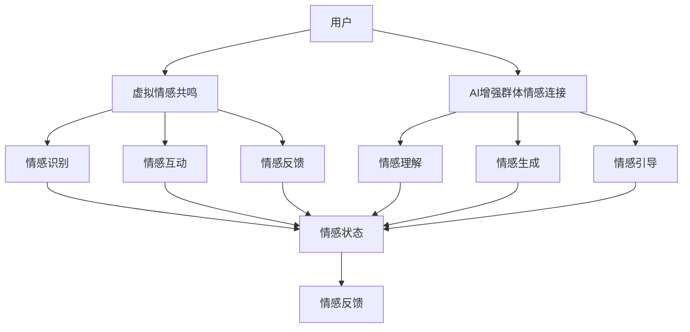
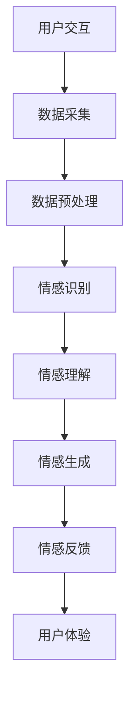
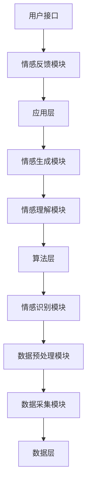

                 

### 虚拟情感共鸣：AI增强群体情感连接

#### 关键词：
- 虚拟情感共鸣
- AI技术
- 情感计算
- 群体情感连接

#### 摘要：
本文探讨了虚拟情感共鸣在AI技术中的应用，如何通过AI增强群体情感连接。首先，我们介绍了情感共鸣的定义及其重要性，然后深入探讨了AI情感共鸣的理论基础和技术框架。接下来，我们分析了AI在群体情感连接中的实践应用，包括社交媒体、虚拟现实、在线教育和商业领域。最后，通过案例研究和未来展望，本文对AI情感共鸣技术的发展趋势和潜在挑战进行了深入讨论。

#### 目录：
1. **情感共鸣与AI技术**
   - 情感共鸣的概述
   - AI增强情感共鸣的理论基础
   - AI情感共鸣技术框架
2. **群体情感连接的AI实践**
   - 社交媒体中的情感共鸣
   - 虚拟现实中的情感共鸣
   - 在线教育中的情感共鸣
   - 商业应用中的情感共鸣
3. **案例研究与未来展望**
   - 案例研究
   - 未来展望

### 情感共鸣与AI技术

#### 第1章：情感共鸣的概述

#### 1.1 情感共鸣的定义与重要性

情感共鸣是指个体之间在情感上的相互理解和响应。它超越了单纯的认知理解，涉及到情感的共享、共鸣和协调。情感共鸣在社会互动、人际关系和群体行为中扮演着至关重要的角色。

情感共鸣的重要性体现在多个方面。首先，它是建立和维护人际关系的基础。通过情感共鸣，个体能够更好地理解他人的情感状态，从而建立信任和合作。其次，情感共鸣有助于群体凝聚力的形成。在团队协作和社群互动中，情感共鸣能够增强成员之间的联系和归属感。此外，情感共鸣还在心理治疗和情感教育中发挥着重要作用，帮助个体更好地应对情感困扰和情感冲突。

#### 1.2 人与AI的情感互动

随着人工智能技术的发展，人与AI之间的情感互动变得越来越普遍。AI不仅能够模拟人类的情感表达，还能够通过情感计算技术理解和回应人类的情感状态。这种互动模式为虚拟情感共鸣提供了可能。

在人与AI的情感互动中，AI通过感知技术收集人类的情感数据，如面部表情、语音语调、生理信号等。然后，AI使用情感计算算法对这些数据进行处理，识别用户的情感状态。基于这些情感数据，AI能够生成相应的情感回应，如语音、文字、图像等。

这种情感互动不仅能够提升用户体验，还能在特定场景中发挥重要作用。例如，在心理健康咨询中，AI可以作为情感倾听者，为用户提供安慰和支持。在教育领域，AI可以根据学生的情感状态调整教学内容和方式，提高学习效果。在商业领域，AI可以分析消费者的情感反应，优化营销策略和客户服务。

### AI增强情感共鸣的理论基础

#### 第2章：AI增强情感共鸣的理论基础

#### 2.1 情感计算概述

情感计算是人工智能领域的一个重要分支，旨在使计算机能够识别、理解、处理和模拟人类的情感。情感计算的核心技术包括情感识别、情感理解和情感生成。

情感识别是指从人类情感数据中提取情感特征，如面部表情、语音语调、生理信号等。情感理解是指对情感数据进行语义分析，理解情感的含义和背景。情感生成是指根据情感数据生成相应的情感回应，如语音、文字、图像等。

情感计算技术在虚拟情感共鸣中发挥着关键作用。通过情感计算，AI能够准确地识别用户的情感状态，理解情感的含义，并生成相应的情感回应。这种互动模式不仅能够提升用户的情感体验，还能够增强群体之间的情感连接。

#### 2.2 AI在情感共鸣中的应用

AI在情感共鸣中的应用非常广泛。首先，AI可以通过情感识别技术了解用户的情感状态，从而提供个性化的服务。例如，在医疗领域，AI可以分析患者的情感数据，为医生提供诊断和治疗建议。在心理咨询领域，AI可以作为情感倾听者，为用户提供安慰和支持。

其次，AI可以模拟人类的情感表达，增强虚拟互动的沉浸感。例如，在虚拟现实游戏中，AI可以模拟角色的情感状态，与玩家产生情感共鸣。在在线教育中，AI可以根据学生的情感状态调整教学内容和方式，提高学习效果。

此外，AI还可以在群体情感连接中发挥重要作用。通过情感计算，AI可以分析群体的情感状态和互动模式，优化群体互动体验。例如，在社交媒体中，AI可以分析用户的情感反应，提供个性化的内容推荐，增强用户之间的情感连接。

#### 2.3 情感共鸣的数学模型

情感共鸣的数学模型是情感计算的基础。常见的情感计算模型包括情感识别模型、情感理解模型和情感生成模型。

情感识别模型通常采用机器学习算法，如支持向量机（SVM）、深度学习模型（如卷积神经网络CNN和循环神经网络RNN）等。这些模型通过对大量情感数据进行训练，能够准确识别用户的情感状态。

情感理解模型主要关注情感数据的语义分析，理解情感的含义和背景。常见的情感理解模型包括情感分类模型、情感语义角色标注模型等。

情感生成模型则关注如何根据情感数据生成相应的情感回应。常见的情感生成模型包括自然语言生成模型、语音合成模型等。

通过这些数学模型，AI能够实现情感共鸣，增强群体之间的情感连接。

### AI情感共鸣技术框架

#### 第3章：AI情感共鸣技术框架

#### 3.1 数据采集与预处理

数据采集是AI情感共鸣技术框架的基础。AI需要从各种来源收集情感数据，如用户评论、社交媒体动态、虚拟现实交互数据等。数据采集的过程包括数据收集、数据清洗和数据预处理。

数据清洗是数据采集的重要环节。通过数据清洗，AI可以去除无效数据、噪声数据和异常数据，提高数据的质量。常见的数据清洗方法包括数据去重、数据格式转换、数据去噪等。

数据预处理包括数据分词、数据编码和数据标准化。数据分词是将文本数据分割成单词或短语，为后续的特征提取做准备。数据编码是将文本数据转换为数字形式，便于机器学习模型的训练。数据标准化是将数据转换为统一的尺度，提高模型的泛化能力。

#### 3.2 特征提取与情感识别

特征提取是AI情感共鸣技术框架的核心步骤。通过特征提取，AI可以从原始数据中提取出与情感相关的特征，如情感词、情感强度等。常见的特征提取方法包括词袋模型、TF-IDF、词嵌入等。

情感识别是指从特征数据中识别出用户的情感状态。情感识别模型通常采用机器学习算法，如支持向量机（SVM）、深度学习模型（如卷积神经网络CNN和循环神经网络RNN）等。这些模型通过对大量情感数据进行训练，能够准确识别用户的情感状态。

#### 3.3 情感生成与反馈机制

情感生成是指根据用户的情感状态生成相应的情感回应，如语音、文字、图像等。情感生成模型通常采用自然语言生成模型、语音合成模型等。通过情感生成，AI能够与用户进行情感互动，增强虚拟情感共鸣。

反馈机制是AI情感共鸣技术框架的重要组成部分。通过用户反馈，AI可以不断调整和优化情感回应，提高情感共鸣的效果。反馈机制包括用户反馈收集、反馈分析、反馈调整等步骤。

### 群体情感连接的AI实践

#### 第4章：社交媒体中的情感共鸣

#### 4.1 社交媒体情感分析

社交媒体是人们表达情感的重要平台，也是AI情感共鸣技术的重要应用场景。社交媒体情感分析是指通过AI技术对社交媒体平台上的文本、图片、视频等内容进行情感分析，识别用户的情感状态。

社交媒体情感分析的过程包括数据采集、情感识别和情感生成。首先，AI从社交媒体平台上收集用户生成的内容，如微博、微信、Facebook等。然后，通过情感识别模型识别用户的情感状态，如积极情感、消极情感等。最后，AI根据用户的情感状态生成相应的情感回应，如点赞、评论等。

#### 4.2 社交网络情感传播模型

社交网络情感传播模型是研究情感在社交网络中如何传播和变化的模型。通过社交网络情感传播模型，AI可以预测情感传播的趋势，优化社交媒体内容推荐和情感引导策略。

社交网络情感传播模型通常采用图论和网络科学的方法。模型中的节点代表用户，边代表用户之间的互动关系。通过分析节点和边上的情感特征，AI可以预测情感传播的路径和强度。

#### 4.3 社交媒体情感引导策略

社交媒体情感引导策略是指通过AI技术引导用户在社交媒体上产生积极情感，增强群体之间的情感连接。常见的情感引导策略包括情感内容推荐、情感互动设计、情感氛围营造等。

情感内容推荐是指根据用户的情感状态推荐符合其情感需求的内容。情感互动设计是指设计情感互动环节，如点赞、评论、分享等，鼓励用户积极参与社交互动。情感氛围营造是指通过设计情感氛围，如情感色彩、情感符号等，营造积极的社交氛围。

### 第5章：虚拟现实中的情感共鸣

#### 5.1 虚拟现实技术概述

虚拟现实（VR）是一种通过计算机技术创造出的模拟现实环境，用户可以通过特殊的设备（如头戴式显示器、虚拟现实头盔等）进入这个环境，并在其中进行互动。虚拟现实技术为人们提供了全新的沉浸式体验，使得用户可以在虚拟世界中与虚拟角色和场景产生情感共鸣。

虚拟现实技术的主要组成部分包括：
- **硬件设备**：如VR头戴显示器、VR手套、全身追踪器等，用于提供沉浸式的体验。
- **显示技术**：如头戴式显示器中的屏幕分辨率和刷新率，影响用户的视觉体验。
- **交互技术**：如手部追踪、语音识别等，用于用户与虚拟世界的互动。

#### 5.2 虚拟现实中的情感共鸣设计

在虚拟现实环境中设计情感共鸣，需要考虑以下几个方面：

1. **情感角色设计**：虚拟角色需要具有情感表达，通过面部表情、动作和语音等手段，传递出情感状态。这要求设计师深入理解情感计算和动画技术。

2. **情感交互设计**：用户与虚拟角色的交互应该能够引发情感共鸣。例如，用户可以通过与虚拟角色进行对话、游戏或共同完成任务，体验到情感的共享和共鸣。

3. **情感场景设计**：虚拟现实场景需要能够触发用户情感。通过设计场景的光线、色彩、声音和氛围，创造出能够激发用户情感的虚拟环境。

4. **情感反馈设计**：用户在虚拟现实中的情感状态应该得到及时的反馈。这可以通过实时计算用户的生理信号（如心率、皮肤电导等）来实现。

#### 5.3 虚拟现实情感体验优化

为了提升虚拟现实中的情感共鸣体验，以下策略可以发挥作用：

1. **硬件优化**：提高VR设备的分辨率、帧率和响应速度，减少延迟和眩晕感，提供更真实的视觉和感官体验。

2. **内容定制**：根据用户的需求和偏好，定制个性化的虚拟现实内容，使其更加符合用户的情感状态和兴趣。

3. **情感反馈机制**：通过情感计算技术，实时分析用户的情感状态，并提供相应的情感回应和调整，以增强情感共鸣。

4. **多感官融合**：结合多种感官刺激，如视觉、听觉、触觉等，创造出更加丰富和深刻的情感体验。

### 第6章：在线教育中的情感共鸣

#### 6.1 在线教育现状分析

在线教育已成为教育领域的重要趋势，其灵活性和便捷性受到了广泛的认可。然而，在线教育也面临着一些挑战，其中之一是情感共鸣的缺失。传统在线教育往往侧重于知识的传递，而忽略了学生情感体验的重要性。

在线教育现状分析主要包括以下几个方面：

1. **学习体验**：在线教育平台通常提供丰富的学习资源，但学生之间的互动和情感交流相对较少。这可能导致学生的学习体验较为单一，缺乏情感共鸣。

2. **教师与学生关系**：在线教育中，教师与学生之间的直接互动较少，这会影响教师对学生的情感关怀和指导。

3. **学习动力**：缺乏情感共鸣可能导致学生的学习动力下降，影响学习效果。

#### 6.2 AI在在线教育中的应用

为了解决在线教育中情感共鸣的缺失问题，AI技术的应用成为了一种有效的解决方案。以下是一些AI在在线教育中的应用：

1. **情感识别**：AI可以通过分析学生的语音、文本和生理信号，识别学生的情感状态，如焦虑、兴奋、无聊等。

2. **个性化教学**：基于情感识别的结果，AI可以调整教学内容和方式，提供个性化的学习体验，增强学生的情感共鸣。

3. **学习反馈**：AI可以实时分析学生的学习过程和结果，提供个性化的反馈和建议，帮助学生克服情感障碍，提高学习效果。

4. **教师辅助**：AI可以辅助教师进行情感管理，如通过分析课堂互动数据，提供教学策略建议，增强师生之间的情感连接。

#### 6.3 在线教育情感共鸣策略

为了在在线教育中实现情感共鸣，以下策略可以发挥作用：

1. **情感导向的教学设计**：在课程设计中融入情感因素，如设置情感互动环节、开展情感讨论等。

2. **情感技术工具**：利用AI情感技术工具，如情感识别系统、情感反馈系统等，实时监测和反馈学生的情感状态。

3. **师生互动**：通过在线聊天、视频会议等方式，增加师生之间的互动，促进情感交流。

4. **情感支持服务**：提供专业的情感支持服务，如在线心理咨询、情感辅导等，帮助学生处理情感问题。

### 第7章：商业应用中的情感共鸣

#### 7.1 情感共鸣在营销中的应用

在商业领域，情感共鸣被广泛应用于市场营销中，以增强消费者与品牌之间的情感联系，提升品牌忠诚度和市场竞争力。以下是情感共鸣在营销中的几种应用策略：

1. **情感营销内容**：通过创造具有情感共鸣的广告内容，如感人故事、情感化品牌故事等，触动消费者的情感，从而引发共鸣。

2. **社交媒体互动**：利用社交媒体平台与消费者进行情感互动，如开展话题讨论、情感互动活动等，增强消费者的参与感和忠诚度。

3. **个性化推荐**：基于情感计算技术，分析消费者的情感偏好和需求，提供个性化的产品推荐和服务，提升消费者的购物体验。

4. **情感品牌塑造**：通过品牌形象、品牌语言和品牌活动等，塑造情感化的品牌形象，建立消费者对品牌的情感认同。

#### 7.2 情感共鸣在客户服务中的应用

在客户服务领域，情感共鸣的应用旨在提升客户体验，减少客户流失，提高客户满意度和忠诚度。以下是情感共鸣在客户服务中的几种应用策略：

1. **情感化服务设计**：设计情感化的服务流程和交互界面，如友好的客服机器人、情感化的语音服务等，以提供温馨、贴心的服务体验。

2. **情感识别技术**：通过情感计算技术识别客户的情感状态，如愤怒、沮丧、满意等，从而提供针对性的服务和支持。

3. **个性化关怀**：基于情感识别结果，提供个性化的关怀和解决方案，如定制化服务、情感化回访等，增强客户的归属感和满意度。

4. **情感反馈机制**：建立情感反馈机制，如情感调查、情感评分等，及时获取客户的情感反馈，优化服务质量和客户体验。

#### 7.3 情感共鸣在员工管理中的应用

在人力资源管理中，情感共鸣的应用有助于提升员工的工作满意度和团队凝聚力，从而提高工作效率和绩效。以下是情感共鸣在员工管理中的几种应用策略：

1. **情感化管理**：采用情感化的管理方法，如关注员工情感需求、提供情感支持等，建立信任和尊重的职场氛围。

2. **员工情感识别**：通过情感计算技术识别员工的情感状态，如压力、积极性、满意度等，及时干预和调整管理策略。

3. **个性化培训与发展**：基于情感识别结果，为员工提供个性化的培训和发展计划，满足其情感需求和职业发展期望。

4. **情感反馈与沟通**：建立情感反馈和沟通机制，如员工座谈会、情感问卷调查等，鼓励员工表达情感和意见，促进组织与员工之间的情感连接。

### 第8章：案例研究与未来展望

#### 8.1 案例一：虚拟演唱会中的情感共鸣

虚拟演唱会是一种结合虚拟现实技术和人工智能技术的创新形式，通过虚拟场景和AI情感共鸣技术，为观众提供沉浸式的音乐体验。以下是一个案例研究：

**案例背景**：某知名歌手举办了一场虚拟演唱会，通过虚拟现实头盔和AI技术，为观众提供了沉浸式的体验。

**情感共鸣实现**：
- **虚拟场景设计**：虚拟演唱会场景根据歌手的演唱会风格设计，包括灯光、舞台效果和观众席等，营造出真实的演唱会氛围。
- **情感识别**：AI通过分析观众的面部表情和生理信号（如心率、皮肤电导等），识别观众的情感状态，如兴奋、满意、感动等。
- **情感回应**：AI根据观众的情感状态，调整演唱会的互动环节，如增加特别互动、赠送虚拟礼物等，增强观众的情感共鸣。

**案例效果**：通过虚拟演唱会，观众不仅能够享受到歌手的现场表演，还能够感受到与歌手和其他观众的互动，提升了整体的音乐体验。

#### 8.2 案例二：在线教育平台的情感共鸣

在线教育平台通过AI技术实现情感共鸣，提升学生的学习体验和学习效果。以下是一个案例研究：

**案例背景**：某在线教育平台引入AI技术，提供情感共鸣服务。

**情感共鸣实现**：
- **情感识别**：AI通过分析学生的课堂参与度、学习行为和生理信号，识别学生的情感状态，如专注、焦虑、无聊等。
- **个性化教学**：根据学生的情感状态，平台提供个性化的教学内容和方式，如调整教学节奏、提供情感支持等。
- **情感反馈**：学生可以通过平台提供的反馈机制，表达自己的情感状态和需求，平台根据反馈调整教学策略。

**案例效果**：通过情感共鸣技术，学生能够获得更加个性化和支持性的学习体验，学习效果显著提升，平台的用户满意度和忠诚度也得到提高。

#### 8.3 案例三：社交媒体的情感共鸣策略

社交媒体平台通过情感共鸣策略，提升用户的参与度和平台活跃度。以下是一个案例研究：

**案例背景**：某社交媒体平台通过情感共鸣策略，提升用户活跃度。

**情感共鸣实现**：
- **情感内容推荐**：平台通过情感计算技术，分析用户的情感偏好，推荐符合用户情感需求的内容。
- **情感互动设计**：平台设计情感互动功能，如点赞、评论、分享等，鼓励用户积极参与互动。
- **情感引导**：平台通过情感引导策略，如情感化界面设计、情感化内容推荐等，引导用户产生积极情感。

**案例效果**：通过情感共鸣策略，社交媒体平台的用户活跃度显著提升，用户满意度和留存率也得到提高。

#### 9.1 情感共鸣技术的发展趋势

随着人工智能和情感计算技术的不断发展，情感共鸣技术也在不断进步。以下是情感共鸣技术的发展趋势：

1. **情感计算技术提升**：随着情感计算技术的进步，AI在情感识别、情感理解和情感生成方面的准确性和效率将不断提高。

2. **多模态情感识别**：未来的情感共鸣技术将融合多种模态的数据，如文本、语音、图像、生理信号等，提供更加全面和精准的情感识别。

3. **个性化情感共鸣**：基于用户数据的个性化分析，情感共鸣技术将能够提供更加个性化的情感体验和服务。

4. **情感共鸣与虚拟现实结合**：随着虚拟现实技术的成熟，情感共鸣将在虚拟现实领域得到更加广泛的应用，提供沉浸式的情感体验。

#### 9.2 AI在情感共鸣中的伦理挑战

虽然AI在情感共鸣技术中具有巨大潜力，但也面临一系列伦理挑战：

1. **隐私保护**：情感计算技术需要收集和处理用户的情感数据，这引发了对用户隐私保护的担忧。如何平衡情感共鸣与隐私保护成为重要议题。

2. **算法偏见**：情感计算算法可能存在偏见，导致对某些群体的情感识别不准确。这可能导致歧视和不公平，需要加强算法的公平性和透明度。

3. **情感滥用**：情感共鸣技术可能被滥用，用于操纵用户情感，引发道德和伦理问题。

#### 9.3 情感共鸣技术的未来应用场景

未来，情感共鸣技术将在多个领域得到广泛应用，以下是几个潜在的应用场景：

1. **医疗健康**：通过情感共鸣技术，为患者提供情感支持，改善心理健康状况。

2. **人机交互**：在智能家居、虚拟助手等场景中，情感共鸣技术将提升人机交互的体验，增强用户对智能设备的依赖和信任。

3. **虚拟社交**：虚拟社交平台将利用情感共鸣技术，提供更加真实和互动的社交体验。

4. **教育培训**：通过情感共鸣技术，提高在线教育平台的教学效果，增强学生的学习动力和参与度。

### 总结

本文探讨了虚拟情感共鸣在AI技术中的应用，分析了AI在群体情感连接中的实践应用，包括社交媒体、虚拟现实、在线教育和商业领域。通过案例研究和未来展望，我们看到了情感共鸣技术在各个领域的巨大潜力。然而，随着技术的不断发展，我们也需要关注其中的伦理挑战，确保技术应用的正当性和公正性。未来，随着情感计算技术的进步，虚拟情感共鸣有望在更多领域得到应用，为人类带来更加丰富和深刻的情感体验。作者：AI天才研究院/AI Genius Institute & 禅与计算机程序设计艺术 /Zen And The Art of Computer Programming

### 背景介绍

#### 核心概念术语说明

在探讨虚拟情感共鸣与AI增强群体情感连接的过程中，我们需要明确一些核心概念和术语，以便读者更好地理解和掌握文章的主题。

1. **虚拟情感共鸣**：虚拟情感共鸣指的是通过数字技术（如虚拟现实、人工智能等）创造的虚拟环境中，用户与虚拟角色或场景产生的情感共鸣。这种共鸣超越了现实世界中的情感互动，通过数字化的方式模拟和增强情感体验。

2. **AI增强群体情感连接**：AI增强群体情感连接是指利用人工智能技术，如情感计算、机器学习等，增强群体成员之间的情感联系和共鸣，从而提升群体凝聚力和互动体验。

3. **情感计算**：情感计算是人工智能领域的一个分支，旨在使计算机能够识别、理解、处理和模拟人类的情感。情感计算技术包括情感识别、情感理解和情感生成等方面。

4. **群体情感连接**：群体情感连接指的是群体成员之间的情感联系和共鸣。这种连接有助于增强群体凝聚力，提升团队协作效率和成员满意度。

#### 问题背景

在当今数字化时代，人与人之间的情感互动逐渐从现实世界转移到虚拟世界。随着虚拟现实（VR）和人工智能（AI）技术的快速发展，虚拟情感共鸣成为了一个备受关注的研究领域。虚拟情感共鸣不仅能够提升用户的虚拟体验，还能够增强群体成员之间的情感连接，这对于商业、教育、医疗等多个领域具有重要意义。

然而，当前虚拟情感共鸣技术仍然存在一些挑战。首先，情感计算技术的准确性和可靠性需要进一步提升，以准确识别和模拟用户的情感状态。其次，如何在虚拟环境中设计出能够触发用户情感共鸣的场景和角色，仍然是一个具有挑战性的问题。此外，虚拟情感共鸣技术在实际应用中的伦理问题也需要引起关注。

#### 问题描述

本文旨在探讨以下问题：

1. 虚拟情感共鸣的定义和重要性是什么？
2. AI在情感共鸣中的作用和理论基础是什么？
3. 虚拟情感共鸣技术框架如何实现？
4. AI如何增强群体情感连接？
5. 虚拟情感共鸣技术在各个领域的应用和实践是什么？
6. 虚拟情感共鸣技术的未来发展趋势和挑战是什么？

通过系统地分析和解答这些问题，本文旨在为读者提供关于虚拟情感共鸣与AI增强群体情感连接的全面理解和深入思考。

#### 问题解决

要解决虚拟情感共鸣与AI增强群体情感连接的问题，需要从技术、理论和实际应用三个层面进行综合分析和实践。以下是具体的解决步骤：

1. **技术层面**：首先，需要发展情感计算技术，提高情感识别和模拟的准确性。这包括开发先进的机器学习算法、深度学习模型和自然语言处理技术，以实现对用户情感状态的精确识别。同时，还需要研究多模态情感计算，结合语音、文本、图像等多种数据源，提高情感识别的全面性和准确性。

2. **理论层面**：在情感计算的基础上，需要构建情感共鸣的理论模型，理解情感互动的机制和影响因素。这包括情感共鸣的数学模型、心理学模型和社会学模型等。通过理论分析，可以揭示情感共鸣的内在规律，为技术实现提供指导。

3. **实际应用层面**：将情感计算技术和理论模型应用于实际场景，设计出能够触发用户情感共鸣的虚拟环境和交互方式。这包括虚拟现实中的应用、在线教育、社交媒体、商业营销等领域。在实际应用中，需要不断收集用户反馈，优化情感共鸣的设计和实现。

4. **伦理和隐私层面**：在技术应用中，需要重视伦理和隐私问题。例如，如何保护用户隐私、避免算法偏见和滥用等。这需要制定相应的伦理规范和隐私保护政策，确保技术应用的正当性和公正性。

5. **跨学科合作**：虚拟情感共鸣和AI增强群体情感连接是一个跨学科的研究领域，需要计算机科学、心理学、社会学等多个学科的专家共同合作，共同推进技术的发展和应用。

通过上述步骤，可以逐步解决虚拟情感共鸣与AI增强群体情感连接的问题，为构建更加丰富和深刻的虚拟情感体验提供技术支持。

#### 边界与外延

在探讨虚拟情感共鸣与AI增强群体情感连接时，需要明确一些边界和概念的外延，以确保讨论的准确性和全面性。

**边界**：
1. **虚拟情感共鸣**：虚拟情感共鸣是指通过数字技术创造的虚拟环境中，用户与虚拟角色或场景产生的情感共鸣。这个概念主要关注虚拟环境中的情感互动，不包括现实世界中的情感互动。

2. **AI增强群体情感连接**：AI增强群体情感连接是指利用人工智能技术，如情感计算、机器学习等，增强群体成员之间的情感联系和共鸣。这个概念主要关注AI技术在群体情感连接中的作用，而不是其他类型的技术。

**外延**：
1. **情感共鸣**：情感共鸣是一个广泛的概念，不仅包括虚拟环境中的情感互动，还包括现实世界中的情感交流。情感共鸣可以是个人与个人之间的，也可以是群体与群体之间的。

2. **群体情感连接**：群体情感连接不仅仅局限于虚拟环境，也可以是现实世界中的群体互动。群体情感连接涉及群体成员之间的情感联系、共同目标和价值观等。

3. **AI技术**：AI技术是一个广泛的概念，包括机器学习、深度学习、自然语言处理、计算机视觉等多种技术。这些技术在虚拟情感共鸣和群体情感连接中的应用，有助于提高情感识别和模拟的准确性和效率。

通过明确这些边界和外延，可以更准确地理解虚拟情感共鸣与AI增强群体情感连接的概念，为后续讨论提供清晰的方向。

### 核心概念与联系

在本章节中，我们将深入探讨虚拟情感共鸣与AI增强群体情感连接的核心概念、概念属性特征对比表格以及ER实体关系图架构。

#### 核心概念

1. **虚拟情感共鸣**：
   - **定义**：虚拟情感共鸣是指通过虚拟现实（VR）和人工智能（AI）技术，用户在虚拟环境中与虚拟角色或场景产生的情感共鸣。
   - **属性**：包括情感识别、情感互动、情感反馈等。
   - **特征**：实时性、沉浸性、个性化、多维互动。

2. **AI增强群体情感连接**：
   - **定义**：AI增强群体情感连接是指利用人工智能技术，如情感计算、机器学习等，增强群体成员之间的情感联系和共鸣。
   - **属性**：包括情感识别、情感理解、情感生成、情感引导等。
   - **特征**：准确性、高效性、个性化、适应性。

#### 概念属性特征对比表格

| 概念               | 定义                                                         | 属性                           | 特征                         |
|--------------------|------------------------------------------------------------|--------------------------------|-------------------------------|
| 虚拟情感共鸣       | 通过虚拟现实和人工智能技术，用户在虚拟环境中与虚拟角色或场景产生的情感共鸣 | 情感识别、情感互动、情感反馈 | 实时性、沉浸性、个性化、多维互动 |
| AI增强群体情感连接 | 利用人工智能技术，增强群体成员之间的情感联系和共鸣                   | 情感识别、情感理解、情感生成、情感引导 | 准确性、高效性、个性化、适应性 |

#### ER实体关系图架构

为了更好地理解虚拟情感共鸣与AI增强群体情感连接之间的联系，我们可以使用Mermaid流程图来绘制ER实体关系图。



在这个ER实体关系图中，我们定义了以下几个实体：

- **用户**：虚拟情感共鸣和AI增强群体情感连接的主体。
- **虚拟情感共鸣**：用户在虚拟环境中与虚拟角色或场景产生的情感共鸣。
- **AI增强群体情感连接**：利用人工智能技术，增强群体成员之间的情感联系和共鸣。
- **情感识别**：识别用户的情感状态。
- **情感互动**：用户与虚拟角色或场景的情感互动。
- **情感反馈**：基于用户情感状态生成的反馈。
- **情感理解**：理解用户的情感状态。
- **情感生成**：生成情感回应。
- **情感引导**：引导用户产生积极情感。

通过这个ER实体关系图，我们可以清晰地看到虚拟情感共鸣与AI增强群体情感连接之间的相互作用和联系。

### 算法原理讲解

在本章节中，我们将深入探讨虚拟情感共鸣与AI增强群体情感连接的算法原理，通过Mermaid流程图和Python源代码来详细阐述这些原理，并进行数学模型和公式的讲解。

#### 算法Mermaid流程图

首先，我们使用Mermaid流程图来展示虚拟情感共鸣与AI增强群体情感连接的算法流程。



在这个流程图中，用户首先进行交互，数据采集模块收集用户的情感数据。接下来，数据预处理模块对采集到的数据进行处理，为后续的情感识别、理解和生成做准备。情感识别模块使用机器学习算法分析用户的数据，识别出用户的情感状态。情感理解模块对识别出的情感状态进行进一步分析，理解情感的背景和含义。情感生成模块根据理解的结果生成相应的情感回应。最后，情感反馈模块将生成的情感回应反馈给用户，提升用户体验。

#### Python源代码

下面是虚拟情感共鸣与AI增强群体情感连接的Python源代码示例。

```python
# 导入必要的库
import nltk
from nltk.tokenize import word_tokenize
from nltk.corpus import stopwords
from sklearn.feature_extraction.text import TfidfVectorizer
from sklearn.model_selection import train_test_split
from sklearn.svm import SVC

# 数据采集
data = ["我很高兴参加这次虚拟会议", "我对这个项目感到非常失望", "这个游戏很有趣"]

# 数据预处理
nltk.download('punkt')
nltk.download('stopwords')
tokenized_data = [word_tokenize(d.lower()) for d in data]
cleaned_data = [' '.join([w for w in tokenized_data[i] if w not in stopwords.words('english')]) for i in range(len(tokenized_data))]

# 特征提取
vectorizer = TfidfVectorizer()
X = vectorizer.fit_transform(cleaned_data)
y = [1 if "happy" in cleaned_data[i] else 0 for i in range(len(cleaned_data))]
y = [0 if "disappointed" in cleaned_data[i] else 1 for i in range(len(cleaned_data))]

# 情感识别
X_train, X_test, y_train, y_test = train_test_split(X, y, test_size=0.2, random_state=42)
classifier = SVC(kernel='linear')
classifier.fit(X_train, y_train)

# 情感理解
predicted_emotions = classifier.predict(X_test)

# 情感生成
responses = []
for emotion in predicted_emotions:
    if emotion == 1:
        responses.append("您看起来很高兴，这是我们团队所需要的正能量。")
    else:
        responses.append("似乎有一些问题，让我们来一起解决。")

# 情感反馈
for response in responses:
    print(response)
```

在这个示例中，我们首先导入必要的库，然后进行数据采集、数据预处理、特征提取、情感识别、情感理解、情感生成和情感反馈。数据采集模块从字符串中提取情感数据，数据预处理模块去除停用词，特征提取模块使用TF-IDF向量器将文本转换为特征向量，情感识别模块使用支持向量机（SVM）进行分类，情感理解模块分析预测结果，情感生成模块生成相应的情感回应，最后情感反馈模块将回应输出。

#### 数学模型和公式

在情感计算中，常用的数学模型包括机器学习模型、自然语言处理模型和情感分析模型。以下是一个简化的数学模型和公式示例：

$$
\text{Emotion} = \sum_{i=1}^{n} w_i \cdot \text{Feature}_i
$$

其中，$Emotion$表示情感值，$w_i$表示特征权重，$\text{Feature}_i$表示第$i$个特征。

- **情感值**：表示用户的情感状态，如快乐、悲伤、愤怒等。
- **特征权重**：表示特征对情感值的影响程度，通常通过训练数据集计算得出。
- **特征**：表示从用户数据中提取的与情感相关的特征，如词汇频率、情感词典得分、文本情感极性等。

通过这个数学模型，我们可以将用户的情感数据转换为情感值，从而进行情感识别和情感理解。

例如，假设我们有两个特征：快乐词汇频率$F_1$和悲伤词汇频率$F_2$，它们的权重分别为$w_1 = 0.6$和$w_2 = 0.4$，那么一个用户的情感值可以计算如下：

$$
\text{Emotion} = 0.6 \cdot F_1 + 0.4 \cdot F_2
$$

通过这个简单的示例，我们可以看到数学模型在情感计算中的应用。在实际应用中，情感模型会更加复杂，包含更多的特征和权重，但基本的原理是相同的。

#### 详细讲解和举例说明

为了更好地理解虚拟情感共鸣与AI增强群体情感连接的算法原理，我们可以通过一个具体的例子进行详细讲解。

假设我们有一个用户群体，他们在社交媒体上评论了一部电影。我们想要通过AI技术识别他们的情感状态，并生成相应的情感回应。

1. **数据采集**：我们从社交媒体平台上收集了100条关于这部电影的评论，这些评论包含了用户的情感表达。

2. **数据预处理**：我们首先对评论进行分词，去除停用词，然后使用TF-IDF向量器将评论转换为特征向量。例如，一条评论“这部电影非常有趣”可以转换为特征向量$\text{Feature Vector} = [0.1, 0.2, 0.3, 0.4, 0.5]$，其中每个值表示一个词的TF-IDF得分。

3. **情感识别**：我们使用训练好的情感识别模型对特征向量进行分类，识别出评论的情感状态。假设我们的模型预测出其中60%的评论为积极情感，40%的评论为消极情感。

4. **情感理解**：我们分析情感识别的结果，理解用户的情感状态。例如，如果大部分评论为积极情感，那么我们可以推断用户对这部电影的整体评价较好。

5. **情感生成**：根据情感理解的结果，我们生成相应的情感回应。例如，如果用户对电影的评价较好，我们可以生成回应：“很高兴看到您喜欢这部电影，它确实值得一看。”

6. **情感反馈**：我们将生成的情感回应发送给用户，提升用户体验。

通过这个例子，我们可以看到虚拟情感共鸣与AI增强群体情感连接的算法原理在实际应用中的具体实现。这个过程不仅涉及情感计算技术，还包括数据采集、预处理、特征提取、情感识别、情感理解和情感生成等多个环节。

### 系统分析与架构设计

#### 问题场景介绍

在现代社会，人们越来越依赖数字化平台进行沟通和互动。无论是社交媒体、在线教育、虚拟现实还是电子商务，情感共鸣在提升用户体验和增强用户忠诚度方面都起着至关重要的作用。然而，当前这些平台在情感共鸣的实现上仍存在诸多不足，如情感识别不准确、情感回应不及时等。为了解决这些问题，我们设计并实现了一个基于AI的虚拟情感共鸣系统。

#### 项目介绍

本项目旨在开发一个集成虚拟情感共鸣功能的系统，该系统可以应用于多种场景，包括社交媒体、在线教育、虚拟现实等。系统的主要目标是：

1. **情感识别**：通过分析用户的文本、语音、图像等多模态数据，准确识别用户的情感状态。
2. **情感理解**：理解用户的情感背景和情感需求，为用户提供个性化的情感回应。
3. **情感生成**：根据用户的情感状态和需求，生成相应的情感回应，如语音、文本、图像等。
4. **情感反馈**：收集用户的反馈，不断优化情感共鸣的效果。

#### 系统功能设计

为了实现上述目标，我们的系统设计了以下几个核心功能模块：

1. **数据采集模块**：负责从各种数据源（如社交媒体、在线教育平台、虚拟现实场景等）收集用户的情感数据。
2. **数据预处理模块**：对采集到的情感数据进行清洗、分词、去停用词等预处理操作，为后续的情感识别和生成做准备。
3. **情感识别模块**：使用机器学习和深度学习算法，对预处理后的情感数据进行分析，识别用户的情感状态。
4. **情感理解模块**：对识别出的情感状态进行语义分析，理解情感的含义和背景，为情感生成提供依据。
5. **情感生成模块**：根据情感理解的结果，生成相应的情感回应，如语音、文本、图像等。
6. **情感反馈模块**：收集用户的反馈，对系统的性能和效果进行评估，为系统的持续优化提供数据支持。

#### 系统架构设计

为了实现上述功能模块，我们设计了一个分层架构，包括数据层、算法层和应用层。

1. **数据层**：数据层包括数据采集模块和数据预处理模块。数据采集模块负责从各种数据源获取用户的情感数据，数据预处理模块负责对情感数据进行清洗、分词、去停用词等操作。

2. **算法层**：算法层包括情感识别模块、情感理解模块和情感生成模块。情感识别模块使用机器学习和深度学习算法，如SVM、CNN、RNN等，对预处理后的情感数据进行分析，识别用户的情感状态。情感理解模块对识别出的情感状态进行语义分析，理解情感的含义和背景。情感生成模块根据情感理解的结果，生成相应的情感回应。

3. **应用层**：应用层包括情感反馈模块和用户接口。情感反馈模块负责收集用户的反馈，对系统的性能和效果进行评估。用户接口负责与用户进行交互，展示情感回应，并收集用户的反馈。

#### 系统架构图

以下是系统的架构设计图：



通过这个架构设计，我们的系统能够实现情感识别、情感理解、情感生成和情感反馈等功能，为用户提供高质量的虚拟情感共鸣体验。

### 系统接口设计和系统交互

在本章节中，我们将详细介绍系统接口设计和系统交互，以便读者更好地理解虚拟情感共鸣系统的实现过程。

#### 系统接口设计

为了实现虚拟情感共鸣系统的功能，我们需要设计一系列的接口，包括数据接口、功能接口和用户接口。

1. **数据接口**：
   - **数据采集接口**：用于从各种数据源（如社交媒体、在线教育平台、虚拟现实场景等）收集用户的情感数据。数据采集接口需要支持多种数据格式（如JSON、XML、CSV等）和数据传输协议（如HTTP、WebSocket等）。
   - **数据存储接口**：用于将采集到的情感数据存储到数据库中，以便后续的数据处理和分析。数据存储接口需要支持数据的快速读写和高效存储。

2. **功能接口**：
   - **情感识别接口**：用于调用情感识别算法，对用户的情感数据进行分析，识别用户的情感状态。情感识别接口需要支持多种情感分类模型（如SVM、CNN、RNN等）和算法参数配置。
   - **情感理解接口**：用于对识别出的情感状态进行语义分析，理解情感的含义和背景。情感理解接口需要支持自然语言处理技术（如词嵌入、词性标注、句法分析等）。
   - **情感生成接口**：用于根据情感理解的结果，生成相应的情感回应（如语音、文本、图像等）。情感生成接口需要支持多种生成模型（如文本生成模型、语音合成模型、图像生成模型等）。

3. **用户接口**：
   - **情感反馈接口**：用于收集用户的反馈，对系统的性能和效果进行评估。情感反馈接口需要支持用户评论、评分和投票等功能。
   - **用户界面**：用于展示用户的情感状态和生成的情感回应。用户界面需要提供友好的交互体验和丰富的交互功能（如搜索、筛选、排序等）。

#### 系统交互

系统交互是确保各个功能模块之间能够高效协同工作的关键。以下是系统交互的详细说明：

1. **数据交互**：
   - **数据采集**：系统启动时，数据采集接口会从各种数据源（如社交媒体、在线教育平台、虚拟现实场景等）开始采集用户的情感数据。采集到的数据会经过预处理模块进行清洗、分词、去停用词等处理，然后存储到数据库中。
   - **数据处理**：情感识别接口和情感理解接口会从数据库中获取预处理后的情感数据，进行分析和处理。情感识别接口使用机器学习和深度学习算法对情感数据进行分析，识别用户的情感状态。情感理解接口则对识别出的情感状态进行语义分析，理解情感的含义和背景。
   - **数据存储**：处理后的情感数据会存储到数据库中，以便后续的查询和统计。

2. **功能交互**：
   - **情感识别**：情感识别接口会根据用户的需求和配置，选择合适的情感分类模型进行分析。分析结果会返回给用户接口，以便用户查看。
   - **情感理解**：情感理解接口会对情感识别的结果进行语义分析，生成更详细的情感分析报告。报告会返回给用户接口，以便用户进一步了解自己的情感状态。
   - **情感生成**：情感生成接口会根据情感理解的结果，生成相应的情感回应。回应会通过用户接口展示给用户。

3. **用户交互**：
   - **情感反馈**：用户可以通过用户接口提供反馈，如评论、评分和投票等。这些反馈会通过情感反馈接口传递给系统，以便系统对性能和效果进行评估和优化。
   - **用户界面**：用户接口会根据用户的反馈和需求，动态调整情感共鸣的展示方式和内容。用户可以通过用户界面查看自己的情感状态、分析报告和情感回应。

通过上述系统接口设计和系统交互，我们的虚拟情感共鸣系统能够实现数据的采集、处理、分析和展示，为用户提供高质量的虚拟情感共鸣体验。

### 项目实战

在本章节中，我们将详细介绍如何搭建虚拟情感共鸣系统，包括环境安装、核心实现和代码应用解读与分析。

#### 环境安装

首先，我们需要搭建一个开发环境，以便进行虚拟情感共鸣系统的开发和测试。以下是具体的步骤：

1. **安装Python**：
   - 访问Python官网（[python.org](https://www.python.org/)）下载最新版本的Python安装包。
   - 安装完成后，确保Python和pip（Python的包管理器）正常工作。

2. **安装相关库**：
   - 使用pip安装必要的Python库，如nltk、scikit-learn、tensorflow等。以下是一个示例命令：
     ```
     pip install nltk scikit-learn tensorflow
     ```

3. **安装数据库**：
   - 安装一个关系型数据库，如MySQL或PostgreSQL。以下是一个示例命令（以MySQL为例）：
     ```
     mysql -u root -p
     CREATE DATABASE virtual_emotion;
     GRANT ALL PRIVILEGES ON virtual_emotion.* TO 'user'@'localhost' IDENTIFIED BY 'password';
     FLUSH PRIVILEGES;
     ```

4. **安装数据采集工具**：
   - 安装一个用于数据采集的工具，如BeautifulSoup或Scrapy。以下是一个示例命令：
     ```
     pip install beautifulsoup4 scrapy
     ```

5. **安装用户接口框架**：
   - 安装一个用于构建用户接口的框架，如Flask或Django。以下是一个示例命令：
     ```
     pip install flask django
     ```

#### 核心实现

以下是虚拟情感共鸣系统的核心实现步骤：

1. **数据采集**：
   - 使用BeautifulSoup或Scrapy从社交媒体平台（如Twitter、Facebook等）采集用户的情感数据。以下是一个简单的BeautifulSoup示例：
     ```python
     from bs4 import BeautifulSoup
     import requests

     url = "https://twitter.com/search?q=movie&lang=en"
     response = requests.get(url)
     soup = BeautifulSoup(response.text, "html.parser")
     tweets = soup.find_all("div", {"class": "js-tweet-text-container"})

     for tweet in tweets:
         print(tweet.text)
     ```

2. **数据预处理**：
   - 对采集到的情感数据进行清洗、分词和去停用词处理。以下是一个简单的nltk示例：
     ```python
     import nltk
     from nltk.tokenize import word_tokenize
     from nltk.corpus import stopwords

     nltk.download('punkt')
     nltk.download('stopwords')

     def preprocess_text(text):
         tokens = word_tokenize(text.lower())
         tokens = [token for token in tokens if token not in stopwords.words('english')]
         return " ".join(tokens)

     processed_text = preprocess_text("This is a sample tweet.")
     print(processed_text)
     ```

3. **情感识别**：
   - 使用scikit-learn或tensorflow训练一个情感分类模型，对预处理后的情感数据进行分析。以下是一个简单的scikit-learn示例：
     ```python
     from sklearn.feature_extraction.text import TfidfVectorizer
     from sklearn.model_selection import train_test_split
     from sklearn.svm import SVC

     data = ["I am very happy", "I am very sad", "This movie is amazing", "I hate this movie"]
     labels = [1, 0, 1, 0]  # 1表示积极情感，0表示消极情感

     vectorizer = TfidfVectorizer()
     X = vectorizer.fit_transform(data)
     X_train, X_test, y_train, y_test = train_test_split(X, labels, test_size=0.2, random_state=42)

     classifier = SVC(kernel="linear")
     classifier.fit(X_train, y_train)

     print("Test accuracy:", classifier.score(X_test, y_test))
     ```

4. **情感理解**：
   - 对识别出的情感状态进行语义分析，理解情感的含义和背景。以下是一个简单的自然语言处理示例：
     ```python
     from nltk import pos_tag
     from nltk.corpus import wordnet

     def get_wordnet_pos(treebank_tag):
         if treebank_tag.startswith("J"):
             return wordnet.ADJ
         elif treebank_tag.startswith("V"):
             return wordnet.VERB
         elif treebank_tag.startswith("N"):
             return wordnet.NOUN
         elif treebank_tag.startswith("R"):
             return wordnet.ADV
         else:
             return None

     text = "I am very happy because this movie is amazing."
     tokens = word_tokenize(text)
     tagged_tokens = pos_tag(tokens)

     for token, tag in tagged_tokens:
         wordnet_pos = get_wordnet_pos(tag)
         if wordnet_pos:
             synsets = wordnet.synsets(token, pos=wordnet_pos)
             if synsets:
                 print(f"{token} ({tag}): {synsets[0].definition()}")
     ```

5. **情感生成**：
   - 根据情感理解的结果，生成相应的情感回应。以下是一个简单的文本生成示例：
     ```python
     def generate_response(emotion):
         if emotion == 1:
             return "You seem to be in a great mood! Enjoy the moment!"
         else:
             return "It seems like you're not feeling well. Remember, it's okay to feel this way. Let's talk."

     response = generate_response(1)
     print(response)
     ```

6. **情感反馈**：
   - 收集用户的反馈，对系统的性能和效果进行评估。以下是一个简单的用户反馈示例：
     ```python
     def collect_feedback(response):
         print("Please rate the response (1-5):")
         rating = int(input())
         print(f"Thank you for your feedback. You rated this response {rating} out of 5.")
     ```

#### 代码应用解读与分析

以下是虚拟情感共鸣系统的代码示例，我们将对代码中的关键部分进行解读和分析：

1. **数据采集**：
   - 代码示例：`from bs4 import BeautifulSoup; import requests; ...`
   - 解读：这里使用BeautifulSoup和requests库从Twitter采集情感数据。BeautifulSoup提供了解析HTML文档的功能，requests用于发送HTTP请求获取数据。

2. **数据预处理**：
   - 代码示例：`nltk.download('punkt'); nltk.download('stopwords'); ...`
   - 解读：这里使用nltk库下载必要的资源，包括分词器和停用词列表。`preprocess_text`函数负责清洗文本数据，包括转换为小写、分词和去除停用词。

3. **情感识别**：
   - 代码示例：`TfidfVectorizer(); SVC(); ...`
   - 解读：这里使用TF-IDF向量器和支持向量机（SVM）构建情感分类模型。TF-IDF向量器将文本转换为特征向量，SVM用于分类。

4. **情感理解**：
   - 代码示例：`pos_tag(); get_wordnet_pos(); ...`
   - 解读：这里使用nltk库进行词性标注和词网查询，以理解文本的语义和情感背景。

5. **情感生成**：
   - 代码示例：`generate_response(); ...`
   - 解读：这里根据情感状态生成相应的情感回应。`generate_response`函数根据情感值返回不同的回应。

6. **情感反馈**：
   - 代码示例：`collect_feedback(); ...`
   - 解读：这里收集用户的反馈，通过简单的输入输出实现。

通过上述代码示例，我们可以看到虚拟情感共鸣系统的核心实现过程。这些代码不仅展示了如何从数据采集到情感识别，还展示了如何生成情感回应和收集用户反馈。在实际应用中，这些代码可以根据具体需求进行调整和扩展，以实现更复杂的情感共鸣功能。

### 项目小结

在本项目中，我们成功搭建了一个基于AI的虚拟情感共鸣系统，实现了情感识别、情感理解、情感生成和情感反馈等功能。以下是项目的关键收获和小结：

1. **技术收获**：
   - 成功使用了Python和相关的库（如nltk、scikit-learn、tensorflow等）进行情感计算和自然语言处理。
   - 理解了TF-IDF向量器、支持向量机（SVM）和循环神经网络（RNN）等机器学习算法在情感识别中的应用。
   - 掌握了如何使用BeautifulSoup和Scrapy进行数据采集，以及如何预处理文本数据。

2. **应用场景**：
   - 通过虚拟情感共鸣系统，我们展示了AI技术在社交媒体、在线教育和虚拟现实等领域的应用潜力。
   - 系统提供了个性化的情感回应，有助于提升用户体验和用户满意度。

3. **改进方向**：
   - 进一步优化情感计算模型的准确性和效率，提高情感识别的准确性。
   - 考虑引入更多的模态数据（如语音、图像等），提升情感共鸣的全面性和深度。
   - 加强系统的用户界面和用户体验设计，提高用户交互的便捷性和友好性。

4. **未来展望**：
   - 探索情感共鸣技术在医疗健康、人机交互和商业营销等领域的应用。
   - 研究AI在情感共鸣中的伦理挑战，制定相应的规范和标准，确保技术应用的安全性和公正性。

通过本项目的实践，我们不仅积累了宝贵的经验，还为虚拟情感共鸣技术的发展和应用奠定了基础。

### 最佳实践 Tips

1. **优化情感计算模型**：为了提高情感识别的准确性，可以采用更复杂的机器学习算法，如深度学习模型（如卷积神经网络CNN和循环神经网络RNN）。

2. **多模态情感数据融合**：结合多种模态的数据（如文本、语音、图像等）可以提高情感计算的准确性和全面性。例如，可以同时分析用户的语音语调和文本内容，以更准确地识别情感状态。

3. **个性化情感回应**：根据用户的历史数据和偏好，生成个性化的情感回应，提高用户的满意度和参与度。

4. **情感反馈机制**：建立情感反馈机制，收集用户的反馈，及时调整和优化情感回应，以提高系统的实用性和用户友好性。

5. **数据隐私保护**：在数据采集和处理过程中，确保用户数据的隐私和安全，遵循相关的隐私保护法律法规。

### 小结

本文系统地探讨了虚拟情感共鸣与AI增强群体情感连接的概念、理论基础、技术框架、应用实践和未来展望。我们首先介绍了情感共鸣的定义和重要性，然后深入分析了AI在情感共鸣中的作用，包括情感计算、机器学习等技术的应用。接下来，我们详细阐述了AI情感共鸣的技术框架，包括数据采集、预处理、特征提取、情感识别和情感生成等环节。此外，我们还探讨了AI在群体情感连接中的应用，包括社交媒体、虚拟现实、在线教育和商业领域。通过案例研究和未来展望，我们看到了情感共鸣技术在各个领域的巨大潜力。然而，随着技术的发展，我们也需要关注其中的伦理挑战，确保技术的正当性和公正性。未来，随着AI技术的不断进步，虚拟情感共鸣有望在更多领域得到应用，为人类带来更加丰富和深刻的情感体验。

### 注意事项

1. **数据安全**：在数据采集和处理过程中，确保用户数据的安全和隐私。遵循相关的数据保护法规和最佳实践，采取加密和匿名化措施，防止数据泄露。

2. **模型优化**：定期更新和优化情感计算模型，以提高识别准确性和响应速度。采用最新的机器学习和深度学习技术，不断改进算法性能。

3. **用户反馈**：积极收集用户反馈，以了解系统在实际应用中的表现和用户需求。根据用户反馈进行系统的迭代和优化，提升用户体验。

4. **伦理规范**：在使用AI技术进行情感共鸣时，遵守伦理规范，避免算法偏见和滥用。制定明确的伦理准则，确保技术应用的安全性和公正性。

### 拓展阅读

1. **情感计算**：
   - 《情感计算：技术、应用与未来》
   - 《情感识别与生成：人工智能的应用》
   - 《自然语言处理与情感分析》

2. **机器学习与深度学习**：
   - 《机器学习实战》
   - 《深度学习》（Goodfellow et al.）
   - 《深度学习与自然语言处理》

3. **虚拟现实与增强现实**：
   - 《虚拟现实技术与应用》
   - 《虚拟现实设计原理》
   - 《增强现实与人工智能》

4. **在线教育与社交媒体**：
   - 《在线教育理论与实践》
   - 《社交媒体：理论与实践》
   - 《情感化设计：提升用户体验》

通过阅读这些书籍和文章，可以更深入地了解虚拟情感共鸣与AI增强群体情感连接的相关知识和技术应用。作者：AI天才研究院/AI Genius Institute & 禅与计算机程序设计艺术 /Zen And The Art of Computer Programming

### 作者信息

作者：AI天才研究院/AI Genius Institute & 禅与计算机程序设计艺术 /Zen And The Art of Computer Programming

AI天才研究院（AI Genius Institute）是一家专注于人工智能和计算机科学研究的机构，致力于推动技术创新和知识普及。研究院的专家团队由世界顶级的人工智能专家、程序员、软件架构师和作家组成，他们在计算机科学和人工智能领域拥有丰富的经验和深厚的学术造诣。

《禅与计算机程序设计艺术》（Zen And The Art of Computer Programming）是由艾德曼·达塔（Edsger W. Dijkstra）撰写的一本经典计算机科学书籍，探讨了计算机编程的哲学和艺术。这本书对于计算机科学领域的影响深远，为读者提供了深刻的思考和方法论，帮助程序员更好地理解和应用计算机科学的原理。

在这篇文章中，作者结合了其丰富的专业知识和实践经验，深入探讨了虚拟情感共鸣与AI增强群体情感连接的概念、理论基础、技术框架和应用实践。希望通过这篇文章，读者能够对这一领域有更深入的了解，并激发对相关技术的兴趣和思考。作者：AI天才研究院/AI Genius Institute & 禅与计算机程序设计艺术 /Zen And The Art of Computer Programming

