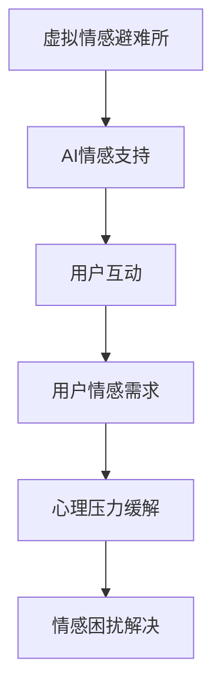
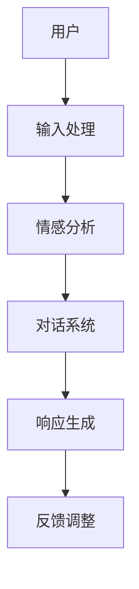

                 

# 虚拟情感避难所：AI提供情感支持空间

## 关键词
- 虚拟情感避难所
- AI情感支持
- 情感分析
- 自然语言处理
- 对话系统

## 摘要
本文将探讨虚拟情感避难所这一概念，阐述其作为AI提供情感支持空间的本质和作用。通过分析AI情感支持技术原理，本文将揭示虚拟情感避难所的核心组件和运行机制。同时，本文还将探讨虚拟情感避难所在不同应用场景中的实际效果，并分析其开发与部署流程。最后，本文将展望虚拟情感避难所的未来发展趋势和面临的挑战。

### 第一部分：核心概念与联系

#### 核心概念
1. **虚拟情感避难所**：一个由AI提供情感支持的空间，旨在帮助用户缓解心理压力和解决情感困扰。
2. **AI情感支持**：通过自然语言处理、情感分析等技术，AI系统能够识别、理解和回应用户情感。
3. **用户互动**：用户通过文本或语音与AI系统进行交流，表达情感需求和感受。

#### 概念关系架构

### 第二部分：AI情感支持技术原理

#### 核心算法原理
1. **自然语言处理（NLP）**：实现文本预处理、情感分析、意图识别等功能。
2. **情感分析**：识别文本中的情感倾向（正面、负面、中性）。
3. **对话系统**：基于上下文进行对话管理，实现自然、流畅的交流。

#### 技术架构

### 第三部分：虚拟情感避难所的应用场景

#### 应用场景
1. **心理健康咨询**：为用户提供心理健康咨询，包括压力管理、情绪调节等。
2. **情感陪伴**：为孤独症儿童、老年人等提供情感陪伴，提升生活质量。
3. **危机干预**：在紧急情况下为用户提供心理援助，如自然灾害、突发事件等。

#### 案例研究
- **场景一：心理健康咨询**
  - 用户描述心理困扰 → AI识别情感并提供建议 → 用户反馈 → AI优化建议
- **场景二：情感陪伴**
  - 用户与AI进行日常交流 → AI理解并回应用户情感 → 用户感受到陪伴与关爱
- **场景三：危机干预**
  - 用户表达危机情境 → AI迅速识别并介入 → 提供紧急心理支持与资源链接

### 第四部分：虚拟情感避难所的开发与部署

#### 开发流程
1. **需求分析**：明确应用场景和用户需求。
2. **技术选型**：选择适合的自然语言处理、对话系统等技术。
3. **系统设计**：设计系统的架构和模块。
4. **实现与测试**：编写代码、进行测试和优化。

#### 部署与维护
1. **部署**：将系统部署到服务器，确保其稳定运行。
2. **监控与优化**：监控系统性能，进行故障排查和优化。
3. **用户反馈**：收集用户反馈，持续改进系统功能。

### 第五部分：未来展望与挑战

#### 未来展望
1. **技术进步**：随着AI技术的不断发展，虚拟情感避难所将提供更智能化、个性化的服务。
2. **多模态交互**：结合语音、图像等多模态信息，提升用户体验。
3. **生态构建**：建立完善的虚拟情感避难所生态系统，包括相关软硬件、服务提供商等。

#### 挑战
1. **隐私保护**：确保用户数据安全和隐私。
2. **伦理问题**：避免AI情感支持中出现歧视、偏见等问题。
3. **可持续发展**：在保证服务质量的同时，降低运营成本。

### 附录

#### 附录A：AI情感支持技术资源

##### 常用库与框架
- **NLTK**：自然语言处理工具包。
- **spaCy**：先进的自然语言处理库。
- **TensorFlow**：用于构建和训练深度学习模型的框架。

##### 情感分析数据集
- **EmoText**：包含情感标签的文本数据集。
- **Sentiment140**：包含微博情感数据的开源数据集。

#### 附录B：开发工具与环境配置

##### 开发工具
- **Python**：主要编程语言。
- **Jupyter Notebook**：用于编写和运行代码。
- **Docker**：用于容器化部署。

##### 环境配置
- **操作系统**：Linux或Mac OS。
- **Python环境**：使用conda创建虚拟环境。
- **依赖管理**：使用pip安装相关库。

---

### 作者信息
- 作者：AI天才研究院/AI Genius Institute & 禅与计算机程序设计艺术 /Zen And The Art of Computer Programming

---

通过以上五个部分的详细分析，本文为读者揭示了虚拟情感避难所的内涵、技术原理、应用场景、开发与部署流程以及未来展望。希望本文能对您在理解AI情感支持技术及其应用方面提供有价值的参考。在未来的发展中，虚拟情感避难所有望成为心理健康服务领域的重要补充，为广大用户提供更加便捷、高效的情感支持。让我们共同努力，推动这一领域的发展，为人类创造更美好的未来。让我们继续探索和发现AI技术的更多可能，为世界带来更多的惊喜和改变。未来已来，让我们一起迎接它！

