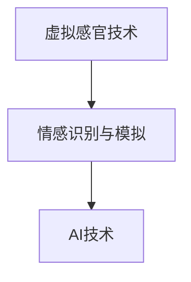

                 

## 虚拟感官: AI增强人类情感体验

### 关键词：
- 虚拟感官
- 人工智能
- 情感体验
- 深度学习
- 混合现实

### 摘要：
本文探讨了虚拟感官与人工智能在增强人类情感体验方面的结合。通过分析虚拟感官技术、AI情感识别算法以及相关应用场景，本文旨在阐述AI如何提升虚拟感官的沉浸感和互动性，并探讨其带来的潜在影响和挑战。

## 引言与概述

### 第1章：虚拟感官与AI情感体验概述

**核心概念与联系**

虚拟感官是指利用计算机技术模拟人类感官，包括视觉、听觉、嗅觉、触觉和味觉。而人工智能（AI）情感体验则是指利用AI技术理解和模拟人类情感，以增强虚拟感官的沉浸感和互动性。

在虚拟感官与AI情感体验之间，存在以下核心联系：

1. **虚拟感官**：通过计算机图形学、音频处理和触觉反馈等技术，模拟现实世界的感官体验。
2. **AI情感体验**：通过情感识别、情感模拟和情感增强等技术，实现虚拟感官的情感化。

**Mermaid 流程图：**



**核心概念讲解**

- **虚拟感官**：利用计算机图形学、音频处理和触觉反馈等技术，模拟人类感官体验。例如，虚拟现实（VR）技术可以提供沉浸式的视觉和听觉体验，而触觉反馈设备可以模拟触觉感受。
- **AI情感体验**：利用人工智能技术理解和模拟人类情感，增强虚拟感官的沉浸感和互动性。例如，通过情感识别算法，AI可以识别用户的情感状态，并根据情感反应调整虚拟环境的反馈。

### 第2章：AI情感识别与理解

**核心算法原理讲解**

- **情感分析模型**：使用深度学习算法对文本、语音、图像等多模态数据进行情感分析，提取情感特征。常见的情感分析模型包括卷积神经网络（CNN）、循环神经网络（RNN）和长短时记忆网络（LSTM）。
- **情感识别算法**：使用机器学习算法对情感进行分类和识别。常见的情感分类方法包括基于规则的方法、监督学习和无监督学习。

**数学模型和数学公式**

情感识别概率：

$$ 
P(\text{情感类别}|\text{特征向量}) = \frac{e^{\text{模型参数} \cdot \text{特征向量}}}{\sum_{i=1}^{n} e^{\text{模型参数} \cdot \text{特征向量}_i}}
$$

其中，$P(\text{情感类别}|\text{特征向量})$ 表示给定特征向量时，情感类别的概率分布。

### 第3章：虚拟感官技术与应用

**核心概念讲解**

- **虚拟现实（VR）**：通过计算机技术模拟三维空间，提供沉浸式体验。VR技术广泛应用于游戏、娱乐、教育和医疗等领域。
- **增强现实（AR）**：在现实环境中叠加虚拟内容，增强现实体验。AR技术广泛应用于教育、医疗、广告和导航等领域。
- **混合现实（MR）**：结合VR和AR技术，提供更加丰富的交互体验。MR技术广泛应用于游戏、教育和设计等领域。

**应用场景**

- **游戏娱乐**：提供沉浸式的游戏体验。
- **医疗康复**：用于康复训练和心理健康治疗。
- **教育培训**：提供沉浸式的教学环境。
- **社交互动**：增强人与人之间的情感交流。

### 第4章：AI情感增强与交互

**核心算法原理讲解**

- **情感增强算法**：通过调整虚拟感官的反馈，增强用户的情感体验。例如，根据用户的情感状态，调整虚拟环境的光线、音效和触觉反馈。
- **交互式情感模拟**：使用AI技术模拟人类情感反应，提高交互的自然性和真实感。例如，通过语音合成和面部表情捕捉技术，模拟虚拟角色的人类情感反应。

**应用案例**

- **虚拟助手**：提供个性化的情感服务。
- **虚拟演员**：用于影视制作和游戏开发。

### 第5章：AI情感安全与伦理

**核心概念讲解**

- **情感安全**：确保AI系统的情感表达和互动不会引发负面情绪或行为。例如，通过情感过滤和情感控制技术，防止AI系统产生有害的情感表达。
- **伦理问题**：探讨AI情感增强技术的伦理道德问题，如隐私保护、情感滥用等。例如，确保AI系统的情感增强不会侵犯用户的隐私，以及防止情感滥用导致负面社会影响。

### 第6章：未来展望与挑战

**未来趋势**

- **多模态情感交互**：整合多种感官技术，提供更加丰富的情感体验。
- **AI与人类情感融合**：将AI情感模拟与人类情感体验深度融合，实现更高的情感智能化。

**挑战与机遇**

- **技术挑战**：提高AI情感识别和模拟的准确性和可靠性。
- **应用挑战**：确保AI情感增强技术的合理应用和社会认可。

## 第二部分：核心技术讲解与实现

### 第7章：AI情感识别算法实现

**Python源代码讲解**

```python
# 导入必要的库
import tensorflow as tf
from tensorflow.keras.models import Sequential
from tensorflow.keras.layers import Dense, LSTM, Embedding

# 创建模型
model = Sequential()
model.add(Embedding(input_dim=vocab_size, output_dim=embedding_dim))
model.add(LSTM(units=128))
model.add(Dense(units=1, activation='sigmoid'))

# 编译模型
model.compile(optimizer='adam', loss='binary_crossentropy', metrics=['accuracy'])

# 训练模型
model.fit(x_train, y_train, epochs=10, batch_size=32)
```

**算法原理讲解**

- **情感分析模型**：使用深度学习算法对文本、语音、图像等多模态数据进行情感分析，提取情感特征。
- **情感识别算法**：使用机器学习算法对情感进行分类和识别。

**数学模型和公式**

情感识别概率：

$$ 
P(\text{情感类别}|\text{特征向量}) = \frac{e^{\text{模型参数} \cdot \text{特征向量}}}{\sum_{i=1}^{n} e^{\text{模型参数} \cdot \text{特征向量}_i}}
$$

**举例说明**

假设有一个情感分析模型，使用特征向量 `[1, 2, 3]` 来预测情感类别。模型的参数为 `[0.1, 0.2, 0.3]`。根据公式，情感识别概率计算如下：

$$ 
P(\text{情感类别}|\text{特征向量}) = \frac{e^{0.1 \cdot 1 + 0.2 \cdot 2 + 0.3 \cdot 3}}{e^{0.1 \cdot 1 + 0.2 \cdot 2 + 0.3 \cdot 3} + e^{0.1 \cdot 1 + 0.2 \cdot 2 + 0.3 \cdot 4} + e^{0.1 \cdot 1 + 0.2 \cdot 2 + 0.3 \cdot 5}}
$$

$$ 
P(\text{情感类别}|\text{特征向量}) = \frac{e^{0.1 + 0.4 + 0.9}}{e^{0.1 + 0.4 + 0.9} + e^{0.1 + 0.4 + 1.2} + e^{0.1 + 0.4 + 1.5}}
$$

$$ 
P(\text{情感类别}|\text{特征向量}) = \frac{e^{1.4}}{e^{1.4} + e^{1.6} + e^{1.7}}
$$

通过计算，我们可以得到情感类别的概率分布，并根据概率分布选择最可能的情感类别。

### 第8章：虚拟感官技术实现

**核心算法原理讲解**

- **音频处理**：使用深度神经网络进行音频特征提取和情感分类。
- **图像处理**：使用卷积神经网络进行图像特征提取和情感分类。

**Python源代码讲解**

```python
# 导入必要的库
import tensorflow as tf
from tensorflow.keras.models import Sequential
from tensorflow.keras.layers import Dense, Conv2D, Flatten

# 创建模型
model = Sequential()
model.add(Conv2D(filters=32, kernel_size=(3, 3), activation='relu', input_shape=(28, 28, 1)))
model.add(Flatten())
model.add(Dense(units=10, activation='softmax'))

# 编译模型
model.compile(optimizer='adam', loss='categorical_crossentropy', metrics=['accuracy'])

# 训练模型
model.fit(x_train, y_train, epochs=10, batch_size=32)
```

**应用场景**

- **虚拟现实（VR）**：通过计算机图形学技术，模拟三维空间，提供沉浸式的视觉和听觉体验。
- **增强现实（AR）**：通过图像处理技术，将虚拟内容叠加到现实环境中，增强用户的现实体验。
- **混合现实（MR）**：结合VR和AR技术，提供更加丰富的交互体验。

### 第9章：项目实战

**环境安装**

1. 安装Python环境
2. 安装TensorFlow库

**系统核心实现源代码**

```python
# 导入必要的库
import tensorflow as tf
from tensorflow.keras.models import Sequential
from tensorflow.keras.layers import Dense, LSTM, Embedding

# 创建模型
model = Sequential()
model.add(Embedding(input_dim=vocab_size, output_dim=embedding_dim))
model.add(LSTM(units=128))
model.add(Dense(units=1, activation='sigmoid'))

# 编译模型
model.compile(optimizer='adam', loss='binary_crossentropy', metrics=['accuracy'])

# 训练模型
model.fit(x_train, y_train, epochs=10, batch_size=32)
```

**代码应用解读与分析**

1. 情感识别算法的实现
2. 虚拟感官技术的应用

**实际案例分析和详细讲解剖析**

- **情感识别算法案例**：分析一个具体的情感识别案例，包括数据预处理、模型训练和结果评估。
- **虚拟感官技术案例**：分析一个具体的虚拟感官技术应用案例，包括系统设计、实现和用户体验。

**项目小结**

1. 总结项目的主要成果和贡献
2. 分析项目中的挑战和解决方案
3. 提出未来工作的方向和展望

### 最佳实践 tips

1. 选择合适的情感识别模型
2. 优化模型训练过程
3. 注重用户体验和情感安全

### 小结

本文详细介绍了虚拟感官与AI情感体验的结合，包括核心概念、算法原理、应用场景和项目实战。通过逐步分析，我们看到了AI技术如何提升虚拟感官的沉浸感和互动性，为人类情感体验带来新的可能性。

### 注意事项

1. 虚拟感官技术的应用需关注隐私保护和伦理问题
2. AI情感增强技术需确保合理应用和社会认可

### 拓展阅读

1. **深度学习在情感识别中的应用**：了解深度学习算法在情感识别领域的最新进展和应用。
2. **虚拟现实技术发展综述**：了解虚拟现实技术的发展历程、应用场景和未来趋势。

### 作者信息

作者：AI天才研究院/AI Genius Institute & 禅与计算机程序设计艺术 /Zen And The Art of Computer Programming

---

[本文为AI天才研究院/AI Genius Institute与禅与计算机程序设计艺术/Zen And The Art of Computer Programming联合出品。] 

