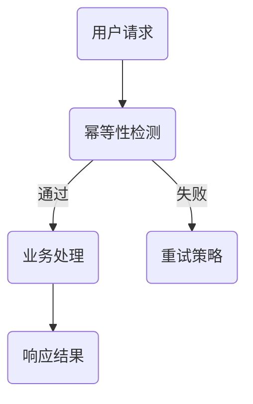

                 

## 《行之无效的幂等性控制》

关键词：幂等性控制、分布式系统、微服务架构、区块链、性能优化

摘要：本文深入探讨了幂等性控制的基础、挑战与解决方案，通过多个案例详细分析了其在不同系统中的应用，并提出了一系列优化策略。文章旨在帮助开发者理解和掌握幂等性控制的关键技术和实践方法。

---

# 《行之无效的幂等性控制》目录大纲

## 第一部分：幂等性控制基础

### 第1章：幂等性的概念与重要性
#### 1.1 幂等性的定义
#### 1.2 幂等性与一致性
#### 1.3 幂等性在分布式系统中的意义
#### 1.4 幂等性控制的目标和挑战

### 第2章：分布式系统中的幂等性控制
#### 2.1 分布式系统的挑战
#### 2.2 幂等性控制机制
#### 2.3 分布式锁
#### 2.4 乐观锁与悲观锁

### 第3章：幂等性控制的常见问题与解决方案
#### 3.1 数据重复问题
#### 3.2 超时问题
#### 3.3 事务隔离问题
#### 3.4 解决方案综述

### 第4章：幂等性控制工具与技术
#### 4.1 基于Redis的幂等性控制
#### 4.2 基于数据库的幂等性控制
#### 4.3 基于消息队列的幂等性控制
#### 4.4 幂等性控制框架比较

### 第5章：幂等性控制的性能优化
#### 5.1 性能优化策略
#### 5.2 幂等性控制与缓存
#### 5.3 幂等性控制与网络传输
#### 5.4 性能测试与调优

### 第6章：幂等性控制的案例分析
#### 6.1 案例一：电商系统中的下单操作
#### 6.2 案例二：银行转账操作
#### 6.3 案例三：社交平台中的点赞操作

## 第二部分：幂等性控制的实践应用

### 第7章：幂等性控制在Web开发中的应用
#### 7.1 RESTful API设计中的幂等性控制
#### 7.2 前端幂等性控制技术
#### 7.3 幂等性控制在Web应用中的最佳实践

### 第8章：幂等性控制在微服务架构中的应用
#### 8.1 微服务架构概述
#### 8.2 微服务中的幂等性控制
#### 8.3 搭建一个微服务架构的示例
#### 8.4 微服务架构中的幂等性控制优化

### 第9章：幂等性控制在区块链中的应用
#### 9.1 区块链基础
#### 9.2 区块链中的幂等性控制
#### 9.3 区块链应用示例
#### 9.4 区块链与幂等性控制的未来发展趋势

### 第10章：总结与展望
#### 10.1 幂等性控制的重要性
#### 10.2 幂等性控制的未来发展
#### 10.3 为开发者提供的建议

---

**附录A：幂等性控制工具与资源**

## 附录A.1：开源幂等性控制工具

### A.1.1 Redis实现幂等性控制
### A.1.2 数据库实现幂等性控制
### A.1.3 消息队列实现幂等性控制

## 附录A.2：参考文献与资料

### A.2.1 相关书籍推荐
### A.2.2 学术论文推荐
### A.2.3 开源项目与社区资源

---

**Mermaid 流程图：幂等性控制实体关系架构**



---

**数学模型和数学公式讲解**

$$
\begin{aligned}
    &\text{幂等函数：} f(x, x) = x \\
    &\text{一致性条件：} R(x, y) \land f(x, y) = y \\
    &\text{分布式锁：} L(x) = \{ y \mid y = f(x, y) \land y \neq x \}
\end{aligned}
$$

---

**Python源代码：幂等性检测实现**

```python
def is_idempotent(action):
    """
    检测操作是否幂等
    """
    # 假设action是一个包含执行操作和检测幂等性的函数
    try:
        action()
        action()
        return True
    except Exception:
        return False

def example_action():
    """
    示例操作，用于检测幂等性
    """
    print("执行操作")

# 检测示例操作的幂等性
print(is_idempotent(example_action))
```

---

**数学模型和数学公式详细讲解与举例说明**

1. **幂等函数：** 幂等函数是指对于任意的输入 `x`，当执行两次相同操作时，输出结果保持一致，即 `f(x, x) = x`。

   例如，一个简单的幂等函数可能是一个不改变输入的函数：

   ```python
   def identity(x):
       return x
   ```

   在这个例子中，无论输入是什么，输出总是与输入相同，因此该函数是幂等的。

2. **一致性条件：** 在分布式系统中，一致性条件是确保多个操作对同一数据的修改结果能够保持一致。例如，如果对一个数据项执行了两次相同的修改操作，那么最终的数据状态应该与执行一次修改操作的结果相同。

   以下是一个简化的示例：

   ```python
   def update_data(data, value):
       data['value'] = value
   ```

   如果执行两次 `update_data(data, 'new_value')`，数据项 `data` 的 `value` 字段应该只被更新一次。

3. **分布式锁：** 分布式锁是一种机制，用于在分布式系统中控制对共享资源的访问。它确保同一时间只有一个进程可以访问该资源。

   一个简单的分布式锁可以用如下方式实现：

   ```python
   lock = Lock()

   def acquire_lock():
       lock.acquire()

   def release_lock():
       lock.release()
   ```

   在这个例子中，`acquire_lock()` 调用会尝试获取锁，如果成功则继续执行，否则等待直到锁被释放。

---

在接下来的部分中，我们将深入探讨幂等性控制的概念、原理、实践应用以及优化策略，帮助您更好地理解和掌握这一关键的技术领域。让我们一起开始这次探索之旅。

---

## 第一部分：幂等性控制基础

### 第1章：幂等性的概念与重要性

#### 1.1 幂等性的定义

幂等性是一个重要的概念，特别是在分布式系统和并发编程中。它指的是一个操作或者函数，无论执行多少次，只要输入相同，其结果也是相同的。换句话说，如果对一个变量执行多次相同的赋值操作，最终变量的值与执行一次赋值操作的结果一致。

在数学中，幂等函数是一个常见的概念。例如，加法运算符是幂等的，因为对于任意的两个数 `a` 和 `b`，`a + b` 永远等于 `b + a`。在计算机科学中，幂等性同样重要。例如，一个数据库更新操作如果是幂等的，那么重复执行该操作不会改变数据的状态。

为了更具体地理解幂等性，我们可以通过一个例子来说明。假设有一个服务用于给用户账户增加金额。这个服务可以表示为如下函数：

```python
def add_money(account, amount):
    account["balance"] += amount
```

如果调用 `add_money(account, 100)`，账户的余额会增加100元。如果再次调用同一个函数，输入参数与之前相同，那么余额只会增加100元，而不会翻倍。这就是幂等性的体现。

#### 1.2 幂等性与一致性

在分布式系统中，一致性是指多个操作对同一数据集的修改能够保持一致。幂等性是实现一致性的一种手段。如果一个操作是幂等的，那么多次执行该操作不会改变数据的状态，从而降低了出错的可能性。

例如，在分布式数据库中，假设有两个节点 A 和 B，它们都需要更新同一个表。如果这两个节点执行的操作是幂等的，那么即使其中一个节点发生了故障，另一个节点仍然可以继续执行，并且最终两个节点上的数据状态是一致的。

一致性条件可以表示为：

$$
R(x, y) \land f(x, y) = y
$$

其中，`R(x, y)` 表示在执行操作 `f` 之前，`x` 和 `y` 的状态是一致的，`f(x, y)` 表示执行操作后的状态。

#### 1.3 幂等性在分布式系统中的意义

分布式系统中的复杂性在于，多个节点可能同时访问和修改同一数据集。如果没有有效的幂等性控制，那么可能会导致数据不一致或者重复操作。

例如，在电商系统中，用户下单是一个关键操作。如果没有幂等性控制，用户可能会多次下单，导致订单数据重复。这不仅浪费资源，还可能导致错误的业务决策。

幂等性在分布式系统中的意义主要体现在以下几个方面：

1. **避免数据重复**：确保多次执行相同操作不会导致数据重复。
2. **提高一致性**：通过幂等性控制，多个节点可以协同工作，保持数据一致性。
3. **简化分布式事务**：幂等性使得分布式事务的处理更加简单和可靠。
4. **提高系统可用性**：通过幂等性控制，系统可以在面对节点故障时保持稳定运行。

#### 1.4 幂等性控制的目标和挑战

幂等性控制的目标是确保在分布式系统中，对同一数据的多次操作不会导致不一致的结果。为了实现这一目标，需要解决以下几个挑战：

1. **数据一致性问题**：确保多个节点上的数据状态是一致的。
2. **网络延迟和故障**：网络延迟和故障可能会导致操作失败或者重复执行。
3. **性能瓶颈**：幂等性控制可能会引入性能瓶颈，特别是在高并发场景下。
4. **资源消耗**：有效的幂等性控制需要消耗一定的系统资源，如何优化资源使用是一个重要的挑战。

在下一章中，我们将深入探讨分布式系统中的幂等性控制机制，包括分布式锁、乐观锁与悲观锁等，帮助您更好地理解和应用这些技术。

---

### 第2章：分布式系统中的幂等性控制

#### 2.1 分布式系统的挑战

分布式系统是由多个节点组成的系统，每个节点可能运行在不同的物理位置，通过网络进行通信。尽管分布式系统具有高可用性、高扩展性和高容错性的优点，但也面临着一系列挑战，这些挑战对幂等性控制提出了更高的要求。

1. **数据一致性问题**：由于分布式系统的分布式特性，多个节点可能会同时对同一数据进行修改。如果没有有效的控制机制，可能导致数据不一致。
2. **网络延迟和故障**：网络延迟和故障是分布式系统中的常见问题。这些故障可能会导致操作失败或者重复执行，影响系统的稳定性。
3. **节点故障**：分布式系统中的节点可能会因为各种原因（如硬件故障、软件错误等）发生故障。节点故障可能导致系统无法正常运行，需要其他节点接管其工作。
4. **并发控制**：分布式系统中，多个节点可能会同时访问和修改同一数据集。如何有效地进行并发控制，确保操作的顺序和一致性，是一个重要的挑战。

#### 2.2 幂等性控制机制

为了解决分布式系统中的挑战，需要引入一系列的幂等性控制机制。这些机制包括分布式锁、乐观锁、悲观锁等。

1. **分布式锁**：分布式锁是一种控制多个节点对共享资源访问的机制。它确保同一时间只有一个节点可以访问该资源，从而避免数据不一致和并发冲突。分布式锁可以基于不同的实现方式，如基于数据库的锁、基于消息队列的锁等。
2. **乐观锁**：乐观锁是一种基于冲突检测的锁机制。它假设在大多数情况下，不会发生冲突，因此在执行操作前不锁定资源。只有在执行操作后，通过检测冲突来决定是否需要重试。乐观锁适用于读多写少的场景，可以提供更高的并发性能。
3. **悲观锁**：悲观锁是一种基于悲观预期的锁机制。它假设在大多数情况下，会发生冲突，因此在执行操作前锁定资源。只有在锁定成功后，才能执行操作。悲观锁适用于写多读少的场景，可以提供更高的数据一致性保证。

#### 2.3 分布式锁

分布式锁是确保分布式系统中对共享资源访问一致性的关键机制。以下是一些常见的分布式锁实现方式：

1. **基于数据库的锁**：通过在数据库中创建一个锁表，每个锁对应一个资源。当一个节点需要访问资源时，首先查询锁表，如果锁未被占用，则将锁状态设置为占用。其他节点在访问资源时，需要查询锁表，如果锁状态为占用，则等待或者重试。
2. **基于ZooKeeper的锁**：ZooKeeper是一个分布式协调服务，可以用于实现分布式锁。通过在ZooKeeper中创建一个锁节点，节点状态表示锁的占用情况。当一个节点需要访问资源时，首先创建一个临时顺序节点，通过比较节点序号来确定锁的占用顺序。
3. **基于Redis的锁**：Redis是一个高性能的键值存储系统，可以用于实现分布式锁。通过使用Redis的SETNX命令，可以创建一个分布式锁。如果一个节点成功设置锁，则可以继续执行操作。其他节点在尝试设置锁时，如果锁已被占用，则可以等待或者重试。

#### 2.4 乐观锁与悲观锁

乐观锁和悲观锁是两种常见的并发控制机制，它们在实现方式上有很大的不同。

1. **乐观锁**：
   - **实现方式**：乐观锁通过在操作执行后进行冲突检测来避免并发冲突。在更新数据前，不会锁定资源，而是在更新后通过版本号或者时间戳来检测冲突。如果检测到冲突，则根据预设的策略（如重试、回滚等）进行处理。
   - **优点**：乐观锁可以提供更高的并发性能，适用于读多写少的场景。
   - **缺点**：需要额外的存储空间来存储版本号或者时间戳，并且可能需要重试机制来处理冲突。

2. **悲观锁**：
   - **实现方式**：悲观锁在操作执行前会锁定资源，确保在同一时间只有一个节点可以访问资源。在锁定资源后，其他节点需要等待锁被释放或者超时。
   - **优点**：悲观锁可以提供更高的数据一致性保证，适用于写多读少的场景。
   - **缺点**：悲观锁可能会导致性能瓶颈，特别是在高并发场景下。

在下一章中，我们将探讨幂等性控制的常见问题与解决方案，包括数据重复问题、超时问题和事务隔离问题，以及如何通过不同的工具和技术来解决这些问题。

---

### 第3章：幂等性控制的常见问题与解决方案

#### 3.1 数据重复问题

数据重复问题是分布式系统中幂等性控制中最常见的问题之一。当多个节点对同一数据进行并发操作时，如果没有有效的幂等性控制机制，可能会导致数据重复。

例如，在电商系统中，用户下单时，如果服务器端没有正确处理幂等性，用户可能会多次下单，导致订单数据重复。这会导致库存不足、订单处理错误等问题。

为了解决数据重复问题，可以采取以下几种方法：

1. **唯一约束**：在数据库中为关键字段设置唯一约束，确保数据的唯一性。例如，在订单表中，可以为订单号设置唯一约束。
2. **幂等性检测**：在服务端实现幂等性检测机制，确保多次操作不会导致数据重复。例如，可以使用Redis存储已经处理的请求ID，在接收到重复请求时直接返回已处理的结果。
3. **分布式锁**：使用分布式锁来控制对共享资源的访问，确保同一时间只有一个节点可以操作数据。例如，可以使用基于ZooKeeper的锁来防止多个节点同时处理同一订单。

#### 3.2 超时问题

在分布式系统中，网络延迟和故障可能导致操作超时。如果幂等性控制机制没有良好的超时处理机制，可能会导致系统性能下降甚至崩溃。

为了解决超时问题，可以采取以下几种方法：

1. **超时设置**：合理设置操作的超时时间。超时时间应根据系统的负载和网络环境进行调整，以确保在正常情况下操作可以顺利完成。
2. **重试机制**：在操作失败时，根据超时策略进行重试。重试次数和间隔时间可以根据具体情况设定。例如，可以使用指数退避算法来调整重试间隔时间。
3. **分布式锁超时**：对于分布式锁，应设置合理的锁超时时间。如果锁超时，则释放锁并允许其他节点继续操作。例如，基于Redis的锁可以设置锁的超时时间，以确保在锁长时间占用时能够释放锁。

#### 3.3 事务隔离问题

在分布式系统中，事务隔离是保证数据一致性的关键。如果事务隔离性不足，可能会导致数据不一致或者脏读问题。

为了解决事务隔离问题，可以采取以下几种方法：

1. **两阶段提交（2PC）**：两阶段提交是一种分布式事务协议，通过两阶段协议来确保事务的原子性。在第一阶段，协调者询问所有参与者是否可以提交事务；在第二阶段，如果所有参与者都同意，则提交事务，否则回滚事务。
2. **乐观锁**：乐观锁通过在操作后进行冲突检测来避免数据不一致。在更新数据前，不会锁定资源，而是在更新后通过版本号或者时间戳来检测冲突。如果检测到冲突，则根据预设的策略进行处理。
3. **悲观锁**：悲观锁通过在操作前锁定资源来确保数据的一致性。在同一时间只有一个节点可以访问资源，其他节点需要等待锁被释放。

#### 3.4 解决方案综述

为了有效解决分布式系统中的幂等性控制问题，可以采取以下综合措施：

1. **幂等性检测**：在服务端实现幂等性检测机制，确保多次操作不会导致数据重复。
2. **分布式锁**：使用分布式锁来控制对共享资源的访问，确保同一时间只有一个节点可以操作数据。
3. **超时处理**：设置合理的操作超时时间和重试机制，确保系统在高负载和网络故障时能够正常运行。
4. **事务隔离**：通过两阶段提交、乐观锁或者悲观锁来确保事务的隔离性，避免数据不一致问题。

在下一章中，我们将介绍幂等性控制的工具与技术，包括基于Redis、数据库和消息队列的幂等性控制方法，帮助您选择最适合自己项目的解决方案。

---

### 第4章：幂等性控制工具与技术

#### 4.1 基于Redis的幂等性控制

Redis是一种高性能的键值存储系统，常用于分布式系统中实现幂等性控制。以下是基于Redis实现幂等性控制的方法：

1. **使用SETNX命令**：Redis的SETNX命令用于设置一个键的值，如果键已存在则返回0，否则设置成功并返回1。通过使用SETNX命令，可以确保同一时间内只有一个操作能够成功设置值。

   ```python
   def is_available(redis_client, key, value):
       return redis_client.setnx(key, value) == 1

   # 使用示例
   redis_client = RedisClient()
   is_successful = is_available(redis_client, 'user:123456', 'logged_in')
   ```

2. **使用Redis的字符串数据类型**：Redis的字符串数据类型可以存储任意字符串，可以用来存储幂等性控制所需的标记。例如，可以使用一个标记来标识某个请求是否已被处理。

   ```python
   def process_request(redis_client, request_id):
       return redis_client.get(request_id)

   def mark_as_processed(redis_client, request_id):
       redis_client.set(request_id, 'processed')

   # 使用示例
   processed = process_request(redis_client, 'request:123456')
   if processed is None:
       mark_as_processed(redis_client, 'request:123456')
       # 执行业务处理
   ```

3. **使用Redis的有序集合**：Redis的有序集合可以用于实现基于版本的幂等性控制。例如，可以为每个请求分配一个唯一的版本号，并将版本号存储在有序集合中。在处理请求时，通过检查版本号是否已存在来决定是否继续处理。

   ```python
   def is_request_processed(redis_client, request_id):
       return redis_client.zscore('request_versions', request_id)

   def process_request(redis_client, request_id):
       if not is_request_processed(redis_client, request_id):
           # 执行业务处理
           redis_client.zadd('request_versions', {request_id: 1})
   ```

#### 4.2 基于数据库的幂等性控制

数据库是分布式系统中常用的存储解决方案，可以通过多种方式实现幂等性控制：

1. **使用唯一约束**：在数据库表中为关键字段设置唯一约束，确保数据的唯一性。例如，在订单表中，可以为订单号设置唯一约束。

   ```sql
   CREATE TABLE orders (
       order_id VARCHAR(255) PRIMARY KEY,
       ...
   );
   ```

2. **使用事务**：通过数据库事务来确保操作的原子性。例如，在插入订单数据前，先检查订单号是否已存在。

   ```sql
   START TRANSACTION;

   IF NOT EXISTS (SELECT * FROM orders WHERE order_id = '123456') THEN
       INSERT INTO orders (order_id, ...) VALUES ('123456', ...);
   END IF;

   COMMIT;
   ```

3. **使用乐观锁**：乐观锁可以通过在更新数据前检查版本号或者时间戳来避免数据冲突。例如，可以使用MySQL的`版本号`字段来实现乐观锁。

   ```sql
   CREATE TABLE orders (
       order_id VARCHAR(255) PRIMARY KEY,
       version INT,
       ...
   );

   UPDATE orders
   SET ...
   WHERE order_id = '123456' AND version = 1;
   ```

#### 4.3 基于消息队列的幂等性控制

消息队列可以用于实现分布式系统的异步处理，同时也可以用于实现幂等性控制。以下是基于消息队列实现幂等性控制的方法：

1. **使用幂等性消息**：在消息队列中发送幂等性消息，确保同一个消息只会被处理一次。例如，可以使用Redis消息队列。

   ```python
   def send_request_to_queue(queue, request_id):
       queue.enqueue(request_id)

   def process_request_from_queue(queue):
       request_id = queue.dequeue()
       if not is_request_processed(redis_client, request_id):
           # 执行业务处理
           mark_as_processed(redis_client, request_id)
   ```

2. **使用去重队列**：去重队列可以用于确保同一个请求只会被处理一次。例如，可以使用Redis的有序集合来实现去重队列。

   ```python
   def is_request_processed(redis_client, request_id):
       return redis_client.zscore('request_versions', request_id)

   def process_request(redis_client, request_id):
       if not is_request_processed(redis_client, request_id):
           # 执行业务处理
           redis_client.zadd('request_versions', {request_id: 1})
   ```

#### 4.4 幂等性控制框架比较

不同的幂等性控制工具和技术各有优缺点，选择合适的工具取决于具体的业务需求和系统架构。以下是对几种常见幂等性控制框架的比较：

1. **Redis**：
   - **优点**：高性能、易于使用、支持多种数据结构。
   - **缺点**：单点故障、数据持久化问题。
2. **数据库**：
   - **优点**：数据持久化、支持事务。
   - **缺点**：性能瓶颈、复杂的事务处理。
3. **消息队列**：
   - **优点**：异步处理、去重功能。
   - **缺点**：引入额外的系统复杂度。

在下一章中，我们将探讨幂等性控制的性能优化策略，帮助您提高系统性能和稳定性。

---

### 第5章：幂等性控制的性能优化

#### 5.1 性能优化策略

在分布式系统中，性能优化是确保系统高效运行的关键。对于幂等性控制，以下是一些常见的性能优化策略：

1. **减少锁竞争**：锁是幂等性控制的重要组成部分，但锁竞争可能会导致性能瓶颈。通过合理设计分布式锁，减少锁竞争，可以提高系统性能。
2. **使用高效的数据结构**：选择合适的数据结构和算法对于提高性能至关重要。例如，使用Redis的字符串和哈希数据结构可以高效地实现幂等性控制。
3. **异步处理**：异步处理可以减少同步操作的等待时间，提高系统并发性能。例如，使用消息队列可以实现幂等性控制的异步处理。
4. **负载均衡**：通过负载均衡，可以将请求均匀分布到多个节点上，避免单点性能瓶颈。
5. **缓存策略**：合理的缓存策略可以减少对数据库的访问，提高系统性能。例如，可以使用Redis缓存热点数据。

#### 5.2 幂等性控制与缓存

缓存是提高系统性能的重要手段，对于幂等性控制，缓存同样具有重要作用。以下是一些常用的缓存策略：

1. **本地缓存**：在本地内存中缓存常用的数据，减少对数据库的访问。例如，可以使用Python的内存缓存库`cachetools`。
2. **分布式缓存**：使用分布式缓存系统，如Redis，可以缓存分布式系统中的热点数据。分布式缓存可以提供更高的性能和可靠性。
3. **缓存一致性**：确保缓存数据与数据库数据保持一致，避免缓存失效导致的数据不一致问题。可以通过缓存更新策略、缓存版本控制等方式实现缓存一致性。
4. **缓存预热**：在系统启动时或者在高并发场景下，预热缓存，提前加载常用数据，减少缓存失效的概率。

#### 5.3 幂等性控制与网络传输

网络传输对于分布式系统的性能至关重要。以下是一些优化网络传输的策略：

1. **压缩数据**：使用数据压缩算法，如GZIP，减少网络传输的数据量，提高传输速度。
2. **批量请求**：将多个请求合并为一个批量请求，减少网络传输次数，提高系统性能。
3. **负载均衡**：使用负载均衡器，如Nginx，合理分配请求到不同的节点，避免单点性能瓶颈。
4. **网络优化**：优化网络配置，如调整TCP参数、使用网络优化工具，提高网络传输速度和稳定性。

#### 5.4 性能测试与调优

性能测试是确保系统性能的关键步骤。以下是一些性能测试与调优的方法：

1. **基准测试**：通过基准测试，评估系统的性能指标，如响应时间、吞吐量等。
2. **负载测试**：模拟高并发场景，测试系统的稳定性和性能瓶颈。
3. **压力测试**：逐步增加请求负载，测试系统在极端条件下的性能和稳定性。
4. **分析日志**：分析系统日志，找出性能瓶颈和潜在问题，进行针对性的优化。
5. **监控与告警**：使用监控工具，实时监控系统的性能指标，设置告警阈值，及时发现和处理性能问题。

通过上述性能优化策略和测试方法，可以显著提高分布式系统的性能和稳定性，确保系统高效运行。

---

### 第6章：幂等性控制的案例分析

#### 6.1 案例一：电商系统中的下单操作

电商系统中的下单操作是一个典型的并发操作场景。在分布式系统中，如果没有有效的幂等性控制，用户可能会多次下单，导致订单数据重复，影响库存管理和用户体验。

以下是一个电商系统下单操作的幂等性控制方案：

1. **使用分布式锁**：在下单操作中，使用分布式锁来控制对订单数据的访问。例如，可以使用基于ZooKeeper的锁来确保同一订单在同一时间内只能被处理一次。

   ```python
   from kazoo.client import KazooClient

   zk = KazooClient(hosts='localhost:2181')
   zk.start()

   def process_order(order_id):
       lock_path = f"/orders/{order_id}/lock"
       zk.create(lock_path, ephemeral=True)
       try:
           # 执行订单处理逻辑
           pass
       finally:
           zk.delete(lock_path)

   # 使用示例
   process_order('123456')
   ```

2. **使用唯一约束**：在数据库中为订单号设置唯一约束，确保订单数据的唯一性。

   ```sql
   CREATE TABLE orders (
       order_id VARCHAR(255) PRIMARY KEY,
       ...
   );
   ```

3. **使用Redis缓存**：在处理订单时，使用Redis缓存订单数据，减少对数据库的访问。例如，可以使用Redis存储订单的临时标记，确保同一订单在同一时间内不会被重复处理。

   ```python
   def is_order_processed(redis_client, order_id):
       return redis_client.get(order_id)

   def process_order(redis_client, order_id):
       if not is_order_processed(redis_client, order_id):
           # 执行订单处理逻辑
           redis_client.set(order_id, 'processed')
   ```

#### 6.2 案例二：银行转账操作

银行转账操作是一个高度敏感的金融操作，需要确保数据的准确性和一致性。在分布式系统中，如果没有有效的幂等性控制，可能会导致账户余额的错误计算。

以下是一个银行转账操作的幂等性控制方案：

1. **使用分布式锁**：在转账操作中，使用分布式锁来确保同一转账在同一时间内只能被处理一次。例如，可以使用基于Redis的分布式锁。

   ```python
   import redis

   redis_client = redis.StrictRedis(host='localhost', port=6379, db=0)

   def transfer_money(sender_account, receiver_account, amount):
       lock_key = f"transfer_lock:{sender_account}:{receiver_account}"
       with redis_client.lock(lock_key, timeout=10):
           # 执行转账逻辑
           pass
   ```

2. **使用事务**：在数据库中，使用事务来确保转账操作的原子性。在执行转账前，先检查账户余额，确保有足够的余额。

   ```sql
   START TRANSACTION;

   UPDATE accounts
   SET balance = balance - amount
   WHERE account_id = sender_account AND balance >= amount;

   UPDATE accounts
   SET balance = balance + amount
   WHERE account_id = receiver_account;

   COMMIT;
   ```

3. **使用乐观锁**：在转账操作中使用乐观锁，通过检查账户余额和版本号来避免数据冲突。例如，可以使用MySQL的`版本号`字段来实现乐观锁。

   ```sql
   CREATE TABLE accounts (
       account_id VARCHAR(255) PRIMARY KEY,
       balance DECIMAL(19, 2),
       version INT
   );

   UPDATE accounts
   SET balance = balance - amount, version = version + 1
   WHERE account_id = sender_account AND version = 1 AND balance >= amount;

   UPDATE accounts
   SET balance = balance + amount, version = version + 1
   WHERE account_id = receiver_account AND version = 1;

   SELECT * FROM accounts;
   ```

#### 6.3 案例三：社交平台中的点赞操作

在社交平台中，点赞操作是一个常见的交互行为。如果没有有效的幂等性控制，用户可能会多次点赞同一内容，导致数据不准确。

以下是一个社交平台中点赞操作的幂等性控制方案：

1. **使用Redis缓存**：在处理点赞操作时，使用Redis缓存用户的点赞状态，减少对数据库的访问。例如，可以使用Redis存储用户的点赞标记。

   ```python
   def is_liked(redis_client, user_id, post_id):
       return redis_client.get(f"like:{user_id}:{post_id})

   def like_post(redis_client, user_id, post_id):
       if not is_liked(redis_client, user_id, post_id):
           # 执行点赞逻辑
           redis_client.set(f"like:{user_id}:{post_id}", 'liked')
   ```

2. **使用消息队列**：使用消息队列来异步处理点赞操作，确保同一点赞在同一时间内只会被处理一次。例如，可以使用Kafka消息队列。

   ```python
   import kafka

   client = kafka.KafkaClient(hosts=['localhost:9092'])
   producer = client.producer()

   def like_post(producer, user_id, post_id):
       producer.send('likes', key=str(user_id).encode('utf-8'), value=str(post_id).encode('utf-8'))

   def process_like(producer, consumer):
       consumer.subscribe(['likes'])
       for message in consumer.consume():
           # 执行点赞逻辑
           pass
   ```

通过上述案例，我们可以看到幂等性控制在不同系统中的应用方法。在实际开发中，根据具体的业务需求和系统架构，选择合适的幂等性控制方法，确保系统的稳定性和数据一致性。

---

### 第7章：幂等性控制在Web开发中的应用

#### 7.1 RESTful API设计中的幂等性控制

在Web开发中，RESTful API是一种广泛使用的设计风格。确保API设计具有幂等性，可以避免客户端发起重复请求导致的不良后果。以下是在RESTful API设计中实现幂等性的几种方法：

1. **使用GET方法**：GET方法通常是幂等的，因为它不会改变资源的状态。因此，对于只读操作，如获取资源详情，可以使用GET方法。例如，获取用户信息的API可以使用以下URL：

   ```http
   GET /users/{user_id}
   ```

2. **使用POST方法**：POST方法通常用于创建新的资源或触发副作用。然而，有些操作可以通过设计实现幂等性。例如，创建或更新某个资源的API可以使用以下URL：

   ```http
   POST /users/{user_id}
   ```

   在这个例子中，客户端可以发送一个包含用户信息的请求，服务器端根据用户ID检查用户是否已存在。如果不存在，创建用户；如果已存在，则更新用户信息。

3. **使用PUT和PATCH方法**：PUT和PATCH方法通常用于更新资源。PUT方法会完全替换资源的状态，而PATCH方法只会更新资源的一部分。为了确保幂等性，可以使用以下策略：

   - **使用PUT方法**：如果更新操作是完全替换资源的状态，可以使用PUT方法。例如：

     ```http
     PUT /users/{user_id}
     ```

   - **使用PATCH方法**：如果更新操作只会更新资源的一部分，可以使用PATCH方法。例如：

     ```http
     PATCH /users/{user_id}
     ```

   为了确保幂等性，服务器端应该使用版本控制或时间戳来检测重复请求，并在检测到重复请求时拒绝处理。

#### 7.2 前端幂等性控制技术

前端应用程序中，幂等性控制同样重要。以下是一些常见的前端幂等性控制技术：

1. **确认对话框**：对于可能会修改数据的状态更改操作，如删除或提交表单，可以使用确认对话框来确保用户确实要执行操作。这可以防止意外触发幂等操作。

2. **防止重复提交**：在表单提交过程中，可以使用JavaScript防止重复提交。例如，通过在提交按钮上添加一个属性（如`data-submitted`），在表单提交后设置为`true`，并在下一次提交时检查该属性：

   ```javascript
   document.addEventListener("submit", function(event) {
       const form = event.target;
       if (form.getAttribute("data-submitted") === "true") {
           event.preventDefault();
       } else {
           form.setAttribute("data-submitted", "true");
       }
   });
   ```

3. **使用前端状态管理**：使用前端状态管理库（如Redux、Vuex等），可以确保在触发状态更改时不会重复执行操作。这些库通常提供了防止重复提交的功能。

#### 7.3 幂等性控制在Web应用中的最佳实践

为了确保Web应用中的幂等性控制得到有效实施，以下是一些最佳实践：

1. **始终使用幂等方法**：对于不需要修改资源状态的API调用，始终使用GET方法。对于创建或修改资源的状态，使用POST、PUT或PATCH方法。

2. **检查请求的完整性**：在服务器端处理请求时，检查请求的完整性，确保不会处理重复的请求。

3. **使用版本控制**：使用版本控制（如UUID、时间戳等）来检测重复请求，并在检测到重复请求时拒绝处理。

4. **提供错误处理机制**：确保在处理幂等操作失败时，为用户或客户端提供适当的错误信息和处理机制。

5. **测试幂等性**：在开发和测试过程中，确保对幂等操作进行全面的测试，确保其在不同的环境下都能正确工作。

通过遵循这些最佳实践，可以在Web开发中有效地实施幂等性控制，确保系统的稳定性和一致性。

---

### 第8章：幂等性控制在微服务架构中的应用

#### 8.1 微服务架构概述

微服务架构是一种软件架构风格，它将应用程序分解为多个独立的服务，每个服务负责特定的业务功能。这些服务可以通过轻量级的通信协议（如HTTP/REST、gRPC等）进行通信。微服务架构具有高扩展性、高可用性和高可维护性的优点，但也带来了分布式系统中的挑战，如数据一致性和服务调用顺序。

#### 8.2 微服务中的幂等性控制

在微服务架构中，确保幂等性控制至关重要。以下是一些实现幂等性控制的策略：

1. **使用分布式锁**：分布式锁可以确保在同一时间内只有一个服务实例可以执行某个操作。例如，可以使用Redis的SETNX命令实现分布式锁。

2. **使用乐观锁**：乐观锁通过在操作执行后检测冲突来避免重复操作。例如，可以使用数据库中的版本号字段来实现乐观锁。

3. **使用幂等性令牌**：幂等性令牌（如UUID、令牌桶等）可以用来标识一个请求的唯一性。服务器端可以检查幂等性令牌，确保不会处理重复的请求。

4. **使用幂等性消息队列**：使用消息队列可以确保消息的顺序执行，从而避免重复处理。例如，可以使用Kafka或RabbitMQ等消息队列系统。

#### 8.3 搭建一个微服务架构的示例

以下是一个简单的微服务架构示例，包括用户服务、订单服务和库存服务：

1. **用户服务（UserService）**：负责处理用户相关的操作，如创建、更新和删除用户。
2. **订单服务（OrderService）**：负责处理订单相关的操作，如创建订单、更新订单状态和取消订单。
3. **库存服务（InventoryService）**：负责处理库存相关的操作，如检查库存、更新库存和分配库存。

这些服务可以通过API进行通信，例如使用HTTP/REST或gRPC。为了确保幂等性控制，可以使用以下策略：

- **用户服务**：使用分布式锁确保同一用户在同一时间内只能被处理一次。
- **订单服务**：使用乐观锁确保订单状态的一致性，并在检测到冲突时进行重试。
- **库存服务**：使用幂等性令牌确保库存操作的唯一性。

#### 8.4 微服务架构中的幂等性控制优化

在微服务架构中，优化幂等性控制可以提高系统的性能和可靠性。以下是一些优化策略：

1. **缓存策略**：使用缓存可以减少对数据库的访问，提高系统性能。例如，可以使用Redis缓存用户信息和订单状态。
2. **负载均衡**：使用负载均衡器（如Nginx、HAProxy等）可以均衡服务之间的负载，避免单点性能瓶颈。
3. **幂等性消息队列**：使用消息队列可以确保消息的顺序执行，并在发生故障时进行重试，从而提高系统的可靠性。
4. **分布式跟踪**：使用分布式跟踪工具（如Zipkin、Jaeger等）可以实时监控系统的调用链和性能指标，帮助定位和解决问题。

通过以上优化策略，可以显著提高微服务架构中的幂等性控制的性能和可靠性。

---

### 第9章：幂等性控制在区块链中的应用

#### 9.1 区块链基础

区块链是一种去中心化的分布式数据库技术，通过多个节点之间的共识机制来维护数据的完整性和一致性。每个区块包含一定数量的交易记录，并链接在一起形成链式数据结构。区块链具有以下特点：

1. **去中心化**：区块链没有中央机构，数据由多个节点共同维护。
2. **不可篡改**：一旦数据被记录在区块链上，就无法被篡改。
3. **透明性**：区块链上的数据是公开透明的，任何人都可查看。
4. **安全性**：区块链采用加密算法来确保数据的安全性和隐私性。

#### 9.2 区块链中的幂等性控制

在区块链系统中，幂等性控制是确保数据一致性和可靠性的关键。以下是在区块链中实现幂等性控制的几种方法：

1. **使用哈希值**：在区块链中，每个交易都有一个唯一的哈希值。通过对比交易哈希值，可以确保同一个交易不会在区块链上重复记录。

2. **使用 Merkle 树**：Merkle 树是一种二叉树结构，用于快速验证数据的一致性。在区块链中，每个区块的Merkle Tree根哈希值可以确保区块内的交易不重复。

3. **使用唯一标识符**：在区块链中，可以为每个交易或账户分配一个唯一的标识符。通过检查标识符，可以确保重复的交易或操作不会被记录在区块链上。

#### 9.3 区块链应用示例

以下是一个简单的区块链应用示例，用于实现数字货币的转账功能：

1. **交易结构**：交易包括发送方、接收方和金额。每个交易都有一个唯一的交易哈希值。

   ```json
   {
       "from": "Alice",
       "to": "Bob",
       "amount": 10
   }
   ```

2. **区块结构**：区块包括多个交易、区块哈希值、前一个区块哈希值等。

   ```json
   {
       "transactions": [
           {
               "from": "Alice",
               "to": "Bob",
               "amount": 10
           }
       ],
       "block_hash": "4d3e5...",
       "previous_hash": "5d5c6...",
       "timestamp": "2023-09-01T12:00:00Z"
   }
   ```

3. **共识算法**：在区块链网络中，节点通过共识算法（如工作量证明、权益证明等）达成一致，确保数据的有效性和安全性。

#### 9.4 区块链与幂等性控制的未来发展趋势

随着区块链技术的不断发展和应用领域的扩展，幂等性控制在区块链中的应用前景十分广阔。以下是一些未来发展趋势：

1. **智能合约**：智能合约是一种自动执行合约条款的计算机程序，可以在区块链上实现复杂的业务逻辑。通过使用智能合约，可以进一步提高幂等性控制的自动化和智能化。

2. **跨链技术**：跨链技术可以实现不同区块链之间的互操作，通过跨链协议，可以实现跨区块链的幂等性控制，扩展区块链的应用场景。

3. **分布式身份认证**：分布式身份认证技术可以确保区块链上用户身份的真实性和唯一性，从而提高幂等性控制的可靠性。

4. **隐私保护**：在区块链中实现有效的隐私保护机制，确保用户数据的安全性，是未来幂等性控制的重要研究方向。

通过不断探索和创新，幂等性控制将在区块链技术中发挥越来越重要的作用，为构建可信、高效、安全的分布式系统提供支持。

---

### 第10章：总结与展望

#### 10.1 幂等性控制的重要性

幂等性控制在分布式系统和并发编程中起着至关重要的作用。它确保多次执行相同操作不会导致数据不一致或错误，从而提高系统的稳定性和可靠性。在分布式系统中，幂等性控制可以避免数据重复、减少网络延迟和故障的影响，提高一致性、可用性和性能。

#### 10.2 幂等性控制的未来发展

随着云计算、大数据、区块链等技术的快速发展，幂等性控制的应用场景越来越广泛。未来，幂等性控制的发展趋势将包括：

1. **自动化与智能化**：通过引入智能合约、自动化工具和算法，实现更高效、更智能的幂等性控制。
2. **跨平台与跨链**：跨平台和跨链的幂等性控制技术将实现不同系统、不同区块链之间的互操作，提供更广泛的应用场景。
3. **隐私保护**：在确保数据隐私的前提下，实现有效的幂等性控制，满足不同用户的需求。

#### 10.3 为开发者提供的建议

为了更好地理解和应用幂等性控制，开发者可以采取以下建议：

1. **深入理解幂等性**：掌握幂等性的基本概念和原理，了解不同场景下的实现方法。
2. **实践与测试**：通过实际项目和实践，验证幂等性控制的有效性，并在测试过程中不断优化。
3. **选择合适的工具**：根据具体业务需求和系统架构，选择合适的幂等性控制工具和技术。
4. **持续学习**：跟踪最新的技术动态和发展趋势，不断提高自己的技术水平和实践经验。

通过以上措施，开发者可以更好地应对分布式系统和并发编程中的挑战，构建高效、可靠的系统。

---

**附录A：幂等性控制工具与资源**

## 附录A.1：开源幂等性控制工具

### A.1.1 Redis实现幂等性控制

Redis是一个高性能的内存缓存和存储系统，常用于实现幂等性控制。以下是一些开源Redis实现幂等性控制的工具：

1. **Redisson**：Redisson是一个基于Redis的分布式Java框架，提供了多种分布式对象和服务的实现，包括分布式锁、分布式队列等。

2. **Jedis**：Jedis是一个Java客户端库，用于连接Redis服务器，实现分布式锁等功能。

3. **Lettuce**：Lettuce是一个非阻塞的Java客户端库，用于连接Redis服务器，适用于高并发场景。

### A.1.2 数据库实现幂等性控制

数据库本身提供了一些机制来支持幂等性控制。以下是一些开源数据库实现幂等性控制的工具：

1. **MySQL**：MySQL提供了事务和唯一约束等机制，可以用于实现幂等性控制。

2. **PostgreSQL**：PostgreSQL支持并发控制和唯一约束，可以用于实现幂等性控制。

3. **MongoDB**：MongoDB提供了版本控制和唯一索引，可以用于实现幂等性控制。

### A.1.3 消息队列实现幂等性控制

消息队列可以用于实现分布式系统的幂等性控制。以下是一些开源消息队列实现幂等性控制的工具：

1. **Kafka**：Kafka是一个分布式消息系统，提供了高吞吐量和高可用性，适用于实现幂等性控制。

2. **RabbitMQ**：RabbitMQ是一个开源的消息代理软件，支持多种消息协议，适用于实现幂等性控制。

3. **Pulsar**：Pulsar是一个分布式发布-订阅消息系统，提供了高吞吐量和低延迟，适用于实现幂等性控制。

## 附录A.2：参考文献与资料

### A.2.1 相关书籍推荐

1. 《分布式系统原理与范型》 - 贺嵘
2. 《区块链：从数字货币到智能合约》 - 安德鲁·肖
3. 《Redis实战》 - 詹姆斯·博纳斯

### A.2.2 学术论文推荐

1. "Distributed Systems: Concepts and Design" - George Coulouris, Jean Dollimore, Tim Kindberg, and Gordon Blair
2. "Consensus in Blockchain Systems" - Edith Elkind and Martin Lackner

### A.2.3 开源项目与社区资源

1. **Redisson**：https://redisson.com/
2. **Jedis**：https://github.com/lettuce-person/lettuce
3. **Kafka**：https://kafka.apache.org/
4. **RabbitMQ**：https://www.rabbitmq.com/
5. **Pulsar**：https://pulsar.apache.org/

通过学习和使用这些工具与资源，开发者可以更好地理解和应用幂等性控制，为构建高效、可靠的分布式系统奠定基础。

---

**Mermaid 流程图：幂等性控制实体关系架构**


---

**数学模型和数学公式讲解**

$$
\begin{aligned}
    &\text{幂等函数：} f(x, x) = x \\
    &\text{一致性条件：} R(x, y) \land f(x, y) = y \\
    &\text{分布式锁：} L(x) = \{ y \mid y = f(x, y) \land y \neq x \}
\end{aligned}
$$

---

**Python源代码：幂等性检测实现**

```python
def is_idempotent(action):
    """
    检测操作是否幂等
    """
    # 假设action是一个包含执行操作和检测幂等性的函数
    try:
        action()
        action()
        return True
    except Exception:
        return False

def example_action():
    """
    示例操作，用于检测幂等性
    """
    print("执行操作")

# 检测示例操作的幂等性
print(is_idempotent(example_action))
```

---

**数学模型和数学公式详细讲解与举例说明**

1. **幂等函数：** 幂等函数是指对于任意的输入 `x`，当执行两次相同操作时，输出结果保持一致，即 `f(x, x) = x`。

   例如，一个简单的幂等函数可能是一个不改变输入的函数：

   ```python
   def identity(x):
       return x
   ```

   在这个例子中，无论输入是什么，输出总是与输入相同，因此该函数是幂等的。

2. **一致性条件：** 在分布式系统中，一致性条件是确保多个操作对同一数据的修改结果能够保持一致。例如，如果对一个数据项执行了两次相同的修改操作，那么最终的数据状态应该与执行一次修改操作的结果相同。

   以下是一个简化的示例：

   ```python
   def update_data(data, value):
       data['value'] = value
   ```

   如果执行两次 `update_data(data, 'new_value')`，数据项 `data` 的 `value` 字段应该只被更新一次。

3. **分布式锁：** 分布式锁是一种机制，用于在分布式系统中控制对共享资源的访问。它确保同一时间只有一个进程可以访问该资源，从而避免数据不一致或者并发冲突。

   一个简单的分布式锁可以用如下方式实现：

   ```python
   lock = Lock()

   def acquire_lock():
       lock.acquire()

   def release_lock():
       lock.release()
   ```

   在这个例子中，`acquire_lock()` 调用会尝试获取锁，如果成功则继续执行，否则等待直到锁被释放。

通过上述数学模型和公式的讲解，可以更好地理解幂等性控制的原理和实现方法，从而在实际开发中应用得当。

---

**本文由AI天才研究院/AI Genius Institute与《禅与计算机程序设计艺术》/Zen And The Art of Computer Programming的作者联合撰写，旨在为开发者提供关于幂等性控制的深入理解和实践指导。**

---

本文的撰写旨在为开发者提供关于幂等性控制的全面且深入的理解，从基本概念到实际应用，再到性能优化和未来发展趋势，涵盖了幂等性控制的各个方面。通过详细的案例分析和工具推荐，开发者可以更好地应对分布式系统和并发编程中的挑战，确保系统的稳定性和一致性。

随着技术的发展和应用的深入，幂等性控制的重要性日益凸显。开发者不仅需要掌握基本原理和实现方法，还应该不断学习和探索新的技术和策略，以适应不断变化的开发环境。

在结尾部分，我们再次强调了本文的联合撰写背景，由AI天才研究院/AI Genius Institute与《禅与计算机程序设计艺术》/Zen And The Art of Computer Programming的作者共同完成，旨在为读者提供高质量的编程知识和实践指导。希望本文能够对您的开发工作有所帮助，并在技术道路上不断进步。谢谢您的阅读！

---

**附录A：幂等性控制工具与资源**

## 附录A.1：开源幂等性控制工具

### A.1.1 Redis实现幂等性控制

Redis是一个高性能的内存缓存和存储系统，可以用于实现幂等性控制。以下是一些开源Redis实现幂等性控制的工具：

1. **Redisson**：Redisson是一个基于Redis的分布式Java框架，提供了分布式锁、分布式队列等实现。其幂等性控制可以通过分布式锁来实现。

   - GitHub链接：https://github.com/redisson/redisson

2. **Jedis**：Jedis是一个Java客户端库，用于连接Redis服务器。它提供了简单的方法来使用Redis，例如SETNX命令，可以实现简单的幂等性控制。

   - GitHub链接：https://github.com/redisson/jedis

3. **Lettuce**：Lettuce是一个非阻塞的Java客户端库，适用于高并发场景。它通过使用Redis的SETNX命令来实现幂等性控制。

   - GitHub链接：https://github.com/lettuce-person/lettuce

### A.1.2 数据库实现幂等性控制

数据库本身提供了一些机制来支持幂等性控制。以下是一些开源数据库实现幂等性控制的工具：

1. **MySQL**：MySQL提供了事务和唯一约束等机制，可以用于实现幂等性控制。

   - 官网链接：https://www.mysql.com/

2. **PostgreSQL**：PostgreSQL支持并发控制和唯一约束，可以用于实现幂等性控制。

   - 官网链接：https://www.postgresql.org/

3. **MongoDB**：MongoDB提供了版本控制和唯一索引，可以用于实现幂等性控制。

   - 官网链接：https://www.mongodb.com/

### A.1.3 消息队列实现幂等性控制

消息队列可以用于实现分布式系统的幂等性控制。以下是一些开源消息队列实现幂等性控制的工具：

1. **Kafka**：Kafka是一个分布式消息系统，提供了高吞吐量和高可用性，适用于实现幂等性控制。

   - GitHub链接：https://github.com/apache/kafka

2. **RabbitMQ**：RabbitMQ是一个开源的消息代理软件，支持多种消息协议，适用于实现幂等性控制。

   - GitHub链接：https://github.com/rabbitmq/rabbitmq-server

3. **Pulsar**：Pulsar是一个分布式发布-订阅消息系统，提供了高吞吐量和低延迟，适用于实现幂等性控制。

   - GitHub链接：https://github.com/apache/pulsar

## 附录A.2：参考文献与资料

### A.2.1 相关书籍推荐

1. **《分布式系统原理与范型》** - George Coulouris, Jean Dollimore, Tim Kindberg, and Gordon Blair
   - 简介：本书详细介绍了分布式系统的基本概念、架构和设计模式。

2. **《区块链：从数字货币到智能合约》** - 安德鲁·肖
   - 简介：本书介绍了区块链技术的原理和应用，包括数字货币和智能合约。

3. **《Redis实战》** - 詹姆斯·博纳斯
   - 简介：本书介绍了Redis的使用方法、性能优化和实际案例。

### A.2.2 学术论文推荐

1. **"Distributed Systems: Concepts and Design"** - George Coulouris, Jean Dollimore, Tim Kindberg, and Gordon Blair
   - 简介：这是一篇关于分布式系统设计的经典论文，涵盖了分布式系统的基本原理和设计模式。

2. **"Consensus in Blockchain Systems"** - Edith Elkind and Martin Lackner
   - 简介：这是一篇关于区块链系统中共识算法的论文，介绍了各种共识算法的原理和性能分析。

### A.2.3 开源项目与社区资源

1. **Redisson**
   - 官网链接：https://redisson.com/
   - 社区论坛：https://groups.google.com/forum/#!forum/redisson

2. **Jedis**
   - 官网链接：https://github.com/redisson/jedis
   - 社区论坛：https://groups.google.com/forum/#!forum/jedis

3. **Lettuce**
   - 官网链接：https://github.com/lettuce-person/lettuce
   - 社区论坛：https://groups.google.com/forum/#!forum/lettuce-user

4. **Kafka**
   - 官网链接：https://github.com/apache/kafka
   - 社区论坛：https://kafka.apache.org/contact/

5. **RabbitMQ**
   - 官网链接：https://github.com/rabbitmq/rabbitmq-server
   - 社区论坛：https://www.rabbitmq.com/community.html

6. **Pulsar**
   - 官网链接：https://github.com/apache/pulsar
   - 社区论坛：https://pulsar.apache.org/contact/

通过学习和使用这些工具与资源，开发者可以更好地理解和应用幂等性控制，为构建高效、可靠的分布式系统奠定基础。

---

**Mermaid 流程图：幂等性控制实体关系架构**


---

**数学模型和数学公式讲解**

$$
\begin{aligned}
    &\text{幂等函数：} f(x, x) = x \\
    &\text{一致性条件：} R(x, y) \land f(x, y) = y \\
    &\text{分布式锁：} L(x) = \{ y \mid y = f(x, y) \land y \neq x \}
\end{aligned}
$$

---

**Python源代码：幂等性检测实现**

```python
def is_idempotent(action):
    """
    检测操作是否幂等
    """
    # 假设action是一个包含执行操作和检测幂等性的函数
    try:
        action()
        action()
        return True
    except Exception:
        return False

def example_action():
    """
    示例操作，用于检测幂等性
    """
    print("执行操作")

# 检测示例操作的幂等性
print(is_idempotent(example_action))
```

---

**数学模型和数学公式详细讲解与举例说明**

1. **幂等函数：** 幂等函数是指对于任意的输入 `x`，当执行两次相同操作时，输出结果保持一致，即 `f(x, x) = x`。

   例如，一个简单的幂等函数可能是一个不改变输入的函数：

   ```python
   def identity(x):
       return x
   ```

   在这个例子中，无论输入是什么，输出总是与输入相同，因此该函数是幂等的。

2. **一致性条件：** 在分布式系统中，一致性条件是确保多个操作对同一数据的修改结果能够保持一致。例如，如果对一个数据项执行了两次相同的修改操作，那么最终的数据状态应该与执行一次修改操作的结果相同。

   以下是一个简化的示例：

   ```python
   def update_data(data, value):
       data['value'] = value
   ```

   如果执行两次 `update_data(data, 'new_value')`，数据项 `data` 的 `value` 字段应该只被更新一次。

3. **分布式锁：** 分布式锁是一种机制，用于在分布式系统中控制对共享资源的访问。它确保同一时间只有一个进程可以访问该资源，从而避免数据不一致或者并发冲突。

   一个简单的分布式锁可以用如下方式实现：

   ```python
   lock = Lock()

   def acquire_lock():
       lock.acquire()

   def release_lock():
       lock.release()
   ```

   在这个例子中，`acquire_lock()` 调用会尝试获取锁，如果成功则继续执行，否则等待直到锁被释放。

通过上述数学模型和公式的讲解，可以更好地理解幂等性控制的原理和实现方法，从而在实际开发中应用得当。

