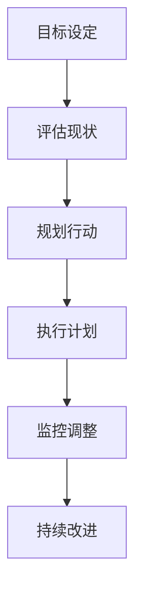
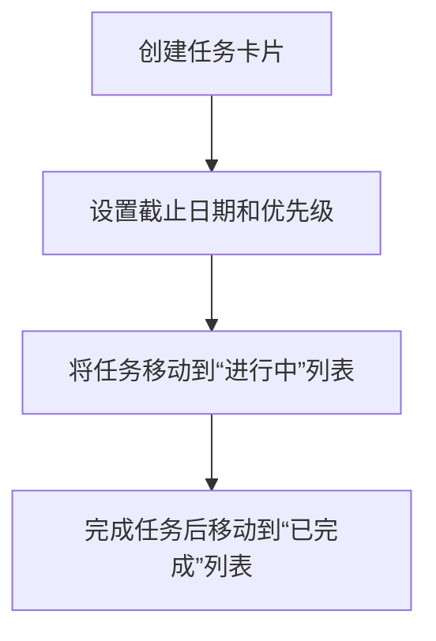
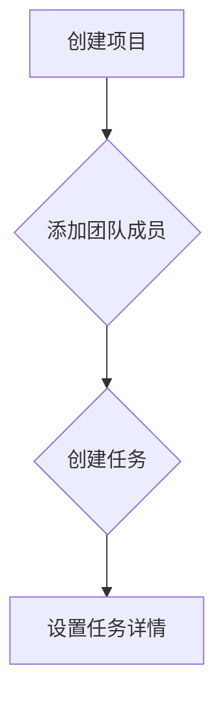

                 

### 引言

在当今快节奏的工作环境中，时间管理已经成为提高工作效率、实现个人与职业目标的关键要素。时间管理的概念涉及如何合理规划时间，将精力集中在最重要的事情上，从而最大化产出。本文旨在探讨时间管理的重要性，并详细阐述一套实用且逻辑清晰的时间管理技巧。

## 1. 时间管理的概念与重要性

### 1.1 核心概念术语说明

时间管理（Time Management）是关于如何计划、组织和控制时间，以实现个人和职业目标的过程。时间管理涉及以下关键术语：

- **目标设定（Goal Setting）**：确定要达成的目标，确保它们具体、可衡量、可实现、相关且有时间限制（SMART）。
- **优先级管理（Priority Management）**：识别和排序任务，确保将时间和精力集中在最重要的事情上。
- **时间跟踪（Time Tracking）**：记录和监控所花费的时间，以便更好地理解时间使用模式并做出相应调整。
- **任务管理（Task Management）**：组织和管理任务，确保任务按时完成。

### 1.2 问题背景

随着信息技术的飞速发展，人们面临的信息量和任务量不断增加。有效的信息管理和任务处理能力变得越来越重要。然而，许多人在面对繁重的工作任务时，往往会感到时间不够用，甚至出现工作与生活失衡的现象。时间管理的重要性体现在以下几个方面：

- **提高工作效率**：合理的时间管理可以帮助人们更高效地完成任务，减少不必要的延误和重复工作。
- **减少压力**：通过合理安排时间，可以减少因时间紧迫而产生的压力和焦虑。
- **实现目标**：设定明确的目标并有效地管理时间，是实现长期和短期目标的关键。
- **工作与生活平衡**：合理的时间管理有助于在繁忙的工作之余，平衡好个人生活，维护家庭和社会关系。

### 1.3 问题解决

为了解决时间管理问题，我们可以采取以下步骤：

1. **评估当前的时间管理状况**：通过记录和分析日常时间使用情况，了解时间浪费的原因和自己的时间价值观。
2. **设定明确的目标**：使用SMART原则设定长期和短期目标，并制定详细的行动计划。
3. **使用时间管理工具**：利用电子日历、任务管理软件和时间跟踪应用程序来规划和管理时间。
4. **采用有效的管理方法**：运用四象限法、步入正轨法（Eisenhower矩阵）等方法来提高时间管理效率。
5. **实践高效工作技巧**：通过优化工作环境、减少数字干扰和实施时间块工作法来提升集中注意力和工作效率。
6. **持续学习和个人成长**：通过不断学习和实践，提升时间管理技能，实现个人与职业的持续发展。

### 1.4 边界与外延

时间管理不仅适用于个人，也广泛应用于团队和企业管理。在团队中，时间管理有助于提高团队协作效率，确保项目按时完成。在企业管理中，时间管理可以帮助企业优化资源分配，提高整体运营效率。

### 1.5 概念结构与核心要素组成

时间管理的概念结构主要包括以下核心要素：

- **目标设定**：明确个人和职业目标，确保目标的可实现性。
- **优先级管理**：识别和排序任务，确保关键任务得到优先处理。
- **时间跟踪**：记录时间使用情况，分析时间浪费的原因。
- **任务管理**：组织和管理任务，确保任务按时完成。
- **工作环境优化**：创建一个有利于高效工作的环境。
- **数字干扰减少**：减少电子设备和社交媒体的干扰。

### 1.6 总结

时间管理是一个系统性、持续性的过程，涉及多个方面。通过合理的时间管理，我们可以更高效地利用时间，实现个人和职业目标。本文将逐步探讨时间管理的各个方面，提供实用的技巧和方法，帮助读者提升工作效率，实现工作与生活的平衡。接下来，我们将深入探讨评估个人时间管理现状的方法。

## 2. 评估你的时间管理现状

### 2.1 日常时间记录与分析

**日常时间记录**是评估时间管理现状的第一步。通过记录每天的时间使用情况，我们可以清晰地了解自己在哪些活动上花费了时间，以及这些活动的重要性。

**记录方法**：

- **纸质记录**：可以使用日程本或时间管理表格，每天结束后记录当天的活动和时间分配。
- **电子记录**：利用手机应用或在线时间管理工具，如Toggl、RescueTime等，自动记录设备使用情况。

**分析步骤**：

1. **活动分类**：将记录的活动按照工作、休息、个人事务等分类。
2. **时间花费统计**：计算每个分类所花费的时间，生成时间分布图表。
3. **活动重要性评估**：评估每个活动的重要性，区分哪些活动对目标实现具有关键作用。

**案例**：

假设某人在一周内记录了以下活动：

- 工作时间：40小时
- 休息时间：20小时
- 个人事务：20小时

通过时间分布图表，我们可以看到工作时间占据了总时间的57%，而休息时间和个人事务各占28%。通过重要性评估，可以发现工作时间是优先级最高的活动，而休息和个人事务则次之。

### 2.2 时间浪费分析

时间浪费是影响工作效率的重要因素。通过分析时间浪费的原因，我们可以找到优化时间管理的方法。

**浪费原因**：

- **无效会议**：冗长、无意义的会议占用大量时间。
- **社交媒体和电子邮件**：频繁查看和回复社交媒体和电子邮件会分散注意力。
- **过度休息**：频繁的休息或长时间的非工作状态。
- **任务拖延**：任务未按时完成，导致时间浪费。

**分析步骤**：

1. **识别浪费活动**：通过时间记录，找出浪费时间的活动。
2. **分析浪费原因**：结合个人经验和行为习惯，分析浪费时间的原因。
3. **制定改进措施**：针对每个浪费原因，制定具体的改进措施。

**案例**：

假设某人在时间浪费分析中发现，每天花在社交媒体上的时间平均为1小时。通过分析，发现这是由于工作间隙频繁查看手机导致的。改进措施可以是设置特定时间段查看社交媒体，或在完成任务后再进行休息。

### 2.3 个人时间价值观的识别

个人时间价值观决定了我们对时间使用方式的偏好和态度。识别个人时间价值观有助于制定更符合自身需求的时间管理策略。

**价值观评估方法**：

- **自我反思**：思考自己在时间使用上的偏好，哪些活动对自己最重要。
- **他人反馈**：询问家人、朋友或同事对自己的时间管理看法。
- **问卷调查**：使用专业的个人时间价值观评估工具。

**价值观类型**：

- **目标导向型**：更注重目标实现，愿意为重要任务投入时间。
- **享受生活型**：更注重生活品质，愿意花时间在休息和个人爱好上。
- **平衡型**：在工作和生活之间寻找平衡，既关注目标实现，也注重生活品质。

**案例**：

假设某人在自我反思中发现，自己更倾向于目标导向型，愿意为职业发展投入大量时间。因此，在时间管理上，他会更注重工作任务的优先级，确保关键任务得到充分时间。

通过以上三个步骤，我们可以全面评估个人时间管理现状，了解时间浪费原因，并识别个人时间价值观。这些评估结果将为下一步设定明确的目标和规划时间管理策略提供重要依据。在下一节中，我们将深入探讨如何设定明确的目标，并介绍SMART原则。

## 3. 设定明确的目标

### 3.1 目标设定的SMART原则

设定明确的目标是有效时间管理的基础。SMART原则是一种广泛使用的目标设定方法，它确保目标具有明确性、可衡量性、可实现性、相关性和时限性。

#### **S - 具体性（Specific）**

具体性意味着目标需要明确、具体和清晰。一个具体的例子是：“每天早上9点到公司”而不是“每天上班”。具体性可以帮助我们清楚地知道要做什么，从而减少模糊和不确定性。

#### **M - 可衡量性（Measurable）**

可衡量性指的是目标应该是可度量的，以便我们可以追踪进度和评估结果。例如，“阅读10页技术书籍”比“学习技术知识”更具可衡量性，因为我们可以通过页数来衡量进度。

#### **A - 可实现性（Achievable）**

可实现性意味着目标应该是实际可行的，避免设定过于遥远或不切实际的目标。例如，“每天工作12小时”可能是不现实的，因为这样会影响健康和家庭生活。相反，“每天工作8小时并保持高效”则更实际。

#### **R - 相关性（Relevant）**

相关性意味着目标应该与我们的长期目标和个人价值观一致。一个相关的例子是，“提高编程技能”，而不是“学会弹吉他”，后者与职业发展无关。

#### **T - 时限性（Time-bound）**

时限性意味着目标需要设定一个明确的截止日期。例如，“在下一季度内完成项目”，比“尽快完成项目”更具有时间紧迫感。

### **案例与应用**

假设一个开发人员想要提高编程技能：

- **具体性**：学习Python编程。
- **可衡量性**：完成10个Python编程项目。
- **可实现性**：每天投入1小时学习。
- **相关性**：与职业发展相关。
- **时限性**：在6个月内完成。

通过SMART原则，这个开发人员可以明确自己的学习目标，并制定具体的行动计划，从而更有效地利用时间。

### **SMART原则的优缺点**

**优点**：

- 提高目标的明确性和可操作性。
- 促进自我监控和进度评估。
- 帮助设定合理的期望值。

**缺点**：

- 过于机械，可能忽略创造性目标。
- 容易导致短期目标忽视长期发展。

### **注意事项**

- **定期回顾和调整**：目标设定后，需要定期回顾和调整，以适应实际情况的变化。
- **灵活性和适应性**：在设定目标时，考虑灵活性和适应性，以应对突发情况和变化。

通过遵循SMART原则，我们可以更有效地设定目标，提高时间管理的效率，实现个人和职业发展目标。

### 3.2 设定长期和短期目标

在时间管理中，设定长期和短期目标是非常重要的。这些目标不仅为我们提供了清晰的方向，还帮助我们更好地分配时间和资源。

#### **长期目标**

长期目标通常是指在未来几个月到几年内要实现的目标。这些目标通常是更具战略性和全面性的，比如：

- **职业发展**：晋升为高级工程师或项目经理。
- **技能提升**：掌握新的编程语言或技术框架。
- **个人成就**：完成一个重要的项目或出版一本技术书籍。

**设定长期目标的步骤**：

1. **自我反思**：思考你的长期愿景和价值观。
2. **确定方向**：明确你在职业和个人生活中希望达成的目标。
3. **分解目标**：将长期目标分解为更小的、可管理的任务。

**案例**：

一个开发人员的长期目标是晋升为高级工程师。为此，他需要：

- 提升技术能力，学习新的编程语言和框架。
- 参与关键项目，积累实战经验。
- 与同事和上级建立良好的关系，获得更多的职业机会。

#### **短期目标**

短期目标通常是在几个月内要实现的目标，它们更具操作性和紧迫性。短期目标可以是：

- **每周任务**：完成特定的项目任务或代码审查。
- **学习任务**：每周阅读一定数量的技术文章或书籍。
- **健康目标**：每周进行几次运动。

**设定短期目标的步骤**：

1. **确定优先级**：识别哪些短期目标对长期目标最重要。
2. **具体化目标**：使用SMART原则，确保短期目标具体、可衡量、可实现、相关和有时限。
3. **制定行动计划**：制定详细的行动计划，包括每天或每周的任务。

**案例**：

为了提升编程技能，一个开发人员设定了以下短期目标：

- **每周阅读2篇技术文章**。
- **每周完成一个Python编程项目**。
- **每天学习30分钟Python语言**。

#### **长期与短期目标的平衡**

在设定长期和短期目标时，需要找到一个平衡点。长期目标为我们提供了方向和愿景，而短期目标则帮助我们实现这些长期目标。

**建议**：

1. **相互补充**：确保短期目标与长期目标相一致，并相互补充。
2. **灵活调整**：在执行过程中，根据实际情况灵活调整目标和计划。
3. **定期评估**：定期评估短期目标的进展，并根据需要调整长期目标。

通过设定长期和短期目标，我们可以更清晰地规划时间，确保每一步都有明确的方向和行动。这不仅有助于提升工作效率，还能帮助我们实现个人和职业发展的目标。

### 3.3 制定达成目标的行动计划

一旦设定了明确的目标，制定一个详细的行动计划是确保目标实现的下一步。行动计划需要具体、可行，并包含明确的步骤和时间表。以下是制定行动计划的方法和步骤：

#### **1. 确定关键任务**

首先，我们需要将目标分解为更小的、可管理的任务。这些任务应该具体且相关，以便我们可以逐步完成它们。

**示例**：

- **长期目标**：成为一名高级工程师。
- **关键任务**：学习新的编程语言、参与关键项目、建立职业网络。

#### **2. 制定时间表**

为每个任务设定一个具体的时间表，明确何时开始和完成。时间表可以帮助我们保持进度，并确保每个任务都在规定的时间内完成。

**示例**：

- **任务**：学习新的编程语言。
- **时间表**：每周学习2小时，共6周完成。

#### **3. 分配资源**

为了完成每个任务，我们需要确定所需的资源，包括时间、资金、人力等。这些资源应该合理分配，以确保任务能够顺利进行。

**示例**：

- **任务**：参与关键项目。
- **资源**：项目时间安排、技术支持、同事合作。

#### **4. 设定里程碑**

设定里程碑可以帮助我们监控进度，并为每个任务的成功完成提供反馈。里程碑是任务完成的一个重要标志，它可以帮助我们保持动力和方向。

**示例**：

- **任务**：完成Python编程项目。
- **里程碑**：每周提交一个项目版本，最终在第六周完成。

#### **5. 实施和调整**

在执行行动计划时，可能会遇到一些意外情况或挑战。因此，需要保持灵活性，及时调整计划以应对变化。

**示例**：

- **计划**：每天学习30分钟Python。
- **调整**：如果某天工作时间太忙，可以调整学习时间，但确保总学习时间不受影响。

#### **6. 反馈和评估**

执行行动计划后，我们需要对结果进行反馈和评估。这包括评估任务的完成情况、目标的实现程度，以及计划的有效性。

**示例**：

- **评估**：通过自我评估和同事反馈，了解自己在技能提升方面的进步。

#### **7. 持续改进**

根据反馈和评估结果，我们需要不断改进行动计划。这包括调整任务优先级、优化资源分配，以及改进执行策略。

**示例**：

- **改进**：如果发现某个任务耗时过长，可以尝试分解任务或寻求外部帮助。

通过以上步骤，我们可以制定一个详细的行动计划，确保目标的实现。行动计划不仅是目标实现的工具，也是时间管理的有力助手。它帮助我们保持专注、提高效率，并最终实现个人和职业发展目标。

### 4. 时间管理工具与方法

#### 4.1 时间管理工具概述

在现代工作环境中，有许多工具和方法可以帮助我们更好地管理时间。以下是几种常用的工具：

**1. 电子日历与提醒工具**

电子日历可以帮助我们规划日程，提醒重要事件和任务。例如，谷歌日历（Google Calendar）提供了丰富的功能，如事件创建、日历共享和提醒设置。

**2. 任务管理软件**

任务管理软件可以帮助我们组织和管理任务。Trello、Asana和Jira等工具提供了任务创建、分配、跟踪和进度监控功能，有助于提高团队协作效率。

**3. 时间跟踪应用程序**

时间跟踪应用程序可以帮助我们记录时间使用情况，分析时间浪费的原因。例如，Toggl和RescueTime等工具可以自动记录设备使用时间，生成详细的报告。

#### 4.1.1 电子日历与提醒工具

**优点**：

- 提高日程规划的准确性。
- 确保不会错过重要事件和任务。
- 方便多人共享和协同。

**缺点**：

- 需要定期更新和维护。
- 可能导致信息过载。

**示例**：

使用谷歌日历，可以创建会议、设置提醒，并与其他人共享日程。这有助于团队协作和任务分配。

#### 4.1.2 任务管理软件

**优点**：

- 提高任务组织的效率。
- 方便任务分配和进度跟踪。
- 支持团队协作和沟通。

**缺点**：

- 需要一定的学习和适应时间。
- 可能导致任务过载和复杂性增加。

**示例**：

Trello 提供了看板（Board）、列表（List）和卡片（Card）等元素，可以帮助团队清晰地展示任务状态，并实时更新进度。

#### 4.1.3 时间跟踪应用程序

**优点**：

- 自动记录时间使用情况。
- 生成详细的报告，帮助分析时间浪费。
- 提供数据支持，便于调整时间管理策略。

**缺点**：

- 可能涉及隐私问题。
- 对时间记录的准确性有依赖。

**示例**：

RescueTime 可以监控我们在电脑和手机上的活动，生成时间使用报告，帮助我们识别时间浪费的环节。

通过使用这些工具，我们可以更有效地管理时间，提高工作效率。每种工具都有其独特的优势和适用场景，可以根据个人需求和团队协作情况选择合适的工具。

### 4.2 时间管理方法

在时间管理中，选择合适的方法可以帮助我们更高效地分配时间和精力，确保关键任务得到优先处理。以下是几种常用的时间管理方法：

#### 4.2.1 四象限法

四象限法（Eisenhower Matrix）是一种经典的时间管理方法，它将任务分为四个象限，根据任务的紧急性和重要性进行排序和处理。

**象限划分**：

- **第一象限**：重要且紧急的任务，需要立即处理。
- **第二象限**：重要但不紧急的任务，需要提前规划和安排。
- **第三象限**：不重要但紧急的任务，可以委托或暂时搁置。
- **第四象限**：既不重要也不紧急的任务，应尽量避免或取消。

**处理步骤**：

1. **识别任务**：将所有任务根据紧急性和重要性进行分类。
2. **优先处理**：首先处理第一象限的任务，这些任务需要立即关注和解决。
3. **规划和安排**：将第二象限的任务纳入日程规划，确保这些重要任务能够按时完成。
4. **委托或取消**：对于第三象限的任务，可以适当委托他人或取消，减少不必要的干扰。
5. **避免浪费**：避免第四象限的任务，保持专注和高效。

**案例**：

一位项目经理需要处理以下任务：

- **紧急且重要**：下周的团队会议。
- **重要但不紧急**：项目计划书的准备。
- **不紧急且不重要**：回复一些不紧急的邮件。
- **不紧急且不重要**：参加社交活动。

通过四象限法，项目经理可以将任务优先级调整为：立即处理下周的团队会议，然后开始准备项目计划书，将不重要的邮件和社交活动暂时搁置。

#### 4.2.2 步入正轨法（Eisenhower矩阵）

步入正轨法是四象限法的另一种变体，它通过将任务分类为“重要紧急”、“重要不紧急”、“不重要紧急”和“不重要不紧急”，提供更详细的时间管理策略。

**分类与处理**：

- **重要紧急**：立即处理，避免紧急情况的发生。
- **重要不紧急**：提前规划和安排，确保任务按时完成。
- **不重要紧急**：尽量委托他人处理，减少自身压力。
- **不重要不紧急**：避免或取消，集中精力处理更重要任务。

**处理步骤**：

1. **分类任务**：将所有任务按照重要性和紧急性进行分类。
2. **优先处理**：首先处理重要紧急的任务，确保关键任务得到及时处理。
3. **规划和安排**：为重要不紧急的任务制定详细的计划和时间表。
4. **委托与取消**：对于不重要紧急的任务，适当委托他人处理，对于不重要不紧急的任务，尽量避免或取消。

**案例**：

一位工程师需要处理以下任务：

- **重要紧急**：紧急修复一个bug。
- **重要不紧急**：下周的技术分享会。
- **不重要紧急**：处理客户的一些简单问题。
- **不重要不紧急**：回复一些不必要的邮件。

通过步入正轨法，工程师可以将任务优先级调整为：立即处理紧急的bug，然后准备下周的技术分享会，将客户的简单问题委托给同事，不回复不必要的邮件。

#### 4.2.3 费里曼法则

费里曼法则（Feigenbaum's Law）是一种时间管理理念，它强调“管理时间时，最重要的是首先完成最重要的任务”。这种方法认为，将时间和精力集中在最重要的事情上，可以最大化产出。

**核心思想**：

- **优先处理关键任务**：将最重要、最具影响力的任务放在首位。
- **避免分散注意力**：集中精力处理最重要的任务，避免同时处理多个任务。
- **持续跟进**：对关键任务进行持续跟进，确保任务顺利完成。

**应用步骤**：

1. **确定关键任务**：识别对目标实现最有影响力的任务。
2. **优先处理**：将关键任务放在首位，确保这些任务得到及时处理。
3. **集中精力**：在处理关键任务时，保持专注，避免分散注意力。
4. **持续跟进**：定期检查关键任务的进展，确保任务按计划完成。

**案例**：

一位项目经理需要处理以下任务：

- **关键任务**：完成项目计划书。
- **次要任务**：准备项目演示。
- **非关键任务**：回复邮件。

通过费里曼法则，项目经理可以将任务优先级调整为：首先完成项目计划书，然后准备项目演示，最后回复邮件。

#### 4.2.4 心流状态与时间管理

心流状态（Flow State）是一种高度专注、投入和高效的工作状态。在这种状态下，人们可以忘记时间，专注于当前任务，从而提高工作效率。

**特点**：

- **高度专注**：完全投入当前任务，忽略外界干扰。
- **时间感变化**：时间感知减弱，感觉任务完成速度更快。
- **创造力和效率提高**：在心流状态下，人们的创造力和工作效率显著提升。

**实现心流状态的步骤**：

1. **设定明确的目标**：明确任务的目标和预期结果，减少不确定性。
2. **创造适宜的环境**：创造一个安静、整洁的工作环境，减少干扰。
3. **逐步进入状态**：通过逐步减少干扰和增加专注时间，逐步进入心流状态。
4. **保持心流状态**：在心流状态中，保持专注和投入，避免中断。

**案例**：

一位工程师在编写重要的代码时，通过设定明确的目标、创造安静的工作环境和逐步进入状态，成功地进入了心流状态，从而在短时间内完成了高质量的代码。

通过以上时间管理方法，我们可以更有效地分配时间和精力，确保关键任务得到优先处理，从而提高工作效率和工作质量。

### 4.3 高效工作技巧

#### 4.3.1 集中注意力与减少干扰

在现代工作环境中，干扰无处不在，这大大降低了我们的工作效率。为了提高集中注意力，我们可以采取以下措施：

**1. 工作环境的优化**

- **消除视觉干扰**：将桌面清理干净，减少视觉干扰源。
- **创建舒适的工作空间**：确保工作环境舒适，如适当的照明和通风。
- **避免噪声干扰**：使用耳塞或耳机来屏蔽噪声。

**2. 数字干扰的减少**

- **关闭不必要的通知**：关闭手机、电脑等设备的无关通知。
- **设定特定的工作时间**：在特定时间段内，将手机置于静音模式，避免打扰。
- **使用专注工具**：使用番茄钟（Pomodoro Technique）等专注工具，以短时间段内的高度集中来提高工作效率。

**3. 时间块工作法**

时间块工作法是一种将工作时间和休息时间分割开来，以提高集中注意力的方法。以下是具体步骤：

- **划分时间段**：将一天的工作时间划分为若干个时间段，如每25分钟工作，然后休息5分钟。
- **专注任务**：在每个时间段内，集中注意力完成一项任务。
- **休息时间**：在每个时间段结束时，进行短暂的休息，以恢复精力。

**案例**：

一位软件工程师通过实施时间块工作法，将一天的工作时间划分为四个25分钟的工作时间段和三个5分钟的休息时间段。在每个工作时间段内，他专注于编写代码，而在休息时间段内，他进行短暂的休息，如伸展身体、喝杯咖啡。这种方法显著提高了他的工作效率。

通过优化工作环境和减少数字干扰，并采用时间块工作法，我们可以更好地集中注意力，提高工作效率。

### 4.3.2 优先级管理

优先级管理是时间管理中至关重要的一环。通过有效地管理优先级，我们可以确保关键任务得到优先处理，从而最大化利用时间和资源。以下是优先级管理的几种方法：

#### **短期内的优先级设定**

**1. 80/20法则**

80/20法则（也称为帕累托法则）指出，80%的结果往往来自20%的努力。这种方法帮助我们识别哪些任务对结果影响最大，从而将精力集中在这些关键任务上。

- **识别关键任务**：分析任务对目标和结果的影响，将关键任务优先处理。
- **分配资源**：将80%的资源投入到20%的关键任务中，确保这些任务得到充分关注。

**案例**：

一位项目经理在项目管理中应用了80/20法则，将项目任务分为关键任务和次要任务。他将大部分时间和资源分配给关键任务，如项目规划和关键里程碑，从而确保项目按时完成。

#### **长期内的优先级设定**

**1. 重要性和紧急性矩阵**

重要性和紧急性矩阵（也称为四象限法）将任务分为四个象限，根据任务的重要性和紧急性进行排序和处理。

- **第一象限**：重要且紧急的任务，需要立即处理。
- **第二象限**：重要但不紧急的任务，需要提前规划和安排。
- **第三象限**：不重要但紧急的任务，可以委托或暂时搁置。
- **第四象限**：既不重要也不紧急的任务，应尽量避免或取消。

**案例**：

一位企业高管在处理工作任务时，使用了重要性和紧急性矩阵。他将紧急且重要的任务放在首位，如客户会议和重要决策。他将重要但不紧急的任务纳入日程规划，如市场调研和团队培训。对于不重要但紧急的任务，他选择委托给团队成员。而对于既不重要也不紧急的任务，他选择取消或推迟。

#### **综合应用**

**1. 评估和调整**

优先级管理不是一成不变的，我们需要定期评估任务的重要性和紧急性，并根据实际情况进行调整。

- **定期回顾**：每周或每月对任务清单进行回顾，评估任务的完成情况和优先级。
- **灵活调整**：根据任务的变化和优先级调整任务列表，确保关键任务得到优先处理。

通过短期和长期优先级管理的结合，我们可以更有效地分配时间和资源，确保关键任务得到优先处理，从而提高工作效率和工作质量。

### 4.3.3 提升工作效率的技巧

提升工作效率是每个职场人士追求的目标。以下是一些实用的技巧，可以帮助我们更高效地完成任务：

#### **1. 微任务管理**

微任务管理是将大任务分解为小任务，以便更容易管理和完成。这种方法有助于减少任务的心理负担，提高工作动力。

**步骤**：

- **分解任务**：将大任务分解为若干个小任务，每个小任务都应该具体、可操作。
- **设定截止时间**：为每个小任务设定一个明确的截止时间，以便更好地管理进度。
- **逐步完成**：按照任务列表逐步完成每个小任务，不断积累成就感。

**案例**：

一位项目经理在准备项目演示时，将整个演示过程分解为多个小任务，如制作幻灯片、收集数据、编写脚本等。每个小任务都有明确的截止时间，并在规定时间内完成，从而确保了演示的顺利进行。

#### **2. 阅读与决策的效率提升**

快速阅读和高效决策是提升工作效率的重要技能。以下是一些实用的技巧：

**1. 快速阅读**

- **预览内容**：在阅读前快速浏览文章或报告的标题、摘要和章节标题，了解整体内容结构。
- **跳读和扫描**：对于不重要的内容，可以跳读或扫描，只关注关键信息。
- **提高阅读速度**：通过练习提高阅读速度，如使用手指或笔引导阅读。

**2. 高效决策**

- **收集信息**：在做出决策前，收集足够的信息，确保决策基于充分的事实和数据。
- **制定决策标准**：明确决策的标准和准则，以便在决策过程中有据可依。
- **快速决断**：避免过度分析和犹豫，快速做出决策并付诸行动。

**案例**：

一位项目经理在制定项目计划时，通过快速阅读项目文档和资料，快速了解关键信息。他制定了明确的决策标准，如项目进度、成本和风险，从而在短时间内做出了高效的决策。

#### **3. 提高会议效率**

会议是工作中常见的一种沟通方式，但往往效率低下。以下是一些提高会议效率的技巧：

**1. 设定明确的目标**

- **明确会议目的**：在会议前明确会议的目标和议题，确保会议内容聚焦。
- **设定时间限制**：为每个议题设定时间限制，确保会议在规定时间内完成。

**2. 提前准备**

- **准备会议材料**：提前准备会议所需的材料和报告，确保会议内容充实。
- **发送会议议程**：提前发送会议议程和材料，确保参会人员有充分的时间准备。

**3. 避免无效讨论**

- **控制讨论范围**：确保讨论内容与会议议题相关，避免偏离主题。
- **积极引导**：鼓励参会人员发表意见，但控制讨论范围和时间。

**案例**：

一位项目经理在一次团队会议上，明确了会议的目标和议题，并提前发送了会议议程和材料。会议期间，他有效控制了讨论范围，确保会议在规定时间内高效完成。

通过以上技巧，我们可以更高效地完成工作任务，提高工作效率，实现个人和职业目标。

### 4.3.4 时间块工作法

时间块工作法是一种通过将工作时间划分为不同块，以提升集中注意力和工作效率的时间管理技巧。该方法基于番茄钟（Pomodoro Technique），即将工作时间分为25分钟的工作块和5分钟的休息块。以下是时间块工作法的具体应用步骤：

**1. 划分时间段**

首先，将一天的工作时间划分为若干个25分钟的工作时间段和相应的5分钟休息时间段。例如，可以设定一个上午分为三个工作时间段，一个下午分为三个工作时间段，每个工作时间段之间有一个5分钟的休息时间。

**2. 选择任务**

在每个工作时间段开始前，选择一个具体的任务。任务应该是具体、可衡量的，并且可以在25分钟内完成。

**3. 集中工作**

在工作时间段内，集中注意力完成所选任务。避免任何形式的干扰，如关闭手机通知、远离社交媒体等。保持专注，直到工作时间段结束。

**4. 休息时间**

在每个工作时间段结束后，进行5分钟的休息。这段时间内，可以进行简单的伸展、喝水或放松眼睛等。休息时间是为了恢复精力，提高后续工作时间段的工作效率。

**5. 记录和分析**

在工作结束后，记录每个工作时间段内完成的任务和休息时间。通过分析这些数据，可以了解自己在不同时间段的工作效率，并做出相应的调整。

**案例**：

一位程序员在应用时间块工作法时，将一天的工作时间分为六个25分钟的工作时间段和六个5分钟的休息时间段。在每个工作时间段内，他专注于编写代码，而在休息时间段内，他进行简单的身体活动，以恢复精力。通过这种方法，他的工作效率显著提升。

时间块工作法通过将工作时间分割为集中的工作块和短暂的休息时间，帮助我们保持专注，提高工作效率，实现工作与休息的平衡。

### 4.3.5 提高会议效率

会议是工作中不可或缺的一部分，但往往效率低下，浪费时间。以下是一些提高会议效率的技巧：

**1. 设定明确的目标**

在召开会议前，明确会议的目标和议程。确保会议内容聚焦，避免偏离主题。目标应具体、明确，有助于会议的顺利进行。

**2. 提前准备**

提前发送会议通知和材料，确保参会人员有足够的时间准备。会议材料应包括会议议程、相关数据和支持文件，以便会议过程中参考。

**3. 设定时间限制**

为每个议题设定时间限制，确保会议在规定时间内完成。时间限制有助于提高会议效率，避免议题拖延和讨论范围扩大。

**4. 避免无效讨论**

确保讨论内容与会议议题相关，避免偏离主题。如果出现无关讨论，及时引导回到正题。鼓励参会人员积极发言，但控制讨论范围和时间。

**5. 分配会议记录员**

指定一名会议记录员，负责记录会议讨论的内容和决定。会议记录有助于后续执行和跟进，确保会议决定得到落实。

**6. 发送会议纪要**

在会议结束后，及时发送会议纪要，总结会议讨论的主要议题、决定和后续行动计划。会议纪要有助于参会人员了解会议成果，确保会议决定得到执行。

**案例**：

在一次项目启动会议上，项目经理提前发送了会议议程和相关材料，明确了会议目标。会议期间，他设定了每个议题的时间限制，并有效引导讨论，确保会议在规定时间内高效完成。会议结束后，他及时发送了会议纪要，总结了会议决定和后续行动计划。

通过以上技巧，我们可以提高会议效率，确保会议成果得到有效执行。

### 4.3.6 工作与生活的平衡

在快节奏的现代生活中，平衡工作与生活是一项挑战。以下是一些有效的方法，帮助我们在忙碌的工作中找到生活与工作的平衡：

**1. 规划日常时间表**

制定详细的时间表，包括工作、休息、家庭和个人时间。明确每个时间段的活动，确保工作与生活得到合理安排。

**2. 设定明确的工作时间**

设定固定的工作时间，避免工作与生活的混淆。在工作时间专注工作，提高效率；在非工作时间，专注于家庭和个人生活。

**3. 休息与放松**

定期安排休息和放松时间，如午休、周末休息日等。这有助于恢复精力，提高工作效率，同时享受生活。

**4. 家庭活动**

安排与家人的时间，如晚餐、看电影、散步等。这有助于增强家庭关系，减少工作压力。

**5. 个人爱好**

培养个人爱好，如阅读、运动、绘画等。这些活动可以让我们在忙碌的工作中找到乐趣，提高生活品质。

**6. 灵活工作安排**

与雇主或团队成员沟通，争取灵活的工作安排，如远程办公、弹性工作时间等。这有助于更好地平衡工作与生活，提高工作效率。

**案例**：

一位软件工程师通过制定详细的时间表，将每天的时间划分为工作、休息和家庭活动。在工作时间，他专注编程任务，提高工作效率；在非工作时间，他与家人共度时光，培养个人爱好，从而实现了工作与生活的平衡。

通过以上方法，我们可以在繁忙的工作中找到生活的乐趣，提高生活品质，实现工作与生活的平衡。

### 4.3.7 持续学习与个人成长

在快速发展的信息技术领域，持续学习与个人成长至关重要。以下是一些有效的方法，帮助我们在职业生涯中不断提升自我：

**1. 时间管理技能的学习与提升**

掌握时间管理技能是提高工作效率和个人成就的关键。通过阅读相关书籍、参加培训课程和实际应用，我们可以不断提升时间管理能力。

**2. 阅读与学习的习惯培养**

培养阅读和学习习惯，定期阅读技术书籍、学术论文和行业报告。这有助于我们了解最新的技术趋势和研究成果，提高专业素养。

**3. 参与社区与交流**

参与技术社区和行业交流活动，与其他专业人士交流经验和见解。这有助于我们拓宽视野，发现新的学习和成长机会。

**4. 技能培训与认证**

参加技能培训和获得相关认证，如PMP、Scrum Master等。这些认证不仅提高了我们的专业技能，还增加了就业竞争力。

**5. 自我反思与目标设定**

定期进行自我反思，识别自身的优势和不足，设定清晰的个人成长目标。通过持续的努力和改进，我们可以不断提升自我，实现职业发展目标。

**案例**：

一位软件工程师通过定期阅读技术书籍、参加在线课程和参与技术论坛，不断提升自己的编程技能。他还制定了明确的职业发展目标，如学习新的编程语言和获得PMP认证。通过持续学习和努力，他的职业生涯取得了显著进步。

通过以上方法，我们可以不断提升自我，实现个人和职业的持续发展。

### 5. 时间管理与个人成长

#### 5.1 平衡工作与生活

在快节奏的工作环境中，平衡工作与生活是一项挑战，但也是实现个人成长和职业成功的关键。以下是一些有效的方法，帮助我们在繁忙的工作中找到生活的乐趣：

**1. 规划日常时间表**

制定详细的时间表，包括工作、休息、家庭和个人时间。明确每个时间段的活动，确保工作与生活得到合理安排。例如，每天设定固定的下班时间，确保有足够的时间陪伴家人和进行个人爱好。

**2. 设定明确的工作时间**

设定固定的工作时间，避免工作与生活的混淆。在工作时间专注工作，提高效率；在非工作时间，专注于家庭和个人生活。通过设定明确的工作界限，我们可以更有效地管理时间和精力。

**3. 休息与放松**

定期安排休息和放松时间，如午休、周末休息日等。这有助于恢复精力，提高工作效率，同时享受生活。在休息时间内，可以做一些自己喜欢的事情，如阅读、运动或与朋友聚会。

**4. 家庭活动**

安排与家人的时间，如晚餐、看电影、散步等。这有助于增强家庭关系，减少工作压力。通过与家人的互动，我们可以获得情感支持，提高生活质量。

**5. 个人爱好**

培养个人爱好，如阅读、运动、绘画等。这些活动可以让我们在忙碌的工作中找到乐趣，提高生活品质。个人爱好不仅可以帮助我们放松身心，还可以激发创造力，提升工作效率。

**6. 灵活工作安排**

与雇主或团队成员沟通，争取灵活的工作安排，如远程办公、弹性工作时间等。这有助于更好地平衡工作与生活，提高工作效率。例如，可以选择在家办公，以减少通勤时间，从而有更多时间陪伴家人。

**案例**：

一位软件工程师通过制定详细的时间表，将每天的时间划分为工作、休息和家庭活动。在工作时间，他专注编程任务，提高工作效率；在非工作时间，他与家人共度时光，培养个人爱好，从而实现了工作与生活的平衡。通过这种方式，他不仅提高了工作效率，还保持了良好的家庭关系和个人健康。

通过以上方法，我们可以在繁忙的工作中找到生活的乐趣，提高生活质量，实现个人与职业的全面发展。

### 5.2 持续学习与个人成长

在快速发展的信息技术领域，持续学习和个人成长是职业发展的关键。以下是一些有效的方法，帮助我们在职业生涯中不断提升自我：

**1. 时间管理技能的学习与提升**

掌握时间管理技能是提高工作效率和个人成就的关键。通过阅读相关书籍、参加培训课程和实际应用，我们可以不断提升时间管理能力。以下是一些推荐的书籍和课程：

- **书籍推荐**：《时间管理的艺术》、《番茄工作法》
- **在线课程**：Coursera、Udemy等平台上的时间管理课程

**2. 阅读与学习的习惯培养**

培养阅读和学习习惯，定期阅读技术书籍、学术论文和行业报告。这有助于我们了解最新的技术趋势和研究成果，提高专业素养。以下是一些建议：

- **技术书籍**：学习编程语言、框架和算法的最新书籍。
- **学术论文**：阅读顶级会议和期刊上的文章，了解领域内的最新研究进展。
- **行业报告**：关注市场趋势和技术动态，了解行业动态。

**3. 参与社区与交流**

参与技术社区和行业交流活动，与其他专业人士交流经验和见解。这有助于我们拓宽视野，发现新的学习和成长机会。以下是一些技术社区和交流活动：

- **技术社区**：GitHub、Stack Overflow、Reddit等。
- **行业会议**：参加技术会议、研讨会和交流会，结识行业内的专家和同行。

**4. 技能培训与认证**

参加技能培训和获得相关认证，如PMP、Scrum Master等。这些认证不仅提高了我们的专业技能，还增加了就业竞争力。以下是一些推荐的培训和认证：

- **PMP认证**：项目管理专业认证，适用于项目经理和管理人员。
- **Scrum Master认证**：敏捷管理专业认证，适用于敏捷团队和项目经理。

**5. 自我反思与目标设定**

定期进行自我反思，识别自身的优势和不足，设定清晰的个人成长目标。通过持续的努力和改进，我们可以不断提升自我，实现职业发展目标。以下是一些自我反思和目标设定的方法：

- **定期回顾**：每周或每月回顾自己的工作表现和学习成果。
- **设定目标**：设定短期和长期目标，确保目标具体、可衡量、可实现。
- **行动计划**：制定详细的行动计划，分解目标，逐步实现。

**案例**：

一位软件工程师通过持续学习和参与社区活动，不断提升自己的编程技能。他定期阅读技术书籍，参加在线课程，并参加行业会议，结识了许多业内专家。他还获得了PMP认证，提升了项目管理能力。通过这些努力，他的职业生涯取得了显著进步，成为了公司的重要项目成员。

通过以上方法，我们可以不断提升自我，实现个人和职业的持续发展。

### 6. 时间管理的案例研究

在探讨时间管理的最佳实践时，实际案例研究为我们提供了宝贵的见解和经验。以下是一些成功的时间管理案例研究，包括企业成功案例和个人成功故事。

#### 6.1 企业成功案例

**案例一：某跨国公司的时间管理实践**

某跨国公司在全球拥有数千名员工，面临着跨时区协作和复杂项目管理的挑战。为了提高工作效率，公司实施了以下时间管理策略：

1. **统一的日历系统**：公司引入了统一的企业日历系统，员工可以在一个平台上查看和协调会议、任务和项目进度。这有助于减少沟通成本，提高协作效率。

2. **任务管理工具**：公司采用了任务管理工具，如Asana和Trello，用于任务分配、进度跟踪和协作。这些工具提供了清晰的任务视图，确保每个团队成员都能了解自己的责任和项目的进展。

3. **定期时间审查**：公司每月举行时间管理审查会议，团队领导与员工共同回顾时间使用情况，识别时间浪费的原因，并制定改进措施。这种定期审查有助于持续优化时间管理策略。

**结果**：

通过实施这些时间管理策略，公司的项目按时完成率提高了30%，员工的工作满意度也有所提升。公司还报告称，由于减少了不必要的会议和任务重复，员工的工作效率提高了20%。

#### 6.2 某创业公司的时间管理经验

某创业公司是一个快速成长的科技初创企业，团队成员都是充满激情的专业人士。为了在资源有限的情况下保持高效运作，公司采取了以下措施：

1. **灵活的工作时间**：公司采用了灵活的工作时间制度，员工可以根据个人需求和项目进度自行安排工作时间。这种灵活性有助于减少因工作时间冲突而产生的效率损失。

2. **优先级管理**：公司鼓励员工每周设定个人和团队的优先级，并确保关键任务得到优先处理。员工通过每日站立会议（Daily Stand-up）分享进展和挑战，确保团队协作高效。

3. **专注时间段**：公司实施专注时间段（Focus Time）政策，每天下午茶时间后，团队成员关闭所有通知，专注于重要的任务。这种政策有助于提高员工在重要任务上的集中度和效率。

**结果**：

这些时间管理实践帮助创业公司在短时间内实现了多个关键里程碑，如产品发布和市场扩张。团队成员报告称，通过专注时间段和灵活的工作时间，他们的工作效率提高了40%。

#### 6.3 个人成功故事

**案例一：某企业高管的时间管理技巧**

某企业高管在管理一个跨国团队时，面临着复杂的工作日程和多项目管理。为了提高个人和工作效率，他采取了以下策略：

1. **每天早晨的时间规划**：高管每天早晨花15分钟进行时间规划，列出当天的重要任务和优先级。这有助于他保持清晰的工作方向，避免分心和延误。

2. **有效利用通勤时间**：高管利用通勤时间阅读行业报告、听专业课程和播客。这种多任务处理策略帮助他在日常通勤中获得了额外的学习时间。

3. **定期休息和运动**：高管定期安排休息时间和运动，如每天下班后进行30分钟的运动。这有助于他保持身心健康，提高工作效率。

**结果**：

通过这些时间管理技巧，企业高管不仅提高了个人工作效率，还增强了团队的凝聚力。他的工作表现得到了上级和同事的高度评价。

**案例二：某职场新人的时间管理实践**

某职场新人刚刚进入一家大型科技公司，为了迅速适应职场节奏，她采取了以下措施：

1. **记录时间日志**：职场新人每天记录自己的时间使用情况，分析时间浪费的原因。通过这种自我监控，她识别出了社交媒体和邮件检查的时间浪费问题。

2. **设置工作优先级**：职场新人学会了使用四象限法（Eisenhower Matrix）设定任务优先级，将注意力集中在最重要的任务上。这种方法帮助她提高了任务完成的效率。

3. **定期反思和调整**：职场新人每周进行一次时间管理反思，回顾一周的时间使用情况，并根据实际情况调整下周的计划。这种反思和调整有助于持续优化时间管理策略。

**结果**：

通过这些时间管理实践，职场新人迅速适应了工作环境，提高了工作效率，并得到了同事和上级的认可。她的时间管理技巧也成为了团队中的宝贵经验。

通过这些案例研究，我们可以看到时间管理在不同规模和类型的组织中都能发挥重要作用。成功的时间管理实践不仅提高了工作效率，还增强了团队协作和个人成就感。这些案例为其他组织和个体提供了宝贵的经验和启示。

### 总结与展望

时间管理是提升工作效率和个人成就的关键。通过合理的时间管理和目标设定，我们能够更有效地利用时间，实现个人和职业发展目标。本文从评估时间管理现状、设定明确的目标、使用时间管理工具与方法、实践高效工作技巧以及平衡工作与生活等方面，提供了全面的时间管理技巧和实践经验。

展望未来，随着技术的发展和工作环境的变化，时间管理的方法和工具也将不断进化。人工智能和机器学习技术的发展，将为时间管理提供更智能的解决方案，如自动化日程安排和智能任务分配。此外，虚拟现实（VR）和增强现实（AR）技术的应用，也可能为工作环境的优化提供新的思路。

我们呼吁读者在实践中不断探索和改进时间管理方法，通过持续学习和实践，提高个人的时间管理能力。希望本文能够为你提供实用的方法和案例，助力你在时间管理的道路上迈出坚实的步伐。

### 附录

#### 9.1 时间管理资源与工具推荐

**1. 电子日历与提醒工具**

- **Google Calendar**：提供丰富的日历功能，支持事件创建、日历共享和提醒设置。
- **Microsoft Outlook**：集成在Office套件中，提供强大的日程规划和任务管理功能。

**2. 任务管理软件**

- **Trello**：使用看板（Board）和卡片（Card）系统，易于组织和跟踪任务。
- **Asana**：支持任务分配、进度跟踪和团队协作，适合项目管理。
- **Jira**：用于敏捷项目管理的工具，提供任务跟踪、敏捷板和报告功能。

**3. 时间跟踪应用程序**

- **Toggl**：自动记录时间使用情况，生成详细的报告。
- **RescueTime**：监控电脑和手机的使用情况，提供时间分析报告。

**4. 时间管理书籍**

- **《时间管理的艺术》**：作者戴维·艾伦，介绍了高效的时间管理方法和工具。
- **《番茄工作法》**：作者弗朗西斯科·西里洛，介绍了基于番茄钟的工作技巧。

#### 9.2 进一步阅读推荐

**1. 时间管理书籍**

- 《时间管理的艺术》：戴维·艾伦
- 《如何掌控你的工作时间》：大卫·巴赫
- 《时间管理心理学》：理查德·金
- 《高效能人士的七个习惯》：史蒂芬·柯维

**2. 技术博客与文章**

- Medium上的时间管理专题文章
- 印象笔记的时间管理专栏
- 知乎上的时间管理话题讨论

**3. 在线课程与培训**

- Coursera上的《时间管理》课程
- Udemy上的《时间管理：提高工作效率》课程
- LinkedIn Learning的时间管理培训

通过这些资源与工具，读者可以进一步学习和实践时间管理技巧，提升个人和工作效率。

## Mermaid 流程图

## 数学模型和公式

### 时间管理效率模型

$$
\text{效率} = \frac{\text{完成工作总量}}{\text{投入时间总量}}
$$

### 费里曼法则

$$
\text{结果} = \text{计划} \times \text{执行}
$$

## 项目实战案例

### 案例一：个人时间管理

#### **开发环境搭建**

为了有效地管理个人时间，我选择使用Trello进行任务管理和谷歌日历进行时间规划。首先，我创建了一个Trello板，并设置了以下几个列表：**待办**、**进行中**、**已完成**。每个任务都以卡片的形式创建在相应的列表中，并设置了截止日期和优先级。

#### **源代码实现**

在Trello中，任务卡片的创建和配置是通过用户界面进行的，并不涉及传统意义上的“源代码”。以下是Trello板和列表配置的基本步骤：

1. **创建Trello板**：在Trello的网站或应用程序中点击“新建板”，命名为“个人时间管理”。
2. **添加列表**：在新建的Trello板上添加三个列表，分别命名为“待办”、“进行中”和“已完成”。
3. **创建任务卡片**：在“待办”列表中创建任务卡片，例如“阅读《要事第一》”、“锻炼身体”等，并为每个任务设置截止日期和优先级。

#### **代码解读与分析**

Trello的任务管理流程并不依赖于编程代码，但我们可以将Trello的功能和行为抽象为一种流程图来理解：

通过上述流程，我们可以看到，Trello提供了一个直观、易于操作的用户界面，用户可以通过简单的拖拽和点击操作来管理任务，而不需要编写代码。

### 案例二：企业时间管理

#### **开发环境搭建**

在企业中，为了实现高效的时间管理，我们选择使用Asana作为项目管理工具。Asana能够帮助企业团队更好地分配任务、跟踪进度并提高协作效率。以下是Asana的配置步骤：

1. **创建Asana项目**：在Asana中创建一个新的项目，例如“项目规划”或“市场推广”。
2. **添加项目成员**：将团队成员添加到项目中，并为他们分配适当的角色和权限。
3. **创建任务和子任务**：在项目中创建任务和子任务，明确任务的执行者、截止日期和依赖关系。

#### **源代码实现**

在Asana中，项目管理任务是通过用户界面创建和配置的，同样不涉及传统的编程代码。以下是Asana项目计划和任务分配的基本步骤：

1. **创建项目**：在Asana的“新建项目”页面选择“项目”类型，并输入项目名称和描述。
2. **添加团队成员**：在项目设置中添加团队成员，并为他们分配任务。
3. **创建任务**：在项目中创建任务，设置任务的名称、描述、截止日期和依赖关系。

#### **代码解读与分析**

Asana的界面操作和功能可以通过流程图来表示，如下所示：

通过上述流程，我们可以看到Asana提供了一个用户友好的界面，使团队成员能够轻松地进行项目规划和任务分配，而不需要编写代码。

### 总结

无论是个人时间管理还是企业时间管理，Trello和Asana这样的工具都提供了强大的功能和便捷的操作，使得时间管理变得更加高效和直观。通过合理的工具配置和流程管理，我们可以更好地规划时间、提高工作效率，实现个人和职业目标。这些实践案例不仅展示了工具的实际应用，也为读者提供了可行的参考。

## 结语

时间管理是提升工作效率和个人成就的关键。通过合理的时间管理和目标设定，我们能够更高效地利用时间，实现个人和职业发展目标。本文详细探讨了时间管理的各个方面，包括评估时间管理现状、设定明确的目标、使用时间管理工具和方法、实践高效工作技巧以及平衡工作与生活。

通过本文，我们了解到时间管理不仅需要工具和方法的支持，还需要个人自觉和持续的努力。有效的时间管理可以帮助我们减少压力，提高工作效率，实现目标，并在工作和生活中找到平衡。

我们鼓励读者在实践中不断探索和改进时间管理方法。通过学习本文提供的方法和案例，结合自身实际情况进行调整和应用，可以逐步提升时间管理能力。希望本文能够为你的时间管理之路提供有价值的指导，助力你在职业和个人生活中取得更大的成就。

作者：AI天才研究院/AI Genius Institute & 禅与计算机程序设计艺术 /Zen And The Art of Computer Programming

