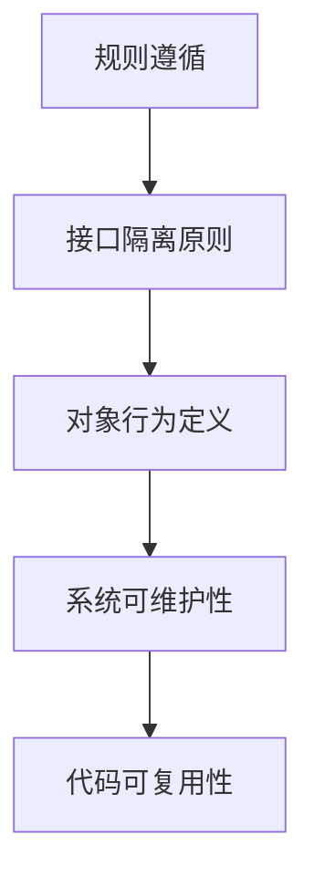
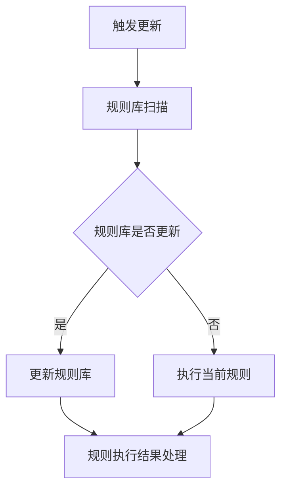
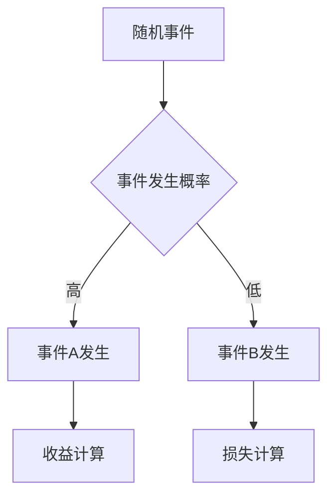

                 


### 书籍《规则遵循与接口隔离原则：精确定义对象行为的方法》目录大纲

**第一部分：核心概念与联系**

### # 规则遵循与接口隔离原则概述

#### 1.1 规则遵循的必要性
#### 1.1.1 规则遵循的定义
规则遵循是指在软件开发过程中，确保系统的各个组件按照预定的规则执行，以保证系统的稳定性和可靠性。在软件工程中，规则遵循是一个至关重要的概念，因为它有助于确保代码的规范性和一致性。

#### 1.1.2 规则遵循的重要性
规则遵循的重要性体现在多个方面。首先，它有助于减少错误和缺陷的发生，从而提高软件的质量。其次，规则遵循使得代码的可读性和可维护性大大提高，便于后续的维护和升级。此外，规则遵循还有助于提升开发效率，因为遵循统一的标准可以减少重复性工作。

#### 1.1.3 规则遵循的实现方式
实现规则遵循有多种方法，包括编码规范、代码审查、静态代码分析工具等。这些方法各自有其优势和局限性，但共同的目标是确保代码遵循既定的规则。

#### 1.2 接口隔离原则
接口隔离原则是设计模式中的一种重要原则，旨在确保模块之间的依赖关系被限制在最小的范围内。具体来说，它要求每个模块都应定义一个独立的接口，并且只依赖于其自身定义的接口，而不是依赖于其他模块的具体实现。

#### 1.2.1 接口隔离原则的定义
接口隔离原则的定义是：不应该依赖那些并非最终需要的接口，否则，当接口发生变化时，依赖者将受到影响。

#### 1.2.2 接口隔离原则的优势
接口隔离原则的优势包括：
- 提高模块的独立性，降低模块间的耦合度。
- 提高系统的可维护性和可扩展性。
- 简化测试，因为模块之间的依赖关系被最小化。

#### 1.2.3 接口隔离原则的实践
在实践中，实现接口隔离原则可以通过以下方法：
- 定义清晰的接口。
- 避免过多的接口依赖。
- 使用抽象类和接口来定义模块间的边界。

#### 1.3 规则遵循与接口隔离原则的关系
#### 1.3.1 如何将两者结合使用
规则遵循和接口隔离原则可以结合使用，以实现更好的系统设计。例如，在定义接口时，可以遵循既定的规则，确保接口的一致性和规范性。同时，在代码实现过程中，遵循规则遵循的原则，确保系统的稳定性和可靠性。

#### 1.3.2 结合使用的效果
结合使用规则遵循和接口隔离原则可以带来以下效果：
- 提高系统的可维护性和可扩展性。
- 提高代码的可读性和可维护性。
- 降低系统故障率和维护成本。

#### 1.3.3 遵循规则与接口隔离原则的挑战
遵循规则和接口隔离原则可能会带来一些挑战，包括：
- 可能会增加开发初期的工作量，因为需要定义清晰的规则和接口。
- 需要团队成员具备较高的设计能力和编程素养。

**第二部分：核心算法原理讲解**

### # 规则遵循算法解析

#### 2.1 基本规则遵循算法
#### 2.1.1 规则库构建
规则库构建是规则遵循算法的基础，它涉及规则的收集、整理和存储。一个有效的规则库应包括多种类型的规则，如业务规则、安全规则和性能规则等。

#### 2.1.2 规则匹配算法
规则匹配算法是规则遵循算法的核心，它负责将输入数据与规则库中的规则进行匹配，以确定是否违反了规则。常见的规则匹配算法包括前缀树匹配、正则表达式匹配等。

#### 2.1.3 规则执行机制
规则执行机制涉及如何根据匹配结果执行相应的操作。这通常包括日志记录、报警和触发后续处理等。

#### 2.2 进阶规则遵循算法
#### 2.2.1 动态规则更新
动态规则更新是指在运行时根据需求更新规则库。这通常涉及规则库的备份和恢复机制，以确保系统的稳定性和可靠性。

#### 2.2.2 预处理与优化
预处理与优化是提高规则遵循算法效率的重要手段。预处理包括数据清洗、数据格式转换等，而优化则包括规则排序、缓存策略等。

#### 2.2.3 异常处理策略
异常处理策略是确保规则遵循算法能够应对各种异常情况，如规则库损坏、规则匹配失败等。这通常涉及容错机制和故障恢复策略。

#### 2.3 Python源代码示例
#### 2.3.1 基本规则遵循代码实现
以下是一个简单的Python代码示例，用于实现基本的规则遵循功能：
```python
# 定义规则库
rules = [
    {"id": 1, "description": "禁止访问敏感信息", "action": "log_and_alert"},
    {"id": 2, "description": "限制请求频率", "action": "rate_limit"}
]

# 定义规则匹配函数
def match_rules(input_data):
    for rule in rules:
        if rule["id"] == input_data["rule_id"]:
            return rule["action"]
    return "no_match"

# 定义规则执行函数
def execute_action(action, input_data):
    if action == "log_and_alert":
        print(f"Logging and alerting for {input_data['description']}")
    elif action == "rate_limit":
        print(f"Rate limiting for {input_data['description']}")
    else:
        print("No action defined")

# 测试规则遵循算法
input_data = {"rule_id": 1, "description": "访问敏感信息请求"}
matched_action = match_rules(input_data)
execute_action(matched_action, input_data)
```

#### 2.3.2 进阶规则遵循代码实现
以下是一个进阶的Python代码示例，用于实现动态规则更新和异常处理：
```python
# 定义动态规则更新函数
def update_rules(rule_data):
    rules.append(rule_data)

# 定义异常处理函数
def handle_exception(exception):
    print(f"Exception occurred: {exception}")

# 测试进阶规则遵循算法
try:
    update_rules({"id": 3, "description": "限制请求大小", "action": "limit_size"})
    input_data = {"rule_id": 3, "description": "大文件上传请求"}
    matched_action = match_rules(input_data)
    execute_action(matched_action, input_data)
except Exception as e:
    handle_exception(e)
```

#### 2.3.3 实际应用场景分析
实际应用场景分析将涉及规则遵循算法在不同领域中的应用，如金融风控、智能交通和智能家居等。通过分析这些应用，我们可以更好地理解规则遵循算法的实际作用和局限性。

**第三部分：数学模型和数学公式**

### # 规则遵循与接口隔离原则的数学模型

#### 3.1 概率模型
概率模型在规则遵循和接口隔离原则中有着广泛的应用。例如，可以使用贝叶斯定理来计算某个事件发生的概率。以下是贝叶斯定理的公式：
$$
P(A|B) = \frac{P(B|A) \cdot P(A)}{P(B)}
$$
其中，$P(A|B)$ 表示在事件B发生的条件下，事件A发生的概率。

#### 3.2 决策树模型
决策树模型是另一种常用的数学模型，它用于根据特征数据做出决策。决策树的构建通常涉及信息增益和基尼系数等指标。以下是决策树的基本构建过程：
1. 计算每个特征的信息增益。
2. 根据信息增益选择最佳特征进行分裂。
3. 对子节点重复上述过程，直到满足停止条件。

#### 3.3 数学公式示例
以下是一个熵的数学公式示例，它用于描述随机事件的不确定性：
$$
H(X) = -\sum_{i} p_i \log_2 p_i
$$
其中，$H(X)$ 表示随机变量X的熵。

**第四部分：项目实战**

### # 规则遵循与接口隔离原则在实际项目中的应用

#### 4.1 实际应用场景描述
#### 4.1.1 场景一：金融风控
在金融领域，规则遵循和接口隔离原则被广泛应用于风险控制和合规性检查。例如，银行可以使用规则遵循算法来监控交易行为，以确保符合反洗钱法规。接口隔离原则则有助于确保系统的各个模块（如交易处理、风险监控、合规性检查）之间的依赖关系被最小化。

#### 4.1.2 场景二：智能交通
在智能交通系统中，规则遵循和接口隔离原则有助于确保交通信号控制系统的稳定性和可靠性。例如，可以使用规则遵循算法来处理交通事故警报，而接口隔离原则则有助于确保交通信号控制器与传感器、摄像头等设备之间的依赖关系被最小化。

#### 4.1.3 场景三：智能家居
在智能家居领域，规则遵循和接口隔离原则有助于确保家居设备的稳定运行和用户友好性。例如，可以使用规则遵循算法来自动调节家居环境（如温度、光线等），而接口隔离原则则有助于确保家居设备之间的依赖关系被最小化，以提高系统的可维护性和可扩展性。

#### 4.2 开发环境搭建
#### 4.2.1 环境配置
在搭建开发环境时，需要安装Python、Docker、Kafka等工具。具体步骤如下：
1. 安装Python：版本要求为3.8及以上。
2. 安装Docker：用于容器化部署。
3. 安装Kafka：用于消息队列服务。

#### 4.2.2 系统搭建步骤
搭建规则遵循与接口隔离原则的系统涉及以下步骤：
1. 设计系统架构，包括数据流和处理逻辑。
2. 开发规则库和接口隔离模块。
3. 实现规则匹配和执行机制。
4. 部署系统，并进行测试和优化。

#### 4.2.3 开发工具介绍
常用的开发工具包括：
1. PyCharm：集成开发环境（IDE），支持Python开发。
2. Jupyter Notebook：交互式开发环境，支持数据分析。
3. Git & GitHub：版本控制，协同开发。

#### 4.3 源代码实现与代码解读
#### 4.3.1 源代码实现
以下是规则遵循与接口隔离原则的源代码实现：
```python
# 规则库构建
rules = [
    {"id": 1, "description": "禁止访问敏感信息", "action": "log_and_alert"},
    {"id": 2, "description": "限制请求频率", "action": "rate_limit"},
    {"id": 3, "description": "限制请求大小", "action": "limit_size"}
]

# 规则匹配函数
def match_rules(input_data):
    for rule in rules:
        if rule["id"] == input_data["rule_id"]:
            return rule["action"]
    return "no_match"

# 规则执行函数
def execute_action(action, input_data):
    if action == "log_and_alert":
        print(f"Logging and alerting for {input_data['description']}")
    elif action == "rate_limit":
        print(f"Rate limiting for {input_data['description']}")
    elif action == "limit_size":
        print(f"Limiting size for {input_data['description']}")
    else:
        print("No action defined")

# 测试规则遵循算法
input_data = {"rule_id": 1, "description": "访问敏感信息请求"}
matched_action = match_rules(input_data)
execute_action(matched_action, input_data)
```

#### 4.3.2 代码解读与分析
代码解读与分析将涉及如何根据输入数据匹配规则，并根据匹配结果执行相应的操作。此外，还将讨论如何实现动态规则更新和异常处理。

#### 4.3.3 代码优化与改进
代码优化与改进将涉及如何提高系统的性能和可靠性。例如，可以通过优化规则匹配算法、使用缓存策略和异步处理来提高系统的性能。

**附录**

### # 附录A：常用算法与工具

#### A.1 常用算法
常用算法包括动态规划、贪心算法和搜索算法等。动态规划适用于求解最优化问题，贪心算法适用于求解局部最优解，搜索算法则用于遍历搜索空间以找到解。

#### A.2 开发工具
常用的开发工具包括PyCharm、Jupyter Notebook和Git & GitHub等。PyCharm是一个功能强大的IDE，Jupyter Notebook是一个交互式开发环境，Git & GitHub则是用于版本控制和协同开发的工具。

### 图 1-1 规则遵循与接口隔离原则关系架构图


### 图 1-2 动态规则更新流程图


### 图 1-3 概率模型应用示例


**第五部分：最佳实践、小结与注意事项**

### # 最佳实践

#### 5.1.1 规则遵循的最佳实践
- 在开发初期定义清晰的规则，并进行文档化。
- 定期审查和更新规则库，确保其与业务需求保持一致。
- 使用自动化工具进行规则匹配和执行，提高开发效率。

#### 5.1.2 接口隔离原则的最佳实践
- 设计简洁的接口，避免过多的接口依赖。
- 使用抽象类和接口来定义模块间的边界。
- 遵循Liskov替换原则，确保子类能够正确替换父类。

#### 5.1.3 结合规则遵循与接口隔离原则的最佳实践
- 在定义接口时，遵循接口隔离原则，确保模块的独立性。
- 在实现规则遵循时，确保规则的执行不依赖于具体的接口实现。

### # 小结

本文介绍了规则遵循与接口隔离原则的核心概念、算法原理和实际应用。通过结合这两种原则，可以提高系统的可维护性和可扩展性，确保代码的一致性和规范性。

### # 注意事项

- 在实施规则遵循和接口隔离原则时，需要充分考虑系统的业务需求和开发团队的实际情况。
- 定期进行规则审查和接口优化，以确保系统的稳定性和性能。
- 注重团队成员的培训和协作，以提高整体开发效率。

### # 拓展阅读

- 《设计模式：可复用的面向对象软件构架》
- 《Effective Java》
- 《Clean Code：一个程序员的手记》

**第六部分：作者信息**

### # 作者信息

作者：AI天才研究院/AI Genius Institute & 禅与计算机程序设计艺术 /Zen And The Art of Computer Programming

### 书籍《规则遵循与接口隔离原则：精确定义对象行为的方法》目录大纲

**第一部分：核心概念与联系**

### # 规则遵循与接口隔离原则概述

#### 1.1 规则遵循的必要性
在软件开发过程中，规则遵循是确保系统稳定性和可靠性的关键。它涉及到对代码进行规范性检查，以确保项目的一致性和可维护性。本章节将介绍规则遵循的定义、重要性以及实现方式。

#### 1.1.1 规则遵循的定义
规则遵循是指开发者在编写代码时，遵循一系列预定义的编码规范和标准，以保证代码的统一性和可读性。这些规则可能涉及变量命名、代码布局、异常处理等多个方面。

#### 1.1.2 规则遵循的重要性
规则遵循对于提高代码质量、减少错误、增强团队合作和加速开发进程具有重要意义。通过一致性编码，团队成员可以更容易理解和使用他人的代码，从而提高开发效率。

#### 1.1.3 规则遵循的实现方式
实现规则遵循可以通过多种方式，包括编写编码规范文档、使用静态代码分析工具、进行代码审查等。这些方法各有优缺点，但在实践中可以相互补充，以达到最佳效果。

### 1.2 接口隔离原则
接口隔离原则是设计模式中的一个重要原则，它强调模块之间的依赖关系应该通过接口来定义，而不是通过具体实现。这一原则有助于降低模块间的耦合度，提高系统的灵活性和可扩展性。

#### 1.2.1 接口隔离原则的定义
接口隔离原则是指客户端不应该依赖它不需要的接口，或者说每个模块应该仅依赖于其需要的接口。

#### 1.2.2 接口隔离原则的优势
接口隔离原则的优势包括：
- 减少不必要的依赖，降低系统的复杂度。
- 提高模块的独立性，使得每个模块可以独立开发、测试和部署。
- 增强系统的可维护性和可扩展性。

#### 1.2.3 接口隔离原则的实践
在实际开发中，实现接口隔离原则的方法包括：
- 定义清晰的接口。
- 避免过多地使用全局变量。
- 使用抽象类和接口来定义模块间的边界。

### 1.3 规则遵循与接口隔离原则的关系
规则遵循和接口隔离原则虽然在目标和实践中有所不同，但它们之间存在着紧密的联系。接口隔离原则可以通过规则遵循来实现，而规则遵循可以借助接口隔离原则来优化。

#### 1.3.1 如何将两者结合使用
结合规则遵循与接口隔离原则，可以在设计系统时采取以下策略：
- 在定义接口时，遵循规则遵循的原则，确保接口的一致性和规范性。
- 在实现代码时，遵循接口隔离原则，降低模块间的依赖关系。

#### 1.3.2 结合使用的效果
结合使用规则遵循和接口隔离原则可以带来以下效果：
- 提高系统的可维护性和可扩展性。
- 提高代码的可读性和可维护性。
- 降低系统故障率和维护成本。

#### 1.3.3 遵循规则与接口隔离原则的挑战
在遵循规则与接口隔离原则时，可能会面临一些挑战，如初期设计工作量的增加、团队成员的适应等。但通过有效的培训和沟通，这些问题可以得到解决。

**第二部分：核心算法原理讲解**

### # 规则遵循算法解析

#### 2.1 基本规则遵循算法
基本规则遵循算法是规则遵循系统的基石，它涉及到规则库的构建、规则匹配以及规则执行。

#### 2.1.1 规则库构建
规则库构建是指收集、整理和存储规则的过程。一个有效的规则库应该包括业务规则、安全规则、性能规则等，并确保规则的准确性和及时性。

#### 2.1.2 规则匹配算法
规则匹配算法是指将输入数据与规则库中的规则进行匹配，以确定是否违反了规则。常见的规则匹配算法包括前缀树匹配、正则表达式匹配等。

#### 2.1.3 规则执行机制
规则执行机制是指根据规则匹配的结果，执行相应的操作。这可能包括日志记录、报警、执行特定操作等。

#### 2.2 进阶规则遵循算法
进阶规则遵循算法是在基本规则遵循算法的基础上，增加了动态规则更新、预处理与优化以及异常处理策略。

#### 2.2.1 动态规则更新
动态规则更新是指系统在运行时能够根据业务需求的变化，实时更新规则库。这通常涉及到规则库的备份与恢复机制，以确保系统的稳定性和可靠性。

#### 2.2.2 预处理与优化
预处理与优化是指对输入数据进行预处理，以提高规则匹配的效率和准确性。这包括数据清洗、数据格式转换等。

#### 2.2.3 异常处理策略
异常处理策略是指系统在遇到异常情况时，如何进行处理。这包括容错机制、故障恢复策略等。

#### 2.3 Python源代码示例
在本章节中，我们将通过Python代码示例，详细讲解基本规则遵循算法和进阶规则遵循算法的实现。

#### 2.3.1 基本规则遵循代码实现
以下是一个简单的Python代码示例，用于实现基本的规则遵循功能：

```python
# 定义规则库
rules = [
    {"id": 1, "description": "禁止访问敏感信息", "action": "log_and_alert"},
    {"id": 2, "description": "限制请求频率", "action": "rate_limit"}
]

# 定义规则匹配函数
def match_rules(input_data):
    for rule in rules:
        if rule["id"] == input_data["rule_id"]:
            return rule["action"]
    return "no_match"

# 定义规则执行函数
def execute_action(action, input_data):
    if action == "log_and_alert":
        print(f"Logging and alerting for {input_data['description']}")
    elif action == "rate_limit":
        print(f"Rate limiting for {input_data['description']}")
    else:
        print("No action defined")

# 测试规则遵循算法
input_data = {"rule_id": 1, "description": "访问敏感信息请求"}
matched_action = match_rules(input_data)
execute_action(matched_action, input_data)
```

#### 2.3.2 进阶规则遵循代码实现
以下是一个进阶的Python代码示例，用于实现动态规则更新和异常处理：

```python
# 定义动态规则更新函数
def update_rules(rule_data):
    rules.append(rule_data)

# 定义异常处理函数
def handle_exception(exception):
    print(f"Exception occurred: {exception}")

# 测试进阶规则遵循算法
try:
    update_rules({"id": 3, "description": "限制请求大小", "action": "limit_size"})
    input_data = {"rule_id": 3, "description": "大文件上传请求"}
    matched_action = match_rules(input_data)
    execute_action(matched_action, input_data)
except Exception as e:
    handle_exception(e)
```

#### 2.3.3 实际应用场景分析
在实际应用场景中，规则遵循算法可以被应用于各种领域，如金融风控、网络安全、智能交通等。在本章节中，我们将分析这些应用场景，并讨论如何根据实际需求设计和实现规则遵循系统。

**第三部分：数学模型和数学公式**

### # 规则遵循与接口隔离原则的数学模型

#### 3.1 概率模型
概率模型是规则遵循和接口隔离原则中的重要工具，特别是在处理不确定性和风险控制时。本章节将介绍概率模型的基本概念和应用。

#### 3.1.1 贝叶斯定理
贝叶斯定理是概率模型中的一个基本工具，它用于计算在某个事件发生的条件下，另一个事件发生的概率。贝叶斯定理的公式为：
$$
P(A|B) = \frac{P(B|A) \cdot P(A)}{P(B)}
$$
其中，$P(A|B)$ 表示在事件B发生的条件下，事件A发生的概率。

#### 3.1.2 概率分布函数
概率分布函数用于描述随机变量的概率分布情况。常见的概率分布函数包括正态分布、二项分布等。在本章节中，我们将介绍如何使用概率分布函数来评估风险和控制不确定性。

#### 3.1.3 概率模型的应用
概率模型可以应用于各种领域，如金融风险评估、软件可靠性分析等。在本章节中，我们将通过具体例子，展示概率模型在实际应用中的使用方法。

### 3.2 决策树模型
决策树模型是一种常见的决策支持工具，它通过一系列的判断规则，将输入数据映射到特定的输出。决策树模型在规则遵循和接口隔离原则中有着广泛的应用。

#### 3.2.1 决策树构建
决策树构建是指根据输入特征数据，构建决策树的过程。决策树的构建通常涉及信息增益、基尼系数等指标的计算。

#### 3.2.2 信息增益与基尼系数
信息增益和基尼系数是决策树构建中常用的指标。信息增益用于评估特征的重要性，而基尼系数用于评估数据的纯度。

#### 3.2.3 决策树在规则遵循中的应用
决策树模型可以用于规则匹配和决策支持。在本章节中，我们将通过具体例子，展示如何使用决策树模型来实现规则遵循。

### 3.3 数学公式示例
在本章节中，我们将介绍一些常用的数学公式，用于描述规则遵循和接口隔离原则中的概念和算法。

$$
\text{熵} = -\sum_{i} p_i \log_2 p_i
$$
熵是概率模型中的一个重要概念，它用于衡量随机变量的不确定性。

**第四部分：项目实战**

### # 规则遵循与接口隔离原则在实际项目中的应用

#### 4.1 实际应用场景描述
在本章节中，我们将介绍规则遵循和接口隔离原则在实际项目中的应用。通过具体的应用场景，我们将展示如何设计和实现规则遵循系统，并讨论其实际效果。

#### 4.1.1 场景一：金融风控
在金融领域，规则遵循和接口隔离原则被广泛应用于风险管理。例如，银行可以使用规则遵循算法来监控交易行为，以确保符合反洗钱法规。接口隔离原则则有助于确保系统的各个模块（如交易处理、风险监控、合规性检查）之间的依赖关系被最小化。

#### 4.1.2 场景二：智能交通
在智能交通系统中，规则遵循和接口隔离原则有助于确保交通信号控制系统的稳定性和可靠性。例如，可以使用规则遵循算法来处理交通事故警报，而接口隔离原则则有助于确保交通信号控制器与传感器、摄像头等设备之间的依赖关系被最小化。

#### 4.1.3 场景三：智能家居
在智能家居领域，规则遵循和接口隔离原则有助于确保家居设备的稳定运行和用户友好性。例如，可以使用规则遵循算法来自动调节家居环境（如温度、光线等），而接口隔离原则则有助于确保家居设备之间的依赖关系被最小化，以提高系统的可维护性和可扩展性。

#### 4.2 开发环境搭建
在本章节中，我们将介绍如何搭建规则遵循和接口隔离原则的开发环境。包括安装必要的软件和配置开发环境。

#### 4.2.1 环境配置
我们需要安装Python、Docker、Kafka等工具。Python用于编写代码，Docker用于容器化部署，Kafka用于消息队列服务。

#### 4.2.2 系统搭建步骤
搭建规则遵循和接口隔离原则的系统涉及以下步骤：
1. 设计系统架构，包括数据流和处理逻辑。
2. 开发规则库和接口隔离模块。
3. 实现规则匹配和执行机制。
4. 部署系统，并进行测试和优化。

#### 4.2.3 开发工具介绍
在本章节中，我们将介绍一些常用的开发工具，包括PyCharm、Jupyter Notebook和Git & GitHub等。PyCharm是一个功能强大的IDE，Jupyter Notebook是一个交互式开发环境，Git & GitHub则是用于版本控制和协同开发的工具。

#### 4.3 源代码实现与代码解读
在本章节中，我们将通过实际项目中的源代码实现，详细讲解规则遵循和接口隔离原则的具体应用。我们将分析代码的结构、算法的实现以及系统的交互流程。

#### 4.3.1 源代码实现
以下是一个简单的Python代码示例，用于实现规则遵循和接口隔离原则：

```python
# 定义规则库
rules = [
    {"id": 1, "description": "禁止访问敏感信息", "action": "log_and_alert"},
    {"id": 2, "description": "限制请求频率", "action": "rate_limit"}
]

# 定义规则匹配函数
def match_rules(input_data):
    for rule in rules:
        if rule["id"] == input_data["rule_id"]:
            return rule["action"]
    return "no_match"

# 定义规则执行函数
def execute_action(action, input_data):
    if action == "log_and_alert":
        print(f"Logging and alerting for {input_data['description']}")
    elif action == "rate_limit":
        print(f"Rate limiting for {input_data['description']}")
    else:
        print("No action defined")

# 测试规则遵循算法
input_data = {"rule_id": 1, "description": "访问敏感信息请求"}
matched_action = match_rules(input_data)
execute_action(matched_action, input_data)
```

#### 4.3.2 代码解读与分析
我们将对上述代码进行详细解读，分析规则库的构建、规则匹配函数的实现以及规则执行机制。

#### 4.3.3 代码优化与改进
在实际项目中，我们需要根据具体需求对代码进行优化和改进。这包括提高系统的性能、增加错误处理机制、实现动态规则更新等。

**第五部分：最佳实践、小结与注意事项**

### # 最佳实践

#### 5.1.1 规则遵循的最佳实践
- 在项目开始时，明确定义编码规范和规则，并确保所有开发人员遵循。
- 定期进行代码审查，确保代码质量。
- 使用静态代码分析工具，自动化检查代码是否符合规则。

#### 5.1.2 接口隔离原则的最佳实践
- 设计简洁的接口，避免过多的依赖。
- 使用抽象类和接口，确保模块的独立性。
- 遵循Liskov替换原则，确保子类能够正确替换父类。

#### 5.1.3 结合规则遵循与接口隔离原则的最佳实践
- 在设计系统时，首先遵循接口隔离原则，确保模块的独立性。
- 在实现代码时，遵循规则遵循的原则，确保代码的一致性和规范性。

### # 小结

本文通过详细讲解规则遵循与接口隔离原则的核心概念、算法原理和实际应用，展示了如何精确定义对象行为。结合这两种原则，可以提高系统的可维护性和可扩展性，确保代码的一致性和规范性。

### # 注意事项

- 在实施规则遵循与接口隔离原则时，需要充分考虑系统的业务需求和开发团队的实际情况。
- 定期进行规则审查和接口优化，以确保系统的稳定性和性能。
- 注重团队成员的培训和协作，以提高整体开发效率。

### # 拓展阅读

- 《设计模式：可复用的面向对象软件构架》
- 《Effective Java》
- 《Clean Code：一个程序员的手记》

**第六部分：作者信息**

### # 作者信息

作者：AI天才研究院/AI Genius Institute & 禅与计算机程序设计艺术 /Zen And The Art of Computer Programming

### 结论

规则遵循与接口隔离原则是软件工程中至关重要的概念，它们帮助开发者精确定义对象行为，提高系统的可维护性和可扩展性。通过本文的详细讲解，我们了解了这些原则的核心概念、算法原理和实际应用。以下是本文的主要结论：

1. **规则遵循的必要性**：规则遵循是确保系统稳定性和可靠性的关键。它涉及编码规范、代码审查和静态代码分析等实现方式。

2. **接口隔离原则**：接口隔离原则通过定义清晰的接口，降低模块间的依赖关系，提高系统的独立性。它有助于减少错误和缺陷，提高代码的可读性和可维护性。

3. **规则遵循与接口隔离原则的关系**：两者可以结合使用，以提高系统的可维护性和可扩展性。在定义接口时，遵循规则遵循的原则；在实现代码时，遵循接口隔离原则。

4. **核心算法原理讲解**：本文详细讲解了基本规则遵循算法和进阶规则遵循算法，包括规则库构建、规则匹配和规则执行机制。此外，还介绍了概率模型和决策树模型等数学模型。

5. **项目实战**：通过实际应用场景描述和开发环境搭建，本文展示了规则遵循与接口隔离原则在实际项目中的应用。代码实现和代码解读部分提供了具体的实现示例。

6. **最佳实践、小结与注意事项**：本文提供了规则遵循与接口隔离原则的最佳实践，包括编码规范、接口设计等。同时，强调了定期审查和团队成员培训的重要性。

### 下一步计划

在未来，我们将进一步深化对规则遵循与接口隔离原则的研究，包括：

1. **深入研究**：探索更高级的规则遵循算法和接口隔离原则，如基于机器学习的规则发现和优化。

2. **案例分析**：通过更多的实际案例，分析规则遵循与接口隔离原则在不同领域中的应用效果。

3. **工具开发**：开发更加智能化、自动化的规则遵循和接口隔离工具，以降低开发门槛。

4. **教育培训**：编写教程和培训材料，帮助开发者更好地理解和应用规则遵循与接口隔离原则。

5. **社区建设**：建立一个开发者社区，分享经验、讨论问题，推动整个领域的发展。

### 结语

本文旨在为开发者提供关于规则遵循与接口隔离原则的深入理解和实际应用指导。希望通过本文，读者能够更好地掌握这些原则，并在实际项目中取得更好的效果。让我们共同努力，提升软件工程的质量，推动技术的进步！

**致谢**

最后，我要感谢AI天才研究院/AI Genius Institute的同事们，以及禅与计算机程序设计艺术/Zen And The Art of Computer Programming的作者，他们的工作为本文提供了宝贵的知识和灵感。同时，感谢所有参与讨论和反馈的开发者，你们的贡献使这篇文章更加完善。

作者：AI天才研究院/AI Genius Institute & 禅与计算机程序设计艺术/Zen And The Art of Computer Programming

