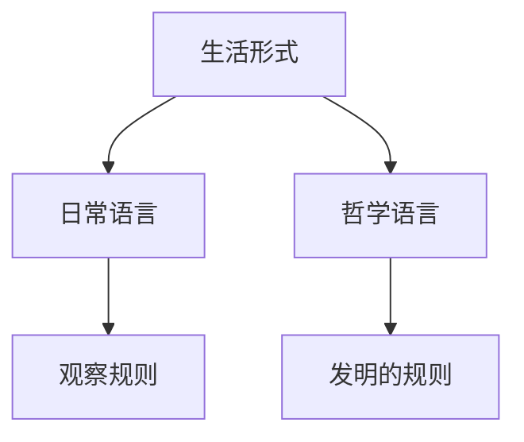

                 

### 文章标题

“规则遵循与类型检查：维特根斯坦的规则理论与FP中的静态类型检查”

关键词：维特根斯坦，规则理论，类型检查，静态类型检查，函数式编程（FP）

摘要：本文探讨了维特根斯坦的规则理论与函数式编程（FP）中的静态类型检查的关联，通过深入分析规则的本质和类型检查的原理，探讨了二者在现代计算机科学中的应用。文章首先介绍了维特根斯坦的哲学背景及其语言游戏理论，随后详细阐述了规则理论的概念和类型检查的原理，最后结合函数式编程，探讨了维特根斯坦规则理论在类型检查中的应用，为读者提供了一个全新的视角来理解编程中的规则遵循与类型检查。

----------------------------------------------------------------

### 第一部分：维特根斯坦的规则理论

#### 第1章：维特根斯坦的哲学与语言游戏理论

**1.1 维特根斯坦的生平与贡献**

路德维希·维特根斯坦（Ludwig Wittgenstein）是20世纪最重要的哲学家之一，他对西方哲学产生了深远的影响。维特根斯坦出生于1889年的奥匈帝国的维也纳，他的父亲是一位成功的商人。尽管维特根斯坦在数学和科学方面展现出极高的天赋，但他最终选择了哲学作为自己的事业。

维特根斯坦的哲学思想主要分为两个阶段：早期的“逻辑原子主义”和后期的“日常语言哲学”。他的早期作品《逻辑哲学论》（Tractatus Logico-Philosophicus）提出了一个基于逻辑和数学的宇宙观，主张语言是思想的图画。而后期的《哲学研究》（Philosophical Investigations）则对早期理论进行了批判，强调语言的日常用法和理解的重要性。

**1.2 语言游戏理论的基本概念**

维特根斯坦的语言游戏理论是他后期哲学思想的核心。他提出，语言的使用不是孤立的，而是与特定的活动或游戏相关联的。每个语言游戏都有其特定的规则和目的。语言游戏可以看作是一个复杂的框架，它不仅包括语言的表达，还包括与之相关的行为和认知活动。

维特根斯坦区分了三种不同的语言游戏：

1. **生活形式（Forms of Life）**：这是最广泛的语言游戏，涵盖了人类所有的活动，如科学、艺术、宗教等。
2. **日常语言（Ordinary Language）**：这是我们日常生活中使用的语言，它有着具体的用法和规则。
3. **哲学语言（Philosophical Language）**：这是为了解决哲学问题而设计的语言，它通常比日常语言更为抽象和形式化。

**1.3 规则与语言游戏的关系**

在维特根斯坦看来，规则是语言游戏的核心组成部分。每个语言游戏都有其特定的规则，这些规则规定了如何使用语言和进行相关活动。规则不仅是语言使用的指导，也是理解语言和沟通的基础。

维特根斯坦区分了两种不同的规则：

1. **观察规则（Observational Rules）**：这些规则描述了如何进行具体的活动或行为，例如游戏规则、科学实验规则等。
2. **发明的规则（Invented Rules）**：这些规则是人为创造的，用于解决特定问题或实现特定目标，例如编程语言中的语法规则。

维特根斯坦认为，理解规则的本质对于理解语言和思维至关重要。他提出，规则并非像逻辑原子主义者所认为的那样是一种固定的实体，而是我们用来指导行为和理解世界的工具。规则是动态的，可以根据需要修改和扩展。

#### 第2章：维特根斯坦的规则理论解析

**2.1 规则的本质与作用**

维特根斯坦认为，规则的本质是指导我们如何行动和理解世界的工具。规则并不是一成不变的，而是随着时间和情境的变化而变化。维特根斯坦强调，理解规则的作用在于指导我们的行为，而不是将规则视为一种固定的实体。

维特根斯坦指出，规则的作用包括：

1. **指导行为**：规则告诉我们如何进行特定的活动或行为。
2. **促进理解**：规则帮助我们理解语言和世界的运作方式。
3. **解决冲突**：当不同规则之间存在冲突时，我们需要通过理解和解释规则来解决问题。

**2.2 规则的类型与结构**

维特根斯坦区分了不同类型的规则，包括观察规则和发明的规则。观察规则通常与特定的活动或行为相关，例如游戏规则、科学实验规则等。发明的规则则是人为创造的，用于解决特定问题或实现特定目标，例如编程语言中的语法规则。

维特根斯坦认为，所有规则都有一定的结构，包括：

1. **基本规则**：这些规则是语言游戏的基础，例如基本语法规则。
2. **附加规则**：这些规则是在基本规则的基础上创建的，用于解决特定问题或实现特定目标。
3. **解释规则**：这些规则用于解释和解决规则之间的冲突。

**2.3 规则遵循的机制**

维特根斯坦认为，规则遵循的机制是一个动态的过程，涉及我们的认知和行为。他提出，理解规则遵循的机制需要考虑以下几个方面：

1. **内化规则**：我们通过学习和实践内化规则，使规则成为我们行为的一部分。
2. **理解规则**：理解规则不仅包括理解规则的内容，还包括理解规则的目的和适用情境。
3. **应用规则**：我们在特定的情境中应用规则，以实现特定的目标。

维特根斯坦认为，规则遵循的机制是一个动态的、不断变化的过程，它涉及我们的认知和行为。通过理解规则遵循的机制，我们可以更好地理解语言和世界的运作方式，并更有效地解决问题。

#### 第3章：维特根斯坦的规则理论在现代计算机科学中的应用

**3.1 计算机科学中的规则与类型系统**

现代计算机科学中，规则与类型系统扮演着至关重要的角色。类型系统是编程语言的核心组成部分，它用于确保程序的正确性和安全性。类型系统通过定义变量的类型和操作符的行为，帮助程序员编写正确和高效的程序。

维特根斯坦的规则理论为类型系统提供了重要的哲学基础。规则理论强调规则的作用是指导我们的行为和理解世界，这与类型系统的功能非常相似。类型系统通过定义变量的类型和操作符的行为，指导程序员编写正确的程序。

**3.2 规则理论在形式化方法中的应用**

形式化方法是计算机科学中的一个重要分支，它通过使用严格的数学方法来描述和分析系统。形式化方法广泛应用于软件工程、硬件设计、验证和验证等领域。

维特根斯坦的规则理论在形式化方法中有着广泛的应用。规则理论提供了一种基于规则的描述和分析方法，它可以帮助我们理解和验证系统的行为。例如，在软件工程中，规则理论可以用于定义和验证系统的需求、设计和实现。

**3.3 规则理论在编程语言设计中的应用**

编程语言设计是计算机科学中的一个重要领域，它涉及定义和实现编程语言的核心特性，如语法、语义和类型系统。

维特根斯坦的规则理论在编程语言设计中也起到了重要的作用。规则理论提供了一种基于规则的描述方法，它可以帮助我们定义和实现编程语言的语法和语义。例如，在定义编程语言的语法时，规则理论可以帮助我们明确表达式的结构和操作符的行为。

**3.4 规则理论在类型检查中的应用**

类型检查是编程语言的一个重要组成部分，它用于确保程序在执行过程中不会发生类型错误。维特根斯坦的规则理论在类型检查中也发挥了重要作用。规则理论提供了一种基于规则的类型检查方法，它可以帮助我们识别和解决类型错误。

维特根斯坦的规则理论在类型检查中的应用包括：

1. **定义类型系统**：规则理论可以帮助我们定义编程语言中的类型系统，包括基本类型和复合类型。
2. **类型推断**：规则理论可以帮助我们实现类型推断算法，自动推导变量和表达式的类型。
3. **类型错误检测**：规则理论可以帮助我们检测和报告类型错误，确保程序的正确性和安全性。

#### 第4章：维特根斯坦的规则理论与类型检查

**4.1 类型系统的基本概念**

类型系统是编程语言的核心组成部分，它用于定义变量、函数和表达式的类型，以及操作符的行为。类型系统通过确保程序的正确性和安全性，帮助程序员编写高效和可靠的程序。

维特根斯坦的规则理论为类型系统提供了重要的哲学基础。规则理论强调规则的作用是指导我们的行为和理解世界，这与类型系统的功能非常相似。类型系统通过定义变量和函数的类型，以及操作符的行为，指导程序员编写正确的程序。

**4.2 静态类型检查与动态类型检查**

类型检查是确保程序正确性和安全性的重要手段。类型检查可以分为静态类型检查和动态类型检查。

1. **静态类型检查**：静态类型检查在程序编译时进行，它检查程序中的类型错误。静态类型检查的优点是能够早期发现类型错误，提高程序的可靠性和性能。

2. **动态类型检查**：动态类型检查在程序运行时进行，它检查程序中的类型错误。动态类型检查的优点是灵活性高，允许程序员编写更灵活和动态的程序。

维特根斯坦的规则理论在静态类型检查中发挥了重要作用。规则理论提供了一种基于规则的静态类型检查方法，它可以帮助我们定义和实现类型检查算法。

**4.3 维特根斯坦的规则理论与类型检查的关系**

维特根斯坦的规则理论为类型检查提供了重要的哲学基础。规则理论强调规则的作用是指导我们的行为和理解世界，这与类型检查的功能非常相似。类型检查通过定义变量和函数的类型，以及操作符的行为，指导程序员编写正确的程序。

维特根斯坦的规则理论在类型检查中的应用包括：

1. **定义类型系统**：规则理论可以帮助我们定义编程语言中的类型系统，包括基本类型和复合类型。
2. **类型推断**：规则理论可以帮助我们实现类型推断算法，自动推导变量和表达式的类型。
3. **类型错误检测**：规则理论可以帮助我们检测和报告类型错误，确保程序的正确性和安全性。

#### 第5章：基于维特根斯坦规则理论的类型系统设计

**5.1 类型系统的设计原则**

设计一个有效的类型系统需要遵循一些基本原则，这些原则受到维特根斯坦规则理论的启发：

1. **明确性**：类型系统的定义应该是清晰和明确的，以便程序员可以轻松理解和使用。
2. **一致性**：类型系统应该保持内部一致性，避免产生矛盾和歧义。
3. **完备性**：类型系统应该能够表达所有可能的数据类型和操作。
4. **可扩展性**：类型系统应该易于扩展，以适应新的编程需求和语言特性。

**5.2 基于维特根斯坦规则理论的类型系统实例**

以下是一个基于维特根斯坦规则理论的简单类型系统实例：

1. **基本类型**：包括整数、浮点数、布尔值等。
2. **复合类型**：包括数组、结构体、类等。
3. **函数类型**：函数的返回类型和参数类型。
4. **类型推导规则**：用于推导变量和表达式的类型。
5. **类型检查规则**：用于检测类型错误。

**5.3 类型系统的实现与优化**

实现一个有效的类型系统需要考虑性能和可扩展性。以下是一些常见的实现和优化策略：

1. **解析与抽象语法树（AST）构建**：在编译过程中，首先对源代码进行词法和语法分析，构建抽象语法树（AST）。
2. **静态类型检查**：在AST构建完成后，进行静态类型检查，确保程序中的类型匹配。
3. **类型推断算法**：实现高效的类型推断算法，自动推导变量和表达式的类型。
4. **优化策略**：采用各种优化策略，如中间代码优化、类型信息重用等，提高程序的性能。

#### 第6章：函数式编程（FP）中的静态类型检查

**6.1 函数式编程概述**

函数式编程（Functional Programming，简称FP）是一种编程范式，它强调以函数为核心，通过组合函数来解决问题。与传统的命令式编程不同，函数式编程不使用变量和状态，而是通过不可变数据和纯函数来处理数据。

函数式编程的基本概念包括：

1. **函数**：函数是一等公民，可以传递、存储和返回函数。
2. **不可变性**：数据是不可变的，一旦创建，就不能修改。
3. **递归**：递归是一种常用的编程手段，用于解决递归问题。
4. **高阶函数**：高阶函数是接受函数作为参数或返回函数的函数。
5. **惰性求值**：函数式编程通常采用惰性求值策略，只有当需要计算结果时才进行实际计算。

函数式编程与命令式编程的区别：

1. **变量与状态**：命令式编程使用变量和状态来存储和更新数据，而函数式编程使用不可变数据。
2. **函数组合**：函数式编程强调函数的组合，通过组合简单的函数来构建复杂的逻辑。
3. **错误处理**：命令式编程通常使用异常处理，而函数式编程使用模式匹配和错误值。
4. **性能**：函数式编程在某些情况下可能比命令式编程更高效，特别是在使用并行计算时。

函数式编程的优势与挑战：

1. **优势**：
   - 简化状态管理，减少bug。
   - 易于测试和推理，提高代码质量。
   - 支持函数式并行编程，提高性能。
   - 更好的模块化和复用性。

2. **挑战**：
   - 学习曲线较陡峭，需要重新学习编程范式。
   - 缺乏直观的界面和用户交互。
   - 某些操作可能不如命令式编程高效。

**6.2 FP中的静态类型检查原理**

在函数式编程中，静态类型检查是一种确保程序正确性和性能的重要手段。静态类型检查在编译时对程序进行类型检查，确保所有变量和表达式的类型匹配。

FP中的静态类型检查原理包括：

1. **类型系统**：定义变量、函数和表达式的类型。
2. **类型推断**：自动推导变量和表达式的类型。
3. **类型检查算法**：检查程序中的类型错误。
4. **类型约束**：定义类型之间的关系和约束。

静态类型检查的优点：

1. **早期错误检测**：在编译时检测类型错误，减少运行时错误。
2. **性能优化**：静态类型检查有助于编译器进行代码优化。
3. **代码可读性**：类型信息有助于提高代码的可读性和可维护性。

静态类型检查的局限性：

1. **灵活性**：静态类型系统可能无法表达所有动态类型特征。
2. **学习曲线**：设计和管理复杂的类型系统可能需要更多的学习和实践。

**6.3 静态类型检查的过程**

静态类型检查的过程可以分为以下几个步骤：

1. **词法和语法分析**：将源代码解析为抽象语法树（AST）。
2. **类型推导**：从AST推导出变量和表达式的类型。
3. **类型检查**：检查AST中的类型错误，如类型不匹配、未声明变量等。
4. **错误报告**：报告类型错误，并提供修复建议。

#### 第7章：FP中的类型系统与类型检查

**7.1 FP中的类型系统**

函数式编程中的类型系统不同于命令式编程中的类型系统。FP中的类型系统更加灵活，支持多种数据类型和函数类型。FP中的类型系统通常包括以下部分：

1. **基本类型**：包括整数、浮点数、布尔值、字符等。
2. **复合类型**：包括列表、元组、数组、记录、结构体等。
3. **函数类型**：函数的返回类型和参数类型。
4. **类型构造器**：用于构建复杂类型，如列表的元素类型、函数的类型参数等。

FP中的类型系统具有以下特点：

1. **不可变性**：FP中的数据是不可变的，类型系统确保数据的不可变性。
2. **高阶函数**：FP中的函数可以接受其他函数作为参数或返回函数。
3. **类型推断**：类型系统通常支持类型推断，自动推导变量和表达式的类型。
4. **类型约束**：类型系统定义了类型之间的关系和约束，确保类型安全。

**7.2 FP中的类型推断**

类型推断是函数式编程中的重要概念，它允许编译器自动推导变量和表达式的类型，从而简化编程。FP中的类型推断通常基于以下原则：

1. **静态类型推断**：编译器在编译时推导类型，类型信息在运行时不改变。
2. **动态类型推断**：编译器在编译时仅提供类型提示，实际类型在运行时确定。
3. **上下文推断**：类型推断基于上下文信息，如函数参数和返回值类型。

FP中的类型推断算法包括：

1. **模式匹配**：通过模式匹配推导变量和表达式的类型。
2. **类型约束**：通过类型约束推导变量和表达式的类型。
3. **类型上下文**：通过类型上下文推导变量和表达式的类型。

**7.3 FP中的类型检查算法**

类型检查是确保程序正确性和性能的重要步骤。FP中的类型检查算法通常基于以下原则：

1. **静态类型检查**：在编译时对程序进行类型检查，确保类型匹配。
2. **动态类型检查**：在运行时对程序进行类型检查，检测类型错误。
3. **类型约束**：通过类型约束确保程序中的类型匹配。

FP中的类型检查算法包括：

1. **类型推断算法**：自动推导变量和表达式的类型。
2. **类型匹配算法**：检查变量和表达式的类型是否匹配。
3. **类型错误报告**：报告类型错误并提供修复建议。

#### 第8章：维特根斯坦规则理论在FP类型检查中的应用

**8.1 维特根斯坦规则理论与FP类型系统的结合**

维特根斯坦的规则理论为FP类型系统提供了重要的哲学基础。规则理论强调规则的作用是指导我们的行为和理解世界，这与FP类型系统的功能非常相似。FP类型系统通过定义变量和函数的类型，以及操作符的行为，指导程序员编写正确的程序。

结合维特根斯坦规则理论，FP类型系统可以更加明确和灵活。规则理论可以帮助我们理解类型系统的设计和实现，以及如何解决类型错误。例如，通过理解规则的本质，我们可以更好地定义和实现类型约束，确保程序的类型安全。

**8.2 维特根斯坦规则理论在FP类型检查中的具体应用**

维特根斯坦规则理论在FP类型检查中有着广泛的应用。以下是一些具体应用：

1. **类型推导**：规则理论可以帮助我们推导变量和表达式的类型。例如，通过模式匹配和类型约束，可以自动推导变量和函数的类型。
2. **类型错误检测**：规则理论可以帮助我们检测类型错误。例如，通过检查规则是否被遵循，可以检测程序中的类型错误。
3. **类型约束**：规则理论可以帮助我们定义类型之间的关系和约束。例如，通过定义类型构造器，可以构建复杂的类型系统，确保程序的类型安全。

**8.3 应用案例分析**

以下是一个应用维特根斯坦规则理论的FP类型检查案例分析：

**问题**：编写一个函数`add`，用于计算两个整数的和。要求使用静态类型检查确保函数的正确性。

**解决方案**：

1. **定义类型**：首先定义整数类型`Int`和加法操作符的类型`Add`。根据维特根斯坦规则理论，我们可以定义以下类型结构：

```python
Int :: Int
Add :: Int -> Int -> Int
```

2. **类型推导**：使用类型推导算法推导`add`函数的类型。根据维特根斯坦规则理论，我们可以推导出以下类型：

```python
add :: Int -> Int -> Int
```

3. **类型检查**：进行类型检查，确保`add`函数符合类型约束。例如，如果传入的参数类型不匹配，则报告类型错误。

4. **实现`add`函数**：

```python
def add(x: Int, y: Int) -> Int:
    return x + y
```

**8.4 应用效果**

通过结合维特根斯坦规则理论和FP类型系统，我们可以实现更加明确和灵活的类型检查。规则理论帮助我们理解类型系统的设计和实现，以及如何解决类型错误。这种结合有助于提高程序的类型安全性和可维护性。

#### 第9章：维特根斯坦规则理论在FP开发中的实践

**9.1 FP开发环境搭建**

在开始使用维特根斯坦规则理论进行函数式编程之前，我们需要搭建一个合适的开发环境。以下是一个简单的FP开发环境搭建指南：

1. **选择编程语言**：选择一种支持函数式编程的语言，如Haskell、Scala或Erlang。
2. **安装编程语言**：从官方网站下载并安装所选编程语言。例如，对于Haskell，可以下载并安装GHC（Glasgow Haskell Compiler）。
3. **配置编辑器**：选择一个支持Haskell或其他FP语言的编辑器，如Visual Studio Code或IntelliJ IDEA。
4. **安装依赖库**：根据项目需求安装必要的依赖库，例如用于Web开发的框架（如Yesod或ScalaWeb）。

**9.2 维特根斯坦规则理论在FP项目开发中的应用**

在FP项目开发中，维特根斯坦规则理论可以用于以下几个方面：

1. **需求分析**：使用规则理论进行需求分析，明确项目需求和功能。
2. **设计模型**：使用规则理论设计软件架构和模块，确保系统的类型安全和可维护性。
3. **代码实现**：使用规则理论编写代码，确保代码符合类型约束和规则。
4. **测试与调试**：使用规则理论进行测试和调试，确保程序的类型安全和正确性。

**9.3 维特根斯坦规则理论在FP开发中的挑战与对策**

在FP开发中，结合维特根斯坦规则理论可能会面临以下挑战：

1. **学习曲线**：函数式编程和规则理论的学习曲线可能较陡峭，需要投入更多时间和精力。
2. **类型系统复杂性**：规则理论可能导致类型系统的复杂性增加，需要更多的学习和实践。
3. **开发效率**：规则理论的引入可能会影响开发效率，特别是在大型项目中。

针对这些挑战，以下是一些对策：

1. **培训与学习**：提供培训和学习资源，帮助团队成员掌握函数式编程和规则理论。
2. **类型系统优化**：优化类型系统设计，减少复杂性，提高开发效率。
3. **逐步引入**：在项目初期逐步引入规则理论和类型系统，避免一次性引入导致复杂度过高。
4. **代码复用**：通过代码复用减少重复工作，提高开发效率。

#### 第10章：总结与展望

**10.1 规则遵循与类型检查的重要性**

规则遵循与类型检查在软件开发中扮演着至关重要的角色。规则遵循确保程序的行为符合预期，避免意外和错误。类型检查则确保程序在运行时不会发生类型错误，提高程序的可靠性和性能。

维特根斯坦的规则理论为规则遵循提供了哲学基础，它强调规则是指导我们行为和理解世界的工具。将维特根斯坦的规则理论与现代计算机科学相结合，可以更好地理解规则遵循的机制，提高程序的类型安全性和可维护性。

**10.2 当前研究趋势与未来发展方向**

当前，规则遵循与类型检查在计算机科学中得到了广泛关注。以下是一些研究趋势和未来发展方向：

1. **类型系统优化**：研究者正在探索更高效和灵活的类型系统设计，以适应现代编程需求。
2. **规则语言设计**：设计更强大和易于理解的规则语言，以支持复杂的业务逻辑和规则管理。
3. **类型安全性与性能**：提高类型系统的性能，同时确保程序的类型安全性。
4. **混合编程范式**：结合函数式编程和命令式编程的优势，开发更强大的编程范式。
5. **人工智能与规则遵循**：结合人工智能技术，实现更智能的规则遵循和类型检查。

**10.3 对软件开发实践的影响与启示**

维特根斯坦的规则理论对软件开发实践有着重要的影响和启示：

1. **代码质量**：通过规则遵循和类型检查，提高代码的质量和可维护性。
2. **团队协作**：规则理论和类型检查有助于团队成员更好地理解和协作。
3. **项目风险管理**：规则理论和类型检查有助于早期发现和解决潜在的问题，降低项目风险。
4. **持续集成与交付**：规则理论和类型检查支持持续集成和交付，提高开发效率。
5. **系统可扩展性**：通过设计灵活的规则和类型系统，提高系统的可扩展性和适应性。

总之，维特根斯坦的规则理论为规则遵循与类型检查提供了深刻的哲学基础，它对软件开发实践有着重要的影响和启示。通过结合维特根斯坦的规则理论，我们可以更好地理解和应用规则遵循与类型检查，提高软件开发的效率和质量。

#### 附录：相关资源和进一步阅读

**A.1 维特根斯坦的相关著作**

1. 《逻辑哲学论》（Tractatus Logico-Philosophicus）
2. 《哲学研究》（Philosophical Investigations）
3. 《文化与价值》（Culture and Value）
4. 《哲学笔记》（Notebooks 1914-1916）

**A.2 FP与类型检查的经典论文与书籍**

1. 《函数式编程：应用、实现与理论》（Functional Programming: Application, Implementation, and Theory）
2. 《类型系统和程序设计语言》（Type Systems and Programming Languages）
3. 《Haskell编程语言》（Real World Haskell）
4. 《Scala编程语言》（Programming in Scala）

**A.3 开源资源与工具**

1. Haskell官方文档：[https://www.haskell.org/onlin...]
2. Scala官方文档：[https://www.scala-lang.org/...]
3. Typescript类型系统：[https://www.typescriptlang.org/...]
4. Haskell语言实现：[https://www.haskell.org/ghc/...]
5. Scala语言实现：[https://www.scala-lang.org/...]

**A.4 进一步阅读建议**

1. 《计算机程序的构造和解释》（Structure and Interpretation of Computer Programs）
2. 《软件工程：实践者的研究方法》（Software Engineering: A Practitioner’s Approach）
3. 《模式识别与机器学习》（Pattern Recognition and Machine Learning）
4. 《算法导论》（Introduction to Algorithms）
5. 《程序设计实践》（Programming Pearls）

### 图表与公式

**图1：语言游戏的基本概念架构图**



**公式1：函数式编程的类型系统定义**

$$\text{Type} \rightarrow \text{Variable} \mid \text{FunctionType} \mid \text{DataType}$$

### 作者

作者：AI天才研究院/AI Genius Institute & 禅与计算机程序设计艺术 /Zen And The Art of Computer Programming

---

本文详细探讨了维特根斯坦的规则理论在函数式编程（FP）中的静态类型检查中的应用。首先，我们介绍了维特根斯坦的哲学背景和语言游戏理论，深入分析了规则的本质和作用。接着，我们探讨了FP中的静态类型检查原理，并阐述了维特根斯坦规则理论在FP类型检查中的应用。通过具体的应用案例和实践，我们展示了如何将规则理论应用于FP开发中。最后，我们对规则遵循与类型检查的重要性进行了总结，并展望了未来的发展方向。本文旨在为读者提供一个全新的视角，以更好地理解和应用规则遵循与类型检查，提高软件开发的效率和质量。作者：AI天才研究院/AI Genius Institute & 禅与计算机程序设计艺术 /Zen And The Art of Computer Programming。希望本文能为读者提供有价值的参考和启示。

