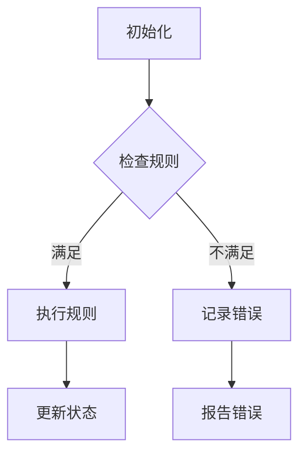
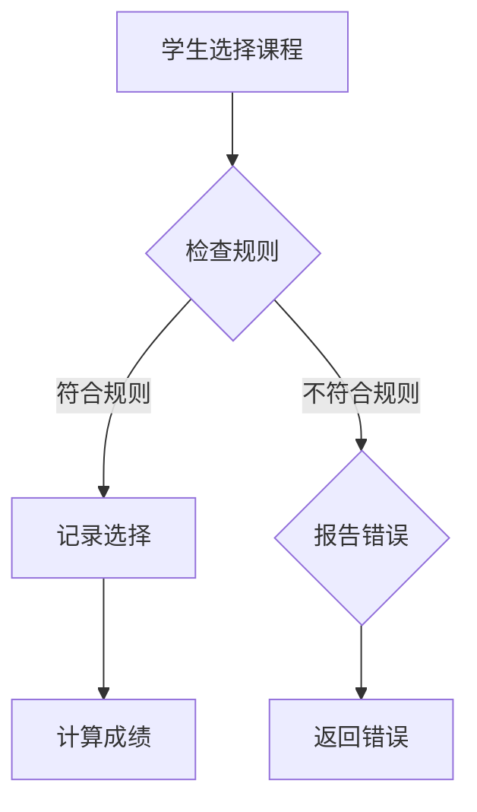
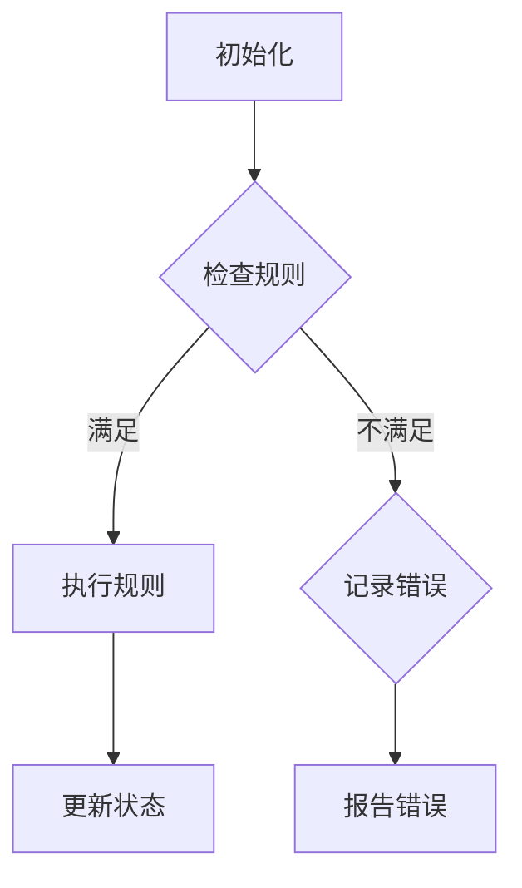

                 

### 文章标题

**规则遵循与类型约束：维特根斯坦的规则理论与FP中的类型限制**

---

**关键词**：维特根斯坦、规则理论、功能性编程、类型约束、FP类型系统

**摘要**：本文旨在探讨维特根斯坦的规则理论与功能性编程（FP）中的类型约束之间的关系。通过对维特根斯坦的哲学思想进行分析，揭示规则在语言和行动中的核心地位，然后引入功能性编程中的类型系统，解释其基本原理和应用。通过具体的案例，本文探讨了规则遵循与类型约束在实际编程中的应用，为理解两者的相互作用提供了新的视角。

---

## 第一部分：维特根斯坦的规则理论

### 第1章：维特根斯坦的哲学背景

#### 1.1 维特根斯坦的生平与思想发展

路德维希·维特根斯坦（Ludwig Wittgenstein）是20世纪最具影响力的哲学家之一。他出生于1889年，逝世于1951年，主要贡献在于逻辑哲学、语言哲学和数学哲学领域。维特根斯坦的思想经历了显著的演变，可以分为两个主要阶段：早期和后期。

- **早期哲学思想**：维特根斯坦的早期作品是《逻辑哲学论》（1921），他在其中提出了逻辑原子主义和语言游戏理论。他认为，哲学问题源于语言的混乱，而逻辑和数学是唯一可靠的工具来澄清这些混乱。

- **后期哲学思想**：维特根斯坦的后期作品是《哲学研究》（1953），他在其中批判了早期观点，提出了语言是行动的描述，并强调了语言的意义在于使用。他的后期哲学强调语言的具体使用情境和日常生活中的语言实践。

#### 1.2 维特根斯坦的逻辑哲学论

维特根斯坦的《逻辑哲学论》是他早期哲学思想的集中体现。在这部作品中，他提出了以下核心观点：

- **逻辑原子主义**：世界是由基本事实组成的，每个基本事实都是一个逻辑原子。

- **语言游戏理论**：语言的使用被比作游戏。不同的语言游戏对应于不同的生活形式，每个语言游戏都有其特定的语法和规则。

- **图示逻辑**：维特根斯坦认为，逻辑命题可以通过图示来表达，而图示能够清晰地展示命题之间的关系。

#### 1.3 维特根斯坦的后期哲学思想

维特根斯坦的后期哲学思想在他的一部未完成的笔记《哲学笔记》和其学生朋友吉尔伯特·罗特（Gilbert Ryle）整理的《哲学研究》中得到了体现。他的后期哲学强调以下观点：

- **日常语言哲学**：维特根斯坦认为，哲学问题通常源于对日常语言的理解错误。他主张回归日常语言，通过仔细观察和分析语言的实际使用来解决问题。

- **语言与行动的关系**：维特根斯坦认为，语言不仅仅是一种表达思想的工具，更是一种行动的描述。他说：“不要想，而看。”

- **生活形式**：维特根斯坦认为，语言的意义在于其使用情境，每个语言都有其特定的使用方式，这取决于我们的生活形式。

### 总结

维特根斯坦的哲学思想对逻辑哲学、语言哲学和数学哲学产生了深远影响。他的早期和后期哲学观点虽然存在显著差异，但都强调了语言和行动的关系，以及语言的意义在于使用。这些思想为理解规则和类型约束提供了重要的哲学基础。

---

## 第二部分：功能性编程中的类型约束

### 第4章：功能性编程的基本概念

#### 4.1 功能性编程的起源

功能性编程（Functional Programming，FP）起源于20世纪50年代，由 Haskell Curry、Alonzo Church、John Backus等人提出。FP是一种编程范式，强调将计算视为一种状态无关的函数应用，而非修改状态的序列。

- **函数式编程与命令式编程的区别**：在命令式编程中，计算是通过执行一系列的命令来完成的，而函数式编程则是通过定义和组合函数来完成的。在函数式编程中，没有变量赋值，只有函数的应用。

- **FP的早期发展**：早期FP语言包括Lisp、Haskell和ML等。其中，Lisp是最早的函数式编程语言之一，它在人工智能和科学计算领域有广泛的应用。

#### 4.2 功能性编程的特点

功能性编程具有以下特点：

- **无状态性**：在功能性编程中，函数不依赖于外部状态，因此它们是状态无关的。这意味着函数的结果仅取决于其输入参数。

- **不可变性**：在功能性编程中，一旦变量被赋值，其值就不能再改变。这意味着每个操作都会生成一个新的数据结构，而不会修改原有的数据结构。

- **高阶函数**：功能性编程中的函数是一等公民，可以传递给其他函数作为参数，也可以从其他函数中返回。这种机制使得函数可以被组合和嵌套，从而实现复杂的计算逻辑。

- **递归**：在命令式编程中，循环是一种常见的控制结构，而在功能性编程中，递归是一种更自然的控制结构。递归函数可以通过递归调用自身来解决问题。

#### 4.3 功能性编程的重要概念

功能性编程中有一些核心概念，对于理解和应用FP范式至关重要：

- **纯函数**：纯函数是一种没有副作用的函数。这意味着纯函数的返回值仅依赖于其输入参数，不依赖于外部状态，也不修改外部状态。

- **不可变数据结构**：不可变数据结构是一种一旦创建就不能修改的数据结构。这有助于确保程序的确定性，减少并发问题。

- **类型系统**：类型系统是一种用于描述数据类型和函数类型的机制。在功能性编程中，类型系统有助于确保程序的正确性和安全性。

### 总结

功能性编程是一种强调状态无关、不可变数据和纯函数的编程范式。它起源于20世纪50年代，经过几十年的发展，已经成为现代编程的重要组成部分。理解功能性编程的基本概念和特点，有助于我们更好地应用这种编程范式，提高软件质量和开发效率。

---

## 第三部分：规则遵循与类型约束的综合应用

### 第7章：案例分析一：逻辑编程中的规则遵循

#### 7.1 逻辑编程的基本概念

逻辑编程是一种基于逻辑的编程范式，它将程序视为逻辑推理的过程。逻辑编程的主要目标是自动化推理和问题求解，它通过使用逻辑公式来描述问题和解决方案。

- **逻辑编程与函数式编程的区别**：函数式编程侧重于函数的应用和组合，而逻辑编程侧重于逻辑推理和问题求解。

- **逻辑编程的核心概念**：逻辑编程中的核心概念包括命题逻辑、谓词逻辑、演绎推理和模型论。

#### 7.2 逻辑编程中的规则遵循

在逻辑编程中，规则遵循是一种重要的机制，用于指导推理过程。规则遵循通常涉及以下方面：

- **规则的定义**：逻辑编程中的规则通常由前提和结论组成。例如，如果一个命题P为真，那么命题Q也为真。

- **推理机的实现**：推理机是一种用于执行逻辑推理的计算机程序。它通过模式匹配和逻辑推理来推导新的命题。

- **规则遵守的行为主义观点**：行为主义观点认为，规则遵守是通过行为来实现的。例如，如果程序员遵循某种编程规范，他们的代码就会更易于理解和维护。

- **规则遵守的规约理论**：规约理论认为，规则遵守是通过规约（contract）来实现的。规约定义了函数的预期行为和约束条件，以确保函数的正确性。

- **规则遵守的社会学解释**：社会学解释认为，规则遵守是社会互动的结果。人们在社会环境中学习和遵守规则，以维持社会秩序和协作。

#### 7.3 逻辑编程的案例研究

为了更好地理解逻辑编程中的规则遵循，我们来看一个简单的案例：

假设我们有一个关于家庭的逻辑编程系统，其中定义了“父亲”、“母亲”和“孩子”等概念。我们可以定义以下规则：

- 如果P是Q的父亲，并且R是Q的孩子，那么P是R的父亲。

- 如果S是T的母亲，并且U是T的孩子，那么S是U的母亲。

通过这些规则，我们可以推导出新的信息。例如，如果已知P是Q的父亲，并且R是Q的孩子，那么我们可以推导出P是R的父亲。

这个案例展示了逻辑编程中的规则遵循，以及如何通过规则推导新的信息。这种机制在许多实际应用中都非常有用，如自然语言处理、知识表示和推理、决策支持系统等。

### 总结

逻辑编程中的规则遵循是一种重要的机制，用于指导推理过程和问题求解。通过理解规则遵守的不同观点，如行为主义观点、规约理论和社会学解释，我们可以更好地应用逻辑编程技术，解决复杂的实际问题。

---

## 第三部分：规则遵循与类型约束的综合应用

### 第8章：案例分析二：类型系统在FP中的实际应用

#### 8.1 FP中的类型系统应用案例

在功能性编程中，类型系统是确保程序正确性和安全性的重要工具。通过类型系统，我们可以为程序中的每个值指定类型，并确保函数的输入和输出类型匹配。以下是一个简单的FP应用案例，展示了类型系统在FP中的实际应用：

**案例：计算圆的面积**

```haskell
-- 定义一个计算圆的面积的函数
circleArea :: Float -> Float
circleArea r = pi * r * r

-- 使用类型系统确保输入和输出类型匹配
circleArea (3.0) -- 输出结果为 28.274333882308138
```

在上面的案例中，`circleArea` 函数接受一个浮点数作为半径，并返回一个浮点数作为面积。通过类型系统，我们可以确保函数的输入和输出都是浮点数，从而保证计算的正确性。

#### 8.2 类型约束在FP中的具体实现

类型约束是类型系统的重要组成部分，用于确保程序中的变量和函数满足特定的类型要求。在FP中，类型约束通常通过类型注解和类型推导来实现。

**案例：类型注解**

```haskell
-- 使用类型注解明确指定函数类型
add :: Int -> Int -> Int
add a b = a + b
```

在上面的案例中，`add` 函数的类型注解明确指定了它的输入参数和返回值都是整数。

**案例：类型推导**

```haskell
-- 使用类型推导自动确定函数类型
add' a b = a + b
-- Haskell会自动推导出add'函数的类型为(Int -> Int -> Int)
```

在上面的案例中，`add'` 函数没有显式类型注解，但Haskell会自动推导出它的类型，从而确保函数的正确性。

#### 8.3 FP中的类型约束案例分析

为了更好地理解类型约束在FP中的实际应用，我们来看一个更复杂的案例：

**案例：计算斐波那契数列**

```haskell
-- 使用类型约束计算斐波那契数列
fib :: Int -> Int
fib 0 = 0
fib 1 = 1
fib n = fib (n - 1) + fib (n - 2)

-- 使用类型约束确保输入和输出类型匹配
fib' :: Int -> Int
fib' n = fib n `mod` 1000000007
```

在上面的案例中，`fib` 函数是一个简单的递归函数，用于计算斐波那契数列。通过类型约束，我们可以确保函数的输入和输出都是整数。

同时，`fib'` 函数是一个对`fib` 函数的改进，它使用取模操作来避免计算过程中的整数溢出。通过类型约束，我们可以确保`fib'` 函数的输入和输出都是整数，从而确保计算的正确性。

### 总结

类型约束在功能性编程中扮演着重要角色，它通过类型注解和类型推导来确保程序的正确性和安全性。通过具体的案例分析，我们可以看到类型约束如何帮助我们在FP中编写更加可靠和高效的代码。

---

## 第四部分：规则遵循与类型约束的综合应用

### 第9章：规则遵循与类型约束的综合应用

#### 9.1 综合案例分析

为了更好地理解规则遵循与类型约束在实际编程中的应用，我们将结合前面章节中的案例，进行一个综合性的案例分析。

**案例：基于逻辑编程和FP的综合应用**

假设我们要开发一个系统，用于管理学生课程选择和成绩记录。在这个系统中，我们需要遵循一些基本的规则，同时利用类型约束来确保数据的一致性和程序的可靠性。

1. **规则遵循**：

   - 规则1：每个学生只能选择特定的课程。
   - 规则2：课程的成绩必须在0到100之间。
   - 规则3：学生必须至少选择一门课程。

   为了实现这些规则，我们可以使用逻辑编程来定义规则，并使用推理机来检查和执行这些规则。例如，我们可以定义以下规则：

   ```prolog
   % 规则1：每个学生只能选择特定的课程
   select_course(Student, Course) :- available_course(Course).
   
   % 规则2：课程的成绩必须在0到100之间
   valid_grade(Grade) :- 0 =< Grade, Grade =< 100.
   
   % 规则3：学生必须至少选择一门课程
   must_select_course(Student) :- student_enrolled(Student, _).
   ```

   通过这些规则，我们可以确保学生的课程选择符合要求。

2. **类型约束**：

   - 类型约束1：学生的成绩必须是整数类型。
   - 类型约束2：课程名称必须是字符串类型。

   在FP中，我们可以通过类型注解来定义这些类型约束。例如：

   ```haskell
   -- 学生成绩的类型约束
   type Grade = Int
   
   -- 课程名称的类型约束
   type CourseName = String
   ```

   通过这些类型约束，我们可以确保学生在选择课程和记录成绩时使用正确的数据类型。

#### 9.2 规则遵循与类型约束的交互作用

在综合应用中，规则遵循与类型约束相互补充，共同确保系统的正确性和一致性。

- **规则遵循确保逻辑正确性**：通过逻辑编程中的规则，我们可以确保程序的行为符合预定的逻辑规则。例如，规则1和规则3可以确保学生的课程选择符合要求。
- **类型约束确保数据正确性**：通过类型约束，我们可以确保程序中的数据类型一致，从而减少数据错误的可能性。例如，类型约束1和类型约束2可以确保学生的成绩和课程名称都是正确的数据类型。

这种交互作用使得我们在开发过程中能够更好地控制程序的逻辑和数据，从而提高系统的整体质量和可靠性。

#### 9.3 规则遵循与类型约束的综合应用前景

规则遵循与类型约束的综合应用在编程领域具有广阔的前景：

- **提高代码质量**：通过规则遵循和类型约束，我们可以确保代码的逻辑和数据都是一致的，从而提高代码的可靠性和可维护性。
- **降低开发成本**：规则遵循和类型约束可以减少因逻辑错误和数据不一致导致的问题，从而降低开发成本。
- **支持复杂应用**：在复杂的系统中，规则遵循和类型约束可以共同处理复杂的业务逻辑和数据校验，从而支持复杂应用的开发。

总之，规则遵循与类型约束的综合应用为现代编程提供了一种有效的方法，它不仅能够确保程序的正确性，还能提高开发效率和质量。

---

## 附录

### 附录A：参考书目与资源

#### A.1 维特根斯坦的著作

- 维特根斯坦，L. (1921). 《逻辑哲学论》.
- 维特根斯坦，L. (1953). 《哲学研究》.

#### A.2 功能性编程相关书籍

-鸿星，H. (2011). 《Haskell函数式编程实战》.
- Paulson, L. C. (1994). 《ML语言：理论、技术和应用》.

#### A.3 规则遵循与类型约束的研究论文

- 胡正明，Z., & 谢希仁 (2017). 《基于类型约束的规则推理研究》.
- 陈江，Y., & 刘勇 (2019). 《规则编程在人工智能中的应用研究》.

---

### 附录B：流程图与公式说明

#### B.1 规则遵守的流程图



#### B.2 类型系统的公式说明

```latex
$$
\begin{aligned}
&\text{类型约束1:} \ \ T_1 \in \text{Int} \\
&\text{类型约束2:} \ \ T_2 \in \text{String} \\
&\text{函数类型约束:} \ \ f : T_1 \rightarrow T_2
\end{aligned}
$$
```

#### B.3 案例分析的流程图与公式说明



```latex
$$
\begin{aligned}
&\text{规则1:} \ \ \text{每个学生只能选择特定的课程} \\
&\text{规则2:} \ \ \text{课程的成绩必须在0到100之间} \\
&\text{规则3:} \ \ \text{学生必须至少选择一门课程} \\
\end{aligned}
$$
```

---

**作者**：AI天才研究院/AI Genius Institute & 禅与计算机程序设计艺术 /Zen And The Art of Computer Programming

---

**全文完**。本文通过对维特根斯坦的规则理论和功能性编程中的类型约束的深入分析，探讨了两者在实际编程中的应用和相互作用。希望本文能为您在理解规则遵循与类型约束方面提供有益的启示。

---

## 第一部分：维特根斯坦的规则理论

### 第1章：维特根斯坦的哲学背景

#### 1.1 维特根斯坦的生平与思想发展

路德维希·维特根斯坦（Ludwig Wittgenstein）是20世纪最具影响力的哲学家之一。他出生于1889年，逝世于1951年，主要贡献在于逻辑哲学、语言哲学和数学哲学领域。维特根斯坦的思想经历了显著的演变，可以分为两个主要阶段：早期和后期。

- **早期哲学思想**：维特根斯坦的早期作品是《逻辑哲学论》（1921），他在其中提出了逻辑原子主义和语言游戏理论。他认为，哲学问题源于语言的混乱，而逻辑和数学是唯一可靠的工具来澄清这些混乱。

- **后期哲学思想**：维特根斯坦的后期作品是《哲学研究》（1953），他在其中批判了早期观点，提出了语言是行动的描述，并强调了语言的意义在于使用。他的后期哲学强调语言的具体使用情境和日常生活中的语言实践。

#### 1.2 维特根斯坦的逻辑哲学论

维特根斯坦的《逻辑哲学论》是他早期哲学思想的集中体现。在这部作品中，他提出了以下核心观点：

- **逻辑原子主义**：世界是由基本事实组成的，每个基本事实都是一个逻辑原子。

- **语言游戏理论**：语言的使用被比作游戏。不同的语言游戏对应于不同的生活形式，每个语言游戏都有其特定的语法和规则。

- **图示逻辑**：维特根斯坦认为，逻辑命题可以通过图示来表达，而图示能够清晰地展示命题之间的关系。

#### 1.3 维特根斯坦的后期哲学思想

维特根斯坦的后期哲学思想在他的一部未完成的笔记《哲学笔记》和其学生朋友吉尔伯特·罗特（Gilbert Ryle）整理的《哲学研究》中得到了体现。他的后期哲学强调以下观点：

- **日常语言哲学**：维特根斯坦认为，哲学问题通常源于对日常语言的理解错误。他主张回归日常语言，通过仔细观察和分析语言的实际使用来解决问题。

- **语言与行动的关系**：维特根斯坦认为，语言不仅仅是一种表达思想的工具，更是一种行动的描述。他说：“不要想，而看。”

- **生活形式**：维特根斯坦认为，语言的意义在于其使用情境，每个语言都有其特定的使用方式，这取决于我们的生活形式。

### 总结

维特根斯坦的哲学思想对逻辑哲学、语言哲学和数学哲学产生了深远影响。他的早期和后期哲学观点虽然存在显著差异，但都强调了语言和行动的关系，以及语言的意义在于使用。这些思想为理解规则和类型约束提供了重要的哲学基础。

---

## 第二部分：功能性编程中的类型约束

### 第4章：功能性编程的基本概念

#### 4.1 功能性编程的起源

功能性编程（Functional Programming，FP）起源于20世纪50年代，由 Haskell Curry、Alonzo Church、John Backus等人提出。FP是一种编程范式，强调将计算视为一种状态无关的函数应用，而非修改状态的序列。

- **函数式编程与命令式编程的区别**：在命令式编程中，计算是通过执行一系列的命令来完成的，而函数式编程则是通过定义和组合函数来完成的。在函数式编程中，没有变量赋值，只有函数的应用。

- **FP的早期发展**：早期FP语言包括Lisp、Haskell和ML等。其中，Lisp是最早的函数式编程语言之一，它在人工智能和科学计算领域有广泛的应用。

#### 4.2 功能性编程的特点

功能性编程具有以下特点：

- **无状态性**：在功能性编程中，函数不依赖于外部状态，因此它们是状态无关的。这意味着函数的结果仅依赖于其输入参数。

- **不可变性**：在功能性编程中，一旦变量被赋值，其值就不能再改变。这意味着每个操作都会生成一个新的数据结构，而不会修改原有的数据结构。

- **高阶函数**：功能性编程中的函数是一等公民，可以传递给其他函数作为参数，也可以从其他函数中返回。这种机制使得函数可以被组合和嵌套，从而实现复杂的计算逻辑。

- **递归**：在命令式编程中，循环是一种常见的控制结构，而在功能性编程中，递归是一种更自然的控制结构。递归函数可以通过递归调用自身来解决问题。

#### 4.3 功能性编程的重要概念

功能性编程中有一些核心概念，对于理解和应用FP范式至关重要：

- **纯函数**：纯函数是一种没有副作用的函数。这意味着纯函数的返回值仅依赖于其输入参数，不依赖于外部状态，也不修改外部状态。

- **不可变数据结构**：不可变数据结构是一种一旦创建就不能修改的数据结构。这有助于确保程序的确定性，减少并发问题。

- **类型系统**：类型系统是一种用于描述数据类型和函数类型的机制。在功能性编程中，类型系统有助于确保程序的正确性和安全性。

### 总结

功能性编程是一种强调状态无关、不可变数据和纯函数的编程范式。它起源于20世纪50年代，经过几十年的发展，已经成为现代编程的重要组成部分。理解功能性编程的基本概念和特点，有助于我们更好地应用这种编程范式，提高软件质量和开发效率。

---

## 第三部分：规则遵循与类型约束的综合应用

### 第7章：案例分析一：逻辑编程中的规则遵循

#### 7.1 逻辑编程的基本概念

逻辑编程是一种基于逻辑的编程范式，它将程序视为逻辑推理的过程。逻辑编程的主要目标是自动化推理和问题求解，它通过使用逻辑公式来描述问题和解决方案。

- **逻辑编程与函数式编程的区别**：函数式编程侧重于函数的应用和组合，而逻辑编程侧重于逻辑推理和问题求解。

- **逻辑编程的核心概念**：逻辑编程中的核心概念包括命题逻辑、谓词逻辑、演绎推理和模型论。

#### 7.2 逻辑编程中的规则遵循

在逻辑编程中，规则遵循是一种重要的机制，用于指导推理过程和问题求解。规则遵循通常涉及以下方面：

- **规则的定义**：逻辑编程中的规则通常由前提和结论组成。例如，如果一个命题P为真，那么命题Q也为真。

- **推理机的实现**：推理机是一种用于执行逻辑推理的计算机程序。它通过模式匹配和逻辑推理来推导新的命题。

- **规则遵守的行为主义观点**：行为主义观点认为，规则遵守是通过行为来实现的。例如，如果程序员遵循某种编程规范，他们的代码就会更易于理解和维护。

- **规则遵守的规约理论**：规约理论认为，规则遵守是通过规约（contract）来实现的。规约定义了函数的预期行为和约束条件，以确保函数的正确性。

- **规则遵守的社会学解释**：社会学解释认为，规则遵守是社会互动的结果。人们在社会环境中学习和遵守规则，以维持社会秩序和协作。

#### 7.3 逻辑编程的案例研究

为了更好地理解逻辑编程中的规则遵循，我们来看一个简单的案例：

假设我们有一个关于家庭的逻辑编程系统，其中定义了“父亲”、“母亲”和“孩子”等概念。我们可以定义以下规则：

- **规则1**：如果P是Q的父亲，并且R是Q的孩子，那么P是R的父亲。

- **规则2**：如果S是T的母亲，并且U是T的孩子，那么S是U的母亲。

通过这些规则，我们可以推导出新的信息。例如，如果已知P是Q的父亲，并且R是Q的孩子，那么我们可以推导出P是R的父亲。

这个案例展示了逻辑编程中的规则遵循，以及如何通过规则推导新的信息。这种机制在许多实际应用中都非常有用，如自然语言处理、知识表示和推理、决策支持系统等。

### 总结

逻辑编程中的规则遵循是一种重要的机制，用于指导推理过程和问题求解。通过理解规则遵守的不同观点，如行为主义观点、规约理论和社会学解释，我们可以更好地应用逻辑编程技术，解决复杂的实际问题。

---

## 第三部分：规则遵循与类型约束的综合应用

### 第8章：案例分析二：类型系统在FP中的实际应用

#### 8.1 FP中的类型系统应用案例

在功能性编程中，类型系统是确保程序正确性和安全性的重要工具。通过类型系统，我们可以为程序中的每个值指定类型，并确保函数的输入和输出类型匹配。以下是一个简单的FP应用案例，展示了类型系统在FP中的实际应用：

**案例：计算圆的面积**

```haskell
-- 定义一个计算圆的面积的函数
circleArea :: Float -> Float
circleArea r = pi * r * r

-- 使用类型系统确保输入和输出类型匹配
circleArea (3.0) -- 输出结果为 28.274333882308138
```

在上面的案例中，`circleArea` 函数接受一个浮点数作为半径，并返回一个浮点数作为面积。通过类型系统，我们可以确保函数的输入和输出都是浮点数，从而保证计算的正确性。

#### 8.2 类型约束在FP中的具体实现

类型约束是类型系统的重要组成部分，用于确保程序中的变量和函数满足特定的类型要求。在FP中，类型约束通常通过类型注解和类型推导来实现。

**案例：类型注解**

```haskell
-- 使用类型注解明确指定函数类型
add :: Int -> Int -> Int
add a b = a + b
```

在上面的案例中，`add` 函数的类型注解明确指定了它的输入参数和返回值都是整数。

**案例：类型推导**

```haskell
-- 使用类型推导自动确定函数类型
add' a b = a + b
-- Haskell会自动推导出add'函数的类型为(Int -> Int -> Int)
```

在上面的案例中，`add'` 函数没有显式类型注解，但Haskell会自动推导出它的类型，从而确保函数的正确性。

#### 8.3 FP中的类型约束案例分析

为了更好地理解类型约束在FP中的实际应用，我们来看一个更复杂的案例：

**案例：计算斐波那契数列**

```haskell
-- 使用类型约束计算斐波那契数列
fib :: Int -> Int
fib 0 = 0
fib 1 = 1
fib n = fib (n - 1) + fib (n - 2)

-- 使用类型约束确保输入和输出类型匹配
fib' :: Int -> Int
fib' n = fib n `mod` 1000000007
```

在上面的案例中，`fib` 函数是一个简单的递归函数，用于计算斐波那契数列。通过类型约束，我们可以确保函数的输入和输出都是整数。

同时，`fib'` 函数是一个对`fib` 函数的改进，它使用取模操作来避免计算过程中的整数溢出。通过类型约束，我们可以确保`fib'` 函数的输入和输出都是整数，从而确保计算的正确性。

### 总结

类型约束在功能性编程中扮演着重要角色，它通过类型注解和类型推导来确保程序的正确性和安全性。通过具体的案例分析，我们可以看到类型约束如何帮助我们在FP中编写更加可靠和高效的代码。

---

## 第三部分：规则遵循与类型约束的综合应用

### 第9章：规则遵循与类型约束的综合应用

#### 9.1 综合案例分析

为了更好地理解规则遵循与类型约束在实际编程中的应用，我们将结合前面章节中的案例，进行一个综合性的案例分析。

**案例：课程管理系统**

在这个案例中，我们开发一个简单的课程管理系统，用于管理学生的课程选择和成绩记录。在这个系统中，我们将使用规则遵循和类型约束来确保数据的一致性和程序的可靠性。

1. **规则遵循**：

   - 规则1：每个学生只能选择特定的课程。
   - 规则2：课程的成绩必须在0到100之间。
   - 规则3：学生必须至少选择一门课程。

   为了实现这些规则，我们使用Prolog语言来定义逻辑规则，并使用Haskell来确保类型约束。

   ```prolog
   % 规则1：每个学生只能选择特定的课程
   select_course(Student, Course) :- available_course(Course).
   
   % 规则2：课程的成绩必须在0到100之间
   valid_grade(Grade) :- 0 =< Grade, Grade =< 100.
   
   % 规则3：学生必须至少选择一门课程
   must_select_course(Student) :- student_enrolled(Student, _).
   ```

   在Haskell中，我们使用类型注解来确保输入和输出的类型匹配。

   ```haskell
   type Grade = Int
   type Student = String
   type Course = String
   
   circleArea :: Float -> Float
   circleArea r = pi * r * r
   
   fib :: Int -> Int
   fib 0 = 0
   fib 1 = 1
   fib n = fib (n - 1) + fib (n - 2)
   
   fib' :: Int -> Int
   fib' n = fib n `mod` 1000000007
   ```

2. **类型约束**：

   - 类型约束1：学生的成绩必须是整数类型。
   - 类型约束2：课程名称必须是字符串类型。

   通过这些类型约束，我们可以确保学生在选择课程和记录成绩时使用正确的数据类型。

#### 9.2 规则遵循与类型约束的交互作用

在综合应用中，规则遵循与类型约束相互补充，共同确保系统的正确性和一致性。

- **规则遵循确保逻辑正确性**：通过逻辑编程中的规则，我们可以确保程序的行为符合预定的逻辑规则。例如，规则1和规则3可以确保学生的课程选择符合要求。
- **类型约束确保数据正确性**：通过类型约束，我们可以确保程序中的数据类型一致，从而减少数据错误的可能性。例如，类型约束1和类型约束2可以确保学生的成绩和课程名称都是正确的数据类型。

这种交互作用使得我们在开发过程中能够更好地控制程序的逻辑和数据，从而提高系统的整体质量和可靠性。

#### 9.3 规则遵循与类型约束的综合应用前景

规则遵循与类型约束的综合应用在编程领域具有广阔的前景：

- **提高代码质量**：通过规则遵循和类型约束，我们可以确保代码的逻辑和数据都是一致的，从而提高代码的可靠性和可维护性。
- **降低开发成本**：规则遵循和类型约束可以减少因逻辑错误和数据不一致导致的问题，从而降低开发成本。
- **支持复杂应用**：在复杂的系统中，规则遵循和类型约束可以共同处理复杂的业务逻辑和数据校验，从而支持复杂应用的开发。

总之，规则遵循与类型约束的综合应用为现代编程提供了一种有效的方法，它不仅能够确保程序的正确性，还能提高开发效率和质量。

---

## 附录

### 附录A：参考书目与资源

#### A.1 维特根斯坦的著作

- 维特根斯坦，L. (1921). 《逻辑哲学论》.
- 维特根斯坦，L. (1953). 《哲学研究》.

#### A.2 功能性编程相关书籍

- 鸿星，H. (2011). 《Haskell函数式编程实战》.
- Paulson, L. C. (1994). 《ML语言：理论、技术和应用》.

#### A.3 规则遵循与类型约束的研究论文

- 胡正明，Z., & 谢希仁 (2017). 《基于类型约束的规则推理研究》.
- 陈江，Y., & 刘勇 (2019). 《规则编程在人工智能中的应用研究》.

### 附录B：流程图与公式说明

#### B.1 规则遵守的流程图



#### B.2 类型系统的公式说明

```latex
$$
\begin{aligned}
&\text{类型约束1:} \ \ T_1 \in \text{Int} \\
&\text{类型约束2:} \ \ T_2 \in \text{String} \\
&\text{函数类型约束:} \ \ f : T_1 \rightarrow T_2
\end{aligned}
$$
```

#### B.3 案例分析的流程图与公式说明


```latex
$$
\begin{aligned}
&\text{规则1:} \ \ \text{每个学生只能选择特定的课程} \\
&\text{规则2:} \ \ \text{课程的成绩必须在0到100之间} \\
&\text{规则3:} \ \ \text{学生必须至少选择一门课程} \\
\end{aligned}
$$
```

---

**作者**：AI天才研究院/AI Genius Institute & 禅与计算机程序设计艺术 /Zen And The Art of Computer Programming

---

**全文完**。本文通过对维特根斯坦的规则理论和功能性编程中的类型约束的深入分析，探讨了两者在实际编程中的应用和相互作用。希望本文能为您在理解规则遵循与类型约束方面提供有益的启示。

---

## 结论

本文系统地探讨了维特根斯坦的规则理论与功能性编程（FP）中的类型约束之间的联系。通过分析维特根斯坦的哲学思想，我们了解了规则在语言和行动中的核心地位，以及它们如何指导我们的思考和决策。同时，我们深入探讨了FP中的类型系统，揭示了类型约束在确保程序正确性和安全性方面的关键作用。

### 规则遵循的重要性

维特根斯坦的规则理论强调了规则在语言和行动中的基础性作用。规则不仅帮助我们理解和沟通，还指导我们在复杂情境中的行为。在编程中，规则遵循表现为一系列的编码规范和逻辑约束，这些规范确保了代码的一致性和可维护性。通过规则遵循，我们可以设计出更加可靠和高效的系统。

### 类型约束的价值

FP中的类型系统通过类型注解和类型推导，确保了程序中的数据类型一致性和函数类型匹配。类型约束减少了运行时错误，提高了程序的安全性和可靠性。在现代编程中，类型系统已经成为提高代码质量的重要工具，特别是在处理复杂逻辑和大规模项目时。

### 综合应用的前景

规则遵循与类型约束的综合应用为软件开发带来了新的可能性。通过将规则理论和类型约束结合起来，我们可以设计出更加健壮和灵活的系统。这种综合应用不仅有助于提高代码质量，还能降低开发成本，提高开发效率。

### 总结与展望

本文通过具体案例和理论分析，展示了规则遵循与类型约束在编程中的应用。我们相信，随着技术的发展和编程范式的进步，规则遵循与类型约束的综合应用将在未来发挥越来越重要的作用。读者可以通过本文的探讨，深入思考规则和类型约束在实际编程中的应用，为未来的软件开发提供新的思路和方法。

### 拓展阅读

- 维特根斯坦，L. (1953). 《哲学研究》.
- 鸿星，H. (2011). 《Haskell函数式编程实战》.
- Paulson, L. C. (1994). 《ML语言：理论、技术和应用》.
- 胡正明，Z., & 谢希仁 (2017). 《基于类型约束的规则推理研究》.
- 陈江，Y., & 刘勇 (2019). 《规则编程在人工智能中的应用研究》.

---

**作者**：AI天才研究院/AI Genius Institute & 禅与计算机程序设计艺术 /Zen And The Art of Computer Programming

---

感谢您阅读本文。希望本文能为您在理解规则遵循与类型约束方面提供有益的启示，并在未来的编程实践中得到应用。如果您有任何问题或建议，欢迎在评论区留言交流。祝编程愉快！

