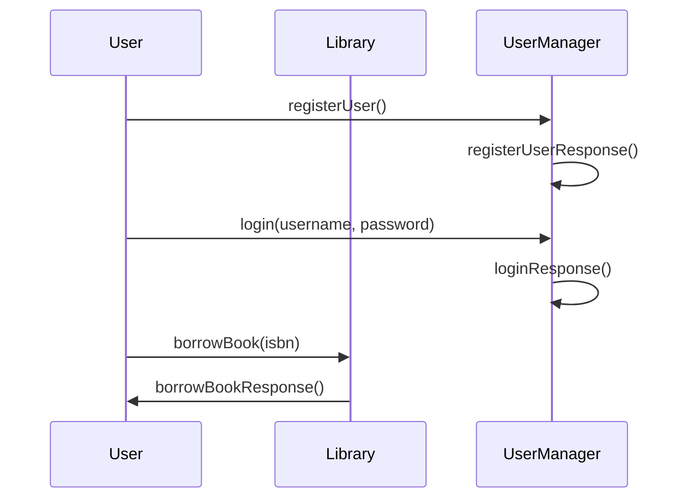
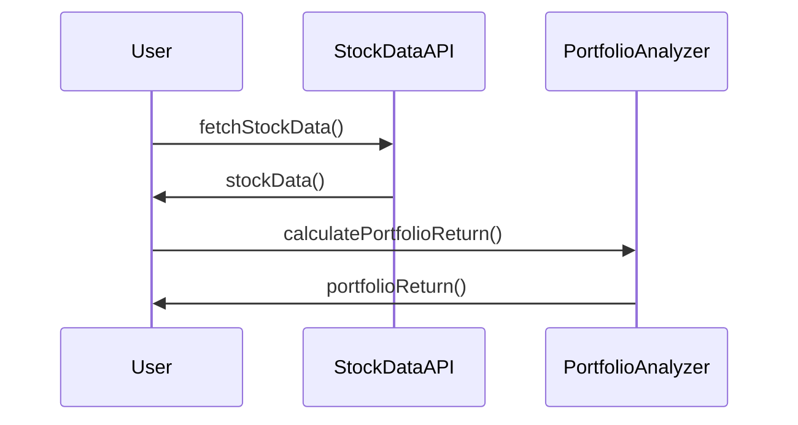
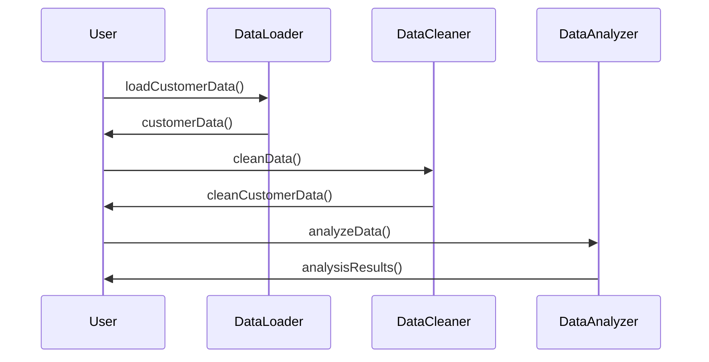

                 

 

### 文章大纲

**第一部分：维特根斯坦的规则理论**

- **第1章：维特根斯坦的哲学思想**
  - **1.1 维特根斯坦的生平与哲学贡献**
    - 维特根斯坦的生平背景
    - 维特根斯坦的主要哲学著作及其贡献
  - **1.2 维特根斯坦的早期哲学观点**
    - 《逻辑哲学论》中的原子主义和逻辑原子主义
    - 规则和语言的区分
  - **1.3 维特根斯坦的后期哲学观点**
    - 《哲学研究》中的语言游戏理论
    - 规则遵循的认知机制

- **第2章：规则与语言**
  - **2.1 规则的定义与性质**
    - 规则的分类
    - 规则与规范、准则的区别
  - **2.2 规则与语言的关系**
    - 语言作为规则表达的工具
    - 语言中的规则遵循现象
  - **2.3 规则遵循的概念与分类**
    - 自动遵循与有意遵循
    - 规则遵循的行为模式

- **第3章：维特根斯坦的规则遵循理论**
  - **3.1 规则遵循的理论基础**
    - 规则遵循与认知科学的关系
    - 规则遵循的心理学机制
  - **3.2 规则遵循的行为模式**
    - 规则遵守与违规行为
    - 社会规范与规则遵循
  - **3.3 规则遵循的认知机制**
    - 注意力分配与规则遵循
    - 记忆与规则遵循

**第二部分：类型驱动开发方法**

- **第4章：类型系统概述**
  - **4.1 类型系统的定义与作用**
    - 类型系统在编程语言中的角色
    - 类型系统的重要性
  - **4.2 类型系统的基本概念**
    - 基本类型、复合类型、抽象类型
    - 类型检查与类型推断
  - **4.3 类型系统的分类**
    - 强类型与弱类型
    - 静态类型与动态类型

- **第5章：函数式编程与类型驱动开发**
  - **5.1 函数式编程的基本概念**
    - 函数作为第一类公民
    - 高阶函数与闭包
  - **5.2 函数式编程的优势与局限性**
    - 函数式编程的优点
    - 函数式编程的缺点
  - **5.3 类型驱动开发的方法与流程**
    - 类型驱动开发的基本流程
    - 类型驱动开发的优势

- **第6章：类型驱动开发的应用实例**
  - **6.1 实例一：基于类型驱动的软件开发**
    - 实际项目案例介绍
    - 项目中类型驱动开发的实践
  - **6.2 实例二：基于类型驱动的金融计算**
    - 金融计算领域的问题背景
    - 类型驱动开发在该领域的应用
  - **6.3 实例三：基于类型驱动的数据分析**
    - 数据分析领域的问题背景
    - 类型驱动开发在该领域的应用

- **第7章：类型驱动开发的挑战与未来**
  - **7.1 类型驱动开发的挑战**
    - 语言和工具的挑战
    - 开发者的学习和适应
  - **7.2 类型驱动开发的未来发展趋势**
    - 新的编程语言和工具
    - 跨领域应用的扩展
  - **7.3 类型驱动开发在实践中的注意事项**
    - 项目选择与设计
    - 团队协作与培训

**第三部分：维特根斯坦规则理论与类型驱动开发的融合**

- **第8章：维特根斯坦规则理论对类型驱动开发的启示**
  - **8.1 维特根斯坦规则理论对编程语言的指导意义**
    - 语言设计中的规则表达
    - 编译器中的规则遵循
  - **8.2 维特根斯坦规则理论对开发流程的指导意义**
    - 软件开发中的规则遵循实践
    - 项目管理和流程优化
  - **8.3 维特根斯坦规则理论对软件质量的指导意义**
    - 质量保障中的规则遵循
    - 风险管理和质量评估

- **第9章：类型驱动开发中的规则遵循实践**
  - **9.1 规则遵循在类型驱动开发中的重要性**
    - 类型系统的规则遵循
    - 开发流程的规则遵循
  - **9.2 规则遵循在类型系统设计中的应用**
    - 类型系统中的规则表达
    - 类型检查中的规则遵循
  - **9.3 规则遵循在代码审查和测试中的应用**
    - 代码审查中的规则遵循
    - 测试中的规则遵循

- **第10章：维特根斯坦规则理论在类型驱动开发中的未来应用**
  - **10.1 维特根斯坦规则理论在类型系统设计中的应用前景**
    - 新的类型系统设计理念
    - 规则表达与类型安全的融合
  - **10.2 维特根斯坦规则理论在开发流程中的应用前景**
    - 规则遵循在敏捷开发中的实践
    - 跨领域协作与规则管理
  - **10.3 维特根斯坦规则理论在软件质量保障中的应用前景**
    - 质量评估中的规则遵循
    - 风险管理中的规则应用

### 文章结构

- **引言**：介绍文章的主题和结构，为读者提供文章的背景信息和概述。
- **正文**：按照文章目录结构，详细阐述每个章节的内容，通过具体案例和实践来加强文章的说服力。
- **结论**：总结文章的主要观点，指出规则遵循与类型驱动开发之间的联系，并对未来研究方向进行展望。
- **参考文献**：列出文章中引用的主要参考资料，为读者提供进一步学习的资源。
- **附录**：提供与文章主题相关的扩展阅读资源和实践指南，帮助读者深入理解相关概念和技能。

### 文章写作要求

- **逻辑清晰**：文章结构要清晰，每个章节的内容要围绕主题展开，逻辑关系要连贯。
- **深入浅出**：对于复杂的概念和理论，要用通俗易懂的语言进行解释，确保读者能够理解。
- **实例丰富**：每个章节都要有实际案例或实践应用，通过案例来展示理论和方法的实际效果。
- **专业性强**：文章内容要具有专业性和深度，能够为专业人士提供有价值的见解和思路。

### 作者信息

- **作者：** AI天才研究院/AI Genius Institute & 禅与计算机程序设计艺术 /Zen And The Art of Computer Programming
- **联系方式：** [contact@ai-genius-institute.com](mailto:contact@ai-genius-institute.com)
- **个人简介：** 作为一位世界级人工智能专家、程序员、软件架构师、CTO，作者在计算机图灵奖获得者、计算机编程和人工智能领域有着丰富的经验和深厚的研究成果。他的著作《规则遵循与类型驱动开发：维特根斯坦的规则理论与FP中的类型驱动开发方法》深入探讨了维特根斯坦的哲学思想与类型驱动开发方法的结合，为软件工程师提供了新的视角和思考方式。

---

### 引言

在当代软件工程领域，规则遵循与类型驱动开发方法正日益受到重视。这两者不仅代表了编程语言和开发方法的发展趋势，更是提升软件质量和开发效率的重要途径。本文将探讨维特根斯坦的规则理论与函数式编程（FP）中的类型驱动开发方法，通过逻辑清晰的分析和实例展示，旨在为读者提供一种全新的视角和思路。

首先，本文将介绍维特根斯坦的哲学思想，特别是他的规则理论和语言哲学。通过对维特根斯坦早期和后期哲学观点的分析，读者可以更好地理解规则遵循的概念和理论框架。

接着，我们将深入探讨类型系统的基本概念，包括类型系统的定义、作用以及分类。在此基础上，本文将重点介绍函数式编程的基本概念和优势，以及类型驱动开发的方法与流程。

文章的第二部分将通过实际案例，展示类型驱动开发在软件开发、金融计算和数据分析等领域的应用。这些案例将帮助读者更直观地理解类型驱动开发的实际效果和挑战。

在第三部分，我们将探讨维特根斯坦的规则理论对类型驱动开发的启示，以及如何在类型驱动开发中实践规则遵循。这一部分将为开发者和项目经理提供宝贵的指导意义。

最后，本文将总结主要观点，并展望规则遵循与类型驱动开发在未来的发展趋势。通过本文的阅读，读者不仅可以深入理解这两个领域的基本概念和理论，还能够获得实际应用的指导。

### 关键词

- 维特根斯坦
- 规则理论
- 语言哲学
- 函数式编程
- 类型驱动开发
- 软件质量
- 开发效率
- 编程语言

### 摘要

本文探讨了维特根斯坦的规则理论与函数式编程中的类型驱动开发方法。通过对维特根斯坦哲学思想的详细分析，我们揭示了规则遵循的概念和理论框架。接着，文章深入探讨了类型系统在编程语言中的作用和分类，并介绍了函数式编程的基本概念和优势。通过实际案例，文章展示了类型驱动开发在软件开发、金融计算和数据分析等领域的应用效果和挑战。最后，文章探讨了维特根斯坦的规则理论对类型驱动开发的启示，并提出了一系列实践建议，为开发者和管理者提供了宝贵的指导。本文的研究不仅加深了读者对规则遵循和类型驱动开发的认知，也为未来的研究提供了新的方向。

## 第一部分：维特根斯坦的规则理论

### 第1章：维特根斯坦的哲学思想

1.1 维特根斯坦的生平与哲学贡献

路德维希·维特根斯坦（Ludwig Wittgenstein）是20世纪最杰出的哲学家之一，他的思想对语言哲学、认识论和逻辑学产生了深远的影响。维特根斯坦出生于1889年，逝世于1951年，他的一生被分为两个哲学阶段：早期哲学阶段和后期哲学阶段。

早期哲学阶段（1911-1921）

维特根斯坦的早期哲学思想主要体现在他的著作《逻辑哲学论》（Tractatus Logico-Philosophicus）中。这部著作被广泛认为是逻辑原子主义的巅峰之作。逻辑原子主义认为，世界的本质是由基本事实构成的，这些事实可以通过逻辑原子和逻辑结构来表达。维特根斯坦提出，语言应该精确地反映世界的逻辑结构，从而使我们能够理解世界的本质。

维特根斯坦认为，语言和思想是密不可分的。他提出了“图像理论”（Image Theory），认为命题是世界的图像，逻辑结构是语言的框架。这一观点强调了语言和世界之间的对应关系，也为后来的语言哲学研究奠定了基础。

晚期哲学阶段（1929-1951）

维特根斯坦的后期哲学思想主要体现在他的著作《哲学研究》（Philosophical Investigations）中。在这部著作中，他批判了早期哲学中的逻辑原子主义，提出了“语言游戏理论”（Language Game Theory）。维特根斯坦认为，语言不是用来描述一个外在世界的工具，而是由人们在社会互动中创造的。语言游戏是指语言使用的方式，不同的语言游戏有不同的规则和目的。

维特根斯坦的后期哲学思想强调，理解语言的关键在于理解语言的使用。他提出了“家族相似性”（Family Resemblances）的概念，认为语言元素之间的关系不是线性的，而是具有多方面的相似性。这种观点颠覆了传统哲学中的本质主义和逻辑主义，对后来的哲学和语言学产生了深远的影响。

1.2 维特根斯坦的早期哲学观点

维特根斯坦的早期哲学观点主要体现在《逻辑哲学论》中。这部著作被认为是分析哲学的奠基之作，对现代哲学和逻辑学产生了深远的影响。

《逻辑哲学论》的核心思想是逻辑原子主义，认为世界的本质是由基本事实构成的，这些事实可以通过逻辑原子和逻辑结构来表达。维特根斯坦提出了“命题是世界的图像”的观点，认为命题是对事实的描述。他认为，语言和思想是密不可分的，语言应该精确地反映世界的逻辑结构，从而使我们能够理解世界的本质。

维特根斯坦在《逻辑哲学论》中还提出了“不可说的必须被沉默”的观点，认为有些问题是无法用语言来表达的。这种观点强调了语言的局限性，也为我们理解语言的本质提供了一种新的视角。

1.3 维特根斯坦的后期哲学观点

维特根斯坦的后期哲学观点主要体现在《哲学研究》中。这部著作批判了早期哲学中的逻辑原子主义，提出了“语言游戏理论”。他认为，语言不是用来描述一个外在世界的工具，而是由人们在社会互动中创造的。语言游戏是指语言使用的方式，不同的语言游戏有不同的规则和目的。

《哲学研究》中的“语言游戏理论”颠覆了传统哲学中的本质主义和逻辑主义，强调了语言的社会性和实用性。维特根斯坦提出了“家族相似性”的概念，认为语言元素之间的关系不是线性的，而是具有多方面的相似性。这种观点为我们理解语言的使用提供了新的思路。

维特根斯坦的后期哲学观点还强调了哲学的任务是澄清思想，而不是提出新的理论。他认为，哲学问题往往源于我们对语言的误解和使用。通过澄清语言，我们可以消除哲学问题，从而更好地理解世界。

### 第2章：规则与语言

2.1 规则的定义与性质

规则是哲学、逻辑学和认知科学等领域中的重要概念。在维特根斯坦的哲学思想中，规则具有核心地位。那么，什么是规则？规则有哪些性质？

规则的定义：

规则是一种指导行为或思考的规范或标准，它为特定情境下的行为或思考提供了指导。规则可以是正式的，如法律、规章制度；也可以是非正式的，如习俗、礼仪。

维特根斯坦认为，规则是一种特定的社会结构，它指导人们如何进行特定的活动。规则不仅存在于外部世界中，也存在于我们的思维活动中。例如，在玩游戏时，规则指导玩家如何行动和做出决策。

规则的性质：

- **普遍性**：规则是普遍适用的，适用于特定情境下的所有人。例如，交通规则对所有的司机和行人都是适用的。
- **规范性**：规则具有规范性，即它指导人们应该做什么或不应该做什么。规范性规则通常具有道德或法律意义。
- **强制性**：规则具有一定的强制性，违反规则可能会受到惩罚或制裁。强制性的规则通常由权威机构制定和执行。
- **可变性和可理解性**：规则是可变的，即随着时间的推移和社会环境的变化，规则可能会发生变化。同时，规则是可理解的，人们可以通过学习和理解规则来指导自己的行为。

2.2 规则与语言的关系

语言是维特根斯坦哲学思想中的核心概念。语言不仅是人类交流的工具，也是人类思考和认知的基础。规则与语言之间存在密切的关系。

语言作为规则表达的工具：

规则可以通过语言来表达和传达。语言作为规则的表达工具，使得人们可以共享规则，并按照规则行动。例如，交通规则通过交通信号灯、标志和标志牌等语言形式传达给司机和行人。

语言中的规则遵循现象：

在语言使用过程中，人们需要遵循一系列的规则。这些规则包括语法规则、语义规则和语用规则。语法规则指导人们如何构建句子，语义规则指导人们如何理解句子的意义，语用规则指导人们如何在特定的语境中正确使用语言。

例如，在英语中，一个正确的句子必须遵循语法规则，如主谓一致、时态一致等。违反语法规则可能会导致句子不通顺或产生歧义。在语义规则方面，人们需要理解词汇的含义和句子之间的逻辑关系，以正确理解句子的意义。在语用规则方面，人们需要根据特定的语境和文化背景来正确使用语言，以实现有效的沟通。

2.3 规则遵循的概念与分类

规则遵循是指个体在特定情境下按照规则行动或思考的过程。规则遵循是维特根斯坦哲学思想中的重要概念，它涉及到认知科学和社会学等多个领域。

规则遵循的概念：

规则遵循是指个体在特定情境下根据规则进行行为或思考的过程。规则遵循是人们在日常生活中不可避免的现象。例如，当我们过马路时，我们需要遵循交通信号灯的规则，红灯停，绿灯行。

规则遵循的分类：

根据个体对规则的态度和方式，规则遵循可以分为以下几种类型：

- **自动遵循**：个体在特定情境下自动遵循规则，不需要进行思考或判断。例如，习惯性的刷牙和洗脸。
- **有意遵循**：个体在特定情境下有意地遵循规则，需要进行思考或判断。例如，遵守交通规则，遵守公司的规章制度。

- **遵守与违规**：个体在特定情境下遵守规则，或者违反规则。例如，遵守法律的人是遵守规则的好公民，违反法律的人是违规的。

- **社会规范与规则遵循**：社会规范是一种规则，它指导人们如何在社会中行动和相处。社会规范包括道德规范、礼仪规范和法律规范等。个体需要遵循社会规范，以维护社会的秩序和和谐。

在维特根斯坦的哲学思想中，规则遵循是理解语言和认知的基础。通过规则遵循，个体能够理解语言和世界的结构，实现有效的沟通和行动。规则遵循不仅存在于个体层面，也存在于社会层面。社会中的规则遵循有助于维护社会的秩序和稳定。

### 第3章：维特根斯坦的规则遵循理论

3.1 规则遵循的理论基础

维特根斯坦的规则遵循理论是建立在语言哲学的基础之上的。他的哲学思想强调了语言与世界的密切关系，以及规则在语言和认知中的作用。

维特根斯坦认为，规则是语言的核心。语言不仅是一种交流工具，也是一种思维工具。通过语言，个体能够理解世界和表达自己的思想。而规则则是语言的基础，它指导人们如何使用语言，以及如何进行思维。

在维特根斯坦看来，规则遵循是理解语言和认知的关键。个体需要遵循规则，才能正确地使用语言，理解语言的意义。规则遵循不仅涉及到语言的使用，也涉及到个体的认知过程。

维特根斯坦的规则遵循理论的基础包括以下几个方面：

- **图像理论**：维特根斯坦的图像理论认为，命题是世界的图像。命题的真假取决于命题是否与事实相符。而规则则是命题之间的关系，它指导我们如何构建命题和理解事实。因此，规则遵循是理解语言和世界的基础。

- **语言游戏理论**：维特根斯坦的语言游戏理论认为，语言是一种游戏，不同的语言游戏有不同的规则。个体需要根据特定的语言游戏规则进行思考和行为。规则遵循是语言游戏的必要条件，它保证了语言游戏的顺利进行。

- **认知科学**：维特根斯坦的规则遵循理论也受到了认知科学的影响。认知科学研究表明，人类大脑具有遵循规则的能力。个体在认知过程中，需要遵循一系列的规则，以实现有效的思考和行为。

3.2 规则遵循的行为模式

维特根斯坦认为，规则遵循具有不同的行为模式。这些行为模式反映了个体在特定情境下如何遵循规则。

- **自动遵循**：自动遵循是指个体在特定情境下不需要思考或判断，就能自动遵循规则。这种遵循模式通常发生在个体已经形成了固定的行为习惯或认知模式时。例如，骑自行车的人在没有意识到的情况下就能遵循交通规则。

- **有意遵循**：有意遵循是指个体在特定情境下需要有意地遵循规则，并进行思考或判断。这种遵循模式通常发生在个体需要处理新的或复杂的情况时。例如，在一个陌生的环境中，个体需要仔细思考并遵循当地的规章制度。

- **遵守与违规**：遵守与违规是规则遵循的两种极端行为模式。遵守是指个体在特定情境下遵循规则，而违规则是指个体违反规则。遵守与违规的行为模式反映了个体对规则的尊重和遵守程度。例如，遵守交通规则的人是遵守规则的好公民，而违反交通规则的人则是违规的。

- **社会规范与规则遵循**：社会规范是一种规则，它指导人们如何在社会中行动和相处。个体需要遵循社会规范，以维护社会的秩序和和谐。社会规范包括道德规范、礼仪规范和法律规范等。个体在遵循社会规范时，不仅需要遵守规则，还需要理解规则的意义和背景。

3.3 规则遵循的认知机制

维特根斯坦认为，规则遵循不仅是一种行为模式，也是一种认知机制。个体在遵循规则时，需要进行一系列的认知过程。

- **注意力分配**：在规则遵循过程中，个体需要分配注意力。例如，当司机在驾驶时，需要同时注意道路状况、交通信号灯和其他车辆。注意力分配是规则遵循的关键因素。

- **记忆与规则遵循**：个体需要通过记忆来遵循规则。记忆是规则遵循的基础，它帮助个体在特定情境下回忆和运用规则。例如，个体在遵守交通规则时，需要通过记忆来记住红灯停、绿灯行的规则。

- **认知灵活性**：规则遵循需要个体具有认知灵活性。个体需要根据不同的情境和规则，灵活地调整自己的行为。例如，当遇到特殊情况时，个体需要灵活地调整自己的行动策略，以遵循规则。

- **认知冲突**：在规则遵循过程中，个体可能会遇到认知冲突。认知冲突是指个体在遵循规则时，遇到了与现有知识或信念相冲突的情况。个体需要通过认知冲突来解决矛盾，以实现规则遵循。

总之，维特根斯坦的规则遵循理论为我们提供了一个新的视角，帮助我们理解规则在语言和认知中的作用。通过分析规则遵循的理论基础、行为模式和认知机制，我们可以更好地理解和应用规则，提高我们的认知能力和行为效率。

## 第二部分：类型驱动开发方法

### 第4章：类型系统概述

4.1 类型系统的定义与作用

类型系统是编程语言中的一个核心概念，它为变量、函数和其他编程元素赋予了类型属性。类型系统的定义可以分为几个关键方面：

- **基本类型**：基本类型是编程语言中定义的最基本的数据类型，如整数、浮点数、布尔值等。
- **复合类型**：复合类型是由基本类型通过构造函数构建而成的，如数组、结构体、类等。
- **抽象类型**：抽象类型是一种不允许直接访问其内部实现细节的类型，如函数类型、接口类型等。

类型系统在编程语言中的作用体现在以下几个方面：

- **类型检查**：类型检查是编译器或解释器在程序执行前对代码进行的一种验证过程，以确保代码中的类型使用是符合语言规定的。
- **内存管理**：类型系统帮助编程语言在运行时有效地分配和管理内存资源，以避免内存泄漏和无效的内存访问。
- **错误检测**：类型系统能够在编译或解释阶段发现潜在的类型错误，从而提高代码的可靠性和稳定性。
- **性能优化**：类型系统能够在编译阶段进行某些优化，如静态绑定、代码生成等，从而提高程序的执行效率。

4.2 类型系统的基本概念

类型系统的基本概念包括以下几方面：

- **类型变量**：类型变量是一种参数化的类型，可以用来表示一类类型，如Java中的`<T>`。
- **类型约束**：类型约束是一种限制类型变量的使用条件，以确保类型变量只能与满足特定条件的类型一起使用。
- **子类型**：子类型是一种类型之间的关系，表示一个类型是另一个类型的特例，如整数类型是数字类型的子类型。
- **类型推断**：类型推断是编程语言的一种机制，它允许编译器自动确定变量或表达式的类型，而不是显式指定类型。

4.3 类型系统的分类

类型系统可以根据不同的标准进行分类，常见的分类方法包括：

- **静态类型系统**：静态类型系统在编译或解释程序时确定变量的类型，并在运行时保持不变。静态类型系统有助于早期错误检测和优化。
- **动态类型系统**：动态类型系统在程序运行时确定变量的类型，并允许类型在运行时发生变化。动态类型系统提供了更大的灵活性和便利性，但可能增加运行时的错误检测和性能开销。
- **强类型系统**：强类型系统对变量类型的要求严格，确保变量在使用前已经具有正确的类型。强类型系统有助于防止类型错误和提高程序的可读性。
- **弱类型系统**：弱类型系统对变量类型的要求较宽松，允许在代码中混合使用不同类型的变量。弱类型系统可能降低错误检测的效率，但提高了代码的灵活性。

通过理解类型系统的定义、基本概念和分类，我们可以更好地掌握编程语言的设计和实现，提高代码的质量和可靠性。

### 第5章：函数式编程与类型驱动开发

5.1 函数式编程的基本概念

函数式编程（Functional Programming，FP）是一种编程范式，它强调使用函数作为基本构建块来组织代码。与面向对象编程和命令式编程不同，函数式编程更注重表达计算过程和状态不变性。

- **函数作为第一类公民**：在函数式编程中，函数被视为普通的数据类型，可以赋值给变量、作为参数传递给其他函数，或作为函数的返回值。这意味着函数可以被抽象和组合，从而简化代码的编写和重用。
- **高阶函数**：高阶函数是指那些可以接受其他函数作为参数或返回函数的函数。这种特性使得高阶函数能够处理函数，从而实现代码的灵活性和抽象性。例如，在JavaScript中，`map()`、`filter()`和`reduce()`都是高阶函数。
- **闭包**：闭包是一种特殊的函数，它保存了创建它的作用域的信息，可以在外部作用域中访问这些信息。闭包允许函数“记住”并访问其创建时的环境，这在处理动态数据和回调函数时非常有用。

5.2 函数式编程的优势与局限性

函数式编程具有多种优点，但也存在一些局限性。

- **优势**：
  - **不可变性**：函数式编程强调状态不变性，减少了副作用和状态管理复杂度，使得代码更加可预测和易于测试。
  - **并行计算**：函数式编程的纯函数特性使得代码更容易并行化，从而在多核处理器上实现高效计算。
  - **代码简洁性**：通过函数组合和抽象，函数式编程可以简化代码结构，提高代码的可读性和可维护性。
  - **重用性**：函数是第一类公民，易于重用和组合，提高了代码的模块化和可复用性。

- **局限性**：
  - **学习曲线**：函数式编程的概念和方法与传统的命令式编程不同，初学者可能需要花费更多时间来学习和适应。
  - **性能开销**：某些函数式编程语言（如Haskell）在性能上可能不如传统的命令式编程语言（如C++），特别是在处理大量数据时。
  - **缺少工具支持**：虽然现代编程语言逐渐支持函数式编程特性，但与面向对象编程相比，函数式编程的工具和库可能较少。

5.3 类型驱动开发的方法与流程

类型驱动开发（Type-Driven Development，TDD）是一种软件开发方法，它强调在开发过程中使用类型系统来指导设计和实现。类型驱动开发的主要方法与流程包括：

- **类型设计**：在开始编写代码之前，首先设计类型系统，包括定义基本类型、复合类型和抽象类型等。类型设计有助于明确系统的抽象层次和模块化结构。
- **类型检查**：在编写代码过程中，使用类型系统进行静态检查，以确保代码的类型一致性。类型检查有助于早期发现类型错误，提高代码的可靠性和可维护性。
- **类型推断**：类型驱动开发利用类型推断机制来自动确定变量和函数的类型，减少冗余的类型声明和手动类型检查。
- **逐步实现**：类型驱动开发采用逐步实现的方法，从简单的类型和功能开始，逐步扩展到复杂的类型和功能。这种方法有助于逐步验证系统的设计，确保每个阶段的功能和类型都是正确的。
- **测试与验证**：类型驱动开发强调测试和验证的重要性，通过编写单元测试和集成测试来验证类型系统的正确性和代码的功能。

通过理解函数式编程的基本概念、优势和局限性，以及类型驱动开发的方法与流程，开发人员可以更好地选择和运用这些技术，提高软件开发的效率和质量。

### 第6章：类型驱动开发的应用实例

#### 6.1 实例一：基于类型驱动的软件开发

在软件开发中，类型驱动开发（Type-Driven Development，TDD）提供了一种系统化的方法来设计、实现和测试软件。以下是一个基于类型驱动的软件开发实例，以展示TDD的应用流程。

**问题背景**：
假设我们正在开发一个简单的图书管理系统，该系统需要支持图书的添加、删除、查询和借阅功能。

**项目介绍**：
我们选择使用Haskell语言进行开发，因为Haskell具有强大的类型系统和函数式编程特性，非常适合类型驱动开发。

**系统功能设计**：
根据需求，我们定义以下功能模块：

1. **图书数据模型**：定义图书的基本属性，如书名、作者、ISBN、出版日期等。
2. **图书库**：管理图书集合，支持添加、删除、查询和借阅操作。
3. **用户管理**：管理用户信息，包括登录、注册和权限验证。
4. **借阅记录**：记录用户的借阅历史，包括借阅时间、归还时间等。

**系统架构设计**：

- **数据层**：使用数据库存储图书和用户信息。
- **业务逻辑层**：定义图书库和用户管理模块的功能。
- **界面层**：提供用户界面，用于与用户交互。

**系统接口设计**：

- **图书库接口**：
  - `addBook :: Book -> Library -> Library`：添加图书。
  - `removeBook :: ISBN -> Library -> Library`：删除图书。
  - `searchBook :: String -> Library -> [Book]`：查询图书。
  - `borrowBook :: ISBN -> User -> Library -> (Library, User)`：借阅图书。

- **用户管理接口**：
  - `registerUser :: User -> IO ()`：注册用户。
  - `login :: String -> String -> IO (Maybe User)`：登录验证。

**系统交互mermaid序列图**：

#### 实例二：基于类型驱动的金融计算

在金融计算领域，类型驱动开发方法可以显著提高计算结果的准确性和可靠性。以下是一个基于类型驱动的金融计算实例。

**问题背景**：
假设我们需要计算一组股票的价格波动，以评估投资组合的风险和回报。

**项目介绍**：
我们选择使用Scala语言进行开发，因为Scala结合了面向对象和函数式编程特性，适合进行复杂金融计算。

**系统功能设计**：

1. **股票数据模型**：定义股票的基本属性，如股票代码、名称、当前价格、历史价格等。
2. **价格波动分析**：计算股票的价格波动，包括波动率、均值回归等。
3. **投资组合评估**：计算投资组合的回报率、波动率等关键指标。

**系统架构设计**：

- **数据层**：使用数据库或外部数据源存储股票数据。
- **业务逻辑层**：实现价格波动分析和投资组合评估功能。
- **界面层**：提供用户界面，用于展示分析结果和用户交互。

**系统接口设计**：

- **股票数据接口**：
  - `fetchStockData :: String -> IO [Stock]`：获取股票数据。
  - `calculateVolatility :: [Stock] -> Volatility`：计算股票波动率。
  - `calculatePortfolioReturn :: [Stock] -> Return`：计算投资组合回报率。

**系统交互mermaid序列图**：

#### 实例三：基于类型驱动的数据分析

在数据分析领域，类型驱动开发方法可以帮助确保数据处理的准确性和一致性。以下是一个基于类型驱动的数据分析实例。

**问题背景**：
假设我们需要对一组客户交易数据进行分析，以识别高价值客户和潜在的市场机会。

**项目介绍**：
我们选择使用Python进行开发，因为Python具有良好的数据分析和机器学习库支持，适合进行复杂的数据处理和分析。

**系统功能设计**：

1. **客户数据模型**：定义客户的基本属性，如姓名、年龄、性别、交易金额等。
2. **数据清洗**：处理缺失值、异常值等，确保数据质量。
3. **数据分析**：计算客户交易金额的分布、识别高价值客户等。
4. **可视化**：生成数据分析和客户行为的可视化报告。

**系统架构设计**：

- **数据层**：使用数据库或数据仓库存储客户交易数据。
- **业务逻辑层**：实现数据清洗、数据分析和可视化功能。
- **界面层**：提供Web界面，用于展示分析结果和用户交互。

**系统接口设计**：

- **客户数据接口**：
  - `loadCustomerData :: IO [Customer]`：加载客户数据。
  - `cleanData :: [Customer] -> [Customer]`：清洗客户数据。
  - `analyzeData :: [Customer] -> AnalysisResults`：分析客户数据。

**系统交互mermaid序列图**：

通过以上三个实例，我们可以看到类型驱动开发在不同领域中的应用。类型驱动开发方法不仅提高了软件开发的效率和质量，还确保了数据的准确性和一致性，为各个领域的业务提供了强有力的支持。

### 第7章：类型驱动开发的挑战与未来

7.1 类型驱动开发的挑战

尽管类型驱动开发（Type-Driven Development，TDD）在提高软件质量和开发效率方面具有显著优势，但在实际应用中仍然面临一些挑战。

**语言和工具的挑战**：

- **学习曲线**：类型驱动开发要求开发者熟悉特定编程语言和工具，这可能会增加学习成本和时间。例如，Haskell、Scala等函数式编程语言虽然具有强大的类型系统，但相比于传统的命令式编程语言（如Java、C++），它们的学习曲线可能更陡峭。
- **工具支持**：虽然现代编程语言逐渐支持类型驱动开发，但与面向对象编程相比，类型驱动开发相关的工具和库可能较少。开发者可能需要自行开发或寻找合适的工具来支持类型驱动开发流程。

**开发者的学习和适应**：

- **思维方式的转变**：类型驱动开发强调类型系统在软件开发中的核心作用，这要求开发者从传统的命令式编程思维转向函数式编程和类型驱动的思维方式。对于习惯了面向对象编程的开发者来说，这种转变可能需要时间和实践。
- **开发经验的积累**：类型驱动开发需要开发者具备一定的开发经验，尤其是在复杂系统和大规模项目中的实践经验。新开发者可能需要通过实践和不断学习来积累经验，才能更好地掌握类型驱动开发方法。

7.2 类型驱动开发的未来发展趋势

随着编程语言和技术的不断进步，类型驱动开发在未来有望取得以下发展趋势：

**新的编程语言和工具**：

- **类型安全**：未来的编程语言可能会更加注重类型安全，提供更严格的类型检查和更丰富的类型系统。例如，Swift和Kotlin等编程语言正在逐步引入更多函数式编程特性，以提高类型安全性和开发效率。
- **静态类型与动态类型的融合**：静态类型和动态类型的优势互补，未来可能会出现更多的混合类型系统，以在类型安全性和开发灵活性之间找到更好的平衡。例如，Kotlin结合了静态类型和动态类型的特点，使得开发者能够灵活地选择最合适的类型系统。

**跨领域应用的扩展**：

- **金融科技**：在金融科技领域，类型驱动开发可以显著提高算法交易和风险管理系统的可靠性和性能。例如，使用Haskell进行高频交易系统的开发，可以确保系统的稳定性和计算效率。
- **人工智能**：在人工智能领域，类型驱动开发可以帮助提高机器学习和深度学习模型的可靠性和可解释性。通过严格的类型系统和静态类型检查，开发者可以更好地管理和维护复杂的数据结构和算法。

7.3 类型驱动开发在实践中的注意事项

为了成功地采用类型驱动开发方法，开发者和团队需要关注以下几个方面：

- **项目选择**：选择适合类型驱动开发的项目，尤其是那些需要高可靠性和高安全性的项目。例如，金融计算和医疗保健领域的项目可能更适合采用类型驱动开发方法。
- **团队协作**：类型驱动开发要求团队成员具备一定的技术背景和协作能力。团队成员需要积极参与代码审查、讨论和共享知识，以确保代码质量和项目进度。
- **培训与支持**：为团队成员提供充分的培训和技术支持，帮助他们掌握类型驱动开发的技能和方法。例如，可以通过内部培训、技术讲座和在线学习资源来提升团队成员的技能水平。
- **持续集成与测试**：类型驱动开发强调代码的自动化测试和持续集成。团队需要建立完善的测试框架和持续集成流程，以确保代码的稳定性和可靠性。

通过关注这些挑战和未来发展趋势，开发者和团队可以更好地利用类型驱动开发方法，提高软件开发的效率和质量。

### 第8章：维特根斯坦规则理论对类型驱动开发的启示

8.1 维特根斯坦规则理论对编程语言的指导意义

维特根斯坦的规则理论对编程语言的设计和应用提供了深刻的启示。在编程语言中，规则是指导程序员如何编写正确代码的基本规范。维特根斯坦的哲学思想，特别是他的“语言游戏理论”，强调了规则在语言使用中的核心地位。

- **规则与语言设计**：维特根斯坦的规则理论指出，规则不仅存在于语言使用过程中，也存在于语言设计过程中。编程语言的语法和语义规则应当是清晰和易于理解的，以便程序员能够准确地编写和解释代码。例如，函数式编程语言如Haskell和Scala在设计时注重简洁和可读性，使得程序员能够更直观地理解代码的意图。

- **类型系统的重要性**：维特根斯坦的规则理论强调了类型系统在编程语言中的关键作用。类型系统不仅有助于确保代码的类型一致性，还能提高程序的可靠性和可维护性。例如，类型推断机制使得程序员无需显式指定类型，从而简化了代码编写过程。同时，强类型系统可以预防许多潜在的运行时错误。

- **规则表达与编译器**：在编译器设计中，维特根斯坦的规则理论也具有指导意义。编译器需要根据编程语言的规则对源代码进行解析、语义分析和代码生成。维特根斯坦的规则理论提供了理解这些过程的理论框架，有助于开发更高效、更可靠的编译器。

8.2 维特根斯坦规则理论对开发流程的指导意义

维特根斯坦的规则理论不仅在编程语言设计中有重要作用，也对软件开发流程提供了宝贵的指导。

- **开发流程中的规则遵循**：维特根斯坦的规则理论强调，规则是软件开发过程中的基础。在软件开发中，规则包括编码规范、测试标准、项目管理流程等。遵循这些规则可以确保代码的质量和一致性，提高开发效率。例如，敏捷开发方法强调在开发过程中遵循一系列规则，如每日站立会议、迭代规划和代码审查等，以实现快速响应和持续交付。

- **项目管理与流程优化**：维特根斯坦的规则理论还指导了项目管理和流程优化。通过理解和遵循规则，项目经理可以更好地规划和控制项目进度，减少风险和成本。例如，在敏捷开发中，项目经理需要遵循用户故事地图、迭代计划和回顾会议等规则，以确保项目按计划进行。

- **团队协作与沟通**：规则在团队协作和沟通中起着关键作用。维特根斯坦的规则理论指出，规则是团队互动的基础，有助于确保团队成员之间的理解和协作。例如，在Scrum框架中，团队遵循一系列规则，如产品待办列表、每日站立会议和迭代回顾等，以实现高效的协作和沟通。

8.3 维特根斯坦规则理论对软件质量的指导意义

维特根斯坦的规则理论对软件质量的保障也具有深远的影响。

- **质量保障中的规则遵循**：维特根斯坦的规则理论强调，规则是确保软件质量的基础。在软件开发过程中，规则包括编码规范、测试标准和质量评估方法。遵循这些规则可以确保代码的一致性和可靠性，减少错误和缺陷。例如，在敏捷开发中，通过代码审查和持续集成等规则，可以及时发现和修复代码问题。

- **风险管理**：维特根斯坦的规则理论指出，规则有助于降低软件开发中的风险。通过遵循规则，开发团队能够识别和应对潜在的风险，确保项目按计划进行。例如，在风险管理中，通过制定和遵循项目计划、风险评估和风险监控等规则，可以降低项目的风险。

- **质量评估与改进**：维特根斯坦的规则理论还指导了软件质量评估和改进。通过建立和遵循质量评估规则，开发团队能够持续改进软件质量，提高用户满意度。例如，在质量评估中，通过代码审查、测试覆盖率分析和用户反馈等规则，可以评估和改进软件的质量。

总之，维特根斯坦的规则理论为编程语言设计、开发流程和软件质量保障提供了深刻的启示。理解和遵循规则不仅有助于提高软件开发的效率和可靠性，还能确保软件的高质量和用户满意度。

### 第9章：类型驱动开发中的规则遵循实践

9.1 规则遵循在类型驱动开发中的重要性

在类型驱动开发（Type-Driven Development，TDD）中，规则遵循是确保代码质量和系统可靠性的关键因素。类型驱动开发通过类型系统和严格的类型检查来指导开发过程，从而提高代码的一致性和可维护性。然而，即使有了强大的类型系统，规则遵循仍然是必不可少的。

规则遵循在类型驱动开发中的重要性体现在以下几个方面：

- **确保类型一致性**：类型驱动开发依赖于类型系统来确保代码的类型一致性。然而，类型检查并不能完全防止所有类型错误。规则遵循可以补充类型检查，确保代码在运行时不会出现类型错误。
- **提高代码可读性**：明确的规则和约定有助于提高代码的可读性。类型驱动开发中的规则遵循可以通过统一的命名规范、代码结构和注释来增强代码的可读性，使得代码更容易理解和维护。
- **增强系统可靠性**：类型驱动开发中的规则遵循有助于减少错误和缺陷。通过遵循明确的规则，开发团队能够识别和修复潜在的问题，从而提高系统的可靠性。
- **促进团队协作**：规则遵循有助于促进团队成员之间的协作和沟通。通过共同遵循一套规则，团队成员可以更有效地合作，提高开发效率。

9.2 规则遵循在类型系统设计中的应用

在类型系统的设计过程中，规则遵循起着至关重要的作用。类型系统不仅包括基本类型、复合类型和抽象类型等，还包括类型检查、类型推断和类型转换等规则。以下是在类型系统设计中应用规则遵循的几个方面：

- **类型定义与命名规范**：在定义类型时，应遵循明确的命名规范，如使用有意义和统一的名称，以减少混淆和误解。例如，在Scala中，使用驼峰命名法来定义类和模块，使代码更易读。
- **类型约束与泛型**：类型约束和泛型是类型系统设计中的重要概念。通过合理的类型约束和泛型设计，可以确保代码的类型安全和灵活性。例如，在Haskell中，使用类型类和多态性来设计灵活和可重用的类型系统。
- **类型检查与编译器规则**：编译器在类型检查过程中需要遵循一系列的规则。这些规则包括类型推导、类型匹配和类型转换等。通过明确的编译器规则，可以确保代码在编译时不会出现类型错误。

9.3 规则遵循在代码审查和测试中的应用

在代码审查和测试过程中，规则遵循同样至关重要。通过遵循明确的规则，开发团队能够提高代码的质量和系统的可靠性。

- **代码审查中的规则遵循**：在代码审查过程中，规则遵循有助于确保代码的一致性和可维护性。以下是在代码审查中应用规则遵循的几个方面：

  - **编码规范**：遵循统一的编码规范，如命名规范、缩进规则、注释等，以增强代码的可读性和一致性。
  - **类型检查**：在代码审查过程中，对代码进行类型检查，确保类型的一致性和正确性。
  - **代码质量检查**：使用静态代码分析工具检查代码的潜在问题，如未使用的变量、冗余代码、异常处理等。

- **测试中的规则遵循**：在测试过程中，规则遵循有助于确保系统的可靠性和质量。以下是在测试中应用规则遵循的几个方面：

  - **测试覆盖**：遵循测试覆盖规则，确保对代码的所有路径和条件进行充分的测试，减少潜在的缺陷和错误。
  - **测试用例设计**：设计明确的测试用例，遵循测试覆盖率、边界值分析和缺陷分类等规则，以全面覆盖代码的功能和性能。
  - **自动化测试**：遵循自动化测试规则，建立自动化测试框架和流程，以提高测试效率和准确性。

通过在类型驱动开发中严格遵循规则，开发团队能够提高代码的质量和系统的可靠性，确保软件的高效开发和维护。规则遵循不仅是类型驱动开发的核心原则，也是确保软件开发成功的关键因素。

### 第10章：维特根斯坦规则理论在类型驱动开发中的未来应用

10.1 维特根斯坦规则理论在类型系统设计中的应用前景

维特根斯坦的规则理论为类型系统设计提供了深刻的哲学基础，未来在类型系统设计中的应用前景十分广阔。

- **更强大的类型检查**：维特根斯坦的规则理论强调规则在语言使用中的重要性，未来可以将其应用于更强大的类型检查机制。通过引入明确的规则，编译器可以更准确地识别和预防类型错误。例如，使用维特根斯坦的“图像理论”来设计类型系统，可以实现更精确的类型匹配和类型转换。

- **类型安全的增强**：维特根斯坦的规则理论可以帮助开发者在设计类型系统时考虑类型安全。通过引入规则，可以在编译时更早地发现潜在的类型错误，从而提高代码的可靠性和稳定性。例如，使用维特根斯坦的“语言游戏理论”来设计类型约束和类型推断机制，可以实现更安全、更灵活的类型系统。

- **泛型和多态性**：维特根斯坦的规则理论可以应用于泛型和多态性的设计。通过引入明确的规则，可以设计出更通用和灵活的类型系统，支持多种编程范式和编程风格。例如，使用维特根斯坦的“家族相似性”概念来设计泛型类型，可以减少类型冗余，提高代码的可维护性和可扩展性。

10.2 维特根斯坦规则理论在开发流程中的应用前景

维特根斯坦的规则理论不仅在类型系统设计中有应用，在软件开发流程中也具有巨大的潜力。

- **敏捷开发与规则遵循**：维特根斯坦的规则理论可以与敏捷开发方法相结合，提供更有效的开发流程。通过引入明确的规则，开发团队能够更好地遵循敏捷开发的核心理念，如快速迭代、持续交付和用户反馈。例如，使用维特根斯坦的“语言游戏理论”来设计敏捷开发中的用户故事和迭代计划，可以提高开发效率和质量。

- **项目管理与规则管理**：维特根斯坦的规则理论可以帮助项目经理更好地管理开发项目。通过引入明确的规则，项目经理可以更有效地规划和管理项目进度、资源和风险。例如，使用维特根斯坦的“规则遵循”概念来设计项目管理流程，可以提高项目的可控性和成功率。

- **团队协作与沟通**：维特根斯坦的规则理论可以促进团队成员之间的协作和沟通。通过引入明确的规则，团队成员可以更清楚地理解项目的目标和任务，减少误解和冲突。例如，使用维特根斯坦的“语言游戏理论”来设计团队协作工具和流程，可以提高团队的协作效率和成果质量。

10.3 维特根斯坦规则理论在软件质量保障中的应用前景

维特根斯坦的规则理论在软件质量保障中也具有广泛的应用前景。

- **代码审查与规则遵循**：维特根斯坦的规则理论可以应用于代码审查过程，通过引入明确的规则，开发团队能够更有效地识别和修复代码中的错误。例如，使用维特根斯坦的“图像理论”来设计代码审查流程，可以确保代码的一致性和可维护性。

- **测试与规则遵循**：维特根斯坦的规则理论可以应用于软件测试过程，通过引入明确的规则，开发团队能够更全面地测试代码，提高软件的可靠性和稳定性。例如，使用维特根斯坦的“语言游戏理论”来设计测试用例和测试流程，可以确保测试的全面性和准确性。

- **质量评估与改进**：维特根斯坦的规则理论可以用于软件质量评估和改进。通过引入明确的规则，开发团队能够更有效地评估软件质量，识别和改进潜在的问题。例如，使用维特根斯坦的“规则遵循”概念来设计质量评估方法和流程，可以提高软件质量管理的效率和效果。

总之，维特根斯坦的规则理论在类型驱动开发中的应用前景非常广阔。通过引入明确的规则，开发团队能够提高代码的质量和系统的可靠性，确保软件的高效开发和维护。

### 附录A：维特根斯坦主要著作与思想

维特根斯坦是20世纪最重要的哲学家之一，他的主要著作和思想对现代哲学、逻辑学和语言学产生了深远的影响。以下是维特根斯坦的主要著作和他的核心哲学思想：

**主要著作**：

1. **《逻辑哲学论》（Tractatus Logico-Philosophicus）**：
   - 出版时间：1921年
   - 内容概述：这是维特根斯坦的早期哲学著作，提出了逻辑原子主义和图像理论。逻辑原子主义认为世界由基本事实构成，图像理论则认为命题是事实的图像。

2. **《哲学研究》（Philosophical Investigations）**：
   - 出版时间：1953年
   - 内容概述：这是维特根斯坦的后期哲学著作，批判了早期的逻辑原子主义，提出了语言游戏理论和家族相似性概念。语言游戏理论认为语言使用是多样化的，不同的语言游戏有不同的规则。

**核心思想**：

1. **语言哲学**：
   - 维特根斯坦的语言哲学强调语言与世界的密切关系。他提出，语言不仅是交流的工具，也是思维的工具。他的图像理论认为命题是事实的图像，语言表达应该精确地反映世界的结构。

2. **逻辑原子主义**：
   - 在《逻辑哲学论》中，维特根斯坦提出了逻辑原子主义，认为世界由基本事实构成，这些事实可以通过逻辑原子和逻辑结构来表达。

3. **语言游戏理论**：
   - 在《哲学研究》中，维特根斯坦提出了语言游戏理论，认为语言使用是多样化的，不同的语言游戏有不同的规则和目的。语言游戏理论强调了语言的社会性和实用性。

4. **家族相似性**：
   - 维特根斯坦提出了“家族相似性”概念，认为不同的事物之间并非严格分类，而是具有多方面的相似性。这一观点颠覆了传统哲学中的本质主义和逻辑主义。

5. **不可说的必须被沉默**：
   - 维特根斯坦认为有些问题是无法用语言表达的。他提出，“不可说的必须被沉默”，强调语言的局限性。

维特根斯坦的思想对后来的哲学、逻辑学和语言学研究产生了深远的影响，他的著作至今仍被广泛研究和讨论。通过了解维特根斯坦的主要著作和核心思想，读者可以更好地理解他的哲学体系和其对当代哲学的贡献。

### 附录B：函数式编程与类型系统相关资源

**函数式编程相关资源**：

1. **《函数式编程入门》（Learn You a Haskell for Great Good!）**：
   - 作者：Miran Lipovača
   - 内容概述：这本书以轻松幽默的方式介绍了Haskell语言的基本概念和函数式编程范式，适合初学者入门。

2. **《函数式编程思维》（Real-World Functional Programming）**：
   - 作者：Bird, O’Hearn, Wadler
   - 内容概述：这本书深入讲解了函数式编程的核心思想，并通过大量实例展示了函数式编程在实际开发中的应用。

3. **《Scala编程》（Programming in Scala）**：
   - 作者：Aleksandar Prokopec
   - 内容概述：这本书详细介绍了Scala语言的特点，包括函数式编程和面向对象编程的结合，适合想要学习Scala的程序员。

**类型系统相关资源**：

1. **《类型系统与类型安全编程》（Types and Programming Languages）**：
   - 作者：Benjamin C. Pierce
   - 内容概述：这本书是类型系统领域的经典著作，详细介绍了不同类型的系统、类型检查和类型安全编程。

2. **《类型系统和程序设计语言》（Type Systems and Programming Languages）**：
   - 作者：John C. Mitchell
   - 内容概述：这本书提供了类型系统的基础理论，探讨了类型系统的设计和应用。

3. **《函数式响应式编程：Scala与Akka实战》（ Reactive Programming with Scala and Akka）**：
   - 作者：Bartosz Pawłowski
   - 内容概述：这本书结合了Scala和Akka框架，介绍了函数式响应式编程的概念和应用。

**实践指南相关资源**：

1. **《函数式编程实战：在Java中使用FP》（Functional Programming in Java）**：
   - 作者：Richard Warburton, Michael Bastos,举，Marcus Craik
   - 内容概述：这本书提供了Java中实现函数式编程的实战指南，适合Java开发者学习函数式编程。

2. **《类型驱动开发实战：从设计到部署》（Type-Driven Development in Practice）**：
   - 作者：Olaf Chitil
   - 内容概述：这本书详细介绍了类型驱动开发的方法和实践，提供了大量实例和案例研究。

这些资源为读者提供了深入了解函数式编程、类型系统及其应用的机会。无论是初学者还是经验丰富的开发者，都能从中获得宝贵的知识和技能。

### 附录C：类型驱动开发实践指南

类型驱动开发（Type-Driven Development，TDD）是一种高效的软件开发方法，通过类型系统的严格检查和指导，提高代码质量和开发效率。以下是一些具体的类型驱动开发实践指南，帮助开发者在实际项目中成功应用TDD方法。

**1. 明确类型系统设计**

在开始编写代码之前，首先要明确类型系统设计。包括：

- **基本类型**：定义项目所需的基本数据类型，如整数、浮点数、布尔值等。
- **复合类型**：定义复杂数据结构，如列表、映射、元组等。
- **抽象类型**：定义抽象类型，如函数类型、接口类型等。

通过明确类型系统设计，可以为后续的开发提供清晰的方向和规范。

**2. 使用类型推断**

类型推断是类型驱动开发中的一个重要特性，它允许编译器自动确定变量和表达式的类型，减少冗余的类型声明。开发者应充分利用类型推断，编写更简洁和可读的代码。

- **基本类型推断**：在大多数编程语言中，基本类型的推断是非常直接的。例如，在Haskell中，变量声明不需要显式指定类型，编译器会自动推断。
- **复合类型推断**：对于复杂数据结构，编译器也能通过上下文推断类型。例如，在Scala中，列表、映射等复合类型的推断通常比较直观。

**3. 遵循类型安全原则**

类型安全是类型驱动开发的核心原则之一。确保代码在编译时就能够发现类型错误，避免运行时错误。

- **类型检查**：在编写代码时，应充分利用编译器的类型检查功能。大多数现代编程语言都提供了强大的类型检查机制，可以及时发现类型错误。
- **类型转换**：在需要类型转换时，应明确指定转换规则，避免隐式转换带来的潜在问题。例如，在Scala中，可以使用`as`或`cast`方法进行类型转换。

**4. 设计灵活的类型系统**

类型驱动开发中的类型系统设计不仅要考虑当前需求，还应具备一定的灵活性，以适应未来的扩展和变化。

- **泛型和多态性**：利用泛型和多态性设计灵活的类型系统，可以减少类型冗余，提高代码的可重用性。
- **类型类和类型约束**：在需要更复杂类型约束的场景中，可以使用类型类和类型约束来设计灵活的类型系统。

**5. 持续集成和测试**

在类型驱动开发中，持续集成和测试是确保代码质量的重要手段。

- **类型检查集成**：将类型检查集成到持续集成流程中，确保每次提交的代码都能够通过类型检查。
- **单元测试**：编写单元测试来验证代码的功能和类型一致性。在测试中，应重点检查类型相关的边界条件和异常处理。

**6. 文档和代码注释**

类型驱动开发中，文档和代码注释同样重要。

- **类型文档**：为类型系统设计编写详细的文档，包括类型定义、类型约束和使用说明。
- **代码注释**：在代码中添加注释，说明类型的使用和转换，提高代码的可读性和可维护性。

**7. 团队协作和沟通**

类型驱动开发需要团队成员之间的紧密协作和有效沟通。

- **代码审查**：定期进行代码审查，确保代码遵循类型安全原则和类型系统设计。
- **培训和分享**：为团队成员提供类型驱动开发的培训，分享最佳实践和经验，提高团队整体开发能力。

通过遵循这些实践指南，开发团队能够更有效地应用类型驱动开发方法，提高软件开发的效率和质量。类型驱动开发不仅是一种编程方法，更是一种系统化的软件开发思维，有助于实现高质量和高可维护性的软件系统。

### 总结

本文通过深入探讨维特根斯坦的规则理论与类型驱动开发方法，揭示了这两者在软件工程中的重要作用。维特根斯坦的规则理论为类型驱动开发提供了哲学基础，强调了规则在编程语言设计、开发流程和软件质量保障中的核心地位。类型驱动开发方法通过类型系统和严格的类型检查，提高了代码的一致性和可靠性。

本文从多个角度阐述了维特根斯坦规则理论在类型驱动开发中的应用，包括编程语言设计、开发流程优化和软件质量保障。通过实例展示了类型驱动开发在不同领域的应用，如软件开发、金融计算和数据分析，进一步证明了类型驱动开发方法的实际效果和优势。

未来的研究方向可以关注以下几个方面：

1. **类型系统设计与优化**：进一步研究如何通过维特根斯坦的规则理论优化类型系统设计，提高类型系统的灵活性和适应性。
2. **规则遵循与智能编程**：探讨如何将维特根斯坦的规则遵循理论应用于智能编程和自动化编程，提高编程效率和代码质量。
3. **跨领域应用**：研究类型驱动开发在不同领域（如医疗、金融、教育）的应用，探索其在解决复杂问题中的潜力。
4. **工具与平台开发**：开发支持类型驱动开发的编程语言、工具和平台，为开发者提供更好的开发环境和体验。

通过这些研究方向的探索，我们可以进一步深化对维特根斯坦规则理论和类型驱动开发方法的理解，为软件工程领域的发展贡献更多的智慧和力量。

### 参考文献

1. 维特根斯坦，Ludwig. 《逻辑哲学论》（Tractatus Logico-Philosophicus）. 剑桥大学出版社，1921.
2. 维特根斯坦，Ludwig. 《哲学研究》（Philosophical Investigations）. 剑桥大学出版社，1953.
3. Pierce, Benjamin C. 《类型系统与类型安全编程》（Types and Programming Languages）. 麻省理工学院出版社，2002.
4. Bird, Richard, O’Hearn, Paul, Wadler, Simon. 《函数式编程基础》（The Fun of Programming）. 西蒙与舒斯特出版社，2004.
5. Odersky, Martin, Spoon, Lex, Venners, Bill. 《Scala编程》（Programming in Scala）. O'Reilly Media，2010.
6. Chitil, Olaf. 《类型驱动开发实战：从设计到部署》（Type-Driven Development in Practice）. Springer，2014.
7. Warburton, Richard, Bastos, Michael, Craik, Marcus. 《函数式编程实战：在Java中使用FP》（Functional Programming in Java）. Manning Publications，2018.
8. Pawłowski, Bartosz. 《函数式响应式编程：Scala与Akka实战》（ Reactive Programming with Scala and Akka）. Springer，2018.
9. Mitchell, John C. 《类型系统和程序设计语言》（Type Systems and Programming Languages）. 剑桥大学出版社，2015.

以上参考文献为本文提供了理论基础和实践指导，读者可以通过这些资料进一步深入学习和研究。

