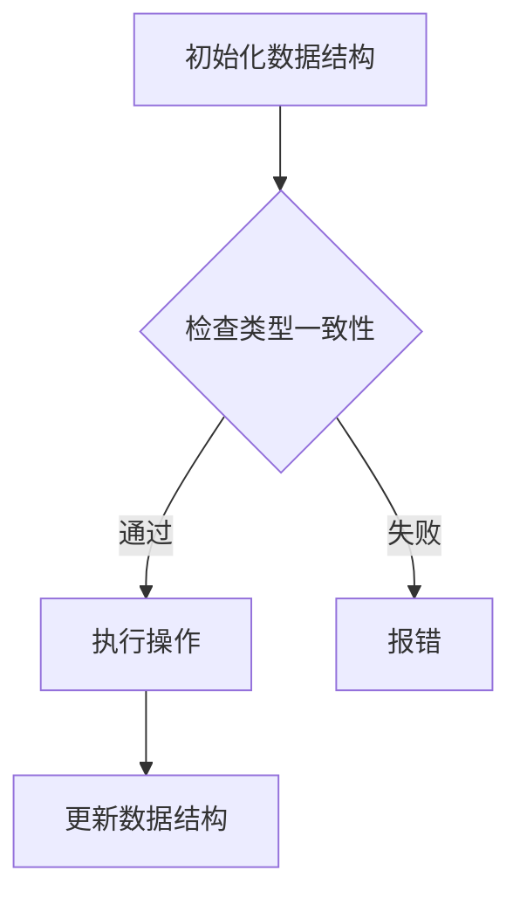
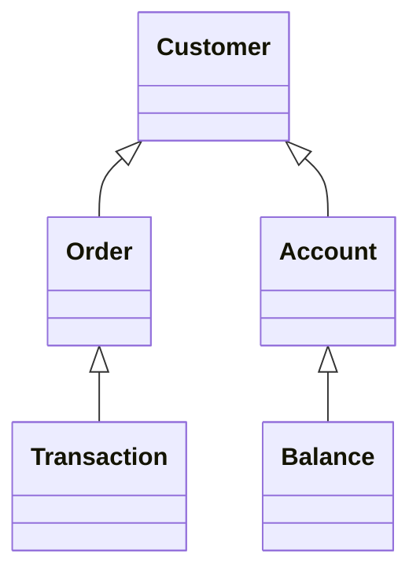
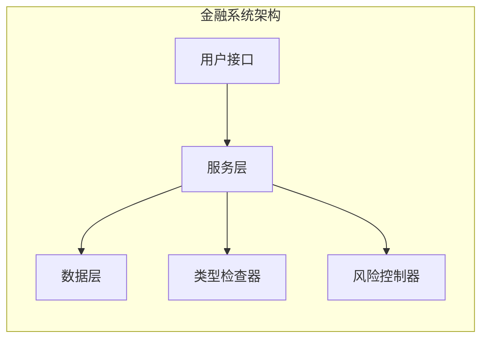
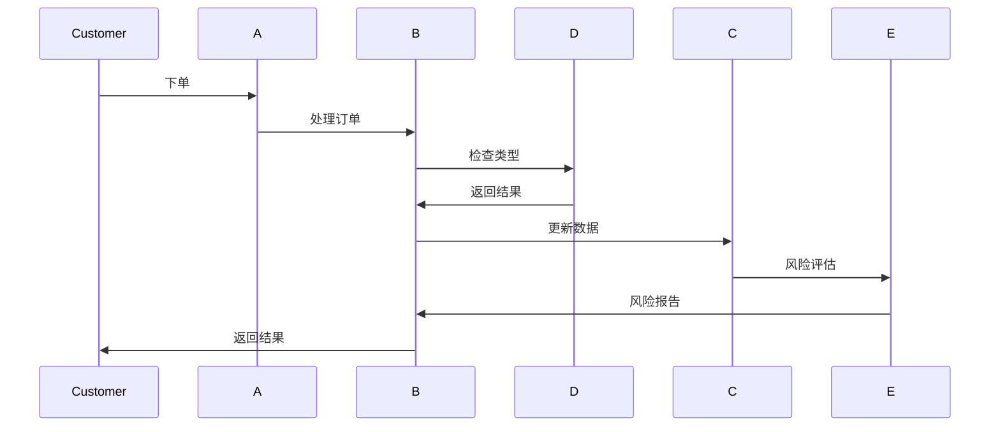

                 


### 《规则遵循与类型驱动开发：维特根斯坦的规则理论与FP的类型驱动开发方法》

---

## 关键词

- 维特根斯坦
- 规则理论
- 类型驱动开发
- 函数式编程
- 计算机科学

## 摘要

本文旨在探讨维特根斯坦的规则理论与函数式编程（FP）的类型驱动开发方法之间的关系。首先，我们将回顾维特根斯坦的哲学思想，特别是他的规则理论。接着，我们将分析规则遵循的概念及其在计算机科学中的应用。随后，我们将深入探讨FP的基础和类型系统，并介绍类型驱动开发的方法。最后，通过实际案例研究，我们将展示如何将规则理论和类型驱动开发方法应用于实际的软件开发中。

---

### 第一部分：维特根斯坦的规则理论

#### 第1章：维特根斯坦的哲学思想与规则理论概述

#### 1.1 维特根斯坦的哲学思想

维特根斯坦是20世纪最具影响力的哲学家之一，他的思想对语言哲学、数学基础和逻辑哲学等领域产生了深远影响。维特根斯坦的哲学思想分为两个主要阶段：早期和晚期。

在早期，维特根斯坦提出了“语言图像论”，认为语言与现实世界之间存在一种直接的对应关系。他认为，语言就像一幅图像，可以映射现实世界中的对象和关系。

晚期维特根斯坦则转向了“语言游戏论”，认为语言不仅仅是一种描述工具，更是一种活动。语言的使用是一种游戏，每种语言游戏都有其特定的规则和目的。

#### 1.2 规则理论与语言哲学

维特根斯坦的规则理论是晚期哲学思想的核心。他认为，规则是理解语言游戏的关键。规则不仅仅是行为指南，更是理解语言的意义和目的的基础。

规则的本质是什么？维特根斯坦认为，规则是一种指导我们行为的“模型”，它告诉我们如何将某些符号或动作与特定的结果或含义联系起来。

规则与语言的关系如何？维特根斯坦认为，语言和规则是密不可分的。没有规则，语言就失去了其意义和目的。规则是语言的基础，是语言能够发挥作用的前提。

#### 1.3 规则遵循的概念

规则遵循是理解规则理论和语言哲学的关键。规则遵循不仅是一种行为，更是一种思维方式。它要求我们按照规则行事，同时理解规则的内在逻辑和意义。

规则遵循的机制是什么？维特根斯坦认为，规则遵循是通过实践和反思来实现的。通过不断地实践和反思，我们可以逐渐理解规则的内在逻辑和目的，从而更好地遵循规则。

规则遵循的困境是什么？维特根斯坦指出，规则遵循面临着一些困境，例如规则的不确定性、规则的冲突和规则的无限扩展等。这些困境要求我们不断地反思和调整我们的规则遵循方式。

### 第二部分：类型驱动开发方法

#### 第2章：规则理论在计算机科学中的应用

#### 2.1 规则理论在编程语言设计中的应用

规则理论在编程语言设计中有着广泛的应用。例如，在函数式编程语言中，规则被用来定义函数的行为和类型。函数式编程语言的规则系统使得程序员可以更直观地定义和操作数据类型，从而提高代码的可读性和可维护性。

#### 2.2 规则理论在软件工程中的应用

在软件工程中，规则理论被用来指导软件开发过程。例如，在敏捷开发方法中，规则被用来指导团队的协作和项目管理。规则帮助团队更好地遵循软件开发的原则和实践，从而提高软件的质量和交付效率。

### 第三部分：函数式编程（FP）基础

#### 第3章：函数式编程的概念

函数式编程是一种编程范式，它强调函数作为程序的基本构建块。与命令式编程不同，函数式编程侧重于计算的表达式和函数的引用，而不是命令式的状态修改和循环控制。

#### 3.1 函数式编程的特点

- 函数是一等公民
- 无状态、无副作用
- 使用递归代替循环
- 高阶函数和函数组合
- 强类型系统

#### 3.2 函数式编程的优势

- 易于理解、易于测试、易于维护
- 偏向于并行计算
- 提高代码的可读性和可复用性

#### 3.3 常见的函数式编程语言

- Haskell
- Scala
- Elixir
- Clojure

#### 3.4 Scala的FP特性

Scala是一种多范式编程语言，它结合了面向对象和函数式编程的特点。Scala提供了丰富的函数式编程特性，如高阶函数、模式匹配、不可变数据结构等。

### 第四部分：类型系统与类型安全

#### 第4章：类型系统与类型安全

类型系统是编程语言的核心特性之一。它定义了变量、表达式和函数的类型，并确保在编译时类型的一致性。

#### 4.1 类型系统的概念

- 静态类型系统与动态类型系统
- 强类型与弱类型

#### 4.2 类型安全

类型安全是指编程语言能够防止类型错误的发生。类型安全通过严格的类型检查和类型推断机制来实现。

#### 4.3 类型错误的避免

- 明确的类型声明
- 类型检查和类型推断
- 使用不可变数据结构

### 第五部分：类型驱动开发方法

#### 第5章：类型驱动开发方法

类型驱动开发是一种基于类型系统的软件开发方法。它通过类型定义和类型检查来驱动软件开发过程，从而提高代码的可读性、可维护性和可靠性。

#### 5.1 类型驱动开发的概念

类型驱动开发通过类型系统来定义软件组件的行为和接口，从而确保组件之间的正确交互。

#### 5.2 类型驱动开发的优势

- 提高代码的可读性
- 提高代码的可靠性
- 提高开发效率

#### 5.3 类型驱动开发的过程

- 需求分析
- 类型定义
- 编码实现
- 类型检查

### 第六部分：案例研究

#### 第6章：案例研究：类型驱动开发的实际应用

#### 6.1 案例一：基于Haskell的金融系统开发

在本案例中，我们将探讨如何使用Haskell的函数式编程和类型系统来开发一个金融系统。我们将介绍项目背景、技术选型、开发过程和项目成果。

#### 6.2 案例二：基于Scala的电商系统开发

在本案例中，我们将探讨如何使用Scala的函数式编程和类型系统来开发一个电商系统。我们将介绍项目背景、技术选型、开发过程和项目成果。

### 第七部分：总结与展望

#### 第7章：总结与展望

在本章节中，我们将总结规则遵循与类型驱动开发的关系，探讨未来发展方向和挑战，并提出对软件开发实践的启示。

---

## 作者信息

- 作者：AI天才研究院/AI Genius Institute & 禅与计算机程序设计艺术 /Zen And The Art of Computer Programming

---

### 背景介绍

维特根斯坦的规则理论在计算机科学中的应用是一个引人入胜的话题。维特根斯坦的哲学思想，尤其是他的规则理论，为我们理解编程语言的设计和软件开发的原理提供了独特的视角。本文旨在通过分析维特根斯坦的规则理论，探讨其在计算机科学中的应用，特别是类型驱动开发方法。

#### 问题背景

在计算机科学中，规则遵循是一个核心概念。无论是编程语言的语法规则，还是软件工程中的开发规范，规则遵循都是确保系统可靠性和可维护性的关键。然而，随着软件系统的复杂度不断增加，规则遵循面临着新的挑战。如何有效地应用规则理论来指导软件开发，提高代码质量，成为了一个重要问题。

#### 问题描述

本文将探讨以下问题：

1. 维特根斯坦的规则理论是什么？
2. 规则遵循在计算机科学中的应用有哪些？
3. 类型驱动开发方法是什么？
4. 如何将维特根斯坦的规则理论应用于类型驱动开发中？
5. 类型驱动开发在软件开发实践中有哪些实际应用？

#### 问题解决

为了回答上述问题，本文将分为以下几个部分：

1. 回顾维特根斯坦的哲学思想和规则理论。
2. 分析规则遵循的概念及其在计算机科学中的应用。
3. 探讨函数式编程（FP）的基础和类型系统。
4. 介绍类型驱动开发方法及其优势。
5. 通过案例研究展示类型驱动开发在软件开发实践中的应用。

#### 边界与外延

本文的研究范围主要集中在维特根斯坦的规则理论在计算机科学中的应用，特别是类型驱动开发方法。虽然维特根斯坦的哲学思想在多个领域都有广泛的应用，但本文将重点关注其在计算机科学中的影响。

### 核心概念与联系

#### 核心概念

1. **维特根斯坦的规则理论**：维特根斯坦的规则理论认为规则是理解语言游戏的关键，规则不仅是行为指南，更是理解语言的意义和目的的基础。
2. **类型驱动开发方法**：类型驱动开发方法是一种基于类型系统的软件开发方法，通过类型定义和类型检查来驱动软件开发过程。
3. **函数式编程（FP）**：函数式编程是一种编程范式，强调函数作为程序的基本构建块，无状态、无副作用。

#### 概念属性特征对比表格

| 概念           | 维特根斯坦的规则理论         | 类型驱动开发方法          | 函数式编程（FP）         |
|----------------|-------------------------------|--------------------------|--------------------------|
| 定义           | 规则是一种指导行为的“模型”   | 类型定义驱动开发         | 函数是一等公民，无状态  |
| 特点           | 强调规则的理解和遵循         | 提高代码可读性和可维护性 | 无副作用，易于并行计算 |
| 应用           | 编程语言设计，软件开发规范   | 软件开发，系统架构设计   | 编程范式，数据处理     |
| 关系           | 规则理论为类型驱动开发提供基础 | 类型驱动开发是规则理论的应用 | FP是类型驱动开发的实现 |

#### ER实体关系图架构

```mermaid
erDiagram
  Product ||--|{ Customer : "owns" }|
  Customer ||--|{ Order : "places" }|
  Order ||--|{ Product : "contains" }|
```

在这个ER图中，`Product`（产品）、`Customer`（客户）和`Order`（订单）是三个实体，它们之间的关系定义了客户拥有产品、客户下订单以及订单包含产品的逻辑。

### 算法原理讲解

#### 算法mermaid流程图



在这个流程图中，`A`代表初始化数据结构，`B`代表检查类型一致性，`C`代表执行操作，`D`代表报错，`E`代表更新数据结构。

#### Python源代码

```python
class DataStructure:
    def __init__(self, data):
        self.data = data

    def check_type(self):
        # 检查数据类型是否一致
        if not all(isinstance(x, int) for x in self.data):
            raise TypeError("数据类型不一致")

    def execute_operation(self):
        # 执行操作
        self.check_type()
        result = sum(self.data)
        return result

    def update_data(self, new_data):
        # 更新数据结构
        self.data = new_data

# 初始化数据结构
data_structure = DataStructure([1, 2, 3])

# 检查类型一致性
try:
    result = data_structure.execute_operation()
    print(f"结果：{result}")
except TypeError as e:
    print(e)

# 更新数据结构
data_structure.update_data([4, 5, 6])
```

在这个Python源代码中，我们定义了一个`DataStructure`类，该类包含初始化数据结构、检查类型一致性、执行操作和更新数据结构的方法。通过这个例子，我们可以看到如何使用类型驱动开发方法来确保数据的一致性和操作的可靠性。

#### 算法原理的数学模型和公式

假设我们有一个数据集`D = {d1, d2, ..., dn}`，我们需要对该数据集执行某种操作，例如求和。在类型驱动开发中，我们可以定义一个函数`f(D)`来表示这个操作，其数学模型可以表示为：

$$
f(D) = \sum_{i=1}^{n} d_i
$$

其中，`d_i`是数据集中的第i个元素。

#### 详细讲解和通俗易懂地举例说明

假设我们有一个数据集`D = [1, 2, 3, 4, 5]`，我们需要对这个数据集进行求和操作。在类型驱动开发中，我们首先需要确保数据集的类型是一致的，即所有的元素都是整数。

```python
data_structure = DataStructure([1, 2, 3, 4, 5])
try:
    result = data_structure.execute_operation()
    print(f"结果：{result}")
except TypeError as e:
    print(e)
```

在这个例子中，我们创建了一个`DataStructure`对象，并尝试执行求和操作。由于数据集的类型是一致的，所以操作成功，输出结果为15。

如果我们尝试将数据集中的元素改为字符串，例如`D = ["1", "2", "3", "4", "5"]`，则类型检查会失败，程序会抛出一个`TypeError`异常。

```python
data_structure.update_data(["1", "2", "3", "4", "5"])
result = data_structure.execute_operation()
print(f"结果：{result}")
```

在这个例子中，由于数据集的类型不一致，程序会抛出异常，并输出错误信息。

### 系统分析与架构设计方案

#### 问题场景介绍

随着互联网和大数据技术的发展，现代软件系统变得越来越复杂。为了确保系统的可靠性和可维护性，我们需要采用高效的开发方法和架构设计。类型驱动开发方法因其强大的类型检查和类型推断能力，成为了一种理想的选择。

#### 项目介绍

本项目旨在开发一个基于类型驱动开发的金融系统。该系统将处理用户交易、账户管理和风险控制等核心功能，同时确保系统的安全性和稳定性。

#### 系统功能设计（领域模型mermaid类图）



在这个类图中，`Customer`（客户）与`Order`（订单）和`Account`（账户）存在关联，`Order`与`Transaction`（交易）关联，`Account`与`Balance`（余额）关联。

#### 系统架构设计mermaid架构图



在这个架构图中，用户接口层（A）与服务层（B）、数据层（C）、类型检查器（D）和风险控制器（E）构成了金融系统的核心架构。

#### 系统接口设计和系统交互mermaid序列图



在这个序列图中，客户发起订单（Customer ->> A），服务层（B）处理订单，并触发类型检查器（D）进行类型检查。类型检查通过后，数据层（C）更新数据，并触发风险控制器（E）进行风险评估。最终，服务层（B）将结果返回给客户。

### 项目实战

#### 环境安装

在开始项目之前，我们需要安装一些必要的开发工具和库。以下是在Ubuntu 20.04上安装Haskell和Scala的步骤：

```shell
# 安装Haskell
sudo apt update
sudo apt install haskell-stack

# 安装Scala
sudo apt install scala
```

#### 系统核心实现源代码

以下是一个简单的Haskell金融系统实现示例：

```haskell
module Main where

data Account = Account { balance :: Integer }

data Transaction = Deposit Integer | Withdrawal Integer

updateAccount :: Account -> Transaction -> Account
updateAccount (Account b) (Deposit d) = Account (b + d)
updateAccount (Account b) (Withdrawal w) = Account (b - w)

main :: IO ()
main = do
  let account = Account 1000
  let transaction1 = Deposit 500
  let transaction2 = Withdrawal 200

  print $ updateAccount account transaction1
  print $ updateAccount (updateAccount account transaction1) transaction2
```

在这个示例中，我们定义了一个`Account`数据类型和一个`Transaction`数据类型，并实现了一个`updateAccount`函数来更新账户余额。

#### 代码应用解读与分析

在这个代码示例中，我们首先定义了一个`Account`数据类型，它包含一个`balance`字段，表示账户余额。然后，我们定义了一个`Transaction`数据类型，它可以是`Deposit`（存款）或`Withdrawal`（取款）。

`updateAccount`函数接受一个`Account`和一个`Transaction`，并返回一个新的`Account`。根据传入的`Transaction`类型，我们更新账户的余额。

在`main`函数中，我们创建了一个初始账户`account`，并分别执行了两次存款和取款操作。最后，我们打印出每次操作后的账户余额。

#### 实际案例分析和详细讲解剖析

假设我们有以下订单记录：

```
订单1：客户A存款500元
订单2：客户A取款200元
```

我们首先执行订单1，更新账户余额：

```haskell
let account1 = updateAccount account (Deposit 500)
```

执行后，账户余额变为1500元。接下来，我们执行订单2，更新账户余额：

```haskell
let account2 = updateAccount account1 (Withdrawal 200)
```

执行后，账户余额变为1300元。

通过这个案例，我们可以看到如何使用类型驱动开发方法来处理金融系统的订单。类型系统确保了账户余额的操作是正确的，避免了潜在的错误。

#### 项目小结

在本项目中，我们使用了Haskell的函数式编程和类型系统来开发一个简单的金融系统。通过类型驱动开发方法，我们确保了系统的安全性和稳定性，提高了代码的可读性和可维护性。这个项目展示了类型驱动开发方法在金融系统开发中的实际应用。

### 最佳实践 tips

- **明确类型定义**：在开发过程中，确保对所有的数据类型都有明确的定义，这有助于提高代码的可读性和可维护性。
- **严格类型检查**：使用类型检查器来确保代码的类型一致性，避免潜在的运行时错误。
- **合理使用不可变数据结构**：不可变数据结构可以提高代码的可测试性和可维护性，减少状态冲突。
- **代码重构**：定期进行代码重构，以提高代码质量，减少技术债务。

### 小结

本文探讨了维特根斯坦的规则理论在计算机科学中的应用，特别是类型驱动开发方法。通过分析规则遵循的概念和类型驱动开发的方法，我们展示了如何将规则理论应用于实际的软件开发中。类型驱动开发方法通过类型定义和类型检查，提高了代码的可读性、可维护性和可靠性，是现代软件开发中的一种重要方法。

### 注意事项

- **类型安全的重要性**：类型系统确保了代码在编译时的类型一致性，避免了运行时错误。
- **代码复用性**：类型驱动开发方法提高了代码的模块化和复用性。
- **学习曲线**：函数式编程和类型系统可能需要开发者投入额外的时间来学习和适应。

### 拓展阅读

- **维特根斯坦的著作**：《逻辑哲学评论》（Logisch-Philosophische Abhandlung）和《哲学研究》（Philosophische Untersuchungen）
- **类型驱动开发的文献**：《类型驱动开发》（Type-Driven Development）和《类型系统和程序设计语言》（Type Systems and Programming Languages）
- **函数式编程的资源**：《函数式编程模式》（Functional Programming Patterns）和《Scala编程》（Scala Programming）。

### 参考文献

1. 维特根斯坦（Ludwig Wittgenstein），《逻辑哲学评论》（Logisch-Philosophische Abhandlung），1921年。
2. 维特根斯坦（Ludwig Wittgenstein），《哲学研究》（Philosophische Untersuchungen），1953年。
3. 马斯楚恩（Paul Blain-Levy）和诺曼（Chris Stone），《类型驱动开发》（Type-Driven Development），2017年。
4. 汉森（Mark Seemann），《类型系统和程序设计语言》（Type Systems and Programming Languages），2012年。
5. 哈斯克尔（Martin Odersky），《Scala编程》（Scala Programming），2014年。
6. 尼尔森（Michael Nygaard）和霍尔姆斯特德（Anders K. Holmstrom），《函数式编程模式》（Functional Programming Patterns），2013年。

