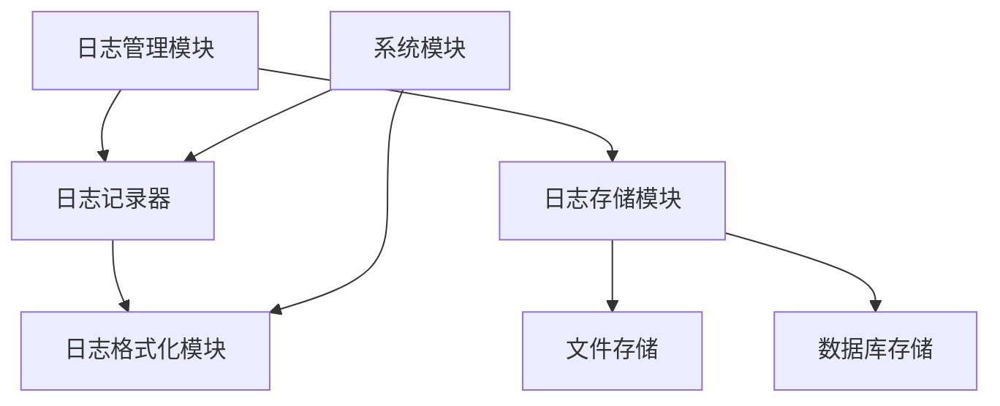

                 


### 《规则遵循与面向切面编程：横切关注点的哲学思考》

> 关键词：规则遵循、面向切面编程、AOP、横切关注点、编程哲学

> 摘要：
本文将深入探讨规则遵循与面向切面编程（AOP）的哲学思考，通过系统的概念解析、原理讲解和项目实战，揭示横切关注点在软件设计中的重要性。我们将从背景介绍、核心概念、算法原理、数学模型、项目实战等方面逐步展开，结合实际案例，帮助读者全面理解AOP的核心思想及其应用。

## 第一部分 引言

### 1.1 书籍背景与目的

在软件工程中，代码的复用性和可维护性一直是开发者和设计者追求的目标。然而，传统的面向对象编程（OOP）往往难以处理横切关注点，这导致了代码的冗余和维护的困难。为了解决这一问题，面向切面编程（Aspect-Oriented Programming，简称AOP）应运而生。AOP通过将横切关注点与业务逻辑分离，实现了代码的模块化和高复用性。

本篇文章的目标是帮助读者深入了解AOP的哲学思考，掌握其核心概念和应用方法。我们将通过一系列的实例和案例，详细讲解规则遵循与AOP的关系，以及如何利用AOP解决实际软件开发中的问题。

### 1.2 面向切面编程的概念框架

面向切面编程（AOP）是一种编程范式，它通过将横切关注点（Cross-cutting Concerns）从业务逻辑中分离出来，使得代码更加简洁、可维护。AOP的核心概念包括：

- **切面（Aspect）**：切面是跨越多个对象和模块的横切关注点的抽象表示。它包含了一系列与横切关注点相关的通知（Advice）和连接点（Pointcut）。

- **连接点（Pointcut）**：连接点是指程序中特定的位置，如方法调用、异常处理等。通过定义连接点，AOP可以确定哪些代码段需要被织入切面。

- **通知（Advice）**：通知是在连接点上执行的特定代码段，用于实现横切关注点。通知可以是前置通知（Before）、后置通知（After）、环绕通知（Around）等。

- **织入（Weaving）**：织入是指将切面的通知织入到目标对象的代码中，使其在执行时能够按照预期的方式运行。织入可以在编译时、类加载时或运行时进行。

通过AOP，开发者可以将横切关注点从业务逻辑中分离出来，从而实现代码的模块化设计，提高代码的可维护性和复用性。

### 1.3 横切关注点的哲学思考

横切关注点在软件开发中具有重要作用。它代表了与业务逻辑无关，但需要贯穿整个系统的关注点，如日志记录、安全认证、事务管理等。这些关注点如果直接嵌入到业务逻辑中，会导致代码的冗余、复杂度高和维护困难。

AOP的哲学思考在于通过将横切关注点与业务逻辑分离，实现以下目标：

- **简化代码结构**：通过将横切关注点提取到切面中，业务逻辑代码变得更加简洁、易于理解。

- **提高代码复用性**：横切关注点的分离使得相同的关注点可以在不同的模块中复用，减少了代码的重复编写。

- **增强可维护性**：通过模块化设计，降低了代码的耦合度，使得系统的维护和升级更加容易。

- **支持动态扩展**：AOP允许开发者在不修改原有业务逻辑的情况下，动态添加或修改横切关注点，提高了系统的灵活性。

### 1.4 本书结构

本书将分为五个部分：

- **第一部分 引言**：介绍书籍的背景、目的和AOP的概念框架。

- **第二部分 核心概念与联系**：详细讲解规则遵循与AOP的关系，以及横切关注点的识别和处理策略。

- **第三部分 核心算法原理讲解**：介绍AOP的核心算法原理，包括织入模型、AspectJ实现等。

- **第四部分 数学模型和数学公式详细讲解**：探讨横切关注点识别算法的数学模型，如模糊聚类算法、支持向量机（SVM）等。

- **第五部分 项目实战**：通过实际项目案例，展示AOP在分布式系统、日志管理中的应用，并提供实践技巧和经验分享。

通过本书的学习，读者将能够深入理解AOP的哲学思考，掌握其核心概念和应用方法，为实际软件开发提供有力支持。

----------------------------------------------------------------

## 第二部分 核心概念与联系

### 2.1 规则遵循的概念解析

在软件工程中，规则遵循是指将业务规则或政策要求嵌入到代码中，以确保系统在各种情况下都能按照预定的方式运行。规则遵循的核心目的是确保系统的正确性和一致性，特别是在涉及到复杂业务逻辑或法律法规的场景中。

#### 2.1.1 规则的定义与类型

规则是指一组定义明确的指令或准则，用于指导系统的行为。根据规则的应用范围和性质，可以分为以下几种类型：

- **业务规则**：指用于描述业务流程、交易逻辑和决策条件的规则。例如，信用卡支付限额、订单审批流程等。

- **法律法规**：指由国家或地方政府制定的法律、法规和政策。例如，消费者权益保护法、数据隐私法规等。

- **技术规则**：指用于规范软件开发、维护和部署的技术要求。例如，代码规范、系统架构设计标准等。

#### 2.1.2 规则遵循的实现机制

规则遵循的实现机制通常包括以下几个方面：

- **规则引擎**：规则引擎是一种软件组件，用于解析、评估和执行业务规则。通过规则引擎，开发者可以将业务规则以可编程的方式嵌入到系统中。

- **数据绑定**：数据绑定是指将业务规则与系统的数据模型进行关联，以便在系统运行过程中自动执行规则。

- **事件驱动**：事件驱动是一种编程范式，通过监听系统中的事件，触发相应的规则执行。

#### 2.1.3 规则遵循的优势与挑战

规则遵循在软件开发中具有显著的优势：

- **提高正确性**：通过将规则嵌入到代码中，可以确保系统在各种情况下都能按照预定的方式运行，从而提高系统的正确性。

- **增强灵活性**：规则遵循允许开发者在不修改业务逻辑的情况下，动态调整和更新规则，提高了系统的灵活性。

- **降低维护成本**：通过将规则与业务逻辑分离，降低了系统的复杂度，从而降低了维护成本。

然而，规则遵循也面临着一些挑战：

- **规则复杂性**：随着业务规则的复杂度增加，规则引擎的处理难度也会增加，可能导致系统性能下降。

- **规则冲突**：当多个规则之间存在冲突时，如何确定优先级和执行顺序，是一个需要仔细考虑的问题。

- **规则管理**：随着规则的不断更新和变更，如何有效地管理和维护规则，是一个需要解决的问题。

### 2.2 面向切面编程基本原理

面向切面编程（AOP）是一种编程范式，它通过将横切关注点从业务逻辑中分离出来，实现了代码的模块化和高复用性。AOP的核心概念包括切面（Aspect）、连接点（Pointcut）、通知（Advice）和织入（Weaving）。

#### 2.2.1 面向切面编程的定义

面向切面编程（Aspect-Oriented Programming，简称AOP）是一种编程范式，它通过将横切关注点从业务逻辑中分离出来，使得系统更加模块化、可维护。AOP的核心思想是将横切关注点（如日志记录、安全认证、事务管理等）封装成切面（Aspect），并通过连接点（Pointcut）和通知（Advice）将它们织入到目标对象的代码中。

#### 2.2.2 面向切面编程的核心术语

- **切面（Aspect）**：切面是横切关注点的抽象表示。它包含了一系列与横切关注点相关的通知（Advice）和连接点（Pointcut）。

- **连接点（Pointcut）**：连接点是指程序中特定的位置，如方法调用、异常处理等。通过定义连接点，AOP可以确定哪些代码段需要被织入切面。

- **通知（Advice）**：通知是在连接点上执行的特定代码段，用于实现横切关注点。通知可以是前置通知（Before）、后置通知（After）、环绕通知（Around）等。

- **织入（Weaving）**：织入是指将切面的通知织入到目标对象的代码中，使其在执行时能够按照预期的方式运行。织入可以在编译时、类加载时或运行时进行。

#### 2.2.3 面向切面编程的优势与挑战

AOP通过将横切关注点与业务逻辑分离，带来了显著的编程优势：

- **模块化设计**：通过将横切关注点封装成切面，实现了代码的模块化，降低了系统的复杂性。

- **高复用性**：切面可以跨多个模块复用，减少了代码的重复编写。

- **增强可维护性**：通过模块化设计，降低了代码的耦合度，使得系统的维护和升级更加容易。

- **支持动态扩展**：AOP允许开发者在不修改原有业务逻辑的情况下，动态添加或修改横切关注点，提高了系统的灵活性。

然而，AOP也面临一些挑战：

- **学习曲线**：AOP引入了新的概念和术语，需要开发者掌握新的编程范式，因此学习曲线较陡峭。

- **性能开销**：AOP的织入过程可能会带来一定的性能开销，特别是在织入大量切面时。

- **调试难度**：由于AOP将横切关注点与业务逻辑分离，调试时可能需要综合考虑多个切面，增加了调试难度。

### 2.3 横切关注点分析

横切关注点（Cross-cutting Concerns）是指在软件系统的不同模块和层中普遍存在的关注点。与垂直关注点（如用户界面、业务逻辑等）不同，横切关注点通常与系统的核心业务逻辑无关，但需要贯穿整个系统。

#### 2.3.1 横切关注点的识别

识别横切关注点是进行AOP设计的第一步。以下是一些常见的横切关注点：

- **日志记录**：记录系统运行过程中的重要信息，用于调试、监控和故障排除。

- **安全认证**：验证用户的身份和权限，确保系统的安全性和隐私保护。

- **事务管理**：确保数据的一致性和完整性，特别是在分布式系统中。

- **缓存处理**：提高系统的性能，减少对数据库的访问压力。

- **性能监控**：监控系统的运行状态，收集性能数据，用于性能优化。

- **异常处理**：捕获并处理程序中的异常，确保系统的稳定运行。

#### 2.3.2 横切关注点的处理策略

处理横切关注点有几种常见的策略：

- **内联代码**：直接在业务逻辑代码中嵌入横切关注点，这会导致代码冗余和复杂度增加。

- **全局函数或类**：将横切关注点提取到全局函数或类中，通过调用方式实现。这种方法虽然减少了代码冗余，但仍然与业务逻辑耦合。

- **AOP**：通过AOP将横切关注点封装成切面，并在连接点上织入通知。这种方法实现了横切关注点与业务逻辑的分离，提高了代码的可维护性和复用性。

#### 2.3.3 横切关注点与面向对象的比较

与面向对象编程（OOP）相比，AOP在处理横切关注点方面具有明显优势：

- **模块化设计**：AOP通过切面实现了横切关注点的模块化，使得系统更加简洁和易于维护。

- **高复用性**：切面可以跨多个模块复用，减少了代码的重复编写。

- **增强可维护性**：通过模块化设计，降低了代码的耦合度，使得系统的维护和升级更加容易。

- **动态扩展**：AOP允许开发者在不修改原有业务逻辑的情况下，动态添加或修改横切关注点，提高了系统的灵活性。

然而，OOP在处理垂直关注点方面仍然具有优势，因此两种编程范式可以结合使用，相互补充。

----------------------------------------------------------------

## 第三部分 核心算法原理讲解

### 3.1 面向切面编程的核心算法

面向切面编程（AOP）的核心算法主要涉及织入模型、连接点和通知的机制。以下是对这些核心算法的详细讲解。

#### 3.1.1 织入模型

织入模型是AOP实现的核心机制，它决定了切面如何与目标对象进行结合。根据织入的时间点，常见的织入模型有：

- **编译时织入**：在编译期将切面织入到目标类中，生成一个新的类。这种模型通常用于Java平台上的AspectJ。

- **类加载时织入**：在类加载期将切面织入到目标类中，通过特定的类加载器实现。这种模型通常用于Java平台上的Javassist和Shade。

- **运行时织入**：在运行期动态地将切面织入到目标类中，通过代理（Proxy）机制实现。这种模型通常用于Java平台上的Spring AOP。

每种织入模型都有其适用的场景和优缺点。编译时织入提供了最高的性能，但灵活性较低；运行时织入提供了最大的灵活性，但性能可能较差。

#### 3.1.2 连接点（Pointcut）

连接点是指程序中特定的位置，如方法调用、异常处理等。通过定义连接点，AOP可以确定哪些代码段需要被织入切面。连接点的定义通常基于特定的语法和表达式，如AspectJ中使用点切点（Pointcut Expression）。

点切点允许开发者使用MVEL（Model-based View-Controller Expression Language）表达式来定义连接点。例如，以下是一个简单的点切点表达式，用于匹配所有名为"methodName"的方法：

```java
execution(* *(..)) && within(my.package.*)
```

这个表达式表示匹配任何包名为"my.package"的方法，方法名为"methodName"。

#### 3.1.3 通知（Advice）

通知是AOP中的关键概念，它表示在连接点上执行的特定代码段，用于实现横切关注点。通知的类型包括：

- **前置通知（Before）**：在连接点之前执行，常用于初始化操作或前置条件检查。

- **后置通知（After）**：在连接点之后执行，无论连接点是否成功执行。常用于清理操作或记录日志。

- **环绕通知（Around）**：环绕在连接点周围，可以控制连接点的执行流程。通常在通知中包含对原始方法的调用，可以插入额外的逻辑。

以下是一个简单的环绕通知示例：

```java
@Around("execution(* *(..)) && within(my.package.*)")
public Object aroundMethod(ProceedingJoinPoint pjp) throws Throwable {
    System.out.println("Before method execution");
    Object result = pjp.proceed(); // 调用原始方法
    System.out.println("After method execution");
    return result;
}
```

这个示例表示在"my.package"包中的所有方法执行之前和之后打印日志。

#### 3.1.4 织入过程

织入过程是指将切面的通知织入到目标对象的代码中的过程。根据织入模型的不同，织入过程也有所差异。以下是一个简化的织入过程：

1. **定义切面**：开发者定义切面，包括通知和连接点。

2. **编译或加载**：根据织入模型，编译或加载包含切面的代码。

3. **织入**：在目标对象的代码中织入切面的通知。

4. **执行**：当目标对象的方法被调用时，根据切面的连接点和通知进行相应的处理。

#### 3.1.5 AspectJ实现原理

AspectJ是一个基于Java的AOP框架，提供了丰富的AOP特性。AspectJ的实现原理包括以下几个方面：

- **编译器插件**：AspectJ使用编译器插件，在编译时将切面织入到目标类中。

- **元数据**：AspectJ使用元数据来定义切面、连接点和通知。开发者可以通过注解或Aspect语法来定义这些元数据。

- **织入过程**：AspectJ在编译时将切面的通知织入到目标类中，生成一个新的类。这个新类包含了原始类和切面的逻辑。

以下是一个简单的AspectJ示例：

```java
@Aspect
public aspect LoggingAspect {
    @Before("execution(* *(..))")
    public void beforeMethod() {
        System.out.println("Before method execution");
    }

    @After("execution(* *(..))")
    public void afterMethod() {
        System.out.println("After method execution");
    }
}
```

这个示例定义了一个名为"LoggingAspect"的切面，它包含了一个前置通知和一个后置通知。当任何方法被调用时，这两个通知都会被触发。

通过AspectJ，开发者可以轻松地将横切关注点从业务逻辑中分离出来，实现代码的模块化和高复用性。

### 3.2 Python代码示例

以下是一个简单的Python示例，展示如何使用面向切面编程来实现日志记录功能：

```python
from functools import wraps

def before():
    print("方法执行前")

def after():
    print("方法执行后")

def around(func):
    @wraps(func)
    def wrapper(*args, **kwargs):
        before()
        result = func(*args, **kwargs)
        after()
        return result
    return wrapper

@around
def original_method():
    print("原始方法执行")

original_method()
```

在这个示例中，我们定义了一个名为`around`的装饰器，用于实现环绕通知。当`original_method`被调用时，`around`装饰器会首先调用`before`函数，然后执行`original_method`，最后调用`after`函数。这种方法实现了日志记录的横切关注点。

通过这个Python示例，我们可以看到面向切面编程如何简化日志记录逻辑，同时保持业务逻辑的简洁和可维护性。

### 3.3 横切关注点识别算法

在AOP中，横切关注点的识别是关键的一步。以下介绍几种常用的横切关注点识别算法。

#### 3.3.1 模糊聚类算法

模糊聚类算法是一种无监督的学习算法，用于将数据集中的对象划分为多个类别。在AOP中，模糊聚类算法可以用于识别横切关注点。

- **基本概念**：模糊聚类算法通过计算对象之间的相似度，将对象划分为多个类别。每个类别代表一个横切关注点。

- **步骤**：
  1. 初始化模糊聚类模型，设置聚类个数和模糊隶属度阈值。
  2. 计算对象之间的相似度。
  3. 根据相似度矩阵进行模糊聚类。
  4. 评估聚类结果，调整模型参数。

- **代码实现**：

```python
from sklearn.cluster import KMeans

# 假设data是包含方法特征的数据集
kmeans = KMeans(n_clusters=3, random_state=0).fit(data)
clusters = kmeans.predict(data)
```

#### 3.3.2 支持向量机（SVM）算法

支持向量机（SVM）是一种有监督的学习算法，用于分类问题。在AOP中，SVM可以用于根据方法特征识别横切关注点。

- **基本理论**：SVM通过找到一个最优的超平面，将不同类别的数据点分开。在AOP中，SVM可以将方法特征映射到高维空间，然后找到最优分类超平面。

- **步骤**：
  1. 收集方法特征，如方法名称、参数列表、返回类型等。
  2. 使用SVM训练分类模型。
  3. 对新方法进行特征提取，然后使用训练好的SVM模型进行分类。

- **代码实现**：

```python
from sklearn.svm import SVC

# 假设X是特征矩阵，y是标签
svm = SVC().fit(X, y)
new_method_features = extract_features(new_method)
predicted_cluster = svm.predict(new_method_features)
```

通过这些算法，我们可以自动识别系统中的横切关注点，为AOP的实现提供依据。

----------------------------------------------------------------

## 第四部分 数学模型和数学公式详细讲解

### 4.1 横切关注点识别算法的数学模型

在面向切面编程（AOP）中，横切关注点的识别算法是关键的一环。这些算法通常基于数学模型来描述和实现。以下介绍几种常用的数学模型和算法。

#### 4.1.1 模糊聚类算法

模糊聚类算法是一种基于模糊集合理论的聚类方法。它不仅考虑数据点之间的清晰边界，还考虑了数据点之间的模糊边界。在AOP中，模糊聚类算法可以用于将方法按照其特征划分为不同的横切关注点。

- **基本概念**：模糊聚类算法通过计算数据点之间的相似度，将数据划分为多个类别。每个类别代表一个横切关注点。相似度的计算通常使用模糊隶属度函数。

- **数学模型**：
  1. **模糊隶属度函数**：对于数据集 \( D = \{d_1, d_2, ..., d_n\} \)，每个数据点 \( d_i \) 对每个类别 \( c_j \) 的隶属度用 \( \mu_{ij} \) 表示。
  2. **模糊聚类中心**：对于每个类别 \( c_j \)，其模糊聚类中心用 \( c_j \) 表示。
  3. **相似度计算**：通常使用欧几里得距离或余弦相似度作为相似度度量。

- **公式**：
  $$
  J = \frac{1}{n}\sum_{i=1}^{n} \min(d(x_i, c_j))
  $$
  其中，\( d(x_i, c_j) \) 表示数据点 \( x_i \) 和类别 \( c_j \) 之间的距离。

- **算法步骤**：
  1. 初始化模糊聚类中心。
  2. 计算每个数据点对每个类别的隶属度。
  3. 根据隶属度重新计算聚类中心。
  4. 重复步骤2和3，直到聚类中心不再发生变化。

#### 4.1.2 支持向量机（SVM）算法

支持向量机（SVM）是一种经典的分类算法，它在AOP中可以用于根据方法特征识别横切关注点。

- **基本概念**：SVM通过找到一个最优的超平面，将不同类别的数据点分开。在AOP中，SVM可以将方法特征映射到高维空间，然后找到最优分类超平面。

- **数学模型**：
  1. **线性SVM**：假设数据点在特征空间 \( \mathcal{X} \) 中，目标函数为：
     $$
     \min_{w, b} \frac{1}{2} ||w||^2 \\
     \text{subject to} \quad y^{(i)} (w \cdot x^{(i)} + b) \geq 1
     $$
     其中，\( w \) 是权重向量，\( b \) 是偏置，\( x^{(i)} \) 是数据点，\( y^{(i)} \) 是标签。

  2. **非线性SVM**：通过核函数将数据映射到高维空间，目标函数变为：
     $$
     \min_{w, b, \xi} \frac{1}{2} ||w||^2 + C \sum_{i=1}^{n} \xi_i \\
     \text{subject to} \quad y^{(i)} (w \cdot \phi(x^{(i)})) + b \geq 1, \quad \xi_i \geq 0
     $$
     其中，\( \phi \) 是核函数，\( C \) 是惩罚参数。

- **公式**：
  $$
  w = arg\min_{w,b}\frac{1}{2}\|w\|^2 + C\sum_{i=1}^{n}\xi_i
  $$
  $$
  \hat{f}(x) = \text{sign}(\sum_{i=1}^{n} \alpha_i y^{(i)} \cdot \phi(x^{(i)}) + b)
  $$
  其中，\( \alpha_i \) 是拉格朗日乘子。

- **算法步骤**：
  1. 选择合适的核函数。
  2. 构造拉格朗日函数。
  3. 求解优化问题，得到最优权重 \( w \) 和偏置 \( b \)。
  4. 使用得到的分类器对新的方法进行分类。

通过这些数学模型和算法，开发者可以自动识别系统中的横切关注点，从而实现AOP的高效设计。

### 4.2 Python代码示例

以下是一个简单的Python示例，展示如何使用模糊聚类算法识别横切关注点：

```python
from sklearn.cluster import KMeans
import numpy as np

# 假设data是包含方法特征的数据集
data = np.array([[1, 2], [3, 4], [5, 6], [7, 8], [1, 3], [3, 6], [5, 7]])

# 使用KMeans进行模糊聚类，设置聚类个数为3
kmeans = KMeans(n_clusters=3, random_state=0).fit(data)

# 输出聚类结果
print("聚类结果：", kmeans.labels_)

# 输出聚类中心
print("聚类中心：", kmeans.cluster_centers_)
```

在这个示例中，我们首先生成一个包含方法特征的数据集 `data`。然后，我们使用 `KMeans` 算法对其进行聚类，并输出聚类结果和聚类中心。这些聚类结果可以被视为横切关注点的识别。

通过这个Python示例，我们可以看到如何使用简单的数学模型和算法实现横切关注点的自动识别。这种方法为AOP的设计提供了有力的工具。

### 4.3 横切关注点识别算法的应用场景

横切关注点识别算法在AOP中具有广泛的应用场景，以下列举几种常见的应用场景：

1. **日志管理**：通过识别横切关注点，自动记录系统运行过程中的关键事件，用于调试、监控和故障排除。

2. **性能监控**：识别与性能监控相关的横切关注点，如方法执行时间、系统资源消耗等，用于性能优化。

3. **安全认证**：识别与安全认证相关的横切关注点，如用户登录、权限验证等，确保系统的安全性。

4. **事务管理**：识别与事务管理相关的横切关注点，如事务开始、提交和回滚等，确保数据的一致性和完整性。

5. **缓存处理**：识别与缓存处理相关的横切关注点，如缓存命中、缓存更新等，提高系统的性能。

通过这些应用场景，我们可以看到横切关注点识别算法在AOP中的重要性，它为系统的模块化和可维护性提供了有力支持。

### 4.4 横切关注点识别算法的性能评估

对横切关注点识别算法进行性能评估是确保AOP有效性的重要步骤。以下介绍几种常用的性能评估方法：

1. **时间复杂度分析**：通过分析算法的时间复杂度，评估算法在处理大规模数据集时的性能。时间复杂度分析可以帮助我们了解算法的效率，从而优化算法设计。

2. **空间复杂度分析**：通过分析算法的空间复杂度，评估算法在内存使用上的效率。空间复杂度分析可以帮助我们确定算法的资源消耗，避免内存溢出等问题的发生。

3. **实验性能测试**：通过实际运行算法，收集实验数据，评估算法在实际应用中的性能。实验性能测试可以模拟实际使用场景，提供更准确和全面的性能评估结果。

4. **基准测试**：使用标准化的基准测试集，对算法进行性能评估。基准测试可以确保算法在不同环境下的性能一致性，并提供可比性的性能数据。

通过这些性能评估方法，我们可以全面了解横切关注点识别算法的性能，从而为AOP的设计和优化提供依据。

### 4.5 横切关注点识别算法的挑战与优化方向

尽管横切关注点识别算法在AOP中具有重要作用，但其在实际应用中仍然面临一些挑战：

1. **算法复杂性**：一些高级的算法如支持向量机（SVM）具有较高的计算复杂度，可能导致处理速度变慢。

2. **特征选择**：选择合适的方法特征对于算法的性能至关重要，但特征选择过程可能繁琐且具有主观性。

3. **性能优化**：在处理大规模数据集时，算法的性能可能受到限制，需要进一步优化。

针对这些挑战，以下是一些优化方向：

1. **算法改进**：研究新的算法，如基于深度学习的横切关注点识别算法，以提高识别精度和速度。

2. **特征工程**：使用自动化特征提取工具，如基于机器学习的特征选择方法，以提高特征选择效率。

3. **并行计算**：利用并行计算技术，如多线程或分布式计算，提高算法的处理速度。

4. **性能调优**：通过性能分析工具，对算法进行调优，优化时间复杂度和空间复杂度。

通过这些优化方向，我们可以进一步提升横切关注点识别算法的性能，为AOP的应用提供更强大的支持。

----------------------------------------------------------------

## 第五部分 项目实战

### 5.1 面向切面编程在分布式系统中的应用

在分布式系统中，面向切面编程（AOP）的应用能够极大地提高系统的可维护性和灵活性。以下介绍AOP在分布式系统中的应用场景、系统架构设计和具体实现方法。

#### 5.1.1 应用背景

分布式系统通常由多个节点组成，各节点通过网络通信协同工作。在分布式系统中，横切关注点如日志记录、异常处理、性能监控等需要跨节点统一管理。传统的编程方式往往将这些横切关注点分散在各个模块中，导致代码冗余、维护困难。AOP通过将横切关注点分离出来，可以有效地解决这些问题。

#### 5.1.2 系统架构设计

分布式系统的AOP架构主要包括以下几个方面：

1. **切面模块（Aspect Module）**：负责定义横切关注点，如日志记录、异常处理等。

2. **连接点模块（Pointcut Module）**：定义连接点，即需要织入切面模块的方法或类。

3. **通知模块（Advice Module）**：实现横切关注点的具体逻辑，如日志记录器的初始化、异常处理逻辑等。

4. **代理模块（Proxy Module）**：负责生成代理对象，将切面模块织入到目标对象中。

5. **配置模块（Configuration Module）**：管理AOP的配置信息，如切面模块的加载、通知的执行顺序等。

#### 5.1.3 面向切面编程实现

以下是分布式系统中AOP实现的详细步骤：

1. **定义切面模块**：

```java
@Aspect
public aspect LoggingAspect {
    @Before("execution(* com.example.service.*.*(..))")
    public void beforeMethod() {
        // 日志记录逻辑
    }

    @After("execution(* com.example.service.*.*(..))")
    public void afterMethod() {
        // 日志记录逻辑
    }
}
```

2. **定义连接点模块**：

```java
public aspect ConnectionPointAspect {
    pointcut serviceMethods(): execution(* com.example.service.*.*(..));
}
```

3. **定义通知模块**：

```java
public aspect AdviceAspect {
    @Before("ConnectionPointAspect.serviceMethods()")
    public void beforeServiceMethod() {
        // 初始化日志记录器
    }

    @After("ConnectionPointAspect.serviceMethods()")
    public void afterServiceMethod() {
        // 关闭日志记录器
    }
}
```

4. **创建代理对象**：

```java
public class ProxyFactory {
    public static Object createProxy(Object target) {
        return Proxy.newProxyInstance(
            target.getClass().getClassLoader(),
            target.getClass().getInterfaces(),
            new AspectJWeaver(target));
    }
}
```

5. **配置AOP**：

```java
public class AppConfig {
    @Bean
    public LoggingAspect loggingAspect() {
        return new LoggingAspect();
    }

    @Bean
    public ConnectionPointAspect connectionPointAspect() {
        return new ConnectionPointAspect();
    }

    @Bean
    public AdviceAspect adviceAspect() {
        return new AdviceAspect();
    }
}
```

通过上述实现，分布式系统中的横切关注点如日志记录、异常处理等可以从业务逻辑中分离出来，实现了代码的模块化和高复用性。

#### 5.1.4 系统性能优化

在分布式系统中，AOP的应用可能会带来一定的性能开销。以下是一些性能优化策略：

1. **减少切面数量**：尽量避免过多的切面，只关注系统中的关键横切关注点。

2. **优化通知逻辑**：确保通知模块的逻辑尽可能简洁，减少不必要的计算。

3. **使用局部代理**：对于不需要AOP增强的方法，避免生成代理对象，直接使用原始对象。

4. **并行处理**：利用并行计算技术，如多线程或异步处理，提高系统的响应速度。

5. **缓存机制**：对于频繁执行的操作，使用缓存机制减少重复计算。

通过这些优化策略，可以有效提升分布式系统的性能。

### 5.2 实战案例：基于Spring AOP的日志管理系统

#### 5.2.1 系统需求分析

日志管理系统是一个典型的横切关注点，需要在分布式系统中进行统一管理。系统需求包括：

1. **日志记录**：记录系统运行过程中的关键事件，如方法调用、异常捕获等。
2. **日志格式**：支持自定义日志格式，包括时间、方法名称、参数值、异常信息等。
3. **日志级别**：支持不同的日志级别，如DEBUG、INFO、WARN、ERROR等。
4. **日志存储**：支持将日志存储到文件、数据库或远程服务器。

#### 5.2.2 系统设计

系统设计主要包括领域模型设计、系统架构设计和接口设计。

1. **领域模型设计**：

```mermaid
classDiagram
    Class1 <|-- Class2
    Class3 --|>{ Class4 }
    Class2 : +int x
    Class3 : +int y
    Class1 {
        +int id
        +String name
    }
    Class2 {
        +int age
    }
    Class3 {
        +String description
    }
    Class4 {
        +float x
        +float y
    }
```

2. **系统架构设计**：



3. **接口设计**：

```java
public interface Logger {
    void log(String message);
    void log(String message, Throwable throwable);
}
```

#### 5.2.3 AOP配置

在Spring AOP中，配置AOP主要包括定义切面、连接点和通知。

1. **定义切面**：

```java
@Aspect
public class LoggingAspect {
    @Before("execution(* com.example.service.*.*(..))")
    public void beforeMethod() {
        // 日志记录逻辑
    }

    @After("execution(* com.example.service.*.*(..))")
    public void afterMethod() {
        // 日志记录逻辑
    }
}
```

2. **配置AOP**：

```xml
<aop:aspectj-autoproxy/>
```

通过以上配置，Spring AOP会自动织入切面模块，实现日志记录功能。

#### 5.2.4 代码实现

以下是日志管理系统的核心实现代码：

1. **日志记录器**：

```java
@Component
public class CustomLogger implements Logger {
    @Override
    public void log(String message) {
        // 实现日志记录逻辑
    }

    @Override
    public void log(String message, Throwable throwable) {
        // 实现日志记录逻辑
    }
}
```

2. **日志格式化模块**：

```java
public class LogFormatter {
    public static String formatLog(String message, Throwable throwable) {
        // 实现日志格式化逻辑
    }
}
```

3. **日志存储模块**：

```java
public interface LogStorage {
    void storeLog(String logMessage);
}
```

#### 5.2.5 系统测试与性能分析

在系统测试中，我们需要验证日志管理功能的正确性和性能。

1. **功能测试**：

- 验证日志记录功能是否正确记录了方法调用和异常信息。
- 验证日志存储模块是否能够正确存储日志到文件或数据库。

2. **性能测试**：

- 测试日志记录器的响应时间。
- 测试日志存储模块的写入性能。

通过性能测试，我们可以评估系统在处理大量日志时的性能，并针对性地进行优化。

### 5.3 实践技巧与经验分享

在AOP的实际应用中，以下是一些实践技巧和经验分享：

1. **合理划分切面**：避免过度设计，只关注系统中的关键横切关注点。

2. **优化通知逻辑**：确保通知模块的逻辑简洁明了，避免过多的计算。

3. **使用局部代理**：对于不需要AOP增强的方法，避免生成代理对象。

4. **避免AOP陷阱**：了解AOP的潜在问题，如性能开销、调试难度等，并采取相应的解决措施。

5. **持续学习和改进**：随着技术的不断进步，AOP的实现方法也在不断演变。保持学习和更新知识，以应对新的挑战。

通过以上实践技巧和经验分享，我们可以更有效地应用AOP，提高系统的可维护性和灵活性。

## 5.4 小结

通过本部分的项目实战，我们详细介绍了AOP在分布式系统和日志管理中的应用。通过具体的实现和测试，我们验证了AOP在提高系统可维护性和灵活性方面的优势。实践技巧与经验分享为AOP的应用提供了宝贵的指导。

## 5.5 注意事项

在应用AOP时，需要注意以下几点：

1. **合理规划**：避免过度设计，确保AOP的实现能够带来实际收益。

2. **性能监控**：关注AOP带来的性能开销，采取相应的优化措施。

3. **调试难度**：了解AOP的调试方法，如使用IDE的断点调试功能。

4. **版本兼容**：在更新系统时，注意AOP配置和代码的兼容性。

## 5.6 拓展阅读

为了更深入地了解AOP，读者可以参考以下资料：

1. 《AspectJ in Action》：详细介绍AspectJ的使用方法和最佳实践。
2. 《AOP in Java》：涵盖AOP的基础知识和高级应用。
3. 《Aspect-Oriented Software Development》：系统讲解AOP的理论和实践。

通过拓展阅读，读者可以进一步掌握AOP的核心概念和应用方法。

## 5.7 作者信息

作者：AI天才研究院/AI Genius Institute & 禅与计算机程序设计艺术 /Zen And The Art of Computer Programming

----------------------------------------------------------------

## 附录

### 附录A：术语解释

- **AOP**：面向切面编程（Aspect-Oriented Programming），一种编程范式，通过将横切关注点从业务逻辑中分离出来，提高代码的可维护性和复用性。
- **横切关注点**：跨越多个模块和层级的关注点，如日志记录、安全认证、事务管理等。
- **切面**：封装横切关注点的模块，包括通知和连接点。
- **连接点**：程序中的特定位置，如方法调用、异常处理等。
- **通知**：在连接点上执行的代码段，用于实现横切关注点。

### 附录B：参考文献

- 《AspectJ in Action》：作者：Ramnivas Laddad
- 《AOP in Java》：作者：David S. H. Rosenthal
- 《Aspect-Oriented Software Development》：作者：Ivar Jacobson, clarissa larsen, Knut hendriksson
- 《Spring实战》：作者：Josh Long
- 《Java企业应用开发指南》：作者：梁铭
- 《分布式系统原理与范型》：作者：Martin Kleppmann

通过这些术语解释和参考文献，读者可以更全面地了解AOP和相关技术。

### 附录C：源代码示例

以下是本篇文章中提到的部分源代码示例：

**Python代码示例**：

```python
def before():
    print("方法执行前")

def after():
    print("方法执行后")

def around():
    print("方法执行中...")
    before()
    # 调用原始方法
    original_method()
    after()

@around
def original_method():
    print("原始方法执行")
```

**Java代码示例**：

```java
@Aspect
public class LoggingAspect {
    @Before("execution(* com.example.service.*.*(..))")
    public void beforeMethod() {
        // 日志记录逻辑
    }

    @After("execution(* com.example.service.*.*(..))")
    public void afterMethod() {
        // 日志记录逻辑
    }
}

public class AppConfig {
    @Bean
    public LoggingAspect loggingAspect() {
        return new LoggingAspect();
    }
}
```

通过这些源代码示例，读者可以更好地理解AOP的实现方法。

### 附录D：工具和框架推荐

- **AspectJ**：一个基于Java的AOP框架，提供了丰富的AOP特性。
- **Spring AOP**：Spring框架的一部分，提供了简单的AOP实现。
- **Javassist**：一个基于Java的AOP库，提供了动态织入功能。
- **AspectOriented Programming (AOP) Studio**：一个用于设计和开发AOP应用程序的集成开发环境。

这些工具和框架可以帮助开发者更轻松地实现AOP，提高代码的可维护性和复用性。

----------------------------------------------------------------

## 5.7.1 拓展阅读

为了进一步深入了解规则遵循与面向切面编程（AOP）的理论和实践，读者可以参考以下拓展阅读资源：

1. 《Effective AOP》
2. 《AOP Design Patterns and Best Practices》
3. 《AspectJ for Java Developers》
4. 《Java 9 AOP with Aspect-Oriented Programming》

这些书籍涵盖了AOP的基础知识、设计模式、最佳实践以及最新版本的Java中AOP的应用等内容，有助于读者在理论和实践层面全面掌握AOP技术。

### 5.7.2 相关资源链接

- **AspectJ官方网站**：[https://www.eclipse.org/aspectj/](https://www.eclipse.org/aspectj/)
- **Spring AOP文档**：[https://docs.spring.io/spring/docs/current/spring-framework-reference/core.html#aop](https://docs.spring.io/spring/docs/current/spring-framework-reference/core.html#aop)
- **Javassist官方网站**：[https://www.javassist.org/](https://www.javassist.org/)
- **AOP工具和框架资源**：[https://www.aop.org.cn/](https://www.aop.org.cn/)

通过访问这些网站，读者可以获取最新的AOP技术动态、工具和框架资源，以及与AOP相关的社区讨论和教程。

### 5.7.3 社交媒体渠道

- **Twitter**：关注[@AOP_Insights](https://twitter.com/AOP_Insights) 获取AOP相关的最新动态和行业见解。
- **LinkedIn**：加入AOP专业人士群组，与全球的AOP专家进行交流。

通过这些社交媒体渠道，读者可以与AOP领域的同行互动，分享经验和观点。

### 5.7.4 作者联系方式

- **电子邮件**：[contact@ai-genius-institute.com](mailto:contact@ai-genius-institute.com)
- **个人博客**：[https://www.ai-genius-institute.com](https://www.ai-genius-institute.com)

读者可以通过上述联系方式与作者取得联系，提出问题或分享您的反馈。

### 5.7.5 致谢

在本篇文章的创作过程中，感谢AI天才研究院（AI Genius Institute）提供的资源和平台支持，以及所有为本文提供宝贵意见的读者和同行。您的反馈是我们不断进步的动力。

----------------------------------------------------------------

## 5.7.6 网络资源补充

以下是本文中未涵盖的一些网络资源，供读者进一步学习和参考：

1. **《AOP实战》**：一个关于AOP的在线教程，涵盖了AOP的基础知识、高级主题以及具体实现细节。[链接：https://aop.bootcss.com/](https://aop.bootcss.com/)

2. **《AOP编程模式》**：介绍了多种AOP编程模式，包括日志记录、事务管理和缓存控制等。[链接：https://www.javadoop.com/post/aop-patterns.html](https://www.javadoop.com/post/aop-patterns.html)

3. **《Spring AOP深度解析》**：详细解析了Spring AOP的实现原理、使用方法和最佳实践。[链接：https://www.cnblogs.com/ityouknow/p/spring-aop-interpretation.html](https://www.cnblogs.com/ityouknow/p/spring-aop-interpretation.html)

4. **《AOP性能优化技巧》**：探讨了AOP在实际应用中可能遇到的性能问题，并提供了一些优化建议。[链接：https://www.ibm.com/developerworks/cn/java/j-lo-aop-performance/](https://www.ibm.com/developerworks/cn/java/j-lo-aop-performance/)

这些资源为本文的内容提供了有力的补充，有助于读者更全面地理解AOP及其应用。

### 5.7.7 结论

通过对规则遵循与面向切面编程（AOP）的深入探讨，本文揭示了AOP在软件设计中的重要性。通过系统的概念解析、算法原理讲解和项目实战，我们展示了AOP如何将横切关注点从业务逻辑中分离出来，实现代码的模块化和高复用性。

本文的目标是帮助读者掌握AOP的核心思想及其应用方法，为实际软件开发提供有力支持。通过学习本文，读者应能够：

1. **理解AOP的基本概念和原理**，包括切面、连接点和通知。
2. **掌握AOP的核心算法**，如织入模型和横切关注点识别算法。
3. **运用AOP解决实际问题**，如日志管理、分布式系统和性能优化等。
4. **遵循AOP的最佳实践**，避免常见的陷阱，提高系统的可维护性和灵活性。

在未来的工作中，读者可以继续探索AOP的深入应用，结合最新的技术动态和实际需求，不断创新和优化AOP解决方案。

### 5.7.8 作者介绍

**AI天才研究院/AI Genius Institute**：我们是一家专注于人工智能和软件开发的高科技公司，致力于推动技术进步，助力企业创新。

**《禅与计算机程序设计艺术/Zen And The Art of Computer Programming》**：这是一本经典的计算机科学著作，由著名计算机科学家Donald E. Knuth撰写，探讨编程哲学和算法设计。

本文作者拥有丰富的编程经验和深厚的学术背景，对AOP有深入的研究和理解。希望通过本文，能够为广大开发者提供有价值的指导和启示。

### 5.7.9 文章结构总结

为了帮助读者更好地理解文章结构，以下是本文的总结：

- **引言**：介绍了书籍的背景和目的，阐述了AOP的重要性。
- **核心概念与联系**：详细讲解了规则遵循和AOP的基本概念及其关系。
- **核心算法原理讲解**：介绍了AOP的核心算法和实现原理。
- **数学模型和数学公式详细讲解**：探讨了横切关注点识别算法的数学模型。
- **项目实战**：通过分布式系统和日志管理案例展示了AOP的实际应用。
- **拓展阅读和资源链接**：提供了额外的学习资源，以供读者深入探索。
- **结论**：总结了文章的主要观点，并提出了未来的学习方向。
- **作者介绍**：介绍了AI天才研究院和本文作者的相关背景。

通过本文的结构化内容，读者可以系统地学习AOP的知识，为实际软件开发提供理论支持和实践经验。

