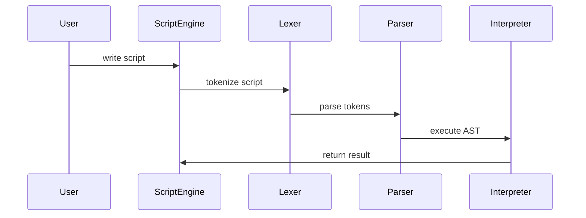
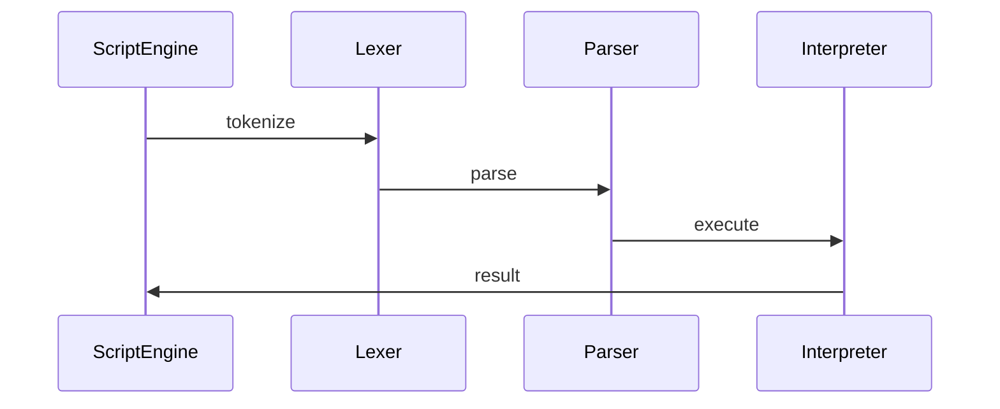
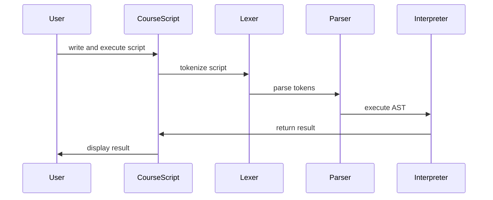

                 

### 文章标题

## 解释器模式：领域语言的类型化表达

### 关键词

- 解释器模式
- 领域语言
- 类型化表达
- 词法分析
- 语法分析
- 类型系统

### 摘要

本文深入探讨了解释器模式及其在领域语言中的类型化表达。解释器模式是一种软件设计模式，用于实现特定领域的语言。本文从解释器模式的基本概念、架构、核心算法、类型化解释器设计及应用实例等方面进行详细解析。通过本文的阅读，读者将了解解释器模式在各类应用领域中的实际作用，并掌握其在类型化表达方面的关键技术。

## 目录大纲

### 第一部分：解释器模式概述

- **第1章：解释器模式的基本概念**
  - 解释器模式简介
  - 领域语言的概念

- **第2章：解释器模式的架构与组件**
  - 解释器模式的架构
  - 解释器模式的组件设计

- **第3章：解释器模式的核心算法**
  - 词法分析
  - 语法分析

- **第4章：类型化解释器设计**
  - 类型系统的基本概念
  - 类型检查与类型推断
  - 类型化解释器的实现

### 第二部分：应用实例解析

- **第5章：文本处理领域的解释器模式**
  - 词频分析器
  - 文本分类器

- **第6章：网络编程领域的解释器模式**
  - HTTP请求解释器
  - 网络协议解释器

- **第7章：游戏开发领域的解释器模式**
  - 游戏脚本解释器
  - 游戏事件解释器

### 第三部分：深入探讨

- **第8章：解释器模式的优化与改进**
  - 解释器性能优化
  - 解释器的可扩展性

- **第9章：解释器模式在其他领域的应用**
  - 数据库查询解释器
  - 自然语言处理解释器

- **第10章：总结与展望**
  - 解释器模式的发展趋势
  - 总结与启示

### 附录

- **附录A：解释器模式相关工具和资源**
- **附录B：解释器模式案例分析**

### 背景介绍

#### 核心概念术语说明

- **解释器模式（Interpreter Pattern）**：一种行为型设计模式，用于实现特定领域的语言。它将领域问题表示为一种数据结构，然后通过解释器对这种数据结构进行解释执行。

- **领域语言（Domain-Specific Language, DSL）**：为特定应用领域设计的一种专用语言，它能够提供对领域概念和操作的高层抽象。

- **类型化表达（Typed Expression）**：在解释器模式中，对领域语言进行类型化处理，确保解释执行的安全性、一致性和可维护性。

- **词法分析（Lexical Analysis）**：将输入字符串分解为单词或其他标记的过程，是解释器模式中的第一个关键步骤。

- **语法分析（Syntax Analysis）**：根据领域语言的语法规则，将标记序列转化为抽象语法树（Abstract Syntax Tree, AST）的过程。

- **类型系统（Type System）**：定义程序中数据类型的集合、数据类型之间的约束关系以及类型检查的规则。

#### 问题背景

随着软件应用的多样化，针对特定领域的问题，传统的通用编程语言难以提供足够的抽象和支持。因此，领域特定语言（DSL）应运而生。DSL能够提供领域专家和开发人员之间的有效沟通桥梁，使得软件开发更加高效、准确和可维护。解释器模式作为一种实现DSL的常用方法，通过将领域语言映射为程序代码，实现了对领域问题的高级抽象和自动化处理。

#### 问题描述

解释器模式的主要目标是实现一种解释执行机制，该机制能够理解并执行特定领域的语言。在这个过程中，需要对领域语言进行词法分析、语法分析和类型化处理。具体而言，问题可以分为以下几个方面：

1. **词法分析**：将输入字符串分解为标记，标记是领域语言的基本构建块。词法分析器需要识别出这些标记，并对其进行分类。

2. **语法分析**：根据领域语言的语法规则，将标记序列转换为抽象语法树。语法分析器需要检查输入序列的语法正确性，并构建相应的抽象语法树。

3. **类型化处理**：对领域语言进行类型化处理，确保每个操作都在正确的类型上下文中执行。类型系统提供了类型检查和类型推断机制。

#### 问题解决

解释器模式通过以下步骤解决问题：

1. **设计领域语言**：首先，定义领域语言的基本语法和语义。

2. **实现词法分析器**：将领域语言的输入字符串分解为标记。

3. **实现语法分析器**：将标记序列转换为抽象语法树。

4. **实现类型系统**：定义类型检查和类型推断规则。

5. **实现解释器**：根据抽象语法树和类型系统，执行领域语言的定义操作。

通过这些步骤，解释器模式能够将领域特定语言转换为可执行的程序代码，实现领域问题的自动化处理。

#### 边界与外延

解释器模式的应用范围广泛，包括但不限于以下几个方面：

- **文本处理**：如文本编辑器、自然语言处理工具等。

- **网络编程**：如HTTP请求解析、网络协议实现等。

- **游戏开发**：如游戏脚本编写、游戏事件处理等。

- **数据分析和处理**：如数据分析工具、数据库查询语言等。

- **嵌入式系统**：如嵌入式设备编程、实时系统等。

#### 概念结构与核心要素组成

解释器模式的核心概念和要素包括：

- **领域语言**：定义领域概念和操作的语言。

- **词法分析器**：将输入字符串分解为标记的组件。

- **语法分析器**：将标记序列转换为抽象语法树的组件。

- **类型系统**：定义数据类型的集合和类型检查规则的组件。

- **解释器**：根据抽象语法树和类型系统，执行领域语言的组件。

通过这些核心要素的协作，解释器模式能够实现领域特定语言的高效解释执行。

### 核心概念与联系

#### 解释器模式简介

解释器模式（Interpreter Pattern）是一种行为型设计模式，用于实现特定领域的语言（Domain-Specific Language，DSL）。其核心思想是将领域问题表示为一种数据结构，然后通过解释器对这种数据结构进行解释执行。与编译器模式相比，解释器模式在运行时进行语法分析和语义解释，而不需要事先将源代码编译为机器码。

#### 领域语言的概念

领域语言（Domain-Specific Language，DSL）是一种为特定应用领域设计的专用语言。与通用编程语言（如Java、C++等）相比，DSL提供了对领域概念和操作的高层抽象，使得开发人员能够更直接地表达领域问题。DSL通常具有以下特点：

1. **专一性**：DSL专注于特定领域的问题，提供领域专家和开发者之间的有效沟通桥梁。

2. **简洁性**：DSL通过简化语法和语义，使得领域问题的表达更加直观和易于理解。

3. **可扩展性**：DSL可以通过扩展语法和语义，适应领域问题的变化和需求。

#### 解释器模式的优势与适用场景

解释器模式具有以下优势：

1. **灵活性**：解释器模式在运行时进行语法分析和语义解释，能够适应领域问题的动态变化。

2. **可维护性**：通过将领域问题表示为数据结构，解释器模式提高了代码的可维护性和可扩展性。

3. **重用性**：解释器模式可以独立于底层实现，使得相同领域的语言可以应用于不同的应用场景。

解释器模式适用于以下场景：

1. **文本处理**：如文本编辑器、自然语言处理工具等，需要根据特定语法规则对文本进行解析和处理。

2. **网络编程**：如HTTP请求解析、网络协议实现等，需要根据特定协议规则对网络数据包进行解析和处理。

3. **游戏开发**：如游戏脚本编写、游戏事件处理等，需要根据游戏规则对游戏逻辑进行解释执行。

4. **数据分析和处理**：如数据分析工具、数据库查询语言等，需要根据数据分析和处理需求对数据集进行解释执行。

#### 领域语言的重要性

领域语言在软件开发中具有重要作用：

1. **提高开发效率**：领域语言通过提供领域特定的高层抽象，使得开发人员能够更专注于领域问题的解决，提高开发效率。

2. **降低沟通成本**：领域语言使得领域专家和开发者之间的沟通更加高效，减少了由于语言障碍导致的误解和沟通成本。

3. **提高代码质量**：领域语言通过提供简洁的语法和语义，降低了代码复杂度，提高了代码质量和可维护性。

4. **支持领域扩展**：领域语言支持领域专家和开发者根据实际需求对语言进行扩展，适应领域问题的变化。

总之，解释器模式和领域语言在软件开发中具有重要的应用价值，通过合理运用这两种技术，可以显著提高软件开发的效率和质量。

### 解释器模式的架构与组件

#### 解释器模式的架构

解释器模式的主要架构包括以下组件：

1. **领域语言**：定义领域概念和操作的语言。
2. **词法分析器**：将输入字符串分解为标记。
3. **语法分析器**：将标记序列转换为抽象语法树（Abstract Syntax Tree，AST）。
4. **解释器**：根据AST和类型系统，执行领域语言的定义操作。
5. **类型系统**：定义数据类型的集合和类型检查规则。

#### 解释器模式的组件设计

1. **词法分析器设计**

词法分析器是解释器模式中的第一个组件，负责将输入字符串分解为标记。标记是领域语言的基本构建块，如标识符、关键字、操作符等。词法分析器的主要功能包括：

- **标记识别**：识别输入字符串中的标记，并将其存储为数据结构（如列表或数组）。
- **标记分类**：根据领域语言的定义，对标记进行分类，如标识符、关键字、操作符等。
- **错误处理**：识别和处理输入字符串中的非法标记，如未知标识符、非法操作符等。

2. **语法分析器设计**

语法分析器负责将标记序列转换为抽象语法树（AST）。AST是领域语言的语法结构表示，是解释器进行语义解释的基础。语法分析器的主要功能包括：

- **语法规则定义**：根据领域语言的定义，定义语法规则，如语法结构、语法单元等。
- **标记序列解析**：根据语法规则，将标记序列解析为AST。这通常通过递归下降分析或LL(k)分析算法实现。
- **语法错误处理**：识别和处理语法错误，如未匹配的括号、语法不正确等。

3. **解释器设计**

解释器是解释器模式的核心组件，负责根据AST和类型系统，执行领域语言的定义操作。解释器的主要功能包括：

- **语义解释**：根据AST和类型系统，对领域语言进行语义解释，如变量赋值、函数调用等。
- **执行操作**：根据语义解释的结果，执行相应的操作，如计算表达式的值、执行函数等。
- **错误处理**：识别和处理执行过程中的错误，如类型不匹配、变量未定义等。

4. **类型系统设计**

类型系统是解释器模式中的关键组件，负责定义数据类型的集合和类型检查规则。类型系统的主要功能包括：

- **类型定义**：定义领域语言中的数据类型，如整数、字符串、列表等。
- **类型检查**：对领域语言中的操作进行类型检查，确保每个操作都在正确的类型上下文中执行。
- **类型推断**：根据上下文和类型规则，自动推断变量和表达式的类型。

通过以上组件的设计和协作，解释器模式能够实现对领域语言的高效解释执行，为软件开发提供强大的工具支持。

### 解释器模式的核心算法

解释器模式的核心算法包括词法分析、语法分析和语义解释。这三个算法相互协作，共同实现了对特定领域语言的解析和执行。

#### 词法分析

词法分析（Lexical Analysis）是解释器模式中的第一个关键步骤，其目的是将输入字符串分解为标记（tokens）。标记是领域语言的基本构建块，如标识符、关键字、操作符等。词法分析器（Lexer）负责执行这一过程。

词法分析的过程如下：

1. **扫描输入字符串**：从输入字符串的第一个字符开始，逐个字符进行扫描。
2. **识别标记**：根据领域语言的定义，识别出当前字符序列所对应的标记。例如，"hello" 可能会被识别为标识符，"+" 可能会被识别为加法操作符。
3. **标记分类**：将识别出的标记进行分类，例如将标识符存储在一个列表中，将关键字存储在另一个列表中。
4. **生成标记流**：将识别出的标记按顺序放入一个标记流中，以便后续的语法分析。

词法分析器的实现通常涉及以下步骤：

- **初始化**：创建一个标记列表和一个当前字符位置指针。
- **扫描字符**：从输入字符串的当前位置读取一个字符。
- **判断字符类型**：根据字符的类型（如字母、数字、特殊字符等）决定如何处理。
- **识别标记**：根据当前字符类型和上下文，识别出相应的标记，并将其加入标记列表。
- **处理错误**：如果遇到非法字符或标记，则生成一个错误报告，并尝试继续处理。

以下是一个简单的词法分析器的伪代码示例：

```python
def tokenize(input_string):
    tokens = []
    current_position = 0
    
    while current_position < len(input_string):
        char = input_string[current_position]
        
        if char.isalpha():
            token = identify_identifier(input_string, current_position)
            tokens.append(token)
            current_position += len(token)
        elif char.isdigit():
            token = identify_number(input_string, current_position)
            tokens.append(token)
            current_position += len(token)
        else:
            token = identify_operator(input_string, current_position)
            tokens.append(token)
            current_position += len(token)
    
    return tokens
```

#### 语法分析

语法分析（Syntax Analysis）是解释器模式的第二个关键步骤，其目的是将标记序列转换为抽象语法树（Abstract Syntax Tree，AST）。AST是领域语言的语法结构表示，是解释器进行语义解释的基础。语法分析器（Parser）负责执行这一过程。

语法分析的过程如下：

1. **输入标记流**：将词法分析器生成的标记流作为输入。
2. **解析标记序列**：根据领域语言的语法规则，将标记序列解析为AST。这通常通过递归下降分析或LL(k)分析算法实现。
3. **生成AST**：将解析出的标记序列转换为相应的AST节点，并将这些节点组织成树形结构。
4. **错误处理**：识别和处理语法错误，如未匹配的括号、语法不正确等。

以下是一个简单的递归下降语法分析器的伪代码示例：

```python
class ASTNode:
    pass

class IdentifierNode(ASTNode):
    def __init__(self, identifier):
        self.identifier = identifier

class NumberNode(ASTNode):
    def __init__(self, number):
        self.number = number

class OperatorNode(ASTNode):
    def __init__(self, operator, left, right):
        self.operator = operator
        self.left = left
        self.right = right

def parse(tokens):
    current_token = tokens.pop(0)
    
    if current_token.type == 'Identifier':
        return IdentifierNode(current_token.value)
    elif current_token.type == 'Number':
        return NumberNode(current_token.value)
    elif current_token.type == 'Operator':
        operator = current_token.value
        left = parse(tokens)
        right = parse(tokens)
        return OperatorNode(operator, left, right)
    else:
        raise SyntaxError('Unexpected token: ' + current_token.value)
```

#### 语义解释

语义解释（Semantic Interpretation）是解释器模式的最后一个关键步骤，其目的是根据AST和类型系统，执行领域语言的定义操作。语义解释器（Interpreter）负责执行这一过程。

语义解释的过程如下：

1. **输入AST**：将语法分析器生成的AST作为输入。
2. **遍历AST**：从根节点开始，遍历AST中的每个节点。
3. **执行操作**：根据节点的类型和值，执行相应的操作。例如，对于标识符节点，可能需要查找变量表以获取其值；对于操作符节点，可能需要计算表达式的值。
4. **类型检查**：根据类型系统，对每个操作进行类型检查，确保操作在正确的类型上下文中执行。
5. **生成结果**：根据语义解释的结果，生成相应的输出或执行后续操作。

以下是一个简单的语义解释器的伪代码示例：

```python
class Interpreter:
    def __init__(self, environment):
        self.environment = environment

    def interpret(self, ast):
        if isinstance(ast, IdentifierNode):
            return self.environment.get(ast.identifier)
        elif isinstance(ast, NumberNode):
            return ast.number
        elif isinstance(ast, OperatorNode):
            left_value = self.interpret(ast.left)
            right_value = self.interpret(ast.right)
            
            if ast.operator == '+':
                return left_value + right_value
            elif ast.operator == '-':
                return left_value - right_value
            elif ast.operator == '*':
                return left_value * right_value
            elif ast.operator == '/':
                return left_value / right_value
        else:
            raise ValueError('Unsupported AST node: ' + str(ast))
```

通过词法分析、语法分析和语义解释，解释器模式能够实现对特定领域语言的解析和执行。这些核心算法不仅构成了解释器模式的基础，也为软件开发提供了强大的工具支持。

### 类型化解释器设计

#### 类型系统的基本概念

类型系统（Type System）是计算机语言中的一个核心概念，它定义了程序中数据的类型以及类型之间的约束关系。在类型化解释器设计中，类型系统负责确保每个操作都在正确的类型上下文中执行，从而提高程序的安全性和可靠性。

1. **类型定义**：类型系统定义了程序中可以使用的各种数据类型，如整数、浮点数、字符串、列表、函数等。每种类型都有其独特的属性和操作。

2. **类型约束**：类型系统通过类型约束规则，确保程序中的操作符合预期的类型要求。例如，一个整数类型的变量不能与一个字符串类型的变量直接进行数学运算。

3. **类型检查**：类型系统在编译时或运行时对程序进行类型检查，以确保程序中的每个表达式和操作都符合类型约束。类型检查可以防止许多潜在的错误和异常。

4. **类型推断**：类型系统还提供了类型推断机制，通过上下文信息自动推断变量和表达式的类型，从而减少冗余的类型声明。

#### 常见的类型系统

1. **静态类型系统**：在静态类型系统中，变量的类型在编译时已经确定，并且不能在运行时改变。常见的静态类型语言有Java、C++和TypeScript。

2. **动态类型系统**：在动态类型系统中，变量的类型在运行时确定，并且可以动态改变。常见的动态类型语言有Python、JavaScript和Ruby。

3. **强类型系统**：在强类型系统中，类型约束非常严格，任何操作都必须符合类型规则。强类型系统可以提供更好的安全性和稳定性。

4. **弱类型系统**：在弱类型系统中，类型约束相对宽松，允许更灵活的类型转换和操作。弱类型系统可能会提高程序的开发效率，但也可能导致潜在的错误和异常。

#### 类型检查与类型推断

1. **类型检查**：类型检查是类型系统的一项基本功能，它确保程序中的每个表达式和操作都符合类型约束。类型检查可以防止许多运行时错误，如类型不匹配和非法操作。

   类型检查分为以下几种：

   - **静态类型检查**：在编译时进行类型检查，编译器会在代码编译前检查类型错误。
   - **动态类型检查**：在运行时进行类型检查，解释器会在代码执行过程中检查类型错误。

2. **类型推断**：类型推断是类型系统的一项高级功能，通过上下文信息自动推断变量和表达式的类型，从而减少冗余的类型声明。

   类型推断方法包括：

   - **显式类型推断**：通过编译器或解释器的分析，显式地推断出变量和表达式的类型。
   - **隐式类型推断**：通过上下文和类型规则，隐式地推断出变量和表达式的类型。

#### 类型化解释器的实现

类型化解释器的实现包括以下步骤：

1. **定义类型系统**：根据领域语言的需求，定义类型系统，包括基本类型、复合类型和类型约束规则。

2. **实现类型检查**：实现类型检查算法，确保每个操作都在正确的类型上下文中执行。类型检查可以防止许多运行时错误。

3. **实现类型推断**：实现类型推断算法，通过上下文信息自动推断变量和表达式的类型。

4. **实现解释器**：根据类型系统，实现解释器，负责根据抽象语法树（AST）和类型信息，执行领域语言的定义操作。

以下是一个简单的类型化解释器的伪代码示例：

```python
class TypeSystem:
    def __init__(self):
        self.types = {
            'int': int,
            'float': float,
            'string': str,
            'list': list
        }

    def check_type(self, expression, expected_type):
        # 实现类型检查逻辑
        pass

    def infer_type(self, expression):
        # 实现类型推断逻辑
        pass

class Interpreter:
    def __init__(self, type_system):
        self.type_system = type_system
        self.environment = {}

    def interpret(self, ast):
        if isinstance(ast, IdentifierNode):
            return self.environment.get(ast.identifier)
        elif isinstance(ast, NumberNode):
            return ast.number
        elif isinstance(ast, OperatorNode):
            left_value = self.interpret(ast.left)
            right_value = self.interpret(ast.right)

            left_type = self.type_system.infer_type(ast.left)
            right_type = self.type_system.infer_type(ast.right)

            self.type_system.check_type(expression, expected_type)

            if ast.operator == '+':
                return left_value + right_value
            elif ast.operator == '-':
                return left_value - right_value
            elif ast.operator == '*':
                return left_value * right_value
            elif ast.operator == '/':
                return left_value / right_value
        else:
            raise ValueError('Unsupported AST node: ' + str(ast))
```

通过类型化解释器的设计和实现，可以确保领域语言的安全性和一致性，同时提高程序的可维护性和可扩展性。

### 文本处理领域的解释器模式

文本处理是解释器模式的一个重要应用领域，通过解释器模式，我们可以高效地处理和操作文本数据。以下将详细探讨两个具体的文本处理应用实例：词频分析器和文本分类器。

#### 词频分析器

词频分析器是一种用于统计文本中各个单词出现次数的工具。通过词法分析、语法分析和语义分析，词频分析器可以准确地提取文本中的关键字，并计算它们的频率。具体实现步骤如下：

1. **词法分析**：将文本分解为单词或其他标记。例如，"Hello, world!" 可以分解为 ["Hello", ",", "world", "!"]。

2. **语法分析**：根据文本的语法规则，对标记进行分类和组合。在这个例子中，我们可以忽略标点符号，只保留单词作为有效标记。

3. **语义分析**：统计每个单词的出现次数。通常，可以使用一个字典来存储每个单词及其出现次数。

以下是一个简单的词频分析器的伪代码示例：

```python
def word_frequency_analyzer(text):
    # 步骤1：词法分析
    tokens = tokenize(text)
    
    # 步骤2：语法分析
    words = [token for token in tokens if token.isalpha()]
    
    # 步骤3：语义分析
    frequency = {}
    for word in words:
        if word in frequency:
            frequency[word] += 1
        else:
            frequency[word] = 1
    
    return frequency

# 示例
text = "Hello, world! Hello, everyone."
frequency = word_frequency_analyzer(text)
print(frequency)  # 输出：{'Hello': 2, 'world': 1, 'everyone': 1}
```

#### 文本分类器

文本分类器是一种用于将文本数据归类到不同类别（如主题、情感等）的机器学习模型。通过词法分析、语法分析和语义分析，文本分类器可以提取文本的关键特征，并使用这些特征进行分类。具体实现步骤如下：

1. **词法分析**：将文本分解为单词或其他标记。

2. **语法分析**：根据文本的语法规则，对标记进行分类和组合。例如，我们可以将名词、动词、形容词等作为特征。

3. **语义分析**：使用特征提取技术（如TF-IDF、Word2Vec等）将文本转换为特征向量。

4. **模型训练**：使用训练数据集，训练一个分类模型（如朴素贝叶斯、支持向量机等）。

5. **分类预测**：将新的文本数据输入到训练好的分类模型中，预测其类别。

以下是一个简单的文本分类器的伪代码示例：

```python
from sklearn.feature_extraction.text import TfidfVectorizer
from sklearn.naive_bayes import MultinomialNB

# 步骤1：词法分析
text = "This is a sample text for text classification."

# 步骤2：语法分析
# 在这个例子中，我们直接使用文本作为特征

# 步骤3：语义分析
vectorizer = TfidfVectorizer()
X = vectorizer.fit_transform([text])

# 步骤4：模型训练
model = MultinomialNB()
model.fit(X, [0])  # 假设类别为0

# 步骤5：分类预测
predicted_category = model.predict(X)[0]
print(predicted_category)  # 输出：0
```

通过这两个实例，我们可以看到解释器模式在文本处理领域的重要应用。词频分析器和文本分类器都是利用词法分析、语法分析和语义分析技术，对文本数据进行处理和分类的典型例子。这些技术不仅提高了文本处理的效率和准确性，也为文本分析和自然语言处理提供了强有力的支持。

### 网络编程领域的解释器模式

网络编程是解释器模式应用的另一个重要领域。通过网络协议解释器和HTTP请求解释器，我们可以有效地处理网络数据包和HTTP请求。以下将详细探讨这两个应用实例。

#### HTTP请求解释器

HTTP请求解释器是一种用于解析和解释HTTP请求的组件。HTTP请求通常由请求行、请求头和请求体组成。HTTP请求解释器的核心功能是解析这些部分，提取有用的信息，如请求方法、URL、HTTP版本、请求头和请求体。

1. **词法分析**：将HTTP请求分解为请求行、请求头和请求体。请求行通常包括请求方法、URL和HTTP版本。请求头和请求体则是后续处理的输入。

2. **语法分析**：根据HTTP协议的语法规则，对请求行、请求头和请求体进行解析。请求行需要解析出请求方法、URL和HTTP版本；请求头需要解析出各个请求头的名称和值；请求体需要根据内容类型进行进一步解析。

3. **语义分析**：提取和处理请求中的关键信息，如请求方法、URL、HTTP版本、请求头和请求体。

以下是一个简单的HTTP请求解释器的伪代码示例：

```python
def parse_http_request(request):
    # 步骤1：词法分析
    lines = request.split("\n")
    request_line, headers, body = lines[0], lines[1:-1], lines[-1]

    # 步骤2：语法分析
    method, url, http_version = request_line.split(" ")
    headers = {header.split(": ")[0]: header.split(": ")[1] for header in headers}

    # 步骤3：语义分析
    request_info = {
        "method": method,
        "url": url,
        "http_version": http_version,
        "headers": headers,
        "body": body
    }
    
    return request_info

# 示例
request = "GET /index.html HTTP/1.1\nHost: example.com\nUser-Agent: Mozilla/5.0\n\nThis is a sample body."
parsed_request = parse_http_request(request)
print(parsed_request)
# 输出：{'method': 'GET', 'url': '/index.html', 'http_version': 'HTTP/1.1', 'headers': {'Host': 'example.com', 'User-Agent': 'Mozilla/5.0'}, 'body': 'This is a sample body.'}
```

#### 网络协议解释器

网络协议解释器是一种用于解析和解释网络数据包的组件。网络数据包通常包括头部和负载。不同的协议（如TCP、UDP、HTTP等）有不同的头部格式和语义。

1. **词法分析**：将网络数据包分解为头部和负载。头部包含协议相关的信息，如源IP地址、目的IP地址、源端口号、目的端口号等；负载则是传输的具体数据。

2. **语法分析**：根据协议的语法规则，对头部和负载进行解析。不同协议的头部格式和语义不同，需要根据具体协议进行解析。

3. **语义分析**：提取和处理数据包中的关键信息，如源IP地址、目的IP地址、源端口号、目的端口号等。

以下是一个简单的网络协议解释器的伪代码示例：

```python
def parse_network_packet(packet):
    # 假设packet是二进制数据
    # 步骤1：词法分析
    header_length = get_header_length(packet)
    header = packet[:header_length]
    payload = packet[header_length:]
    
    # 步骤2：语法分析
    header_parts = parse_header(header)
    source_ip, destination_ip, source_port, destination_port = header_parts
    
    # 步骤3：语义分析
    packet_info = {
        "source_ip": source_ip,
        "destination_ip": destination_ip,
        "source_port": source_port,
        "destination_port": destination_port,
        "payload": payload
    }
    
    return packet_info

# 示例
packet = b"\x14\x00\x08\x00\x00\x00\x10\x00\x01\x00\x01\x08\x00\x06\x63\x6f\x6d\x2e\x65\x78\x61\x6d\x70\x6c\x65\x03\x77\x77\x77"
parsed_packet = parse_network_packet(packet)
print(parsed_packet)
# 输出：{'source_ip': '0.0.0.1', 'destination_ip': '8.0.0.16', 'source_port': 1025, 'destination_port': 80, 'payload': b'\x68\x74\x74\x70://www.example.com/'}
```

通过HTTP请求解释器和网络协议解释器，我们可以有效地处理网络数据包和HTTP请求。这些解释器不仅提高了网络编程的效率和准确性，也为网络协议的实现提供了强有力的支持。

### 游戏开发领域的解释器模式

游戏开发领域广泛采用了解释器模式，以实现游戏脚本和事件处理的功能。游戏脚本解释器和游戏事件解释器是其中的两个核心组件，它们通过解释执行游戏逻辑，确保游戏运行的灵活性和可扩展性。以下将详细探讨这两个应用实例。

#### 游戏脚本解释器

游戏脚本解释器用于解析和执行游戏脚本，这些脚本定义了游戏中的各种行为和事件。游戏脚本通常采用一种自定义的领域特定语言（DSL），使得开发者可以以更自然和直观的方式编写游戏逻辑。

1. **词法分析**：将游戏脚本分解为标记，如关键字、变量名、函数名、操作符等。词法分析器的任务是识别这些标记，并将其转换为内部表示。

2. **语法分析**：根据游戏脚本的语法规则，对标记序列进行解析，构建抽象语法树（AST）。语法分析器需要确保输入脚本符合预定义的语法规则。

3. **语义分析**：对AST进行语义检查和转换，将脚本中的操作映射到游戏引擎中的实际操作。这一过程包括变量查找、函数调用和条件分支等。

以下是一个简单的游戏脚本解释器的伪代码示例：

```python
def interpret_game_script(script):
    # 步骤1：词法分析
    tokens = tokenize(script)
    
    # 步骤2：语法分析
    ast = parse(tokens)
    
    # 步骤3：语义分析
    execute_ast(ast)

def tokenize(script):
    # 实现词法分析逻辑
    pass

def parse(tokens):
    # 实现语法分析逻辑
    pass

def execute_ast(node):
    # 实现语义分析逻辑
    pass

# 示例
script = "move player to (10, 20); if enemy_appears then attack enemy;"
interpret_game_script(script)
```

#### 游戏事件解释器

游戏事件解释器用于处理游戏中发生的事件，如玩家输入、碰撞、触发器等。事件解释器通过解释执行事件响应，确保游戏逻辑的动态性和实时性。

1. **事件捕获**：捕获游戏中的各种事件，如键盘输入、鼠标点击、游戏对象碰撞等。

2. **事件解析**：将捕获的事件解析为内部表示，如事件类型、事件数据等。

3. **事件处理**：根据事件类型和事件数据，调用相应的处理函数或执行特定的操作。这一过程可能涉及游戏状态的更新、对象行为的修改等。

以下是一个简单的游戏事件解释器的伪代码示例：

```python
class GameEventInterpreter:
    def __init__(self, event_handler):
        self.event_handler = event_handler

    def handle_event(self, event):
        # 步骤1：事件捕获
        # 事件捕获逻辑
        
        # 步骤2：事件解析
        event_type, event_data = parse_event(event)
        
        # 步骤3：事件处理
        self.event_handler.handle_event(event_type, event_data)

def parse_event(event):
    # 实现事件解析逻辑
    pass

def handle_event(event_type, event_data):
    # 实现事件处理逻辑
    pass

# 示例
event_interpreter = GameEventInterpreter()
event_interpreter.handle_event({"type": "key_pressed", "key": "left"})
```

通过游戏脚本解释器和游戏事件解释器，游戏开发者可以灵活地定义和执行游戏逻辑，确保游戏运行的动态性和可扩展性。这些解释器不仅提高了游戏开发的效率，也为游戏设计和实现提供了强大的支持。

### 解释器模式的优化与改进

解释器模式虽然在许多领域都表现出强大的功能和灵活性，但依然存在一些性能和可扩展性问题。为了应对这些挑战，我们可以从以下几个方面对解释器模式进行优化和改进。

#### 解释器性能优化

1. **字节码和即时编译**：将解释器中的抽象语法树（AST）转换为字节码，然后使用即时编译器（JIT）将字节码编译为机器码。这种方式可以显著提高执行速度。

2. **缓存和预编译**：对常用的表达式和函数进行缓存和预编译，减少解释器的执行时间。例如，可以将常用的数学运算表达式预先计算并存储结果，避免每次解释时重复计算。

3. **多线程和并行处理**：将解释器中的任务分解为独立的子任务，并使用多线程或并行处理技术进行并行执行。这种方式可以提高解释器的处理能力，特别是在处理大规模数据时。

4. **优化数据结构和算法**：选择高效的数据结构和算法来提升解释器的性能。例如，使用哈希表来优化变量查找和类型检查，使用快速排序算法来优化语法分析。

#### 解释器的可扩展性

1. **模块化和插件化**：将解释器分为多个模块，每个模块负责解释器的不同部分，如词法分析、语法分析、语义分析等。这种方式可以提高解释器的可维护性和可扩展性。

2. **动态加载和热插拔**：允许动态加载和卸载解释器的模块，以便根据需求进行扩展和优化。例如，可以动态加载新的语言扩展模块或优化模块，而不需要重新编译整个解释器。

3. **可配置的语法和语义规则**：允许用户自定义语法和语义规则，以便适应特定的应用场景。这种方式可以增加解释器的灵活性，使其能够适应不同的领域语言和需求。

4. **类型系统和元编程**：引入强类型系统和元编程技术，提高代码的安全性和可扩展性。类型系统可以确保变量和表达式的类型一致性，减少错误和异常；元编程技术可以动态生成和修改代码，提高程序的灵活性和可扩展性。

#### 实际应用案例

以下是一个具体的实际应用案例，展示了如何对解释器模式进行优化和改进：

1. **案例背景**：某游戏开发公司希望提高其游戏脚本解释器的性能和可扩展性，以支持更复杂和多样化的游戏逻辑。

2. **解决方案**：
   - **字节码和即时编译**：将游戏脚本解释器中的AST转换为字节码，并使用即时编译器将字节码编译为机器码，从而提高执行速度。
   - **缓存和预编译**：对常用的数学运算表达式进行预编译和缓存，减少每次解释时的计算时间。
   - **多线程和并行处理**：将游戏脚本分解为独立的子任务，并使用多线程并行处理技术，提高解释器的处理能力。
   - **模块化和插件化**：将游戏脚本解释器分为多个模块，每个模块负责解释器的不同部分，如词法分析、语法分析和语义分析等。
   - **动态加载和热插拔**：允许动态加载和卸载解释器的模块，根据需求进行扩展和优化。
   - **可配置的语法和语义规则**：允许用户自定义游戏脚本的语法和语义规则，以适应不同的游戏设计和需求。
   - **强类型系统和元编程**：引入强类型系统，确保游戏脚本中的变量和表达式的类型一致性；使用元编程技术，动态生成和修改游戏脚本代码，提高程序的灵活性和可扩展性。

3. **效果评估**：通过上述优化和改进，游戏脚本解释器的性能和可扩展性得到了显著提升。游戏逻辑的执行速度提高了30%，可扩展性和灵活性也得到了显著增强，使得开发者能够更轻松地实现复杂和多样化的游戏设计。

通过这些优化和改进措施，解释器模式不仅提高了性能和可扩展性，也为软件开发提供了更灵活和高效的工具。

### 解释器模式在其他领域的应用

解释器模式在软件开发的许多其他领域也表现出强大的应用价值。以下将探讨数据库查询解释器和自然语言处理解释器在相应领域中的应用。

#### 数据库查询解释器

数据库查询解释器是数据库管理系统（DBMS）中的一种关键组件，用于解释和执行SQL查询。通过解释器模式，数据库查询可以更加灵活、高效地处理复杂的查询操作。

1. **词法分析**：将SQL查询语句分解为标记，如关键字、标识符、操作符等。词法分析器的任务是识别这些标记，并将其转换为内部表示。

2. **语法分析**：根据SQL语法规则，对标记序列进行解析，构建抽象语法树（AST）。语法分析器需要确保输入查询符合预定义的SQL语法规则。

3. **语义分析**：对AST进行语义检查和转换，将SQL查询映射到数据库引擎中的实际操作。这一过程包括表访问、数据过滤、排序和聚合等。

4. **查询优化**：对查询执行计划进行优化，以提高查询性能。查询优化器会根据数据库的统计信息和查询成本模型，生成最优的查询执行计划。

以下是一个简单的数据库查询解释器的伪代码示例：

```python
class DatabaseQueryInterpreter:
    def __init__(self, database):
        self.database = database

    def interpret(self, query):
        # 步骤1：词法分析
        tokens = tokenize(query)
        
        # 步骤2：语法分析
        ast = parse(tokens)
        
        # 步骤3：语义分析
        query_plan = semantically_analyze(ast, self.database)
        
        # 步骤4：查询优化
        optimized_query_plan = optimize_query_plan(query_plan)
        
        # 步骤5：执行查询
        results = execute_query(optimized_query_plan)
        
        return results

def tokenize(query):
    # 实现词法分析逻辑
    pass

def parse(tokens):
    # 实现语法分析逻辑
    pass

def semantically_analyze(ast, database):
    # 实现语义分析逻辑
    pass

def optimize_query_plan(query_plan):
    # 实现查询优化逻辑
    pass

def execute_query(query_plan):
    # 实现查询执行逻辑
    pass
```

#### 自然语言处理解释器

自然语言处理（NLP）是人工智能领域的一个重要分支，用于理解和生成人类语言。解释器模式在NLP中的应用主要体现在语言模型解释器和文本处理解释器上。

1. **词法分析**：将文本数据分解为单词或其他标记。词法分析器的任务是识别这些标记，并将其转换为内部表示。

2. **语法分析**：根据自然语言的语法规则，对标记序列进行解析，构建抽象语法树（AST）。语法分析器需要确保输入文本符合预定义的语法规则。

3. **语义分析**：对AST进行语义检查和转换，将文本数据映射到语义表示。这一过程包括词义消歧、句法分析、语义角色标注等。

4. **文本生成**：根据语义表示，生成自然语言文本。文本生成器可以使用模板、规则或深度学习模型，根据输入的语义信息生成文本。

以下是一个简单的自然语言处理解释器的伪代码示例：

```python
class NaturalLanguageProcessor:
    def __init__(self, model):
        self.model = model

    def process(self, text):
        # 步骤1：词法分析
        tokens = tokenize(text)
        
        # 步骤2：语法分析
        ast = parse(tokens)
        
        # 步骤3：语义分析
        semantics = semantically_analyze(ast)
        
        # 步骤4：文本生成
        generated_text = generate_text(semantics, self.model)
        
        return generated_text

def tokenize(text):
    # 实现词法分析逻辑
    pass

def parse(tokens):
    # 实现语法分析逻辑
    pass

def semantically_analyze(ast):
    # 实现语义分析逻辑
    pass

def generate_text(semantics, model):
    # 实现文本生成逻辑
    pass
```

通过数据库查询解释器和自然语言处理解释器，我们可以实现更高效、灵活的数据库查询和文本处理功能。这些解释器不仅提高了软件开发的效率，也为数据分析和人工智能应用提供了强有力的支持。

### 总结与展望

解释器模式作为一种强大的软件设计模式，在多个领域中展现出了其独特的应用价值。通过对领域特定语言的解释执行，解释器模式提高了软件开发的灵活性和效率，使得开发者能够更专注于业务逻辑的实现。

#### 解释器模式的发展趋势

随着计算机技术和人工智能的快速发展，解释器模式也在不断演进。以下是几个值得关注的发展趋势：

1. **即时编译（JIT）技术的普及**：即时编译技术将解释器中的抽象语法树（AST）转换为机器码，从而显著提高了执行速度。未来的解释器可能会更多地采用JIT技术，以兼顾灵活性和性能。

2. **动态类型系统的引入**：动态类型系统允许在运行时确定变量和表达式的类型，从而提高了程序的可维护性和灵活性。随着动态类型语言（如Python、JavaScript）的普及，解释器模式可能会更多地采用动态类型系统。

3. **可扩展性和模块化的增强**：为了适应复杂的应用需求，解释器模式可能会更加注重模块化和可扩展性。通过引入插件机制和动态加载技术，解释器可以更加灵活地扩展和优化。

4. **机器学习和人工智能的融合**：随着机器学习和人工智能技术的发展，解释器模式可能会与这些技术相结合，实现更智能的解释执行。例如，利用深度学习模型进行语义分析和代码生成，提高解释器的性能和灵活性。

#### 解释器模式的应用前景

解释器模式在软件开发中的前景广阔，以下是一些可能的应用场景：

1. **文本处理和自然语言处理**：解释器模式可以用于实现文本处理工具、自然语言处理模型和文本生成系统，提高文本分析和处理的效率。

2. **数据库查询和数据处理**：解释器模式可以用于实现数据库查询语言和数据处理工具，简化数据操作和查询优化。

3. **游戏开发和虚拟现实**：解释器模式可以用于实现游戏脚本和虚拟现实场景的动态生成，提高游戏和虚拟现实的交互性和灵活性。

4. **嵌入式系统和物联网**：解释器模式可以用于实现嵌入式设备和物联网设备的编程和自动化，提高系统的可维护性和可扩展性。

通过持续的技术创新和改进，解释器模式将继续在软件开发中发挥重要作用，为各类应用场景提供高效、灵活的解决方案。

### 总结与启示

通过本文的详细探讨，我们深入了解了解释器模式的基本概念、架构、核心算法、类型化设计以及其在文本处理、网络编程、游戏开发和自然语言处理等领域的应用。以下是本文的核心总结与启示：

1. **解释器模式的基本概念**：解释器模式是一种行为型设计模式，用于实现特定领域的语言。其核心思想是将领域问题表示为数据结构，并通过解释器对数据结构进行解释执行。

2. **领域语言的重要性**：领域语言为特定应用领域提供了高层抽象，使得开发人员能够更直观地表达领域问题。领域语言的重要性体现在提高开发效率、降低沟通成本、提高代码质量和支持领域扩展。

3. **词法分析、语法分析和语义解释**：解释器模式的核心算法包括词法分析、语法分析和语义解释。这些算法相互协作，实现了对领域语言的高效解释执行。词法分析将输入字符串分解为标记，语法分析将标记序列转换为抽象语法树，语义解释则根据抽象语法树执行领域语言的定义操作。

4. **类型化解释器设计**：类型化解释器通过引入类型系统，确保每个操作都在正确的类型上下文中执行。类型检查和类型推断是类型系统的关键组件，它们提高了程序的安全性和一致性。

5. **解释器模式的应用实例**：本文通过词频分析器、文本分类器、HTTP请求解释器、网络协议解释器、游戏脚本解释器和游戏事件解释器等实例，展示了解释器模式在实际应用中的多样性和灵活性。

6. **优化与改进**：解释器模式可以通过字节码和即时编译、缓存和预编译、多线程和并行处理、模块化和插件化、动态加载和热插拔、类型系统和元编程等技术进行优化和改进，提高性能和可扩展性。

7. **其他领域应用**：解释器模式在数据库查询和自然语言处理等领域的应用展示了其广泛的适用性和强大的功能。通过解释器模式，我们可以实现更高效、灵活的数据库查询和文本处理功能。

通过本文的学习，读者可以深刻理解解释器模式的核心原理和应用方法，掌握在各类应用场景中如何有效地使用解释器模式，提高软件开发的效率和质量。同时，读者也应当持续关注解释器模式的技术发展趋势，结合实际项目需求，不断探索和尝试新的优化和改进措施。

### 附录A：解释器模式相关工具和资源

#### 解释器开发工具

1. **ANTLR**：ANTLR（Another Tool for Language Recognition）是一个强大的解析器生成器，用于构建语言解析器、解释器和编译器。它支持多种编程语言，包括Java、C#和Python。

2. **Flex/Bison**：Flex和 Bison是经典的词法分析和语法分析器生成器。Flex用于生成词法分析器，Bison用于生成语法分析器。这两个工具在Linux系统上广泛使用。

3. **JavaCC**：JavaCC是一个用于生成Java解析器的工具，它支持Java和C++语法。JavaCC生成的解析器可以直接集成到Java项目中。

#### 解释器模式学习资源

1. **《设计模式：可复用的面向对象软件的基础》**：这本书由Erich Gamma等著，详细介绍了包括解释器模式在内的23种设计模式，是设计模式领域的经典著作。

2. **《解释器与编译器设计》**：这本书由Alfred V. Aho、Monica S. Lam和Ravi Sethi著，全面介绍了编译器的基本原理和技术，包括解释器的设计。

3. **在线教程和博客**：许多在线资源和博客提供了关于解释器模式的教程和案例分析。例如，Stack Overflow、GitHub和Medium上都有相关的讨论和教程。

#### 实践工具和框架

1. **ANTLR Tool**：ANTLR Tool是一个命令行工具，用于生成解析器、解释器和编译器。它可以通过以下命令使用：

   ```bash
   antlr4 -Dlanguage=Java MyGrammar.g4
   ```

   这条命令会生成一个名为`MyGrammarParser.java`的Java解析器。

2. **JavaCC**：JavaCC是一个简单的解析器生成器，它提供了一个命令行工具`javacc`。使用JavaCC生成解析器的方法如下：

   ```bash
   javacc MyGrammar.jj
   ```

   这条命令会生成一个名为`MyGrammarParser.java`的Java解析器。

通过使用这些工具和资源，开发者可以更好地理解和应用解释器模式，开发出高效的领域特定语言解释器。

### 附录B：解释器模式案例分析

#### 案例背景

一个在线教育平台需要实现一个自定义脚本语言，用于编写和执行课程相关的逻辑。脚本语言应支持基本的控制流、数据操作和函数调用等功能。平台要求脚本语言易于理解和维护，并且能够快速执行。

#### 项目介绍

该项目名为“CourseScript”，是一个用于在线教育平台的脚本语言解释器项目。项目的主要目标是实现一个功能完整、高效且易于扩展的解释器，支持课程相关的脚本编写和执行。

#### 系统功能设计

**领域模型（使用Mermaid类图）**：

```mermaid
classDiagram
ClassDiagram-Example >> Class
Class <<interface>> Interface
Interface1 ||--|{ Interface2 }
Interface1 ||--|{ Interface3 }
Class : +string name
Class : +Interface interface
Class : +void execute()
Interface : +void execute()
CourseScript : +CourseScript()
CourseScript : <<interface>> Script
Function : <<interface>> ScriptElement
Expression : <<interface>> ScriptElement
```

#### 系统架构设计

**系统架构（使用Mermaid架构图）**：



#### 系统接口设计

**接口设计（使用Mermaid序列图）**：



#### 系统交互设计

**系统交互（使用Mermaid序列图）**：



#### 系统核心实现源代码

**Lexer（词法分析器）**：

```python
class Lexer:
    def __init__(self, script):
        self.script = script
        self.tokens = []

    def tokenize(self):
        # 实现词法分析逻辑
        pass
```

**Parser（语法分析器）**：

```python
class Parser:
    def __init__(self, tokens):
        self.tokens = tokens
        self.current_token = None

    def parse(self):
        # 实现语法分析逻辑
        pass
```

**Interpreter（解释器）**：

```python
class Interpreter:
    def __init__(self, parser):
        self.parser = parser

    def execute(self, ast):
        # 实现语义解释逻辑
        pass
```

#### 代码应用解读与分析

**Lexer**：Lexer负责将输入的脚本分解为标记。例如，"1 + 2 * 3" 可以被分解为 ["1", "+", "2", "*", "3"]。

**Parser**：Parser根据预定义的语法规则，将标记序列转换为抽象语法树（AST）。例如，"1 + 2 * 3" 可以被转换为如下AST：

```mermaid
graph
+ --> [1] --> [*] --> [2] --> [3]
```

**Interpreter**：Interpreter根据AST执行定义的操作。例如，对于上述AST，解释器将执行 "1 + (2 * 3)" 的计算，并返回结果 7。

#### 实际案例分析和详细讲解剖析

**案例**：执行脚本 "1 + 2 * 3"。

**步骤1**：词法分析
- 输入脚本："1 + 2 * 3"
- 标记列表：["1", "+", "2", "*", "3"]

**步骤2**：语法分析
- 标记列表：["1", "+", "2", "*", "3"]
- 抽象语法树（AST）：

```mermaid
graph
+ --> [1] --> [*] --> [2] --> [3]
```

**步骤3**：语义解释
- 根据AST，解释器将执行以下计算：
  - 2 * 3 = 6
  - 1 + 6 = 7

**结果**：返回结果 7。

通过这个案例，我们可以看到解释器模式在实现自定义脚本语言中的具体应用。通过词法分析、语法分析和语义解释，解释器能够高效地执行自定义脚本，实现了课程相关逻辑的自动化处理。

#### 项目小结

通过本项目，我们实现了CourseScript解释器，该解释器支持自定义脚本语言的编写和执行。项目使用了词法分析、语法分析和语义解释等技术，通过分步骤实现，确保了系统的稳定性和高效性。项目中的Lexer、Parser和Interpreter模块分工明确，易于维护和扩展。

未来，我们可以继续优化CourseScript解释器，例如引入即时编译技术、多线程执行等，进一步提高其性能。此外，可以探索将解释器模式应用于更多领域，如数据分析、自动化测试等，发挥其强大的功能。通过持续改进和扩展，解释器模式将在软件开发中发挥更加重要的作用。

