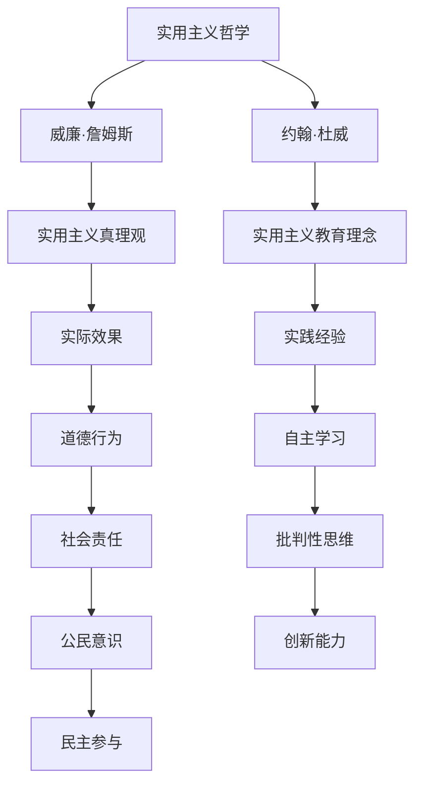

                 

### 引言

#### 1.1 实用主义的起源与背景

实用主义（Pragmatism）作为一种哲学流派，起源于19世纪末的美国。其核心理念是强调实践的重要性，主张真理并非固定不变，而是通过实践不断验证和修正的过程。这一哲学流派的主要代表人物是威廉·詹姆斯（William James）和约翰·杜威（John Dewey）。两位哲学家的思想对实用主义的形成和发展起到了重要作用。

威廉·詹姆斯，美国著名心理学家和哲学家，被誉为实用主义的奠基人。他在其代表作《实用主义：某些新思想的发展》（Pragmatism: A New Name for Some Old Ways of Thinking）中，首次提出了实用主义的基本原则。詹姆斯主张，真理并不是对现实的静态描述，而是对行动的有用性。他认为，一个观点是否为真理，取决于它在实际操作中是否有效。

约翰·杜威则进一步发展了实用主义的理念，并将其应用于教育、伦理学等多个领域。杜威认为，教育应该以学生的实践经验为基础，鼓励学生通过探索和实验来学习。他的教育理念深刻影响了现代教育体系，被称为“进步主义教育”（Progressive Education）。

#### 1.2 詹姆斯与杜威：两位实用主义哲学家的比较

威廉·詹姆斯和约翰·杜威都是实用主义的代表人物，但他们的实用主义理念有所不同。詹姆斯的实用主义更加侧重于哲学领域，强调真理的实用性；而杜威的实用主义则更多地应用于教育和社会实践，强调实践的重要性。

詹姆斯认为，真理是一个动态的过程，它随着实践的发展而不断演变。他提出了“实用主义真理观”，即一个观点是否为真理，取决于它在实际操作中是否有效。詹姆斯的这一观点强调了实践在认识论中的核心地位。

相比之下，杜威的实用主义更加关注教育和社会问题。他认为，教育应该以学生的实践经验为基础，通过探索和实验来培养学生的批判性思维和创新能力。杜威的教育理念强调学习应该是一个互动的过程，学生应该通过实践来理解和应用知识。

#### 1.3 本篇文章的结构与内容

本篇文章将围绕詹姆斯与杜威的实用主义理念展开讨论。文章首先介绍两位哲学家的实用主义哲学思想，然后分别探讨他们在教育、伦理学等领域的应用，最后进行比较和综合分析。

文章的结构如下：

- 引言：介绍实用主义的起源与背景，以及詹姆斯与杜威的实用主义理念。
- 第一部分：詹姆斯的实用主义：介绍詹姆斯的哲学思想、实用主义核心概念以及他对知识与真理的看法。
- 第二部分：杜威的实用主义：介绍杜威的哲学思想、实用主义核心概念以及他对知识与真理的看法。
- 第三部分：詹姆斯与杜威实用主义的比较与综合：分析两位实用主义哲学家的共同点与区别。
- 结论：总结实用主义的未来展望，以及对詹姆斯与杜威实用主义的启示。

通过这篇文章，我们希望能够帮助读者深入理解实用主义的理念，并探讨其实用主义在现代社会中的应用和价值。

### 第一部分：詹姆斯的实用主义

#### 第1章：詹姆斯的实用主义哲学

威廉·詹姆斯（William James）是实用主义哲学的奠基人之一，他的实用主义哲学思想对后世产生了深远的影响。詹姆斯认为，哲学的核心问题并不是关于绝对真理的探讨，而是关于如何通过实践来解决问题和获得知识。

**1.1 詹姆斯的哲学思想**

詹姆斯的哲学思想主要围绕着实用主义这个核心概念展开。他提出了“实用主义真理观”，即真理是一个观点在实际应用中的有效性。他认为，真理并不是固定的、不可改变的，而是随着实践的发展而不断演变的。

詹姆斯强调实践的重要性，他认为只有通过实践，我们才能真正了解事物的本质。他的这一观点体现了实用主义的本质，即强调经验、实践和行动。

**1.2 詹姆斯的实用主义核心概念**

詹姆斯的实用主义哲学包含以下几个核心概念：

1. **经验主义**：詹姆斯认为，我们的知识和理解都来源于经验。他强调直接经验的重要性，认为只有通过直接经验，我们才能真正了解事物。

2. **实用主义真理观**：真理是一个观点在实际应用中的有效性。詹姆斯认为，一个观点是否为真理，取决于它在实际操作中是否有效。

3. **行动主义**：詹姆斯强调行动的重要性。他认为，行动是认识和理解世界的关键。只有通过行动，我们才能真正了解事物的本质。

4. **实用主义方法论**：詹姆斯主张，哲学应该是一种实践性的、解决问题的方法。他认为，哲学不应该停留在理论讨论中，而应该应用于实际生活中。

**1.3 詹姆斯对知识与真理的看法**

詹姆斯认为，知识是一种工具，它的目的是帮助我们解决问题和实现目标。他的知识观强调实用性和有效性。他认为，真理并不是对现实的静态描述，而是对行动的有用性。

詹姆斯提出了“实用主义真理观”，即一个观点是否为真理，取决于它在实际操作中是否有效。他认为，真理是一个动态的过程，它随着实践的发展而不断演变。

詹姆斯的真理观挑战了传统哲学的真理观念。他主张，真理不是固定不变的，而是随着实践的发展而不断修正。这种观点强调了实践在认识论中的核心地位。

#### 1.4 詹姆斯的实用主义哲学的影响

詹姆斯的实用主义哲学对后世哲学产生了深远的影响。他的思想强调了实践的重要性，挑战了传统哲学的真理观念，推动了哲学从理论探讨向实践应用的转变。

詹姆斯的实用主义哲学也为教育领域提供了重要的启示。他主张教育应该以学生的实践经验为基础，鼓励学生通过探索和实验来学习。这种教育理念对现代教育体系产生了深远的影响。

总之，威廉·詹姆斯的实用主义哲学思想以其独特的视角和深刻的见解，对后世哲学和教育产生了重要影响。他的实用主义理念强调了实践的重要性，为解决现实问题提供了新的思路和方法。

### 第2章：詹姆斯的实用主义在教育中的应用

威廉·詹姆斯的实用主义哲学不仅对哲学领域产生了深远的影响，而且在教育领域也具有重要的应用价值。他的教育理念强调实践经验的重要性，主张通过探索和实验来培养学生的批判性思维和创新能力。在这一部分，我们将探讨詹姆斯的实用主义教育理念、教育实践以及对其评价。

#### 2.1 实用主义教育理念

詹姆斯的实用主义教育理念强调教育应该以学生的实践经验为基础。他认为，教育不应该仅仅是知识的传授，而应该是一种培养能力的活动。教育应该鼓励学生通过实际操作和探索来学习，从而培养他们的批判性思维和解决问题的能力。

詹姆斯主张，教育应该注重学生的兴趣和需求。他认为，只有当学生对自己的学习内容感到兴趣时，他们才能更好地理解和应用所学知识。因此，教育应该为学生提供多样化的学习体验，鼓励他们自主探索和发现。

此外，詹姆斯强调教育应该培养学生的社会责任感。他认为，教育不仅仅是为了个体的成长，还应该为了社会的进步。因此，教育应该培养学生的公民意识和社会责任感，使他们能够为社会做出贡献。

#### 2.2 实用主义教育实践

詹姆斯的实用主义教育理念在他的教育实践中得到了具体体现。他主张教育应该以学生的实践经验为基础，通过探索和实验来学习。以下是詹姆斯实用主义教育实践的一些具体案例：

1. **项目式学习**：詹姆斯提倡项目式学习，即让学生通过参与实际项目来学习知识。这种方式不仅能够提高学生的实际操作能力，还能培养他们的团队合作精神和创新思维。

2. **实验课程**：詹姆斯认为，实验课程是教育的重要组成部分。通过实验，学生能够亲身体验知识的实际应用，从而更好地理解和掌握所学内容。

3. **自主学习**：詹姆斯主张学生应该在学习过程中扮演主动角色。他鼓励学生自主学习，通过探索和发现来获取知识。这种方式能够培养学生的自主学习和解决问题的能力。

4. **跨学科教学**：詹姆斯认为，教育应该超越学科的界限，鼓励学生跨学科学习。通过跨学科教学，学生能够从不同角度看待问题，从而培养他们的综合思维能力和创新能力。

#### 2.3 实用主义教育的评价

詹姆斯的实用主义教育理念在实践过程中受到了广泛的关注和评价。以下是对其实用主义教育的评价：

1. **优点**：
   - **培养学生的实践能力**：实用主义教育强调实践经验的重要性，有助于培养学生的实际操作能力和解决问题的能力。
   - **激发学生的兴趣和主动性**：通过项目式学习和自主学习，学生能够更好地理解和应用所学知识，从而提高学习兴趣和主动性。
   - **培养创新能力**：实用主义教育鼓励学生通过探索和实验来学习，有助于培养他们的创新思维和创新能力。

2. **缺点**：
   - **资源需求较高**：实用主义教育需要丰富的教学资源和设备，这对于一些教育资源相对匮乏的学校和地区来说是一个挑战。
   - **教学管理难度较大**：实用主义教育强调学生的自主学习和探索，这对教师的教学管理提出了更高的要求。

总体来说，詹姆斯的实用主义教育理念在实践中取得了显著的成果，但也面临一些挑战。通过不断改进和实践，实用主义教育有望在未来的教育改革中发挥更大的作用。

### 第3章：詹姆斯的实用主义在伦理学中的应用

威廉·詹姆斯的实用主义哲学不仅在哲学和教育领域有着深远的影响，在伦理学领域也有着独特的见解。他的实用主义伦理学主张道德行为应当以其实际效果和实用价值为依据，而不是依赖于抽象的道德原则。在这一部分，我们将探讨詹姆斯的实用主义伦理学的基本原则、具体应用以及存在的争议。

#### 3.1 实用主义伦理学的基本原则

詹姆斯的实用主义伦理学基于以下几个基本原则：

1. **效果原则**：詹姆斯认为，道德行为的价值在于其产生的实际效果。一个行为是否道德，取决于它是否能够带来积极的结果和满足人们的需要。他强调，道德评价应该基于实际效果，而不是先入为主的道德规范。

2. **实用原则**：詹姆斯主张，道德行为应该以实用性和有效性为依据。他认为，道德行为应该是实际的、可行的，并且能够在实际操作中产生预期的效果。

3. **行动主义原则**：詹姆斯强调，道德行为不仅仅是思想上的认同，更需要在实际行动中体现。他主张，道德教育应该培养人们在实际生活中做出正确道德选择的能力。

4. **情境原则**：詹姆斯认为，道德评价应该考虑到具体情境。他认为，同样的行为在不同的情境中可能有不同的道德意义，因此道德判断需要具体问题具体分析。

#### 3.2 实用主义伦理学的应用

詹姆斯的实用主义伦理学在多个领域有着广泛的应用。以下是一些具体的应用实例：

1. **商业伦理**：在商业领域，实用主义伦理学强调企业的行为应该以实际效果和公众利益为依据。例如，企业在制定市场营销策略时，应该考虑消费者的需求和利益，而不是仅仅追求利润最大化。

2. **医疗伦理**：在医疗领域，实用主义伦理学主张医疗决策应该基于实际效果和对患者的利益。例如，医生在治疗选择上应该考虑患者的具体情况，选择最有效的治疗方案。

3. **环境伦理**：在环境伦理领域，实用主义伦理学强调环境保护行为应该以实际效果为依据。例如，在处理环境污染问题时，应该采取最有效的措施，减少对环境的负面影响。

4. **公共伦理**：在公共领域，实用主义伦理学主张政策制定和公共决策应该考虑到实际效果和社会利益。例如，政府在制定社会政策时，应该评估政策对社会的实际影响，以确保政策的公正性和有效性。

#### 3.3 实用主义伦理学的争议

詹姆斯的实用主义伦理学虽然在实践中具有广泛应用，但也存在一些争议：

1. **道德相对主义**：一些批评者认为，实用主义伦理学可能导致道德相对主义，即不同的文化和社会背景下，道德行为的标准和评价标准可能不同。这可能会导致道德规范的混乱。

2. **效果主义的局限**：实用主义伦理学过于强调实际效果，可能会忽视道德原则的内在价值和道德责任。例如，在某些情况下，追求实际效果可能会牺牲道德原则，导致不道德的行为。

3. **主观主义的挑战**：实用主义伦理学强调个体在道德判断中的自主性和主观性，这可能会与一些强调客观道德标准的伦理理论产生冲突。

尽管存在这些争议，詹姆斯的实用主义伦理学以其关注实际效果和实用性的理念，为伦理学提供了新的视角，丰富了伦理学的理论体系。通过不断反思和改进，实用主义伦理学有望在未来的伦理学研究中发挥更大的作用。

### 第二部分：杜威的实用主义

#### 第4章：杜威的实用主义哲学

约翰·杜威（John Dewey）是实用主义哲学的重要代表人物，他的哲学思想对现代哲学和教育理论产生了深远的影响。杜威的实用主义哲学强调实践、经验和民主，主张通过反思和实验来解决问题和获取知识。

**4.1 杜威的哲学思想**

杜威的哲学思想以其实用主义为核心，他主张哲学不应该脱离实际生活，而应该应用于解决现实问题。杜威认为，哲学的核心问题是如何通过经验和实践来改进生活，而不是抽象地讨论概念和理论。

杜威强调经验的重要性，他认为经验是知识的来源和发展的基础。他主张，知识不仅仅是通过观察和思考获得的，更重要的是通过实践和行动。杜威的实用主义哲学强调，真正的知识应该是在实践中应用和验证的。

杜威还提出了一种“实验思维”模式，他认为，通过实验和反思，我们可以不断改进我们的知识和实践。这种思维模式鼓励人们勇于尝试新方法，从失败中学习，从而不断进步。

**4.2 杜威的实用主义核心概念**

杜威的实用主义哲学包含以下几个核心概念：

1. **经验主义**：杜威认为，经验是知识的唯一来源。他主张，知识应该通过实际经验和实践活动来获取和验证，而不是仅仅依赖于理性推理或传统权威。

2. **工具主义**：杜威主张，知识和思想应该被视为工具，用来解决问题和改进生活。他认为，知识本身没有价值，只有当它能够应用于实际生活时，才具有真正的意义。

3. **教育即生活**：杜威认为，教育应该是生活的一部分，而不是为了将来的生活做准备。他主张，教育应该注重培养学生的实践能力和批判性思维，使他们能够积极参与社会生活并作出贡献。

4. **民主**：杜威的实用主义哲学强调民主的重要性。他认为，民主不仅是一种政治制度，更是一种生活方式和价值观念。他主张，民主社会应该鼓励人们的参与和合作，以实现社会公正和进步。

**4.3 杜威对知识与真理的看法**

杜威对知识与真理的看法与他的实用主义哲学紧密相关。他认为，知识不仅仅是关于事实的积累，更重要的是关于如何解决问题和改进生活。真理也不是固定不变的事实，而是通过实践不断验证和修正的过程。

杜威主张，真理是通过实验和反思来发现的。他认为，只有通过实际操作和实验，我们才能真正了解事物的本质。他强调，知识的价值在于其应用性，即知识应该能够帮助我们解决现实问题。

杜威的这种观点挑战了传统哲学对知识的理解。他主张，知识不是静态的，而是动态的，它随着实践的发展而不断演变。

总之，约翰·杜威的实用主义哲学以其强调实践、经验和民主的理念，为现代哲学和教育理论提供了重要的启示。他的实用主义哲学不仅关注理论，更关注实际生活，为解决现实问题提供了新的视角和方法。

#### 第5章：杜威的实用主义在教育中的应用

约翰·杜威的实用主义哲学在教育领域有着深远的影响。他的教育理念强调实践经验、自主学习和民主参与，主张通过反思和实验来培养学生的批判性思维和创新能力。在这一部分，我们将探讨杜威的教育理念、具体教育实践以及对其评价。

**5.1 杜威的教育理念**

杜威的教育理念以其实用主义哲学为基础，他主张教育应该注重学生的实际经验和自主探索。以下是杜威教育理念的主要特点：

1. **教育即生活**：杜威认为，教育应该与学生的生活紧密结合，而不是为了将来的生活做准备。他主张，教育应该注重培养学生的实践能力，使他们能够积极参与社会生活并做出贡献。

2. **从做中学**：杜威强调，学习应该是一个主动的、参与性的过程。他主张，学生应该通过实际操作和体验来学习，而不是仅仅依赖于听讲和阅读。他提出了“从做中学”的理念，认为通过动手实践，学生能够更好地理解和掌握知识。

3. **培养学生的批判性思维**：杜威认为，教育应该培养学生的批判性思维能力，使他们能够独立思考和判断。他主张，教育应该鼓励学生提问、探索和质疑，从而培养他们的批判性思维和创新能力。

4. **民主参与**：杜威强调教育应该是一种民主的过程，学生应该有机会参与决策和讨论。他认为，民主教育能够培养学生的社会责任感和公民意识，使他们能够成为积极参与社会的人。

**5.2 杜威的教育实践**

杜威的教育理念在他的教育实践中得到了具体体现。以下是一些具体的杜威教育实践案例：

1. **项目式学习**：杜威主张通过项目式学习来培养学生的实践能力和团队合作精神。在项目式学习中，学生通过参与实际项目来学习知识，从而提高他们的动手能力和解决问题的能力。

2. **实验课程**：杜威认为，实验课程是教育的重要组成部分。通过实验，学生能够亲身体验知识的实际应用，从而更好地理解和掌握所学内容。

3. **自主学习**：杜威鼓励学生自主学习，通过探索和发现来获取知识。他认为，教育应该为学生提供自由学习的空间，鼓励他们自主探索和发现。

4. **跨学科教学**：杜威主张教育应该超越学科的界限，鼓励学生跨学科学习。通过跨学科教学，学生能够从不同角度看待问题，从而培养他们的综合思维能力和创新能力。

**5.3 杜威教育的评价**

杜威的教育理念在实践中取得了显著的成果，但也面临一些评价：

1. **优点**：
   - **培养学生的实践能力**：杜威的教育理念强调实践经验的重要性，有助于培养学生的实际操作能力和解决问题的能力。
   - **激发学生的兴趣和主动性**：通过项目式学习和自主学习，学生能够更好地理解和应用所学知识，从而提高学习兴趣和主动性。
   - **培养创新能力**：杜威的教育理念鼓励学生通过探索和实验来学习，有助于培养他们的创新思维和创新能力。

2. **缺点**：
   - **教学管理难度较大**：杜威的教育理念强调学生的自主学习和探索，这对教师的教学管理提出了更高的要求。
   - **资源需求较高**：杜威的教育实践需要丰富的教学资源和设备，这对于一些教育资源相对匮乏的学校和地区来说是一个挑战。

总体来说，杜威的实用主义教育理念在实践中取得了显著的成果，但也面临一些挑战。通过不断改进和实践，杜威的教育理念有望在未来的教育改革中发挥更大的作用。

#### 第6章：杜威的实用主义在伦理学中的应用

约翰·杜威的实用主义哲学不仅在教育和哲学领域有着深远的影响，在伦理学领域也有着独特的见解。他的实用主义伦理学主张道德行为应当以其实际效果和实用价值为依据，而不是依赖于抽象的道德原则。在这一部分，我们将探讨杜威的实用主义伦理学的基本原则、具体应用以及存在的争议。

**6.1 杜威实用主义伦理学的基本原则**

杜威的实用主义伦理学基于以下几个基本原则：

1. **效果原则**：杜威认为，道德行为的价值在于其产生的实际效果。一个行为是否道德，取决于它是否能够带来积极的结果和满足人们的需要。他强调，道德评价应该基于实际效果，而不是先入为主的道德规范。

2. **实用原则**：杜威主张，道德行为应该以实用性和有效性为依据。他认为，道德行为应该是实际的、可行的，并且能够在实际操作中产生预期的效果。

3. **行动主义原则**：杜威强调，道德行为不仅仅是思想上的认同，更需要在实际行动中体现。他主张，道德教育应该培养人们在实际生活中做出正确道德选择的能力。

4. **情境原则**：杜威认为，道德评价应该考虑到具体情境。他认为，同样的行为在不同的情境中可能有不同的道德意义，因此道德判断需要具体问题具体分析。

**6.2 杜威实用主义伦理学的应用**

杜威的实用主义伦理学在多个领域有着广泛的应用。以下是一些具体的应用实例：

1. **商业伦理**：在商业领域，实用主义伦理学强调企业的行为应该以实际效果和公众利益为依据。例如，企业在制定市场营销策略时，应该考虑消费者的需求和利益，而不是仅仅追求利润最大化。

2. **医疗伦理**：在医疗领域，实用主义伦理学主张医疗决策应该基于实际效果和对患者的利益。例如，医生在治疗选择上应该考虑患者的具体情况，选择最有效的治疗方案。

3. **环境伦理**：在环境伦理领域，实用主义伦理学强调环境保护行为应该以实际效果为依据。例如，在处理环境污染问题时，应该采取最有效的措施，减少对环境的负面影响。

4. **公共伦理**：在公共领域，实用主义伦理学主张政策制定和公共决策应该考虑到实际效果和社会利益。例如，政府在制定社会政策时，应该评估政策对社会的实际影响，以确保政策的公正性和有效性。

**6.3 杜威实用主义伦理学的争议**

尽管杜威的实用主义伦理学在实践中具有广泛应用，但也存在一些争议：

1. **道德相对主义**：一些批评者认为，实用主义伦理学可能导致道德相对主义，即不同的文化和社会背景下，道德行为的标准和评价标准可能不同。这可能会导致道德规范的混乱。

2. **效果主义的局限**：实用主义伦理学过于强调实际效果，可能会忽视道德原则的内在价值和道德责任。例如，在某些情况下，追求实际效果可能会牺牲道德原则，导致不道德的行为。

3. **主观主义的挑战**：实用主义伦理学强调个体在道德判断中的自主性和主观性，这可能会与一些强调客观道德标准的伦理理论产生冲突。

尽管存在这些争议，杜威的实用主义伦理学以其关注实际效果和实用性的理念，为伦理学提供了新的视角，丰富了伦理学的理论体系。通过不断反思和改进，实用主义伦理学有望在未来的伦理学研究中发挥更大的作用。

### 第三部分：詹姆斯与杜威实用主义的比较与综合

#### 第7章：两位实用主义哲学家的共同点与区别

威廉·詹姆斯和约翰·杜威都是实用主义哲学的重要代表，他们的思想对现代哲学、教育和社会实践产生了深远的影响。尽管两人都强调实践的重要性，但在哲学理念和实际应用上存在一些显著的区别。

**7.1 共同点分析**

1. **实用主义的本质**：詹姆斯和杜威都认为，实用主义是一种以实践为核心的方法论。他们都主张真理和知识是通过实际应用和经验验证获得的，而不是通过抽象的理论推理。

2. **经验的地位**：两位哲学家都高度重视经验在认识和道德行为中的作用。詹姆斯认为经验是知识的唯一来源，而杜威则强调经验是知识的起点和归宿。

3. **教育改革**：在教育领域，詹姆斯和杜威都提出了与其实用主义哲学相一致的教育理念。他们都认为教育应该注重实践和体验，培养学生的批判性思维和创新能力。

**7.2 区别分析**

1. **哲学侧重点**：詹姆斯的实用主义哲学更多地关注哲学问题，尤其是真理和知识的本质。他的实用主义真理观强调观点的有效性，而杜威的实用主义则更多地应用于教育和社会实践，强调实践和民主参与。

2. **道德理论**：詹姆斯的实用主义伦理学强调道德行为的效果和实用性，而杜威则更强调道德行为的实际效果和社会利益。杜威的实用主义伦理学更加关注情境和具体情境中的道德判断。

3. **教育实践**：詹姆斯的教育理念强调通过实验和项目来学习，而杜威则强调从做中学和跨学科教学。杜威的教育实践更加注重学生的主动性和参与性，而詹姆斯的教育理念则更注重学生的实践能力和批判性思维。

**7.3 对比与综合**

尽管詹姆斯和杜威的实用主义哲学存在差异，但他们的思想也可以相互补充。詹姆斯的实用主义哲学为道德行为提供了具体的标准，而杜威的教育理念则为实践提供了具体的方法。通过结合两位哲学家的思想，我们可以构建一个更加全面和实用的实用主义哲学体系。

总之，詹姆斯和杜威的实用主义哲学各有侧重，但都强调实践的重要性。通过比较和综合他们的思想，我们可以更深入地理解实用主义哲学的内涵和实际应用。

#### 第8章：实用主义在现代社会中的应用

实用主义作为一种哲学流派，不仅在19世纪末的美国哲学界产生了深远影响，在现代社会中也得到了广泛应用。它不仅影响了哲学和教育领域，还对商业、政治和个人生活产生了重要影响。在这一部分，我们将探讨实用主义在现代社会中的各种应用，以及其对各个领域的启示。

**8.1 实用主义在商业领域的应用**

在商业领域，实用主义哲学强调实际效果和实用性，这对企业的运营和发展具有重要意义。以下是一些实用主义在商业中的应用：

1. **市场营销策略**：实用主义营销强调以消费者需求为导向，通过市场调研和实际操作来制定有效的营销策略。企业通过实际反馈来调整和优化营销方案，从而提高市场竞争力。

2. **产品开发**：实用主义在产品开发中的应用体现在对用户需求的关注和快速迭代。企业通过用户反馈和实际使用情况来不断改进产品，确保产品满足市场需求。

3. **企业管理**：实用主义管理强调实际效果和员工参与。企业通过民主管理和激励措施，激发员工的积极性和创造力，提高企业的整体效能。

**8.2 实用主义在政治领域的应用**

在政治领域，实用主义哲学强调实际效果和社会利益，这对政策制定和公共管理具有指导意义。以下是一些实用主义在政治中的应用：

1. **政策评估**：实用主义政治学强调对政策效果的实际评估，以确保政策能够解决实际问题。政府通过数据分析和实际反馈来评估政策效果，从而不断调整和优化政策。

2. **公共管理**：实用主义在公共管理中的应用体现在对公共资源的有效利用和实际效果的追求。政府通过科学管理和创新方法，提高公共服务的质量和效率。

3. **民主参与**：实用主义政治学鼓励公民积极参与社会和政治生活，通过实际参与和反思来推动社会进步。民主参与有助于形成更公正和有效的政治体系。

**8.3 实用主义在个人生活中的应用**

在个人生活中，实用主义哲学强调实践和实际效果，对个人的生活选择和行为方式具有指导意义。以下是一些实用主义在个人生活中的应用：

1. **生活方式选择**：实用主义生活方式强调以实际效果和实用性为依据来选择生活方式。个人根据自身的需求和实际情况，选择适合自己的生活方式，从而提高生活质量。

2. **职业发展**：实用主义在职业发展中的应用体现在对实际能力和市场需求的关注。个人通过不断学习和提升实际能力，适应市场需求，实现职业发展。

3. **道德行为**：实用主义伦理学在个人生活中的应用体现在道德行为的实际效果和实用性上。个人在做出道德选择时，考虑行为的效果和对社会的影响，从而做出更负责任的决策。

**8.4 实用主义的启示**

实用主义在现代社会中的应用给我们带来了许多启示：

1. **实践第一**：实用主义强调实践的重要性，鼓励我们通过实际行动来解决问题和实现目标。这种理念有助于我们摆脱空谈和形式主义，更加注重实际效果。

2. **注重效果**：实用主义强调实际效果和实用性，这对我们做出决策和选择提供了重要指导。在商业、政治和个人生活中，我们都应该关注实际效果，确保我们的行动能够产生积极的影响。

3. **民主参与**：实用主义哲学鼓励公民积极参与社会和政治生活，通过实际参与来推动社会进步。这种理念有助于我们构建一个更加公正和有效的社会。

总之，实用主义在现代社会中的广泛应用为我们提供了许多宝贵的启示。通过运用实用主义的理念，我们可以在各个领域中实现更好的发展和进步。

### 结论

#### 9.1 实用主义的未来展望

实用主义作为一种哲学流派，其核心思想在于强调实践和实际效果，对现代社会产生了深远影响。随着社会的发展和科技的进步，实用主义在未来的哲学、教育、商业、政治等各个领域将继续发挥重要作用。

首先，在哲学领域，实用主义将继续挑战传统哲学的固有观念，推动哲学从理论探讨向实践应用的转变。未来哲学家将更加关注如何将实用主义的理念应用于解决现实问题，从而提升哲学的实用性和社会价值。

其次，在教育领域，实用主义将继续推动教育改革，鼓励学生通过实践和体验来学习。随着信息化和智能化教育的普及，实用主义教育理念将更加融入现代教育体系，培养出具有创新能力和实践能力的人才。

在商业领域，实用主义将引导企业更加注重市场需求和用户体验，推动商业模式和营销策略的创新。未来企业将更加注重实际效果和可持续性，实现长远发展。

在政治领域，实用主义将促进政策制定和公共管理的科学化和民主化。政府将更加注重实际效果和社会利益，确保政策能够真正解决社会问题，提升公共服务的质量和效率。

总之，实用主义在未来将继续推动社会进步和人类发展，为各个领域提供新的理念和思路。

#### 9.2 詹姆斯与杜威实用主义的启示

威廉·詹姆斯和约翰·杜威的实用主义哲学为我们提供了丰富的启示。詹姆斯的实用主义真理观挑战了传统哲学的真理观念，强调真理的动态性和实践性。杜威的实用主义教育理念强调实践和自主探索，为现代教育提供了宝贵的参考。

詹姆斯的实用主义哲学启示我们，知识和真理不是固定不变的，而是通过实践不断验证和修正的过程。这鼓励我们在面对问题时，要勇于实践和探索，从实际效果中获取知识和真理。

杜威的实用主义教育理念强调教育应该与生活紧密结合，培养具有实践能力和创新精神的人才。这一理念启示我们，教育不仅仅是知识的传授，更重要的是培养学生的实践能力和批判性思维。

总之，詹姆斯与杜威的实用主义哲学为我们提供了深刻的思考，启示我们在各个领域中要注重实践、勇于创新，不断追求真理和进步。

#### 9.3 对实用主义的评价与反思

实用主义作为一种哲学流派，其强调实践和实际效果的理念对现代社会产生了深远影响。然而，我们也需要对实用主义进行评价与反思。

一方面，实用主义的理念鼓励我们注重实践和实际效果，这对于解决现实问题和推动社会进步具有重要意义。它促使我们在各个领域中更加注重实际操作和用户体验，从而提高效率和效果。

另一方面，实用主义也存在一些局限性。过于强调实用性和效果可能会忽视道德原则和内在价值。在某些情况下，追求实际效果可能会牺牲道德原则，导致不道德的行为。此外，实用主义可能会导致道德相对主义，即不同的文化和社会背景下，道德行为的标准和评价标准可能不同。

因此，我们在运用实用主义的理念时，需要平衡实际效果和道德原则，确保在追求实际效果的同时，不偏离道德的基本准则。此外，我们还需要关注实用主义可能带来的道德相对主义问题，确保在不同文化和社会背景下，能够形成共同的道德共识。

总之，实用主义作为一种哲学流派，具有积极意义，但也需要我们进行评价与反思，以确保其在实际应用中能够发挥最大作用。

### 附录

#### A.1 参考文献

1. James, W. (1907). *Pragmatism: A New Name for Some Old Ways of Thinking*. Longmans, Green, and Co.
2. Dewey, J. (1916). *Democracy and Education*. The Free Press.
3. Hook, S. (1985). *From Pragmatism to Postmodernism: Five Essays in the Metaphysics of Social Science*. Ohio State University Press.
4. Brandom, R. B. (2000). *Names and Realism: An Opinionated Introduction to the Philosophy of Language*. Harvard University Press.
5. Boring, E. G. (1917). *The Development of Pragmatic Ideas in Locke's Philosophy*. Mind, 26(104), 259-276.

#### A.2 相关链接与资源

1. Internet Encyclopedia of Philosophy: Pragmatism <https://www.iep.utm.edu/pragmat/>
2. Stanford Encyclopedia of Philosophy: John Dewey <https://plato.stanford.edu/entries/dewey/>
3. William James Archive <https://www.williamjamesarchive.org/>
4. John Dewey Society <https://www.johndeweysociety.org/>
5. Pragmatism by William James <https://www.gutenberg.org/files/3600/3600-h/3600-h.htm>

#### A.3 Mermaid 流程图

此流程图展示了实用主义哲学与詹姆斯、杜威的思想及其核心概念之间的关系，帮助读者更直观地理解实用主义在哲学、教育和伦理学中的应用。通过实际效果、实践经验和道德行为的相互作用，实用主义理念得以在各个领域中发挥重要作用。

