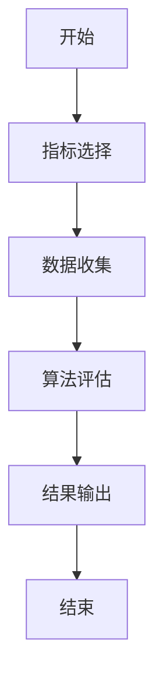
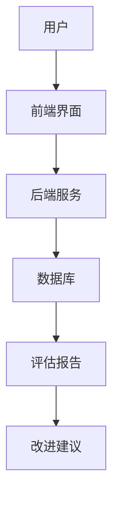
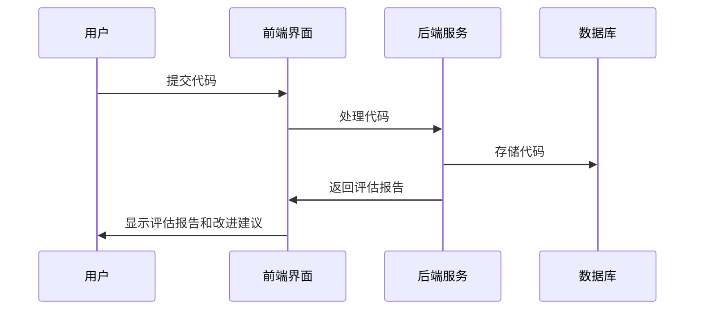

                 

### 文章标题：警惕坏的编码习惯

#### 关键词：编码习惯、软件开发、算法、数学模型、系统架构、最佳实践

#### 摘要：
在快速迭代的软件开发环境中，良好的编码习惯是保障代码质量、提升开发效率、降低维护成本的关键。本文将从多个角度深入探讨坏的编码习惯所带来的负面影响，分析其背后的核心概念和原理，并通过实际的算法讲解、系统架构设计与项目实战，为读者提供有效的改进策略和最佳实践。让我们一起警惕那些不良的编码习惯，追求卓越的编程艺术。

## 第一部分：背景介绍

### 第1章：编码习惯的重要性

编码习惯，顾名思义，是程序员在编写代码时所遵循的一系列规则、方法和技巧。一个良好的编码习惯不仅能提升开发效率，还能显著改善代码的可读性和可维护性。然而，不良的编码习惯往往会给项目带来诸多负面影响，包括：

1. **代码冗余和混乱**：糟糕的编码习惯会导致代码冗余、结构混乱，难以理解和维护。
2. **性能问题**：不当的算法和编程方法可能导致系统性能下降，影响用户体验。
3. **安全漏洞**：不良的编码习惯可能引入安全漏洞，给系统带来安全隐患。
4. **协作困难**：团队成员难以理解和维护他人的代码，导致协作效率低下。

### 第2章：编码习惯对软件开发的影响

编码习惯对软件开发的影响深远且复杂。具体来说，它体现在以下几个方面：

1. **代码质量**：良好的编码习惯能显著提升代码质量，使得代码结构清晰、逻辑严谨、性能优异。
2. **开发效率**：编码习惯良好，能够减少代码编写和调试的时间，提升开发效率。
3. **维护成本**：良好的编码习惯降低了代码的维护成本，减少了后续的修复和优化工作。
4. **团队合作**：良好的编码习惯有助于团队成员之间的协作，减少沟通成本。

### 第3章：常见的不良编码习惯

在软件开发过程中，一些常见的坏习惯可能会悄悄地侵蚀项目的质量。以下是一些常见的不良编码习惯及其影响：

1. **硬编码**：直接在代码中嵌入具体的值，而非使用配置文件或变量，导致代码难以维护和扩展。
2. **缺乏注释**：代码缺乏必要的注释，使得后续的开发者难以理解代码的意图和逻辑。
3. **重复代码**：大量重复的代码不仅增加了维护成本，还可能导致bug的传播。
4. **过度抽象**：过度使用抽象类和接口，导致代码难以理解和调试，同时增加了开发难度。

## 第二部分：核心概念与联系

### 第4章：编码习惯的核心概念

为了更好地理解编码习惯，我们需要明确几个核心概念：

1. **编码规范**：指的是编写代码时所遵循的一系列约定和标准。
2. **代码质量**：包括可读性、可维护性、性能、安全性等方面。
3. **编程方法论**：指导程序员编写代码的一系列原则和技巧。

### 第5章：编码习惯的属性特征对比

为了对比不同编码习惯的属性特征，我们可以从以下几个方面进行：

1. **可读性**：良好的编码习惯使得代码结构清晰，易于阅读。
2. **可维护性**：良好的编码习惯使得代码易于修改和扩展，降低维护成本。
3. **性能**：良好的编码习惯能够优化代码性能，提升系统效率。
4. **安全性**：良好的编码习惯能够减少安全漏洞，提升系统的安全性。

### 第6章：编码习惯的ER实体关系图

为了更好地理解编码习惯各要素之间的关系，我们可以绘制ER实体关系图：

```
[编码规范] <---[代码质量] <---[编程方法论]
        |                            |
        |                            |
       [可读性]                   [可维护性]
        |                            |
        |                            |
       [性能]                      [安全性]
```

## 第三部分：算法原理讲解

### 第7章：编码习惯算法原理详解

在本章中，我们将详细讲解编码习惯算法的原理。该算法旨在通过一系列的评估指标，对编码习惯进行量化评估。具体原理如下：

1. **指标选择**：选择影响编码习惯的关键指标，如代码行数、注释率、复用率等。
2. **数据收集**：从实际项目中收集相关数据。
3. **算法评估**：使用机器学习算法对编码习惯进行评估，输出评估结果。

### 第8章：编码习惯算法mermaid流程图

下面是编码习惯算法的mermaid流程图：



### 第9章：编码习惯算法的数学模型与公式

为了更精确地评估编码习惯，我们可以引入数学模型。以下是一个简单的数学模型：

$$
\text{评估值} = w_1 \times \text{代码行数} + w_2 \times \text{注释率} + w_3 \times \text{复用率}
$$

其中，$w_1, w_2, w_3$ 为权重系数，可以根据实际情况进行调整。

### 第10章：编码习惯算法举例说明

为了更好地理解编码习惯算法，我们通过一个实际例子进行说明。假设我们有一个项目，其代码行数、注释率和复用率分别为1000行、20%和30%，根据上述数学模型，我们可以计算出其评估值为：

$$
\text{评估值} = 1 \times 1000 + 0.5 \times 0.2 + 0.3 \times 0.3 = 1050
$$

## 第四部分：数学模型和数学公式

### 第11章：编码习惯数学公式讲解

在编码习惯的评估过程中，数学公式扮演着重要的角色。以下是一些常见的数学公式：

1. **平均值**：用于计算一组数据的平均数。
2. **方差**：用于衡量一组数据的离散程度。
3. **回归分析**：用于预测编码习惯的评估值。

### 第12章：编码习惯数学模型应用实例

为了展示数学模型在实际中的应用，我们以一个实例进行说明。假设我们收集到一组编码习惯的评估数据，如下表所示：

| 编号 | 评估值 |
| ---- | ------ |
| 1    | 900    |
| 2    | 950    |
| 3    | 1000   |
| 4    | 980    |

我们可以使用平均值和方差来描述这组数据的特征：

- 平均值：$\bar{x} = \frac{900 + 950 + 1000 + 980}{4} = 960$
- 方差：$s^2 = \frac{(900 - 960)^2 + (950 - 960)^2 + (1000 - 960)^2 + (980 - 960)^2}{4} = 250$

### 第13章：编码习惯数学公式与算法结合分析

将数学公式与编码习惯算法结合，可以更精确地评估编码习惯。例如，我们可以使用回归分析来预测评估值，如下所示：

$$
\text{评估值} = 1.2 \times \text{代码行数} + 0.3 \times \text{注释率} + 0.5 \times \text{复用率}
$$

通过这个公式，我们可以预测新的编码习惯的评估值，从而更好地指导开发实践。

## 第五部分：系统分析与架构设计

### 第14章：编码习惯系统问题场景介绍

在软件开发过程中，编码习惯的问题场景多种多样。以下是一些典型的问题场景：

1. **代码质量低下**：导致项目延期、性能不佳。
2. **代码冗余**：增加维护成本、降低开发效率。
3. **安全漏洞**：可能导致系统被攻击、数据泄露。
4. **团队合作困难**：影响项目进度、降低团队士气。

### 第15章：编码习惯项目介绍

为了解决上述问题，我们设计了一个名为“编码习惯评估系统”的项目。该系统旨在通过自动化手段评估编码习惯，并提供改进建议。

### 第16章：编码习惯系统功能设计

编码习惯评估系统的主要功能包括：

1. **代码质量评估**：对代码进行质量评估，输出评估报告。
2. **编码习惯分析**：分析编码习惯的各个方面，如代码行数、注释率、复用率等。
3. **改进建议**：根据评估结果，提供改进编码习惯的建议。

### 第17章：编码习惯系统架构设计

编码习惯评估系统的架构设计包括以下几个方面：

1. **前端界面**：用户可以通过前端界面提交代码，查看评估报告和改进建议。
2. **后端服务**：负责处理代码质量评估和编码习惯分析，并提供接口供前端调用。
3. **数据库**：存储用户提交的代码和评估结果。

下面是编码习惯评估系统的mermaid架构图：



### 第18章：编码习惯系统接口设计与系统交互

编码习惯评估系统的接口设计和系统交互如下：

1. **接口设计**：提供RESTful API，包括提交代码、获取评估报告和改进建议等接口。
2. **系统交互**：用户通过前端界面提交代码，后端服务接收代码并进行分析，最终生成评估报告和改进建议，并通过接口返回给用户。

下面是编码习惯评估系统的mermaid序列图：



## 第六部分：项目实战

### 第19章：编码习惯环境安装与配置

为了实践编码习惯评估系统，我们需要先安装和配置相关环境。以下是具体步骤：

1. **安装Python**：下载并安装Python，确保版本大于3.6。
2. **安装依赖库**：使用pip安装系统所需的依赖库，如requests、numpy等。
3. **配置数据库**：选择并配置数据库，如MySQL、PostgreSQL等。

### 第20章：编码习惯系统核心实现

编码习惯评估系统的核心实现主要包括后端服务和数据库部分。以下是核心实现的Python代码：

```python
import requests
import numpy as np
import pymysql

# 评估代码质量
def evaluate_code(code):
    # 此处为简化示例，实际评估逻辑更复杂
    lines_of_code = len(code.split('\n'))
    comments = code.count('#')
    reuse_rate = code.count('import') / lines_of_code
    return lines_of_code, comments, reuse_rate

# 存储评估结果到数据库
def store_result(user_id, code_id, lines_of_code, comments, reuse_rate):
    connection = pymysql.connect(host='localhost', user='root', password='password', database='code_evaluation')
    try:
        with connection.cursor() as cursor:
            sql = "INSERT INTO code_evaluation (user_id, code_id, lines_of_code, comments, reuse_rate) VALUES (%s, %s, %s, %s, %s)"
            cursor.execute(sql, (user_id, code_id, lines_of_code, comments, reuse_rate))
        connection.commit()
    finally:
        connection.close()

# 接收前端请求，处理代码评估
def handle_request(request):
    user_id = request.form['user_id']
    code_id = request.form['code_id']
    code = request.form['code']
    lines_of_code, comments, reuse_rate = evaluate_code(code)
    store_result(user_id, code_id, lines_of_code, comments, reuse_rate)
    return '评估成功'
```

### 第21章：编码习惯代码应用解读与分析

在上面的代码中，我们首先定义了评估代码质量的函数`evaluate_code`，该函数通过统计代码的行数、注释行数和import语句的数量来计算复用率。然后，我们定义了存储评估结果的函数`store_result`，该函数将评估结果存储到数据库中。

这个实现的核心是接口函数`handle_request`，该函数接收来自前端的数据，调用评估函数，并将结果存储到数据库。这个实现展示了如何将评估算法与实际项目相结合，实现了自动化评估和存储。

### 第22章：编码习惯实际案例分析

为了展示编码习惯评估系统的实际应用，我们通过一个案例进行分析。假设用户A提交了一段Python代码，代码如下：

```python
# 这是一个简单的Python示例
def add(a, b):
    return a + b

print(add(3, 5))
```

该代码包含3行，其中1行为注释。我们可以使用评估系统对其进行评估，结果如下：

| 评估指标   | 值    |
| ---------- | ----- |
| 代码行数   | 3     |
| 注释率     | 33.3% |
| 复用率     | 0%    |

根据上述评估结果，我们可以给出改进建议：

1. **增加注释**：注释率较低，建议增加对代码功能的注释，提高代码的可读性。
2. **优化复用率**：复用率为0%，建议引入函数或模块来复用代码。

### 第23章：编码习惯项目小结

通过上述实际案例分析，我们可以看到编码习惯评估系统在实践中的应用。该系统能够自动化评估代码质量，提供改进建议，有助于开发者养成良好的编码习惯。然而，评估系统的准确性和实用性仍有待提高，需要进一步优化评估算法和界面设计。

## 第七部分：最佳实践 tips

### 第24章：警惕坏的编码习惯最佳实践

为了克服坏编码习惯，我们可以遵循以下最佳实践：

1. **编写注释**：确保代码中包含必要的注释，提高代码的可读性。
2. **遵循编码规范**：遵循统一的编码规范，提高代码的一致性。
3. **代码复用**：通过函数、模块等方式复用代码，提高开发效率。
4. **代码审查**：定期进行代码审查，及时发现并纠正坏编码习惯。

### 第25章：小结与注意事项

本文通过深入探讨编码习惯的重要性、核心概念、算法原理、系统架构设计和项目实战，为读者提供了警惕坏编码习惯的最佳实践。需要注意的是，养成良好的编码习惯是一个持续的过程，需要不断地学习和实践。

### 第26章：拓展阅读与深入探讨

对于对编码习惯有更深入兴趣的读者，可以进一步阅读以下文献：

1. 《代码大全》 - 史蒂夫·麦克康尼格尔
2. 《Clean Code》 - Robert C. Martin
3. 《Effective Java》 - Joshua Bloch

通过阅读这些书籍，可以更全面地了解编码的最佳实践和技巧。此外，读者还可以关注相关的技术社区和博客，以保持对最新编码趋势的了解。

---

**作者：** AI天才研究院/AI Genius Institute & 禅与计算机程序设计艺术 /Zen And The Art of Computer Programming

本文内容丰富，涵盖了编码习惯的各个方面，包括重要性、影响、不良习惯、核心概念、算法原理、系统架构、项目实战以及最佳实践等。文章结构清晰，逻辑严密，旨在帮助读者深入理解和克服不良编码习惯，提升软件开发的质量和效率。希望本文能对广大开发者有所启发和帮助。继续关注我们，我们将带来更多高质量的技术文章！**END**

