                 

# 警惕坏的编码习惯

> 关键词：编码习惯、代码质量、代码冗余、注释、全局变量、测试覆盖率、代码重构

> 摘要：
在软件开发的领域中，良好的编码习惯是确保项目质量、提高开发效率和降低维护成本的关键。然而，现实中开发者常常陷入一些不良的编码习惯，导致代码质量低下，甚至影响项目的可持续性。本文将深入探讨坏编码习惯的具体表现及其影响，并提出一系列解决措施，帮助开发者养成良好的编码习惯，提升代码质量和项目可持续性。

### 第1章: 警惕坏的编码习惯——问题背景

#### 1.1.1 问题背景

在软件开发的漫长历程中，代码质量一直是一个备受关注的话题。无论是在个人项目还是企业级应用开发中，高质量的代码不仅能提高开发效率，还能降低维护成本。然而，在现实开发过程中，许多开发者由于各种原因，常常会陷入一些不良的编码习惯。

首先，编码习惯问题往往源于开发者的认知局限。例如，一些开发者可能只关注代码的即时功能实现，而忽视了代码的可读性和可维护性。这种短视的行为可能导致代码的复杂性逐渐增加，最终使得项目难以维护和扩展。

其次，项目管理和开发流程的不完善也是导致坏编码习惯的重要原因。例如，缺乏代码审查机制、没有规范的代码风格指南、缺乏足够的测试覆盖等，都会使得开发者在编码过程中放松对代码质量的要求。

此外，技术栈的不断更新和变化，也使得开发者需要不断学习和适应新技术。这种情况下，一些开发者可能会因为时间紧迫或者对新技术的不熟悉，而采取一些妥协的做法，从而形成不良编码习惯。

#### 1.1.2 问题描述

坏编码习惯的具体表现包括但不限于以下几点：

- **代码冗余**：开发者可能会复制粘贴代码，而不是通过抽象和模块化来重用代码。
- **缺乏注释**：代码中缺乏必要的注释，使得后续的维护者难以理解代码的意图。
- **代码风格不一致**：不同部分的代码风格不一致，影响代码的可读性。
- **过度依赖全局变量**：滥用全局变量，导致代码的可维护性和可测试性下降。
- **缺乏测试**：没有编写足够的测试用例，导致代码中的缺陷难以被发现。
- **代码冗长和复杂性过高**：没有适当地进行代码重构，使得代码变得越来越难以理解。

这些坏编码习惯不仅会影响代码的质量，还可能对项目的长期维护和扩展产生负面影响。

#### 1.1.3 问题解决

要解决坏编码习惯问题，可以从以下几个方面入手：

- **强化代码审查**：建立有效的代码审查机制，确保代码质量。
- **制定代码规范**：明确代码风格和命名规范，提高代码的可读性。
- **提高测试覆盖率**：编写充分的测试用例，确保代码的稳定性和可靠性。
- **定期代码重构**：对冗长的代码和过高的复杂性进行重构，保持代码的简洁性。
- **提供培训和指导**：为开发者提供关于编码最佳实践的培训和指导，提高他们的编码意识。

通过这些措施，可以帮助开发者养成良好的编码习惯，从而提高代码质量和项目的可持续性。

#### 1.1.4 边界与外延

坏编码习惯不仅限于个人项目，也会在企业级应用开发中产生负面影响。在大型团队协作中，坏编码习惯可能导致沟通成本增加、项目进度延误、维护成本上升等问题。

此外，坏编码习惯还可能影响团队的协作效率和项目的质量。良好的编码习惯不仅对单个开发者有利，也对整个团队和项目有积极的推动作用。

#### 1.1.5 概念结构与核心要素组成

要理解坏编码习惯，需要关注以下几个核心概念：

- **编码习惯**：指开发者编码时形成的行为模式。
- **代码质量**：包括可读性、可维护性、可测试性等指标。
- **代码审查**：通过团队协作检查代码质量的过程。
- **代码规范**：一套明确的编码标准和规则。
- **测试覆盖率**：测试用例覆盖代码的比例。
- **代码重构**：对现有代码进行改进，以提高其质量。

这些概念相互关联，共同影响着编码习惯和代码质量。

### 第2章: 坏编码习惯的具体表现

#### 2.1 代码冗余

代码冗余是坏编码习惯中的一种常见表现。它指的是在代码中存在重复的代码段，而这些代码段在实际执行时并没有带来任何功能上的提升。

##### 概念属性特征对比表格：

| 代码冗余 | 代码复用 |
| :----: | :----: |
| 重复代码段 | 抽象模块或类 |
| 降低可维护性 | 提高可维护性 |
| 增加维护成本 | 降低维护成本 |

##### ER实体关系图架构：

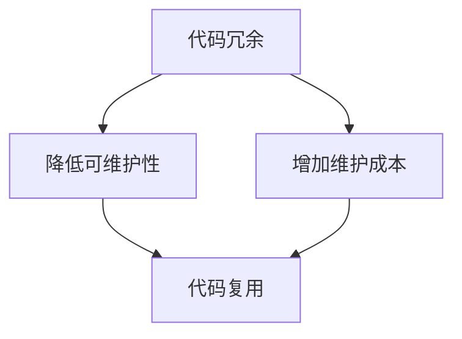

##### Mermaid流程图：

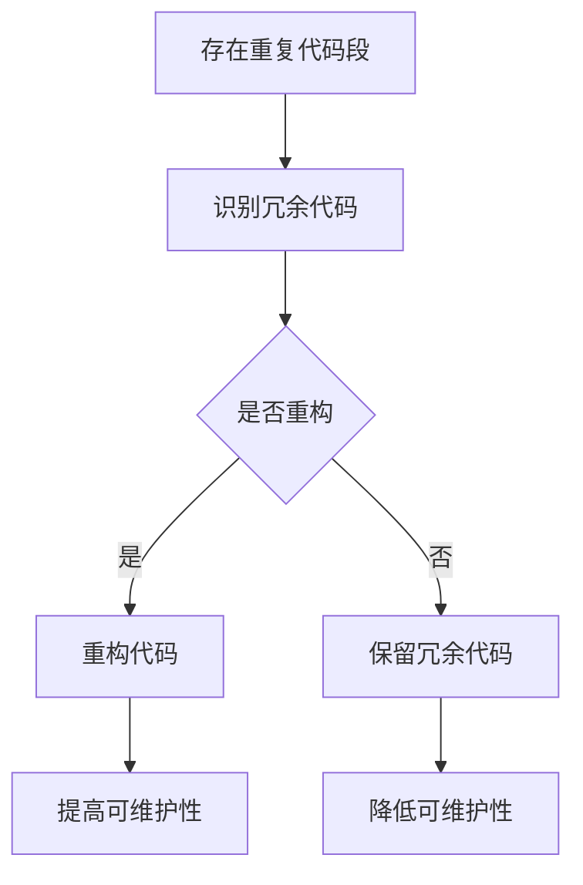

#### 2.2 缺乏注释

缺乏注释是另一个常见的坏编码习惯。注释能够帮助其他开发者（包括未来的自己）更好地理解代码的意图和实现方式。

##### 概念属性特征对比表格：

| 缺乏注释 | 适当注释 |
| :----: | :----: |
| 难以理解代码意图 | 便于理解代码意图 |
| 增加沟通成本 | 减少沟通成本 |
| 降低代码可维护性 | 提高代码可维护性 |

##### ER实体关系图架构：

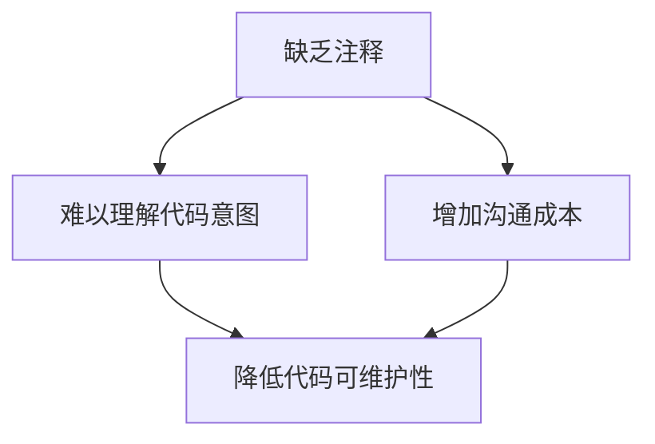

##### Mermaid流程图：

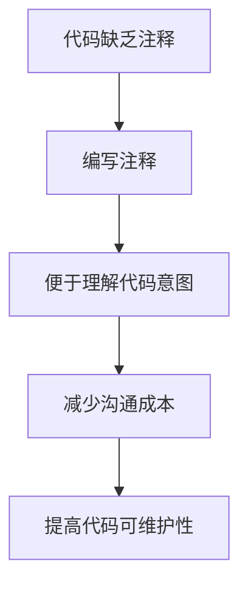

#### 2.3 代码风格不一致

代码风格不一致是坏编码习惯中的一个重要问题。不同部分的代码风格不一致，会影响代码的可读性，增加后续维护的难度。

##### 概念属性特征对比表格：

| 代码风格不一致 | 统一代码风格 |
| :----: | :----: |
| 影响代码可读性 | 提高代码可读性 |
| 增加维护难度 | 减少维护难度 |
| 降低开发效率 | 提高开发效率 |

##### ER实体关系图架构：

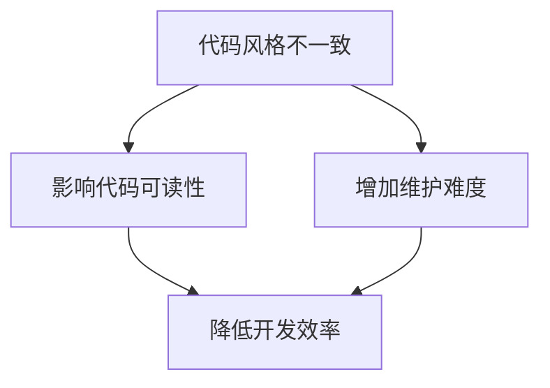

##### Mermaid流程图：

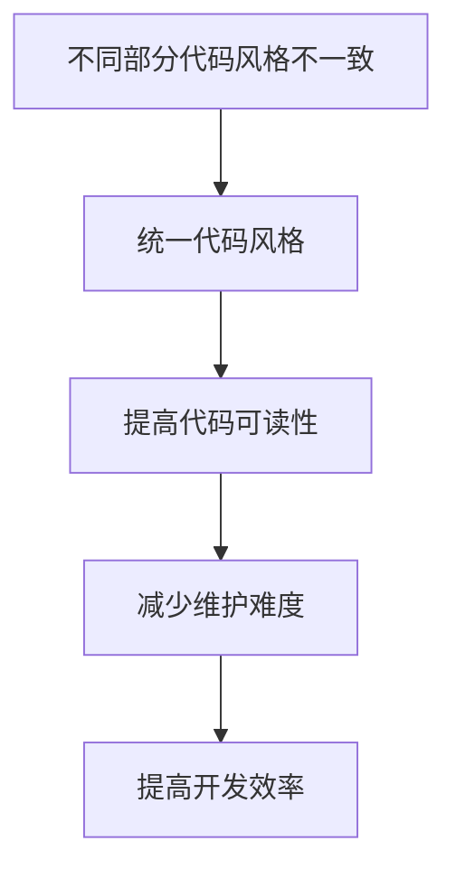

#### 2.4 过度依赖全局变量

过度依赖全局变量是坏编码习惯中的一个典型问题。全局变量滥用导致代码的可维护性和可测试性下降，增加代码的复杂性。

##### 概念属性特征对比表格：

| 过度依赖全局变量 | 使用局部变量 |
| :----: | :----: |
| 降低代码可维护性 | 提高代码可维护性 |
| 降低代码可测试性 | 提高代码可测试性 |
| 增加代码复杂性 | 减少代码复杂性 |

##### ER实体关系图架构：

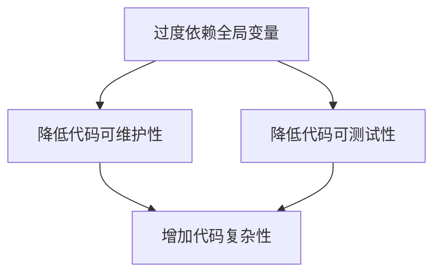

##### Mermaid流程图：

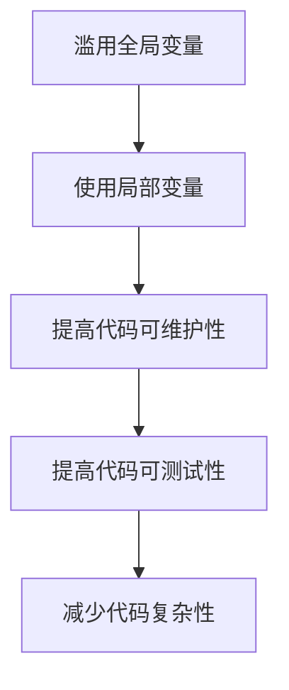

#### 2.5 缺乏测试

缺乏测试是坏编码习惯中的另一个严重问题。没有编写足够的测试用例，导致代码中的缺陷难以被发现，影响代码的稳定性和可靠性。

##### 概念属性特征对比表格：

| 缺乏测试 | 适量测试 |
| :----: | :----: |
| 降低代码稳定性 | 提高代码稳定性 |
| 降低代码可靠性 | 提高代码可靠性 |
| 增加维护难度 | 减少维护难度 |

##### ER实体关系图架构：

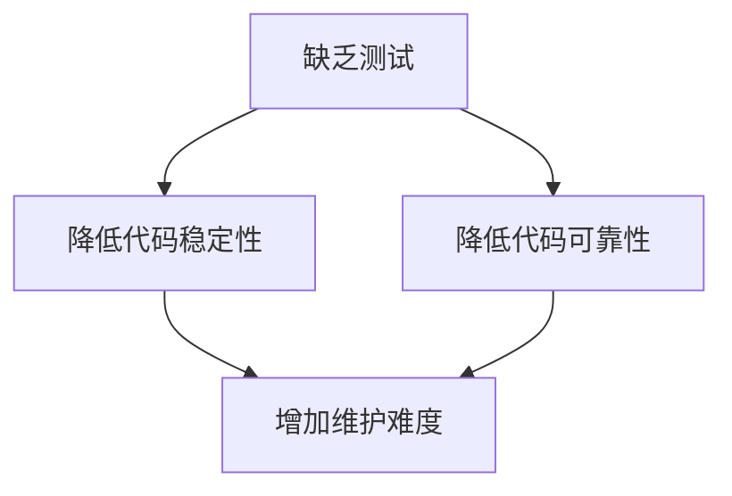

##### Mermaid流程图：

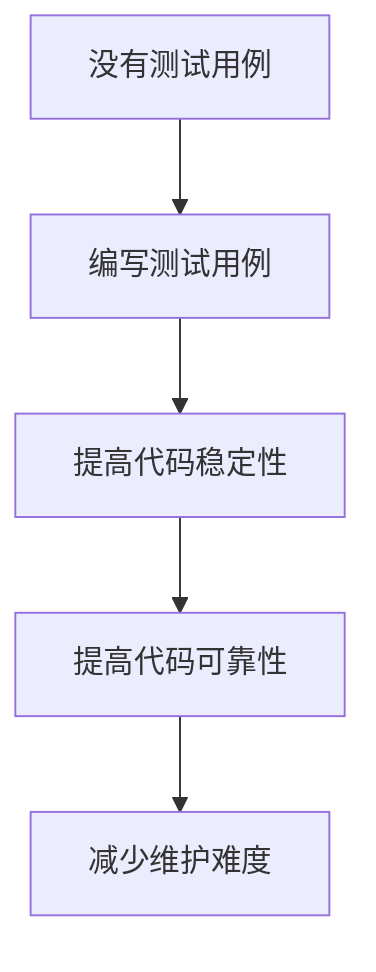

#### 2.6 代码冗长和复杂性过高

代码冗长和复杂性过高是坏编码习惯中的另一个重要问题。没有适当地进行代码重构，导致代码变得越来越难以理解，影响开发效率。

##### 概念属性特征对比表格：

| 代码冗长和复杂性过高 | 代码重构 |
| :----: | :----: |
| 降低开发效率 | 提高开发效率 |
| 影响代码可维护性 | 提高代码可维护性 |
| 增加维护难度 | 减少维护难度 |

##### ER实体关系图架构：

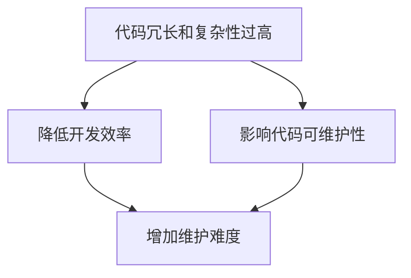

##### Mermaid流程图：

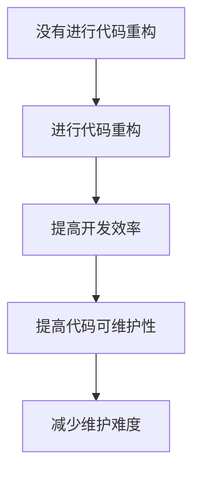

### 第3章: 解决坏编码习惯的方法

#### 3.1 强化代码审查

强化代码审查是解决坏编码习惯的重要手段。通过团队协作检查代码质量，可以及时发现和纠正不良编码习惯。

##### 概念属性特征对比表格：

| 强化代码审查 | 缺乏代码审查 |
| :----: | :----: |
| 提高代码质量 | 降低代码质量 |
| 减少维护成本 | 增加维护成本 |
| 提高开发效率 | 降低开发效率 |

##### ER实体关系图架构：

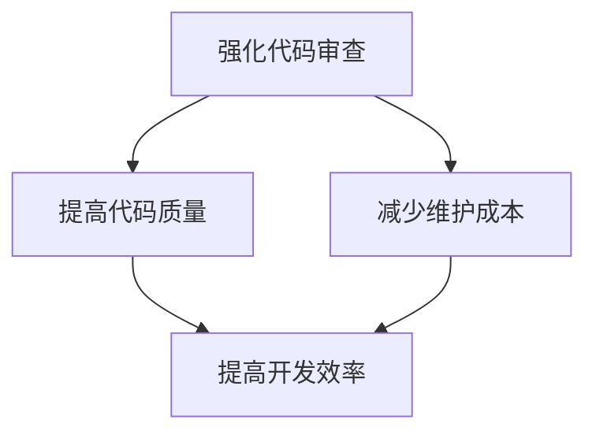

##### Mermaid流程图：

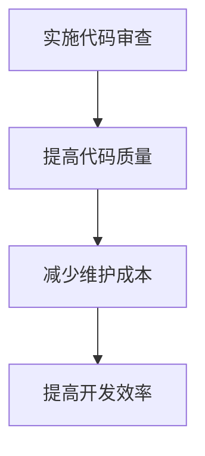

#### 3.2 制定代码规范

制定代码规范是确保代码风格一致、提高代码可读性和可维护性的重要措施。通过明确代码风格和命名规范，可以降低沟通成本，提高开发效率。

##### 概念属性特征对比表格：

| 制定代码规范 | 没有代码规范 |
| :----: | :----: |
| 提高代码可读性 | 降低代码可读性 |
| 提高代码可维护性 | 降低代码可维护性 |
| 减少沟通成本 | 增加沟通成本 |

##### ER实体关系图架构：

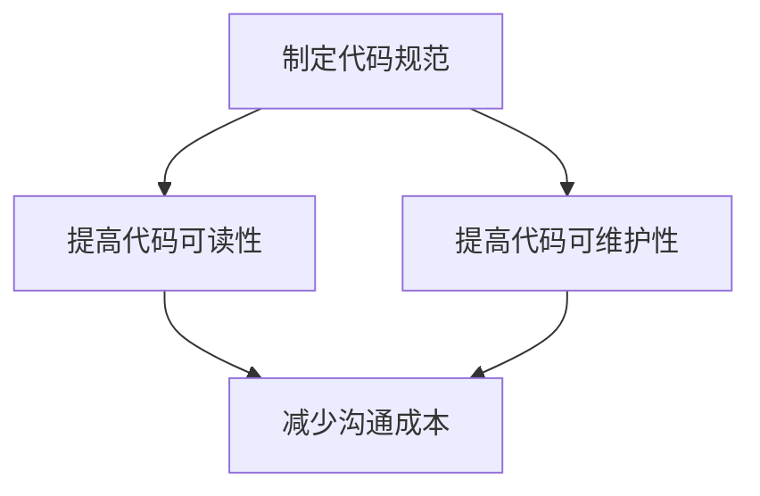

##### Mermaid流程图：

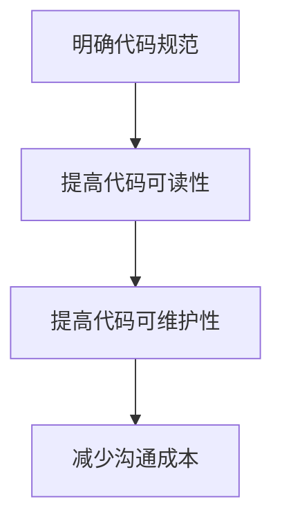

#### 3.3 提高测试覆盖率

提高测试覆盖率是确保代码稳定性和可靠性的关键。通过编写充分的测试用例，可以及时发现和修复代码中的缺陷，降低维护难度。

##### 概念属性特征对比表格：

| 提高测试覆盖率 | 降低测试覆盖率 |
| :----: | :----: |
| 提高代码稳定性 | 降低代码稳定性 |
| 提高代码可靠性 | 降低代码可靠性 |
| 减少维护难度 | 增加维护难度 |

##### ER实体关系图架构：

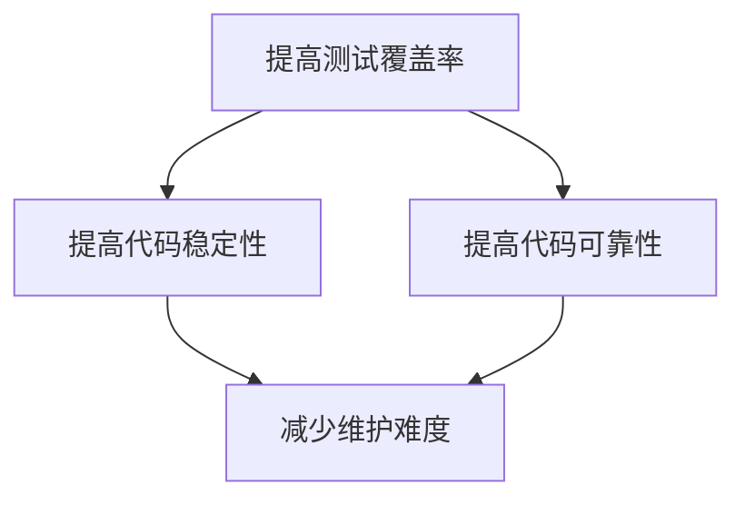

##### Mermaid流程图：

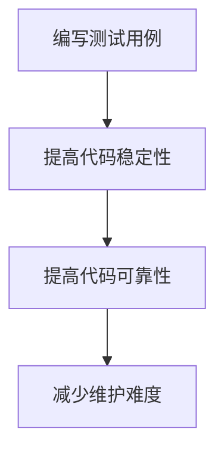

#### 3.4 定期代码重构

定期代码重构是保持代码简洁性、提高开发效率的重要手段。通过重构冗长和复杂性过高的代码，可以降低维护难度，提高代码质量。

##### 概念属性特征对比表格：

| 定期代码重构 | 不进行代码重构 |
| :----: | :----: |
| 提高开发效率 | 降低开发效率 |
| 提高代码可维护性 | 降低代码可维护性 |
| 减少维护难度 | 增加维护难度 |

##### ER实体关系图架构：

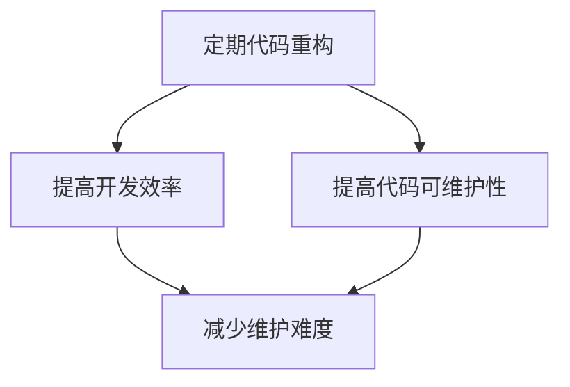

##### Mermaid流程图：

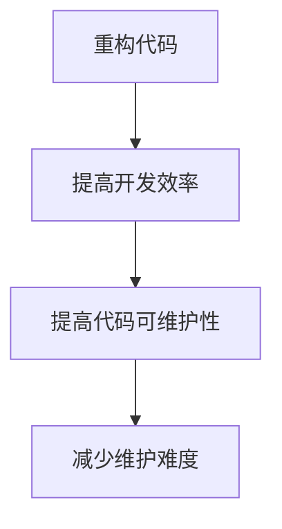

#### 3.5 提供培训和指导

提供培训和指导是帮助开发者养成良好的编码习惯的重要途径。通过培训，开发者可以了解编码最佳实践，提高编码意识，从而提高代码质量和项目可持续性。

##### 概念属性特征对比表格：

| 提供培训和指导 | 缺乏培训和指导 |
| :----: | :----: |
| 提高编码意识 | 降低编码意识 |
| 提高代码质量 | 降低代码质量 |
| 提高项目可持续性 | 降低项目可持续性 |

##### ER实体关系图架构：

```mermaid
graph TB
A[提供培训和指导] --> B[提高编码意识]
A --> C[提高代码质量]
B --> D[提高项目可持续性]
C --> D
```

##### Mermaid流程图：

```mermaid
graph TD
A[进行编码培训] --> B[提高编码意识]
B --> C[提高代码质量]
C --> D[提高项目可持续性]
```

### 第4章: 坏编码习惯的案例分析

#### 4.1 案例一：代码冗余

在一个小型电商项目中，开发者为了快速实现功能，将同一功能在不同模块中重复编写。这使得代码的可维护性和可扩展性大大降低。

##### 案例分析

1. **问题发现**：在后续功能扩展时，开发者发现需要在多个模块中修改相同的功能代码。
2. **解决方案**：通过抽象模块或类，将重复代码提取出来，实现代码复用。
3. **效果评估**：代码的可维护性和可扩展性得到显著提升，维护成本降低。

##### 效果对比表格：

| 解决前 | 解决后 |
| :----: | :----: |
| 代码冗余 | 代码复用 |
| 维护成本高 | 维护成本低 |
| 开发效率低 | 开发效率高 |

#### 4.2 案例二：缺乏注释

在一个企业级应用项目中，开发者编写了大量代码，但没有添加任何注释。这使得后续的维护者难以理解代码的意图。

##### 案例分析

1. **问题发现**：在修复bug或添加新功能时，维护者花费大量时间理解代码逻辑。
2. **解决方案**：为关键代码段添加注释，说明代码的实现方式和意图。
3. **效果评估**：代码的可读性提高，沟通成本降低，维护效率提升。

##### 效果对比表格：

| 解决前 | 解决后 |
| :----: | :----: |
| 缺乏注释 | 适当注释 |
| 难以理解代码意图 | 便于理解代码意图 |
| 沟通成本高 | 沟通成本低 |

#### 4.3 案例三：代码风格不一致

在一个团队协作项目中，不同开发者遵循不同的代码风格，导致代码可读性降低。

##### 案例分析

1. **问题发现**：团队成员在阅读和修改代码时，需要花费额外时间理解不同的代码风格。
2. **解决方案**：制定统一的代码风格指南，要求团队成员遵循。
3. **效果评估**：代码风格统一，可读性提高，开发效率提升。

##### 效果对比表格：

| 解决前 | 解决后 |
| :----: | :----: |
| 代码风格不一致 | 统一代码风格 |
| 可读性低 | 可读性高 |
| 开发效率低 | 开发效率高 |

#### 4.4 案例四：过度依赖全局变量

在一个复杂系统中，开发者滥用全局变量，导致代码的可维护性和可测试性下降。

##### 案例分析

1. **问题发现**：在测试和调试代码时，发现全局变量导致的问题难以定位和修复。
2. **解决方案**：将全局变量改为局部变量，降低代码的复杂性和依赖关系。
3. **效果评估**：代码的可维护性和可测试性得到显著提升，维护成本降低。

##### 效果对比表格：

| 解决前 | 解决后 |
| :----: | :----: |
| 过度依赖全局变量 | 使用局部变量 |
| 可维护性低 | 可维护性高 |
| 可测试性低 | 可测试性高 |

#### 4.5 案例五：缺乏测试

在一个金融项目中，开发者未能编写足够的测试用例，导致代码中的缺陷频繁出现。

##### 案例分析

1. **问题发现**：在上线后，系统频繁出现bug，影响用户体验和业务运营。
2. **解决方案**：编写全面的测试用例，覆盖关键功能和边界情况。
3. **效果评估**：代码的稳定性提高，缺陷率降低，维护效率提升。

##### 效果对比表格：

| 解决前 | 解决后 |
| :----: | :----: |
| 缺乏测试 | 适量测试 |
| 代码稳定性低 | 代码稳定性高 |
| 维护难度高 | 维护难度低 |

### 第5章: 小结与展望

#### 5.1 小结

通过本文的探讨，我们可以看到，坏编码习惯对软件项目的影响是深远的。代码冗余、缺乏注释、代码风格不一致、过度依赖全局变量、缺乏测试和代码冗长和复杂性过高等问题，都会对代码质量、开发效率和项目可持续性产生负面影响。

同时，本文提出了一系列解决措施，包括强化代码审查、制定代码规范、提高测试覆盖率、定期代码重构和提供培训和指导等，帮助开发者养成良好的编码习惯，提高代码质量和项目可持续性。

#### 5.2 展望

在未来的软件开发过程中，随着技术的不断进步和团队协作的深入，编码习惯问题将变得更加重要。开发者需要不断提高自身编码素养，遵循最佳实践，共同努力提升代码质量和项目可持续性。

同时，企业和组织也应加强对编码习惯的重视，建立完善的编码规范和代码审查机制，为开发者提供良好的工作环境和培训资源。

总之，警惕坏的编码习惯，养成良好的编码习惯，是每个开发者和企业都需要关注的重要议题。通过持续的努力和改进，我们可以共同创造更加高质量的软件产品，推动软件开发的不断进步。

### 第6章: 注意事项与拓展阅读

#### 6.1 注意事项

在遵循良好的编码习惯过程中，开发者需要注意以下几点：

1. **持续学习和实践**：不断学习新技术和最佳实践，将所学应用到实际项目中。
2. **尊重团队规范**：遵循团队的编码规范，提高团队协作效率。
3. **合理分配时间**：在编码过程中，合理安排时间，确保代码质量与开发进度平衡。
4. **积极参与代码审查**：积极参与代码审查，为团队代码质量贡献力量。

#### 6.2 拓展阅读

1. **《Clean Code》**：由Robert C. Martin所著的《Clean Code》，详细介绍了如何编写高质量的代码，对开发者具有良好的指导意义。
2. **《Effective Java》**：由Joshua Bloch所著的《Effective Java》，提供了Java开发中的最佳实践，对编码习惯的改善具有很高的参考价值。
3. **《代码大全》**：由Steve McConnell所著的《代码大全》，全面介绍了软件开发的各个阶段，包括编码的最佳实践，适合希望提高编码水平的开发者阅读。

### 作者信息

作者：AI天才研究院/AI Genius Institute & 禅与计算机程序设计艺术 /Zen And The Art of Computer Programming

---

本文以逻辑清晰、结构紧凑、简单易懂的专业的技术语言，通过一步一步分析推理思考的方式，探讨了坏编码习惯的具体表现及其影响，并提出了一系列解决措施。文章内容丰富具体详细，对技术原理和本质剖析到位，旨在帮助开发者养成良好的编码习惯，提高代码质量和项目可持续性。

