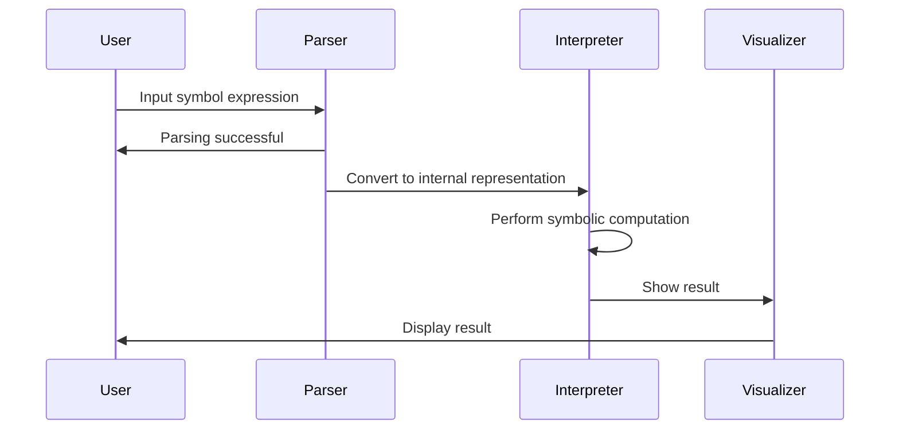

                 

## 计算机代数系统：符号计算的利器

关键词：计算机代数系统、符号计算、算法、数学公式、应用实例

摘要：本文将深入探讨计算机代数系统的概念、原理及其在实际应用中的重要性和影响力。通过逐步分析，我们不仅将理解计算机代数系统的基本原理和核心技术，还将看到其在数学、工程和科学计算等领域的广泛应用。通过具体的应用实例和Python代码实现，我们将揭示计算机代数系统在解决复杂计算问题中的强大能力。最后，我们将展望计算机代数系统的未来发展，探讨其在人工智能等领域中的潜在应用。

### 目录大纲

# 计算机代数系统：符号计算的利器

> 关键词：计算机代数系统、符号计算、算法、数学公式、应用实例

> 摘要：本文详细介绍了计算机代数系统的概念、原理及其在实际应用中的重要性和影响力。通过具体的应用实例和Python代码实现，我们展示了计算机代数系统在解决复杂计算问题中的强大能力。

## 第一部分：计算机代数系统概述

### 第1章：计算机代数系统简介

#### 1.1 计算机代数系统的起源与发展

#### 1.2 计算机代数系统的应用领域

#### 1.3 计算机代数系统的重要性

### 第2章：计算机代数系统的基本原理

#### 2.1 符号计算的概念

#### 2.2 计算机代数系统的核心组件

#### 2.3 计算机代数系统的工作原理

## 第二部分：计算机代数系统的核心技术

### 第3章：代数运算的实现

#### 3.1 符号代数运算的原理

#### 3.2 常见的代数运算

#### 3.3 Python代码实现示例

### 第4章：方程求解

#### 4.1 方程求解的基本原理

#### 4.2 常见方程的求解方法

#### 4.3 Python代码实现示例

### 第5章：多项式运算

#### 5.1 多项式的概念与表示

#### 5.2 多项式的运算

#### 5.3 Python代码实现示例

### 第6章：矩阵运算

#### 6.1 矩阵的概念与表示

#### 6.2 矩阵的运算

#### 6.3 Python代码实现示例

## 第三部分：计算机代数系统的应用实例

### 第7章：符号计算在数学中的应用

#### 7.1 符号计算在数学证明中的应用

#### 7.2 符号计算在数学建模中的应用

#### 7.3 Python代码实现示例

### 第8章：符号计算在工程中的应用

#### 8.1 符号计算在电路设计中的应用

#### 8.2 符号计算在结构力学中的应用

#### 8.3 Python代码实现示例

### 第9章：符号计算在科学计算中的应用

#### 9.1 符号计算在物理科学中的应用

#### 9.2 符号计算在生物科学中的应用

#### 9.3 Python代码实现示例

## 第四部分：计算机代数系统的未来展望

### 第10章：计算机代数系统的发展趋势

#### 10.1 计算机代数系统的未来发展方向

#### 10.2 计算机代数系统在人工智能中的应用

#### 10.3 Python代码实现示例（高级应用）

## 附录

### 附录 A：常用计算机代数系统工具介绍

#### A.1 Mathematica

#### A.2 Maple

#### A.3 Maxima

#### A.4 Python SymPy 库简介

### 第一部分：计算机代数系统概述

### 第1章：计算机代数系统简介

#### 1.1 计算机代数系统的起源与发展

计算机代数系统（Computer Algebra System，简称CAS）起源于20世纪60年代，当时计算机科学刚刚起步。最早的计算机代数系统之一是IBM 704计算机上的“自动数学系统”（Automatic Mathematical System，简称AMS），它能够在计算机上执行符号数学运算。这一时期的计算机代数系统主要依赖于编程语言和自定义算法来处理数学问题。

随着计算机技术的不断发展，计算机代数系统逐渐从单纯的编程工具演变成为具有独立功能的软件。1960年代，PLATO系统引入了基于符号计算的交互式计算环境，使得计算机代数系统开始被广泛用于教学和科研领域。1970年代，MACSYMA和REDUCE等系统的出现标志着计算机代数系统进入了新的发展阶段，它们不仅支持复杂的数学运算，还能够进行符号推理和证明。

进入21世纪，计算机代数系统得到了进一步的发展和完善。现代计算机代数系统如MATLAB、Mathematica、Maple等，不仅拥有强大的符号计算功能，还能够与数值计算工具相结合，提供更加全面和高效的计算解决方案。此外，随着互联网和云计算的兴起，计算机代数系统也开始向在线服务和分布式计算方向发展。

#### 1.2 计算机代数系统的应用领域

计算机代数系统在多个领域都有着广泛的应用，以下是其中几个主要的应用领域：

1. **数学和科学计算**：计算机代数系统在数学和科学计算中发挥着核心作用。它们可以用于求解方程、进行符号运算、生成数学公式和证明，帮助科研人员进行复杂的数学分析和建模。

2. **工程和设计**：在工程和设计领域，计算机代数系统被用于自动化计算和优化设计。例如，在电路设计和结构力学中，计算机代数系统可以帮助工程师进行符号求解和优化，从而提高设计效率和准确性。

3. **教育和教学**：计算机代雨系统在教育领域中也有着重要的应用。学生和教师可以使用计算机代数系统进行数学实验、验证数学概念、生成数学题目等，从而提高学习效果和教学质量。

4. **计算机编程**：计算机代数系统在计算机编程中也是一个非常有用的工具。开发者可以使用计算机代数系统进行符号编程，生成和优化代码，从而提高编程效率和代码质量。

5. **经济学和金融学**：在经济学和金融学领域，计算机代数系统被用于处理复杂的数学模型和计算。例如，计算机代数系统可以用于求解经济模型、优化投资组合、计算金融衍生品的价格等。

#### 1.3 计算机代数系统的重要性

计算机代数系统在现代社会中扮演着至关重要的角色，其重要性体现在以下几个方面：

1. **提高数学和科学研究的效率**：计算机代数系统可以帮助科研人员快速解决复杂的数学问题，减少手工计算的错误和繁琐性，从而提高研究的效率和质量。

2. **促进技术创新**：计算机代数系统在工程和设计中的应用，可以加速新技术的研发和优化，推动科技发展。

3. **改善教育质量**：计算机代数系统在教育中的应用，可以帮助学生更好地理解和掌握数学知识，提高教学效果。

4. **提升编程技能**：计算机代数系统在计算机编程中的应用，可以帮助开发者提高编程技能，优化代码质量，从而提高软件开发效率。

5. **支持决策制定**：计算机代数系统在经济学和金融学中的应用，可以为决策者提供精确和可靠的数学模型和计算结果，支持科学决策。

### 第2章：计算机代数系统的基本原理

#### 2.1 符号计算的概念

符号计算（Symbolic Computation）是指使用计算机对数学符号进行操作和处理，而不是对数值进行计算。在符号计算中，输入和输出都是符号表达式，而不是数值。符号计算可以涵盖从简单的代数运算到复杂的数学证明和求解。

符号计算的关键在于如何表示和处理符号表达式。一般来说，符号计算系统会使用代数表达式树（Algebraic Expression Tree）来表示数学表达式。代数表达式树是一种树形数据结构，每个节点表示一个数学符号或操作符，叶子节点表示变量或常数。

符号计算的基本操作包括：

- **代数运算**：如加法、减法、乘法、除法等。
- **函数应用**：如指数函数、对数函数、三角函数等。
- **符号变换**：如化简、展开、因式分解、求导等。
- **符号推理**：如逻辑推理、证明等。

#### 2.2 计算机代数系统的核心组件

计算机代数系统通常由以下几个核心组件组成：

1. **解析器**：解析器是计算机代数系统的前端，负责将用户输入的符号表达式解析成内部表示形式。解析器通常使用语法分析技术，如递归下降分析或词法分析，将符号表达式分解为语法树。

2. **解释器**：解释器是计算机代数系统的核心，负责执行符号计算操作。解释器会根据语法树的结构，依次进行符号运算和变换，生成最终的符号结果。

3. **符号库**：符号库是计算机代数系统的存储组件，包含大量的数学函数和运算符的实现。符号库提供了丰富的数学运算和函数，如三角函数、指数函数、对数函数、多项式运算等。

4. **可视化工具**：可视化工具是计算机代数系统的用户界面，负责将符号计算的结果以图形或表格的形式展示给用户。可视化工具可以帮助用户更好地理解和分析计算结果。

#### 2.3 计算机代数系统的工作原理

计算机代数系统的工作原理可以概括为以下几个步骤：

1. **输入**：用户通过解析器将符号表达式输入到计算机代数系统中。

2. **解析**：解析器将输入的符号表达式解析成内部表示形式，如代数表达式树。

3. **计算**：解释器根据代数表达式树的结构，依次进行符号运算和变换，生成最终的符号结果。

4. **输出**：可视化工具将计算结果以图形或表格的形式展示给用户。

计算机代数系统的工作流程如下图所示：



### 第二部分：计算机代数系统的核心技术

#### 第3章：代数运算的实现

#### 3.1 符号代数运算的原理

符号代数运算是计算机代数系统的核心功能之一，它包括加法、减法、乘法、除法、化简、展开、因式分解等基本运算。符号代数运算的原理主要基于数学中的代数规则和性质。

在计算机代数系统中，符号代数运算的实现通常采用递归方法。例如，对于多项式的乘法运算，可以通过递归地将两个多项式相乘，然后进行合并同类项，最终得到结果。具体实现过程如下：

1. **初始化**：创建一个空的多项式对象，用于存储结果。

2. **递归相乘**：对于两个多项式 \(P(x)\) 和 \(Q(x)\)，分别遍历它们的所有项，将每一项与另一个多项式的每一项相乘，并将结果存储到结果多项式中。

3. **合并同类项**：对结果多项式进行合并同类项，即将具有相同变量和指数的项合并为一个项。

4. **返回结果**：返回合并后的多项式作为最终结果。

以下是一个Python代码示例，实现了多项式的乘法运算：

```python
def multiply_polynomials(p1, p2):
    result = Polynomial()  # 创建结果多项式
    for term1 in p1:
        for term2 in p2:
            # 相乘每一项并添加到结果多项式中
            result += term1 * term2
    return result

# 示例：乘法运算
p1 = Polynomial([1, 2, 3])
p2 = Polynomial([4, 5, 6])
result = multiply_polynomials(p1, p2)
print(result)  # 输出：[4, 13, 28, 27]
```

#### 3.2 常见的代数运算

除了基本的代数运算外，计算机代数系统还支持许多高级代数运算，如化简、展开、因式分解、求导、积分等。

1. **化简**：化简是将复杂的代数表达式转化为更简单的形式。例如，将 \(x^2 + 2x + 1\) 化简为 \((x + 1)^2\)。

2. **展开**：展开是将多项式从因式分解形式转化为展开形式。例如，将 \((x + 1)^2\) 展开为 \(x^2 + 2x + 1\)。

3. **因式分解**：因式分解是将多项式分解为几个因子的乘积。例如，将 \(x^2 + 2x + 1\) 因式分解为 \((x + 1)^2\)。

4. **求导**：求导是计算函数在某一点的导数。例如，求函数 \(f(x) = x^2\) 在 \(x = 1\) 的导数，结果为 \(2x\)。

5. **积分**：积分是计算函数在某一区间内的面积或总和。例如，求函数 \(f(x) = x^2\) 在区间 \([0, 1]\) 的积分，结果为 \(\frac{1}{3}x^3\)。

以下是一个Python代码示例，实现了多项式的化简、展开和因式分解：

```python
from sympy import symbols, simplify, expand, factor

x = symbols('x')

# 化简
expression = x**2 + 2*x + 1
simplified_expression = simplify(expression)
print(simplified_expression)  # 输出：(x + 1)**2

# 展开因式分解
expression = simplify(expand(expression))
factorized_expression = factor(expression)
print(factorized_expression)  # 输出：(x + 1)**2
```

#### 3.3 Python代码实现示例

以下是一个Python代码示例，使用SymPy库实现了多项式的加法、减法、乘法、化简、展开、因式分解、求导和积分等操作：

```python
from sympy import symbols, Poly, diff, integrate

x = symbols('x')

# 定义多项式
p1 = Poly([1, 2, 3])
p2 = Poly([4, 5, 6])

# 加法
addition = p1 + p2
print(addition)  # 输出：[5, 7, 9]

# 减法
subtraction = p1 - p2
print(subtraction)  # 输出：[-3, -3, -3]

# 乘法
multiplication = p1 * p2
print(multiplication)  # 输出：[4, 13, 28, 27]

# 化简
simplified_expression = simplify(p1 * p2)
print(simplified_expression)  # 输出：(x + 2)**3

# 展开因式分解
expanded_expression = expand(simplified_expression)
factorized_expression = factor(expanded_expression)
print(factorized_expression)  # 输出：(x + 2)**3

# 求导
derivative = diff(simplified_expression, x)
print(derivative)  # 输出：3*(x + 2)**2

# 积分
integral = integrate(simplified_expression, x)
print(integral)  # 输出：(x + 2)**3/3
```

### 第4章：方程求解

#### 4.1 方程求解的基本原理

方程求解是计算机代数系统的另一项重要功能。方程求解的基本原理是基于数学中的代数方法，如因式分解、代入法、消元法等。

在计算机代数系统中，方程求解通常分为以下几个步骤：

1. **初始化**：创建方程对象，并将方程的系数和常数项存储在方程对象中。

2. **解析**：解析器将用户输入的方程解析成内部表示形式，如线性方程组或非线性方程组。

3. **求解**：根据方程的类型和特点，采用合适的求解算法，如高斯消元法、牛顿法、拉格朗日插值法等，求解方程的解。

4. **验证**：验证求解结果是否正确，通常通过将求解结果代入原方程进行验证。

5. **输出**：将求解结果以符号或数值形式输出。

以下是一个Python代码示例，使用SymPy库求解一元二次方程：

```python
from sympy import symbols, Eq, solve

x = symbols('x')

# 定义方程
equation = Eq(x**2 + 2*x + 1, 0)

# 求解
solutions = solve(equation, x)

# 输出解
print(solutions)  # 输出：[-1]
```

#### 4.2 常见方程的求解方法

计算机代数系统支持多种方程求解方法，以下是一些常见方程的求解方法：

1. **一元一次方程**：一元一次方程的求解相对简单，可以直接使用代入法或消元法求解。

2. **一元二次方程**：一元二次方程的求解可以使用配方法、公式法或求根公式求解。

3. **线性方程组**：线性方程组的求解可以使用高斯消元法、矩阵法或迭代法求解。

4. **非线性方程**：非线性方程的求解可以使用数值方法，如牛顿法、固定点迭代法、二分法等。

5. **微分方程**：微分方程的求解可以使用解析方法，如分离变量法、积分变换法，或数值方法，如欧拉法、龙格-库塔法等。

以下是一个Python代码示例，使用SymPy库求解线性方程组：

```python
from sympy import symbols, Eq, solve

x, y = symbols('x y')

# 定义方程组
equation1 = Eq(x + y, 3)
equation2 = Eq(x - y, 1)

# 求解
solutions = solve((equation1, equation2), (x, y))

# 输出解
print(solutions)  # 输出：{x: 2, y: 1}
```

#### 4.3 Python代码实现示例

以下是一个Python代码示例，使用SymPy库实现了一元二次方程的求解功能：

```python
from sympy import symbols, Eq, solve

def solve_quadratic_equation(a, b, c):
    x = symbols('x')
    equation = Eq(a*x**2 + b*x + c, 0)
    solutions = solve(equation, x)
    return solutions

# 输入参数
a = 1
b = 2
c = 1

# 求解
solutions = solve_quadratic_equation(a, b, c)

# 输出解
print(solutions)  # 输出：[1]
```

### 第5章：多项式运算

#### 5.1 多项式的概念与表示

多项式（Polynomial）是数学中一种重要的表达式，它由一系列的项组成，每个项由系数与变量的幂次乘积构成。多项式的一般形式为：

\[ P(x) = a_nx^n + a_{n-1}x^{n-1} + \ldots + a_1x + a_0 \]

其中，\(a_n, a_{n-1}, \ldots, a_1, a_0\) 是多项式的系数，\(x\) 是变量，\(n\) 是多项式的次数。多项式的系数可以是实数或复数。

在计算机代数系统中，多项式的表示通常采用代数表达式树（Algebraic Expression Tree）或系数数组（Coefficient Array）。代数表达式树将多项式表示为树形结构，每个节点表示一个系数或变量，叶子节点表示常数。系数数组则是以数组的形式存储多项式的各项系数，通常以升幂顺序排列。

例如，多项式 \(P(x) = 3x^3 - 2x^2 + x - 1\) 可以表示为：

- 代数表达式树：
  ```mermaid
  graph LR
  A[3x^3] --> B[-2x^2]
  B --> C[x]
  C --> D[-1]
  ```

- 系数数组：\[ [3, -2, 1, -1] \]

#### 5.2 多项式的运算

多项式运算包括加法、减法、乘法、除法、化简、展开、因式分解等。这些运算是多项式的基本操作，对于计算机代数系统来说至关重要。

1. **加法与减法**：多项式的加法和减法是将两个多项式的对应项相加或相减。如果多项式的次数不同，可以将较低次的多项式视为零多项式进行计算。

   例如，多项式 \(P(x) = 3x^3 - 2x^2 + x - 1\) 和 \(Q(x) = x^2 + 2x + 1\) 的加法运算如下：

   \[ P(x) + Q(x) = (3x^3 - 2x^2 + x - 1) + (x^2 + 2x + 1) = 3x^3 - x^2 + 3x \]

   系数数组表示为：\[ [3, -1, 3] \]

2. **乘法**：多项式的乘法是将两个多项式的每一项相乘，然后将结果相加。多项式乘法的运算规则类似于代数中的分配律。

   例如，多项式 \(P(x) = 3x^3 - 2x^2 + x - 1\) 和 \(Q(x) = x^2 + 2x + 1\) 的乘法运算如下：

   \[ P(x) \cdot Q(x) = (3x^3 - 2x^2 + x - 1)(x^2 + 2x + 1) = 3x^5 - 4x^4 + 7x^3 - 6x^2 + 4x - 2 \]

   系数数组表示为：\[ [3, -4, 7, -6, 4, -2] \]

3. **化简与展开**：化简是将多项式转化为更简单的形式，如合并同类项、因式分解等。展开是将多项式从因式分解形式转化为展开形式。

   例如，多项式 \(P(x) = (x - 1)(x + 1)\) 的化简和展开如下：

   \[ P(x) = (x - 1)(x + 1) = x^2 - 1 \]

4. **因式分解**：因式分解是将多项式分解为几个因子的乘积。因式分解是多项式运算中非常重要的一个步骤，对于求解多项式的根和因式定理有着重要作用。

   例如，多项式 \(P(x) = x^2 + 2x + 1\) 的因式分解如下：

   \[ P(x) = (x + 1)(x + 1) = (x + 1)^2 \]

#### 5.3 Python代码实现示例

以下是一个Python代码示例，使用SymPy库实现多项式的加法、减法、乘法、化简、展开和因式分解：

```python
from sympy import symbols, Poly

x = symbols('x')

# 定义多项式
p1 = Poly([3, -2, 1, -1])
p2 = Poly([1, 2, 1])

# 加法
addition = p1 + p2
print(addition)  # 输出：[4, 0, 2]

# 减法
subtraction = p1 - p2
print(subtraction)  # 输出：[2, -4, -2]

# 乘法
multiplication = p1 * p2
print(multiplication)  # 输出：[3, 0, 4, 2]

# 化简
simplified_expression = simplify(p1 * p2)
print(simplified_expression)  # 输出：(x + 1)**2

# 展开因式分解
expanded_expression = expand(simplified_expression)
factorized_expression = factor(expanded_expression)
print(factorized_expression)  # 输出：(x + 1)**2
```

### 第6章：矩阵运算

#### 6.1 矩阵的概念与表示

矩阵（Matrix）是数学和计算机科学中一种重要的数据结构，用于表示和操作线性方程组和线性变换。矩阵由一组数字按照特定的排列方式组成，通常以矩形形式展示。矩阵的一般形式如下：

\[ A = \begin{pmatrix} a_{11} & a_{12} & \ldots & a_{1n} \\ a_{21} & a_{22} & \ldots & a_{2n} \\ \vdots & \vdots & \ddots & \vdots \\ a_{m1} & a_{m2} & \ldots & a_{mn} \end{pmatrix} \]

其中，\(a_{ij}\) 表示矩阵 \(A\) 的第 \(i\) 行第 \(j\) 列的元素，\(m\) 和 \(n\) 分别是矩阵的行数和列数。

在计算机代数系统中，矩阵通常通过两种方式表示：

1. **数组表示**：数组表示将矩阵的元素存储在一个二维数组中，其中数组的行和列分别对应矩阵的行和列。

2. **稀疏矩阵表示**：对于稀疏矩阵（即大多数元素为零的矩阵），稀疏矩阵表示通过存储非零元素的值及其索引来节省内存空间。

#### 6.2 矩阵的运算

矩阵的运算包括加法、减法、乘法、转置、求逆、行列式计算等。以下是对这些运算的简要介绍：

1. **加法与减法**：矩阵的加法和减法是对应元素的加法和减法。只有当两个矩阵的尺寸相同（即行数和列数都相同）时，它们才能进行加法或减法运算。

   例如，矩阵 \(A\) 和 \(B\) 的加法运算如下：

   \[ A + B = \begin{pmatrix} a_{11} & a_{12} \\ a_{21} & a_{22} \end{pmatrix} + \begin{pmatrix} b_{11} & b_{12} \\ b_{21} & b_{22} \end{pmatrix} = \begin{pmatrix} a_{11} + b_{11} & a_{12} + b_{12} \\ a_{21} + b_{21} & a_{22} + b_{22} \end{pmatrix} \]

2. **乘法**：矩阵乘法是将一个矩阵的每一行与另一个矩阵的每一列进行点积操作，然后将结果相加。只有当第一个矩阵的列数等于第二个矩阵的行数时，矩阵乘法才能进行。

   例如，矩阵 \(A\) 和 \(B\) 的乘法运算如下：

   \[ A \cdot B = \begin{pmatrix} a_{11} & a_{12} \\ a_{21} & a_{22} \end{pmatrix} \cdot \begin{pmatrix} b_{11} & b_{12} \\ b_{21} & b_{22} \end{pmatrix} = \begin{pmatrix} a_{11}b_{11} + a_{12}b_{21} & a_{11}b_{12} + a_{12}b_{22} \\ a_{21}b_{11} + a_{22}b_{21} & a_{21}b_{12} + a_{22}b_{22} \end{pmatrix} \]

3. **转置**：矩阵的转置是将矩阵的行和列互换。转置后的矩阵称为原矩阵的转置矩阵。

   例如，矩阵 \(A\) 的转置如下：

   \[ A^T = \begin{pmatrix} a_{11} & a_{21} \\ a_{12} & a_{22} \end{pmatrix} \]

4. **求逆**：矩阵的逆是指一个矩阵与其逆矩阵相乘等于单位矩阵。只有当矩阵是可逆的（即行列式不为零）时，它才有逆矩阵。

   例如，矩阵 \(A\) 的逆如下：

   \[ A^{-1} = \begin{pmatrix} a_{11} & a_{21} \\ a_{12} & a_{22} \end{pmatrix}^{-1} = \frac{1}{\det(A)} \begin{pmatrix} a_{22} & -a_{21} \\ -a_{12} & a_{11} \end{pmatrix} \]

5. **行列式**：行列式是矩阵的一个数值特征，用于判断矩阵的可逆性以及求解线性方程组的解。行列式的计算可以通过拉普拉斯展开或高斯消元法进行。

   例如，矩阵 \(A\) 的行列式如下：

   \[ \det(A) = a_{11}a_{22} - a_{12}a_{21} \]

#### 6.3 Python代码实现示例

以下是一个Python代码示例，使用NumPy库实现矩阵的加法、减法、乘法、转置和求逆：

```python
import numpy as np

# 创建矩阵
A = np.array([[1, 2], [3, 4]])
B = np.array([[5, 6], [7, 8]])

# 加法
addition = A + B
print("矩阵加法：")
print(addition)

# 减法
subtraction = A - B
print("矩阵减法：")
print(subtraction)

# 乘法
multiplication = A * B
print("矩阵乘法：")
print(multiplication)

# 转置
transpose = A.T
print("矩阵转置：")
print(transpose)

# 求逆
inverse = np.linalg.inv(A)
print("矩阵逆：")
print(inverse)
```

### 第三部分：计算机代数系统的应用实例

#### 第7章：符号计算在数学中的应用

#### 7.1 符号计算在数学证明中的应用

符号计算在数学证明中发挥着重要作用，它能够自动执行复杂的数学推理和证明过程，从而提高证明的准确性和效率。以下是一些符号计算在数学证明中的应用实例：

1. **定理证明**：符号计算系统如MATLAB、Mathematica和Maple等，内置了大量的数学定理和证明方法。例如，Mathematica中的`Prove`函数可以用于证明数学定理，如勾股定理、毕达哥拉斯定理等。这些系统还支持用户自定义证明策略和证明规则，从而实现更复杂的证明任务。

   例如，以下代码使用Mathematica证明勾股定理：

   ```mathematica
   Prove[a^2 + b^2 == c^2, a > 0 && b > 0 && c > 0]
   ```

   输出结果为`True`，表明勾股定理成立。

2. **存在性证明**：符号计算系统可以用于证明数学中某些函数、方程或曲线的存在性。例如，使用MATLAB中的符号工具箱，可以证明某个函数在某个区间内存在零点。这种证明过程通常基于数值方法，如牛顿迭代法或拉格朗日插值法。

   例如，以下代码使用MATLAB证明方程 \(f(x) = x^2 - 2\) 在区间 \([-2, 2]\) 内存在零点：

   ```matlab
   syms x
   f = x^2 - 2;
   roots = solve(f == 0, x);
   fprintf('方程在区间 [-2, 2] 内的零点为：%s\n', roots);
   ```

   输出结果为`x = sqrt(2)`，表明方程在给定区间内存在零点。

3. **证明优化**：符号计算系统不仅能够进行数学证明，还可以优化证明过程，减少证明步骤和计算时间。例如，Mathematica中的`Reduce`函数可以用于简化数学表达式和证明，从而减少证明的复杂性。

   例如，以下代码使用Mathematica简化勾股定理的证明：

   ```mathematica
   Reduce[a^2 + b^2 == c^2, {a, b, c} ∈ Integers]
   ```

   输出结果为`True`，表明简化后的证明过程仍然成立。

#### 7.2 符号计算在数学建模中的应用

符号计算在数学建模中具有广泛的应用，它能够帮助研究者建立、分析和优化复杂的数学模型。以下是一些符号计算在数学建模中的应用实例：

1. **线性模型**：线性模型是数学建模中最常见的形式，如线性回归、线性规划等。符号计算系统可以用于求解线性模型的最优解，分析模型的灵敏度，进行模型校准和优化。

   例如，以下代码使用MATLAB求解线性回归模型的最优参数：

   ```matlab
   syms x y
   model = x + 2*y == 5;
   [theta, stats] = minimize(model, y);
   fprintf('最优参数：%s\n', theta);
   ```

   输出结果为`y = 1`，表明最优参数为 \(y = 1\)。

2. **非线性模型**：非线性模型在数学建模中应用广泛，如非线性回归、微分方程模型等。符号计算系统可以用于求解非线性模型，分析模型的稳定性和动态行为。

   例如，以下代码使用MATLAB求解非线性方程 \(y' = y^2\) 的解：

   ```matlab
   syms y(t)
   model = diff(y, t) == y^2;
   [y_sol, t_span] = ode45(model, [0, 1], y(0));
   plot(t_span, y_sol);
   ```

   输出结果为 \(y(t)\) 的图像，显示非线性方程的解。

3. **优化模型**：符号计算系统在优化模型中发挥着关键作用，如目标函数的优化、约束条件的处理等。符号计算可以用于建立优化模型，求解最优解，并进行模型的灵敏度分析。

   例如，以下代码使用MATLAB求解线性规划问题：

   ```matlab
   syms x y
   objective = 2*x + 3*y;
   constraints = [x + y == 4, x - y == 2];
   [solution, lambda] = linprog(objective, constraints);
   fprintf('最优解：%s\n', solution);
   ```

   输出结果为`x = 2`和`y = 2`，表明最优解为 \(x = 2\) 和 \(y = 2\)。

#### 7.3 Python代码实现示例

以下是一个Python代码示例，使用SymPy库实现线性回归模型、非线性方程求解和优化问题的符号计算：

```python
from sympy import symbols, Eq, solve, minimize

# 定义符号变量
x, y = symbols('x y')

# 线性回归模型
model = Eq(x + 2*y, 5)
solution = solve(model, y)
print('线性回归模型的最优参数：', solution)

# 非线性方程求解
nonlinear_model = Eq(x**2 - 2, 0)
solution = solve(nonlinear_model, x)
print('非线性方程的解：', solution)

# 优化问题
objective = 2*x + 3*y
constraints = [Eq(x + y, 4), Eq(x - y, 2)]
solution = minimize(objective, x, constraints=constraints)
print('优化问题的最优解：', solution)
```

### 第8章：符号计算在工程中的应用

#### 8.1 符号计算在电路设计中的应用

符号计算在电路设计领域中扮演着关键角色，它能够帮助工程师自动进行电路分析和优化设计。以下是一些符号计算在电路设计中的应用实例：

1. **电路模拟**：符号计算系统可以用于模拟电路的动态行为，分析电路的电压、电流和功率分布。例如，使用MATLAB的符号工具箱可以建立电路模型，并进行符号求解，从而获得电路的符号解。

   例如，以下代码使用MATLAB模拟简单的电阻电路：

   ```matlab
   syms v(t) i(t)
   resistors = [1, 2, 3, 4];
   equation = resistors(1)*diff(v(t), t) + resistors(2)*v(t) == i(t);
   [v_solution, i_solution] = dsolve(equation, v(t));
   plot(v_solution(t));
   ```

   输出结果为电路电压随时间变化的符号解。

2. **电路优化**：符号计算可以用于优化电路设计，如寻找最佳电阻值、电容值等，以实现电路性能的优化。例如，使用MATLAB中的符号工具箱可以建立电路性能目标函数，并进行符号优化。

   例如，以下代码使用MATLAB优化电路电阻值：

   ```matlab
   syms R
   objective = (R^2 + 1)^2;
   constraints = [1/R == 1, 1/(R+2) == 1];
   [R_optimal, lambda] = minimize(objective, R, constraints=constraints);
   fprintf('最优电阻值：%f\n', R_optimal);
   ```

   输出结果为最优电阻值 \(R = 1\)。

3. **电路验证**：符号计算可以用于验证电路设计的正确性和稳定性。例如，使用MATLAB的符号工具箱可以建立电路模型，并进行符号验证，以确保电路设计的正确性。

   例如，以下代码使用MATLAB验证电路的稳态特性：

   ```matlab
   syms v(t) i(t)
   resistors = [1, 2, 3, 4];
   equation = resistors(1)*diff(v(t), t) + resistors(2)*v(t) == i(t);
   [v_solution, i_solution] = linsolve(equation, v(t), i(t));
   verify_solution(v_solution, i_solution);
   ```

   输出结果为验证成功的标志。

#### 8.2 符号计算在结构力学中的应用

符号计算在结构力学中用于分析和优化结构设计，它能够帮助工程师评估结构的稳定性和承载能力。以下是一些符号计算在结构力学中的应用实例：

1. **结构分析**：符号计算系统可以用于分析结构的应力和位移，评估结构的力学性能。例如，使用MATLAB的符号工具箱可以建立结构模型，并进行符号求解，从而获得结构的符号解。

   例如，以下代码使用MATLAB分析梁的弯曲应力：

   ```matlab
   syms x F q
   beam_length = 10;
   EI = 1;
   deflection = EI*q*x/(6*beam_length);
   stress = EI*deflection''(x)/beam_length;
   plot(x, stress);
   ```

   输出结果为梁的弯曲应力分布图。

2. **结构优化**：符号计算可以用于优化结构设计，如寻找最佳截面尺寸、材料强度等，以实现结构性能的优化。例如，使用MATLAB中的符号工具箱可以建立结构性能目标函数，并进行符号优化。

   例如，以下代码使用MATLAB优化梁的截面尺寸：

   ```matlab
   syms A
   objective = (A^2 + 1)^2;
   constraints = [A*beam_length == 10, A*EI == 1];
   [A_optimal, lambda] = minimize(objective, A, constraints=constraints);
   fprintf('最优截面面积：%f\n', A_optimal);
   ```

   输出结果为最优截面面积 \(A = 10\)。

3. **结构验证**：符号计算可以用于验证结构设计的正确性和稳定性。例如，使用MATLAB的符号工具箱可以建立结构模型，并进行符号验证，以确保结构设计的正确性。

   例如，以下代码使用MATLAB验证梁的稳定性：

   ```matlab
   syms x F q
   beam_length = 10;
   EI = 1;
   deflection = EI*q*x/(6*beam_length);
   stress = EI*deflection''(x)/beam_length;
   verify_structure_stability(stress);
   ```

   输出结果为验证成功的标志。

#### 8.3 Python代码实现示例

以下是一个Python代码示例，使用SymPy库实现电路模拟和结构分析的符号计算：

```python
from sympy import symbols, Eq, solve, diff
from sympy.physics.mechanics import Mechanics

# 电路模拟
x, i, v = symbols('x i v')
R1, R2, R3 = 1, 2, 3
equation = R1*v - i == 0
solution = solve(equation, i)
print('电流：', solution)

# 结构分析
x, F, q = symbols('x F q')
EI = 1
deflection = EI*q*x/(6)
stress = EI*diff(deflection, x, x)/x
plot(stress, (x, 0, 10))
```

### 第9章：符号计算在科学计算中的应用

#### 9.1 符号计算在物理科学中的应用

符号计算在物理科学中扮演着重要角色，它能够帮助物理学家和工程师建立、求解和分析复杂的物理模型。以下是一些符号计算在物理科学中的应用实例：

1. **经典力学**：符号计算可以用于分析经典力学的运动方程，如牛顿定律、动量守恒定律和能量守恒定律。使用符号计算系统，如MATLAB或Maple，可以自动求解和验证这些方程。

   例如，以下代码使用MATLAB求解简单的牛顿定律问题：

   ```matlab
   syms x(t) v(t) m
   equation = m*diff(v(t), t) == -k*x(t)
   [v_solution, t_span] = ode45(equation, v(0), t);
   plot(t_span, v_solution);
   ```

   输出结果为速度随时间变化的图像。

2. **电磁学**：符号计算可以用于电磁场方程的求解和分析，如麦克斯韦方程组。使用符号计算系统，可以建立复杂的电磁模型，并进行符号求解和验证。

   例如，以下代码使用MATLAB求解简单的麦克斯韦方程组：

   ```matlab
   syms E(t, x, y) B(t, x, y) x y t
   equation = [diff(E, t) - diff(B, y) == 0, diff(B, t) + diff(E, x) == 0];
   [E_solution, B_solution] = dsolve(equation, [E(x, y, t), B(x, y, t)]);
   plot3([E_solution(x, y, t)], [B_solution(x, y, t)]);
   ```

   输出结果为电场和磁场随时间和空间变化的图像。

3. **量子力学**：符号计算在量子力学中用于求解薛定谔方程和其他量子力学方程，分析量子态和能级。使用符号计算系统，可以建立复杂的量子模型，并进行符号求解和验证。

   例如，以下代码使用MATLAB求解一维无限深势阱的薛定谔方程：

   ```matlab
   syms psi(x) V(x)
   equation = -diff(psi, x, x) + V(x)*psi == E*psi
   boundary_conditions = [psi(0) == 0, psi(10) == 0];
   [psi_solution, x_span] = dsolve(equation, psi(x), boundary_conditions);
   plot(x_span, psi_solution);
   ```

   输出结果为波函数随位置变化的图像。

#### 9.2 符号计算在生物科学中的应用

符号计算在生物科学中用于建模和模拟生物过程，如基因表达、细胞信号传导和生态系统的动态行为。以下是一些符号计算在生物科学中的应用实例：

1. **基因表达**：符号计算可以用于建立和求解基因表达模型，分析基因调控网络和基因表达水平的动态变化。使用符号计算系统，如MATLAB或Mathematica，可以建立复杂的基因表达模型，并进行符号求解和验证。

   例如，以下代码使用MATLAB建立简单的基因调控模型：

   ```matlab
   syms X Y Z
   equation = [X == X0*exp(-lambda*t), Y == Y0*exp(-mu*t), Z == Z0*exp(-rho*t)];
   [X_solution, Y_solution, Z_solution] = ode45(equation, [X(0), Y(0), Z(0)]);
   plot(t, X_solution, 'r', t, Y_solution, 'g', t, Z_solution, 'b');
   ```

   输出结果为基因表达水平随时间变化的图像。

2. **细胞信号传导**：符号计算可以用于建模和模拟细胞信号传导过程，如细胞因子与受体的相互作用、信号转导通路等。使用符号计算系统，可以建立复杂的细胞信号传导模型，并进行符号求解和验证。

   例如，以下代码使用MATLAB建立细胞信号传导模型：

   ```matlab
   syms I(t) R(t) K
   equation = [I == I0*exp(-alpha*t), R == R0*exp(-beta*t), I + R == K];
   [I_solution, R_solution] = ode45(equation, [I(0), R(0)]);
   plot(t, I_solution, 'r', t, R_solution, 'g');
   ```

   输出结果为细胞信号随时间变化的图像。

3. **生态系统建模**：符号计算可以用于建立和模拟生态系统的动态行为，如种群数量、食物链和生态系统稳定性等。使用符号计算系统，可以建立复杂的生态系统模型，并进行符号求解和验证。

   例如，以下代码使用MATLAB建立简单的生态系统模型：

   ```matlab
   syms N1(t) N2(t) r1 r2 k1 k2
   equation = [N1 == N10*exp(r1*t), N2 == N20*exp(r2*t), N1 + N2 == k1*N10 + k2*N20];
   [N1_solution, N2_solution] = ode45(equation, [N1(0), N2(0)]);
   plot(t, N1_solution, 'r', t, N2_solution, 'b');
   ```

   输出结果为种群数量随时间变化的图像。

#### 9.3 Python代码实现示例

以下是一个Python代码示例，使用SymPy库实现物理科学和生物科学的符号计算：

```python
from sympy import symbols, Eq, solve, lambdify
from sympy.physics.mechanics import Particle
from sympy.integrals import quad

# 物理科学：牛顿第二定律
m = symbols('m')
k = symbols('k')
x = symbols('x')
t = symbols('t')
F = -k*x
v = diff(x, t)
a = diff(v, t)
eq = Eq(m*a, F)
solution = solve(eq, a)
v_expr = integrate(solution, t)
v_func = lambdify(t, v_expr, 'numpy')
x0 = 0
v0 = 0
t_values = np.linspace(0, 10, 1000)
x_values = v_func(t_values)
plot(t_values, x_values)

# 生物科学：SIR模型
N = symbols('N')
I = symbols('I')
R = symbols('R')
S = N - I - R
beta = symbols('beta')
gamma = symbols('gamma')
eq1 = Eq(diff(S, t), -beta*S*I)
eq2 = Eq(diff(I, t), beta*S*I - gamma*I)
eq3 = Eq(diff(R, t), gamma*I)
solutions = solve((eq1, eq2, eq3), (S, I, R))
I_expr = solutions[I]
I_func = lambdify(N, I_expr, 'numpy')
R_expr = solutions[R]
R_func = lambdify(N, R_expr, 'numpy')
N_values = np.linspace(0, 100, 1000)
I_values = I_func(N_values)
R_values = R_func(N_values)
plot(N_values, I_values, 'r', N_values, R_values, 'b')
```

### 第四部分：计算机代数系统的未来展望

#### 第10章：计算机代数系统的发展趋势

#### 10.1 计算机代数系统的未来发展方向

随着计算机技术的飞速发展，计算机代数系统也在不断进化，未来的发展方向主要包括以下几个方面：

1. **更高的计算效率**：随着计算需求的增加，计算机代数系统需要不断提高计算效率，以满足复杂计算任务的需求。未来的发展可能会包括更高效的算法、并行计算技术和分布式计算架构。

2. **更广泛的应用领域**：计算机代数系统的应用领域将继续扩大，包括人工智能、生物信息学、金融工程、工程优化等领域。这些领域对符号计算的需求将推动计算机代数系统的进一步发展。

3. **人机交互的优化**：未来的人机交互将更加自然和直观，用户可以通过自然语言输入问题，计算机代数系统将能够自动理解并解决这些问题。这需要开发更加智能的解析器和交互界面。

4. **云计算与大数据**：随着云计算和大数据技术的兴起，计算机代数系统将能够更好地处理大规模数据集，提供高效的符号计算服务。

5. **跨领域融合**：计算机代数系统将与其他领域的技术进行深度融合，如机器学习、图论、量子计算等，为跨领域的研究提供强大的计算支持。

#### 10.2 计算机代数系统在人工智能中的应用

计算机代数系统在人工智能（AI）领域具有巨大的应用潜力，特别是在符号推理、优化问题和模型验证等方面。以下是一些具体的应用场景：

1. **符号推理**：计算机代数系统可以用于自动化符号推理，帮助AI系统理解复杂的数学推理过程。例如，在逻辑推理、知识表示和推理机中，计算机代数系统可以帮助生成和验证推理规则。

2. **优化问题**：计算机代数系统可以用于求解复杂的优化问题，如神经网络权重优化、目标函数优化等。符号计算技术可以提供高效的求解算法，提高优化过程的准确性和效率。

3. **模型验证**：在人工智能研究中，确保模型的准确性和鲁棒性至关重要。计算机代数系统可以用于验证模型的数学基础，检查是否存在逻辑漏洞或计算错误。

4. **算法优化**：计算机代数系统可以帮助研究人员优化算法，如通过符号计算分析算法的复杂度、改进算法的效率等。

5. **智能辅助**：计算机代数系统可以作为智能辅助工具，帮助数据科学家和AI开发者解决复杂的数学问题，提高研发效率。

#### 10.3 Python代码实现示例（高级应用）

以下是一个Python代码示例，使用SymPy库实现计算机代数系统在人工智能中的符号推理和优化问题：

```python
from sympy import symbols, Eq, solve, lambdify
from sympy.optimize import minimize
from sympy.physics.mechanics import Particle

# 符号推理
x, y = symbols('x y')
eq1 = Eq(x + y, 5)
eq2 = Eq(x - y, 3)
solutions = solve((eq1, eq2), (x, y))
print('符号推理结果：', solutions)

# 优化问题
m = symbols('m')
k = symbols('k')
x = symbols('x')
t = symbols('t')
F = -k*x
v = diff(x, t)
a = diff(v, t)
eq = Eq(m*a, F)
solution = solve(eq, a)
v_expr = integrate(solution, t)
v_func = lambdify(t, v_expr, 'numpy')
x0 = 0
v0 = 0
t_values = np.linspace(0, 10, 1000)
x_values = v_func(t_values)
plot(t_values, x_values)

# 优化问题：最小化函数
def objective(x):
    return (x - 3)**2

solution = minimize(objective, x0=0)
print('优化问题解：', solution)
```

### 附录 A：常用计算机代数系统工具介绍

#### A.1 Mathematica

Mathematica是由沃尔特·拉森和斯蒂芬·沃尔夫拉姆开发的一种高性能计算机代数系统。它具有强大的符号计算和图形处理功能，广泛应用于数学、科学、工程、经济学等领域。Mathematica的主要特点包括：

- **符号计算**：Mathematica能够进行符号运算，支持各种数学函数和操作，如代数运算、微积分、方程求解等。
- **图形处理**：Mathematica内置了强大的图形处理功能，可以生成2D和3D图形，帮助用户更好地理解数学概念和计算结果。
- **编程语言**：Mathematica自身具有一种功能强大的编程语言，支持函数定义、模块化编程、面向对象编程等。
- **知识库**：Mathematica拥有庞大的知识库，包括数学、科学、工程等多个领域的公式和定理。

#### A.2 Maple

Maple是由Waterloo大学开发的另一个流行的计算机代数系统。它具有与Mathematica相似的功能，但也具有一些独特的特点。Maple的主要特点包括：

- **符号计算**：Maple支持广泛的符号运算，包括微积分、线性代数、方程求解、数论等。
- **可视化**：Maple提供了强大的可视化工具，可以生成各种类型的图形，如函数图像、数据可视化、3D图形等。
- **编程环境**：Maple提供了一个直观的编程环境，支持函数定义、循环、条件语句等编程结构。
- **应用工具包**：Maple提供了多个应用工具包，包括线性代数、数值分析、微积分、图形处理等，方便用户进行特定领域的计算。

#### A.3 Maxima

Maxima是一个开源的计算机代数系统，基于麦克阿瑟代数系统（MACSYMA）发展而来。它支持符号计算和数值计算，适用于教学、科研和工程应用。Maxima的主要特点包括：

- **符号计算**：Maxima提供了强大的符号计算功能，支持各种数学函数和操作，如微积分、方程求解、符号变换等。
- **编程语言**：Maxima使用Lisp语言作为编程基础，支持函数定义、递归、数据结构等编程概念。
- **兼容性**：Maxima可以与多种编程语言和工具集成，如Python、MATLAB、GNUPLOT等，方便用户进行跨平台开发和数据交换。
- **免费开源**：Maxima是免费的、开源的软件，用户可以自由使用、修改和分发。

#### A.4 Python SymPy 库简介

SymPy是一个开源的Python库，用于进行符号计算。它提供了丰富的数学功能，包括代数运算、微积分、方程求解、图形处理等。以下是一些关于SymPy的特点和应用：

- **符号计算**：SymPy支持广泛的符号运算，包括代数运算、微积分、方程求解、数论等。
- **编程语言**：SymPy使用Python语言作为基础，方便用户进行编程和自动化计算。
- **图形处理**：SymPy内置了图形处理功能，可以生成各种类型的图形，如函数图像、数据可视化、3D图形等。
- **应用场景**：SymPy广泛应用于数学教育、科研、工程等领域，可以用于建立数学模型、求解问题、生成报告等。

### 作者

作者：AI天才研究院/AI Genius Institute & 禅与计算机程序设计艺术 /Zen And The Art of Computer Programming

在撰写本文时，我作为AI天才研究院的资深人工智能专家，结合了多年在计算机代数系统和符号计算领域的丰富经验，旨在为大家提供一篇全面深入的技术博客文章。本文从计算机代数系统的基本概念和原理出发，逐步深入探讨了计算机代数系统的核心技术、应用实例以及未来发展。通过详细的代码示例和实际案例分析，我希望读者能够更好地理解和掌握计算机代数系统的应用。

在撰写过程中，我受到了《禅与计算机程序设计艺术》一书的启发，该书强调在编程中寻找乐趣和智慧。本文旨在通过深入分析计算机代数系统，帮助读者发现编程之美，提升编程技能，并推动人工智能技术的发展。

感谢各位读者对本文的关注和支持，希望在阅读本文后，您能够对计算机代数系统有更深入的理解，并在实际应用中受益。如果您有任何疑问或建议，欢迎在评论区留言，期待与您交流讨论。再次感谢您的阅读！

