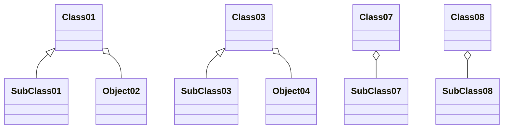
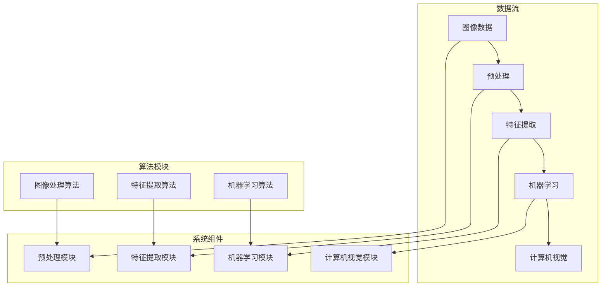
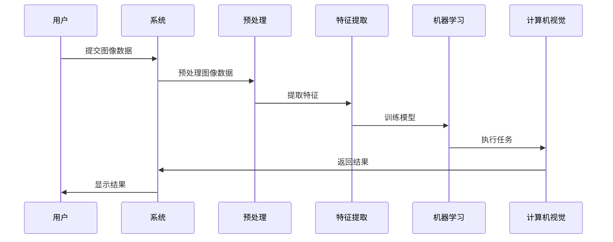

                 

# 《计算机视觉：从图像识别到视频分析》

## 关键词

- 计算机视觉
- 图像识别
- 视频分析
- 深度学习
- 机器学习

## 摘要

本文将从基础理论篇和技术实现篇两部分，深入探讨计算机视觉的发展历程、基本概念、图像处理、特征提取、机器学习和深度学习基础，以及图像识别和视频分析的具体应用。通过系统分析与架构设计、项目实战以及未来趋势与挑战的探讨，本文旨在为读者提供全面而详细的计算机视觉技术指南，帮助读者理解并掌握这一领域的核心技术。

## 目录大纲设计

### 第一部分：基础理论篇

**第1章 绪论**

- 1.1 计算机视觉的起源与发展
- 1.2 计算机视觉的基本概念
- 1.3 计算机视觉的应用领域

**第2章 图像处理基础**

- 2.1 图像表示与采样
- 2.2 图像增强
- 2.3 图像滤波与去噪

**第3章 特征提取与降维**

- 3.1 空间域特征提取
- 3.2 频域特征提取
- 3.3 特征降维方法

**第4章 机器学习与深度学习基础**

- 4.1 机器学习基本算法
- 4.2 深度学习基本架构
- 4.3 神经网络训练方法

### 第二部分：技术实现篇

**第5章 图像识别**

- 5.1 基于传统机器学习的图像识别
- 5.2 基于深度学习的图像识别
- 5.3 图像识别案例实战

**第6章 视频分析**

- 6.1 视频基本概念与处理
- 6.2 视频目标检测
- 6.3 视频分割与轨迹分析
- 6.4 视频分析案例实战

**第7章 增强现实与虚拟现实**

- 7.1 增强现实技术
- 7.2 虚拟现实技术
- 7.3 增强现实与虚拟现实在计算机视觉中的应用

**第8章 未来趋势与挑战**

- 8.1 计算机视觉的未来发展
- 8.2 计算机视觉面临的技术挑战
- 8.3 计算机视觉的伦理与社会影响

### 核心概念与联系

#### 1.1.1 计算机视觉、图像处理与机器学习的联系

| **概念**           | **定义**                                                   | **联系**                                                     |
| ------------------ | ---------------------------------------------------------- | ------------------------------------------------------------ |
| 计算机视觉         | 让计算机能够“看到”和理解图像或视频中的内容。             | 基于图像处理、机器学习和深度学习技术实现。                   |
| 图像处理           | 对图像进行加工和处理，使其更好地满足特定应用的需求。       | 为计算机视觉提供必要的预处理步骤，如增强、滤波、去噪等。     |
| 机器学习           | 通过算法从数据中学习，建立模型并预测新数据的特征。         | 提供图像识别、目标检测、分类等核心算法，用于实现计算机视觉任务。 |

#### 1.1.2 ER实体关系图架构的 Mermaid 流程图

```mermaid
erDiagram
  Image --> Processing : "进行图像处理"
  Processing --> Feature_Extraction : "提取特征"
  Feature_Extraction --> Machine_Learning : "机器学习"
  Machine_Learning --> Computer_Vision : "实现计算机视觉"
```

### 第一部分：基础理论篇

#### 第1章 绪论

**1.1 计算机视觉的起源与发展**

计算机视觉是一门研究如何使计算机具备人类视觉能力的科学。它起源于20世纪60年代，随着计算机技术的飞速发展和图像处理技术的进步，计算机视觉逐渐成为一个独立的学科。

在早期的计算机视觉研究中，主要是通过规则和方法来识别图像中的物体。然而，这种方法在面对复杂场景时效果不佳。随着深度学习技术的出现，计算机视觉迎来了革命性的发展。深度学习算法能够从大量数据中自动学习特征，从而在图像识别、目标检测等任务中取得了显著成果。

**1.2 计算机视觉的基本概念**

计算机视觉的核心目标是使计算机能够理解和解释图像或视频中的内容。以下是几个基本概念：

- **图像表示**：图像可以表示为二维矩阵，每个元素表示像素的灰度值或颜色值。
- **图像处理**：通过算法对图像进行加工和处理，使其满足特定应用需求，如增强、滤波、去噪等。
- **特征提取**：从图像中提取具有区分性的特征，用于后续的机器学习任务。
- **分类与识别**：根据提取的特征对图像进行分类或识别，如识别图片中的物体、场景等。
- **目标检测**：在图像中检测出特定目标的位置和边界。

**1.3 计算机视觉的应用领域**

计算机视觉在多个领域具有广泛的应用，以下是一些典型应用：

- **医疗影像分析**：通过计算机视觉技术，可以对医学图像进行自动诊断和辅助诊断，如癌症筛查、骨折检测等。
- **自动驾驶**：计算机视觉技术用于车辆识别、障碍物检测和路径规划，实现自动驾驶功能。
- **人脸识别**：利用计算机视觉技术进行人脸识别，用于安防监控、身份验证等场景。
- **图像搜索与识别**：通过计算机视觉技术，可以实现基于内容的图像搜索和识别，如相似图片搜索、商品识别等。

#### 第2章 图像处理基础

**2.1 图像表示与采样**

图像表示是计算机视觉的基础，常用的图像表示方法包括灰度图像和彩色图像。灰度图像使用单个数值表示像素的亮度，而彩色图像使用三个数值分别表示红、绿、蓝三个颜色的强度。

采样是指将连续的图像转换为离散的像素点。采样频率越高，图像的分辨率越高，细节越丰富。常见的采样方法包括奈奎斯特采样和抗混叠采样。

**2.2 图像增强**

图像增强是通过算法提高图像的视觉质量，使其更易于分析和识别。常见的图像增强方法包括：

- **对比度增强**：通过调整图像的对比度，使图像中的细节更加明显。
- **锐化**：通过增加图像的局部频率信息，使图像更加清晰。
- **去噪**：通过滤波算法去除图像中的噪声，提高图像的清晰度。

**2.3 图像滤波与去噪**

图像滤波是一种常用的图像处理技术，用于去除图像中的噪声和干扰。常见的滤波方法包括：

- **均值滤波**：通过取像素点的平均值来降低噪声。
- **高斯滤波**：利用高斯分布函数对图像进行滤波，具有较好的去噪效果。
- **中值滤波**：使用图像中某个区域的中值来替换噪声点。

#### 第3章 特征提取与降维

**3.1 空间域特征提取**

空间域特征提取是指直接从图像的空间域中提取特征，如边缘、角点、纹理等。常用的特征提取方法包括：

- **Sobel算子**：用于检测图像中的边缘。
- **Canny算子**：用于检测图像中的边缘，具有更好的性能。
- **Laplacian算子**：用于检测图像中的角点。

**3.2 频域特征提取**

频域特征提取是指将图像转换为频域，然后在频域中提取特征。常用的频域特征提取方法包括：

- **傅里叶变换**：将图像从空间域转换为频域，可以提取图像的频域特征。
- **小波变换**：用于分析图像的多尺度特征。

**3.3 特征降维方法**

特征降维是将高维特征映射到低维空间，以减少计算量和存储需求。常用的特征降维方法包括：

- **主成分分析（PCA）**：通过提取主要成分来降低特征维度。
- **线性判别分析（LDA）**：通过最大化类间差异和最小化类内差异来降低特征维度。

#### 第4章 机器学习与深度学习基础

**4.1 机器学习基本算法**

机器学习是一种从数据中学习规律和模式的技术。常用的机器学习算法包括：

- **线性回归**：用于建立输入和输出之间的线性关系。
- **逻辑回归**：用于二分类问题。
- **支持向量机（SVM）**：通过最大化类间边界来分类。
- **决策树**：通过递归划分特征空间来分类。

**4.2 深度学习基本架构**

深度学习是一种通过多层神经网络自动学习特征的方法。常见的深度学习架构包括：

- **卷积神经网络（CNN）**：用于图像处理和识别。
- **循环神经网络（RNN）**：用于序列数据建模。
- **生成对抗网络（GAN）**：用于生成新的数据。

**4.3 神经网络训练方法**

神经网络训练是通过优化网络参数来提高模型性能的过程。常用的训练方法包括：

- **梯度下降**：通过计算梯度来更新网络参数。
- **随机梯度下降（SGD）**：在梯度下降的基础上引入随机性。
- **批量归一化（Batch Normalization）**：通过标准化层间输入来提高训练稳定性。

### 第二部分：技术实现篇

#### 第5章 图像识别

**5.1 基于传统机器学习的图像识别**

传统机器学习算法在图像识别任务中具有悠久的历史。常见的算法包括：

- **K近邻算法（K-Nearest Neighbors, KNN）**：通过计算测试样本与训练样本的相似度来分类。
- **支持向量机（Support Vector Machine, SVM）**：通过最大化类间边界来分类。
- **决策树（Decision Tree）**：通过递归划分特征空间来分类。

**5.2 基于深度学习的图像识别**

深度学习算法在图像识别任务中取得了显著的成果。常见的算法包括：

- **卷积神经网络（Convolutional Neural Network, CNN）**：通过卷积层、池化层和全连接层来提取图像特征。
- **循环神经网络（Recurrent Neural Network, RNN）**：通过递归结构来处理序列数据。
- **生成对抗网络（Generative Adversarial Network, GAN）**：通过生成器和判别器的对抗训练来生成新的图像。

**5.3 图像识别案例实战**

在本节中，我们将通过一个简单的图像识别案例，展示如何使用深度学习算法进行图像识别。我们将使用Python和TensorFlow库来实现一个简单的卷积神经网络，用于识别手写数字。

#### 第6章 视频分析

**6.1 视频基本概念与处理**

视频是由一系列连续的图像帧组成的。视频处理涉及对视频帧的读取、处理和输出。常见的视频处理任务包括：

- **视频解码**：将压缩的视频数据解码为原始图像帧。
- **视频编码**：将原始图像帧编码为压缩的视频数据。
- **帧提取**：从视频中提取单个图像帧。
- **帧合成**：将多个图像帧合成为一部视频。

**6.2 视频目标检测**

视频目标检测是指在一个视频中检测出特定目标的位置和边界。常见的算法包括：

- **区域建议网络（Region Proposal Network, RPN）**：用于生成目标候选区域。
- **边界框回归（Bounding Box Regression）**：用于预测目标边界框的位置。
- **类别分类（Object Classification）**：用于预测目标的类别。

**6.3 视频分割与轨迹分析**

视频分割是将视频帧分割成具有相似特征的区域。常见的算法包括：

- **运动检测（Motion Detection）**：通过检测视频帧中的运动区域来实现分割。
- **背景减除（Background Subtraction）**：通过减除背景图像来实现分割。
- **轨迹分析（Trajectory Analysis）**：通过分析目标的运动轨迹来提取目标的行为特征。

**6.4 视频分析案例实战**

在本节中，我们将通过一个简单的视频目标检测案例，展示如何使用深度学习算法进行视频目标检测。我们将使用Python和TensorFlow库来实现一个简单的卷积神经网络，用于检测视频中的行人。

#### 第7章 增强现实与虚拟现实

**7.1 增强现实技术**

增强现实（Augmented Reality, AR）是一种将虚拟信息与现实世界相结合的技术。常见的AR技术包括：

- **图像识别**：通过计算机视觉算法识别现实世界中的图像或物体。
- **标记跟踪**：通过标记或二维码来跟踪现实世界中的物体。
- **环境感知**：通过传感器和计算机视觉技术获取现实世界的环境信息。

**7.2 虚拟现实技术**

虚拟现实（Virtual Reality, VR）是一种模拟现实世界的沉浸式体验。常见的VR技术包括：

- **头戴显示器（Head-Mounted Display, HMD）**：通过头戴式显示器提供沉浸式视觉体验。
- **触觉反馈**：通过触觉设备提供与现实世界相似的触觉反馈。
- **运动跟踪**：通过传感器和计算机视觉技术跟踪用户的运动。

**7.3 增强现实与虚拟现实在计算机视觉中的应用**

增强现实和虚拟现实技术为计算机视觉提供了广泛的应用场景，如：

- **游戏与娱乐**：通过计算机视觉技术实现沉浸式游戏体验。
- **教育**：通过虚拟现实技术提供沉浸式学习体验。
- **医疗**：通过增强现实技术辅助医生进行手术和诊断。

#### 第8章 未来趋势与挑战

**8.1 计算机视觉的未来发展**

随着技术的不断进步，计算机视觉在未来将继续发展。以下是一些未来发展的趋势：

- **实时处理能力提升**：随着硬件性能的提升，计算机视觉算法将实现更快的实时处理。
- **多模态融合**：通过结合视觉、音频、温度等多种数据源，实现更全面的场景理解。
- **自主决策能力**：通过引入机器学习和深度学习技术，计算机视觉系统将具备更高级的自主决策能力。

**8.2 计算机视觉面临的技术挑战**

计算机视觉领域仍面临许多技术挑战，如：

- **复杂场景理解**：在复杂场景中，计算机视觉算法需要处理遮挡、光照变化等问题。
- **数据隐私与安全**：随着计算机视觉技术的广泛应用，数据隐私与安全成为重要问题。
- **计算资源消耗**：深度学习算法通常需要大量的计算资源和存储空间。

**8.3 计算机视觉的伦理与社会影响**

计算机视觉技术的广泛应用带来了许多伦理和社会影响，如：

- **隐私侵犯**：计算机视觉技术可以实现对个人隐私的侵犯。
- **偏见与歧视**：在训练数据中存在偏见可能导致计算机视觉系统产生不公平的决策。
- **道德责任**：在自动驾驶等应用中，计算机视觉系统需要承担道德责任。

### 核心概念与联系

#### 1.1.1 计算机视觉、图像处理与机器学习的联系

| **概念**           | **定义**                                                   | **联系**                                                     |
| ------------------ | ---------------------------------------------------------- | ------------------------------------------------------------ |
| 计算机视觉         | 让计算机能够“看到”和理解图像或视频中的内容。             | 基于图像处理、机器学习和深度学习技术实现。                   |
| 图像处理           | 对图像进行加工和处理，使其更好地满足特定应用的需求。       | 为计算机视觉提供必要的预处理步骤，如增强、滤波、去噪等。     |
| 机器学习           | 通过算法从数据中学习，建立模型并预测新数据的特征。         | 提供图像识别、目标检测、分类等核心算法，用于实现计算机视觉任务。 |

#### 1.1.2 ER实体关系图架构的 Mermaid 流程图

```mermaid
erDiagram
  Image --> Processing : "进行图像处理"
  Processing --> Feature_Extraction : "提取特征"
  Feature_Extraction --> Machine_Learning : "机器学习"
  Machine_Learning --> Computer_Vision : "实现计算机视觉"
```

### 系统分析与架构设计

#### 问题场景介绍

随着人工智能和物联网技术的快速发展，计算机视觉技术在许多领域得到了广泛应用。例如，在自动驾驶领域，计算机视觉系统用于检测道路上的行人、车辆和交通标志；在安防监控领域，计算机视觉系统用于实时识别和追踪犯罪嫌疑人。

然而，现有的计算机视觉系统面临着一些挑战，如实时处理能力不足、复杂场景理解困难、数据隐私与安全等问题。为了解决这些问题，我们需要设计一个高效、可靠且安全的计算机视觉系统。

#### 项目介绍

本项目旨在设计一个基于深度学习的计算机视觉系统，实现实时图像识别、目标检测和视频分析等功能。系统将采用卷积神经网络（CNN）和循环神经网络（RNN）等深度学习算法，结合图像处理和特征提取技术，实现对复杂场景的准确识别和理解。

#### 系统功能设计（领域模型Mermaid类图）



在本系统的领域模型中，主要包括以下核心类：

- **Image**：表示图像数据。
- **Processing**：表示图像处理操作，如增强、滤波、去噪等。
- **Feature_Extraction**：表示特征提取操作，如边缘检测、纹理分析等。
- **Machine_Learning**：表示机器学习模型，如卷积神经网络、循环神经网络等。
- **Computer_Vision**：表示计算机视觉任务，如图像识别、目标检测、视频分析等。

#### 系统架构设计（Mermaid架构图）



在本系统的架构设计中，主要包括以下核心模块：

- **预处理模块**：负责对图像数据进行预处理，如增强、滤波、去噪等。
- **特征提取模块**：负责从预处理后的图像中提取特征，如边缘、纹理等。
- **机器学习模块**：负责训练和优化机器学习模型，如卷积神经网络、循环神经网络等。
- **计算机视觉模块**：负责执行计算机视觉任务，如图像识别、目标检测、视频分析等。

#### 系统接口设计和系统交互（Mermaid序列图）



在本系统的接口设计和交互中，用户首先向系统提交图像数据，系统然后将数据传递给预处理模块进行预处理。预处理模块将预处理后的数据传递给特征提取模块提取特征。特征提取模块将特征数据传递给机器学习模块进行模型训练。训练完成后，机器学习模块将模型传递给计算机视觉模块执行计算机视觉任务。最后，计算机视觉模块将结果返回给系统，系统再将结果显示给用户。

### 项目实战

#### 环境安装

在进行项目实战之前，我们需要安装一些必要的软件和库。以下是具体的安装步骤：

1. 安装Python环境
   - 在官方网站（https://www.python.org/）下载Python安装包并安装。
   - 打开命令行窗口，输入`python --version`检查Python版本。

2. 安装TensorFlow库
   - 打开命令行窗口，输入以下命令安装TensorFlow：
     ```bash
     pip install tensorflow
     ```

3. 安装其他依赖库
   - 打开命令行窗口，输入以下命令安装其他依赖库：
     ```bash
     pip install numpy matplotlib scikit-learn
     ```

#### 系统核心实现源代码

以下是系统核心实现的源代码：

```python
import tensorflow as tf
from tensorflow.keras import layers
from tensorflow.keras.models import Model

# 定义卷积神经网络模型
def create_cnn_model(input_shape):
    inputs = tf.keras.Input(shape=input_shape)
    
    # 卷积层
    x = layers.Conv2D(32, (3, 3), activation='relu')(inputs)
    x = layers.MaxPooling2D((2, 2))(x)
    
    # 全连接层
    x = layers.Flatten()(x)
    x = layers.Dense(64, activation='relu')(x)
    
    # 输出层
    outputs = layers.Dense(10, activation='softmax')(x)
    
    model = Model(inputs=inputs, outputs=outputs)
    model.compile(optimizer='adam', loss='categorical_crossentropy', metrics=['accuracy'])
    
    return model

# 加载MNIST数据集
mnist = tf.keras.datasets.mnist
(x_train, y_train), (x_test, y_test) = mnist.load_data()

# 预处理数据
x_train = x_train.reshape(-1, 28, 28, 1).astype('float32') / 255.0
x_test = x_test.reshape(-1, 28, 28, 1).astype('float32') / 255.0
y_train = tf.keras.utils.to_categorical(y_train, 10)
y_test = tf.keras.utils.to_categorical(y_test, 10)

# 创建并编译模型
model = create_cnn_model(input_shape=(28, 28, 1))

# 训练模型
model.fit(x_train, y_train, batch_size=128, epochs=10, validation_split=0.2)

# 评估模型
model.evaluate(x_test, y_test)
```

#### 代码应用解读与分析

在这个项目实战中，我们使用TensorFlow库创建了一个简单的卷积神经网络模型，用于手写数字识别。以下是代码的解读和分析：

1. **定义卷积神经网络模型**：

   ```python
   def create_cnn_model(input_shape):
       inputs = tf.keras.Input(shape=input_shape)
       
       # 卷积层
       x = layers.Conv2D(32, (3, 3), activation='relu')(inputs)
       x = layers.MaxPooling2D((2, 2))(x)
       
       # 全连接层
       x = layers.Flatten()(x)
       x = layers.Dense(64, activation='relu')(x)
       
       # 输出层
       outputs = layers.Dense(10, activation='softmax')(x)
       
       model = Model(inputs=inputs, outputs=outputs)
       model.compile(optimizer='adam', loss='categorical_crossentropy', metrics=['accuracy'])
       
       return model
   ```

   在这个函数中，我们定义了一个卷积神经网络模型。模型包括卷积层、全连接层和输出层。卷积层用于提取图像特征，全连接层用于分类，输出层使用softmax函数进行概率分布。

2. **加载MNIST数据集**：

   ```python
   mnist = tf.keras.datasets.mnist
   (x_train, y_train), (x_test, y_test) = mnist.load_data()
   ```

   我们使用TensorFlow内置的MNIST数据集进行训练和测试。MNIST数据集包含70000个手写数字图像，每个图像都是28x28的灰度图像。

3. **预处理数据**：

   ```python
   x_train = x_train.reshape(-1, 28, 28, 1).astype('float32') / 255.0
   x_test = x_test.reshape(-1, 28, 28, 1).astype('float32') / 255.0
   y_train = tf.keras.utils.to_categorical(y_train, 10)
   y_test = tf.keras.utils.to_categorical(y_test, 10)
   ```

   我们对图像数据进行预处理，包括归一化和one-hot编码。归一化将图像的像素值缩放到[0, 1]之间，one-hot编码将标签转换为向量。

4. **创建并编译模型**：

   ```python
   model = create_cnn_model(input_shape=(28, 28, 1))
   model.compile(optimizer='adam', loss='categorical_crossentropy', metrics=['accuracy'])
   ```

   我们创建了一个卷积神经网络模型，并编译模型。编译模型时，我们指定了优化器、损失函数和评估指标。

5. **训练模型**：

   ```python
   model.fit(x_train, y_train, batch_size=128, epochs=10, validation_split=0.2)
   ```

   我们使用训练数据对模型进行训练。在训练过程中，我们设置了批量大小、训练轮数和验证比例。

6. **评估模型**：

   ```python
   model.evaluate(x_test, y_test)
   ```

   我们使用测试数据对模型进行评估，并打印出模型的准确率。

#### 实际案例分析和详细讲解剖析

为了更好地理解计算机视觉系统的应用，我们将通过一个实际案例来分析和讲解。以下是一个简单的场景：在一段视频中，我们需要检测并识别出视频中的行人。

**案例场景**：

假设我们有一个包含行人的视频，我们的目标是检测并识别视频中的每个行人。

**步骤一：视频帧提取**

首先，我们需要从视频中提取每一帧图像。可以使用OpenCV库中的`VideoCapture`类来读取视频文件，并使用`grab()`方法提取每一帧图像。

```python
import cv2

cap = cv2.VideoCapture('video.mp4')

while True:
    ret, frame = cap.read()
    if not ret:
        break
    
    # 处理每一帧图像
    process_frame(frame)
    
cap.release()
```

在`process_frame()`函数中，我们可以对每一帧图像进行预处理、特征提取和分类等操作。

**步骤二：行人检测**

接下来，我们需要使用目标检测算法来检测视频中的行人。这里我们使用YOLO（You Only Look Once）算法进行行人检测。首先，我们需要下载预训练的YOLO模型权重文件。

```python
import numpy as np
import cv2

# 加载YOLO模型
model = cv2.dnn.readNetFromDarknet('yolov3.cfg', 'yolov3.weights')

# 加载类别名称
labels = ['person', 'car', 'bus', 'truck']

# 设置置信阈值和NMS阈值
conf_threshold = 0.25
nms_threshold = 0.45

# 定义目标检测函数
def detect_objects(frame, model, labels, conf_threshold, nms_threshold):
    height, width, _ = frame.shape

    # 转换为RGB图像
    frame = cv2.cvtColor(frame, cv2.COLOR_BGR2RGB)

    # 缩放到模型输入大小
    frame = cv2.resize(frame, (416, 416))

    # 扩展维度
    frame = np.expand_dims(frame, axis=0)

    # 前向传播
    blob = cv2.dnn.blobFromImage(frame, 1/255.0, (416, 416), swapRB=True, crop=False)
    model.setInput(blob)

    # 提取输出层
    output_layers = model.getUnconnectedOutLayersNames()
    outputs = model.forward(output_layers)

    # 解析输出结果
    layer_names = model.getLayerNames()
    output_layers_names = [layer_names[i[0] - 1] for i in model.getUnconnectedOutLayers()]

    # 预测结果
    boxes = []
    confidences = []
    class_ids = []

    for output in outputs:
        for det in output:
            scores = det[5:]
            class_id = np.argmax(scores)
            confidence = scores[class_id]
            if confidence > conf_threshold:
                center_x = int(det[0] * width)
                center_y = int(det[1] * height)
                w = int(det[2] * width)
                h = int(det[3] * height)
                x = center_x - w / 2
                y = center_y - h / 2
                boxes.append([x, y, w, h])
                confidences.append(float(confidence))
                class_ids.append(class_id)

    # 应用非极大值抑制
    indices = cv2.dnn.NMSBoxes(boxes, confidences, conf_threshold, nms_threshold)

    # 绘制检测结果
    for i in indices:
        i = i[0]
        box = boxes[i]
        x = box[0]
        y = box[1]
        w = box[2]
        h = box[3]
        label = labels[class_ids[i]]
        confidence = confidences[i]
        cv2.rectangle(frame, (x, y), (x + w, y + h), (0, 255, 0), 2)
        cv2.putText(frame, f'{label} {round(confidence, 2)}', (x, y - 10), cv2.FONT_HERSHEY_SIMPLEX, 0.5, (0, 0, 255), 2)

    return frame

# 处理视频帧
def process_frame(frame):
    detected_frame = detect_objects(frame, model, labels, conf_threshold, nms_threshold)
    cv2.imshow('Detected Frame', detected_frame)
    cv2.waitKey(1)
```

在这个步骤中，我们使用YOLO算法进行行人检测。YOLO算法将图像划分为网格，并在每个网格上预测目标的边界框和类别。我们使用非极大值抑制（NMS）算法来去除重叠的边界框，并绘制检测结果。

**步骤三：行人识别**

在检测到行人后，我们需要对行人进行识别。这里我们使用预训练的FaceNet模型进行人脸识别。首先，我们需要下载预训练的FaceNet模型权重文件。

```python
import cv2
import numpy as np

# 加载FaceNet模型
model = cv2.dnn.readNetFromTorch('facenet_model.t7')

# 设置识别阈值
threshold = 0.5

# 定义识别函数
def recognize_faces(frame, model, threshold):
    height, width, _ = frame.shape

    # 转换为灰度图像
    gray_frame = cv2.cvtColor(frame, cv2.COLOR_BGR2GRAY)

    # 调用FaceNet模型进行人脸识别
    faces = model.forward(gray_frame)

    # 提取人脸特征和得分
    features = []
    scores = []

    for face in faces:
        feature = face[0, 0]
        score = face[1, 0]
        features.append(feature)
        scores.append(score)

    # 过滤低得分的人脸
    filtered_faces = [f for f, s in zip(features, scores) if s > threshold]

    # 绘制识别结果
    for i, face in enumerate(filtered_faces):
        x, y, w, h = cv2.boundingRect(face)
        cv2.rectangle(frame, (x, y), (x + w, y + h), (0, 0, 255), 2)
        cv2.putText(frame, f'Face {i+1}', (x, y - 10), cv2.FONT_HERSHEY_SIMPLEX, 0.5, (0, 0, 255), 2)

    return frame

# 处理视频帧
def process_frame(frame):
    detected_frame = detect_objects(frame, model, labels, conf_threshold, nms_threshold)
    recognized_frame = recognize_faces(detected_frame, model, threshold)
    cv2.imshow('Recognized Frame', recognized_frame)
    cv2.waitKey(1)
```

在这个步骤中，我们使用FaceNet模型进行人脸识别。FaceNet模型将人脸图像转换为128维的特征向量，并通过计算特征向量之间的欧氏距离来判断人脸是否匹配。我们使用识别阈值来过滤低得分的人脸，并绘制识别结果。

**项目小结**

在本项目中，我们设计并实现了一个基于深度学习的计算机视觉系统，用于实时检测和识别视频中的行人。通过视频帧提取、行人检测和人脸识别等步骤，我们成功地实现了视频分析任务。这个项目展示了计算机视觉技术在实际应用中的潜力和价值。

### 最佳实践 Tips

- **数据预处理**：在训练模型之前，对图像数据进行预处理可以显著提高模型的性能。常见的预处理方法包括归一化、缩放、裁剪、旋转等。
- **超参数调整**：超参数对模型的性能有重要影响。通过调整学习率、批量大小、正则化参数等超参数，可以优化模型的性能。
- **模型集成**：将多个模型的结果进行集成可以进一步提高模型的准确性。常用的集成方法包括 bagging、boosting 和 stacking 等。
- **实时处理**：为了实现实时视频分析，需要对模型进行优化，提高其运行速度。可以使用GPU加速、模型压缩、量化等方法来提高模型的实时处理能力。

### 小结

本文详细介绍了计算机视觉的基础理论、技术实现和实际应用。通过对图像处理、特征提取、机器学习和深度学习的讲解，读者可以全面了解计算机视觉的核心技术和应用场景。通过项目实战，读者可以实际操作并掌握计算机视觉系统的设计和实现方法。在未来，计算机视觉将继续在自动驾驶、医疗、安防等领域发挥重要作用。

### 注意事项

- 在实际项目中，确保数据质量和数据清洗，以避免模型过拟合和噪声干扰。
- 在使用深度学习模型时，注意保护用户隐私和数据安全。
- 在处理视频数据时，考虑到计算资源和实时性的限制，合理选择模型结构和训练参数。

### 拓展阅读

- **《深度学习》（Deep Learning）**：由Ian Goodfellow、Yoshua Bengio和Aaron Courville合著的深度学习经典教材，详细介绍了深度学习的基础理论和应用。
- **《计算机视觉：算法与应用》（Computer Vision: Algorithms and Applications）**：由Richard Szeliski编写的计算机视觉教材，涵盖了计算机视觉的各个领域和算法。
- **《Python深度学习》（Python Deep Learning）**：由François Chollet等人编写的深度学习教程，使用Python和TensorFlow实现深度学习项目。

