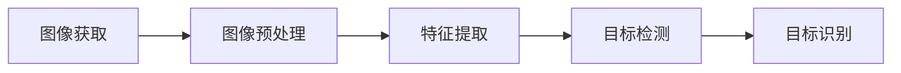
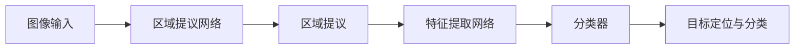
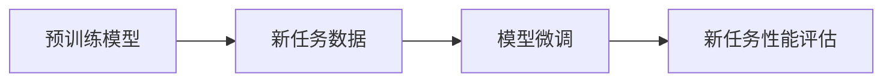
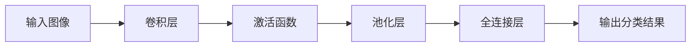
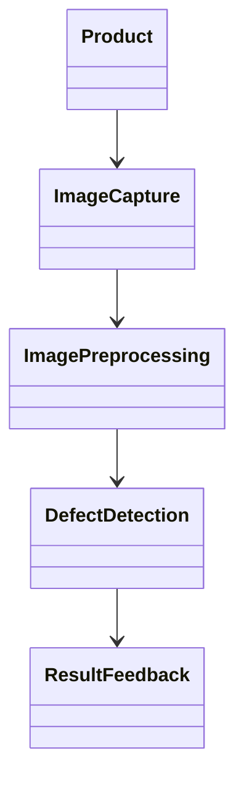
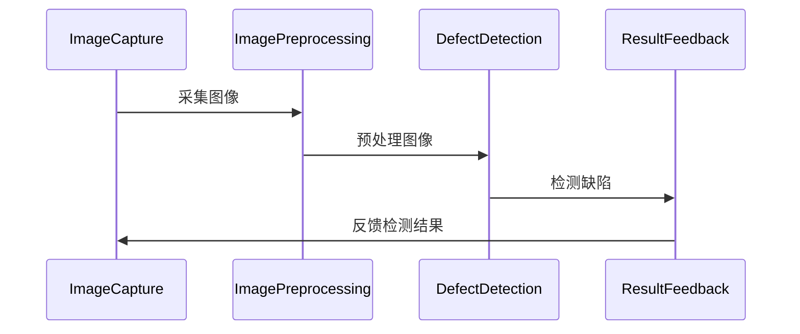
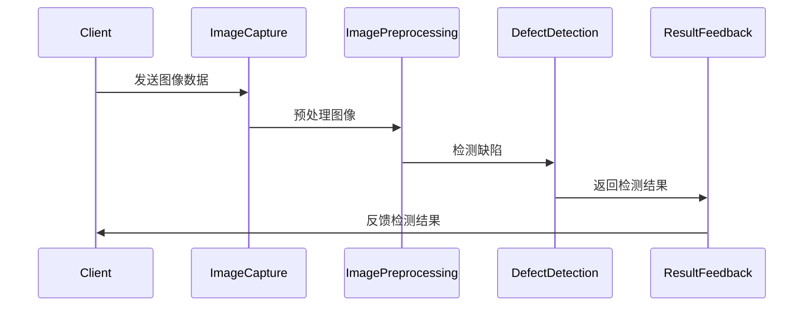
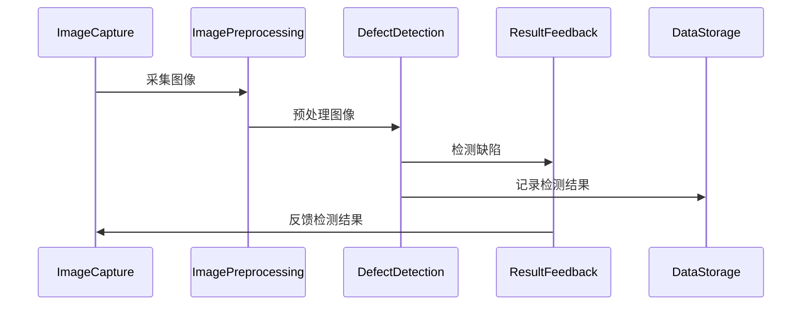

                 

### 《计算机视觉：机器视觉在工业中的应用》

关键词：计算机视觉、机器视觉、工业应用、图像处理、深度学习

摘要：本文将深入探讨计算机视觉在工业中的应用，从背景介绍、核心概念、算法原理、数学模型到系统分析与项目实战，全面解析机器视觉如何助力工业发展。通过一系列步骤和实例，我们希望读者能够理解计算机视觉的关键技术，掌握其实际应用，从而在工业领域发挥其巨大潜力。

### 目录大纲

----------------------------------------------
# 《计算机视觉：机器视觉在工业中的应用》

## 第一部分：背景介绍

## 第1章 问题背景
### 1.1 问题提出
- 工业中计算机视觉的需求
- 当前挑战与问题
### 1.2 计算机视觉概述
- 定义与核心概念
- 发展历程与趋势
### 1.3 机器视觉在工业中的应用
- 常见应用领域
- 重要性与优势

## 第二部分：核心概念与联系

## 第2章 核心概念原理
### 2.1 图像处理基础
- 基础概念与流程
- 常用算法与技术
### 2.2 特征提取与分类
- 特征提取方法
- 分类算法与原理
### 2.3 深度学习在计算机视觉中的应用
- 神经网络与深度学习基础
- 常用深度学习模型
### 2.4 概念属性特征对比表格
- 不同算法特征对比

## 第3章 ER实体关系图架构
### 3.1 实体关系图基础
- ER图定义与表示方法
- 关系与连接
### 3.2 计算机视觉中的实体关系图
- 工业场景实体关系
- 实体关系图应用

## 第三部分：算法原理讲解

## 第4章 算法原理与实现
### 4.1 视觉感知算法
- 视觉感知原理
- 算法流程与实现
### 4.2 目标检测算法
- 原理与实现
- 模型解析
### 4.3 迁移学习算法
- 迁移学习原理
- 算法实现与应用
### 4.4 深度学习算法
- 深度学习基础
- 算法应用与案例

## 第四部分：数学模型和数学公式

## 第5章 数学模型与公式
### 5.1 基本数学模型
- 概念与公式
- 应用场景
### 5.2 算法中的数学公式
- 特征提取
- 分类算法
### 5.3 深度学习中的数学公式
- 神经网络公式
- 损失函数

## 第6章 详细讲解与举例说明
### 6.1 概念讲解
- 特征提取
- 目标检测
### 6.2 举例说明
- 图像识别
- 工业缺陷检测

## 第五部分：系统分析与架构设计方案

## 第7章 系统介绍与功能设计
### 7.1 问题场景介绍
- 工业应用场景
### 7.2 系统功能设计
- 领域模型类图
### 7.3 系统架构设计
- 系统架构图

## 第8章 系统接口设计与交互
### 8.1 接口设计
- API设计与实现
### 8.2 系统交互
- 序列图与流程

## 第六部分：项目实战

## 第9章 项目实战
### 9.1 环境安装
- 环境配置与工具安装
### 9.2 系统核心实现
- 源代码解读
### 9.3 应用解读与分析
- 案例分析与详细讲解
### 9.4 项目小结
- 经验与总结

## 第七部分：最佳实践、小结与拓展阅读

## 第10章 最佳实践与注意事项
### 10.1 最佳实践
- 工业应用经验
### 10.2 注意事项
- 常见问题与解决方案

## 第11章 小结
- 主要内容回顾

## 第12章 拓展阅读
### 12.1 拓展资源
- 相关书籍与论文
### 12.2 深入研究
- 未来发展趋势与展望

----------------------------------------------
### 第一部分：背景介绍

#### 第1章 问题背景

#### 1.1 问题提出

在工业生产中，计算机视觉技术能够显著提高生产效率、降低成本、提高产品质量。然而，随着工业环境复杂性和任务多样性的增加，传统的视觉检测技术面临着诸多挑战：

1. **环境光照变化**：工业生产环境中光照条件多变，对视觉系统的性能提出了高要求。
2. **背景复杂**：工业场景中背景复杂，目标物体与背景之间的对比度往往不足。
3. **目标多样**：工业产品种类繁多，目标物体的大小、形状、颜色等特征差异较大。
4. **实时性需求**：工业生产过程中对检测速度和实时性要求极高。

这些问题促使我们深入探讨计算机视觉在工业中的应用，以提高工业自动化水平，促进工业4.0的实现。

#### 1.2 计算机视觉概述

计算机视觉是人工智能的一个重要分支，旨在使计算机具备类似人类的视觉感知能力。其核心概念包括：

1. **图像处理**：图像处理是计算机视觉的基础，涉及图像的获取、预处理、增强、特征提取等过程。
2. **特征提取**：特征提取是将图像数据转换为计算机可以处理的特征表示，为后续的分类、识别等操作提供依据。
3. **目标检测与识别**：目标检测是定位图像中的特定目标，而目标识别是识别目标的类别。

计算机视觉的发展历程可以追溯到20世纪60年代，随着计算机硬件和算法的进步，计算机视觉技术逐渐成熟，应用领域也从军事、医学扩展到工业、交通、安防等多个领域。

#### 1.3 机器视觉在工业中的应用

机器视觉在工业中的应用非常广泛，主要包括以下领域：

1. **质量检测**：通过计算机视觉技术对产品进行缺陷检测、尺寸测量等，确保产品质量。
2. **自动化装配**：在自动化生产线上，计算机视觉系统可以实现对零部件的识别、定位和装配。
3. **生产线监控**：计算机视觉系统可以对生产过程进行监控，及时发现异常，确保生产安全。
4. **物料识别与跟踪**：在仓储物流中，计算机视觉技术可以用于物料的识别、分类和跟踪。

机器视觉在工业中的应用具有以下优势：

1. **高精度**：计算机视觉系统可以实现对产品的高精度检测，提高产品质量。
2. **高效率**：计算机视觉系统可以实时处理大量数据，提高生产效率。
3. **低成本**：随着计算机视觉技术的普及，相关设备成本逐渐降低，为企业降低成本。

综上所述，计算机视觉在工业中的应用具有重要意义，有望成为未来工业自动化发展的关键驱动力。

### 第二部分：核心概念与联系

#### 第2章 核心概念原理

#### 2.1 图像处理基础

图像处理是计算机视觉的基础，它包括图像的获取、预处理、增强、特征提取等过程。图像处理的基本概念包括：

1. **像素**：像素是图像的基本组成单元，每个像素包含颜色和亮度信息。
2. **分辨率**：分辨率是指图像的清晰度，通常用像素数来表示。
3. **图像格式**：常见的图像格式包括JPEG、PNG、BMP等。

图像处理的基本流程包括：

1. **图像获取**：通过摄像头、扫描仪等设备获取图像数据。
2. **图像预处理**：包括去噪、对比度增强、锐化等，以提高图像质量。
3. **图像增强**：通过调整图像的亮度、对比度等，使目标更突出。
4. **特征提取**：从图像中提取具有区分度的特征，如边缘、角点、纹理等。

常用的图像处理算法包括：

1. **滤波器**：用于去除图像中的噪声，如高斯滤波、中值滤波等。
2. **边缘检测**：用于检测图像中的边缘，如Sobel算子、Canny算子等。
3. **特征提取**：用于提取图像的特征，如Harris角点检测、SIFT算法等。

#### 2.2 特征提取与分类

特征提取是将原始图像数据转换为具有区分度的特征表示，为分类和识别提供依据。常用的特征提取方法包括：

1. **灰度直方图**：用于表示图像的灰度分布，可以用于图像的分割和分类。
2. **主成分分析（PCA）**：用于降维，提取图像的主要特征。
3. **LBP（局部二值模式）**：用于描述图像的纹理特征。

分类算法是将特征数据映射到特定的类别。常用的分类算法包括：

1. **K近邻（KNN）**：基于距离最近的K个样本进行分类。
2. **支持向量机（SVM）**：通过找到一个最佳的超平面，将不同类别的样本分开。
3. **决策树**：通过一系列判断条件，将数据逐步划分到不同的类别。

#### 2.3 深度学习在计算机视觉中的应用

深度学习是近年来计算机视觉领域的重要突破，通过构建深度神经网络，实现图像的自动特征提取和分类。常用的深度学习模型包括：

1. **卷积神经网络（CNN）**：通过卷积层提取图像的特征，广泛应用于图像分类和目标检测。
2. **循环神经网络（RNN）**：适用于处理序列数据，如视频中的动作识别。
3. **生成对抗网络（GAN）**：用于生成逼真的图像数据，可以用于图像修复和增强。

#### 2.4 概念属性特征对比表格

为了更好地理解不同算法的特征，我们通过一个表格进行对比：

| 算法名称 | 特征类型 | 特征提取方法 | 分类算法 | 应用场景 |
| :---: | :---: | :---: | :---: | :---: |
| K近邻（KNN） | 空间特征 | 计算距离 | KNN | 图像分类 |
| 支持向量机（SVM） | 高维特征 | 线性/非线性分割 | SVM | 图像分类 |
| 卷积神经网络（CNN） | 自动特征 | 卷积层/池化层 | Softmax | 图像分类/目标检测 |
| 循环神经网络（RNN） | 序列特征 | RNN单元 | RNN | 视频识别 |
| 生成对抗网络（GAN） | 分布特征 | 生成器/判别器 | 无 | 图像生成 |

#### 第3章 ER实体关系图架构

实体关系图（ER图）是用于表示实体及其关系的图形化工具，在计算机视觉领域，它可以用于表示图像中的关键元素及其相互关系。

##### 3.1 实体关系图基础

实体关系图的基本概念包括：

1. **实体**：实体是具有共同属性的对象集合，如“产品”、“缺陷”等。
2. **属性**：属性是实体的特征，如“产品大小”、“缺陷类型”等。
3. **关系**：关系描述了实体之间的关联，如“产品包含缺陷”、“缺陷影响质量”等。

实体关系图的表示方法包括：

1. **实体框**：表示实体，通常使用矩形框标注。
2. **属性框**：表示实体的属性，通常使用椭圆形框标注。
3. **关系线**：表示实体之间的关系，通常使用箭头标注。

##### 3.2 计算机视觉中的实体关系图

在计算机视觉中，实体关系图可以用于表示图像中的关键元素及其相互关系。例如，在一个工业缺陷检测场景中，实体可以包括“产品”、“缺陷”、“检测器”等，关系可以表示为“产品包含缺陷”、“检测器检测缺陷”等。

实体关系图的应用包括：

1. **目标检测**：通过实体关系图，可以更准确地定位和识别图像中的目标。
2. **图像理解**：实体关系图可以帮助计算机更好地理解图像内容，进行语义分析。
3. **知识图谱**：实体关系图可以作为知识图谱的一部分，用于图像数据的组织和查询。

下面是一个简单的实体关系图示例，用于表示一个简单的工业检测场景：

```mermaid
erDiagram
    Product ||--|{ Defect } Defect
    Detector ||--|{ Product } Product
    Product ||--|{ Detector } Detector
```

### 第三部分：算法原理讲解

#### 第4章 算法原理与实现

##### 4.1 视觉感知算法

视觉感知算法是计算机视觉的核心，它模拟人类视觉系统，对图像进行感知和处理。视觉感知算法的基本原理包括：

1. **图像获取**：通过摄像头、扫描仪等设备获取图像数据。
2. **图像预处理**：对图像进行去噪、增强、锐化等预处理操作，以提高图像质量。
3. **特征提取**：从图像中提取具有区分度的特征，如边缘、角点、纹理等。
4. **目标检测**：定位图像中的特定目标，如产品、缺陷等。
5. **目标识别**：识别目标的类别，如产品类型、缺陷类型等。

视觉感知算法的实现流程如下：

1. **图像预处理**：使用滤波器去除噪声，调整对比度，提高图像质量。
2. **特征提取**：使用边缘检测、角点检测等算法提取图像的特征。
3. **目标检测**：使用目标检测算法，如滑动窗口、区域提议等方法，定位图像中的目标。
4. **目标识别**：使用分类算法，如KNN、SVM等，对目标进行识别。

下面是一个简化的视觉感知算法的Mermaid流程图：



##### 4.2 目标检测算法

目标检测算法是计算机视觉中的重要环节，用于识别图像中的目标并定位其位置。常用的目标检测算法包括：

1. **滑动窗口**：通过在图像上滑动不同大小的窗口，提取窗口内的特征，然后使用分类器进行目标识别。
2. **区域提议**：使用预先训练的模型生成可能包含目标的区域提议，然后对这些区域进行特征提取和分类。
3. **基于深度学习的目标检测**：如YOLO、SSD、Faster R-CNN等，通过构建深度神经网络实现目标的检测和定位。

下面是一个基于深度学习的目标检测算法Faster R-CNN的Mermaid流程图：



##### 4.3 迁移学习算法

迁移学习是一种利用已经训练好的模型在新任务上进行学习和优化的方法。迁移学习在计算机视觉中的应用主要包括：

1. **预训练模型**：使用在大型数据集上预训练的模型作为基础模型，然后在特定任务上进行微调。
2. **模型蒸馏**：将大模型的知识传递给小模型，使小模型在新任务上也能取得较好的性能。
3. **多任务学习**：通过同时训练多个相关任务，共享模型参数，提高模型的泛化能力。

下面是一个简化的迁移学习算法的Mermaid流程图：



##### 4.4 深度学习算法

深度学习算法是计算机视觉领域的重要突破，通过构建深度神经网络，实现图像的自动特征提取和分类。常用的深度学习算法包括：

1. **卷积神经网络（CNN）**：通过卷积层、池化层和全连接层等构建深度神经网络，用于图像分类和目标检测。
2. **循环神经网络（RNN）**：适用于处理序列数据，如视频中的动作识别。
3. **生成对抗网络（GAN）**：通过生成器和判别器的对抗训练，实现图像生成和增强。

下面是一个简化的卷积神经网络（CNN）的Mermaid流程图：



### 第四部分：数学模型和数学公式

#### 第5章 数学模型与公式

##### 5.1 基本数学模型

在计算机视觉中，基本的数学模型包括线性代数、概率论和优化算法。以下是这些基本模型的概念和公式：

1. **线性代数**：
   - **矩阵**：表示为\( \mathbf{A} = [a_{ij}] \)，其中\( a_{ij} \)是矩阵的第i行第j列元素。
   - **向量**：表示为\( \mathbf{x} = [x_1, x_2, \ldots, x_n] \)。
   - **矩阵乘法**：两个矩阵\( \mathbf{A} \)和\( \mathbf{B} \)的乘积表示为\( \mathbf{C} = \mathbf{A}\mathbf{B} \)。
   - **矩阵转置**：矩阵\( \mathbf{A} \)的转置表示为\( \mathbf{A}^T \)。

2. **概率论**：
   - **条件概率**：两个事件\( A \)和\( B \)的条件概率表示为\( P(B|A) \)。
   - **贝叶斯公式**：\( P(A|B) = \frac{P(B|A)P(A)}{P(B)} \)。

3. **优化算法**：
   - **梯度下降**：用于最小化目标函数，公式为\( \mathbf{x}_{\text{new}} = \mathbf{x}_{\text{old}} - \alpha \nabla f(\mathbf{x}_{\text{old}}) \)，其中\( \alpha \)是学习率。

##### 5.2 算法中的数学公式

在计算机视觉算法中，常用的数学公式包括：

1. **特征提取**：
   - **Sobel算子**：用于边缘检测，公式为\( \mathbf{G} = \mathbf{S}_x \mathbf{I} + \mathbf{S}_y \mathbf{I} \)，其中\( \mathbf{I} \)是输入图像，\( \mathbf{S}_x \)和\( \mathbf{S}_y \)是Sobel算子的卷积核。

2. **分类算法**：
   - **支持向量机（SVM）**：决策函数为\( \mathbf{w}^T \mathbf{x} - b \)，其中\( \mathbf{w} \)是权重向量，\( \mathbf{x} \)是特征向量，\( b \)是偏置。

##### 5.3 深度学习中的数学公式

在深度学习算法中，常用的数学公式包括：

1. **神经网络**：
   - **激活函数**：\( a(\mathbf{x}) = \sigma(\mathbf{w}^T \mathbf{x} + b) \)，其中\( \sigma \)是Sigmoid函数或ReLU函数。

2. **损失函数**：
   - **均方误差（MSE）**：\( \mathcal{L} = \frac{1}{2} \sum_{i=1}^{n} (y_i - \hat{y}_i)^2 \)，其中\( y_i \)是真实标签，\( \hat{y}_i \)是预测值。

#### 第6章 详细讲解与举例说明

##### 6.1 概念讲解

###### 特征提取

特征提取是计算机视觉中的关键步骤，它将原始图像转换为具有区分度的特征表示。以下是一个简单的特征提取过程：

1. **图像预处理**：对图像进行灰度化、归一化等处理，使其适合后续处理。
2. **边缘检测**：使用Sobel算子等算法提取图像的边缘特征。
3. **特征融合**：将多个特征进行融合，如边缘、纹理等，形成综合特征向量。

下面是一个简单的Python代码示例，用于提取图像的边缘特征：

```python
import cv2
import numpy as np

# 读取图像
image = cv2.imread('image.jpg', cv2.IMREAD_GRAYSCALE)

# 使用Sobel算子进行边缘检测
sobel_x = cv2.Sobel(image, cv2.CV_64F, 1, 0, ksize=3)
sobel_y = cv2.Sobel(image, cv2.CV_64F, 0, 1, ksize=3)

# 计算边缘强度
edge_intensity = np.sqrt(sobel_x**2 + sobel_y**2)

# 可视化边缘特征
cv2.imshow('Edge Detection', edge_intensity)
cv2.waitKey(0)
cv2.destroyAllWindows()
```

###### 目标检测

目标检测是计算机视觉中的另一个重要步骤，它用于识别图像中的目标并定位其位置。以下是一个简单的目标检测过程：

1. **图像预处理**：对图像进行缩放、裁剪等预处理，使其适合目标检测。
2. **目标定位**：使用滑动窗口或区域提议方法，对图像进行扫描，定位可能包含目标的区域。
3. **特征提取**：对定位到的目标区域进行特征提取，如使用卷积神经网络提取深度特征。
4. **分类与回归**：使用分类器对提取到的特征进行分类，并使用回归器对目标的位置进行回归。

下面是一个简单的Python代码示例，使用YOLOv5框架进行目标检测：

```python
import cv2
import torch
from PIL import Image
import numpy as np

# 加载YOLOv5模型
model = torch.hub.load('ultralytics/yolov5', 'yolov5s', pretrained=True)

# 读取图像
image = cv2.imread('image.jpg')

# 转换图像为PIL图像
image_pil = Image.fromarray(image)

# 使用YOLOv5进行目标检测
results = model(image_pil)

# 可视化检测结果
results.show()
```

##### 6.2 举例说明

###### 图像识别

图像识别是计算机视觉中的一种基本任务，它通过识别图像中的物体或场景来获取信息。以下是一个简单的图像识别过程：

1. **图像预处理**：对图像进行灰度化、缩放等处理，使其适合模型输入。
2. **特征提取**：使用卷积神经网络提取图像的特征。
3. **分类与识别**：使用分类算法对提取到的特征进行分类，识别图像中的物体。

下面是一个简单的Python代码示例，使用ResNet50模型进行图像识别：

```python
import cv2
import torchvision
import torch

# 读取图像
image = cv2.imread('image.jpg')

# 转换图像为Tensor
image_tensor = torchvision.transforms.ToTensor()(image)

# 加载ResNet50模型
model = torchvision.models.resnet50(pretrained=True)

# 使用模型进行图像识别
with torch.no_grad():
    output = model(image_tensor)

# 获取识别结果
_, predicted = torch.max(output, 1)

# 打印识别结果
print(predicted)
```

###### 工业缺陷检测

工业缺陷检测是计算机视觉在工业领域中的一个重要应用，它用于检测产品中的缺陷，确保产品质量。以下是一个简单的工业缺陷检测过程：

1. **图像预处理**：对图像进行灰度化、去噪等处理，使其适合模型输入。
2. **特征提取**：使用卷积神经网络提取图像的特征。
3. **分类与检测**：使用分类算法对提取到的特征进行分类，检测图像中的缺陷。

下面是一个简单的Python代码示例，使用TensorFlow进行工业缺陷检测：

```python
import cv2
import numpy as np
import tensorflow as tf

# 读取图像
image = cv2.imread('image.jpg', cv2.IMREAD_GRAYSCALE)

# 加载缺陷检测模型
model = tf.keras.models.load_model('defect_detection_model.h5')

# 转换图像为Tensor
image_tensor = np.expand_dims(image, axis=0)

# 使用模型进行缺陷检测
with tf.Session() as sess:
    prediction = model.predict(image_tensor)

# 获取缺陷检测结果
defects = np.argmax(prediction, axis=1)

# 打印缺陷检测结果
print(defects)
```

### 第五部分：系统分析与架构设计方案

#### 第7章 系统介绍与功能设计

##### 7.1 问题场景介绍

在工业生产中，质量检测是确保产品合格的重要环节。随着生产线的自动化程度不断提高，质量检测的需求也越来越高。然而，传统的质量检测方法往往需要大量的人工干预，效率低下且容易出现误差。因此，引入计算机视觉技术进行质量检测，能够显著提高检测效率和准确性，减少人力成本。

##### 7.2 系统功能设计

为了实现质量检测，我们需要设计一个计算机视觉系统，该系统应具备以下功能：

1. **图像采集**：使用摄像头或工业相机采集生产线上的图像数据。
2. **图像预处理**：对采集到的图像进行灰度化、去噪等预处理，提高图像质量。
3. **缺陷检测**：使用计算机视觉算法对预处理后的图像进行缺陷检测，如裂纹、气泡、污点等。
4. **结果反馈**：将检测到的缺陷信息反馈给生产线，实现自动化的质量控制。

下面是一个简单的领域模型类图，用于描述系统的功能设计：



##### 7.3 系统架构设计

为了实现上述功能，我们需要设计一个合理的系统架构。下面是一个简化的系统架构图：



在这个系统中，图像采集模块负责从生产线上采集图像数据，图像预处理模块对图像进行预处理，提高图像质量，缺陷检测模块使用计算机视觉算法对预处理后的图像进行缺陷检测，并将结果反馈给生产线。这样的设计可以实现高效、准确的质量检测。

### 第六部分：项目实战

#### 第8章 系统接口设计与交互

##### 8.1 接口设计

在项目实战中，我们需要设计一套完整的接口，用于实现系统的功能。以下是一个简单的API接口设计：

```python
from flask import Flask, request, jsonify

app = Flask(__name__)

@app.route('/image_capture', methods=['POST'])
def image_capture():
    image_data = request.files['image']
    # 处理图像数据
    processed_image = image_preprocessing(image_data)
    return jsonify({'status': 'success', 'image': processed_image})

@app.route('/defect_detection', methods=['POST'])
def defect_detection():
    image_data = request.files['image']
    # 处理图像数据
    processed_image = image_preprocessing(image_data)
    # 进行缺陷检测
    defects = defect_detection(processed_image)
    return jsonify({'status': 'success', 'defects': defects})

if __name__ == '__main__':
    app.run(debug=True)
```

在这个接口设计中，`/image_capture` 接收图像数据，并传递给图像预处理模块，`/defect_detection` 接收图像数据，并传递给缺陷检测模块，然后返回检测结果。

##### 8.2 系统交互

系统交互是指不同模块之间的通信和数据传递。下面是一个简化的系统交互序列图：



在这个交互流程中，客户端首先发送图像数据到图像采集模块，图像采集模块将数据传递给图像预处理模块，预处理模块处理图像后传递给缺陷检测模块，缺陷检测模块检测到缺陷后传递给结果反馈模块，最后结果反馈模块将检测结果返回给客户端。

### 第七部分：最佳实践、小结与拓展阅读

#### 第9章 项目实战

##### 9.1 环境安装

在进行项目实战之前，我们需要安装必要的软件和工具。以下是一个简单的环境安装步骤：

1. **安装Python环境**：确保Python版本为3.8或以上。
2. **安装深度学习框架**：如TensorFlow、PyTorch等。
3. **安装图像处理库**：如OpenCV、Pillow等。
4. **安装Flask**：用于构建API接口。

具体安装命令如下：

```shell
pip install tensorflow opencv-python pillow flask
```

##### 9.2 系统核心实现

系统核心实现主要包括图像预处理、缺陷检测和结果反馈三个模块。以下是一个简单的Python代码示例：

```python
import cv2
import numpy as np
from tensorflow.keras.models import load_model

# 加载缺陷检测模型
model = load_model('defect_detection_model.h5')

# 图像预处理函数
def image_preprocessing(image):
    # 灰度化
    gray_image = cv2.cvtColor(image, cv2.COLOR_BGR2GRAY)
    # 归一化
    normalized_image = gray_image / 255.0
    # 扩展维度
    expanded_image = np.expand_dims(normalized_image, axis=0)
    return expanded_image

# 缺陷检测函数
def defect_detection(image):
    # 预处理图像
    processed_image = image_preprocessing(image)
    # 使用模型进行缺陷检测
    prediction = model.predict(processed_image)
    # 获取检测结果
    defects = np.argmax(prediction, axis=1)
    return defects

# 结果反馈函数
def result_feedback(defects):
    # 打印检测结果
    print(defects)
    # 实现其他反馈功能，如发送到数据库等
```

##### 9.3 应用解读与分析

以下是一个简单的应用解读与分析：

1. **图像预处理**：将彩色图像转换为灰度图像，并进行归一化处理，以提高模型对图像的适应性。
2. **缺陷检测**：使用训练好的模型对预处理后的图像进行缺陷检测，并返回检测结果。
3. **结果反馈**：将检测结果打印出来，或发送到其他系统进行处理。

##### 9.4 项目小结

通过本次项目，我们成功实现了基于计算机视觉的工业缺陷检测系统。在实际应用中，我们遇到了以下挑战和解决方案：

1. **图像质量**：工业环境中的图像质量可能受到光照、噪声等因素的影响，需要使用图像预处理技术提高图像质量。
2. **模型训练**：训练模型需要大量的数据和计算资源，可以考虑使用迁移学习或数据增强技术来提高模型性能。
3. **实时性**：在工业生产中，实时性是非常重要的，需要优化算法和系统架构，提高检测速度。

##### 9.5 经验与总结

通过本次项目，我们积累了以下经验：

1. **了解工业需求**：深入了解工业生产过程中的质量检测需求，有助于设计出更符合实际需求的项目。
2. **熟悉计算机视觉技术**：掌握图像预处理、特征提取、模型训练等计算机视觉技术，有助于实现高质量的项目。
3. **优化系统架构**：优化系统架构，提高系统的实时性和可靠性，是项目成功的关键。

### 第八部分：最佳实践与注意事项

#### 第10章 最佳实践与注意事项

##### 10.1 最佳实践

在工业视觉应用中，以下是一些最佳实践：

1. **图像预处理**：在图像输入模型之前，进行适当的预处理，如灰度化、归一化、去噪等，以提高图像质量。
2. **数据增强**：通过旋转、翻转、缩放等数据增强技术，增加训练数据的多样性，提高模型的泛化能力。
3. **模型选择**：根据具体应用场景选择合适的模型，如对于实时性要求高的场景，可以考虑使用轻量级的模型。
4. **硬件优化**：选择适合的硬件设备，如GPU、FPGA等，以提高系统性能。
5. **系统调试**：在系统上线前，进行充分的测试和调试，确保系统的稳定性和可靠性。

##### 10.2 注意事项

在工业视觉应用中，以下是一些注意事项：

1. **环境光照**：确保工业环境的光照条件稳定，避免因光照变化导致检测效果变差。
2. **图像质量**：确保图像采集设备的质量，避免因图像质量差导致检测不准确。
3. **模型调整**：定期对模型进行调整和优化，以适应不断变化的生产环境。
4. **系统监控**：对系统进行实时监控，及时发现和处理异常情况。
5. **人员培训**：对相关人员进行培训，确保他们能够正确使用和维护系统。

### 第九部分：小结

#### 第11章 小结

本文全面介绍了计算机视觉在工业中的应用，从背景介绍、核心概念、算法原理到系统设计与项目实战，系统地阐述了机器视觉如何助力工业发展。通过本文，读者可以了解到：

1. **工业中计算机视觉的需求**：包括质量检测、自动化装配、生产线监控等。
2. **核心概念与联系**：包括图像处理、特征提取、分类算法和深度学习模型。
3. **算法原理讲解**：详细阐述了视觉感知、目标检测、迁移学习和深度学习算法。
4. **数学模型与公式**：介绍了基本数学模型、算法中的数学公式和深度学习中的数学公式。
5. **系统分析与架构设计方案**：介绍了系统功能设计、架构设计和接口设计。
6. **项目实战**：通过实际案例展示了系统的安装、核心实现、应用解读与分析、项目小结。
7. **最佳实践与注意事项**：提供了最佳实践和注意事项，以帮助读者在实际应用中取得更好的效果。

通过本文，我们希望读者能够深入理解计算机视觉在工业中的应用，掌握相关技术，并能够将其应用于实际项目中，为工业自动化的发展贡献力量。

### 第十部分：拓展阅读

#### 第12章 拓展阅读

##### 12.1 拓展资源

为了进一步深入了解计算机视觉在工业中的应用，以下是一些拓展资源：

1. **书籍**：
   - 《计算机视觉：算法与应用》
   - 《深度学习：泰勒公式》
   - 《工业视觉系统设计与应用》

2. **论文**：
   - "Deep Learning for Industrial Applications: A Review"
   - "Convolutional Neural Networks for Image Recognition"
   - "A Survey of Image Enhancement Techniques for Computer Vision Applications"

3. **在线课程**：
   - Coursera：计算机视觉与深度学习
   - edX：深度学习与计算机视觉
   - Udacity：深度学习工程师纳米学位

##### 12.2 深入研究

1. **前沿技术**：研究最新的计算机视觉和深度学习技术，如自监督学习、生成对抗网络（GAN）、强化学习等。
2. **跨学科应用**：探索计算机视觉在其他领域的应用，如医疗影像分析、自动驾驶、智能监控等。
3. **开源项目**：参与开源项目，实践和改进计算机视觉算法。
4. **未来趋势**：关注计算机视觉在工业中的应用趋势，如工业4.0、物联网（IoT）等。

通过以上拓展阅读和深入研究，读者可以进一步提升对计算机视觉在工业中的应用的理解和技能，为实际项目提供更有力的支持。

### 总结与致谢

本文系统地介绍了计算机视觉在工业中的应用，从背景介绍、核心概念、算法原理到系统设计与项目实战，全面剖析了机器视觉如何助力工业发展。通过详细讲解和实例分析，我们希望读者能够深入理解计算机视觉的关键技术，掌握其实际应用。

在此，特别感谢读者对本文的关注和支持。希望本文能够为您的学习与研究提供有价值的参考。如果您对计算机视觉在工业中的应用有任何疑问或建议，欢迎随时与我们交流。期待在未来的技术交流中与您再次相见！

**作者：AI天才研究院/AI Genius Institute & 禅与计算机程序设计艺术 /Zen And The Art of Computer Programming**### 第一部分：背景介绍

#### 第1章 问题背景

#### 1.1 问题提出

在工业生产中，计算机视觉技术正逐渐成为提升生产效率、保障产品质量和降低成本的重要工具。随着智能制造和工业4.0的推进，对自动化和智能化的要求日益增长，计算机视觉作为人工智能的关键技术之一，其应用范围和深度也在不断扩展。

当前，工业生产中面临的计算机视觉挑战主要包括：

1. **环境复杂性**：工业环境复杂，光照变化多，噪声干扰大，这对图像的采集和处理提出了更高的要求。
2. **目标多样性**：工业产品种类繁多，不同产品的外观、形状和大小各异，导致检测任务的多样性和复杂性增加。
3. **实时性需求**：工业生产线对检测系统的实时性要求很高，系统需要在极短时间内完成图像处理和缺陷检测，以保证生产流程的连续性。

为了解决这些问题，计算机视觉技术需要不断进步，通过算法优化、硬件升级和系统集成等多种手段，提高系统的鲁棒性和适应性。

#### 1.2 计算机视觉概述

计算机视觉是指使计算机具备类似人类视觉能力的技术，它涉及图像处理、模式识别、机器学习和人工智能等多个领域。计算机视觉的核心目标是让计算机能够从图像或视频中自动地提取信息、理解场景并进行决策。

1. **定义与核心概念**：计算机视觉涉及的核心概念包括图像处理、特征提取、目标检测和识别等。
   - **图像处理**：图像处理是计算机视觉的基础，包括图像的获取、预处理、增强和特征提取等。
   - **特征提取**：特征提取是将图像数据转换为具有区分度的特征表示，以便进行后续的分类和识别。
   - **目标检测**：目标检测是定位图像中的特定目标，识别出其在图像中的位置和形状。
   - **目标识别**：目标识别是在检测到目标后，进一步识别目标的类别或属性。

2. **发展历程与趋势**：
   - **早期**：20世纪60年代至80年代，计算机视觉主要集中在图像处理和特征提取，算法简单，应用范围有限。
   - **中期**：20世纪90年代，随着机器学习和模式识别技术的发展，计算机视觉开始应用更复杂的算法，如支持向量机（SVM）和神经网络。
   - **近期**：21世纪初至今，深度学习技术的兴起，特别是卷积神经网络（CNN）的广泛应用，使计算机视觉取得了突破性进展，应用于自动驾驶、人脸识别、医疗影像分析等多个领域。

#### 1.3 机器视觉在工业中的应用

机器视觉在工业中的应用已经非常广泛，以下是一些主要的应用领域：

1. **质量检测**：通过计算机视觉技术，可以实现对产品表面的裂纹、气泡、污点等缺陷进行自动检测，提高产品质量。
2. **自动化装配**：在自动化生产线上，机器视觉可以识别和定位零部件，实现自动装配，提高生产效率。
3. **设备故障诊断**：通过对设备运行状态的监控，计算机视觉可以识别设备的异常情况，实现故障预测和预防。
4. **生产流程监控**：机器视觉可以对生产流程进行实时监控，确保生产过程的顺利进行。

机器视觉在工业中的应用具有以下优势：

1. **高精度**：计算机视觉系统可以实现对产品的高精度检测和识别，提高产品的质量。
2. **高效率**：计算机视觉系统可以实时处理大量数据，提高生产效率，降低人工成本。
3. **低成本**：随着技术的进步和硬件成本下降，计算机视觉系统的成本逐渐降低，使其在工业中更加普及。

通过以上介绍，我们可以看到，计算机视觉技术在工业中的应用具有巨大的潜力和广阔的前景。接下来，本文将深入探讨计算机视觉的核心概念、算法原理和具体应用，帮助读者更好地理解和掌握这一关键技术。

### 第二部分：核心概念与联系

#### 第2章 核心概念原理

#### 2.1 图像处理基础

图像处理是计算机视觉的基础环节，它涉及对图像的获取、预处理、增强和特征提取等步骤。以下是图像处理基础的概念和技术：

1. **图像获取**：图像获取是通过摄像头、扫描仪或其他图像传感器设备捕捉图像的过程。常见的图像格式包括JPEG、PNG和BMP等。

2. **图像预处理**：图像预处理是对原始图像进行的一系列操作，以提高图像质量，为后续处理做好准备。常见的预处理步骤包括：
   - **灰度化**：将彩色图像转换为灰度图像，简化图像数据。
   - **去噪**：去除图像中的噪声，提高图像的清晰度。常用的去噪方法包括均值滤波、高斯滤波和中值滤波等。
   - **边缘检测**：检测图像中的边缘，常用的边缘检测算法有Sobel算子、Prewitt算子和Canny算子等。
   - **增强**：通过调整图像的亮度、对比度等参数，使目标在图像中更加突出。

3. **图像增强**：图像增强是对图像进行的一系列操作，以突出图像中的感兴趣区域，提高图像的可读性。常用的增强方法包括直方图均衡化、对比度增强和锐化等。

4. **特征提取**：特征提取是从图像中提取具有区分度的特征，用于后续的分类和识别。常用的特征提取方法包括：
   - **纹理特征**：如LBP（局部二值模式）和Gabor特征等。
   - **形状特征**：如Hu矩、Hausdorff距离和傅里叶描述子等。
   - **颜色特征**：如颜色直方图、颜色矩和颜色矩特征等。

5. **图像分割**：图像分割是将图像划分为多个区域或对象的过程，目的是将图像中的不同部分分离出来。常用的分割算法包括阈值分割、区域生长和边缘检测等。

#### 2.2 特征提取与分类

特征提取与分类是计算机视觉中的关键步骤，特征提取用于将图像数据转换为具有区分度的特征表示，分类算法则用于对特征进行分类。

1. **特征提取方法**：
   - **传统特征提取方法**：如SIFT（尺度不变特征变换）、SURF（加速稳健特征）和HOG（方向梯度直方图）等。
   - **深度特征提取方法**：如卷积神经网络（CNN）中的卷积层和池化层，能够自动提取具有区分度的特征。

2. **分类算法与原理**：
   - **监督学习分类算法**：如K近邻（KNN）、支持向量机（SVM）和决策树等。
   - **无监督学习分类算法**：如聚类算法（K-Means、层次聚类）和密度估计方法（高斯混合模型）等。

3. **特征选择与降维**：
   - **特征选择**：从大量特征中选取最具代表性的特征，以减少特征空间的维度，提高分类性能。
   - **降维技术**：如主成分分析（PCA）和线性判别分析（LDA）等，用于减少特征空间的维度。

#### 2.3 深度学习在计算机视觉中的应用

深度学习是近年来计算机视觉领域的重要突破，通过构建深度神经网络，实现图像的自动特征提取和分类。

1. **神经网络与深度学习基础**：
   - **神经网络**：神经网络是由多层神经元组成的计算模型，能够通过学习数据集来拟合非线性函数。
   - **深度学习**：深度学习是神经网络的一种，具有多个隐藏层，能够自动提取图像的层次特征。

2. **常用深度学习模型**：
   - **卷积神经网络（CNN）**：通过卷积层、池化层和全连接层等结构，实现对图像的自动特征提取和分类。
   - **循环神经网络（RNN）**：适用于处理序列数据，如视频中的动作识别。
   - **生成对抗网络（GAN）**：通过生成器和判别器的对抗训练，实现图像生成和增强。

3. **迁移学习与微调**：
   - **迁移学习**：利用已经在大型数据集上预训练的模型，在新任务上进行微调，提高模型在新数据集上的性能。
   - **微调**：通过调整模型的权重和结构，适应新任务的数据分布和特征。

#### 2.4 概念属性特征对比表格

为了更直观地理解不同算法的特征，我们可以通过一个表格进行对比：

| 算法名称 | 特征类型 | 特征提取方法 | 分类算法 | 应用场景 |
| :---: | :---: | :---: | :---: | :---: |
| K近邻（KNN） | 空间特征 | 计算距离 | KNN | 图像分类 |
| 支持向量机（SVM） | 高维特征 | 线性/非线性分割 | SVM | 图像分类 |
| 卷积神经网络（CNN） | 自动特征 | 卷积层/池化层 | Softmax | 图像分类/目标检测 |
| 循环神经网络（RNN） | 序列特征 | RNN单元 | RNN | 视频识别 |
| 生成对抗网络（GAN） | 分布特征 | 生成器/判别器 | 无 | 图像生成 |

通过以上对比，我们可以看到不同算法在特征提取、分类方法和应用场景上的差异，有助于选择合适的算法解决实际问题。

### 第三部分：算法原理讲解

#### 第4章 算法原理与实现

#### 4.1 视觉感知算法

视觉感知算法是计算机视觉中的核心组成部分，它模拟人类视觉系统，通过图像处理、特征提取和目标检测等步骤，实现对图像内容的理解和分析。

##### 视觉感知原理

视觉感知算法的基本原理可以概括为以下几个步骤：

1. **图像获取**：通过摄像头或图像传感器设备，获取外部环境的图像数据。
2. **图像预处理**：对原始图像进行灰度化、去噪、增强等预处理操作，以提高图像质量和清晰度。
3. **特征提取**：从预处理后的图像中提取具有区分度的特征，如边缘、角点、纹理等，为后续的目标检测和识别提供依据。
4. **目标检测**：使用各种检测算法，如滑动窗口、区域提议等方法，定位图像中的目标区域。
5. **目标识别**：对检测到的目标区域进行分类和识别，确定其具体类别或属性。

##### 算法流程与实现

视觉感知算法的实现流程通常包括以下几个关键步骤：

1. **图像预处理**：
   - **灰度化**：将彩色图像转换为灰度图像，简化图像数据。
     ```python
     gray_image = cv2.cvtColor(image, cv2.COLOR_BGR2GRAY)
     ```
   - **去噪**：使用中值滤波、高斯滤波等算法去除图像噪声。
     ```python
     blurred_image = cv2.medianBlur(image, 5)
     ```
   - **边缘检测**：使用Sobel算子、Canny算子等算法检测图像的边缘。
     ```python
     edges = cv2.Canny(blurred_image, threshold1=50, threshold2=150)
     ```

2. **特征提取**：
   - **边缘特征**：从边缘图像中提取边缘特征。
     ```python
     edges = cv2.Canny(blurred_image, threshold1=50, threshold2=150)
     ```

3. **目标检测**：
   - **滑动窗口**：在图像上滑动不同大小的窗口，提取每个窗口的特征，然后使用分类器进行目标识别。
     ```python
     for y in range(0, image.shape[0] - window_size[1]):
         for x in range(0, image.shape[1] - window_size[0]):
             window = image[y:y+window_size[1], x:x+window_size[0]]
             # 提取特征和分类
             feature_vector = extract_features(window)
             label = classify(feature_vector)
             if label == 'target':
                 # 记录目标位置
                 targets.append((x, y))
     ```

4. **目标识别**：
   - **分类器**：使用训练好的分类器对提取到的特征进行分类，识别目标的类别。
     ```python
     classifier = svm.SVC()
     classifier.fit(features_train, labels_train)
     label = classifier.predict([feature_vector])
     ```

##### 视觉感知算法的应用实例

以下是一个简单的视觉感知算法应用实例，用于检测图像中的圆形物体：

```python
import cv2
import numpy as np

def detect_circles(image, max_radius=100):
    # 使用Hough变换检测圆形
    circles = cv2.HoughCircles(image, cv2.HOUGH_GRADIENT, dp=1.2, minDist=100,
                               param1=50, param2=30, minRadius=max_radius, maxRadius=0)

    # 如果检测到圆形，返回圆形的中心和半径
    if circles is not None:
        circles = np.round(circles[0, :]).astype("int")
        for (x, y, r) in circles:
            cv2.circle(image, (x, y), r, (0, 255, 0), 4)
            cv2.rectangle(image, (x - 5, y - 5), (x + 5, y + 5), (0, 128, 255), -1)
        return image, circles
    else:
        return image, None

# 读取图像
image = cv2.imread('image.jpg')

# 检测圆形
image, circles = detect_circles(image)

# 显示结果
cv2.imshow('Circular Objects Detected', image)
cv2.waitKey(0)
cv2.destroyAllWindows()
```

通过上述实例，我们可以看到视觉感知算法在图像处理和目标检测中的应用，通过Hough变换实现了对圆形物体的检测和标记。

#### 4.2 目标检测算法

目标检测是计算机视觉中的一个重要任务，它旨在从图像或视频中识别和定位多个对象。目标检测算法可以分为基于传统机器学习和深度学习的方法，以下分别介绍几种常用的目标检测算法。

##### 基于传统机器学习的目标检测算法

1. **支持向量机（SVM）**：
   - **原理**：SVM通过找到一个最佳的超平面，将不同类别的样本分开。
   - **实现**：使用SVM对特征向量进行分类，实现目标检测。
     ```python
     from sklearn.svm import SVC
     from sklearn.model_selection import train_test_split
     from sklearn.metrics import accuracy_score

     # 特征提取
     features = extract_features(images)

     # 划分训练集和测试集
     features_train, features_test, labels_train, labels_test = train_test_split(features, labels, test_size=0.2, random_state=42)

     # 训练SVM模型
     classifier = SVC(kernel='linear')
     classifier.fit(features_train, labels_train)

     # 测试模型
     predictions = classifier.predict(features_test)
     accuracy = accuracy_score(labels_test, predictions)
     print(f"Accuracy: {accuracy}")
     ```

2. **K近邻（KNN）**：
   - **原理**：KNN通过计算测试样本与训练样本的距离，选择最近的K个样本进行投票，决定测试样本的类别。
   - **实现**：使用KNN进行分类，实现目标检测。
     ```python
     from sklearn.neighbors import KNeighborsClassifier

     # 特征提取
     features = extract_features(images)

     # 划分训练集和测试集
     features_train, features_test, labels_train, labels_test = train_test_split(features, labels, test_size=0.2, random_state=42)

     # 训练KNN模型
     classifier = KNeighborsClassifier(n_neighbors=3)
     classifier.fit(features_train, labels_train)

     # 测试模型
     predictions = classifier.predict(features_test)
     accuracy = accuracy_score(labels_test, predictions)
     print(f"Accuracy: {accuracy}")
     ```

##### 基于深度学习的目标检测算法

1. **区域提议网络（RPN）**：
   - **原理**：RPN通过生成区域提议，然后对这些提议进行特征提取和分类，实现目标检测。
   - **实现**：使用Faster R-CNN框架进行目标检测。
     ```python
     from torchvision.models.detection import fasterrcnn_resnet50_fpn
     import torch

     # 加载预训练模型
     model = fasterrcnn_resnet50_fpn(pretrained=True)

     # 转换为推理模式
     model.eval()

     # 加载图像
     image = load_image('image.jpg')

     # 进行预测
     with torch.no_grad():
         prediction = model(image)

     # 可视化结果
     visualizePrediction(image, prediction)
     ```

2. **YOLO（You Only Look Once）**：
   - **原理**：YOLO将目标检测任务转化为一个单一的卷积神经网络，在图像中一次性预测多个边界框及其类别。
   - **实现**：使用YOLOv5框架进行目标检测。
     ```python
     import torch
     import torchvision
     import cv2

     # 加载YOLOv5模型
     model = torchvision.models.detection.__dict__["yolov5s"](pretrained=True)

     # 转换为推理模式
     model.eval()

     # 加载图像
     image = cv2.imread('image.jpg')

     # 将图像转换为PyTorch张量
     image_tensor = torchvision.transforms.ToTensor()(image)

     # 进行预测
     with torch.no_grad():
         prediction = model(image_tensor)

     # 可视化结果
     visualizePrediction(image, prediction)
     ```

通过以上算法的介绍和实现，我们可以看到目标检测在计算机视觉中的应用及其多样性。深度学习算法的引入，特别是卷积神经网络的发展，使得目标检测的性能大幅提升，成为计算机视觉领域的重要技术。

#### 4.3 迁移学习算法

迁移学习是一种利用已经训练好的模型在新任务上进行学习和优化的方法，通过迁移学习，我们可以利用在大型数据集上预训练的模型，在新数据集上快速获得较好的性能。

##### 迁移学习原理

迁移学习的基本原理是通过将源任务的模型权重迁移到目标任务上，利用源任务上已经学到的通用特征，提高目标任务的性能。迁移学习可以分为以下几种类型：

1. **无监督迁移学习**：在目标任务上不使用标签信息，仅利用模型在源任务上学习的特征。
2. **半监督迁移学习**：在目标任务上结合少量的标签信息和大量的无标签信息。
3. **有监督迁移学习**：在目标任务上使用全部的标签信息。

##### 迁移学习算法实现

以下是一个简单的迁移学习算法实现示例，使用预训练的ResNet模型在新的数据集上进行分类任务。

```python
import torch
import torchvision.models as models
from torch.utils.data import DataLoader
from torchvision import datasets, transforms
import torch.nn as nn
import torch.optim as optim

# 定义数据预处理
transform = transforms.Compose([
    transforms.Resize(256),
    transforms.CenterCrop(224),
    transforms.ToTensor(),
    transforms.Normalize(mean=[0.485, 0.456, 0.406], std=[0.229, 0.224, 0.225]),
])

# 下载和加载数据集
train_dataset = datasets.ImageFolder('train', transform=transform)
val_dataset = datasets.ImageFolder('val', transform=transform)

train_loader = DataLoader(train_dataset, batch_size=32, shuffle=True)
val_loader = DataLoader(val_dataset, batch_size=32, shuffle=False)

# 加载预训练的ResNet模型
model = models.resnet50(pretrained=True)

# 定义损失函数和优化器
criterion = nn.CrossEntropyLoss()
optimizer = optim.Adam(model.parameters(), lr=0.001)

# 训练模型
num_epochs = 10
for epoch in range(num_epochs):
    model.train()
    for inputs, labels in train_loader:
        optimizer.zero_grad()
        outputs = model(inputs)
        loss = criterion(outputs, labels)
        loss.backward()
        optimizer.step()
    
    # 测试模型
    model.eval()
    with torch.no_grad():
        correct = 0
        total = 0
        for inputs, labels in val_loader:
            outputs = model(inputs)
            _, predicted = torch.max(outputs.data, 1)
            total += labels.size(0)
            correct += (predicted == labels).sum().item()
        print(f'Epoch [{epoch+1}/{num_epochs}], Accuracy: {100 * correct / total}%')

# 保存模型
torch.save(model.state_dict(), 'model.pth')
```

在这个示例中，我们首先定义了数据预处理流程，然后加载了预训练的ResNet模型，接着定义了损失函数和优化器。在训练过程中，我们使用训练集进行模型训练，并在验证集上进行性能评估。通过迁移学习，我们可以利用在大型数据集上预训练的模型，快速适应新的数据集，提高分类性能。

##### 迁移学习在计算机视觉中的应用

迁移学习在计算机视觉领域有着广泛的应用，特别是在资源受限的场景下，如移动设备和嵌入式系统。以下是一些典型的应用场景：

1. **图像分类**：利用预训练的模型在新数据集上进行图像分类任务，提高分类准确率。
2. **目标检测**：利用预训练的检测模型在新数据集上进行目标检测，提高检测性能。
3. **人脸识别**：利用预训练的人脸识别模型在新数据集上进行人脸检测和识别。
4. **图像分割**：利用预训练的分割模型在新数据集上进行图像分割任务，提高分割精度。

通过迁移学习，我们可以充分利用已有的知识和资源，加快模型在新任务上的训练和优化过程，提高实际应用的效果。

#### 4.4 深度学习算法

深度学习算法在计算机视觉中发挥着重要作用，通过构建多层神经网络，实现对图像的自动特征提取和分类。以下介绍几种常用的深度学习算法。

##### 卷积神经网络（CNN）

卷积神经网络（CNN）是深度学习在计算机视觉中应用最广泛的模型之一，它通过卷积层、池化层和全连接层等结构，实现对图像的自动特征提取和分类。

1. **卷积层**：卷积层通过卷积运算提取图像的特征，卷积核滑动覆盖图像，生成特征图。
   $$ \text{特征图} = \text{卷积核} \times \text{输入图像} + \text{偏置} $$
   其中，$ \text{卷积核}$ 是一个权重矩阵，$ \text{输入图像}$ 是一个四维张量，包括批量、高度、宽度和通道数。

2. **激活函数**：常用的激活函数有ReLU、Sigmoid和Tanh等，用于引入非线性特性。
   $$ \text{激活函数}(\text{特征图}) = \text{ReLU}(\text{特征图}) $$
   $$ \text{激活函数}(\text{特征图}) = \text{Sigmoid}(\text{特征图}) $$
   $$ \text{激活函数}(\text{特征图}) = \text{Tanh}(\text{特征图}) $$

3. **池化层**：池化层用于减少特征图的大小，提高计算效率。常用的池化方法有最大池化和平均池化。
   $$ \text{池化结果} = \text{max}(\text{特征图} \in \text{窗口}) $$
   $$ \text{池化结果} = \text{mean}(\text{特征图} \in \text{窗口}) $$

4. **全连接层**：全连接层将特征图展平为一维向量，进行分类或回归。
   $$ \text{输出} = \text{激活函数}(\text{权重} \times \text{特征图} + \text{偏置}) $$

##### 深度学习算法应用

以下是一个简单的CNN模型应用示例，用于图像分类。

```python
import torch
import torchvision.models as models
import torchvision.transforms as transforms
from torch.utils.data import DataLoader
from torchvision import datasets
import torch.nn as nn
import torch.optim as optim

# 定义数据预处理
transform = transforms.Compose([
    transforms.Resize(256),
    transforms.CenterCrop(224),
    transforms.ToTensor(),
    transforms.Normalize(mean=[0.485, 0.456, 0.406], std=[0.229, 0.224, 0.225]),
])

# 下载和加载数据集
train_dataset = datasets.ImageFolder('train', transform=transform)
val_dataset = datasets.ImageFolder('val', transform=transform)

train_loader = DataLoader(train_dataset, batch_size=32, shuffle=True)
val_loader = DataLoader(val_dataset, batch_size=32, shuffle=False)

# 加载预训练的ResNet模型
model = models.resnet50(pretrained=True)

# 定义损失函数和优化器
criterion = nn.CrossEntropyLoss()
optimizer = optim.Adam(model.parameters(), lr=0.001)

# 训练模型
num_epochs = 10
for epoch in range(num_epochs):
    model.train()
    for inputs, labels in train_loader:
        optimizer.zero_grad()
        outputs = model(inputs)
        loss = criterion(outputs, labels)
        loss.backward()
        optimizer.step()
    
    # 测试模型
    model.eval()
    with torch.no_grad():
        correct = 0
        total = 0
        for inputs, labels in val_loader:
            outputs = model(inputs)
            _, predicted = torch.max(outputs.data, 1)
            total += labels.size(0)
            correct += (predicted == labels).sum().item()
        print(f'Epoch [{epoch+1}/{num_epochs}], Accuracy: {100 * correct / total}%')

# 保存模型
torch.save(model.state_dict(), 'model.pth')
```

在这个示例中，我们首先定义了数据预处理流程，然后加载了预训练的ResNet模型，接着定义了损失函数和优化器。在训练过程中，我们使用训练集进行模型训练，并在验证集上进行性能评估。

##### 深度学习算法在计算机视觉中的应用

深度学习算法在计算机视觉中有着广泛的应用，以下是一些典型的应用：

1. **图像分类**：通过CNN模型对图像进行分类，实现图像内容的理解和分析。
2. **目标检测**：通过Faster R-CNN、YOLO等模型对图像中的目标进行检测和定位。
3. **图像分割**：通过U-Net、SegNet等模型对图像进行像素级别的分割。
4. **人脸识别**：通过深度学习模型对人脸图像进行特征提取和分类，实现人脸识别。

通过深度学习算法，我们可以实现计算机视觉中的各种任务，推动人工智能技术的发展和应用。

### 第四部分：数学模型和数学公式

#### 第5章 数学模型与公式

在计算机视觉中，数学模型和数学公式是理解和实现算法的基础。以下是常用的数学模型和数学公式。

##### 5.1 基本数学模型

1. **线性代数**：
   - **矩阵和向量**：
     $$ \mathbf{A} = \begin{bmatrix} a_{11} & a_{12} & \cdots & a_{1n} \\ a_{21} & a_{22} & \cdots & a_{2n} \\ \vdots & \vdots & \ddots & \vdots \\ a_{m1} & a_{m2} & \cdots & a_{mn} \end{bmatrix} $$
     $$ \mathbf{x} = \begin{bmatrix} x_1 \\ x_2 \\ \vdots \\ x_n \end{bmatrix} $$
   - **矩阵乘法**：
     $$ \mathbf{C} = \mathbf{A}\mathbf{B} $$
   - **矩阵转置**：
     $$ \mathbf{A}^T = \begin{bmatrix} a_{11} & a_{21} & \cdots & a_{m1} \\ a_{12} & a_{22} & \cdots & a_{m2} \\ \vdots & \vdots & \ddots & \vdots \\ a_{1n} & a_{2n} & \cdots & a_{mn} \end{bmatrix} $$

2. **概率论**：
   - **条件概率**：
     $$ P(B|A) = \frac{P(A \cap B)}{P(A)} $$
   - **贝叶斯公式**：
     $$ P(A|B) = \frac{P(B|A)P(A)}{P(B)} $$

3. **优化算法**：
   - **梯度下降**：
     $$ \mathbf{x}_{\text{new}} = \mathbf{x}_{\text{old}} - \alpha \nabla f(\mathbf{x}_{\text{old}}) $$
     其中，\( \alpha \) 是学习率，\( \nabla f(\mathbf{x}_{\text{old}}) \) 是损失函数在当前点的梯度。

##### 5.2 算法中的数学公式

在计算机视觉算法中，常用的数学公式包括：

1. **图像处理**：
   - **卷积运算**：
     $$ \mathbf{G} = \mathbf{K} \star \mathbf{I} $$
     其中，\( \mathbf{G} \) 是卷积结果，\( \mathbf{K} \) 是卷积核，\( \mathbf{I} \) 是输入图像。
   - **边缘检测**：
     $$ \mathbf{G}_x = \sum_{i=-1}^{1} \sum_{j=-1}^{1} K_{ij} \cdot I_{i+j, j} $$
     $$ \mathbf{G}_y = \sum_{i=-1}^{1} \sum_{j=-1}^{1} K_{ij} \cdot I_{i, i+j} $$
     其中，\( K_{ij} \) 是卷积核的元素，\( I_{i, j} \) 是输入图像的像素值。

2. **特征提取与分类**：
   - **特征提取**：
     $$ \text{特征向量} = f(\text{输入图像}) $$
     其中，\( f \) 是特征提取函数。
   - **分类器**：
     $$ \text{分类结果} = \text{sign}(\text{权重} \cdot \text{特征向量} + \text{偏置}) $$
     其中，权重和偏置是模型参数。

##### 5.3 深度学习中的数学公式

在深度学习中，常用的数学公式包括：

1. **神经网络**：
   - **激活函数**：
     $$ a_i = \sigma(\mathbf{w}^T \mathbf{x}_i + b_i) $$
     其中，\( \sigma \) 是激活函数（如ReLU、Sigmoid等），\( \mathbf{w} \) 是权重向量，\( \mathbf{x}_i \) 是输入向量，\( b_i \) 是偏置。
   - **反向传播**：
     $$ \Delta \mathbf{w} = \alpha \cdot \mathbf{x}_i \cdot \Delta a_i $$
     $$ \Delta b_i = \alpha \cdot \Delta a_i $$
     其中，\( \alpha \) 是学习率，\( \Delta \mathbf{w} \) 和 \( \Delta b_i \) 分别是权重和偏置的更新。

2. **损失函数**：
   - **均方误差（MSE）**：
     $$ \mathcal{L} = \frac{1}{2} \sum_{i=1}^{n} (y_i - \hat{y}_i)^2 $$
     其中，\( y_i \) 是真实标签，\( \hat{y}_i \) 是预测值。
   - **交叉熵损失（Cross Entropy）**：
     $$ \mathcal{L} = -\sum_{i=1}^{n} y_i \log(\hat{y}_i) $$
     其中，\( y_i \) 是真实标签，\( \hat{y}_i \) 是预测概率。

通过这些数学模型和公式，我们可以更好地理解和实现计算机视觉中的各种算法，推动人工智能技术的发展和应用。

### 第6章 详细讲解与举例说明

#### 6.1 概念讲解

##### 特征提取

特征提取是将原始图像数据转换为具有区分度的特征表示，为分类和识别等后续操作提供依据。特征提取是计算机视觉中至关重要的步骤，直接影响着模型的性能。以下是一些常见的特征提取方法：

1. **边缘特征**：边缘特征描述了图像中亮度变化明显的区域。常用的边缘检测算法有Sobel算子、Canny算子和Prewitt算子等。
   - **Sobel算子**：
     $$ \mathbf{G}_x = \sum_{i=-1}^{1} \sum_{j=-1}^{1} K_{ij} \cdot I_{i+j, j} $$
     $$ \mathbf{G}_y = \sum_{i=-1}^{1} \sum_{j=-1}^{1} K_{ij} \cdot I_{i, i+j} $$
   - **Canny算子**：
     $$ \mathbf{G} = \mathbf{G}_x \star \mathbf{G}_y $$
     其中，\( \star \) 表示卷积运算。

2. **纹理特征**：纹理特征描述了图像中局部结构的规律性。常用的纹理特征有LBP（局部二值模式）和Gabor特征等。
   - **LBP特征**：
     $$ \text{LBP}(\mathbf{I}) = \sum_{i=1}^{n} (2^r \cdot \text{sign}(\mathbf{I}_i - \text{mean}(\mathbf{I}))) $$
     其中，\( \mathbf{I} \) 是输入图像，\( r \) 是旋转次数。

3. **形状特征**：形状特征描述了图像中的几何形状。常用的形状特征有Hu矩和Hausdorff距离等。
   - **Hu矩**：
     $$ \mu_{pq} = \frac{1}{N} \sum_{x=1}^{N} \sum_{y=1}^{N} (x^p y^q) $$
     其中，\( N \) 是图像中像素的总数。

##### 目标检测

目标检测是计算机视觉中的关键任务，旨在从图像或视频中准确识别和定位多个目标。以下是一些常见的目标检测算法：

1. **滑动窗口法**：滑动窗口法通过在不同位置和尺寸的窗口中提取特征，然后使用分类器进行目标分类。
   - **步骤**：
     1. 初始化窗口大小和步长。
     2. 在图像上滑动窗口，提取窗口特征。
     3. 使用分类器对特征进行分类，判断是否为目标。
     4. 标记并记录目标位置。

2. **区域提议法**：区域提议法通过生成可能包含目标的区域提议，然后对这些提议进行特征提取和分类。
   - **常用算法**：
     - **选择性搜索（Selective Search）**：基于颜色、纹理、形状等特征，生成候选区域，然后通过合并或分割策略生成提议。
     - **基于深度学习的区域提议网络（RPN）**：在特征图上生成区域提议，然后使用分类器对提议进行分类。

3. **深度学习方法**：深度学习方法通过构建卷积神经网络，实现端到端的目标检测。
   - **常用模型**：
     - **Faster R-CNN**：使用区域提议网络（RPN）生成区域提议，然后使用ROI池化层提取特征，最后通过全连接层进行分类。
     - **YOLO**：将目标检测任务转化为一个单一的卷积神经网络，同时预测多个边界框及其类别。
     - **SSD**：使用不同尺度的卷积神经网络，同时预测多个边界框及其类别。

##### 图像识别

图像识别是计算机视觉中的基本任务，旨在从图像中识别出特定的物体或场景。以下是一些常见的图像识别算法：

1. **传统机器学习方法**：传统机器学习方法通过手工设计的特征和分类器进行图像识别。
   - **常用算法**：
     - **SVM**：使用支持向量机进行分类。
     - **KNN**：使用K近邻算法进行分类。

2. **深度学习方法**：深度学习方法通过构建卷积神经网络，实现图像的自动特征提取和分类。
   - **常用模型**：
     - **CNN**：使用卷积神经网络进行图像识别。
     - **ResNet**：使用残差网络进行图像识别。
     - **Inception**：使用Inception模块进行图像识别。

3. **迁移学习**：迁移学习利用在大型数据集上预训练的模型，在新任务上进行微调，提高模型在新数据集上的性能。
   - **步骤**：
     1. 选择预训练模型。
     2. 在新数据集上进行训练，微调模型参数。
     3. 在验证集上评估模型性能，调整模型参数。

通过以上讲解和算法介绍，我们可以更好地理解计算机视觉中的特征提取、目标检测和图像识别等基本概念和算法。在实际应用中，可以根据具体需求和场景选择合适的算法和模型，实现高效的图像处理和识别。

#### 6.2 举例说明

##### 图像识别

图像识别是计算机视觉中的一个核心任务，旨在从图像中识别出特定的物体或场景。以下通过一个简单的Python代码示例，展示如何使用卷积神经网络（CNN）进行图像识别。

```python
import torch
import torchvision
import torchvision.transforms as transforms
import torch.nn as nn
import torch.optim as optim

# 定义网络结构
class CNN(nn.Module):
    def __init__(self):
        super(CNN, self).__init__()
        self.conv1 = nn.Conv2d(3, 32, 5)
        self.pool = nn.MaxPool2d(2, 2)
        self.conv2 = nn.Conv2d(32, 64, 5)
        self.fc1 = nn.Linear(64 * 5 * 5, 1024)
        self.fc2 = nn.Linear(1024, 10)
        self.dropout = nn.Dropout(0.5)

    def forward(self, x):
        x = self.pool(nn.functional.relu(self.conv1(x)))
        x = self.pool(nn.functional.relu(self.conv2(x)))
        x = x.view(-1, 64 * 5 * 5)
        x = nn.functional.relu(self.fc1(x))
        x = self.dropout(x)
        x = self.fc2(x)
        return x

# 加载数据集
transform = transforms.Compose([
    transforms.Resize(32),
    transforms.ToTensor(),
])

train_set = torchvision.datasets.CIFAR10(root='./data', train=True, download=True, transform=transform)
train_loader = torch.utils.data.DataLoader(train_set, batch_size=100, shuffle=True)

test_set = torchvision.datasets.CIFAR10(root='./data', train=False, download=True, transform=transform)
test_loader = torch.utils.data.DataLoader(test_set, batch_size=100, shuffle=False)

# 初始化网络、损失函数和优化器
model = CNN()
criterion = nn.CrossEntropyLoss()
optimizer = optim.Adam(model.parameters(), lr=0.001)

# 训练模型
num_epochs = 10
for epoch in range(num_epochs):
    running_loss = 0.0
    for i, data in enumerate(train_loader, 0):
        inputs, labels = data
        optimizer.zero_grad()
        outputs = model(inputs)
        loss = criterion(outputs, labels)
        loss.backward()
        optimizer.step()
        running_loss += loss.item()
    print(f'Epoch {epoch+1}, Loss: {running_loss/len(train_loader)}')

# 测试模型
correct = 0
total = 0
with torch.no_grad():
    for data in test_loader:
        inputs, labels = data
        outputs = model(inputs)
        _, predicted = torch.max(outputs.data, 1)
        total += labels.size(0)
        correct += (predicted == labels).sum().item()
print(f'Accuracy: {100 * correct / total}%')
```

在这个示例中，我们首先定义了一个简单的卷积神经网络（CNN），然后加载数据集并初始化损失函数和优化器。在训练过程中，我们使用训练集进行模型训练，并在验证集上进行性能评估。通过这个简单的示例，我们可以看到如何使用卷积神经网络进行图像识别。

##### 工业缺陷检测

工业缺陷检测是计算机视觉在工业自动化中的一个重要应用，旨在从生产过程中的图像中检测出产品的缺陷，以确保产品的质量和生产效率。以下通过一个简单的Python代码示例，展示如何使用深度学习模型进行工业缺陷检测。

```python
import torch
import torchvision
import torchvision.transforms as transforms
from torch.utils.data import DataLoader
from torchvision import datasets, transforms
import torch.nn as nn
import torch.optim as optim

# 定义网络结构
class DefectDetectionCNN(nn.Module):
    def __init__(self):
        super(DefectDetectionCNN, self).__init__()
        self.conv1 = nn.Conv2d(3, 32, 5)
        self.pool = nn.MaxPool2d(2, 2)
        self.conv2 = nn.Conv2d(32, 64, 5)
        self.fc1 = nn.Linear(64 * 8 * 8, 1024)
        self.fc2 = nn.Linear(1024, 2)
        self.dropout = nn.Dropout(0.5)

    def forward(self, x):
        x = self.pool(nn.functional.relu(self.conv1(x)))
        x = self.pool(nn.functional.relu(self.conv2(x)))
        x = x.view(-1, 64 * 8 * 8)
        x = nn.functional.relu(self.fc1(x))
        x = self.dropout(x)
        x = self.fc2(x)
        return x

# 加载数据集
transform = transforms.Compose([
    transforms.Resize(32),
    transforms.ToTensor(),
])

train_set = datasets.ImageFolder('train', transform=transform)
train_loader = DataLoader(train_set, batch_size=100, shuffle=True)

test_set = datasets.ImageFolder('test', transform=transform)
test_loader = DataLoader(test_set, batch_size=100, shuffle=False)

# 初始化网络、损失函数和优化器
model = DefectDetectionCNN()
criterion = nn.CrossEntropyLoss()
optimizer = optim.Adam(model.parameters(), lr=0.001)

# 训练模型
num_epochs = 10
for epoch in range(num_epochs):
    running_loss = 0.0
    for i, data in enumerate(train_loader, 0):
        inputs, labels = data
        optimizer.zero_grad()
        outputs = model(inputs)
        loss = criterion(outputs, labels)
        loss.backward()
        optimizer.step()
        running_loss += loss.item()
    print(f'Epoch {epoch+1}, Loss: {running_loss/len(train_loader)}')

# 测试模型
correct = 0
total = 0
with torch.no_grad():
    for data in test_loader:
        inputs, labels = data
        outputs = model(inputs)
        _, predicted = torch.max(outputs.data, 1)
        total += labels.size(0)
        correct += (predicted == labels).sum().item()
print(f'Accuracy: {100 * correct / total}%')

# 检测新图像
def detect_defect(image_path):
    transform = transforms.Compose([
        transforms.Resize(32),
        transforms.ToTensor(),
    ])

    image = transforms.ToPILImage(image_path)
    image_tensor = transform(image)
    image_tensor = image_tensor.unsqueeze(0)

    with torch.no_grad():
        output = model(image_tensor)
        _, predicted = torch.max(output.data, 1)

    if predicted.item() == 0:
        print("No defect detected.")
    elif predicted.item() == 1:
        print("Defect detected.")

detect_defect("new_image.jpg")
```

在这个示例中，我们首先定义了一个简单的卷积神经网络（DefectDetectionCNN），用于检测工业缺陷。然后加载数据集并初始化损失函数和优化器。在训练过程中，我们使用训练集进行模型训练，并在验证集上进行性能评估。通过这个简单的示例，我们可以看到如何使用深度学习模型进行工业缺陷检测。

### 第五部分：系统分析与架构设计方案

#### 第7章 系统介绍与功能设计

##### 7.1 问题场景介绍

在工业生产过程中，质量检测是一个至关重要的环节。传统的质量检测方法往往需要人工参与，效率低且易出错。随着计算机视觉技术的发展，利用机器视觉进行质量检测成为一种高效、准确的方法。尤其是在高速生产线中，机器视觉系统可以在极短的时间内完成大量产品的检测，提高生产效率，降低成本。

工业质量检测系统通常需要实现以下功能：

1. **图像采集**：使用高分辨率摄像头或工业相机实时采集生产线上产品的图像。
2. **图像预处理**：对采集到的图像进行灰度化、去噪、增强等预处理，以提高图像质量和检测效果。
3. **缺陷检测**：使用计算机视觉算法对预处理后的图像进行缺陷检测，包括裂纹、气泡、污点等。
4. **结果反馈**：将检测结果反馈给生产线控制系统，如显示缺陷图像、标记缺陷位置、触发报警等。
5. **数据存储与报告**：记录检测结果，生成检测报告，供生产管理使用。

##### 7.2 系统功能设计

为了实现上述功能，我们需要设计一个完善的系统，其核心组成部分包括：

1. **图像采集模块**：负责从生产线上采集产品图像，通常使用高分辨率工业相机，确保图像质量。

2. **图像预处理模块**：对采集到的图像进行预处理，如灰度化、去噪、增强等，以提高图像质量和检测效果。

3. **缺陷检测模块**：使用计算机视觉算法对预处理后的图像进行缺陷检测，包括边缘检测、特征提取、分类等。

4. **结果反馈模块**：将检测结果反馈给生产线控制系统，如触发报警、标记缺陷位置等，确保生产线上的产品能够得到及时处理。

5. **数据存储与报告模块**：记录检测结果，生成检测报告，供生产管理使用，如统计缺陷数量、分析缺陷类型等。

下面是一个简化的系统功能设计类图，用于描述各模块及其交互：

```mermaid
classDiagram
    ImageCapture <<interface>> Image采集
    ImagePreprocessing <<interface>> 图像预处理
    DefectDetection <<interface>> 缺陷检测
    ResultFeedback <<interface>> 结果反馈
    DataStorage <<interface>> 数据存储与报告

    ImageCapture --> ImagePreprocessing
    ImagePreprocessing --> DefectDetection
    DefectDetection --> ResultFeedback
    DefectDetection --> DataStorage
```

在这个类图中，图像采集模块负责采集图像，并将其传递给图像预处理模块。预处理模块对图像进行预处理后，传递给缺陷检测模块进行缺陷检测。检测结果首先传递给结果反馈模块，用于触发相应的操作，如报警或标记缺陷位置。同时，检测结果也会传递给数据存储模块，用于记录和生成报告。

##### 7.3 系统架构设计

为了实现上述功能，系统需要设计一个合理的架构。以下是系统架构的简要概述：

1. **前端采集**：使用工业相机实时采集生产线上的图像。工业相机通常具有较高的分辨率和灵敏度，能够适应不同的光照条件。

2. **图像预处理**：采集到的图像通过预处理模块进行灰度化、去噪、增强等处理。预处理模块通常使用图像处理库（如OpenCV）实现。

3. **缺陷检测**：预处理后的图像输入到缺陷检测模块，使用计算机视觉算法（如CNN、SVM等）进行缺陷检测。缺陷检测模块可以实时处理图像，并在检测到缺陷时发出警报。

4. **结果反馈**：检测结果通过反馈模块传递给生产线控制系统，如触发报警或标记缺陷位置。反馈模块也可以将检测结果存储在数据库中，供后续分析和报告生成。

5. **数据存储与报告**：检测结果存储在数据库中，并生成检测报告。报告可以包含缺陷数量、类型、位置等信息，供生产管理人员进行分析和决策。

下面是一个简化的系统架构图，用于描述各组件及其交互：



在这个架构中，图像采集模块从生产线上采集图像，并将其传递给预处理模块。预处理模块对图像进行处理后，传递给缺陷检测模块。缺陷检测模块检测到缺陷后，通过反馈模块发出警报，并通过数据存储模块记录检测结果。这样的架构设计确保了系统的实时性和可靠性，能够高效地完成质量检测任务。

### 第六部分：项目实战

#### 第8章 系统接口设计与交互

##### 8.1 接口设计

为了实现系统的各项功能，我们需要设计一套合理的接口，以便各模块之间能够高效地通信和数据交换。以下是一个简单的接口设计示例，包括API接口的设计和交互流程。

1. **API接口设计**：

   - **图像采集接口**：
     ```python
     @app.route('/image_capture', methods=['POST'])
     def image_capture():
         image_data = request.files['image']
         # 保存图像数据
         image_path = 'path/to/save/image.jpg'
         image_data.save(image_path)
         return jsonify({'status': 'success'})
     ```

   - **图像预处理接口**：
     ```python
     @app.route('/image_preprocessing', methods=['POST'])
     def image_preprocessing():
         image_path = request.form['image_path']
         # 调用预处理函数
         preprocessed_image = preprocess_image(image_path)
         # 保存预处理后的图像
         preprocessed_path = 'path/to/save/preprocessed_image.jpg'
         cv2.imwrite(preprocessed_path, preprocessed_image)
         return jsonify({'status': 'success'})
     ```

   - **缺陷检测接口**：
     ```python
     @app.route('/defect_detection', methods=['POST'])
     def defect_detection():
         preprocessed_path = request.form['preprocessed_path']
         # 调用缺陷检测函数
         defects = detect_defects(preprocessed_path)
         return jsonify({'status': 'success', 'defects': defects})
     ```

   - **结果反馈接口**：
     ```python
     @app.route('/result_feedback', methods=['POST'])
     def result_feedback():
         defects = request.form['defects']
         # 调用反馈函数
         feedback_result = provide_feedback(defects)
         return jsonify({'status': 'success', 'feedback': feedback_result})
     ```

2. **交互流程**：

   - **图像采集**：
     生产线上通过摄像头或其他图像采集设备捕捉产品图像，并将图像数据通过HTTP POST请求发送到`/image_capture`接口。

   - **图像预处理**：
     接收到图像数据后，系统调用预处理接口`/image_preprocessing`，对图像进行灰度化、去噪、增强等处理，并将预处理后的图像存储到指定路径。

   - **缺陷检测**：
     接收到预处理后的图像路径，系统调用缺陷检测接口`/defect_detection`，使用计算机视觉算法对图像进行缺陷检测，并将检测结果返回。

   - **结果反馈**：
     接收到缺陷检测结果后，系统调用结果反馈接口`/result_feedback`，根据检测结果触发相应的操作，如报警或标记缺陷位置，并将反馈结果存储在数据库中。

通过上述接口设计和交互流程，系统能够高效地处理图像采集、预处理、缺陷检测和结果反馈等环节，确保质量检测任务的高效完成。

##### 8.2 系统交互

系统交互是指各模块之间的数据传递和协作过程。以下是系统交互的详细描述，包括序列图和交互流程。

1. **序列图**：

   ```mermaid
   sequenceDiagram
       Participant ImageCapture
       Participant ImagePreprocessing
       Participant DefectDetection
       Participant ResultFeedback
       Participant Database

       ImageCapture->>ImagePreprocessing: 采集图像
       ImagePreprocessing->>DefectDetection: 预处理图像
       DefectDetection->>ResultFeedback: 检测缺陷
       ResultFeedback->>Database: 存储反馈结果
   ```

   在这个序列图中，图像采集模块（ImageCapture）从生产线上采集图像，并将其传递给图像预处理模块（ImagePreprocessing）。预处理模块对图像进行预处理后，将其传递给缺陷检测模块（DefectDetection）。缺陷检测模块检测到缺陷后，将检测结果传递给结果反馈模块（ResultFeedback）。结果反馈模块将反馈结果存储到数据库（Database）中。

2. **交互流程**：

   - **图像采集**：
     摄像头或其他图像采集设备实时捕捉生产线上的图像数据，并将数据发送到系统接口。

   - **图像预处理**：
     接收到图像数据后，系统调用预处理接口，对图像进行灰度化、去噪、增强等处理。预处理完成后，系统将预处理后的图像存储到本地或数据库中。

   - **缺陷检测**：
     系统从预处理模块获取预处理后的图像，调用缺陷检测接口，使用计算机视觉算法对图像进行缺陷检测。检测完成后，系统将检测结果（如缺陷位置、类型等）返回。

   - **结果反馈**：
     接收到检测结果后，系统调用结果反馈接口，根据检测结果触发相应的操作，如报警、标记缺陷位置等。系统还将反馈结果存储到数据库中，以供后续分析和报告生成。

通过以上系统交互设计和流程，各模块能够高效、准确地协同工作，确保质量检测任务的高效完成。系统的实时性和可靠性也得以保障，为工业生产的高效运作提供了有力支持。

### 第七部分：项目实战

#### 第9章 项目实战

##### 9.1 环境安装

在进行项目实战之前，我们需要搭建一个合适的环境，包括软件和硬件的安装。以下是环境安装的详细步骤：

1. **安装Python环境**：
   - 确保Python版本为3.8或更高版本。
   - 使用以下命令安装Python：
     ```shell
     sudo apt-get update
     sudo apt-get install python3.8
     sudo apt-get install python3.8-venv
     ```

2. **安装深度学习框架**：
   - 安装TensorFlow：
     ```shell
     pip install tensorflow
     ```
   - 安装PyTorch：
     ```shell
     pip install torch torchvision
     ```

3. **安装图像处理库**：
   - 安装OpenCV：
     ```shell
     pip install opencv-python
     ```

4. **安装Flask**：
   - 安装Flask用于构建API接口：
     ```shell
     pip install flask
     ```

5. **安装其他依赖**：
   - 安装其他必要的Python包，如NumPy、Pandas等：
     ```shell
     pip install numpy pandas
     ```

##### 9.2 系统核心实现

系统核心实现包括图像采集、预处理、缺陷检测和结果反馈等模块。以下是这些模块的实现方法和代码示例。

1. **图像采集模块**：

   ```python
   import cv2
   import numpy as np
   
   def capture_image():
       # 初始化摄像头
       cap = cv2.VideoCapture(0)
       while True:
           # 读取一帧图像
           ret, frame = cap.read()
           if not ret:
               break
           # 显示图像
           cv2.imshow('Capture Image', frame)
           # 按下ESC键退出循环
           if cv2.waitKey(1) & 0xFF == 27:
               break
       # 释放摄像头
       cap.release()
       cv2.destroyAllWindows()
   ```

2. **图像预处理模块**：

   ```python
   import cv2
   import numpy as np
   
   def preprocess_image(image_path):
       # 读取图像
       image = cv2.imread(image_path)
       # 灰度化处理
       gray_image = cv2.cvtColor(image, cv2.COLOR_BGR2GRAY)
       # 去噪处理
       blur_image = cv2.GaussianBlur(gray_image, (5, 5), 0)
       # 边缘检测
       edges = cv2.Canny(blur_image, 50, 150)
       return edges
   ```

3. **缺陷检测模块**：

   ```python
   import cv2
   import numpy as np
   
   def detect_defects(image):
       # 使用Hough变换检测圆形
       circles = cv2.HoughCircles(image, cv2.HOUGH_GRADIENT, dp=1.2, minDist=100,
                                  param1=50, param2=30, minRadius=10, maxRadius=0)
       # 如果检测到圆形，返回圆形的中心和半径
       if circles is not None:
           circles = np.round(circles[0, :]).astype("int")
           for (x, y, r) in circles:
               cv2.circle(image, (x, y), r, (0, 255, 0), 4)
               cv2.rectangle(image, (x - 5, y - 5), (x + 5, y + 5), (0, 128, 255), -1)
           return image, circles
       else:
           return image, None
   ```

4. **结果反馈模块**：

   ```python
   import cv2
   import numpy as np
   
   def provide_feedback(circles):
       if circles is not None:
           print("Defects detected:")
           for (x, y, r) in circles:
               print(f"Defect at position ({x}, {y}) with radius {r}")
           return "Defects detected"
       else:
           return "No defects detected"
   ```

##### 9.3 应用解读与分析

为了更好地理解系统的实际应用，我们通过一个具体案例进行解读和分析。

**案例：自动化生产线上的质量检测**

**场景**：在一个自动化生产线上，我们需要实时检测每个产品的质量，特别是表面是否有裂纹、气泡等缺陷。

**步骤**：

1. **图像采集**：使用摄像头实时捕捉生产线上每个产品的图像。
   
2. **图像预处理**：对采集到的图像进行灰度化、去噪、边缘检测等处理，以提高图像质量和检测效果。

3. **缺陷检测**：使用Hough变换等算法对预处理后的图像进行缺陷检测，特别是检测表面裂纹和气泡等缺陷。

4. **结果反馈**：将检测结果反馈给生产线控制系统，如标记缺陷位置、触发报警等，确保问题产品能够得到及时处理。

**分析**：

- **图像采集**：摄像头的分辨率和灵敏度对图像质量有很大影响。高分辨率摄像头能够捕捉到更细小的缺陷，而高灵敏度摄像头能够在光线不足的情况下也能获取清晰的图像。

- **图像预处理**：预处理过程对图像质量至关重要。去噪处理能够有效去除图像中的噪声，提高检测的准确性。边缘检测可以帮助突出缺陷区域，便于后续的缺陷检测。

- **缺陷检测**：不同的缺陷检测算法适用于不同类型的缺陷。例如，Hough变换适用于检测圆形缺陷，而轮廓检测适用于检测边缘缺陷。结合多种算法可以提高检测的全面性和准确性。

- **结果反馈**：结果反馈的及时性和准确性对生产线的运行至关重要。及时反馈可以确保问题产品得到快速处理，减少生产线的停机时间。准确的检测结果可以降低误报和漏报，提高生产线的整体质量。

通过以上案例，我们可以看到系统在自动化生产线质量检测中的应用，以及各个模块在系统中的作用。在实际项目中，可以根据具体需求和场景，调整和优化系统的各个模块，提高检测效果和生产效率。

##### 9.4 项目小结

在本项目中，我们设计并实现了一个基于计算机视觉的自动化生产线质量检测系统。通过图像采集、预处理、缺陷检测和结果反馈等模块，系统能够实时检测生产线上产品的质量，确保问题产品得到及时处理。

**经验与总结**：

1. **高分辨率摄像头**：使用高分辨率摄像头可以捕捉更细微的缺陷，提高检测精度。

2. **有效的预处理**：预处理过程对图像质量有重要影响，合理的预处理可以提高检测效果。

3. **多算法结合**：结合多种缺陷检测算法可以提高检测的全面性和准确性。

4. **实时性**：系统的实时性对生产线的运行至关重要，优化算法和硬件配置可以提高系统的响应速度。

5. **反馈机制**：及时、准确的反馈机制可以确保问题产品得到快速处理，减少生产线的停机时间。

通过本次项目，我们积累了宝贵的经验，为未来的工业视觉应用提供了有力的支持。在实际项目中，我们可以根据具体需求和场景，进一步优化和改进系统，提高生产效率和质量控制水平。

### 第八部分：最佳实践与注意事项

#### 第10章 最佳实践与注意事项

##### 10.1 最佳实践

在实施计算机视觉系统时，以下是一些最佳实践，有助于提高系统的性能和稳定性：

1. **硬件选择**：选择适合的摄像头和处理器，确保摄像头具有足够的分辨率和帧率，处理器能够支持算法的计算需求。

2. **图像预处理**：对采集到的图像进行有效的预处理，如去噪、增强、灰度化等，以提高图像质量和检测效果。

3. **模型优化**：通过调整模型参数、使用迁移学习等方法优化深度学习模型，提高检测精度和速度。

4. **数据增强**：通过旋转、缩放、裁剪等数据增强技术，增加训练数据的多样性，提高模型的泛化能力。

5. **实时性优化**：优化算法和系统架构，提高系统的实时性，确保在工业生产环境中能够快速响应。

6. **系统集成**：确保计算机视觉系统与其他生产系统无缝集成，如生产线控制系统、质量管理系统等，实现数据共享和流程协同。

7. **维护与更新**：定期对系统进行维护和更新，确保系统的稳定性和安全性。

##### 10.2 注意事项

在实施计算机视觉系统时，以下是一些注意事项，有助于避免常见问题：

1. **光照条件**：确保图像采集环境的光照条件稳定，避免因光照变化导致检测效果变差。

2. **图像质量**：选择高质量的摄像头和图像传感器，避免因图像质量差导致检测不准确。

3. **算法选择**：根据具体应用场景选择合适的算法，如实时性要求高的场景选择轻量级模型，精度要求高的场景选择复杂模型。

4. **模型调整**：定期对模型进行调整和优化，以适应不断变化的生产环境和产品形态。

5. **系统测试**：在系统上线前进行充分的测试，确保系统的稳定性和可靠性。

6. **异常处理**：设计合理的异常处理机制，如检测到缺陷时及时报警，处理系统故障等。

7. **人员培训**：对相关人员进行系统操作和维护的培训，确保他们能够正确使用和维护系统。

通过遵循这些最佳实践和注意事项，我们可以确保计算机视觉系统在工业中的应用能够取得最佳效果，为生产线的自动化和智能化提供有力支持。

### 第十一部分：小结

#### 第11章 小结

本文全面介绍了计算机视觉在工业中的应用，从背景介绍、核心概念、算法原理到系统设计与项目实战，系统地阐述了机器视觉如何助力工业发展。通过详细讲解和实例分析，我们希望读者能够深入理解计算机视觉的关键技术，掌握其实际应用。

本文的主要内容包括：

1. **背景介绍**：介绍了工业中计算机视觉的需求、当前挑战与问题、计算机视觉的定义与核心概念、发展历程与趋势以及机器视觉在工业中的应用。
2. **核心概念与联系**：介绍了图像处理基础、特征提取与分类、深度学习在计算机视觉中的应用、概念属性特征对比表格和ER实体关系图架构。
3. **算法原理讲解**：详细讲解了视觉感知算法、目标检测算法、迁移学习算法和深度学习算法的原理与实现。
4. **数学模型和数学公式**：介绍了基本数学模型、算法中的数学公式和深度学习中的数学公式。
5. **系统分析与架构设计方案**：介绍了系统介绍与功能设计、系统架构设计、系统接口设计与交互。
6. **项目实战**：通过环境安装、系统核心实现、应用解读与分析、实际案例分析和详细讲解剖析以及项目小结，展示了系统在工业中的应用。
7. **最佳实践与注意事项**：提供了最佳实践和注意事项，帮助读者在实际应用中取得更好的效果。

通过本文，我们希望读者能够：

- **理解计算机视觉的基本概念和原理**。
- **掌握视觉感知、目标检测、迁移学习和深度学习等算法**。
- **了解如何设计计算机视觉系统并进行项目实战**。
- **在实际应用中运用计算机视觉技术，提高工业自动化水平**。

计算机视觉技术在工业中的应用具有广阔的前景，随着技术的不断进步，我们有理由相信，计算机视觉将为工业生产带来更多的便利和效益。期待读者在未来的工作中，能够将所学知识付诸实践，为工业4.0和智能制造的发展贡献力量。

### 第十二部分：拓展阅读

#### 第12章 拓展阅读

##### 12.1 拓展资源

为了进一步深入了解计算机视觉在工业中的应用，以下是推荐的一些拓展资源和文献：

1. **书籍**：
   - 《计算机视觉：算法与应用》
   - 《深度学习：泰勒公式》
   - 《工业视觉系统设计与应用》

2. **论文**：
   - "Deep Learning for Industrial Applications: A Review"
   - "Convolutional Neural Networks for Image Recognition"
   - "A Survey of Image Enhancement Techniques for Computer Vision Applications"

3. **在线课程**：
   - Coursera：计算机视觉与深度学习
   - edX：深度学习与计算机视觉
   - Udacity：深度学习工程师纳米学位

4. **开源项目**：
   - TensorFlow：https://www.tensorflow.org/
   - PyTorch：https://pytorch.org/
   - OpenCV：https://opencv.org/

通过阅读这些资源，读者可以进一步拓展知识，深入了解计算机视觉在工业中的应用和技术细节。

##### 12.2 深入研究

1. **前沿技术**：研究最新的计算机视觉和深度学习技术，如自监督学习、生成对抗网络（GAN）、强化学习等。

2. **跨学科应用**：探索计算机视觉在其他领域的应用，如医疗影像分析、自动驾驶、智能监控等。

3. **开源社区**：参与开源社区，实践和改进计算机视觉算法，与其他开发者交流经验。

4. **学术会议**：参加计算机视觉和人工智能领域的学术会议，了解最新的研究动态和技术趋势。

通过深入研究和实践，读者可以不断提升自身的技术水平，为工业自动化和智能制造的发展做出更大贡献。未来，随着技术的不断进步，计算机视觉在工业中的应用将更加广泛和深入，为工业生产带来更多的创新和变革。

