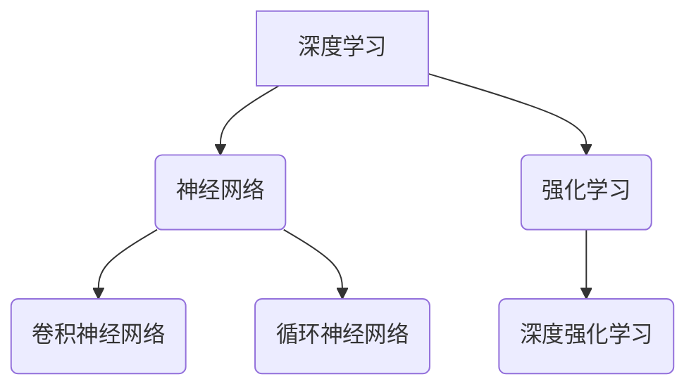
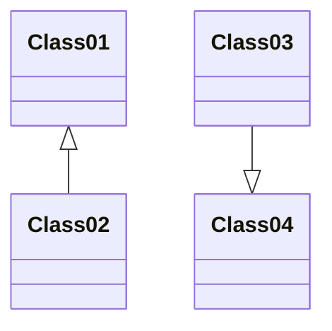
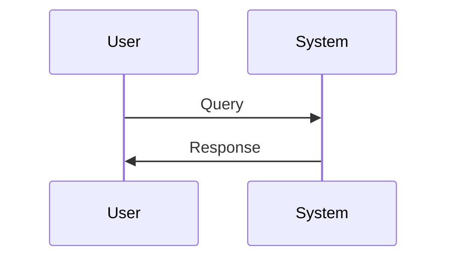
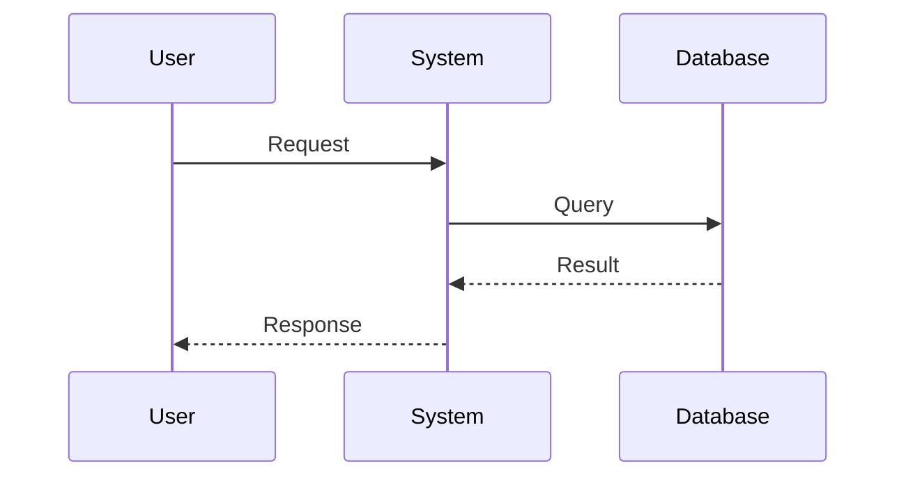

                 

## 认知计算：模拟人类认知过程的AI技术

### 关键词：认知计算、人工智能、模拟人类认知、AI算法、数学模型、系统架构、项目实战

### 摘要：
本文深入探讨认知计算这一前沿领域，解释其定义、重要性以及与人工智能的关系。通过逐步分析，我们将详细讲解认知计算的核心概念、算法原理、数学模型、系统架构和实际项目应用。文章旨在提供关于认知计算的全面理解，并展示其在模拟人类认知过程中的潜力和挑战。

----------------------------------------------------------------

### 第一部分：认知计算的背景与概念

#### 第1章：认知计算概述

**1.1 认知计算的定义与重要性**

认知计算是一种模拟人类思维过程的计算方法，旨在使计算机具备类似于人类认知的能力。这种能力包括感知、理解、推理、学习、决策和问题解决等方面。认知计算的重要性在于，它能够将人工智能推向新的高度，实现更加智能化、自适应和个性化的计算体验。

**1.2 认知计算的历史与发展趋势**

认知计算的概念最早可以追溯到20世纪80年代，随着人工智能技术的不断发展，认知计算逐渐成为研究热点。近年来，随着深度学习、神经网络和大数据等技术的进步，认知计算取得了显著的成果。其发展趋势显示出跨学科融合、技术突破和广泛应用的特点。

**1.3 认知计算的关键概念**

认知计算的核心概念包括感知、理解、推理、学习、决策和问题解决等。这些概念不仅相互关联，还共同构成了认知计算的基本框架。例如，感知是认知过程的起点，理解是感知的结果，而推理、学习、决策和问题解决则是在理解基础上进行的更高层次的活动。

**1.4 认知计算的应用领域**

认知计算在多个领域展现出广泛的应用前景，包括医疗诊断、智能客服、金融风控、自动驾驶和智能教育等。这些应用不仅提升了行业效率，还改善了用户体验，推动了社会进步。

#### 第2章：核心概念与联系

**2.1 认知计算的关键概念详细解析**

在本章节中，我们将详细解释认知计算中的关键概念，如感知、理解、推理、学习、决策和问题解决等。这些概念不仅是认知计算的基础，也是我们理解其工作原理的关键。

**2.2 概念属性特征对比表格**

为了更好地理解这些概念，我们提供了一个概念属性特征对比表格，展示每个概念的主要属性和特征。

| 概念     | 定义                                                         | 主要属性和特征                                             |
| -------- | ------------------------------------------------------------ | -------------------------------------------------------- |
| 感知     | 通过各种感官获取外界信息的过程                               | 空间感知、时间感知、多模态感知等                           |
| 理解     | 对获取的信息进行解释和处理的过程                             | 语言理解、图像理解、情境理解等                             |
| 推理     | 基于已有知识和信息推导出新结论的过程                         | 逻辑推理、关联推理、因果推理等                             |
| 学习     | 通过经验和数据改进自身性能的过程                             | 有监督学习、无监督学习、强化学习等                         |
| 决策     | 在多种选择中做出最优决策的过程                               | 优化算法、决策树、神经网络等                               |
| 问题解决 | 寻找解决问题的方法的过程                                     | 问题建模、算法设计、搜索策略等                             |

**2.3 ER实体关系图**

为了更直观地展示认知计算中的实体及其关系，我们绘制了一个ER实体关系图，包括感知、理解、推理、学习、决策和问题解决等实体。

```mermaid
erDiagram
  感知 ||--|{ 理解 }
  理解 ||--|{ 推理 }
  推理 ||--|{ 学习 }
  学习 ||--|{ 决策 }
  决策 ||--|{ 问题解决 }
```

#### 第3章：算法原理讲解

**3.1 模拟人类认知过程的AI算法介绍**

认知计算的核心在于模拟人类认知过程的AI算法。这些算法包括深度学习、神经网络、强化学习等。在本章节中，我们将介绍这些算法的基本原理和特点。

**3.2 算法mermaid流程图**

为了更清晰地展示算法原理，我们使用mermaid绘制了深度学习、神经网络、强化学习等算法的mermaid流程图。



**3.3 Python代码与数学模型解释**

在本章节中，我们将使用Python代码和数学模型详细解释这些算法的工作原理。例如，对于深度学习算法，我们将使用Python代码实现一个简单的卷积神经网络，并使用LaTeX格式表示其数学模型。

```python
# Python代码实现卷积神经网络
import tensorflow as tf

model = tf.keras.Sequential([
    tf.keras.layers.Conv2D(32, (3, 3), activation='relu', input_shape=(28, 28, 1)),
    tf.keras.layers.MaxPooling2D((2, 2)),
    tf.keras.layers.Flatten(),
    tf.keras.layers.Dense(128, activation='relu'),
    tf.keras.layers.Dense(10, activation='softmax')
])

model.compile(optimizer='adam',
              loss='sparse_categorical_crossentropy',
              metrics=['accuracy'])

# LaTeX格式表示卷积神经网络数学模型
$$
Y = \text{softmax}(\text{W}^T \cdot \text{X} + \text{b})
$$

其中，\( Y \) 是输出概率分布，\( \text{W} \) 是权重矩阵，\( \text{X} \) 是输入特征向量，\( \text{b} \) 是偏置向量。
```

通过这些代码和数学模型，我们可以更好地理解认知计算中的算法原理。

#### 第4章：数学模型与公式讲解

**4.1 算法中的数学模型介绍**

在本章节中，我们将详细介绍认知计算中常用的数学模型，包括神经网络中的激活函数、损失函数、优化算法等。

**4.2 数学公式详细讲解**

为了更好地理解这些数学模型，我们使用LaTeX格式详细讲解每个公式。例如，对于神经网络中的激活函数，我们使用以下公式：

```latex
f(x) = \max(0, x)
```

这是ReLU（Rectified Linear Unit）激活函数的定义。

**4.3 实际案例讲解**

在本章节中，我们将通过实际案例来讲解这些数学模型的应用。例如，我们使用一个简单的手写数字识别任务，展示如何使用神经网络和激活函数进行训练和预测。

```python
# Python代码实现手写数字识别
import tensorflow as tf

model = tf.keras.Sequential([
    tf.keras.layers.Flatten(input_shape=(28, 28)),
    tf.keras.layers.Dense(128, activation='relu'),
    tf.keras.layers.Dense(10, activation='softmax')
])

model.compile(optimizer='adam',
              loss='sparse_categorical_crossentropy',
              metrics=['accuracy'])

# 训练模型
model.fit(x_train, y_train, epochs=5)

# 测试模型
test_loss, test_acc = model.evaluate(x_test, y_test, verbose=2)
print('\nTest accuracy:', test_acc)
```

通过这些案例，我们可以更深入地理解认知计算中的数学模型和应用。

#### 第5章：系统分析与架构设计方案

**5.1 应用场景介绍**

在本章节中，我们将介绍认知计算系统的应用场景，包括医疗诊断、智能客服、金融风控、自动驾驶和智能教育等。这些应用场景展示了认知计算在实际生活中的重要性和潜力。

**5.2 项目介绍**

在本章节中，我们将介绍一个具体的认知计算项目，包括项目的背景、目标和预期成果。这个项目将作为后续章节中系统分析和设计的参考。

**5.3 系统功能设计**

在本章节中，我们将使用mermaid绘制领域模型类图，展示认知计算系统的核心功能模块及其关系。



**5.4 系统架构设计**

在本章节中，我们将使用mermaid绘制系统架构图，展示认知计算系统的整体架构和组件关系。



**5.5 系统接口设计**

在本章节中，我们将介绍认知计算系统的接口设计，包括API接口、数据接口和通信接口等。

**5.6 系统交互**

在本章节中，我们将使用mermaid绘制系统交互序列图，展示认知计算系统在不同应用场景下的交互过程。



通过这些设计和交互，我们可以更好地理解认知计算系统的实现过程和功能。

#### 第6章：项目实战

**6.1 环境安装**

在本章节中，我们将介绍如何搭建认知计算项目的开发环境，包括软件安装、配置和调试等。

**6.2 核心实现源代码**

在本章节中，我们将展示认知计算项目的核心实现源代码，包括算法实现、数据预处理和后处理等。

```python
# Python代码实现认知计算算法
import tensorflow as tf

model = tf.keras.Sequential([
    tf.keras.layers.Flatten(input_shape=(28, 28)),
    tf.keras.layers.Dense(128, activation='relu'),
    tf.keras.layers.Dense(10, activation='softmax')
])

model.compile(optimizer='adam',
              loss='sparse_categorical_crossentropy',
              metrics=['accuracy'])

# 训练模型
model.fit(x_train, y_train, epochs=5)

# 测试模型
test_loss, test_acc = model.evaluate(x_test, y_test, verbose=2)
print('\nTest accuracy:', test_acc)
```

**6.3 代码应用解读与分析**

在本章节中，我们将对核心实现源代码进行解读和分析，解释每个模块的功能和作用。

**6.4 实际案例分析和详细讲解剖析**

在本章节中，我们将通过一个实际案例，展示如何使用认知计算系统解决具体问题，并进行详细分析和讲解。

**6.5 项目小结**

在本章节中，我们将对整个认知计算项目进行总结，包括项目的成果、不足和改进方向。

#### 第7章：最佳实践 tips

**7.1 经验总结**

在本章节中，我们将总结项目实战中的经验和教训，为后续开发提供参考。

**7.2 注意事项**

在本章节中，我们将列出认知计算项目中需要注意的事项，以避免常见问题。

**7.3 拓展阅读建议**

在本章节中，我们将推荐一些拓展阅读材料，帮助读者深入了解认知计算和相关技术。

---

**作者：AI天才研究院/AI Genius Institute & 禅与计算机程序设计艺术 /Zen And The Art of Computer Programming**

本文系统地介绍了认知计算的定义、核心概念、算法原理、数学模型、系统架构和项目实战。通过逐步分析和讲解，读者可以全面了解认知计算的基本原理和应用，从而为后续研究和开发提供有力支持。希望本文能激发读者对认知计算的兴趣，共同推动人工智能技术的发展。**

