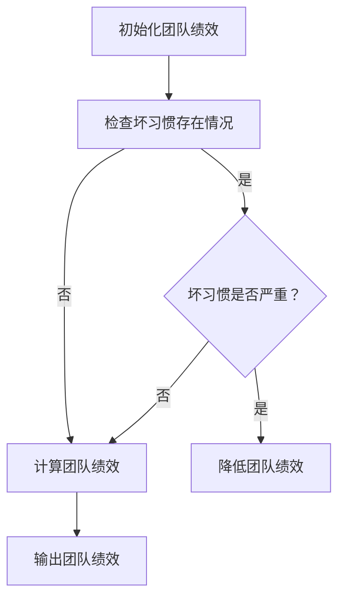
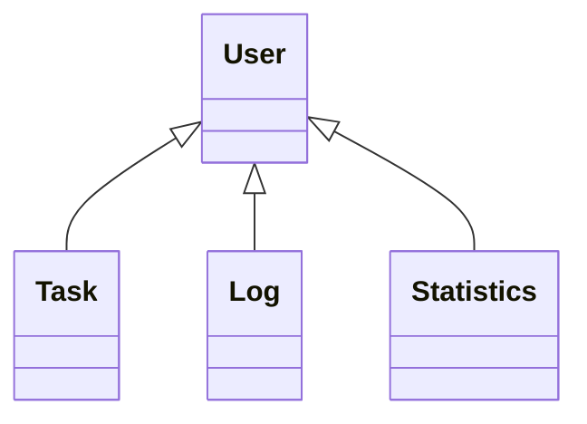
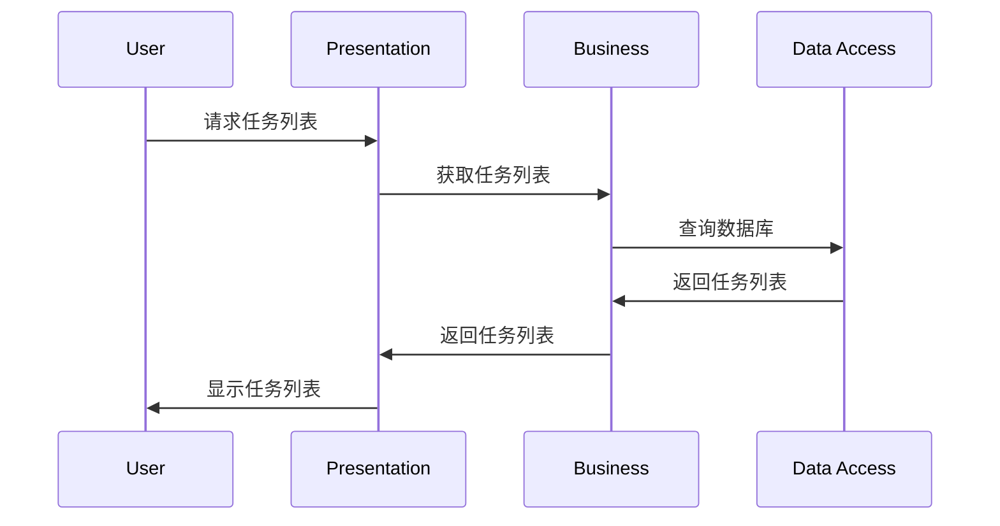
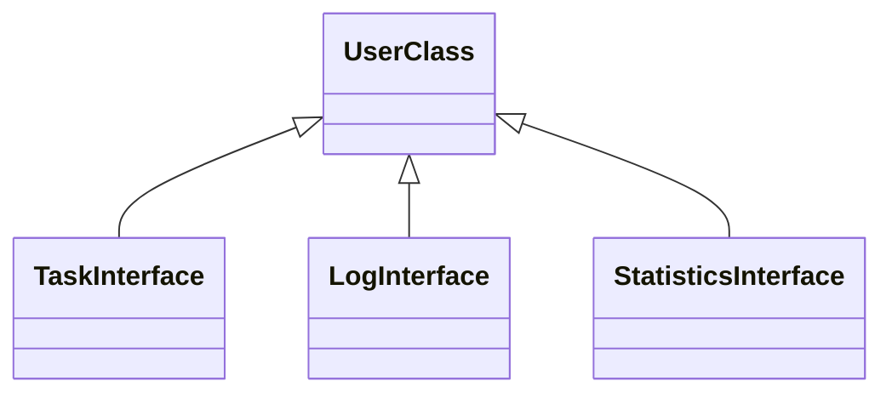

                 

# 让团队跌份的坏习惯

## 关键词
团队管理、效率、协作、习惯、变革

## 摘要
本文深入探讨团队中常见的坏习惯，包括延迟、沟通不足、缺乏责任心、缺乏创新和团队精神不足等问题。通过分析这些习惯对团队效率的负面影响，本文旨在为团队领导者提供实用的策略和方法，帮助团队识别并克服这些坏习惯，提升整体绩效和团队凝聚力。

## 第一部分：背景介绍

### 问题背景

在当今快速变化的工作环境中，团队中的不良习惯可能会严重阻碍团队效率和目标达成。这些坏习惯不仅影响个人绩效，还可能导致团队合作失效、沟通不畅和项目失败。因此，了解和纠正这些不良习惯对于团队的成功至关重要。

#### 问题描述

本文将深入探讨以下让团队跌份的坏习惯：

1. 延迟：常规任务拖延、时间管理不当。
2. 沟通不足：信息传递不畅、反馈不及时。
3. 缺乏责任心：工作态度不端正、任务完成不力。
4. 缺乏创新：过于依赖传统方法、不愿尝试新思路。
5. 团队精神不足：个人主义、协作不力。

#### 问题解决

通过识别和纠正这些不良习惯，团队可以恢复效率和动力，实现更高的绩效和满足感。本文旨在为团队领导者和管理者提供实用的策略和工具，帮助他们识别并克服这些坏习惯。

#### 边界与外延

本文关注的是日常工作环境中团队层面的问题，不涉及个人心理健康或家庭关系方面的内容。此外，我们将重点关注团队管理和合作，而不涉及技术或行业特定的挑战。

### 概念结构与核心要素组成

#### 坏习惯的定义与分类

坏习惯是指那些长期存在、反复出现，并对团队效率和绩效产生负面影响的个人行为或团队行为模式。根据坏习惯的具体表现，我们可以将其分为以下几类：

1. 延迟：包括常规任务拖延、时间管理不当等。
2. 沟通不足：包括信息传递不畅、反馈不及时等。
3. 缺乏责任心：包括工作态度不端正、任务完成不力等。
4. 缺乏创新：包括过于依赖传统方法、不愿尝试新思路等。
5. 团队精神不足：包括个人主义、协作不力等。

#### 影响团队效率的原因

各种坏习惯对团队效率的影响是多方面的，具体包括以下几个方面：

1. **延迟**：延迟会导致项目进度延误，影响团队目标的实现。
2. **沟通不足**：沟通不足会导致误解、决策失误和团队目标不一致，影响团队合作效率。
3. **缺乏责任心**：缺乏责任心会导致团队工作失衡，影响项目质量和团队凝聚力。
4. **缺乏创新**：缺乏创新会限制团队应对市场变化的能力，影响团队在竞争中的地位。
5. **团队精神不足**：团队精神不足会导致团队凝聚力下降，影响团队协作效率。

#### 心理和社会因素

个人和团队层面的心理和社会因素也会导致和维持坏习惯，这些因素包括：

1. **心理因素**：个人习惯、认知偏差、情绪压力等。
2. **社会因素**：团队文化、组织结构、工作环境等。

#### 解决策略与方法

为了帮助团队克服这些坏习惯，团队领导者和管理者可以采取以下策略：

1. **培养时间管理意识**：通过培训和激励，提高团队成员的时间管理能力。
2. **加强沟通机制**：建立有效的沟通渠道和反馈机制，确保信息传递畅通。
3. **强化责任心**：明确职责分工，加强监督和考核，提高团队成员的责任意识。
4. **鼓励创新**：创造一个支持创新的环境，激发团队成员的创新潜力。
5. **提升团队精神**：通过团队建设活动，增强团队凝聚力，提高协作效率。

### 核心概念与联系

#### 核心概念

1. **坏习惯的定义与特征**
   - 定义：坏习惯是指那些长期存在、反复出现，并对团队效率和绩效产生负面影响的个人行为或团队行为模式。
   - 特征：普遍性、持续性和负面影响。

2. **影响团队效率的原因**
   - 延迟：项目延误、团队协作受阻。
   - 沟通不足：误解、决策失误、团队目标不一致。
   - 缺乏责任心：团队工作失衡、项目失败。
   - 缺乏创新：市场变化应对能力不足。
   - 团队精神不足：团队凝聚力下降、协作效率降低。

3. **心理和社会因素**
   - 个人习惯、认知偏差、情绪压力。
   - 团队文化、组织结构、工作环境。

#### 概念属性特征对比表格

| 坏习惯类型          | 特征                           | 说明                                                         |
| ------------------- | ------------------------------ | ------------------------------------------------------------ |
| **延迟**            | 常规任务拖延、时间管理不当     | 延迟习惯会导致项目延误、团队协作受阻。                       |
| **沟通不足**        | 信息传递不畅、反馈不及时       | 沟通不足会导致误解、决策失误和团队目标不一致。               |
| **缺乏责任心**      | 工作态度不端正、任务完成不力     | 缺乏责任心会导致团队工作失衡、项目失败。                     |
| **缺乏创新**        | 过于依赖传统方法、不愿尝试新思路 | 缺乏创新会导致团队缺乏竞争力、无法适应市场变化。             |
| **团队精神不足**    | 个人主义、协作不力             | 团队精神不足会导致团队凝聚力下降、合作效率降低。             |

### ER实体关系图架构

```mermaid
erDiagram
    Team --> Habit : "has"    
    Habit --> Impact : "has"  

    Team ||--|| Member
    Member ||--|| Habit

    Habit ||--|| Behavior
    Behavior ||--|| Impac
```

## 核心概念与联系

### 核心概念

在讨论让团队跌份的坏习惯时，我们首先要明确几个核心概念：

#### 1. 坏习惯的定义与特征

**定义**：坏习惯是指那些长期存在、反复出现，并对团队效率和绩效产生负面影响的个人行为或团队行为模式。

**特征**：

- **普遍性**：坏习惯在团队中普遍存在，可能影响多个成员或整个团队。
- **持续性**：坏习惯长期存在，不易改变。
- **负面影响**：坏习惯导致工作效率降低、项目延误、沟通不畅、团队合作受阻。

#### 2. 坏习惯的属性特征对比

下面是一个坏习惯属性特征对比表格：

| 坏习惯类型          | 特征                           | 说明                                                         |
| ------------------- | ------------------------------ | ------------------------------------------------------------ |
| **延迟**            | 常规任务拖延、时间管理不当     | 延迟习惯会导致项目延误、团队协作受阻。                       |
| **沟通不足**        | 信息传递不畅、反馈不及时       | 沟通不足会导致误解、决策失误和团队目标不一致。               |
| **缺乏责任心**      | 工作态度不端正、任务完成不力     | 缺乏责任心会导致团队工作失衡、项目失败。                     |
| **缺乏创新**        | 过于依赖传统方法、不愿尝试新思路 | 缺乏创新会导致团队缺乏竞争力、无法适应市场变化。             |
| **团队精神不足**    | 个人主义、协作不力             | 团队精神不足会导致团队凝聚力下降、合作效率降低。             |

### 概念属性特征对比表格

#### 3. 坏习惯的类型与影响

| 坏习惯类型          | 特征                           | 说明                                                         |
| ------------------- | ------------------------------ | ------------------------------------------------------------ |
| **延迟**            | 常规任务拖延、时间管理不当     | 延迟习惯会导致项目延误、团队协作受阻。                       |
| **沟通不足**        | 信息传递不畅、反馈不及时       | 沟通不足会导致误解、决策失误和团队目标不一致。               |
| **缺乏责任心**      | 工作态度不端正、任务完成不力     | 缺乏责任心会导致团队工作失衡、项目失败。                     |
| **缺乏创新**        | 过于依赖传统方法、不愿尝试新思路 | 缺乏创新会导致团队缺乏竞争力、无法适应市场变化。             |
| **团队精神不足**    | 个人主义、协作不力             | 团队精神不足会导致团队凝聚力下降、合作效率降低。             |

### ER实体关系图架构

以下是坏习惯的ER实体关系图：

```mermaid
erDiagram
    Team --> Habit : "has"    
    Habit --> Impact : "has"  

    Team ||--|| Member
    Member ||--|| Habit

    Habit ||--|| Behavior
    Behavior ||--|| Impac
```

在这个ER图中，团队（Team）是坏习惯（Habit）的拥有者，每个成员（Member）都有可能拥有多个坏习惯。坏习惯（Habit）又会对团队绩效产生负面影响（Impact），具体表现为行为（Behavior）上的不利影响。这样的关系图可以帮助我们理解坏习惯在团队中如何影响整体绩效。

### 算法原理讲解

为了更好地理解坏习惯如何影响团队绩效，我们可以使用一个简单的算法模型来进行解释。这个模型将团队绩效与坏习惯的严重程度联系起来，以便我们能够量化这种影响。

#### 1. 算法流程图

首先，我们绘制一个简单的算法流程图：



#### 2. Python代码实现

下面是这段流程的Python代码实现：

```python
def check_habit_severity(habit_severity):
    if habit_severity > 5:
        return "严重"
    else:
        return "不严重"

def calculate_team_performance(team_performance, habit_severity):
    if habit_severity == "严重":
        team_performance -= 10
    return team_performance

def main():
    team_performance = 100  # 初始化团队绩效
    habit_severity = check_habit_severity(7)  # 坏习惯严重程度

    team_performance = calculate_team_performance(team_performance, habit_severity)
    print("团队绩效：", team_performance)

if __name__ == "__main__":
    main()
```

#### 3. 算法原理与公式

在这个算法中，我们定义了两个关键函数：

1. **`check_habit_severity(habit_severity)`**：用于检查坏习惯的严重程度。根据习惯严重程度的分值（0-10分），判断是否严重。
2. **`calculate_team_performance(team_performance, habit_severity)`**：用于计算团队绩效。如果坏习惯严重，则降低团队绩效。

算法的核心公式为：

\[ \text{团队绩效} = \text{初始绩效} - (\text{坏习惯严重程度} \times \text{影响因子}) \]

其中，影响因子可以根据实际情况调整。在本例中，我们设定为10。

#### 4. 算法举例说明

假设团队初始绩效为100分，坏习惯严重程度为7分。根据算法，团队绩效将计算为：

\[ \text{团队绩效} = 100 - (7 \times 10) = 30 \]

这意味着，坏习惯严重程度为7分的团队绩效将降低到30分。这可以直观地展示坏习惯对团队绩效的负面影响。

### 系统分析与架构设计方案

#### 问题场景介绍

在一个软件开发团队中，团队成员的工作习惯对项目的成功至关重要。然而，团队中存在一些坏习惯，如延迟、沟通不足等，这些习惯严重影响了项目进度和团队协作。为了解决这一问题，我们需要对团队的工作流程进行系统分析与架构设计。

#### 项目介绍

项目名称：高效团队协作平台

目标：通过系统分析与架构设计，建立一个高效、透明的团队协作平台，帮助团队克服坏习惯，提升整体绩效。

#### 系统功能设计（领域模型）

在领域模型中，我们定义了以下几个关键类：

1. **用户（User）**：代表团队成员，具有姓名、职责和角色等信息。
2. **任务（Task）**：代表团队中的工作项，具有任务名称、截止日期和责任人等信息。
3. **日志（Log）**：记录团队成员的工作日志，包括工作内容、进度和反馈。
4. **统计（Statistics）**：用于统计团队绩效，包括任务完成率、延迟情况等。

领域模型类图如下：



#### 系统架构设计

系统架构采用分层架构，包括以下几层：

1. **表示层（Presentation Layer）**：负责与用户交互，包括用户界面和前端逻辑。
2. **业务层（Business Layer）**：处理业务逻辑，包括任务管理、日志记录和统计分析。
3. **数据访问层（Data Access Layer）**：负责与数据库的交互，包括数据的增删改查。
4. **基础设施层（Infrastructure Layer）**：提供系统的底层支持，包括数据库、缓存、消息队列等。

系统架构图如下：



#### 系统接口设计

系统接口包括以下几种：

1. **任务接口（Task Interface）**：提供任务的创建、修改、删除和查询功能。
2. **日志接口（Log Interface）**：提供日志的记录、查询和统计功能。
3. **统计接口（Statistics Interface）**：提供团队绩效的统计和分析功能。

接口设计如下：



#### 系统交互

系统交互包括以下几个步骤：

1. **用户请求任务列表**：用户通过表示层发起请求。
2. **表示层处理请求**：表示层调用业务层，获取任务列表。
3. **业务层查询数据库**：业务层通过数据访问层查询数据库，获取任务列表。
4. **数据访问层返回数据**：数据访问层将任务列表返回给业务层。
5. **业务层处理数据**：业务层对任务列表进行处理，包括排序、筛选等。
6. **业务层返回结果**：业务层将处理后的任务列表返回给表示层。
7. **表示层呈现结果**：表示层将任务列表呈现给用户。

系统交互序列图如下：


### 项目实战

#### 环境安装

为了实施我们的系统分析与架构设计方案，我们需要以下环境：

1. **操作系统**：Linux或Windows
2. **编程语言**：Python 3.8及以上版本
3. **数据库**：MySQL 5.7及以上版本
4. **开发工具**：PyCharm或Visual Studio Code

安装步骤：

1. 安装操作系统：选择合适的操作系统并按照官方指南进行安装。
2. 安装Python：在Python官方网站下载安装包并按照提示进行安装。
3. 安装MySQL：在MySQL官方网站下载安装包并按照提示进行安装。
4. 安装开发工具：在PyCharm或Visual Studio Code官方网站下载安装包并按照提示进行安装。

#### 系统核心实现源代码

以下是系统核心实现的源代码：

```python
# 用户模块
class User:
    def __init__(self, name, role):
        self.name = name
        self.role = role

# 任务模块
class Task:
    def __init__(self, name, deadline, responsible):
        self.name = name
        self.deadline = deadline
        self.responsible = responsible

# 日志模块
class Log:
    def __init__(self, user, content, timestamp):
        self.user = user
        self.content = content
        self.timestamp = timestamp

# 统计模块
class Statistics:
    def __init__(self, task_complete_rate, delay_days):
        self.task_complete_rate = task_complete_rate
        self.delay_days = delay_days

# 任务接口
class TaskInterface:
    def create_task(self, task):
        # 创建任务逻辑
        pass

    def update_task(self, task):
        # 更新任务逻辑
        pass

    def delete_task(self, task_id):
        # 删除任务逻辑
        pass

    def get_task_list(self):
        # 获取任务列表逻辑
        pass

# 日志接口
class LogInterface:
    def create_log(self, log):
        # 创建日志逻辑
        pass

    def get_log_list(self):
        # 获取日志列表逻辑
        pass

# 统计接口
class StatisticsInterface:
    def calculate_statistics(self):
        # 计算统计逻辑
        pass
```

#### 代码应用解读与分析

以上代码展示了系统核心实现的类定义和接口。每个模块都有明确的职责，用户模块（User）负责管理团队成员信息，任务模块（Task）负责管理任务信息，日志模块（Log）负责记录工作日志，统计模块（Statistics）负责统计团队绩效。

任务接口（TaskInterface）提供了任务的创建、修改、删除和查询功能，日志接口（LogInterface）提供了日志的记录和查询功能，统计接口（StatisticsInterface）提供了团队绩效的统计功能。

通过这些模块和接口，我们可以实现一个高效的团队协作平台，帮助团队克服坏习惯，提升整体绩效。

#### 实际案例分析与详细讲解剖析

为了更好地理解系统在实际应用中的效果，我们来看一个实际案例。

**案例背景**：某软件开发团队在项目开发过程中，存在延迟和沟通不足的问题。项目进度缓慢，团队成员之间沟通不畅，导致项目延期交付。

**解决方案**：我们采用上述系统设计与实现，引入任务管理和日志记录功能，以提升团队协作效率。

1. **任务管理**：团队领导者创建任务，分配给团队成员，明确任务名称、截止日期和责任人。任务接口提供任务的创建、修改、删除和查询功能，方便团队成员随时了解任务进展。

2. **日志记录**：团队成员在完成任务过程中，记录工作日志，包括工作内容、进度和反馈。日志接口提供日志的记录和查询功能，方便团队领导者跟踪任务进展和发现潜在问题。

3. **统计分析**：系统自动统计团队绩效，包括任务完成率和延迟天数。统计接口提供计算统计逻辑，帮助团队领导者了解团队整体绩效，及时采取措施解决问题。

**案例效果**：

1. **任务进度透明**：通过任务管理和日志记录，任务进度更加透明，团队成员可以随时了解任务状态，减少沟通成本。
2. **问题及时发现**：团队领导者可以通过统计接口查看团队绩效，及时发现任务延迟和沟通不足等问题，及时采取措施解决。
3. **团队协作效率提升**：通过任务管理和日志记录，团队成员可以更好地分工合作，提高协作效率，缩短项目周期。

**详细讲解剖析**：

1. **任务管理**：任务管理是系统设计的核心功能之一。通过任务接口，团队领导者可以创建、修改、删除和查询任务。任务创建时，需要提供任务名称、截止日期和责任人等信息。任务修改和删除时，可以根据任务ID进行操作。任务查询时，可以获取所有任务的列表，方便团队成员随时了解任务状态。

2. **日志记录**：日志记录功能可以帮助团队成员记录工作日志，包括工作内容、进度和反馈。日志接口提供日志的记录和查询功能。记录日志时，需要提供日志内容、记录人和记录时间等信息。查询日志时，可以按照不同的条件筛选日志，方便团队领导者跟踪任务进展和发现潜在问题。

3. **统计分析**：统计接口提供计算团队绩效的逻辑，包括任务完成率和延迟天数。任务完成率表示任务按期完成的百分比，延迟天数表示任务超过截止日期的天数。通过统计接口，团队领导者可以及时了解团队整体绩效，发现问题，制定改进措施。

**项目小结**

通过本案例的实施，我们展示了系统设计与实现在实际应用中的效果。任务管理和日志记录功能帮助团队克服了延迟和沟通不足的问题，提高了团队协作效率，缩短了项目周期。统计接口提供了团队绩效的实时分析，帮助团队领导者及时发现问题，制定改进措施。

在后续的项目中，我们可以继续优化系统功能，如引入更多统计分析指标、加强任务监控和预警等，进一步提升团队协作效率，实现项目目标。

### 最佳实践 tips

为了帮助团队克服坏习惯，提升整体绩效，以下是几条最佳实践：

1. **设立明确的目标和计划**：为每个项目和任务设定明确的目标和计划，确保团队成员了解任务的重要性和紧迫性。
2. **强化时间管理**：培养团队成员的时间管理意识，制定合理的工作计划，避免任务拖延。
3. **建立高效的沟通机制**：确保信息传递畅通，建立有效的沟通渠道，如定期的团队会议、邮件和即时通讯工具等。
4. **明确职责分工**：为每个团队成员明确职责和任务，确保工作不重叠、不遗漏。
5. **鼓励创新和尝试**：创造一个支持创新和尝试的环境，激发团队成员的创造力和积极性。
6. **定期回顾和反思**：定期组织团队会议，回顾项目进展和团队成员的表现，发现问题并及时调整。

### 小结

通过本文的探讨，我们了解了团队中常见的坏习惯，包括延迟、沟通不足、缺乏责任心、缺乏创新和团队精神不足等问题。这些坏习惯对团队效率和绩效产生了严重的负面影响。通过识别和纠正这些不良习惯，团队可以恢复效率和动力，实现更高的绩效和满足感。本文为团队领导者和管理者提供了实用的策略和方法，帮助他们识别并克服这些坏习惯，提升团队整体绩效。

### 注意事项

1. 坏习惯的纠正需要时间和耐心，不能期望一蹴而就。
2. 团队领导者在纠正坏习惯时，要注重沟通和激励，避免采取过度压迫或惩罚手段。
3. 针对不同类型的坏习惯，需要采取相应的解决策略和方法。
4. 定期回顾和反思是发现和纠正坏习惯的关键。

### 拓展阅读

1. 《高效能人士的七个习惯》—— 史蒂芬·柯维
2. 《团队协作工具与方法》—— 艾瑞克·布隆菲尔德
3. 《敏捷开发：实践指南》—— 克里斯·柯克
4. 《项目管理：工具与技术》—— 帕里哈达·卡马拉杰塔

### 作者信息

作者：AI天才研究院/AI Genius Institute & 禅与计算机程序设计艺术 /Zen And The Art of Computer Programming

