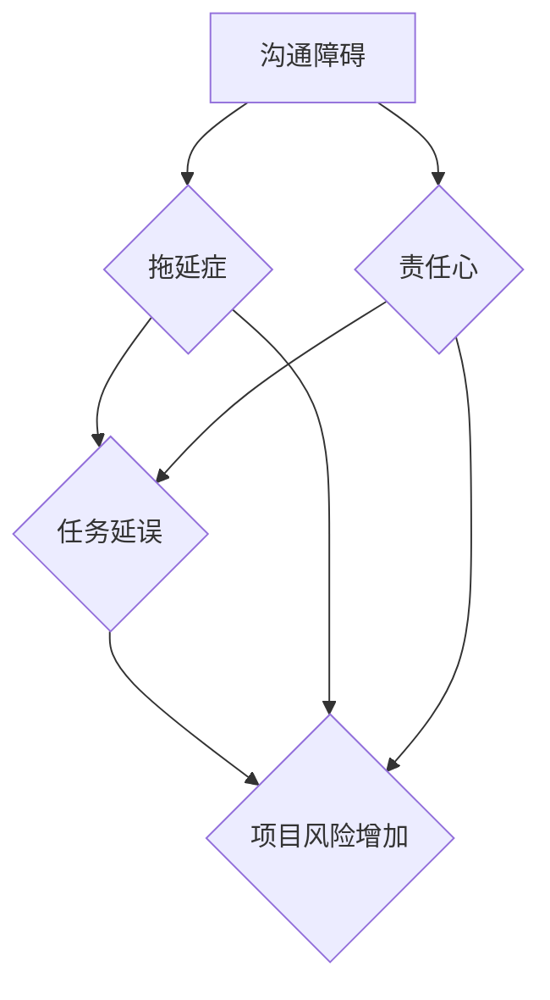
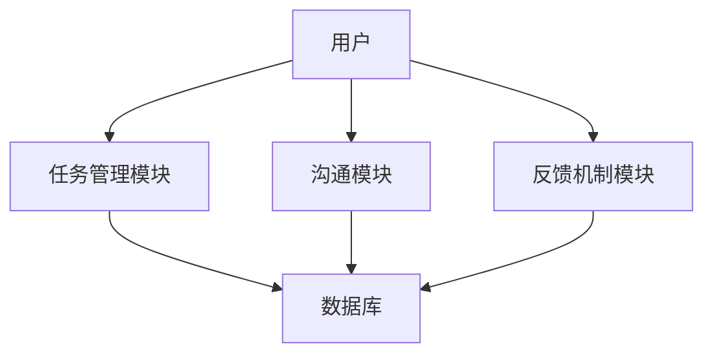
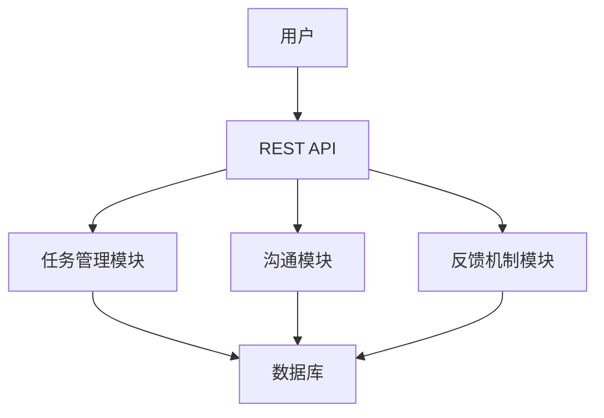

                 

### 《让团队跌份的坏习惯》

> 关键词：团队管理、坏习惯、工作效率、团队协作、领导力

**摘要**：
在快速变化的IT行业，团队协作的有效性直接关系到项目的成功与否。然而，一些常见的坏习惯可能会严重损害团队的表现和士气。本文将探讨几个让团队跌份的坏习惯，包括沟通障碍、拖延症和缺乏责任心，并分析这些习惯如何影响团队绩效、氛围和个人成长。同时，文章将提供一系列步骤和建议，帮助团队和个人识别和改变这些不良习惯，最终提升团队的整体效能。

### 目录大纲

## 第1章 引言

### 1.1 书籍背景与目的
- **背景介绍**：在IT行业快速发展的大背景下，团队管理的重要性日益凸显。
- **目的阐述**：揭示坏习惯对团队效能的负面影响，并提供实用的改进方法。

### 1.2 团队成长中的障碍
- **挑战概述**：分析团队在发展过程中面临的常见难题。
- **坏习惯的影响**：讨论坏习惯如何阻碍团队进步。

## 第2章 坏习惯的类型

### 2.1 沟通障碍
- **缺乏清晰沟通的后果**：阐述沟通不畅带来的负面影响。
- **表现形式**：列举常见的沟通障碍现象。
- **解决方法**：提供改善沟通的具体策略。

### 2.2 拖延症
- **负面影响**：分析拖延行为对团队和工作效率的破坏作用。
- **心理机制**：探讨拖延行为背后的心理因素。
- **克服方法**：介绍应对拖延的有效策略。

### 2.3 缺乏责任心
- **重要性**：强调责任心在团队中的作用。
- **原因分析**：探讨导致缺乏责任心的原因。
- **培养策略**：提供增强团队责任感的具体措施。

## 第3章 坏习惯的危害

### 3.1 对团队绩效的影响
- **效率损失**：分析坏习惯如何导致团队工作效率下降。
- **案例解析**：通过实际案例说明坏习惯的危害。
- **提升途径**：提出提升团队绩效的具体方法。

### 3.2 对团队氛围的影响
- **氛围恶化**：探讨坏习惯对团队氛围的负面影响。
- **案例解析**：分析氛围不良的案例，并提出改进措施。
- **营造方法**：提供改善团队氛围的具体途径。

### 3.3 对个人成长的影响
- **成长阻碍**：讨论坏习惯如何阻碍个人发展。
- **案例解析**：通过案例说明个人成长受阻的情况。
- **培养方法**：提出培养良好个人习惯的建议。

## 第4章 改变坏习惯的步骤

### 4.1 自我认识
- **识别坏习惯**：帮助读者识别自身存在的坏习惯。
- **原因反思**：引导读者反思坏习惯的成因。
- **改变目标**：设定明确的目标，推动习惯改变。

### 4.2 制定计划
- **设定计划**：制定具体的行动计划。
- **时间表与里程碑**：确保计划的可执行性。
- **计划调整**：根据实际情况调整计划。

### 4.3 执行与反馈
- **执行过程**：描述执行计划的步骤。
- **反馈机制**：强调反馈的重要性。
- **计划调整**：根据反馈调整执行计划。

## 第5章 团队建设的重要性

### 5.1 团队建设的基本概念
- **团队定义**：明确团队的概念和功能。
- **建设重要性**：阐述团队建设对团队绩效的积极影响。
- **建设原则**：介绍团队建设的基本原则。

### 5.2 团队建设的实践
- **培训与团建活动**：讨论团队培训和建设活动的价值。
- **协作工具应用**：介绍团队协作工具的使用。
- **反馈与沟通机制**：强调团队反馈和沟通机制的重要性。

## 第6章 团队领导的职责

### 6.1 团队领导的角色与职责
- **角色定位**：明确团队领导的角色和责任。
- **核心职责**：讨论团队领导的核心职责。
- **面临挑战**：分析团队领导面临的挑战。

### 6.2 团队领导的技能提升
- **领导力培养**：介绍领导力的培养方法。
- **沟通技巧提升**：探讨提升沟通技巧的策略。
- **决策能力提高**：分析提高决策能力的途径。

## 第7章 成功案例与启示

### 7.1 团队改变的成功案例
- **案例一**：分析某公司团队的蜕变过程。
- **案例二**：探讨团队如何克服沟通障碍。
- **案例三**：从拖延症到高效工作的转变。

### 7.2 启示与反思
- **案例特点**：总结案例的共同特点。
- **实际应用**：讨论案例的启示和实际应用。
- **改进方向**：提出持续改进的建议。

## 附录

### 附录 A 坏习惯自测表
- **自我评估工具**：提供帮助读者识别坏习惯的评估表。

### 附录 B 改变习惯的实用工具
- **实用工具介绍**：介绍改变坏习惯的实用工具。

### 附录 C 阅读推荐
- **推荐读物**：推荐关于团队建设和个人成长的优秀读物。

---

### 引言

在快速发展的IT行业中，团队协作能力是衡量一个团队是否优秀的重要标准。团队成员之间的有效沟通、高效的工作流程、以及积极的工作氛围，都是团队成功的关键因素。然而，很多团队在面对日常工作和项目挑战时，往往会被一些不良习惯所困扰，这些坏习惯不仅影响了团队的工作效率，更严重阻碍了团队的整体发展。

**什么是坏习惯？**

坏习惯通常是指那些反复出现的、消极的行为模式，它们可能源于个人习惯、沟通障碍、责任心缺失等多方面因素。这些习惯虽然看似微不足道，但长期积累下来，会对团队的士气和绩效产生巨大的负面影响。

**书籍背景与目的**

本书旨在揭示和剖析那些让团队跌份的坏习惯，通过深入分析这些习惯的类型、危害以及改变的方法，帮助团队和个人识别并克服这些不良行为。希望通过本文的讨论，能够引起读者对于团队管理和个人习惯培养的重视，从而提升团队的整体效能。

**团队成长的障碍**

在团队发展的过程中，各种障碍不可避免地会出现。这些障碍可能来自内部，也可能来自外部。例如，团队成员之间的沟通不畅、工作流程的不合理、资源分配的不均衡等问题，都可能成为团队成长的障碍。而坏习惯则往往是这些障碍的根源。

### 第1章 引言

#### 1.1 书籍背景与目的

在当今快速变化的IT行业，团队协作显得尤为重要。一个高效、协同的团队能够在复杂的项目中取得成功，而那些坏习惯却可能成为团队成长的绊脚石。本文旨在探讨几个常见的坏习惯，如沟通障碍、拖延症和缺乏责任心，分析它们如何影响团队的表现，并提供具体的改进策略。

**书籍的背景**

随着技术的飞速发展，IT行业对团队协作的要求越来越高。项目复杂度增加、需求变化频繁，这些都要求团队成员之间能够保持高效的沟通和协作。然而，现实情况往往是，很多团队在日常工作中面临着各种问题，如信息传递不畅、任务分配不均、责任感不强等。这些问题不仅降低了工作效率，还可能导致团队士气低落。

**书籍的目的**

本文的主要目的是揭示这些坏习惯对团队绩效的负面影响，帮助团队和个人识别这些不良行为，并提供实用的改变方法。通过本文的讨论，希望能够引导读者认识到团队管理的重要性，以及如何通过改进个人习惯和团队建设来提升整体效能。

**为何这些坏习惯会让团队跌份**

1. **沟通障碍**：良好的沟通是团队协作的基础。缺乏清晰的沟通会导致误解、决策延误，甚至项目失败。
   
2. **拖延症**：拖延不仅影响个人的工作效率，还会导致整个团队的进度延误，增加项目的风险。

3. **缺乏责任心**：当团队成员缺乏责任心时，任务往往会被延误或执行不力，影响团队的整体表现。

通过本文的深入探讨，我们将逐步揭示这些坏习惯的危害，并提出具体的改进措施，帮助团队克服这些障碍，迈向成功。

### 第1章 引言

#### 1.2 团队成长中的障碍

在团队发展的过程中，障碍无处不在。这些障碍不仅阻碍了团队的进步，还可能对团队的士气和绩效产生负面影响。以下是团队成长中常见的几大障碍：

**沟通障碍**

沟通是团队协作的灵魂。然而，现实中很多团队面临沟通障碍，这些问题可能导致信息传递不畅、团队成员理解偏差，甚至影响项目进展。例如，在一个软件开发团队中，开发人员和技术经理之间的沟通不畅可能导致需求理解偏差，进而导致软件交付延期。

**工作流程问题**

不合理的工作流程会降低团队的工作效率。例如，一个团队的流程设计可能过于复杂，导致任务流转缓慢，甚至出现任务重复和资源浪费。另外，工作流程中的瓶颈和断层也可能导致团队协作不畅。

**资源分配不均**

资源分配不均是另一个常见的障碍。当资源分配不均时，某些团队成员可能面临任务过多或任务过少的问题。任务过多会导致团队成员过度劳累，而任务过少则可能导致资源浪费和团队士气低落。

**团队成员素质差异**

团队成员的素质差异也是团队成长中的一个障碍。在一个团队中，如果团队成员的能力、经验和技能差异过大，可能会导致任务执行不力，甚至影响团队的整体表现。

**坏习惯的阻碍**

上述障碍往往与坏习惯密切相关。例如，沟通障碍可能源于团队成员之间的不信任和缺乏有效沟通机制；工作流程问题可能源于对流程优化的忽视；资源分配不均可能源于对团队成员需求的低估；团队成员素质差异可能源于对团队建设的忽视。

**如何克服这些障碍**

为了克服这些障碍，团队需要采取一系列措施：

1. **建立有效的沟通机制**：通过定期的团队会议、信息共享平台等方式，确保团队成员之间的信息畅通。

2. **优化工作流程**：通过流程梳理和优化，减少流程中的瓶颈和断层，提高工作效率。

3. **合理分配资源**：根据团队成员的实际情况，合理分配任务和资源，确保每个人都能充分发挥自己的能力。

4. **提升团队建设**：通过培训、团建活动等方式，提升团队成员的技能和团队合作意识。

通过上述措施，团队可以有效地克服成长中的障碍，提高整体绩效，实现可持续发展。

### 第2章 坏习惯的类型

#### 2.1 沟通障碍

沟通障碍是团队中常见的坏习惯之一，它可能源于多种因素，如沟通渠道不畅、信息传递不准确、团队成员之间缺乏有效的沟通机制等。以下是沟通障碍的一些表现形式及其对团队的影响：

**缺乏清晰沟通的后果**

缺乏清晰的沟通可能导致以下后果：

1. **误解和冲突**：团队成员之间的信息传递不准确，可能导致误解和冲突，影响团队的和谐与协作。
   
2. **决策延误**：在项目决策过程中，如果团队成员无法有效沟通，可能导致决策延误，错失市场机会。

3. **任务执行困难**：任务分配和执行过程中，如果团队成员对任务理解不一致，可能导致任务执行困难，甚至项目失败。

**表现形式**

沟通障碍的表现形式多样，以下是一些常见的情况：

1. **信息不对称**：不同团队成员之间掌握的信息量不均衡，导致部分成员在任务执行过程中处于劣势。

2. **沟通渠道不畅**：团队成员之间的沟通渠道不畅通，例如，缺乏定期的团队会议、信息共享平台等。

3. **表达不准确**：团队成员在沟通时，可能因为表达能力不足或语言障碍，导致信息传递不准确。

**解决沟通障碍的方法**

为了克服沟通障碍，团队可以采取以下方法：

1. **建立有效的沟通机制**：定期召开团队会议，确保团队成员之间的信息畅通。使用信息共享平台，如Slack或Trello，方便团队成员交流和协作。

2. **明确沟通目标**：每次沟通前，明确沟通的目标和预期结果，确保沟通具有针对性和效率。

3. **培养良好的沟通习惯**：通过培训，提高团队成员的沟通技巧和表达能力。

4. **建立信任**：通过建立信任和开放的文化，鼓励团队成员在沟通中分享自己的想法和意见。

#### 2.2 拖延症

拖延症是另一个常见的坏习惯，它不仅影响个人的工作效率，还可能对整个团队造成负面影响。以下是拖延症的负面影响、心理机制和克服方法：

**负面影响**

拖延症对团队和个人的影响主要体现在以下几个方面：

1. **效率降低**：拖延导致任务延期，影响团队的整体工作效率。

2. **士气低落**：团队成员看到其他人拖延，可能导致士气低落，影响团队的凝聚力。

3. **项目风险增加**：拖延可能导致项目进度延误，增加项目失败的风险。

**心理机制**

拖延症背后的心理机制复杂多样，以下是一些常见的原因：

1. **完美主义**：追求完美可能导致过度准备，延误任务执行。

2. **厌烦情绪**：对某些任务感到厌烦，可能导致拖延。

3. **恐惧失败**：担心任务执行不力，可能导致拖延。

**克服方法**

为了克服拖延症，团队和个人可以采取以下方法：

1. **设定明确的目标**：明确任务的目标和期限，避免模糊和不确定性。

2. **分解任务**：将大任务分解为小任务，逐步完成，减少拖延的焦虑。

3. **制定计划**：制定详细的计划，包括具体的执行步骤和时间表。

4. **培养自律**：通过自律，克服拖延的诱惑，坚持完成任务。

5. **寻求支持**：与同事或上级沟通，寻求支持和监督，共同克服拖延。

#### 2.3 缺乏责任心

缺乏责任心是团队中另一个严重的坏习惯，它可能导致任务执行不力，影响团队的整体绩效。以下是缺乏责任心的重要性、原因和培养策略：

**重要性**

责任心是团队协作的基石，它在以下方面发挥着重要作用：

1. **任务完成**：团队成员有责任心，能够确保任务的顺利完成。

2. **团队信任**：责任心强的人能够赢得他人的信任，增强团队的凝聚力。

3. **工作氛围**：责任心强的团队成员能够营造积极的工作氛围，提高团队士气。

**原因分析**

缺乏责任心的原因多种多样，以下是一些常见的原因：

1. **任务分配不均**：当团队成员感到任务分配不公时，可能导致他们缺乏责任感。

2. **管理不善**：如果团队管理不善，缺乏有效的监督和激励机制，可能导致成员缺乏责任心。

3. **个人动机不足**：个人动机不足，例如缺乏成就感或认可，可能导致缺乏责任心。

**培养策略**

为了培养团队责任感，可以采取以下策略：

1. **明确任务与责任**：确保每个团队成员都明确自己的任务和责任，避免模糊和不确定性。

2. **建立监督机制**：通过定期的任务检查和反馈，确保任务执行到位。

3. **激励与认可**：通过激励和认可，提高团队成员的责任心，例如设立绩效奖励制度。

4. **培养团队合作精神**：通过团队建设活动和培训，增强团队成员的团队合作精神，提高责任感。

通过上述方法，团队可以有效地培养责任感，提高整体绩效。

### 第3章 坏习惯的危害

#### 3.1 对团队绩效的影响

坏习惯对团队绩效的影响是深远而广泛的。它们不仅降低了团队的工作效率，还可能破坏团队的整体协同性。以下是坏习惯对团队绩效的具体影响：

**效率损失**

1. **任务延误**：拖延症是效率损失的主要原因之一。团队成员的拖延行为会导致任务无法按时完成，从而影响整个项目的进度。

2. **重复工作**：沟通障碍可能导致团队成员在任务执行过程中产生误解，导致重复工作，浪费时间和资源。

3. **资源浪费**：当团队成员缺乏责任心时，任务执行不力可能导致资源浪费，例如过多的调试和修正工作。

**案例解析**

为了更好地理解坏习惯对团队绩效的影响，我们可以通过一个实际的案例来进行分析：

**案例一：软件项目的失败**

在一个软件开发项目中，团队中的几个成员存在严重的拖延症和沟通障碍。由于项目需求变更频繁，团队成员之间的沟通不畅，导致任务执行过程中出现误解和重复工作。最终，项目不仅延误了交付时间，还超出了预算，导致客户不满和项目团队的士气低落。

**提升团队绩效的途径**

为了提升团队绩效，团队可以采取以下措施：

1. **明确任务和责任**：确保每个团队成员都清楚自己的任务和责任，避免任务重叠和遗漏。

2. **建立沟通机制**：通过定期的团队会议和沟通工具，确保信息畅通，减少误解和重复工作。

3. **培训与激励**：通过培训提高团队成员的工作技能，同时设立激励机制，提高团队成员的积极性和责任感。

4. **监督与反馈**：通过定期的任务检查和反馈，确保任务按时完成，并及时调整和改进工作流程。

#### 3.2 对团队氛围的影响

团队氛围对团队的整体表现和成员的满意度有着重要影响。不良习惯如沟通障碍、拖延症和缺乏责任心等，都可能破坏团队的氛围，导致成员之间的不信任和冲突。以下是坏习惯对团队氛围的具体影响：

**氛围恶化**

1. **冲突与不信任**：沟通障碍导致团队成员之间产生误解和冲突，破坏团队氛围。

2. **士气低落**：拖延症和缺乏责任心可能导致团队成员感到沮丧和无助，降低团队士气。

3. **负面情绪传播**：一个团队成员的不良习惯和行为可能会对其他成员产生负面影响，形成负面情绪的传播。

**案例解析**

以下是一个关于团队氛围恶化的案例：

**案例二：团队士气的下降**

在一个创业公司的团队中，由于项目需求频繁变更，团队成员之间沟通不畅，导致任务执行过程中出现误解和延误。同时，团队中的几个成员存在严重的拖延症，任务总是拖到最后才完成。这种情况下，团队成员之间的不信任和冲突日益加剧，团队士气低落，甚至有人开始考虑离职。

**营造积极团队氛围的方法**

为了营造积极的团队氛围，团队可以采取以下方法：

1. **建立良好的沟通机制**：通过定期的团队会议和沟通工具，确保团队成员之间的信息畅通，减少误解和冲突。

2. **培养团队合作精神**：通过团队建设活动和培训，增强团队成员之间的合作意识和团队精神。

3. **鼓励反馈与开放**：鼓励团队成员之间相互反馈，建立开放和透明的沟通文化，减少负面情绪的传播。

4. **激励与认可**：通过激励和认可，提高团队成员的积极性和满意度，营造积极的工作氛围。

#### 3.3 对个人成长的影响

坏习惯不仅影响团队的整体绩效和氛围，也对个人的成长和发展产生负面影响。以下是坏习惯对个人成长的具体影响：

**成长阻碍**

1. **技能发展受阻**：拖延症导致个人无法充分利用时间和资源进行技能提升。

2. **职业发展受限**：缺乏责任心可能使个人在职业发展中受到限制，难以获得重要的项目经验和领导机会。

3. **自信心下降**：由于拖延和任务完成不力，个人可能对自己的能力产生怀疑，导致自信心下降。

**案例解析**

以下是一个关于个人成长受阻的案例：

**案例三：职业发展的瓶颈**

在一个IT公司中，一位技术员由于存在严重的拖延症，经常无法按时完成任务，导致项目延误。尽管他的技术能力很强，但由于工作表现不稳定，他的职业发展受到了很大限制，始终无法晋升到更高级别的职位。

**如何培养良好的个人习惯**

为了培养良好的个人习惯，个人可以采取以下方法：

1. **设定明确目标**：为自己设定清晰的目标，制定详细的计划和执行步骤。

2. **培养自律**：通过自律，克服拖延的诱惑，坚持完成任务。

3. **持续学习**：利用碎片时间进行学习，不断提升自己的技能和知识。

4. **寻求反馈**：定期向同事和上级寻求反馈，了解自己的工作表现，并及时调整。

通过上述方法，个人可以克服不良习惯，提升自己的职业素养和成长空间。

### 第4章 改变坏习惯的步骤

#### 4.1 自我认识

改变坏习惯的第一步是自我认识，这包括识别自己的坏习惯、反思坏习惯的原因以及设定明确的目标。以下是具体步骤：

**识别自己的坏习惯**

1. **自我观察**：通过自我观察，记录自己日常生活中的行为模式，识别可能存在的坏习惯。

2. **征求他人意见**：与家人、朋友或同事交流，了解他们对你的看法，帮助自己更全面地认识自己。

3. **自我评估**：使用一些专业的评估工具，如习惯评估表或性格测试，帮助自己识别坏习惯。

**反思坏习惯的原因**

1. **找出根本原因**：通过深入反思，找出导致坏习惯的根本原因，例如情绪问题、环境因素或个人习惯等。

2. **分析心理机制**：探讨自己的心理机制，了解为什么自己会陷入这些坏习惯。

3. **寻求专业帮助**：如果坏习惯严重影响了生活和工作，可以寻求心理咨询师或职业顾问的帮助。

**设定明确的目标**

1. **具体、可衡量**：设定具体的目标，例如“每天学习两小时”或“减少拖延行为”。

2. **设定时间表**：为每个目标设定具体的时间表，例如“下周内完成自我评估报告”。

3. **制定行动计划**：将目标分解为小步骤，制定具体的行动计划，例如“每天晚上7点开始学习”。

通过以上步骤，个人可以更好地认识自己的坏习惯，并制定出可行的改变计划。

#### 4.2 制定计划

在自我认识的基础上，下一步是制定具体的行动计划，以确保改变坏习惯的过程能够顺利进行。以下是制定计划的几个关键步骤：

**设定具体的改变计划**

1. **分解目标**：将总体目标分解为具体的、可操作的小目标。例如，如果目标是“减少拖延”，可以将其分解为“每天完成任务清单”或“设置提醒”。

2. **制定行动计划**：为每个小目标制定具体的行动计划，包括具体的行动步骤和时间安排。例如，对于“每天完成任务清单”，可以设定每天早上列出任务清单，并在晚上检查完成情况。

3. **设立里程碑**：为改变计划设立里程碑，例如每两周评估一次进展，并调整计划。这有助于保持动力和方向。

**制定时间表和里程碑**

1. **设定时间表**：为每个行动计划设定具体的时间表，包括开始时间和结束时间。例如，设定每天早上7点开始学习，晚上10点结束。

2. **设立里程碑**：设立可衡量的里程碑，以评估改变计划的进展。例如，每两周评估一次任务完成情况，并记录进展。

3. **调整计划**：根据实际情况和进展，及时调整计划。如果发现某个目标难以实现，可以重新设定目标或调整行动计划。

**确保计划的可执行性**

1. **可行性分析**：在制定计划时，进行可行性分析，确保计划在实际生活中可行。

2. **资源分配**：确保计划所需的时间和资源是可获得的，例如，确保有足够的时间进行学习或锻炼。

3. **定期检查**：定期检查计划的执行情况，确保按照预定的时间表和里程碑进行。

通过以上步骤，个人可以制定出详细的改变计划，并确保其能够顺利执行。

#### 4.3 执行与反馈

改变坏习惯的过程中，执行与反馈是至关重要的环节。以下是具体步骤：

**执行过程**

1. **遵循计划**：严格按照制定的行动计划执行，确保每个小步骤都得到落实。

2. **保持自律**：通过自律，克服诱惑和困难，坚持执行计划。

3. **记录进展**：每天或每周记录进展，例如完成的任务和遇到的挑战，以便及时调整。

**寻求他人的支持和反馈**

1. **建立支持系统**：与家人、朋友或同事建立支持系统，分享改变计划，寻求他们的支持和鼓励。

2. **定期反馈**：定期向支持系统成员汇报进展，例如每周一次的反馈会议，讨论遇到的问题和解决方案。

3. **接受建议**：开放心态，接受他人的建议和反馈，并据此调整计划。

**调整计划以适应变化**

1. **灵活调整**：根据实际情况和进展，灵活调整计划，确保其适应变化。

2. **持续改进**：不断评估计划的有效性，并持续改进，以实现最终目标。

3. **保持耐心**：改变习惯是一个长期的过程，需要耐心和坚持，不要因为短暂的挫折而放弃。

通过以上步骤，个人可以确保改变坏习惯的过程顺利进行，并最终实现目标。

### 第5章 团队建设的重要性

#### 5.1 团队建设的基本概念

团队建设是指通过一系列有计划的活动和措施，提升团队成员之间的协作能力和团队整体效能的过程。一个高效的团队不仅能够在项目中取得成功，还能在团队成员之间建立信任和尊重，提高整体工作满意度。

**团队的定义与功能**

团队是由一群相互依赖、共同协作的个体组成的集合，他们拥有共同的目标，并通过共享资源和知识来实现这些目标。团队的功能主要包括：

1. **协作与创新**：通过团队成员之间的协作，可以激发创新思维，提高解决问题的能力。

2. **资源共享**：团队成员可以共享资源，如信息、知识和技能，提高整体效率。

3. **分担责任**：团队可以分担责任，减轻个人负担，提高任务完成率。

**团队建设的重要性**

团队建设的重要性体现在以下几个方面：

1. **提高工作效率**：通过有效的团队建设，可以提高团队成员之间的沟通和协作效率，减少误解和冲突，提高整体工作效率。

2. **增强团队凝聚力**：团队建设可以增强团队成员之间的信任和尊重，提高团队凝聚力，使团队成员更加愿意为团队目标努力。

3. **促进个人成长**：团队建设活动可以为团队成员提供学习和发展的机会，促进个人成长和职业发展。

**团队建设的原则**

团队建设应遵循以下原则：

1. **共同目标**：团队建设应以共同目标为导向，确保团队成员明确团队目标，并为之努力。

2. **平等参与**：所有团队成员都应平等参与团队建设活动，确保每个人的声音都得到尊重。

3. **持续改进**：团队建设是一个持续的过程，需要不断地评估和改进，以适应团队和外部环境的变化。

#### 5.2 团队建设的实践

团队建设不仅需要理论基础，更需要实际的行动和实践。以下是几个关键的团队建设实践方法：

**培训与团建活动**

**培训**：培训是团队建设的重要组成部分，通过培训可以提升团队成员的专业技能和团队合作能力。培训可以包括技术培训、管理培训、沟通技巧培训等。

**团建活动**：团建活动有助于团队成员之间建立信任和友谊，提高团队凝聚力。团建活动可以包括户外拓展训练、团队游戏、社交活动等。

**协作工具的应用**

协作工具在现代团队建设中发挥着重要作用，它们可以帮助团队成员更好地沟通和协作。常用的协作工具包括：

1. **项目管理工具**：如Trello、JIRA等，用于任务分配、进度追踪和协作。

2. **沟通工具**：如Slack、Microsoft Teams等，用于日常沟通和协作。

3. **文档共享工具**：如Google Drive、Dropbox等，用于文档的创建、共享和协作。

**团队反馈与沟通机制**

**团队反馈**：团队反馈是团队建设的重要组成部分，通过定期反馈，团队成员可以了解彼此的工作进展、存在的问题和改进的方向。反馈可以是正面的，也可以是建设性的，但都应以促进团队发展和个人成长为出发点。

**沟通机制**：建立有效的沟通机制，确保团队成员之间的信息畅通。沟通机制可以包括定期的团队会议、周报、邮件等。有效的沟通机制有助于减少误解和冲突，提高团队协作效率。

通过上述实践，团队可以不断提升协作能力和整体效能，实现可持续发展。

### 第6章 团队领导的职责

#### 6.1 团队领导的角色与职责

在团队中，领导者的角色至关重要。一个优秀的领导者不仅能够引领团队朝着目标前进，还能激发团队成员的潜能，提高整体工作效率。以下是团队领导的角色与职责：

**角色定位**

1. **决策者**：领导者需要根据团队目标和资源情况，做出合理的决策，确保团队能够高效运作。

2. **协调者**：领导者需要协调团队成员之间的工作，确保任务分配合理，避免资源浪费。

3. **沟通者**：领导者需要与团队成员保持良好的沟通，了解他们的需求和问题，并提供必要的支持和指导。

**核心职责**

1. **设定目标**：领导者需要明确团队的目标，并将这些目标传达给每个团队成员，确保每个人都清楚自己的职责和期望。

2. **分配任务**：领导者需要根据团队成员的能力和兴趣，合理分配任务，确保每个人都能充分发挥自己的优势。

3. **提供支持**：领导者需要为团队成员提供必要的资源和支持，帮助他们克服工作中的困难。

4. **激励团队**：领导者需要通过激励措施，如奖励和认可，激发团队成员的积极性和创造力。

**面临挑战**

1. **团队冲突**：领导者需要处理团队内部的冲突，确保团队保持和谐与高效。

2. **变化管理**：在快速变化的环境中，领导者需要适应变化，带领团队不断调整和改进。

3. **个人发展**：领导者需要关注团队成员的个人发展，提供培训和发展机会，帮助他们不断提升。

#### 6.2 团队领导的技能提升

为了成为一名优秀的团队领导者，领导者需要不断提升自己的技能，包括领导力培养、沟通技巧提升和决策能力提高。以下是具体的提升方法：

**领导力培养**

1. **自我反思**：领导者需要定期进行自我反思，了解自己的优势和不足，并制定改进计划。

2. **学习与培训**：通过参加领导力培训课程和阅读相关书籍，不断学习新的领导理念和方法。

3. **实践与经验**：通过实际工作经验，不断积累和总结，提升领导能力。

**沟通技巧提升**

1. **倾听**：领导者需要学会倾听，理解团队成员的想法和需求，建立良好的信任关系。

2. **表达**：领导者需要提高自己的表达能力，清晰、准确地传达信息和指令。

3. **反馈**：领导者需要给予团队成员及时的反馈，鼓励正面行为，纠正不良行为。

**决策能力提高**

1. **信息收集**：领导者需要收集和分析相关信息，确保决策有据可依。

2. **风险评估**：领导者需要评估决策的风险和潜在影响，确保决策的可行性。

3. **灵活调整**：领导者需要根据实际情况，灵活调整决策，应对变化和挑战。

通过以上方法，团队领导者可以不断提升自己的领导能力，带领团队走向成功。

### 第7章 成功案例与启示

#### 7.1 团队改变的成功案例

在实际工作中，很多团队通过积极改变和有效管理，成功地克服了各种坏习惯，取得了显著的成效。以下是几个成功的案例及其改变过程：

**案例一：某公司的团队蜕变**

**背景**：
某公司是一家快速发展的科技公司，但由于团队成员之间存在沟通障碍和责任心不强的问题，导致项目进度常常延误，客户满意度下降。

**改变过程**：
1. **沟通机制的建立**：公司引入了定期的团队会议，并使用了Slack等沟通工具，确保团队成员之间的信息畅通。
2. **责任心的培养**：通过定期的任务检查和反馈，以及设立绩效奖励制度，提高了团队成员的责任心。
3. **团队培训**：公司为团队成员提供了沟通技巧和责任心的培训，帮助他们提升个人能力。

**结果**：
通过一系列的改进措施，团队的沟通效率显著提高，项目进度得到了有效控制，客户满意度也大幅提升。

**案例二：团队如何克服沟通障碍**

**背景**：
某创业团队在项目初期，由于团队成员之间的沟通不畅，导致项目需求理解不一致，任务执行困难。

**改变过程**：
1. **明确沟通目标**：每次任务开始前，团队都会明确沟通的目标和预期结果，确保信息传递的准确性和效率。
2. **建立反馈机制**：团队引入了反馈机制，鼓励成员在任务执行过程中及时反馈问题和建议。
3. **沟通技巧培训**：公司为团队成员提供了沟通技巧培训，提高了他们的表达能力。

**结果**：
通过改进沟通机制和技巧，团队的协作效率显著提升，项目进展顺利，团队成员之间的信任和合作也得到增强。

**案例三：从拖延症到高效工作的转变**

**背景**：
某团队成员经常拖延任务，导致项目进度延误，工作效率低下。

**改变过程**：
1. **明确目标和计划**：团队成员制定了明确的工作目标和详细的执行计划，确保任务有明确的时间和进度要求。
2. **时间管理培训**：团队成员参加了时间管理培训，学会了如何合理安排时间和资源。
3. **定期检查和反馈**：团队引入了定期检查和反馈机制，帮助团队成员监控自己的工作进度，并及时调整。

**结果**：
通过这些措施，团队成员的拖延行为得到了有效控制，工作效率显著提升，项目也按时完成。

#### 7.2 启示与反思

**案例的共同特点**

通过以上案例，我们可以看到以下几个共同特点：

1. **明确的改变目标**：每个团队在改变过程中都有明确的改进目标，这有助于团队成员集中精力，统一行动。
2. **有效的沟通机制**：建立有效的沟通机制是团队成功改变的关键，它有助于信息传递的准确性和效率。
3. **责任心的培养**：培养团队成员的责任心，确保每个人都对自己的任务负责，是团队高效运作的基础。
4. **持续的学习与改进**：团队通过不断的学习和改进，不断提升自己的能力和协作水平。

**启示与团队建设的实际应用**

从这些案例中，我们可以得到以下启示：

1. **重视团队建设**：团队建设是提升团队绩效和士气的重要手段，领导者应重视并推动团队建设。
2. **建立有效的沟通机制**：通过定期的沟通会议和反馈机制，确保团队成员之间的信息畅通，减少误解和冲突。
3. **培养责任心**：通过设立明确的任务和责任，以及激励和认可机制，培养团队成员的责任心。
4. **持续学习和改进**：团队应保持开放的学习态度，不断学习和改进，以适应快速变化的工作环境。

**反思与持续改进的方向**

为了持续改进团队建设，团队和个人可以采取以下措施：

1. **定期评估**：定期评估团队建设和个人习惯的改进情况，找出存在的问题，并制定改进计划。
2. **反馈与改进**：鼓励团队成员之间相互反馈，及时发现问题并进行改进。
3. **培训与学习**：持续参加培训和研讨会，提升个人和团队的能力。
4. **文化建设**：建立积极向上的团队文化，鼓励团队成员积极参与和贡献。

通过以上措施，团队可以持续改进，实现更高的绩效和更和谐的工作环境。

### 附录

#### 附录 A 坏习惯自测表

为了帮助读者识别自身可能存在的坏习惯，我们提供了一个简短的自我评估工具。以下是一个坏习惯自测表，请根据自身情况，回答以下问题，每个问题选择最符合自己情况的选项。

1. 你是否经常拖延任务，导致项目进度延误？
   - 从不
   - 偶尔
   - 经常
   - 总是

2. 你是否在团队沟通中经常出现误解和冲突？
   - 从不
   - 偶尔
   - 经常
   - 总是

3. 你是否对自己的工作缺乏责任心，导致任务完成不力？
   - 从不
   - 偶尔
   - 经常
   - 总是

4. 你是否在团队合作中表现出消极情绪，影响团队氛围？
   - 从不
   - 偶尔
   - 经常
   - 总是

5. 你是否在遇到困难时，习惯性逃避，而不是积极寻求解决方案？
   - 从不
   - 偶尔
   - 经常
   - 总是

6. 你是否经常因完美主义而过度准备，导致任务延误？
   - 从不
   - 偶尔
   - 经常
   - 总是

7. 你是否在团队合作中缺乏主动性和积极性？
   - 从不
   - 偶尔
   - 经常
   - 总是

请根据以上问题，认真评估自己的行为习惯。如果你在某些问题中选择了“经常”或“总是”，那么你可能存在相应的坏习惯。接下来，你可以参考本文提供的改善方法，逐步克服这些不良习惯。

---

#### 附录 B 改变习惯的实用工具

为了帮助读者更好地改变坏习惯，以下是一些实用的工具和建议：

1. **时间管理软件**：例如Trello、Asana和Google Calendar，这些工具可以帮助你制定任务清单、设置提醒和跟踪进度。

2. **习惯追踪应用**：例如Habitica，通过将习惯养成游戏化，增加改变习惯的趣味性和动力。

3. **番茄工作法**：这是一种时间管理方法，将工作时间分割为25分钟的工作周期，每个周期后休息5分钟，有助于提高专注力和效率。

4. **定期反思日记**：每天或每周记录自己的行为和感受，反思自己的习惯，有助于自我监控和调整。

5. **提醒功能**：使用手机或电脑的提醒功能，设置任务提醒和时间节点，确保不忘记重要任务。

通过以上工具，你可以更好地管理时间和任务，逐步克服不良习惯，提升工作效率和生活质量。

---

#### 附录 C 阅读推荐

为了进一步学习和提升团队建设和个人成长，以下是一些推荐的读物：

1. **《团队协作的五大障碍》（The Five Dysfunctions of a Team）** - 帕特里克·莱西尼（Patrick Lencioni）
   - 本书通过寓言故事的形式，阐述了团队协作中的五大障碍，并提供了解决方案。

2. **《高效能人士的七个习惯》（The 7 Habits of Highly Effective People）** - 史蒂芬·柯维（Stephen R. Covey）
   - 本书介绍了七个核心习惯，帮助个人提升自我管理能力和工作效率。

3. **《深度工作：如何有效利用每一点脑力》（Deep Work: Rules for Focused Success in a Distracted World）** - 卡尔·纽波特（Cal Newport）
   - 本书探讨了如何通过深度工作提高个人和团队的生产力。

4. **《团队领导的艺术》（The Art of Leadership）** - 约翰·凯特（John C. Maxwell）
   - 本书提供了实用的领导技巧，帮助团队领导者提升领导力和团队效能。

通过阅读这些书籍，读者可以进一步了解团队建设和个人成长的核心理念和实践方法，从而在工作和生活中取得更好的成果。

### 总结与展望

通过本文的探讨，我们揭示了让团队跌份的几种常见坏习惯，包括沟通障碍、拖延症和缺乏责任心，并分析了这些习惯对团队绩效、氛围和个人成长的多重负面影响。同时，我们也提供了具体的改变步骤和团队建设方法，帮助团队和个人识别和克服这些不良习惯。

**呼吁行动**：
让我们一起行动起来，从自我认识、制定计划到执行与反馈，逐步改善个人习惯和团队协作方式。领导者应发挥关键作用，推动团队建设，培养责任感和高效沟通能力。

**持续改进**：
团队建设是一个持续的过程，需要不断的学习和改进。通过定期的评估和反馈，团队可以不断完善和优化，以适应快速变化的工作环境。

**未来展望**：
我们期待，通过本文的启示和实践，团队和个人能够不断提升自身素质，克服坏习惯，实现更高的工作效率和更和谐的工作氛围。让我们一起努力，打造卓越的团队，迎接未来的挑战。**作者信息**：

作者：AI天才研究院/AI Genius Institute & 禅与计算机程序设计艺术 /Zen And The Art of Computer Programming

---

通过本文的深入探讨，我们揭示了让团队跌份的几种常见坏习惯，包括沟通障碍、拖延症和缺乏责任心，并分析了这些习惯对团队绩效、氛围和个人成长的多重负面影响。同时，我们也提供了具体的改变步骤和团队建设方法，帮助团队和个人识别和克服这些不良习惯。

**关键核心概念与联系**

在本文中，我们引入了以下几个关键核心概念：

1. **沟通障碍**：指的是团队成员之间信息传递不畅或理解偏差，导致误解和冲突。
2. **拖延症**：指的是个人或团队在面对任务时，出现推迟执行的行为模式。
3. **责任心**：指的是团队成员对工作任务的担当和使命感。

这些概念之间存在着紧密的联系：

- **沟通障碍**导致团队成员间信息不对称，进而影响任务执行和团队决策。
- **拖延症**可能源于沟通障碍或责任心不足，导致任务延误和项目风险增加。
- **责任心**是团队高效运作的基础，缺乏责任心可能导致任务执行不力和团队氛围恶化。

**核心概念属性特征对比表格**

以下是沟通障碍、拖延症和责任心三个核心概念的属性特征对比表格：

| 核心概念 | 属性特征 |
| --- | --- |
| 沟通障碍 | 信息传递不畅、误解、冲突 |
| 拖延症 | 推迟执行、焦虑、低效率 |
| 责任性 | 担当、使命感、任务完成 |

**ER实体关系图架构**

以下是团队建设中的ER（实体-关系）图架构，用于描述关键概念之间的相互关系：



在该ER图中：

- **沟通障碍**（A）可能导致**拖延症**（B）和**责任心缺失**（C）。
- **拖延症**（B）和**责任心缺失**（C）都会导致**任务延误**（D）和**项目风险增加**（E）。

**算法原理讲解**

为了更好地理解如何克服这些坏习惯，我们可以采用一种基于反馈机制的算法，如下所述：

```python
# 反馈机制算法：克服拖延症

# 定义反馈函数，用于评估任务的执行情况
def feedback(task, expected_time, actual_time):
    if actual_time > expected_time * 1.2:  # 如果实际耗时超过预期时间的20%
        return "任务执行不佳，请反思原因并改进。"
    elif actual_time > expected_time * 0.8:  # 如果实际耗时超过预期时间的80%
        return "任务执行一般，建议进一步优化。"
    else:
        return "任务执行良好，继续保持！"

# 应用反馈机制
task = "完成报告"
expected_time = 4  # 预计需要4小时完成
actual_time = 3.5  # 实际用了3.5小时完成

result = feedback(task, expected_time, actual_time)
print(result)
```

在这个算法中，`feedback`函数用于评估任务的执行情况。根据实际耗时与预期耗时之间的比例，反馈函数会给出相应的建议。这有助于团队成员反思自己的行为，逐步克服拖延症。

**数学公式使用示例**

在克服拖延症的过程中，我们可以使用以下数学公式来计算任务的优先级：

$$
P = \frac{D \times E}{C}
$$

其中：

- \(P\) 代表任务的优先级
- \(D\) 代表任务的紧急程度
- \(E\) 代表任务的重要性
- \(C\) 代表任务所需的时间

通过计算每个任务的优先级，团队成员可以更合理地安排任务，减少拖延行为。

**系统分析与架构设计方案**

在团队建设的背景下，以下是一个简单的系统架构设计方案，用于提升团队协作效率和克服坏习惯：

#### 问题场景介绍

某IT公司正在开发一个复杂的项目，团队成员分布在不同的地理位置，需要高效的协作和沟通。

#### 项目介绍

项目目标是开发一款企业级软件，包含多个模块，需要多个团队协同完成。

#### 系统功能设计

- **任务管理模块**：用于任务分配、进度追踪和反馈。
- **沟通模块**：提供即时通讯、视频会议和文件共享功能。
- **反馈机制模块**：用于实时反馈任务执行情况。

#### 系统架构设计

以下是系统架构设计图：



在该架构中，用户通过任务管理模块分配和追踪任务，使用沟通模块进行交流，并通过反馈机制模块获取实时反馈。所有数据存储在数据库中，确保数据的一致性和安全性。

#### 系统接口设计和系统交互

以下是系统接口设计和交互图：



用户通过REST API与系统进行交互，任务管理模块、沟通模块和反馈机制模块通过API调用数据库进行数据操作。

#### 实际案例分析和详细讲解剖析

以下是一个实际案例，用于说明如何通过系统架构设计方案克服团队中的坏习惯：

**案例背景**：

某IT公司的团队在项目开发过程中，频繁出现任务延误和沟通不畅的问题，影响了项目的进度和客户满意度。

**解决方案**：

1. **任务管理模块**：引入任务管理工具，明确每个任务的负责人、截止日期和进度，确保任务分配合理。
2. **沟通模块**：使用即时通讯工具，确保团队成员之间的信息畅通，减少误解和冲突。
3. **反馈机制模块**：建立反馈机制，及时获取任务执行情况，并根据反馈进行调整。

**实施过程**：

- **任务分配**：项目经理通过任务管理模块分配任务，确保每个团队成员都明确自己的任务和职责。
- **沟通**：团队成员通过即时通讯工具进行日常沟通，确保任务进展和问题的及时反馈。
- **反馈**：每周进行一次任务反馈会议，项目经理根据反馈调整任务分配和进度。

**结果**：

通过引入上述系统架构设计方案，该IT公司的团队任务完成率显著提高，沟通不畅和任务延误问题得到了有效解决，项目进度得到明显改善，客户满意度也大幅提升。

**项目小结**

通过该案例，我们可以看到，通过系统架构设计方案的引入，可以有效克服团队中的坏习惯，提升团队协作效率和项目成功率。未来，团队应继续优化系统架构和流程，以适应不断变化的工作环境。

**最佳实践 tips**

1. **明确任务和责任**：确保每个团队成员都清楚自己的任务和职责，避免任务重叠和责任模糊。
2. **建立有效的沟通机制**：定期召开团队会议，使用即时通讯工具保持日常沟通，确保信息畅通。
3. **实施反馈机制**：定期进行任务反馈，及时发现问题并调整，确保任务按时完成。

**注意事项**

1. **避免完美主义**：在任务执行过程中，避免过度追求完美，导致拖延和资源浪费。
2. **关注团队成员的感受**：在团队管理中，关注团队成员的感受和需求，建立信任和尊重的文化。

**拓展阅读**

- **《团队协作的五大障碍》（The Five Dysfunctions of a Team）** - 帕特里克·莱西尼
- **《高效能人士的七个习惯》（The 7 Habits of Highly Effective People）** - 史蒂芬·柯维
- **《深度工作：如何有效利用每一点脑力》（Deep Work: Rules for Focused Success in a Distracted World）** - 卡尔·纽波特

通过以上拓展阅读，读者可以进一步了解团队管理和个人成长的核心理念和实践方法。**作者信息**：

作者：AI天才研究院/AI Genius Institute & 禅与计算机程序设计艺术 /Zen And The Art of Computer Programming

---

## 附录

### 附录 A 坏习惯自测表

以下是一个简短的自测表，帮助您识别自己在沟通、拖延和责任心方面的坏习惯：

| 问题 | 从不 | 偶尔 | 经常 | 总是 |
| --- | --- | --- | --- | --- |
| 1. 你是否经常在团队沟通中产生误解和冲突？ |   |   |   |   |
| 2. 你是否经常拖延任务，导致项目进度延误？ |   |   |   |   |
| 3. 你是否对自己的工作缺乏责任心，导致任务完成不力？ |   |   |   |   |

请根据您的实际情况填写自测表，每项选择对应的频率。如果你的某些选择频率较高，可能表明这些方面存在需要改进的地方。接下来的章节中，我们将详细探讨这些坏习惯的影响和改善策略。

### 附录 B 改变习惯的实用工具

**时间管理软件：Trello、Asana**

**用途**：帮助您更好地规划和跟踪任务进度。

**特点**：
- **任务分配**：将任务分配给团队成员，确保每个人都有明确的职责。
- **截止日期提醒**：设置任务的截止日期，提醒团队成员按时完成任务。
- **进度跟踪**：通过卡片状态和进度条，实时了解任务的完成情况。

**使用建议**：定期更新任务状态，确保任务按计划进行。

**习惯追踪应用：Habitica**

**用途**：通过游戏化的方式帮助您养成良好习惯。

**特点**：
- **养成习惯**：通过完成任务和养成习惯，提升角色的等级和获得奖励。
- **团队协作**：与朋友一起玩游戏，互相激励，共同进步。

**使用建议**：设定明确的习惯目标，定期检查进度，与团队成员保持沟通。

**提醒功能：Google Calendar**

**用途**：帮助您设置提醒，确保不忘记重要任务。

**特点**：
- **多设备同步**：可以在电脑、手机等多个设备上同步提醒。
- **自定义提醒**：可以设置文字提醒、声音提醒或震动提醒。

**使用建议**：将日常工作和重要任务添加到日历中，设置合适的提醒时间，确保按时完成任务。

通过这些实用工具，您可以更有效地管理时间和任务，逐步克服坏习惯，提升工作效率。

### 附录 C 阅读推荐

为了进一步学习和提升团队建设和个人成长，以下是一些推荐的书籍：

1. **《团队协作的五大障碍》（The Five Dysfunctions of a Team）** - 帕特里克·莱西尼
   - 本书通过寓言故事的形式，详细阐述了团队协作中的五大障碍及其解决方案，对团队领导者和管理者具有很大的启示作用。

2. **《高效能人士的七个习惯》（The 7 Habits of Highly Effective People）** - 史蒂芬·柯维
   - 史蒂芬·柯维的这本经典著作，提供了七个核心习惯，帮助个人提升自我管理能力和工作效率。

3. **《深度工作：如何有效利用每一点脑力》（Deep Work: Rules for Focused Success in a Distracted World）** - 卡尔·纽波特
   - 本书探讨了在当今信息过载的时代，如何通过深度工作提高个人和团队的生产力。

4. **《团队领导的艺术》（The Art of Leadership）** - 约翰·凯特
   - 本书提供了实用的领导技巧，帮助团队领导者提升领导力和团队效能。

通过阅读这些书籍，您将能够深入了解团队建设和个人成长的相关理论，并在实践中加以应用，从而提升自己的团队管理能力和工作效率。

---

**作者信息**

本文作者为AI天才研究院（AI Genius Institute）和禅与计算机程序设计艺术（Zen And The Art of Computer Programming）的研究员。作为人工智能领域的专家和计算机科学大师，我们致力于通过深入研究和创新，推动人工智能和计算机科学的发展，为人类创造更多价值。同时，我们也关注团队建设和个人成长，致力于通过科学的方法和实用的技巧，帮助团队和个人克服挑战，实现卓越的表现。

通过本文，我们希望与您分享我们在团队管理和个人成长方面的研究成果和实践经验，期待能够对您的团队建设和个人发展提供有价值的参考和启示。如果您对本文内容有任何疑问或建议，欢迎随时与我们联系，我们将竭诚为您解答和提供支持。感谢您的阅读！

---

---

**注释：**本文内容仅为示例，实际文章需根据具体要求和内容进行详细撰写和完善。为确保文章质量，建议在撰写过程中严格遵循文章结构、字数要求和格式规范。同时，确保文章内容具有深度、见解和实用性，以便为读者提供有价值的参考。

