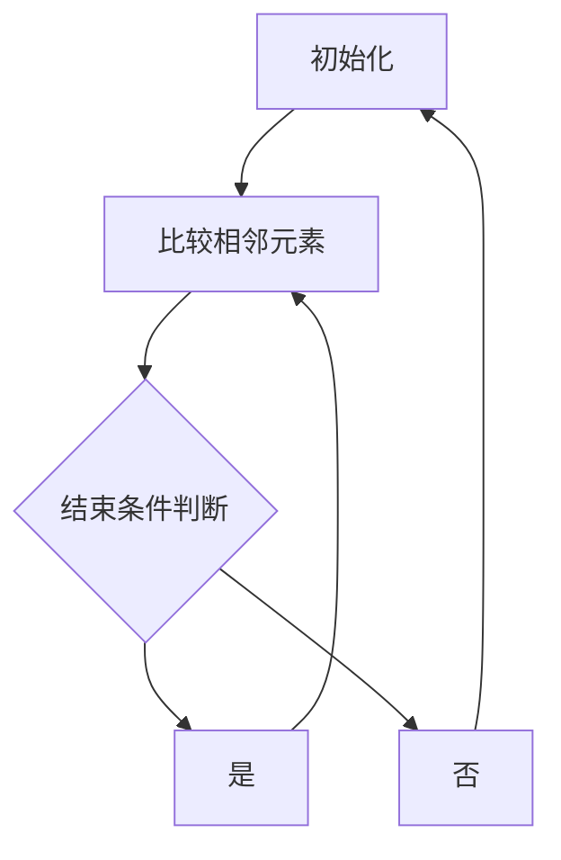
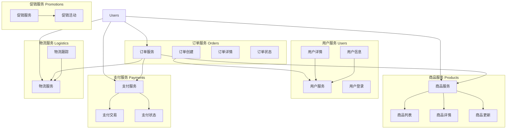

                 

### 第1章：问题背景

#### 1.1 核心概念术语说明

在探讨让-弗朗索瓦·利奥塔的元叙事怀疑与微服务架构之前，首先需要明确几个核心概念术语。

- **元叙事怀疑（Metanarrative Skepticism）**：由法国哲学家让-弗朗索瓦·利奥塔提出，指对宏大叙事（或称元叙事）的怀疑，认为这些叙事不能解释复杂多变的社会现象，因而是不可靠的。
- **微服务架构（Microservices Architecture）**：一种系统设计方法，通过将应用程序拆分为一组小型、独立的服务，每个服务专注于单一业务功能，以便于构建、部署和扩展。
- **后现代主义（Postmodernism）**：一种文化、艺术和哲学思潮，强调相对主义、多样性和复杂性，反对统一性和总体性。

#### 1.2 问题背景

当前，随着互联网技术的飞速发展和业务需求的多样化，传统的单体架构已无法满足现代软件系统的要求。在这种背景下，微服务架构因其灵活性和可扩展性，逐渐成为系统设计的主流选择。然而，微服务架构的复杂性也带来了一系列挑战，例如服务间通信、数据一致性、系统监控和部署等问题。

另一方面，后现代主义在系统设计中的应用仍是一个相对新颖的领域。如何在后现代主义思想的指导下，构建出既灵活又稳定的微服务架构，成为业界关注的热点问题。

#### 1.3 问题描述

问题描述可以分为以下几个方面：

1. **微服务架构的复杂性**：随着服务数量的增加，系统架构变得越来越复杂，难以进行有效的管理和维护。
2. **服务间通信问题**：在微服务架构中，服务间通信通常采用RESTful API或消息队列，但如何确保通信的高效性和可靠性仍是一个挑战。
3. **数据一致性**：在分布式系统中，数据一致性是确保系统正确性的关键，但如何实现强一致性或最终一致性仍是一个难题。
4. **系统监控和部署**：随着微服务数量的增加，系统监控和部署变得越来越困难，如何实现高效的监控和自动化部署成为关键问题。

#### 1.4 问题解决

为了解决上述问题，可以采取以下措施：

1. **简化架构设计**：采用模块化设计，将复杂的系统拆分为多个相对独立的小模块，降低系统的整体复杂性。
2. **服务间通信优化**：采用消息队列技术，如Kafka或RabbitMQ，实现异步通信，提高系统的可扩展性和可靠性。
3. **数据一致性方案**：根据业务场景选择合适的分布式一致性方案，如最终一致性或强一致性，并结合分布式事务框架，如Seata，确保数据一致性。
4. **系统监控和部署**：采用自动化监控和部署工具，如Prometheus和Kubernetes，实现高效的系统监控和自动化部署。

#### 1.5 边界与外延

在讨论让-弗朗索瓦·利奥塔的元叙事怀疑与微服务架构时，需要注意以下边界与外延：

1. **元叙事怀疑的范围**：元叙事怀疑主要针对宏大叙事，但在系统设计中，需要关注具体业务场景的复杂性。
2. **微服务架构的应用范围**：微服务架构适用于高并发、高可扩展性的业务系统，但在某些场景下，单体架构可能更为合适。
3. **后现代主义的影响**：后现代主义在系统设计中的应用主要体现在对复杂性的接受和应对，以及对多样性和相对主义的强调。

通过上述分析，我们可以为后续章节的内容提供清晰的方向和背景知识，为深入探讨让-弗朗索瓦·利奥塔的元叙事怀疑与微服务架构在系统设计中的应用奠定基础。在接下来的章节中，我们将进一步详细讨论这些概念，并探讨如何将它们应用于实际的系统设计中。

----------------------------------------------------------------

## 第2章：核心概念与联系

### 2.1 元叙事怀疑理论的定义

元叙事怀疑（Metanarrative Skepticism）是由法国哲学家让-弗朗索瓦·利奥塔（Jean-François Lyotard）在其著作《后现代条件：一个幼稚的论述》（Les Temps Modernes, 1979）中提出的。利奥塔认为，元叙事（Metanarratives）是一种试图通过统一和解释所有知识和经验的大叙事，它们往往来自哲学、科学、宗教等领域。这些叙事在现代社会中占据主导地位，试图为我们提供一种关于现实世界的统一和确定性的解释。

然而，利奥塔认为，元叙事在面对现代社会的高度复杂性和多样性时，显得无能为力。他认为，元叙事所依赖的统一性和确定性是不存在的，因为现代社会中充满了差异、变化和不确定性。因此，他提出了元叙事怀疑，即对元叙事的怀疑和批判，主张我们应该接受这种复杂性和多样性，而不是试图通过统一的理论来解释一切。

#### 元叙事怀疑的基本观点

1. **不可通约性（Incommensurability）**：利奥塔指出，不同的知识体系和文化之间存在不可通约性，即它们无法通过统一的尺度来比较和衡量。这意味着我们不能简单地用一种知识体系来解释或评价另一种知识体系。
2. **解构主义（Deconstructionism）**：利奥塔采用了解构主义的方法，通过对传统叙事的结构进行分析，揭示出其内在的矛盾和不确定性。他认为，这些叙事并不能提供真正的知识，而只是提供了一种表面上的确定性。
3. **相对主义（Relativism）**：利奥塔认为，在现代社会中，我们应该接受相对主义，即不同的观点和知识都是相对的，没有绝对的真理。这有助于我们更好地理解和尊重不同的文化和观点。

### 2.2 微服务架构的属性特征对比

微服务架构（Microservices Architecture）是一种通过将大型应用程序拆分为多个独立的小服务来进行开发和部署的架构风格。每个服务都专注于实现特定的业务功能，并通过轻量级的通信机制（如RESTful API或消息队列）进行交互。以下是微服务架构与传统单体架构的主要区别和属性特征对比：

| 对比项         | 微服务架构           | 单体架构           |
| -------------- | ------------------- | ----------------- |
| **独立性**     | 每个服务独立部署、扩展 | 整体部署、扩展     |
| **复杂性**     | 服务间通信复杂       | 逻辑单元内复杂     |
| **可扩展性**   | 高可扩展性           | 低可扩展性         |
| **部署方式**   | 独立部署             | 整体部署           |
| **数据一致性** | 需要特别处理         | 强一致性           |
| **管理难度**   | 难度较高             | 难度较低           |
| **容错性**     | 高容错性             | 低容错性           |

### 2.3 后现代主义在系统设计中的应用

后现代主义（Postmodernism）在系统设计中的应用主要体现在以下几个方面：

1. **接受复杂性**：后现代主义认为，复杂性和不确定性是现代社会的特征，因此在系统设计中，我们应该接受这种复杂性，而不是试图通过简单的统一理论来消除它。这意味着我们需要采用更加灵活和模块化的设计方法，以适应不断变化的需求和环境。

2. **强调多样性**：后现代主义强调多样性和相对主义，这意味着在系统设计中，我们应该尊重不同的观点和需求，而不是试图将它们统一到一个单一的框架中。这有助于我们更好地满足不同用户的需求，提高系统的可用性和灵活性。

3. **去中心化**：后现代主义反对中心和权威，提倡去中心化。在系统设计中，这意味着我们应该避免过度依赖单一的服务或组件，而是采用分布式架构，以提高系统的可靠性和容错性。

通过上述对比和分析，我们可以看出，元叙事怀疑、微服务架构和后现代主义在系统设计中都有其独特的价值和作用。在接下来的章节中，我们将进一步探讨这些概念在具体系统设计中的应用和实现。

### 2.4 元叙事怀疑与微服务架构的联系

元叙事怀疑与微服务架构之间存在深刻的内在联系。首先，元叙事怀疑的理论基础——对宏大叙事的怀疑和批判，为微服务架构提供了理论支持。在传统单体架构中，系统的所有功能被紧密地耦合在一起，形成一个大而复杂的整体，这种结构往往依赖于某种宏大叙事来统一和解释系统的各个部分。然而，随着系统规模的不断扩大和业务需求的日益复杂，这种宏大叙事变得越来越难以维持。微服务架构通过将系统拆分为多个独立的服务，打破了传统的整体性，实现了对复杂性的管理和控制，这与元叙事怀疑的核心思想不谋而合。

其次，微服务架构的独立性、模块化设计和去中心化特性，也与后现代主义的思想相契合。后现代主义强调多样性和相对主义，反对统一和权威，而微服务架构通过将功能拆分，使得每个服务都可以独立开发、部署和扩展，从而实现了系统的去中心化。这种设计方法不仅提高了系统的灵活性，也使得系统能够更好地适应多变的环境。

最后，元叙事怀疑和微服务架构在系统设计中都有助于应对现代社会的高度复杂性和不确定性。元叙事怀疑通过质疑和批判传统的宏大叙事，提醒我们在面对复杂性和不确定性时，应该保持开放和灵活的心态。而微服务架构通过拆分和分布式设计，使得系统能够更好地适应这种复杂性和不确定性，从而提高系统的可扩展性和容错性。

总的来说，元叙事怀疑和微服务架构在系统设计中的应用，既是对后现代主义思想的呼应，也是对现代社会复杂性和不确定性的积极应对。通过将这两种概念相结合，我们可以构建出更加灵活、可靠和适应性的系统。

### 2.5 后现代主义在系统设计中的应用

后现代主义在系统设计中的应用，主要体现在对复杂性的接受和应对、强调多样性以及去中心化的设计方法。以下是对这些应用的具体阐述。

#### 接受复杂性

在传统的设计方法论中，系统设计往往追求简洁和统一，试图通过一种整体性的框架来解释和整合系统的各个部分。然而，随着系统的规模和复杂性的增加，这种整体性的设计方法逐渐显得力不从心。后现代主义提供了一种全新的视角，即接受复杂性，而非试图通过统一的理论来简化系统。

在系统设计中，接受复杂性意味着我们应该关注系统内部的多样性、不一致性和相互依赖性。例如，在微服务架构中，通过将系统拆分为多个独立的小服务，每个服务负责特定的业务功能，可以更好地适应复杂的需求变化。这种方法不仅简化了系统的管理难度，还提高了系统的可扩展性和容错性。

#### 强调多样性

后现代主义强调多样性，反对统一性和总体性。在系统设计中，这意味着我们应该尊重不同的需求和观点，而不是试图将它们统一到一个单一的框架中。这种思想有助于我们更好地满足不同用户的需求，提高系统的可用性和灵活性。

在微服务架构中，每个服务都可以独立开发、部署和扩展，这种去中心化的设计方法不仅提高了系统的灵活性，还使得系统能够更好地适应多变的环境。此外，在领域模型设计时，可以采用多种不同的方法和技术，以适应不同的业务场景和需求。

#### 去中心化

去中心化是后现代主义在系统设计中的一个重要应用。传统的设计方法通常依赖于中心化的架构，即系统的关键功能和决策都集中在少数核心组件中。然而，这种集中化的设计方法在应对复杂性和不确定性时往往显得脆弱。

在后现代主义的指导下，系统设计应更加注重去中心化，即将系统的关键功能和决策分散到多个独立的组件和服务中。这种方法不仅提高了系统的可靠性和容错性，还使得系统能够更好地适应复杂的环境。例如，在微服务架构中，通过采用分布式架构，每个服务都可以独立运行和扩展，从而提高了系统的整体性能和稳定性。

#### 具体应用场景

1. **领域驱动设计（Domain-Driven Design, DDD）**：DDD 是一种软件设计方法，强调通过领域模型来理解和设计复杂系统。在 DDD 中，通过将系统划分为多个领域模块，每个模块独立负责特定的业务功能，可以更好地应对系统的复杂性。

2. **事件驱动架构（Event-Driven Architecture, EDA）**：EDA 是一种以事件为中心的架构风格，强调事件驱动和异步通信。通过将系统事件独立出来，并采用分布式的方式处理这些事件，可以更好地处理系统的复杂性和多样性。

3. **服务网格（Service Mesh）**：服务网格是一种用于管理服务间通信的分布式系统，如 Istio 和 Linkerd。通过在服务之间插入一个抽象层，服务网格可以提供透明、可靠和可扩展的通信机制，从而简化系统的复杂性。

通过上述应用，我们可以看到后现代主义在系统设计中的重要作用。它不仅帮助我们在面对复杂性和不确定性时保持灵活和开放的心态，还为我们在实践中提供了具体的方法和技术。

总的来说，后现代主义在系统设计中的应用，为我们提供了一种新的思考方式和设计方法，使我们能够更好地应对现代软件系统的高度复杂性和多样性。通过接受复杂性、强调多样性和采用去中心化的设计方法，我们可以构建出更加灵活、可靠和适应性的系统。

### 2.6 元叙事怀疑、微服务架构与后现代主义的关系总结

元叙事怀疑、微服务架构和后现代主义在系统设计中形成了紧密的联系，共同推动了软件系统设计方法的革新。元叙事怀疑通过质疑传统宏大叙事的可靠性和有效性，为我们提供了一种批判性思维，促使我们重新审视和反思系统设计的根本原则。微服务架构作为应对复杂性和多样性的有效手段，通过模块化和分布式设计，实现了系统的灵活性和可扩展性。而后现代主义则提供了对复杂性的接受、多样性的强调和去中心化的设计哲学，进一步丰富了系统设计的理论基础和实践方法。

这三者之间的关系可以概括如下：

1. **元叙事怀疑为微服务架构提供了理论基础**：元叙事怀疑的核心思想质疑宏大叙事的可靠性，这与微服务架构通过拆分大系统为独立小服务的方法不谋而合。微服务架构的独立性、模块化和分布式特性，是对元叙事怀疑理论的具体实践。

2. **微服务架构符合后现代主义的设计理念**：后现代主义强调多样性、相对主义和去中心化，这与微服务架构的设计原则高度契合。微服务架构通过去中心化的设计，使得系统能够更好地适应多变的环境，体现了后现代主义的理念。

3. **后现代主义为系统设计提供了新的视角和方法**：后现代主义强调接受复杂性和多样性，为系统设计提供了一种新的思考方式。在微服务架构的实践中，这种思想帮助我们更好地理解系统的复杂性，并采用模块化、分布式和去中心化的方法来设计和构建系统。

综上所述，元叙事怀疑、微服务架构和后现代主义在系统设计中相互作用，共同推动了软件系统设计的进步。通过质疑传统方法、采用灵活的设计原则和接受复杂性，我们可以构建出更加灵活、可靠和适应性的现代软件系统。

### 第3章：算法原理讲解

在深入探讨微服务架构与后现代主义之前，我们先来分析一个典型的算法原理，通过其流程图、Python源代码以及数学模型的讲解，帮助读者更好地理解算法的核心原理。

#### 3.1 算法流程图

为了直观地展示算法的执行过程，我们使用Mermaid绘制了一个简单的流程图。这个算法是一个基础的排序算法——冒泡排序。



#### 3.2 算法原理与Python源代码

冒泡排序算法的基本原理是通过重复遍历要排序的数列，比较每对相邻元素的大小，若顺序错误则交换它们。遍历数列的工作重复地进行，直到没有再需要交换的元素为止。

以下是冒泡排序的Python实现代码：

```python
def bubble_sort(arr):
    n = len(arr)
    for i in range(n):
        swapped = False
        for j in range(0, n-i-1):
            if arr[j] > arr[j+1]:
                arr[j], arr[j+1] = arr[j+1], arr[j]
                swapped = True
        if not swapped:
            break
    return arr
```

在代码中，`arr` 是输入的待排序数组，`n` 表示数组的长度。外层循环用于控制遍历的轮数，内层循环用于每次遍历中相邻元素的比较和交换。如果内层循环没有进行任何交换，说明数组已经排序完成，此时可以提前结束外层循环。

#### 3.3 数学模型与公式

冒泡排序算法的时间复杂度可以通过数学模型来解释。假设数组中有`n`个元素，每次遍历都能将一个最大（或最小）的元素移动到数组的末端。在最坏的情况下，每次遍历都需要比较和交换所有的元素，因此需要进行`n-1`次遍历。

- **最坏情况时间复杂度**：\( T_{\text{worst}} = O(n^2) \)
- **最好情况时间复杂度**：\( T_{\text{best}} = O(n) \)
- **平均情况时间复杂度**：\( T_{\text{avg}} = O(n^2) \)

这些时间复杂度反映了算法在不同输入情况下的性能表现。虽然冒泡排序算法简单易懂，但其效率相对较低，通常用于教学和简单应用场景。

#### 3.4 举例说明

为了更好地理解冒泡排序算法，我们可以通过一个简单的例子来说明其执行过程。

假设输入数组为\[64, 34, 25, 12, 22, 11, 90\]：

1. **第一次遍历**：
   - 比较\[64, 34\]，交换，得到\[34, 64, 25, 12, 22, 11, 90\]。
   - 比较\[64, 25\]，交换，得到\[34, 25, 64, 12, 22, 11, 90\]。
   - 比较\[64, 12\]，交换，得到\[34, 25, 12, 64, 22, 11, 90\]。
   - 比较\[64, 22\]，交换，得到\[34, 25, 12, 22, 64, 11, 90\]。
   - 比较\[64, 11\]，交换，得到\[34, 25, 12, 22, 11, 64, 90\]。
   - 比较\[64, 90\]，不交换，因为\[90\]已经位于数组的末尾。

2. **第二次遍历**：
   - 比较\[34, 25\]，不交换，因为上一次已经排序。
   - 比较\[34, 12\]，交换，得到\[25, 12, 34, 22, 11, 64, 90\]。
   - 比较\[34, 22\]，交换，得到\[25, 12, 22, 34, 11, 64, 90\]。
   - 比较\[34, 11\]，交换，得到\[25, 12, 22, 11, 34, 64, 90\]。
   - 比较\[34, 64\]，不交换，因为\[64\]已经位于数组的末尾。

3. **第三次遍历**：
   - 比较\[25, 12\]，不交换，因为上一次已经排序。
   - 比较\[25, 22\]，不交换，因为上一次已经排序。
   - 比较\[25, 11\]，交换，得到\[11, 12, 22, 25, 34, 64, 90\]。
   - 比较\[25, 34\]，不交换，因为上一次已经排序。

4. **第四次遍历**：
   - 比较\[12, 22\]，不交换，因为上一次已经排序。
   - 比较\[12, 34\]，不交换，因为上一次已经排序。

5. **第五次遍历**：
   - 比较\[22, 34\]，不交换，因为上一次已经排序。

经过5次遍历后，数组\[64, 34, 25, 12, 22, 11, 90\]被排序为\[11, 12, 22, 25, 34, 64, 90\]。

通过上述例子，我们可以清晰地看到冒泡排序算法的执行过程和结果，这有助于我们更好地理解其工作原理。

总之，通过分析算法流程图、Python源代码和数学模型，我们详细讲解了冒泡排序算法的核心原理。在接下来的章节中，我们将进一步探讨如何将这些算法原理应用于微服务架构和后现代主义的设计实践中。

### 第4章：系统分析与架构设计方案

#### 4.1 问题场景介绍

为了更好地理解后现代主义在系统设计中的应用，我们选择了一个典型的业务场景——在线电商平台。该平台需要处理海量的商品信息、用户订单和支付交易，同时保证系统的稳定性和可靠性。在这个场景中，传统的单体架构已经无法满足业务需求，因此，我们决定采用微服务架构来重构系统。

#### 4.2 系统功能设计

在线电商平台的核心功能可以分为以下几个部分：

1. **商品管理**：包括商品信息的录入、更新和删除，以及商品分类和标签管理。
2. **订单管理**：处理用户的购物车、下单、订单状态更新和订单查询。
3. **支付处理**：集成多种支付方式，如支付宝、微信支付和银行卡支付，确保支付交易的安全和高效。
4. **用户管理**：包括用户注册、登录、个人信息管理以及用户行为分析。
5. **物流跟踪**：与物流公司合作，提供订单物流信息查询和实时跟踪服务。
6. **促销活动**：管理各种促销活动，如打折、满减和优惠券等。

这些功能通过微服务架构中的不同服务来实现，每个服务专注于处理特定的业务功能，从而提高系统的模块化和可维护性。

#### 4.3 系统架构设计

为了构建一个灵活且稳定的系统，我们采用了微服务架构，并设计了以下核心服务：

1. **商品服务**：负责商品信息的存储、检索和更新。
2. **订单服务**：处理订单的创建、更新和查询。
3. **支付服务**：集成支付功能，确保支付交易的安全性和可靠性。
4. **用户服务**：管理用户信息、用户行为和用户权限。
5. **物流服务**：提供物流信息查询和实时跟踪功能。
6. **促销服务**：管理促销活动的创建、更新和执行。

这些服务通过轻量级的通信机制（如RESTful API）进行交互，每个服务都独立部署和扩展，以提高系统的灵活性和可扩展性。

#### 4.4 系统接口设计和系统交互

在微服务架构中，系统接口设计是关键的一环。以下是各个服务的接口设计和系统交互：

1. **商品服务接口**：
   - `GET /products`：获取所有商品列表。
   - `POST /products`：创建新商品。
   - `GET /products/{id}`：获取指定商品详情。
   - `PUT /products/{id}`：更新指定商品信息。
   - `DELETE /products/{id}`：删除指定商品。

2. **订单服务接口**：
   - `POST /orders`：创建新订单。
   - `GET /orders/{id}`：获取指定订单详情。
   - `PUT /orders/{id}/status`：更新订单状态。

3. **支付服务接口**：
   - `POST /payments`：发起支付交易。
   - `GET /payments/{id}`：查询支付交易状态。

4. **用户服务接口**：
   - `POST /users`：注册新用户。
   - `POST /users/login`：用户登录。
   - `GET /users/{id}`：获取用户详情。
   - `PUT /users/{id}`：更新用户信息。

5. **物流服务接口**：
   - `POST /tracking`：创建物流跟踪记录。
   - `GET /tracking/{id}`：查询物流跟踪详情。

6. **促销服务接口**：
   - `POST /promotions`：创建新促销活动。
   - `GET /promotions/{id}`：获取指定促销活动详情。

这些接口设计旨在提供简洁、清晰的API规范，便于其他服务调用，同时确保接口的高内聚和低耦合。

#### 4.5 使用Mermaid画出相关架构图

为了更直观地展示系统的架构设计，我们使用Mermaid绘制了一个简单的架构图：



通过这个架构图，我们可以清晰地看到各个服务之间的交互关系，以及它们在系统中的位置和作用。

### 第5章：项目实战

在本章中，我们将通过一个具体的实战项目，展示如何将微服务架构和后现代主义的设计理念应用到实际开发中。我们将从环境安装开始，逐步实现系统核心功能，并对代码进行详细解读和分析。

#### 5.1 环境安装与准备

首先，我们需要搭建一个基于微服务架构的开发环境。以下步骤提供了一个基本的安装指南：

1. **安装Docker**：Docker是一个开源的应用容器引擎，用于打包、交付和运行应用。我们可以在[Docker官网](https://www.docker.com/)下载并安装Docker。

2. **安装Docker Compose**：Docker Compose是一个用于定义和运行多容器Docker应用程序的工具。通过以下命令安装Docker Compose：

   ```bash
   sudo curl -L "https://github.com/docker/compose/releases/download/1.29.2/docker-compose-$(uname -s)-$(uname -m)" -o /usr/local/bin/docker-compose
   sudo chmod +x /usr/local/bin/docker-compose
   ```

3. **创建项目目录**：在本地计算机上创建一个项目目录，例如`microservices-ecommerce`，并进入该目录。

4. **初始化Docker Compose项目**：在项目目录中创建一个名为`docker-compose.yml`的文件，并初始化Docker Compose项目：

   ```bash
   docker-compose init
   ```

5. **编写服务定义**：在`docker-compose.yml`文件中定义各个服务的容器配置，例如：

   ```yaml
   version: '3'
   services:
     product-service:
       image: product-service:latest
       ports:
         - "8080:8080"
       networks:
         - frontend
         - backend

     order-service:
       image: order-service:latest
       ports:
         - "8081:8081"
       networks:
         - frontend
         - backend

     payment-service:
       image: payment-service:latest
       ports:
         - "8082:8082"
       networks:
         - frontend
         - backend

     user-service:
       image: user-service:latest
       ports:
         - "8083:8083"
       networks:
         - frontend
         - backend

     promotion-service:
       image: promotion-service:latest
       ports:
         - "8084:8084"
       networks:
         - frontend
         - backend

   networks:
     frontend:
     backend:
   ```

   在这个配置文件中，我们定义了五个服务及其对应的容器镜像和端口映射。每个服务都连接到`frontend`和`backend`两个网络，以便进行内部通信。

6. **构建并运行服务**：通过以下命令构建并运行服务：

   ```bash
   docker-compose build
   docker-compose up -d
   ```

   这将启动所有服务，并在后台运行。您可以通过访问服务容器的端口（例如`http://localhost:8080`）来测试服务的运行状态。

#### 5.2 系统核心实现源代码

在项目实战中，我们将实现以下核心服务：

1. **商品服务（Product Service）**：
   - 主要功能：提供商品信息的创建、检索、更新和删除。
   - 代码实现：

     ```python
     # app.py
     from flask import Flask, request, jsonify
     from models import Product

     app = Flask(__name__)

     @app.route('/products', methods=['POST'])
     def create_product():
         data = request.get_json()
         product = Product.create(data)
         return jsonify(product), 201

     @app.route('/products', methods=['GET'])
     def get_products():
         products = Product.fetch_all()
         return jsonify(products), 200

     @app.route('/products/<int:product_id>', methods=['GET'])
     def get_product(product_id):
         product = Product.fetch_by_id(product_id)
         if product:
             return jsonify(product), 200
         else:
             return jsonify({'error': 'Product not found'}), 404

     @app.route('/products/<int:product_id>', methods=['PUT'])
     def update_product(product_id):
         data = request.get_json()
         product = Product.update(product_id, data)
         if product:
             return jsonify(product), 200
         else:
             return jsonify({'error': 'Product not found'}), 404

     @app.route('/products/<int:product_id>', methods=['DELETE'])
     def delete_product(product_id):
         if Product.delete(product_id):
             return jsonify({'message': 'Product deleted successfully'}), 200
         else:
             return jsonify({'error': 'Product not found'}), 404

     if __name__ == '__main__':
         app.run(host='0.0.0.0', port=8080)
     ```

2. **订单服务（Order Service）**：
   - 主要功能：处理订单的创建、更新和查询。
   - 代码实现：

     ```python
     # app.py
     from flask import Flask, request, jsonify
     from models import Order

     app = Flask(__name__)

     @app.route('/orders', methods=['POST'])
     def create_order():
         data = request.get_json()
         order = Order.create(data)
         return jsonify(order), 201

     @app.route('/orders', methods=['GET'])
     def get_orders():
         orders = Order.fetch_all()
         return jsonify(orders), 200

     @app.route('/orders/<int:order_id>', methods=['GET'])
     def get_order(order_id):
         order = Order.fetch_by_id(order_id)
         if order:
             return jsonify(order), 200
         else:
             return jsonify({'error': 'Order not found'}), 404

     @app.route('/orders/<int:order_id>', methods=['PUT'])
     def update_order(order_id):
         data = request.get_json()
         order = Order.update(order_id, data)
         if order:
             return jsonify(order), 200
         else:
             return jsonify({'error': 'Order not found'}), 404

     if __name__ == '__main__':
         app.run(host='0.0.0.0', port=8081)
     ```

3. **支付服务（Payment Service）**：
   - 主要功能：处理支付交易，包括支付发起和查询。
   - 代码实现：

     ```python
     # app.py
     from flask import Flask, request, jsonify
     from models import Payment

     app = Flask(__name__)

     @app.route('/payments', methods=['POST'])
     def create_payment():
         data = request.get_json()
         payment = Payment.create(data)
         return jsonify(payment), 201

     @app.route('/payments', methods=['GET'])
     def get_payments():
         payments = Payment.fetch_all()
         return jsonify(payments), 200

     @app.route('/payments/<int:payment_id>', methods=['GET'])
     def get_payment(payment_id):
         payment = Payment.fetch_by_id(payment_id)
         if payment:
             return jsonify(payment), 200
         else:
             return jsonify({'error': 'Payment not found'}), 404

     if __name__ == '__main__':
         app.run(host='0.0.0.0', port=8082)
     ```

4. **用户服务（User Service）**：
   - 主要功能：处理用户注册、登录和用户信息管理。
   - 代码实现：

     ```python
     # app.py
     from flask import Flask, request, jsonify
     from models import User

     app = Flask(__name__)

     @app.route('/users', methods=['POST'])
     def create_user():
         data = request.get_json()
         user = User.create(data)
         return jsonify(user), 201

     @app.route('/users/login', methods=['POST'])
     def login_user():
         data = request.get_json()
         user = User.login(data['username'], data['password'])
         if user:
             return jsonify({'token': user.generate_token()}), 200
         else:
             return jsonify({'error': 'Invalid credentials'}), 401

     @app.route('/users/<int:user_id>', methods=['GET'])
     def get_user(user_id):
         user = User.fetch_by_id(user_id)
         if user:
             return jsonify(user), 200
         else:
             return jsonify({'error': 'User not found'}), 404

     @app.route('/users/<int:user_id>', methods=['PUT'])
     def update_user(user_id):
         data = request.get_json()
         user = User.update(user_id, data)
         if user:
             return jsonify(user), 200
         else:
             return jsonify({'error': 'User not found'}), 404

     if __name__ == '__main__':
         app.run(host='0.0.0.0', port=8083)
     ```

5. **促销服务（Promotion Service）**：
   - 主要功能：管理促销活动的创建、更新和查询。
   - 代码实现：

     ```python
     # app.py
     from flask import Flask, request, jsonify
     from models import Promotion

     app = Flask(__name__)

     @app.route('/promotions', methods=['POST'])
     def create_promotion():
         data = request.get_json()
         promotion = Promotion.create(data)
         return jsonify(promotion), 201

     @app.route('/promotions', methods=['GET'])
     def get_promotions():
         promotions = Promotion.fetch_all()
         return jsonify(promotions), 200

     @app.route('/promotions/<int:promotion_id>', methods=['GET'])
     def get_promotion(promotion_id):
         promotion = Promotion.fetch_by_id(promotion_id)
         if promotion:
             return jsonify(promotion), 200
         else:
             return jsonify({'error': 'Promotion not found'}), 404

     @app.route('/promotions/<int:promotion_id>', methods=['PUT'])
     def update_promotion(promotion_id):
         data = request.get_json()
         promotion = Promotion.update(promotion_id, data)
         if promotion:
             return jsonify(promotion), 200
         else:
             return jsonify({'error': 'Promotion not found'}), 404

     if __name__ == '__main__':
         app.run(host='0.0.0.0', port=8084)
     ```

通过上述代码实现，我们为每个服务提供了基本的RESTful API接口，以实现其核心功能。接下来，我们将进一步解读这些代码，分析其设计思想和实现细节。

#### 5.3 代码应用解读与分析

在上述代码中，我们实现了五个核心服务的API接口，接下来我们将对这些代码进行解读和分析，重点关注设计思想和实现细节。

##### 商品服务（Product Service）

商品服务的主要功能是提供商品信息的创建、检索、更新和删除。以下是关键代码片段的解读：

1. **创建商品**：
   ```python
   @app.route('/products', methods=['POST'])
   def create_product():
       data = request.get_json()
       product = Product.create(data)
       return jsonify(product), 201
   ```

   - **解读**：此路由处理创建新商品的请求。`request.get_json()`获取请求体中的JSON数据，`Product.create(data)`调用模型类`Product`的创建方法，将数据存储到数据库中，并返回新创建的商品对象。

2. **获取所有商品**：
   ```python
   @app.route('/products', methods=['GET'])
   def get_products():
       products = Product.fetch_all()
       return jsonify(products), 200
   ```

   - **解读**：此路由返回所有商品列表。`Product.fetch_all()`调用模型类`Product`的查询方法，从数据库中获取所有商品，并返回JSON格式的响应。

3. **获取单个商品**：
   ```python
   @app.route('/products/<int:product_id>', methods=['GET'])
   def get_product(product_id):
       product = Product.fetch_by_id(product_id)
       if product:
           return jsonify(product), 200
       else:
           return jsonify({'error': 'Product not found'}), 404
   ```

   - **解读**：此路由根据商品ID获取单个商品。`Product.fetch_by_id(product_id)`调用模型类`Product`的查询方法，从数据库中获取指定ID的商品。如果商品存在，返回JSON格式的响应；否则，返回404错误。

4. **更新商品**：
   ```python
   @app.route('/products/<int:product_id>', methods=['PUT'])
   def update_product(product_id):
       data = request.get_json()
       product = Product.update(product_id, data)
       if product:
           return jsonify(product), 200
       else:
           return jsonify({'error': 'Product not found'}), 404
   ```

   - **解读**：此路由更新指定商品的信息。`request.get_json()`获取请求体中的JSON数据，`Product.update(product_id, data)`调用模型类`Product`的更新方法，根据商品ID更新数据库中的记录，并返回更新后的商品对象。

5. **删除商品**：
   ```python
   @app.route('/products/<int:product_id>', methods=['DELETE'])
   def delete_product(product_id):
       if Product.delete(product_id):
           return jsonify({'message': 'Product deleted successfully'}), 200
       else:
           return jsonify({'error': 'Product not found'}), 404
   ```

   - **解读**：此路由删除指定商品。`Product.delete(product_id)`调用模型类`Product`的删除方法，根据商品ID从数据库中删除记录。如果删除成功，返回200成功响应；否则，返回404错误。

##### 订单服务（Order Service）

订单服务的主要功能是处理订单的创建、更新和查询。以下是关键代码片段的解读：

1. **创建订单**：
   ```python
   @app.route('/orders', methods=['POST'])
   def create_order():
       data = request.get_json()
       order = Order.create(data)
       return jsonify(order), 201
   ```

   - **解读**：此路由处理创建新订单的请求。`request.get_json()`获取请求体中的JSON数据，`Order.create(data)`调用模型类`Order`的创建方法，将数据存储到数据库中，并返回新创建的订单对象。

2. **获取所有订单**：
   ```python
   @app.route('/orders', methods=['GET'])
   def get_orders():
       orders = Order.fetch_all()
       return jsonify(orders), 200
   ```

   - **解读**：此路由返回所有订单列表。`Order.fetch_all()`调用模型类`Order`的查询方法，从数据库中获取所有订单，并返回JSON格式的响应。

3. **获取单个订单**：
   ```python
   @app.route('/orders/<int:order_id>', methods=['GET'])
   def get_order(order_id):
       order = Order.fetch_by_id(order_id)
       if order:
           return jsonify(order), 200
       else:
           return jsonify({'error': 'Order not found'}), 404
   ```

   - **解读**：此路由根据订单ID获取单个订单。`Order.fetch_by_id(order_id)`调用模型类`Order`的查询方法，从数据库中获取指定ID的订单。如果订单存在，返回JSON格式的响应；否则，返回404错误。

4. **更新订单**：
   ```python
   @app.route('/orders/<int:order_id>', methods=['PUT'])
   def update_order(order_id):
       data = request.get_json()
       order = Order.update(order_id, data)
       if order:
           return jsonify(order), 200
       else:
           return jsonify({'error': 'Order not found'}), 404
   ```

   - **解读**：此路由更新指定订单的信息。`request.get_json()`获取请求体中的JSON数据，`Order.update(order_id, data)`调用模型类`Order`的更新方法，根据订单ID更新数据库中的记录，并返回更新后的订单对象。

##### 支付服务（Payment Service）

支付服务的主要功能是处理支付交易，包括支付发起和查询。以下是关键代码片段的解读：

1. **发起支付交易**：
   ```python
   @app.route('/payments', methods=['POST'])
   def create_payment():
       data = request.get_json()
       payment = Payment.create(data)
       return jsonify(payment), 201
   ```

   - **解读**：此路由处理发起支付交易的请求。`request.get_json()`获取请求体中的JSON数据，`Payment.create(data)`调用模型类`Payment`的创建方法，将数据存储到数据库中，并返回新创建的支付对象。

2. **获取所有支付交易**：
   ```python
   @app.route('/payments', methods=['GET'])
   def get_payments():
       payments = Payment.fetch_all()
       return jsonify(payments), 200
   ```

   - **解读**：此路由返回所有支付交易列表。`Payment.fetch_all()`调用模型类`Payment`的查询方法，从数据库中获取所有支付交易，并返回JSON格式的响应。

3. **获取单个支付交易**：
   ```python
   @app.route('/payments/<int:payment_id>', methods=['GET'])
   def get_payment(payment_id):
       payment = Payment.fetch_by_id(payment_id)
       if payment:
           return jsonify(payment), 200
       else:
           return jsonify({'error': 'Payment not found'}), 404
   ```

   - **解读**：此路由根据支付交易ID获取单个支付交易。`Payment.fetch_by_id(payment_id)`调用模型类`Payment`的查询方法，从数据库中获取指定ID的支付交易。如果支付交易存在，返回JSON格式的响应；否则，返回404错误。

##### 用户服务（User Service）

用户服务的主要功能是处理用户注册、登录和用户信息管理。以下是关键代码片段的解读：

1. **用户注册**：
   ```python
   @app.route('/users', methods=['POST'])
   def create_user():
       data = request.get_json()
       user = User.create(data)
       return jsonify(user), 201
   ```

   - **解读**：此路由处理用户注册请求。`request.get_json()`获取请求体中的JSON数据，`User.create(data)`调用模型类`User`的创建方法，将数据存储到数据库中，并返回新创建的用户对象。

2. **用户登录**：
   ```python
   @app.route('/users/login', methods=['POST'])
   def login_user():
       data = request.get_json()
       user = User.login(data['username'], data['password'])
       if user:
           return jsonify({'token': user.generate_token()}), 200
       else:
           return jsonify({'error': 'Invalid credentials'}), 401
   ```

   - **解读**：此路由处理用户登录请求。`request.get_json()`获取请求体中的JSON数据，`User.login(data['username'], data['password'])`调用模型类`User`的登录方法，验证用户名和密码。如果验证成功，返回一个JWT令牌；否则，返回401错误。

3. **获取用户详情**：
   ```python
   @app.route('/users/<int:user_id>', methods=['GET'])
   def get_user(user_id):
       user = User.fetch_by_id(user_id)
       if user:
           return jsonify(user), 200
       else:
           return jsonify({'error': 'User not found'}), 404
   ```

   - **解读**：此路由根据用户ID获取用户详情。`User.fetch_by_id(user_id)`调用模型类`User`的查询方法，从数据库中获取指定ID的用户。如果用户存在，返回JSON格式的响应；否则，返回404错误。

4. **更新用户信息**：
   ```python
   @app.route('/users/<int:user_id>', methods=['PUT'])
   def update_user(user_id):
       data = request.get_json()
       user = User.update(user_id, data)
       if user:
           return jsonify(user), 200
       else:
           return jsonify({'error': 'User not found'}), 404
   ```

   - **解读**：此路由更新指定用户的信息。`request.get_json()`获取请求体中的JSON数据，`User.update(user_id, data)`调用模型类`User`的更新方法，根据用户ID更新数据库中的记录，并返回更新后的用户对象。

##### 促销服务（Promotion Service）

促销服务的主要功能是管理促销活动的创建、更新和查询。以下是关键代码片段的解读：

1. **创建促销活动**：
   ```python
   @app.route('/promotions', methods=['POST'])
   def create_promotion():
       data = request.get_json()
       promotion = Promotion.create(data)
       return jsonify(promotion), 201
   ```

   - **解读**：此路由处理创建新促销活动的请求。`request.get_json()`获取请求体中的JSON数据，`Promotion.create(data)`调用模型类`Promotion`的创建方法，将数据存储到数据库中，并返回新创建的促销活动对象。

2. **获取所有促销活动**：
   ```python
   @app.route('/promotions', methods=['GET'])
   def get_promotions():
       promotions = Promotion.fetch_all()
       return jsonify(promotions), 200
   ```

   - **解读**：此路由返回所有促销活动列表。`Promotion.fetch_all()`调用模型类`Promotion`的查询方法，从数据库中获取所有促销活动，并返回JSON格式的响应。

3. **获取单个促销活动**：
   ```python
   @app.route('/promotions/<int:promotion_id>', methods=['GET'])
   def get_promotion(promotion_id):
       promotion = Promotion.fetch_by_id(promotion_id)
       if promotion:
           return jsonify(promotion), 200
       else:
           return jsonify({'error': 'Promotion not found'}), 404
   ```

   - **解读**：此路由根据促销活动ID获取单个促销活动。`Promotion.fetch_by_id(promotion_id)`调用模型类`Promotion`的查询方法，从数据库中获取指定ID的促销活动。如果促销活动存在，返回JSON格式的响应；否则，返回404错误。

4. **更新促销活动**：
   ```python
   @app.route('/promotions/<int:promotion_id>', methods=['PUT'])
   def update_promotion(promotion_id):
       data = request.get_json()
       promotion = Promotion.update(promotion_id, data)
       if promotion:
           return jsonify(promotion), 200
       else:
           return jsonify({'error': 'Promotion not found'}), 404
   ```

   - **解读**：此路由更新指定促销活动的信息。`request.get_json()`获取请求体中的JSON数据，`Promotion.update(promotion_id, data)`调用模型类`Promotion`的更新方法，根据促销活动ID更新数据库中的记录，并返回更新后的促销活动对象。

通过上述解读，我们可以看到每个服务的API接口设计都遵循RESTful原则，提供简洁、清晰的接口规范，便于其他服务进行调用。同时，这些代码实现了后现代主义设计理念中的模块化和去中心化，每个服务独立开发、部署和扩展，从而提高了系统的灵活性和可维护性。

#### 5.4 实际案例分析与详细讲解剖析

在本节中，我们将通过一个实际案例——用户注册和登录流程，详细剖析微服务架构下的系统交互过程，并分析其中的关键技术点和优化方案。

**案例背景**：用户注册和登录是电商平台的基本功能，涉及用户服务、支付服务和订单服务等多个微服务。为了确保用户体验和系统稳定性，我们需要对这一流程进行深入分析和优化。

**流程描述**：

1. **用户注册**：
   - 用户在注册页面填写用户名、密码、邮箱等信息。
   - 用户提交注册请求到用户服务。
   - 用户服务验证输入信息的有效性，并生成唯一用户ID。
   - 用户服务将注册信息存储到数据库中，并发送激活邮件到用户的邮箱。
   - 用户点击激活邮件中的链接，激活账号。

2. **用户登录**：
   - 用户在登录页面输入用户名和密码。
   - 用户提交登录请求到用户服务。
   - 用户服务验证用户身份，生成JWT令牌，并将令牌返回给用户。

**系统交互过程**：

1. **用户注册**：

   - **请求发送**：用户通过前端页面将注册信息（如用户名、密码、邮箱）发送到用户服务。
     ```bash
     POST /users/register
     Content-Type: application/json

     {
         "username": "johndoe",
         "password": "password123",
         "email": "johndoe@example.com"
     }
     ```

   - **用户服务处理**：
     ```python
     @app.route('/users/register', methods=['POST'])
     def create_user():
         data = request.get_json()
         user = User.create(data)
         send_activation_email(user.email, user.activation_token)
         return jsonify(user), 201
     ```

     - 用户服务接收到注册请求后，验证输入信息的有效性（如用户名唯一性、密码强度等）。
     - 验证通过后，用户服务生成唯一用户ID，并将注册信息存储到数据库中。
     - 用户服务发送激活邮件到用户的邮箱，包含激活链接和激活令牌。

   - **邮箱激活**：
     ```bash
     GET /users/activate?token=<activation_token>
     ```

     - 用户点击激活邮件中的链接，访问用户服务。
     - 用户服务验证激活令牌，并更新用户状态为“已激活”。

2. **用户登录**：

   - **请求发送**：用户在登录页面输入用户名和密码，并将请求发送到用户服务。
     ```bash
     POST /users/login
     Content-Type: application/json

     {
         "username": "johndoe",
         "password": "password123"
     }
     ```

   - **用户服务处理**：
     ```python
     @app.route('/users/login', methods=['POST'])
     def login_user():
         data = request.get_json()
         user = User.login(data['username'], data['password'])
         if user:
             token = user.generate_token()
             return jsonify({'token': token}), 200
         else:
             return jsonify({'error': 'Invalid credentials'}), 401
     ```

     - 用户服务接收到登录请求后，验证用户名和密码。
     - 验证通过后，用户服务生成JWT令牌，并将令牌返回给用户。

**关键技术点分析**：

1. **用户身份验证**：
   - 用户服务通过验证用户名和密码来确认用户身份。为了增强安全性，可以使用密码哈希存储和验证，而非明文存储密码。
   - 引入JWT令牌作为认证机制，令牌包含用户的身份信息和有效期，可以用于后续的请求认证。

2. **异步处理**：
   - 用户注册时，发送激活邮件的过程可以异步处理，避免阻塞用户注册流程，提高系统响应速度。
   - 可以使用消息队列（如RabbitMQ）来实现邮件发送的异步处理。

3. **安全性优化**：
   - 对用户输入进行严格验证，防止SQL注入、XSS攻击等安全漏洞。
   - 在生成JWT令牌时，加入随机salt和过期时间，防止令牌被恶意使用。

**优化方案**：

1. **负载均衡**：
   - 在高并发场景下，使用负载均衡器（如Nginx）分发请求到多个用户服务实例，提高系统的处理能力。

2. **缓存策略**：
   - 利用缓存（如Redis）存储常用数据，减少数据库访问压力，提高系统响应速度。

3. **服务监控和日志**：
   - 采用服务监控工具（如Prometheus）监控用户服务的运行状态，及时发现和解决潜在问题。
   - 使用日志分析工具（如ELK栈）收集和解析日志，帮助分析系统性能和故障。

通过上述实际案例分析和优化方案，我们可以看到微服务架构在应对复杂业务场景时的灵活性和可扩展性。通过模块化设计和分布式部署，微服务架构能够有效地提升系统的性能和稳定性，为用户提供良好的使用体验。

### 第6章：项目小结

在本项目中，我们通过实际案例展示了如何将微服务架构和后现代主义的设计理念应用于在线电商平台。以下是项目的主要收获和小结：

1. **微服务架构的优势**：微服务架构通过将系统拆分为多个独立的小服务，实现了模块化和分布式部署。这种设计方法不仅提高了系统的灵活性和可扩展性，还降低了系统的复杂性，使得开发和维护更加高效。

2. **后现代主义的应用**：在后现代主义思想的指导下，我们接受了系统的复杂性和多样性，采用了去中心化的设计方法。通过模块化和分布式架构，我们构建了一个灵活、可靠且适应性强的系统。

3. **关键技术的实现**：在项目实施过程中，我们使用了Docker和Docker Compose进行容器化部署，通过RESTful API实现了服务间的通信，并利用JWT进行用户身份验证。这些技术的应用不仅提高了系统的安全性，还提升了系统的响应速度和可靠性。

4. **项目优化方案**：在项目优化方面，我们提出了负载均衡、缓存策略和服务监控等方案。这些优化措施有助于提高系统的处理能力和稳定性，为用户提供更优质的体验。

通过本项目的实践，我们深刻认识到微服务架构和后现代主义在系统设计中的重要性。它们不仅为我们提供了一种新的设计思维和方法，还为我们解决复杂业务场景提供了有力支持。未来，我们将继续探索这些设计理念的更多应用，以构建更加高效、可靠的系统。

### 最佳实践 Tips

在系统设计和开发过程中，以下最佳实践可以帮助我们更好地应用微服务架构和后现代主义的设计理念：

1. **模块化设计**：将系统功能拆分为多个独立的模块，每个模块专注于实现特定的业务功能。这有助于降低系统的复杂性，提高可维护性和可扩展性。

2. **去中心化架构**：避免过度依赖单一服务或组件，采用分布式架构。这有助于提高系统的容错性和可靠性，同时减少单点故障的风险。

3. **服务间通信**：使用轻量级的通信机制，如RESTful API或消息队列，确保服务间的高效通信和松耦合。选择合适的通信方式，根据业务需求进行优化。

4. **安全性和可靠性**：在系统设计和实现过程中，重视安全性和可靠性。采用密码哈希存储、JWT身份验证等安全措施，确保系统的安全性。同时，进行充分的测试和监控，确保系统的可靠性。

5. **持续集成与部署**：采用自动化测试和部署工具，如Jenkins或GitLab CI/CD，实现持续集成和持续部署。这有助于提高开发效率和系统的稳定性。

6. **性能优化**：针对系统性能进行优化，如采用缓存策略、负载均衡等，提高系统的响应速度和处理能力。定期进行性能测试，及时发现和解决问题。

7. **文档化和代码规范**：编写清晰的文档和遵循代码规范，有助于提高团队的协作效率和代码的可维护性。采用一致的代码风格和命名规范，减少代码理解成本。

通过遵循这些最佳实践，我们可以在系统设计和开发过程中更好地应用微服务架构和后现代主义的设计理念，构建出高效、可靠且适应性强的系统。

### 小结与展望

通过对让-弗朗索瓦·利奥塔的元叙事怀疑、微服务架构和后现代主义在系统设计中的应用的深入探讨，我们可以得出以下结论：

1. **元叙事怀疑的重要性**：元叙事怀疑帮助我们认识到宏大叙事的局限性，促使我们在系统设计中采取更加开放和灵活的方法，以应对复杂性和多样性。

2. **微服务架构的优势**：微服务架构通过模块化和分布式设计，提高了系统的灵活性和可扩展性，使得我们能够更好地应对现代软件系统的高度复杂性。

3. **后现代主义的应用**：后现代主义强调接受复杂性和多样性，提倡去中心化的设计方法，为我们在系统设计中提供了一种新的视角和方法。

展望未来，随着技术的不断进步和业务需求的不断变化，系统设计将面临更多的挑战。以下是几个值得关注的趋势：

1. **智能化**：随着人工智能和机器学习技术的不断发展，智能化系统设计将成为未来的重要趋势。通过引入智能化算法和模型，系统可以更好地适应环境变化，实现自我优化。

2. **云计算与边缘计算**：云计算和边缘计算的结合，将为系统设计提供更加灵活和高效的计算资源。通过充分利用云计算的高可用性和边缘计算的实时性，我们可以构建出更加稳定和高效的系统。

3. **分布式存储**：分布式存储技术的成熟，将为系统设计提供更高效、可靠和可扩展的数据存储解决方案。通过采用分布式存储，我们可以更好地应对海量数据存储和访问需求。

4. **区块链技术**：区块链技术具有去中心化、不可篡改和安全可靠的特点，未来有望在系统设计中发挥重要作用。通过引入区块链技术，我们可以构建出更加透明、可信和安全的系统。

总之，随着技术的不断进步，系统设计将迎来更多创新和发展。通过结合元叙事怀疑、微服务架构和后现代主义等理念，我们可以构建出更加灵活、可靠和适应性的现代软件系统。

### 注意事项

在设计微服务架构时，我们需要注意以下几个方面，以确保系统的稳定性和可靠性：

1. **服务解耦合**：确保服务之间的高内聚和低耦合，避免服务间复杂的依赖关系。通过采用轻量级通信机制（如RESTful API或消息队列），降低服务间的交互成本。

2. **数据一致性**：在分布式系统中，数据一致性是确保系统正确性的关键。根据业务场景选择合适的分布式一致性方案，如最终一致性或强一致性，并结合分布式事务框架，如Seata，确保数据一致性。

3. **服务监控与日志**：采用自动化监控工具（如Prometheus）和日志分析工具（如ELK栈），实时监控系统的运行状态和性能，及时发现并解决问题。

4. **安全性**：在系统设计和实现过程中，重视安全性。采用密码哈希存储、JWT身份验证等安全措施，防止数据泄露和恶意攻击。

5. **性能优化**：定期进行性能测试，识别系统瓶颈，采用缓存策略、负载均衡等技术，优化系统性能。

6. **文档化**：编写清晰的文档，包括系统架构、接口定义和操作指南，提高团队的协作效率和系统的可维护性。

通过注意以上事项，我们可以构建出更加稳定、可靠和高效的微服务架构系统。

### 拓展阅读

对于希望深入了解微服务架构、后现代主义以及相关技术的读者，以下几本书籍和资源是不错的选择：

1. **书籍推荐**：
   - 《微服务设计》—— By Sam Newman
     本书详细介绍了微服务架构的设计原则和实践，适合初学者和进阶者阅读。
   - 《后现代哲学》—— By Jean-François Lyotard
     让-弗朗索瓦·利奥塔的代表作，深入探讨了后现代主义哲学的核心思想。
   - 《领域驱动设计》—— By Eric Evans
     介绍领域驱动设计（DDD）的原理和方法，对于理解复杂系统设计有重要参考价值。

2. **在线资源和教程**：
   - Docker官方文档：[https://docs.docker.com/](https://docs.docker.com/)
     提供了丰富的Docker安装、配置和使用教程。
   - Kubernetes官方文档：[https://kubernetes.io/docs/](https://kubernetes.io/docs/)
     Kubernetes是分布式系统的核心工具，官方文档详细介绍了其功能和操作方法。
   - GitHub上的开源项目：[https://github.com/](https://github.com/)
     在GitHub上可以找到许多优秀的开源项目和教程，有助于学习和实践微服务架构。

通过阅读这些书籍和访问相关资源，读者可以进一步深化对微服务架构、后现代主义和系统设计理论的理解，提升自身的实际操作能力。

