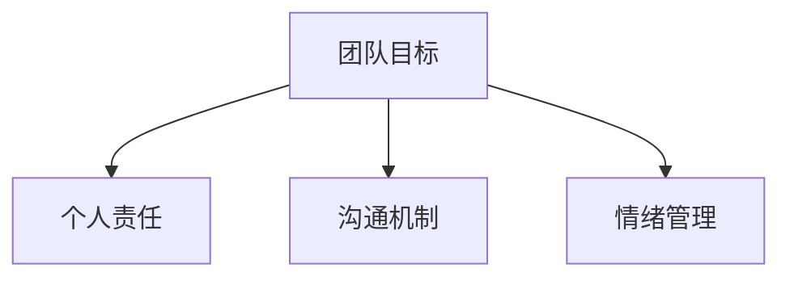
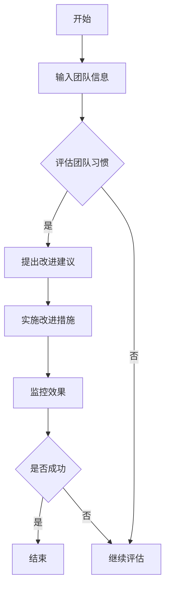
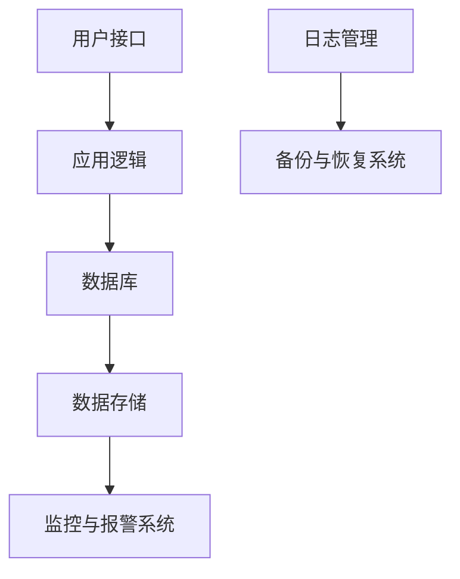
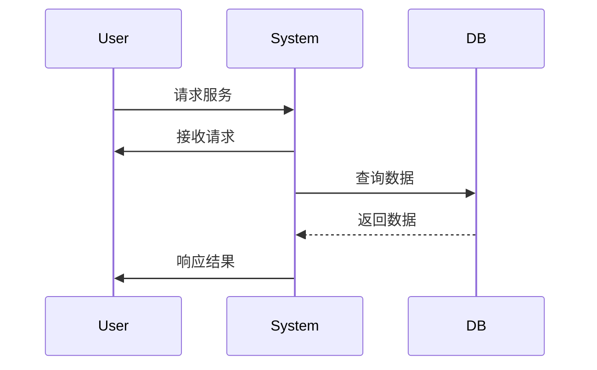

                 

## 让队友失败的坏习惯

### 关键词
- 团队合作
- 坏习惯
- 成功因素
- 人力效率
- 人际关系

### 摘要
在本文中，我们将探讨那些常常导致团队失败的习惯，这些习惯包括个人主义、缺乏沟通、消极情绪和抱怨等。我们将通过逻辑分析和实际案例，深入剖析这些习惯的成因和影响，并提出改进的方法和建议，帮助团队成员建立良好的合作关系，提高团队的整体效率和成功率。

## 引言

在信息技术领域，团队合作是一种普遍的现象。无论是软件开发、系统运维还是项目管理，都离不开团队的协作。然而，团队的成功并非自然而然，它需要每一个成员的努力和相互支持。然而，有些习惯却可能对团队造成负面影响，阻碍团队目标的实现。本文将重点关注这些“让队友失败的坏习惯”，并探讨如何克服它们，以实现团队的成功。

### 坏习惯的类型与特点

首先，我们来识别和讨论几种常见的坏习惯。

#### 个人主义倾向

个人主义是指团队成员过于关注自己的利益，而忽视团队的整体目标。这种习惯可能导致以下问题：

- **资源浪费**：个人可能会占用团队资源来满足个人需求，导致资源分配不均。
- **协作困难**：个人主义可能导致团队成员之间缺乏信任和合作，影响团队凝聚力。

#### 缺乏沟通与反馈

沟通是团队协作的基石。缺乏有效的沟通可能导致以下问题：

- **信息不对称**：团队成员可能无法获得必要的信息，导致工作延误和错误。
- **误解与冲突**：缺乏沟通可能导致团队成员对任务的误解，从而引发不必要的冲突。

#### 消极情绪与抱怨

消极情绪和抱怨会影响团队氛围，导致以下问题：

- **士气低落**：消极情绪会传染给其他成员，降低整个团队的士气。
- **创新能力下降**：抱怨和消极情绪可能抑制团队成员的创新思维。

### 坏习惯对团队的影响

这些坏习惯不仅影响个人，也对整个团队产生负面影响。以下是具体的影响：

- **绩效下降**：个人主义和缺乏沟通会导致工作效率降低，影响团队的绩效。
- **团队关系紧张**：消极情绪和抱怨会破坏团队关系，导致内部紧张。
- **项目失败**：如果团队无法克服这些坏习惯，项目很可能以失败告终。

### 识别与改善坏习惯的方法

#### 团队成员自我评估与反思

首先，团队成员应该自我评估，识别自己是否存在这些坏习惯。以下是一些自我评估的方法：

- **反思日志**：定期记录自己的行为和情绪，分析是否存在不良习惯。
- **匿名反馈**：向同事匿名反馈，了解他们对自己的看法。

#### 改善坏习惯的具体方法

一旦识别出坏习惯，团队成员需要采取行动来改善。以下是一些建议：

- **加强沟通**：定期召开团队会议，鼓励成员分享想法和意见。
- **建立信任**：通过团队合作和互相支持，建立信任关系。
- **积极心态**：鼓励团队成员保持积极心态，避免抱怨和消极情绪。

#### 团队成员支持与改进

团队成员之间应该相互支持和鼓励，帮助对方克服坏习惯。以下是一些建议：

- **同伴反馈**：定期提供同伴反馈，帮助对方识别和改善不良习惯。
- **互助合作**：在项目中，鼓励团队成员相互帮助，共同解决问题。

### 案例分析与实战策略

为了更好地理解这些坏习惯的影响和改进方法，我们来看一些实际案例。

#### 案例一：一个团队如何克服坏习惯

在一个软件开发团队中，团队成员A常常表现出个人主义，独自完成任务，导致团队其他成员的工作受到阻碍。通过团队成员的匿名反馈，A意识到自己的问题，并开始努力改善。

他采取以下措施：

- **主动沟通**：定期与团队成员讨论任务和进度。
- **团队合作**：积极参与团队讨论，贡献自己的见解。
- **自我反思**：定期记录自己的行为和情绪，分析是否存在不良习惯。

随着时间的推移，团队成员A逐渐克服了个人主义倾向，团队协作效率大幅提高。

#### 案例二：如何培养团队中的积极习惯

在一个产品开发团队中，团队成员B经常抱怨工作压力，导致团队氛围紧张。团队领导意识到问题后，采取以下措施：

- **积极激励**：定期为团队成员提供奖励和认可，提高士气。
- **心理辅导**：邀请专业心理辅导师为团队成员提供心理支持。
- **团队活动**：组织团队建设活动，增强团队凝聚力。

通过这些措施，团队成员B逐渐摆脱了抱怨情绪，团队氛围得到改善，项目进展顺利。

### 实战策略：从失败中学习

团队在面对失败时，应该从失败中学习，而不是责备个人。以下是一些建议：

- **回顾分析**：在项目结束后，组织团队回顾会议，分析失败的原因。
- **改进计划**：制定具体的改进计划，防止类似问题再次发生。
- **持续学习**：鼓励团队成员不断学习和提升自己的技能。

### 结论

通过本文的讨论，我们可以看到，坏习惯对团队的成功有着巨大的影响。个人主义、缺乏沟通、消极情绪和抱怨都是需要克服的障碍。通过自我评估、改善坏习惯、团队成员支持与改进以及从失败中学习，团队可以建立起良好的合作关系，提高整体效率和成功率。让我们共同努力，克服这些坏习惯，实现团队的成功。

### 作者信息

作者：AI天才研究院/AI Genius Institute & 禅与计算机程序设计艺术 /Zen And The Art of Computer Programming

在接下来的章节中，我们将详细探讨这些坏习惯的类型、特点、影响以及改进方法，帮助团队建立起更有效的合作机制。通过这一系列的分析和实战策略，相信读者能够更好地理解并应对团队中的挑战，实现团队的长期成功。

## 第一部分: 了解坏习惯的背景与影响

### 第1章: 坏习惯的影响与团队合作

#### 1.1 团队合作中的常见坏习惯

团队合作是信息技术领域中的核心要素。然而，团队成员之间的不良习惯往往会影响团队的整体表现。以下是几种常见的坏习惯：

1. **个人主义**：团队成员过于关注自己的任务和利益，忽视了团队的整体目标。
2. **缺乏沟通**：团队成员之间没有及时有效的沟通，导致信息传递不畅。
3. **消极情绪**：团队成员在遇到问题时表现出消极情绪，影响团队士气。
4. **抱怨**：团队成员经常抱怨工作环境、任务难度等，影响团队氛围。
5. **拖延症**：团队成员拖延完成任务，导致项目进度延迟。

#### 1.2 坏习惯对团队绩效的负面影响

这些坏习惯对团队绩效有着显著的负面影响。以下是具体的影响：

- **效率降低**：个人主义和缺乏沟通会导致团队成员无法协同工作，降低工作效率。
- **错误增加**：信息传递不畅和消极情绪会导致团队成员做出错误决策，增加项目风险。
- **士气低落**：抱怨和拖延症会影响团队成员的积极性，降低整体士气。
- **项目延误**：上述因素共同导致项目进度延误，影响项目交付。

#### 1.3 团队成员如何识别并改善这些习惯

为了改善团队表现，团队成员需要首先识别并承认自己的不良习惯。以下是一些识别和改善的方法：

1. **自我反思**：定期进行自我反思，思考自己的行为是否影响了团队绩效。
2. **匿名反馈**：通过匿名反馈收集同事对个人行为的看法，了解自己的不足。
3. **改进计划**：制定具体的改进计划，逐步改善不良习惯。
4. **培训与学习**：参加相关培训，学习团队合作和沟通技巧。

#### 1.4 坏习惯的边界与外延

坏习惯的边界与外延是一个复杂的问题。以下是几个关键点：

- **个人与团队**：个人主义和团队合作的边界在于如何平衡个人目标和团队目标。
- **沟通与冲突**：有效沟通是解决冲突的前提，但过度沟通也可能导致信息过载。
- **情绪管理**：消极情绪需要适当表达，但过度表达会损害团队氛围。

#### 1.5 概念结构与核心要素组成

为了更深入地理解坏习惯的影响，我们需要构建一个概念结构，包括以下核心要素：

- **团队目标**：明确团队的目标和期望，为团队成员提供方向。
- **个人责任**：明确每个成员的责任和角色，确保任务分配合理。
- **沟通机制**：建立有效的沟通机制，确保信息畅通无阻。
- **情绪管理**：培养团队成员的情绪管理能力，避免负面情绪影响团队。

### 小结

通过本章的讨论，我们了解了团队合作中的常见坏习惯及其对团队绩效的负面影响。为了改善团队表现，团队成员需要自我反思、匿名反馈、制定改进计划，并参加相关培训。在下一章中，我们将进一步探讨这些坏习惯的具体类型和特点。

## 第2章: 坏习惯的类型与特点

在信息技术领域，团队合作的成功往往受到多种因素的影响。其中，坏习惯是一个不可忽视的因素。为了深入理解这些坏习惯，我们需要分类并详细分析它们的类型和特点。以下是几种常见的坏习惯及其影响：

#### 个人主义倾向

个人主义倾向是指团队成员过分关注自己的任务和利益，忽视了团队的整体目标。以下是个人主义倾向的特点：

- **独立完成任务**：个人主义倾向的团队成员倾向于独自完成任务，不愿意与他人合作。
- **资源浪费**：个人主义者可能会占用团队资源，导致资源分配不均。
- **影响团队凝聚力**：个人主义倾向会导致团队成员之间缺乏信任和合作，削弱团队的凝聚力。

个人主义倾向对团队的影响包括：

- **效率降低**：个人主义倾向导致团队成员无法协同工作，降低工作效率。
- **沟通障碍**：个人主义者不愿意分享信息，导致团队内部信息不对称。
- **项目延误**：个人主义倾向可能导致项目进度延迟，影响项目交付。

#### 缺乏沟通与反馈

缺乏沟通与反馈是团队合作的另一个常见问题。以下是缺乏沟通与反馈的特点：

- **信息传递不畅**：团队成员之间缺乏及时有效的沟通，导致信息传递不畅。
- **任务误解**：缺乏沟通可能导致团队成员对任务的理解不一致，导致错误和冲突。
- **情绪压抑**：团队成员可能会因为缺乏沟通而感到沮丧和压抑，影响工作积极性。

缺乏沟通与反馈对团队的影响包括：

- **效率降低**：信息传递不畅会导致任务延误和重复工作。
- **错误增加**：任务误解可能导致错误决策，增加项目风险。
- **士气低落**：沟通不畅和情绪压抑会影响团队成员的积极性，降低士气。

#### 消极情绪与抱怨

消极情绪与抱怨是影响团队氛围的重要因素。以下是消极情绪与抱怨的特点：

- **情绪传染**：消极情绪会传染给其他成员，影响团队整体士气。
- **创新抑制**：抱怨和消极情绪可能抑制团队成员的创新思维，降低团队创新能力。
- **人际关系紧张**：消极情绪和抱怨可能导致团队成员之间的关系紧张，影响团队合作。

消极情绪与抱怨对团队的影响包括：

- **效率降低**：消极情绪会影响团队成员的工作效率，导致项目延误。
- **士气低落**：抱怨和消极情绪会降低团队成员的士气，影响工作积极性。
- **团队凝聚力下降**：消极情绪和抱怨可能导致团队凝聚力下降，影响团队的整体表现。

#### 其他坏习惯

除了上述三种常见坏习惯外，还有其他一些影响团队合作的不良习惯，如：

- **拖延症**：拖延症导致任务延误，影响项目进度。
- **过度依赖**：过度依赖特定成员的能力，导致团队其他成员缺乏成长机会。
- **缺乏团队意识**：缺乏团队意识导致团队成员只关注个人利益，忽视团队目标。

这些坏习惯的共同特点是对团队协作产生负面影响，阻碍团队目标的实现。为了改善团队表现，团队成员需要共同努力，识别并克服这些坏习惯。

#### 坏习惯的识别与评估方法

为了有效识别和评估这些坏习惯，团队成员可以采取以下方法：

1. **自我反思**：定期进行自我反思，思考自己的行为是否影响了团队协作。
2. **匿名反馈**：通过匿名反馈收集同事对个人行为的看法，了解自己的不足。
3. **行为记录**：记录自己的行为和情绪，分析是否存在不良习惯。
4. **团队讨论**：定期召开团队讨论，共同识别和评估团队中的问题。

通过以上方法，团队成员可以更清晰地了解自己的行为，并采取行动改善。

### 小结

在本章中，我们详细分析了团队合作中常见的坏习惯，包括个人主义倾向、缺乏沟通与反馈、消极情绪与抱怨等。这些坏习惯对团队协作产生负面影响，影响团队效率和成功率。为了克服这些坏习惯，团队成员需要采取自我反思、匿名反馈、行为记录和团队讨论等方法，提高团队协作水平。在下一章中，我们将进一步探讨坏习惯对人际关系的影响以及解决策略。

## 第3章: 坏习惯对人际关系的影响

团队合作不仅仅是完成任务，更是人与人之间的互动和协作。在这种互动中，坏习惯对人际关系的影响不容忽视。以下是坏习惯对人际关系造成的几种主要问题及其解决策略。

### 3.1 如何识别与处理破坏性的人际关系

#### 破坏性人际关系的识别

破坏性人际关系通常表现为以下特征：

- **冲突频繁**：团队成员之间经常发生争吵和冲突，导致工作氛围紧张。
- **信任缺失**：团队成员之间缺乏信任，互相猜疑，影响合作。
- **沟通障碍**：团队成员之间沟通不畅，信息传递受阻。
- **消极情绪**：团队成员表现出消极情绪，如抱怨、嫉妒等，影响团队士气。

#### 处理破坏性人际关系的策略

1. **积极沟通**：建立有效的沟通机制，鼓励团队成员开放地表达自己的想法和感受，减少误解和冲突。
2. **建立信任**：通过团队合作和相互支持，逐步建立团队成员之间的信任。
3. **团队建设**：定期组织团队建设活动，增强团队成员之间的联系和了解。

### 3.2 坏习惯导致的人际冲突解决策略

人际冲突是团队中不可避免的现象，但关键在于如何有效地解决。以下是几种解决策略：

1. **冲突管理**：通过冲突管理技巧，如倾听、同理心和妥协，来缓解冲突。
2. **问题解决**：将冲突转化为解决问题的机会，共同寻找解决方案。
3. **冲突避免**：通过明确的角色定义和任务分配，减少因职责不明而导致的冲突。

### 3.3 恢复与团队之间的信任

信任是团队合作的重要基石，一旦破坏，需要付出努力来恢复。以下是几种恢复信任的方法：

1. **透明沟通**：保持信息的透明，确保团队成员了解项目的进展和决策过程。
2. **共同目标**：通过共同的目标和愿景，增强团队成员之间的凝聚力。
3. **行为一致**：通过一致的行为和承诺，重建团队成员之间的信任。

### 3.4 预防破坏性人际关系的策略

为了预防破坏性人际关系的产生，团队成员可以采取以下策略：

1. **培训与教育**：通过培训和教育，提高团队成员的人际关系管理能力。
2. **建立团队规范**：制定明确的团队规范，确保团队成员遵守。
3. **定期评估**：定期评估团队关系，及时发现并解决潜在问题。

### 小结

在本章中，我们探讨了坏习惯对人际关系的影响，以及如何识别和处理破坏性的人际关系。通过积极沟通、建立信任、冲突管理和恢复信任等策略，团队成员可以改善人际关系，提高团队协作效率。在下一章中，我们将介绍具体的行动指南，帮助团队成员改善不良习惯，提升团队表现。

## 第4章: 改善团队习惯的行动指南

### 4.1 团队成员自我评估与反思

自我评估是改善团队习惯的第一步。团队成员需要定期反思自己的行为，识别不良习惯。以下是一些自我评估的方法：

- **反思日志**：定期记录自己的工作表现和情绪，分析是否存在不良习惯。
- **匿名反馈**：向同事匿名反馈，了解他人对个人行为的看法。
- **自我评分**：根据团队制定的评估标准，对个人行为进行自我评分。

### 4.2 改善坏习惯的具体方法

一旦识别出不良习惯，团队成员需要采取具体行动来改善。以下是一些具体的方法：

1. **加强沟通**：
   - **定期会议**：定期召开团队会议，鼓励成员分享想法和进展。
   - **明确任务**：确保每个成员了解自己的任务和目标，减少误解和冲突。
   - **反馈机制**：建立有效的反馈机制，鼓励成员提供建设性意见。

2. **建立信任**：
   - **相互支持**：在团队中建立相互支持的文化，鼓励成员相互帮助。
   - **共同目标**：确保团队成员共同追求团队目标，减少个人主义倾向。
   - **透明沟通**：保持信息透明，减少猜疑和误解。

3. **积极心态**：
   - **正面鼓励**：鼓励团队成员保持积极心态，面对困难和挑战。
   - **情绪管理**：通过培训和学习，提高情绪管理能力，避免负面情绪影响团队。
   - **团队建设活动**：定期组织团队建设活动，增强团队成员的凝聚力和归属感。

4. **持续学习**：
   - **培训与教育**：参加相关的培训和学习，提升个人技能和团队合作能力。
   - **经验分享**：定期组织经验分享会，鼓励成员分享成功和失败的经验。
   - **反馈与改进**：根据团队成员的反馈，不断改进工作方法和流程。

### 4.3 团队成员如何支持彼此改进

团队成员之间的支持是改善坏习惯的关键。以下是一些建议：

1. **同伴反馈**：
   - **定期反馈**：定期向同事提供反馈，帮助对方识别和改进不良习惯。
   - **匿名反馈**：鼓励匿名反馈，减少直接批评带来的尴尬和抵触情绪。

2. **互助合作**：
   - **任务协作**：鼓励团队成员共同完成任务，相互学习和支持。
   - **技能分享**：团队成员可以分享自己的专业技能和经验，帮助他人提升能力。

3. **共同目标**：
   - **团队目标**：确保每个团队成员都清楚团队的目标，共同努力实现。
   - **鼓励竞争**：通过健康的竞争，激发团队成员的积极性和创造力。

4. **心理支持**：
   - **心理辅导**：为团队成员提供心理支持，帮助他们在面对困难和压力时保持积极心态。

### 4.4 实践案例分析

以下是一些实际案例，展示如何通过行动指南改善团队习惯：

#### 案例一：沟通障碍的改善

在一个开发团队中，由于成员来自不同背景，沟通常常出现障碍。团队采取了以下措施：

- **定期会议**：每周举行一次团队会议，讨论项目的进展和遇到的问题。
- **明确任务**：为每个成员分配明确的任务和责任，确保任务分配合理。
- **反馈机制**：建立了在线反馈平台，鼓励成员提出意见和建议。

通过这些措施，团队沟通变得更加顺畅，项目进度得到了显著提高。

#### 案例二：个人主义倾向的改善

在一个产品团队中，一名成员经常独自完成任务，导致其他成员的工作受到影响。团队采取了以下措施：

- **团队协作**：鼓励团队成员共同完成任务，分享资源和信息。
- **相互支持**：团队成员之间相互支持，帮助解决工作中遇到的问题。
- **共同目标**：确保每个成员都清楚团队的目标和愿景，共同努力。

通过这些措施，团队成员之间的合作意识得到了增强，个人主义倾向得到了有效改善。

### 小结

通过本章的讨论，我们提供了一系列行动指南，帮助团队成员识别和改善不良习惯。自我评估与反思、加强沟通、建立信任、积极心态、持续学习和同伴支持等策略，都是实现团队改进的关键。通过实践案例分析，我们可以看到这些策略在实际中的应用效果。在下一章中，我们将探讨如何培养积极的团队文化，以进一步提升团队的整体表现。

## 第5章: 培养积极的团队文化

### 5.1 团队文化建设的重要性

团队文化是团队内部共同价值观和行为规范的体现，它对团队的整体表现有着深远的影响。一个积极的团队文化能够激发团队成员的潜力，提高工作效率，增强团队凝聚力。以下是团队文化建设的重要性：

1. **提升团队凝聚力**：共同的价值观和行为规范使团队成员更加紧密地团结在一起，共同为团队目标努力。
2. **促进创新**：积极的团队文化鼓励成员勇于尝试新思路和新方法，推动团队持续创新。
3. **增强工作效率**：良好的团队文化有助于减少摩擦和冲突，提高团队成员之间的协作效率。
4. **提升员工满意度**：一个积极的团队文化能够提高员工的满意度和忠诚度，减少员工流失。

### 5.2 培养积极习惯的团队活动

为了培养积极的团队文化，团队可以采取一系列团队活动，这些活动不仅有助于增强团队成员之间的联系，还能够促进积极习惯的养成。以下是一些具体的团队活动：

1. **团队建设活动**：
   - **户外拓展**：通过户外拓展活动，如徒步、攀岩等，增强团队成员之间的信任和协作能力。
   - **团队游戏**：组织团队游戏，如桌游、电子游戏等，增强团队互动和娱乐性。

2. **技能分享会**：
   - **技术分享**：定期举行技术分享会，鼓励团队成员分享自己的专业知识和经验。
   - **软技能培训**：提供软技能培训，如沟通技巧、时间管理等，提升团队成员的综合能力。

3. **团队讨论**：
   - **头脑风暴**：鼓励团队成员进行头脑风暴，共同探讨解决方案和创意。
   - **反馈会议**：定期召开反馈会议，收集团队成员的意见和建议，促进团队改进。

### 5.3 团队文化中的领导角色

领导者在团队文化建设中扮演着关键角色。以下是领导者在培养积极团队文化中的职责和策略：

1. **设定愿景和目标**：领导者需要明确团队的目标和愿景，并确保每个成员都了解并认同。
2. **树立榜样**：领导者通过自身的行为树立榜样，展示积极的价值观和行为规范。
3. **激励和支持**：领导者需要鼓励和支持团队成员，帮助他们克服困难和挑战，实现个人和团队目标。
4. **反馈和改进**：领导者需要定期给予团队成员反馈，帮助他们改进工作方法和行为，同时推动团队整体进步。

### 5.4 团队文化评估与持续改进

为了确保团队文化的有效性，团队需要定期评估团队文化的现状，并持续进行改进。以下是一些评估和改进的方法：

1. **员工满意度调查**：通过员工满意度调查，了解团队成员对当前团队文化的看法，发现存在的问题。
2. **定期会议**：定期召开团队会议，讨论团队文化建设的进展和问题，制定改进计划。
3. **员工反馈**：鼓励员工提供反馈，了解他们在团队合作中的体验和感受，为团队改进提供依据。
4. **团队活动**：根据团队成员的反馈和评估结果，调整和优化团队活动，确保团队文化的持续发展。

### 小结

通过本章的讨论，我们认识到团队文化建设对于提升团队整体表现的重要性。通过团队建设活动、技能分享会、团队讨论等具体措施，以及领导者的关键角色，团队可以培养出积极的文化氛围。同时，定期评估和持续改进是确保团队文化有效性的关键。在下一章中，我们将通过实际案例，进一步探讨如何将这些理论应用到实践中，实现团队的成功。

## 第6章: 案例分析与实战策略

### 6.1 案例一：一个团队如何克服坏习惯

在一个跨国软件开发团队中，团队成员A由于个人主义倾向严重，常常独自完成任务，导致团队其他成员的工作受到阻碍。团队绩效下降，成员之间的沟通也变得困难。

**分析：** 团队成员A的个人主义倾向导致了以下问题：
1. **资源浪费**：A独自完成任务，导致其他成员的资源无法充分利用。
2. **沟通障碍**：团队成员之间缺乏有效的沟通，导致任务进展不明确，出现重复工作。

**解决方案：**
1. **团队培训**：团队领导组织了一次团队沟通与协作的培训，提高了团队成员的沟通技巧和协作意识。
2. **任务分配**：团队领导重新分配任务，确保每个成员都有明确的任务和责任，并鼓励团队成员之间相互协助。
3. **定期反馈**：团队建立了定期反馈机制，成员可以在会议中分享进展和遇到的问题，及时解决。

**结果：** 经过一段时间的努力，团队成员A逐渐克服了个人主义倾向，团队协作效率显著提高，项目进展顺利。

### 6.2 案例二：如何培养团队中的积极习惯

在一个初创公司的产品开发团队中，团队成员B由于经常抱怨工作压力，导致团队氛围紧张，项目进度也受到严重影响。

**分析：** 团队成员B的抱怨情绪对团队产生了以下影响：
1. **士气低落**：团队成员B的抱怨情绪影响了其他成员的积极性，导致整体士气下降。
2. **创新抑制**：抱怨情绪抑制了团队成员的创新思维，影响产品的开发质量。

**解决方案：**
1. **心理辅导**：团队领导邀请专业心理辅导师为团队成员提供心理支持，帮助B缓解压力。
2. **团队活动**：团队领导组织了团队建设活动，如户外拓展和团队游戏，增强团队成员之间的信任和凝聚力。
3. **积极激励**：团队领导通过奖励和认可，鼓励团队成员保持积极心态，提高士气。

**结果：** 通过心理辅导和团队建设活动，团队成员B的抱怨情绪得到了显著改善，团队氛围变得更加积极，项目进度也得以顺利推进。

### 6.3 实战策略：从失败中学习

在实际工作中，团队不可避免地会遇到失败。如何从失败中学习，成为团队持续进步的关键。以下是一些实战策略：

1. **反思会议**：在项目结束后，团队领导组织反思会议，团队成员共同分析失败的原因，并提出改进措施。
2. **建立反馈机制**：建立反馈机制，鼓励团队成员在项目过程中提供实时反馈，及时纠正问题。
3. **经验分享**：定期组织经验分享会，团队成员分享成功和失败的经验，相互学习，共同进步。

### 6.4 案例分析与实战策略的总结

通过以上案例分析，我们可以看到，团队中的坏习惯和消极情绪对团队绩效有着显著的影响。通过具体的培训、任务分配、心理辅导和团队建设活动，团队可以克服这些坏习惯，培养积极的团队文化。同时，从失败中学习，持续改进，是团队实现长期成功的关键。

### 小结

在本章中，我们通过实际案例和实战策略，展示了如何克服团队中的坏习惯，培养积极的团队文化。通过反思会议、反馈机制和经验分享，团队可以不断进步，实现长期成功。在下一章中，我们将总结全书内容，提出持续改进的策略。

## 第7章: 结论与反思

在本文中，我们深入探讨了团队合作中的坏习惯及其对团队成功的影响。通过识别和分析个人主义倾向、缺乏沟通、消极情绪与抱怨等常见坏习惯，我们了解了这些习惯如何阻碍团队效率、降低士气并导致项目失败。此外，我们还提出了具体的行动指南和实战策略，帮助团队成员改善这些坏习惯，培养积极的团队文化。

### 7.1 书中讨论的坏习惯总结

- **个人主义倾向**：导致资源浪费、沟通障碍和团队凝聚力下降。
- **缺乏沟通与反馈**：导致信息不对称、任务误解和情绪压抑。
- **消极情绪与抱怨**：影响团队士气、创新能力和人际关系。

### 7.2 如何在个人和团队中实施改进

为了在个人和团队中实施改进，我们提出以下策略：

- **个人自我评估**：定期进行自我反思，识别并承认不良习惯。
- **团队培训**：组织团队沟通与协作培训，提高团队成员的能力。
- **建立反馈机制**：鼓励团队成员提供匿名反馈，及时纠正问题。
- **积极激励**：通过奖励和认可，激发团队成员的积极性和创造力。
- **心理辅导**：为团队成员提供心理支持，帮助其缓解压力和负面情绪。

### 7.3 持续改进与团队成长的策略

为了实现团队的长期成功，持续改进和团队成长至关重要。以下是一些建议：

- **定期评估**：定期评估团队文化和发展状况，及时发现并解决问题。
- **经验分享**：鼓励团队成员分享成功和失败的经验，相互学习，共同进步。
- **持续学习**：支持团队成员参加培训和学习，提升个人技能和团队整体能力。
- **团队建设活动**：定期组织团队建设活动，增强团队成员之间的信任和凝聚力。

### 7.4 注意事项

在实施改进策略时，需要注意以下几点：

- **尊重个体差异**：认识到每个团队成员的差异，避免统一要求，尊重每个人的个性和需求。
- **保持耐心**：改变习惯需要时间，保持耐心，鼓励团队成员逐步改进。
- **领导者角色**：领导者要在团队改进中发挥关键作用，树立榜样，提供支持和激励。

### 7.5 拓展阅读

为了深入了解团队合作和团队文化建设的理论和方法，以下是几本推荐的拓展阅读书籍：

- **《团队的智慧》**：提供关于团队合作的理论和实践指导。
- **《5种团队沟通障碍及解决策略》**：详细讨论团队沟通中的障碍和解决方法。
- **《积极团队文化：构建高效团队的策略》**：探讨如何培养积极团队文化的策略和实践。

通过本文的讨论，我们认识到团队合作中的坏习惯对团队成功的影响，并提出了具体的改进方法和实战策略。通过持续改进和团队成长，团队可以实现长期的成功和卓越表现。让我们共同努力，克服坏习惯，打造高效的团队。

### 作者信息

作者：AI天才研究院/AI Genius Institute & 禅与计算机程序设计艺术 /Zen And The Art of Computer Programming

## 附录：Mermaid 图表

以下是本文中提到的几个 Mermaid 图表，用于展示核心概念和算法流程。

### 1. 概念结构与核心要素组成

### 2. 算法流程图

### 3. 系统架构设计

### 4. 系统交互序列图

通过这些 Mermaid 图表，我们可以更直观地理解和分析团队合作的机制和策略。希望这些图表能对您的学习和实践提供帮助。

