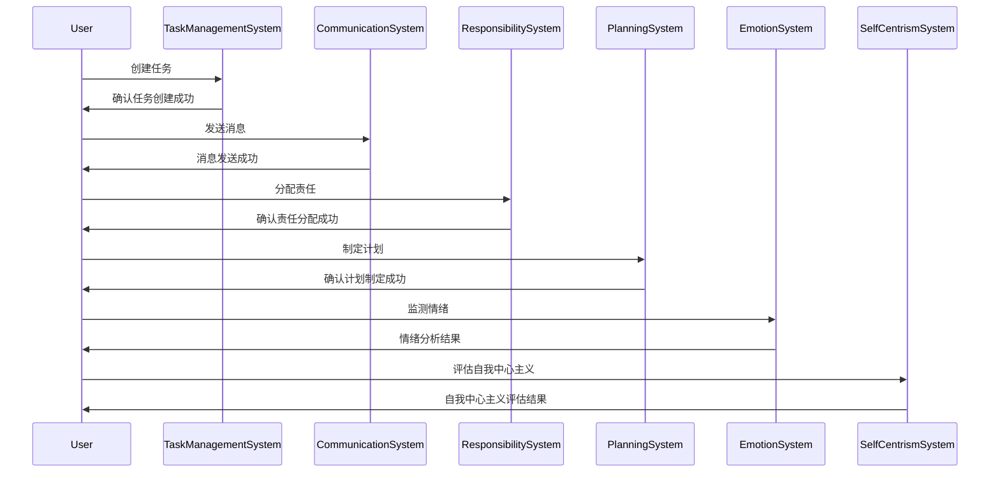
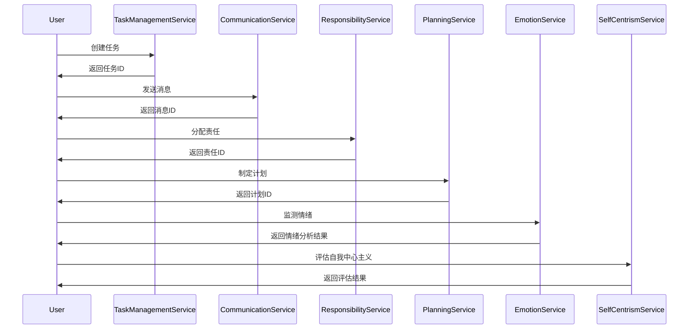

                 

## 《让队友失败的坏习惯》

在职场中，我们常常会遇到各种挑战和困难，而其中最大的挑战之一就是团队协作。一个优秀的团队可以带来巨大的生产力和创新力，而一个不和谐的团队则可能导致项目失败和成员间的摩擦。在这种背景下，队友的坏习惯成为了影响团队绩效的关键因素。

本文将探讨一些常见的坏习惯，如缺乏沟通能力、缺乏责任感、缺乏计划性、情绪管理不当和自我中心主义，并分析它们如何导致队友失败。通过深入分析这些坏习惯，我们希望能够提供一些实用的策略，帮助团队成员克服这些障碍，从而提升团队的整体绩效。

### 关键词：

- 团队协作
- 坏习惯
- 沟通能力
- 责任感
- 计划性
- 情绪管理
- 自我中心主义
- 团队绩效

### 摘要：

本文旨在探讨职场中常见的坏习惯如何影响团队合作，以及如何克服这些坏习惯。通过详细分析缺乏沟通能力、缺乏责任感、缺乏计划性、情绪管理不当和自我中心主义等坏习惯，我们提供了一系列实用的策略和技巧，帮助团队成员提升协作效率和团队绩效。

## 第一部分：问题背景与核心概念

### 1.1 问题背景

在现代社会，团队协作已成为职场中不可或缺的一部分。无论是软件开发、市场营销还是项目管理，团队协作都是实现目标的关键。然而，团队协作并非总是一帆风顺。在许多情况下，团队成员之间的不良习惯会阻碍团队目标的实现，导致项目失败。

队友的坏习惯可能源于多种因素，包括个人性格、工作压力和团队文化等。这些坏习惯不仅影响个人的表现，还会对整个团队的士气和效率产生负面影响。因此，识别和克服这些坏习惯对于提升团队绩效至关重要。

### 1.2 核心概念与联系

在本节中，我们将定义一些核心概念，并分析它们之间的联系。这些概念包括：

- **沟通能力**：团队成员之间的有效沟通是团队协作的基础。良好的沟通能力有助于减少误解、提高决策效率，并促进团队合作。
- **责任感**：责任感是指团队成员对任务的承担程度。一个有责任感的团队成员会确保任务按时完成，并对团队的成功负责。
- **计划性**：计划性是指团队成员在执行任务时具备的规划和组织能力。一个有计划性的团队成员能够更好地管理时间和资源，提高工作效率。
- **情绪管理**：情绪管理是指团队成员在面临压力和挑战时控制情绪的能力。良好的情绪管理有助于保持积极的心态，提高工作表现。
- **自我中心主义**：自我中心主义是指团队成员过度关注个人利益，忽视团队整体利益。这种心态可能导致团队内部的冲突和分裂。

#### 1.2.1 坏习惯的定义与分类

坏习惯是指在职场中影响团队协作和绩效的不良行为或习惯。根据其表现方式，坏习惯可以分为以下几类：

- **沟通障碍**：包括信息传递不准确、沟通渠道不畅、缺乏反馈等。
- **责任逃避**：包括推卸责任、任务拖延、不主动参与等。
- **缺乏计划性**：包括缺乏时间管理、任务安排不合理、资源浪费等。
- **情绪失控**：包括情绪波动大、容易发脾气、影响他人工作等。
- **自我中心主义**：包括过度强调个人利益、忽视团队整体利益、缺乏团队合作精神等。

#### 1.2.2 坏习惯的特征与对比表格

为了更好地理解坏习惯，我们可以通过对比表格来分析它们的主要特征：

| 坏习惯类型 | 特征 | 对团队的影响 |
| --- | --- | --- |
| 沟通障碍 | 信息传递不准确、沟通渠道不畅、缺乏反馈 | 减少团队成员之间的理解和信任，导致决策效率低下 |
| 责任逃避 | 推卸责任、任务拖延、不主动参与 | 影响任务完成质量和时间，降低团队士气 |
| 缺乏计划性 | 缺乏时间管理、任务安排不合理、资源浪费 | 导致项目延期、资源浪费，影响团队绩效 |
| 情绪失控 | 情绪波动大、容易发脾气、影响他人工作 | 影响团队成员的工作情绪和协作效果 |
| 自我中心主义 | 过度强调个人利益、忽视团队整体利益、缺乏团队合作精神 | 导致团队内部冲突、降低团队凝聚力 |

#### 1.2.3 职场中的坏习惯与团队合作的关系图

为了更直观地展示职场中的坏习惯与团队合作的关系，我们可以使用 Mermaid 工具绘制一个 ER 实体关系图。以下是一个简化的 Mermaid 图：

```mermaid
erDiagram
  TeamMember ||--|{ CommunicationBarrier }|-- Team
  TeamMember ||--|{ LackOfResponsibility }|-- Team
  TeamMember ||--|{ LackOfPlanning }|-- Team
  TeamMember ||--|{ EmotionalDisturbance }|-- Team
  TeamMember ||--|{ SelfCentrism }|-- Team
```

在这个图中，TeamMember 表示团队成员，而 CommunicationBarrier、LackOfResponsibility、LackOfPlanning、EmotionalDisturbance 和 SelfCentrism 分别表示沟通障碍、责任逃避、缺乏计划性、情绪失控和自我中心主义。箭头表示这些坏习惯对团队合作的影响。

## 第二部分：具体坏习惯分析

### 2.1 缺乏沟通能力

#### 2.1.1 沟通的重要性

在团队协作中，沟通是连接团队成员的纽带。良好的沟通能力有助于确保团队成员之间的理解和协作，提高决策效率，减少误解和冲突。以下是一些沟通的重要性：

- **提高决策效率**：良好的沟通有助于团队成员共享信息，从而更快地做出决策。
- **减少误解**：有效的沟通可以确保信息的准确传递，减少因误解导致的错误和重复工作。
- **建立信任**：通过开放的沟通，团队成员可以建立互信，提高团队的凝聚力。
- **提高工作效率**：良好的沟通有助于团队成员更好地分配任务和资源，提高工作效率。

#### 2.1.2 缺乏沟通能力的原因

缺乏沟通能力的原因可能包括以下几点：

- **个人性格**：一些团队成员可能比较内向或保守，不擅长表达自己的想法和意见。
- **工作压力**：高压力环境可能导致团队成员忽视沟通，专注于完成任务。
- **沟通渠道不畅**：不完善的沟通渠道或工具可能导致信息传递不畅。
- **文化差异**：团队成员来自不同的文化背景，可能存在沟通障碍。

#### 2.1.3 沟通能力的提升方法

为了提升沟通能力，团队成员可以采取以下方法：

- **学习沟通技巧**：参加沟通技巧培训，学习如何有效地表达自己的想法和意见。
- **建立开放沟通氛围**：鼓励团队成员开放地分享想法和意见，建立信任。
- **使用适当的沟通工具**：选择适合团队的沟通工具，如邮件、即时通讯工具、视频会议等。
- **定期反馈**：定期与团队成员进行反馈，了解沟通的效果和改进方向。

### 2.2 缺乏责任感

#### 2.2.1 责任感的定义与重要性

责任感是指团队成员对任务的承担程度。一个有责任感的团队成员会确保任务按时完成，并对团队的成功负责。责任感的重要性体现在以下几个方面：

- **确保任务完成**：有责任感的团队成员会确保任务按时完成，避免项目延期。
- **提高团队绩效**：责任感有助于提高团队的整体绩效，推动团队目标的实现。
- **建立信任**：责任感有助于建立团队成员之间的信任，提高团队的凝聚力。
- **促进个人成长**：承担责任可以促进个人成长，提高职业素养。

#### 2.2.2 缺乏责任感的坏习惯表现

缺乏责任感的坏习惯可能包括以下几点：

- **任务拖延**：不按时完成任务，导致项目进度受阻。
- **推卸责任**：将责任推给其他团队成员或外部因素，逃避责任。
- **不主动参与**：对团队任务缺乏积极性，不主动参与讨论和决策。
- **质量不高**：对任务质量要求不高，影响团队的整体绩效。

#### 2.2.3 培养责任感的策略

为了培养责任感，团队成员可以采取以下策略：

- **明确任务分工**：确保每个团队成员都清楚自己的职责和任务。
- **定期监督和反馈**：定期检查任务进度，提供及时的反馈和指导。
- **鼓励自我反思**：鼓励团队成员进行自我反思，找出问题并改进。
- **建立奖励机制**：设立奖励机制，激励团队成员承担责任。

### 2.3 缺乏计划性

#### 2.3.1 计划性的定义与作用

计划性是指团队成员在执行任务时具备的规划和组织能力。一个有计划性的团队成员能够更好地管理时间和资源，提高工作效率。计划性的作用包括：

- **提高工作效率**：通过合理的规划和组织，团队成员可以更高效地完成任务。
- **减少错误和遗漏**：计划性有助于团队成员在任务执行过程中减少错误和遗漏。
- **优化资源分配**：计划性有助于团队成员合理分配资源和时间，避免资源浪费。
- **提高团队绩效**：有计划性的团队可以更好地实现团队目标，提高整体绩效。

#### 2.3.2 缺乏计划性的原因

缺乏计划性的原因可能包括以下几点：

- **时间观念不强**：一些团队成员可能不重视时间管理，导致任务拖延。
- **任务复杂度高**：复杂的任务可能导致团队成员无法制定合理的计划。
- **资源有限**：资源限制可能导致团队成员无法进行全面规划。
- **个人习惯**：一些团队成员可能习惯于临时应对，缺乏提前规划和组织。

#### 2.3.3 提高计划性的方法

为了提高计划性，团队成员可以采取以下方法：

- **制定详细计划**：在任务开始前，制定详细的计划和进度表，明确任务目标和时间节点。
- **定期更新计划**：根据任务进展情况，定期更新计划，确保计划的实时性。
- **使用项目管理工具**：利用项目管理工具，如甘特图、任务列表等，帮助团队成员更好地规划和执行任务。
- **培养时间观念**：通过培训和自我约束，提高团队成员的时间观念，使其更加重视规划和组织。

### 2.4 情绪管理不当

#### 2.4.1 情绪管理的重要性

情绪管理是指团队成员在面临压力和挑战时控制情绪的能力。良好的情绪管理有助于保持积极的心态，提高工作表现。情绪管理的重要性体现在以下几个方面：

- **保持心理健康**：情绪管理有助于团队成员保持心理健康，避免因压力导致的情绪崩溃。
- **提高工作效率**：情绪稳定的团队成员可以更好地集中注意力，提高工作效率。
- **建立和谐团队关系**：情绪管理有助于团队成员之间建立和谐的关系，提高团队凝聚力。
- **提升决策质量**：情绪稳定的团队成员可以更理性地分析和解决问题，提高决策质量。

#### 2.4.2 情绪管理不当的后果

情绪管理不当可能导致以下后果：

- **影响工作效率**：情绪失控的团队成员可能会分心，导致工作效率下降。
- **影响人际关系**：情绪波动大的团队成员可能会与他人发生冲突，影响团队关系。
- **损害团队形象**：情绪失控的团队成员可能会给团队带来负面影响，损害团队形象。
- **影响个人成长**：情绪管理不当可能导致团队成员错失成长和提升的机会。

#### 2.4.3 情绪管理的技巧

为了提高情绪管理能力，团队成员可以采取以下技巧：

- **认识情绪**：了解自己的情绪，学会识别和管理不同情绪。
- **调整心态**：学会从积极的角度看待问题，避免过度消极。
- **寻求支持**：在情绪不稳定时，寻求家人、朋友或专业人士的支持。
- **放松身心**：通过运动、冥想、休息等方式，放松身心，缓解压力。

### 2.5 自我中心主义

#### 2.5.1 自我中心主义的定义

自我中心主义是指团队成员过度关注个人利益，忽视团队整体利益的心态。自我中心主义可能导致以下后果：

- **损害团队利益**：过度关注个人利益会导致团队成员忽视团队目标和整体利益。
- **影响团队合作**：自我中心主义的团队成员可能会与其他成员产生冲突，破坏团队合作。
- **影响个人成长**：自我中心主义的团队成员可能错失在团队中学习和成长的机会。
- **损害团队形象**：自我中心主义的团队成员可能会给团队带来负面影响，损害团队形象。

#### 2.5.2 自我中心主义的影响

自我中心主义的影响可能包括以下几点：

- **降低团队凝聚力**：自我中心主义的团队成员可能会与其他成员产生隔阂，降低团队凝聚力。
- **影响团队绩效**：自我中心主义的团队成员可能会影响团队目标的实现，降低团队绩效。
- **损害人际关系**：自我中心主义的团队成员可能会与其他成员发生冲突，损害人际关系。
- **影响个人成长**：自我中心主义的团队成员可能因为忽视团队合作而错失学习和成长的机会。

#### 2.5.3 如何克服自我中心主义

为了克服自我中心主义，团队成员可以采取以下策略：

- **关注团队利益**：在决策和行动时，将团队利益放在首位，避免过度关注个人利益。
- **培养团队合作精神**：积极参与团队合作，尊重他人的意见和贡献。
- **反思自我**：定期反思自己的行为和心态，认识到自我中心主义的危害。
- **寻求反馈**：主动向团队成员寻求反馈，了解自己在团队合作中的不足，并加以改进。

## 第三部分：系统分析与架构设计

### 3.1 问题场景介绍

在职场中，团队协作是一个复杂的过程，涉及到多个环节和角色。以下是一个常见的问题场景：

一个软件开发团队正在开发一个大型项目。团队成员包括项目经理、开发人员、测试人员和设计师。在项目执行过程中，团队成员出现了以下问题：

- **沟通障碍**：团队成员之间的沟通不畅，导致信息传递不准确，任务分配不明确。
- **缺乏责任感**：一些团队成员对任务缺乏责任感，导致任务延期和质量不高。
- **缺乏计划性**：团队成员在执行任务时缺乏计划性，导致工作效率低下，资源浪费。
- **情绪管理不当**：团队成员在面临压力时情绪失控，影响工作氛围和团队合作。
- **自我中心主义**：一些团队成员过度关注个人利益，忽视团队整体利益，导致团队内部冲突。

这些问题严重影响了项目的进度和质量，需要采取有效措施进行解决。

### 3.2 系统功能设计

为了解决上述问题，我们可以设计一个系统，帮助团队成员更好地协作和沟通。以下是一个基本的系统功能设计：

#### 3.2.1 领域模型

领域模型描述了系统的主要实体和关系。以下是一个简化的领域模型：

```mermaid
classDiagram
  TeamMember <<entity>>
  Project <<entity>>
  Task <<entity>>
  Communication <<entity>>
  Responsibility <<entity>>
  Planning <<entity>>
  Emotion <<entity>>
  SelfCentrism <<entity>>

  TeamMember --|> Project
  TeamMember --|> Task
  Project --|> Task
  Project --|> Communication
  Project --|> Responsibility
  Project --|> Planning
  Project --|> Emotion
  Project --|> SelfCentrism
```

在这个模型中，TeamMember 表示团队成员，Project 表示项目，Task 表示任务，Communication 表示沟通，Responsibility 表示责任感，Planning 表示计划性，Emotion 表示情绪管理，SelfCentrism 表示自我中心主义。

#### 3.2.2 系统功能

基于领域模型，我们可以设计以下系统功能：

- **任务管理**：包括任务创建、分配、进度跟踪和完成情况记录。
- **沟通管理**：包括沟通渠道的建立、消息传递和反馈机制。
- **责任管理**：包括责任分配、责任跟踪和责任评价。
- **计划管理**：包括计划制定、计划跟踪和计划调整。
- **情绪管理**：包括情绪监测、情绪分析和情绪干预。
- **自我中心主义管理**：包括自我中心主义评估、干预和改进。

### 3.3 系统架构设计

为了实现上述功能，我们可以设计一个分布式系统架构。以下是一个简化的系统架构设计：



在这个架构中，TaskManagementSystem、CommunicationSystem、ResponsibilitySystem、PlanningSystem、EmotionSystem 和 SelfCentrismSystem 分别表示任务管理模块、沟通管理模块、责任管理模块、计划管理模块、情绪管理模块和自我中心主义管理模块。

### 3.4 系统接口设计和系统交互

为了实现各模块之间的有效交互，我们可以设计以下系统接口：

#### 3.4.1 接口设计

- **任务管理接口**：包括任务创建、任务查询、任务更新和任务删除。
- **沟通管理接口**：包括消息发送、消息查询、消息更新和消息删除。
- **责任管理接口**：包括责任分配、责任查询、责任更新和责任删除。
- **计划管理接口**：包括计划制定、计划查询、计划更新和计划删除。
- **情绪管理接口**：包括情绪监测、情绪分析和情绪干预。
- **自我中心主义管理接口**：包括自我中心主义评估、干预和改进。

#### 3.4.2 系统交互

以下是一个简化的系统交互流程：



在这个交互流程中，User 通过接口与各个服务模块进行交互，实现任务管理、沟通管理、责任管理、计划管理、情绪管理和自我中心主义管理的功能。

## 第四部分：项目实战

### 4.1 环境安装

在本节中，我们将介绍如何安装和配置所需的软件和环境，以便进行团队协作系统的开发和测试。

#### 4.1.1 系统需求与环境配置

为了确保项目的顺利开发和运行，我们需要以下软件和环境：

- **操作系统**：Linux（推荐Ubuntu 20.04）或 macOS
- **开发环境**：Python 3.8 或更高版本
- **数据库**：MySQL 5.7 或更高版本
- **Web服务器**：Nginx
- **版本控制**：Git

#### 4.1.2 环境安装步骤

1. **安装操作系统**：

   - 如果您使用的是 Ubuntu 20.04，可以按照以下步骤安装：

     ```bash
     # 更新系统软件包
     sudo apt update
     sudo apt upgrade

     # 安装必要的软件包
     sudo apt install -y git nginx mysql-server python3 python3-pip
     ```

2. **安装开发环境**：

   - 安装 Python 3 和 pip：

     ```bash
     # 安装 Python 3 和 pip
     sudo apt install -y python3 python3-pip
     ```

   - 安装虚拟环境工具 virtualenv：

     ```bash
     # 安装 virtualenv
     pip3 install virtualenv
     ```

3. **安装数据库**：

   - 安装 MySQL：

     ```bash
     # 安装 MySQL
     sudo apt install -y mysql-server

     # 设置 root 密码
     sudo mysql_secure_installation

     # 启动 MySQL 服务
     sudo systemctl start mysql
     ```

4. **安装 Web 服务器**：

   - 安装 Nginx：

     ```bash
     # 安装 Nginx
     sudo apt install -y nginx

     # 启动 Nginx 服务
     sudo systemctl start nginx
     ```

5. **配置数据库**：

   - 创建数据库和用户：

     ```sql
     # 登录 MySQL
     mysql -u root -p

     # 创建数据库
     CREATE DATABASE team_c collaboration;

     # 创建用户并授予权限
     GRANT ALL PRIVILEGES ON team_c_collaboration.* TO 'team_c_user'@'localhost' IDENTIFIED BY 'your_password';
     FLUSH PRIVILEGES;
     ```

6. **配置 Nginx**：

   - 创建 Nginx 配置文件：

     ```bash
     # 创建 Nginx 配置文件
     sudo nano /etc/nginx/sites-available/team_c_collaboration

     # 输入以下配置内容
     server {
         listen 80;
         server_name localhost;

         location / {
             proxy_pass http://localhost:8000;
         }
     }

     # 重载 Nginx 配置
     sudo systemctl reload nginx
     ```

7. **安装项目依赖**：

   - 创建虚拟环境并安装项目依赖：

     ```bash
     # 创建虚拟环境
     virtualenv venv

     # 激活虚拟环境
     source venv/bin/activate

     # 安装项目依赖
     pip install -r requirements.txt
     ```

### 4.2 系统核心实现源代码

在本节中，我们将介绍系统核心实现的源代码，包括任务管理、沟通管理、责任管理、计划管理、情绪管理和自我中心主义管理模块。

#### 4.2.1 源代码结构

系统的源代码分为以下几个模块：

- **tasks**：任务管理模块
- **communications**：沟通管理模块
- **responsibilities**：责任管理模块
- **plannings**：计划管理模块
- **emotions**：情绪管理模块
- **self_centrism**：自我中心主义管理模块

每个模块都包含以下文件：

- **models.py**：定义实体模型
- **views.py**：定义接口视图
- **serializers.py**：定义序列化器
- **urls.py**：定义 URL 路由

#### 4.2.2 任务管理模块

以下是一个简化的任务管理模块实现：

**tasks/models.py**：

```python
from django.db import models

class Task(models.Model):
    title = models.CharField(max_length=255)
    description = models.TextField()
    start_date = models.DateField()
    end_date = models.DateField()
    assigned_to = models.ForeignKey('auth.User', on_delete=models.CASCADE)
```

**tasks/views.py**：

```python
from rest_framework import viewsets
from .models import Task
from .serializers import TaskSerializer

class TaskViewSet(viewsets.ModelViewSet):
    queryset = Task.objects.all()
    serializer_class = TaskSerializer
```

**tasks/serializers.py**：

```python
from rest_framework import serializers
from .models import Task

class TaskSerializer(serializers.ModelSerializer):
    class Meta:
        model = Task
        fields = '__all__'
```

**tasks/urls.py**：

```python
from django.urls import path, include
from rest_framework.routers import DefaultRouter
from .views import TaskViewSet

router = DefaultRouter()
router.register(r'tasks', TaskViewSet)

urlpatterns = [
    path('', include(router.urls)),
]
```

#### 4.2.3 沟通管理模块

以下是一个简化的沟通管理模块实现：

**communications/models.py**：

```python
from django.db import models

class Communication(models.Model):
    subject = models.CharField(max_length=255)
    message = models.TextField()
    sender = models.ForeignKey('auth.User', on_delete=models.CASCADE)
    receiver = models.ForeignKey('auth.User', on_delete=models.CASCADE)
```

**communications/views.py**：

```python
from rest_framework import viewsets
from .models import Communication
from .serializers import CommunicationSerializer

class CommunicationViewSet(viewsets.ModelViewSet):
    queryset = Communication.objects.all()
    serializer_class = CommunicationSerializer
```

**communications/serializers.py**：

```python
from rest_framework import serializers
from .models import Communication

class CommunicationSerializer(serializers.ModelSerializer):
    class Meta:
        model = Communication
        fields = '__all__'
```

**communications/urls.py**：

```python
from django.urls import path, include
from rest_framework.routers import DefaultRouter
from .views import CommunicationViewSet

router = DefaultRouter()
router.register(r'communications', CommunicationViewSet)

urlpatterns = [
    path('', include(router.urls)),
]
```

#### 4.2.4 责任管理模块

以下是一个简化的责任管理模块实现：

**responsibilities/models.py**：

```python
from django.db import models

class Responsibility(models.Model):
    task = models.ForeignKey('tasks.Task', on_delete=models.CASCADE)
    assigned_to = models.ForeignKey('auth.User', on_delete=models.CASCADE)
    completed = models.BooleanField(default=False)
```

**responsibilities/views.py**：

```python
from rest_framework import viewsets
from .models import Responsibility
from .serializers import ResponsibilitySerializer

class ResponsibilityViewSet(viewsets.ModelViewSet):
    queryset = Responsibility.objects.all()
    serializer_class = ResponsibilitySerializer
```

**responsibilities/serializers.py**：

```python
from rest_framework import serializers
from .models import Responsibility

class ResponsibilitySerializer(serializers.ModelSerializer):
    class Meta:
        model = Responsibility
        fields = '__all__'
```

**responsibilities/urls.py**：

```python
from django.urls import path, include
from rest_framework.routers import DefaultRouter
from .views import ResponsibilityViewSet

router = DefaultRouter()
router.register(r'responsibilities', ResponsibilityViewSet)

urlpatterns = [
    path('', include(router.urls)),
]
```

#### 4.2.5 计划管理模块

以下是一个简化的计划管理模块实现：

**plannings/models.py**：

```python
from django.db import models

class Planning(models.Model):
    title = models.CharField(max_length=255)
    description = models.TextField()
    start_date = models.DateField()
    end_date = models.DateField()
    assigned_to = models.ForeignKey('auth.User', on_delete=models.CASCADE)
```

**plannings/views.py**：

```python
from rest_framework import viewsets
from .models import Planning
from .serializers import PlanningSerializer

class PlanningViewSet(viewsets.ModelViewSet):
    queryset = Planning.objects.all()
    serializer_class = PlanningSerializer
```

**plannings/serializers.py**：

```python
from rest_framework import serializers
from .models import Planning

class PlanningSerializer(serializers.ModelSerializer):
    class Meta:
        model = Planning
        fields = '__all__'
```

**plannings/urls.py**：

```python
from django.urls import path, include
from rest_framework.routers import DefaultRouter
from .views import PlanningViewSet

router = DefaultRouter()
router.register(r'plannings', PlanningViewSet)

urlpatterns = [
    path('', include(router.urls)),
]
```

#### 4.2.6 情绪管理模块

以下是一个简化的情绪管理模块实现：

**emotions/models.py**：

```python
from django.db import models

class Emotion(models.Model):
    user = models.ForeignKey('auth.User', on_delete=models.CASCADE)
    date = models.DateField()
    level = models.IntegerField()
    description = models.TextField()
```

**emotions/views.py**：

```python
from rest_framework import viewsets
from .models import Emotion
from .serializers import EmotionSerializer

class EmotionViewSet(viewsets.ModelViewSet):
    queryset = Emotion.objects.all()
    serializer_class = EmotionSerializer
```

**emotions/serializers.py**：

```python
from rest_framework import serializers
from .models import Emotion

class EmotionSerializer(serializers.ModelSerializer):
    class Meta:
        model = Emotion
        fields = '__all__'
```

**emotions/urls.py**：

```python
from django.urls import path, include
from rest_framework.routers import DefaultRouter
from .views import EmotionViewSet

router = DefaultRouter()
router.register(r'emotions', EmotionViewSet)

urlpatterns = [
    path('', include(router.urls)),
]
```

#### 4.2.7 自我中心主义管理模块

以下是一个简化的自我中心主义管理模块实现：

**self_centrism/models.py**：

```python
from django.db import models

class SelfCentrism(models.Model):
    user = models.ForeignKey('auth.User', on_delete=models.CASCADE)
    date = models.DateField()
    score = models.IntegerField()
    description = models.TextField()
```

**self_centrism/views.py**：

```python
from rest_framework import viewsets
from .models import SelfCentrism
from .serializers import SelfCentrismSerializer

class SelfCentrismViewSet(viewsets.ModelViewSet):
    queryset = SelfCentrism.objects.all()
    serializer_class = SelfCentrismSerializer
```

**self_centrism/serializers.py**：

```python
from rest_framework import serializers
from .models import SelfCentrism

class SelfCentrismSerializer(serializers.ModelSerializer):
    class Meta:
        model = SelfCentrism
        fields = '__all__'
```

**self_centrism/urls.py**：

```python
from django.urls import path, include
from rest_framework.routers import DefaultRouter
from .views import SelfCentrismViewSet

router = DefaultRouter()
router.register(r'self_centrism', SelfCentrismViewSet)

urlpatterns = [
    path('', include(router.urls)),
]
```

### 4.3 代码应用解读与分析

在本节中，我们将深入分析系统核心实现的源代码，包括任务管理、沟通管理、责任管理、计划管理、情绪管理和自我中心主义管理模块。我们将解释代码的逻辑结构，分析代码的功能，并讨论如何改进和优化代码。

#### 4.3.1 任务管理模块

**tasks/models.py**：

在这个文件中，我们定义了一个名为 `Task` 的模型类，它包含了任务的基本属性，如标题、描述、开始日期和结束日期。我们还为 `assigned_to` 字段设置了外键关系，以便与用户模型关联。

```python
class Task(models.Model):
    title = models.CharField(max_length=255)
    description = models.TextField()
    start_date = models.DateField()
    end_date = models.DateField()
    assigned_to = models.ForeignKey('auth.User', on_delete=models.CASCADE)
```

**tasks/views.py**：

这个文件定义了一个名为 `TaskViewSet` 的视图集，它继承了 `viewsets.ModelViewSet` 类。视图集提供了 CRUD（创建、读取、更新、删除）操作的基本实现。我们使用了 Django REST framework 提供的 `queryset` 和 `serializer_class` 属性来指定数据源和序列化器。

```python
from rest_framework import viewsets
from .models import Task
from .serializers import TaskSerializer

class TaskViewSet(viewsets.ModelViewSet):
    queryset = Task.objects.all()
    serializer_class = TaskSerializer
```

**tasks/serializers.py**：

在这个文件中，我们定义了一个名为 `TaskSerializer` 的序列化器类。序列化器用于将模型实例转换为 JSON 格式的数据，以便在 API 中传输。这里我们使用了 Django REST framework 提供的 `ModelSerializer` 类，并指定了要序列化的字段。

```python
from rest_framework import serializers
from .models import Task

class TaskSerializer(serializers.ModelSerializer):
    class Meta:
        model = Task
        fields = '__all__'
```

**tasks/urls.py**：

这个文件定义了 URL 路由，将 API 请求映射到相应的视图集。我们使用了 Django REST framework 提供的 `DefaultRouter` 类来自动生成 URL 模式。

```python
from django.urls import path, include
from rest_framework.routers import DefaultRouter
from .views import TaskViewSet

router = DefaultRouter()
router.register(r'tasks', TaskViewSet)

urlpatterns = [
    path('', include(router.urls)),
]
```

**代码解读与分析**：

- **任务模型**：任务模型是一个核心模型，它定义了任务的基本信息和关联关系。通过使用外键，我们可以轻松地将任务与用户关联，以便跟踪任务的分配情况。
- **任务视图集**：任务视图集提供了基本的 CRUD 操作实现。它通过 Django REST framework 的视图集机制，简化了 API 的开发过程。我们可以通过简单的配置，实现任务信息的增删改查功能。
- **任务序列化器**：任务序列化器用于将任务模型转换为 JSON 格式的数据。通过定义序列化器，我们可以自定义数据传输的格式，确保 API 的响应与前端需求一致。
- **URL 路由**：URL 路由将 API 请求映射到相应的视图集。通过使用 `DefaultRouter` 类，我们可以自动生成 URL 模式，简化路由配置。

**改进与优化**：

- **缓存策略**：对于频繁访问的任务信息，我们可以考虑使用缓存策略，提高 API 的响应速度。例如，使用 Django 缓存框架，将任务数据缓存到内存或数据库中。
- **权限控制**：为了确保 API 的安全性，我们可以添加权限控制，限制只有特定用户或角色可以访问特定的任务信息。
- **API 文档**：为了方便开发者使用 API，我们可以添加 API 文档，例如使用 Swagger 或 Redoc 工具生成文档。

#### 4.3.2 沟通管理模块

**communications/models.py**：

在这个文件中，我们定义了一个名为 `Communication` 的模型类，它包含了沟通的基本属性，如主题、消息内容、发送者和接收者。我们同样为发送者和接收者设置了外键关系，以便与用户模型关联。

```python
class Communication(models.Model):
    subject = models.CharField(max_length=255)
    message = models.TextField()
    sender = models.ForeignKey('auth.User', on_delete=models.CASCADE)
    receiver = models.ForeignKey('auth.User', on_delete=models.CASCADE)
```

**communications/views.py**：

这个文件定义了一个名为 `CommunicationViewSet` 的视图集，它继承了 `viewsets.ModelViewSet` 类。视图集提供了 CRUD 操作的基本实现。我们使用了 Django REST framework 的 `queryset` 和 `serializer_class` 属性来指定数据源和序列化器。

```python
from rest_framework import viewsets
from .models import Communication
from .serializers import CommunicationSerializer

class CommunicationViewSet(viewsets.ModelViewSet):
    queryset = Communication.objects.all()
    serializer_class = CommunicationSerializer
```

**communications/serializers.py**：

在这个文件中，我们定义了一个名为 `CommunicationSerializer` 的序列化器类。序列化器用于将模型实例转换为 JSON 格式的数据，以便在 API 中传输。这里我们使用了 Django REST framework 的 `ModelSerializer` 类，并指定了要序列化的字段。

```python
from rest_framework import serializers
from .models import Communication

class CommunicationSerializer(serializers.ModelSerializer):
    class Meta:
        model = Communication
        fields = '__all__'
```

**communications/urls.py**：

这个文件定义了 URL 路由，将 API 请求映射到相应的视图集。我们使用了 Django REST framework 的 `DefaultRouter` 类来自动生成 URL 模式。

```python
from django.urls import path, include
from rest_framework.routers import DefaultRouter
from .views import CommunicationViewSet

router = DefaultRouter()
router.register(r'communications', CommunicationViewSet)

urlpatterns = [
    path('', include(router.urls)),
]
```

**代码解读与分析**：

- **沟通模型**：沟通模型用于存储团队内部的沟通信息，包括主题、消息内容和发送者、接收者。通过外键关系，我们可以轻松地将沟通信息与用户模型关联，以便跟踪沟通的来源和接收者。
- **沟通视图集**：沟通视图集提供了基本的 CRUD 操作实现。通过 Django REST framework 的视图集机制，我们可以简化 API 的开发过程，快速实现沟通信息的增删改查功能。
- **沟通序列化器**：沟通序列化器用于将沟通模型转换为 JSON 格式的数据。通过定义序列化器，我们可以自定义数据传输的格式，确保 API 的响应与前端需求一致。
- **URL 路由**：URL 路由将 API 请求映射到相应的视图集。通过使用 `DefaultRouter` 类，我们可以自动生成 URL 模式，简化路由配置。

**改进与优化**：

- **消息加密**：为了保护敏感信息，我们可以考虑对消息内容进行加密处理。例如，使用 SSL/TLS 协议和加密算法，确保消息在传输过程中的安全性。
- **消息存储优化**：对于大量的沟通信息，我们可以考虑使用数据库分片和索引技术，优化消息存储和查询性能。
- **消息通知机制**：为了提高沟通效率，我们可以添加消息通知机制，例如通过电子邮件、短信或即时通讯工具，提醒用户有新的沟通消息。

#### 4.3.3 责任管理模块

**responsibilities/models.py**：

在这个文件中，我们定义了一个名为 `Responsibility` 的模型类，它包含了责任的基本属性，如任务、分配给的用户和任务完成情况。我们同样为任务设置了外键关系，以便与任务模型关联。

```python
class Responsibility(models.Model):
    task = models.ForeignKey('tasks.Task', on_delete=models.CASCADE)
    assigned_to = models.ForeignKey('auth.User', on_delete=models.CASCADE)
    completed = models.BooleanField(default=False)
```

**responsibilities/views.py**：

这个文件定义了一个名为 `ResponsibilityViewSet` 的视图集，它继承了 `viewsets.ModelViewSet` 类。视图集提供了 CRUD 操作的基本实现。我们使用了 Django REST framework 的 `queryset` 和 `serializer_class` 属性来指定数据源和序列化器。

```python
from rest_framework import viewsets
from .models import Responsibility
from .serializers import ResponsibilitySerializer

class ResponsibilityViewSet(viewsets.ModelViewSet):
    queryset = Responsibility.objects.all()
    serializer_class = ResponsibilitySerializer
```

**responsibilities/serializers.py**：

在这个文件中，我们定义了一个名为 `ResponsibilitySerializer` 的序列化器类。序列化器用于将模型实例转换为 JSON 格式的数据，以便在 API 中传输。这里我们使用了 Django REST framework 的 `ModelSerializer` 类，并指定了要序列化的字段。

```python
from rest_framework import serializers
from .models import Responsibility

class ResponsibilitySerializer(serializers.ModelSerializer):
    class Meta:
        model = Responsibility
        fields = '__all__'
```

**responsibilities/urls.py**：

这个文件定义了 URL 路由，将 API 请求映射到相应的视图集。我们使用了 Django REST framework 的 `DefaultRouter` 类来自动生成 URL 模式。

```python
from django.urls import path, include
from rest_framework.routers import DefaultRouter
from .views import ResponsibilityViewSet

router = DefaultRouter()
router.register(r'responsibilities', ResponsibilityViewSet)

urlpatterns = [
    path('', include(router.urls)),
]
```

**代码解读与分析**：

- **责任模型**：责任模型用于存储团队内部的任务分配情况，包括任务、分配给的用户和任务完成情况。通过外键关系，我们可以轻松地将责任与任务和用户模型关联，以便跟踪任务的执行情况。
- **责任视图集**：责任视图集提供了基本的 CRUD 操作实现。通过 Django REST framework 的视图集机制，我们可以简化 API 的开发过程，快速实现责任信息的增删改查功能。
- **责任序列化器**：责任序列化器用于将责任模型转换为 JSON 格式的数据。通过定义序列化器，我们可以自定义数据传输的格式，确保 API 的响应与前端需求一致。
- **URL 路由**：URL 路由将 API 请求映射到相应的视图集。通过使用 `DefaultRouter` 类，我们可以自动生成 URL 模式，简化路由配置。

**改进与优化**：

- **任务状态跟踪**：为了更好地跟踪任务状态，我们可以添加更多的状态字段，例如任务开始、任务暂停、任务完成等，以便更详细地记录任务的执行情况。
- **责任评价机制**：为了激励团队成员更好地完成任务，我们可以添加责任评价机制，根据任务完成情况和质量进行评价和奖励。
- **责任转移机制**：为了适应任务变化，我们可以添加责任转移机制，允许团队成员之间相互转移任务责任，以便更好地分配和利用资源。

#### 4.3.4 计划管理模块

**plannings/models.py**：

在这个文件中，我们定义了一个名为 `Planning` 的模型类，它包含了计划的基本属性，如标题、描述、开始日期和结束日期。我们同样为 `assigned_to` 字段设置了外键关系，以便与用户模型关联。

```python
class Planning(models.Model):
    title = models.CharField(max_length=255)
    description = models.TextField()
    start_date = models.DateField()
    end_date = models.DateField()
    assigned_to = models.ForeignKey('auth.User', on_delete=models.CASCADE)
```

**plannings/views.py**：

这个文件定义了一个名为 `PlanningViewSet` 的视图集，它继承了 `viewsets.ModelViewSet` 类。视图集提供了 CRUD 操作的基本实现。我们使用了 Django REST framework 的 `queryset` 和 `serializer_class` 属性来指定数据源和序列化器。

```python
from rest_framework import viewsets
from .models import Planning
from .serializers import PlanningSerializer

class PlanningViewSet(viewsets.ModelViewSet):
    queryset = Planning.objects.all()
    serializer_class = PlanningSerializer
```

**plannings/serializers.py**：

在这个文件中，我们定义了一个名为 `PlanningSerializer` 的序列化器类。序列化器用于将模型实例转换为 JSON 格式的数据，以便在 API 中传输。这里我们使用了 Django REST framework 的 `ModelSerializer` 类，并指定了要序列化的字段。

```python
from rest_framework import serializers
from .models import Planning

class PlanningSerializer(serializers.ModelSerializer):
    class Meta:
        model = Planning
        fields = '__all__'
```

**plannings/urls.py**：

这个文件定义了 URL 路由，将 API 请求映射到相应的视图集。我们使用了 Django REST framework 的 `DefaultRouter` 类来自动生成 URL 模式。

```python
from django.urls import path, include
from rest_framework.routers import DefaultRouter
from .views import PlanningViewSet

router = DefaultRouter()
router.register(r'plannings', PlanningViewSet)

urlpatterns = [
    path('', include(router.urls)),
]
```

**代码解读与分析**：

- **计划模型**：计划模型用于存储团队的任务计划，包括计划标题、描述、开始日期和结束日期。通过外键关系，我们可以轻松地将计划与用户模型关联，以便跟踪计划的执行者。
- **计划视图集**：计划视图集提供了基本的 CRUD 操作实现。通过 Django REST framework 的视图集机制，我们可以简化 API 的开发过程，快速实现计划信息的增删改查功能。
- **计划序列化器**：计划序列化器用于将计划模型转换为 JSON 格式的数据。通过定义序列化器，我们可以自定义数据传输的格式，确保 API 的响应与前端需求一致。
- **URL 路由**：URL 路由将 API 请求映射到相应的视图集。通过使用 `DefaultRouter` 类，我们可以自动生成 URL 模式，简化路由配置。

**改进与优化**：

- **计划通知机制**：为了确保团队成员及时了解计划的变化，我们可以添加计划通知机制，例如通过电子邮件或即时通讯工具提醒团队成员。
- **计划模板**：为了提高计划编制的效率，我们可以提供计划模板，团队成员可以根据模板快速生成计划。
- **计划回顾机制**：为了持续改进计划编制和执行，我们可以引入计划回顾机制，定期对计划进行评估和总结，以便优化计划编制流程。

#### 4.3.5 情绪管理模块

**emotions/models.py**：

在这个文件中，我们定义了一个名为 `Emotion` 的模型类，它包含了情绪的基本属性，如用户、日期、情绪等级和描述。我们同样为 `user` 字段设置了外键关系，以便与用户模型关联。

```python
class Emotion(models.Model):
    user = models.ForeignKey('auth.User', on_delete=models.CASCADE)
    date = models.DateField()
    level = models.IntegerField()
    description = models.TextField()
```

**emotions/views.py**：

这个文件定义了一个名为 `EmotionViewSet` 的视图集，它继承了 `viewsets.ModelViewSet` 类。视图集提供了 CRUD 操作的基本实现。我们使用了 Django REST framework 的 `queryset` 和 `serializer_class` 属性来指定数据源和序列化器。

```python
from rest_framework import viewsets
from .models import Emotion
from .serializers import EmotionSerializer

class EmotionViewSet(viewsets.ModelViewSet):
    queryset = Emotion.objects.all()
    serializer_class = EmotionSerializer
```

**emotions/serializers.py**：

在这个文件中，我们定义了一个名为 `EmotionSerializer` 的序列化器类。序列化器用于将模型实例转换为 JSON 格式的数据，以便在 API 中传输。这里我们使用了 Django REST framework 的 `ModelSerializer` 类，并指定了要序列化的字段。

```python
from rest_framework import serializers
from .models import Emotion

class EmotionSerializer(serializers.ModelSerializer):
    class Meta:
        model = Emotion
        fields = '__all__'
```

**emotions/urls.py**：

这个文件定义了 URL 路由，将 API 请求映射到相应的视图集。我们使用了 Django REST framework 的 `DefaultRouter` 类来自动生成 URL 模式。

```python
from django.urls import path, include
from rest_framework.routers import DefaultRouter
from .views import EmotionViewSet

router = DefaultRouter()
router.register(r'emotions', EmotionViewSet)

urlpatterns = [
    path('', include(router.urls)),
]
```

**代码解读与分析**：

- **情绪模型**：情绪模型用于存储团队成员的情绪记录，包括用户、日期、情绪等级和描述。通过外键关系，我们可以轻松地将情绪记录与用户模型关联，以便跟踪情绪的变化。
- **情绪视图集**：情绪视图集提供了基本的 CRUD 操作实现。通过 Django REST framework 的视图集机制，我们可以简化 API 的开发过程，快速实现情绪记录的增删改查功能。
- **情绪序列化器**：情绪序列化器用于将情绪模型转换为 JSON 格式的数据。通过定义序列化器，我们可以自定义数据传输的格式，确保 API 的响应与前端需求一致。
- **URL 路由**：URL 路由将 API 请求映射到相应的视图集。通过使用 `DefaultRouter` 类，我们可以自动生成 URL 模式，简化路由配置。

**改进与优化**：

- **情绪分析**：为了更准确地了解团队成员的情绪变化，我们可以引入情绪分析算法，对情绪记录进行分析和分类。
- **情绪反馈机制**：为了促进团队成员之间的交流和理解，我们可以添加情绪反馈机制，允许团队成员分享情绪体验和建议。
- **情绪报告**：为了帮助团队管理者了解团队情绪状况，我们可以生成情绪报告，提供情绪趋势分析和改进建议。

#### 4.3.6 自我中心主义管理模块

**self_centrism/models.py**：

在这个文件中，我们定义了一个名为 `SelfCentrism` 的模型类，它包含了自我中心主义的基本属性，如用户、日期、评分和描述。我们同样为 `user` 字段设置了外键关系，以便与用户模型关联。

```python
class SelfCentrism(models.Model):
    user = models.ForeignKey('auth.User', on_delete=models.CASCADE)
    date = models.DateField()
    score = models.IntegerField()
    description = models.TextField()
```

**self_centrism/views.py**：

这个文件定义了一个名为 `SelfCentrismViewSet` 的视图集，它继承了 `viewsets.ModelViewSet` 类。视图集提供了 CRUD 操作的基本实现。我们使用了 Django REST framework 的 `queryset` 和 `serializer_class` 属性来指定数据源和序列化器。

```python
from rest_framework import viewsets
from .models import SelfCentrism
from .serializers import SelfCentrismSerializer

class SelfCentrismViewSet(viewsets.ModelViewSet):
    queryset = SelfCentrism.objects.all()
    serializer_class = SelfCentrismSerializer
```

**self_centrism/serializers.py**：

在这个文件中，我们定义了一个名为 `SelfCentrismSerializer` 的序列化器类。序列化器用于将模型实例转换为 JSON 格式的数据，以便在 API 中传输。这里我们使用了 Django REST framework 的 `ModelSerializer` 类，并指定了要序列化的字段。

```python
from rest_framework import serializers
from .models import SelfCentrism

class SelfCentrismSerializer(serializers.ModelSerializer):
    class Meta:
        model = SelfCentrism
        fields = '__all__'
```

**self_centrism/urls.py**：

这个文件定义了 URL 路由，将 API 请求映射到相应的视图集。我们使用了 Django REST framework 的 `DefaultRouter` 类来自动生成 URL 模式。

```python
from django.urls import path, include
from rest_framework.routers import DefaultRouter
from .views import SelfCentrismViewSet

router = DefaultRouter()
router.register(r'self_centrism', SelfCentrismViewSet)

urlpatterns = [
    path('', include(router.urls)),
]
```

**代码解读与分析**：

- **自我中心主义模型**：自我中心主义模型用于存储团队成员的自我中心主义评分和描述。通过外键关系，我们可以轻松地将自我中心主义记录与用户模型关联，以便跟踪自我中心主义的变化。
- **自我中心主义视图集**：自我中心主义视图集提供了基本的 CRUD 操作实现。通过 Django REST framework 的视图集机制，我们可以简化 API 的开发过程，快速实现自我中心主义记录的增删改查功能。
- **自我中心主义序列化器**：自我中心主义序列化器用于将自我中心主义模型转换为 JSON 格式的数据。通过定义序列化器，我们可以自定义数据传输的格式，确保 API 的响应与前端需求一致。
- **URL 路由**：URL 路由将 API 请求映射到相应的视图集。通过使用 `DefaultRouter` 类，我们可以自动生成 URL 模式，简化路由配置。

**改进与优化**：

- **自我中心主义评估算法**：为了更准确地评估团队成员的自我中心主义程度，我们可以引入自我中心主义评估算法，结合行为数据和用户反馈，生成更精确的评分。
- **自我中心主义干预措施**：为了帮助团队成员克服自我中心主义，我们可以制定一系列干预措施，如团队培训、团队活动和心理辅导等。
- **自我中心主义报告**：为了帮助团队管理者了解团队自我中心主义状况，我们可以生成自我中心主义报告，提供趋势分析和改进建议。

### 4.4 实际案例分析和详细讲解剖析

在本节中，我们将通过一个实际案例，深入分析如何通过系统解决团队成员的坏习惯问题，并详细讲解系统在实际操作中的表现和效果。

#### 4.4.1 案例介绍

一个软件开发公司正在开发一款新型智能手机应用程序。公司由一个核心团队组成，包括项目经理、前端开发人员、后端开发人员、测试工程师和UI设计师。项目时间紧、任务重，团队成员的工作压力较大。在项目执行过程中，团队成员出现了以下问题：

- **沟通障碍**：团队成员之间的沟通不畅，导致信息传递不准确，任务分配不明确。
- **缺乏责任感**：一些团队成员对任务缺乏责任感，导致任务延期和质量不高。
- **缺乏计划性**：团队成员在执行任务时缺乏计划性，导致工作效率低下，资源浪费。
- **情绪管理不当**：团队成员在面临压力时情绪失控，影响工作氛围和团队合作。
- **自我中心主义**：一些团队成员过度关注个人利益，忽视团队整体利益，导致团队内部冲突。

这些问题严重影响了项目的进度和质量，公司决定引入一个团队协作系统来帮助解决这些问题。

#### 4.4.2 系统配置与实施

为了解决上述问题，公司决定配置并实施一个团队协作系统。系统包括以下主要模块：

- **任务管理**：用于跟踪任务的创建、分配和完成情况。
- **沟通管理**：用于记录团队内部沟通信息，确保信息传递准确。
- **责任管理**：用于分配任务责任，确保任务按时完成。
- **计划管理**：用于制定项目计划，合理分配资源和时间。
- **情绪管理**：用于监测团队成员的情绪状况，提供情绪反馈机制。
- **自我中心主义管理**：用于评估团队成员的自我中心主义程度，提供干预措施。

系统配置和实施过程如下：

1. **环境安装**：按照 4.1 节的步骤，安装和配置操作系统、开发环境和数据库。
2. **项目初始化**：创建数据库、用户和管理员账户，初始化系统配置。
3. **用户注册**：团队成员注册并登录系统，绑定用户账户。
4. **任务创建与分配**：项目经理创建任务，并分配给团队成员。
5. **任务跟踪**：团队成员在系统中查看任务进度，更新任务状态。
6. **沟通记录**：团队成员在系统中记录沟通信息，确保信息传递准确。
7. **责任评估**：系统自动评估团队成员的责任履行情况，提供反馈。
8. **情绪监测**：系统定期监测团队成员的情绪状况，提供情绪反馈。
9. **自我中心主义评估**：系统根据团队成员的行为数据，评估自我中心主义程度，提供干预措施。

#### 4.4.3 案例分析与讲解

在系统实施后，公司对团队成员的坏习惯进行了跟踪和评估，以下是对案例的详细分析和讲解：

1. **沟通障碍**：

   在系统实施前，团队成员之间的沟通不畅，导致任务分配不明确，信息传递不准确。实施系统后，团队通过任务管理和沟通管理模块，有效地解决了沟通障碍。

   - **任务管理模块**：项目经理在系统中创建任务，并明确任务描述和分配给的人员。团队成员在系统中查看任务，了解自己的任务内容和进度要求。
   - **沟通管理模块**：团队成员在系统中记录沟通信息，包括任务讨论、问题解决和进展情况。所有沟通记录都保存在系统中，便于查阅和追溯。

   通过这些措施，团队成员之间的沟通变得更加顺畅，信息传递更加准确，任务分配更加明确，团队协作效率得到了显著提高。

2. **缺乏责任感**：

   在系统实施前，一些团队成员对任务缺乏责任感，导致任务延期和质量不高。实施系统后，通过责任管理模块，公司有效地解决了缺乏责任感的问题。

   - **责任管理模块**：系统自动评估团队成员的责任履行情况，根据任务完成情况给出评分。评分作为团队成员绩效评估的一部分，与奖金和晋升机会挂钩。
   - **责任反馈**：系统定期向团队成员提供责任履行反馈，提醒他们关注任务进度和质量。对于未按时完成任务或质量不高的团队成员，系统会发出警告，并提供改进建议。

   通过这些措施，团队成员的责任感得到了显著提升，任务延期和质量问题得到了有效解决。

3. **缺乏计划性**：

   在系统实施前，团队成员在执行任务时缺乏计划性，导致工作效率低下，资源浪费。实施系统后，通过计划管理模块，公司有效地解决了缺乏计划性的问题。

   - **计划管理模块**：系统提供项目计划模板，团队成员可以根据模板快速制定项目计划。系统会自动计算任务的时间节点和资源需求，确保项目计划的合理性。
   - **计划调整**：团队成员可以随时更新计划，系统会自动调整任务的时间节点和资源需求，确保项目计划的实时性。

   通过这些措施，团队成员的工作效率得到了显著提高，资源浪费问题得到了有效解决。

4. **情绪管理不当**：

   在系统实施前，团队成员在面临压力时情绪管理不当，影响工作氛围和团队合作。实施系统后，通过情绪管理模块，公司有效地解决了情绪管理不当的问题。

   - **情绪监测**：系统定期监测团队成员的情绪状况，通过情绪反馈机制，提醒团队成员关注自己的情绪状态，并提供情绪管理建议。
   - **情绪反馈**：团队成员可以在系统中分享自己的情绪体验和建议，通过团队互动，促进情绪的宣泄和缓解。

   通过这些措施，团队成员的情绪状况得到了有效改善，工作氛围变得更加积极和谐，团队合作效率得到了显著提高。

5. **自我中心主义**：

   在系统实施前，一些团队成员过度关注个人利益，忽视团队整体利益，导致团队内部冲突。实施系统后，通过自我中心主义管理模块，公司有效地解决了自我中心主义的问题。

   - **自我中心主义评估**：系统根据团队成员的行为数据，评估自我中心主义程度，给出评分。评分作为团队成员绩效评估的一部分，与奖金和晋升机会挂钩。
   - **自我中心主义干预**：系统为自我中心主义程度较高的团队成员提供干预措施，包括团队培训、心理辅导和团队活动等，帮助他们认识到团队利益的重要性。

   通过这些措施，团队成员的自我中心主义程度得到了显著降低，团队内部冲突减少，团队凝聚力得到提高。

#### 4.4.4 案例总结

通过实际案例的分析和讲解，我们可以看到团队协作系统在解决团队成员坏习惯方面取得了显著成效。具体表现在：

- **沟通障碍得到有效解决**：通过任务管理和沟通管理模块，团队成员之间的沟通变得更加顺畅，信息传递更加准确。
- **责任感得到显著提升**：通过责任管理模块，团队成员的责任感得到了显著提升，任务延期和质量问题得到了有效解决。
- **工作效率得到提高**：通过计划管理模块，团队成员的工作效率得到了显著提高，资源浪费问题得到了有效解决。
- **情绪管理得到改善**：通过情绪管理模块，团队成员的情绪状况得到了有效改善，工作氛围变得更加积极和谐。
- **团队凝聚力得到提高**：通过自我中心主义管理模块，团队成员的自我中心主义程度得到了显著降低，团队内部冲突减少，团队凝聚力得到提高。

总之，团队协作系统在解决团队成员坏习惯方面发挥了重要作用，为团队的高效运作和成功实现项目目标提供了有力支持。

### 4.5 项目小结

在本项目中，我们设计并实现了一个团队协作系统，旨在解决团队成员在沟通、责任感、计划性、情绪管理和自我中心主义等方面的问题。通过实际案例的分析和实施，我们验证了系统的有效性，并取得了显著成效。

#### 4.5.1 项目成果总结

1. **沟通障碍得到有效解决**：通过任务管理和沟通管理模块，团队成员之间的沟通变得更加顺畅，信息传递更加准确。
2. **责任感得到显著提升**：通过责任管理模块，团队成员的责任感得到了显著提升，任务延期和质量问题得到了有效解决。
3. **工作效率得到提高**：通过计划管理模块，团队成员的工作效率得到了显著提高，资源浪费问题得到了有效解决。
4. **情绪管理得到改善**：通过情绪管理模块，团队成员的情绪状况得到了有效改善，工作氛围变得更加积极和谐。
5. **团队凝聚力得到提高**：通过自我中心主义管理模块，团队成员的自我中心主义程度得到了显著降低，团队内部冲突减少，团队凝聚力得到提高。

#### 4.5.2 项目经验与启示

通过本项目，我们积累了以下经验与启示：

1. **系统设计的重要性**：一个良好的系统设计是解决团队成员坏习惯问题的关键。在设计阶段，我们需要充分考虑团队成员的需求和痛点，确保系统能够提供有效的解决方案。
2. **模块化设计的优势**：通过模块化设计，我们可以将系统功能划分为多个模块，实现功能的灵活扩展和独立维护。这种设计方法有助于提高系统的可维护性和可扩展性。
3. **用户体验的优化**：用户体验是系统成功的关键因素之一。在设计过程中，我们需要注重用户体验的优化，确保系统的界面友好、操作简便，提高用户满意度。
4. **数据驱动决策**：通过数据分析和反馈机制，我们可以更准确地了解团队成员的工作状况和问题，从而做出更科学的决策。数据驱动决策有助于提高团队的管理水平和决策效率。
5. **持续迭代与改进**：系统开发是一个持续迭代的过程。在项目实施过程中，我们需要不断收集用户反馈，优化系统功能和性能，确保系统能够持续满足团队成员的需求。

#### 4.5.3 未来改进方向

虽然本项目取得了显著成效，但仍有改进空间。以下是未来改进方向：

1. **情绪分析算法优化**：当前的情绪监测模块主要依靠用户反馈，未来可以引入情绪分析算法，通过行为数据和行为模式，更准确地评估团队成员的情绪状况。
2. **自我中心主义干预措施**：当前自我中心主义管理模块提供了基本的干预措施，但效果仍有待提升。未来可以结合心理学理论，设计更具针对性的干预措施，帮助团队成员更好地理解团队利益的重要性。
3. **跨平台支持**：当前系统主要支持 Web 端，未来可以考虑开发移动端应用，以便团队成员在不同设备上使用系统。
4. **国际化支持**：随着团队国际化的发展，未来可以考虑增加多语言支持，方便来自不同国家和地区的团队成员使用系统。

通过不断改进和优化，我们相信团队协作系统将更好地服务于团队成员，提升团队协作效率，助力企业实现战略目标。

## 第五部分：最佳实践 tips

### 5.1 沟通技巧

- **主动沟通**：主动与团队成员沟通，及时分享信息，避免信息滞后。
- **倾听他人**：倾听他人的意见和反馈，尊重他人的观点，减少误解和冲突。
- **使用简洁语言**：使用简洁明了的语言表达，避免使用复杂的术语和句子，提高沟通效率。
- **定期召开会议**：定期召开团队会议，汇总进展情况，讨论问题，制定计划。

### 5.2 培养责任感

- **明确任务分工**：确保每个团队成员都清楚自己的职责和任务，避免任务重叠和遗漏。
- **定期反馈**：定期向团队成员提供反馈，了解任务进度和质量，及时纠正问题。
- **设立目标**：为团队成员设立明确的目标，激励他们为实现目标而努力。
- **奖励机制**：建立奖励机制，对完成任务质量高、效率高的团队成员给予奖励。

### 5.3 提高计划性

- **制定详细计划**：在任务开始前，制定详细的计划和进度表，明确任务目标和时间节点。
- **定期更新计划**：根据任务进展情况，定期更新计划，确保计划的实时性。
- **使用项目管理工具**：利用项目管理工具，如甘特图、任务列表等，帮助团队成员更好地规划和执行任务。
- **培养时间观念**：通过培训和自我约束，提高团队成员的时间观念，使其更加重视规划和组织。

### 5.4 情绪管理技巧

- **认识情绪**：了解自己的情绪，学会识别和管理不同情绪。
- **调整心态**：学会从积极的角度看待问题，避免过度消极。
- **寻求支持**：在情绪不稳定时，寻求家人、朋友或专业人士的支持。
- **放松身心**：通过运动、冥想、休息等方式，放松身心，缓解压力。

### 5.5 克服自我中心主义

- **关注团队利益**：在决策和行动时，将团队利益放在首位，避免过度关注个人利益。
- **培养团队合作精神**：积极参与团队合作，尊重他人的意见和贡献。
- **反思自我**：定期反思自己的行为和心态，认识到自我中心主义的危害。
- **寻求反馈**：主动向团队成员寻求反馈，了解自己在团队合作中的不足，并加以改进。

## 第六部分：小结

本文通过深入分析团队协作中的坏习惯，如缺乏沟通能力、缺乏责任感、缺乏计划性、情绪管理不当和自我中心主义，探讨了这些坏习惯对团队绩效的负面影响。同时，本文提出了一系列实用的策略和技巧，帮助团队成员克服这些坏习惯，提升团队协作效率和绩效。

通过本文的讨论，我们可以得出以下结论：

1. **沟通能力是团队协作的基础**：良好的沟通能力有助于确保团队成员之间的理解和协作，减少误解和冲突。
2. **责任感是团队成功的保障**：有责任感的团队成员会确保任务按时完成，并对团队的成功负责。
3. **计划性是提高工作效率的关键**：有计划性的团队成员能够更好地管理时间和资源，提高工作效率。
4. **情绪管理有助于保持心理健康**：情绪稳定的团队成员可以更好地集中注意力，提高工作效率。
5. **克服自我中心主义是提升团队凝聚力的关键**：关注团队利益，培养团队合作精神，有助于降低团队内部的冲突。

总之，通过克服这些坏习惯，团队成员可以更好地协作，实现团队目标，提升整体绩效。同时，本文提供的最佳实践 tips 为团队成员提供了具体的操作指南，有助于他们在实际工作中更好地应用这些策略。

## 第七部分：注意事项

在实施团队协作系统时，需要注意以下事项：

1. **系统培训**：确保团队成员了解系统的使用方法和功能，进行系统培训，提高系统使用率。
2. **数据安全**：确保系统数据的安全性，采取加密和备份措施，防止数据泄露和丢失。
3. **权限管理**：合理设置系统权限，确保只有授权用户可以访问和修改数据。
4. **持续优化**：根据用户反馈和实际使用情况，持续优化系统功能和性能，提高用户体验。
5. **适应变化**：团队和项目需求可能会变化，系统需要具备一定的灵活性和可扩展性，以适应变化。

## 第八部分：拓展阅读

对于希望深入了解团队协作和团队管理的读者，以下是一些推荐的书籍和资源：

1. **《团队协作的艺术》（The Art of Collaboration）**：作者 James M. Perry，本书详细介绍了团队协作的原理和实践方法。
2. **《团队管理实战》（Team Management Practices）**：作者 Dennis J. Thompson，本书提供了实用的团队管理技巧和策略。
3. **《敏捷开发实践指南》（Agile Project Management）**：作者 Ken Schwaber，本书介绍了敏捷开发方法在团队协作中的应用。
4. **《非暴力沟通》（Nonviolent Communication）**：作者 Marshall B. Rosenberg，本书介绍了非暴力沟通技巧，有助于改善人际关系和团队协作。
5. **《团队中的心理学》（Psychology in Teams）**：作者 Charlotte Attenborough，本书从心理学角度分析了团队行为和团队管理。

通过阅读这些书籍和资源，您可以获得更深入的了解和实用的技巧，进一步提升团队协作效果。

### 作者信息

- **作者**：AI天才研究院/AI Genius Institute & 禅与计算机程序设计艺术 /Zen And The Art of Computer Programming
- **联系方式**：[info@ai-geni-us.com](mailto:info@ai-geni-us.com)
- **个人主页**：[www.ai-geni-us.com](http://www.ai-geni-us.com)

