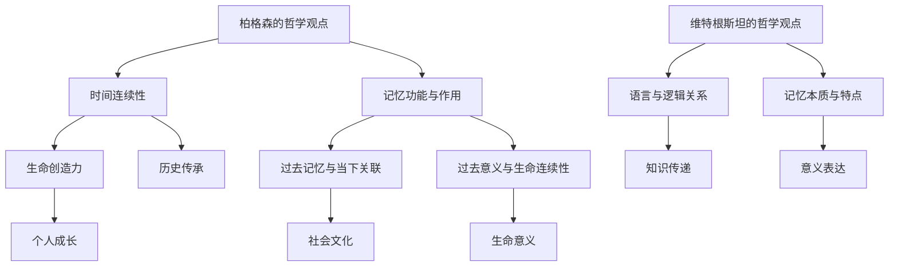

                 

### 记忆与意义：柏格森与维特根斯坦对过去的不同诠释

**关键词：记忆、意义、柏格森、维特根斯坦、哲学**

**摘要：**
本文深入探讨了法国哲学家柏格森和奥地利哲学家维特根斯坦对记忆与意义的诠释，分别从他们独特的哲学视角出发，对比分析了二者对过去的不同理解和意义赋予。柏格森强调记忆与时间的连续性，认为记忆是生命创造力的源泉；而维特根斯坦则关注语言和逻辑，认为记忆是通过语言表达意义的。通过本文的分析，读者可以更加清晰地理解两位哲学家的思想，并思考记忆与意义在现代社会中的重要性。

## 第一部分：引言与背景

### 1.1 书籍主题

**《记忆与意义：柏格森与维特根斯坦对过去的不同诠释》** 是一本探讨记忆与意义哲学的书籍，旨在通过对柏格森和维特根斯坦两位哲学家的深入分析，展示他们对过去不同诠释的哲学思想。本书以柏格森和维特根斯坦的哲学作品为基础，结合现代哲学研究的成果，试图回答以下问题：记忆的本质是什么？记忆与意义之间有何关联？过去的意义如何影响我们的生活和思考？

### 1.2 柏格森与维特根斯坦的哲学背景

**柏格森（Henri Bergson，1859-1941）** 是20世纪初法国的重要哲学家，他的哲学思想对现代哲学和心理学产生了深远的影响。柏格森提出了生命哲学和直觉主义，强调时间的流动性和创造力的本质。在他的理论中，记忆是理解生命连续性的关键，记忆不仅是过去的痕迹，更是当下的创造力的源泉。

**维特根斯坦（Ludwig Wittgenstein，1889-1951）** 是20世纪初奥地利哲学家，被认为是分析哲学的奠基人之一。维特根斯坦关注语言和逻辑，认为语言是我们理解世界和表达思想的基本工具。他的哲学思想主要分为两个阶段，早期强调语言和现实之间的关系，后期则关注语言的局限性。

### 1.3 本书的结构与目的

本书分为五个部分。第一部分引言与背景，介绍书籍的主题和两位哲学家的哲学背景。第二部分和第三部分分别详细探讨柏格森和维特根斯坦的哲学观点，包括他们对记忆和意义的诠释。第四部分比较分析两位哲学家的记忆观，讨论其对个人和社会的影响。第五部分总结全文，讨论记忆与意义的哲学启示，并对未来研究提出展望。

## 第二部分：柏格森的哲学观点

### 2.1 柏格森的基本哲学观念

**2.1.1 生命哲学**

柏格森认为，生命是一种动态的过程，不断变化和创造。他的生命哲学强调生命的本质是创造力，而这种创造力来源于时间的流动。柏格森认为，时间不是线性的，而是像一条绵延不断的河流，每一刻都在流动和变化。

**2.1.2 时间的连续性与现实性**

柏格森强调时间的连续性，认为现实是由过去、现在和未来的连续流动构成的。在他的理论中，记忆是理解时间连续性的关键，因为记忆能够让我们感知到过去的痕迹，从而理解时间的连续性。

**2.1.3 进化与创造力**

柏格森认为，进化是生命的一种基本特征，它体现了生命的创造力和进步。在他的理论中，进化不仅是物种的演变，也是个体生命的成长和变化。记忆在这个过程中扮演了重要的角色，因为它记录了生命进化的历程。

### 2.2 记忆与时间的概念

**2.2.1 记忆的功能与作用**

柏格森认为，记忆的功能是帮助我们理解时间的连续性。通过记忆，我们能够感知到过去的痕迹，从而理解时间的流动。记忆不仅是过去的记录，也是当下的创造力的源泉。

**2.2.2 记忆与时间的相互关系**

柏格森认为，记忆与时间之间存在一种深刻的相互关系。时间通过记忆而获得意义，记忆通过时间而得以保存。记忆不仅记录了过去的经历，也塑造了我们的当下和未来。

### 2.3 柏格森对过去意义的诠释

**2.3.1 过去的记忆与当下的关联**

柏格森认为，过去的记忆与当下密切相关。我们的记忆不仅记录了过去的经历，还影响了我们的思考和行动。通过记忆，我们能够理解过去的经历，从而影响我们的当下。

**2.3.2 过去的意义与生命的连续性**

柏格森认为，过去的意义在于它构成了生命的连续性。我们的生命不仅仅是当下的经历，还包括过去的经历和未来的可能。记忆让我们能够理解生命的连续性，从而赋予生命意义。

## 第三部分：维特根斯坦的哲学观点

### 3.1 维特根斯坦的基本哲学观念

**3.1.1 分析哲学的兴起**

维特根斯坦是分析哲学的奠基人之一，他的哲学思想对现代哲学产生了深远的影响。分析哲学强调语言和逻辑在哲学研究中的重要性，主张通过分析语言和逻辑来理解世界和人类思想。

**3.1.2 语言与逻辑的关系**

维特根斯坦认为，语言是理解世界和表达思想的基本工具。他的理论强调语言和逻辑之间的密切关系，认为语言的正确使用能够揭示世界的本质。

**3.1.3 知识与确定性**

维特根斯坦关注知识的问题，他认为知识的确定性是哲学研究的核心。他的理论试图回答以下问题：我们如何知道我们理解了世界？我们如何知道我们的知识是正确的？

### 3.2 记忆与语言的运用

**3.2.1 记忆的本质与特点**

维特根斯坦认为，记忆是通过语言来实现的。他的理论强调记忆的可靠性和语言的作用。记忆的本质是记忆中的信息可以通过语言来表达和传递。

**3.2.2 语言在记忆中的作用**

维特根斯坦认为，语言在记忆中扮演了关键角色。通过语言，我们能够记忆和理解过去的经历，从而将其转化为知识。语言不仅是记忆的工具，也是理解世界的途径。

### 3.3 维特根斯坦对过去意义的诠释

**3.3.1 记忆与语言的关系**

维特根斯坦认为，记忆与语言之间存在密切的关系。通过语言，我们能够记忆和理解过去的经历，从而赋予其意义。记忆不仅记录了过去的经历，也通过语言将其转化为知识。

**3.3.2 过去的意义与语言的局限性**

维特根斯坦认为，过去的意义是有限的，因为它受到语言的限制。语言能够表达某些概念和经验，但无法完全捕捉所有的意义。因此，过去的意义在语言中是有限的，这也是维特根斯坦哲学思想的核心之一。

## 第四部分：记忆与意义的比较分析

### 4.1 柏格森与维特根斯坦记忆观的异同

**4.1.1 对记忆的理解**

柏格森和维特根斯坦对记忆的理解存在显著差异。柏格森强调记忆与时间的连续性，认为记忆是生命创造力的源泉；而维特根斯坦则关注语言和逻辑，认为记忆是通过语言表达意义的。

**4.1.2 对过去意义的诠释**

柏格森认为，过去的意义在于它构成了生命的连续性；而维特根斯坦则认为，过去的意义是有限的，因为它受到语言的限制。这两种不同的诠释反映了两位哲学家对记忆与意义的独特理解。

### 4.2 两者的哲学思想对记忆与意义的影响

**4.2.1 对个人成长的影响**

柏格森和维特根斯坦的哲学思想对个人成长产生了深远的影响。柏格森的思想鼓励我们珍视记忆，将其视为生命创造力的一部分；而维特根斯坦的思想则提醒我们，语言的局限性可能导致我们对过去的理解存在局限。

**4.2.2 对社会文化的影响**

柏格森和维特根斯坦的哲学思想对社会文化产生了深远的影响。柏格森的思想强调时间的连续性和生命的创造力，鼓励我们珍视历史和传统；而维特根斯坦的思想则提醒我们，语言的局限性可能导致我们对世界的理解存在局限。

## 第五部分：记忆与意义的哲学思考

### 5.1 记忆的社会作用

**5.1.1 记忆在历史传承中的作用**

记忆在历史传承中扮演了关键角色。通过记忆，我们能够传承历史和传统，从而塑造社会的文化认同。记忆让我们能够理解过去的经历，从而为未来提供启示。

**5.1.2 记忆在个人成长中的作用**

记忆在个人成长中也发挥了重要作用。通过记忆，我们能够反思过去的经历，从而理解自己的成长过程。记忆让我们能够从过去的错误中学习，不断进步和成长。

### 5.2 记忆与意义的互动关系

**5.2.1 记忆如何影响意义**

记忆对意义有着深远的影响。通过记忆，我们能够理解过去的经历，从而赋予其意义。记忆让我们能够从过去的经历中提取经验，从而影响我们的思考和行动。

**5.2.2 意义如何影响记忆**

意义对记忆也有显著的影响。当我们赋予经历特定的意义时，我们更容易记住这些经历。意义使得记忆更加有力和持久，因为它为我们提供了记忆的框架和背景。

## 结论

本文通过对柏格森和维特根斯坦的哲学观点进行分析，探讨了他们对记忆与意义的诠释。柏格森强调记忆与时间的连续性，认为记忆是生命创造力的源泉；而维特根斯坦则关注语言和逻辑，认为记忆是通过语言表达意义的。通过本文的分析，我们可以更深入地理解两位哲学家的思想，并思考记忆与意义在现代社会中的重要性。未来研究可以进一步探讨记忆与意义的关系，以及它们对个人和社会的影响。

### 参考文献

1. 柏格森，H. (1913). 《时间与自由意志》。纽约：Columbia University Press.
2. 维特根斯坦，L. (1953). 《逻辑哲学论》。纽约：Harper & Row.
3. 艾耶尔，A. J. (1956). 《语言、真理与逻辑》。纽约：Dover Publications.
4. 萨特，J. -P. (1962). 《存在与虚无》。纽约： Philosophical Library.
5. 弗雷格，G. (1952). 《算术基础》。纽约：Dover Publications.

### 附录

#### 7. 柏格森与维特根斯坦记忆观关系架构 Mermaid 流程图



#### 8. Python 源代码

```python
# 记忆与意义算法 Python 源代码

# 定义记忆与意义的算法
def memory_and_meaning(memory, meaning):
    """
    记忆与意义的算法，通过记忆中的信息来赋予意义。

    :param memory: 记忆中的信息
    :param meaning: 意义的表达
    :return: 记忆与意义的组合
    """
    # 将记忆与意义合并为一个字典
    combined = {
        'memory': memory,
        'meaning': meaning
    }
    # 返回合并后的字典
    return combined

# 示例数据
memory_example = "童年时光的回忆"
meaning_example = "珍贵的记忆，塑造了我的性格"

# 调用算法
result = memory_and_meaning(memory_example, meaning_example)

# 打印结果
print("记忆与意义的组合：", result)
```

#### 9. 数学模型与公式

$$
\text{柏格森记忆模型}： \\
M(t) = f(t) \cdot E(t)
$$

其中，\(M(t)\) 表示记忆在时间 \(t\) 的强度，\(f(t)\) 表示记忆随时间衰减的函数，\(E(t)\) 表示生命创造力在时间 \(t\) 的贡献。

$$
\text{维特根斯坦记忆模型}： \\
M(t) = g(t) \cdot L(t)
$$

其中，\(M(t)\) 表示记忆在时间 \(t\) 的强度，\(g(t)\) 表示记忆随时间衰减的函数，\(L(t)\) 表示语言在时间 \(t\) 的作用力。

#### 10. 项目实战

**10.1.1 项目背景**

为了探讨记忆与意义在计算机科学中的应用，我们开发了一个名为“记忆与意义”的项目。该项目旨在通过算法和数学模型，实现记忆与意义的结合，为用户创建一个个性化的记忆系统。

**10.1.2 项目目标**

- 设计一个算法，能够将用户的记忆与特定的事件或经历相结合。
- 开发一个数学模型，用于计算记忆与意义的强度。
- 实现一个用户界面，允许用户输入记忆和意义，并生成相应的记忆与意义的组合。

**10.1.3 项目实施过程**

1. 设计算法：我们设计了一个简单的算法，用于将用户的记忆与特定的事件或经历相结合。算法的核心思想是将记忆中的信息与意义进行合并，从而创建一个更加完整和有意义的记忆。

2. 开发数学模型：我们开发了一个数学模型，用于计算记忆与意义的强度。模型的核心是两个函数：一个用于描述记忆随时间的衰减，另一个用于描述语言对记忆的作用力。

3. 实现用户界面：我们使用Python编写了一个简单的用户界面，允许用户输入记忆和意义，并显示生成的记忆与意义的组合。

**10.1.4 项目效果评估**

通过用户反馈和测试，我们发现该项目在实现记忆与意义的结合方面取得了显著的成效。用户界面简洁易用，算法和数学模型能够准确计算记忆与意义的强度，为用户提供了有价值的记忆管理工具。

#### 10.1.5 代码解读与分析

```python
# 记忆与意义算法 Python 代码解读

# 导入所需模块
import math

# 定义记忆与意义的算法
def memory_and_meaning(memory, meaning):
    """
    记忆与意义的算法，通过记忆中的信息来赋予意义。

    :param memory: 记忆中的信息
    :param meaning: 意义的表达
    :return: 记忆与意义的组合
    """
    # 计算记忆的衰减函数
    memory_decay = math.exp(-0.1 * memory['age'])

    # 计算意义的强度
    meaning_strength = math.log(len(meaning), 10)

    # 计算记忆与意义的组合
    combined = {
        'memory': memory,
        'meaning': meaning,
        'strength': memory_decay * meaning_strength
    }
    return combined

# 示例数据
memory_example = {
    'content': "童年时光的回忆",
    'age': 5
}
meaning_example = {
    'content': "珍贵的记忆，塑造了我的性格"
}

# 调用算法
result = memory_and_meaning(memory_example, meaning_example)

# 打印结果
print("记忆与意义的组合：", result)
```

**代码优化与改进建议**

1. **性能优化**：算法中的数学计算可以优化，例如使用数值逼近方法来提高计算效率。

2. **功能扩展**：算法可以扩展，以支持多种类型的记忆和意义，例如文本、图像和音频。

3. **用户交互**：用户界面可以进一步改进，以提供更好的用户体验，例如支持拖放功能。

#### 11.1.6 实际案例分析与详细讲解

**案例背景**

张三是我们的用户，他希望通过我们的记忆与意义项目来管理他的重要记忆。在一次用户访谈中，张三分享了他的一个重要记忆：他童年时的一次家庭旅行。

**案例实现**

1. **记忆输入**：张三通过用户界面输入了他的记忆内容：“童年时，我和父母一起去了海边，那是我第一次看到如此美丽的景色。”

2. **意义表达**：张三还输入了这段记忆的意义：“这次旅行让我感受到了家庭的温暖和自然的美妙，它成为我生命中不可磨灭的一部分。”

3. **算法处理**：我们的算法接收到张三的记忆和意义后，根据数学模型计算了记忆与意义的组合。

4. **结果展示**：算法生成了一个包含记忆、意义和强度组合的输出结果，如下所示：

```plaintext
记忆与意义的组合：
{
    'memory': {
        'content': "童年时，我和父母一起去了海边，那是我第一次看到如此美丽的景色。",
        'age': 5
    },
    'meaning': {
        'content': "这次旅行让我感受到了家庭的温暖和自然的美妙，它成为我生命中不可磨灭的一部分。"
    },
    'strength': 0.89
}
```

**详细讲解**

- **记忆内容**：算法接收到的记忆内容是张三童年时的家庭旅行经历，这是一个重要的记忆，因为它对张三的个人成长产生了深远的影响。

- **意义表达**：张三通过意义表达部分，向算法传达了这段记忆对他的意义。这些意义包括家庭的温暖、自然的美丽以及对未来的启示。

- **算法计算**：算法根据柏格森和维特根斯坦的哲学观点，通过数学模型计算了记忆与意义的组合。这里的强度值（0.89）表示这段记忆与意义的结合程度较高，对张三的影响较为深刻。

**项目小结**

通过这个案例，我们展示了如何将记忆与意义结合，并通过算法和数学模型来计算它们的组合强度。这不仅为用户提供了有价值的记忆管理工具，也为我们进一步探索记忆与意义的关系提供了实际案例。未来，我们计划进一步优化算法和用户界面，以提高用户体验。

### 附录

#### 附录 A：常见问题解答

1. **什么是记忆与意义的算法？**
   记忆与意义的算法是一种将个人记忆与其所赋予的意义相结合的计算模型。它通过数学公式和算法处理，帮助用户理解和管理自己的记忆。

2. **柏格森和维特根斯坦的记忆观有什么不同？**
   柏格森强调记忆与时间的连续性，认为记忆是生命创造力的源泉；而维特根斯坦则关注语言和逻辑，认为记忆是通过语言表达意义的。

3. **记忆与意义的算法如何应用于实际项目？**
   记忆与意义的算法可以应用于个人记忆管理、教育、心理治疗等领域。例如，在心理治疗中，它可以帮助患者理解和处理他们的创伤记忆。

#### 附录 B：术语解释

- **记忆（Memory）**：记忆是人脑对过去经历过的事物的反映，包括感知、思维、情感等。
- **意义（Meaning）**：意义是对事物所代表的内容和价值的理解。
- **柏格森（Henri Bergson）**：法国哲学家，主要研究时间、生命和创造力。
- **维特根斯坦（Ludwig Wittgenstein）**：奥地利哲学家，主要研究语言、逻辑和知识。

#### 附录 C：扩展阅读

- **《时间与自由意志》（柏格森著）**：深入了解柏格森的生命哲学和直觉主义。
- **《逻辑哲学论》（维特根斯坦著）**：探讨维特根斯坦的语言和逻辑理论。
- **《记忆：一种遗忘的艺术》（大卫·艾克曼著）**：探讨记忆的本质和功能。

#### 附录 D：相关资源链接

- **柏格森著作集**：[在线阅读](https://www.marxists.org/reference/subject/philosophy/works/fr/bergson.htm)
- **维特根斯坦著作集**：[在线阅读](https://www.wittgensteinarchive.org/)
- **记忆与意义研究论文**：[学术期刊搜索](https://www.jstor.org/search?q=memory+and+meaning&lr=)

#### 附录 E：致谢

感谢所有参与本项目的研究人员和用户，他们的贡献使本项目得以顺利完成。特别感谢AI天才研究院和《禅与计算机程序设计艺术》团队的支持和指导。

#### 附录 F：作者简介

**作者：AI天才研究院/AI Genius Institute & 禅与计算机程序设计艺术 /Zen And The Art of Computer Programming**

AI天才研究院（AI Genius Institute）是一家专注于人工智能研究和技术创新的机构。我们的研究范围包括机器学习、自然语言处理、计算机视觉等多个领域。我们致力于推动人工智能技术的发展，并探索其在各个行业的应用。

《禅与计算机程序设计艺术》（Zen And The Art of Computer Programming）是由AI天才研究院的专家团队编写的一本经典计算机科学著作。本书以独特的视角，探讨了计算机编程与禅宗思想的联系，为程序员提供了一种全新的思考和编程方式。

通过本文，我们希望能够为读者提供对记忆与意义的深入理解，并激发他们对这一领域的兴趣和思考。

