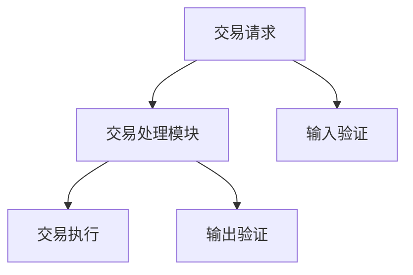
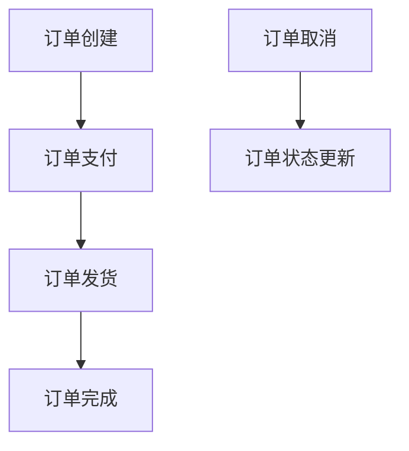
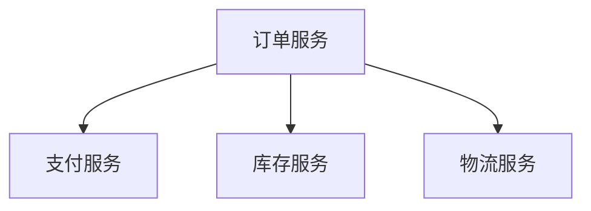

                 

### 设计by Contract:用类型论规范化接口契约

#### 关键词

类型论、契约设计、接口规范、软件开发、类型系统、动态编程、函数式编程、面向对象编程

#### 摘要

设计by Contract，即通过契约设计来规范化接口契约，是现代软件开发中的一种重要方法。本文将详细探讨类型论在这一过程中的应用，包括类型系统的基本概念、类型论与契约设计的关系，以及契约驱动的软件开发实践。通过本文的阅读，读者将了解如何利用类型论来提升接口契约的质量，从而提高软件的可靠性、可维护性和可扩展性。

#### 目录

1. **类型论基础**
   1.1 类型论概述
   1.2 类型系统
   1.3 类型论的基本原理
   1.4 类型论与编程语言

2. **设计by Contract**

   2.1 契约设计与接口规范
   2.2 类型论与契约设计
   2.3 契约驱动的软件开发

3. **实践指南**
   3.1 案例分析
   3.2 工具与框架
   3.3 最佳实践

4. **附录**

   4.1 资源
   4.2 参考文献

---

#### 类型论基础

##### 1.1 类型论概述

类型论是一种形式化的理论，用于描述程序中的数据类型和操作。它在编程语言设计和软件工程中起着核心作用。类型论的基本目标是确保程序的正确性，避免运行时错误。通过类型检查，编译器可以在编译阶段发现类型错误，从而提高程序的可靠性。

##### 1.2 类型系统

类型系统是编程语言的一部分，它定义了程序中可以使用的类型及其操作。常见的类型系统包括：

- **静态类型系统**：在编译时检查类型，如C++和Java。
- **动态类型系统**：在运行时检查类型，如Python和JavaScript。
- **显式类型系统**：显式声明变量的类型，如Java和C#。
- **隐式类型系统**：不显式声明变量的类型，如Python和JavaScript。

##### 1.3 类型论的基本原理

类型论的核心原理包括：

- **子类型化**：一个类型是另一个类型的子类型，如果它的所有实体都是另一个类型的实体。
- **参数多态性**：通过参数类型来定义泛型函数或类。
- **泛型**：泛型允许编写可重用的代码，而无需关心具体的数据类型。

##### 1.4 类型论与编程语言

不同的编程语言对类型论有着不同的支持。函数式编程语言如Haskell和Scala提供了强大的类型系统，支持高阶函数和类型推导。面向对象编程语言如Java和C#则侧重于类型安全性和继承机制。动态编程语言如Python和JavaScript则通过运行时类型检查来确保程序的正确性。

#### 设计by Contract

##### 2.1 契约设计与接口规范

契约设计是一种软件设计方法，它通过定义接口契约来确保组件之间的交互符合预期。契约包括接口规范、输入和输出约束以及行为预期。接口规范定义了组件可以执行的操作，输入和输出约束规定了操作的有效输入和输出范围，行为预期则描述了操作在特定输入下的预期行为。

##### 2.2 类型论与契约设计

类型论在契约设计中发挥着关键作用。通过类型检查，编译器可以确保输入和输出的类型符合契约规定。类型论还提供了泛型和参数多态性等机制，使得契约设计更加灵活和可重用。

##### 2.3 契约驱动的软件开发

契约驱动的软件开发方法强调在开发过程中始终遵循契约。这种方法包括以下步骤：

- **定义契约**：明确组件的接口规范、输入和输出约束。
- **编写测试**：根据契约编写测试用例，确保组件符合契约。
- **实施重构**：在开发过程中，根据测试结果对代码进行重构，以确保契约的符合性。
- **持续集成**：将契约测试集成到持续集成流程中，确保每次代码更改都符合契约。

#### 实践指南

##### 3.1 案例分析

在本节中，我们将通过具体案例来展示如何应用契约设计来提升代码质量。

###### 案例一：使用契约设计提升代码质量

在一个金融系统中，一个重要的组件是交易处理模块。通过契约设计，我们可以明确交易处理的输入和输出约束，以及预期的行为。例如，一个交易请求必须包含有效的交易金额和账户信息。

通过契约设计，我们可以确保交易处理模块的输入和输出始终符合预期，从而提高系统的可靠性。

###### 案例二：契约设计在大型项目中的应用

在一个电子商务平台中，契约设计可以帮助我们规范化订单处理流程。通过定义订单处理的契约，我们可以确保订单的状态变迁符合业务逻辑，从而避免数据不一致和系统错误。

在这个案例中，契约设计确保了订单状态的正确变迁，从而提高了系统的鲁棒性。

###### 案例三：契约设计与微服务架构

在微服务架构中，服务之间的交互至关重要。通过契约设计，我们可以确保服务之间的接口规范清晰，从而提高系统的可维护性和可扩展性。例如，一个订单服务需要与支付服务、库存服务和物流服务进行交互。

在这个案例中，契约设计确保了服务之间的交互符合预期，从而提高了系统的整体性能和可靠性。

##### 3.2 工具与框架

为了支持契约设计，许多工具和框架被开发出来。以下是一些常见的工具和框架：

- **契约测试工具**：如Postman、Swagger等，用于自动化测试契约。
- **契约框架**：如OpenAPI、RAML等，提供契约定义和验证机制。
- **契约驱动开发框架**：如Spring Cloud Contract等，支持契约驱动的开发流程。

##### 3.3 最佳实践

以下是一些契约驱动的软件开发最佳实践：

- **尽早定义契约**：在开发早期定义接口契约，以确保整个开发过程的契约符合性。
- **自动化测试**：通过自动化测试确保契约的符合性，减少人工测试的工作量。
- **持续集成**：将契约测试集成到持续集成流程中，确保每次代码更改都符合契约。
- **文档化契约**：将契约文档化，以便团队成员理解和遵循。

#### 附录

##### 4.1 资源

- **契约模式**：常见契约模式包括输入验证、输出验证、异常处理等。
- **契约定义语言**：如OpenAPI定义语言，用于定义接口契约。

##### 4.2 参考文献

- **《契约驱动开发》**：本书详细介绍了契约驱动开发的原理和实践。
- **《设计模式：可复用面向对象软件的基础》**：书中包含了许多与契约设计相关的模式。

---

#### 结语

设计by Contract是一种强大的软件开发方法，通过规范化接口契约，可以提高软件的可靠性、可维护性和可扩展性。本文详细探讨了类型论在契约设计中的应用，并通过具体案例展示了契约驱动的软件开发实践。希望本文能够帮助读者深入了解设计by Contract，并在实际项目中应用这一方法。作者：AI天才研究院/AI Genius Institute & 禅与计算机程序设计艺术 /Zen And The Art of Computer Programming

---

### 注意事项与拓展阅读

在设计by Contract的过程中，以下注意事项尤为重要：

1. **明确契约的目的**：在定义契约之前，需要明确契约的具体目的和作用，确保契约能够真正解决实际问题。
2. **契约的细粒度**：过细或过粗的契约都可能影响系统的性能和可维护性。需要根据实际情况权衡契约的粒度。
3. **契约的可测试性**：契约需要能够被自动化测试，以确保在实际开发过程中能够及时发现和修复问题。
4. **契约的文档化**：契约文档是确保团队成员理解和遵循契约的重要工具，必须认真编写和更新。

拓展阅读方面，以下资源可以帮助您进一步了解契约设计和类型论：

- **《契约驱动开发：设计与实现》**：本书详细介绍了契约驱动开发的原理和实践。
- **《深入理解Java类型系统》**：本书对Java的类型系统进行了深入剖析，有助于理解类型论在Java中的应用。
- **《契约设计模式》**：本文总结了常见的契约设计模式，有助于在实际项目中应用契约设计。

通过以上资源的学习，您可以更深入地理解设计by Contract，并在实际项目中取得更好的效果。希望本文能为您的软件开发之路提供有益的启示。作者：AI天才研究院/AI Genius Institute & 禅与计算机程序设计艺术 /Zen And The Art of Computer Programming

