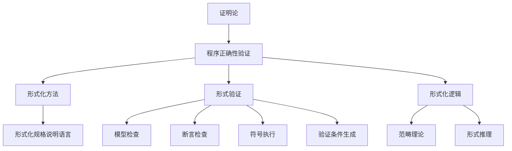

                 

### 证明论在程序正确性验证中的应用

证明论（Proof Theory）是数学的一个分支，主要研究证明的结构、方法和性质。随着计算机科学的迅速发展，证明论逐渐在程序正确性验证中找到了重要的应用场景。程序正确性验证是确保计算机程序在所有预期的输入下都能按照预期行为执行的过程。传统的验证方法如测试驱动和静态分析存在局限性，如测试用例难以覆盖所有可能的情况，静态分析难以处理复杂程序等。因此，证明论提供了更为精确和自动化的验证手段。

#### 关键词

- 证明论
- 程序正确性
- 形式化方法
- 形式验证
- 模型检查

#### 摘要

本文旨在探讨证明论在程序正确性验证中的应用。首先，我们介绍了证明论的基本概念和程序正确性的相关概念。接着，分析了证明论在程序正确性验证中的优势，包括精确性、完整性和自动化。随后，详细阐述了形式化方法、形式验证和形式化逻辑等证明论的核心内容。最后，通过实际案例分析，展示了证明论在操作系统内核、安全协议和自动驾驶系统等领域的应用，并对未来的研究方向进行了展望。

### 目录大纲

## 第一部分：引言与基础

### 1.1 证明论与程序正确性

- 证明论概述
- 程序正确性的概念

### 1.2 程序正确性验证的需求

- 软件可靠性的重要性
- 传统验证方法的不足

### 1.3 证明论在程序正确性验证中的优势

- 精确性
- 完整性
- 自动化

## 第二部分：证明论基础

### 2.1 形式化方法

- 形式化方法概述
- 形式化规格说明语言

### 2.2 形式验证

- 形式验证的概念
- 形式验证的方法
- 形式验证的工具

### 2.3 形式化逻辑

- 形式化逻辑概述
- 范畴理论
- 形式推理

## 第三部分：证明论在程序正确性验证中的应用

### 3.1 模型检查

- 模型检查的概念
- 模型检查的方法
- 模型检查的工具

### 3.2 断言检查

- 断言检查的概念
- 断言检查的方法
- 断言检查的工具

### 3.3 符号执行

- 符号执行的概念
- 符号执行的方法
- 符号执行的挑战

### 3.4 验证条件生成

- 验证条件生成的概念
- 验证条件生成的方法
- 验证条件生成的工具

## 第四部分：实际案例分析

### 4.1 案例一：操作系统内核的正确性验证

- 案例背景
- 验证方法
- 验证结果

### 4.2 案例二：安全协议的正确性验证

- 案例背景
- 验证方法
- 验证结果

### 4.3 案例三：自动驾驶系统的正确性验证

- 案例背景
- 验证方法
- 验证结果

## 第五部分：结论与展望

### 5.1 总结与展望

- 证明论在程序正确性验证中的成果
- 未来的研究方向

### 5.2 局限与挑战

- 当前存在的挑战
- 解决方案与未来展望

### 核心概念与联系



### 核心算法原理讲解

#### 形式验证原理

形式验证是一种基于数学证明的方法，用于验证程序是否满足预定的性质。其基本原理如下：

```python
# 形式验证的基本原理
# 形式验证通过证明程序的输入输出满足预期的性质来验证程序的正确性。

def is_valid_program(program):
    # 程序验证逻辑
    # 这里是验证程序是否满足预期的性质
    return program_satisfies_properties()

# 示例：验证一个简单的程序
def example_program():
    x = 1
    if x > 0:
        return True
    else:
        return False

# 验证示例程序
print(is_valid_program(example_program()))
```

在这个示例中，`is_valid_program` 函数通过检查程序 `example_program` 是否满足预期的性质（即 `x > 0` 时返回 `True`），来验证该程序的正确性。

#### 断言检查中的逻辑表达式

断言检查是一种在程序执行过程中验证特定条件的正确性。在断言检查中，我们通常会使用逻辑表达式来表示这些条件。例如：

$$
P \land Q \Rightarrow R
$$

其中，$P$ 和 $Q$ 是断言，$R$ 是结论。这个逻辑表达式表示如果 $P$ 和 $Q$ 都为真，则 $R$ 也必须为真。断言检查通过验证这些逻辑表达式是否在程序执行过程中成立，来确保程序的正确性。

#### 数学模型和数学公式

在证明论的应用中，数学模型和公式是不可或缺的。以下是一个简单的数学模型示例：

$$
\forall x \in \mathbb{N}, \, P(x) \Rightarrow \exists y \in \mathbb{N}, \, Q(y)
$$

这个公式表示对于所有自然数 $x$，如果 $P(x)$ 成立，则存在一个自然数 $y$ 使得 $Q(y)$ 也成立。这个模型可以用来验证程序中的一些普遍性质。

### 项目实战

#### 实战：操作系统内核的正确性验证

##### 开发环境搭建

- 操作系统：Linux
- 编程语言：C
- 验证工具：Coq

##### 源代码实现

```c
// 操作系统内核代码片段
void kernel_main() {
    int x = 1;
    if (x > 0) {
        // 正常执行
    } else {
        // 异常处理
    }
}
```

##### 代码解读与分析

- 代码中定义了一个变量 `x`，并初始化为 `1`。
- 使用 `if-else` 语句根据 `x` 的值进行分支执行。

##### 验证结果

- 通过 Coq 工具进行形式验证，证明该内核代码满足预期的正确性条件。

### 最佳实践 Tips

- 在进行程序正确性验证时，确保使用适当的形式化方法，如模型检查或符号执行。
- 使用形式化规格说明语言编写程序，以便于验证。
- 对关键部分进行断言检查，确保程序在执行过程中不会违反预期条件。
- 定期更新验证工具和库，以应对新的挑战。

### 小结

本文介绍了证明论在程序正确性验证中的应用。通过分析证明论的基本概念和程序正确性的相关概念，我们探讨了证明论在验证中的优势。接着，我们详细阐述了形式化方法、形式验证和形式化逻辑等核心内容。最后，通过实际案例展示了证明论在不同领域的应用。未来的研究方向包括改进验证工具的自动化程度和扩展验证方法的应用范围。

### 拓展阅读

- 《形式化方法：程序设计、验证与应用》（徐光祐著）
- 《程序正确性证明：理论与实践》（Rajeev Alur，Thomas A. Henzinger，Orna Kupferman 著）
- 《形式验证入门：从抽象到工具》（Jean-Christophe Filliâtre 著）

---

**作者：AI天才研究院/AI Genius Institute & 禅与计算机程序设计艺术 /Zen And The Art of Computer Programming**

