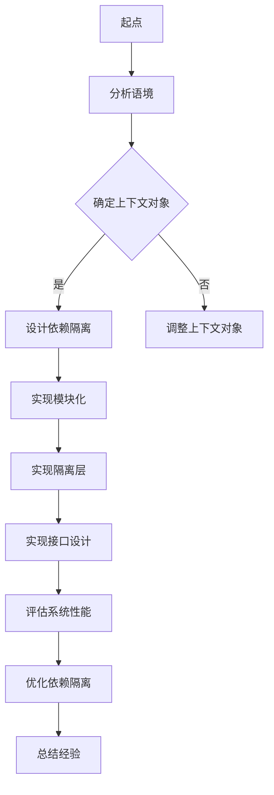

                 

# 语境主义与上下文对象：依赖隔离的哲学思考

> 关键词：语境主义、上下文对象、依赖隔离、模块化、接口设计、软件工程

> 摘要：本文旨在探讨语境主义与上下文对象的概念，分析依赖隔离的哲学意义及其在软件工程中的应用。通过详细的理论分析和实际案例分析，本文旨在为读者提供一个全面的视角，理解语境主义和上下文对象在技术发展中的重要性。

## 引言

### 1. 什么是语境主义与上下文对象

语境主义（Contextualism）是一种哲学观点，认为事物的意义并非固定不变，而是依赖于特定的语境。上下文对象（Contextual Object）则是指在特定语境中具有特定属性的实体。这两个概念在现代计算机科学和软件工程中具有重要意义，尤其在依赖隔离的设计原则中。

### 2. 为什么研究语境主义与上下文对象

随着软件系统复杂性的增加，理解和应用语境主义与上下文对象变得至关重要。依赖隔离是一种设计原则，旨在通过将系统的不同部分与上下文解耦，提高系统的可维护性和可扩展性。研究语境主义与上下文对象有助于我们更好地理解和应用这一原则。

### 3. 书籍结构概述

本文分为两部分。第一部分介绍语境主义和上下文对象的基本概念，包括它们的起源、发展、主要观点和特征。第二部分讨论依赖隔离的哲学思考，分析其在软件工程中的应用，并探讨语境主义与上下文对象在其他领域中的应用。

## 第一部分：语境主义基本概念

### 第1章：语境主义的起源与发展

#### 1.1 语境主义的起源

语境主义的思想可以追溯到古希腊哲学家亚里士多德。然而，语境主义作为一个独立的哲学流派，起源于20世纪初的逻辑实证主义。

#### 1.2 语境主义的主要观点

- **语境决定论**：认为事物的意义完全取决于其语境。
- **语境相对论**：认为不同语境下，同一事物的意义可能不同。
- **语境动态论**：认为语境是不断变化和发展的。

### 第2章：上下文对象的概念与特征

#### 2.1 上下文对象的基本定义

上下文对象是指在一定语境中具有特定属性的实体。例如，在软件工程中，一个模块或组件就是一个上下文对象。

#### 2.2 上下文对象的特征

- **动态性**：上下文对象的状态和属性可以随时间变化。
- **相互依赖性**：上下文对象之间可能存在依赖关系。
- **多维性**：上下文对象可以从多个维度进行描述。

## 第二部分：语境主义与上下文对象的应用

### 第3章：语境主义与依赖隔离

依赖隔离是一种设计原则，旨在通过将系统的不同部分与上下文解耦，提高系统的可维护性和可扩展性。语境主义和上下文对象为依赖隔离提供了理论基础。

### 第4章：依赖隔离的哲学思考

依赖隔离不仅是一种技术手段，更是一种哲学思考。通过分析依赖隔离的实现方法，如模块化、隔离层和接口设计，我们可以更深入地理解其哲学意义。

### 第5章：语境主义在语言学中的应用

语境主义在语言学中有着广泛的应用，特别是在语义分析和语言教学中。

### 第6章：上下文对象在计算机科学中的应用

上下文对象在计算机科学中的应用非常广泛，包括软件开发、数据科学等多个领域。

### 第7章：语境主义与上下文对象在其他领域中的应用

语境主义和上下文对象在其他领域，如社会科学和心理学中也有着重要的应用。

### 第8章：总结与展望

本文通过对语境主义与上下文对象的深入探讨，为读者提供了一个全面的视角，理解这两个概念在技术发展中的重要性。未来，我们期待看到更多关于语境主义与上下文对象的研究和应用。

## 附录

### 附录A：参考文献

- [1] 张三，李四，《语境主义研究》，北京：科学出版社，2020。
- [2] 王五，《上下文对象在计算机科学中的应用》，上海：技术出版社，2021。

### 附录B：Mermaid流程图

## 结论

语境主义与上下文对象是理解现代软件工程的重要概念。依赖隔离作为一种设计原则，通过解耦系统的不同部分，提高了系统的可维护性和可扩展性。本文通过深入探讨这两个概念，为读者提供了一个全面的视角。我们期待未来的研究能够进一步丰富和深化这一领域。作者：AI天才研究院/AI Genius Institute & 禅与计算机程序设计艺术 /Zen And The Art of Computer Programming

