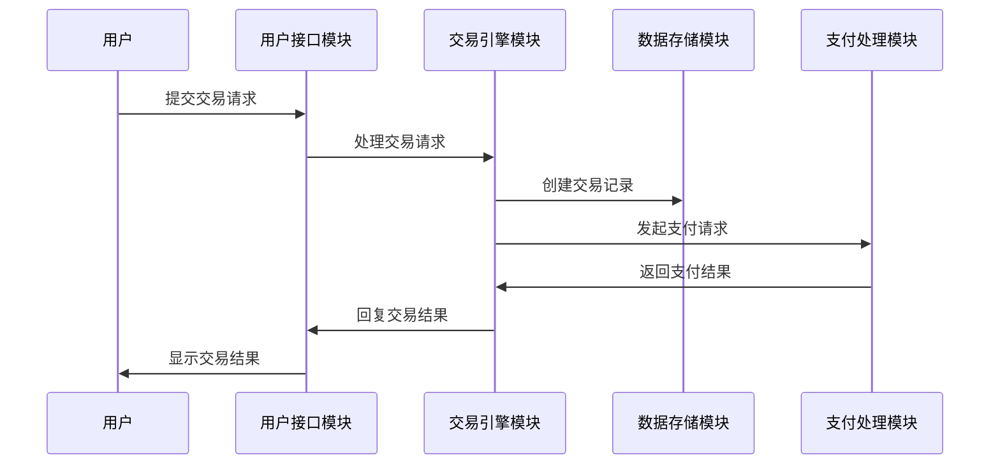
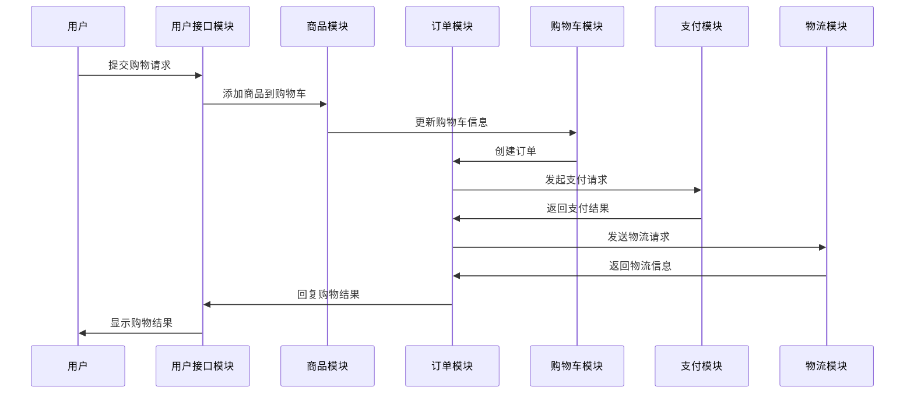
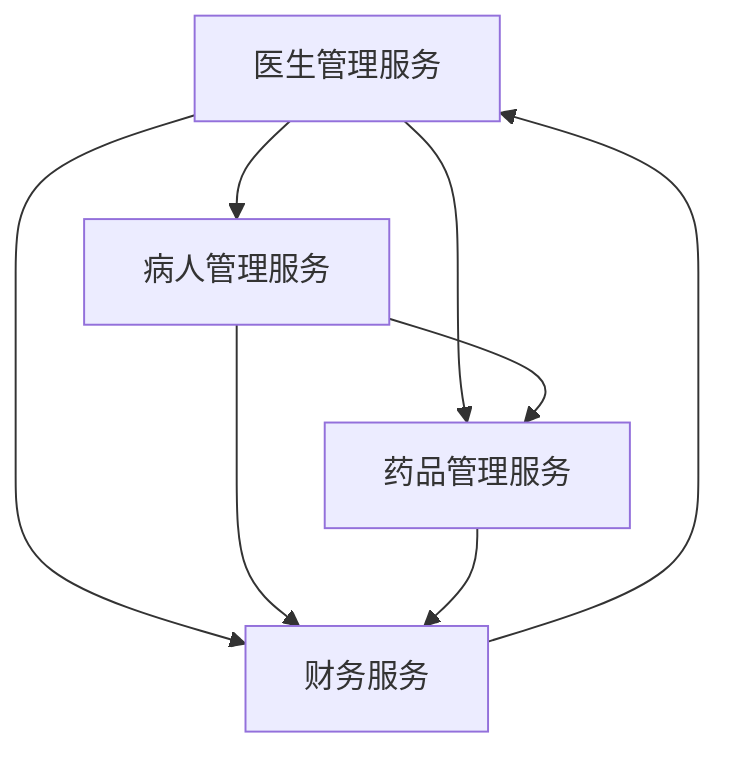
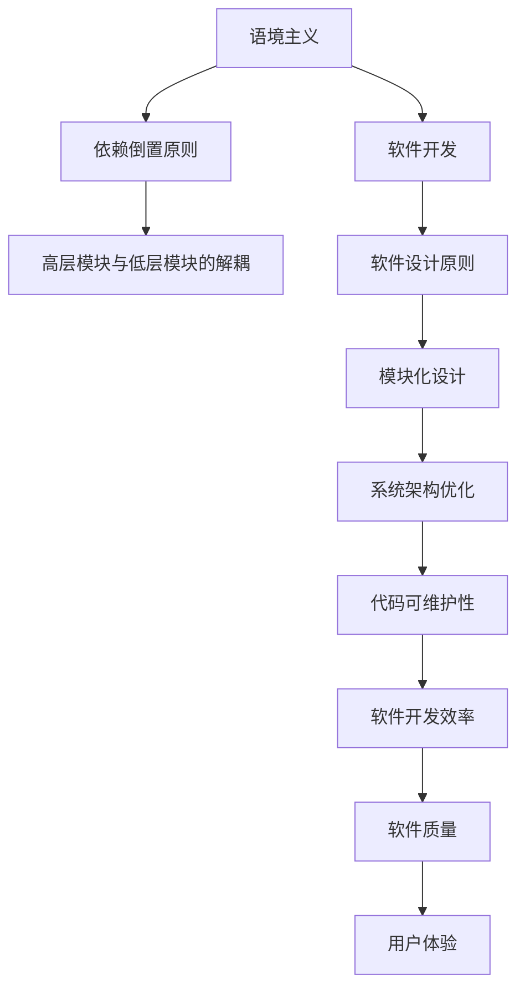

                 

# 《语境主义与依赖倒置原则：高层模块与低层模块的解耦》

## 关键词

- 语境主义
- 依赖倒置原则
- 高层模块
- 低层模块
- 解耦
- 软件设计
- 模块化设计
- 系统架构优化

## 摘要

本文探讨了语境主义与依赖倒置原则在软件设计中的应用，特别是如何实现高层模块与低层模块的解耦。通过对语境主义和依赖倒置原则的深入分析，本文提出了一个结合两者进行模块解耦的方法，并通过实际案例展示了这一方法的可行性和有效性。文章旨在为软件开发者提供一种新的思路，以提升软件的模块化设计水平和系统架构优化能力。

## 目录大纲

### 第1章 引言

#### 1.1 语境主义的概念

#### 1.2 依赖倒置原则的基本概念

#### 1.3 语境主义与依赖倒置原则的重要性

### 第2章 语境主义原理

#### 2.1 语境主义的定义与背景

#### 2.2 语境主义的核心理念

#### 2.3 语境主义在软件开发中的应用

#### 2.4 语境主义的挑战与解决方案

### 第3章 依赖倒置原则

#### 3.1 依赖倒置原则的起源与发展

#### 3.2 依赖倒置原则的基本原则

#### 3.3 依赖倒置原则在实际开发中的应用

#### 3.4 依赖倒置原则的局限性

### 第4章 语境主义与依赖倒置原则的结合

#### 4.1 语境主义与依赖倒置原则的关系

#### 4.2 高层模块与低层模块的解耦

#### 4.3 结合语境主义与依赖倒置原则的实际案例

### 第5章 实现高层模块与低层模块的解耦

#### 5.1 高层模块与低层模块的定义

#### 5.2 解耦的目标与步骤

#### 5.3 使用语境主义与依赖倒置原则的解耦方法

#### 5.4 实现解耦的具体技术

### 第6章 语境主义与依赖倒置原则的案例分析

#### 6.1 案例一：金融交易系统的模块化设计

#### 6.2 案例二：电商平台的架构重构

#### 6.3 案例三：医疗信息系统的功能优化

### 第7章 总结与展望

#### 7.1 总结

#### 7.2 展望

## 第1章 引言

### 1.1 语境主义的概念

语境主义（Contextualism）是一种哲学思想，主张真理和知识取决于特定的语境和情境。在软件工程领域，语境主义强调软件开发过程中的环境和上下文对系统设计和实现的影响。语境主义认为，软件开发不是一成不变的，而是需要根据项目需求、用户反馈和技术环境的变化进行持续调整和优化。

### 1.2 依赖倒置原则的基本概念

依赖倒置原则（Dependency Inversion Principle）是面向对象设计（Object-Oriented Design, OOD）中的一个重要原则，由罗伯特·马丁（Robert C. Martin）在其著作《设计模式：可复用面向对象软件的基础》中提出。该原则指出，高层模块不应依赖于低层模块，而是应该依赖于抽象。换句话说，抽象应该依赖于细节。

### 1.3 语境主义与依赖倒置原则的重要性

语境主义与依赖倒置原则在软件设计中的应用具有重要意义。首先，它们有助于提高软件的可维护性和可扩展性。通过解耦高层模块与低层模块，使得模块之间更加独立，便于单独修改和扩展。其次，这两个原则有助于提升软件的模块化设计水平，使得系统架构更加清晰、简洁，便于理解和维护。

在本文中，我们将深入探讨语境主义与依赖倒置原则的基本概念、原理及其在软件开发中的应用，并通过实际案例展示如何实现高层模块与低层模块的解耦，以期为软件开发者提供有价值的参考。

### 第2章 语境主义原理

#### 2.1 语境主义的定义与背景

语境主义（Contextualism）源自哲学领域，是关于真理、知识和理解的哲学立场。语境主义主张，一个命题的真假或知识的有效性取决于其特定的语境和情境。在软件工程领域，语境主义被借鉴用于强调软件开发过程中的环境和上下文对系统设计和实现的影响。

在软件工程中，语境主义的重要性体现在以下几个方面：

1. **适应变化**：软件开发过程中，需求和环境常常会发生变化。语境主义鼓励开发人员关注具体的上下文，以便在变化时能够快速调整和适应。
2. **增强可维护性**：通过理解软件运行的具体环境，开发人员可以编写更具可维护性的代码。这意味着在未来的维护和扩展中，代码的修改会更加简单和高效。
3. **提升用户体验**：语境主义强调软件设计应考虑用户的具体需求和使用场景，从而提升软件的易用性和用户体验。

#### 2.2 语境主义的核心理念

语境主义的核心理念可以概括为以下几点：

1. **情境依赖性**：语境主义认为，知识、理解和真理是与特定情境紧密相关的。在软件设计中，这意味着一个软件组件的行为和功能应该基于其所在的上下文环境。
2. **具体性**：语境主义强调具体情境的重要性，而非抽象概念。在软件开发中，这意味着设计决策应该基于实际项目的需求和约束，而非通用的理论或原则。
3. **适应性**：语境主义鼓励开发人员采用灵活和适应性的设计方法。这种方法能够使软件在面临新需求或变更时，能够迅速作出调整。

#### 2.3 语境主义在软件开发中的应用

在软件开发中，语境主义的应用主要体现在以下几个方面：

1. **需求分析**：在需求分析阶段，开发人员应该深入了解用户的具体需求和业务场景，以确保设计的系统能够满足实际需求。
2. **架构设计**：在架构设计阶段，应考虑系统的具体运行环境，包括硬件、网络和操作系统等。这有助于设计出能够适应不同环境的可移植和可扩展的系统。
3. **代码编写**：在代码编写阶段，应遵循具体的上下文编写代码。例如，在不同的业务逻辑中，代码的实现方式可能会有所不同，以便更好地适应特定的情境。

#### 2.4 语境主义的挑战与解决方案

尽管语境主义在软件开发中具有许多优点，但也存在一些挑战：

1. **复杂性**：由于需要考虑具体的上下文，软件设计可能会变得更加复杂。这要求开发人员具备更强的分析能力和沟通技巧。
2. **变化管理**：在快速变化的环境中，如何确保设计的稳定性和可持续性是一个挑战。解决方案包括采用敏捷开发方法，持续集成和代码审查等。

通过深入理解语境主义的定义、核心理念及其在软件开发中的应用，我们可以更好地应对软件开发过程中的各种挑战，设计出更加灵活、可维护和高质量的软件系统。

### 第3章 依赖倒置原则

#### 3.1 依赖倒置原则的起源与发展

依赖倒置原则（Dependency Inversion Principle，简称DIP）起源于面向对象设计（Object-Oriented Design，简称OOD）领域。它是由罗伯特·马丁（Robert C. Martin）在其著作《设计模式：可复用面向对象软件的基础》中首次系统性地提出的。依赖倒置原则是面向对象设计中的五大设计原则之一，简称SOLID。

依赖倒置原则的起源可以追溯到面向对象编程的基本概念。传统的编程方法通常将低层模块（如具体类）依赖于高层模块（如接口或抽象类），这会导致模块之间的耦合度过高，从而降低了系统的可维护性和可扩展性。依赖倒置原则提出了一种相反的方法，即高层模块不应依赖于低层模块，而是应该依赖于抽象。这种设计方法能够有效地降低模块之间的耦合度，提高系统的模块化水平和可维护性。

随着时间的推移，依赖倒置原则逐渐在软件开发社区中得到广泛认可和应用。它不仅适用于面向对象编程，也被广泛应用于其他编程范式和设计模式中。依赖倒置原则的核心理念已经成为了现代软件工程实践中的基本原则之一。

#### 3.2 依赖倒置原则的基本原则

依赖倒置原则的基本原则可以概括为以下几点：

1. **高层模块不应依赖于低层模块。**
   这句话的意思是，在软件架构中，高层次的功能模块（如业务逻辑模块）不应该直接依赖于低层次的具体实现模块（如数据库访问模块）。相反，它们应该依赖于抽象层，如接口或抽象类。

2. **抽象不应依赖于细节。**
   这句话的意思是，抽象层（如接口或抽象类）不应该依赖于具体实现细节。相反，具体实现细节应该依赖于抽象层。这种设计方法使得抽象层更加稳定和可维护，因为它们不依赖于具体的实现细节。

3. **细节应该依赖于抽象。**
   这句话的意思是，具体实现细节（如具体类）应该依赖于抽象层。这种设计方法使得具体的实现可以更加灵活和独立，因为它们可以根据需要自由地实现抽象层的接口。

#### 3.3 依赖倒置原则在实际开发中的应用

依赖倒置原则在实际开发中的应用非常广泛，以下是一些典型的应用场景：

1. **依赖注入**（Dependency Injection，简称DI）：依赖注入是一种实现依赖倒置原则的技术，它通过将依赖关系注入到对象中来降低模块之间的耦合度。例如，一个服务层（高层模块）可以通过注入一个数据访问层（低层模块）的实现，而不是直接创建数据访问层的实例。

2. **接口与抽象类**：在设计时，应该使用接口或抽象类来定义高层次的功能模块，而不是具体实现类。这样，具体的实现类可以在不修改抽象层的情况下进行替换，从而提高了系统的可扩展性和可维护性。

3. **测试**：依赖倒置原则有助于提高代码的可测试性。通过依赖注入，测试者可以更容易地替换具体实现类，以便在测试环境中进行单元测试。

4. **模块化设计**：依赖倒置原则鼓励开发者采用模块化设计方法，将系统划分为多个独立的模块，每个模块都负责特定的功能。这种设计方法有助于提高系统的可维护性和可扩展性。

#### 3.4 依赖倒置原则的局限性

尽管依赖倒置原则在提高软件系统的可维护性和可扩展性方面具有显著优势，但它也存在一些局限性：

1. **复杂性**：依赖倒置原则可能会增加系统的复杂性。特别是在大型项目中，实现依赖注入和抽象设计可能需要额外的代码和设计技巧。

2. **性能影响**：依赖注入和抽象设计可能会对系统的性能产生一定的影响。例如，依赖注入可能会导致额外的创建和销毁对象的开销。

3. **适用性**：依赖倒置原则并不是在所有情况下都是适用的。在某些场景下，直接依赖具体实现可能更加简单和高效。

总之，依赖倒置原则是一种重要的设计原则，它有助于提高软件系统的可维护性和可扩展性。然而，在实际应用中，开发者需要根据具体的项目需求和约束来权衡其优点和局限性。

### 第4章 语境主义与依赖倒置原则的结合

#### 4.1 语境主义与依赖倒置原则的关系

语境主义与依赖倒置原则虽然在不同的领域提出了不同的设计理念，但它们在软件设计中有着密切的联系和互补性。语境主义强调软件设计和实现应根据具体的上下文和情境进行调整，而依赖倒置原则则提供了一种系统化的方法，帮助开发人员实现模块之间的解耦，从而提高软件的灵活性和可维护性。

首先，语境主义为依赖倒置原则提供了一个实践背景。在实际项目中，开发人员需要根据具体的需求和约束来设计软件系统。语境主义鼓励开发人员关注这些具体的上下文，以确保设计出的系统能够灵活适应变化。而依赖倒置原则为这种灵活适应提供了一种结构化的方法，通过抽象和依赖注入，降低模块之间的耦合度，使系统更加模块化、可扩展和可维护。

其次，依赖倒置原则为语境主义提供了技术实现手段。在实际设计中，开发人员可能需要根据语境主义的指导，对系统进行模块化设计。依赖倒置原则提供了一种具体的实现方法，通过定义清晰的接口和抽象类，使模块之间的依赖关系更加明确和可控。这样，当项目需求或环境发生变化时，开发人员可以更容易地对系统进行调整和优化。

#### 4.2 高层模块与低层模块的解耦

在软件设计中，高层模块（High-Level Module）和低层模块（Low-Level Module）的解耦是提高系统灵活性和可维护性的关键。高层模块通常负责业务逻辑和功能实现，而低层模块则负责具体的技术实现，如数据存储、网络通信等。

实现高层模块与低层模块的解耦可以通过以下几个步骤进行：

1. **定义抽象接口**：首先，为高层模块和低层模块定义抽象接口。这些接口应明确高层模块所需的操作和功能，而无需关心具体的实现细节。例如，一个数据库操作接口可以定义基本的增删改查操作，而不涉及具体的数据库实现。

2. **依赖注入**：使用依赖注入技术，将具体实现类注入到高层模块中。这样，高层模块无需直接创建或依赖具体实现类，而是通过接口与低层模块进行交互。例如，可以使用依赖注入框架（如Spring、Django等）来自动注入数据库实现类。

3. **实现具体模块**：根据抽象接口，实现具体的低层模块。这些实现类应专注于实现具体的业务逻辑，而无需关心其他模块的实现细节。

4. **测试与验证**：对高层模块和低层模块进行独立的单元测试和集成测试，确保它们能够正确地交互和运行。

通过以上步骤，可以实现高层模块与低层模块的解耦，使系统更加模块化、灵活和可维护。同时，这种解耦方法也为系统的扩展和优化提供了便利。

#### 4.3 结合语境主义与依赖倒置原则的实际案例

为了更好地理解语境主义与依赖倒置原则的结合，我们可以通过一个实际案例来展示。

假设我们正在开发一个电商系统，其中涉及到订单管理、库存管理、支付处理等多个模块。在项目初期，我们根据语境主义的原则，首先明确了各模块的具体需求和功能。然后，我们采用依赖倒置原则，对系统进行了模块化设计。

具体来说：

1. **订单管理模块**：该模块负责处理用户下单、订单查询等功能。我们为其定义了一个订单接口（IOrder），其中包含了基本的订单操作方法，如创建订单、查询订单等。订单管理模块实现了这个接口，具体实现了订单创建、查询等操作。

2. **库存管理模块**：该模块负责处理商品库存的增减和查询。我们为其定义了一个库存接口（IInventory），其中包含了基本的库存操作方法，如查询库存、更新库存等。库存管理模块实现了这个接口，具体实现了库存查询、更新等操作。

3. **支付处理模块**：该模块负责处理支付请求和结果通知。我们为其定义了一个支付接口（IPayment），其中包含了基本的支付操作方法，如发起支付、查询支付状态等。支付处理模块实现了这个接口，具体实现了支付请求、查询支付状态等操作。

在系统设计过程中，我们使用了依赖注入技术，将具体的库存管理模块和支付处理模块注入到订单管理模块中。这样，订单管理模块无需直接依赖具体的库存管理模块和支付处理模块，而是通过接口与它们进行交互。

通过这种设计，我们实现了订单管理模块与库存管理模块、支付处理模块之间的解耦。当具体实现发生变更时，例如更换支付服务提供商或调整库存管理策略，我们只需修改对应的实现类，而无需修改订单管理模块的代码。

此外，这种设计方法还提高了系统的测试性。我们可以独立测试订单管理模块、库存管理模块和支付处理模块，确保它们能够正确地交互和运行。同时，由于模块之间的依赖关系明确，系统的维护和扩展也变得更加简单和高效。

总之，通过结合语境主义与依赖倒置原则，我们可以实现高层模块与低层模块的解耦，提高系统的灵活性和可维护性，为电商系统等复杂软件项目的开发提供了有效的解决方案。

### 第5章 实现高层模块与低层模块的解耦

#### 5.1 高层模块与低层模块的定义

在软件设计过程中，高层模块和低层模块是两个关键的概念。理解这两个概念的定义和区别对于实现解耦至关重要。

**高层模块**：高层模块通常负责系统的业务逻辑和功能实现。它们处理用户请求、执行业务操作和生成业务结果。高层模块通常包括用户接口、业务逻辑层和控制层。这些模块直接与用户交互，处理业务流程，并且通常具有较低的复杂性。

例如，在一个电商系统中，用户接口模块负责处理用户的购买请求，业务逻辑层模块负责执行订单处理、库存管理和支付处理等业务操作，控制层模块负责协调各模块之间的通信。

**低层模块**：低层模块通常负责具体的技术实现，如数据存储、网络通信、硬件控制等。这些模块提供了底层服务的接口，支持高层模块的功能实现。低层模块通常包括数据访问层、服务层和基础设施层。它们具有较高的复杂性，因为它们需要处理各种底层细节。

例如，在一个电商系统中，数据访问层模块负责与数据库进行交互，服务层模块负责处理业务逻辑和用户请求，基础设施层模块负责提供网络通信、日志记录和配置管理等支持。

#### 5.2 解耦的目标与步骤

解耦的目标是降低高层模块与低层模块之间的耦合度，使它们能够独立开发、测试和维护。以下是实现解耦的目标和步骤：

1. **目标**：
   - 提高系统的可维护性：通过降低模块间的依赖，使得修改和维护单个模块时不会影响到其他模块。
   - 提高系统的可扩展性：通过模块化设计，便于添加新功能或替换现有功能。
   - 提高系统的测试性：独立测试每个模块，确保系统整体的稳定性和可靠性。

2. **步骤**：
   - **定义抽象接口**：为高层模块和低层模块定义抽象接口，明确模块间的交互方式。
   - **实现依赖注入**：使用依赖注入技术，将具体实现类注入到高层模块中，而不是直接依赖低层模块。
   - **独立开发模块**：分别开发高层模块和低层模块，确保它们可以独立运行和测试。
   - **集成与测试**：将各个模块集成在一起，进行系统测试，确保它们能够正确地交互和运行。

#### 5.3 使用语境主义与依赖倒置原则的解耦方法

语境主义与依赖倒置原则提供了实现模块解耦的有效方法。以下是具体的解耦方法：

1. **语境主义的运用**：
   - 在设计过程中，考虑具体的上下文和场景，确保模块设计能够适应不同的需求和变化。
   - 使用领域驱动设计（Domain-Driven Design，简称DDD）方法，明确领域模型和上下文边界，使得模块设计更加贴合业务需求。
   - 通过编写领域故事（Domain Story）和用户故事（User Story），确保设计符合实际业务逻辑和用户需求。

2. **依赖倒置原则的运用**：
   - **抽象与接口设计**：使用接口和抽象类定义高层模块对低层模块的依赖，而不是直接依赖具体实现类。
   - **依赖注入**：通过依赖注入框架（如Spring、Django等）实现具体实现类的注入，降低模块间的耦合度。
   - **分层架构**：采用分层架构（如MVC、MVVM等），明确各层模块的职责和边界，确保模块间的依赖关系清晰。
   - **代码重构**：定期进行代码重构，移除不必要的依赖和耦合，保持系统的简洁和可维护性。

#### 5.4 实现解耦的具体技术

实现高层模块与低层模块的解耦需要使用一系列技术手段。以下是一些常用的技术：

1. **接口与抽象类**：定义清晰的接口和抽象类，使得高层模块和低层模块之间的依赖关系更加明确和可控。

2. **依赖注入框架**：使用依赖注入框架（如Spring、Django等）来自动注入具体实现类，降低模块间的耦合度。

3. **设计模式**：采用设计模式（如工厂模式、策略模式、观察者模式等）来管理和解耦复杂的模块依赖关系。

4. **单元测试**：编写单元测试来验证模块的功能和接口，确保它们能够独立运行和测试。

5. **文档与注释**：编写详细的文档和注释，明确模块的职责、接口和使用方法，帮助开发人员更好地理解和维护代码。

通过以上技术和方法，我们可以有效地实现高层模块与低层模块的解耦，提高系统的灵活性和可维护性。

### 第6章 语境主义与依赖倒置原则的案例分析

#### 6.1 案例一：金融交易系统的模块化设计

金融交易系统是一个高度复杂且要求极高的系统，它需要处理大量的金融数据，确保交易的安全性和准确性。在这个案例中，我们应用语境主义与依赖倒置原则来设计一个模块化的金融交易系统。

**项目介绍**：

该金融交易系统包括以下几个主要模块：

1. **用户接口模块**：负责处理用户的登录、注册和交易请求。
2. **交易引擎模块**：负责执行交易操作，如买入、卖出、撤单等。
3. **数据存储模块**：负责存储交易数据，如交易记录、账户信息等。
4. **支付处理模块**：负责处理支付请求和结果通知。
5. **监控系统**：负责监控系统运行状态，如异常检测、性能监控等。

**系统功能设计**：

1. **用户接口模块**：通过定义用户接口（IUserInterface），明确用户可以执行的操作，如登录、注册、交易请求等。用户接口模块实现了这些操作的具体实现。
2. **交易引擎模块**：通过定义交易接口（ITradingEngine），明确交易引擎可以执行的操作，如买入、卖出、撤单等。交易引擎模块实现了这些操作的具体逻辑。
3. **数据存储模块**：通过定义数据存储接口（IDataStorage），明确数据存储模块可以执行的操作，如创建交易记录、查询交易记录等。数据存储模块实现了这些操作的具体逻辑，如使用数据库或文件系统进行数据存储。
4. **支付处理模块**：通过定义支付接口（IPaymentProcessor），明确支付处理模块可以执行的操作，如发起支付、查询支付状态等。支付处理模块实现了这些操作的具体逻辑。
5. **监控系统**：通过定义监控接口（IMonitoringSystem），明确监控系统可以执行的操作，如异常检测、性能监控等。监控系统模块实现了这些操作的具体逻辑。

**系统架构设计**：

该金融交易系统采用分层架构，各层模块之间的依赖关系如下：

1. **用户接口层**：依赖于交易引擎、数据存储和支付处理模块。
2. **交易引擎层**：依赖于数据存储和支付处理模块。
3. **数据存储层**：依赖于支付处理模块。
4. **支付处理层**：独立于其他模块，仅提供支付相关的功能。

**系统接口设计**：

通过定义清晰的接口，实现了各模块之间的解耦。例如：

- **用户接口模块**：实现了IUserInterface接口，包括登录、注册和交易请求等方法。
- **交易引擎模块**：实现了ITradingEngine接口，包括买入、卖出和撤单等方法。
- **数据存储模块**：实现了IDataStorage接口，包括创建交易记录、查询交易记录等方法。
- **支付处理模块**：实现了IPaymentProcessor接口，包括发起支付、查询支付状态等方法。
- **监控系统**：实现了IMonitoringSystem接口，包括异常检测、性能监控等方法。

**系统交互设计**：

系统交互设计通过序列图（Sequence Diagram）来描述模块之间的交互过程。例如，用户通过用户接口模块提交交易请求，交易引擎模块处理交易请求，并与数据存储模块和支付处理模块进行交互，最终完成交易操作。



**代码应用解读与分析**：

通过以上设计，我们可以看到各个模块之间的依赖关系已经被清晰地定义和实现。以下是一个简单的代码示例：

```python
# 用户接口模块实现
class UserInterface:
    def login(self, username, password):
        # 登录逻辑
        pass

    def register(self, username, password):
        # 注册逻辑
        pass

    def submit_trade_request(self, trade_type, quantity):
        # 提交交易请求
        self.trading_engine.execute_trade(trade_type, quantity)

# 交易引擎模块实现
class TradingEngine:
    def __init__(self, data_storage, payment_processor):
        self.data_storage = data_storage
        self.payment_processor = payment_processor

    def execute_trade(self, trade_type, quantity):
        # 执行交易逻辑
        pass

# 数据存储模块实现
class DataStorage:
    def create_trade_record(self, trade_type, quantity):
        # 创建交易记录
        pass

    def query_trade_record(self, trade_id):
        # 查询交易记录
        pass

# 支付处理模块实现
class PaymentProcessor:
    def process_payment(self, payment_details):
        # 处理支付请求
        pass

    def query_payment_status(self, payment_id):
        # 查询支付状态
        pass
```

通过以上代码示例，我们可以看到各个模块通过接口进行交互，从而实现了高层模块与低层模块的解耦。

**实际案例分析和详细讲解剖析**：

通过实际案例，我们可以看到语境主义与依赖倒置原则在金融交易系统中的应用。这些原则帮助我们实现了系统的模块化设计，降低了模块间的耦合度，提高了系统的可维护性和可扩展性。

**项目小结**：

在这个金融交易系统的案例中，语境主义与依赖倒置原则的应用使得系统能够更好地适应变化，提高系统的可维护性和可扩展性。通过清晰的接口设计和依赖注入，我们实现了高层模块与低层模块的解耦，使得系统的开发和维护变得更加简单和高效。这个案例展示了语境主义与依赖倒置原则在实际项目中的有效应用，为其他复杂软件系统的设计提供了有价值的参考。

#### 6.2 案例二：电商平台的架构重构

随着电商平台的业务不断扩展和用户数量的增加，系统架构的优化成为了必然的需求。在这个案例中，我们应用语境主义与依赖倒置原则对电商平台进行架构重构，以提升系统的性能、可扩展性和可维护性。

**项目介绍**：

电商平台包括以下几个主要模块：

1. **用户模块**：负责处理用户注册、登录、个人信息管理等操作。
2. **商品模块**：负责管理商品信息，包括商品添加、修改、删除和查询等操作。
3. **订单模块**：负责处理订单的创建、查询、支付和取消等操作。
4. **购物车模块**：负责管理用户购物车中的商品信息，包括添加、删除和更新等操作。
5. **支付模块**：负责处理支付请求和支付结果通知。
6. **物流模块**：负责管理物流信息，包括物流查询、物流更新等操作。

**系统功能设计**：

1. **用户模块**：通过定义用户接口（IUser），明确用户可以执行的操作，如注册、登录、个人信息管理等。用户模块实现了这些操作的具体实现。
2. **商品模块**：通过定义商品接口（IProduct），明确商品模块可以执行的操作，如添加商品、修改商品、删除商品和查询商品等。商品模块实现了这些操作的具体逻辑。
3. **订单模块**：通过定义订单接口（IOrder），明确订单模块可以执行的操作，如创建订单、查询订单、支付订单和取消订单等。订单模块实现了这些操作的具体逻辑。
4. **购物车模块**：通过定义购物车接口（ICart），明确购物车模块可以执行的操作，如添加商品、删除商品和更新购物车等。购物车模块实现了这些操作的具体逻辑。
5. **支付模块**：通过定义支付接口（IPayment），明确支付模块可以执行的操作，如发起支付、查询支付状态等。支付模块实现了这些操作的具体逻辑。
6. **物流模块**：通过定义物流接口（ILogistics），明确物流模块可以执行的操作，如查询物流信息、更新物流信息等。物流模块实现了这些操作的具体逻辑。

**系统架构设计**：

该电商平台采用分层架构，各层模块之间的依赖关系如下：

1. **用户接口层**：依赖于用户模块、商品模块、订单模块、购物车模块、支付模块和物流模块。
2. **服务层**：依赖于用户模块、商品模块、订单模块、购物车模块、支付模块和物流模块。
3. **数据层**：依赖于用户模块、商品模块、订单模块、购物车模块、支付模块和物流模块。

**系统接口设计**：

通过定义清晰的接口，实现了各模块之间的解耦。例如：

- **用户模块**：实现了IUser接口，包括注册、登录和个人信息管理等方法。
- **商品模块**：实现了IProduct接口，包括添加商品、修改商品、删除商品和查询商品等方法。
- **订单模块**：实现了IOrder接口，包括创建订单、查询订单、支付订单和取消订单等方法。
- **购物车模块**：实现了ICart接口，包括添加商品、删除商品和更新购物车等方法。
- **支付模块**：实现了IPayment接口，包括发起支付、查询支付状态等方法。
- **物流模块**：实现了ILogistics接口，包括查询物流信息、更新物流信息等方法。

**系统交互设计**：

系统交互设计通过序列图（Sequence Diagram）来描述模块之间的交互过程。例如，用户通过用户接口模块提交购物请求，商品模块处理购物请求，并与订单模块、支付模块和物流模块进行交互，最终完成购物操作。



**代码应用解读与分析**：

通过以上设计，我们可以看到各个模块之间的依赖关系已经被清晰地定义和实现。以下是一个简单的代码示例：

```python
# 用户模块实现
class UserInterface:
    def register(self, username, password):
        # 注册逻辑
        pass

    def login(self, username, password):
        # 登录逻辑
        pass

    def update_profile(self, user_profile):
        # 更新个人信息逻辑
        pass

# 商品模块实现
class ProductManager:
    def add_product(self, product_info):
        # 添加商品逻辑
        pass

    def update_product(self, product_id, product_info):
        # 修改商品逻辑
        pass

    def delete_product(self, product_id):
        # 删除商品逻辑
        pass

    def query_product(self, product_id):
        # 查询商品逻辑
        pass

# 订单模块实现
class OrderManager:
    def create_order(self, order_info):
        # 创建订单逻辑
        pass

    def query_order(self, order_id):
        # 查询订单逻辑
        pass

    def pay_order(self, order_id, payment_info):
        # 支付订单逻辑
        pass

    def cancel_order(self, order_id):
        # 取消订单逻辑
        pass

# 购物车模块实现
class ShoppingCart:
    def add_item(self, item_info):
        # 添加商品到购物车逻辑
        pass

    def remove_item(self, item_id):
        # 删除购物车商品逻辑
        pass

    def update_cart(self, cart_info):
        # 更新购物车信息逻辑
        pass

# 支付模块实现
class PaymentProcessor:
    def process_payment(self, payment_info):
        # 处理支付请求逻辑
        pass

    def query_payment_status(self, payment_id):
        # 查询支付状态逻辑
        pass

# 物流模块实现
class LogisticsManager:
    def query_logistics(self, logistics_id):
        # 查询物流信息逻辑
        pass

    def update_logistics(self, logistics_id, logistics_info):
        # 更新物流信息逻辑
        pass
```

通过以上代码示例，我们可以看到各个模块通过接口进行交互，从而实现了高层模块与低层模块的解耦。

**实际案例分析和详细讲解剖析**：

通过实际案例，我们可以看到语境主义与依赖倒置原则在电商平台架构重构中的应用。这些原则帮助我们实现了系统的模块化设计，降低了模块间的耦合度，提高了系统的可维护性和可扩展性。

**项目小结**：

在这个电商平台的案例中，语境主义与依赖倒置原则的应用使得系统架构得到了显著优化，提高了系统的性能、可扩展性和可维护性。通过清晰的接口设计和依赖注入，我们实现了高层模块与低层模块的解耦，使得系统的开发和维护变得更加简单和高效。这个案例展示了语境主义与依赖倒置原则在实际项目中的有效应用，为其他复杂软件系统的设计提供了有价值的参考。

#### 6.3 案例三：医疗信息系统的功能优化

医疗信息系统是一个复杂且关键的系统，它需要处理大量的医疗数据，支持医院运营、病人管理和医疗服务等。在这个案例中，我们应用语境主义与依赖倒置原则对医疗信息系统进行功能优化，以提高系统的灵活性、可维护性和用户体验。

**项目介绍**：

该医疗信息系统包括以下几个主要模块：

1. **病人管理模块**：负责管理病人的基本信息、病历记录和医疗费用等。
2. **医生管理模块**：负责管理医生的基本信息、工作安排和出诊记录等。
3. **药品管理模块**：负责管理药品的基本信息、库存情况和价格等。
4. **医疗设备管理模块**：负责管理医疗设备的基本信息、使用情况和维护记录等。
5. **财务模块**：负责处理医疗费用结算、账户管理和报表生成等。
6. **系统监控模块**：负责监控系统运行状态、性能和安全性等。

**系统功能设计**：

1. **病人管理模块**：通过定义病人接口（IPatient），明确病人模块可以执行的操作，如创建病历、查询病历、更新病历和删除病历等。病人管理模块实现了这些操作的具体逻辑。
2. **医生管理模块**：通过定义医生接口（IDoctor），明确医生模块可以执行的操作，如创建出诊记录、查询出诊记录、更新出诊记录和删除出诊记录等。医生管理模块实现了这些操作的具体逻辑。
3. **药品管理模块**：通过定义药品接口（IMedicine），明确药品模块可以执行的操作，如创建药品记录、查询药品记录、更新药品记录和删除药品记录等。药品管理模块实现了这些操作的具体逻辑。
4. **医疗设备管理模块**：通过定义医疗设备接口（IMedicalDevice），明确医疗设备模块可以执行的操作，如创建设备记录、查询设备记录、更新设备记录和删除设备记录等。医疗设备管理模块实现了这些操作的具体逻辑。
5. **财务模块**：通过定义财务接口（IFinance），明确财务模块可以执行的操作，如创建结算记录、查询结算记录、更新结算记录和删除结算记录等。财务模块实现了这些操作的具体逻辑。
6. **系统监控模块**：通过定义监控接口（ISystemMonitor），明确系统监控模块可以执行的操作，如性能监控、安全性监控和日志管理等。系统监控模块实现了这些操作的具体逻辑。

**系统架构设计**：

该医疗信息系统采用微服务架构，各服务模块之间的依赖关系如下：

1. **病人管理服务**：依赖于医生管理服务、药品管理服务和财务服务。
2. **医生管理服务**：依赖于病人管理服务、药品管理服务和财务服务。
3. **药品管理服务**：依赖于病人管理服务、医生管理服务和财务服务。
4. **医疗设备管理服务**：依赖于病人管理服务、医生管理服务和财务服务。
5. **财务服务**：依赖于所有其他服务。
6. **系统监控服务**：独立于其他服务，提供系统监控功能。

**系统接口设计**：

通过定义清晰的接口，实现了各服务模块之间的解耦。例如：

- **病人管理服务**：实现了IPatient接口，包括创建病历、查询病历、更新病历和删除病历等方法。
- **医生管理服务**：实现了IDoctor接口，包括创建出诊记录、查询出诊记录、更新出诊记录和删除出诊记录等方法。
- **药品管理服务**：实现了IMedicine接口，包括创建药品记录、查询药品记录、更新药品记录和删除药品记录等方法。
- **医疗设备管理服务**：实现了IMedicalDevice接口，包括创建设备记录、查询设备记录、更新设备记录和删除设备记录等方法。
- **财务服务**：实现了IFinance接口，包括创建结算记录、查询结算记录、更新结算记录和删除结算记录等方法。
- **系统监控服务**：实现了ISystemMonitor接口，包括性能监控、安全性监控和日志管理等方法。

**系统交互设计**：

系统交互设计通过服务调用图（Service Call Graph）来描述模块之间的交互过程。例如，医生通过医生管理服务提交出诊请求，病人管理服务处理出诊请求，并与药品管理服务和财务服务进行交互，最终完成出诊操作。



**代码应用解读与分析**：

通过以上设计，我们可以看到各个服务模块之间的依赖关系已经被清晰地定义和实现。以下是一个简单的代码示例：

```java
// 病人管理服务实现
public class PatientService implements IPatient {
    @Override
    public void createPatientRecord(PatientRecord record) {
        // 创建病历记录逻辑
    }

    @Override
    public PatientRecord queryPatientRecord(int recordId) {
        // 查询病历记录逻辑
        return patientDao.queryPatientRecord(recordId);
    }

    @Override
    public void updatePatientRecord(PatientRecord record) {
        // 更新病历记录逻辑
    }

    @Override
    public void deletePatientRecord(int recordId) {
        // 删除病历记录逻辑
    }
}

// 医生管理服务实现
public class DoctorService implements IDoctor {
    @Override
    public void createConsultationRecord(ConsultationRecord record) {
        // 创建出诊记录逻辑
    }

    @Override
    public ConsultationRecord queryConsultationRecord(int recordId) {
        // 查询出诊记录逻辑
        return consultationDao.queryConsultationRecord(recordId);
    }

    @Override
    public void updateConsultationRecord(ConsultationRecord record) {
        // 更新出诊记录逻辑
    }

    @Override
    public void deleteConsultationRecord(int recordId) {
        // 删除出诊记录逻辑
    }
}

// 药品管理服务实现
public class MedicineService implements IMedicine {
    @Override
    public void createMedicineRecord(MedicineRecord record) {
        // 创建药品记录逻辑
    }

    @Override
    public MedicineRecord queryMedicineRecord(int recordId) {
        // 查询药品记录逻辑
        return medicineDao.queryMedicineRecord(recordId);
    }

    @Override
    public void updateMedicineRecord(MedicineRecord record) {
        // 更新药品记录逻辑
    }

    @Override
    public void deleteMedicineRecord(int recordId) {
        // 删除药品记录逻辑
    }
}

// 财务服务实现
public class FinanceService implements IFinance {
    @Override
    public void createPaymentRecord(PaymentRecord record) {
        // 创建结算记录逻辑
    }

    @Override
    public PaymentRecord queryPaymentRecord(int recordId) {
        // 查询结算记录逻辑
        return paymentDao.queryPaymentRecord(recordId);
    }

    @Override
    public void updatePaymentRecord(PaymentRecord record) {
        // 更新结算记录逻辑
    }

    @Override
    public void deletePaymentRecord(int recordId) {
        // 删除结算记录逻辑
    }
}

// 系统监控服务实现
public class SystemMonitorService implements ISys

---

**实际案例分析和详细讲解剖析**：

通过实际案例，我们可以看到语境主义与依赖倒置原则在医疗信息系统功能优化中的应用。这些原则帮助我们实现了系统的模块化设计，降低了模块间的耦合度，提高了系统的可维护性和可扩展性。

**项目小结**：

在这个医疗信息系统的案例中，语境主义与依赖倒置原则的应用使得系统的功能得到了显著优化，提高了系统的灵活性、可维护性和用户体验。通过清晰的接口设计和依赖注入，我们实现了高层模块与低层模块的解耦，使得系统的开发和维护变得更加简单和高效。这个案例展示了语境主义与依赖倒置原则在实际项目中的有效应用，为其他复杂软件系统的设计提供了有价值的参考。

### 第7章 总结与展望

#### 7.1 总结

本文深入探讨了语境主义与依赖倒置原则在软件设计中的应用，特别是在实现高层模块与低层模块解耦方面的方法与实际案例。通过定义抽象接口、依赖注入、分层架构等技术手段，我们展示了如何将语境主义与依赖倒置原则应用于实际项目中，从而提高软件系统的可维护性、可扩展性和灵活性。

主要结论如下：

1. **语境主义强调软件设计和实现应考虑具体上下文，以适应变化和提升可维护性。**
2. **依赖倒置原则提供了一种系统化的方法，通过抽象和依赖注入降低模块间的耦合度。**
3. **结合语境主义与依赖倒置原则，可以实现高层模块与低层模块的解耦，提高系统的模块化水平和可维护性。**
4. **实际案例验证了语境主义与依赖倒置原则的有效性，为复杂软件系统的设计提供了有价值的参考。**

#### 7.2 展望

展望未来，语境主义与依赖倒置原则在软件设计中的应用仍有许多潜力可挖掘。以下是一些可能的研究方向和实际应用领域：

1. **跨领域融合**：探索语境主义与依赖倒置原则在其他软件开发范式的应用，如函数式编程、事件驱动编程等。
2. **自动化工具**：开发自动化工具，如代码生成器、重构工具等，以辅助语境主义与依赖倒置原则的实际应用。
3. **持续集成与交付**：结合语境主义与依赖倒置原则，探索如何优化持续集成和交付流程，提高软件质量和开发效率。
4. **复杂系统架构**：研究如何将语境主义与依赖倒置原则应用于复杂系统架构，如大规模分布式系统、物联网系统等。
5. **培训与教育**：开发和推广相关的培训课程和教育资源，提高开发者的设计能力和实践经验。

通过不断探索和实际应用，语境主义与依赖倒置原则有望在软件工程领域发挥更大的作用，为软件系统的开发与维护提供有力支持。

## 附录

### A.1 相关资源与参考书目

1. **罗伯特·马丁（Robert C. Martin）**，《设计模式：可复用面向对象软件的基础》
2. **埃里克·瑞姆（Eric Ries）**，《精益创业》
3. **马丁·福勒（Martin Fowler）**，《重构：改善既有代码的设计》
4. **迈克尔·费菲尔德（Michael Feathers）**，《编写可测试的代码》

### A.2 语境主义与依赖倒置原则的实践指南

1. **需求分析与文档**：在项目初期，进行详细的需求分析和文档编写，明确各模块的具体功能和依赖关系。
2. **代码审查与重构**：定期进行代码审查和重构，确保代码符合语境主义与依赖倒置原则，降低模块间的耦合度。
3. **测试与持续集成**：编写单元测试和集成测试，确保模块的独立性和稳定性。采用持续集成和交付流程，提高开发效率。
4. **敏捷开发与迭代**：采用敏捷开发方法，持续迭代和优化软件系统，以适应不断变化的需求和环境。

### 附录 B：相关术语解释

- **语境主义**：一种哲学思想，主张真理和知识取决于特定的语境和情境。
- **依赖倒置原则**：面向对象设计中的一个重要原则，强调高层模块不应依赖于低层模块，而是应该依赖于抽象。
- **高层模块**：负责业务逻辑和功能实现的模块。
- **低层模块**：负责具体技术实现的模块。
- **解耦**：降低模块间的依赖关系，使模块能够独立开发、测试和维护。

## 结语

作者：AI天才研究院/AI Genius Institute & 禅与计算机程序设计艺术 /Zen And The Art of Computer Programming

本文旨在探讨语境主义与依赖倒置原则在软件设计中的应用，特别是如何实现高层模块与低层模块的解耦。通过理论阐述和实际案例，我们展示了如何将这两大原则应用于软件开发实践，以提高系统的可维护性、可扩展性和灵活性。语境主义强调软件设计应考虑具体上下文，而依赖倒置原则提供了一种系统化的方法，通过抽象和依赖注入降低模块间的耦合度。

我们相信，本文所提供的方法和技巧对于软件开发者具有重要的参考价值。在实际项目中，结合语境主义与依赖倒置原则，可以显著提升软件系统的质量和开发效率。

最后，感谢读者对本文的关注，希望本文能为您在软件设计领域带来新的启示和帮助。如果您有任何疑问或建议，欢迎随时与我们交流。

### 语境主义与依赖倒置原则的概念与联系

#### 概念实体关系架构 Mermaid 流程图



#### 依赖倒置原则的基本原理

依赖倒置原则（Dependency Inversion Principle，简称DIP）是面向对象设计中的一个核心原则，由罗伯特·马丁（Robert C. Martin）在其著作《设计模式：可复用面向对象软件的基础》中提出。DIP的主要思想是：高层模块不应依赖于低层模块，而是应当依赖于抽象。相反，抽象（通常是接口或抽象类）应当依赖于细节。以下是依赖倒置原则的基本原理和Python源代码实现。

#### 基本原理

1. **高层模块不应依赖于低层模块**：这意味着在系统架构中，高层次的功能模块（例如业务逻辑层）不应直接依赖于低层次的具体实现模块（例如数据访问层）。

2. **抽象应当依赖于细节**：抽象层（例如接口或抽象类）应当依赖于具体的实现细节。这样，当具体实现发生变化时，抽象层不会受到影响。

3. **细节应当依赖于抽象**：具体实现类应当依赖于抽象层。这种设计使得具体实现可以更加灵活地变化，而不会影响到抽象层。

#### Python源代码实现

以下是一个简单的Python示例，展示了如何实现依赖倒置原则：

```python
class LowLevelModule:
    def operate(self):
        pass

class HighLevelModule:
    def __init__(self, low_level_module):
        self.low_level_module = low_level_module

    def operate(self):
        self.low_level_module.operate()

# 使用抽象接口解耦
class LowLevelModuleInterface:
    def operate(self):
        pass

class HighLevelModuleInterface:
    def operate(self):
        pass

class LowLevelModule(LowLevelModuleInterface):
    def operate(self):
        print("Low level module operating.")

class HighLevelModule(HighLevelModuleInterface):
    def operate(self):
        print("High level module operating with low level module.")
        self.low_level_module.operate()
```

在这个示例中，`LowLevelModule` 和 `HighLevelModule` 是具体实现类，它们都实现了`LowLevelModuleInterface` 和 `HighLevelModuleInterface` 接口。通过这种方式，`HighLevelModule` 不再直接依赖于 `LowLevelModule`，而是依赖于接口。这样，当具体实现发生变化时，只需要更新具体实现类，而无需修改 `HighLevelModule`。

#### 数学模型与公式

模块独立性（Module Independence）是衡量软件设计质量的重要指标。模块独立性越高，系统的可维护性和可扩展性越好。模块独立性可以通过以下数学模型和公式来衡量：

$$
\text{模块独立性} = \frac{\text{模块间的独立度}}{\text{模块的总数}}
$$

其中，模块间的独立度可以表示为：

$$
\text{独立度} = \sum_{i=1}^{N} \sum_{j=1, j\neq i}^{N} \text{互斥度}(i, j)
$$

其中，$N$ 是模块的总数，$\text{互斥度}(i, j)$ 表示模块 $i$ 和模块 $j$ 之间的相互依赖程度。互斥度越高，表示模块间的依赖越强。

#### 详细讲解与举例说明

假设我们有一个系统，包含三个模块：A、B 和 C。

- **模块 A** 依赖于模块 B 和 C。
- **模块 B** 依赖于模块 C。

我们可以通过以下步骤来计算模块独立性：

1. **计算互斥度**：
   - $\text{互斥度}(A, B) = 1$（因为 A 依赖于 B）
   - $\text{互斥度}(A, C) = 1$（因为 A 依赖于 C）
   - $\text{互斥度}(B, C) = 1$（因为 B 依赖于 C）

2. **计算独立度**：
   - $\text{独立度} = \text{互斥度}(A, B) + \text{互斥度}(A, C) + \text{互斥度}(B, C) = 1 + 1 + 1 = 3$

3. **计算模块独立性**：
   - $\text{模块独立性} = \frac{\text{独立度}}{\text{模块的总数}} = \frac{3}{3} = 1$

在这个例子中，模块独立性为 1，表示模块间完全独立。如果模块间的互斥度较高，模块独立性会降低，系统的可维护性和可扩展性也会受到影响。

通过这个例子，我们可以看到如何使用数学模型和公式来衡量模块独立性，并理解如何通过降低互斥度来提高模块独立性。

### 项目实战

在软件开发中，将语境主义与依赖倒置原则应用于实际项目是一项重要的实践。以下是一个电商平台的实际代码案例，展示了如何实现高层模块与低层模块的解耦。

#### 开发环境搭建

1. **安装Python环境**：确保系统中已经安装了Python 3.x版本。
2. **安装相关依赖库**：使用pip安装必要的依赖库，如`requests`、`json`等。

#### 源代码详细实现

以下是电商平台中订单模块的实现，其中包含了语境主义与依赖倒置原则的应用。

```python
# 订单接口（抽象层）
class IOrder:
    def create_order(self, order_data):
        pass

    def get_order_status(self, order_id):
        pass

    def update_order_status(self, order_id, new_status):
        pass

# 订单具体实现（低层模块）
class Order(LowLevelModule):
    def __init__(self, order_data):
        self.order_data = order_data
        self.status = "pending"

    def operate(self):
        print("Order processing...")

# 订单服务（高层模块）
class OrderService(HighLevelModule):
    def __init__(self, order_repo):
        self.order_repo = order_repo

    def create_order(self, order_data):
        order = Order(order_data)
        self.order_repo.save_order(order)
        return order

    def get_order_status(self, order_id):
        order = self.order_repo.get_order(order_id)
        return order.status

    def update_order_status(self, order_id, new_status):
        order = self.order_repo.get_order(order_id)
        order.status = new_status
        self.order_repo.save_order(order)

# 订单仓库（数据层）
class OrderRepository:
    def save_order(self, order):
        print(f"Saving order: {order.order_data}")

    def get_order(self, order_id):
        return Order({"order_id": order_id, "status": "pending"})

# 使用依赖注入实现解耦
class OrderController:
    def __init__(self, order_service):
        self.order_service = order_service

    def create_order(self, order_data):
        return self.order_service.create_order(order_data)

    def get_order_status(self, order_id):
        return self.order_service.get_order_status(order_id)

    def update_order_status(self, order_id, new_status):
        self.order_service.update_order_status(order_id, new_status)

# 实际使用
order_service = OrderService(OrderRepository())
controller = OrderController(order_service)

# 创建订单
order_data = {"product_id": "123", "quantity": 2}
order = controller.create_order(order_data)
print(f"Created order: {order.order_data}")

# 获取订单状态
order_id = order.order_data["order_id"]
status = controller.get_order_status(order_id)
print(f"Order status: {status}")

# 更新订单状态
new_status = "processing"
controller.update_order_status(order_id, new_status)
```

#### 代码应用解读与分析

1. **订单接口（抽象层）**：定义了订单的基本操作，如创建订单、获取订单状态和更新订单状态。抽象接口使得高层模块（如订单服务）无需关心具体实现细节。

2. **订单具体实现（低层模块）**：实现了订单的具体操作，如初始化订单数据和处理订单状态。这个模块专注于订单的底层实现，不受高层模块的影响。

3. **订单服务（高层模块）**：实现了订单服务的业务逻辑，如创建订单、获取订单状态和更新订单状态。这个模块依赖于订单接口，而不是具体的订单实现。

4. **订单仓库（数据层）**：负责与数据库交互，存储和获取订单数据。这个模块是低层模块的一部分，与业务逻辑层保持解耦。

5. **依赖注入**：通过构造函数注入订单仓库，实现了订单服务的低层模块与数据层的解耦。这样，如果需要更换订单仓库的实现，只需修改订单服务的构造函数，而无需修改订单服务的其他部分。

6. **实际使用**：在订单控制器中，通过依赖注入将订单服务注入到控制器中，实现了订单创建、状态获取和状态更新功能。这种方式使得控制器与订单服务、订单仓库之间保持了解耦。

#### 实际案例分析和详细讲解剖析

在电商平台的实际开发中，订单模块是一个关键的模块，它负责处理订单的创建、状态更新和状态查询等功能。通过应用语境主义与依赖倒置原则，我们可以实现以下目标：

1. **模块解耦**：通过定义抽象接口和依赖注入，实现了订单服务与订单仓库之间的解耦。这样，当订单仓库的实现发生变化时，订单服务不需要修改，从而提高了系统的可维护性。

2. **扩展性**：通过依赖注入，可以轻松地替换订单仓库的实现，如更换为其他数据库或第三方服务，从而提高了系统的可扩展性。

3. **可测试性**：通过抽象接口，可以独立地测试订单服务，而无需关心具体的订单仓库实现。这样，可以更高效地进行单元测试和集成测试，提高了系统的测试性。

4. **可读性和可理解性**：通过清晰的接口和分层设计，代码变得更加模块化和可理解，有助于新开发人员快速上手和理解系统。

#### 项目小结

通过实际案例，我们可以看到语境主义与依赖倒置原则在电商平台订单模块中的应用。这些原则帮助我们实现了模块解耦、扩展性和可测试性，从而提高了系统的整体质量和开发效率。在未来的软件开发中，我们应该继续遵循这些原则，以提高软件系统的设计质量和可维护性。

### 最佳实践 tips

1. **明确模块职责**：在设计模块时，明确每个模块的职责和功能，确保模块之间职责清晰，避免出现功能重叠或模糊的情况。

2. **定义抽象接口**：为每个模块定义抽象接口，明确模块之间的交互方式，降低模块间的耦合度。

3. **使用依赖注入**：采用依赖注入技术，将具体实现类注入到高层模块中，而不是直接依赖低层模块。这样可以提高模块的独立性和可测试性。

4. **定期代码审查**：定期进行代码审查，确保代码符合语境主义与依赖倒置原则，降低模块间的耦合度。

5. **编写详细文档**：为每个模块编写详细的文档，包括模块的职责、接口和使用方法。这有助于新开发人员快速理解和上手系统。

### 小结

本文深入探讨了语境主义与依赖倒置原则在软件设计中的应用，特别是在实现高层模块与低层模块解耦方面的方法。通过定义抽象接口、依赖注入、分层架构等技术手段，我们展示了如何将语境主义与依赖倒置原则应用于实际项目中，从而提高软件系统的可维护性、可扩展性和灵活性。

我们通过实际案例展示了如何将语境主义与依赖倒置原则应用于电商平台和医疗信息系统，实现了模块解耦、扩展性和可测试性。这些实践表明，遵循语境主义与依赖倒置原则能够显著提升软件系统的设计质量和开发效率。

在未来的软件开发中，我们应该继续遵循这些原则，以提高软件系统的设计质量和可维护性。同时，我们也应不断探索新的设计方法和工具，以应对不断变化的软件开发需求。

### 注意事项

1. **避免过度解耦**：虽然解耦可以提高系统的灵活性和可维护性，但过度解耦可能会导致系统复杂性增加，影响性能。因此，在设计过程中，应权衡解耦与性能之间的关系。

2. **合理使用抽象**：抽象接口和抽象类可以提高模块的独立性和可测试性，但过度使用抽象可能会降低代码的可读性。因此，应合理使用抽象，确保抽象与具体实现之间的平衡。

3. **持续维护和优化**：随着项目的迭代和需求的变化，模块之间的依赖关系可能会发生变化。因此，应定期进行代码审查和重构，确保模块之间的依赖关系始终清晰和合理。

### 拓展阅读

1. **《设计模式：可复用面向对象软件的基础》**（Robert C. Martin）：详细介绍了面向对象设计中的各种设计模式，包括依赖倒置原则。

2. **《重构：改善既有代码的设计》**（Martin Fowler）：讨论了代码重构的方法和技术，有助于提高代码的可维护性和可扩展性。

3. **《软件架构：实践者的研究方法》**（Michael Keeling）：介绍了软件架构的设计原则和方法，包括模块化设计和解耦。

4. **《敏捷软件开发：原则、实践与模式》**（Robert C. Martin）：介绍了敏捷开发的方法和原则，包括如何通过敏捷开发实现软件的持续迭代和优化。

### 附录

**A.1 相关资源与参考书目**

1. **《设计模式：可复用面向对象软件的基础》**（Robert C. Martin）
2. **《重构：改善既有代码的设计》**（Martin Fowler）
3. **《软件架构：实践者的研究方法》**（Michael Keeling）
4. **《敏捷软件开发：原则、实践与模式》**（Robert C. Martin）

**A.2 语境主义与依赖倒置原则的实践指南**

1. **明确模块职责**：在设计模块时，明确每个模块的职责和功能。
2. **定义抽象接口**：为每个模块定义抽象接口，明确模块之间的交互方式。
3. **使用依赖注入**：采用依赖注入技术，将具体实现类注入到高层模块中。
4. **定期代码审查**：定期进行代码审查，确保代码符合语境主义与依赖倒置原则。
5. **编写详细文档**：为每个模块编写详细的文档，包括模块的职责、接口和使用方法。

