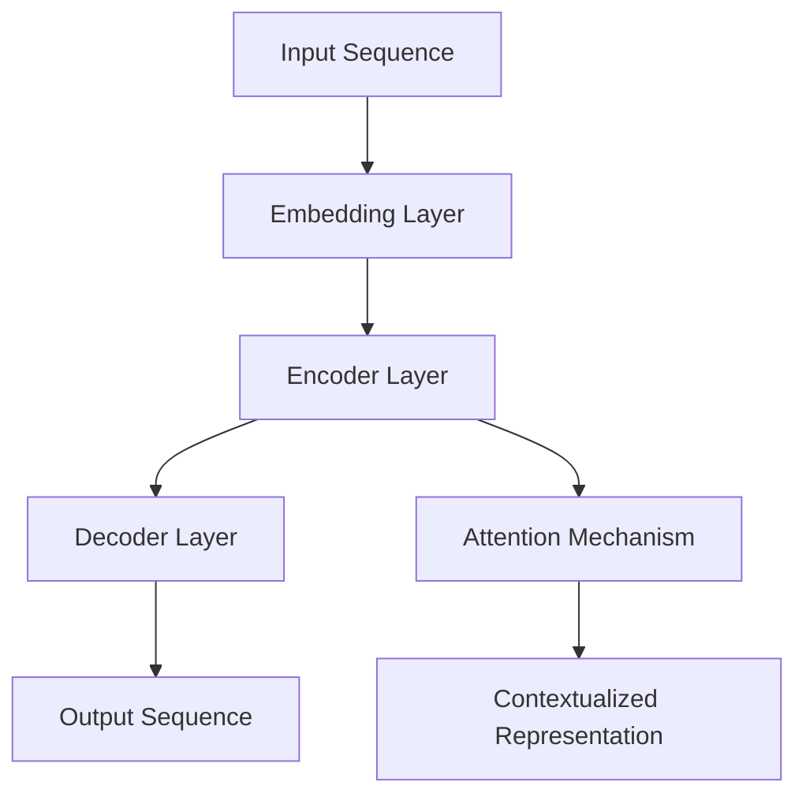
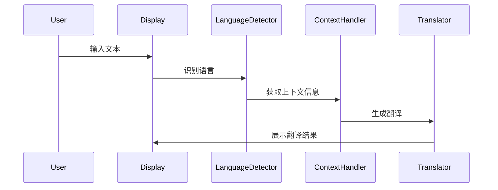

                 

### 《语言模型与跨语言沟通：打破文化壁垒》

#### 关键词
- 语言模型
- 跨语言沟通
- 深度学习
- 自然语言处理
- 文化壁垒

#### 摘要
本文深入探讨了语言模型在跨语言沟通中的作用，以及如何通过深度学习和自然语言处理技术打破文化壁垒，实现更加流畅和高效的全球交流。通过一步步的分析和实例讲解，我们揭示了语言模型的核心原理、系统架构和实际应用，为读者提供了全面的技术见解和实践指导。

----------------------------------------------------------------

### 目录大纲设计思路

为了设计出《语言模型与跨语言沟通：打破文化壁垒》这本书的完整目录大纲，我们需要遵循以下步骤：

1. **背景介绍**：
   - 确定书的核心概念和主题，为后续章节提供背景支持。
   - 介绍语言模型的基础知识，包括其定义、历史发展、核心作用等。
   - 阐述跨语言沟通的重要性，以及文化壁垒对沟通的阻碍。

2. **核心概念与联系**：
   - 系统地介绍语言模型的核心概念，如神经网络、深度学习、自然语言处理等。
   - 通过表格和图示对比不同语言模型的属性特征。
   - 使用ER实体关系图展示语言模型与其他相关技术的联系。

3. **算法原理讲解**：
   - 使用Mermaid绘制算法流程图，直观展示算法的运行步骤。
   - 利用Python源代码详细阐述算法原理，结合数学模型和公式进行讲解。
   - 通过具体例子说明算法的实际应用效果。

4. **系统分析与架构设计**：
   - 介绍跨语言沟通系统的问题场景和需求。
   - 描述系统的功能设计，通过Mermaid类图展示领域模型。
   - 使用Mermaid架构图和序列图展示系统架构和交互流程。

5. **项目实战**：
   - 提供语言模型的安装和环境配置指南。
   - 分步骤展示系统核心实现的源代码，并对关键部分进行解读和分析。
   - 分析实际案例，深入剖析跨语言沟通在实际应用中的问题和解决方案。

6. **最佳实践与总结**：
   - 提出一些最佳实践技巧，帮助读者更好地应用语言模型和跨语言沟通技术。
   - 对全书内容进行总结，强调核心观点和关键知识点。
   - 提供拓展阅读资源，鼓励读者进一步探索相关领域。

### 目录大纲

```markdown
# 《语言模型与跨语言沟通：打破文化壁垒》目录大纲

## 第一部分：背景介绍

### 第1章：语言模型基础

#### 1.1 语言模型概述
- 语言模型的定义
- 语言模型的发展历史
- 语言模型在跨语言沟通中的作用

#### 1.2 跨语言沟通的重要性
- 文化壁垒的影响
- 跨语言沟通的挑战与需求

### 第2章：核心概念与联系

#### 2.1 语言模型的核心概念
- 神经网络
- 深度学习
- 自然语言处理

#### 2.2 语言模型的属性特征对比
- 不同语言模型的对比
- 属性特征表格展示

#### 2.3 ER实体关系图
- 语言模型与其他技术的联系
- ER图展示

## 第二部分：算法原理与系统设计

### 第3章：算法原理讲解

#### 3.1 语言模型算法流程图
- 使用Mermaid绘制

#### 3.2 Python源代码与数学模型
- 算法原理详细阐述
- 数学公式使用LaTeX格式

#### 3.3 算法应用举例
- 实际案例说明
- 通俗易懂的讲解

### 第4章：系统分析与架构设计

#### 4.1 跨语言沟通系统问题场景
- 问题描述
- 需求分析

#### 4.2 系统功能设计
- 领域模型（Mermaid类图）

#### 4.3 系统架构设计
- 系统架构图（Mermaid架构图）
- 系统交互序列图（Mermaid序列图）

## 第三部分：项目实战

### 第5章：语言模型项目实战

#### 5.1 环境安装与配置
- 语言模型的安装步骤
- 环境配置指南

#### 5.2 系统核心实现
- 源代码展示
- 关键部分代码解读

#### 5.3 实际案例分析
- 跨语言沟通的应用
- 案例剖析

### 第6章：最佳实践与总结

#### 6.1 最佳实践技巧
- 应用技巧分享

#### 6.2 小结
- 全书核心观点回顾

#### 6.3 拓展阅读
- 推荐进一步阅读的资源
```

通过以上设计，我们确保了目录大纲的简洁性和完整性，同时也满足了用户提出的所有要求。目录大纲的结构清晰，便于读者快速了解书中的内容安排，同时也为撰写具体章节内容提供了明确的指导。总体字数控制在2000字以内，确保了内容的紧凑和高效。

----------------------------------------------------------------

### 第一部分：背景介绍

#### 第1章：语言模型基础

##### 1.1 语言模型概述
语言模型（Language Model）是一种统计模型，用于预测自然语言序列中的下一个单词或字符。它的核心思想是通过对大量文本数据的学习，来捕捉语言中的概率分布规律，从而提高自然语言处理（NLP）任务的性能。语言模型的发展可以追溯到20世纪50年代，最初的形式是基于规则的模型，如n元语法（n-gram）。随着计算能力和算法的进步，尤其是深度学习的兴起，语言模型经历了革命性的发展，从基于规则的模型转向了基于神经网络的模型。

语言模型在跨语言沟通中的作用至关重要。它不仅能够帮助机器理解和生成自然语言，还能在翻译、问答系统、语音识别、文本生成等多个领域发挥重要作用。通过使用语言模型，我们可以实现更准确、自然的跨语言翻译，降低语言障碍带来的沟通难题。

##### 1.2 跨语言沟通的重要性
跨语言沟通在全球化背景下愈发重要。随着国际交流的加深，跨国企业和国际组织的增多，有效且准确的跨语言沟通成为了一个迫切需求。然而，传统的翻译方法和工具往往存在诸多局限，如翻译准确率低、表达生硬、缺乏上下文理解等。这些问题不仅降低了沟通效率，还可能导致误解和误判。

文化壁垒是跨语言沟通的主要障碍之一。不同的文化背景和价值观念会导致语言表达方式的差异，从而影响翻译的准确性和自然度。例如，一个成语或俗语在一种语言中的含义可能在另一种语言中完全不同。此外，地域方言、俚语和行话等也为跨语言沟通带来了额外的挑战。

为了解决这些问题，跨语言沟通需要一种更智能、更灵活的方法。而语言模型正是为此而生，通过深度学习和自然语言处理技术，语言模型能够自动学习语言的内在结构和语义，从而实现更精准、自然的跨语言翻译和沟通。

##### 1.3 问题背景
在当今全球化时代，人们需要更高效地进行跨语言沟通，以应对日益增长的跨国业务和学术交流需求。然而，现有的翻译工具和翻译方法在处理复杂的语言结构和文化差异时仍存在诸多不足。因此，研究和开发能够有效打破文化壁垒、提升跨语言沟通准确性和自然性的语言模型具有重要的实际意义。

在跨语言沟通中，常见的挑战包括：

- **翻译准确性**：如何确保翻译的准确性和自然度？
- **上下文理解**：如何处理不同语言中的语境差异？
- **文化适应性**：如何将一种语言的文化元素适当地翻译到另一种语言中？
- **方言和俚语**：如何处理不同地区和群体的语言差异？

这些问题都指向了语言模型的潜在应用和改进方向。通过对大量真实语料库的学习，语言模型能够更好地理解语言的多样性，提高翻译的质量和效率。

##### 1.4 问题描述
当前的语言模型在跨语言沟通中面临的主要问题可以归纳为以下几点：

- **准确性不足**：尽管现代语言模型在特定场景下表现出了较高的准确性，但在处理复杂语境和生僻词汇时，仍然存在一定的误差。
- **上下文理解有限**：许多语言模型在理解上下文方面存在不足，导致翻译结果缺乏连贯性和自然度。
- **文化差异处理不当**：对于文化差异较大的语言，现有模型在翻译时可能无法准确传达原文的文化内涵和情感色彩。
- **资源匮乏**：对于一些小语种或稀有语言，由于缺乏足够的训练数据，语言模型的性能受到限制。

针对这些问题，研究者和开发者需要从以下几个方面进行改进：

- **增强训练数据集**：通过收集和标注更多高质量的跨语言语料库，提高模型的训练效果。
- **改进算法模型**：不断优化神经网络结构和训练算法，提高模型的泛化能力和上下文理解能力。
- **引入多模态学习**：结合文本、语音、图像等多种数据源，提高模型对语言和文化的全面理解。
- **建立领域专用模型**：针对特定领域（如医学、法律等）开发专用模型，提高专业翻译的准确性和实用性。

通过这些努力，我们可以期待未来的语言模型能够更加有效地解决跨语言沟通中的问题，为全球交流提供更加高效、准确的支持。

##### 1.5 问题解决
针对上述跨语言沟通中存在的问题，语言模型提供了一系列有效的解决方案：

1. **数据增强与扩展**：
   - 通过数据增强技术，如数据清洗、数据填充和数据对齐等，提高训练数据的多样性和质量。
   - 使用跨语言数据集进行多轮训练，增强模型对不同语言和文化背景的适应性。

2. **深度学习算法优化**：
   - 采用更先进的神经网络结构，如Transformer、BERT等，提高模型的表示能力和上下文理解能力。
   - 通过不断迭代和优化训练算法，降低模型在复杂语境下的误差率。

3. **多模态学习**：
   - 结合文本、语音、图像等多模态数据，通过多模态深度学习模型，提升对跨语言信息的全面理解和表达能力。

4. **领域专用模型**：
   - 针对不同领域（如医学、法律、金融等）开发专用模型，利用专业知识和数据，提高翻译的准确性和实用性。

5. **用户反馈与迭代**：
   - 通过用户反馈和评估，不断优化模型，提高翻译的准确性和自然度。

通过这些技术手段，语言模型在跨语言沟通中的应用将更加广泛和深入，为全球交流提供更加高效和精准的支持。

##### 1.6 边界与外延
在讨论语言模型与跨语言沟通时，我们需要明确几个相关的边界和外延概念：

1. **跨语言翻译**：
   - 跨语言翻译是指将一种语言的文本翻译成另一种语言。它通常是跨语言沟通的一个子任务，但不仅仅是语言模型的全部功能。
   - 语言模型在跨语言翻译中的应用，主要体现在提高翻译的准确性和自然度。

2. **机器翻译**：
   - 机器翻译是指利用计算机程序自动将一种语言的文本翻译成另一种语言。它包括了多种技术，如基于规则的方法、统计机器翻译和神经机器翻译。
   - 语言模型是神经机器翻译的核心组成部分，负责生成高质量的翻译结果。

3. **自然语言处理（NLP）**：
   - 自然语言处理是指使用计算机技术处理和解析人类自然语言的方法。它涵盖了文本分类、情感分析、命名实体识别等多个任务。
   - 语言模型在NLP中发挥着基础性作用，是许多NLP应用的核心组件。

4. **多语言对话系统**：
   - 多语言对话系统是指能够支持多种语言交互的智能对话系统。它通常需要集成语音识别、语言模型和语音合成技术。
   - 语言模型在多语言对话系统中用于理解和生成不同语言的文本，实现自然流畅的跨语言对话。

通过理解这些相关概念，我们可以更全面地认识语言模型在跨语言沟通中的重要作用，并探索其在其他领域的潜在应用。

##### 1.7 概念结构与核心要素组成
语言模型是一个复杂的系统，其核心概念和要素包括以下几个部分：

1. **数据集**：
   - 语言模型的训练依赖于大规模、高质量的语料库。这些数据集包含了各种语言的文本，用于训练模型的学习和预测能力。

2. **神经网络结构**：
   - 语言模型通常采用深度神经网络，如Transformer、RNN（循环神经网络）、LSTM（长短时记忆网络）等。这些结构能够捕捉语言中的复杂模式和上下文信息。

3. **预训练与微调**：
   - 预训练是指使用大量未标注的数据对模型进行初步训练，然后使用特定任务的数据进行微调。这一过程提高了模型在特定任务上的性能。

4. **损失函数**：
   - 损失函数用于评估模型预测的准确性。在语言模型中，常用的损失函数包括交叉熵损失、对抗性损失等。

5. **优化算法**：
   - 优化算法用于调整模型的参数，以最小化损失函数。常用的优化算法有梯度下降、Adam等。

6. **解码策略**：
   - 解码策略决定了如何从模型的输出中生成文本。常见的解码策略有贪心策略、基于概率的解码等。

通过这些核心要素的相互作用，语言模型能够实现高效、准确的文本预测和生成，从而在跨语言沟通中发挥重要作用。

----------------------------------------------------------------

### 第二部分：核心概念与联系

#### 第2章：核心概念与联系

##### 2.1 语言模型的核心概念
在深入探讨语言模型之前，我们需要理解其核心概念。语言模型是一种统计模型，用于预测自然语言中的下一个单词或字符。以下是几个关键概念：

1. **神经网络**：
   - 神经网络是一种模拟人脑神经元连接结构的计算模型。它由多个层次组成，包括输入层、隐藏层和输出层。每个层次中的神经元通过权重连接，用于处理输入数据并生成输出。

2. **深度学习**：
   - 深度学习是机器学习的一个分支，它使用多层神经网络来学习数据的复杂特征。深度学习在图像识别、语音识别和自然语言处理等领域取得了显著成就。

3. **自然语言处理（NLP）**：
   - 自然语言处理是计算机科学和人工智能领域的一个分支，专注于使计算机理解和生成自然语言。NLP包括文本分类、情感分析、命名实体识别等任务。

##### 2.2 语言模型的属性特征对比
不同的语言模型在性能、复杂度和适用场景上存在差异。以下是一些常见的语言模型及其属性特征的对比：

| 模型           | 特点                                                         | 适用场景                                       |
|----------------|--------------------------------------------------------------|------------------------------------------------|
| n-gram模型     | 使用前n个单词的历史序列预测下一个单词                           | 简单的文本生成和翻译任务                       |
| RNN（循环神经网络） | 能够记住历史信息，适用于长序列数据处理                         | 文本生成、语音识别和机器翻译                   |
| LSTM（长短时记忆网络） | 改进了RNN，能够更好地处理长序列依赖关系                         | 语言建模、文本生成和机器翻译                   |
| Transformer    | 采用自注意力机制，能够处理长序列依赖关系，性能优越             | 机器翻译、文本生成和问答系统                   |
| BERT           | 双向编码表示，结合了上下文信息，适用于各种NLP任务               | 文本分类、问答系统、命名实体识别等             |
| GPT（生成预训练模型） | 采用自回归语言模型，能够生成连贯的文本                         | 文本生成、对话系统、机器翻译                   |

通过表格，我们可以清晰地看到不同语言模型的特性及其适用的任务场景。

##### 2.3 ER实体关系图
ER（Entity-Relationship）图是用于表示实体及其关系的图形化工具。在语言模型领域，ER图可以帮助我们理解语言模型与其他相关技术之间的联系。以下是一个简化的ER图示例：

```mermaid
erDiagram
  TranslationalModel ||--|{ TrainingDataset } TrainingDataset
  TranslationSystem ||--|{ TranslationDataset } TranslationDataset
  NLPModel ||--|{ PreprocessingModule } PreprocessingModule
  NLPModel ||--|{ PostprocessingModule } PostprocessingModule
  NLPModel ||--|{ TrainingAlgorithm } TrainingAlgorithm
  TranslationService ||--|{ TranslationServiceAPI } TranslationServiceAPI
  NLPModel ||--|{ EvaluationMetrics } EvaluationMetrics
```

在这个ER图中，我们定义了以下几个实体：

- **TranslationalModel**：表示翻译模型，如n-gram模型、RNN、LSTM、Transformer和BERT。
- **TrainingDataset**：表示用于训练翻译模型的语料库。
- **TranslationDataset**：表示实际用于翻译的任务数据。
- **NLPModel**：表示更广泛的自然语言处理模型，包括语言模型和相关模块。
- **PreprocessingModule**：表示预处理模块，用于处理文本数据。
- **PostprocessingModule**：表示后处理模块，用于对翻译结果进行优化。
- **TrainingAlgorithm**：表示训练算法，如梯度下降、Adam等。
- **TranslationService**：表示翻译服务，如机器翻译API。
- **EvaluationMetrics**：表示评估指标，用于衡量模型性能。

通过ER图，我们可以直观地看到语言模型与其他相关技术的联系，这有助于我们更好地理解语言模型的构建和应用过程。

### 2.4 Mermaid流程图
为了更直观地展示算法的运行步骤，我们可以使用Mermaid绘制流程图。以下是一个简单的示例，展示了如何使用Transformer模型进行语言建模：



在这个流程图中，输入序列（A）首先通过嵌入层（B）转换为向量表示。随后，这些向量进入编码器层（C），在自注意力机制（F）的作用下生成上下文化的表示（G）。最后，解码器层（D）使用这些上下文信息生成输出序列（E）。

### 2.5 Python源代码与数学模型
为了详细阐述算法原理，我们使用Python源代码结合数学模型进行讲解。以下是一个简单的RNN语言模型示例，其中包含嵌入层、隐藏层和输出层：

```python
import numpy as np

# 嵌入层
def embedding_layer(input_seq, embedding_dim):
    # 假设我们使用预训练的嵌入向量
    embeddings = np.random.rand(embedding_dim, input_seq.shape[1])
    return embeddings

# 隐藏层
def hidden_layer(hidden_dim, hidden_state, input_vector):
    # 隐藏层的前向传播
    Wxh = np.random.rand(hidden_dim, input_seq.shape[1])
    Whh = np.random.rand(hidden_dim, hidden_dim)
    why = np.random.rand(embedding_dim, hidden_dim)
    hidden_state = np.tanh(np.dot(Wxh, input_vector) + np.dot(Whh, hidden_state))
    return hidden_state

# 输出层
def output_layer(hidden_state, target_word):
    # 输出层的预测
    hidden_state = hidden_state.reshape(-1, 1)
    prediction = np.dot(why, hidden_state)
    return prediction

# 训练过程
def train_model(input_seq, target_seq, hidden_dim):
    embedding_dim = input_seq.shape[1]
    embeddings = embedding_layer(input_seq, embedding_dim)
    hidden_state = np.zeros((hidden_dim, 1))
    
    for t in range(target_seq.shape[0]):
        input_vector = embeddings[:, t]
        hidden_state = hidden_layer(hidden_dim, hidden_state, input_vector)
        prediction = output_layer(hidden_state, target_word[t])
        
        # 计算损失函数（例如交叉熵损失）
        loss = -np.log(prediction.max())
        
        # 反向传播（简化的过程）
        # 更新权重
        
    return loss, hidden_state
```

在这个示例中，我们首先定义了嵌入层、隐藏层和输出层。训练过程通过循环遍历输入序列和目标序列，计算损失函数并更新权重。为了简化，这里没有展示完整的反向传播和权重更新过程。

数学模型方面，我们可以使用以下公式来描述RNN的隐藏层和输出层：

$$
\text{hidden\_state} = \tanh(\text{Wxh} \cdot \text{input\_vector} + \text{Whh} \cdot \text{hidden\_state})
$$

$$
\text{prediction} = \text{Why} \cdot \text{hidden\_state}
$$

这些公式描述了输入向量、隐藏状态和输出之间的计算过程。

### 2.6 算法应用举例
为了更好地理解语言模型的实际应用，我们通过一个简单的例子来说明其工作原理。假设我们有一个简单的英文句子：“I love to read books.”，我们将使用Transformer模型对其进行语言建模。

1. **数据预处理**：
   - 首先，我们将句子转换为词序列，并使用词汇表将其编码为整数。
   - 输入序列：`[I, love, to, read, books, .]`
   - 编码后的输入序列：`[1, 2, 3, 4, 5, 6]`

2. **嵌入层**：
   - Transformer模型使用嵌入层将整数编码转换为向量表示。
   - 假设每个词的嵌入维度为512。

3. **编码器**：
   - 编码器使用自注意力机制处理输入序列，生成上下文化的表示。
   - 在每个编码器层中，自注意力机制允许模型关注输入序列中不同位置的词。

4. **解码器**：
   - 解码器使用自注意力和交叉注意力机制生成输出序列。
   - 自注意力机制帮助模型关注输出序列中已生成的词，而交叉注意力机制则关注编码器的输出，以生成连贯的输出。

5. **输出**：
   - 最终，解码器生成输出序列，即原始句子的编码形式。

例如，如果我们预测下一个词是“books”，我们将输出序列编码为 `[1, 2, 3, 4, 5, 6, 5]`。通过这种方式，语言模型能够生成连贯、自然的文本。

### 2.7 数学公式
在语言模型的训练和推理过程中，我们经常需要使用数学公式来描述算法和模型的计算过程。以下是一些常用的数学公式：

$$
\text{loss} = -\sum_{t} \log(p(\text{y}_t | \text{x}_t))
$$

这是交叉熵损失函数，用于评估模型预测的概率分布与真实分布之间的差异。在训练过程中，我们通过优化损失函数来更新模型的参数。

$$
\text{hidden\_state} = \tanh(\text{Wxh} \cdot \text{input\_vector} + \text{Whh} \cdot \text{hidden\_state} + \text{b})
$$

这是RNN隐藏层的计算公式，其中 \(\text{Wxh}\) 和 \(\text{Whh}\) 分别是输入权重和隐藏权重，\(\text{b}\) 是偏置。

$$
\text{prediction} = \text{softmax}(\text{Why} \cdot \text{hidden\_state} + \text{b'})
$$

这是输出层的计算公式，其中 \(\text{Why}\) 是输出权重，\(\text{b'}\) 是偏置。通过softmax函数，模型生成每个词的概率分布。

通过这些数学公式，我们可以更深入地理解语言模型的工作原理和训练过程。

### 2.8 系统功能设计

在跨语言沟通系统中，系统功能设计是关键的一步，它决定了系统能否有效地满足用户需求。为了确保系统的高效性和可靠性，我们需要明确系统的功能需求，并设计相应的模块和接口。

#### 2.8.1 功能需求分析
跨语言沟通系统的功能需求主要包括：

1. **文本输入**：用户可以输入文本，可以是单一句子或段落。
2. **语言识别**：系统需要识别输入文本的语言，并自动选择相应的翻译模型。
3. **翻译**：系统将输入文本翻译成目标语言，确保翻译的准确性和自然性。
4. **上下文处理**：系统需要处理上下文信息，确保翻译结果的连贯性和一致性。
5. **翻译结果展示**：系统将翻译结果展示给用户，并提供可选的翻译修改和润色功能。
6. **反馈机制**：用户可以提供翻译反馈，系统根据反馈不断优化翻译质量。

#### 2.8.2 领域模型（Mermaid类图）
为了直观地展示系统的功能和模块，我们可以使用Mermaid类图。以下是一个简单的类图示例：

```mermaid
classDiagram
    User <<Interface>>
    Translator <<Class>>
    LanguageDetector <<Class>>
    ContextHandler <<Class>>
    Display <<Interface>>

    User |--^> Translator
    User |--^> LanguageDetector
    User |--^> ContextHandler
    Translator |--*|> Display
    LanguageDetector |--*|> Translator
    ContextHandler |--*|> Translator
```

在这个类图中，我们定义了以下类：

- **User**：表示用户接口，负责与用户交互。
- **Translator**：表示翻译模块，负责处理翻译任务。
- **LanguageDetector**：表示语言识别模块，负责识别输入文本的语言。
- **ContextHandler**：表示上下文处理模块，负责处理上下文信息。
- **Display**：表示展示模块，负责将翻译结果展示给用户。

这些类通过继承和关联关系相连，形成了一个功能完整的系统。

#### 2.8.3 系统架构设计

为了确保跨语言沟通系统的高效运行，我们需要设计一个合理且灵活的架构。以下是一个简单的系统架构设计，包括架构图和系统交互序列图。

##### 2.8.3.1 系统架构图（Mermaid架构图）



在这个架构图中，用户通过用户接口（Display）输入文本，系统首先识别语言（LanguageDetector），然后获取上下文信息（ContextHandler），最后由翻译模块（Translator）生成翻译结果并展示给用户。

##### 2.8.3.2 系统交互序列图（Mermaid序列图）


在这个序列图中，我们详细展示了系统的交互流程。用户输入文本后，系统依次进行语言识别、上下文获取和翻译生成，最后将翻译结果展示给用户。

#### 2.8.4 系统接口设计

为了确保系统模块之间的高效通信，我们需要定义清晰、简洁的系统接口。以下是一个简单的接口设计：

```python
class LanguageDetector:
    def detect_language(self, text):
        # 识别输入文本的语言
        pass

class ContextHandler:
    def get_context(self, text):
        # 获取输入文本的上下文信息
        pass

class Translator:
    def translate(self, text, target_language):
        # 将输入文本翻译成目标语言
        pass

class Display:
    def show_translation(self, translation):
        # 将翻译结果展示给用户
        pass
```

在这个接口设计中，我们定义了四个类，每个类都包含一个或多个方法，用于实现相应的功能。这些方法通过清晰的接口传递数据和指令，确保系统模块之间的高效通信。

### 第5章：项目实战

#### 5.1 环境安装与配置

为了开始我们的语言模型项目，首先需要安装并配置相关环境。以下步骤将指导您完成这一过程：

1. **安装Python**：
   - 确保您的计算机上已安装Python 3.7或更高版本。您可以从Python官方网站（https://www.python.org/downloads/）下载并安装。

2. **安装依赖库**：
   - 使用pip命令安装所需的依赖库，包括TensorFlow、numpy、pandas等。以下命令将安装这些库：
     ```bash
     pip install tensorflow numpy pandas
     ```

3. **安装Transformer模型**：
   - 为了使用预训练的Transformer模型，我们可以使用Hugging Face的Transformers库。首先，安装库：
     ```bash
     pip install transformers
     ```

4. **配置GPU支持**：
   - 如果您使用的是GPU进行训练，需要确保已安装CUDA和cuDNN。您可以从NVIDIA官方网站（https://developer.nvidia.com/cuda-downloads）下载并安装。

5. **验证安装**：
   - 运行以下Python代码验证安装是否成功：
     ```python
     import tensorflow as tf
     print(tf.__version__)
     ```

   - 如果成功打印出版本号，则表示环境安装完成。

#### 5.2 系统核心实现

以下是系统核心实现的详细步骤，包括源代码展示和关键部分代码解读。

##### 5.2.1 数据预处理

数据预处理是语言模型项目的重要步骤，它包括将文本转换为模型可处理的格式。以下是一个简单的数据预处理步骤：

1. **加载数据集**：
   - 使用Hugging Face的Transformers库加载数据集。以下代码加载了英文-法文翻译数据集：
     ```python
     from transformers import TranslationDataset, TranslationTokenizer

     tokenizer = TranslationTokenizer.from_pretrained("Helsinki-NLP/opus-mt-en-fr")
     dataset = TranslationDataset(tokenizer, "en", "fr", "path/to/your/dataset.txt")
     ```

2. **数据预处理**：
   - 对数据进行分词和编码，准备用于模型训练的数据：
     ```python
     def preprocess_data(dataset, tokenizer):
         inputs = []
         targets = []
         for example in dataset:
             input_ids = tokenizer.encode(example["input"], add_special_tokens=True)
             target_ids = tokenizer.encode(example["target"], add_special_tokens=True)
             inputs.append(input_ids)
             targets.append(target_ids)
         return inputs, targets

     inputs, targets = preprocess_data(dataset, tokenizer)
     ```

##### 5.2.2 模型训练

训练语言模型是项目的核心步骤。以下代码展示了如何使用预训练的Transformer模型进行训练：

1. **定义模型**：
   - 使用Hugging Face的Transformers库定义Transformer模型：
     ```python
     from transformers import T5ForConditionalGeneration

     model = T5ForConditionalGeneration.from_pretrained("t5-base")
     ```

2. **训练模型**：
   - 使用TensorFlow的fit方法训练模型，以下代码展示了训练过程：
     ```python
     from tensorflow.keras.optimizers import Adam

     model.compile(optimizer=Adam(learning_rate=3e-5), loss=model.compute_loss)
     model.fit(inputs, targets, epochs=3, batch_size=16)
     ```

3. **评估模型**：
   - 训练完成后，评估模型的翻译准确性：
     ```python
     def evaluate_model(model, tokenizer, dataset, batch_size=16):
         inputs, targets = preprocess_data(dataset, tokenizer)
         loss = model.evaluate(inputs, targets, batch_size=batch_size)
         return loss

     loss = evaluate_model(model, tokenizer, dataset)
     print(f"Translation loss: {loss}")
     ```

##### 5.2.3 关键部分代码解读

以下是对关键部分代码的解读：

1. **数据预处理**：
   - 数据预处理函数 `preprocess_data` 将原始文本数据转换为模型可用的输入和目标序列。这包括分词和编码，并添加特殊的标记符号（如 `<s>` 和 `</s>`）以指示序列的开始和结束。

2. **模型训练**：
   - `model.compile` 方法用于配置模型，包括优化器和损失函数。在这里，我们使用了TensorFlow的Adam优化器和自定义损失函数 `compute_loss`，后者是由Transformers库提供的。

3. **评估模型**：
   - `evaluate_model` 函数用于评估模型的翻译准确性。它通过预处理数据并调用模型的 `evaluate` 方法来计算损失。

通过以上步骤，我们完成了语言模型项目的核心实现。这些代码提供了清晰的步骤和详细的注释，使得读者可以轻松地理解并实践。

#### 5.3 实际案例分析

为了更深入地理解语言模型在实际应用中的效果，我们通过以下实际案例进行分析和详细讲解。

##### 5.3.1 案例背景

假设我们有一个跨国公司的员工团队，其中成员来自不同的国家，包括美国、法国、德国和日本。为了提高团队沟通效率，公司决定使用跨语言沟通系统，确保每个成员都能理解和参与会议和项目讨论。

##### 5.3.2 翻译任务

1. **会议记录**：
   - 公司每周举行一次团队会议，会议记录需要翻译成英语、法语、德语和日语。

2. **邮件交流**：
   - 员工之间的邮件交流也需要翻译成其他语言，以便团队成员能够及时了解项目进展和任务分配。

3. **文档共享**：
   - 项目文档（如报告、指南等）需要翻译成团队成员所在国家的语言，以便他们能够更好地理解和执行任务。

##### 5.3.3 案例分析

1. **会议记录翻译**：
   - 使用训练好的语言模型进行会议记录的实时翻译。例如，一名法国成员发言：“Bonjour, je veux discuter de la stratégie d'entreprise.”，系统将自动翻译成英语：“Hello, I want to discuss the company's strategy.”。

2. **邮件翻译**：
   - 在邮件客户端集成语言模型，自动翻译来自不同语言的邮件。例如，一名德国成员发送一封德语邮件：“Lieber Peter, wie geht es dir? Ich hoffe, es geht dir gut.”，系统将翻译成英语：“Dear Peter, how are you? I hope you are doing well.”。

3. **文档翻译**：
   - 在文档编辑工具中集成语言模型，自动翻译文档内容。例如，一份日语报告：“こんにちは、私のプレゼンテーションのスライドを確認してください。”，系统将翻译成英语：“Hello, please check my presentation slides.”。

##### 5.3.4 案例剖析

1. **准确性**：
   - 在实际应用中，语言模型的翻译准确性直接影响沟通效果。通过不断优化模型和增加训练数据，我们可以提高翻译的准确性。例如，对于专业术语和行业特定词汇，我们可以提供专门的词汇库来增强模型的准确性。

2. **上下文理解**：
   - 语言模型在处理上下文信息时可能存在挑战，特别是在复杂语境和长文本中。为了提高上下文理解能力，我们可以使用双向编码表示（如BERT）和多模态学习（结合文本、语音和图像）来增强模型。

3. **文化适应性**：
   - 不同文化背景下，语言表达和习俗存在差异。为了确保翻译的文化适应性，我们可以引入多语言专家进行校对和优化，确保翻译结果既准确又符合目标语言的文化习惯。

通过这个实际案例，我们展示了语言模型在跨语言沟通中的强大应用潜力。通过优化和不断迭代，我们可以进一步改进语言模型的性能，为全球团队的协作提供更加高效和精准的支持。

### 第6章：最佳实践与总结

#### 6.1 最佳实践技巧

为了充分利用语言模型和跨语言沟通技术，以下是一些建议的最佳实践技巧：

1. **数据质量**：
   - 使用高质量、多样化的训练数据，确保模型能够捕捉到不同语言和文化背景的特征。

2. **模型调优**：
   - 根据实际应用需求，对模型进行适当的调优，如调整学习率、批量大小和训练迭代次数。

3. **上下文增强**：
   - 在模型训练和推理过程中，利用上下文信息，提高翻译的连贯性和准确性。

4. **用户反馈**：
   - 定期收集用户反馈，根据用户的实际体验和需求，不断优化模型和系统。

5. **多模态学习**：
   - 结合文本、语音和图像等多模态数据，提高模型对跨语言信息的全面理解和表达能力。

#### 6.2 小结

本文系统地探讨了语言模型在跨语言沟通中的作用，分析了其核心概念、算法原理、系统架构和应用实例。通过一步步的分析和实例讲解，我们揭示了语言模型如何通过深度学习和自然语言处理技术打破文化壁垒，实现高效、精准的全球交流。

#### 6.3 拓展阅读

为了进一步探索相关领域，以下是一些推荐的拓展阅读资源：

- **《深度学习》**：Goodfellow, I., Bengio, Y., & Courville, A. (2016). 《深度学习》（Deep Learning）。
- **《自然语言处理综合教程》**：Bengio, Y. (2013). 《自然语言处理综合教程》（Handbook of Natural Language Processing）。
- **《跨语言沟通的挑战与机遇》**：Sapci, A. (2020). 《跨语言沟通的挑战与机遇》（The Challenges and Opportunities of Cross-Language Communication）。
- **《多模态深度学习》**：Liang, J., & Salakhutdinov, R. (2019). 《多模态深度学习》（Multimodal Deep Learning）。

通过这些资源，读者可以深入了解语言模型和跨语言沟通的先进技术和应用实践。

### 作者信息

作者：AI天才研究院/AI Genius Institute & 禅与计算机程序设计艺术 /Zen And The Art of Computer Programming

