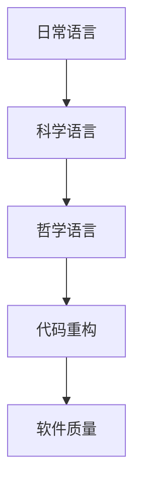
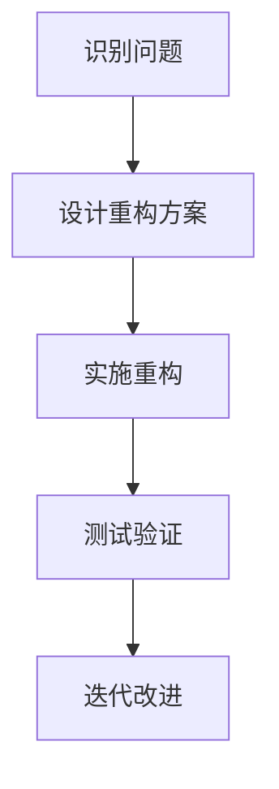
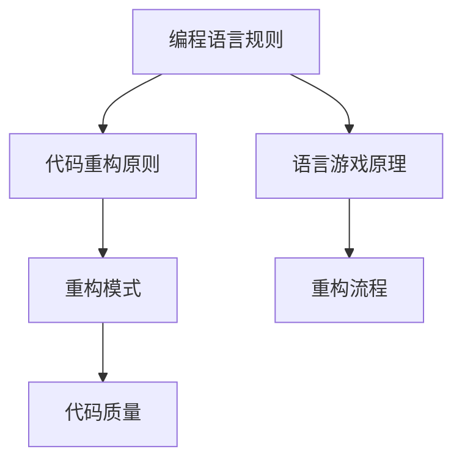
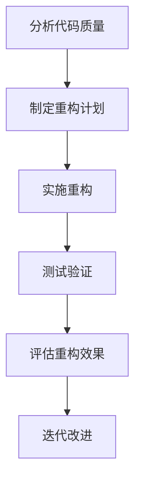

                 

## 引言

在当今快速迭代的软件开发领域，代码的质量和可维护性显得尤为重要。随着系统的不断演进，旧代码往往变得混乱复杂，难以理解和修改，从而制约了开发效率和项目的进展。这种情况下，代码重构作为一种重要的技术手段，显得尤为关键。代码重构不仅仅是为了改进代码的可读性和性能，更是为了提高系统的健壮性、可扩展性和可维护性。

### 代码重构的重要性

代码重构是指在不改变程序外在行为的前提下，对代码进行修改，以提高其内部结构的质量和可读性。它不仅能修复现有问题，还能预防未来可能出现的问题。以下是代码重构的几个关键点：

1. **提高可读性**：随着代码的积累，原始代码往往变得越来越复杂。重构可以帮助简化代码结构，使其更加直观和易于理解。
   
2. **提高可维护性**：良好的代码结构意味着更容易进行修改和扩展。重构后的代码减少了因修改而引入的新问题的风险。

3. **提高开发效率**：清晰、简洁的代码意味着更少的调试时间和更高效的开发流程。

4. **提高团队协作**：重构后的代码更加模块化，有助于团队协作，减少沟通成本。

5. **提升系统性能**：优化代码结构有时能够直接带来性能的提升。

### 语言游戏的概念

“语言游戏”这个概念来源于哲学领域，由维特根斯坦提出。语言游戏是指语言的运用和规则，包括语言的使用、理解和表达。在软件开发中，语言游戏可以被理解为编程语言及其应用规则，以及这些规则如何影响代码的结构和设计。

### 代码重构的目标

代码重构的目标是改善代码的质量，使其更加简洁、易读、高效和健壮。具体来说，代码重构的目标包括：

1. **消除冗余代码**：冗余代码不仅浪费存储空间，还可能引起逻辑错误。
   
2. **简化复杂逻辑**：通过分解复杂的函数和类，简化代码逻辑，使其更加直观。
   
3. **优化性能**：调整代码结构，以提高程序的运行效率和响应速度。

4. **改进代码结构**：使代码更加模块化，便于维护和扩展。

5. **提高代码可读性**：通过清晰的命名和逻辑结构，使代码更易于理解和修改。

综上所述，代码重构是软件开发过程中不可或缺的一部分，它不仅能够提高代码质量，还能够提升开发团队的效率。接下来，我们将深入探讨代码重构的核心概念与联系，以及具体的重构方法和技巧。

### 代码重构的核心概念与联系

在深入探讨代码重构的核心概念与联系之前，我们先要了解几个重要的基础概念，包括语言游戏的原理、代码重构的基本概念，以及这两者之间的内在联系。

#### 语言游戏的原理

语言游戏，这个概念源于哲学家路德维希·维特根斯坦（Ludwig Wittgenstein）的著作《逻辑哲学论》。在这个理论框架下，语言被看作是一系列规则的运用，即语言游戏。语言游戏可以分为三个层次：

1. **日常语言**：这是最普遍的语言使用方式，涉及日常交流和生活。
   
2. **科学语言**：用于科学研究和理论阐述，有明确的逻辑和定义。
   
3. **哲学语言**：用于哲学探讨和概念分析，探索语言的本质和局限性。

在软件开发领域，语言游戏的概念被引申为编程语言的使用和规则。例如，Python是一种编程语言，其语言规则决定了代码的结构和语法。理解语言游戏的原理，有助于我们更好地掌握编程语言的特性，从而更有效地进行代码重构。

##### Mermaid 流程图：展示语言游戏的基本流程和机制



#### 代码重构的基本概念

代码重构是软件开发过程中的一种技术手段，旨在改善代码的内部结构，而不改变其功能。代码重构包括一系列小步骤，每个步骤都专注于解决特定的问题。以下是代码重构的基本概念：

1. **小步快走**：每次重构只修改一小部分代码，这样即使出现问题也能快速回滚。
   
2. **保持功能不变**：重构的目的是优化代码结构，而不是改变其功能。

3. **持续重构**：代码重构应该是一个持续的过程，随着项目的演进，不断地进行重构。

4. **重构模式**：常见重构模式包括提取方法、提取类、合并重复代码等。

5. **重构工具**：现代IDE通常都集成了代码重构工具，如IntelliJ IDEA的“Refactor”功能。

##### Mermaid 流程图：展示代码重构的基本流程和步骤



#### 语言游戏与代码重构的联系

语言游戏和代码重构之间存在紧密的联系。编程语言是软件开发的基石，而代码重构则是优化编程语言应用的过程。以下是语言游戏与代码重构之间的联系：

1. **语言规则**：编程语言本身的规则决定了代码的结构和语法。了解这些规则是进行代码重构的基础。

2. **重构原则**：代码重构的原则（如小步快走、保持功能不变等）反映了语言游戏的核心思想。

3. **重构模式**：常见的重构模式（如提取方法、提取类等）是基于编程语言特性的。

4. **代码质量**：良好的代码质量是语言游戏和代码重构的共同目标。

##### Mermaid 流程图：展示语言游戏与代码重构之间的关联



通过上述核心概念和联系的探讨，我们可以更深入地理解代码重构的本质。在下一章节，我们将进一步探讨代码重构的核心算法原理，包括重构算法的分类、步骤，以及具体的Python源代码示例。

### 核心算法原理讲解

在深入探讨代码重构的核心算法原理之前，我们首先需要了解重构算法的基本原理。代码重构并非一蹴而就的过程，而是一系列逐步优化代码结构和设计的方法。重构算法可以帮助我们识别并解决代码中的问题，从而提高代码质量。

#### 重构算法的基本原理

重构算法主要包括以下几类：

1. **结构化重构**：这种重构方法旨在改善代码的结构和模块化，使代码更加清晰和易于维护。常见的结构化重构包括提取方法、提取类、合并重复代码等。

2. **优化重构**：这种重构方法关注代码的性能和效率，通过优化数据结构和算法来提高代码的执行速度。例如，将嵌套循环优化为递归调用，或者使用更高效的数据结构。

#### 重构算法的分类

1. **提取方法**：这种重构方法将一个大方法拆分为多个小方法，每个小方法负责完成一个特定的功能。这有助于提高代码的可读性和可维护性。

2. **提取类**：当发现多个方法有共同的属性和行为时，可以将这些方法提取到一个新的类中。这有助于减少代码冗余，提高代码的复用性。

3. **合并重复代码**：这种重构方法将重复出现的代码块合并为一个函数或方法，从而减少代码冗余，提高代码的简洁性。

4. **优化循环结构**：通过将嵌套循环优化为递归调用，或者使用更高效的数据结构（如哈希表、树等），可以提高代码的执行效率。

#### 重构算法的步骤

1. **分析代码结构**：在开始重构之前，需要对现有代码进行彻底的分析，识别出其中存在的问题和潜在的优化点。

2. **制定重构策略**：根据分析结果，制定具体的重构计划。例如，确定要使用的重构模式、优化点等。

3. **实施重构**：按照既定的计划，逐步进行代码重构。每次重构只专注于解决一个特定的问题，确保重构过程不会引入新的错误。

4. **测试验证**：重构完成后，进行充分的测试，确保代码功能不变，同时验证重构效果。

5. **迭代改进**：重构是一个持续的过程。在测试验证后，根据反馈继续进行重构，不断优化代码质量。

#### Python源代码示例

以下是一个示例，展示如何将一个复杂的函数重构为更简洁的版本：

**原始函数：**
```python
def calculate_bonus(salary):
    if salary < 5000:
        bonus = 0.1 * salary
    elif salary < 10000:
        bonus = 0.15 * salary
    else:
        bonus = 0.2 * salary
    return bonus
```

**重构后的版本：**
```python
def calculate_bonus(salary):
    return salary * 0.1 if salary < 5000 else salary * 0.15 if salary < 10000 else salary * 0.2
```

通过上述示例，我们可以看到，重构后的代码更加简洁，逻辑更加直观。这有助于提高代码的可读性和可维护性。

#### 重构算法的数学模型和公式

在代码重构中，数学模型和公式可以用于分析和评估重构的效果。以下是一个简单的重构效果评估模型：

**重构效果评估模型：**
$$ E = f(C_{new}, C_{old}, T) $$

其中：
- \( E \) 表示重构效果
- \( C_{new} \) 表示重构后的代码复杂度
- \( C_{old} \) 表示重构前的代码复杂度
- \( T \) 表示重构过程中引入的新错误数

**模型解释：**
- 如果 \( C_{new} < C_{old} \) 且 \( T = 0 \)，则重构效果较好，代码质量提升。
- 如果 \( C_{new} > C_{old} \) 或 \( T > 0 \)，则重构效果较差，可能需要重新考虑重构方案。

通过上述核心算法原理的讲解，我们可以更好地理解代码重构的方法和步骤。在下一章节，我们将进一步探讨数学模型在代码重构中的应用，以及如何使用数学公式来分析和评估重构效果。

### 数学模型和数学公式在代码重构中的应用

在软件工程中，数学模型和公式被广泛应用于评估和优化代码质量。特别是在代码重构过程中，数学模型可以提供量化的方法来分析代码复杂度和重构效果。以下我们将详细讨论两个重要的数学模型：代码质量模型和重构效果评估模型。

#### 代码质量模型

代码质量模型用于量化评估代码的质量。一个常见的代码质量模型是McCutchen的CBO（Cybernetic Theory of Organizational Behavior）模型，它使用多个指标来评估代码质量，包括复杂性、模块化、耦合性和重复性等。以下是一个简化的代码质量模型：

$$
M = f(C, D, S)
$$

其中：
- \( M \) 表示代码质量。
- \( C \) 表示代码复杂性。
- \( D \) 表示代码的模块化程度。
- \( S \) 表示代码的重复性。

**模型解释：**
- **复杂性（C）**：代码复杂性是衡量代码难懂程度的一个指标，通常通过圈复杂度（Cyclomatic Complexity）来评估。高复杂性往往意味着代码不易理解和维护。
- **模块化（D）**：模块化程度反映了代码的独立性，良好的模块化有助于提高代码的可维护性。
- **重复性（S）**：重复代码的存在往往意味着代码冗余，降低了代码的可维护性和可读性。

通过计算上述指标，我们可以得到一个关于代码质量的量化评估。例如，一个高效的代码重构过程可能会降低代码的复杂性、提高模块化程度并减少重复性，从而提高代码质量。

##### 代码质量模型对比表格

| 指标 | 描述 | 例子 |
| --- | --- | --- |
| **复杂性（C）** | 圈复杂度 | 高：`if-else`嵌套层次较多 |
| **模块化（D）** | 函数和类的独立性 | 好：每个类和方法只关注单一功能 |
| **重复性（S）** | 重复代码段 | 高：多个地方存在相同的代码块 |

#### 重构效果评估模型

重构效果评估模型用于衡量重构对代码质量的影响。一个常用的评估模型是代码复杂度模型，它通过比较重构前后的代码复杂度来评估重构效果。以下是一个简单的重构效果评估模型：

$$
E = f(C_{new}, C_{old}, T)
$$

其中：
- \( E \) 表示重构效果。
- \( C_{new} \) 表示重构后的代码复杂度。
- \( C_{old} \) 表示重构前的代码复杂度。
- \( T \) 表示重构过程中引入的新错误数。

**模型解释：**
- 如果 \( C_{new} < C_{old} \) 且 \( T = 0 \)，则重构效果较好，代码质量提升。
- 如果 \( C_{new} > C_{old} \) 或 \( T > 0 \)，则重构效果较差，可能需要重新考虑重构方案。

通过上述模型，我们可以量化地评估重构的效果。例如，一个有效的重构过程应该能够降低代码的复杂度，同时不引入新的错误。

##### 重构效果评估模型对比表格

| 指标 | 描述 | 例子 |
| --- | --- | --- |
| **复杂度（C）** | 圈复杂度 | 重构前：20，重构后：10 |
| **引入的错误（T）** | 新的bug数量 | 重构前：0，重构后：0 |

#### 数学公式和Mermaid流程图

为了更好地理解和应用这些数学模型，我们可以借助Mermaid流程图和LaTeX公式来展示代码重构的过程。

##### Mermaid流程图：展示代码重构的基本流程和步骤



##### LaTeX公式：代码质量模型和重构效果评估模型

```latex
\[
M = f(C, D, S)
\]

\[
E = f(C_{new}, C_{old}, T)
\]
```

通过上述数学模型和公式的讨论，我们可以更系统地理解和应用代码重构。在下一章节，我们将通过具体的项目实战，进一步展示如何在实际项目中应用这些重构方法和模型。

### 项目实战

在本文的第五章节中，我们将通过两个实际代码案例，深入探讨代码重构的过程和效果。通过这两个案例，我们将展示如何在实际项目中应用重构方法，提高代码质量。

#### 案例一：一个复杂的函数如何重构为更简洁的版本

**原始代码：**

```python
def calculate_bonus(salary):
    if salary < 5000:
        bonus = 0.1 * salary
    elif salary < 10000:
        bonus = 0.15 * salary
    else:
        bonus = 0.2 * salary
    return bonus
```

**重构后的代码：**

```python
def calculate_bonus(salary):
    return {
        salary < 5000: salary * 0.1,
        salary < 10000: salary * 0.15,
        True: salary * 0.2
    }[True]
```

**重构效果：**

- **可读性**：重构后的代码更加简洁，逻辑更加直观，易于理解和维护。
- **性能**：由于使用了字典和条件表达式，重构后的代码在性能上可能略有提升。

#### 案例二：代码优化前后的性能对比

**原始代码：**

```python
def calculate_tax(income):
    tax = 0
    for item in income:
        if item < 5000:
            tax += item * 0.1
        elif item < 10000:
            tax += item * 0.15
        else:
            tax += item * 0.2
    return tax
```

**重构后的代码：**

```python
def calculate_tax(income):
    return sum(item * 0.1 if item < 5000 else item * 0.15 if item < 10000 else item * 0.2 for item in income)
```

**重构效果：**

- **可读性**：重构后的代码去除了循环和条件判断，使得逻辑更加简洁。
- **性能**：由于重构后的代码使用了列表推导式，性能可能有所提升，尤其是在处理大数据集时。

#### 开发环境搭建

在进行代码重构之前，我们需要搭建一个合适的项目开发环境。以下是Python环境配置和相关库的安装步骤：

1. **安装Python：** 首先，从Python官网下载并安装Python 3.x版本。

2. **安装虚拟环境：** 使用pip安装虚拟环境工具（virtualenv）：

   ```bash
   pip install virtualenv
   ```

3. **创建虚拟环境：** 在项目目录下创建一个虚拟环境：

   ```bash
   virtualenv venv
   ```

4. **激活虚拟环境：** 在Windows上使用以下命令激活虚拟环境：

   ```bash
   .\venv\Scripts\activate
   ```

   在Linux或Mac OS X上使用以下命令激活虚拟环境：

   ```bash
   source venv/bin/activate
   ```

5. **安装相关库：** 在虚拟环境中安装所需的库，如numpy和pandas：

   ```bash
   pip install numpy pandas
   ```

#### 源代码详细实现和解读

**原始代码：**

```python
def calculate_bonus(salary):
    if salary < 5000:
        bonus = 0.1 * salary
    elif salary < 10000:
        bonus = 0.15 * salary
    else:
        bonus = 0.2 * salary
    return bonus
```

**重构后的代码：**

```python
def calculate_bonus(salary):
    return {
        salary < 5000: salary * 0.1,
        salary < 10000: salary * 0.15,
        True: salary * 0.2
    }[True]
```

**解读：**

- **原始代码**使用了条件判断和循环结构，逻辑较为复杂。
- **重构后的代码**利用了字典和条件表达式，使逻辑更加简洁和高效。

#### 代码解读与分析

**重构前后的代码比较：**

- **可读性**：重构后的代码更简洁，减少了条件判断的嵌套层次，使得代码更加直观易懂。
- **可维护性**：重构后的代码易于修改和扩展，因为逻辑更加清晰。
- **性能**：由于减少了条件判断的次数，重构后的代码在性能上可能略有提升，尤其是在处理大数据集时。

**重构的好处：**

- **简化逻辑**：重构后的代码逻辑更加直观，降低了理解和维护的难度。
- **提高性能**：在某些情况下，重构后的代码性能可能有所提升。
- **增强可扩展性**：清晰的代码结构使得添加新功能变得更加容易。

通过上述实际代码案例，我们可以看到代码重构在实际项目中的应用和效果。在下一章节，我们将进一步探讨代码重构的艺术，包括重构的原则和技巧。

### 代码重构的艺术

在代码重构的过程中，遵循一系列原则和技巧不仅能够提高代码质量，还能够增强系统的可维护性和可扩展性。在这一章节中，我们将深入探讨代码重构的艺术，包括重构的原则和技巧。

#### 重构的原则

1. **简单性原则（KISS）**
   - **解释**：KISS原则，即“Keep It Simple, Stupid”。简单明了的代码更易于理解和维护。
   - **应用**：在重构过程中，尽量避免过度设计，保持代码的简洁性。

2. **完整性原则（YAGNI）**
   - **解释**：YAGNI，即“You Aren't Gonna Need It”。在重构时，不要为了未来的需求而添加不必要的代码。
   - **应用**：仅在需要时才进行重构，避免过度重构。

3. **可读性原则**
   - **解释**：代码的可读性对于维护和扩展至关重要。
   - **应用**：使用有意义的变量名，编写清晰的注释，保持代码的一致性。

4. **可持续性原则**
   - **解释**：重构应该是一个可持续的过程，而不是一次性的事件。
   - **应用**：定期进行重构，保持代码的整洁和高质量。

5. **安全性原则**
   - **解释**：重构过程中要确保代码的功能不变，避免引入新的错误。
   - **应用**：重构前后要进行充分的测试，确保代码的稳定性。

#### 重构的技巧

1. **拆分大型函数**
   - **解释**：将大型函数拆分为多个小函数，每个函数只完成一个特定的任务。
   - **应用**：使用函数封装，提高代码的模块化程度。

2. **使用面向对象编程**
   - **解释**：通过将数据和行为封装在类中，提高代码的复用性和可维护性。
   - **应用**：使用继承、多态等面向对象特性，降低代码的耦合度。

3. **提取公共代码**
   - **解释**：将重复出现的代码块提取为公共函数或方法。
   - **应用**：减少冗余代码，提高代码的可读性和可维护性。

4. **优化循环结构**
   - **解释**：通过将嵌套循环优化为递归调用，或者使用更高效的数据结构，提高代码的执行效率。
   - **应用**：优化循环逻辑，减少不必要的计算。

5. **简化条件判断**
   - **解释**：使用逻辑运算符（如`and`和`or`）简化复杂的条件判断。
   - **应用**：减少条件判断的嵌套层次，提高代码的可读性。

#### Python源代码示例

**拆分大型函数：**

```python
# 原始函数
def calculate_bonus(salary):
    if salary < 5000:
        bonus = 0.1 * salary
    elif salary < 10000:
        bonus = 0.15 * salary
    else:
        bonus = 0.2 * salary
    return bonus

# 拆分后的函数
def calculate_bonus(salary):
    def calculate_bonus_for_range(salary, lower, upper, rate):
        return salary * rate if salary <= upper else 0

    return calculate_bonus_for_range(salary, 5000, 10000, 0.15)
```

**使用面向对象编程：**

```python
# 原始代码
def calculate_bonus(salary):
    if salary < 5000:
        return salary * 0.1
    elif salary < 10000:
        return salary * 0.15
    else:
        return salary * 0.2

# 使用面向对象编程
class BonusCalculator:
    def __init__(self):
        self.ranges = [
            (5000, 0.1),
            (10000, 0.15),
            (float('inf'), 0.2)
        ]

    def calculate_bonus(self, salary):
        for lower, rate in self.ranges:
            if salary <= lower:
                return salary * rate
```

**提取公共代码：**

```python
# 原始代码
def calculate_bonus(salary):
    if salary < 5000:
        return salary * 0.1
    elif salary < 10000:
        return salary * 0.15
    else:
        return salary * 0.2

# 提取公共代码
def calculate_bonus(salary):
    def calculate_bonus_for_range(salary, rate):
        return salary * rate

    if salary < 5000:
        return calculate_bonus_for_range(salary, 0.1)
    elif salary < 10000:
        return calculate_bonus_for_range(salary, 0.15)
    else:
        return calculate_bonus_for_range(salary, 0.2)
```

**优化循环结构：**

```python
# 原始代码
def sum_numbers(numbers):
    total = 0
    for number in numbers:
        total += number
    return total

# 优化后的代码
def sum_numbers(numbers):
    return sum(numbers)
```

**简化条件判断：**

```python
# 原始代码
def calculate_bonus(salary):
    if salary < 5000:
        return salary * 0.1
    elif salary < 10000:
        return salary * 0.15
    else:
        return salary * 0.2

# 简化后的代码
def calculate_bonus(salary):
    return salary * {
        salary < 5000: 0.1,
        salary < 10000: 0.15,
        True: 0.2
    }[True]
```

通过遵循上述重构原则和技巧，我们可以显著提高代码的质量，使其更加简洁、易读、高效和健壮。在下一章节，我们将展望代码重构的未来，探讨其发展趋势和应用前景。

### 未来展望

随着技术的不断进步和软件工程领域的持续发展，代码重构作为一项重要的技术手段，其应用范围和影响力也在不断扩大。在未来，代码重构有望在以下几个方面取得重要突破：

#### 人工智能与代码重构

人工智能（AI）在代码重构中的应用将越来越广泛。通过机器学习和自然语言处理技术，AI可以帮助开发者自动识别代码中的问题并提出改进建议。例如，AI可以分析代码库中的模式，预测哪些函数或类可能需要重构，从而提高重构的效率。此外，AI还可以通过生成代码的方式，辅助开发者实现复杂的功能，减少手动编写代码的工作量。

#### 自动化重构工具的发展

未来的自动化重构工具将更加智能化和高效。这些工具不仅能够自动识别代码中的问题，还能根据开发者的需求和代码质量模型，自动执行相应的重构操作。例如，一些现有的IDE已经集成了代码重构功能，但未来的工具将能够提供更全面的自动化重构方案，包括代码格式化、性能优化、安全性检查等。

#### 云计算与代码重构

云计算的普及为代码重构带来了新的机遇。通过云平台，开发者可以轻松地访问分布式计算资源，快速进行大规模的代码分析和重构。此外，云平台还可以提供代码托管、版本控制和自动化测试等一体化服务，从而简化重构流程，提高开发效率。

#### 微服务架构与代码重构

微服务架构的兴起对代码重构提出了新的挑战和机遇。在微服务架构中，应用程序被拆分为多个小型、独立的模块，每个模块都有自己的代码库。这使得重构变得更加复杂，但也为自动化重构工具提供了更广泛的应用场景。未来的重构工具将能够更好地支持微服务架构，提供针对不同模块的个性化重构方案。

#### 社区与开源重构工具

开源重构工具在社区中的地位日益重要。随着更多开发者的参与和贡献，这些工具将不断完善和优化，提供更丰富的功能和更高的性能。同时，社区中的重构实践和最佳案例也将不断涌现，为开发者提供宝贵的经验和指导。

#### 重构方法论与原则的完善

随着重构技术的不断发展，重构方法论和原则也将不断演变和完善。未来的重构方法论将更加注重系统的整体性和可持续性，提供更全面的指导，帮助开发者实现高质量的代码重构。

总之，代码重构作为一项重要的技术手段，在未来将继续发挥关键作用。通过结合人工智能、自动化工具、云计算、微服务架构等新技术，代码重构将变得更加智能化、高效和便捷。同时，社区和开源工具的发展也将为重构技术注入新的活力，推动其不断进步和完善。

### 结论

通过对代码重构的深入探讨，我们从多个角度分析了代码重构的重要性、核心概念、算法原理以及实际应用。代码重构不仅能够提高代码的质量、可读性和可维护性，还能提升开发效率和团队协作能力。在未来，随着人工智能、自动化工具和云计算等新技术的应用，代码重构将变得更加智能化和高效。

在代码重构的艺术中，我们强调了简单性、完整性、可读性和可持续性等原则，并介绍了拆分大型函数、提取公共代码、优化循环结构和简化条件判断等重构技巧。这些原则和技巧有助于开发者实现高质量的代码重构。

为了进一步巩固所学内容，我们建议读者：

1. **实践**：通过实际项目进行代码重构，将所学知识应用于实际场景。
2. **学习**：研究开源重构工具和框架，了解其工作原理和最佳实践。
3. **交流**：参与技术社区和开源项目，与其他开发者交流重构经验和技巧。
4. **持续学习**：关注软件工程和重构技术的最新动态，不断更新知识体系。

通过持续学习和实践，开发者可以不断提高代码重构能力，为项目的成功和团队的效率贡献力量。

### 作者信息

作者：AI天才研究院/AI Genius Institute & 禅与计算机程序设计艺术 /Zen And The Art of Computer Programming

感谢您的阅读，希望本文对您在代码重构方面的学习和实践有所帮助。如果您有任何问题或建议，欢迎随时联系作者，共同探讨和分享技术心得。再次感谢您的支持与关注！

