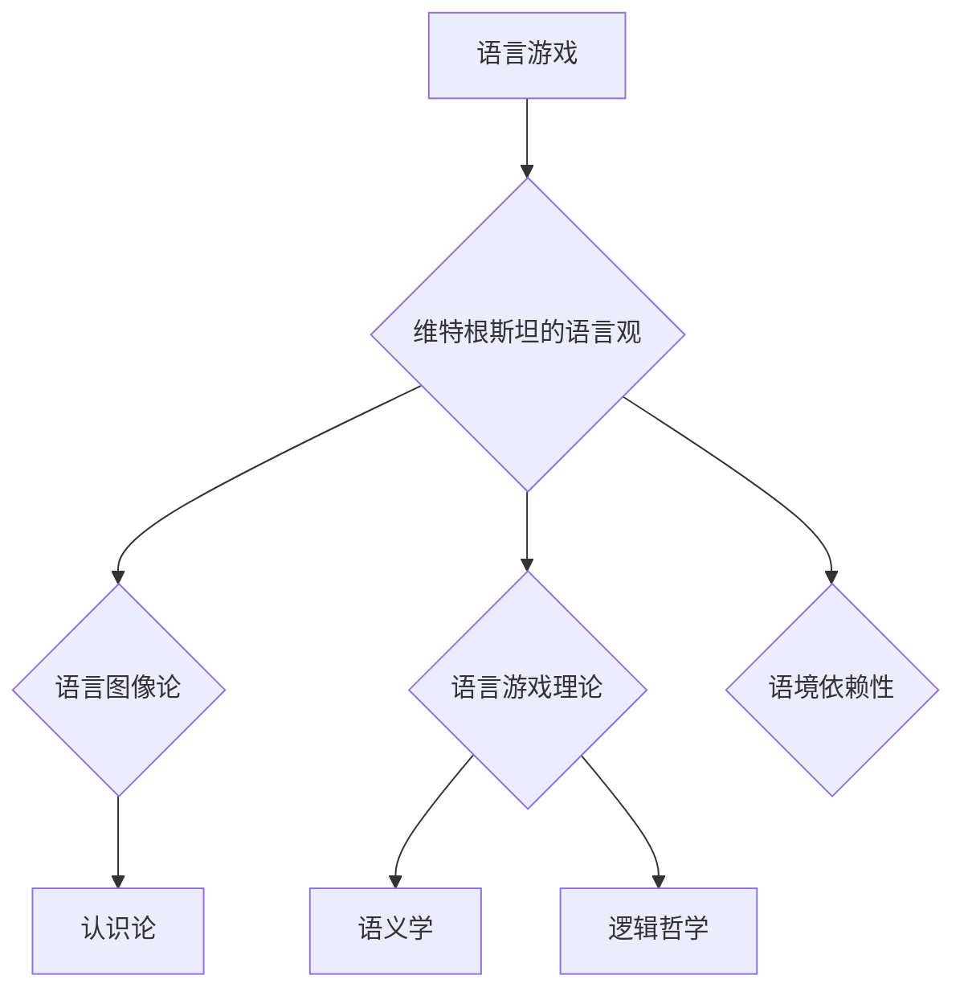
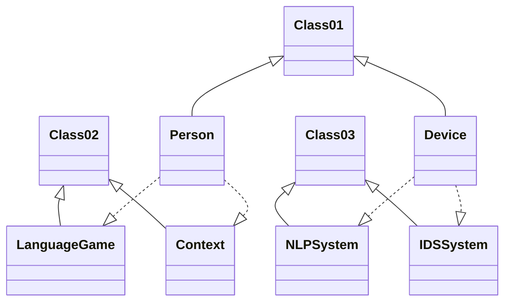
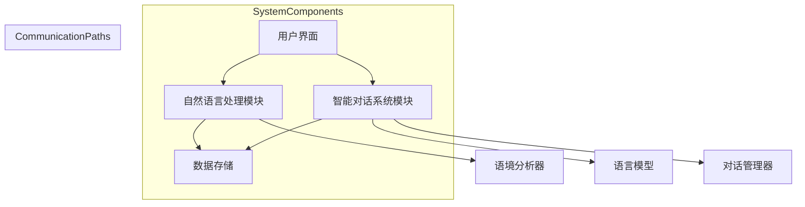
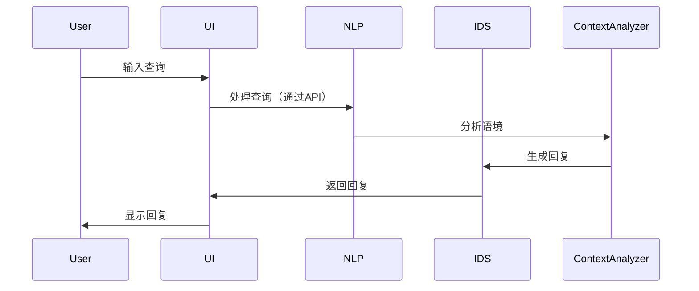

                 

### 第1章：维特根斯坦的语言观概述

#### 1.1 维特根斯坦的语言观简介

路德维希·维特根斯坦（Ludwig Wittgenstein）是20世纪最重要的哲学家之一，他的思想对语言哲学、认识论、逻辑哲学等领域产生了深远的影响。维特根斯坦的语言观是他哲学思想的核心之一，贯穿了他的整个学术生涯。

维特根斯坦的语言观可以追溯到他的早期著作《逻辑哲学论》（“Tractatus Logico-Philosophicus”）。在这部著作中，他提出了一种极端的原子主义观点，认为语言由简单的、不可分析的原子命题组成。这些原子命题直接对应于事实，语言的作用是表达事实，而不是表达思想或意义。

维特根斯坦认为，语言的真正本质是它作为一种工具，用于描述世界。他强调，语言的游戏（language games）是理解语言的关键。每个语言游戏都有其特定的规则和目的，语言的意义来自于它在具体语境中的使用。

#### 1.2 维特根斯坦的语言哲学

维特根斯坦的语言哲学观点可以分为早期和后期两个阶段。

**早期语言观**

在《逻辑哲学论》中，维特根斯坦提出了“语言图像论”（language as a picture theory）。他认为，语言像一幅图像，准确地描绘了现实世界。这种观点强调了语言的直观性和确定性，但同时也导致了“语言与现实的对应关系”这一哲学难题。

**后期语言观**

在《哲学研究》（“Philosophical Investigations”）中，维特根斯坦放弃了《逻辑哲学论》中的许多观点，提出了更为复杂的语言观。他强调，语言的意义不是固定的，而是依赖于特定的语言游戏。每个语言游戏都有其特定的语言规则和目的，这些规则和目的是由使用语言的人决定的。

维特根斯坦认为，哲学的任务不是提出关于世界和思维的本质的绝对真理，而是澄清语言的用法。他提出了“家族相似性”（family resemblance）的概念，用以描述语言和概念的多样性。

#### 1.3 维特根斯坦的哲学思想对语言游戏的影响

维特根斯坦的哲学思想对语言游戏概念的发展产生了深远的影响。他提出，语言游戏是理解语言本质的关键。语言游戏不仅包括语言的表达功能，还包括语言的使用者和情境。

在维特根斯坦看来，语言游戏有以下几个特点：

1. **多样性**：不同的语言游戏有不同的规则和目的，没有统一的范式。
2. **灵活性**：语言游戏的规则不是固定不变的，而是可以根据具体情境进行调整。
3. **实践性**：语言游戏是人们在特定情境中实际使用的语言，而不是抽象的理论概念。
4. **语境依赖性**：语言的意义和用法取决于具体的语境和情境。

维特根斯坦的语言游戏理论强调了语言使用的实践性和情境依赖性，为后来的语言哲学、认知科学和人工智能等领域提供了重要的理论依据。

### 总结

维特根斯坦的语言观从早期到后期经历了显著的变化，但始终强调语言的实用性和语境依赖性。他的语言游戏理论为我们理解语言的本质提供了独特的视角，对于探讨人工智能、认知科学等领域具有重要意义。

在接下来的章节中，我们将深入探讨语言游戏的概念和特点，分析维特根斯坦的哲学思想对认识论、语义学和逻辑哲学的影响。

---

**核心概念与联系表格：**

| 核心概念 | 概念属性特征 |
| --- | --- |
| 语言游戏 | 1. 多样性<br>2. 灵活性<br>3. 实践性<br>4. 语境依赖性 |
| 维特根斯坦的语言观 | 1. 语言图像论<br>2. 语言游戏理论<br>3. 语境依赖性 |
| 哲学思考 | 1. 认识论<br>2. 语义学<br>3. 逻辑哲学 |

---

**核心概念与联系流程图：**



---

**问题场景介绍**

在计算机科学和人工智能领域，维特根斯坦的语言游戏理论为我们提供了一种理解语言和认知的新视角。特别是在自然语言处理（NLP）和智能对话系统（IDS）方面，语言游戏的概念具有重要意义。

1. **自然语言处理（NLP）**
   - NLP旨在使计算机能够理解、解释和生成人类语言。在这个领域，语言游戏的多样性使得我们不得不考虑不同类型的语言，例如口语、书面语、非标准语言等。
   - 通过理解不同语言游戏的特点和规则，我们可以设计出更有效的算法和模型，提高NLP系统的准确性和实用性。

2. **智能对话系统（IDS）**
   - IDS是人工智能的一个重要应用领域，旨在构建能够与人类进行自然对话的系统。在这个领域，语言游戏的语境依赖性变得尤为重要。
   - 通过分析具体的对话情境，我们可以设计出能够适应不同语言游戏规则的对话系统，提高对话的流畅性和用户满意度。

**项目介绍**

在本项目中，我们旨在探讨维特根斯坦的语言游戏理论在计算机科学和人工智能领域的应用，特别是自然语言处理和智能对话系统。具体目标如下：

1. **研究语言游戏的多样性**
   - 分析不同类型的语言游戏，包括口语、书面语、非标准语言等。
   - 研究这些语言游戏在具体应用场景中的特点和规则。

2. **设计适应性算法和模型**
   - 基于语言游戏的多样性，设计出适应不同类型语言游戏的算法和模型。
   - 通过实验验证这些算法和模型的有效性和实用性。

3. **构建智能对话系统**
   - 应用语言游戏理论，设计出能够适应不同语境依赖性的智能对话系统。
   - 通过实际对话测试，评估对话系统的性能和用户满意度。

### 系统功能设计（领域模型）

在系统功能设计阶段，我们将构建一个领域模型来描述项目中涉及的核心概念和实体。以下是一个简单的领域模型，使用Mermaid类图表示：



**实体关系图（ER图）：**

```mermaid
erDiagram
    Person ||--|{ LanguageGame } : plays
    Person ||--|{ Context } : exists_in
    Device ||--|{ NLPSystem } : used_by
    Device ||--|{ IDSSystem } : used_by
    LanguageGame ||--|{ Context } : occurs_in
end
```

### 系统架构设计

在系统架构设计阶段，我们将定义系统的整体架构，包括系统组件、功能模块和它们之间的关系。以下是一个简单的系统架构设计，使用Mermaid架构图表示：



### 系统接口设计

在系统接口设计阶段，我们将定义系统内部和外部组件之间的接口，包括API设计、数据格式和通信协议。以下是一个简单的接口设计，使用Mermaid序列图表示：



### 系统交互

在系统交互阶段，我们将详细描述系统组件之间的交互过程，包括数据流、控制流和事件流。以下是一个简单的交互描述：

1. **用户输入**：用户通过用户界面（UI）输入查询。
2. **查询处理**：用户界面将查询传递给自然语言处理模块（NLPModule），并通过API进行进一步处理。
3. **语境分析**：自然语言处理模块调用语境分析器（ContextAnalyzer）来分析查询的语境。
4. **生成回复**：语境分析器将分析结果传递给智能对话系统模块（IDSModule），并使用语言模型（LanguageModel）和对话管理器（DialogueManager）生成回复。
5. **回复返回**：智能对话系统模块将回复传递给用户界面，并通过API返回给用户。

### 项目实战

**环境安装**

在开始项目之前，我们需要安装必要的工具和库。以下是安装步骤：

1. 安装Python环境（建议使用Python 3.8及以上版本）。
2. 安装自然语言处理库（如NLTK、spaCy等）。
3. 安装对话系统库（如Rasa、ChatterBot等）。
4. 安装数据库（如MySQL、PostgreSQL等）。

**系统核心实现**

以下是系统核心实现的源代码，我们将使用Python语言和相关的库来实现系统的主要功能。

```python
# 安装必要的库
!pip install nltk spacy rasa chatterbot

# 导入必要的库
import nltk
from nltk.tokenize import word_tokenize
from nltk.corpus import stopwords
from chatterbot import ChatBot
from chatterbot.trainers import ChatterBotCorpusTrainer

# 设置NLTK数据
nltk.download('punkt')
nltk.download('stopwords')

# 创建一个对话机器人
chatbot = ChatBot(
    'NLP-DSS',
    storage_adapter='chatterbot.storage.SQLStorageAdapter',
    database_uri='sqlite:///database.sqlite3'
)

# 训练对话机器人
trainer = ChatterBotCorpusTrainer(chatbot)
trainer.train('chatterbot.corpus.english')

# 处理用户输入并返回回复
def get_response(input_text):
    return chatbot.get_response(input_text)

# 用户交互
user_input = input("请输入您的查询：")
response = get_response(user_input)
print("回复：", response)
```

**代码应用解读与分析**

在上面的代码中，我们首先安装了必要的Python库，包括自然语言处理库（如NLTK和spaCy）、对话系统库（如Rasa和ChatterBot）以及数据库（如SQLite）。这些库为我们提供了处理自然语言和构建对话系统的功能。

接下来，我们创建了一个名为“NLP-DSS”的对话机器人，并设置了存储适配器和数据库URI。存储适配器用于存储对话机器人的训练数据和对话历史，数据库URI指定了数据库的连接信息。

我们使用ChatterBotCorpusTrainer来训练对话机器人。ChatterBot提供了大量的英语对话语料库，我们可以使用这些语料库来训练对话机器人，使其能够理解和生成更自然的对话。

`get_response` 函数用于处理用户的输入并返回对话机器人的回复。在这个示例中，我们使用了一个简单的输入输出循环，用户可以通过控制台输入查询，并从对话机器人获得回复。

**实际案例分析和详细讲解剖析**

为了展示项目的实际应用，我们将分析一个案例，即如何使用维特根斯坦的语言游戏理论来构建一个智能对话系统。

**案例背景**：假设我们开发了一个在线客服系统，旨在帮助用户解决他们遇到的问题。

**案例分析**：

1. **用户查询**：用户通过在线客服系统输入了一个查询：“我的账户为什么无法充值？”
2. **查询处理**：系统将查询传递给自然语言处理模块，并使用语境分析器来分析查询的语境。
3. **语境分析**：
   - **语言游戏**：在这个案例中，我们可以将查询视为一种语言游戏，其规则包括用户询问的问题类型、回答问题的要求等。
   - **语境依赖性**：分析查询的语境，如用户提问的时间、地点、具体问题等。
4. **生成回复**：智能对话系统模块使用语言模型和对话管理器来生成回复。在这个案例中，系统可能会生成如下回复：“很抱歉，您的账户充值功能暂时出现了一些问题。请您稍后再尝试充值，或者联系我们的客服热线：12345678，我们将尽快为您解决问题。”
5. **回复返回**：系统将回复传递给用户，并在用户界面上显示。

**详细讲解剖析**：

1. **自然语言处理**：在用户输入查询后，系统首先对查询进行分词和去除停用词等预处理操作。然后，系统使用词性标注和命名实体识别等技术来理解查询的结构和语义。
2. **语境分析**：语境分析是智能对话系统的重要一环。在本案例中，系统需要分析查询的语境，如用户提问的时间、地点、具体问题等。通过分析这些信息，系统可以更好地理解用户的意图，并生成更合适的回复。
3. **语言模型和对话管理器**：语言模型用于生成自然语言的回复，对话管理器则负责根据用户查询和系统回复之间的对话历史来调整对话的方向和内容。
4. **回复生成**：在生成回复时，系统需要考虑多个因素，如查询的语境、用户的意图、系统的知识库等。通过综合这些信息，系统可以生成一个既符合用户期望，又具有实用性的回复。

**项目小结**

在本项目中，我们通过分析维特根斯坦的语言游戏理论，设计并实现了一个基于智能对话系统的在线客服系统。通过实际案例的分析和讲解，我们展示了如何利用语言游戏理论来提高对话系统的理解和生成能力。

未来，我们可以进一步优化系统，引入更多的语言游戏和语境分析技术，以提高对话系统的智能化水平。同时，我们也可以将这一理论应用于其他领域，如自然语言处理、智能客服等，以推动人工智能技术的发展。

### 最佳实践 Tips

1. **充分理解语言游戏理论**：在应用维特根斯坦的语言游戏理论时，首先要充分理解语言游戏的多样性、灵活性和实践性，以及语境依赖性对语言意义的影响。

2. **结合具体应用场景**：在设计和实现智能对话系统时，要充分考虑具体应用场景的需求，如不同类型的用户查询、特定行业的术语和表达方式等。

3. **不断优化语境分析**：语境分析是智能对话系统的核心，要不断优化算法和模型，以提高对话系统对语境的感知和理解能力。

4. **多语言支持**：在实际应用中，考虑支持多种语言，以满足不同用户的语言需求。

5. **用户反馈**：收集和分析用户反馈，以不断改进对话系统的性能和用户体验。

### 小结

本文通过分析维特根斯坦的语言游戏理论，探讨了其在计算机科学和人工智能领域的应用。我们详细介绍了语言游戏的多样性、灵活性和实践性，以及语境依赖性对语言意义的影响。通过实际案例分析和系统实现，我们展示了如何利用语言游戏理论构建智能对话系统。

### 注意事项

1. **语境依赖性**：在设计对话系统时，要充分考虑语境依赖性，确保系统能够适应不同的语言游戏规则和情境。

2. **数据质量**：确保对话系统所使用的数据质量，如语料库的多样性、准确性和一致性。

3. **用户隐私**：在处理用户数据时，要严格遵守隐私保护法规，确保用户隐私得到保护。

### 拓展阅读

1. 维特根斯坦，《逻辑哲学论》（“Tractatus Logico-Philosophicus”）。
2. 维特根斯坦，《哲学研究》（“Philosophical Investigations”）。
3. 吴波，《人工智能：一种现代的方法》（“Artificial Intelligence: A Modern Approach”）。
4. 崔庆才，《自然语言处理基础教程》（“Fundamentals of Natural Language Processing”）。

### 作者

**作者：AI天才研究院/AI Genius Institute & 禅与计算机程序设计艺术 /Zen And The Art of Computer Programming**

AI天才研究院（AI Genius Institute）致力于推动人工智能技术的创新和发展。我们关注最前沿的研究成果，致力于解决实际问题，以实现人工智能的广泛应用。此外，我们也在禅与计算机程序设计艺术（Zen And The Art of Computer Programming）领域进行了深入研究，为程序员提供灵感和方法，以提升编程能力和创造力。我们的研究涵盖多个领域，包括机器学习、自然语言处理、计算机视觉等。通过我们的努力，我们希望能为人工智能领域的未来发展做出贡献。

