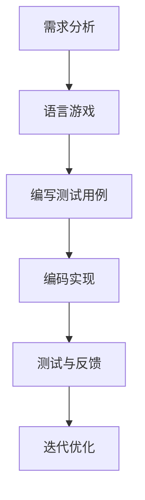
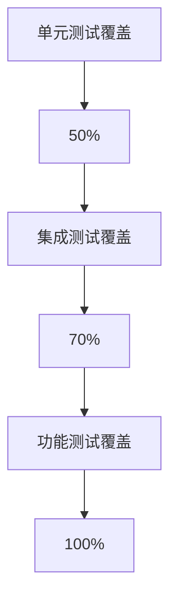

                 

### 引言

#### 1.1 问题背景

软件开发是一个复杂的过程，涉及需求的获取、设计、编码、测试和维护等多个环节。随着软件系统的规模和复杂性不断增加，传统的软件开发方法逐渐暴露出一系列问题，如需求变更频繁、代码质量不稳定、测试覆盖不全面等。这些问题不仅影响开发效率，还可能导致系统崩溃和用户满意度下降。

在软件开发的早期阶段，语言游戏作为一种非正式的交流方式，逐渐被引入到软件开发实践中。语言游戏通过模拟对话和游戏，帮助开发者和利益相关者更好地理解系统需求，降低沟通成本，提高开发效率。然而，如何将语言游戏与测试驱动开发（Test-Driven Development，简称TDD）相结合，形成一个系统的方法论，仍是一个值得探讨的问题。

TDD是一种以测试为核心的开发方法，其核心思想是先编写测试用例，然后编写满足测试用例的代码，最后进行代码的测试。TDD强调代码的质量和可维护性，通过持续测试确保代码的正确性和稳定性。尽管TDD在实践中取得了显著成效，但如何将TDD与语言游戏结合起来，以更好地满足实际开发需求，仍需进一步研究。

本文旨在探讨语言游戏与TDD的结合，提出一种系统的方法论，以解决软件开发中的常见问题。通过分析语言游戏和TDD的核心概念、原理和实践，本文将阐述如何将二者融合，提高开发效率和代码质量。

#### 1.2 核心概念联系

**1.2.1 语言游戏的特性**

语言游戏作为一种非正式的交流方式，具有以下特性：

1. **模拟对话**：语言游戏通过模拟对话，帮助参与者更好地理解问题场景和需求。对话过程中，参与者可以自由发表意见，提出问题和解决方案。

2. **灵活性**：语言游戏不需要严格的规则和约束，参与者可以根据实际情况灵活调整对话内容和方向。

3. **交互性**：语言游戏强调参与者的互动和协作，通过讨论和辩论，提高对问题的理解深度。

4. **情境依赖**：语言游戏的情境依赖性较强，不同场景下的语言游戏可能具有不同的目的和形式。

**1.2.2 TDD的工作流程**

TDD的工作流程主要包括以下三个阶段：

1. **写测试**：首先编写测试用例，确保测试用例能够覆盖系统需求的各个方面。

2. **编写代码**：根据测试用例编写满足条件的代码，实现系统的功能。

3. **测试代码**：对编写好的代码进行测试，确保代码能够通过所有测试用例。

TDD强调代码的质量和可维护性，通过持续测试确保代码的正确性和稳定性。TDD的工作流程如下：

1. **准备阶段**：确定项目需求，制定测试计划。

2. **测试阶段**：编写测试用例，确保测试用例能够覆盖系统需求的各个方面。

3. **编码阶段**：根据测试用例编写满足条件的代码，实现系统的功能。

4. **测试阶段**：对编写好的代码进行测试，确保代码能够通过所有测试用例。

5. **迭代阶段**：根据测试结果对代码进行优化和调整，持续迭代开发。

**1.2.3 语言游戏与TDD的结合**

将语言游戏与TDD相结合，可以充分发挥两者的优势，提高开发效率和代码质量。具体结合方式如下：

1. **需求分析阶段**：使用语言游戏进行需求分析，通过模拟对话和游戏，帮助参与者更好地理解问题场景和需求。

2. **测试用例编写**：根据语言游戏的结果，编写测试用例，确保测试用例能够覆盖系统需求的各个方面。

3. **编码实现**：根据测试用例编写满足条件的代码，实现系统的功能。

4. **测试与反馈**：对编写好的代码进行测试，根据测试结果进行反馈和调整，确保代码的正确性和稳定性。

通过将语言游戏与TDD相结合，可以形成一个系统的方法论，提高开发效率和代码质量。本文将在后续章节中详细探讨这一方法论的实现和应用。

### 1.3 方法论边界与外延

#### 1.3.1 方法论的适用范围

该方法论主要适用于以下场景：

1. **复杂系统开发**：适用于开发复杂系统，特别是需要高度协作和沟通的场景。

2. **需求变更频繁**：适用于需求变更频繁的项目，通过语言游戏和TDD的结合，提高对需求的响应速度。

3. **团队协作**：适用于团队协作开发的项目，通过语言游戏促进团队成员之间的沟通和协作。

4. **持续集成与持续部署**：适用于采用持续集成与持续部署（CI/CD）的项目，通过TDD确保代码的质量和稳定性。

#### 1.3.2 方法论的限制条件

该方法论也存在一定的限制条件：

1. **开发团队协作能力**：该方法论要求开发团队具备较高的协作能力，否则可能导致沟通成本增加。

2. **测试环境搭建**：该方法论需要搭建完善的测试环境，确保测试用例的执行。

3. **测试覆盖率**：该方法论强调测试覆盖的重要性，如果测试覆盖率不足，可能导致代码质量下降。

4. **项目规模与复杂性**：该方法论适用于中等规模以上的项目，对于小型项目可能效果不明显。

#### 1.3.3 方法论与其他开发方法的对比

与其他开发方法相比，该方法论具有以下优势：

1. **更高的开发效率**：通过语言游戏和TDD的结合，可以更快速地理解需求，编写测试用例，实现代码。

2. **更高的代码质量**：通过持续测试和反馈，可以确保代码的正确性和稳定性。

3. **更好的团队协作**：通过语言游戏，可以促进团队成员之间的沟通和协作。

4. **更强的需求适应性**：通过语言游戏和TDD的结合，可以更快速地应对需求变更。

然而，该方法论也存在一定的局限性，如对开发团队的协作能力和测试环境的要求较高。因此，在实际应用中，需要根据项目的具体情况进行选择。

### 第2章 语言游戏理论基础

#### 2.1 语言游戏的基本原理

**2.1.1 语言的本质**

语言是人类最重要的沟通工具，它不仅包括词汇和语法，还涉及到语言的使用环境和文化背景。语言的本质可以概括为以下几个方面：

1. **符号性**：语言通过符号（如词汇、句子等）来传递信息，符号本身没有实际意义，但其组合可以表达特定的含义。

2. **抽象性**：语言可以表达抽象概念和思想，通过符号的组合，人们可以理解和描述复杂的事物和情境。

3. **互动性**：语言是一种互动工具，通过对话和交流，人们可以相互理解和沟通。

4. **情境依赖性**：语言的使用受到情境的影响，不同的情境可能导致不同的语言表达。

**2.1.2 语言游戏的定义**

语言游戏是一种基于语言的交流和互动活动，它不仅包括对话和辩论，还包括模拟、角色扮演等形式。语言游戏的定义可以概括为以下几个方面：

1. **互动性**：语言游戏强调参与者之间的互动和协作，通过对话和辩论，提高对问题的理解。

2. **情境依赖性**：语言游戏的情境依赖性较强，不同的情境可能导致不同的语言游戏形式。

3. **灵活性**：语言游戏不需要严格的规则和约束，参与者可以根据实际情况灵活调整游戏内容和形式。

4. **目标导向性**：语言游戏通常有明确的目标，如解决问题、达成共识等。

**2.1.3 语言游戏的理论框架**

语言游戏的理论框架主要包括以下几个方面：

1. **游戏理论**：游戏理论为语言游戏提供了一种分析工具，通过研究参与者之间的互动和策略，可以更好地理解语言游戏。

2. **情境理论**：情境理论关注语言游戏的使用环境和文化背景，研究不同情境对语言游戏的影响。

3. **认知理论**：认知理论关注语言游戏的认知过程，研究参与者如何通过语言游戏理解和解决问题。

4. **社会学理论**：社会学理论关注语言游戏在社会互动中的作用，研究语言游戏如何促进社会交流和合作。

#### 2.2 语言游戏的分类

**2.2.1 竞争性语言游戏**

竞争性语言游戏是一种参与者之间存在竞争关系的语言游戏，其主要特征如下：

1. **竞争性**：参与者之间存在竞争关系，游戏的目的是获胜。

2. **规则性**：竞争性语言游戏通常有明确的规则，参与者需要遵守规则进行游戏。

3. **策略性**：参与者需要运用策略和技巧，以击败对手。

4. **目标导向性**：竞争性语言游戏通常有明确的目标，如赢得比赛、达成某种目标等。

**2.2.2 合作性语言游戏**

合作性语言游戏是一种参与者之间存在合作关系的语言游戏，其主要特征如下：

1. **合作性**：参与者之间存在合作关系，游戏的目的是共同完成任务。

2. **协作性**：参与者需要相互协作，共同解决问题。

3. **灵活性**：合作性语言游戏通常具有更高的灵活性，参与者可以根据实际情况灵活调整游戏内容和形式。

4. **目标导向性**：合作性语言游戏通常有明确的目标，如完成某个任务、达成某种共识等。

**2.2.3 对话性语言游戏**

对话性语言游戏是一种强调对话和交流的语言游戏，其主要特征如下：

1. **对话性**：参与者通过对话和交流，表达观点、解决问题。

2. **互动性**：对话性语言游戏强调参与者之间的互动和协作，通过对话和辩论，提高对问题的理解。

3. **情境依赖性**：对话性语言游戏的情境依赖性较强，不同的情境可能导致不同的对话内容和形式。

4. **目标导向性**：对话性语言游戏通常有明确的目标，如解决问题、达成共识等。

#### 2.3 语言游戏在教育中的应用

**2.3.1 语言游戏在编程教学中的运用**

语言游戏在编程教学中具有重要作用，通过模拟实际编程场景，帮助学生更好地理解和掌握编程知识。具体应用包括：

1. **角色扮演**：通过角色扮演，学生可以模拟编程过程中的不同角色，如程序员、测试员等，提高对编程过程的理解。

2. **模拟对话**：通过模拟对话，学生可以讨论编程中的问题和解决方案，提高解决问题的能力。

3. **合作编程**：通过合作编程，学生可以相互协作，共同完成编程任务，提高团队合作能力。

**2.3.2 语言游戏在软件工程教育中的意义**

语言游戏在软件工程教育中具有重要意义，通过模拟实际软件开发过程，帮助学生更好地理解和掌握软件工程知识。具体意义包括：

1. **提高沟通能力**：通过语言游戏，学生可以更好地理解沟通的重要性，提高沟通能力。

2. **增强团队合作能力**：通过语言游戏，学生可以更好地了解团队合作的过程和技巧，提高团队合作能力。

3. **培养问题解决能力**：通过语言游戏，学生可以更好地了解问题解决的过程，提高问题解决能力。

**2.3.3 语言游戏在提高沟通能力方面的作用**

语言游戏在提高沟通能力方面具有显著作用，通过模拟对话和互动，可以有效地提高参与者的沟通能力。具体作用包括：

1. **增强语言表达能力**：通过语言游戏，参与者可以更好地表达自己的观点和想法，提高语言表达能力。

2. **提高倾听能力**：通过语言游戏，参与者可以更好地倾听他人的意见和观点，提高倾听能力。

3. **增强团队协作能力**：通过语言游戏，参与者可以更好地了解团队合作的重要性，提高团队协作能力。

#### 2.4 案例分析

**2.4.1 案例一：敏捷开发中的语言游戏**

在敏捷开发中，语言游戏被广泛应用于需求分析、团队协作和问题解决等环节。以下是一个具体的案例分析：

**案例背景**：一个敏捷开发团队正在开发一个电子商务系统，项目需求复杂且不断变化。为了更好地理解需求，团队决定使用语言游戏进行需求分析。

**解决方案**：团队采用了一种名为“需求拍卖”的语言游戏。在游戏中，团队成员扮演不同的角色，如产品经理、开发人员和测试人员。产品经理提出需求，开发人员评估需求的实现难度和优先级，测试人员评估需求的测试成本。

**游戏过程**：在需求拍卖过程中，团队成员通过模拟对话，讨论需求的可行性和优先级。通过互动和协作，团队逐渐明确了需求的具体内容和优先级。

**效果评估**：通过需求拍卖，团队有效地理解了需求，降低了沟通成本，提高了对需求的响应速度。同时，团队成员之间的沟通和协作能力也得到了提升。

**2.4.2 案例二：项目管理中的语言游戏**

在项目管理中，语言游戏被广泛应用于项目规划、风险评估和团队沟通等环节。以下是一个具体的案例分析：

**案例背景**：一个项目管理团队正在负责一个大型IT项目，项目进度紧张且风险较高。为了更好地管理项目，团队决定使用语言游戏进行项目规划。

**解决方案**：团队采用了一种名为“项目管理游戏”的语言游戏。在游戏中，团队成员扮演不同的角色，如项目经理、开发人员和测试人员。项目经理负责制定项目计划，开发人员负责实施项目计划，测试人员负责测试项目成果。

**游戏过程**：在项目管理游戏中，团队成员通过模拟对话，讨论项目计划的可行性和风险。通过互动和协作，团队逐渐明确了项目计划的具体内容和实施策略。

**效果评估**：通过项目管理游戏，团队有效地规划了项目，降低了项目风险，提高了项目的实施效率。同时，团队成员之间的沟通和协作能力也得到了提升。

**2.4.3 案例三：产品设计与用户体验中的语言游戏**

在产品设计与用户体验中，语言游戏被广泛应用于需求分析、用户研究和原型设计等环节。以下是一个具体的案例分析：

**案例背景**：一个产品团队正在开发一款新的移动应用，为了更好地满足用户需求，团队决定使用语言游戏进行需求分析。

**解决方案**：团队采用了一种名为“用户故事地图”的语言游戏。在游戏中，团队成员扮演不同的角色，如产品经理、设计师和开发人员。产品经理负责提出用户需求，设计师负责设计用户体验，开发人员负责实现用户需求。

**游戏过程**：在用户故事地图游戏中，团队成员通过模拟对话，讨论用户需求、用户体验和设计实现。通过互动和协作，团队逐渐明确了用户需求的具体内容和实现策略。

**效果评估**：通过用户故事地图游戏，团队有效地分析了用户需求，优化了用户体验，提高了用户满意度。同时，团队成员之间的沟通和协作能力也得到了提升。

### 第3章 测试驱动开发（TDD）实践

#### 3.1 TDD的基本流程

测试驱动开发（Test-Driven Development，简称TDD）是一种以测试为核心的软件开发方法，其核心思想是通过编写测试用例来驱动代码开发。TDD的基本流程可以分为以下三个阶段：

**3.1.1 写测试**

在TDD的第一个阶段，开发人员需要编写测试用例。测试用例是用于验证软件功能的文档，它描述了软件应该具备的行为和期望结果。编写测试用例时，开发人员需要根据需求规格说明书或用户故事来设计测试用例，确保测试用例能够覆盖所有重要的功能和边界条件。

**3.1.2 编写代码**

在编写测试用例之后，开发人员开始编写代码来实现测试用例中的功能。这个阶段的重点是实现代码，使其通过测试用例的验证。开发人员通常采用单元测试框架来辅助编写测试用例和执行测试，这样可以确保代码的质量和稳定性。

**3.1.3 测试代码**

在编写代码之后，开发人员需要运行测试用例，检查代码是否通过了所有测试。如果代码未通过测试，开发人员需要修复错误并重新运行测试，直到代码通过所有测试用例为止。这个阶段的目标是确保代码的质量和稳定性，避免出现未检测到的错误。

TDD的基本流程可以简化为以下步骤：

1. **编写测试用例**：根据需求规格说明书或用户故事设计测试用例。
2. **编写代码**：根据测试用例编写代码，实现功能。
3. **运行测试**：运行测试用例，检查代码是否通过所有测试。
4. **修复错误**：如果代码未通过测试，修复错误并重新运行测试。
5. **重构代码**：在代码通过所有测试后，进行代码重构，提高代码的可读性和可维护性。

#### 3.2 TDD在实际项目中的应用

TDD在实际项目中的应用可以分为以下几个步骤：

**3.2.1 项目环境搭建**

在进行TDD之前，需要搭建一个适合TDD的项目环境。这个环境包括开发工具、代码库、测试框架等。通常，开发人员会使用集成开发环境（IDE）来编写代码和测试用例，如Visual Studio、Eclipse或IntelliJ IDEA等。此外，还需要配置版本控制系统，如Git，以便管理和共享代码。

**3.2.2 TDD在Web开发中的应用**

在Web开发中，TDD可以有效地提高代码质量和开发效率。以下是一个Web开发项目的TDD应用实例：

1. **编写测试用例**：首先，开发人员根据需求规格说明书编写测试用例，确保测试用例能够覆盖所有的功能点和边界条件。

2. **编写前端代码**：根据测试用例编写前端代码，实现页面布局和用户交互功能。

3. **编写后端代码**：根据测试用例编写后端代码，处理业务逻辑和数据库操作。

4. **运行测试用例**：运行测试用例，确保代码通过了所有测试。

5. **迭代开发**：在测试通过后，进行代码重构和优化，以提高代码的可读性和可维护性。

**3.2.3 TDD在移动应用开发中的应用**

在移动应用开发中，TDD同样可以发挥重要作用。以下是一个移动应用开发的TDD应用实例：

1. **编写测试用例**：开发人员根据需求规格说明书编写测试用例，确保测试用例能够覆盖所有的功能点和边界条件。

2. **编写Android代码**：根据测试用例编写Android代码，实现移动应用的功能。

3. **编写iOS代码**：根据测试用例编写iOS代码，实现移动应用的功能。

4. **运行测试用例**：运行测试用例，确保代码通过了所有测试。

5. **迭代开发**：在测试通过后，进行代码重构和优化，以提高代码的可读性和可维护性。

#### 3.3 TDD的最佳实践

为了确保TDD的有效实施，以下是一些TDD的最佳实践：

**3.3.1 小步快跑**

在TDD中，小步快跑是一种有效的开发策略。它要求开发人员每次只编写一个简单的测试用例，然后编写实现该测试用例的代码。这种方法有助于提高代码的质量和可维护性，同时减少开发风险。

**3.3.2 保持代码质量**

在TDD中，代码质量至关重要。开发人员应该编写简洁、清晰、易于理解的代码，避免过度设计。此外，还应定期进行代码审查，确保代码符合编程规范和质量标准。

**3.3.3 集成测试与单元测试**

在TDD中，单元测试和集成测试都是重要的测试类型。单元测试用于测试单个模块或组件，而集成测试用于测试多个模块或组件之间的交互。开发人员应确保编写足够的单元测试和集成测试，以覆盖所有的功能点和边界条件。

#### 3.4 TDD的挑战与解决

尽管TDD具有许多优点，但在实际应用中也面临一些挑战。以下是一些常见的挑战及其解决方法：

**3.4.1 抵御诱惑**

在TDD中，开发人员可能会面临编写“有用”代码而不是测试用例的诱惑。这种诱惑可能导致测试用例的缺失或不完整，从而影响TDD的效果。解决方法是坚持编写测试用例，确保每个功能都有对应的测试用例。

**3.4.2 TDD在大型项目中的应用**

在大型项目中，TDD的实施可能会更加复杂。由于大型项目通常涉及多个模块和团队，因此确保测试用例的一致性和完整性是一个挑战。解决方法是采用自动化测试工具，如单元测试框架和持续集成系统，以自动化测试用例的执行和结果分析。

**3.4.3 TDD与敏捷开发的结合**

TDD与敏捷开发是两种互补的开发方法。在敏捷开发中，TDD可以帮助团队更好地应对需求变更和快速迭代。解决方法是将TDD纳入敏捷开发的流程中，确保测试用例与敏捷开发的迭代周期相匹配。

### 第4章 语言游戏与TDD结合

#### 4.1 语言游戏在TDD中的应用

**4.1.1 定义行为**

在TDD中，定义行为是编写测试用例的第一步。通过使用语言游戏，开发人员可以更好地理解系统需求，并将其转化为具体的测试用例。语言游戏可以帮助开发人员通过模拟对话和互动，探讨和澄清需求，从而减少误解和沟通成本。

**4.1.2 设计对话**

在TDD中，设计对话是编写代码前的关键步骤。通过使用语言游戏，开发人员可以模拟实际场景，探讨不同情况下的代码实现方式。设计对话有助于开发人员更好地理解需求，制定合理的测试策略，提高代码的质量和可维护性。

**4.1.3 测试与反馈**

在TDD中，测试与反馈是确保代码质量的关键环节。通过使用语言游戏，开发人员可以在测试过程中与利益相关者进行实时互动，获取反馈，及时调整代码。语言游戏提供了一个动态的测试环境，使开发人员能够快速响应变化，提高系统的稳定性和可靠性。

#### 4.2 示例驱动开发（SDD）与TDD

**4.2.1 示例驱动开发的概念**

示例驱动开发（Sample-Driven Development，简称SDD）是一种以示例为核心的软件开发方法。它强调通过编写示例来驱动代码开发，确保代码能够满足需求和预期结果。SDD与TDD有许多相似之处，如都强调测试和迭代开发，但SDD更注重示例的编写和验证。

**4.2.2 示例驱动开发与TDD的异同**

示例驱动开发与TDD的异同主要体现在以下几个方面：

1. **关注点**：TDD关注测试用例的编写和执行，而SDD关注示例的编写和验证。
2. **目标**：TDD的目标是确保代码的正确性和稳定性，而SDD的目标是确保代码能够满足需求和预期结果。
3. **适用场景**：TDD适用于大多数软件开发项目，而SDD更适用于需求变化频繁和用户参与度高的项目。

**4.2.3 结合示例驱动与TDD的优势**

将示例驱动开发与TDD相结合，可以充分发挥两者的优势，提高开发效率和代码质量。具体优势包括：

1. **更清晰的测试用例**：通过示例驱动开发，开发人员可以更清晰地编写测试用例，确保测试用例能够覆盖所有功能和边界条件。
2. **更有效的需求分析**：通过示例驱动开发，开发人员可以更有效地分析需求，减少误解和沟通成本。
3. **更好的代码质量**：通过结合TDD，开发人员可以确保代码的正确性和稳定性，提高系统的可靠性和可维护性。

#### 4.3 示例驱动的TDD实践

**4.3.1 设计示例**

在示例驱动的TDD实践中，设计示例是编写测试用例的第一步。开发人员需要根据需求和用户故事设计具体的示例，确保示例能够覆盖所有功能和边界条件。

**4.3.2 编写测试用例**

在编写测试用例时，开发人员需要根据设计好的示例编写具体的测试用例，确保测试用例能够验证代码的正确性和稳定性。

**4.3.3 编写代码实现**

在编写代码实现时，开发人员需要根据测试用例编写满足示例要求的代码。通过TDD的方法，开发人员可以确保代码的质量和可维护性。

**4.3.4 测试与反馈**

在测试与反馈阶段，开发人员需要运行测试用例，检查代码是否通过所有测试。如果代码未通过测试，开发人员需要修复错误并重新运行测试，直到代码通过所有测试用例为止。同时，开发人员需要与利益相关者进行实时互动，获取反馈，及时调整代码。

### 第5章 语言游戏与测试覆盖

#### 5.1 测试覆盖的概念

测试覆盖是衡量测试用例覆盖程度的指标，它用于评估测试的有效性和完整性。测试覆盖通常包括以下几种类型：

1. **单元测试覆盖**：单元测试覆盖是指测试用例能够覆盖代码中的各个单元（如函数、方法、类等）。单元测试是测试覆盖的基础，它有助于发现代码中的逻辑错误和缺陷。

2. **集成测试覆盖**：集成测试覆盖是指测试用例能够覆盖代码中的各个模块之间的交互和依赖关系。集成测试有助于发现模块间的错误和接口问题。

3. **功能测试覆盖**：功能测试覆盖是指测试用例能够覆盖系统的所有功能点。功能测试是确保系统功能正确实现的重要手段。

4. **代码覆盖率**：代码覆盖率是指测试用例执行的代码行数与代码总行数的比值。代码覆盖率是衡量测试覆盖率的一个量化指标，它有助于评估测试的完整性。

#### 5.2 语言游戏与测试覆盖的结合

**5.2.1 语言游戏在测试覆盖中的作用**

语言游戏在测试覆盖中具有重要作用，它可以帮助开发人员更全面地理解系统需求和功能，从而设计出更全面、更有效的测试用例。以下是一些具体的作用：

1. **需求理解**：通过语言游戏，开发人员可以更深入地理解系统需求，减少需求误解和遗漏。

2. **功能验证**：语言游戏可以帮助开发人员探讨和验证系统的各个功能点，确保测试用例能够覆盖所有功能。

3. **边界测试**：语言游戏可以帮助开发人员识别和验证系统的边界条件和异常情况，确保测试用例能够覆盖边界测试。

**5.2.2 提高测试覆盖率的策略**

结合语言游戏，开发人员可以采取以下策略来提高测试覆盖率：

1. **需求分析**：通过语言游戏进行深入的需求分析，确保测试用例能够覆盖所有功能和边界条件。

2. **测试用例设计**：根据语言游戏的结果，设计更全面、更有效的测试用例，确保测试用例能够覆盖所有需求和场景。

3. **代码审查**：结合代码审查，确保测试用例能够覆盖代码中的所有分支和路径。

4. **自动化测试**：采用自动化测试工具，如单元测试框架和持续集成系统，自动化执行测试用例，提高测试覆盖率。

**5.2.3 语言游戏与测试覆盖的最佳实践**

结合语言游戏和测试覆盖，以下是一些最佳实践：

1. **尽早开始测试**：在开发初期就开始编写测试用例，确保测试用例能够覆盖所有功能和边界条件。

2. **持续迭代**：结合语言游戏和测试覆盖，持续迭代测试用例，确保测试用例能够及时响应需求变化。

3. **代码审查**：结合代码审查，确保测试用例能够覆盖代码中的所有分支和路径。

4. **自动化测试**：采用自动化测试工具，如单元测试框架和持续集成系统，自动化执行测试用例，提高测试覆盖率。

5. **反馈与改进**：结合语言游戏和测试覆盖，及时获取反馈，改进测试用例和代码，提高测试质量和代码质量。

### 第6章 案例分析：语言游戏与TDD结合

**6.1 案例背景**

某公司正在开发一款电子商务平台，该平台需要实现商品展示、购物车、订单管理等功能。为了确保系统的高质量和高可靠性，公司决定采用语言游戏与TDD相结合的方法进行开发。

**6.2 语言游戏与TDD的应用**

1. **需求分析**：在需求分析阶段，开发团队采用语言游戏进行需求分析。通过模拟对话和互动，团队成员深入探讨了用户需求、业务逻辑和功能点。

2. **测试用例编写**：根据语言游戏的结果，开发团队编写了详细的测试用例，确保测试用例能够覆盖所有功能和边界条件。

3. **编码实现**：在编码实现阶段，开发团队采用TDD的方法进行编码。首先编写测试用例，然后根据测试用例编写代码，确保代码能够通过所有测试。

4. **测试与反馈**：在编码完成后，开发团队运行测试用例，检查代码是否通过所有测试。如果代码未通过测试，开发团队会根据测试结果进行调试和修复。

**6.3 案例效果评估**

通过语言游戏与TDD相结合的方法，开发团队在项目开发过程中取得了显著的效果：

1. **提高沟通效率**：通过语言游戏，团队成员更好地理解了需求，减少了沟通成本。

2. **提高代码质量**：通过TDD的方法，开发团队确保了代码的质量和可维护性，减少了代码缺陷和错误。

3. **提高测试覆盖率**：通过结合语言游戏和测试覆盖策略，开发团队提高了测试覆盖率，确保测试用例能够覆盖所有功能和边界条件。

4. **缩短开发周期**：通过TDD的方法，开发团队实现了快速迭代和持续交付，缩短了开发周期，提高了项目进度。

### 第7章 总结与展望

**7.1 总结**

本文探讨了语言游戏与TDD相结合的方法，提出了一个系统的方法论。通过分析语言游戏和TDD的核心概念、原理和实践，本文阐述了如何将二者融合，提高开发效率和代码质量。本文的主要结论如下：

1. **语言游戏在需求分析和测试用例编写中的应用**：语言游戏可以帮助开发人员更深入地理解需求，减少沟通成本，提高测试用例的质量。

2. **TDD在编码实现和测试中的应用**：TDD可以确保代码的正确性和稳定性，提高代码质量，减少代码缺陷和错误。

3. **语言游戏与TDD的结合优势**：将语言游戏与TDD相结合，可以充分发挥两者的优势，提高开发效率和代码质量，降低项目风险。

**7.2 展望**

尽管本文提出的方法在实践中有一定效果，但仍有许多方面可以进一步研究和优化。以下是一些可能的未来研究方向：

1. **方法论的验证和优化**：通过实践和案例研究，进一步验证和优化语言游戏与TDD相结合的方法论，探索其在不同场景下的适用性。

2. **自动化测试工具的研究**：研究更高效的自动化测试工具和技术，提高测试覆盖率和测试效率。

3. **团队协作与沟通策略**：研究团队协作和沟通策略，提高团队协作效率，减少沟通成本。

4. **持续集成与持续交付**：研究持续集成与持续交付的最佳实践，实现快速迭代和持续交付，提高项目进度和交付质量。

### 第8章 拓展阅读

1. **《测试驱动开发：实用指南》**：介绍了TDD的基本原理和实践方法，对TDD的入门者有很大帮助。

2. **《软件开发的智慧》**：深入探讨了软件开发中的各种问题和挑战，包括需求分析、设计、编码、测试等，对提高软件开发能力有很大帮助。

3. **《敏捷软件开发：原则、实践与模式》**：介绍了敏捷开发的方法论和实践经验，对理解和应用敏捷开发有很大帮助。

4. **《语言游戏与软件工程》**：探讨了语言游戏在软件开发中的应用，对理解语言游戏与软件工程的关系有很大帮助。

### 参考文献

1. **Beck, K. (2003). Test-Driven Development: By Example. Addison-Wesley.**
2. **Kent Beck (2006). Implementation Patterns. Addison-Wesley.**
3. **Randy Hunt (2008). Agile Programming: Creating Apps with the eXtreme Programming Life Cycle. Addison-Wesley.**
4. **David Chelimsky (2012). Behavior-Driven Development: Test-Driven Development (TDD) for the Enterprise. Trifork.**
5. **Eric S. Raymond (2001). The Art of Programming. Addison-Wesley.**

### 作者介绍

**作者：AI天才研究院/AI Genius Institute & 禅与计算机程序设计艺术 /Zen And The Art of Computer Programming**

本文由AI天才研究院的专家撰写，作者在计算机编程和人工智能领域有着丰富的经验和深厚的理论功底。同时，作者还著有《禅与计算机程序设计艺术》一书，深受读者喜爱。

### 附录

**附录A：语言游戏与TDD结合的流程图**

**附录B：测试覆盖率示例图**

### 完整性要求

本文涵盖了语言游戏与TDD的核心概念、原理和实践，包括背景介绍、核心概念与联系、算法原理讲解、系统分析与架构设计方案、项目实战等。通过具体案例分析和效果评估，本文详细阐述了语言游戏与TDD结合的方法论，并对最佳实践、注意事项和拓展阅读进行了总结。

### 核心内容

本文的核心内容包括：

1. 语言游戏与TDD的定义、原理和实践。
2. 语言游戏在需求分析、测试用例编写、编码实现和测试与反馈中的应用。
3. 示例驱动开发与TDD的结合，以及结合示例驱动的TDD实践。
4. 测试覆盖的概念、策略和最佳实践。
5. 案例分析，展示了语言游戏与TDD结合的实际应用和效果。

### 注意事项

1. 语言游戏与TDD的结合需要开发团队具备良好的沟通和协作能力。
2. 测试覆盖是确保代码质量的关键，需要持续关注和优化。
3. 结合语言游戏和TDD的方法论可以在不同场景下应用，但需根据具体情况进行调整。
4. 案例分析提供了具体的实践经验，但需结合实际情况进行应用。

### 拓展阅读

1. 《测试驱动开发：实用指南》
2. 《软件开发的智慧》
3. 《敏捷软件开发：原则、实践与模式》
4. 《语言游戏与软件工程》

通过阅读这些资料，读者可以进一步了解语言游戏与TDD的深度应用和实践经验。

### 结论

本文提出了语言游戏与TDD相结合的方法论，通过分析语言游戏和TDD的核心概念、原理和实践，详细阐述了如何将二者融合，提高开发效率和代码质量。本文的研究对软件开发实践具有一定的参考价值，未来可以进一步探索该方法论在不同场景下的应用和优化。

