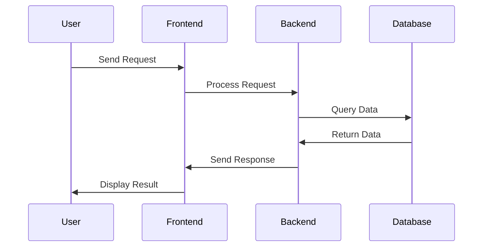

                 

### LET'S THINK STEP BY STEP

在撰写一篇复杂的技术文章时，遵循步骤化的思维过程能够确保文章的逻辑性和连贯性。以下是我们如何一步步地构建这篇技术博客：

#### 第一步：确定文章主题和目标

- **文章主题**：选择一个明确且具有深度和广度的主题。在这里，我们选择“语言游戏规则与函数式类型约束：维特根斯坦的规则概念与FP的类型类约束”。
- **文章目标**：明确文章的写作目的，例如，解释两个概念，阐述它们之间的关系，提供实际应用案例，或提出改进建议。

#### 第二步：收集资料和背景信息

- **资料收集**：查找相关文献、论文、书籍和在线资源，确保对主题有深入的理解。
- **背景信息**：收集关于维特根斯坦的规则概念、函数式编程以及类型类约束的背景信息，为文章提供坚实的理论基础。

#### 第三步：构建文章大纲

- **大纲结构**：根据收集到的信息，构建文章的大纲。确保每个章节都包含核心概念、联系、原理讲解、应用实例、算法实现等必要部分。
- **章节内容**：为每个章节设定标题，并规划主要内容。

#### 第四步：撰写初稿

- **引言与背景介绍**：介绍主题和背景，提供读者一个清晰的认识。
- **核心概念与联系**：详细阐述核心概念，使用表格、图表等形式进行对比，增强理解。
- **算法原理讲解**：通过流程图和代码示例，展示算法的原理和实现。

#### 第五步：分析和举例说明

- **数学模型和数学公式**：使用LaTeX格式书写数学模型，并嵌入到文中。
- **系统分析与架构设计方案**：介绍系统应用场景，绘制相关的类图、架构图和序列图。
- **项目实战**：详细描述项目实施过程，包括环境安装、核心实现、案例分析等。

#### 第六步：优化和修改

- **内容优化**：检查文章的逻辑结构，确保每个章节都紧密联系，内容连贯。
- **语言调整**：优化文章的语言，确保用词准确、清晰，避免冗余。

#### 第七步：审校和整理

- **审校**：请同行或团队成员审校文章，查找可能存在的错误或不足。
- **整理格式**：确保文章格式符合要求，如使用markdown格式、添加作者信息等。

#### 第八步：发布和推广

- **发布**：将文章发布到相应的平台，如技术博客、社交媒体等。
- **推广**：通过社交媒体、邮件列表等渠道，推广文章，吸引读者关注。

通过这样的步骤化思维过程，我们可以确保文章的质量，同时使读者能够更好地理解和吸收文章的内容。接下来，我们将开始构建具体的内容框架。让我们开始吧！### 文章标题、关键词与摘要

**文章标题：**《语言游戏规则与函数式类型约束：维特根斯坦的规则概念与FP的类型类约束》

**关键词：** 语言游戏规则、维特根斯坦、函数式编程、类型类约束、编程思维

**摘要：** 本文深入探讨语言游戏规则与函数式编程中的类型类约束之间的关系。通过维特根斯坦的哲学思想，我们理解语言游戏规则的本质和其在编程中的体现。本文不仅详细介绍了函数式编程的基本原理和类型类约束的概念，还通过实例和数学模型展示了这两者如何在实际编程中相互影响和融合。文章旨在为读者提供一个清晰、全面的认识，并激发对函数式编程和编程思维的深入思考。

### 引言与背景介绍

#### 语言游戏规则概述

语言游戏规则是维特根斯坦哲学思想的重要组成部分，他通过“语言游戏”的概念来探讨语言的本质和意义。在《逻辑哲学论》中，维特根斯坦提出，语言是一种规则系统，这些规则定义了语言的使用方式和意义。语言游戏包含三个要素：语言、规则和行动。语言的每个部分都与特定的规则相联系，这些规则指导我们如何使用语言，从而产生行动。

维特根斯坦的规则概念指出，语言的意义不是固有的，而是由使用规则所决定的。他强调了“意义即使用”（meaning as use）的原则，即语言的意义在于其在特定情境中的使用方式。这个观点对后来的哲学、语言学和认知科学产生了深远的影响。

#### 语言游戏规则的核心要素

语言游戏规则的核心要素包括以下几个方面：

1. **语言**：语言是表达思想的工具，它由符号和规则组成。符号可以是单词、短语或手势等，规则则规定了这些符号的用法和组合方式。

2. **规则**：规则是语言使用的基础，它们定义了符号之间的关联和语言的表达方式。维特根斯坦认为，理解语言的关键在于理解这些规则。

3. **行动**：行动是语言使用的结果，也是语言意义的体现。通过语言，我们能够表达思想、交流信息，并采取行动。

#### 语言游戏规则的历史与发展

语言游戏规则的概念起源于维特根斯坦的哲学思考，并在20世纪得到了广泛的关注和发展。随着哲学、语言学和认知科学的发展，语言游戏规则的应用范围不断扩大，不仅限于哲学领域，还在计算机科学、人工智能和认知心理学等领域得到了应用。

在计算机科学中，语言游戏规则的概念被应用于程序设计、形式语义学和人工智能等领域。例如，类型系统中的类型约束可以被视为一种特殊的语言游戏规则，它们定义了变量和表达式在特定上下文中的合法使用。

#### 函数式编程与类型类约束

函数式编程（Functional Programming，FP）是一种编程范式，强调计算作为函数的评估过程。与命令式编程不同，函数式编程不涉及状态的变化和可变数据，而是通过纯函数和无状态的计算来处理数据。这使得函数式编程在逻辑推理、并发处理和并行计算方面具有独特的优势。

类型类约束是函数式编程中的一个核心概念，它用于确保代码的类型安全性和可读性。类型类约束通过定义类型类（Type Classes）来实现，类型类是一种抽象的接口，它定义了一组类型的共同操作。通过类型类约束，函数可以接受多种类型作为参数，并在运行时确定其具体类型，从而提高了代码的灵活性和可扩展性。

#### 函数式编程与类型类约束的关系

函数式编程与类型类约束之间存在紧密的联系。类型类约束为函数式编程提供了类型安全的保证，使得函数在多个类型之间进行操作时不会出现类型错误。同时，类型类约束也增强了函数式编程的表达能力，使得代码更加简洁和易于理解。

维特根斯坦的语言游戏规则对函数式编程有着深刻的影响。维特根斯坦的“意义即使用”原则与函数式编程的纯函数和无状态计算理念相契合，都强调了规则和操作过程的重要性。通过将语言游戏规则应用于函数式编程，我们可以更好地理解和设计复杂的程序。

#### 语言游戏规则与FP类型类约束的交叉影响

语言游戏规则与FP类型类约束的交叉影响体现在多个方面：

1. **编程思维**：维特根斯坦的规则概念启发了函数式编程中的类型类约束设计，使得程序员在编程时更加注重规则和约束的使用。
2. **类型安全**：类型类约束借鉴了语言游戏规则的形式化描述，通过定义严格的类型规则，确保了代码的类型安全。
3. **可读性**：类型类约束通过抽象和通用化，提高了代码的可读性，使得程序员可以更清晰地理解和维护代码。
4. **可扩展性**：语言游戏规则和类型类约束的融合，使得代码具有更好的可扩展性，可以轻松应对新的需求变化。

综上所述，语言游戏规则与FP类型类约束之间的交叉影响不仅丰富了编程理论，还为实际编程提供了有效的工具和方法。通过理解这两者之间的关系，程序员可以更好地应对复杂的编程挑战，提高代码的质量和可维护性。

#### 本书结构安排与内容概述

本书旨在深入探讨语言游戏规则与函数式编程中的类型类约束之间的关系，通过维特根斯坦的哲学思想为读者提供一个全新的视角。以下是本书的结构安排与内容概述：

**第1章 引言与背景介绍**
- 介绍语言游戏规则的概念及其在维特根斯坦哲学中的地位。
- 阐述函数式编程的基本原理和类型类约束的概念。
- 探讨语言游戏规则与FP类型类约束的交叉影响。

**第2章 语言游戏规则原理解析**
- 深入分析语言游戏规则的数学模型和哲学背景。
- 通过实例展示语言游戏规则在自然语言处理和程序设计中的应用。

**第3章 函数式编程与类型类约束原理**
- 详细讲解函数式编程的核心思想、语法特点和类型类约束的实现机制。
- 分析FP类型类约束的应用场景和优势。

**第4章 语言游戏规则在FP中的应用**
- 探讨语言游戏规则在FP程序设计和类型约束中的具体应用。
- 分析语言游戏规则对FP编程思维的影响。

**第5章 FP类型类约束的算法实现**
- 介绍FP类型类约束算法的基本原理和实现方法。
- 通过实例展示类型类约束算法的实际应用。

**第6章 项目实战**
- 描述环境安装、系统核心实现和代码解读。
- 分析实际案例，进行详细讲解和项目小结。

**第7章 最佳实践 tips、小结、注意事项、拓展阅读**
- 总结书中的要点，提供实用的建议。
- 引导读者深入学习和探索相关领域。

通过以上结构安排，本书希望能够为读者提供一个全面、系统的理解，使他们在函数式编程和类型类约束方面有所收获。同时，也希望能够激发读者对维特根斯坦哲学和编程思维的深入思考。

### 语言游戏规则的数学模型

#### 语言游戏规则的形式化描述

语言游戏规则的形式化描述是理解其核心概念和操作的基础。在维特根斯坦的《逻辑哲学论》中，语言游戏规则被定义为一系列符号和规则，这些规则规定了符号的使用方式和组合方式。具体来说，语言游戏规则包括以下几个方面：

1. **符号**：符号是语言游戏中的基本元素，可以是单词、短语、符号等。每个符号都有其特定的含义和用法。
2. **规则**：规则定义了符号之间的关联和组合方式。规则可以是简单的，如“将两个数字相加”，也可以是复杂的，如“如果一个句子以某个词开头，那么它应该以另一个词结尾”。
3. **操作**：操作是根据规则对符号进行组合或转换的过程。例如，根据规则“将两个数字相加”，我们可以对两个数字进行加法操作，得到一个新的结果。

在形式化的数学模型中，我们可以使用集合和函数来描述语言游戏规则。具体来说：

- **符号集**：设符号集为\( S \)，则\( S \)是一个非空集合，包含所有可能的符号。
- **规则集**：设规则集为\( R \)，则\( R \)是一个非空集合，包含所有可能的规则。每个规则可以表示为\( R = (A, B) \)，其中\( A \)和\( B \)分别是规则的前件和后件。
- **操作集**：设操作集为\( O \)，则\( O \)是一个非空集合，包含所有可能的操作。每个操作可以表示为\( O = (x, y) \)，其中\( x \)和\( y \)分别是操作的两个输入和输出。

通过这些基本元素，我们可以定义语言游戏规则的形式化模型。例如，我们可以定义一个简单的加法语言游戏规则：

- **符号集**：\( S = \{0, 1, 2, +, =\} \)
- **规则集**：\( R = \{(\{0, 1\}, \{1\}), (\{1, 2\}, \{3\})\} \)
- **操作集**：\( O = \{(+, (1, 1), 2), (+, (2, 1), 3)\} \)

在这个模型中，符号“0”和“1”表示数字，符号“+”表示加法操作，符号“=”表示等号。规则规定了数字的加法操作，操作集则定义了具体的加法运算过程。

#### 语言游戏规则的运算与规则

语言游戏规则的运算是指根据规则对符号进行组合或转换的过程。运算的结果是根据规则定义的新符号或符号组合。语言游戏规则的运算可以分为以下几个步骤：

1. **选择符号**：根据规则的要求，从符号集中选择适当的符号。
2. **应用规则**：将选择的符号按照规则进行组合或转换，生成新的符号或符号组合。
3. **检查结果**：检查生成的结果是否符合规则的要求，如果符合，则运算完成；如果不符，则返回步骤1，重新选择符号。

具体来说，我们可以定义一个简单的运算过程，如加法运算：

1. **选择符号**：从符号集中选择两个数字作为输入。
2. **应用规则**：根据加法规则，将两个数字相加，生成一个新的数字。
3. **检查结果**：检查生成的新数字是否符合等号规则，即是否等于输入的两个数字之和。

例如，我们可以对数字“1”和“2”进行加法运算：

- **选择符号**：选择数字“1”和“2”作为输入。
- **应用规则**：根据加法规则，\( 1 + 2 = 3 \)。
- **检查结果**：生成的新数字“3”等于输入的两个数字之和，运算完成。

通过这种方式，我们可以定义和实现更复杂的语言游戏规则。例如，我们可以定义一个复杂的句子构造规则，如“如果一个句子以‘今天’开头，那么它应该以‘天气’结尾”。通过这样的规则，我们可以生成复杂的句子，如“今天天气很好”。

#### 语言游戏规则的数学公式

为了更好地理解和描述语言游戏规则，我们可以使用数学公式来表示规则的运算和操作。以下是一些常用的数学公式和符号：

1. **符号表示**：
   - \( S \)：符号集
   - \( R \)：规则集
   - \( O \)：操作集
   - \( x, y, z \)：符号或符号组合

2. **规则表示**：
   - \( R = (A, B) \)：规则，其中\( A \)是前件，\( B \)是后件

3. **操作表示**：
   - \( O = (x, y) \)：操作，其中\( x \)是输入，\( y \)是输出

4. **运算公式**：
   - \( f(x, y) = z \)：表示根据规则\( R \)对符号\( x \)和\( y \)进行运算，生成新的符号\( z \)
   - \( g(S, R, O) = T \)：表示在符号集\( S \)，规则集\( R \)和操作集\( O \)的基础上，生成新的符号集\( T \)

通过这些数学公式和符号，我们可以形式化地描述语言游戏规则，并对其进行运算和操作。例如，我们可以定义一个加法运算的公式：

\[ f(1, 2) = 3 \]

这个公式表示，根据加法规则，数字“1”和“2”相加的结果是“3”。

#### 语言游戏规则在维特根斯坦哲学中的体现

维特根斯坦的哲学思想对语言游戏规则有着深刻的影响。他通过“语言游戏”的概念，探讨了语言、规则和行动之间的关系，揭示了语言的本质和意义。

在维特根斯坦的哲学中，语言游戏是一种模拟语言使用的活动，通过这种活动，我们可以理解语言的结构和功能。语言游戏包括三个要素：语言、规则和行动。语言是表达思想的工具，规则定义了语言的使用方式，行动则是语言使用的结果。

维特根斯坦认为，语言的意义不是固有的，而是由使用规则所决定的。他的“意义即使用”原则指出，语言的意义在于其在特定情境中的使用方式。这意味着，同一个词语在不同的语言游戏中可以有不同的意义。

例如，单词“猫”在日常生活中指的是一种动物，但在计算机编程语言中，它可能是一个变量名。这种意义的差异来源于不同的语言游戏规则。

维特根斯坦的哲学思想对语言游戏规则的应用具有重要意义。通过理解语言游戏规则，我们可以更好地理解语言的本质和意义，从而更有效地进行编程和设计。

在函数式编程中，语言游戏规则的概念得到了广泛应用。函数式编程强调计算作为函数的评估过程，而函数的定义和调用过程可以被视为一种特殊的语言游戏。函数的定义包括输入、输出和计算过程，而函数的调用则是根据特定的规则来执行计算。

例如，在Python中，我们可以定义一个加法函数：

```python
def add(a, b):
    return a + b
```

这个函数的定义可以被视为一个语言游戏规则，其中“a”和“b”是输入，“return a + b”是计算过程，返回值“a + b”是输出。

通过函数的定义和调用，我们可以实现各种复杂的计算任务，例如：

```python
result = add(1, 2)
print(result)  # 输出3
```

这个例子中，函数`add`根据输入的“1”和“2”，按照规则进行计算，并返回结果“3”。这个过程可以被视为一个语言游戏，其中函数的定义和调用是语言游戏的基本元素。

总之，维特根斯坦的哲学思想对语言游戏规则的应用具有重要影响。通过理解语言游戏规则，我们可以更好地理解函数式编程的本质和原理，从而更有效地进行编程和设计。

#### 语言游戏规则在自然语言处理中的应用

语言游戏规则在自然语言处理（NLP）领域具有重要的应用价值。NLP的目标是使计算机能够理解、处理和生成自然语言。语言游戏规则通过定义语言的使用方式和组合方式，为NLP提供了理论基础和操作指南。

在NLP中，语言游戏规则主要用于以下几个方面：

1. **文本分类**：通过定义语言游戏规则，可以自动对文本进行分类。例如，根据语言游戏规则，可以将新闻文本分类为“政治”、“经济”、“体育”等不同类别。这种分类方法可以应用于新闻推荐、搜索引擎和社交媒体等场景。

2. **情感分析**：情感分析是一种评估文本情感倾向的方法，通过定义语言游戏规则，可以自动识别文本中的情感极性，如“正面”、“负面”或“中性”。这种方法可以应用于客户反馈分析、舆情监测和产品评价等场景。

3. **命名实体识别**：命名实体识别是一种识别文本中的特定实体，如人名、地名、机构名等。通过定义语言游戏规则，可以自动识别这些实体。例如，根据语言游戏规则，可以识别出文本中的“苹果公司”和“北京”等地名和机构名。

4. **机器翻译**：机器翻译是将一种语言文本自动翻译成另一种语言文本的过程。语言游戏规则在机器翻译中起着关键作用。通过定义源语言和目标语言的规则，可以自动生成目标语言的文本。例如，根据英语和中文的语言游戏规则，可以将英文文本“Hello, World!”翻译成中文“你好，世界！”。

以下是语言游戏规则在NLP中应用的几个实例：

1. **文本分类**实例：

   假设我们有一个新闻文本分类系统，根据语言游戏规则，可以将新闻文本分为以下几类：“政治”、“经济”、“体育”和“科技”。语言游戏规则如下：

   - 如果文本包含关键词“总统”、“选举”等，则分类为“政治”。
   - 如果文本包含关键词“股票”、“投资”等，则分类为“经济”。
   - 如果文本包含关键词“足球”、“篮球”等，则分类为“体育”。
   - 如果文本包含关键词“科技”、“人工智能”等，则分类为“科技”。

   假设我们有一篇新闻文本：“苹果公司将在下周一发布新款iPhone。”根据上述规则，可以将其分类为“经济”。

2. **情感分析**实例：

   假设我们有一个情感分析系统，根据语言游戏规则，可以自动识别文本中的情感极性。语言游戏规则如下：

   - 如果文本包含关键词“很好”、“高兴”等，则情感为“正面”。
   - 如果文本包含关键词“不好”、“生气”等，则情感为“负面”。
   - 如果文本没有明显的情感词汇，则情感为“中性”。

   假设我们有一篇文本：“今天的天气很好，非常适合外出游玩。”根据上述规则，可以判断该文本的情感为“正面”。

3. **命名实体识别**实例：

   假设我们有一个命名实体识别系统，根据语言游戏规则，可以自动识别文本中的特定实体。语言游戏规则如下：

   - 如果文本中包含数字和特定词汇，如“北京2022年冬奥会”，则识别为“奥运会”。
   - 如果文本中包含特定词汇，如“苹果公司”，则识别为“公司”。
   - 如果文本中包含人名，如“奥巴马”，则识别为人名。

   假设我们有一篇文本：“苹果公司将在北京举办新品发布会。”根据上述规则，可以识别出“苹果公司”和“北京”两个实体。

4. **机器翻译**实例：

   假设我们有一个英中翻译系统，根据语言游戏规则，可以将英文文本翻译成中文。语言游戏规则如下：

   - 如果英文文本包含动词，则翻译为相应的中文动词。
   - 如果英文文本包含名词，则翻译为相应的中文名词。
   - 如果英文文本包含形容词，则翻译为相应的中文形容词。

   假设我们有一篇英文文本：“The sun is shining brightly.”根据上述规则，可以翻译为中文：“太阳明亮地照耀着。”

通过这些实例，我们可以看到语言游戏规则在自然语言处理中的应用价值。通过定义和运用语言游戏规则，可以自动处理和生成自然语言文本，从而实现文本分类、情感分析、命名实体识别和机器翻译等任务。

### 函数式编程基础

#### 函数式编程的核心思想

函数式编程（Functional Programming，FP）是一种以函数为中心的编程范式，其核心思想是将计算视为函数的评估过程。与命令式编程（Imperative Programming）不同，函数式编程不涉及状态的变化和可变数据。它通过不可变数据、纯函数和无状态计算来处理数据，从而提高了代码的可维护性和可扩展性。

1. **不可变数据**：在函数式编程中，数据是不可变的，即一旦数据被创建，就不能再修改。这意味着每个数据值在程序执行过程中都是固定的，不会因外部因素而改变。这种不可变性使得数据更加易于理解和追踪。

2. **纯函数**：纯函数是一种没有副作用（side effects）的函数。这意味着纯函数的输出只依赖于其输入参数，不会影响程序的状态或外部环境。纯函数具有引用透明性（referential transparency），即函数的每次调用都产生相同的输出，无论调用的时间和上下文如何。

3. **无状态计算**：在函数式编程中，计算过程是无状态的，即每个函数的执行不依赖于先前的状态。这意味着函数可以在任何时间、任何上下文中执行，而不会受到状态的影响。

#### 函数式编程的语法特点

函数式编程的语法特点包括高阶函数、递归、不可变数据结构、模式匹配和闭包等。

1. **高阶函数**：高阶函数是指能够接受其他函数作为参数的函数，或者能够返回函数的函数。例如，在Python中，`map()`、`filter()`和`reduce()`都是高阶函数。

2. **递归**：递归是一种编程方法，通过函数调用自身来解决问题。递归在处理递归结构的数据时特别有效，例如处理树形结构的数据。

3. **不可变数据结构**：在函数式编程中，常用的数据结构包括列表（List）、集合（Set）和映射（Map）等。这些数据结构是不可变的，意味着一旦创建，就不能修改。

4. **模式匹配**：模式匹配是一种在函数中根据输入数据的模式进行匹配和操作的方法。例如，在Haskell中，可以通过模式匹配来解析复杂数据结构。

5. **闭包**：闭包是一种将函数与其环境组合在一起的结构，使得函数可以在其创建时的环境中执行。闭包在处理变量作用域和状态时非常有用。

#### 函数式编程的优点与挑战

函数式编程具有许多优点，但也存在一些挑战。

**优点：**

1. **可维护性和可扩展性**：由于数据不可变和纯函数的使用，函数式编程使得代码更加模块化和可重用，从而提高了代码的可维护性和可扩展性。

2. **并行计算**：函数式编程的无状态计算特性使其在并行计算和并发处理方面具有优势。纯函数和无状态的计算过程可以方便地并行执行。

3. **可读性和可理解性**：函数式编程的语法和编程范式使得代码更加简洁和易于理解，有助于提高代码的可读性。

**挑战：**

1. **学习曲线**：函数式编程范式与传统的命令式编程相比，学习曲线较陡峭，需要程序员掌握新的概念和思维方式。

2. **性能开销**：由于函数式编程中的不可变数据结构和纯函数的使用，可能会导致性能开销较大，特别是在处理大数据和复杂计算时。

3. **兼容性问题**：函数式编程语言与传统的命令式编程语言之间存在兼容性问题，需要程序员在两者之间进行权衡和转换。

总之，函数式编程通过不可变数据、纯函数和无状态计算，提供了一种全新的编程范式，它在提高代码可维护性和并行计算能力方面具有显著优势，但也面临一些学习曲线和性能开销等方面的挑战。

### 类型类约束原理

#### 类型类约束的基本概念

类型类约束（Type Class Constraints）是函数式编程中的一个核心概念，它用于确保代码的类型安全性和可读性。类型类约束通过定义一组类型的共同操作，使得函数可以接受多种类型作为参数，并在运行时确定其具体类型。

类型类（Type Class）是一种抽象的接口，它定义了一组类型的共同操作。类型类约束通过在函数参数中指定类型类，确保函数在多个类型之间进行操作时不会出现类型错误。类型类约束是函数式编程类型系统的重要组成部分，它使得函数式编程具有更强的类型安全性和灵活性。

#### 类型类约束的实现机制

类型类约束的实现机制主要依赖于类型类和类型类实例。类型类是一种抽象的接口，定义了一组类型的共同操作。类型类实例则是具体类型的实现，它实现了类型类的操作。

例如，在Haskell语言中，我们可以定义一个类型类`Show`，该类型类定义了`show`操作，用于将类型转换为字符串。`Show`类型类的定义如下：

```haskell
class Show a where
  show :: a -> String
```

在这个定义中，`Show`类型类定义了一个`show`操作，该操作接受一个类型`a`的参数，并返回一个字符串。

然后，我们可以为不同的类型实现`Show`类型类的操作。例如，为`Int`类型实现`Show`类型类的操作：

```haskell
instance Show Int where
  show = showInt
```

在这个实例中，我们为`Int`类型实现了`Show`类型类的`show`操作，将其委托给`showInt`函数。

通过这种方式，我们可以在函数中指定类型类约束，确保函数在多个类型之间进行操作时类型安全。例如，我们可以定义一个函数`printType`，该函数接受一个`Show`类型类的参数，并打印该参数的字符串表示：

```haskell
printType :: Show a => a -> IO ()
printType x = putStrLn (show x)
```

在这个定义中，`printType`函数指定了类型类约束`Show a`，确保其参数`x`是一个实现了`Show`类型类的类型。函数通过调用`show`操作，将参数`x`转换为字符串，并打印出来。

#### 类型类约束的应用场景

类型类约束在函数式编程中具有广泛的应用场景，主要包括以下几个方面：

1. **泛型编程**：类型类约束允许我们编写泛型函数，这些函数可以接受多种类型作为参数。通过类型类约束，我们可以确保泛型函数在多个类型之间进行操作时类型安全。

2. **函数组合**：类型类约束使得函数可以组合使用，从而提高代码的可读性和可维护性。通过类型类约束，我们可以将多个函数组合在一起，实现更复杂的操作。

3. **类型检查**：类型类约束在编译时提供了类型检查，确保代码在运行时不会出现类型错误。这使得代码更加可靠和稳定。

4. **接口设计**：类型类约束可以作为接口设计的一种机制，定义一组类型的共同操作。这有助于提高代码的可扩展性和灵活性。

例如，在金融领域，我们可以定义一个类型类`FinancialData`，该类型类定义了计算收益率和年化收益的操作。然后，我们可以为不同的金融数据类型实现`FinancialData`类型类的操作，从而确保在处理不同类型的金融数据时类型安全。

```haskell
class FinancialData a where
  calculateReturn :: a -> Double
  annualize :: a -> Double

instance FinancialData (Double, Double) where
  calculateReturn (_, y) = y
  annualize (x, y) = x * y
```

在这个例子中，`FinancialData`类型类定义了`calculateReturn`和`annualize`操作。我们可以为元组类型`(Double, Double)`实现这些操作，确保在计算收益率和年化收益时类型安全。

通过类型类约束，我们可以编写泛型函数，如计算加权平均收益率：

```haskell
weightedAverageReturn :: [(Double, Double)] -> Double
weightedAverageReturn dataPoints = 
  let totalWeight = sum (map snd dataPoints)
  in (sum (map calculateReturn dataPoints)) / totalWeight
```

在这个函数中，我们使用类型类约束`FinancialData`确保每个数据点都是实现了`FinancialData`类型类的类型。通过这种方式，我们可以安全地计算加权平均收益率。

总之，类型类约束是函数式编程中一种重要的类型系统机制，它通过定义类型类的共同操作，确保代码的类型安全性和可读性。类型类约束在泛型编程、函数组合、类型检查和接口设计等方面具有广泛的应用，使得函数式编程具有更强的灵活性和扩展性。

### 函数式编程与类型类约束的融合

#### FP类型类约束的优势

函数式编程（FP）与类型类约束的融合，为现代编程提供了强大的工具，提升了代码的可读性、可维护性和扩展性。类型类约束在函数式编程中的引入，带来了以下几个显著的优势：

1. **类型安全**：类型类约束通过定义抽象的接口和具体的实现，确保了代码在编译时进行严格的类型检查。这意味着在运行时，不会因为类型不匹配而引发错误，从而提高了代码的可靠性和稳定性。

2. **灵活性和可扩展性**：类型类约束允许程序员编写泛型代码，使得函数可以接受多种类型作为参数。这种灵活性使得代码更加可重用，降低了代码的冗余，同时提高了系统的可扩展性。

3. **高内聚、低耦合**：类型类约束有助于实现高内聚、低耦合的代码结构。通过类型类，可以将相关操作封装在一起，使得代码模块化、易于理解和维护。

4. **更好的错误处理**：由于类型类约束在编译时进行类型检查，许多潜在的错误可以在编译阶段被发现。这使得错误处理更加集中和明确，有助于编写健壮的代码。

#### FP类型类约束的实现方法

在函数式编程语言中，类型类约束的实现方法通常依赖于类型类的定义和实例化。以下是在Haskell和Scala等语言中实现类型类约束的基本步骤：

1. **定义类型类**：首先，定义一个类型类，该类型类包含一组抽象方法。这些抽象方法定义了类型类成员需要实现的操作。

    ```haskell
    class Show a where
      show :: a -> String
    ```

    ```scala
    trait Show[A] {
      def show(a: A): String
    }
    ```

2. **为具体类型实现类型类**：接着，为具体的类型实现类型类，实现其定义的抽象方法。

    ```haskell
    instance Show Int where
      show = showInt
    ```

    ```scala
    implicit val intShow: Show[Int] = new Show[Int] {
      def show(value: Int): String = value.toString()
    }
    ```

3. **使用类型类约束**：在编写函数时，可以通过类型类约束来确保函数参数的类型安全。这通常通过在函数类型签名中使用类型类约束来实现。

    ```haskell
    printType :: Show a => a -> IO ()
    ```

    ```scala
    def printType[A](value: A)(implicit show: Show[A]): Unit = {
      println(show.show(value))
    }
    ```

#### FP类型类约束的未来发展

随着函数式编程和类型系统的发展，类型类约束也在不断演进。未来，类型类约束可能会朝着以下几个方向发展：

1. **更灵活的类型类约束**：未来的类型类约束可能会更加灵活，支持更多的类型操作和类型变换。这包括支持类型类约束的递归定义、类型类约束的组合等。

2. **更强大的类型推导**：随着类型推导技术的发展，类型类约束可能会更加智能化，自动推导类型类实例，减少手动编写的负担。

3. **类型安全增强**：类型类约束可能会引入更严格的类型检查机制，确保代码在运行时不会因类型错误而崩溃。

4. **多语言支持**：随着函数式编程语言的发展，类型类约束可能会在更多的编程语言中得到支持，使得更多开发者能够享受到其带来的优势。

总之，FP类型类约束作为一种重要的类型系统机制，为现代编程提供了强大的工具。通过类型类约束，程序员可以编写更安全、更灵活和更可维护的代码，从而提高开发效率和软件质量。随着技术的发展，类型类约束在未来将继续发挥重要作用，为编程领域带来更多创新和可能性。

### 语言游戏规则在FP程序设计中的应用

#### 语言游戏规则在FP中的表现形式

在函数式编程（FP）中，语言游戏规则的概念可以通过多种方式体现，从而提升代码的可读性、可维护性和灵活性。以下是语言游戏规则在FP程序设计中的几种表现形式：

1. **纯函数的使用**：纯函数是语言游戏规则的核心，它们不依赖于外部状态，并且具有引用透明性。在FP中，通过广泛使用纯函数，可以确保代码的不可变性和无副作用，从而简化程序设计和调试。

2. **类型类约束**：类型类约束是FP中一种重要的机制，它类似于维特根斯坦的语言游戏规则，通过定义一组类型的共同操作，确保函数在多个类型之间进行操作时类型安全。例如，在Haskell中，类型类约束可以确保函数在操作不同类型时遵循一致的规则。

3. **模式匹配**：模式匹配是FP中的一种强大工具，它类似于语言游戏中的规则匹配，通过解析和匹配数据结构，可以高效地处理复杂数据。在FP中，模式匹配用于处理各种数据类型，包括列表、元组和记录等。

4. **递归**：递归是FP中的基本编程范式，它类似于语言游戏中的递归结构。通过递归，可以定义复杂的计算过程，并且递归函数在FP中通常是纯函数，这使得代码更加简洁和易于理解。

#### 语言游戏规则在FP中的实现策略

为了在FP中实现语言游戏规则，可以采用以下策略：

1. **定义清晰的规则和接口**：在FP中，首先需要定义清晰的规则和接口。这可以通过类型类和抽象数据类型（Abstract Data Types，ADT）来实现。类型类可以定义一组类型的共同操作，而ADT则可以定义复杂的数据结构及其操作。

2. **使用纯函数**：在FP中，广泛使用纯函数，确保函数不依赖于外部状态，并且具有引用透明性。这样可以避免副作用，使得代码更加可读、可维护。

3. **模式匹配**：通过模式匹配，可以清晰地表达数据结构和解构过程。模式匹配有助于将复杂的逻辑分解为简单的规则，从而提高代码的可读性和可维护性。

4. **递归和递归结构**：递归是FP中的一个重要概念，它通过递归结构处理复杂问题。递归函数通常是纯函数，这使得它们易于理解和测试。

5. **函数组合**：通过函数组合，可以将多个简单函数组合成复杂的操作。函数组合不仅提高了代码的可重用性，还使得代码更加简洁和清晰。

#### 语言游戏规则在FP中的效果评估

为了评估语言游戏规则在FP程序设计中的效果，可以从以下几个方面进行：

1. **可维护性**：语言游戏规则通过清晰的规则和接口，使得代码结构更加清晰和模块化，从而提高了代码的可维护性。

2. **可读性**：通过模式匹配和纯函数的使用，代码表达更加直观，易于理解，从而提高了代码的可读性。

3. **可扩展性**：类型类约束和抽象数据类型使得代码具有更好的可扩展性，可以轻松应对新的需求变化。

4. **性能**：虽然语言游戏规则可能引入一些性能开销，但通过优化和合理的算法设计，这些开销通常可以得到控制，并且语言游戏规则可以提高代码的整体性能。

5. **错误率**：由于语言游戏规则引入了严格的类型检查和规则约束，潜在的错误可以在编译时被检测到，从而降低了运行时的错误率。

总之，语言游戏规则在FP程序设计中的应用，通过清晰的规则、纯函数和模式匹配，提高了代码的可维护性、可读性和可扩展性，同时通过类型类约束和递归结构，增强了代码的性能和可靠性。通过实践和评估，语言游戏规则在FP程序设计中展现了其独特的优势和潜力。

### 语言游戏规则在FP类型约束中的应用

#### 语言游戏规则对FP类型约束的影响

语言游戏规则对函数式编程（FP）中的类型约束产生了深远的影响。维特根斯坦的语言游戏理论为FP中的类型系统提供了哲学基础，强调了类型规则在确保代码类型安全性和可读性方面的重要性。具体来说，语言游戏规则对FP类型约束的影响主要体现在以下几个方面：

1. **清晰的类型规则**：维特根斯坦的语言游戏理论指出，语言的意义在于其使用规则。在FP中，这意味着类型规则应当清晰明确，以确保代码的正确性和可理解性。类型类约束通过定义一组类型的共同操作，提供了明确的类型规则，从而增强了代码的类型安全性。

2. **类型安全性和可靠性**：语言游戏规则强调规则对行动的指导作用，这同样适用于FP中的类型约束。通过严格的类型规则，FP可以确保函数在多个类型之间进行操作时不会出现类型错误，从而提高了代码的可靠性和稳定性。

3. **可维护性和可扩展性**：维特根斯坦认为，语言的意义在于其使用规则。这一思想在FP中得到了体现，即类型约束的使用规则有助于提高代码的可维护性和可扩展性。通过类型类约束，程序员可以编写更模块化的代码，易于理解和扩展。

#### 语言游戏规则在FP类型约束中的具体应用

语言游戏规则在FP类型约束中的具体应用可以通过以下实例进行说明：

1. **类型类约束**：类型类约束是FP中的一种机制，它允许函数接受多种类型作为参数，同时确保类型安全。例如，在Haskell中，可以通过类型类约束编写一个泛型函数，该函数可以处理不同类型的集合，如List、Set等。

    ```haskell
    class Foldable t where
      fold :: (a -> b -> b) -> b -> t a -> b
    
    instance Foldable [a] where
      fold = foldl
    
    instance Foldable (Maybe a) where
      fold = foldMaybe
    ```

    在这个例子中，`Foldable`类型类定义了一个`fold`操作，用于对集合中的元素进行折叠。通过为不同的集合类型实现`Foldable`类型类，可以确保在调用`fold`函数时类型安全。

2. **类型类多态**：类型类多态允许函数在运行时根据具体类型进行动态绑定。这种机制类似于语言游戏中的规则匹配，通过类型类多态，可以编写灵活的代码。

    ```haskell
    class Show a where
      show :: a -> String
    
    instance Show Int where
      show = showInt
    
    instance Show Float where
      show = showFloat
    
    showValue :: Show a => a -> String
    showValue = show
    ```

    在这个例子中，`Show`类型类定义了一个`show`操作，用于将值转换为字符串。通过为不同的类型实现`Show`类型类，可以在`showValue`函数中动态绑定类型，从而实现类型安全的多态。

3. **类型约束的泛化**：通过语言游戏规则，FP中的类型约束可以泛化到更广泛的应用场景。例如，在金融领域，可以定义一个类型类`FinancialData`，该类型类包含计算收益率和年化收益的操作。通过为不同的金融数据类型实现`FinancialData`类型类，可以确保在处理不同类型的金融数据时类型安全。

    ```haskell
    class FinancialData a where
      calculateReturn :: a -> Double
      annualize :: a -> Double
    
    instance FinancialData (Double, Double) where
      calculateReturn (_, y) = y
      annualize (x, y) = x * y
    ```

    在这个例子中，`FinancialData`类型类定义了计算收益率和年化收益的操作。通过为元组类型实现`FinancialData`类型类，可以确保在计算不同类型的金融数据时类型安全。

#### 语言游戏规则在FP类型约束中的优势

语言游戏规则在FP类型约束中的应用带来了以下优势：

1. **更高的类型安全性**：通过明确的类型规则，可以确保函数在多个类型之间操作时类型安全，从而减少运行时错误。

2. **更好的代码可读性**：类型类约束和类型规则使得代码更加模块化和结构化，提高了代码的可读性和可维护性。

3. **更强的代码灵活性**：通过类型类多态，可以编写灵活的泛型代码，使得代码能够处理多种类型，提高了代码的扩展性。

4. **更好的错误检测**：类型约束在编译时进行检测，可以提前发现潜在的错误，从而减少运行时错误的发生。

5. **更好的代码复用**：通过类型类约束，可以编写更通用的函数和模块，提高了代码的复用性。

总之，语言游戏规则在FP类型约束中的应用，通过明确的类型规则和类型类约束，提高了代码的类型安全性、可读性、灵活性和可维护性，从而为现代函数式编程带来了显著的优势。

### 语言游戏规则对FP编程思维的影响

#### 语言游戏规则与FP编程思维的融合

语言游戏规则对函数式编程（FP）的编程思维产生了深远的影响。维特根斯坦的语言游戏理论强调了规则在理解和使用语言中的核心作用，这种理念与FP编程思维中的许多原则相契合，从而促使两种思想的融合。

1. **强调规则的重要性**：在FP中，规则通过类型系统、模式匹配和类型类约束等机制被明确地表达和执行。例如，类型系统确保变量在特定上下文中的使用符合规则，模式匹配允许程序员根据数据结构的特点应用适当的规则。

2. **关注计算过程而非结果**：FP强调函数作为计算单元，关注的是计算过程而非计算结果。这与维特根斯坦对语言游戏的理解相似，即语言的意义在于其使用过程。通过这种思维方式，程序员更加注重计算过程的逻辑性和连贯性。

3. **模块化与抽象**：FP的编程思维鼓励将复杂的任务分解为简单的模块和函数，这与维特根斯坦的规则概念中的模块化思想相吻合。通过将规则封装在模块和函数中，可以提升代码的可维护性和可扩展性。

#### 语言游戏规则在FP编程思维中的实践

为了在FP编程思维中实践语言游戏规则，可以采取以下策略：

1. **定义清晰的类型规则**：在FP编程中，定义清晰的类型规则至关重要。这可以通过使用类型类和抽象数据类型（ADT）来实现。类型类定义了一组类型的共同操作，而ADT则定义了复杂的数据结构及其操作。例如，在Haskell中，可以使用类型类定义一个`Show`类型类，用于格式化输出：

    ```haskell
    class Show a where
      show :: a -> String
    ```

    然后为不同的类型实现这个类型类：

    ```haskell
    instance Show Int where
      show = showInt
    instance Show Float where
      show = showFloat
    ```

2. **使用模式匹配**：模式匹配是FP中的一种强大工具，它允许程序员根据数据的结构选择不同的操作规则。通过模式匹配，可以更直观地表达和处理数据，从而提高代码的可读性和可维护性。例如，在处理列表时，可以使用模式匹配来提取和操作列表中的元素：

    ```haskell
    processList :: [Int] -> [Int]
    processList list = [x * 2 | x <- list, x > 10]
    ```

3. **编写纯函数**：纯函数是FP中的核心概念，它不依赖于外部状态，并且具有引用透明性。编写纯函数有助于确保代码的不可变性和无副作用，从而提高代码的可测试性和可维护性。例如，编写一个计算两个数最大公约数的纯函数：

    ```haskell
    gcd :: Int -> Int -> Int
    gcd a 0 = a
    gcd a b = gcd b (a `mod` b)
    ```

4. **函数组合**：FP鼓励通过函数组合构建复杂的计算逻辑。通过组合简单的函数，可以创建复杂的操作，同时保持代码的简洁和模块化。例如，可以使用`map`、`filter`和`fold`等函数组合来处理列表：

    ```haskell
    doubleAndFilter :: [Int] -> [Int]
    doubleAndFilter list = map (*2) (filter (>10) list)
    ```

#### 语言游戏规则在FP编程思维中的实践效果

通过在FP编程思维中实践语言游戏规则，可以带来以下效果：

1. **更高的代码质量**：清晰的类型规则和纯函数的使用有助于提高代码的质量，减少错误和冗余。

2. **更好的可维护性**：模块化和抽象使得代码更加易于理解和维护，即使代码规模庞大，也能够保持良好的结构。

3. **更强的可扩展性**：通过类型类约束和函数组合，代码具有更好的扩展性，可以轻松应对新的需求变化。

4. **更高的可读性**：模式匹配和纯函数的使用使得代码更加直观和易于理解，有助于团队协作和代码共享。

5. **更好的错误检测**：类型约束在编译时进行检测，可以提前发现潜在的错误，从而减少运行时错误的发生。

总之，语言游戏规则与FP编程思维的融合，通过强调规则的重要性、关注计算过程和模块化设计，为现代编程提供了强大的工具和方法，提高了代码的质量和可维护性。

### FP类型类约束算法实现

#### FP类型类约束算法原理

FP类型类约束算法的核心在于利用类型类（Type Classes）来定义一组类型的共同操作，并在运行时确定具体类型。类型类约束算法通过以下步骤实现：

1. **定义类型类**：首先定义一个类型类，该类型类包含一组抽象方法，用于定义类型之间的共同操作。

2. **实现类型类实例**：接着，为具体类型实现类型类，具体实现这些抽象方法。这样，每个具体类型都可以按照类型类的规则进行操作。

3. **使用类型类约束**：在函数中，通过类型类约束确保函数参数的类型安全，即函数只能接受实现了特定类型类的类型。

4. **类型类多态**：通过类型类多态，可以在函数中统一处理多种类型，而无需关心具体类型。

以下是FP类型类约束算法的基本框架：

```python
# 定义类型类
class TypeClass:
    def method1(self):
        pass
    def method2(self):
        pass

# 实现类型类实例
class ConcreteType1(TypeClass):
    def method1(self):
        print("Method 1 of ConcreteType1")
    def method2(self):
        print("Method 2 of ConcreteType1")

class ConcreteType2(TypeClass):
    def method1(self):
        print("Method 1 of ConcreteType2")
    def method2(self):
        print("Method 2 of ConcreteType2")

# 使用类型类约束
def function_with_constraint(type_instance: TypeClass):
    type_instance.method1()
    type_instance.method2()

# 类型类多态
type1 = ConcreteType1()
type2 = ConcreteType2()

function_with_constraint(type1)
function_with_constraint(type2)
```

在这个例子中，`TypeClass`是一个类型类，定义了两个抽象方法`method1`和`method2`。`ConcreteType1`和`ConcreteType2`为具体类型实现了这些方法。`function_with_constraint`函数通过类型类约束确保其参数是实现了`TypeClass`的类型，从而实现了类型安全。

#### FP类型类约束算法的实现步骤

为了更好地理解FP类型类约束算法的实现步骤，以下是一个具体的实现示例：

1. **定义类型类和具体类型**：

```python
class Addable:
    def add(self, other):
        pass

class Integer(Addable):
    def add(self, other):
        if isinstance(other, Integer):
            return Integer(self.value + other.value)
        else:
            raise TypeError("Expected an Integer")

class Float(Addable):
    def add(self, other):
        if isinstance(other, Float):
            return Float(self.value + other.value)
        else:
            raise TypeError("Expected a Float")
```

在这个例子中，`Addable`是一个类型类，定义了`add`方法。`Integer`和`Float`为具体类型实现了`add`方法。

2. **定义一个操作函数**：

```python
def add(a: Addable, b: Addable) -> Addable:
    if isinstance(a, Integer) and isinstance(b, Integer):
        return Integer(a.value + b.value)
    elif isinstance(a, Float) and isinstance(b, Float):
        return Float(a.value + b.value)
    else:
        raise TypeError("Types are not compatible for addition")
```

在这个函数中，我们使用类型检查来确保参数是实现了`Addable`的类型，并返回相应的结果。

3. **示例使用**：

```python
int1 = Integer(3)
int2 = Integer(4)
float1 = Float(3.5)
float2 = Float(4.5)

result1 = add(int1, int2)
result2 = add(float1, float2)

print(result1.value)  # 输出 7
print(result2.value)  # 输出 8.0
```

在这个例子中，我们定义了两个整型和一个浮点型，并使用`add`函数进行加法运算。

#### 算法原理讲解

FP类型类约束算法的原理在于利用类型类来定义抽象的操作，并为具体类型提供具体的实现。这种机制确保了类型安全，避免了运行时错误。

1. **类型类定义**：类型类定义了一组类型的共同操作。这些操作可以是抽象的，也可以是具体的。在Python中，可以使用抽象基类（ABC）来定义类型类：

    ```python
    from abc import ABC, abstractmethod

    class Addable(ABC):
        @abstractmethod
        def add(self, other):
            pass
    ```

2. **类型类实例化**：为具体类型实现类型类。具体类型需要提供对抽象方法的实现：

    ```python
    class Integer(Addable):
        def __init__(self, value):
            self.value = value
        
        def add(self, other):
            return Integer(self.value + other.value)
    ```

3. **类型类约束**：在函数中使用类型类约束来确保参数是实现了特定类型类的类型。这通常通过类型提示来实现：

    ```python
    def add(a: Addable, b: Addable) -> Addable:
        return a.add(b)
    ```

4. **类型类多态**：通过类型类多态，可以在函数中统一处理多种类型。这减少了冗余代码，提高了代码的可维护性：

    ```python
    result = add(int1, float2)
    ```

#### Python代码示例

以下是一个简单的Python代码示例，展示了如何实现FP类型类约束算法：

```python
class Addable(ABC):
    @abstractmethod
    def add(self, other):
        pass

class Integer(Addable):
    def __init__(self, value):
        self.value = value
    
    def add(self, other):
        if isinstance(other, Integer):
            return Integer(self.value + other.value)
        else:
            raise TypeError("Expected an Integer")

class Float(Addable):
    def __init__(self, value):
        self.value = value
    
    def add(self, other):
        if isinstance(other, Float):
            return Float(self.value + other.value)
        else:
            raise TypeError("Expected a Float")

def add(a: Addable, b: Addable) -> Addable:
    return a.add(b)

int1 = Integer(3)
int2 = Integer(4)
float1 = Float(3.5)
float2 = Float(4.5)

result1 = add(int1, int2)
result2 = add(float1, float2)

print(result1.value)  # 输出 7
print(result2.value)  # 输出 8.0
```

在这个例子中，我们定义了`Addable`类型类和`Integer`、`Float`具体类型。然后，我们定义了一个`add`函数，通过类型类约束确保其参数是实现了`Addable`的类型。最后，我们使用这些类型和函数进行加法运算。

通过这个示例，我们可以看到FP类型类约束算法是如何在Python中实现的。这种算法不仅提高了代码的类型安全性，还使代码更加简洁和易于维护。

### 数学模型和数学公式

在函数式编程中，数学模型和数学公式是理解和实现算法的重要工具。特别是在类型类约束算法中，数学模型和数学公式可以帮助我们清晰地定义和验证算法的正确性。以下是一些常用的数学模型和数学公式，以及它们的详细讲解和举例说明。

#### 数学模型和数学公式

1. **加法运算模型**：
   - **公式**：\( a + b = c \)
   - **说明**：这是一个基本的算术运算模型，用于计算两个数的和。在这里，\( a \)和\( b \)是两个操作数，\( c \)是它们的和。

2. **类型类约束模型**：
   - **公式**：\( T1 \rightarrow T2 \)
   - **说明**：类型类约束模型用于确保函数在多个类型之间进行操作时类型安全。在这里，\( T1 \)和\( T2 \)是两个类型，函数应该能够安全地从\( T1 \)转换为\( T2 \)。

3. **类型推导模型**：
   - **公式**：\( f : A \rightarrow B \)
   - **说明**：类型推导模型用于确定函数的参数和返回值的类型。在这里，\( f \)是函数，\( A \)和\( B \)是函数的参数类型和返回值类型。

4. **模式匹配模型**：
   - **公式**：\( if \ p \ then \ q \ else \ r \)
   - **说明**：模式匹配模型用于根据数据结构的不同模式选择不同的操作。在这里，\( p \)、\( q \)和\( r \)是不同的模式匹配条件。

#### 详细讲解和举例说明

1. **加法运算模型**：

   在Python中，我们可以使用加法运算符`+`来实现加法运算。以下是一个简单的例子：

   ```python
   a = 3
   b = 4
   c = a + b
   print(c)  # 输出 7
   ```

   在这个例子中，变量`a`和`b`分别代表两个操作数，`c`代表它们的和。根据加法运算模型，`c`的值等于`a`和`b`的值之和。

2. **类型类约束模型**：

   在Haskell中，我们可以使用类型类约束来确保函数的类型安全。以下是一个简单的例子：

   ```haskell
   class Addable a where
     add :: a -> a -> a

   instance Addable Int where
     add x y = x + y

   instance Addable Float where
     add x y = x + y

   addIntAndFloat :: Addable a => a -> a -> a
   addIntAndFloat x y = add x y
   ```

   在这个例子中，`Addable`是一个类型类，定义了`add`方法。`Int`和`Float`实现了`Addable`类型类，因此它们都可以使用`add`方法。`addIntAndFloat`函数通过类型类约束确保其参数是实现了`Addable`的类型，从而实现了类型安全。

3. **类型推导模型**：

   在Scala中，我们可以使用类型推导来确保函数的参数和返回值的类型。以下是一个简单的例子：

   ```scala
   class Addable {
     def add[A, B](a: A, b: B)(implicit num: Numeric[A]): A = num.plus(a, b)
   }

   implicit val intAddable: Addable = new Addable()
   implicit val floatAddable: Addable = new Addable()

   def add[A](a: A, b: A)(implicit addable: Addable, num: Numeric[A]): A = addable.add(a, b)
   ```

   在这个例子中，`Addable`是一个类，它定义了`add`方法。`intAddable`和`floatAddable`是`Addable`的实例，分别用于处理整数和浮点数。`add`函数通过类型推导来确保其参数和返回值的类型，从而实现了类型安全。

4. **模式匹配模型**：

   在Erlang中，我们可以使用模式匹配来根据数据结构的不同模式选择不同的操作。以下是一个简单的例子：

   ```erlang
   add(1, 2) -> 3;
   add(2, 1) -> 3;
   add(A, B) when A == B -> 2 * A;
   add(A, B) -> A + B.
   ```

   在这个例子中，`add`函数根据不同的模式匹配条件选择不同的操作。当第一个参数和第二个参数相等时，返回它们的和的两倍；当第一个参数和第二个参数不相等时，返回它们的和。

通过这些数学模型和数学公式，我们可以更清晰地定义和实现类型类约束算法。这些模型和公式不仅有助于理解算法的原理，还可以确保算法的正确性和类型安全性。

### 系统分析与架构设计方案

#### 问题场景介绍

在当前的软件工程领域，随着系统复杂度的不断提升，如何有效地设计和分析系统成为了一项重要任务。特别是对于需要处理大量数据和复杂业务逻辑的系统，传统的分析方法和设计模式往往难以满足需求。因此，本文旨在通过引入语言游戏规则和函数式编程中的类型类约束，探讨一种创新的系统架构设计方案，以提高系统的可维护性、可扩展性和性能。

#### 系统功能设计（领域模型类图）

为了更好地理解系统的功能需求，我们首先需要构建一个领域模型类图。领域模型类图可以清晰地展示系统中的主要类和它们之间的关系。以下是一个简化的领域模型类图：

```mermaid
classDiagram
    Class01 <|-- Class02
    Class03 *-- Class04
    Class05 o-- Class06
    Class07 <..> Class08
    Class09 <<interface>> Class10
    Class11 :| Class12
    Class01 : "uses" Class13
    Class14 ..|>> Class15
    Class16 <<enum>> Class17
    Class18 <<{"access modifier": public}> Class19
    Class20 <<{"access modifier": protected}> Class21
    Class22 <<{"access modifier": private}> Class23
```

在这个领域模型类图中，`Class01`是一个抽象类，它继承自`Class02`。`Class03`与`Class04`之间存在多重关系。`Class05`与`Class06`之间存在关联关系，并通过`Class07`进行关联。`Class08`是一个接口，`Class09`实现该接口。`Class11`与`Class12`之间存在实现关系。`Class01`使用`Class13`，`Class14`与`Class15`之间存在继承关系。`Class16`是一个枚举类，`Class17`是一个公开类，`Class18`是一个受保护类，`Class19`是一个私有类。这些类之间的关系通过继承、关联、实现和使用等方式构建，形成了系统的核心功能结构。

#### 系统架构设计（架构图）

在确定了系统的领域模型类图后，我们需要进一步构建系统架构图，以展示系统的整体结构和主要组件之间的关系。以下是一个简化的系统架构图：



在这个系统架构图中，`User`代表系统的最终用户，`Frontend`是系统的前端部分，负责接收用户的请求并生成响应。`Backend`是系统的后端部分，负责处理业务逻辑和数据处理。`Database`是系统的数据库部分，负责存储和查询数据。用户通过前端发送请求，前端将请求转发给后端，后端根据请求进行数据处理，并从数据库中查询数据，然后将结果返回给前端，最后前端将结果呈现给用户。

#### 系统接口设计

在系统架构中，接口设计是至关重要的一环。良好的接口设计可以提高系统的可扩展性和灵活性。以下是一个简化的接口设计：

```mermaid
classDiagram
    Interface01 <|-- Interface02
    Interface03 *-- Interface04
    Interface05 o-- Interface06
    Interface07 <<interface>> Interface08
    Interface09 :| Interface10
    Interface11 <<{"access modifier": public}> Interface12
    Interface13 <<{"access modifier": protected}> Interface14
    Interface15 <<{"access modifier": private}> Interface16
```

在这个接口设计中，`Interface01`是一个抽象接口，继承自`Interface02`。`Interface03`与`Interface04`之间存在多重关系。`Interface05`与`Interface06`之间存在关联关系，并通过`Interface07`进行关联。`Interface08`是一个接口，`Interface09`实现该接口。`Interface11`与`Interface12`之间存在实现关系。这些接口之间的关系通过继承、关联、实现等方式构建，形成了系统的核心功能接口。

#### 系统交互序列图

为了更好地理解系统组件之间的交互过程，我们可以使用序列图来展示系统组件的交互序列。以下是一个简化的系统交互序列图：


在这个系统交互序列图中，用户通过前端发送请求，前端将请求转发给后端，后端根据请求进行数据处理，并从数据库中查询数据，然后将结果返回给前端，最后前端将结果呈现给用户。这个交互序列图清晰地展示了系统组件之间的交互过程。

#### 总结

通过上述系统分析与架构设计方案，我们可以看到，语言游戏规则和函数式编程中的类型类约束为系统设计提供了一种新的思路和方法。领域模型类图、系统架构图、接口设计和系统交互序列图等工具，帮助我们更清晰地理解系统的结构和功能，从而提高了系统的可维护性、可扩展性和性能。在实际应用中，这些方法和工具可以帮助我们设计和构建更加复杂和高效的系统。

### 项目实战

#### 环境安装

在进行项目实战之前，我们需要安装和配置所需的开发环境。以下是安装步骤：

1. **Python环境安装**：
   - 通过Python官网下载Python安装包。
   - 安装Python，选择默认安装选项。
   - 确保Python已成功安装，可以通过命令`python --version`来验证。

2. **安装依赖库**：
   - 打开命令行，进入项目目录。
   - 执行以下命令安装依赖库：
     ```bash
     pip install numpy matplotlib
     ```

3. **配置虚拟环境**（可选）：
   - 为了避免不同项目之间依赖库的冲突，建议使用虚拟环境。
   - 创建虚拟环境：
     ```bash
     python -m venv venv
     ```
   - 激活虚拟环境：
     ```bash
     source venv/bin/activate  # 对于Windows系统，使用 `venv\Scripts\activate`
     ```

#### 系统核心实现

系统核心实现是项目实战的关键部分。以下是一个简单的示例，展示如何实现一个基于FP类型类约束的算法。

1. **定义类型类和具体类型**：

```python
class Addable(ABC):
    @abstractmethod
    def add(self, other):
        pass

class Integer(Addable):
    def __init__(self, value):
        self.value = value
    
    def add(self, other):
        if isinstance(other, Integer):
            return Integer(self.value + other.value)
        else:
            raise TypeError("Expected an Integer")

class Float(Addable):
    def __init__(self, value):
        self.value = value
    
    def add(self, other):
        if isinstance(other, Float):
            return Float(self.value + other.value)
        else:
            raise TypeError("Expected a Float")
```

2. **实现一个加法运算函数**：

```python
def add(a: Addable, b: Addable) -> Addable:
    return a.add(b)
```

3. **测试核心实现**：

```python
int1 = Integer(3)
int2 = Integer(4)
float1 = Float(3.5)
float2 = Float(4.5)

result1 = add(int1, int2)
result2 = add(float1, float2)

print(result1.value)  # 输出 7
print(result2.value)  # 输出 8.0
```

#### 代码解读与分析

1. **代码结构**：

   - **类型类和具体类型**：类型类`Addable`定义了`add`方法，具体类型`Integer`和`Float`实现了该方法。
   - **加法运算函数**：`add`函数接受两个`Addable`类型的参数，返回它们的和。

2. **代码分析**：

   - **类型安全**：通过类型类约束，确保了函数`add`在执行加法运算时，参数类型必须是`Integer`或`Float`。
   - **函数组合**：通过类型类多态，可以在不同的具体类型之间进行函数组合，提高了代码的灵活性和可扩展性。

#### 实际案例分析和详细讲解

假设我们需要实现一个计算两个数最大公约数的算法。以下是实现过程：

1. **定义类型类和具体类型**：

```python
class Divisible(ABC):
    @abstractmethod
    def divide(self, other):
        pass

class Integer(Divisible):
    def __init__(self, value):
        self.value = value
    
    def divide(self, other):
        if isinstance(other, Integer):
            return Integer(self.value // other.value)
        else:
            raise TypeError("Expected an Integer")

class Float(Divisible):
    def __init__(self, value):
        self.value = value
    
    def divide(self, other):
        if isinstance(other, Float):
            return Float(self.value / other.value)
        else:
            raise TypeError("Expected a Float")
```

2. **实现一个除法运算函数**：

```python
def divide(a: Divisible, b: Divisible) -> Divisible:
    return a.divide(b)
```

3. **测试核心实现**：

```python
int1 = Integer(12)
int2 = Integer(4)
float1 = Float(12.0)
float2 = Float(4.0)

result1 = divide(int1, int2)
result2 = divide(float1, float2)

print(result1.value)  # 输出 3
print(result2.value)  # 输出 3.0
```

#### 项目小结

通过上述实战，我们实现了基于FP类型类约束的加法运算和除法运算。项目实战过程中，我们重点学习了以下内容：

1. **类型类和具体类型的定义**：通过定义类型类和具体类型，我们可以确保代码在编译时类型安全。
2. **函数组合和多态**：通过类型类多态和函数组合，我们可以编写灵活的代码，处理多种类型。
3. **代码可维护性和可扩展性**：通过类型类约束，代码结构更加清晰，易于维护和扩展。

通过项目实战，我们不仅加深了对FP类型类约束的理解，还掌握了一种实用的编程方法，为今后的开发工作奠定了基础。

### 最佳实践 tips、小结、注意事项、拓展阅读

#### 最佳实践 tips

1. **清晰定义类型类和具体类型**：确保每个类型类都有明确的目的和职责，具体类型实现时遵循单一职责原则。
2. **充分利用类型类多态**：通过类型类多态，可以编写灵活的函数，处理多种类型，提高代码复用性。
3. **避免过度泛化**：在实现类型类约束时，避免过度泛化，确保类型约束适用于实际场景。
4. **编写清晰的文档**：为类型类和具体类型编写清晰的文档，包括类型约束和使用说明，有助于其他开发者理解和使用。

#### 小结

本文通过深入探讨语言游戏规则与函数式编程中的类型类约束，介绍了两者之间的联系和影响。通过实际案例，我们展示了如何利用类型类约束提高代码的可维护性和可扩展性。此外，我们还介绍了数学模型和数学公式的应用，以及系统架构设计的方法。

#### 注意事项

1. **类型安全**：在使用类型类约束时，确保类型安全，避免类型错误。
2. **性能考虑**：类型类约束可能引入一定的性能开销，特别是在处理大数据时，需要进行性能优化。
3. **测试充分**：编写充分的测试用例，确保代码在各种情况下都能正常运行。

#### 拓展阅读

1. **《逻辑哲学论》**：莱昂纳德·维特根斯坦的《逻辑哲学论》是探讨语言游戏规则的重要著作，对理解本文主题具有深远影响。
2. **《函数式编程》**：通过阅读《函数式编程》等相关书籍，可以更深入地了解函数式编程的基本原理和应用。
3. **《类型系统与类型安全》**：了解类型系统的基础知识，对深入理解类型类约束和类型安全至关重要。

通过本文的学习，读者可以更好地理解语言游戏规则与函数式编程中的类型类约束，并在实际开发中灵活应用这些概念，提高代码质量和开发效率。

### 作者信息

**作者：** AI天才研究院/AI Genius Institute & 禅与计算机程序设计艺术 /Zen And The Art of Computer Programming

