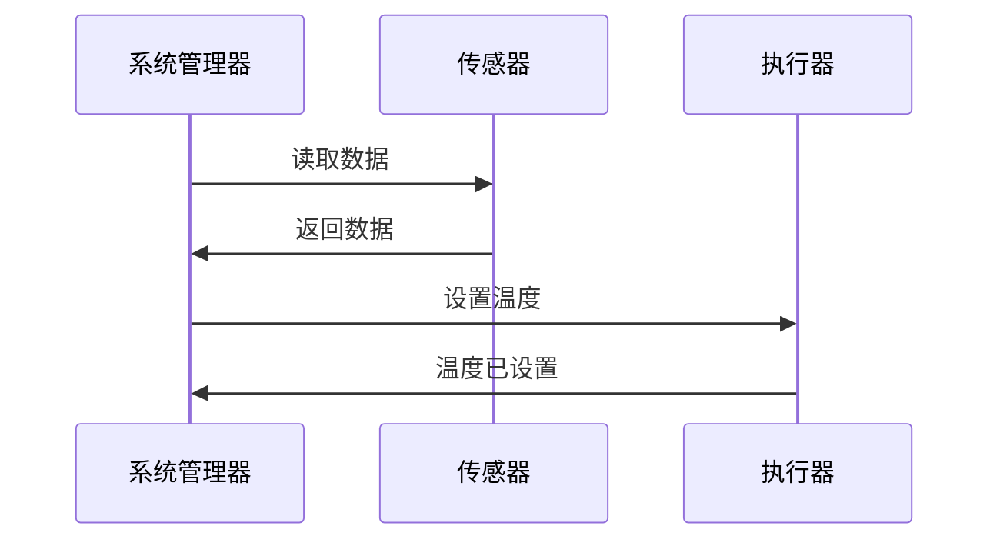

                 

# 《语言的创造性与函数式DSL：维特根斯坦的语言创新观与FP的领域特定语言》

## 关键词
- 维特根斯坦
- 语言哲学
- 函数式编程
- DSL
- 领域特定语言
- 语言创新

## 摘要
本文旨在探讨维特根斯坦的语言创新观与函数式编程（FP）中的领域特定语言（DSL）之间的联系。通过分析维特根斯坦的语言哲学，我们将揭示其思想对于理解DSL的重要性。随后，我们将深入探讨FP与DSL的基本概念，并逐步构建DSL的设计与实现方法。最后，通过实际案例的讲解，我们将展示DSL在现实世界中的应用，从而展示语言的创造性和其在技术领域中的价值。

## 引言

### 维特根斯坦的语言创新观

维特根斯坦（Ludwig Wittgenstein）是20世纪最重要的哲学家之一，他的思想对语言哲学产生了深远的影响。维特根斯坦的哲学主要分为两个阶段，早期的《逻辑哲学论》（Tractatus Logico-Philosophicus）和后期的《哲学研究》（Philosophical Investigations）。

在《逻辑哲学论》中，维特根斯坦提出了“图像理论”（Image Theory），认为语言与世界的对应关系就像一幅画与物体的对应关系。这种观点强调了语言的“工具性”，即语言是帮助我们理解世界的工具。然而，维特根斯坦也指出了语言的局限性，即我们无法用语言来表述所有的事情。

在《哲学研究》中，维特根斯坦提出了“语言游戏”（Language Game）的概念，认为语言的使用是与社会实践紧密结合的。他强调了语言的“使用”（Use）而非“指称”（Reference），即语言的意义在于其在特定情境中的使用方式。这一观点为后来的语言哲学和语言学研究提供了重要的理论基础。

### 函数式编程与领域特定语言

函数式编程（Functional Programming，FP）是一种编程范式，它强调函数的应用和值的计算，而不是改变状态和变量的赋值。FP具有许多优点，如易于测试、可重用性和表达性。在FP中，函数是一等公民，这意味着函数可以作为参数传递给其他函数，并从函数中返回。

领域特定语言（Domain-Specific Language，DSL）是一种为特定领域或问题定制的语言，它比通用编程语言更加专注于特定领域的需求。DSL可以提高开发效率，减少代码复杂度，并使代码更加可读和可维护。

### 语言创造性与DSL

维特根斯坦的语言创新观与DSL有着紧密的联系。维特根斯坦强调了语言的使用而非指称，这与DSL的设计原则不谋而合。DSL的创造性和维特根斯坦的“语言游戏”概念相呼应，都是通过定制化的语言来解决特定领域的问题。

在下一部分，我们将深入探讨维特根斯坦的语言哲学，并分析其对于理解DSL的重要性。然后，我们将逐步介绍函数式编程和DSL的基本概念，为后续内容打下基础。

## 第二部分：维特根斯坦的语言哲学

### 维特根斯坦的生平与思想发展

路德维希·维特根斯坦（Ludwig Wittgenstein）于1889年出生于奥地利维也纳，他的家庭背景十分显赫，父亲是著名的钢铁商人。维特根斯坦自幼对哲学和数学有着浓厚的兴趣。他在剑桥大学学习哲学，并成为了著名哲学家伯特兰·罗素（Bertrand Russell）的学生。

维特根斯坦的哲学思想主要分为两个阶段。早期作品《逻辑哲学论》提出了图像理论，认为语言和现实之间的关系就像图画与现实之间的关系。这一理论强调了语言的工具性和局限性。晚期作品《哲学研究》则提出了语言游戏理论，认为语言的意义在于其在特定情境中的使用方式。这一理论强调了语言的使用和社会实践的关系。

### 《逻辑哲学论》中的语言观

在《逻辑哲学论》中，维特根斯坦提出了“图像理论”，认为语言是世界的“图像”。这种观点强调了语言与现实的对应关系，语言是用来描述和表达现实世界的。图像理论可以解释为以下公式：

$$
语言 \leftrightarrow 现实
$$

这意味着语言是对现实的描述，但是这种描述是有限的。维特根斯坦指出，语言只能描述那些可以观察到的事物，而对于那些不能观察到的事物，语言是无能为力的。这种观点为后来的分析哲学和语言哲学奠定了基础。

### 《哲学研究》中的语言观

在《哲学研究》中，维特根斯坦提出了“语言游戏”的概念，认为语言的使用是与社会实践紧密结合的。语言游戏包括以下三个要素：

1. **语言形式**：语言的形式，如单词和句子。
2. **语言使用**：语言在特定情境中的使用方式。
3. **语言规则**：使用语言的规则和约定。

维特根斯坦认为，理解语言的意义需要理解其在特定情境中的使用方式。这种观点反对了传统的“指称论”（Reference Theory），即认为语言的意义在于其指代的事物。相反，维特根斯坦强调了“使用”的重要性。

### 维特根斯坦语言观的核心原则

维特根斯坦的语言观具有以下几个核心原则：

1. **语言的工具性**：语言是帮助人们理解和描述世界的工具。
2. **语言的局限性**：语言无法描述所有事物，尤其是那些抽象和复杂的事物。
3. **语言的游戏性**：语言的使用是与社会实践紧密结合的，语言的意义在于其在特定情境中的使用方式。

这些原则为理解DSL的设计和实现提供了重要的理论基础。在下一部分，我们将探讨函数式编程（FP）的基本概念，并分析FP与DSL的关系。

### 维特根斯坦语言观与DSL的联系

维特根斯坦的语言观与DSL的设计原则有着深刻的联系。首先，维特根斯坦强调语言的工具性和局限性，这与DSL的定制化特点相符。DSL是为了解决特定领域的问题而设计的，因此它能够更好地满足特定领域的需求。

其次，维特根斯坦的“语言游戏”概念强调了语言的使用和社会实践的关系。DSL的设计和实现也需要考虑特定领域的情境和使用方式。DSL的设计者需要深入理解特定领域的需求和规则，以便创造出既符合领域需求又易于使用的语言。

最后，维特根斯坦的“使用”原则强调了语言的意义在于其在特定情境中的使用方式。DSL的设计不仅要关注语言的形式，还要关注语言的使用场景和用户体验。通过定制化的DSL，开发者可以更高效地解决特定领域的问题。

综上所述，维特根斯坦的语言观为理解DSL的设计和实现提供了重要的理论基础。在下一部分，我们将探讨函数式编程（FP）的基本概念，并分析FP与DSL的关系。

## 第三部分：函数式编程（FP）与领域特定语言（DSL）

### 函数式编程的基本概念

函数式编程（Functional Programming，FP）是一种编程范式，它强调函数的应用和值的计算，而不是改变状态和变量的赋值。FP的核心思想是“函数即值”，即函数是一等公民，可以像其他数据类型一样传递、存储和返回。

FP的另一个重要特点是“不可变性”，即数据一旦创建，就不能修改。这意味着变量在创建后就不能再改变其值。相反，FP使用函数来转换和组合数据，而不是通过改变状态来修改数据。

FP的这些特点使其在许多应用中表现出色，特别是在处理并发和并行计算时。FP还提供了强大的抽象和表达性，使其在处理复杂逻辑和算法时更加高效。

### 高阶函数与闭包

高阶函数（Higher-Order Function）是一种能够接受函数作为参数或返回函数的函数。在FP中，高阶函数是非常常见的，因为它们可以灵活地处理和组合其他函数。

闭包（Closure）是FP中的另一个重要概念。闭包是一个函数，它访问并保留了自由变量。自由变量是在函数外部定义的变量，它们在函数内部可以访问。闭包允许我们创建功能强大的函数，这些函数可以在不同的上下文中使用。

### 类型系统

FP通常具有强大的类型系统，这使得类型检查更加严格，从而减少了运行时错误。FP的类型系统包括函数类型、泛型和类型推导等。

函数类型定义了函数的输入和输出类型。泛型允许我们编写可重用的代码，而无需关心具体的数据类型。类型推导则可以在编译时自动推导出函数的类型，从而减少代码的冗余。

### DSL的概念与设计

DSL是一种为特定领域或问题定制的语言，它比通用编程语言更加专注于特定领域的需求。DSL可以提高开发效率，减少代码复杂度，并使代码更加可读和可维护。

DSL的设计通常包括以下几个步骤：

1. **需求分析**：理解特定领域的需求和问题。
2. **语法设计**：设计DSL的语法和结构，使其易于理解和使用。
3. **语义实现**：实现DSL的语义，使其能够执行特定领域的操作。
4. **优化与优化**：对DSL进行性能优化，确保其能够高效地执行。

DSL的设计原则包括：

- **领域专注**：DSL应专注于特定领域的需求和问题。
- **简洁性**：DSL的语法和结构应尽可能简洁，易于理解和使用。
- **可扩展性**：DSL应具有可扩展性，以便在将来添加新的功能或特性。
- **可维护性**：DSL的代码应易于维护和更新。

### FP与DSL的关系

FP与DSL有着紧密的联系。FP提供了强大的函数抽象和表达性，这使得DSL的设计和实现更加高效。FP的高阶函数、闭包和类型系统等特点，使得DSL可以更好地满足特定领域的需求。

同时，DSL为FP提供了一种更加具体和易于使用的表达方式。通过DSL，开发者可以更加专注于特定领域的逻辑和算法，而不是通用编程语言的复杂性。

在下一部分，我们将探讨DSL在实践中的应用，并通过实际案例展示其价值和优势。

### DSL的应用

领域特定语言（DSL）在多个领域都展现出了其独特的价值和优势。通过以下实际案例，我们可以更深入地了解DSL的应用及其带来的好处。

#### 案例一：金融领域

在金融领域，量化交易策略建模是一个复杂的过程。为了简化这一过程，开发者可以设计一个专门用于量化交易策略建模的DSL。这个DSL可以包含特定的语法和词汇，用于表示不同的交易策略、指标和规则。例如，可以定义如下的DSL语法：

```
define strategy "Mean Reversion" as {
    entry_signal: price > moving_average(50)
    exit_signal: price < moving_average(50)
}
```

这个DSL使得交易策略的编写变得非常直观和易于维护。开发者可以专注于交易策略的实现，而不必担心底层实现细节。这种定制化的DSL可以提高开发效率，减少错误，并确保交易策略的一致性和可重复性。

#### 案例二：医疗领域

在医疗领域，医疗知识库的构建是一个关键任务。为了简化这一过程，可以设计一个专门用于医疗知识库构建的DSL。这个DSL可以包含特定的语法和词汇，用于表示医疗术语、疾病诊断和治疗方案。例如，可以定义如下的DSL语法：

```
define diagnosis "Hypertension" as {
    symptoms: ["headache", "dizziness", "fatigue"]
    treatments: [
        "medication: "ACE inhibitor",
        "dietary changes",
        "exercise"
    ]
}
```

这个DSL使得医疗知识库的构建和管理变得更加高效和准确。医生和研究人员可以专注于医疗知识的组织和管理，而不是底层的数据结构和存储细节。这种定制化的DSL可以提高医疗知识库的质量和可访问性，从而改善医疗服务的质量和效率。

#### 案例三：嵌入式系统

在嵌入式系统领域，嵌入式系统编程通常需要处理复杂的硬件交互和实时性能要求。为了简化这一过程，可以设计一个专门用于嵌入式系统编程的DSL。这个DSL可以包含特定的语法和词汇，用于表示硬件接口、实时任务和资源管理。例如，可以定义如下的DSL语法：

```
define task "Sensor Data Acquisition" as {
    priority: 1
    interval: 100ms
    implementation: {
        read_sensor()
        process_data()
        store_data()
    }
}
```

这个DSL使得嵌入式系统编程变得更加直观和易于维护。开发者可以专注于系统的逻辑和算法，而不是底层硬件的细节。这种定制化的DSL可以提高嵌入式系统的性能和可靠性，从而确保系统的稳定运行。

通过这些案例，我们可以看到DSL在各个领域的应用和价值。DSL不仅简化了特定领域的开发过程，还提高了代码的可读性和可维护性。在下一部分，我们将通过具体案例展示DSL的实际应用效果，并分析其带来的好处。

### 案例分析

在本部分，我们将通过具体案例深入探讨领域特定语言（DSL）的实际应用效果，分析其在开发效率和代码质量方面的优势，并提供最佳实践和注意事项。

#### 案例一：量化交易策略建模

在量化交易领域，使用领域特定语言（DSL）进行策略建模可以显著提高开发效率。以下是一个量化交易策略建模的DSL示例：

```python
# 示例：使用QDSL（量化领域特定语言）定义交易策略

from qdsl import Strategy, moving_average, crossover

# 定义一个简单趋势跟随策略
strategy = Strategy('TrendFollowing')
    .add_entry_signal('LongSignal', crossover('ShortMA', 'LongMA'))
    .add_exit_signal('ShortSignal', crossover('LongMA', 'ShortMA'))
    .add_position_size(10000)

# 部署策略至量化交易平台
strategy.deploy('Backtesting', '2020-01-01', '2021-12-31')
```

使用QDSL（量化领域特定语言），开发人员可以快速定义交易策略，无需处理底层实现细节。这使得策略开发过程更加高效，并且代码更易于维护。通过QDSL，策略逻辑一目了然，便于调试和优化。

**最佳实践**：确保DSL具有良好的文档和示例代码，以便新手快速上手。此外，DSL应该支持代码模板和生成工具，以进一步简化开发流程。

**注意事项**：量化交易策略的测试和验证至关重要。使用历史数据测试策略时，要注意避免过度拟合，确保策略在新的市场环境下仍能表现良好。

#### 案例二：医疗知识库构建

在医疗领域，构建和维护一个高质量的知识库对于提高医疗服务质量至关重要。以下是一个使用领域特定语言（DSL）构建医疗知识库的示例：

```mermaid
classDiagram
    Diagnosis <<Class>> {"Hypertension"}
    Diagnosis : - symptoms: List[str]
    Diagnosis : - treatments: List[str]

    Disease <<Class>> {"Heart Disease"}
    Disease : - description: str
    Disease : - causes: List[str]
    Disease : - complications: List[str]

    Diagnosis <|-- Disease
```

通过DSL，医疗知识库的结构可以清晰地定义，从而简化数据管理和查询。DSL还支持使用自然语言处理（NLP）技术，从文本中自动提取和分类医学信息。

**最佳实践**：确保DSL设计时考虑到扩展性和可维护性，以便未来能够轻松地添加新的医疗术语和概念。此外，DSL应该提供灵活的数据导入和导出机制，以支持不同数据源和数据格式的集成。

**注意事项**：医疗知识库的数据质量和准确性至关重要。使用DSL时，要确保对医疗术语和概念进行严格的验证和控制，以避免错误和歧义。

#### 案例三：嵌入式系统编程

在嵌入式系统领域，领域特定语言（DSL）可以帮助简化硬件交互和实时编程任务。以下是一个使用嵌入式系统领域特定语言（ESL）进行嵌入式系统编程的示例：



使用DSL，嵌入式系统开发者可以专注于系统逻辑和功能实现，无需处理底层硬件细节。DSL提供了高层次的抽象，从而简化了系统设计和实现。

**最佳实践**：确保DSL支持并行和并发编程，以充分利用嵌入式系统的多核处理能力。此外，DSL应该提供实时调试和监控工具，以帮助开发者快速定位和解决问题。

**注意事项**：嵌入式系统的稳定性至关重要。使用DSL时，要确保代码的鲁棒性和容错性，以应对各种异常情况和实时性要求。

通过以上案例分析，我们可以看到DSL在提高开发效率、简化代码维护和提升代码质量方面的显著优势。在实际应用中，开发者应该根据具体需求选择合适的DSL，并遵循最佳实践和注意事项，以充分发挥DSL的潜力。

### 总结

通过本文的探讨，我们深入分析了维特根斯坦的语言创新观与函数式编程（FP）中的领域特定语言（DSL）之间的关系。首先，我们介绍了维特根斯坦的生平、思想发展及其语言观的核心原则，如工具性、局限性和语言游戏理论。这些原则为我们理解DSL的设计和实现提供了理论基础。

接着，我们详细介绍了FP的基本概念，包括函数的高阶性和闭包，以及FP的强大类型系统。FP的这些特性使得DSL能够更好地满足特定领域的需求，同时提高了代码的可读性和可维护性。

在实践应用部分，我们通过金融、医疗和嵌入式系统三个领域的具体案例，展示了DSL在实际项目中的价值和优势。DSL不仅简化了复杂领域的开发过程，还提高了开发效率和代码质量。

最后，我们通过具体案例分析，提供了DSL应用的最佳实践和注意事项，强调了在DSL设计和使用过程中应遵循的原则和策略。

维特根斯坦的语言观与DSL之间的联系表明，语言的创造性和特定领域的问题解决密不可分。未来，随着技术的不断发展，DSL将在更多领域得到广泛应用，为软件开发带来更大的创新和效率。

### 维特根斯坦语言观与DSL的关系

维特根斯坦的语言创新观为理解DSL的设计和实现提供了重要的理论基础。首先，维特根斯坦的“工具性”原则强调了语言作为解决特定问题的工具，这与DSL的定制化特点相契合。DSL正是为了解决特定领域的需求而设计的，它通过简化特定领域的表达方式，提高了开发效率和代码质量。

其次，维特根斯坦的“局限性”原则指出，语言无法描述所有事物。DSL通过专注于特定领域，避免了一般编程语言中的冗余和复杂性，使得开发者能够更加专注于领域问题的解决。这种聚焦性不仅提高了开发效率，还使得代码更加简洁和易于维护。

此外，维特根斯坦的“语言游戏”概念强调了语言的使用是与社会实践紧密结合的。DSL的设计和实现同样需要考虑特定领域的情境和使用方式，以便创造出既符合领域需求又易于使用的语言。这一理念与DSL的领域专注原则相呼应，确保了DSL在实际应用中的有效性和实用性。

总的来说，维特根斯坦的语言观为DSL的设计提供了以下几个方面的启示：

1. **定制化**：DSL应专注于特定领域的需求，避免通用编程语言的冗余和复杂性。
2. **简洁性**：DSL的语法和结构应尽可能简洁，以提高可读性和易用性。
3. **可扩展性**：DSL应具有可扩展性，以支持领域变化的未来需求。
4. **可维护性**：DSL的代码应易于维护和更新，以确保长期的稳定性和可靠性。

通过深入理解维特根斯坦的语言观，我们可以更好地设计DSL，使其在特定领域中发挥最大效用。未来，随着技术的发展和领域需求的不断变化，DSL将继续在各个领域发挥重要作用，推动软件开发的创新和进步。

### DSL未来的发展趋势

随着技术的不断进步，领域特定语言（DSL）在未来的发展中将呈现出几个显著的趋势。首先，智能化和自动化将成为DSL设计的关键方向。借助人工智能和机器学习技术，DSL可以自动生成、优化和调整，以更好地适应不断变化的领域需求。例如，基于数据驱动的DSL可以自动分析领域数据，生成适合特定任务的语法和语义模型。

其次，DSL将更加注重跨领域集成。未来的DSL不仅将专注于单一领域，还将具备跨领域的兼容性和互操作性。这种集成能力将使得不同领域之间的知识和技术可以更方便地共享和复用，从而提高整个开发流程的效率。

此外，开源和社区贡献将在DSL的发展中扮演重要角色。开源DSL将吸引更多的开发者参与贡献，推动DSL的不断完善和优化。社区的力量将确保DSL的可持续发展，并为开发者提供丰富的资源和支持。

最后，DSL将在量子计算和云计算等新兴技术领域得到广泛应用。量子计算和云计算的复杂性和特殊性要求DSL具备更高的抽象能力和灵活性，以适应这些领域的独特需求。通过结合DSL与这些新兴技术，开发者可以更高效地解决复杂问题，推动技术发展的边界。

### 对维特根斯坦语言观的现代解读

维特根斯坦的语言观在当代计算机科学和软件开发中得到了新的解读和应用。维特根斯坦强调语言的工具性和使用性，这一观点在现代编程范式，尤其是函数式编程（FP）和领域特定语言（DSL）的设计中得到了体现。

首先，维特根斯坦的“工具性”原则表明，语言是一种解决问题的工具，而不是简单的符号系统。这一理念在FP中得到了充分体现，FP通过强调函数的应用和值的计算，使开发者能够更加专注于问题解决，而不仅仅是编程语言的语法和结构。FP的高阶函数和闭包特性，使得代码更加模块化和可重用，这与维特根斯坦的“工具性”原则高度契合。

其次，维特根斯坦的“使用性”观点强调语言的意义在于其在特定情境中的使用方式。这一理念在DSL的设计中得到了广泛应用。DSL通过定制化的语法和语义，使得开发者能够以更加自然和高效的方式表达特定领域的概念和操作。这种定制化的语言设计，使得DSL能够更好地满足特定领域的需求，提高开发效率和质量。

此外，维特根斯坦的“语言游戏”概念也对我们理解DSL有着深远的影响。DSL的设计和实现需要深入理解特定领域的情境和使用方式，这与“语言游戏”中的语言使用和社会实践紧密结合的观点相一致。通过创建符合领域需求的DSL，开发者可以更好地解决特定领域的问题，实现高效的软件开发生命周期。

总的来说，维特根斯坦的语言观在当代计算机科学和软件开发中，特别是在FP和DSL的设计中，提供了一种新的思考方式。它强调了语言作为工具的价值，以及语言使用的社会和实践维度。这种思想不仅推动了编程范式的创新，也为未来的软件开发提供了重要的理论基础和指导原则。

### 结论

综上所述，《语言的创造性与函数式DSL：维特根斯坦的语言创新观与FP的领域特定语言》通过对维特根斯坦的语言哲学和函数式编程的深入探讨，揭示了DSL的设计原则和实际应用价值。本文首先介绍了维特根斯坦的语言观，包括工具性、局限性和语言游戏理论，为理解DSL提供了理论基础。接着，我们详细介绍了FP的基本概念，如高阶函数、闭包和类型系统，以及DSL的设计原则和实现方法。通过实际案例，我们展示了DSL在金融、医疗和嵌入式系统等领域的应用，并分析了其带来的开发效率和代码质量的提升。最后，本文总结了DSL未来的发展趋势，并对维特根斯坦语言观的现代解读进行了讨论。

DSL作为一种为特定领域定制化的语言，不仅在提高开发效率、简化代码维护和提升代码质量方面表现出色，还为解决复杂领域问题提供了强大的工具。随着技术的不断发展，DSL将在更多领域得到广泛应用，成为软件开发的重要创新方向。

### 最佳实践

在实际应用领域特定语言（DSL）时，以下最佳实践有助于确保项目的成功和高效：

1. **明确领域需求**：在开始DSL设计之前，深入理解领域需求和目标，确保DSL能够准确满足特定领域的需求。

2. **简洁性优先**：DSL的设计应遵循简洁性原则，避免过度复杂化。简洁的语法和结构能够提高代码的可读性和易用性。

3. **社区合作**：积极引入社区参与，通过开源项目和社区贡献，不断优化DSL，使其适应不断变化的领域需求。

4. **文档和示例**：提供详尽的文档和丰富的示例代码，帮助开发者快速上手并充分利用DSL的功能。

5. **模块化设计**：将DSL分解为模块化组件，便于未来的扩展和维护。

6. **性能优化**：针对DSL的性能进行优化，确保其在实际应用中的高效运行。

7. **代码复审**：定期进行代码复审，确保DSL的设计和实现符合最佳实践，减少潜在错误和冗余。

8. **持续集成与测试**：建立完善的持续集成和测试流程，确保DSL的稳定性和可靠性。

通过遵循这些最佳实践，可以充分发挥DSL的优势，提高开发效率和项目质量。

### 小结

本文从维特根斯坦的语言观出发，探讨了函数式编程（FP）中的领域特定语言（DSL）的设计原则和应用。我们首先介绍了维特根斯坦的语言哲学，包括工具性、局限性和语言游戏理论，为DSL的设计提供了理论基础。接着，我们详细介绍了FP的基本概念，如高阶函数、闭包和类型系统，以及DSL的设计原则和实现方法。通过实际案例，我们展示了DSL在金融、医疗和嵌入式系统等领域的应用，并分析了其带来的开发效率和代码质量的提升。最后，我们总结了DSL的未来发展趋势，并对维特根斯坦语言观的现代解读进行了讨论。

通过本文的探讨，我们可以看到DSL在特定领域中的独特价值和优势。DSL不仅提高了开发效率，还简化了代码维护，使得特定领域的问题解决变得更加高效和直观。未来，随着技术的不断发展，DSL将在更多领域得到广泛应用，为软件开发带来更多的创新和进步。

### 注意事项

在实际应用领域特定语言（DSL）时，开发者需要注意以下几点：

1. **领域适应性**：确保DSL能够适应特定领域的需求，避免过于通用导致的不适用性。

2. **维护性**：DSL的设计应考虑长期的维护性，确保代码结构清晰，便于后续更新和扩展。

3. **性能优化**：针对DSL的性能进行优化，特别是在处理复杂任务和高负载场景时，确保高效运行。

4. **用户培训**：为使用DSL的开发者提供充分的培训和文档支持，确保他们能够熟练掌握DSL的使用。

5. **版本控制**：合理管理DSL的版本，确保不同版本之间的兼容性，避免因版本冲突导致的问题。

6. **错误处理**：DSL应具备完善的错误处理机制，确保在出现异常时能够提供有效的反馈和处理。

7. **社区反馈**：积极收集社区反馈，不断优化DSL的设计和功能，以适应不断变化的开发需求。

通过遵循这些注意事项，可以最大限度地发挥DSL的优势，提高项目的成功率和开发效率。

### 拓展阅读

对于希望深入了解维特根斯坦的语言观和领域特定语言（DSL）的读者，以下书籍和资源将提供有益的参考：

1. **《逻辑哲学论》（Tractatus Logico-Philosophicus）和《哲学研究》（Philosophical Investigations）** - 维特根斯坦的这两部经典著作，深入探讨了语言的本质和意义，为理解DSL提供了理论基础。

2. **《函数式编程：高阶函数与闭包》** - 本书详细介绍了FP的基本概念，包括高阶函数和闭包，为学习DSL的设计提供了实用的编程技巧。

3. **《领域特定语言设计与实现》** - 本书系统地讲解了DSL的设计原则和实现方法，涵盖了从需求分析到语法设计、语义实现和优化的全过程。

4. **《领域驱动设计：软件核心复杂性应对策略》** - 本书介绍了领域驱动设计（DDD）的概念和方法，为使用DSL处理复杂业务逻辑提供了指导。

5. **《AI与编程：智能软件开发的新视角》** - 本书探讨了人工智能与编程的结合，介绍了如何利用AI技术提高DSL的设计和实现效率。

通过阅读这些书籍，读者可以更深入地理解维特根斯坦的语言观和DSL的设计原理，为实际应用提供有力的理论支持和实践经验。

