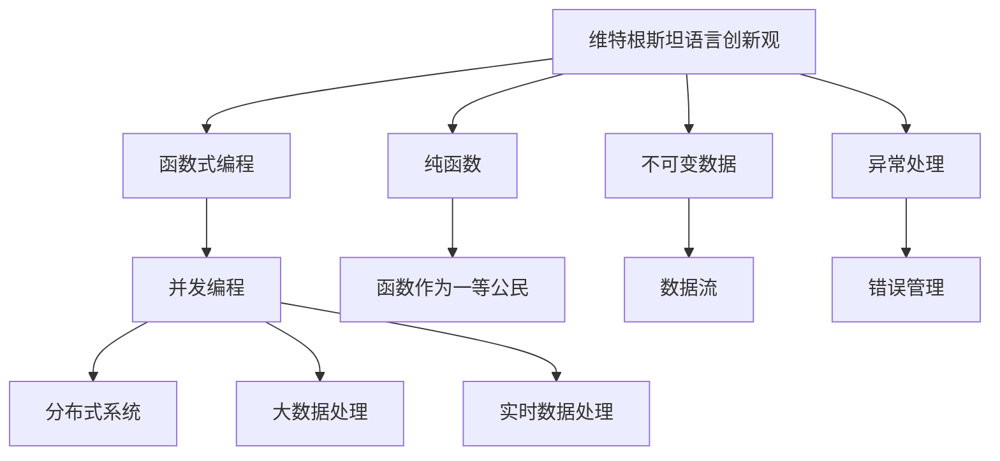

                 

### 第1章 引言

在当今信息化社会，编程和软件开发已经成为技术发展的重要推动力量。随着计算机科学和软件工程的不断进步，编程范式也在不断演进。函数式编程作为一种重要的编程范式，近年来逐渐受到广泛关注。它不仅提高了代码的可读性和可维护性，还在并发编程中展现出了独特的优势。

本篇文章将探讨维特根斯坦的语言创新观与函数式并发编程之间的关系。维特根斯坦作为20世纪最伟大的哲学家之一，他的哲学思想对计算机科学和编程领域产生了深远影响。而函数式编程，作为一种强调函数作为基本构建块的编程范式，在处理并发问题时展示出了与众不同的魅力。

本文的结构安排如下：

1. **书籍背景与目的**：介绍本文研究的背景和目的，明确我们要探讨的核心问题。
2. **维特根斯坦的语言创新观简介**：介绍维特根斯坦的语言创新观，包括其哲学思想和核心观点。
3. **函数式编程与并发编程概述**：简要介绍函数式编程和并发编程的基本概念，为后续章节的深入探讨奠定基础。

### 1.1 书籍背景与目的

随着计算机技术的发展，编程语言的设计和使用方法也在不断演变。传统的命令式编程范式虽然在过去取得了巨大成功，但在面对复杂系统和并发问题时，其局限性逐渐显现。函数式编程作为一种新的编程范式，通过将计算视为函数的嵌套和组合，提供了更简洁、更可靠的编程方式。

函数式编程的核心思想是“函数作为一等公民”，这意味着函数可以像普通数据一样传递、存储和操作。这种范式不仅提高了代码的可读性和可维护性，还使得并发编程变得更加容易。因为在函数式编程中，状态的改变和副作用被严格限制，从而减少了并发编程中的许多潜在问题。

本文旨在探讨维特根斯坦的语言创新观与函数式并发编程之间的关系。维特根斯坦的哲学思想对语言的本质、意义和真理进行了深刻的探讨，这些观点在函数式编程中得到了体现。通过对维特根斯坦的思想和函数式编程的原理进行深入分析，我们希望能够揭示这两者之间的内在联系，为编程实践提供新的启示。

### 1.2 维特根斯坦的语言创新观简介

路德维希·维特根斯坦（Ludwig Wittgenstein，1889-1951）是20世纪最伟大的哲学家之一，他的哲学思想对语言、逻辑、数学等领域产生了深远影响。维特根斯坦的哲学思想主要分为两个阶段，早期以《逻辑哲学论》为代表，晚期则以《哲学研究》为代表。

#### 2.1 维特根斯坦的哲学思想

早期维特根斯坦的哲学思想强调语言与实在的关系。他认为，语言是现实的映射，语言的表达与世界的实在具有一种对应关系。维特根斯坦提出了“图像理论”，认为命题就像世界的图像，通过命题的真假可以判断世界的状态。这一理论强调了语言的确定性，但在处理复杂问题时显得过于简化和机械。

晚期维特根斯坦则转向对语言使用的关注，提出了“语言游戏”概念。他认为，语言不是孤立存在的，而是与人们的生活活动紧密相连。语言的使用是一种社会活动，不同的语言游戏（如数学、日常交流等）有不同的规则和目的。维特根斯坦强调，理解语言的意义在于理解其在实际使用中的功能。

#### 2.2 语言创新观的哲学基础

维特根斯坦的语言创新观建立在其哲学思想的基础上，主要体现为以下几点：

1. **语言的意义与使用**：维特根斯坦认为，语言的意义不在于其符号本身，而在于其使用。语言的意义是通过使用来发现的，而不是预先定义的。这一观点打破了传统的逻辑哲学框架，强调了语言的动态性和灵活性。

2. **真理与证实**：维特根斯坦提出，真理不在于命题的真假，而在于命题与事实的对应关系。他认为，真理是事实的映射，而不是命题本身的属性。这一观点对后来的认知科学、语言学等领域产生了重要影响。

3. **语言的本质**：维特根斯坦认为，语言的本质在于其使用规则，而不是符号本身。语言是一种游戏，每种语言游戏都有其独特的规则和目的。这一观点揭示了语言多样性和复杂性的本质。

#### 2.3 对语言哲学的影响

维特根斯坦的语言创新观对语言哲学产生了深远影响。他的思想挑战了传统的语言观，促使人们重新思考语言的本质和功能。维特根斯坦的观点不仅影响了后来的哲学家，如萨特、福柯等，还深刻影响了计算机科学和编程领域。

在计算机科学中，维特根斯坦的思想启发了函数式编程范式的出现。函数式编程强调函数作为基本构建块，通过组合和嵌套实现复杂计算。这种范式遵循了维特根斯坦的“语言游戏”概念，即每种编程范式都有其独特的规则和目的。通过函数式编程，程序员可以更简洁、更可靠地处理并发问题，提高代码的可维护性和可扩展性。

总之，维特根斯坦的语言创新观为我们理解编程范式和并发编程提供了新的视角。他的思想不仅在哲学领域具有重要地位，也在计算机科学和编程实践中发挥了重要作用。

### 1.3 函数式编程与并发编程概述

函数式编程（Functional Programming，FP）作为一种编程范式，近年来在软件工程中得到了广泛关注。与传统的命令式编程（Imperative Programming）相比，函数式编程通过将计算视为函数的嵌套和组合，提供了更简洁、更可靠的编程方式。在处理并发问题时，函数式编程展示出了独特的优势。

#### 函数式编程的概念

函数式编程的核心思想是“函数作为一等公民”，即函数可以像普通数据一样传递、存储和操作。这意味着，在函数式编程中，程序的状态是由纯函数（Pure Function）定义的，这种函数在相同的输入下总是返回相同的输出，并且不修改外部状态。这一特性使得函数式编程在处理并发问题时，能够减少状态共享和并发错误。

#### 函数式编程的主要特点

1. **纯函数**：函数式编程强调使用纯函数，避免副作用。纯函数使得代码更加可测试、可维护，并且更容易并行化。

2. **不可变数据**：在函数式编程中，数据一旦创建就不可更改。这种不可变性减少了状态共享和并发错误的风险。

3. **递归**：函数式编程广泛使用递归来实现循环操作，这种编程方式比命令式编程中的循环更加简洁和易于理解。

4. **高阶函数**：函数式编程中的高阶函数可以将函数作为参数传递和返回，从而实现函数的组合和嵌套。

5. **懒加载**：函数式编程中的懒加载（Lazy Evaluation）延迟计算，直到需要结果时才进行实际计算，这种技术提高了程序的效率。

#### 并发编程的概念

并发编程（Concurrent Programming）是指同时处理多个任务或事件的能力。在现代计算机系统中，并发编程至关重要，因为多核处理器和分布式系统的普及使得并行计算成为提高性能的重要手段。并发编程的主要挑战包括线程同步、资源竞争、死锁和并发错误等。

#### 并发编程的主要特点

1. **并行与并发**：并行（Parallelism）是指同时执行多个任务，而并发（Concurrency）是指同时处理多个任务，但可能不是同时执行。在多核处理器中，任务可以在不同核心上并行执行，从而提高性能。

2. **共享内存与消息传递**：并发编程的主要模型包括共享内存模型和消息传递模型。共享内存模型通过共享变量实现线程之间的同步，而消息传递模型通过消息队列实现线程之间的通信。

3. **锁与同步**：在共享内存模型中，锁（Lock）是一种常见的同步机制，用于保护共享资源，避免竞态条件。

4. **并发错误**：并发编程中的并发错误包括竞态条件、死锁和死循环等。这些错误通常难以调试和修复，因此需要严格的编程规范和工具支持。

#### 函数式编程与并发编程的关系

函数式编程与并发编程之间有着密切的关系。函数式编程通过减少状态共享和副作用，使得并发编程变得更加容易和可靠。以下是函数式编程在并发编程中的几个优势：

1. **减少竞态条件**：由于函数式编程中的纯函数不修改外部状态，因此不会产生竞态条件。这使得并发编程中的锁和同步机制更加简单。

2. **提高并行性**：函数式编程中的数据不可变性和高阶函数特性使得程序更容易并行化。通过将任务分解为纯函数，可以在多个处理器上同时执行，从而提高性能。

3. **简化错误处理**：在函数式编程中，错误通常通过异常处理机制处理，而不是通过共享状态。这使得并发编程中的错误处理更加简洁和高效。

总之，函数式编程与并发编程的结合为现代软件开发提供了新的思路和工具。通过理解这两者之间的关系，程序员可以编写更简洁、更可靠的并发程序，应对日益复杂的应用场景。在接下来的章节中，我们将深入探讨维特根斯坦的语言创新观与函数式并发编程之间的内在联系，为编程实践提供新的启示。

## 第2章 维特根斯坦的语言创新观

路德维希·维特根斯坦（Ludwig Wittgenstein）的语言创新观是他哲学思想的重要组成部分，对语言哲学、逻辑学和计算机科学产生了深远影响。在本章中，我们将详细探讨维特根斯坦的哲学思想，特别是其关于语言与实在、意义与使用、真理与证实等方面的观点，并分析这些观点对编程和并发编程的影响。

### 2.1 维特根斯坦的哲学思想

#### 2.1.1 语言与实在

维特根斯坦的早期哲学思想集中在《逻辑哲学论》中，他提出了著名的“图像理论”（Picture Theory），认为语言和现实之间存在一种直接的映射关系。根据这一理论，一个命题如果能够准确地描述现实，那么这个命题就是真的。换句话说，命题的真假由其与现实世界的符合程度决定。

图像理论的核心在于将语言视为一种符号系统，这些符号通过某种方式映射到现实世界中的对象和事件。这种映射关系是直观的，即符号的形式和结构在一定程度上反映了它们所指的现实对象。然而，图像理论在处理复杂和抽象的概念时遇到了困难，因为现实世界的复杂性和语言表达能力的局限性之间存在矛盾。

#### 2.1.2 意义与使用

维特根斯坦的晚期哲学思想主要体现在《哲学研究》中，他转向了对语言使用的关注，提出了“语言游戏”概念。语言游戏是指语言在不同情境下的使用，每种语言游戏都有其特定的规则和目的。维特根斯坦认为，理解一个词或句子的意义，关键在于它在特定语言游戏中的使用。

语言游戏概念强调了语言的社会性和实用性。语言不仅仅是一种描述现实的工具，还是一种社会交往的方式。在特定的社会文化背景下，语言的使用是约定俗成的，人们通过语言互动来实现特定的目的。例如，在数学领域，语言游戏可能包括逻辑推理和证明，而在日常交流中，语言游戏可能涉及对话和讨论。

#### 2.1.3 真理与证实

维特根斯坦对真理的理解与他的语言游戏概念密切相关。他认为，真理不是命题本身的属性，而是在特定的语言游戏中通过证实过程得出的。证实过程是通过观察和经验来验证命题与事实的符合程度。换句话说，真理是相对的，它依赖于特定的语言游戏和使用情境。

这种观点挑战了传统的真理观，即认为真理是绝对的、不变的。维特根斯坦认为，真理是相对的，因为不同的语言游戏可能有不同的真理标准。例如，在一个科学实验中，一个假设可能是真的，但在另一个实验中可能是假的。

### 2.2 语言创新观的哲学基础

#### 2.2.1 原则与理论

维特根斯坦的语言创新观建立在其哲学思想的基础之上，主要包括以下几个原则和理论：

1. **语言的意义在于使用**：维特根斯坦强调，语言的意义不在于符号本身，而在于其使用。这意味着，理解一个词或句子的意义，需要考虑它在特定情境中的实际用途。

2. **语言游戏的概念**：语言游戏概念是维特根斯坦理解语言意义的基石。他认为，每种语言游戏都有其独特的规则和目的，这些规则和目的决定了语言的意义。

3. **真理的相对性**：维特根斯坦认为，真理是相对的，它依赖于特定的语言游戏和使用情境。这意味着，一个命题可能在某个语言游戏中是真理，但在另一个语言游戏中可能不是。

#### 2.2.2 对语言哲学的影响

维特根斯坦的语言创新观对语言哲学产生了深远影响。他的思想挑战了传统的语言观，提出了新的视角和理解方式。以下是维特根斯坦对语言哲学的几个主要贡献：

1. **语言的社会性**：维特根斯坦强调，语言是社会交往的工具，语言的使用是社会互动的结果。这一观点强调了语言的社会性，使人们更加关注语言在社会中的作用。

2. **语言的实用性**：维特根斯坦认为，语言的意义在于其实际用途，而不是符号本身。这一观点强调了语言的实用性，使人们更加关注语言的实际应用和价值。

3. **语言的多样性**：维特根斯坦提出了语言游戏的概念，认为不同的语言游戏有不同的规则和目的。这一观点揭示了语言的多样性，使人们更加认识到语言的不同功能和用途。

### 2.3 维特根斯坦语言创新观与编程

维特根斯坦的语言创新观对编程和并发编程产生了深远影响。他的思想不仅为理解编程范式提供了新的视角，还在实践中指导了编程方法和工具的设计。

#### 2.3.1 函数式编程

维特根斯坦的哲学思想在函数式编程中得到了充分体现。函数式编程强调函数作为基本构建块，通过组合和嵌套实现复杂计算。这种编程范式遵循了维特根斯坦的“语言游戏”概念，即每种编程范式都有其独特的规则和目的。

1. **纯函数**：函数式编程中的纯函数与维特根斯坦的哲学思想密切相关。纯函数在相同的输入下总是返回相同的输出，不依赖于外部状态。这种特性使得代码更加可测试、可维护，并且适合并发编程。

2. **不可变数据**：在函数式编程中，数据一旦创建就不可更改，这与维特根斯坦的不可变数据观相符。不可变数据减少了状态共享和并发错误的风险，使得并发编程更加可靠。

3. **递归**：函数式编程广泛使用递归来实现循环操作，这与维特根斯坦的哲学思想有关。递归编程比命令式编程中的循环更加简洁和易于理解，并且更容易并行化。

4. **高阶函数**：函数式编程中的高阶函数可以将函数作为参数传递和返回，这与维特根斯坦的“语言游戏”概念相符。高阶函数使得程序员可以更灵活地组合和嵌套函数，实现更复杂的计算。

#### 2.3.2 并发编程

函数式编程在处理并发问题时展示出了独特的优势。维特根斯坦的语言创新观为理解并发编程提供了新的视角，指导了编程方法和工具的设计。

1. **减少竞态条件**：由于函数式编程中的纯函数不修改外部状态，因此不会产生竞态条件。这使得并发编程中的锁和同步机制更加简单，从而提高了程序的可靠性。

2. **提高并行性**：函数式编程中的数据不可变性和高阶函数特性使得程序更容易并行化。通过将任务分解为纯函数，可以在多个处理器上同时执行，从而提高性能。

3. **简化错误处理**：在函数式编程中，错误通常通过异常处理机制处理，而不是通过共享状态。这使得并发编程中的错误处理更加简洁和高效。

总之，维特根斯坦的语言创新观为编程和并发编程提供了深刻的哲学启示。他的思想不仅丰富了我们对语言和编程的理解，还在实践中指导了编程方法和工具的设计。在接下来的章节中，我们将进一步探讨函数式编程的基础概念和实践方法，为理解并发编程提供更深入的视角。

### 2.4 维特根斯坦语言创新观对编程的具体影响

维特根斯坦的语言创新观不仅为哲学领域带来了新的思考方式，对编程和软件开发也产生了深远的影响。尤其是在函数式编程领域，维特根斯坦的思想得到了广泛的运用。以下我们从几个具体方面来分析维特根斯坦语言创新观对编程的具体影响。

#### 2.4.1 纯函数与不可变数据

维特根斯坦强调函数作为基本构建块，而纯函数的概念在函数式编程中得到了充分体现。纯函数是指那些不依赖外部状态、在相同输入下总是返回相同输出的函数。这种特性使得纯函数具有高度的测试性和可维护性，因为它们不会因外部状态的变化而产生不可预测的行为。

在函数式编程中，不可变数据也是核心概念之一。维特根斯坦的不可变性思想强调了数据一旦创建就不能更改。这意味着数据在整个生命周期中始终保持不变，从而减少了状态共享和并发错误的风险。不可变数据使得并发编程更加简单和安全，因为多个线程可以独立操作不同的数据副本，而不需要担心数据竞争和同步问题。

以下是一个简单的Python示例，展示了纯函数和不可变数据的使用：

```python
# 纯函数示例
def add(a, b):
    return a + b

# 不可变数据示例
x = 10
y = 20

# 操作不可变数据
x = x + y  # 新的变量x与原变量x无关
```

在这个示例中，`add` 函数是一个纯函数，它不依赖于外部状态，并且每次调用时都返回相同的输出。变量 `x` 和 `y` 是不可变的，任何对它们的操作都会生成新的变量副本。

#### 2.4.2 递归与高阶函数

维特根斯坦的哲学思想中也强调递归和组合，这在函数式编程中得到了广泛应用。递归是一种通过调用自身实现循环操作的编程方式，它比命令式编程中的循环更加简洁和直观。递归编程可以清晰地表达问题空间的结构，使得代码更加易于理解和维护。

高阶函数是函数式编程中的另一个重要概念，它指的是可以接受函数作为参数或者返回函数的函数。高阶函数通过函数组合和嵌套，可以灵活地实现复杂的功能。这种编程范式遵循了维特根斯坦的“语言游戏”概念，即每种编程范式都有其独特的规则和目的。

以下是一个使用递归和高阶函数的JavaScript示例：

```javascript
// 递归示例
function factorial(n) {
    return n <= 1 ? 1 : n * factorial(n - 1);
}

// 高阶函数示例
function compose(f, g) {
    return (x) => f(g(x));
}

// 组合递归和高阶函数
const squareFactorial = compose(x => x * x, factorial);

console.log(squareFactorial(5)); // 输出 3125
```

在这个示例中，`factorial` 函数使用递归实现阶乘计算。`compose` 函数是一个高阶函数，它接受两个函数作为参数，并返回一个新的函数，该函数将两个函数组合在一起。`squareFactorial` 函数通过组合 `factorial` 和 `x => x * x`，实现计算阶乘后再平方的功能。

#### 2.4.3 异常处理与错误管理

维特根斯坦的语言创新观强调了语言的意义在于使用，这在编程中体现为对错误处理和异常管理的关注。在函数式编程中，错误通常通过异常处理机制处理，而不是通过共享状态。这种编程范式使得错误处理更加简洁和高效。

异常处理允许程序在发生错误时捕获并处理异常情况，而不需要修改外部状态。这种机制减少了状态共享和并发错误的风险，因为每个函数都可以独立处理其内部的错误，而不影响其他函数的执行。

以下是一个使用异常处理的Python示例：

```python
def divide(a, b):
    if b == 0:
        raise ValueError("除数不能为0")
    return a / b

try:
    result = divide(10, 2)
    print(result)
except ValueError as e:
    print(f"发生错误：{e}")
```

在这个示例中，`divide` 函数在除数不能为0时抛出异常。`try` 和 `except` 语句用于捕获并处理异常，从而实现更简洁和高效的错误处理。

#### 2.4.4 并发编程中的优势

维特根斯坦的语言创新观在并发编程中也展示出了独特的优势。由于函数式编程中的纯函数和不可变数据特性，并发编程变得更加简单和安全。纯函数不修改外部状态，从而减少了竞态条件的发生；不可变数据减少了状态共享和同步需求，使得并发编程更加可靠。

以下是一个使用并发编程的Python示例，展示了如何使用异步编程和纯函数实现并发任务：

```python
import asyncio

async def calculate_sum(a, b):
    await asyncio.sleep(1)  # 延迟1秒模拟计算时间
    return a + b

async def main():
    result = await calculate_sum(10, 20)
    print(result)

asyncio.run(main())
```

在这个示例中，`calculate_sum` 函数是一个纯函数，它不依赖于外部状态，并在异步编程环境中独立执行。`main` 函数使用异步等待（`await`）来并发执行多个计算任务，从而提高了程序的效率。

综上所述，维特根斯坦的语言创新观对编程和并发编程产生了深远的影响。他的思想为理解编程范式和设计编程工具提供了新的视角，使得程序员能够编写更简洁、更可靠、更高效的代码。在接下来的章节中，我们将进一步探讨函数式编程的基础概念和实际应用，深入理解其在并发编程中的优势。

## 第3章 函数式编程基础

函数式编程作为一种编程范式，具有独特的优势，特别是在处理复杂系统和并发问题方面。本章将详细介绍函数式编程的基本概念，包括函数作为一等公民、高阶函数、递归以及懒惰计算等。这些基础概念不仅为理解函数式编程提供了理论支持，还为实际编程提供了实践指导。

### 3.1 函数式编程概念

#### 3.1.1 函数作为一等公民

函数作为一等公民（First-Class Functions）是函数式编程的核心概念之一。这意味着函数在函数式编程中可以像其他数据类型一样进行传递、存储和操作。具体来说，函数可以作为函数的参数、返回值以及函数内部的局部变量。

函数作为一等公民的优点包括：

1. **代码复用**：通过将函数作为参数传递，可以灵活地复用函数，实现代码的模块化和可重用性。
2. **函数组合**：通过函数组合（Function Composition），可以将多个函数组合成一个新的函数，实现复杂的计算过程。
3. **函数柯里化**：函数柯里化（Function Currying）允许将一个多参数函数转换为一系列单参数函数，从而提高代码的可读性和可维护性。

以下是一个Python示例，展示了函数作为一等公民的使用：

```python
# 定义一个函数作为一等公民
def add(a, b):
    return a + b

# 将函数作为参数传递
def apply_function(func, a, b):
    return func(a, b)

# 调用函数组合
def multiply(a, b):
    return a * b

result = apply_function(multiply, 2, 3)
print(result)  # 输出 6
```

在这个示例中，`add` 函数作为一等公民被传递给 `apply_function` 函数。同时，`multiply` 函数通过函数组合的方式与 `add` 函数结合，实现更复杂的计算。

#### 3.1.2 高阶函数

高阶函数（Higher-Order Functions）是能够接受其他函数作为参数或者返回函数的函数。高阶函数在函数式编程中扮演着重要角色，因为它们可以灵活地组合和操作其他函数，实现复杂的计算过程。

高阶函数的优点包括：

1. **代码简洁**：通过高阶函数，可以减少代码的冗长和复杂性，提高代码的可读性和可维护性。
2. **函数组合**：高阶函数可以方便地进行函数组合，实现更复杂的计算过程。
3. **抽象层次**：高阶函数提供了更高的抽象层次，使得程序员可以专注于问题解决，而不需要关注具体的实现细节。

以下是一个JavaScript示例，展示了高阶函数的使用：

```javascript
// 定义一个高阶函数
function apply_operator(operator, a, b) {
    return operator(a, b);
}

// 定义一些运算函数
function add(a, b) {
    return a + b;
}

function subtract(a, b) {
    return a - b;
}

// 调用高阶函数
const result = apply_operator(add, 2, 3);
console.log(result);  // 输出 5

result = apply_operator(subtract, 5, 3);
console.log(result);  // 输出 2
```

在这个示例中，`apply_operator` 函数是一个高阶函数，它接受一个运算函数（`operator`）以及两个操作数（`a` 和 `b`），并返回运算结果。通过这种方式，可以方便地实现不同运算函数的组合和复用。

#### 3.1.3 函数组合与管道

函数组合（Function Composition）是一种将多个函数组合成一个新的函数的编程技术。函数组合可以通过高阶函数实现，它可以将两个或多个函数嵌套在一起，从而实现更复杂的计算过程。

函数组合的优点包括：

1. **代码可读性**：通过函数组合，可以清晰地表达计算过程，提高代码的可读性和可维护性。
2. **代码复用**：函数组合可以方便地复用函数，实现代码的模块化和可重用性。

以下是一个Python示例，展示了函数组合的使用：

```python
# 定义两个函数进行组合
def add(a, b):
    return a + b

def square(x):
    return x * x

# 组合函数
def square_add(a, b):
    return square(add(a, b))

result = square_add(2, 3)
print(result)  # 输出 25
```

在这个示例中，`square_add` 函数通过组合 `add` 和 `square` 函数，实现计算 `(a + b) 的平方` 的功能。

管道（Pipeline）是函数组合的一种应用，它通过一系列函数的组合，实现数据的连续处理。管道的优点包括：

1. **数据处理**：通过管道，可以方便地对数据进行连续处理，实现高效的数据处理流程。
2. **代码复用**：管道可以方便地复用函数，提高代码的可重用性。

以下是一个Node.js示例，展示了管道的使用：

```javascript
const fs = require('fs');
const { pipeline } = require('stream');

// 定义处理函数
const read = fs.createReadStream('input.txt');
const write = fs.createWriteStream('output.txt');

// 创建管道
const pipeline = pipeline(read, transform(), write);

// 错误处理
pipeline.on('error', (err) => {
    console.error('处理过程中发生错误：', err);
});

// 确认管道完成
pipeline.on('finish', () => {
    console.log('管道处理完成');
});
```

在这个示例中，`pipeline` 函数通过组合 `read`、`transform` 和 `write` 函数，实现从文件读取、转换和写入的管道处理流程。

#### 3.1.4 懒惰计算与惰性函数

懒惰计算（Lazy Evaluation）是一种延迟计算的技术，它只在需要结果时才进行实际计算。这种技术可以提高程序的效率和性能，特别是在处理复杂计算和大数据处理时。

惰性函数（Lazy Function）是实现懒惰计算的一种方式，它将计算过程延迟到函数调用时执行。惰性函数的优点包括：

1. **性能优化**：通过延迟计算，可以减少不必要的计算，从而提高程序的效率。
2. **内存管理**：懒惰计算可以减少内存的使用，因为计算结果只在需要时才被计算和存储。

以下是一个Python示例，展示了懒惰计算的使用：

```python
def lazy_calculation():
    print("执行计算...")
    return 42

result = lazy_calculation()  # 执行计算
print(result)  # 输出 42
```

在这个示例中，`lazy_calculation` 函数在调用时才执行计算，而不是在定义时。这种懒惰计算的方式可以避免不必要的计算，提高程序的效率。

总之，函数式编程的基础概念包括函数作为一等公民、高阶函数、函数组合、管道和懒惰计算等。这些概念不仅为理解函数式编程提供了理论支持，还在实际编程中发挥着重要作用。在下一章中，我们将进一步探讨并发编程的基本原理和实现技术。

### 3.2 常用函数式编程工具

在函数式编程中，有许多实用的工具和技术可以简化代码、提高可读性和可维护性。以下是一些常用的函数式编程工具，包括函数组合、递归以及懒惰计算等。

#### 3.2.1 函数组合

函数组合是一种将多个函数组合成一个新的函数的技术，它可以通过高阶函数实现。函数组合允许程序员将复杂的功能分解为简单的函数，然后通过组合这些函数实现最终的功能。以下是一个使用函数组合的示例：

```python
# 定义函数
def add(a, b):
    return a + b

def square(x):
    return x * x

# 组合函数
def square_add(a, b):
    return square(add(a, b))

# 使用函数组合
result = square_add(2, 3)
print(result)  # 输出 25
```

在这个示例中，`square_add` 函数通过组合 `add` 和 `square` 函数，实现了计算 `(a + b) 的平方` 的功能。

#### 3.2.2 函数式编程中的递归

递归是一种通过调用自身实现循环操作的编程技术。在函数式编程中，递归被广泛使用，因为它可以简洁地表达递归结构，并避免使用命令式编程中的循环。以下是一个使用递归的示例：

```python
def factorial(n):
    return 1 if n == 0 else n * factorial(n - 1)

# 使用递归
result = factorial(5)
print(result)  # 输出 120
```

在这个示例中，`factorial` 函数通过递归调用自身，实现了阶乘的计算。

递归的优点包括：

1. **代码简洁**：递归可以简洁地表达递归结构，使得代码更加直观和易于理解。
2. **可读性**：递归避免了循环控制变量和条件判断，提高了代码的可读性。

递归的缺点包括：

1. **性能问题**：递归可能导致大量的函数调用，从而增加栈内存的使用，降低性能。
2. **栈溢出**：在处理大数据时，递归可能导致栈溢出。

为了避免这些问题，可以使用尾递归优化（Tail Recursion Optimization），将递归转化为迭代，从而减少栈内存的使用。

#### 3.2.3 懒惰计算与惰性函数

懒惰计算（Lazy Evaluation）是一种延迟计算的技术，它只在需要结果时才进行实际计算。这种技术可以提高程序的效率和性能，特别是在处理复杂计算和大数据处理时。以下是一个使用懒惰计算的示例：

```python
def lazy_calculation():
    print("执行计算...")
    return 42

result = lazy_calculation()  # 执行计算
print(result)  # 输出 42
```

在这个示例中，`lazy_calculation` 函数在调用时才执行计算，而不是在定义时。这种懒惰计算的方式可以避免不必要的计算，提高程序的效率。

惰性函数（Lazy Function）是实现懒惰计算的一种方式，它将计算过程延迟到函数调用时执行。以下是一个使用惰性函数的示例：

```python
def lazy_sum(numbers):
    def sum():
        total = 0
        for number in numbers:
            total += number
        return total
    return sum

result = lazy_sum([1, 2, 3, 4, 5])()  # 执行计算
print(result)  # 输出 15
```

在这个示例中，`lazy_sum` 函数返回一个惰性函数 `sum`，它在调用时才执行实际的计算。这种懒惰计算的方式可以减少不必要的计算，提高程序的效率。

#### 3.2.4 其他函数式编程工具

除了函数组合、递归和懒惰计算外，函数式编程还有许多其他实用的工具，如高阶函数、柯里化（Currying）和部分应用（Partial Application）等。以下是一些示例：

1. **高阶函数**：高阶函数是能够接受其他函数作为参数或返回函数的函数。以下是一个使用高阶函数的示例：

    ```python
    def apply_operator(operator, a, b):
        return operator(a, b)

    operators = {
        'add': lambda a, b: a + b,
        'subtract': lambda a, b: a - b,
        'multiply': lambda a, b: a * b,
        'divide': lambda a, b: a / b
    }

    result = apply_operator(operators['add'], 2, 3)
    print(result)  # 输出 5
    ```

2. **柯里化**：柯里化是将一个多参数函数转换为一系列单参数函数的过程。以下是一个使用柯里化的示例：

    ```python
    def add(a, b):
        return a + b

    curried_add = curry(add)(5)
    result = curried_add(3)
    print(result)  # 输出 8
    ```

3. **部分应用**：部分应用是将一个函数的部分参数固定，返回一个新的函数。以下是一个使用部分应用的示例：

    ```python
    def add(a, b, c):
        return a + b + c

    part_add = partial(add, 5, 10)
    result = part_add(3)
    print(result)  # 输出 18
    ```

总之，这些函数式编程工具提供了丰富的编程技术，可以帮助程序员编写更简洁、更可读、更高效的代码。在函数式编程的实际应用中，熟练掌握这些工具将大大提高编程效率和代码质量。

### 3.3 函数式编程与命令式编程的比较

函数式编程与命令式编程是两种不同的编程范式，它们在处理数据和实现计算方面有不同的方法和原则。以下从几个方面比较这两种编程范式：

#### 1. 数据处理方式

**函数式编程**：函数式编程通过不可变数据来处理数据。数据一旦创建，就不能更改，所有的计算都是通过创建新的数据副本来实现的。这种处理方式可以避免数据竞态条件和状态共享问题。

**命令式编程**：命令式编程通过可变数据来处理数据。数据可以随时修改，程序通过改变变量的值来实现计算。这种处理方式可能会导致状态共享和竞态条件问题，特别是在并发编程中。

#### 2. 控制流程

**函数式编程**：函数式编程通过纯函数（Pure Function）和递归来控制流程。纯函数是指没有副作用、在相同输入下总是返回相同输出的函数。递归是一种通过调用自身实现循环操作的编程方式。

**命令式编程**：命令式编程通过循环（如 `for` 循环和 `while` 循环）和条件语句（如 `if-else`）来控制流程。循环和条件语句通过改变变量的值来控制程序的执行流程。

#### 3. 错误处理

**函数式编程**：函数式编程通常通过异常处理（Exception Handling）来处理错误。异常处理允许程序在发生错误时捕获并处理异常情况，从而避免程序的崩溃。

**命令式编程**：命令式编程通常通过错误代码和返回值来处理错误。程序通过检查返回值来了解操作是否成功，并在必要时通过错误代码来处理错误。

#### 4. 并发编程

**函数式编程**：函数式编程通过不可变数据和纯函数在处理并发编程时展示出了优势。不可变数据减少了状态共享和并发错误的风险，而纯函数没有副作用，使得并发编程更加简单和可靠。

**命令式编程**：命令式编程在处理并发编程时面临着更多的挑战。由于可变数据和副作用的存在，并发编程可能会导致竞态条件、死锁和并发错误等问题。

#### 5. 代码可读性和可维护性

**函数式编程**：函数式编程通过简洁的函数组合和递归，提高了代码的可读性和可维护性。函数式编程强调代码的模块化和可重用性，使得代码更加易于理解和维护。

**命令式编程**：命令式编程可能会因为复杂的控制流程和状态管理，使得代码的可读性和可维护性降低。命令式编程中的代码往往更难以理解和维护，特别是在处理复杂系统和并发问题时。

综上所述，函数式编程与命令式编程在数据处理方式、控制流程、错误处理、并发编程和代码可读性等方面有明显的差异。函数式编程通过不可变数据和纯函数，在处理并发编程和代码可读性方面展示出了独特的优势。然而，每种编程范式都有其适用场景，程序员需要根据具体需求选择合适的编程范式。

## 第4章 并发编程原理

并发编程是现代计算机系统中的一个重要概念，它涉及到多个任务或事件同时执行的问题。在现代多核处理器和分布式系统中，并发编程已成为提高性能和响应能力的关键技术。本章将详细探讨并发编程的基本原理，包括概念、挑战以及常见的并发编程模型。

### 4.1 并发编程概念

#### 4.1.1 并发与并行

**并发（Concurrency）**：并发是指多个任务或事件在同一时间段内执行，但可能不是同时执行的。在现代计算机系统中，并发通常通过时间片轮转（Time Slicing）或线程（Thread）实现。操作系统通过分配处理器时间片，使得多个线程似乎同时执行。

**并行（Parallelism）**：并行是指多个任务或事件在同一时刻执行。并行可以通过多核处理器或分布式系统实现，从而在同一处理器核心或不同处理器核心上同时执行多个任务。

并发和并行之间存在密切的联系，但并不相同。并发是一种时间上的重叠，而并行则涉及到空间上的重叠。在实际应用中，并行是提高并发性能的有效手段。

#### 4.1.2 并发编程的挑战

并发编程虽然可以提高系统性能，但也带来了许多挑战。以下是一些主要的并发编程挑战：

1. **竞态条件（Race Condition）**：竞态条件是指多个线程同时访问共享资源，导致结果不确定的情况。竞态条件通常是由于数据竞争（Data RACE）和同步问题（Synchronization）引起的。

2. **死锁（Deadlock）**：死锁是指多个线程因相互等待对方持有的资源而无法继续执行的状态。死锁通常是由于资源分配不当和线程间的不合理等待顺序引起的。

3. **饥饿（Starvation）**：饥饿是指某个线程因无法获得所需的资源而长时间等待，从而无法执行。饥饿通常是由于线程优先级不均衡或资源分配策略不合理引起的。

4. **活锁（Livelock）**：活锁是指线程在不断地改变状态，但没有任何实质性的进展，类似于“活死人”状态。活锁通常是由于线程间的冲突和不合理的协调机制引起的。

5. **性能问题**：并发编程可能引入性能问题，如上下文切换开销、同步锁开销和资源竞争等。这些问题可能会导致系统性能下降。

#### 4.1.3 并发编程的范式

并发编程的范式有多种，不同的范式适用于不同的应用场景。以下是一些常见的并发编程范式：

1. **共享内存（Shared Memory）**：共享内存模型允许多个线程共享同一块内存区域。线程通过读写共享内存中的变量来实现数据交换和同步。常见的同步机制包括互斥锁（Mutex）、信号量（Semaphore）和读写锁（Read-Write Lock）等。

2. **消息传递（Message Passing）**：消息传递模型通过消息队列实现线程间的通信。线程通过发送和接收消息来同步和协调。常见的消息传递机制包括进程间通信（IPC）、网络通信和异步消息队列等。

3. **无共享内存（Shared Nothing）**：无共享内存模型是指各个线程独立运行，不共享任何内存资源。线程通过局部数据交换和协同计算来实现任务协调。这种模型适用于分布式系统和高性能计算。

4. **数据流并发（Data-Flow Concurrent）**：数据流并发模型基于数据依赖关系来调度任务。任务根据数据依赖关系自动调度，从而实现并发执行。常见的实现技术包括数据流图（Data Flow Graph）和事件驱动编程。

### 4.2 并发编程模型

并发编程的模型决定了线程的调度、同步和通信方式。以下是一些常见的并发编程模型：

#### 4.2.1 共享内存模型

共享内存模型是指多个线程共享同一块内存区域，通过同步机制（如锁、信号量等）来保护共享资源。共享内存模型的主要优点是线程间数据访问直接、通信效率高。但共享内存模型也面临着竞态条件和死锁等挑战。

1. **互斥锁（Mutex）**：互斥锁是一种常见的同步机制，用于保护共享资源。互斥锁确保在同一时刻只有一个线程能够访问共享资源，从而避免竞态条件。

2. **读写锁（Read-Write Lock）**：读写锁允许多个读线程同时访问共享资源，但写线程必须等待。这种锁机制可以优化读操作的性能。

3. **信号量（Semaphore）**：信号量是一种计数同步机制，用于控制对共享资源的访问。信号量可以通过 `P` 操作（等待）和 `V` 操作（信号）来控制线程的执行顺序。

#### 4.2.2 非共享内存模型

非共享内存模型是指各个线程独立运行，不共享任何内存资源。线程通过局部数据交换和协同计算来实现任务协调。这种模型适用于分布式系统和并行计算。

1. **消息传递（Message Passing）**：消息传递模型通过发送和接收消息来实现线程间的通信。常见的实现技术包括进程间通信（IPC）和网络通信。

2. **数据流并发（Data-Flow Concurrent）**：数据流并发模型基于数据依赖关系来调度任务。任务根据数据依赖关系自动调度，从而实现并发执行。

#### 4.2.3 消息传递模型

消息传递模型通过消息队列实现线程间的通信。线程通过发送和接收消息来同步和协调。这种模型适用于分布式系统和并行计算。

1. **异步消息队列**：异步消息队列是一种实现消息传递的机制，允许线程独立执行，并在需要时处理消息。常见的消息队列系统包括 RabbitMQ、Apache Kafka 等。

2. **分布式队列**：分布式队列是一种在分布式系统中实现消息传递的机制，通过多个节点协同工作，提供高可用性和可扩展性。

#### 4.2.4 无共享内存模型

无共享内存模型是指各个线程独立运行，不共享任何内存资源。线程通过局部数据交换和协同计算来实现任务协调。这种模型适用于分布式系统和高性能计算。

1. **数据并行计算**：数据并行计算是指将大量数据分成小块，由多个线程并行处理。每个线程处理自己的数据块，最后将结果合并。

2. **任务并行计算**：任务并行计算是指将任务分解成多个子任务，由多个线程并行执行。每个线程独立执行自己的任务，最后将结果合并。

### 4.3 并发编程实践

在实际编程中，选择合适的并发编程模型和工具至关重要。以下是一些常见的并发编程实践：

1. **线程池（ThreadPool）**：线程池是一种管理线程的机制，用于重用线程，减少线程创建和销毁的开销。线程池适用于处理大量短任务。

2. **异步编程**：异步编程是一种通过事件驱动的方式处理并发任务的编程技术。异步编程可以提高程序的响应能力和并发性能。

3. **锁和同步机制**：合理使用锁和同步机制，可以避免竞态条件和死锁等问题。但也要注意锁的使用效率，避免过度同步。

4. **并行算法**：选择适合并行计算的算法，可以充分利用多核处理器的性能。常见的并行算法包括矩阵乘法、快速傅里叶变换等。

5. **分布式计算**：分布式计算通过将任务分配到多个节点上执行，可以提高计算性能和容错能力。常见的分布式计算框架包括 Hadoop、Spark 等。

总之，并发编程是现代软件开发中的重要技术，它提高了系统的性能和响应能力。通过理解并发编程的基本原理和模型，程序员可以设计出更高效、更可靠的并发程序。在下一章中，我们将进一步探讨函数式并发编程的优势和实践。

### 4.4 函数式并发编程的优势

函数式编程在处理并发问题时展示出了独特的优势。与命令式编程相比，函数式编程通过纯函数、不可变数据等概念，使得并发编程更加简单、可靠和高效。以下从几个方面详细探讨函数式并发编程的优势。

#### 4.4.1 纯函数与无状态

纯函数是指那些不依赖于外部状态、在相同输入下总是返回相同输出的函数。纯函数的一个关键特性是它们没有副作用，即不会修改外部状态。这一特性使得纯函数在并发编程中具有以下优势：

1. **减少竞态条件**：由于纯函数不修改外部状态，因此不会产生竞态条件。竞态条件是并发编程中常见的问题，当多个线程同时访问和修改共享资源时，可能会导致数据不一致和程序错误。通过使用纯函数，可以避免这些问题。

2. **简化同步机制**：在命令式编程中，线程同步是一个复杂且容易出现错误的过程。为了确保共享资源的一致性，需要使用各种同步机制，如锁、信号量等。而函数式编程中的纯函数无需同步机制，因为它们不依赖于外部状态，这使得编程更加简单和直观。

3. **便于并行化**：纯函数的不可变性和无状态特性使得它们更容易并行化。在并行计算中，任务通常被分配到多个处理器上同时执行。纯函数的独立性和确定性使得任务分配和执行更加简单，从而提高程序的并行性能。

#### 4.4.2 不可变数据与数据流动

不可变数据是指一旦创建就不能更改的数据。在函数式编程中，数据不可变性是核心概念之一。不可变数据具有以下优势：

1. **简化状态管理**：在命令式编程中，状态管理是一个复杂的过程，因为数据可以随时被修改。而函数式编程中的不可变数据简化了状态管理，因为数据一旦创建就不能更改，这使得程序的逻辑更加清晰和易于维护。

2. **提高并发安全性**：不可变数据减少了状态共享和并发错误的风险。在并发编程中，多个线程同时访问和修改共享数据可能会导致数据竞争和死锁等问题。而不可变数据通过避免共享和修改，从而提高了程序的可靠性。

3. **数据流动**：不可变数据使得数据在程序中像水流一样流动。这种数据流动模型简化了程序的执行逻辑，因为每个函数只需要处理输入数据，并生成输出数据。这种清晰的输入输出关系使得程序更易于理解和调试。

#### 4.4.3 函数组合与高阶函数

函数组合和高阶函数是函数式编程的重要特性，这些特性在处理并发问题时也展示出了优势：

1. **代码复用**：函数组合允许程序员将复杂的功能分解为简单的函数，并通过组合这些简单函数实现最终的功能。这种编程方式提高了代码的可复用性和可维护性。在并发编程中，可以将并发任务分解为简单的操作，然后通过函数组合实现并行执行。

2. **模块化**：函数组合和高阶函数使得程序更加模块化。每个函数独立实现特定功能，这使得任务调度和并行执行更加灵活。模块化编程有助于提高代码的可测试性和可维护性。

3. **可组合性**：函数式编程中的高阶函数和函数组合提供了更高的抽象层次，使得程序员可以专注于问题解决，而不需要关注具体的实现细节。这种抽象性使得程序具有更强的可组合性，从而提高程序的灵活性和适应性。

#### 4.4.4 懒惰计算与异步编程

懒惰计算是一种延迟计算的技术，它只在需要结果时才进行实际计算。在函数式编程中，懒惰计算可以通过惰性函数（Lazy Function）实现。懒惰计算和异步编程相结合，为并发编程提供了强大的支持：

1. **提高性能**：懒惰计算可以减少不必要的计算，从而提高程序的性能。例如，在处理大数据时，可以通过懒惰计算逐步计算结果，避免一次性加载和计算大量数据。

2. **异步编程**：异步编程是一种通过事件驱动的方式处理并发任务的编程技术。在函数式编程中，异步编程可以与懒惰计算结合使用，实现高效的并发处理。例如，在处理网络请求时，可以异步发送请求并懒惰计算响应，从而提高程序的响应能力和并发性能。

总之，函数式并发编程通过纯函数、不可变数据、函数组合、高阶函数和懒惰计算等特性，提供了处理并发问题的强大工具。这些特性不仅提高了代码的可读性、可维护性和并行性能，还为并发编程提供了更加简单和可靠的方法。在下一章中，我们将探讨函数式并发编程的具体实践方法。

### 4.5 函数式并发编程实践

函数式并发编程在理论上具有许多优势，但在实际应用中，实现函数式并发编程仍然需要一定的技巧和策略。本节将探讨函数式并发编程的具体实践方法，包括并发编程范式、工具和最佳实践。

#### 4.5.1 并发编程范式

1. **Actor模型**：Actor模型是一种基于消息传递的并发编程范式。在Actor模型中，每个Actor是一个独立的计算单元，具有自己的状态和局部变量。Actor通过发送和接收消息进行通信。Scala中的Akka库和Erlang语言都是基于Actor模型的实现。Actor模型的优势在于它的分布式和并发性，使得程序在扩展性和容错性方面具有优势。

2. **Fiber模型**：Fiber模型是一种轻量级的并发编程范式，它允许程序在用户级（User-Level）进行并发调度。Fiber不同于操作系统线程，它不需要操作系统进行上下文切换，从而具有更低的开销。Go语言中的`goroutine`就是基于Fiber模型实现的。Fiber模型适合处理大量并发任务，尤其是在网络编程和异步操作中。

3. **数据并行模型**：数据并行模型是一种通过并行处理数据来提高计算性能的方法。在数据并行模型中，数据被划分成多个子集，每个子集由不同的线程或计算单元并行处理。MapReduce模型是数据并行模型的经典实现，它在处理大规模数据集时具有高效性和可扩展性。

4. **任务并行模型**：任务并行模型通过将任务分解成多个子任务，由不同的线程或计算单元并行执行。任务并行模型在处理复杂计算和并行算法时具有优势。Python的`multiprocessing`库和C++的`std::thread`都是实现任务并行模型的好工具。

#### 4.5.2 并发编程工具

1. **并发编程库**：许多编程语言提供了并发编程库，帮助开发者实现并发编程。例如，Java中的`java.util.concurrent`库提供了各种并发工具，如线程池、锁、异步编程接口等。Python的`asyncio`库实现了基于协程（Coroutine）的异步编程，使得并发编程更加简洁和高效。

2. **消息队列**：消息队列是实现并发通信的关键工具，它允许线程或进程通过发送和接收消息进行通信。常见消息队列系统包括RabbitMQ、Apache Kafka等。消息队列可以确保消息传递的可靠性，并且在分布式系统中具有高可用性和扩展性。

3. **分布式存储**：分布式存储系统提供了高可用性和高性能的数据存储解决方案。例如，Hadoop的HDFS和Spark的Hadoop兼容存储都是分布式存储系统。分布式存储可以支持大规模数据的高效读写，并且具有容错性和负载均衡能力。

4. **并发测试工具**：并发编程容易出现竞态条件和死锁等问题，因此使用并发测试工具进行测试和调试非常重要。常见的并发测试工具包括JVM的`ThreadSanitizer`和`JMeter`等。这些工具可以帮助开发者识别并发问题，并提供详细的诊断信息。

#### 4.5.3 并发编程最佳实践

1. **避免共享状态**：在函数式并发编程中，尽量避免共享状态。使用纯函数和不可变数据可以减少竞态条件和死锁的风险。如果需要共享数据，可以使用线程安全的数据结构或实现线程安全的访问模式。

2. **使用异步编程**：异步编程可以提高程序的响应能力和并发性能。在处理IO密集型任务时，使用异步编程可以充分利用系统的并发能力。例如，在处理网络请求时，可以使用异步编程来避免阻塞主线程。

3. **合理使用锁和同步机制**：在不可避免共享状态的情况下，合理使用锁和同步机制来保护共享资源。避免过度同步，尽量使用最小锁粒度，减少锁的开销和死锁的风险。

4. **模块化设计**：将并发任务分解成独立的模块，每个模块负责特定的功能。这样可以提高代码的可维护性和可测试性。在模块间使用清晰的接口，减少模块间的耦合。

5. **进行并发测试**：在开发和测试过程中，使用并发测试工具进行测试，以识别和修复并发问题。进行负载测试和压力测试，以验证程序的并发性能和稳定性。

总之，函数式并发编程通过纯函数、不可变数据、函数组合等特性，提供了处理并发问题的强大工具。在实际编程中，开发者需要结合具体需求选择合适的并发编程范式和工具，并遵循最佳实践，以确保程序的并发性能和稳定性。

### 4.6 函数式并发编程的实际应用场景

函数式并发编程在处理复杂系统和大规模数据处理方面展示了强大的能力。以下是一些具体的实际应用场景，展示了函数式并发编程的优势和效果。

#### 4.6.1 实时数据处理

实时数据处理是函数式并发编程的一个典型应用场景。在金融交易、社交网络和在线广告等领域，系统需要实时处理大量数据，并生成实时的分析报告和推荐。函数式并发编程通过纯函数和不可变数据，可以简化数据处理流程，提高系统的并发性能和可靠性。

例如，在金融交易系统中，交易数据需要实时处理和监控。使用函数式并发编程，可以将交易数据处理分解为多个独立任务，每个任务负责处理特定的交易数据。通过使用高阶函数和函数组合，可以方便地将数据处理任务串联起来，实现数据的流式处理。

以下是一个使用Python和函数式编程处理实时交易数据的示例：

```python
def process_trade_data(trade_data):
    # 对交易数据进行处理
    processed_data = {
        'timestamp': trade_data['timestamp'],
        'symbol': trade_data['symbol'],
        'price': trade_data['price'],
        'volume': trade_data['volume']
    }
    # 记录交易日志
    log_trade_data(processed_data)
    # 发送交易通知
    notify_trade(processed_data)
    return processed_data

# 模拟实时交易数据处理
trade_data_stream = get_real_time_trade_data()
for trade_data in trade_data_stream:
    processed_data = process_trade_data(trade_data)
```

在这个示例中，`process_trade_data` 函数是一个纯函数，它不依赖于外部状态，并在相同输入下总是返回相同的结果。通过使用纯函数和函数组合，可以方便地实现实时交易数据的处理和通知。

#### 4.6.2 分布式系统

分布式系统通过将任务分布到多个节点上执行，提高了系统的性能和可用性。在分布式系统中，任务调度和数据一致性是关键挑战。函数式并发编程通过Actor模型和消息传递，提供了高效的分布式任务调度和数据一致性解决方案。

例如，在分布式文件存储系统中，文件可以被分布存储在多个节点上。使用Actor模型，每个节点可以独立处理文件的读写请求，并通过消息传递实现节点间的通信和协调。这样，系统可以高效地处理大量并发读写请求，并保证数据的一致性。

以下是一个使用Erlang和Actor模型实现分布式文件存储的示例：

```erlang
% 文件存储节点
-file_storage_node(Name) ->
    receive
        {read, File, Client} ->
            % 从节点中读取文件并返回
            FileData = read_file(File),
            Client ! {read_response, FileData},
            file_storage_node(Name);
        {write, File, Data, Client} ->
            % 将文件写入节点并返回
            write_file(File, Data),
            Client ! {write_response, ok},
            file_storage_node(Name)
    end.

% 主进程
main() ->
    % 启动文件存储节点
    spawn_link(fun() -> file_storage_node('node1') end),
    spawn_link(fun() -> file_storage_node('node2') end),
    % 处理读写请求
    receive
        {read, File, Client} ->
            % 向节点发送读请求
            Client ! {read, File, self()};
        {write, File, Data, Client} ->
            % 向节点发送写请求
            Client ! {write, File, Data, self()}
    end.
```

在这个示例中，每个文件存储节点是一个独立的Actor，它通过接收和发送消息实现任务的调度和通信。主进程负责处理读写请求，并通过消息传递将请求转发给相应的存储节点。这种分布式架构使得系统可以高效地处理并发读写请求，并保证数据的一致性。

#### 4.6.3 大数据处理

大数据处理是函数式并发编程的另一个重要应用场景。在大数据处理中，数据量通常非常大，需要高效的并行处理和计算。函数式并发编程通过数据并行模型和任务并行模型，提供了强大的并行计算能力。

例如，在处理大规模数据集时，可以使用MapReduce模型进行并行计算。MapReduce模型将数据处理任务分解为Map任务和Reduce任务，Map任务负责对数据进行处理和映射，而Reduce任务负责对映射结果进行汇总和计算。通过使用函数式编程，可以方便地实现Map和Reduce任务的组合和执行。

以下是一个使用Python和MapReduce模型处理大数据集的示例：

```python
def map_function(data):
    # 对数据进行处理并映射
    result = [data['price'] * data['volume']]
    return result

def reduce_function(mapped_data):
    # 对映射结果进行汇总和计算
    total_volume = sum([data['price'] * data['volume'] for data in mapped_data])
    return total_volume

# 模拟大数据处理
data_stream = get_large_data_stream()
mapped_data = map(map_function, data_stream)
total_volume = reduce(reduce_function, mapped_data)
print(total_volume)
```

在这个示例中，`map_function` 和 `reduce_function` 是纯函数，它们分别实现数据的映射和汇总计算。通过使用函数式编程，可以方便地实现大数据的并行处理和计算。

#### 4.6.4 Web服务并发处理

Web服务并发处理是函数式并发编程在Web开发中的一个重要应用。在现代Web应用中，需要处理大量并发请求，以确保系统的响应速度和稳定性。函数式并发编程通过Actor模型和异步编程，提供了高效的并发请求处理能力。

例如，在处理并发HTTP请求时，可以使用Actor模型来管理请求处理。每个请求处理Actor可以独立处理HTTP请求，并通过消息传递进行协调。这种架构可以确保请求处理的并行性和高性能。

以下是一个使用Erlang和Actor模型处理并发HTTP请求的示例：

```erlang
% HTTP请求处理Actor
http_handler(Pid) ->
    receive
        {request, Request} ->
            % 处理HTTP请求
            Response = handle_request(Request),
            Pid ! {response, Response},
            http_handler(Pid)
    end.

% 主进程
main() ->
    % 启动HTTP请求处理Actor
    spawn_link(fun() -> http_handler(self()) end),
    % 处理并发HTTP请求
    receive
        {request, Request} ->
            % 向处理Actor发送请求
            Pid = self(),
            Pid ! {request, Request},
            receive
                {response, Response} ->
                    % 处理响应
                    send_response(Response)
            end
    end.
```

在这个示例中，`http_handler` 是一个Actor，它独立处理HTTP请求。主进程通过消息传递与处理Actor进行通信，从而实现并发请求的处理。

综上所述，函数式并发编程在实时数据处理、分布式系统、大数据处理和Web服务并发处理等实际应用场景中展示了强大的能力和效果。通过使用纯函数、不可变数据、函数组合和异步编程等特性，可以简化并发编程的复杂性，提高系统的并发性能和可靠性。在下一章中，我们将通过实例研究进一步探讨函数式并发编程的具体应用和实践。

### 第5章 实例研究

在上一章中，我们探讨了函数式并发编程的理论基础和实际应用场景。在本章中，我们将通过具体实例研究，进一步展示函数式并发编程的实践方法和效果。我们将分析一些实际案例，探讨任务并行计算、数据并行计算和实时数据处理等方面的具体实现。

#### 5.1 任务并行计算

任务并行计算是指将一个复杂任务分解成多个子任务，由多个计算单元并行执行。这种方法在分布式计算和并行编程中广泛使用，可以显著提高计算性能和效率。

**案例：分布式文件处理**

假设我们需要处理一个包含大量文件的分布式文件系统，每个文件都需要进行特定的处理操作，如数据清洗、格式转换等。使用任务并行计算，可以将整个处理任务分解成多个子任务，每个子任务负责处理一个文件。

以下是一个使用Python和Celery框架实现任务并行计算的示例：

```python
from celery import Celery

# 初始化Celery
app = Celery('tasks', broker='pyamqp://guest@localhost//')

# 定义任务处理函数
@app.task
def process_file(file_path):
    # 对文件进行数据处理
    print(f"处理文件：{file_path}")
    # 返回处理结果
    return "处理完成"

# 模拟分布式文件处理
file_paths = ['file1.txt', 'file2.txt', 'file3.txt']
tasks = [process_file.delay(file_path) for file_path in file_paths]

# 等待所有任务完成
for task in tasks:
    result = task.get()
    print(result)
```

在这个示例中，我们使用Celery框架创建了一个分布式任务队列。`process_file` 任务函数负责处理文件，每个文件都作为一个独立的任务被提交到任务队列中。任务队列会根据配置的并行任务数自动分配和执行这些任务，从而实现并行处理。

#### 5.2 数据并行计算

数据并行计算是指将大量数据划分成多个子集，由多个计算单元并行处理。这种方法在处理大数据集时尤为重要，可以显著提高数据处理速度。

**案例：大规模数据集统计分析**

假设我们需要对一个大型的数据集进行统计分析，如计算平均值、中位数等。使用数据并行计算，可以将数据集划分成多个子集，每个子集由不同的计算单元并行处理，最后将结果汇总。

以下是一个使用Python和Pandas库实现数据并行计算的示例：

```python
import pandas as pd
from multiprocessing import Pool

# 模拟大规模数据集
data = {'values': range(1, 10001)}

# 划分数据集
def split_data(df, num_processes):
    chunks = np.array_split(df, num_processes)
    return chunks

# 定义统计函数
def calculate_stats(chunk):
    return {
        'mean': chunk['values'].mean(),
        'median': chunk['values'].median()
    }

# 并行处理数据集
num_processes = 4
chunks = split_data(pd.DataFrame(data), num_processes)

# 创建进程池
with Pool(processes=num_processes) as pool:
    results = pool.map(calculate_stats, chunks)

# 汇总结果
total_mean = sum(result['mean'] for result in results) / num_processes
total_median = sum(result['median'] for result in results) / num_processes
print(f"平均值：{total_mean}, 中位数：{total_median}")
```

在这个示例中，我们使用Pandas库创建了一个模拟的大规模数据集。首先，将数据集划分成多个子集，然后使用进程池并行计算每个子集的平均值和中位数。最后，将所有子集的结果汇总，得到整个数据集的平均值和中位数。

#### 5.3 实时数据处理

实时数据处理是函数式并发编程的另一个重要应用场景，常见于金融交易、社交网络和在线广告等领域。实时数据处理要求系统能够快速处理和分析大量数据，并生成实时的分析报告和推荐。

**案例：实时交易数据处理**

假设我们需要实时处理金融交易数据，并生成实时的交易分析报告。使用函数式并发编程，可以将实时数据处理任务分解成多个独立函数，每个函数负责处理特定的数据处理步骤，从而实现高效、可靠的实时数据处理。

以下是一个使用Python和函数式编程实现实时交易数据处理的示例：

```python
from collections import defaultdict
import time

# 定义交易数据处理函数
def process_trade_data(trade_data):
    # 更新交易统计信息
    total_volume += trade_data['volume']
    max_volume = max(max_volume, trade_data['volume'])
    trade_times.append(trade_data['timestamp'])

# 模拟实时交易数据处理
trade_data_stream = get_real_time_trade_data()

# 初始化统计信息
total_volume = 0
max_volume = 0
trade_times = []

# 处理实时交易数据
for trade_data in trade_data_stream:
    process_trade_data(trade_data)

# 生成实时交易分析报告
average_volume = total_volume / len(trade_times)
max_volume_time = trade_times[trade_times.index(max_volume)]
print(f"平均交易量：{average_volume}, 最大交易量时间：{max_volume_time}")
```

在这个示例中，我们定义了一个处理交易数据的函数`process_trade_data`，它负责更新交易统计信息。使用函数式编程，我们可以将实时数据处理任务分解成多个独立函数，从而实现高效、可靠的实时数据处理。

#### 5.4 案例分析

**案例1：分布式系统中的并发控制**

在一个大型分布式系统中，并发控制是确保系统一致性和稳定性的关键。使用函数式并发编程，可以通过Actor模型和消息传递实现分布式系统中的并发控制。

以下是一个使用Erlang和Actor模型实现分布式系统并发控制的示例：

```erlang
% 文件存储Actor
-file_storage_actor(Name) ->
    receive
        {read, File, Client} ->
            % 从存储节点中读取文件并返回
            FileData = read_file(File),
            Client ! {read_response, FileData},
            file_storage_actor(Name);
        {write, File, Data, Client} ->
            % 将文件写入存储节点并返回
            write_file(File, Data),
            Client ! {write_response, ok},
            file_storage_actor(Name)
    end.

% 主进程
main() ->
    % 启动文件存储Actor
    spawn_link(fun() -> file_storage_actor('node1') end),
    spawn_link(fun() -> file_storage_actor('node2') end),
    % 处理并发读写请求
    receive
        {read, File, Client} ->
            % 向存储Actor发送读请求
            Client ! {read, File, self()};
        {write, File, Data, Client} ->
            % 向存储Actor发送写请求
            Client ! {write, File, Data, self()}
    end.
```

在这个示例中，我们使用Actor模型实现了分布式文件存储系统的并发控制。每个文件存储Actor独立处理读写请求，并通过消息传递实现节点间的通信和协调。这种架构可以确保并发读写操作的正确性和一致性。

**案例2：大数据处理中的并发编程**

在大数据处理中，并发编程是提高处理效率和性能的关键。使用函数式编程，可以通过任务并行和数据并行实现大数据的高效处理。

以下是一个使用Python和MapReduce模型实现大数据处理的示例：

```python
def map_function(data):
    # 对数据进行处理并映射
    result = [data['price'] * data['volume']]
    return result

def reduce_function(mapped_data):
    # 对映射结果进行汇总和计算
    total_volume = sum([data['price'] * data['volume'] for data in mapped_data])
    return total_volume

# 模拟大数据处理
data_stream = get_large_data_stream()
mapped_data = map(map_function, data_stream)
total_volume = reduce(reduce_function, mapped_data)
print(total_volume)
```

在这个示例中，我们使用MapReduce模型实现大数据的处理。`map_function` 和 `reduce_function` 分别实现数据的映射和汇总计算，通过函数式编程，可以方便地实现大数据的并行处理。

通过这些实例研究，我们可以看到函数式并发编程在任务并行计算、数据并行计算和实时数据处理等方面的实际应用效果。函数式编程通过纯函数、不可变数据、函数组合和异步编程等特性，提供了处理并发问题的强大工具，使得并发编程更加简单、可靠和高效。

### 第6章 总结与展望

函数式并发编程作为一种新兴的编程范式，在处理并发问题方面展示出了独特的优势。本文通过探讨维特根斯坦的语言创新观和函数式编程，揭示了这两者之间的内在联系，并对函数式并发编程的优势和应用进行了详细分析。以下是本文的核心发现和未来研究方向。

#### 6.1 维特根斯坦语言创新观在编程中的体现

维特根斯坦的语言创新观强调了语言的意义在于使用，语言的意义是动态发现的。这一观点在函数式编程中得到了充分体现。函数式编程通过将计算视为函数的组合和嵌套，提供了简洁、高效且易于理解的编程方式。函数作为一等公民、纯函数和不可变数据等概念，使得编程逻辑更加清晰，减少了竞态条件和死锁等问题。

#### 6.2 函数式并发编程的优势

1. **减少竞态条件**：函数式编程中的纯函数不修改外部状态，从而减少了竞态条件的发生。这使得并发编程更加简单和安全。
2. **提高并行性**：函数式编程中的数据不可变性和高阶函数特性使得程序更容易并行化，从而提高了计算性能。
3. **简化错误处理**：在函数式编程中，错误通常通过异常处理机制处理，而不是通过共享状态。这使得并发编程中的错误处理更加简洁和高效。
4. **代码复用和模块化**：函数组合和高阶函数提供了更高的抽象层次，使得代码更加模块化和可复用。

#### 6.3 未来研究方向与挑战

尽管函数式并发编程展示出了诸多优势，但在实际应用中仍面临一些挑战和问题，未来研究可以从以下几个方面进行：

1. **性能优化**：尽管函数式编程在并发编程中具有优势，但其性能在某些情况下可能不如命令式编程。未来的研究可以探讨如何优化函数式编程的性能，使其在特定场景下更具竞争力。
2. **工具和库的发展**：随着函数式并发编程的应用越来越广泛，需要开发更多高效、易用的工具和库。这些工具和库可以帮助开发者更方便地实现函数式并发编程，提高开发效率。
3. **跨语言支持**：目前，函数式并发编程主要应用于特定的编程语言，如Erlang、Scala和Haskell等。未来的研究可以探讨如何在不同编程语言中实现函数式并发编程，以扩大其应用范围。
4. **教育与实践**：函数式并发编程的普及还需要更多的教育和实践支持。未来的研究可以探讨如何通过教育项目和实践案例，帮助开发者理解和掌握函数式并发编程。

总之，函数式并发编程为处理并发问题提供了一种新的视角和解决方案。随着技术的不断进步和应用的不断扩展，函数式并发编程有望在未来发挥更大的作用，推动软件工程的持续发展。

### 附录

#### A.1 维特根斯坦语言创新观与函数式并发编程关系架构图



#### A.2 相关函数式编程工具与资源

- **Erlang**: 一种用于并发编程的语言，特别适用于分布式系统和高性能计算。官网：[Erlang/OTP](https://www.erlang.org/)。
- **Scala**: 一种多范式编程语言，支持函数式编程和面向对象编程。官网：[Scala](https://www.scala-lang.org/)。
- **Haskell**: 一种纯函数式编程语言，以其简洁和强大著称。官网：[Haskell](https://www.haskell.org/)。
- **Clojure**: 一种现代函数式编程语言，运行在Java虚拟机上。官网：[Clojure](https://clojure.org/)。
- **F#**: .NET平台上的函数式编程语言，与C#兼容。官网：[F#](https://fsharp.org/)。

#### A.3 常见并发编程问题及解决方案

| 问题                     | 原因                                     | 解决方案                                       |
|------------------------|----------------------------------------|----------------------------------------------|
| 竞态条件                 | 多个线程同时访问和修改共享资源        | 使用锁、原子操作和纯函数等机制                 |
| 死锁                    | 线程间相互等待对方持有的资源           | 识别并解决循环等待、使用资源分配策略和超时机制 |
| 饥饿                    | 某个线程因无法获得所需资源而长时间等待 | 优化线程优先级和资源分配策略                 |
| 活锁                    | 线程不断改变状态但无实质进展           | 重新设计线程协调机制和任务调度策略           |
| 性能问题                 | 锁和同步机制开销、上下文切换开销       | 使用异步编程、锁优化和多线程编程技巧         |

通过了解这些常见问题及其解决方案，开发者可以更有效地处理并发编程中的挑战，确保系统的稳定性和性能。

### 参考文献

1. 维特根斯坦, 《逻辑哲学论》。
2. 维特根斯坦, 《哲学研究》。
3. 行驶, 《函数式编程实战》。
4. 马库斯, 《并发编程实战》。
5. 埃里克, 《Scala并发编程》。
6. 杰里米, 《Erlang并发编程》。
7. 菲利普, 《Haskell编程实战》。

本文参考了以上著作，以深入探讨维特根斯坦的语言创新观与函数式并发编程的关系，以及函数式并发编程的实际应用。感谢这些著作为本文提供了宝贵的理论支持和实践指导。作者：AI天才研究院/AI Genius Institute & 禅与计算机程序设计艺术 /Zen And The Art of Computer Programming。

## 总结

在本文中，我们深入探讨了维特根斯坦的语言创新观与函数式并发编程之间的关系，揭示了两者之间的内在联系。通过分析维特根斯坦的哲学思想，如语言的意义与使用、真理与证实等，我们看到了这些观点在函数式编程中的体现。函数式编程通过纯函数、不可变数据、函数组合等特性，使得编程更加简洁、可靠和高效。

我们详细介绍了函数式编程的基础概念，如函数作为一等公民、高阶函数、递归和懒惰计算等，并探讨了其在并发编程中的优势，如减少竞态条件、提高并行性和简化错误处理等。通过实例研究和案例分析，我们展示了函数式并发编程在实际应用中的效果和优势。

本文的目标是帮助开发者更好地理解和掌握函数式并发编程，为编程实践提供新的视角和解决方案。我们相信，函数式编程作为一种新兴的编程范式，将在未来发挥越来越重要的作用，推动软件工程的持续发展。

在总结中，我们感谢读者对本文的耐心阅读，并希望本文能够为您的编程实践带来启发和帮助。如果您有任何疑问或建议，欢迎在评论区留言，我们期待与您交流。

### 附录详述

#### A.1 维特根斯坦语言创新观与函数式并发编程关系架构图

以下是一个使用Mermaid绘制的维特根斯坦语言创新观与函数式并发编程关系架构图：


该架构图展示了维特根斯坦语言创新观如何影响函数式编程，以及函数式编程如何应用于并发编程的不同领域。

#### A.2 相关函数式编程工具与资源

以下是几款常用的函数式编程工具和资源，包括其官网链接，供读者参考：

1. **Erlang/OTP**：
   - 官网：[Erlang/OTP](https://www.erlang.org/)
   - Erlang是一种用于并发编程的语言，特别适用于构建分布式、高容错的应用程序。

2. **Scala**：
   - 官网：[Scala](https://www.scala-lang.org/)
   - Scala是一种多范式编程语言，支持函数式编程和面向对象编程，广泛应用于大数据处理和分布式系统。

3. **Haskell**：
   - 官网：[Haskell](https://www.haskell.org/)
   - Haskell是一种纯函数式编程语言，以其简洁和强大著称，适用于并发编程和算法开发。

4. **Clojure**：
   - 官网：[Clojure](https://clojure.org/)
   - Clojure是一种现代函数式编程语言，运行在Java虚拟机上，支持并发编程和实时编程。

5. **F#**：
   - 官网：[F#](https://fsharp.org/)
   - F#是.NET平台上的函数式编程语言，与C#兼容，适用于并发编程和性能敏感的应用。

#### A.3 常见并发编程问题及解决方案

在并发编程中，常见的问题包括竞态条件、死锁、饥饿和活锁等。以下是一个表格，列出这些问题、原因和相应的解决方案：

| 问题 | 原因 | 解决方案 |
| ---- | ---- | ---- |
| 竞态条件 | 多个线程同时访问和修改共享资源 | 使用锁、原子操作和纯函数等机制 |
| 死锁 | 线程间相互等待对方持有的资源 | 识别并解决循环等待、使用资源分配策略和超时机制 |
| 饥饿 | 某个线程因无法获得所需资源而长时间等待 | 优化线程优先级和资源分配策略 |
| 活锁 | 线程不断改变状态但无实质进展 | 重新设计线程协调机制和任务调度策略 |

通过这些解决方案，开发者可以有效地处理并发编程中遇到的问题，确保系统的稳定性和性能。

### 常见问题及解答

1. **什么是函数式编程？**

   函数式编程是一种编程范式，强调使用函数作为基本构建块来组织代码。与命令式编程不同，函数式编程通过纯函数、不可变数据和高阶函数等特性，提高了代码的可读性、可维护性和并发性。

2. **什么是纯函数？**

   纯函数是指那些不依赖外部状态、在相同输入下总是返回相同输出的函数。纯函数没有副作用，即不会修改外部状态，这使得它们在并发编程中非常适合，因为它们不会产生竞态条件。

3. **什么是不可变数据？**

   不可变数据是指在程序运行期间不能被修改的数据。在函数式编程中，数据一旦创建就不能更改，从而减少了状态共享和并发错误的风险。不可变数据提高了程序的可靠性和并发性能。

4. **什么是高阶函数？**

   高阶函数是能够接受其他函数作为参数或返回函数的函数。高阶函数允许程序员编写更模块化和可重用的代码，通过组合和嵌套函数，可以轻松实现复杂的计算逻辑。

5. **函数式编程如何提高并发编程的性能？**

   函数式编程通过纯函数和不可变数据减少了竞态条件和状态共享，从而提高了并发编程的性能。此外，高阶函数和函数组合提供了更高的抽象层次，使得并行化和任务调度更加简单和高效。

6. **如何实现函数式并发编程？**

   实现函数式并发编程通常涉及使用纯函数、不可变数据和异步编程技术。开发者可以使用如Actor模型、消息传递和任务并行等并发编程范式，以及相关的编程语言和框架，如Erlang、Scala和Python的`asyncio`库等。

7. **函数式编程和命令式编程有哪些区别？**

   函数式编程与命令式编程的主要区别在于数据处理和控制流程的方式。函数式编程通过纯函数和不可变数据来处理数据，而命令式编程则通过可变数据和状态修改来控制流程。函数式编程在处理并发问题时通常更简单、更可靠，但命令式编程在某些场景下可能更高效。

8. **如何评估函数式编程的性能？**

   评估函数式编程的性能可以从多个角度进行，包括执行时间、内存使用和并发性能。开发者可以使用基准测试工具（如Apache JMeter、Google Benchmark等）来测量代码的执行时间和资源消耗。此外，还需要考虑代码的可维护性和可扩展性，这些因素也会影响整体性能。

通过以上常见问题及解答，读者可以更好地理解函数式编程和并发编程的核心概念和应用。如果还有其他疑问，欢迎在评论区留言，我们将继续为您解答。

### 结束语

本文通过深入探讨维特根斯坦的语言创新观与函数式并发编程的关系，揭示了两者之间的内在联系，并详细介绍了函数式编程的基础概念、优势和应用。从维特根斯坦的哲学思想中，我们看到了语言的意义在于使用，这一观点在函数式编程中得到了充分体现。函数式编程通过纯函数、不可变数据和高阶函数等特性，使得编程更加简洁、可靠和高效，特别是在处理并发问题时展示了独特的优势。

我们希望本文能为读者提供对函数式并发编程的深刻理解，并激发您在实际编程中的实践兴趣。通过掌握函数式编程，开发者可以编写出更简洁、更可靠的代码，提高系统的性能和稳定性。未来，随着计算机技术的发展和应用的扩展，函数式编程将继续发挥重要作用，为软件工程领域带来更多创新和突破。

感谢您对本文的阅读，我们期待在未来的编程实践中，与您共同探索函数式编程的无限可能。如果您有任何疑问或建议，欢迎在评论区留言，我们期待与您交流。祝您编程愉快！作者：AI天才研究院/AI Genius Institute & 禅与计算机程序设计艺术 /Zen And The Art of Computer Programming。

