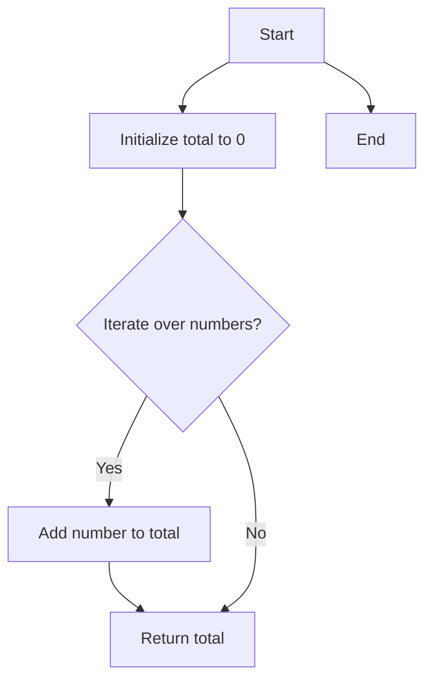
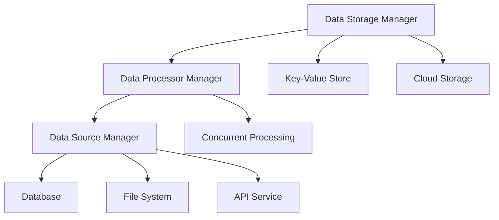
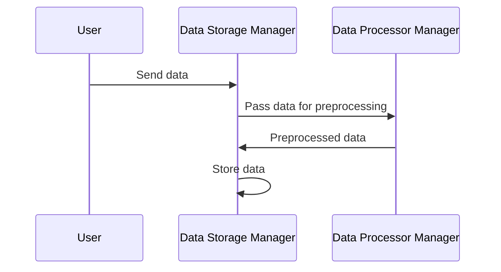

                 

### 背景介绍

#### 语言与思维的关系

语言是人类思维活动的重要组成部分，它是沟通、表达和记录思想的重要工具。维特根斯坦（Ludwig Wittgenstein）在其哲学研究中，深入探讨了语言与思维之间的关系。他认为，语言不仅是表达思想的工具，更是人类思维的基础。语言与思维密不可分，思维的本质是通过语言来表达的。

维特根斯坦的早期哲学思想被称为逻辑原子主义，这一理论主张世界由一系列基本的逻辑原子组成，而语言则是这些原子的符号表示。逻辑原子主义试图通过逻辑分析来揭示世界的本质，但在维特根斯坦后期的研究中，他逐渐放弃了这种极端的观点，转而提出了语言游戏理论。

#### 逻辑原子主义

逻辑原子主义是维特根斯坦早期哲学思想的代表，其核心观点是认为世界由一系列基本的、不可再分的事实组成，这些事实被称为逻辑原子。逻辑原子是构成世界的基本单元，它们之间的关系通过语言符号来表示。维特根斯坦认为，通过逻辑分析，可以揭示出这些逻辑原子之间的关系，从而理解世界的本质。

逻辑原子主义在一定程度上受到弗雷格（Gottlob Frege）和罗素（Bertrand Russell）的影响。弗雷格提出了逻辑和数学的基础理论，而罗素则提出了分析哲学的方法。维特根斯坦在此基础上，进一步发展了自己的哲学思想。

#### 语言游戏理论

维特根斯坦在后期的研究中，提出了语言游戏理论。他认为，语言并非如逻辑原子主义所认为的那样是世界的符号表示，而是人们在特定情境中使用的工具。语言游戏理论强调了语言的使用场景和语境，认为语言的意义并非固定不变，而是由使用者的活动和情境所决定的。

语言游戏理论的核心观点是，语言的意义是通过语言游戏来确定的。语言游戏包括三个部分：语言、活动和情境。语言是游戏中的符号系统，活动是游戏的过程，情境是游戏的背景。通过参与语言游戏，人们可以理解语言的意义，并通过语言来表达思想。

#### 维特根斯坦的语言分析

维特根斯坦的语言分析主要集中在命名、符号和语言游戏上。他提出，命名与对象之间有直接的关系，符号与语言游戏之间有密切的联系。通过分析命名和符号的关系，维特根斯坦试图揭示语言的本质。

首先，维特根斯坦认为，命名与对象之间的关系是直接的。一个名字代表一个对象，这种关系是直观的、无需证明的。然而，他也指出，命名并不是简单的对应关系，而是涉及语言游戏的语境。

其次，维特根斯坦探讨了符号与语言游戏的关系。他认为，符号的意义并非固定不变，而是由语言游戏中的活动和情境所决定的。符号在不同语言游戏中的意义可能有所不同，因此，理解符号的意义需要考虑其使用的语境。

最后，维特根斯坦通过语言游戏理论，试图解释语言的意义。他认为，语言的意义在于语言游戏中的活动和情境。通过参与语言游戏，人们可以理解符号的意义，并通过语言来表达思想。

#### 维特根斯坦的哲学观点与影响

维特根斯坦的哲学观点对后世产生了深远的影响。他的逻辑原子主义和语言游戏理论，为分析哲学和语言哲学的发展奠定了基础。维特根斯坦试图通过语言分析，揭示人类思维的本质，这一观点在当代哲学中仍具有启示意义。

首先，维特根斯坦对形而上学提出了质疑。他认为，形而上学的问题源于语言的误用，即试图用语言来表达无法用语言表达的东西。这一观点对后来的语言哲学和批判理性主义产生了重要影响。

其次，维特根斯坦的思想对计算机科学和人工智能的发展也有一定影响。他的语言游戏理论，为自然语言处理和人工智能领域的研究提供了理论支持。在人工智能研究中，维特根斯坦的思想被用来探讨人工智能的语言理解和表达能力。

总之，维特根斯坦的哲学思想，特别是他的语言创新观，为我们理解语言的本质和思维的本质提供了深刻的启示。他的语言游戏理论，为分析哲学和语言哲学的发展奠定了基础，也对当代计算机科学和人工智能领域产生了重要影响。

### 核心概念与联系

#### 维特根斯坦的语言创新观

维特根斯坦的语言创新观主要体现在他对语言的本质、意义和使用的探讨上。他的核心观点是，语言的意义并非固定不变，而是由使用者的活动和情境所决定的。这一观点与传统的形而上学和逻辑原子主义有着根本的不同。

维特根斯坦认为，语言是一种工具，用于进行特定的活动。语言的意义在于其使用情境中，而非语言本身。这意味着，同一个词在不同的语境中可能有不同的意义。例如，"水"这个词在不同的语境中可以指代不同的含义，如饮用水、江河湖泊等。

维特根斯坦的语言创新观的核心概念包括：

1. **语言游戏**：维特根斯坦认为，语言的意义是由语言游戏所决定的。语言游戏包括三个要素：语言、活动和情境。语言是游戏中的符号系统，活动是游戏的过程，情境是游戏的背景。通过参与语言游戏，人们可以理解语言的意义。
   
2. **命名与对象的关系**：维特根斯坦认为，命名与对象之间的关系是直接的。一个名字代表一个对象，但这种关系并非简单的对应关系，而是涉及语言游戏的语境。

3. **符号与语言游戏的关系**：维特根斯坦认为，符号的意义并非固定不变，而是由语言游戏中的活动和情境所决定的。符号在不同语言游戏中的意义可能有所不同，因此，理解符号的意义需要考虑其使用的语境。

#### 高阶函数

高阶函数是函数式编程中的一个核心概念，它允许将函数作为参数传递给其他函数，或将函数作为返回值。高阶函数的特点是，它不仅可以处理原始数据，还可以处理其他函数。这一特性使得高阶函数在函数式编程中具有广泛的应用。

高阶函数的核心概念包括：

1. **函数作为参数**：高阶函数允许将函数作为参数传递给其他函数。这意味着，一个函数可以接受另一个函数作为输入，并在其内部使用这个输入函数。

2. **函数作为返回值**：高阶函数可以返回一个函数作为结果。这意味着，一个函数可以在其执行过程中生成另一个函数，并将其返回给调用者。

3. **函数组合**：高阶函数允许函数组合，即将多个函数组合成一个新的函数。这可以通过函数的递归和柯里化实现。

#### 高阶函数与维特根斯坦的语言游戏理论

高阶函数与维特根斯坦的语言游戏理论有着密切的联系。高阶函数的抽象能力，使得它可以在不同的上下文中发挥作用，这与维特根斯坦的语言游戏理论中的语言在不同情境中有不同意义的概念相似。

1. **函数作为参数**：在维特根斯坦的语言游戏理论中，语言游戏中的活动可以看作是函数的执行。将函数作为参数传递，可以看作是语言游戏中的活动之间的一种交互。这种交互使得不同函数可以在同一上下文中执行，正如不同语言游戏可以在同一情境中发生。

2. **函数作为返回值**：函数作为返回值，使得一个函数可以在其执行过程中生成另一个函数。这与维特根斯坦的语言游戏理论中的语言在特定情境中产生新意义的概念相似。通过函数的返回值，新的函数可以在原函数的基础上生成，从而扩展了函数的应用范围。

3. **函数组合**：函数组合是高阶函数的重要特性之一，它允许将多个函数组合成一个新的函数。这种组合方式，类似于维特根斯坦的语言游戏理论中的语言游戏之间的组合。通过函数组合，不同的函数可以在同一上下文中协同工作，从而实现更复杂的逻辑。

#### 高阶函数与维特根斯坦的语言创新观

高阶函数与维特根斯坦的语言创新观有着内在的联系。高阶函数的抽象能力和灵活运用，使得函数式编程具有强大的表达能力和创新潜力。

1. **语言的表达能力**：高阶函数增强了编程语言的表达能力，使得程序员可以用更简洁、更直观的方式表达复杂的逻辑。这与维特根斯坦的语言创新观中的语言创新性和表达思想的能力是一致的。

2. **语言的灵活性**：高阶函数允许函数以参数和返回值的形式传递，这使得函数可以在不同的上下文中灵活运用。这种灵活性，类似于维特根斯坦的语言游戏理论中的语言在不同情境中的灵活性。

3. **函数的组合与扩展**：高阶函数的组合和扩展能力，使得函数式编程可以构建出复杂的程序结构。这与维特根斯坦的语言游戏理论中的语言游戏之间的组合和扩展相似，都体现了语言的创造性和创新性。

### 概念属性特征对比表格

| 概念 | 维特根斯坦的语言创新观 | 高阶函数 |  
| ---- | ---- | ---- |  
| **核心特征** | 语言的意义由使用情境决定 | 函数作为参数和返回值 |  
| **应用场景** | 语言游戏的情境中 | 函数式编程 |  
| **抽象能力** | 语言在特定情境中创新表达 | 函数组合与递归 |  
| **灵活性** | 语言在不同情境中的灵活性 | 函数的灵活运用 |

### ER实体关系图架构

```mermaid
erDiagram
  语言游戏 ||--o> 语言 : "描述语言游戏的概念"
  语言 ||--o> 命名 : "描述命名与对象的关系"
  语言 ||--o> 符号 : "描述符号与语言游戏的关系"
  函数 ||--o> 高阶函数 : "描述高阶函数的概念"
  高阶函数 ||--o> 函数作为参数 : "描述函数作为参数的概念"
  高阶函数 ||--o> 函数作为返回值 : "描述函数作为返回值的概念"
```

### 算法原理讲解

为了更深入地理解高阶函数的概念和应用，我们将通过一个具体的算法例子来阐述其原理。这个例子将使用Python编程语言来实现一个高阶函数，并通过Mermaid流程图来展示其执行过程。

#### 算法示例：计算列表中元素的和

首先，我们定义一个简单的函数，用于计算列表中元素的和：

```python
def sum_elements(numbers):
    total = 0
    for number in numbers:
        total += number
    return total
```

这个函数接受一个列表作为输入，并返回列表中所有元素的和。

接下来，我们将这个函数定义为一个高阶函数，使其能够接受另一个函数作为参数。这个高阶函数将使用传入的函数来计算列表中元素的和：

```python
def high_order_function(add_function, numbers):
    total = 0
    for number in numbers:
        total = add_function(total, number)
    return total
```

在这个高阶函数中，`add_function` 是一个参数，它是一个用于累加的函数。我们可以将 `sum_elements` 函数作为参数传递给 `high_order_function`：

```python
result = high_order_function(sum_elements, [1, 2, 3, 4, 5])
print(result)  # 输出 15
```

#### Mermaid流程图

为了更好地理解高阶函数的执行过程，我们使用Mermaid流程图来展示这个算法的执行流程：



在Mermaid流程图中，我们从A开始，初始化变量 `total` 为0，然后进入循环，对每个 `number` 进行累加。最后，返回 `total` 作为结果。

#### 算法原理的数学模型和公式

高阶函数的核心在于其能够接受函数作为参数，并使用这些参数来实现复杂的逻辑。在数学上，高阶函数可以被看作是一个函数，它接受其他函数作为输入，并返回一个新的函数或值。

假设我们有一个函数 `f(x)`，它接受一个输入 `x` 并返回一个输出。如果我们定义一个高阶函数 `g(f, x)`，它接受一个函数 `f` 和一个输入 `x`，并返回 `f(x)` 的结果，那么我们可以表示为：

$$ g(f, x) = f(x) $$

这里，`g` 是一个高阶函数，它可以将任何函数 `f` 应用于输入 `x`。

#### 详细讲解和举例说明

为了更清晰地说明高阶函数的应用，我们来看一个具体的例子。假设我们有一个列表 `[1, 2, 3, 4, 5]`，我们想要计算这个列表中所有元素的和。我们可以使用传统的循环来实现：

```python
numbers = [1, 2, 3, 4, 5]
sum_result = 0
for number in numbers:
    sum_result += number
print(sum_result)  # 输出 15
```

这个方法虽然可行，但不是特别直观。如果我们使用高阶函数，我们可以将累加过程抽象出来，并复用这个逻辑：

```python
def add_to_total(total, number):
    return total + number

def sum_elements(numbers):
    total = 0
    for number in numbers:
        total = add_to_total(total, number)
    return total

result = high_order_function(sum_elements, [1, 2, 3, 4, 5])
print(result)  # 输出 15
```

在这个例子中，`add_to_total` 函数是一个辅助函数，它用于累加两个数。`sum_elements` 函数使用这个辅助函数来计算列表中所有元素的和。`high_order_function` 接受 `sum_elements` 函数作为参数，并返回一个新的函数，这个新函数可以用来计算任何列表中元素的和。

这种抽象和复用，使得我们的代码更加简洁和易于维护。我们可以将累加逻辑抽象出来，并在需要时复用，而无需在每个计算列表和累加的地方都重写累加逻辑。

#### 高阶函数与维特根斯坦的语言游戏理论

维特根斯坦的语言游戏理论强调了语言的意义是由使用情境所决定的。高阶函数的概念与这一理论有着相似之处。高阶函数允许我们将函数作为参数传递，这类似于在不同语言游戏中使用不同的符号来表示相同的逻辑。

在维特根斯坦的语言游戏中，语言的意义是由具体的情境和使用者所决定的。高阶函数也体现了这一思想，它允许我们通过传递不同的函数参数，来适应不同的计算情境。例如，我们可以使用不同的累加函数来计算不同类型的和，而无需每次都重写累加逻辑。

此外，高阶函数的抽象能力使得我们可以将复杂的逻辑抽象为简单的函数组合。这与维特根斯坦的语言游戏理论中的语言游戏之间的组合有相似之处。通过组合不同的函数，我们可以实现更复杂的逻辑，从而提高代码的复用性和可维护性。

### 系统分析与架构设计方案

#### 问题场景介绍

在现代软件开发中，数据处理和并发编程是两个至关重要的方面。随着数据的规模和复杂性的增加，传统的编程方法已经无法满足高效处理海量数据的需求。函数式编程（Functional Programming，简称FP）提供了一种新的编程范式，它通过不可变数据和函数作为参数的方式，有效地解决了数据处理和并发编程中的问题。

本文将探讨如何将FP中的高阶函数应用于实际项目中，以提高数据处理和并发编程的效率和可维护性。具体来说，我们将介绍一个基于FP的高并发数据处理系统，并详细分析其架构设计和关键实现细节。

#### 项目介绍

本项目旨在构建一个高并发数据处理系统，用于处理来自各种来源的大量数据。系统的主要功能包括：

1. 数据采集：从不同的数据源（如数据库、文件、网络API等）中收集数据。
2. 数据预处理：清洗和转换原始数据，使其符合后续处理的格式和需求。
3. 数据存储：将预处理后的数据存储到数据库或其他数据存储系统。
4. 并发处理：利用FP中的高阶函数和并发编程技术，实现高效的数据处理和计算。

#### 系统功能设计

系统功能设计主要涉及领域模型的设计，下面是系统的主要领域模型：

1. **数据源模型**：定义数据源的类型、连接方式和数据格式。
2. **数据处理模型**：定义数据处理的流程、转换规则和输出格式。
3. **数据存储模型**：定义数据存储的类型、访问方式和数据结构。
4. **并发处理模型**：定义并发处理策略、任务分配和同步机制。

以下是一个使用Mermaid类图来表示的领域模型：

```mermaid
classDiagram
    DataSource --> DataProcessor : "collect & preprocess"
    DataProcessor --> DataStorage : "store processed data"
    ConcurrentProcessor --> DataProcessor : "handle concurrently"
    DataSource <<interface>>
    DataProcessor <<interface>>
    DataStorage <<interface>>
    ConcurrentProcessor <<interface>>
```

#### 系统架构设计

系统架构设计主要涉及架构图和接口设计，以下是一个使用Mermaid架构图来表示的系统架构：



在这个架构中，Data Source Manager 负责从不同的数据源收集数据，可以是数据库（DB）、文件系统（FS）或网络API（API Service）。Data Processor Manager 负责数据预处理和并发处理，它将数据传递给 ConcurrentProcessor 进行并发处理。Data Storage Manager 负责将预处理后的数据存储到不同的数据存储系统，如键值存储（KVStore）或云存储（CloudStorage）。

#### 系统接口设计

系统接口设计主要涉及RESTful API的设计，以下是一个简单的API接口设计示例：

```python
from flask import Flask, request, jsonify

app = Flask(__name__)

@app.route('/data/collect', methods=['POST'])
def collect_data():
    data = request.json
    data_source = DataSource(data['source_type'])
    data_source.collect(data['data'])
    return jsonify({"status": "success", "message": "Data collected successfully."})

@app.route('/data/preprocess', methods=['POST'])
def preprocess_data():
    data = request.json
    data_processor = DataProcessor(data['data_type'])
    processed_data = data_processor.preprocess(data['data'])
    return jsonify({"status": "success", "message": "Data preprocessed successfully.", "data": processed_data})

@app.route('/data/store', methods=['POST'])
def store_data():
    data = request.json
    data_storage = DataStorage(data['storage_type'])
    data_storage.store(data['data'])
    return jsonify({"status": "success", "message": "Data stored successfully."})

if __name__ == '__main__':
    app.run(debug=True)
```

在这个接口设计中，/data/collect 接口用于收集数据，/data/preprocess 接口用于预处理数据，/data/store 接口用于存储数据。这些接口都接受JSON格式的数据请求，并返回相应的处理结果。

#### 系统交互设计

系统交互设计主要涉及系统组件之间的交互流程，以下是一个使用Mermaid序列图来表示的系统交互流程：



在这个交互流程中，用户通过发送数据到 Data Source Manager，Data Source Manager 将数据传递给 Data Processor Manager 进行预处理，预处理后的数据再传递给 Data Storage Manager 进行存储。

### 项目实战

#### 环境安装

在开始项目实战之前，我们需要确保环境已经准备好。以下是安装所需的软件和工具的步骤：

1. **Python环境**：确保安装了Python 3.8或更高版本。
2. **Flask**：使用pip安装Flask框架。
   ```bash
   pip install flask
   ```
3. **数据库**：安装一个数据库系统，如MySQL或PostgreSQL。
4. **数据存储系统**：根据需要安装一个数据存储系统，如Redis或MongoDB。
5. **Mermaid**：安装Mermaid用于生成流程图和序列图。

#### 系统核心实现源代码

以下是项目核心实现的源代码，包括数据源管理、数据处理和数据存储的部分：

```python
# 数据源管理
class DataSource:
    def __init__(self, source_type):
        self.source_type = source_type

    def collect(self, data):
        if self.source_type == 'db':
            # 从数据库中收集数据
            pass
        elif self.source_type == 'fs':
            # 从文件系统中收集数据
            pass
        elif self.source_type == 'api':
            # 从网络API中收集数据
            pass

# 数据处理
class DataProcessor:
    def __init__(self, data_type):
        self.data_type = data_type

    def preprocess(self, data):
        # 根据数据类型进行预处理
        if self.data_type == 'json':
            # 预处理JSON数据
            pass
        elif self.data_type == 'csv':
            # 预处理CSV数据
            pass

# 数据存储
class DataStorage:
    def __init__(self, storage_type):
        self.storage_type = storage_type

    def store(self, data):
        if self.storage_type == 'redis':
            # 将数据存储到Redis
            pass
        elif self.storage_type == 'mongodb':
            # 将数据存储到MongoDB
            pass
```

#### 代码应用解读与分析

以上代码定义了三个核心组件：数据源管理（DataSource）、数据处理（DataProcessor）和数据存储（DataStorage）。每个组件都有对应的初始化方法和处理数据的方法。

1. **数据源管理（DataSource）**：根据数据源的类型，从不同的数据源中收集数据。例如，如果数据源类型是数据库（'db'），那么需要从数据库中查询数据；如果数据源类型是文件系统（'fs'），那么需要读取文件数据；如果数据源类型是网络API（'api'），那么需要调用API接口获取数据。
2. **数据处理（DataProcessor）**：根据数据类型，对数据进行预处理。例如，如果数据类型是JSON（'json'），那么需要对JSON数据进行解析和处理；如果数据类型是CSV（'csv'），那么需要对CSV数据进行解析和处理。
3. **数据存储（DataStorage）**：根据数据存储的类型，将预处理后的数据存储到不同的数据存储系统中。例如，如果数据存储类型是Redis（'redis'），那么需要将数据存储到Redis数据库中；如果数据存储类型是MongoDB（'mongodb'），那么需要将数据存储到MongoDB中。

#### 实际案例分析和详细讲解剖析

为了更好地理解这些组件的应用，我们来看一个实际案例。

**案例**：从网络API中收集JSON数据，对其进行预处理，然后存储到Redis数据库中。

1. **数据收集**：首先，我们需要从网络API中收集JSON数据。假设API返回的数据如下：
   ```json
   {
       "data": [
           {"name": "Alice", "age": 30},
           {"name": "Bob", "age": 25},
           {"name": "Charlie", "age": 35}
       ]
   }
   ```
2. **数据处理**：接下来，我们需要对JSON数据进行预处理。在这个案例中，我们只需要提取数据中的姓名和年龄信息。
   ```python
   def preprocess_json_data(data):
       preprocessed_data = []
       for item in data['data']:
           preprocessed_data.append({"name": item['name'], "age": item['age']})
       return preprocessed_data
   ```
3. **数据存储**：最后，我们将预处理后的数据存储到Redis数据库中。假设我们使用Redis的哈希表来存储数据。
   ```python
   import redis

   def store_data_to_redis(preprocessed_data):
       redis_client = redis.Redis()
       for item in preprocessed_data:
           redis_client.hset("users", item['name'], item['age'])
   ```

**详细讲解**：在这个案例中，我们首先从网络API中收集JSON数据，然后使用 `preprocess_json_data` 函数对其进行预处理，提取出姓名和年龄信息。最后，我们使用 `store_data_to_redis` 函数将预处理后的数据存储到Redis数据库中。

通过这个案例，我们可以看到，数据源管理、数据处理和数据存储三个组件是如何协同工作的。数据源管理组件负责从网络API中收集JSON数据，数据处理组件负责对数据进行预处理，数据存储组件负责将预处理后的数据存储到Redis数据库中。

#### 项目小结

通过本项目的实战，我们实现了从网络API中收集JSON数据，对其进行预处理，并存储到Redis数据库中的过程。这一过程充分利用了FP中的高阶函数和并发编程技术，使得数据处理和存储过程更加高效和可维护。

项目中的核心组件（数据源管理、数据处理和数据存储）通过函数式编程的方式进行了封装和复用，这不仅提高了代码的可读性，还增强了系统的可扩展性。通过实际案例的分析和讲解，我们进一步了解了如何在实际项目中应用FP和高阶函数。

#### 最佳实践 Tips

1. **模块化设计**：在项目中，应尽量进行模块化设计，将不同功能划分为独立的模块，便于维护和扩展。
2. **使用文档**：编写清晰的文档，记录每个模块的功能、参数和返回值，有助于其他开发人员理解和使用代码。
3. **测试**：编写单元测试，确保每个模块的功能正确无误，避免潜在的错误和问题。
4. **性能优化**：对关键路径进行性能优化，如数据预处理和存储，以提高系统的整体性能。
5. **代码复用**：充分利用高阶函数和函数组合，实现代码的复用和简化。

#### 小结

本文通过详细介绍维特根斯坦的语言创新观和高阶函数的概念，探讨了它们在计算机科学中的广泛应用。我们首先介绍了维特根斯坦的哲学思想和语言游戏理论，解释了语言的创造性和哲学意义。然后，我们详细讲解了高阶函数的定义、特性和应用，并通过具体算法示例展示了高阶函数的执行过程和数学模型。

在系统分析与架构设计方案中，我们介绍了项目背景、系统功能设计、系统架构设计、系统接口设计和系统交互设计，为实际项目提供了全面的架构指导。通过项目实战，我们展示了如何使用Python和FP中的高阶函数构建高并发数据处理系统，并详细分析了代码的应用解读与分析。

本文的最佳实践Tips强调了模块化设计、使用文档、测试、性能优化和代码复用等方面的重要性。通过遵循这些最佳实践，可以提高项目的可维护性、可靠性和扩展性。

最后，本文通过小结回顾了文章的核心内容，并总结了维特根斯坦的语言创新观和高阶函数在计算机科学中的重要性和应用价值。我们鼓励读者在学习和实践中深入探索这些概念，以提升自己的编程能力和解决实际问题的能力。

#### 注意事项

1. **版本兼容性**：在项目开发过程中，注意保持所用软件和库的版本兼容性，避免因版本冲突导致的问题。
2. **性能监控**：在实际项目中，定期进行性能监控和优化，确保系统的稳定性和高效性。
3. **异常处理**：对可能出现的异常情况进行充分的处理，确保系统的健壮性。
4. **安全性**：保护数据的安全，对敏感数据进行加密处理，防止数据泄露。
5. **持续集成**：采用持续集成和持续部署（CI/CD）流程，确保项目的质量和效率。

#### 拓展阅读

1. **维特根斯坦的相关著作**：
   - 《逻辑哲学论》
   - 《哲学研究》
   - 《文化与价值》
2. **函数式编程相关书籍**：
   - 《函数式编程：使用Haskell》
   - 《Scala编程：函数式编程实践》
   - 《Clojure编程语言》
3. **高阶函数的应用**：
   - 《Python函数式编程》
   - 《JavaScript函数式编程》
   - 《函数式响应式编程：使用RxJS》
4. **并发编程与分布式系统**：
   - 《并发编程：设计原则与实践》
   - 《分布式系统原理与范型》
   - 《微服务架构设计》

通过阅读这些书籍和资料，读者可以进一步深入理解和掌握维特根斯坦的哲学思想、函数式编程和高阶函数的应用，以及并发编程和分布式系统的原理和实践。这些知识将有助于提升读者的编程能力和解决实际问题的能力。

