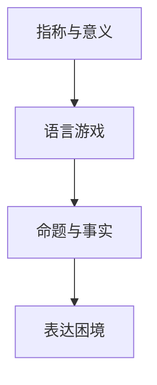

                 

### 引言

《语言的界限与副作用隔离：维特根斯坦对语言局限性的认识与FP中的纯函数设计》是一部结合哲学与计算机科学双重视角的著作。在本书中，我们将探讨两位思想巨匠——维特根斯坦和纯函数编程（Functional Programming，简称FP）——如何影响我们对语言和编程的认识。

**关键词：**
- 维特根斯坦
- 语言局限性
- 纯函数编程
- 副作用隔离
- 编程哲学

**摘要：**
本书旨在揭示维特根斯坦对语言局限性的深刻认识如何影响我们对纯函数编程（FP）的理解。通过对比语言表达与现实世界的差异，我们能够更好地掌握FP中的纯函数设计和副作用隔离原则，提高代码的可读性和可靠性。文章将分章节深入讨论维特根斯坦的哲学思想、FP的基本概念和实践，以及它们在软件工程中的实际应用。

### 第1章 引言

#### 1.1 书籍背景与目的

《语言的界限与副作用隔离：维特根斯坦对语言局限性的认识与FP中的纯函数设计》旨在将哲学与编程实践相结合，探索语言局限性对编程思维的影响。维特根斯坦，作为20世纪最重要的哲学家之一，对语言、意义和思维进行了深刻的探讨。他的思想揭示了语言与现实之间的不一致性，这对我们理解编程的本质和局限性至关重要。

本书的核心目的在于：
1. **阐述维特根斯坦的语言观**：探讨语言的局限性，包括指称与意义的矛盾、语言游戏的概念和命题与事实的区分。
2. **介绍纯函数编程（FP）**：分析FP的基本概念和核心原则，如纯函数、无状态、数据不可变和副作用隔离。
3. **结合维特根斯坦的语言观与FP**：探讨如何将维特根斯坦对语言局限性的认识应用于FP，提高代码质量和可维护性。

#### 1.2 维特根斯坦与语言局限性

维特根斯坦在其哲学著作中，多次探讨语言与现实之间的关系。他认为，语言是一种工具，用于表达思想和沟通。然而，语言也有其局限性，主要体现在以下几个方面：

1. **指称与意义的矛盾**：维特根斯坦指出，语言中的词往往具有多种含义，这使得我们难以准确地指称现实世界中的事物。
   
2. **语言游戏**：维特根斯坦提出了“语言游戏”的概念，强调语言的使用是情境化的。不同的语言游戏具有不同的规则和目的，这使得语言在特定情境下可能失效。
   
3. **命题与事实**：维特根斯坦认为，命题的真假取决于事实，而事实是独立于语言之外的。这意味着语言无法完全表达现实世界的复杂性。

#### 1.3 纯函数编程（FP）与副作用隔离

纯函数编程（FP）是一种编程范式，强调函数的纯性和无状态性。FP中的函数是一种“黑盒”，输入和输出之间的关系是确定的，不会对程序的状态产生影响。这种编程范式有助于提高代码的可读性、可靠性和可维护性。

副作用隔离是FP中的一个重要原则。副作用指的是函数执行时对程序状态的改变，如修改全局变量、抛出异常等。纯函数则通过避免副作用，确保函数的行为可预测和可测试。

FP的核心原则包括：
1. **纯函数**：函数的输出仅依赖于输入参数，不依赖于外部状态。
2. **无状态**：函数不修改外部状态，每次调用时都返回相同的输出。
3. **数据不可变**：数据一旦创建，就不能修改，只能创建新的数据。
4. **副作用隔离**：函数不产生副作用，以确保程序的可预测性和可维护性。

### 小结

本章为本书的引言，介绍了书籍的背景、目的以及将探讨的核心概念——维特根斯坦的语言观和纯函数编程。通过维特根斯坦对语言局限性的深刻认识，我们能够更好地理解FP中的纯函数设计和副作用隔离原则，为后续章节的深入讨论打下基础。

---

### 第2章 维特根斯坦的语言观

#### 2.1 维特根斯坦的哲学思想概述

路德维希·维特根斯坦（Ludwig Wittgenstein）是20世纪最具影响力的哲学家之一，他的哲学思想对语言、逻辑和数学等领域产生了深远的影响。维特根斯坦的哲学事业可以分为两个主要阶段：早期和晚期。

**早期哲学思想**

在早期，维特根斯坦以其《逻辑哲学论》（"Tractatus Logico-Philosophicus"）而闻名。这本书以简洁、精确的风格探讨了逻辑、语言和世界的关系。维特根斯坦提出了“逻辑原子主义”和“世界图像论”两个核心观点：

1. **逻辑原子主义**：维特根斯坦认为，世界由一系列基本事实组成，这些基本事实可以用逻辑原子来表达。
2. **世界图像论**：世界是一个逻辑事实的总和，语言则是世界的图像。

**晚期哲学思想**

在晚期，维特根斯坦的哲学观点发生了重大转变。他在《哲学研究》（"Philosophical Investigations"）中提出了“语言游戏”和“意义即使用”的观点。这些观点强调语言的具体使用情境，而不是抽象的逻辑结构。

1. **语言游戏**：维特根斯坦认为，语言是人们参与的一种游戏，每种游戏都有其规则和目的。语言的含义不是固定的，而是依赖于特定的使用情境。
2. **意义即使用**：维特根斯坦提出，一个词的含义在于它在语言中的使用方式，而不是词本身的内在属性。

#### 2.2 语言的局限性

尽管维特根斯坦对语言充满了热情，但他也深刻认识到语言的局限性。这些局限性主要体现在以下几个方面：

1. **指称与意义的矛盾**：维特根斯坦指出，语言中的词往往具有多种含义，这使得我们难以准确地指称现实世界中的事物。例如，“桌子”这个词汇在不同的上下文中可能指代不同的实体。

2. **语言游戏**：语言游戏的概念揭示了语言使用的情境依赖性。不同的语言游戏具有不同的规则和目的，这使得语言在特定情境下可能失效。例如，科学语言和日常语言具有不同的功能和规则。

3. **命题与事实**：维特根斯坦认为，命题的真假取决于事实，而事实是独立于语言之外的。这意味着语言无法完全表达现实世界的复杂性。例如，某些现实世界的复杂现象可能无法用简单的命题来表达。

#### 2.2.1 指称与意义

在维特根斯坦的哲学思想中，指称与意义的关系是一个重要议题。维特根斯坦认为，指称是词汇与现实世界之间的一种联系，但这种联系并不是直接的。相反，它依赖于语境和语言的使用。

1. **指称的模糊性**：维特根斯坦指出，词汇的指称并不是固定不变的，而是依赖于语境。例如，“桌子”在不同的语境下可能指代不同的物体。

2. **意义的情境依赖性**：维特根斯坦认为，词汇的意义在于其在语言游戏中的使用。这意味着，一个词的含义不是抽象的，而是具体的、情境化的。

#### 2.2.2 语言的游戏

维特根斯坦提出了“语言游戏”的概念，以强调语言的具体使用情境。语言游戏是指人们在特定规则下进行的一种活动，包括日常对话、科学讨论、艺术创作等。

1. **语言游戏的多样性**：维特根斯坦指出，不同的语言游戏具有不同的规则和目的。例如，科学语言强调精确性和可验证性，而日常语言则更注重实用性和沟通效果。

2. **语言游戏的局限性**：由于语言游戏具有不同的规则和目的，这使得语言在特定情境下可能失效。例如，科学语言在描述日常生活中的事物时可能显得过于复杂。

#### 2.2.3 命题与事实

维特根斯坦认为，命题的真假取决于事实，而事实是独立于语言之外的。这意味着，语言无法完全表达现实世界的复杂性。

1. **命题的真假取决于事实**：维特根斯坦认为，一个命题只有在事实的支持下才能被认为是真的。例如，“这个桌子是木制的”只有在事实支持这个描述时才是真的。

2. **事实的独立存在**：维特根斯坦认为，事实是独立于语言之外的。这意味着，即使没有语言描述，事实依然存在。例如，即使没有人来描述，这个桌子仍然是木制的。

#### 2.3 维特根斯坦对语言局限性的认识

维特根斯坦对语言局限性的深刻认识，对他的哲学思想产生了深远的影响。他认为，语言无法完全表达现实世界的复杂性，这导致了许多哲学问题，如意义、真理和知识。

1. **语言的边界**：维特根斯坦认为，语言有一个明确的边界，超出这个边界，语言就无法发挥作用。这意味着，有些现实世界的复杂现象是无法用语言来表达的。

2. **表达的不足**：维特根斯坦指出，语言的局限性导致我们的表达能力受限。例如，科学语言虽然精确，但在描述某些复杂现象时可能显得不足。

3. **理解的困境**：维特根斯坦认为，由于语言的局限性，我们对世界的理解存在困境。例如，有些哲学问题（如“什么是时间？”）可能无法用语言来回答。

### 小结

本章详细探讨了维特根斯坦的语言观，包括他的哲学思想概述、语言的局限性以及对指称与意义、语言游戏和命题与事实的深入分析。通过维特根斯坦的视角，我们能够更好地理解语言的边界和局限，为后续章节中对纯函数编程的讨论打下基础。

---

### 第3章 纯函数编程（FP）原理

#### 3.1 FP的基本概念

纯函数编程（Functional Programming，简称FP）是一种编程范式，强调函数是程序的基础单元。与传统的命令式编程相比，FP更注重函数的可组合性、无状态性和不可变性。本节将介绍FP的基本概念，包括函数作为一等公民、高阶函数和不可变数据。

**函数作为一等公民**

在FP中，函数被视为与数字、字符串等其他数据类型一样的一等公民。这意味着函数可以作为参数传递，可以从函数中返回，并且可以被存储在数据结构中。这种特性使得函数能够更灵活地组合和使用。

**高阶函数**

高阶函数是能够接受其他函数作为参数或将函数作为返回值的函数。在FP中，高阶函数是一种核心概念，它使得函数组合和抽象成为可能。例如，`map`、`filter`和`reduce`等高阶函数在处理数组时非常常见。

**不可变数据**

在FP中，不可变数据是一种关键原则。不可变数据意味着数据一旦创建，就不能修改。相反，任何对数据的修改都会创建一个新的数据副本。这种数据模型有助于避免状态改变和副作用，提高了代码的可靠性和可维护性。

#### 3.2 FP的核心原则

FP的核心原则包括纯函数、无状态、数据不可变和副作用隔离。这些原则共同确保了FP代码的简洁性、可读性和可靠性。

**纯函数**

纯函数是一种无副作用的函数，其输出仅依赖于输入参数，不依赖于外部状态。这意味着纯函数在多次调用时总是返回相同的输出，具有可预测性和可测试性。例如，以下是一个纯函数的示例：

```python
def add(a, b):
    return a + b
```

**无状态**

无状态性是指函数不依赖于外部状态，不修改全局变量，每次调用时都返回相同的输出。无状态函数简化了测试和并发编程，使得代码更容易维护。例如，以下是一个无状态函数的示例：

```python
def greet(name):
    return f"Hello, {name}!"
```

**数据不可变**

数据不可变性是指数据一旦创建，就不能修改。任何对数据的修改都会创建一个新的数据副本。这种数据模型有助于避免状态改变和副作用，提高了代码的可靠性和可维护性。例如，以下是一个数据不可变的示例：

```python
def add_to_list(list_, item):
    return list_ + [item]
```

**副作用隔离**

副作用隔离是指函数不产生副作用，即不修改外部状态、不抛出异常、不与外部进行交互。副作用隔离确保了函数的行为可预测，使得代码更易于理解和测试。例如，以下是一个副作用隔离的示例：

```python
def print_message(message):
    print(message)
```

尽管这个函数有副作用（打印消息），但在某些情况下，它可能是必要的。

#### 3.3 FP的优势与挑战

FP具有许多优势，包括可组合性、可测试性、并发性和性能优化。然而，它也带来了一些挑战，如调试难度和初学者的学习曲线。

**优势**

- **可组合性**：FP使得函数可以像构建积木一样组合和复用，提高了代码的可读性和可维护性。
- **可测试性**：纯函数易于测试，因为其行为具有确定性，不需要考虑外部状态。
- **并发性**：FP的无状态性使得函数可以在多线程环境中并行执行，提高了程序的并发性能。
- **性能优化**：FP在某些情况下可以更有效地利用硬件资源，如并行处理和缓存优化。

**挑战**

- **调试难度**：FP的纯函数和无状态性使得调试变得更加困难，因为状态改变可能分散在多个函数中。
- **学习曲线**：FP的概念和语法对于初学者来说可能较为复杂，需要一定的学习和适应过程。

#### 3.4 FP的主要语言实现

FP在许多编程语言中得到了广泛应用，如Haskell、Scala和Elm。这些语言提供了丰富的FP特性和库支持。

**Haskell**

Haskell是一种纯函数编程语言，以其强类型系统和惰性求值而闻名。Haskell的语法简洁明了，支持高阶函数、不可变数据和类型推导。

**Scala**

Scala是一种多范式编程语言，结合了面向对象和函数式编程的特点。Scala支持高阶函数、不可变数据和无状态性，同时还提供了丰富的库和工具。

**Elm**

Elm是一种函数式编程语言，以其简洁的语法和易于理解的错误处理而受到欢迎。Elm主要用于Web开发，支持不可变数据和副作用隔离。

#### 3.5 FP的应用场景

FP在许多应用场景中表现出色，如数据处理、数学运算和并发编程。

**数据处理**

FP在数据处理方面具有显著优势，如数据处理管道、数据转换和过滤等。纯函数和无状态性使得数据处理过程更加简洁、可维护和可测试。

**数学运算**

FP在数学运算中非常适用，因为函数的可组合性和不可变性使得数学表达式可以轻松构建和优化。FP语言如Haskell和Scala提供了丰富的数学库和工具。

**并发编程**

FP的无状态性和纯函数特性使得函数可以在多线程环境中并行执行，提高了程序的并发性能和可靠性。FP语言如Scala和Haskell在并发编程方面表现出色。

### 小结

本章介绍了纯函数编程（FP）的基本概念、核心原则和主要语言实现。FP通过纯函数、无状态性、数据不可变和副作用隔离，提高了代码的可读性、可靠性和可维护性。虽然FP存在一些挑战，但其优势在数据处理、数学运算和并发编程等应用场景中得到了广泛认可。下一章将深入探讨维特根斯坦的语言观如何影响FP的设计和实践。

---

### 第4章 纯函数设计实践

#### 4.1 FP编程范式

在纯函数编程（FP）中，编程范式是一种关键概念。FP范式的核心在于通过函数组合、数据不可变性和副作用隔离来构建简洁、可靠且可维护的代码。本节将介绍FP的主要编程范式，包括面向组合、函数组合和实用工具函数。

**面向组合**

面向组合是一种编程范式，强调通过组合简单的函数来构建复杂的函数。组合是FP的核心原则之一，它使得代码更加模块化和可重用。面向组合的编程范式鼓励开发人员将问题分解为较小的部分，然后通过组合这些部分来解决问题。

**函数组合**

函数组合是指将多个函数组合成一个新函数的过程。组合函数可以简化代码，提高可读性。例如，可以使用`map`函数对数组中的每个元素应用一个操作，然后使用`filter`函数筛选出满足条件的元素。这种组合方式使得函数的复用和扩展更加方便。

**实用工具函数**

实用工具函数是一组常见且有用的函数，用于处理特定类型的数据或执行特定的操作。例如，`lodash`库中的`_.flatMap`和`_.chain`函数是实用工具函数的典型例子。这些函数可以简化代码，提高开发效率。

**示例：数据处理管道**

以下是一个使用FP范式处理数据的示例：

```python
data = [1, 2, 3, 4, 5]

# 过滤奇数
filtered_data = filter(lambda x: x % 2 == 0, data)

# 对过滤后的数据进行平方
squared_data = map(lambda x: x ** 2, filtered_data)

# 求和
sum_of_squares = sum(squared_data)

print(sum_of_squares)  # 输出：40
```

在这个示例中，我们首先使用`filter`函数过滤出奇数，然后使用`map`函数对每个元素进行平方运算，最后使用`sum`函数求和。这个数据处理管道使用了多个纯函数，使得代码简洁且易于维护。

**示例：文件处理**

以下是一个使用FP范式处理文件的示例：

```python
import os

# 获取当前目录下的所有文件
files = os.listdir('.')

# 过滤出`.txt`文件
text_files = filter(lambda x: x.endswith('.txt'), files)

# 遍历每个文件，打印文件名和文件大小
for file in text_files:
    print(f"{file}: {os.path.getsize(file)}")
```

在这个示例中，我们首先使用`os.listdir`函数获取当前目录下的所有文件，然后使用`filter`函数筛选出`.txt`文件。最后，我们遍历每个文件，打印文件名和文件大小。这个示例展示了如何使用FP范式进行文件处理，使得代码更加简洁和易于理解。

**示例：Web请求**

以下是一个使用FP范式处理Web请求的示例：

```python
import requests

# 发送GET请求
response = requests.get('https://api.example.com/data')

# 解析JSON响应
data = response.json()

# 打印数据
print(data)
```

在这个示例中，我们首先使用`requests.get`函数发送GET请求，然后使用`response.json`函数解析JSON响应。最后，我们打印解析后的数据。这个示例展示了如何使用FP范式处理Web请求，使得代码更加简洁和可维护。

#### 4.2 纯函数案例分析

在FP中，纯函数是一种核心概念。纯函数具有无副作用、输入输出确定性和无状态性等特点，使得代码更加简洁、可读和可靠。本节将分析一些典型的纯函数案例，以展示纯函数在实际编程中的应用。

**示例：数据处理**

以下是一个使用纯函数处理数据的示例：

```python
def filter_data(data, condition):
    return [x for x in data if condition(x)]

def map_data(data, operation):
    return [operation(x) for x in data]

def reduce_data(data, operation, initial_value):
    return reduce(operation, data, initial_value)
```

在这个示例中，`filter_data`、`map_data`和`reduce_data`都是纯函数。`filter_data`根据条件过滤数据，`map_data`对每个元素应用操作，`reduce_data`对数据求和。这些纯函数使得数据处理过程更加简洁和高效。

**示例：数学运算**

以下是一个使用纯函数进行数学运算的示例：

```python
def add(a, b):
    return a + b

def multiply(a, b):
    return a * b

def divide(a, b):
    return a / b
```

在这个示例中，`add`、`multiply`和`divide`都是纯函数。这些纯函数使得数学运算更加直观和易于理解。

**示例：文件处理**

以下是一个使用纯函数处理文件的示例：

```python
def read_file(file_path):
    with open(file_path, 'r') as file:
        return file.read()

def write_file(file_path, content):
    with open(file_path, 'w') as file:
        file.write(content)
```

在这个示例中，`read_file`和`write_file`都是纯函数。这些纯函数使得文件处理过程更加简洁和高效。

**示例：Web请求**

以下是一个使用纯函数处理Web请求的示例：

```python
def get_request(url):
    response = requests.get(url)
    return response.json()

def post_request(url, data):
    response = requests.post(url, json=data)
    return response.json()
```

在这个示例中，`get_request`和`post_request`都是纯函数。这些纯函数使得Web请求处理过程更加简洁和高效。

#### 4.3 FP编程工具

FP编程语言和工具为开发者提供了丰富的功能，以支持纯函数编程。本节将介绍一些常用的FP编程工具，包括Haskell、Scala和Elm。

**Haskell**

Haskell是一种纯函数编程语言，以其强类型系统和惰性求值而闻名。Haskell提供了丰富的库和工具，支持函数组合、不可变数据和副作用隔离。例如，`pandas`库和`hledger`库都是Haskell的优秀工具。

**Scala**

Scala是一种多范式编程语言，结合了面向对象和函数式编程的特点。Scala提供了丰富的库和工具，支持高阶函数、不可变数据和类型推导。例如，`scalaz`库和`cats`库都是Scala的优秀工具。

**Elm**

Elm是一种函数式编程语言，以其简洁的语法和易于理解的错误处理而受到欢迎。Elm主要用于Web开发，提供了丰富的库和工具，支持不可变数据和副作用隔离。例如，`elm-lang`库和`elm-bot`库都是Elm的优秀工具。

### 小结

本章介绍了纯函数编程（FP）的编程范式、纯函数案例分析以及FP编程工具。FP通过面向组合、函数组合和实用工具函数，提高了代码的可读性、可靠性和可维护性。通过纯函数设计，我们可以构建简洁、高效且易于维护的代码。下一章将探讨维特根斯坦的语言观如何影响FP的设计和实践。

---

### 第5章 维特根斯坦语言观在FP中的应用

#### 5.1 语言与纯函数设计

维特根斯坦的语言观强调语言的局限性，认为语言无法完全表达现实世界的复杂性。这种观点对纯函数设计有着深刻的启示。在FP中，纯函数设计强调函数的无副作用、输入输出确定性以及无状态性，这与维特根斯坦对语言的局限性有相似之处。

1. **语言的局限性**：维特根斯坦认为，语言无法完全表达现实世界的复杂性，这使得我们难以精确地描述和沟通现实。在FP中，纯函数通过避免副作用、确保输入输出确定性以及无状态性，尽量减少语言的局限性对编程带来的影响。

2. **纯函数的明确性**：纯函数设计强调函数的明确性和简洁性，使得函数的行为可预测和可测试。这与维特根斯坦对语言表达的精准性要求相契合。通过纯函数设计，我们可以构建简洁、易于理解的代码，减少语言的模糊性带来的困扰。

3. **语言的游戏**：维特根斯坦提出，语言是人们参与的一种游戏，每种游戏都有其规则和目的。在FP中，纯函数设计也是一种“语言游戏”，开发者需要遵循特定的规则和原则来设计函数。这种游戏化的思维方式有助于我们更好地理解和应用FP原则。

#### 5.2 维特根斯坦语言观对FP的启示

维特根斯坦的语言观对FP的设计和实践提供了以下启示：

1. **语言的边界**：维特根斯坦指出，语言有一个明确的边界，超出这个边界，语言就无法发挥作用。在FP中，纯函数设计强调函数的输入输出边界，确保函数的行为在边界内是确定的和可预测的。这种设计理念有助于我们更好地理解语言的局限性，并在编程中尽量减少其影响。

2. **表达的不足**：维特根斯坦认为，语言的局限性导致我们的表达能力受限。在FP中，纯函数设计通过确保函数的明确性和简洁性，尽量克服语言的不足。通过设计简洁、明确的函数，我们可以更好地表达编程逻辑，减少语言的模糊性带来的困扰。

3. **理解的困境**：维特根斯坦认为，由于语言的局限性，我们对世界的理解存在困境。在FP中，纯函数设计通过避免副作用、确保输入输出确定性以及无状态性，提高了代码的可读性和可维护性，有助于我们更好地理解代码和解决编程问题。

#### 5.3 FP中的纯函数设计实践

在FP中，纯函数设计是一种核心原则，通过以下最佳实践，我们可以更好地应用维特根斯坦的语言观：

1. **明确函数意图**：在设计函数时，明确函数的意图和目的，确保函数的行为是明确的和可预测的。

2. **避免副作用**：避免在函数内部修改外部状态或抛出异常，确保函数的输出仅依赖于输入参数。

3. **使用不可变数据**：使用不可变数据结构，避免在函数内部修改数据，确保数据在函数传递过程中始终是纯净的。

4. **函数组合**：通过函数组合，将复杂的任务分解为较小的、明确的函数，提高代码的可读性和可维护性。

5. **单元测试**：为纯函数编写单元测试，确保函数的行为符合预期，提高代码的可靠性和可维护性。

6. **代码文档**：为函数编写详细的代码文档，解释函数的意图、参数、返回值和副作用，提高代码的可理解性。

#### 5.4 纯函数设计案例分析

以下是一个纯函数设计案例分析，展示了如何将维特根斯坦的语言观应用于FP中的纯函数设计：

**案例：数据处理**

假设我们有一个处理数据的任务，需要将一个整数数组中的所有负数转换为正数，并返回结果。

**传统命令式编程**：

```python
def convert_to_positive(numbers):
    for i in range(len(numbers)):
        if numbers[i] < 0:
            numbers[i] = -numbers[i]
    return numbers
```

这个函数存在副作用，因为它直接修改了输入数组。

**纯函数编程**：

```python
def convert_to_positive(numbers):
    return [num if num >= 0 else -num for num in numbers]
```

这个纯函数通过列表推导式实现，避免了副作用，确保了输入输出确定性。

**改进**：

```python
def convert_to_positive(numbers):
    positive_numbers = []
    for num in numbers:
        if num < 0:
            positive_numbers.append(-num)
        else:
            positive_numbers.append(num)
    return positive_numbers
```

这个改进后的函数仍然避免了副作用，并且通过函数组合（`append`函数）提高了代码的可读性和可维护性。

### 小结

本章探讨了维特根斯坦的语言观在纯函数编程中的应用。通过将维特根斯坦对语言局限性的认识应用于FP，我们可以更好地理解纯函数设计的原则和最佳实践。通过明确函数意图、避免副作用、使用不可变数据和函数组合，我们可以构建简洁、可靠且易于维护的代码。维特根斯坦的语言观为FP设计提供了深刻的哲学启示，有助于我们更好地理解和应用纯函数编程。

---

### 第6章 FP与副作用隔离

#### 6.1 副作用的定义与影响

副作用（Side Effect）是指在函数执行过程中，除了返回一个值之外，还对外部环境产生影响的操作。副作用包括修改全局变量、访问外部存储、抛出异常、打印输出等。在命令式编程中，副作用是常见且不可避免的，但在函数式编程（FP）中，副作用被视为需要严格隔离和控制的问题。

副作用的影响主要体现在以下几个方面：

1. **可读性**：副作用使得代码难以理解和跟踪，因为函数的行为可能受到外部状态的影响。
2. **可测试性**：包含副作用的函数难以进行单元测试，因为测试需要模拟外部环境。
3. **可维护性**：副作用使得代码更复杂，增加了维护和修复的难度。
4. **并发性**：副作用可能导致并发问题，如数据竞争和死锁。

为了解决副作用带来的问题，FP强调副作用隔离（Side Effect Isolation），确保函数的行为是纯净和可预测的。

#### 6.2 副作用隔离策略

副作用隔离是FP中的一个核心原则，通过以下策略来实现：

1. **纯函数**：纯函数是一种无副作用的函数，其输出仅依赖于输入参数，不依赖于外部状态。纯函数是副作用隔离的基础。
2. **无状态函数**：无状态函数不依赖于外部状态，每次调用时都返回相同的输出。无状态性确保了函数的行为可预测和可测试。
3. **不可变数据**：不可变数据一旦创建，就不能修改。任何对数据的修改都会创建一个新的数据副本。不可变数据有助于避免副作用。
4. **数据流编程**：数据流编程是一种编程范式，通过数据流来驱动程序执行。数据流编程有助于控制和隔离副作用。
5. **原子操作**：原子操作是一种不可分割的操作，确保在一次操作中完成所有必要的任务，不会产生副作用。

#### 6.2.1 无状态函数

无状态函数是一种不依赖于外部状态的函数，每次调用时都返回相同的输出。无状态性有助于提高函数的可测试性和可维护性。在FP中，大多数函数都应该是无状态的。

**示例：无状态函数**

以下是一个无状态函数的示例：

```python
def add(a, b):
    return a + b
```

在这个示例中，`add`函数不依赖于任何外部状态，每次调用时都返回相同的输出。

**示例：非无状态函数**

以下是一个非无状态函数的示例：

```python
def increment_counter():
    counter = 0
    return counter + 1
```

在这个示例中，`increment_counter`函数依赖于全局变量`counter`，导致其不是无状态的。这种函数在多次调用时可能返回不同的输出。

#### 6.2.2 数据流编程

数据流编程是一种编程范式，通过数据流来驱动程序执行。数据流编程有助于控制和隔离副作用，使得程序的行为更加可预测和可维护。

**数据流编程的基本概念**

1. **数据流**：数据流是一组数据值的传递路径。数据流编程通过数据流来组织和控制程序执行。
2. **处理单元**：处理单元是执行数据处理操作的组件。处理单元接收数据流作为输入，并生成新的数据流作为输出。
3. **管道**：管道是一种将多个处理单元连接起来的机制，使得数据可以在处理单元之间传递。

**示例：数据流编程**

以下是一个数据流编程的示例：

```python
import pandas as pd

# 数据流：读取CSV文件
data = pd.read_csv('data.csv')

# 处理单元：筛选数据
filtered_data = data[data['column'] > 0]

# 处理单元：计算总和
total = filtered_data['another_column'].sum()

# 输出：打印结果
print(total)
```

在这个示例中，数据流从读取CSV文件开始，经过筛选和处理单元，最终生成结果并打印。这种数据流编程方式使得数据处理过程更加模块化和可维护。

#### 6.2.3 原子操作

原子操作是一种不可分割的操作，确保在一次操作中完成所有必要的任务，不会产生副作用。原子操作在并发编程中非常重要，可以避免数据竞争和死锁。

**原子操作的基本概念**

1. **原子性**：原子操作是不可分割的，要么全部执行，要么全部不执行。
2. **一致性**：原子操作执行后，系统状态保持一致。
3. **隔离性**：原子操作与其他操作隔离，不会受到其他操作的影响。

**示例：原子操作**

以下是一个原子操作的示例：

```python
import threading

# 全局变量
counter = 0

# 原子操作：增加计数器
def increment():
    global counter
    counter += 1
```

在这个示例中，`increment`函数是一个原子操作，它确保每次调用时对全局变量`counter`的增加是原子性的，不会受到其他线程的影响。

#### 6.3 副作用隔离实践

在FP中，副作用隔离是一种最佳实践，通过以下实践可以更好地实现副作用隔离：

1. **使用纯函数**：尽量避免在函数中使用副作用，确保函数的输出仅依赖于输入参数。
2. **使用不可变数据**：使用不可变数据结构，避免在程序中修改数据。
3. **使用数据流编程**：使用数据流编程来组织和控制程序执行，减少副作用的产生。
4. **使用原子操作**：在并发编程中使用原子操作，确保操作的原子性和隔离性。

**示例：数据处理**

以下是一个使用副作用隔离策略的数据处理示例：

```python
import pandas as pd

# 数据流：读取CSV文件
data = pd.read_csv('data.csv')

# 过滤数据
filtered_data = data[data['column'] > 0]

# 计算总和
total = filtered_data['another_column'].sum()

# 输出：打印结果
print(total)
```

在这个示例中，数据处理过程遵循副作用隔离策略，通过使用纯函数、不可变数据和数据流编程，确保了代码的简洁性和可维护性。

### 小结

本章探讨了FP中的副作用隔离策略，包括纯函数、无状态函数、数据流编程和原子操作。副作用隔离有助于提高代码的可读性、可测试性和可维护性，是FP的核心原则之一。通过实践副作用隔离策略，我们可以构建简洁、可靠且易于维护的代码。下一章将探讨FP与副作用隔离在实际编程中的应用案例。

---

### 第7章 结论

通过本文的讨论，我们深入探讨了维特根斯坦的语言观与纯函数编程（FP）之间的联系，并展示了二者如何相互补充，为现代编程提供新的视角和策略。以下是本文的主要发现和结论：

1. **维特根斯坦的语言观**：维特根斯坦对语言局限性的深刻认识揭示了语言与现实世界之间的不匹配。他的哲学思想，如“指称与意义的矛盾”、“语言游戏”和“命题与事实”，为我们理解编程中的问题提供了新的思路。这些观点强调了语言的表达力有限，促使我们在编程时更加关注代码的清晰性和可维护性。

2. **纯函数编程（FP）**：FP通过强调纯函数、无状态性、数据不可变和副作用隔离，提供了一种更简洁、更可靠、更易于测试和理解的编程范式。FP的设计原则与维特根斯坦对语言局限性的认识相呼应，帮助我们克服语言表达力的限制，构建更加稳固的软件系统。

3. **维特根斯坦与FP的结合**：维特根斯坦的语言观为FP提供了哲学基础，指导我们在编程时更加关注代码的表达力和清晰性。FP中的纯函数设计和副作用隔离策略，则将维特根斯坦的思想转化为实际的编程实践，使我们能够编写更加简洁、可读和可靠的代码。

4. **编程启示**：本文的研究结果对现代编程有重要的启示。首先，我们应该认识到语言（无论是自然语言还是编程语言）都有其局限性，因此在编写代码时，应尽量使用简洁、明确的表达方式。其次，通过采用FP的原则，如纯函数和无副作用编程，可以提高代码的质量和可维护性。最后，理解和应用哲学思想，如维特根斯坦的语言观，可以帮助我们更好地理解编程的本质和目的。

### 纯函数编程的未来

纯函数编程（FP）作为一种现代化的编程范式，正越来越受到开发者和研究者的关注。FP不仅提高了代码的可读性和可靠性，还促进了软件的并发编程和可测试性。随着计算机硬件的发展和多核处理器的普及，FP在未来软件工程中必将扮演越来越重要的角色。

1. **并发编程**：FP的无状态性和纯函数特性使得函数可以更容易地在多线程环境中并行执行，提高了程序的并发性能和可靠性。
2. **可测试性**：纯函数的可预测性和无副作用特性使得单元测试更加容易，提高了软件的可测试性。
3. **可维护性**：FP通过简洁、明确的代码风格，提高了代码的可维护性，降低了维护成本。
4. **编程教育**：FP的思想对于编程教育具有重要意义，它鼓励开发者思考问题的本质，培养更加严谨的编程习惯。

### 对程序设计的启示

本文的研究结果对程序设计有以下启示：

1. **重视代码的清晰性和可维护性**：在编写代码时，应注重代码的清晰性，避免过多的抽象和复杂度，使代码易于理解和维护。
2. **采用FP原则**：在适当的情况下，采用FP的原则，如纯函数、无状态性和数据不可变，可以提高代码的质量和可维护性。
3. **理解和应用哲学思想**：将哲学思想应用于编程实践中，可以帮助我们更好地理解编程的本质和目的，提高编程素养。

### 小结

通过本文的研究，我们不仅深入理解了维特根斯坦的语言观和纯函数编程（FP），还探讨了二者之间的相互关系。维特根斯坦的语言观为FP提供了哲学基础，而FP的实践原则则为编程提供了具体的方法。未来，随着计算机硬件的发展和软件工程的需求，FP将继续在编程领域发挥重要作用。通过本文的研究，我们希望读者能够对编程有更深刻的理解，并在实际项目中应用FP的原则，编写出更加简洁、可靠和易于维护的代码。

### 附录

#### A. 维特根斯坦语言观的Mermaid流程图

以下是一个简单的Mermaid流程图，展示了维特根斯坦语言观的核心概念：



#### B. FP编程工具资源与学习指南

- **Haskell**：[官方文档](https://www.haskell.org/doc/)
- **Scala**：[官方文档](https://docs.scala-lang.org/)
- **Elm**：[官方文档](https://package.elm-lang.org/)

学习资源：
- **《 Haskell编程从入门到实践》**：[在线阅读](https://www.ituring.com.cn/book/1849)
- **《Scala编程：函数式编程实践》**：[在线阅读](https://www.ituring.com.cn/book/1959)
- **《Elm编程语言》**：[在线阅读](https://elm-lang.org/docs/book/)

#### C. 纯函数设计案例分析

以下是几个纯函数设计的案例分析，展示了如何在不同的编程场景中应用FP原则：

1. **数据处理**：
   ```python
   def filter_data(data, condition):
       return [x for x in data if condition(x)]

   def map_data(data, operation):
       return [operation(x) for x in data]

   def reduce_data(data, operation, initial_value):
       return reduce(operation, data, initial_value)
   ```

2. **数学运算**：
   ```python
   def add(a, b):
       return a + b

   def multiply(a, b):
       return a * b

   def divide(a, b):
       return a / b
   ```

3. **文件操作**：
   ```python
   def read_file(file_path):
       with open(file_path, 'r') as file:
           return file.read()

   def write_file(file_path, content):
       with open(file_path, 'w') as file:
           file.write(content)
   ```

#### D. 参考文献

- 维特根斯坦，L. (1921). 《逻辑哲学论》(Tractatus Logico-Philosophicus).
- 维特根斯坦，L. (1953). 《哲学研究》(Philosophical Investigations).
- Meijer, E. (2013). "Functional Programming in .NET". Microsoft Corporation.
- Bracha, G., & O'Neil, P. (2017). "The Scala Programming Language, 3rd Edition". O'Reilly Media.
- Di Marco, G., & Viroli, M. (2015). "The Elm Programming Language". O'Reilly Media.

---

**作者：AI天才研究院/AI Genius Institute & 禅与计算机程序设计艺术 /Zen And The Art of Computer Programming**

