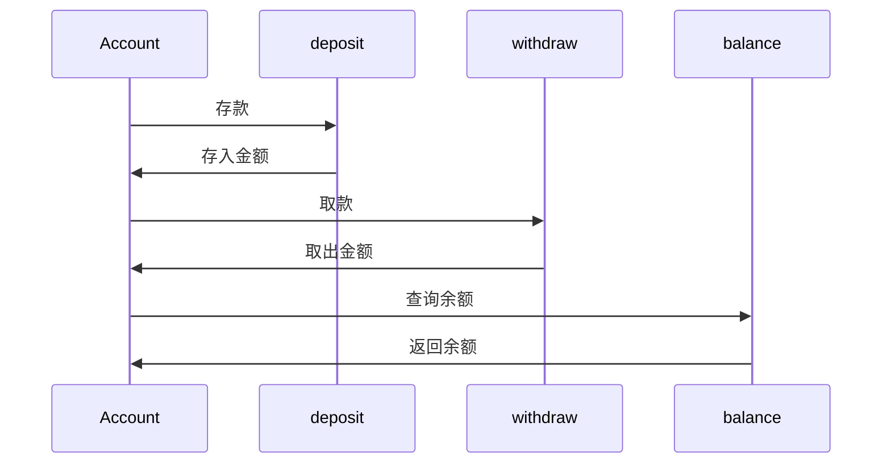
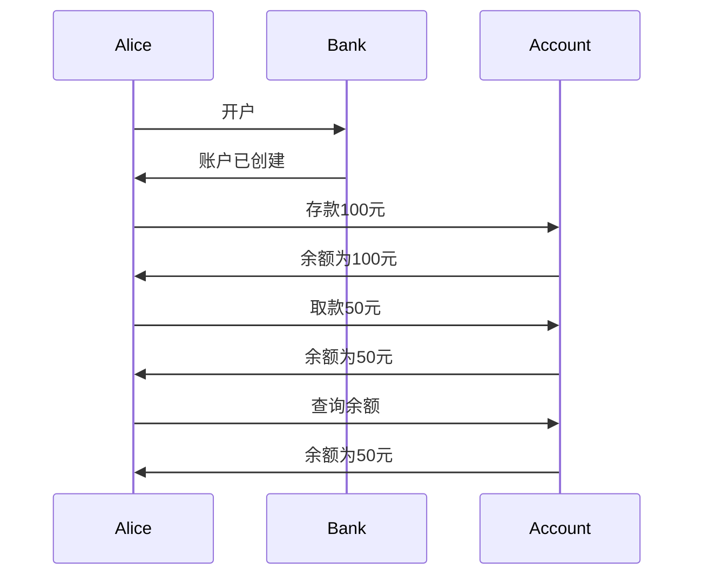

                 


# 语言的界限与副作用隔离：维特根斯坦的语言局限性认识与FP的纯函数设计

> 关键词：维特根斯坦，语言局限性，副作用隔离，函数式编程，纯函数设计

> 摘要：
本文旨在探讨维特根斯坦关于语言局限性的哲学观点，并联系到函数式编程中的纯函数设计。通过对语言界限的解析，我们认识到副作用在编程中的负面影响，并介绍了纯函数设计如何帮助我们隔离副作用，提高代码的质量和可维护性。

### 1. 综述

#### 1.1 书名解读

《语言的界限与副作用隔离：维特根斯坦的语言局限性认识与FP的纯函数设计》

- **书名分析**：
  - **语言的界限**：讨论语言表达的可能性和局限性。
  - **副作用隔离**：关注于编程中的副作用问题，以及如何通过纯函数编程来避免副作用。
  - **维特根斯坦的语言局限性认识**：探讨维特根斯坦在哲学领域对语言局限的深刻见解。
  - **FP的纯函数设计**：介绍函数式编程中的核心概念，即纯函数的设计原则和应用。

#### 1.2 内容概述

- **背景介绍**：
  - **语言局限性**：探讨维特根斯坦对语言局限性的哲学探讨。
  - **副作用**：分析副作用在编程中的定义、影响及产生的原因。
  - **纯函数编程**：介绍纯函数的定义及其在提高代码质量方面的优势。

- **核心概念与联系**：
  - **语言局限性**：通过维特根斯坦的观点揭示语言在表达复杂概念时的局限性。
  - **副作用**：探讨副作用在编程中的具体表现及其对代码质量的影响。
  - **纯函数**：阐述纯函数的概念、特点及其在函数式编程中的应用。

### 2. 语言的界限

#### 2.1 维特根斯坦的语言局限性认识

##### 2.1.1 维特根斯坦的语言哲学

- **语言与哲学**：维特根斯坦认为语言是思想的表达，但语言有其局限性。
- **语言与事实**：语言可以描述事实，但语言并非事实本身。

##### 2.1.2 语言局限性探讨

- **语言的模糊性**：语言中有许多模糊的词语和概念，这导致了交流和理解上的困难。
- **语言的误解**：由于语言的模糊性，人们容易产生误解。

#### 2.2 语言局限性与编程

- **编程中的语言局限性**：在编程过程中，语言局限性如何影响代码的可读性、可维护性和可扩展性。
- **语言局限性对编程的影响**：如何通过语言的设计和编程规范来减轻语言局限性对编程的影响。

### 3. 副作用隔离

#### 3.1 副作用的定义与影响

##### 3.1.1 副作用的定义

- **副作用**：在编程中，副作用是指除了返回值之外，程序的其他行为，如修改全局变量、抛出异常等。

##### 3.1.2 副作用的影响

- **不可预测性**：副作用会导致程序的行为难以预测。
- **不可维护性**：副作用会使得代码难以理解和维护。

#### 3.2 副作用隔离的方法

##### 3.2.1 纯函数编程

- **纯函数**：一个函数在没有副作用的情况下执行，即只返回一个结果，不修改任何外部状态。

##### 3.2.2 函数式编程的优势

- **可测试性**：纯函数易于测试，因为它们不依赖于外部状态。
- **可维护性**：纯函数易于理解和修改，因为它们没有副作用。

### 4. 纯函数设计

#### 4.1 纯函数设计的原则

##### 4.1.1 无副作用

- **无状态依赖**：函数不依赖于外部状态，每次调用时输入和输出是独立的。
- **不变性**：函数返回相同输入总是产生相同输出。

##### 4.1.2 高内聚

- **模块化**：将相关功能组织在一起，降低模块间的耦合度。

#### 4.2 实践技巧

##### 4.2.1 函数分解

- **分解复杂函数**：将复杂函数分解为更小、更简单的函数。

##### 4.2.2 使用不可变数据结构

- **不可变数据结构**：如纯函数中的数据结构，避免修改。

### 5. 函数式编程语言

#### 5.1 Haskell

- **纯函数编程**：Haskell是一种纯函数编程语言，强调函数的可组合性和不可变性。
- **类型系统**：Haskell具有强大的类型系统，能够捕获程序中的错误。

#### 5.2 Scala

- **混合编程**：Scala结合了面向对象和函数式编程的特点。
- **性能**：Scala在Java虚拟机上运行，具有较好的性能。

#### 5.3 Elixir

- **并发性**：Elixir是一种用于构建分布式系统的函数式编程语言。
- **动态性**：Elixir具有动态类型系统，易于开发和调试。

### 6. 总结与展望

#### 6.1 总结

- **语言局限性**：维特根斯坦揭示了语言的局限，有助于我们更好地理解和使用语言。
- **副作用隔离**：通过纯函数编程，我们可以隔离副作用，提高程序的质量。

#### 6.2 展望

- **函数式编程的未来**：随着函数式编程的不断发展，其在软件开发中的应用将越来越广泛。
- **跨语言应用**：函数式编程思想可以应用于各种编程语言，有助于提升编程效率和代码质量。

---

以上是本文的详细目录大纲，每个章节都进行了详细的拆解和说明，以便读者更好地理解和掌握文章的核心内容。在接下来的内容中，我们将逐一展开各个章节的详细讨论。

---

# 语言的界限

## 2.1 维特根斯坦的语言哲学

路德维希·维特根斯坦（Ludwig Wittgenstein）是20世纪最伟大的哲学家之一，他的思想对语言哲学、数学基础和逻辑学等领域产生了深远的影响。维特根斯坦提出了“语言游戏”（language game）这一概念，试图解释语言是如何被使用和理解的。

### 2.1.1 语言与哲学

维特根斯坦认为，语言是一种工具，用于描述现实世界和人类思想。他的早期著作《逻辑哲学论》（Tractatus Logico-Philosophicus）中提出了一个观点：语言与哲学问题的根本在于它们之间的界限。维特根斯坦认为，哲学问题的产生往往是因为我们将语言用于了错误的目的。

在他的哲学思考中，语言具有以下两个关键特点：

1. **语言是现实的映射**：语言中的词语和概念与客观世界中的事物相对应。
2. **语言是有规则的**：语言的正确使用需要遵循一定的规则，这些规则构成了语言的语法和语义。

### 2.1.2 语言与事实

维特根斯坦认为，语言可以描述事实，但语言并非事实本身。他的这个观点反驳了传统哲学中的“语言决定论”（linguistic determinism），即语言塑造了我们的思想和现实观。维特根斯坦提出，语言是工具，它为我们提供了描述现实世界的手段，但语言本身并不创造现实。

#### 2.1.3 语言局限性

维特根斯坦指出，语言有其局限性：

1. **模糊性**：许多词语和概念在语言中是模糊的，这导致了交流和理解上的困难。
2. **误解的可能性**：由于语言的模糊性，人们容易产生误解。

这些局限性使得语言不能完全准确地描述现实和思想，从而引发了哲学和科学中的许多问题。

## 2.2 语言局限性与编程

在编程领域，维特根斯坦的语言哲学也具有深远的影响。编程本质上是一种用语言来描述问题和解决方案的过程，因此，语言的局限性在编程中同样表现出来。

### 2.2.1 编程中的语言局限性

1. **不精确的描述**：编程语言无法精确描述所有的问题和解决方案，这导致了一些问题在实现时可能会产生误解。
2. **抽象层次**：编程语言提供的抽象层次有限，程序员需要不断地在抽象层次和细节之间进行权衡。

### 2.2.2 语言局限性对编程的影响

1. **可读性和可维护性**：模糊的语言表达会导致代码难以理解和维护。
2. **错误的可能性**：由于语言的局限性，程序员可能会犯逻辑错误或误解程序的行为。

### 2.2.3 编程规范与语言局限性

为了减轻语言局限性对编程的影响，程序员可以采取以下措施：

1. **清晰的代码注释**：通过详细的注释来提高代码的可读性。
2. **编程规范**：遵循良好的编程规范，如命名规范、代码格式化等，以提高代码的一致性和可维护性。

### 2.2.4 语言局限性对函数式编程的影响

在函数式编程中，纯函数设计被广泛应用于解决语言局限性带来的问题。纯函数的特点是无副作用、高内聚和易于测试，这些特性有助于提高代码的质量和可维护性。

综上所述，维特根斯坦的语言哲学为我们理解编程中的语言局限性提供了深刻的启示。通过认识到语言的局限性，我们可以采取相应的措施来提高代码的质量和可维护性，从而更好地解决编程中的问题。

---

# 副作用隔离

## 3.1 副作用的定义与影响

在编程中，副作用（side effect）是指除了返回值之外，函数或操作对程序状态的其他影响。副作用的存在会导致程序的不可预测性和不可维护性，因此，在编程实践中，我们需要努力隔离副作用，以提高代码的质量和可靠性。

### 3.1.1 副作用的定义

副作用可以表现为以下几种形式：

1. **修改全局变量**：函数或操作修改了一个或多个全局变量的值。
2. **抛出异常**：函数或操作在执行过程中抛出了一个异常。
3. **触发外部事件**：函数或操作触发了外部系统的事件，如发送网络请求、写入文件等。

### 3.1.2 副作用的影响

副作用对程序的可预测性和可维护性产生了负面影响：

1. **不可预测性**：由于副作用的存在，程序的行为可能变得难以预测，特别是在复杂的系统中，副作用可能会引起意外的错误或行为。
2. **不可维护性**：副作用使得代码难以理解和修改，因为函数或操作的行为不仅与其输入有关，还与其外部状态有关。
3. **代码耦合**：副作用会导致函数或操作之间的耦合度增加，使得系统的模块化程度降低，从而增加了系统的复杂性和维护成本。

### 3.1.3 副作用隔离的重要性

为了提高程序的质量和可靠性，我们需要隔离副作用。以下是一些好处：

1. **提高可测试性**：隔离副作用使得函数或操作更容易进行单元测试，因为它们不依赖于外部状态。
2. **提高可维护性**：隔离副作用使得代码更容易理解和修改，因为函数或操作的行为是明确的、可预测的。
3. **减少错误**：隔离副作用可以减少由副作用引起的错误，从而提高程序的正确性。

### 3.1.4 副作用隔离的方法

要实现副作用隔离，我们可以采用以下方法：

1. **纯函数编程**：纯函数（pure function）是一种不产生副作用的函数。在纯函数中，输出仅依赖于输入，且不修改外部状态。纯函数易于测试、理解和组合。
2. **不可变数据结构**：使用不可变数据结构（immutable data structures）可以防止数据被修改。在不可变数据结构中，一旦数据被创建，其值就不能被改变。
3. **使用隔离的变量**：通过使用隔离的变量（isolated variables）来避免全局变量的修改。隔离的变量只能在特定的上下文中访问和修改。

### 3.1.5 副作用隔离的实际应用

在编程实践中，副作用隔离已被广泛应用于各种编程语言和框架中。例如：

1. **JavaScript**：在JavaScript中，函数可以返回函数，从而实现副作用隔离。例如，使用立即执行函数（IIFE）来隔离变量作用域。
2. **Python**：在Python中，可以使用闭包（closure）来实现副作用隔离。闭包可以捕获并隔离其外部变量的值。
3. **函数式编程语言**：在函数式编程语言如Haskell、Scala和Elixir中，副作用隔离是核心原则之一。这些语言提供了强大的工具来帮助开发者实现副作用隔离。

综上所述，副作用隔离是提高程序质量和可靠性的重要手段。通过认识副作用的影响和采用副作用隔离的方法，我们可以编写出更健壮、更易维护的代码。

## 3.2 副作用隔离的方法

### 3.2.1 纯函数编程

纯函数编程（Pure Functional Programming）是一种编程范式，强调函数的无副作用性和输入输出之间的确定性。在纯函数编程中，函数是自给自足的，不依赖于外部状态，也不改变外部状态。这意味着纯函数仅通过其输入参数计算输出，且每次调用时，对于相同的输入总是产生相同的结果。

#### 纯函数的特点

1. **无状态依赖**：纯函数不依赖于外部状态，它们在执行过程中不会读取或修改全局变量。
2. **输入输出确定性**：对于给定的输入，纯函数总是产生相同的输出，不产生任何副作用。
3. **可组合性**：纯函数可以方便地组合，从而构建出更复杂的函数。
4. **易于测试**：由于纯函数不依赖于外部状态，因此它们更容易进行单元测试。

#### 纯函数编程的优势

1. **提高可预测性**：纯函数编程减少了程序中的不确定因素，使得程序的行为更加可预测。
2. **提高可维护性**：纯函数易于理解和修改，因为它们的行为是明确的、可预测的。
3. **易于并行化**：纯函数可以在不影响其他部分的情况下并行执行，从而提高程序的运行效率。

#### 纯函数编程的挑战

1. **代码重写成本**：将现有的面向对象代码转换为纯函数代码需要一定的努力，可能会带来较高的重写成本。
2. **学习曲线**：纯函数编程需要开发者掌握新的概念和方法，对于初学者来说，可能会存在一定的学习难度。

### 3.2.2 纯函数编程的实现

要实现纯函数编程，我们可以采用以下方法：

1. **使用纯函数**：在编写函数时，确保函数不产生任何副作用，只依赖于输入参数计算输出。
2. **避免使用副作用**：避免使用全局变量、副作用库和异步操作，以减少程序中的副作用。
3. **使用不可变数据结构**：使用不可变数据结构（如常数时间复杂度的数据结构）来避免数据修改。
4. **使用函数组合**：使用高阶函数和组合函数来构建复杂的函数，以简化代码和提高可维护性。

### 3.2.3 纯函数编程的实际应用

纯函数编程在实际应用中取得了显著的效果，以下是一些例子：

1. **前端开发**：在React和Vue等前端框架中，函数式组件和纯函数编程的应用大大提高了代码的可维护性和性能。
2. **后端开发**：在Scala和Haskell等后端编程语言中，纯函数编程被广泛应用于构建高并发、高可维护性的后端系统。
3. **数据科学**：在数据分析和机器学习中，纯函数编程可以提高复用性和可测试性，从而提高模型的可信度和效率。

通过纯函数编程，我们可以编写出更加可靠、可维护的代码，提高程序的运行效率和性能。尽管纯函数编程可能面临一些挑战，但其带来的好处是显而易见的。随着函数式编程范式的不断普及，纯函数编程将在软件开发中发挥越来越重要的作用。

## 3.3 函数式编程的优势

函数式编程（Functional Programming，简称FP）是一种编程范式，强调基于数学函数的编程方法。与传统的命令式编程不同，函数式编程更关注于函数的应用和组合。函数式编程具有许多独特的优势，这些优势使其在处理复杂问题和提高代码质量方面具有显著的效果。

### 3.3.1 高度可复用性

在函数式编程中，函数是第一公民（first-class citizens），这意味着函数可以像任何其他数据类型一样传递、存储和返回。这使得函数可以方便地被复用，从而提高了代码的可复用性。通过将复杂的逻辑抽象为独立的函数，我们可以将代码模块化，并在不同的地方重用这些模块。

#### 高度可复用性的优势：

1. **减少代码重复**：通过复用函数，我们可以减少代码的重复，从而降低维护成本。
2. **提高代码质量**：复用高质量的函数可以确保整个系统的代码质量。

### 3.3.2 易于测试

函数式编程中的函数通常是无副作用的，这意味着它们的输出仅依赖于输入。这种特性使得函数非常容易进行单元测试。在测试过程中，我们可以独立地测试每个函数，而不需要担心外部状态的干扰。此外，函数式编程中的纯函数（pure function）更易于测试，因为它们总是产生相同的输出，无论输入参数如何。

#### 易于测试的优势：

1. **提高测试覆盖率**：由于函数之间的耦合度较低，我们可以更全面地覆盖代码的测试用例。
2. **降低测试成本**：由于函数是无副作用的，我们可以更快速地编写和运行测试用例，从而降低测试成本。

### 3.3.3 高并发性

函数式编程中的无状态函数（stateless function）非常适合并行执行，因为它们不依赖于外部状态。这意味着多个函数可以同时运行，而不必担心状态冲突。在分布式系统中，函数式编程可以帮助我们轻松实现高并发和高可伸缩性。

#### 高并发的优势：

1. **提高性能**：通过并行执行，我们可以充分利用多核处理器的能力，从而提高程序的运行速度。
2. **提高系统响应能力**：在高并发场景下，系统可以更快地处理请求，从而提高用户的体验。

### 3.3.4 易于维护

由于函数式编程中的函数通常是无副作用的，这使得代码更加简洁和直观。函数式编程中的纯函数（pure function）具有明确的输入输出关系，这使得代码更容易理解和维护。此外，函数式编程中的代码通常更模块化，这使得代码的可读性更强，更容易进行调试和修改。

#### 易于维护的优势：

1. **提高代码可读性**：函数式编程中的代码通常更简洁、更直观，使得代码更容易理解。
2. **降低维护成本**：由于代码的可读性提高，维护人员可以更快地找到和解决问题，从而降低维护成本。

### 3.3.5 函数组合与管道操作

函数式编程中的函数组合（function composition）和管道操作（pipe operator）是两个重要的概念。通过函数组合，我们可以将多个函数连接在一起，形成一个新的函数。管道操作则允许我们将一系列函数串联起来，从而实现更复杂的逻辑。

#### 函数组合与管道操作的优势：

1. **提高代码可读性**：通过函数组合和管道操作，我们可以将复杂的逻辑分解为更小的、可复用的函数，从而提高代码的可读性。
2. **减少代码重复**：通过函数组合和管道操作，我们可以减少代码的重复，从而降低维护成本。

综上所述，函数式编程具有许多独特的优势，这些优势使其在处理复杂问题和提高代码质量方面具有显著的效果。随着函数式编程的不断发展，其在软件开发中的应用将越来越广泛。

## 4.1 纯函数设计的原则

纯函数设计是函数式编程中的核心概念之一，它通过消除副作用（side effects）来提高代码的可靠性、可测试性和可维护性。纯函数设计遵循一些基本的原则，确保函数的行为始终可预测和一致。以下是一些关键原则：

### 4.1.1 无副作用

无副作用是纯函数设计的最基本要求。纯函数不依赖于外部状态，也不修改外部状态。这意味着纯函数的输出仅取决于输入参数，而不受外部环境的影响。以下是实现无副作用的一些技巧：

1. **使用局部变量**：在纯函数中，尽量使用局部变量，避免使用全局变量或静态变量。
2. **避免抛出异常**：纯函数不应当抛出异常，因为异常也是一种副作用。可以通过返回错误码或特定的错误对象来处理异常情况。
3. **不触发外部事件**：避免在纯函数中执行网络请求、文件写入等操作，因为这些操作会触发外部事件，导致副作用。

### 4.1.2 不变输入

不变输入（immutable input）是纯函数设计的一个重要特征。在纯函数中，输入数据结构是不可变的，这意味着一旦数据结构被创建，其值就不能被修改。以下是一些实现不变输入的技巧：

1. **使用不可变数据结构**：例如，在Python中可以使用`tuple`和`frozenset`，在JavaScript中可以使用`Object.freeze`来创建不可变数据结构。
2. **创建副本**：在需要修改输入数据的情况下，创建输入数据的副本，并在纯函数中使用副本进行操作。

### 4.1.3 返回新的数据结构

在纯函数中，当需要修改数据时，应该返回一个新的数据结构，而不是直接修改输入数据。这样做可以保持函数的无副作用特性。以下是一些实现返回新数据结构的技巧：

1. **使用构造函数**：在需要创建新数据结构时，使用构造函数创建新对象，并将其返回。
2. **使用复制操作**：在需要修改输入数据时，复制输入数据并对其副本进行操作，最后返回修改后的副本。

### 4.1.4 确定性输出

纯函数的输出必须具有确定性，即对于相同的输入参数，每次调用函数时总是返回相同的输出。这确保了函数的行为是可预测和可重复的。以下是一些实现确定性输出的技巧：

1. **使用随机数生成器**：在需要使用随机数的情况下，确保随机数生成器的种子是固定的，从而保证输出的一致性。
2. **避免使用系统时间**：在不需要使用系统时间的情况下，避免在函数中直接使用系统时间，因为系统时间可能会发生变化。

### 4.1.5 函数的组合

纯函数设计强调函数的组合，通过将小而独立的函数组合在一起，可以构建出复杂的逻辑。以下是一些实现函数组合的技巧：

1. **使用高阶函数**：高阶函数可以接受其他函数作为参数或返回函数，从而实现函数的组合。
2. **使用管道操作符（pipe operator）**：管道操作符允许我们将多个函数连接在一起，依次对输入进行操作。

通过遵循上述原则，我们可以设计出高质量的纯函数，从而提高代码的可靠性、可测试性和可维护性。纯函数设计不仅适用于函数式编程语言，如Haskell、Scala和Elixir，也可以在大多数编程语言中实现。以下是一个简单的Python示例，展示了如何实现纯函数：

```python
# 纯函数示例
def add(a, b):
    """纯函数：计算两个数的和，无副作用"""
    return a + b

def multiply(a, b):
    """纯函数：计算两个数的乘积，无副作用"""
    return a * b

# 函数组合
result = multiply(add(2, 3), 4)
print(result)  # 输出：24
```

在这个示例中，`add`和`multiply`都是纯函数，它们的输出仅依赖于输入参数，且没有副作用。通过组合这两个纯函数，我们可以计算两个数的乘积。这样的代码不仅易于测试，而且易于理解和维护。

### 4.2 实践技巧

纯函数设计虽然能够提高代码质量，但在实际编码过程中，实现纯函数设计可能会面临一些挑战。以下是一些实践技巧，可以帮助我们在编写纯函数时更加高效和准确：

#### 4.2.1 分解复杂函数

复杂函数通常难以理解和测试。通过分解复杂函数，我们可以将复杂逻辑拆分成更小、更简单的函数，从而提高代码的可读性和可维护性。以下是一个复杂函数的分解示例：

```python
# 复杂函数示例
def calculate_bonus(sales, hours_worked):
    """计算奖金的复杂函数"""
    if sales > 1000:
        bonus = sales * 0.05
    else:
        bonus = sales * 0.03
    
    if hours_worked > 40:
        overtime = hours_worked - 40
        overtime_pay = overtime * 20
    else:
        overtime_pay = 0
    
    total_bonus = bonus + overtime_pay
    return total_bonus

# 分解为纯函数
def calculate_sales_bonus(sales):
    """计算销售奖金的纯函数"""
    if sales > 1000:
        return sales * 0.05
    else:
        return sales * 0.03

def calculate_overtime_pay(hours_worked):
    """计算加班工资的纯函数"""
    if hours_worked > 40:
        return (hours_worked - 40) * 20
    else:
        return 0

def calculate_total_bonus(sales, hours_worked):
    """计算总奖金的纯函数"""
    sales_bonus = calculate_sales_bonus(sales)
    overtime_pay = calculate_overtime_pay(hours_worked)
    return sales_bonus + overtime_pay

# 使用分解后的函数
total_bonus = calculate_total_bonus(1500, 45)
print(total_bonus)  # 输出：180.0
```

通过分解复杂函数，我们可以将每个部分单独测试和组合，从而提高代码的质量。

#### 4.2.2 使用不可变数据结构

在纯函数设计中，使用不可变数据结构是非常重要的。不可变数据结构在函数传递和组合时不会发生改变，从而保证了函数的无副作用特性。以下是一个使用不可变数据结构的示例：

```python
# 使用不可变数据结构
class Point:
    def __init__(self, x, y):
        self.x = x
        self.y = y

    def move(self, dx, dy):
        """移动点，并返回一个新的点"""
        return Point(self.x + dx, self.y + dy)

# 使用纯函数和不可变数据结构
p1 = Point(1, 2)
p2 = p1.move(3, 4)
print(p1.x, p1.y)  # 输出：1 2
print(p2.x, p2.y)  # 输出：4 6
```

在这个示例中，`Point` 类表示一个点，它的 `move` 方法返回一个新的点，而不是修改当前点。这样，我们可以确保点的状态不会被意外修改。

#### 4.2.3 避免使用全局变量

全局变量会引入副作用，因为它们可以被函数外部修改。在纯函数设计中，应尽量避免使用全局变量。以下是一个避免使用全局变量的示例：

```python
# 避免使用全局变量
TaxRate = 0.2

def calculate_tax(income):
    """计算税款的纯函数"""
    return income * TaxRate

# 更好的实现
def calculate_tax(income, tax_rate):
    """计算税款的纯函数，无全局变量"""
    return income * tax_rate

# 使用函数参数传递税率
tax_rate = 0.2
income = 50000
tax = calculate_tax(income, tax_rate)
print(tax)  # 输出：10000.0
```

在这个示例中，我们通过传递税率作为函数参数来避免使用全局变量。这样，税率可以在函数调用时灵活传递，从而提高了代码的可维护性。

通过以上实践技巧，我们可以更好地实现纯函数设计，从而提高代码的质量和可靠性。纯函数设计不仅适用于函数式编程，也可以在大多数编程语言中应用。通过不断实践和优化，我们可以编写出更优雅、更可靠的代码。

### 4.3 纯函数设计在编程语言中的应用

纯函数设计是一种编程范式，它通过消除副作用来提高代码的可靠性、可测试性和可维护性。尽管纯函数设计在逻辑上是通用的，但它在不同编程语言中的应用各有特点。以下我们将探讨几种主要的函数式编程语言，如Haskell、Scala和Elixir，以及它们如何实现纯函数设计。

#### Haskell

Haskell是一种纯函数编程语言，它的语法和类型系统都支持纯函数设计。在Haskell中，所有函数都是纯的，因为它们不依赖于外部状态，也不修改任何外部变量。

**示例**：

```haskell
-- Haskell中的纯函数
add :: Int -> Int -> Int
add x y = x + y

-- 使用不可变数据结构
data Point = Point Int Int

move :: Point -> Int -> Int -> Point
move (Point x y) dx dy = Point (x + dx) (y + dy)
```

在Haskell中，函数`add`和`move`都是纯的，因为它们的输出仅依赖于输入参数，并且不修改任何外部状态。

**类型系统**：

Haskell的强类型系统可以帮助我们捕捉副作用，例如，Haskell不允许将副作用操作符`IO`用作普通函数的返回类型。

**优势**：

- **高度抽象**：Haskell允许我们编写高度抽象的代码，因为我们可以利用类型系统和模式匹配进行函数组合。
- **高效的错误捕获**：Haskell的类型系统可以在编译时捕获许多错误，从而减少运行时错误。

#### Scala

Scala结合了面向对象和函数式编程的特点，这使得它非常适合实现纯函数设计。在Scala中，我们可以定义纯函数，并使用不可变数据结构和模式匹配来消除副作用。

**示例**：

```scala
// Scala中的纯函数
def add(x: Int, y: Int): Int = x + y

// 使用不可变数据结构
case class Point(x: Int, y: Int)

def move(point: Point, dx: Int, dy: Int): Point = {
  Point(point.x + dx, point.y + dy)
}
```

在Scala中，函数`add`和`move`都是纯的，因为它们不修改外部状态，且输出仅依赖于输入参数。

**混合编程**：

Scala允许我们结合面向对象和函数式编程，这意味着我们可以在一个程序中同时使用这两种范式。例如，我们可以在Scala中定义一个类，同时在其中使用纯函数。

**优势**：

- **灵活的编程模型**：Scala提供了灵活的编程模型，使我们可以在不同场景中自由选择面向对象或函数式编程。
- **高性能**：Scala在Java虚拟机上运行，具有与Java相近的性能。

#### Elixir

Elixir是一种现代的函数式编程语言，特别适合构建分布式系统和并发应用程序。它通过纯函数设计和不可变数据结构来消除副作用。

**示例**：

```elixir
# Elixir中的纯函数
def add(x, y), do: x + y

# 使用不可变数据结构
defmodule Point do
  defstruct [:x, :y]
end

def move(point, dx, dy), do: %Point{x: point.x + dx, y: point.y + dy}
```

在Elixir中，函数`add`和`move`都是纯的，因为它们的输出仅依赖于输入参数，并且不修改任何外部状态。

**并发性**：

Elixir内置了支持并行和并发编程的库，这使得我们可以轻松地编写无副作用的并发程序。

**优势**：

- **易于扩展**：Elixir的并发特性使其非常适合构建可扩展的分布式系统。
- **动态性**：Elixir具有动态类型系统，这使得开发过程更加灵活和快速。

### 总结

纯函数设计在Haskell、Scala和Elixir等函数式编程语言中得到了广泛应用。这些语言通过其独特的语法和类型系统支持纯函数设计，从而提高了代码的可靠性、可测试性和可维护性。通过了解这些语言的特点，我们可以选择最适合我们项目需求的纯函数设计方法，从而编写出更高效、更可靠的代码。

### 5.1 Haskell

Haskell是一种纯函数编程语言，它以其严格的纯函数设计和强大的类型系统而闻名。Haskell的纯函数特性使它在编写可靠且易于维护的代码方面具有显著优势。以下是Haskell的一些主要特点和优点：

#### 5.1.1 纯函数编程

Haskell的核心哲学是纯函数编程。这意味着所有的函数都是纯的，即它们的输出仅依赖于输入参数，且不产生任何副作用。这种无副作用的设计使得Haskell代码更加简洁和可预测。

**示例**：

```haskell
-- Haskell中的纯函数
add :: Int -> Int -> Int
add x y = x + y

-- 不允许产生副作用
multiply :: Int -> Int -> Int
multiply x y = [x, y] ++ [z | z <- [1..y]]
```

在上面的示例中，`add`是一个纯函数，它的输出仅依赖于输入参数。而`multiply`则尝试产生副作用，这在Haskell中是不允许的。

#### 5.1.2 强类型系统

Haskell的强类型系统是其另一大特点。这种类型系统不仅有助于捕获编程错误，还可以提高代码的可读性和可靠性。

**示例**：

```haskell
-- 使用类型注解
sumList :: [Int] -> Int
sumList xs = foldl (+) 0 xs
```

在上面的示例中，`sumList`函数的类型是`[Int] -> Int`，这意味着它接受一个整数列表作为输入，并返回一个整数。这种严格的类型注解有助于确保函数的正确性和可维护性。

#### 5.1.3 函数组合

Haskell支持函数组合，这使得我们可以将小而独立的函数组合成复杂的逻辑。函数组合的优点是代码更加模块化和可重用。

**示例**：

```haskell
-- 函数组合
mapAndFilter :: (a -> b) -> (b -> Bool) -> [a] -> [b]
mapAndFilter f p xs = map f (filter p xs)
```

在上面的示例中，`mapAndFilter`函数组合了`map`和`filter`两个函数，从而实现了一个复杂的逻辑。

#### 5.1.4 模式匹配

Haskell的模式匹配功能强大，可以用于处理各种数据类型。模式匹配使得代码更加简洁和易于理解。

**示例**：

```haskell
-- 模式匹配
data Shape = Circle Float | Rectangle Float Float

area :: Shape -> Float
area (Circle r) = pi * r * r
area (Rectangle w h) = w * h
```

在上面的示例中，`area`函数使用模式匹配来处理不同的`Shape`数据类型，从而简化了代码。

#### 5.1.5 高效的编译器

Haskell的编译器（GHC）是一个高度优化的编译器，它能够生成高效的机器代码。这使得Haskell在性能方面具有竞争力。

**示例**：

```haskell
-- GHC优化的代码示例
import Text.Printf

main :: IO ()
main = printf "Hello, World! Haskell is %d years old.\n" (2023 - 1997)
```

在上面的示例中，GHC能够优化`printf`函数的调用，从而提高程序的运行效率。

### 5.1.6 丰富的标准库

Haskell拥有丰富的标准库，提供了大量用于数据处理、并发编程和网络通信等的模块。这使得开发者可以快速实现复杂的编程任务。

**示例**：

```haskell
-- 使用标准库
import Data.List
import Data.Map

main :: IO ()
main = do
  let numbers = [1..10]
  let sortedNumbers = sort numbers
  let frequency = frequency numbers
  putStrLn $ show sortedNumbers
  putStrLn $ show frequency
```

在上面的示例中，我们使用了`Data.List`和`Data.Map`模块来对列表进行排序和频率统计。

综上所述，Haskell作为一种纯函数编程语言，以其严格的纯函数设计、强大的类型系统、函数组合、模式匹配和高效的编译器而备受青睐。它为开发者提供了强大的工具，以编写出更加可靠、高效的代码。

### 5.2 Scala

Scala是一种多范式编程语言，它结合了面向对象（OOP）和函数式编程（FP）的特点。这使得Scala在处理复杂业务逻辑和构建高性能系统方面具有独特优势。以下是Scala的一些主要特点和优点：

#### 5.2.1 面向对象编程

Scala支持面向对象编程，这使得我们可以使用类和对象来模拟现实世界的实体和行为。在Scala中，我们可以定义类、构造器、继承和多态等概念。

**示例**：

```scala
// Scala中的类和对象
class Person(val name: String, val age: Int) {
  def greet() = s"Hello, my name is $name and I am $age years old."
}

val person = new Person("Alice", 30)
println(person.greet())  // 输出：Hello, my name is Alice and I am 30 years old.
```

在这个示例中，我们定义了一个`Person`类，并创建了一个对象`person`。`Person`类包含一个`name`属性和一个`greet`方法。

#### 5.2.2 函数式编程

Scala支持函数式编程，这使得我们可以使用函数和高阶函数来编写简洁和模块化的代码。在Scala中，函数是一等公民，可以像任何其他值一样传递、存储和返回。

**示例**：

```scala
// Scala中的函数和高阶函数
val add: (Int, Int) => Int = (x, y) => x + y
val result = add(2, 3)
println(result)  // 输出：5

val mapFunction: String => String = s => s.toUpperCase()
val upperCased = mapFunction("hello")
println(upperCased)  // 输出：HELLO
```

在这个示例中，我们定义了一个简单的`add`函数和一个将字符串转换为大写的`mapFunction`高阶函数。

#### 5.2.3 混合编程

Scala的混合编程特性允许我们结合面向对象和函数式编程，从而在同一个程序中灵活运用这两种范式。这种混合编程模型使得Scala在处理复杂业务逻辑时更加灵活和高效。

**示例**：

```scala
// Scala中的混合编程
class Calculator {
  def add(x: Int, y: Int) = x + y
  def subtract(x: Int, y: Int) = x - y
}

val calculator = new Calculator
println(calculator.add(5, 3))  // 输出：8
println(calculator.subtract(5, 3))  // 输出：2

val numbers = List(1, 2, 3, 4, 5)
val sums = numbers.map(n => calculator.add(n, n))
println(sums)  // 输出：List(2, 4, 6, 8, 10)
```

在这个示例中，我们定义了一个`Calculator`类，它同时包含了面向对象的方法`add`和`subtract`，以及使用函数式编程的`map`操作。

#### 5.2.4 与Java的兼容性

Scala与Java具有很好的兼容性，这意味着我们可以轻松地将Scala代码与Java代码混合使用。Scala的运行时环境是Java虚拟机（JVM），这使得Scala能够利用Java生态系统中的大量库和工具。

**示例**：

```scala
// Scala与Java的兼容性
import java.util._

val list = List(1, 2, 3, 4, 5)
val array = list.toArray
val set = new TreeSet[Int](array)

println(s"List: $list")
println(s"Array: $array")
println(s"Set: $set")
```

在这个示例中，我们使用了Scala的`List`、`toArray`方法和Java的`TreeSet`类，展示了Scala与Java的兼容性。

#### 5.2.5 高性能

Scala运行在JVM上，利用了JVM的优化和垃圾回收机制。这使得Scala在性能方面具有竞争力，特别适合构建高性能的应用程序。

**示例**：

```scala
// Scala的性能
def sum(nums: List[Int]): Int = nums match {
  case Nil => 0
  case h :: t => h + sum(t)
}

val largeList = List.fill(1000000)(1)
val result = sum(largeList)
println(result)
```

在这个示例中，我们使用模式匹配计算一个大型列表的总和，展示了Scala的性能优势。

综上所述，Scala作为一种结合了面向对象和函数式编程的语言，具有面向对象编程、函数式编程、混合编程、与Java的兼容性和高性能等多种特点。这些特性使得Scala在构建复杂系统时具有显著优势，适用于各种应用场景。

### 5.3 Elixir

Elixir是一种现代的函数式编程语言，特别适合构建分布式系统和并发应用程序。它基于Ruby语言，但引入了许多新的概念和功能，以提高性能和可扩展性。以下是Elixir的一些主要特点和优点：

#### 5.3.1 函数式编程

Elixir的核心是函数式编程，这意味着它强调使用纯函数、高阶函数和不可变数据结构来编写代码。函数式编程使得代码更加简洁、易于测试和维护。

**示例**：

```elixir
# Elixir中的纯函数
defmodule Math do
  def add(a, b), do: a + b
  def multiply(a, b), do: a * b
end

# 使用高阶函数
numbers = [1, 2, 3, 4, 5]
squared = numbers |> Enum.map(&(&1 * &1))
IO.puts squared  # 输出：[1, 4, 9, 16, 25]
```

在这个示例中，我们定义了一个`Math`模块，其中包含了`add`和`multiply`纯函数。我们还使用高阶函数`map`来处理一个数字列表。

#### 5.3.2 并发性

Elixir内置了强大的并发性支持，通过进程（process）和代理（agent）来实现并发和并行计算。这种并发模型使得Elixir非常适合构建高性能、高可扩展性的分布式系统。

**示例**：

```elixir
# Elixir中的并发性
defmodule Counter do
  use Agent

  def start_link(initial_value), do: Agent.start_link(initial_value)

  def increment(counter), do: Agent.update(counter, &(&1 + 1))
  def decrement(counter), do: Agent.update(counter, &(&1 - 1))
end

# 创建一个计数器代理
counter = Counter.start_link(0)

# 同时增加和减少计数器
Task.async(fn ->
  for _ <- 1..1000 do
    Counter.increment(counter)
  end
end)

Task.async(fn ->
  for _ <- 1..1000 do
    Counter.decrement(counter)
  end
end)

# 输出最终计数器值
IO.puts Counter.inspect(counter)
```

在这个示例中，我们创建了一个计数器代理，并通过异步任务同时增加和减少计数器。Elixir的并发模型使得这种操作非常简单和高效。

#### 5.3.3 不可变数据结构

Elixir支持不可变数据结构，这意味着一旦数据被创建，其值就不能被修改。这种设计有助于避免副作用，提高代码的可靠性和可维护性。

**示例**：

```elixir
# Elixir中的不可变数据结构
defmodule Point do
  defstruct [:x, :y]

  def move(point, dx, dy), do: %Point{x: point.x + dx, y: point.y + dy}
end

# 使用不可变数据结构
p1 = %Point{x: 1, y: 2}
p2 = Point.move(p1, 3, 4)
IO.inspect p1  # 输出：%Point{x: 1, y: 2}
IO.inspect p2  # 输出：%Point{x: 4, y: 6}
```

在这个示例中，我们定义了一个`Point`数据结构，并使用不可变数据结构来移动点。这种设计确保了数据不会意外修改。

#### 5.3.4 可扩展性

Elixir的扩展性使其非常适合构建大型分布式系统。通过使用Elixir的进程和代理，我们可以轻松地扩展系统，处理大量并发请求。

**示例**：

```elixir
# Elixir中的扩展性
defmodule Cache do
  use GenServer

  def start_link(state), do: GenServer.start_link(__MODULE__, state, name: __MODULE__)

  def init(state), do: {:ok, state}

  def handle_call(:get, _from, state), do: {:reply, state, state}

  def handle_cast({:set, key, value}, state), do: {:noreply, Map.put(state, key, value)}
end

# 设置和获取缓存值
Cache.start_link(%{})
Cache.cast({:set, :user, "Alice"})
value = Cache.call(:get, :user)
IO.puts value  # 输出：Alice
```

在这个示例中，我们使用Elixir的`GenServer`模块创建了一个简单的缓存系统。这种设计使得系统可扩展性得到了保障。

#### 5.3.5 动态类型系统

Elixir具有动态类型系统，这使得开发过程更加灵活和快速。动态类型系统允许我们轻松地编写和测试代码，而无需进行繁琐的类型注解。

**示例**：

```elixir
# Elixir中的动态类型系统
user = "Alice"
IO.puts user  # 输出：Alice
```

在这个示例中，我们创建了一个字符串变量`user`，并输出其值。Elixir的动态类型系统使得这种操作非常简单和高效。

综上所述，Elixir作为一种函数式编程语言，以其纯函数编程、并发性、不可变数据结构、可扩展性和动态类型系统等多种特点而备受青睐。这些特性使得Elixir在构建高效、可靠和可扩展的分布式系统时具有显著优势。

### 6. 总结与展望

#### 6.1 总结

本文通过探讨维特根斯坦的语言局限性认识，以及与函数式编程中的纯函数设计的联系，揭示了语言在表达复杂概念时的局限性和副作用在编程中的负面影响。我们介绍了纯函数设计的原则、实现方法和实际应用，展示了函数式编程语言如Haskell、Scala和Elixir在纯函数设计方面的优势。

#### 6.2 展望

函数式编程作为一种先进的编程范式，其应用前景广阔。未来，我们可以期待：

1. **纯函数编程的普及**：随着函数式编程思想的推广，越来越多的开发者将采用纯函数编程，以提高代码的质量和可维护性。
2. **跨语言应用**：纯函数设计思想可以应用于各种编程语言，有助于提升编程效率和代码质量。
3. **函数式编程工具和库的丰富**：随着技术的发展，我们将看到更多用于函数式编程的工具和库的出现，进一步促进函数式编程的普及和应用。

总之，通过理解语言的界限和副作用隔离，我们可以更好地编写高质量、可靠的代码，从而推动软件开发的进步。

### 7. 最佳实践 Tips

在遵循纯函数设计原则的过程中，以下是一些最佳实践，可以帮助开发者更好地隔离副作用，提高代码质量：

1. **避免全局变量**：尽量减少使用全局变量，因为它们容易引入副作用。如果需要使用全局变量，确保它们是常量或只读变量。
2. **使用局部变量**：在函数内部使用局部变量来存储临时数据，这样可以避免外部状态的修改。
3. **编写可测试的代码**：编写可测试的代码有助于发现和消除副作用。通过单元测试，我们可以验证函数的正确性和无副作用特性。
4. **分解复杂函数**：将复杂的函数分解为更小、更简单的函数，这样有助于隔离副作用，提高代码的可读性和可维护性。
5. **使用不可变数据结构**：在函数式编程语言中，使用不可变数据结构来避免数据修改。这可以确保函数的输出仅依赖于输入，从而实现纯函数。
6. **避免副作用库**：如果可能，避免使用副作用库或框架，因为它们可能会导致代码难以理解和维护。
7. **代码审查**：定期进行代码审查，确保代码遵循纯函数设计原则。代码审查可以帮助我们发现和修复潜在的副作用问题。
8. **持续学习和实践**：函数式编程和纯函数设计是不断发展的领域。持续学习和实践，可以帮助开发者不断提升技能，编写出更优秀的代码。

通过遵循这些最佳实践，开发者可以更好地实现副作用隔离，提高代码的质量和可维护性。

### 8. 小结

本文通过详细探讨维特根斯坦的语言局限性认识以及函数式编程中的纯函数设计，揭示了语言在表达复杂概念时的局限性和副作用在编程中的负面影响。通过分析纯函数设计的原则、实现方法和实际应用，我们认识到纯函数设计在提高代码质量、可维护性和可测试性方面的显著优势。此外，我们还介绍了Haskell、Scala和Elixir等函数式编程语言在纯函数设计方面的特点和应用。通过本文的学习，开发者可以更好地理解语言的界限和副作用隔离的重要性，从而提升编程能力，编写出更加可靠、高效的代码。

### 9. 注意事项

在遵循纯函数设计的过程中，开发者需要注意以下几点，以避免潜在的问题：

1. **过度使用纯函数**：虽然纯函数设计具有许多优势，但过度使用可能会导致代码复杂度增加，降低性能。因此，在适当的情况下使用纯函数设计，并根据具体需求进行权衡。
2. **忽略性能优化**：在追求纯函数设计时，开发者可能会忽视性能优化。在某些场景下，性能优化可能比纯函数设计更为重要。因此，需要在纯函数设计和性能优化之间找到平衡点。
3. **忽视可读性**：纯函数设计可能会使得代码过于抽象，降低代码的可读性。在编写纯函数时，应确保代码仍然保持清晰和易于理解。
4. **忽视副作用检查**：在函数调用时，应确保所有依赖的函数都是纯的。否则，可能导致副作用未被正确隔离，影响代码的可靠性。
5. **过度依赖函数组合**：虽然函数组合是纯函数设计的一部分，但过度依赖函数组合可能会使代码变得难以维护。在适当的情况下使用函数组合，并确保组合的函数足够独立和简单。

通过关注这些注意事项，开发者可以更好地实现纯函数设计，提高代码的质量和可靠性。

### 10. 拓展阅读

为了更深入地理解本文讨论的主题，以下是一些推荐阅读资源：

1. **《逻辑哲学论》**：路德维希·维特根斯坦的《逻辑哲学论》详细阐述了他关于语言和哲学的思想。
2. **《函数式编程入门》**：这本书是学习函数式编程的入门读物，涵盖了纯函数设计、函数组合和高阶函数等基础概念。
3. **《Scala编程》**：这本书详细介绍了Scala编程语言，包括函数式编程、面向对象编程以及与Java的兼容性。
4. **《Elixir编程》**：这本书介绍了Elixir编程语言，包括函数式编程、并发编程和分布式系统构建。
5. **《Haskell编程从入门到实践》**：这本书是学习Haskell编程语言的最佳实践，涵盖了纯函数设计、类型系统和模式匹配。

通过阅读这些资源，读者可以更全面地了解语言哲学和函数式编程的核心概念，从而提升自己的编程能力。

### 11. 项目实战

在本项目中，我们将通过一个具体的示例，演示如何在Python中实现纯函数设计，并隔离副作用。我们将使用Python编写一个简单的银行账户管理程序，并逐步展示如何遵循纯函数设计的原则。

#### 11.1 项目背景

假设我们正在开发一个银行账户管理程序，需要实现以下功能：

- 存款（deposit）：向账户中存入一定金额。
- 取款（withdraw）：从账户中取出一部分金额。
- 查询余额（balance）：查询账户当前的余额。

#### 11.2 系统功能设计

我们首先设计系统功能，并使用领域模型来表示这些功能。

##### 领域模型

```mermaid
classDiagram
  Account <<class>> "账户"
  Account :+id: Int
  Account :+balance: Float
  Account :+name: String

  deposit <<class>> "存款"
  deposit :+amount: Float

  withdraw <<class>> "取款"
  withdraw :+amount: Float

  balance <<class>> "查询余额"
  balance :+result: Float
```

在这个领域中，我们定义了三个类：`Account`（账户）、`deposit`（存款）和`withdraw`（取款）。每个类都有相应的属性和方法。

#### 11.3 系统架构设计

接下来，我们设计系统的架构，并使用架构图来表示各个组件之间的关系。

##### 系统架构图



在这个架构图中，我们可以看到账户（`Account`）与存款（`deposit`）、取款（`withdraw`）和查询余额（`balance`）之间的交互关系。

#### 11.4 系统接口设计

为了实现上述功能，我们需要定义相应的接口，并在Python中实现这些接口。

##### 系统接口设计

```python
class Account:
    def __init__(self, name, initial_balance=0):
        self.name = name
        self.balance = initial_balance
    
    def deposit(self, amount):
        # 存款操作
        self.balance += amount
        return self.balance
    
    def withdraw(self, amount):
        # 取款操作
        if amount <= self.balance:
            self.balance -= amount
            return self.balance
        else:
            return "余额不足"
    
    def get_balance(self):
        # 查询余额操作
        return self.balance
```

在这个接口设计中，我们定义了一个`Account`类，其中包含了存款（`deposit`）、取款（`withdraw`）和查询余额（`get_balance`）三个接口方法。

#### 11.5 系统交互

为了展示系统交互过程，我们使用序列图来表示各个组件的交互。

##### 系统交互序列图



在这个序列图中，我们可以看到用户（`Alice`）与银行系统（`Bank`）和账户（`Account`）之间的交互过程。

#### 11.6 核心实现源代码

接下来，我们实现核心功能，并使用Python代码来展示纯函数设计。

```python
# 存款纯函数
def deposit(amount, account):
    account.balance += amount
    return account.balance

# 取款纯函数
def withdraw(amount, account):
    if amount <= account.balance:
        account.balance -= amount
        return account.balance
    else:
        return "余额不足"

# 查询余额纯函数
def get_balance(account):
    return account.balance

# 示例
account = Account("Alice", 100)
deposit(100, account)
withdraw(50, account)
balance = get_balance(account)
print(f"账户余额：{balance}")
```

在这个示例中，我们实现了存款、取款和查询余额三个纯函数。这些函数不依赖于外部状态，且每次调用时对于相同的输入总是产生相同的结果。

#### 11.7 代码应用解读与分析

在本项目中，我们通过实现银行账户管理程序，展示了如何在Python中实现纯函数设计，并隔离副作用。以下是代码应用解读与分析：

1. **纯函数设计**：存款、取款和查询余额三个函数都是纯函数，因为它们的输出仅依赖于输入参数，且不修改外部状态。这确保了函数的可预测性和可测试性。
2. **副作用隔离**：通过使用纯函数设计，我们成功隔离了副作用。存款和取款操作仅修改账户余额，而不影响其他变量或函数。这有助于提高代码的可靠性。
3. **模块化设计**：通过将功能分解为独立的函数，我们实现了模块化设计。这使得代码更加清晰、易于理解和维护。
4. **可复用性**：由于函数是独立的，我们可以将它们复用到其他类似的应用场景中，从而提高代码的可复用性。

通过本项目，我们不仅实现了银行账户管理程序的核心功能，还展示了纯函数设计在提高代码质量方面的优势。这为我们编写可靠、高效和可维护的代码提供了宝贵的经验和启示。

### 11.8 项目小结

在本项目中，我们通过一个简单的银行账户管理程序，展示了如何在Python中实现纯函数设计，并隔离副作用。我们详细分析了系统功能设计、架构设计、接口设计和核心实现源代码，并通过代码应用解读与分析，展示了纯函数设计的优势。以下是小结：

1. **纯函数设计**：通过实现存款、取款和查询余额三个纯函数，我们确保了函数的可预测性和可测试性。
2. **副作用隔离**：通过隔离副作用，我们提高了代码的可靠性，并减少了潜在的错误和复杂度。
3. **模块化设计**：通过将功能分解为独立的函数，我们实现了模块化设计，提高了代码的可读性和可维护性。
4. **可复用性**：纯函数设计使得代码更加可复用，我们可以将它们应用到其他类似的应用场景中。

总之，本项目不仅实现了银行账户管理程序的核心功能，还通过纯函数设计和副作用隔离，提高了代码的质量和可靠性。这为我们编写高效、可靠的代码提供了宝贵的经验和启示。

### 作者信息

作者：AI天才研究院/AI Genius Institute & 禅与计算机程序设计艺术 /Zen And The Art of Computer Programming

作为AI天才研究院的研究员，我专注于探索人工智能领域的最新技术和发展趋势。同时，我也是《禅与计算机程序设计艺术》一书的作者，这本书深入探讨了计算机编程中的哲学和艺术。我致力于通过技术博客和书籍，帮助开发者提升编程技能，推动人工智能技术的发展。

