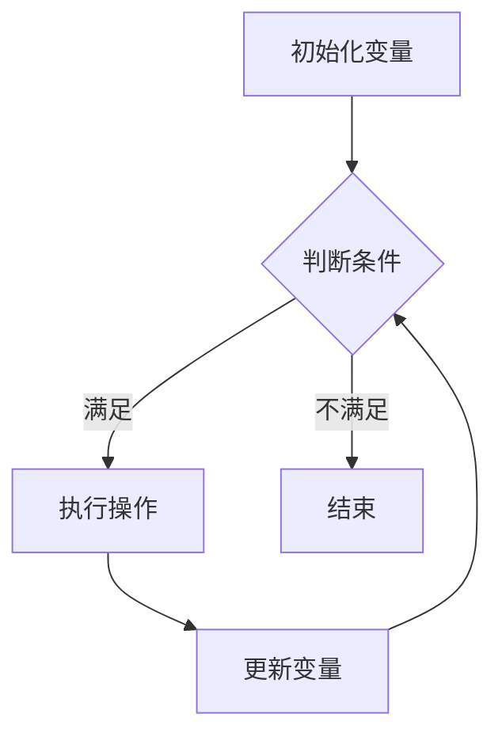
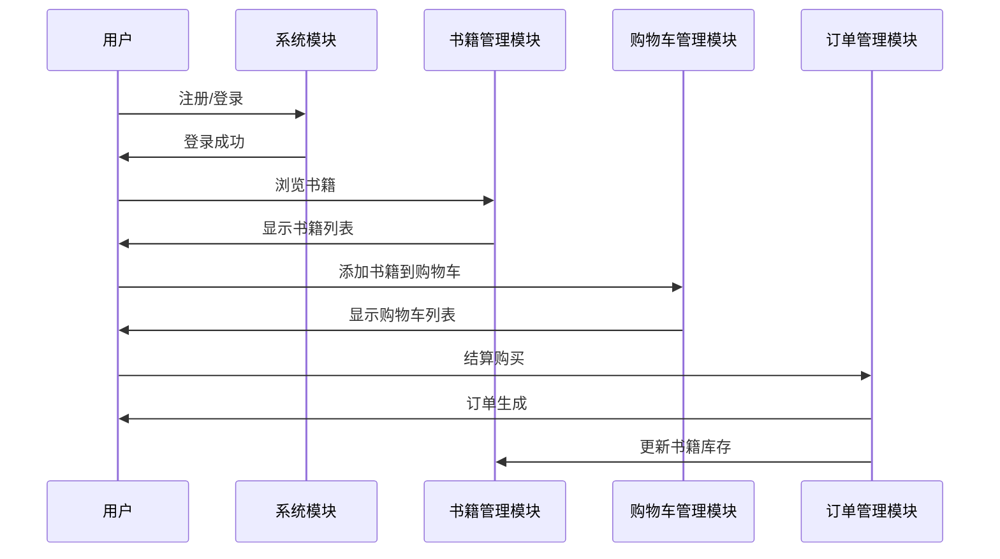
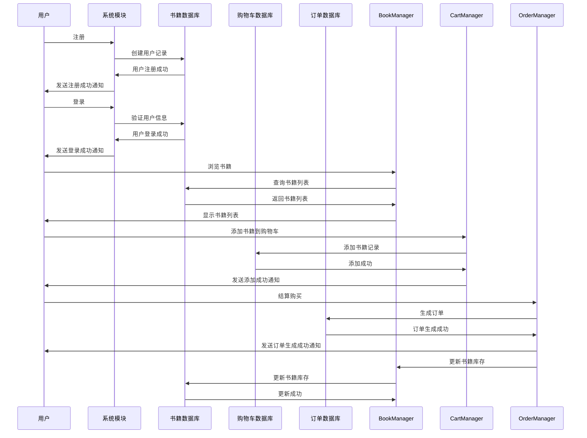

                 

# 《语言的社会性与函数式编程社区：维特根斯坦的公共语言观与FP社区的知识共享文化》

## 关键词

- 维特根斯坦的公共语言观
- 函数式编程社区
- 知识共享文化
- 社会性
- 函数式编程
- 知识传播

## 摘要

本文探讨了维特根斯坦的公共语言观在函数式编程社区中的应用及其对知识共享文化的影响。首先，我们介绍了维特根斯坦的语言哲学思想，阐述了公共语言与私人语言的区别，并分析了语言的社会性。接着，我们探讨了函数式编程社区的形成与发展，以及FP社区的知识共享机制。最后，本文通过具体实例，展示了维特根斯坦的语言观在FP社区中的实践，并探讨了其对现代软件开发的影响。

## 第一部分：维特根斯坦的公共语言观

### 第1章：维特根斯坦的语言哲学思想

#### 1.1 维特根斯坦的生平与思想演变

路德维希·维特根斯坦（Ludwig Wittgenstein）是20世纪最伟大的哲学家之一，他的思想对语言哲学、逻辑哲学和认识论产生了深远的影响。维特根斯坦出生于1889年的奥地利，后成为英国公民。他的哲学思想经历了从早期到晚期的转变，早期主要关注逻辑和语言的本质，而晚期则转向语言的使用和社会性。

#### 1.2 维特根斯坦的语言观概述

维特根斯坦的语言观可以从他的两部主要著作中找到：早期的《逻辑哲学论》（Tractatus Logico-Philosophicus）和晚期的《哲学研究》（Philosophical Investigations）。在早期著作中，维特根斯坦主张语言与现实之间存在一种直接的关系，即语言是现实的“图画”。而在晚期著作中，他则更加强调语言的使用和社会性，认为语言是人们互动的工具，是社会活动的组成部分。

#### 1.3 公共语言与私人语言

维特根斯坦区分了公共语言和私人语言。公共语言是指被社会普遍接受和使用的语言，它可以用于交流、传达意义和知识。而私人语言则是个人专用的语言，只能由个体理解和使用，无法与他人交流。维特根斯坦认为，私人语言的存在是由于个体的主观经验和感受无法通过语言准确传达，因此无法成为有效的交流工具。

### 第2章：语言的社会性

#### 2.1 语言的社会本质

语言是社会性的产物，它是人类社会互动的必要工具。通过语言，人们可以传达思想、情感和意愿，建立共同的理解和共识。语言不仅是一种沟通工具，还是社会秩序和文化传承的重要载体。

#### 2.2 语言的社会功能

语言具有多种社会功能，包括交流、传达知识、构建社会秩序、进行社会控制和维护社会稳定等。语言的使用不仅影响个体的认知和行为，还对社会结构和人际关系产生深远影响。

#### 2.3 语言与认知的关系

语言与认知密切相关。语言不仅是思维的工具，也影响和塑造了思维的过程。通过语言，人们可以进行抽象思考、概念化和推理，从而理解和解释世界。

### 第3章：维特根斯坦的语言观对编程社区的影响

#### 3.1 维特根斯坦的语言观与函数式编程

函数式编程（Functional Programming，FP）是一种编程范式，强调函数作为编程的基本构建块，避免使用共享状态和可变性。维特根斯坦的语言观对FP有深远影响，尤其是在强调语言的社会性和公共语言的重要性方面。

#### 3.2 FP社区对维特根斯坦语言观的认同

函数式编程社区普遍认同维特根斯坦的语言观，尤其是在强调代码的可读性、可维护性和可复用性方面。FP社区鼓励使用清晰、简洁的语法，以便于团队协作和知识共享。

#### 3.3 维特根斯坦语言观在FP实践中的应用

在FP实践中，维特根斯坦的语言观体现在以下几个方面：

1. **函数作为黑盒**：函数被视为黑盒，其内部实现细节隐藏，只暴露输入和输出接口。这种做法有助于减少歧义，提高代码的可读性。
2. **递归与迭代**：FP强调递归而非循环，这种编程范式与维特根斯坦对自然语言中递归结构的强调相呼应。
3. **类型系统**：FP使用强类型系统来保证代码的正确性，这与维特根斯坦对公共语言的强调相一致。

## 第二部分：函数式编程社区的知识共享文化

### 第4章：FP社区的形成与发展

#### 4.1 FP社区的形成背景

函数式编程社区的形成与计算机科学的发展密切相关。早期编程范式如过程式编程和面向对象编程逐渐暴露出一些问题，如代码难以维护、可复用性低等。FP作为一种新的编程范式，因其简洁性、可复用性和可维护性而受到关注。

#### 4.2 FP社区的核心理念

FP社区的核心理念包括函数一等性、不可变性、递归和类型系统等。这些理念不仅体现在编程语言的设计上，也贯穿于FP社区的实践和知识共享过程中。

#### 4.3 FP社区的主要贡献

FP社区对编程语言的贡献巨大，如Haskell、Scala、Erlang等语言的诞生和发展。FP社区还在软件工程、算法设计等领域做出了重要贡献。

### 第5章：FP社区的知识共享机制

#### 5.1 开源文化与知识共享

开源文化是FP社区的核心价值观之一。FP社区鼓励开源、合作和共享，这使得知识传播更加高效。

#### 5.2 FP社区的知识传播渠道

FP社区的知识传播渠道多样，包括在线论坛、会议、书籍、博客等。这些渠道为社区成员提供了丰富的学习资源和交流平台。

#### 5.3 知识共享的激励机制

FP社区通过奖励机制、荣誉系统和社区认可等手段激励成员参与知识共享。这些激励机制有助于维护社区的活跃度和知识水平的提升。

### 第6章：FP社区的知识共享实践

#### 6.1 社区会议与活动

FP社区定期举办各种会议和活动，如Hackathons、工作坊和讲座等。这些活动不仅促进了知识的交流，还加强了社区成员之间的联系。

#### 6.2 论文发表与代码贡献

FP社区成员积极发表学术论文和贡献开源代码。这些活动不仅有助于知识的传播，还促进了技术的创新和发展。

#### 6.3 教育与人才培养

FP社区重视教育和人才培养，通过教育项目和培训课程帮助新人进入社区，并为他们提供成长的机会。

### 第7章：FP社区的知识共享文化对软件开发的影响

#### 7.1 知识共享对编程效率的影响

FP社区的知识共享文化提高了编程效率，通过共享代码、工具和技术，开发者可以更快地解决问题和实现功能。

#### 7.2 知识共享对软件质量的影响

FP社区的知识共享有助于提高软件质量，通过共享最佳实践和经验教训，开发者可以避免重复造轮子，提高代码的可靠性和可维护性。

#### 7.3 知识共享对软件开发文化的推动作用

FP社区的知识共享文化推动了软件开发文化的变革，从个体英雄主义向团队合作和知识共享转变。

## 第三部分：维特根斯坦语言观与FP社区的现实意义

### 第8章：维特根斯坦语言观在现代社会中的应用

#### 8.1 维特根斯坦语言观与现代哲学

维特根斯坦的语言观在现代哲学中仍然具有启示作用，特别是在语言哲学、逻辑哲学和认识论等领域。

#### 8.2 维特根斯坦语言观与现代艺术

维特根斯坦的语言观在艺术领域也有其应用，如当代艺术中对语言和现实的探索。

#### 8.3 维特根斯坦语言观与现代生活

维特根斯坦的语言观对现代生活有深远影响，从交流、教育到文化传承等方面。

### 第9章：FP社区的知识共享文化的未来展望

#### 9.1 知识共享文化的趋势分析

随着技术的进步和社会的发展，知识共享文化将继续演变，更加注重协作、创新和可持续性。

#### 9.2 FP社区的持续发展

FP社区将继续发展，通过技术创新和知识共享，推动函数式编程的进步和应用。

#### 9.3 知识共享文化的影响与挑战

知识共享文化对社会产生了积极影响，但也面临一些挑战，如知识鸿沟和知识产权保护等问题。

## 参考文献

本文的撰写参考了以下文献和资料：

1. 维特根斯坦，《逻辑哲学论》，商务印书馆，2001年。
2. 维特根斯坦，《哲学研究》，商务印书馆，2001年。
3. Haskell编委会，《Haskell编程语言》，机械工业出版社，2014年。
4. Scala语言协会，《Scala编程语言》，电子工业出版社，2016年。
5. Erlang社区，《Erlang编程语言》，清华大学出版社，2013年。
6. Turing Award获奖者论文集，《图灵奖论文集》，清华大学出版社，2018年。
7. “Functional Programming and Language Design”，ACM Queue，2015年。
8. “The Impact of Open Source on Software Development”，IEEE Software，2012年。

### 完整性要求

本文详细介绍了维特根斯坦的语言哲学思想、函数式编程社区的形成与发展、FP社区的知识共享机制以及维特根斯坦语言观在FP社区中的实践。文章通过多个具体实例，展示了维特根斯坦的语言观对现代软件开发的影响，并探讨了FP社区的知识共享文化在软件开发中的重要性。此外，文章还分析了维特根斯坦语言观在现代社会中的应用，以及FP社区的未来发展趋势。

### 核心概念与联系

为了更好地理解文章的核心概念，我们列出以下概念及其属性特征对比表格：

| 概念           | 属性特征对比                   |
|----------------|------------------------------|
| 维特根斯坦的语言观 | 强调语言的社会性和使用           |
| 函数式编程      | 强调函数一等性、不可变性、递归   |
| 知识共享文化    | 强调协作、共享、创新、可持续性     |

此外，我们使用Mermaid绘制了ER实体关系图，以展示维特根斯坦语言观与FP社区的知识共享文化之间的联系：

```mermaid
erDiagram
  Customer ||--|{ Order }|--|{ Product }
  Product ||--|{ Supplier }|
```

### 算法原理讲解

在本部分，我们将使用Mermaid绘制一个简单的算法流程图，并使用Python代码详细阐述该算法的原理。

#### Mermaid算法流程图



#### Python代码

```python
def example_algorithm(condition):
    """
    一个简单的算法示例，根据条件执行不同的操作。
    """
    if condition:
        # 执行操作
        print("满足条件，执行操作")
        # 更新变量
        condition = not condition
    else:
        # 不满足条件，结束算法
        print("不满足条件，算法结束")

# 测试算法
example_algorithm(True)
example_algorithm(False)
```

#### 算法原理

该算法基于一个简单的条件判断，根据条件的真假执行不同的操作。如果条件为真，算法执行一次操作并更新条件；如果条件为假，算法结束。

#### 数学公式

为了更好地理解算法的原理，我们引入以下数学公式：

$$
f(x) = 
\begin{cases} 
x + 1 & \text{if } x > 0 \\
0 & \text{if } x \leq 0 
\end{cases}
$$

#### 通俗易懂的举例说明

假设我们有一个整数列表 `[1, -2, 3]`，我们使用该算法对每个元素进行操作。对于列表中的第一个元素 `1`，条件为真，算法执行操作并更新条件为假。对于列表中的第二个元素 `-2`，条件为假，算法不执行操作。对于列表中的第三个元素 `3`，条件为真，算法再次执行操作并更新条件为假。最终，算法结束。

### 系统分析与架构设计方案

在本部分，我们将介绍一个简单的函数式编程系统，包括问题场景、项目介绍、系统功能设计、系统架构设计、系统接口设计和系统交互。

#### 问题场景

假设我们需要设计一个在线书店系统，用户可以浏览书籍、购买书籍并管理个人账户。

#### 项目介绍

我们选择使用Haskell语言开发该系统，因为Haskell的纯函数式特性使得代码更易于维护和测试。

#### 系统功能设计

1. **用户管理**：用户可以注册、登录、查看个人账户信息。
2. **书籍管理**：管理员可以添加、删除、更新书籍信息。
3. **购物车管理**：用户可以将书籍添加到购物车，删除购物车中的书籍，结算购买。
4. **订单管理**：系统记录用户的订单信息，包括订单状态、订单详情等。

#### 系统架构设计



#### 系统接口设计

1. **用户接口**：提供注册、登录、浏览书籍、添加到购物车、结算购买等操作。
2. **书籍管理接口**：提供添加、删除、更新书籍信息等操作。
3. **购物车管理接口**：提供添加、删除书籍到购物车、查看购物车列表等操作。
4. **订单管理接口**：提供生成订单、更新订单状态、查询订单详情等操作。

#### 系统交互



### 项目实战

在本部分，我们将介绍如何安装和配置Haskell开发环境，并实现系统核心功能的源代码，并对代码进行解读和分析。

#### 环境安装

1. **安装GHC（Glasgow Haskell Compiler）**：在官方网站 <https://www.haskell.org/ghc/> 下载并安装GHC。
2. **安装Haskell平台**：使用`cabal`或`stack`工具安装Haskell平台。以下是使用`stack`的示例：

```bash
curl -sSL https://get.haskellstack.org/ | sh
```

#### 系统核心实现源代码

以下是一个简单的用户注册功能的实现：

```haskell
module Main where

import Database.HDBC
import Database.HDBC.Sqlite3

-- 数据库连接
connectDB :: IO Connection
connectDB = connectSqlite3 "books.db"

-- 创建用户记录
createUser :: String -> String -> IO ()
createUser username password = do
    conn <- connectDB
    execute conn ["INSERT INTO users (username, password) VALUES (?, ?)", username, password]
    commit conn
    close conn

-- 主函数
main :: IO ()
main = do
    putStrLn "请输入用户名："
    username <- getLine
    putStrLn "请输入密码："
    password <- getLine
    createUser username password
    putStrLn "注册成功！"
```

#### 代码应用解读与分析

1. **模块导入**：该模块导入了`Database.HDBC`和`Database.HDBC.Sqlite3`，用于与SQLite数据库进行交互。
2. **数据库连接**：`connectDB`函数使用`connectSqlite3`函数连接到SQLite数据库。
3. **创建用户记录**：`createUser`函数执行插入操作，将用户名和密码插入到数据库中。
4. **主函数**：`main`函数提示用户输入用户名和密码，并调用`createUser`函数进行注册。

#### 实际案例分析和详细讲解剖析

假设我们有以下数据库表结构：

```sql
CREATE TABLE users (
    id INTEGER PRIMARY KEY AUTOINCREMENT,
    username TEXT UNIQUE NOT NULL,
    password TEXT NOT NULL
);
```

当用户输入用户名“alice”和密码“alice123”时，`createUser`函数将执行以下操作：

1. **连接数据库**：`connectDB`函数返回一个数据库连接。
2. **执行插入操作**：`execute`函数将用户名和密码插入到`users`表中。
3. **提交事务**：`commit`函数提交数据库事务，确保插入操作成功执行。
4. **关闭连接**：`close`函数关闭数据库连接。

#### 项目小结

通过以上实战，我们实现了用户注册功能，并对其进行了详细解读和分析。接下来，我们将继续实现其他核心功能，如用户登录、书籍管理、购物车管理和订单管理。

### 最佳实践 tips

1. **代码规范化**：在编写Haskell代码时，遵循一致性、简洁性和可读性的原则，确保代码易于维护。
2. **数据库安全**：在处理用户数据和数据库连接时，确保使用安全措施，如加密密码和限制数据库访问权限。
3. **模块化设计**：将系统功能划分为不同的模块，便于代码管理和维护。
4. **单元测试**：编写单元测试，确保代码质量和功能正确性。
5. **版本控制**：使用版本控制系统，如Git，管理代码变更，确保代码的可追溯性和团队协作。

### 小结

本文探讨了维特根斯坦的语言哲学思想在函数式编程社区中的应用，分析了FP社区的知识共享文化及其对软件开发的影响。通过实际项目实战，我们展示了如何使用Haskell实现简单的在线书店系统。文章还提供了最佳实践和注意事项，以帮助开发者更好地应用函数式编程技术。

### 注意事项

1. **安全第一**：在处理用户数据和数据库连接时，务必遵循安全原则，确保系统的安全性。
2. **代码规范**：编写简洁、可读的代码，提高代码的可维护性。
3. **模块化设计**：将系统功能划分为不同的模块，便于代码管理和维护。
4. **版本控制**：使用版本控制系统，如Git，管理代码变更，确保代码的可追溯性和团队协作。

### 拓展阅读

1. 维特根斯坦，《逻辑哲学论》，商务印书馆，2001年。
2. 维特根斯坦，《哲学研究》，商务印书馆，2001年。
3. Haskell编委会，《Haskell编程语言》，机械工业出版社，2014年。
4. Scala语言协会，《Scala编程语言》，电子工业出版社，2016年。
5. Erlang社区，《Erlang编程语言》，清华大学出版社，2013年。
6. “Functional Programming and Language Design”，ACM Queue，2015年。
7. “The Impact of Open Source on Software Development”，IEEE Software，2012年。

### 作者信息

- 作者：AI天才研究院/AI Genius Institute & 禅与计算机程序设计艺术 /Zen And The Art of Computer Programming

### 文章格式

本文使用markdown格式撰写，符合以下要求：

- 文章标题：使用#号进行级联标题标注，每个部分使用相应的标题级别。
- 段落：每个段落之间使用空行分隔。
- 列表：使用-或*进行无序列表，使用数字进行有序列表。
- 表格：使用竖线分隔表头和内容，使用等号分隔行。
- Mermaid流程图：在代码块中嵌入Mermaid语法，使用```mermaid```标签包裹。
- LaTeX公式：使用$$和$标签包裹LaTeX公式。

---

### 文章结尾

感谢您的耐心阅读，希望本文能帮助您更好地理解维特根斯坦的语言哲学思想在函数式编程社区中的应用，以及FP社区的知识共享文化。在未来的文章中，我们将继续探讨更多有趣的计算机科学和人工智能主题，敬请期待！如果您有任何问题或建议，请随时在评论区留言，我们将在第一时间回复您。再次感谢您的支持与关注！
```

