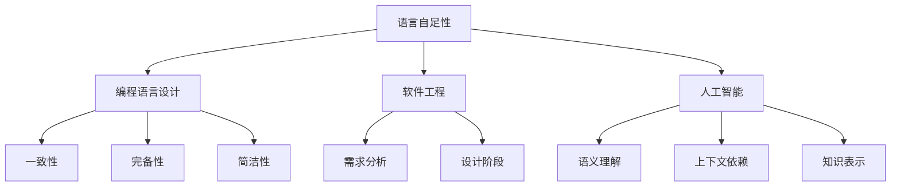
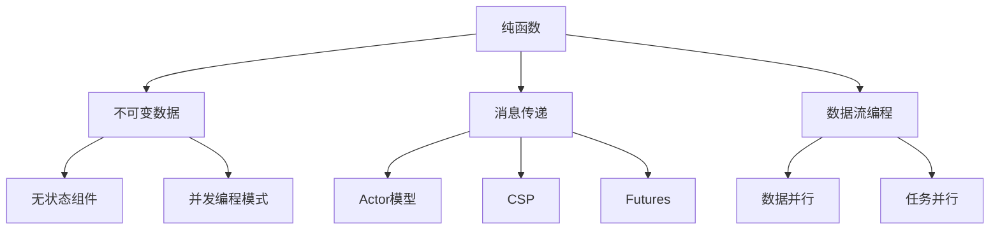

                 

### 《语言的自足性与函数式并发：维特根斯坦的语言观与FP的并发编程模型》

关键词：维特根斯坦、语言自足性、函数式编程、并发编程、编程模型

摘要：本文将探讨维特根斯坦的语言观与函数式编程（FP）的并发编程模型之间的关系。首先，我们将回顾维特根斯坦的语言哲学，特别是他的语言自足性观念，并探讨这一观念在计算机科学中的应用。接着，我们将介绍函数式编程的基础知识，包括其核心概念、语言特性和优势与挑战。然后，我们将深入讨论并发编程的基本概念、挑战和函数式并发编程的方法。最后，我们将探讨FP并发编程在实际开发中的应用和未来发展趋势，并提出结论与展望。

#### 第一部分：维特根斯坦的语言观

##### 第1章：维特根斯坦的语言观概述

**1.1 维特根斯坦的语言哲学思想**

维特根斯坦（Ludwig Wittgenstein）是20世纪最具影响力的哲学家之一，他的语言哲学对后世产生了深远的影响。他的思想主要分为两个时期，早期以《逻辑哲学论》（Tractatus Logico-Philosophicus）为代表，晚期则以《哲学研究》（Philosophical Investigations）为代表。

在早期哲学中，维特根斯坦提出了“语言游戏”（language game）的概念，认为语言的使用与游戏类似，都是一系列规则的实践。他强调语言的“图像理论”（image theory），即语言与现实世界之间的对应关系，但这一理论最终被他自己在晚期作品中否定。

在晚期哲学中，维特根斯坦转向日常语言哲学，认为语言的意义不是固定的，而是取决于特定的语言游戏和情境。他的核心观点是，语言是行动的一部分，意义源于使用。

**1.1.1 维特根斯坦的语言哲学观**

维特根斯坦的语言哲学观主要包括以下几个方面：

1. **语言与实在的关系**：他认为语言与现实世界的关系并非简单对应，而是更为复杂。语言不能直接反映现实，而是通过我们如何使用语言来理解现实。

2. **命题与真理**：他提出了“命题为真，当且仅当情况与之相符”的观点，但同时也指出，我们不能通过观察来验证命题的真假，因为我们的观察本身就是语言活动的一部分。

3. **语言游戏与生活形式**：他认为语言的使用是多样化的，每种语言游戏都有其独特的规则和目的。语言游戏不仅包括日常对话，还包括科学、艺术等各种形式。

**1.1.2 维特根斯坦与语言自足性**

维特根斯坦提出了“语言自足性”（language self-sufficiency）的概念，认为语言是独立的，它不需要借助外部实体来解释其意义。他强调，语言的规则和语法是我们理解世界的方式，而不是世界的真实反映。

语言自足性的观念对计算机科学有着深远的影响，尤其是在编程语言设计和软件工程中。编程语言本身就是一种形式化的语言，它的语法和语义都是自足的。维特根斯坦的思想启示我们，编程语言的设计应该关注其内在的一致性和完备性，而不是过分追求与现实世界的完美映射。

**1.1.3 维特根斯坦语言观的历史背景**

维特根斯坦的语言哲学观是在特定的历史背景下产生的。20世纪初，逻辑实证主义（Logical Empiricism）盛行，它强调科学方法的重要性，认为只有通过经验验证的命题才有意义。维特根斯坦在这场哲学争论中提出了不同的观点，他认为语言和现实之间的关系更为复杂，不能简单地归结为经验验证。

此外，维特根斯坦的语言哲学也受到了数学基础研究的影响。他在早期研究中探讨了逻辑和数学的关系，这些研究为他后来的语言哲学奠定了基础。

**1.2 语言与实在的关系**

在维特根斯坦的哲学中，语言与实在的关系是一个核心问题。他认为，语言不能直接反映现实，而是通过我们如何使用语言来理解现实。

1. **名词与实体**：维特根斯坦认为，名词并不是直接指代现实世界的实体，而是我们在特定情境下用来指称实体的符号。名词的意义取决于我们在特定语言游戏中的使用。

2. **命题与真理**：维特根斯坦提出了“命题为真，当且仅当情况与之相符”的观点，但同时也指出，我们不能通过观察来验证命题的真假，因为我们的观察本身就是语言活动的一部分。这意味着，真理不是客观存在的，而是由语言活动的规则决定的。

3. **语言游戏与生活形式**：维特根斯坦认为，语言的使用是多样化的，每种语言游戏都有其独特的规则和目的。语言游戏不仅包括日常对话，还包括科学、艺术等各种形式。生活形式（forms of life）是维特根斯坦用来描述人们如何使用语言和行动来构建现实世界的概念。

**1.3 维特根斯坦的语言观在计算机科学中的应用**

维特根斯坦的语言观在计算机科学中有着广泛的应用，特别是在编程语言设计和软件工程领域。

1. **编程语言设计**：维特根斯坦的语言自足性观念启示编程语言设计师，要关注语言的内在一致性和完备性，而不是过分追求与现实世界的完美映射。这有助于设计出更加简洁、高效和易于理解的编程语言。

2. **软件工程**：维特根斯坦的语言观也影响了软件工程的方法和原则。例如，在需求分析和设计阶段，工程师应该关注系统的本质特征，而不是过分追求具体实现。这有助于提高软件的可维护性和可扩展性。

3. **人工智能**：维特根斯坦的语言观对人工智能的发展也有重要启示。例如，在自然语言处理（NLP）领域，研究者需要关注语言的本质特征，而不是简单地模拟人类语言能力。这有助于开发出更加智能、灵活的AI系统。

**1.3.1 语言自足性与编程语言设计**

在编程语言设计中，语言自足性是一个关键原则。这意味着，编程语言的设计应该关注其内在的一致性和完备性，而不是过分追求与现实世界的映射。具体来说，这包括以下几个方面：

1. **一致性**：编程语言应该具有内在一致性，避免出现语义冲突或不一致的情况。这有助于提高代码的可读性和可维护性。

2. **完备性**：编程语言应该提供足够的功能和特性，以满足各种编程需求。这有助于提高编程效率和质量。

3. **简洁性**：编程语言应该尽可能简洁，避免不必要的复杂性和冗余。这有助于提高开发效率和学习成本。

**1.3.2 语言观与软件工程**

维特根斯坦的语言观在软件工程中也有重要应用。例如，在需求分析和设计阶段，工程师应该关注系统的本质特征，而不是过分追求具体实现。这有助于提高软件的可维护性和可扩展性。

1. **需求分析**：在需求分析阶段，工程师需要与用户和利益相关者进行沟通，了解他们的需求和期望。维特根斯坦的语言观提醒我们，要关注语言的使用情境和目标，避免出现误解和歧义。

2. **设计阶段**：在设计阶段，工程师需要制定系统的架构和设计原则。维特根斯坦的语言观启示我们，要关注系统的本质特征，而不是过分追求具体实现。这有助于提高系统的可维护性和可扩展性。

**1.3.3 语言观与人工智能**

维特根斯坦的语言观对人工智能的发展也有重要启示。例如，在自然语言处理（NLP）领域，研究者需要关注语言的本质特征，而不是简单地模拟人类语言能力。这有助于开发出更加智能、灵活的AI系统。

1. **语义理解**：维特根斯坦认为，语义理解不仅仅是对单词和句子的表面理解，而是对语言使用情境的理解。这启示NLP研究者，要关注语义理解的深度和广度，提高系统的智能水平。

2. **上下文依赖**：维特根斯坦强调，语言的意义取决于上下文。这启示NLP研究者，要考虑上下文因素，提高系统的上下文理解能力。

3. **知识表示**：维特根斯坦认为，语言不仅仅是表达思想的工具，也是构建现实世界的方式。这启示AI研究者，要关注知识表示和推理，提高系统的智能水平。

#### 第二部分：函数式编程基础

##### 第2章：函数式编程基础

**2.1 函数式编程的概念**

函数式编程（Functional Programming，简称FP）是一种编程范式，强调以函数为中心，将计算视为表达式的求值过程，而不是指令的执行过程。FP的核心思想包括纯函数（pure functions）、不可变数据（immutability）、递归（recursion）和高阶函数（higher-order functions）等。

**2.1.1 函数作为第一公民**

在函数式编程中，函数被视为一等公民，可以像普通值一样传递、存储和返回。这意味着函数可以作为参数传递给其他函数，也可以作为返回值从函数中返回。

**2.1.2 高阶函数**

高阶函数是一种能够接受函数作为参数或返回函数的函数。这为函数的组合和抽象提供了强大的工具，有助于简化代码和提高复用性。

**2.1.3 函数组合**

函数组合是将多个函数组合成一个新的函数的过程。通过函数组合，我们可以将复杂的计算拆分成多个简单函数的组合，从而提高代码的可读性和可维护性。

**2.2 函数式编程语言**

常见的函数式编程语言包括Haskell、Scala和Clojure等。这些语言都支持纯函数、不可变数据、递归和高阶函数等FP特性。

**2.2.1 Haskell**

Haskell是一种纯函数式编程语言，以其强类型系统和惰性求值而闻名。Haskell的设计哲学强调简洁性、表达力和安全性。

**2.2.2 Scala**

Scala是一种多范式编程语言，融合了面向对象和函数式编程的特性。Scala在Java虚拟机（JVM）上运行，因此可以与Java代码无缝集成。

**2.2.3 Clojure**

Clojure是一种现代的函数式编程语言，运行在Java虚拟机上。Clojure的设计哲学强调简洁性、表达力和灵活性。

**2.3 函数式编程的优势与挑战**

函数式编程具有许多优势，但也面临一些挑战。

**2.3.1 优势**

1. **简化状态管理**：函数式编程通过不可变数据和纯函数，简化了状态管理，降低了程序出错的概率。

2. **提高代码可复用性**：函数组合和高阶函数使得代码更易于复用和重构。

3. **易于测试和调试**：由于函数式编程的纯函数特性，测试和调试变得更加简单和直观。

**2.3.2 挑战**

1. **学习曲线**：函数式编程需要掌握一些新的概念和范式，对于初学者来说可能会比较困难。

2. **性能考虑**：在某些情况下，函数式编程可能不如命令式编程（imperative programming）高效。因此，需要权衡性能和可读性之间的关系。

##### 第3章：并发编程与并行计算

**3.1 并发编程的基本概念**

并发编程（Concurrent Programming）是指编写同时执行多个任务的程序。这与并行计算（Parallel Computing）不同，并行计算是指使用多个处理器或计算资源同时执行多个任务。

**3.1.1 并发与并行**

并发（Concurrency）是指程序中多个任务似乎同时执行。并行（Parallelism）是指多个任务在同一时刻执行。在实际应用中，并发和并行往往交织在一起。

**3.1.2 同步与异步**

同步（Synchronization）是指程序中的任务按照特定顺序执行，一个任务完成后才能开始下一个任务。异步（Asynchronous）是指任务可以独立执行，不需要等待其他任务完成。

**3.1.3 临界区与线程安全**

临界区（Critical Section）是指程序中需要同步访问共享资源的部分。线程安全（Thread Safety）是指程序在多线程环境中能够正确运行，不会出现数据竞争或死锁等问题。

**3.2 并发编程的挑战**

并发编程面临许多挑战，包括数据竞争、死锁、饥饿和活锁等。

**3.2.1 数据竞争**

数据竞争（Data Race）是指两个或多个线程同时访问同一共享变量，且至少有一个线程是写入操作。这可能导致程序运行结果不确定。

**3.2.2 死锁**

死锁（Deadlock）是指两个或多个线程在等待对方释放资源时陷入无限等待的状态。这会导致程序停止运行。

**3.2.3 活锁与饥饿**

活锁（Live Lock）是指线程在执行过程中反复进入等待状态，但不会被阻塞。饥饿（Starvation）是指线程在执行过程中无法获得所需资源，导致长时间无法执行。

**3.3 函数式并发编程**

函数式并发编程（Functional Concurrent Programming）是一种利用函数式编程的特性来编写并发程序的方法。它主要依赖于纯函数、不可变数据和消息传递。

**3.3.1 无状态与不可变数据**

无状态（Statelessness）是指程序或组件不依赖于外部状态，每次执行结果相同。不可变数据（Immutability）是指数据一旦创建，就不能修改。这两种特性有助于避免并发问题。

**3.3.2 消息传递与数据流编程**

消息传递（Message Passing）是一种通信机制，允许程序中的组件通过发送和接收消息来交换数据。数据流编程（Data-Flow Programming）是一种基于数据的流动来组织程序的方法，有助于简化并发编程。

**3.3.3 并发编程模式**

函数式并发编程采用了一些特定的编程模式，如Actor模型、CSP（Communicating Sequential Processes）和Futures等。这些模式有助于提高并发程序的可靠性和可维护性。

##### 第4章：FP与并发编程的融合

**4.1 函数式编程与并发编程的结合**

函数式编程（FP）与并发编程的结合为编写高效、可靠的并发程序提供了新的思路。FP的特性，如纯函数、不可变数据和消息传递，与并发编程的需求相契合。

**4.1.1 并发编程中的纯函数**

纯函数（Pure Function）是一种没有副作用、返回值相同的函数。在并发编程中，纯函数有助于避免数据竞争和死锁等问题，提高程序的可靠性。

**4.1.2 函数式编程在并发编程中的应用**

函数式编程在并发编程中的应用主要体现在以下几个方面：

1. **无状态组件**：通过无状态组件，可以避免状态共享和同步问题，提高并发程序的可维护性。

2. **不可变数据**：不可变数据减少了数据竞争的可能性，简化了并发控制。

3. **消息传递**：消息传递是一种天然支持并发通信的机制，有助于简化并发编程。

**4.2 FP的并发编程模型**

函数式编程的并发编程模型主要包括Actor模型、CSP和Futures等。

**4.2.1 软件并发模型**

软件并发模型（Software Concurrent Model）是一种基于共享内存和消息传递的并发编程方法。它包括线程、锁、条件变量等同步机制。

**4.2.2 数据并行与任务并行**

数据并行（Data Parallelism）是指将任务分解成多个独立的部分，并在多个处理器上同时执行。任务并行（Task Parallelism）是指将任务分配给多个处理器，每个处理器独立执行。

**4.3 并发编程案例分析**

以下是一个简单的并发编程案例分析，使用Python的并发编程库（`concurrent.futures`）来实现一个计算斐波那契数列的并发程序。

```python
import concurrent.futures

def fibonacci(n):
    if n <= 1:
        return n
    else:
        return fibonacci(n-1) + fibonacci(n-2)

if __name__ == '__main__':
    with concurrent.futures.ThreadPoolExecutor() as executor:
        results = list(executor.map(fibonacci, range(10)))
        print(results)
```

在这个例子中，我们使用线程池（`ThreadPoolExecutor`）来并发计算斐波那契数列的前10个值。这个程序可以有效地利用多核处理器的计算能力，提高执行效率。

**4.3.1 并发编程的实践应用**

并发编程在许多领域都有实践应用，如：

1. **Web服务器**：并发编程可以提高Web服务器的响应速度和并发处理能力，处理大量并发请求。

2. **大数据处理**：并发编程可以加速大数据处理，如分布式计算框架（如Hadoop、Spark）广泛使用并发编程技术。

3. **实时系统**：并发编程可以提高实时系统的响应速度和稳定性，如股票交易系统、自动驾驶系统等。

**4.3.2 并发编程的挑战与解决**

并发编程面临许多挑战，如数据竞争、死锁和性能问题等。以下是一些常见的解决方法：

1. **锁机制**：使用锁（如互斥锁、读写锁）来控制对共享资源的访问，避免数据竞争。

2. **无锁编程**：通过设计无锁数据结构和算法，避免锁机制带来的性能开销。

3. **消息队列**：使用消息队列（如RabbitMQ、Kafka）来实现异步通信，降低并发冲突。

4. **并行算法**：使用并行算法（如分治算法、流水线算法）来提高并行执行效率。

**4.4 并发编程的展望**

随着硬件技术的发展，多核处理器和分布式计算变得越来越普遍，并发编程的重要性也越来越凸显。未来，并发编程将继续发展，涌现出更多高效、可靠的编程模型和工具。

1. **并行算法与并行编程**：研究者将继续探索并行算法，提高并行执行效率。

2. **分布式系统与云计算**：分布式系统和云计算为并发编程提供了更广阔的应用场景，研究者将开发更多适用于分布式系统的并发编程工具和模型。

3. **内存管理和并发控制**：内存管理和并发控制是并发编程的关键问题，研究者将继续优化内存管理和并发控制机制，提高系统的性能和稳定性。

##### 第5章：FP并发编程在实际开发中的应用

**5.1 并发编程在企业应用中的实践**

并发编程在企业应用中有着广泛的应用，以下是一些实际案例：

1. **Web服务器**：并发编程可以提高Web服务器的并发处理能力，处理大量并发请求，提高用户体验。

2. **大数据处理**：并发编程可以加速大数据处理，如分布式计算框架（如Hadoop、Spark）广泛使用并发编程技术。

3. **实时系统**：并发编程可以提高实时系统的响应速度和稳定性，如股票交易系统、自动驾驶系统等。

**5.2 函数式编程在并发编程中的优势**

函数式编程在并发编程中具有以下优势：

1. **简化状态管理**：函数式编程通过不可变数据和纯函数，简化了状态管理，降低了程序出错的概率。

2. **提高代码可复用性**：函数组合和高阶函数使得代码更易于复用和重构。

3. **易于测试和调试**：由于函数式编程的纯函数特性，测试和调试变得更加简单和直观。

**5.3 函数式并发编程的优势**

函数式并发编程具有以下优势：

1. **提高并发编程的可读性和可维护性**：纯函数和不可变数据使得并发程序的逻辑更清晰，易于理解和维护。

2. **减少并发冲突**：通过消息传递和数据流编程，函数式并发编程可以减少并发冲突，提高程序的正确性和稳定性。

3. **提高并发执行效率**：函数式并发编程利用纯函数和不可变数据，可以更好地利用多核处理器的计算能力，提高并发执行效率。

##### 第6章：FP并发编程的未来发展趋势

**6.1 函数式编程的发展趋势**

未来，函数式编程将继续发展，以下是一些趋势：

1. **更丰富的函数式编程语言特性**：新函数式编程语言将引入更多特性，如异步函数、模式匹配等，提高编程效率和可读性。

2. **函数式编程与量子计算的融合**：随着量子计算的发展，函数式编程将可能为量子计算提供新的编程范式。

3. **函数式编程在教育中的普及**：函数式编程将在计算机科学教育中发挥更大的作用，提高学生的编程能力和思维能力。

**6.2 并发编程的未来方向**

未来，并发编程将继续发展，以下是一些方向：

1. **更高效的并发模型**：研究者将探索更高效的并发模型，提高并发程序的执行效率。

2. **并行计算的新技术**：随着硬件技术的发展，并行计算的新技术（如GPU、FPGA）将为并发编程提供更多可能性。

3. **并发编程的教育与普及**：随着并发编程的重要性日益凸显，并发编程将在计算机科学教育中发挥更大的作用，提高从业者的编程能力和思维能力。

##### 第7章：结论与展望

**7.1 语言的自足性与计算机科学**

维特根斯坦的语言自足性观念为计算机科学提供了重要的启示。编程语言的设计和软件工程方法都应该关注语言的内在一致性和完备性，而不是过分追求与现实世界的映射。

**7.2 FP并发编程的意义**

函数式编程与并发编程的结合为编写高效、可靠的并发程序提供了新的思路。未来，FP并发编程将继续发展，为计算机科学和软件工程带来更多创新和进步。

**7.3 未来发展方向**

未来，计算机科学和软件工程领域将继续发展，FP并发编程将成为重要的研究方向。研究者将继续探索新的编程范式和工具，提高编程效率和系统性能。

### 附录

**A.1 参考文献**

1. 维特根斯坦，《逻辑哲学论》
2. 维特根斯坦，《哲学研究》
3. Haskell语言规范
4. Scala语言规范
5. Clojure语言规范
6. 阿兰·科恩，《并发编程：设计原则与模式》
7. 康斯坦丁·扎伊采夫，《函数式编程实战》

**A.2 术语解释**

1. **语言游戏**：维特根斯坦提出的概念，指语言的使用情境和规则。
2. **纯函数**：没有副作用、返回值相同的函数。
3. **不可变数据**：一旦创建就不能修改的数据。
4. **并发编程**：编写同时执行多个任务的程序。
5. **并行计算**：使用多个处理器或计算资源同时执行多个任务。

**A.3 Mermaid 流程图**

**图A.1 语言自足性与计算机科学的关系**



**图A.2 函数式并发编程模型**



