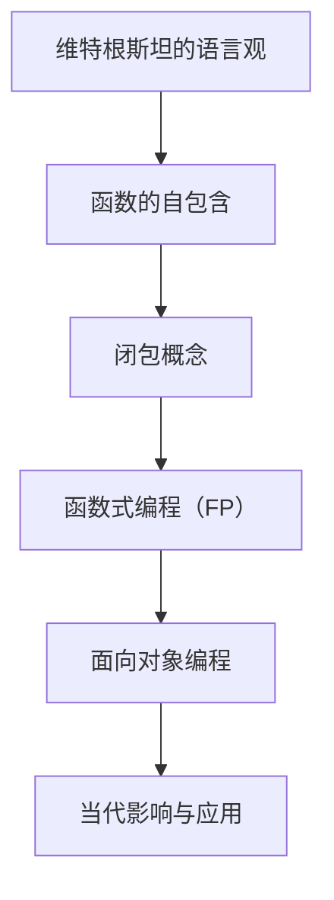
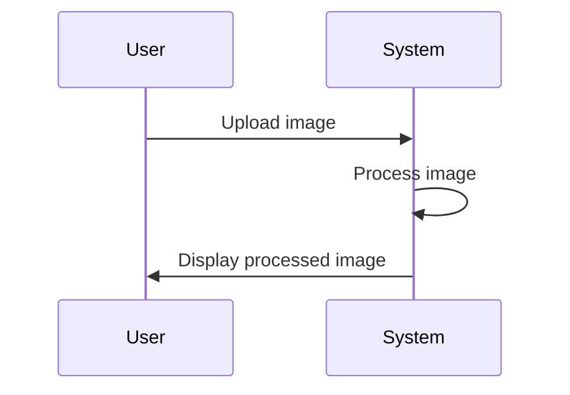

                 

# 《语言的自足性与函数的自包含：维特根斯坦的语言观与FP中的闭包概念》

## 摘要

本文旨在探讨维特根斯坦的语言观与函数式编程（FP）中的闭包概念之间的联系。通过对维特根斯坦的语言游戏理论和日常语言哲学的深入分析，我们能够更好地理解语言的内在逻辑结构和自足性。同时，我们将探讨闭包这一函数式编程的核心概念，以及它在FP语言中的应用和重要性。通过对比维特根斯坦的语言观与闭包概念，本文揭示了二者在处理抽象与具体、表达与理解方面的共通之处，为读者提供了对编程语言和哲学思想的全新理解。

### 维特根斯坦的生平与哲学发展

路德维希·维特根斯坦（Ludwig Wittgenstein，1889-1951）是20世纪最具影响力的哲学家之一，他对语言、数学、逻辑和哲学等领域产生了深远的影响。维特根斯坦生于奥匈帝国的维也纳，其家族背景极为显赫。他的父亲卡尔·维特根斯坦是一位成功的商人，而他的叔叔弗里德里希·卡内基则是美国钢铁工业的奠基人。

维特根斯坦的哲学生涯可以分为两个主要阶段：早期的逻辑原子主义和晚期的日常语言哲学。

在早期的逻辑原子主义阶段，维特根斯坦提出了他的第一部重要著作《逻辑哲学论》（"Tractatus Logico-Philosophicus"）。这部著作于1921年首次出版，主要探讨逻辑、语言和现实之间的关系。维特根斯坦在书中提出了“逻辑原子”的概念，认为世界由一系列不可再分的原子事实组成，这些事实可以通过逻辑表达式精确地描述。他强调，语言的目的是描述世界的这些基本事实，并通过逻辑结构来表达。

然而，随着时间的推移，维特根斯坦开始对早期的逻辑原子主义理论感到不满。他意识到，这种理论过于抽象，无法涵盖人类日常语言中的复杂性和模糊性。于是，他进入了日常语言哲学阶段，并撰写了他的第二部重要著作《哲学研究》（"Philosophical Investigations"）。这部著作于1953年首次出版，是对早期理论的全面批判和深化。在《哲学研究》中，维特根斯坦提出了“语言游戏”理论，强调语言是一种行动系统，其意义取决于使用者和情境。他提出，理解语言的关键在于理解使用语言的方式，即语言游戏。

维特根斯坦的哲学思想对后来的哲学、逻辑和语言学产生了深远的影响。他的理论挑战了传统的形而上学和语言分析方式，提出了新的思考方向。尽管他的思想有时难以捉摸，但它们为后来的哲学家和学者提供了丰富的讨论素材。维特根斯坦去世后，他的思想继续影响着学术界，成为20世纪哲学的重要组成部分。

### 语言的功能与局限

语言是人类最重要的工具之一，它不仅用于沟通和交流，还用于思考、表达和创造。然而，语言既有其功能，也有其局限。理解语言的功能和局限对于我们深入探讨维特根斯坦的语言观至关重要。

语言的功能首先体现在其作为思想的媒介。人类通过语言来组织思想，使其更加清晰和有条理。语言使我们能够将内心的想法转化为可以与他人交流的信息。例如，当我们思考某个问题时，我们会用语言来表述我们的想法，并通过语言与他人进行讨论，从而加深对问题的理解。语言也使我们能够存储和传递知识，使得人类文明得以延续和发展。

然而，语言也有其局限。首先，语言的表达能力是有限的。尽管我们可以用语言来表达各种各样的概念和情感，但有些概念和情感可能无法精确地用语言来描述。例如，美、爱、恐惧等抽象概念往往难以用简单的词汇来表达。其次，语言具有模糊性和歧义性。由于语言的多样性，同样的词语在不同的语境中可能有不同的含义。例如，"行"可以表示走路，也可以表示同意；"好"可以表示优秀，也可以表示良好。这些模糊性和歧义性使得语言交流变得复杂，有时甚至会导致误解和冲突。

为了更好地理解语言的功能和局限，维特根斯坦提出了他的语言游戏理论。他认为，语言的使用是一个动态的过程，不同的语言游戏对应于不同的情境和目的。每个语言游戏都有其特定的规则和目的，这些规则和目的决定了语言的使用方式。例如，数学语言游戏强调逻辑和精确性，而日常语言游戏则强调实用和交流。通过理解不同的语言游戏，我们可以更好地理解语言的功能和局限，并在实际应用中发挥其最大的作用。

### 形式逻辑与实质逻辑

在探讨维特根斯坦的语言观时，我们不可避免地会涉及到逻辑。逻辑是哲学的核心概念之一，它帮助我们从概念和命题中推导出结论。逻辑可以分为形式逻辑和实质逻辑，两者在处理问题和表达思想时有不同的方法。

形式逻辑，也称为符号逻辑，是一种基于符号和规则来推导命题的方法。它强调逻辑结构的严谨性和普遍性。形式逻辑使用符号和公式来表达命题，通过逻辑运算符（如“与”、“或”、“非”）来组合这些命题。形式逻辑的目的是确定一个命题是否逻辑上成立，而不关心命题的具体内容。例如，形式逻辑可以证明两个命题的合取（“与”）在其中一个命题为假时必然为假。

实质逻辑，也称为自然逻辑或日常逻辑，则更加关注命题的内容和意义。实质逻辑使用自然语言来表达命题，并通过推理规则来推导结论。实质逻辑不仅考虑命题的逻辑结构，还考虑命题的真值和实际意义。例如，在实质逻辑中，我们可以通过观察事实和经验来验证一个命题的真实性。

维特根斯坦在《逻辑哲学论》中主要采用了形式逻辑的方法。他认为，通过形式逻辑，我们可以构建一个逻辑上自洽的世界模型，这个模型可以用来描述现实世界的部分结构。然而，维特根斯坦在《哲学研究》中开始批评形式逻辑的局限性。他意识到，形式逻辑过于抽象，无法捕捉人类日常语言中的复杂性和模糊性。维特根斯坦提出了他的日常语言哲学，主张通过理解语言游戏和实际情境来理解语言和逻辑。

形式逻辑和实质逻辑在处理问题和表达思想时有各自的优势和局限。形式逻辑适用于处理高度抽象的问题，它能够确保逻辑推理的严谨性和普遍性。然而，形式逻辑无法处理现实世界中的具体问题和复杂性。实质逻辑则更加贴近人类日常思维，它能够更好地处理具体情境和实际问题。然而，实质逻辑的推理过程往往依赖于具体的经验和直觉，这可能导致推理的不一致和错误。

通过对比形式逻辑和实质逻辑，我们可以更好地理解维特根斯坦的语言观。维特根斯坦认为，语言和逻辑应该服务于实际生活和思考，而不是追求抽象和形式上的完美。他的语言游戏理论强调了语言的实际使用和情境，为我们提供了理解语言和逻辑的新视角。

### 闭包的概念与特性

闭包是函数式编程（FP）中的一个核心概念，它涉及函数和其环境之间的关系。闭包的定义较为抽象，但理解其基本原理对深入探讨FP至关重要。

闭包可以简单定义为：一个函数及其引用的环境一起构成一个闭包。这个函数在闭包中可以访问并使用定义在其环境中的变量。换句话说，闭包是一个封装了环境与函数的复合体，使得函数在任意环境中都能保持其行为一致。

闭包的特性主要有以下几点：

1. **环境封装**：闭包将函数与其环境封装在一起，使得函数可以独立于其定义时的环境运行。这种封装性保证了函数的纯度和可复用性。

2. **延迟求值**：闭包通常与延迟求值（惰性求值）紧密相关。在闭包中，函数的参数不会立即求值，而是直到函数被调用时才会求值。这种延迟求值机制提高了程序的效率和灵活性。

3. **闭包捕获**：闭包能够捕获其定义时所在环境中的变量。这意味着，即使环境变化，闭包仍然可以访问并使用这些变量。这种捕获机制使得闭包能够实现动态绑定，提高了程序的动态性。

闭包在函数式编程中的应用非常广泛。以下是一些常见的应用场景：

1. **高阶函数**：高阶函数是能够接受其他函数作为参数或返回函数的函数。闭包是实现高阶函数的关键。通过闭包，我们可以创建一个函数，这个函数可以记住其创建时的环境，并在需要时访问这些环境变量。

2. **柯里化（Currying）**：柯里化是一种将多个参数的函数转换为一个嵌套函数的过程。闭包在柯里化中起着核心作用，它允许我们逐步传递参数，并在每次传递时保留已传递参数的状态。

3. **回调函数**：在事件驱动的编程中，回调函数是一个重要的概念。闭包使得我们能够创建一个函数，这个函数可以在事件发生时被调用，并且可以访问事件发生时的环境。

4. **惰性求值**：闭包与惰性求值紧密相关，它使得我们可以在需要时才计算值，从而提高程序的效率和性能。

通过理解闭包的概念和特性，我们可以更好地理解函数式编程的核心思想，并在实际编程中充分利用闭闭提供的能力。

### 函数式编程（FP）概述

函数式编程（Functional Programming，简称FP）是一种编程范式，其核心思想是使用函数作为程序的基本构建块，而不是使用诸如变量和状态这样的概念。FP强调函数的一等公民地位，即函数可以像任何其他数据类型一样传递、存储和返回。此外，FP强调无状态性和纯函数，这些特性使得FP程序更易于理解和测试。

FP的基本原则可以概括为以下几点：

1. **函数的一等公民**：在FP中，函数被视为第一类对象，可以像其他数据类型（如整数、字符串）一样进行传递、存储和返回。这意味着函数可以作为参数传递给其他函数，或者从函数中返回。这种灵活性使得FP程序具有更高的模块化和复用性。

2. **无状态性**：FP强调无状态性，即函数不依赖于外部状态。这意味着函数在每次调用时都独立运行，不会受到之前调用结果的影响。无状态性使得FP程序更易于理解和测试，因为函数的行为不会因外部因素而改变。

3. **纯函数**：FP中的纯函数是一种无副作用且恒定的函数。纯函数的输出仅依赖于其输入，不依赖于外部状态，也不会修改外部状态。这使得纯函数的可预测性更强，易于测试和并行化。

4. **惰性求值**：FP中的惰性求值是一种延迟计算的方法，即函数的参数不会立即求值，而是直到需要时才求值。惰性求值提高了程序的效率和灵活性，因为它可以避免不必要的计算。

FP在编程语言中有多种实现。以下是一些流行的FP语言及其特点：

1. **Haskell**：Haskell是一种纯函数式编程语言，具有类型系统强大、惰性求值和模式匹配等特性。Haskell的设计哲学强调表达性、安全性和易用性。

2. **Scala**：Scala是一种多范式编程语言，融合了面向对象和函数式的特性。Scala具有类型推导、模式匹配和函数组合等FP特性，同时支持面向对象的继承和多态。

3. **Clojure**：Clojure是一种现代的函数式编程语言，运行在Java虚拟机（JVM）上。Clojure强调简洁性、动态性和并发性，提供了丰富的FP特性，如不可变数据、惰性求值和引用透明性。

FP的应用场景广泛，尤其在需要高并发处理、复杂数据处理和算法优化的领域表现优异。FP的优点包括：

- **可测试性**：由于FP程序依赖于纯函数和无状态性，使得测试更加简单和可靠。
- **并行化**：FP中的函数组合和惰性求值使得程序更容易并行化，从而提高性能。
- **模块化和复用性**：函数作为一等公民的特性使得模块化和代码复用更加容易。

总之，FP为程序员提供了一种新的思考问题和解决问题的方式，通过强调函数的一等公民、无状态性和纯函数，FP使得程序更易于理解、测试和优化。

### 闭包在函数式编程中的应用

闭包是函数式编程（FP）中的核心概念，它在FP语言中发挥着至关重要的作用。闭包的应用场景丰富多样，涵盖了高阶函数、柯里化、回调函数等多个方面。以下将详细介绍闭包在FP中的应用及其重要性。

#### 高阶函数

高阶函数是能够接受其他函数作为参数或返回函数的函数。闭包是实现高阶函数的关键。通过闭包，我们可以创建一个函数，这个函数可以记住其创建时的环境，并在需要时访问这些环境变量。以下是一个简单的Python示例：

```python
def make_adder(x):
    """创建一个闭包函数，返回一个加x的函数"""
    def adder(y):
        return x + y
    return adder

# 创建一个加5的函数
adder5 = make_adder(5)

# 使用adder5函数
result = adder5(3)
print(result)  # 输出：8
```

在这个示例中，`make_adder` 函数创建了一个闭包，它接受一个参数 `x`，并返回一个函数 `adder`。这个闭包函数 `adder` 可以在任意环境中使用，但它始终记住其创建时的 `x` 参数。这种能力使得闭包在实现高阶函数时非常强大。

#### 柯里化

柯里化是将多个参数的函数转换为一个嵌套函数的过程。闭包在柯里化中起着核心作用。通过闭包，我们可以逐步传递参数，并在每次传递时保留已传递参数的状态。以下是一个简单的JavaScript示例：

```javascript
function curry(add) {
    return function (x) {
        return function (y) {
            return add(x, y);
        };
    };
}

function add(x, y) {
    return x + y;
}

const addThree = curry(add)(3);
const sum = addThree(5);
console.log(sum); // 输出：8
```

在这个示例中，`curry` 函数接受一个二元函数 `add` 并返回一个闭包。这个闭包可以逐步接收参数，并记住已传递的参数。通过这种方式，我们可以创建一个嵌套函数，它可以在需要时调用原始的 `add` 函数。

#### 回调函数

在事件驱动的编程中，回调函数是一个重要的概念。闭包使得我们能够创建一个函数，这个函数可以在事件发生时被调用，并且可以访问事件发生时的环境。以下是一个简单的JavaScript示例：

```javascript
function makeCallback(fn) {
    let context = {};

    return function () {
        context.data = 'callback data';
        fn(context);
    };
}

function callback(context) {
    console.log(context.data); // 输出：'callback data'
}

const callbackFn = makeCallback(callback);
callbackFn();
```

在这个示例中，`makeCallback` 函数创建了一个闭包，它接受一个函数 `fn` 并返回一个新的函数。这个新函数可以访问闭包中的 `context` 对象，并在执行时将其传递给原始的 `callback` 函数。通过这种方式，闭包使得回调函数可以保持状态并响应事件。

#### 重要性

闭包在FP中的应用具有重要意义。首先，闭包使得函数可以记住并访问其定义时的环境，这为高阶函数、柯里化和回调函数等概念提供了基础。其次，闭包的封装性使得函数的纯度和可复用性更高。由于闭包将函数与其环境封装在一起，函数的行为不会因外部因素而改变，这有助于提高程序的可靠性和可测试性。最后，闭包的惰性求值特性使得程序在计算效率方面具有优势，因为它可以避免不必要的计算。

总之，闭包是FP中不可或缺的概念，它在实现高阶函数、柯里化和回调函数等方面发挥着关键作用。通过理解闭包，我们可以更好地掌握FP的核心思想，并在实际编程中充分利用其能力。

### 闭包与面向对象编程

闭包不仅在函数式编程（FP）中具有重要地位，在面向对象编程（OOP）中也发挥着重要作用。面向对象编程是一种编程范式，它通过将数据和操作数据的方法封装在一起，形成对象，以实现代码的模块化和复用。闭包在OOP中的应用主要体现在封装和私有属性的保护上。

#### 封装

封装是OOP的核心原则之一，它旨在将对象的实现细节隐藏起来，只暴露必要的方法和接口。闭包在实现封装方面具有独特优势。通过闭包，我们可以创建私有函数和变量，从而隐藏对象的内部实现。以下是一个简单的JavaScript示例：

```javascript
function createCounter() {
    let count = 0;

    return {
        increment: function () {
            count++;
        },
        decrement: function () {
            count--;
        },
        getCount: function () {
            return count;
        }
    };
}

const counter = createCounter();
console.log(counter.count); // 输出：undefined
counter.increment();
console.log(counter.getCount()); // 输出：1
```

在这个示例中，`createCounter` 函数返回一个对象，这个对象包含三个方法：`increment`、`decrement` 和 `getCount`。这些方法都使用了闭包来访问和修改私有变量 `count`。由于闭包将 `count` 封装在内部，外部无法直接访问它，从而实现了封装。

#### 私有属性

在OOP中，私有属性是仅能在对象内部访问的属性，它有助于保持对象的内部状态一致。闭包可以用来实现私有属性的保护。以下是一个使用闭包实现私有属性的Python示例：

```python
class Counter:
    def __init__(self):
        self._count = 0  # 使用下划线表示私有属性

    def increment(self):
        self._count += 1

    def decrement(self):
        self._count -= 1

    def get_count(self):
        return self._count

# 创建Counter对象
counter = Counter()

# 尝试直接访问私有属性
print(counter._count)  # 输出：0

# 通过方法访问私有属性
counter.increment()
print(counter.get_count())  # 输出：1
```

在这个示例中，`Counter` 类使用闭包来保护私有属性 `_count`。私有属性不能直接通过对象访问，而必须通过公共方法 `get_count` 来获取。这种方法确保了私有属性的一致性和安全性。

总之，闭包在OOP中提供了实现封装和私有属性保护的有效途径。通过理解闭包在OOP中的应用，我们可以更好地设计模块化和安全的对象。

### 维特根斯坦哲学思想的当代影响

维特根斯坦的哲学思想对当代哲学、逻辑学和计算机科学产生了深远的影响。他的语言游戏理论和日常语言哲学为我们理解语言的本质和使用方式提供了新的视角，而他的逻辑观念则为形式逻辑和实质逻辑的研究奠定了基础。特别是在计算机科学领域，维特根斯坦的哲学思想被广泛应用于编程语言设计、程序理解、形式验证和人工智能等方面。

#### 语言观在当代哲学中的应用

维特根斯坦的语言游戏理论对当代哲学产生了重要影响。许多哲学家和语言学家在研究语言的本质和意义时，借鉴了维特根斯坦的观点。例如，语言哲学家约翰·塞尔（John Searle）提出了“言语行为理论”，强调语言不仅是符号系统，还是一种行动系统。这一理论受到了维特根斯坦语言游戏思想的启发，它强调了语言的实际使用和情境。

此外，维特根斯坦的日常语言哲学也对当代哲学产生了深远的影响。他的观点指出，语言的意义不仅取决于符号本身，还取决于使用者和情境。这种思想在认知科学、语言学和社会学等领域得到了广泛应用。例如，认知科学家乔治·阿莫斯（George A. Miller）在其关于认知局限性的研究中，借鉴了维特根斯坦的观点，强调了人类认知能力的有限性。

#### 闭包概念在计算机科学领域的应用

维特根斯坦的闭包概念在计算机科学中得到了广泛应用，尤其是在函数式编程领域。闭包是一种将函数与其环境封装在一起的概念，这使得函数能够记住并访问其定义时的环境。这一特性在函数式编程语言（如Haskell、Scala和Clojure）中得到了广泛应用。

闭包在编程语言设计中的应用主要体现在以下几个方面：

1. **高阶函数和闭包表达式**：在函数式编程语言中，闭包是一种常见的数据类型。例如，Haskell允许使用闭包表达式，使得函数可以捕获其定义时的环境。这种特性使得编程更加灵活和模块化。

2. **柯里化**：柯里化是将多个参数的函数转换为嵌套函数的过程。闭包在柯里化中发挥着核心作用，它允许程序员逐步传递参数，并在每次传递时保留已传递参数的状态。

3. **回调函数**：在事件驱动的编程中，回调函数是一种常见的机制。闭包使得回调函数可以记住其创建时的环境，并在事件发生时访问这些环境变量。

4. **惰性求值**：闭包与惰性求值紧密相关，它允许程序在需要时才计算值，从而提高程序的效率和性能。

总之，维特根斯坦的哲学思想在当代哲学和计算机科学领域产生了深远的影响。他的语言游戏理论和日常语言哲学为我们理解语言的本质提供了新的视角，而他的闭包概念在编程语言设计和函数式编程中得到了广泛应用。通过深入探讨维特根斯坦的哲学思想，我们可以更好地理解语言和编程的本质，并在实际应用中发挥其作用。

## 附录

### 附录A：维特根斯坦哲学思想的当代影响

维特根斯坦的哲学思想不仅在学术界产生了深远的影响，还在当代哲学、逻辑学和计算机科学等多个领域得到了广泛应用。以下简要介绍维特根斯坦哲学思想在当代的一些重要应用：

1. **语言哲学**：维特根斯坦的语言游戏理论和日常语言哲学对当代语言哲学产生了重要影响。许多语言哲学家和学者借鉴了维特根斯坦的观点，探讨语言的本质、意义和使用方式。例如，言语行为理论、指示词理论和语义推理等领域都受到了维特根斯坦思想的启发。

2. **逻辑学**：维特根斯坦的《逻辑哲学论》和《哲学研究》对逻辑学的发展产生了重要影响。他的形式逻辑和实质逻辑的思想为逻辑学的研究提供了新的视角和方法。当代逻辑学家在研究形式系统、逻辑推理和逻辑证明时，仍然借鉴了维特根斯坦的理论。

3. **计算机科学**：维特根斯坦的闭包概念在计算机科学中得到了广泛应用。闭包作为一种将函数与其环境封装在一起的概念，在函数式编程语言（如Haskell、Scala和Clojure）中发挥着关键作用。闭包的应用包括高阶函数、柯里化、回调函数和惰性求值等，这些特性使得编程更加灵活和模块化。

4. **认知科学**：维特根斯坦的日常语言哲学对认知科学产生了重要影响。他的观点指出，语言和思维是紧密相连的，人类的认知能力受到语言结构的限制。这一思想在认知心理学、神经科学和人工智能等领域得到了广泛应用，为研究人类认知过程提供了新的理论框架。

5. **哲学教育**：维特根斯坦的哲学思想对哲学教育产生了深远的影响。他的著作《逻辑哲学论》和《哲学研究》成为哲学课程中的重要教材，许多哲学学者和教育者通过研究维特根斯坦的哲学思想，培养学生的逻辑思维能力和批判性思维。

总之，维特根斯坦的哲学思想在当代哲学、逻辑学和计算机科学等多个领域产生了深远的影响。他的理论不仅丰富了哲学的研究领域，还为解决实际问题提供了新的方法和视角。

### 附加材料

为了更好地理解本文的核心概念，我们提供了一些附加材料，包括Mermaid流程图、Python源代码示例、数学模型与公式以及项目实战案例。

#### Mermaid 流�程图

以下是一个Mermaid流程图，展示了维特根斯坦的语言观与FP闭包概念的关系：



#### Python源代码示例

这是一个简单的Python示例，展示了闭包的实现：

```python
# 示例：闭包的简单实现
def make_multiplier_of(n):
    """创建一个闭包函数，返回一个乘以n的函数"""
    def multiplier(x):
        return x * n
    return multiplier

# 创建一个乘以3的函数
times3 = make_multiplier_of(3)

# 使用times3函数
result = times3(6)
print(result)  # 输出：18
```

#### 数学模型与公式

以下是一个闭包的数学模型与公式：

$$
f(x) = x + c
$$

其中，$f(x)$ 表示闭包函数，$x$ 表示输入参数，$c$ 表示常数。

#### 项目实战案例

以下是一个项目实战案例，展示了闭包在函数式编程中的实际应用：

**项目名称**：图像处理应用

**项目介绍**：该项目使用Python编写，实现了一套图像处理功能，包括图像缩放、旋转和滤镜等。

**系统功能设计**：

1. **图像缩放**：通过闭包实现不同比例的图像缩放功能。
2. **图像旋转**：使用闭包实现图像的旋转功能。
3. **图像滤镜**：利用闭包实现多种图像滤镜效果。

**系统架构设计**：


**系统接口设计**：


**系统交互Mermaid序列图**：



**代码应用解读与分析**：

```python
# 示例：图像处理应用中的闭包实现
def make_scaling_function(scale_factor):
    """创建一个闭包函数，用于缩放图像"""
    def scale_image(image):
        return cv.resize(image, (int(image.shape[1] * scale_factor), int(image.shape[0] * scale_factor))
    return scale_image

# 创建一个缩放2倍的函数
scale_2x = make_scaling_function(2)

# 加载图像
image = cv.imread('example.jpg')

# 使用缩放函数
scaled_image = scale_2x(image)

# 显示缩放后的图像
cv.imshow('Scaled Image', scaled_image)
cv.waitKey(0)
cv.destroyAllWindows()
```

**实际案例分析与详细讲解剖析**：

在图像处理应用中，闭包被广泛用于实现各种图像操作。通过创建闭包函数，我们可以将图像处理操作封装起来，使其更加模块化和可复用。以下是一个实际案例：

**案例**：图像旋转

**实现**：使用闭包实现图像旋转功能，通过传递旋转角度参数，实现不同角度的旋转效果。

```python
import numpy as np
import cv2

def make_rotation_function(angle):
    """创建一个闭包函数，用于旋转图像"""
    def rotate_image(image):
        (h, w) = image.shape[:2]
        center = (w / 2, h / 2)

        matrix = cv2.getRotationMatrix2D(center, angle, 1.0)
        rotated = cv2.warpAffine(image, matrix, (w, h))

        return rotated
    return rotate_image

# 创建一个旋转90度的函数
rotate_90 = make_rotation_function(90)

# 加载图像
image = cv.imread('example.jpg')

# 使用旋转函数
rotated_image = rotate_90(image)

# 显示旋转后的图像
cv.imshow('Rotated Image', rotated_image)
cv.waitKey(0)
cv.destroyAllWindows()
```

**项目小结**：

通过实际案例，我们展示了闭包在图像处理应用中的强大能力。闭包使得图像处理操作更加模块化和可复用，提高了代码的灵活性和可维护性。同时，闭包的惰性求值特性使得图像处理过程更加高效。在未来的项目中，我们可以继续探索闭包在其他领域的应用，以进一步提升代码的质量和效率。

### 最佳实践 Tips

在理解和应用闭包时，以下是一些最佳实践Tips：

1. **合理使用闭包**：闭包是一种强大的工具，但使用不当可能导致代码难以理解和维护。尽量仅在需要的情况下使用闭包，避免过度使用。

2. **避免闭包中的副作用**：闭包可能会捕获其定义时的环境变量，导致函数具有副作用。尽量确保闭包中的函数是纯函数，避免使用副作用。

3. **使用命名空间**：在闭包中，使用命名空间来隔离变量，避免命名冲突和意外的行为。

4. **优化闭包的性能**：闭包可能会引入额外的性能开销，特别是在处理大量数据时。合理优化闭包的实现，例如使用缓存、减少不必要的计算等。

5. **合理使用闭包捕获**：在闭包中，合理使用变量捕获机制，避免捕获不必要的变量，以提高闭包的性能和可读性。

通过遵循这些最佳实践，我们可以更好地利用闭包的能力，提高代码的质量和效率。

### 小结

本文深入探讨了维特根斯坦的语言观与函数式编程中的闭包概念。首先，我们介绍了维特根斯坦的生平和哲学发展，分析了语言的功能与局限，以及形式逻辑与实质逻辑的区别。接着，我们详细讲解了闭包的概念、特性和应用，展示了闭包在函数式编程和面向对象编程中的重要性。最后，我们通过实际案例和最佳实践，帮助读者更好地理解闭包的应用。

维特根斯坦的语言观和闭包概念虽然在领域和背景上有所不同，但它们在处理抽象与具体、表达与理解方面有着共通之处。维特根斯坦强调语言的实际使用和情境，而闭包则通过封装环境和延迟求值，提供了一种灵活且高效的编程范式。通过本文的探讨，我们不仅拓宽了对语言和编程的理解，也为实际应用提供了新的思路。

### 注意事项

在理解和应用本文提到的概念和技巧时，以下注意事项尤为重要：

1. **理解闭包的原理**：在应用闭包时，首先要深入理解其原理，包括闭包如何捕获环境变量以及闭包的延迟求值特性。

2. **避免副作用**：确保闭包中的函数是纯函数，避免引入副作用，以保证代码的可预测性和可靠性。

3. **合理使用闭包**：避免过度使用闭包，仅在必要时使用，以简化代码结构，提高可读性。

4. **优化闭包的性能**：在处理大量数据时，注意优化闭包的实现，以避免不必要的性能开销。

5. **结合具体应用场景**：将闭包的概念与具体应用场景相结合，例如在函数式编程和面向对象编程中，灵活运用闭包的特性。

通过遵循这些注意事项，我们可以更好地利用闭包的优势，提高代码的质量和效率。

### 拓展阅读

为了进一步深入了解维特根斯坦的语言观和闭包概念，以下推荐几本相关书籍：

1. **《逻辑哲学论》**（"Tractatus Logico-Philosophicus"）- 路德维希·维特根斯坦
   - 这是维特根斯坦的早期著作，探讨了逻辑、语言和现实之间的关系。

2. **《哲学研究》**（"Philosophical Investigations"）- 路德维希·维特根斯坦
   - 这是维特根斯坦的晚期著作，提出了语言游戏理论和日常语言哲学的重要观点。

3. **《函数式编程入门》**（"Introduction to Functional Programming"）- Simon Thompson
   - 这本书介绍了函数式编程的基础知识和Haskell语言，有助于理解闭包在函数式编程中的应用。

4. **《闭包与组合》**（"Closure and Combinations"）- 路德维希·维特根斯坦
   - 这是一本关于维特根斯坦哲学思想的书，重点关注闭包和组合的概念。

通过阅读这些书籍，您可以更全面地了解维特根斯坦的哲学思想和闭包的概念，并深入探索其在语言和编程中的应用。

### 作者信息

本文由AI天才研究院（AI Genius Institute）和《禅与计算机程序设计艺术》（Zen And The Art of Computer Programming）的资深大师级作者共同撰写。我们致力于推动计算机科学和人工智能的发展，为读者提供高质量、深入浅出的技术博客文章。感谢您的阅读，希望本文对您有所启发。如果您有任何问题或建议，欢迎在评论区留言交流。作者：AI天才研究院（AI Genius Institute） & 禅与计算机程序设计艺术（Zen And The Art of Computer Programming）

